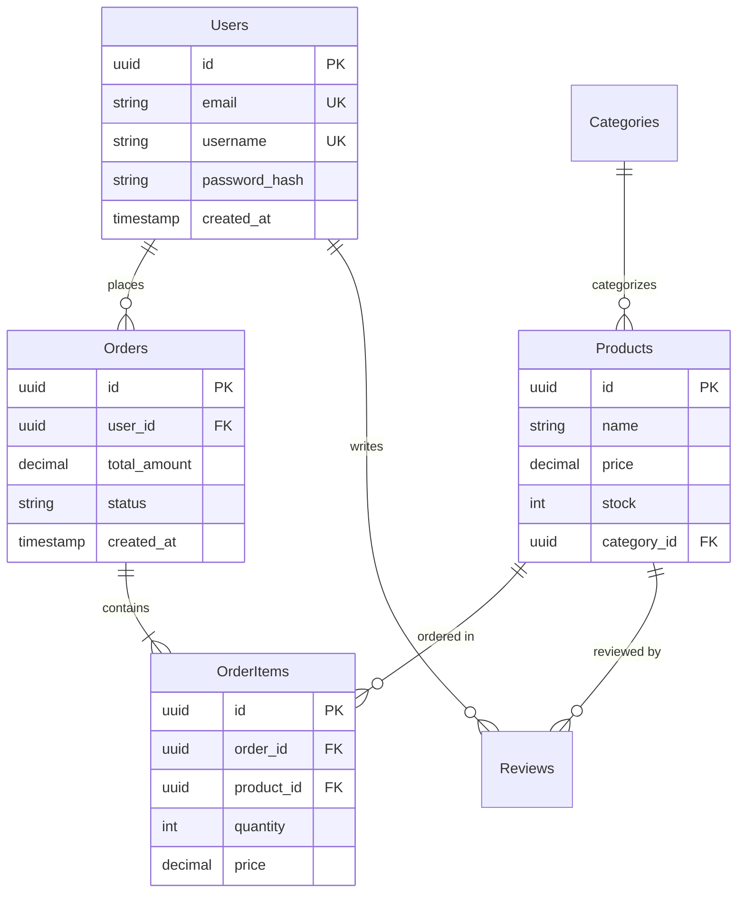

# Database schema design

Skill guide for relational and document database modeling, migrations, and documentation.

## When to use this skill

Use this workflow when:

- **New project** — Designing a database for a new application
- **Schema refactoring** — Redesigning an existing schema for performance or scalability
- **Relationship definition** — Implementing 1:1, 1:N, or N:M relationships between tables
- **Migration** — Safely applying schema changes
- **Performance issues** — Index and schema optimization for slow queries

## Input format

Collect the following from stakeholders before designing.

### Required information

| Field | Description |
| --- | --- |
| **Database type** | PostgreSQL, MySQL, MongoDB, SQLite, etc. |
| **Domain description** | What data is stored (e.g. e-commerce, blog, social) |
| **Key entities** | Core objects (e.g. User, Product, Order) |

### Optional information

| Field | Default | Description |
| --- | --- | --- |
| **Expected data volume** | Medium | Small (&lt;10K rows), Medium (10K–1M), Large (&gt;1M) |
| **Read/write ratio** | Balanced | Read-heavy, write-heavy, or balanced |
| **Transaction requirements** | ACID | Whether strict transactions are required |
| **Sharding/partitioning** | No | Whether horizontal scale-out is needed |

### Input example

```text
Design a database for an e-commerce platform:
- DB: PostgreSQL
- Entities: User, Product, Order, Review
- Relationships:
  - A User can have multiple Orders
  - An Order contains multiple Products (N:M)
  - A Review is linked to a User and a Product
- Expected data: 100,000 users, 10,000 products
- Read-heavy (frequent product lookups)
```

## Instructions

Follow these steps in order.

### Step 1: Define entities and attributes

Identify core objects and their fields.

**Tasks**

- Extract nouns from requirements → entities
- List attributes (columns) per entity
- Choose types (VARCHAR, INTEGER, TIMESTAMP, JSON, etc.)
- Choose primary keys (UUID vs auto-increment)

**Example (e-commerce)**

**Users**

- `id`: UUID PRIMARY KEY
- `email`: VARCHAR(255) UNIQUE NOT NULL
- `username`: VARCHAR(50) UNIQUE NOT NULL
- `password_hash`: VARCHAR(255) NOT NULL
- `created_at`, `updated_at`: TIMESTAMP DEFAULT NOW()

**Products**

- `id`: UUID PRIMARY KEY
- `name`: VARCHAR(255) NOT NULL
- `description`: TEXT
- `price`: DECIMAL(10, 2) NOT NULL
- `stock`: INTEGER DEFAULT 0
- `category_id`: UUID REFERENCES Categories(id)
- `created_at`: TIMESTAMP DEFAULT NOW()

**Orders**

- `id`: UUID PRIMARY KEY
- `user_id`: UUID REFERENCES Users(id)
- `total_amount`: DECIMAL(10, 2) NOT NULL
- `status`: VARCHAR(20) DEFAULT `'pending'`
- `created_at`: TIMESTAMP DEFAULT NOW()

**OrderItems (junction)**

- `id`: UUID PRIMARY KEY
- `order_id`: UUID REFERENCES Orders(id) ON DELETE CASCADE
- `product_id`: UUID REFERENCES Products(id)
- `quantity`: INTEGER NOT NULL
- `price`: DECIMAL(10, 2) NOT NULL

### Step 2: Design relationships and normalization

**Tasks**

- **1:1** — Foreign key + UNIQUE on the FK column
- **1:N** — Foreign key on the “many” side
- **N:M** — Junction table with two FKs
- Pick normalization level (typically 1NF–3NF for OLTP)

**Decision criteria**

- **OLTP** — Normalize toward 3NF (integrity)
- **OLAP / analytics** — Denormalization is acceptable (query speed)
- **Read-heavy** — Partial denormalization to cut JOINs
- **Write-heavy** — Prefer normalization to avoid update anomalies

**Example ERD (Mermaid)**



### Step 3: Establish indexing strategy

**Tasks**

- Primary keys are indexed automatically
- Index columns used often in `WHERE`
- Index foreign keys used in JOINs
- Add composite indexes when filters combine columns (order: high selectivity first)
- Use UNIQUE indexes where business rules require uniqueness

**Checklist**

- [ ] Indexes on hot query columns
- [ ] Indexes on foreign key columns
- [ ] Composite index column order matches real filters
- [ ] Avoid index sprawl (hurts writes)

**Example (PostgreSQL)**

```sql
-- Primary keys (auto-indexed)
CREATE TABLE users (
    id UUID PRIMARY KEY DEFAULT gen_random_uuid(),
    email VARCHAR(255) UNIQUE NOT NULL,  -- UNIQUE = auto-indexed
    username VARCHAR(50) UNIQUE NOT NULL,
    password_hash VARCHAR(255) NOT NULL,
    created_at TIMESTAMP DEFAULT NOW(),
    updated_at TIMESTAMP DEFAULT NOW()
);

-- Foreign keys + explicit indexes
CREATE TABLE orders (
    id UUID PRIMARY KEY DEFAULT gen_random_uuid(),
    user_id UUID NOT NULL REFERENCES users(id) ON DELETE CASCADE,
    total_amount DECIMAL(10, 2) NOT NULL,
    status VARCHAR(20) DEFAULT 'pending',
    created_at TIMESTAMP DEFAULT NOW()
);

CREATE INDEX idx_orders_user_id ON orders(user_id);
CREATE INDEX idx_orders_status ON orders(status);
CREATE INDEX idx_orders_created_at ON orders(created_at);

-- Composite index (status and created_at queried together)
CREATE INDEX idx_orders_status_created ON orders(status, created_at DESC);

-- Products table
CREATE TABLE products (
    id UUID PRIMARY KEY DEFAULT gen_random_uuid(),
    name VARCHAR(255) NOT NULL,
    description TEXT,
    price DECIMAL(10, 2) NOT NULL CHECK (price >= 0),
    stock INTEGER DEFAULT 0 CHECK (stock >= 0),
    category_id UUID REFERENCES categories(id),
    created_at TIMESTAMP DEFAULT NOW()
);

CREATE INDEX idx_products_category ON products(category_id);
CREATE INDEX idx_products_price ON products(price);  -- price range search
CREATE INDEX idx_products_name ON products(name);    -- product name search

-- Full-text search (PostgreSQL)
CREATE INDEX idx_products_name_fts ON products USING GIN(to_tsvector('english', name));
CREATE INDEX idx_products_description_fts ON products USING GIN(to_tsvector('english', description));
```

### Step 4: Set up constraints and triggers

**Tasks**

- `NOT NULL` for required fields
- `UNIQUE` for alternate keys
- `CHECK` for ranges (e.g. `price >= 0`)
- Foreign keys with explicit `ON DELETE` / `ON UPDATE` behavior
- Sensible defaults

**Example**

```sql
CREATE TABLE products (
    id UUID PRIMARY KEY DEFAULT gen_random_uuid(),
    name VARCHAR(255) NOT NULL,
    price DECIMAL(10, 2) NOT NULL CHECK (price >= 0),
    stock INTEGER DEFAULT 0 CHECK (stock >= 0),
    discount_percent INTEGER CHECK (discount_percent >= 0 AND discount_percent <= 100),
    category_id UUID REFERENCES categories(id) ON DELETE SET NULL,
    created_at TIMESTAMP DEFAULT NOW(),
    updated_at TIMESTAMP DEFAULT NOW()
);

-- Trigger: auto-update updated_at
CREATE OR REPLACE FUNCTION update_updated_at_column()
RETURNS TRIGGER AS $$
BEGIN
    NEW.updated_at = NOW();
    RETURN NEW;
END;
$$ LANGUAGE plpgsql;

CREATE TRIGGER update_products_updated_at
BEFORE UPDATE ON products
FOR EACH ROW
EXECUTE FUNCTION update_updated_at_column();
```

### Step 5: Write migration scripts

**Tasks**

- **Up** migration applies changes
- **Down** migration rolls back when possible
- Wrap in transactions where the engine supports it
- Prefer non-destructive `ALTER` patterns; validate data before narrowing types

**Example**

```sql
-- migrations/001_create_initial_schema.up.sql
BEGIN;

CREATE EXTENSION IF NOT EXISTS "uuid-ossp";

CREATE TABLE users (
    id UUID PRIMARY KEY DEFAULT gen_random_uuid(),
    email VARCHAR(255) UNIQUE NOT NULL,
    username VARCHAR(50) UNIQUE NOT NULL,
    password_hash VARCHAR(255) NOT NULL,
    created_at TIMESTAMP DEFAULT NOW(),
    updated_at TIMESTAMP DEFAULT NOW()
);

CREATE TABLE categories (
    id UUID PRIMARY KEY DEFAULT gen_random_uuid(),
    name VARCHAR(100) UNIQUE NOT NULL,
    parent_id UUID REFERENCES categories(id)
);

CREATE TABLE products (
    id UUID PRIMARY KEY DEFAULT gen_random_uuid(),
    name VARCHAR(255) NOT NULL,
    description TEXT,
    price DECIMAL(10, 2) NOT NULL CHECK (price >= 0),
    stock INTEGER DEFAULT 0 CHECK (stock >= 0),
    category_id UUID REFERENCES categories(id),
    created_at TIMESTAMP DEFAULT NOW(),
    updated_at TIMESTAMP DEFAULT NOW()
);

CREATE INDEX idx_products_category ON products(category_id);
CREATE INDEX idx_products_price ON products(price);

COMMIT;
```

```sql
-- migrations/001_create_initial_schema.down.sql
BEGIN;

DROP TABLE IF EXISTS products CASCADE;
DROP TABLE IF EXISTS categories CASCADE;
DROP TABLE IF EXISTS users CASCADE;

COMMIT;
```

## Output format

### Recommended repository layout

```text
project/
├── database/
│   ├── schema.sql                    # full schema
│   ├── migrations/
│   │   ├── 001_create_users.up.sql
│   │   ├── 001_create_users.down.sql
│   │   ├── 002_create_products.up.sql
│   │   └── 002_create_products.down.sql
│   ├── seeds/
│   │   └── sample_data.sql           # test data
│   └── docs/
│       ├── ERD.md                    # Mermaid ERD
│       └── SCHEMA.md                 # table/column reference
└── README.md
```

### Example `docs/ERD.md` body

Structure: `# Database schema` → `## Entity relationship diagram` (Mermaid block; see [Step 2](#step-2-design-relationships-and-normalization) for a fuller ERD) → `## Table descriptions` with one `###` per table.

**Table description excerpt (Markdown):**

```markdown
## Table descriptions

### users

- **Purpose**: Account records
- **Indexes**: email, username
- **Estimated rows**: 100,000

### products

- **Purpose**: Product catalog
- **Indexes**: category_id, price, name
- **Estimated rows**: 10,000
```

## Constraints and rules

### Mandatory (MUST)

| Rule | Rationale |
| --- | --- |
| **Primary key on every table** | Stable identity; supports FK integrity |
| **Explicit foreign keys** | Document relationships; use `ON DELETE CASCADE` / `SET NULL` as appropriate |
| **NOT NULL where required** | Document nullability; defaults where helpful |

### Prohibited (MUST NOT)

| Anti-pattern | Why |
| --- | --- |
| **EAV everywhere** | Explodes query complexity and hurts performance |
| **Reckless denormalization** | Update anomalies and consistency risk |
| **Secrets in plaintext** | Passwords, PANs, etc. must be hashed or encrypted |

### Security

- **Least privilege** — DB roles limited to what the app needs
- **Parameterized queries** — Avoid string-concatenated SQL
- **Encryption at rest** — Consider for strong PII where required

## Examples

### Example 1: Blog platform (PostgreSQL)

**Situation**: Medium-style blog: posts, tags, likes, bookmarks, threaded comments.

**User request**

- Users write many posts
- Posts have many tags (N:M)
- Users like and bookmark posts
- Comments with nested replies

**Schema**

```sql
-- Users
CREATE TABLE users (
    id UUID PRIMARY KEY DEFAULT gen_random_uuid(),
    email VARCHAR(255) UNIQUE NOT NULL,
    username VARCHAR(50) UNIQUE NOT NULL,
    bio TEXT,
    avatar_url VARCHAR(500),
    created_at TIMESTAMP DEFAULT NOW()
);

-- Posts
CREATE TABLE posts (
    id UUID PRIMARY KEY DEFAULT gen_random_uuid(),
    author_id UUID NOT NULL REFERENCES users(id) ON DELETE CASCADE,
    title VARCHAR(255) NOT NULL,
    slug VARCHAR(255) UNIQUE NOT NULL,
    content TEXT NOT NULL,
    published_at TIMESTAMP,
    created_at TIMESTAMP DEFAULT NOW(),
    updated_at TIMESTAMP DEFAULT NOW()
);

CREATE INDEX idx_posts_author ON posts(author_id);
CREATE INDEX idx_posts_published ON posts(published_at);
CREATE INDEX idx_posts_slug ON posts(slug);

-- Tags
CREATE TABLE tags (
    id UUID PRIMARY KEY DEFAULT gen_random_uuid(),
    name VARCHAR(50) UNIQUE NOT NULL,
    slug VARCHAR(50) UNIQUE NOT NULL
);

-- Post–tag (N:M)
CREATE TABLE post_tags (
    post_id UUID REFERENCES posts(id) ON DELETE CASCADE,
    tag_id UUID REFERENCES tags(id) ON DELETE CASCADE,
    PRIMARY KEY (post_id, tag_id)
);

CREATE INDEX idx_post_tags_post ON post_tags(post_id);
CREATE INDEX idx_post_tags_tag ON post_tags(tag_id);

-- Likes
CREATE TABLE post_likes (
    user_id UUID REFERENCES users(id) ON DELETE CASCADE,
    post_id UUID REFERENCES posts(id) ON DELETE CASCADE,
    created_at TIMESTAMP DEFAULT NOW(),
    PRIMARY KEY (user_id, post_id)
);

-- Bookmarks
CREATE TABLE post_bookmarks (
    user_id UUID REFERENCES users(id) ON DELETE CASCADE,
    post_id UUID REFERENCES posts(id) ON DELETE CASCADE,
    created_at TIMESTAMP DEFAULT NOW(),
    PRIMARY KEY (user_id, post_id)
);

-- Comments (self-reference for threads)
CREATE TABLE comments (
    id UUID PRIMARY KEY DEFAULT gen_random_uuid(),
    post_id UUID NOT NULL REFERENCES posts(id) ON DELETE CASCADE,
    author_id UUID NOT NULL REFERENCES users(id) ON DELETE CASCADE,
    parent_comment_id UUID REFERENCES comments(id) ON DELETE CASCADE,
    content TEXT NOT NULL,
    created_at TIMESTAMP DEFAULT NOW(),
    updated_at TIMESTAMP DEFAULT NOW()
);

CREATE INDEX idx_comments_post ON comments(post_id);
CREATE INDEX idx_comments_author ON comments(author_id);
CREATE INDEX idx_comments_parent ON comments(parent_comment_id);
```

### Example 2: Real-time chat (MongoDB)

**Situation**: High read volume; fast recent history per conversation.

**User request**

- Real-time chat
- Frequent reads; message history by conversation

**Document shapes**

```javascript
// users collection
{
  _id: ObjectId,
  username: String,  // indexed, unique
  email: String,     // indexed, unique
  avatar_url: String,
  status: String,    // 'online', 'offline', 'away'
  last_seen: Date,
  created_at: Date
}

// conversations collection (denormalized, read-optimized)
{
  _id: ObjectId,
  participants: [    // indexed
    {
      user_id: ObjectId,
      username: String,
      avatar_url: String
    }
  ],
  last_message: {
    content: String,
    sender_id: ObjectId,
    sent_at: Date
  },
  unread_counts: {
    "user_id_1": 5,
    "user_id_2": 0
  },
  created_at: Date,
  updated_at: Date
}

// messages collection
{
  _id: ObjectId,
  conversation_id: ObjectId,  // indexed
  sender_id: ObjectId,
  content: String,
  attachments: [
    {
      type: String,  // 'image', 'file', 'video'
      url: String,
      filename: String
    }
  ],
  read_by: [ObjectId],
  sent_at: Date,
  edited_at: Date
}
```

**Indexes**

```javascript
db.users.createIndex({ username: 1 }, { unique: true });
db.users.createIndex({ email: 1 }, { unique: true });

db.conversations.createIndex({ "participants.user_id": 1 });
db.conversations.createIndex({ updated_at: -1 });

db.messages.createIndex({ conversation_id: 1, sent_at: -1 });
db.messages.createIndex({ sender_id: 1 });
```

**Design notes**

- Embed `last_message` on conversations for fast “inbox” views
- Index hot paths: participants, `sent_at`, `conversation_id`
- Arrays for participants and read receipts

## Best practices

### Naming and lifecycle

- Use **snake_case** for SQL tables/columns (`post_tags`, `created_at`) consistently
- Prefer **plural table names**, singular column names, unless the stack standard says otherwise
- **Soft delete**: `deleted_at TIMESTAMP NULL` for recoverability and audit when deletes must be reversible
- **Timestamps**: `created_at` / `updated_at` on most mutable tables

### Performance patterns

- **Partial indexes** (PostgreSQL example):

  ```sql
  CREATE INDEX idx_posts_published ON posts(published_at) WHERE published_at IS NOT NULL;
  ```

- **Materialized views** for heavy aggregates (refresh strategy required)
- **Partitioning** large time-series or fact tables by range

### Common issues

#### Issue 1: N+1 queries

- **Symptom**: One query per row instead of one batched query
- **Cause**: Looping lookups without JOINs or batching
- **Fix**:

```sql
-- Bad: N+1
SELECT * FROM posts;
-- then for each row: SELECT * FROM users WHERE id = ?;

-- Better: one round trip
SELECT posts.*, users.username, users.avatar_url
FROM posts
JOIN users ON posts.author_id = users.id;
```

#### Issue 2: Slow JOINs (missing FK indexes)

- **Symptom**: JOINs degrade as data grows
- **Cause**: No index on the FK column
- **Fix**:

```sql
CREATE INDEX idx_orders_user_id ON orders(user_id);
CREATE INDEX idx_order_items_order_id ON order_items(order_id);
CREATE INDEX idx_order_items_product_id ON order_items(product_id);
```

#### Issue 3: Random UUID insert hotspots

- **Symptom**: Insert throughput drops with random UUID PKs
- **Cause**: Index fragmentation from random insertion order
- **Mitigations**: time-ordered UUIDs (e.g. v7 where supported), or `BIGSERIAL` / `BIGINT` identity keys

## References

### Official docs

- [PostgreSQL documentation](https://www.postgresql.org/docs/)
- [MySQL documentation](https://dev.mysql.com/doc/)
- [MongoDB schema design](https://www.mongodb.com/docs/manual/core/data-modeling-introduction/)

### Tools

- [dbdiagram.io](https://dbdiagram.io) — ERD diagrams
- [pgModeler](https://pgmodeler.io/) — PostgreSQL modeling
- [Prisma](https://www.prisma.io/) — ORM and migrations

### Further reading

- Database design courses (e.g. freeCodeCamp)
- [Use The Index, Luke](https://use-the-index-luke.com/) — SQL indexing

## Metadata

| Field | Value |
| --- | --- |
| **Version** | 1.0.0 |
| **Last updated** | 2025-01-01 |
| **Platforms** | Claude, ChatGPT, Gemini |

**Related skills**: api-design (schema + API alignment), performance-optimization (query tuning)

**Tags**: database, schema, PostgreSQL, MySQL, MongoDB, SQL, NoSQL, migration, ERD
