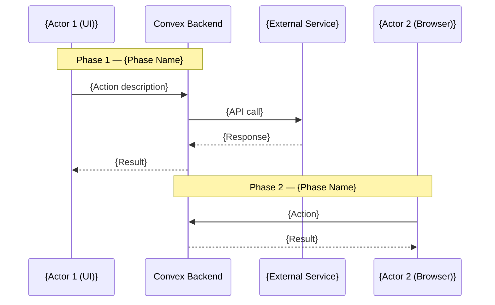
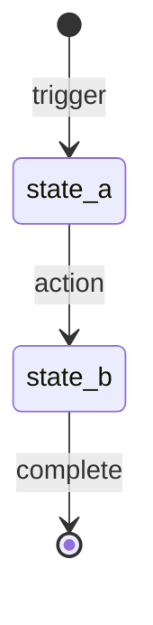

# Design Document Creation — Prompt & Template

**Purpose:** This document defines the prompt, structural template, and quality standards for creating a feature design document. The design document is the **first artifact** produced for any new feature — it serves as the single source of truth from which all phase plans are derived.

---

## When to Use

Create a design document when:

- Starting a new feature or subsystem (e.g., sys-admin flow, closer dashboards, caching layer)
- The work spans multiple phases, touches multiple files/modules, and involves non-trivial architectural decisions
- You need a reference artifact that others (or future agents) can consume to understand scope, data model, security, and decisions

Do **not** use this for:

- Single-file bug fixes or refactors
- Pure analysis documents — use the **Audit & Analysis** variant (see bottom of this document)

---

## Prompt

Use the following prompt (adapt the `{placeholders}` to your feature):

```
I need a comprehensive design specification for {FEATURE_NAME}.

**Scope:** {One-sentence description of what this feature covers end-to-end, including the starting state and the desired end state.}

**Prerequisite:** {What must already exist — completed phases, deployed schema, installed dependencies, etc. Say "None" if this is greenfield.}

**Context:**
- Read the existing codebase at {relevant directories/files} to understand the current state.
- Read {any relevant .docs/ entries, PRODUCT.md sections, or external API docs} for domain knowledge.
- {Any important constraints: "no new packages", "must work with existing auth flow", etc.}

Produce a design specification document at `plans/{feature-name}/{feature-name}-design.md` following this exact structure:

1. **Header block** — Title as `{Feature Name} — Design Specification`. Include Version (0.1 MVP), Status (Draft), Scope (1-2 sentences covering start state to end state), Prerequisite (reference prior phases if any).

2. **Table of Contents** — Numbered, with anchor links to every section. The phase sections come first, then the cross-cutting sections (Data Model, Architecture, Security, etc.).

3. **Goals & Non-Goals** — Clearly separate what this design covers (Goals as bullet points describing the end state) and what it explicitly defers (Non-Goals with target phase or version annotation).

4. **Actors & Roles** — Table of every actor who interacts with the system in this feature. Columns: Actor, Identity, Auth Method (e.g., "WorkOS AuthKit, member of tenant org"), Key Permissions. If CRM roles map to external roles (e.g., WorkOS RBAC), include a separate mapping table.

5. **End-to-End Flow Overview** — A Mermaid `sequenceDiagram` showing the happy path across all actors and systems. Annotate each phase boundary with `Note over` blocks on the diagram. Every external system (WorkOS, Calendly, etc.) gets its own participant.

6. **Phase-by-phase narrative** — One numbered section per logical phase. Each section includes:
   - Subsections (e.g., 4.1, 4.2, 4.3) covering distinct aspects of the phase.
   - Prose explanation of what happens and why — written so someone with codebase access but no prior context can understand.
   - Realistic TypeScript code examples showing actual Convex functions, SDK calls, and data flows. Every code block has a path comment: `// Path: convex/admin/tenants.ts`.
   - Mermaid diagrams where flows are complex — flowcharts for branching logic, sequence diagrams for multi-system interactions, state diagrams for status machines.
   - Tables for: field definitions, API parameters, status transitions, SDK methods, config values.
   - Decision rationale in `>` blockquote blocks explaining non-obvious choices — especially: runtime decisions (action vs. mutation, server-side vs. client-side), security tradeoffs, and "why not X" justifications.

7. **Data Model** — Full Convex `defineTable` schema definitions for every new or modified table:
   - Every field with its Convex validator type (`v.string()`, `v.optional(v.id("tenants"))`, etc.).
   - Every index with naming convention `by_<field1>_and_<field2>`.
   - Inline comments explaining non-obvious fields.
   - Status enums as `v.union(v.literal("a"), v.literal("b"), ...)`.
   - If a table is modified (not new), show only the added/changed fields with a comment: `// ... existing fields ...`.

8. **Convex Function Architecture** — A file tree showing the full `convex/` directory structure, with annotations: `# NEW`, `# MODIFIED`, `# Description — Phase N`. Group by feature directory.

9. **Routing & Authorization** (if frontend is involved) — Next.js App Router file tree (`app/` directory), role-based routing logic with code examples, and the auth gating strategy (middleware vs. client-side checks).

10. **Security Considerations** — Subsections for:
    - Credential security (where tokens/keys are stored, what never reaches the client).
    - Multi-tenant isolation (how `tenantId` scoping is enforced, where it's resolved from).
    - Role-based data access — a table with rows = data resources, columns = roles, cells = access level (Full / Read / Own only / None).
    - Webhook security (signing keys, signature verification, replay protection).
    - Rate limit awareness (relevant API limits, how the system stays within them).

11. **Error Handling & Edge Cases** — One subsection per edge case. Each includes: scenario description, detection mechanism, recovery action (retry? alert? degrade gracefully?), and user-facing behavior (error page? toast? banner?).

12. **Open Questions** — Table with columns: #, Question, Current Thinking. Capture every unresolved decision with your best-guess recommendation. Mark resolved questions with strikethrough.

13. **Dependencies** — Three tables:
    - New packages: Package, Why, Runtime, Install command.
    - Already-installed packages (no action needed): Package, Used for.
    - Environment variables: Variable, Where set (Convex env / `.env.local`), Used by.
    - Any external service configuration (e.g., "Register Calendly OAuth app").

14. **Applicable Skills** — Table of Claude Code skills to invoke during implementation. Columns: Skill, When to invoke, Phase(s).

**Formatting rules:**
- GitHub-flavored Markdown.
- Code blocks with language tags (`typescript`, `bash`, `css`, `mermaid`).
- Every code example includes a path comment: `// Path: convex/...` or `// Path: app/...`.
- Decision rationale uses `>` blockquotes.
- Tables use aligned pipes.
- The document is self-contained — a reader with codebase access but no prior conversation context can understand and implement from this document alone.
```

---

## Template Structure

```markdown
# {Feature Name} — Design Specification

**Version:** 0.1 (MVP)
**Status:** Draft
**Scope:** {Start state} → {End state}. {One-liner covering the full scope.}
**Prerequisite:** {Prior phases, deployed schema, installed deps, or "None".}

---

## Table of Contents

1. [Goals & Non-Goals](#1-goals--non-goals)
2. [Actors & Roles](#2-actors--roles)
3. [End-to-End Flow Overview](#3-end-to-end-flow-overview)
4. [Phase 1: {Name}](#4-phase-1-name)
5. [Phase 2: {Name}](#5-phase-2-name)
...
N.   [Data Model](#n-data-model)
N+1. [Convex Function Architecture](#n1-convex-function-architecture)
N+2. [Routing & Authorization](#n2-routing--authorization)
N+3. [Security Considerations](#n3-security-considerations)
N+4. [Error Handling & Edge Cases](#n4-error-handling--edge-cases)
N+5. [Open Questions](#n5-open-questions)
N+6. [Dependencies](#n6-dependencies)
N+7. [Applicable Skills](#n7-applicable-skills)

---

## 1. Goals & Non-Goals

### Goals

- {Goal 1 — describes the system's behavior after this feature ships.}
- {Goal 2 — be specific: "The customer never re-authenticates with Calendly after initial onboarding."}
- {Goal 3}

### Non-Goals (deferred)

- {Non-goal 1 (Phase 2).}
- {Non-goal 2 (separate design doc).}

---

## 2. Actors & Roles

| Actor | Identity | Auth Method | Key Permissions |
|---|---|---|---|
| **{Actor 1}** | {Who they are} | {e.g., WorkOS AuthKit, member of system admin org} | {What they can do in this feature} |
| **{Actor 2}** | {Who they are} | {e.g., WorkOS AuthKit, member of tenant org} | {What they can do} |

### CRM Role <-> External Role Mapping (if applicable)

| CRM `users.role` | External Role | Notes |
|---|---|---|
| `tenant_master` | WorkOS `owner` | {Context} |
| `closer` | WorkOS `closer` | {Context} |

---

## 3. End-to-End Flow Overview



---

## 4. Phase 1: {Phase Name}

### 4.1 {What & Why}

{Prose explanation of this phase's purpose and approach.}

> **Runtime decision:** {Rationale for choosing action vs. mutation, server-side vs. client-side, etc. Explain the alternatives considered and why this approach wins.}
>
> **Dependency:** {Any package or env var that must be available.}

### 4.2 {Implementation Detail}

```typescript
// Path: convex/{directory}/{file}.ts
"use node";  // if applicable

import { WorkOS } from "@workos-inc/node";

export const someFunction = action({
  args: { companyName: v.string(), contactEmail: v.string() },
  handler: async (ctx, { companyName, contactEmail }) => {
    // Implementation with realistic detail
  },
});
```

**SDK methods available:**

| Operation | SDK Call |
|---|---|
| {Operation name} | `sdk.method.call({ param })` |

### 4.3 {Data or Status Transitions}

```
status_a -> status_b
```

Triggered when: {description of what causes this transition.}

### 4.4 {Storage / Security Detail}

| Field | Storage | Notes |
|---|---|---|
| `accessToken` | Convex document field | Encrypted at rest. Rotated every 2h. |
| `clientSecret` | Convex environment variable | Never sent to the client. |

---

## {Continue phases 5, 6, 7... following the same subsection pattern}

---

## {N}. Data Model

### {N}.1 `{tableName}` Table

```typescript
{tableName}: defineTable({
  tenantId: v.id("tenants"),
  fieldName: v.string(),
  optionalField: v.optional(v.string()),
  status: v.union(
    v.literal("state_a"),
    v.literal("state_b"),
  ),
  referenceId: v.optional(v.id("otherTable")),
  createdAt: v.number(),  // Unix ms
})
  .index("by_tenantId", ["tenantId"])
  .index("by_tenantId_and_status", ["tenantId", "status"]),
```

### {N}.2 Modified: `tenants` Table

```typescript
tenants: defineTable({
  // ... existing fields ...

  // NEW: {Description}
  newField: v.optional(v.id("users")),
})
  // ... existing indexes ...
```

### {N}.X Status State Machine (if applicable)



---

## {N+1}. Convex Function Architecture

```
convex/
├── {feature}/                       # NEW: {Feature description}
│   ├── {file}.ts                    # {Description} — Phase {N}
│   └── {file}.ts                    # {Description} — Phase {N}
├── {existing}/                      # MODIFIED
│   └── {file}.ts                    # MODIFIED: {what changed} — Phase {N}
├── lib/
│   └── {utility}.ts                 # NEW: {Description} — Phase {N}
├── schema.ts                        # MODIFIED: new tables — Phase 1
└── crons.ts                         # MODIFIED: new cron jobs — Phase {N}
```

---

## {N+2}. Routing & Authorization

### Route Structure

```
app/
├── workspace/
│   ├── layout.tsx                   # Role detection, sidebar nav
│   ├── page.tsx                     # Role-based redirect or admin dashboard
│   ├── {admin-route}/
│   │   └── page.tsx                 # Owner/Admin only
│   └── {closer-route}/
│       ├── page.tsx                 # Closer only
│       └── {detail}/
│           └── [id]/
│               └── page.tsx         # Detail page
```

### Role-Based Routing Logic

```typescript
// Path: app/workspace/layout.tsx
const isAdmin = user.role === "tenant_master" || user.role === "tenant_admin";
const isCloser = user.role === "closer";

// Admin sees: Overview, Team, Pipeline, Settings
// Closer sees: Dashboard, My Pipeline
```

---

## {N+3}. Security Considerations

### {N+3}.1 Credential Security
- `{SECRET}` is a Convex environment variable, never sent to the browser.
- All token operations happen in Convex actions (server-side).

### {N+3}.2 Multi-Tenant Isolation
- Every query scopes by `tenantId`, resolved from the authenticated user's org — never from client input.
- The `requireTenantUser()` helper enforces this in every function.

### {N+3}.3 Role-Based Data Access

| Data | {Role 1} | {Role 2} | {Role 3} |
|---|---|---|---|
| All tenant data | Full | Full | Own only |
| User management | Full | Full | None |
| Settings | Full | Read | None |

### {N+3}.4 Webhook Security
- Per-tenant signing keys.
- HMAC-SHA256 verification on every inbound webhook.
- Replay protection via timestamp validation ({N}-minute tolerance).

### {N+3}.5 Rate Limit Awareness

| Limit | Value | Our usage |
|---|---|---|
| {API calls} | {N}/min | {How we stay within bounds} |

---

## {N+4}. Error Handling & Edge Cases

### {N+4}.1 {Scenario Name}

{What goes wrong. How we detect it. What we do about it. What the user sees.}

| Error | Cause | Action |
|---|---|---|
| `{status}` | {Why it happens} | {Recovery strategy} |

---

## {N+5}. Open Questions

| # | Question | Current Thinking |
|---|---|---|
| 1 | {Unresolved question} | {Best-guess answer or "Deferred to Phase N"} |
| ~~2~~ | ~~{Resolved question}~~ | **Resolved.** {Answer.} |

---

## {N+6}. Dependencies

### New Packages

| Package | Why | Runtime | Install |
|---|---|---|---|
| `{package}` | {Reason} | Convex actions (`"use node"`) | `pnpm add {package}` |

### Already Installed (no action needed)

| Package | Used for |
|---|---|
| `{package}` | {What it provides} |

### Environment Variables

| Variable | Where Set | Used By |
|---|---|---|
| `{VAR}` | Convex env (`npx convex env set`) | {Module or function} |
| `{NEXT_PUBLIC_VAR}` | `.env.local` | {Client component} |

---

## {N+7}. Applicable Skills

| Skill | When to Invoke | Phase |
|---|---|---|
| `workos` | WorkOS SDK usage, role assignment, membership management | Phases 1, 2 |
| `shadcn` | Building dashboard UI with shadcn components | Phases 4, 5 |
| `frontend-design` | Production-grade dashboard interfaces | Phases 4, 5 |
| `web-design-guidelines` | WCAG compliance, accessibility audit | All UI phases |

---

*This document is a living specification. Sections will be updated as implementation progresses and open questions are resolved.*
```

---

## Design Document Variants

### Backend-Heavy Features (e.g., sys-admin, pipeline processing)

Emphasize:
- Mermaid **sequence diagrams** for multi-system interactions
- **SDK method tables** (WorkOS, Calendly, etc.)
- **Token lifecycle** details (refresh strategy, mutex, cron)
- **Webhook flows** (signature verification, replay protection, raw event persistence)
- **Cron job** definitions
- Data Model section is critical — include every field, index, and validator

### Full-Stack Features (e.g., closer dashboards, admin panels)

Include both:
- Convex Function Architecture (backend) AND Routing & Authorization (frontend)
- Phase narrative covers backend queries **then** frontend pages that consume them
- Mermaid **flowcharts** for UI flows (form submission, modal interactions, navigation)
- **Navigation structure** tables (Route | Tab | Content)
- **Dashboard layout** diagrams showing component hierarchy

### Frontend-Only / Audit Features (e.g., frontend revamping, caching analysis)

Replace the standard structure with the **Audit & Analysis** format:

```markdown
# {Feature} Audit & Analysis

**Date:** {Date}
**Scope:** {What was audited}
**Approach:** {Methodology}
**Skills applied:** {List of skills used}

## Table of Contents
1. Executive Summary
2-N. {Issue-by-issue analysis sections}
N+1. Prioritised Improvement Plan

## 1. Executive Summary

| Severity | Count | Summary |
|----------|-------|---------|
| Critical | N | {One-liner} |
| High     | N | {One-liner} |
| Medium   | N | {One-liner} |

## 2. {Issue Category}

### {Specific Issue}
**Files:** `{path}` (line {N})
**Problem:** {What's wrong, with code excerpt.}
**Recommendation:** {What to do, with code example.}

## {N+1}. Prioritised Improvement Plan

### Phase 1: {Theme} (Days N-M)
| # | Task | Impact | Effort |
|---|------|--------|--------|
| 1 | **{Task name}**: {description} | {What it fixes} | Low/Medium/High |

## Appendix A: Files Referenced
| File | Section(s) |
|------|-----------|
| `{path}` | {N, M} |

## Appendix B: Skills & Guidelines Applied
| Skill | Key Findings |
|-------|-------------|
| `{skill}` | {Summary} |
```

---

## Quality Checklist

Before considering the design document complete, verify:

- [ ] Every phase has realistic TypeScript code examples (not pseudo-code)
- [ ] Every code example has a `// Path:` comment
- [ ] Every new table has full Convex schema with validators and indexes
- [ ] A Mermaid sequence diagram covers the complete happy path with phase annotations
- [ ] Goals and Non-Goals are clearly separated with phase/version annotations on non-goals
- [ ] Actors table includes auth method and permissions
- [ ] Decision rationale blocks explain non-obvious choices (runtime, security, architecture)
- [ ] Open Questions table captures every unresolved decision
- [ ] Security section covers: credentials, multi-tenant isolation, role-based access table, webhooks
- [ ] Error handling covers at minimum: auth failures, API errors, timeout/retry, duplicate processing, partial failures
- [ ] Dependencies section has three tables: new packages, already-installed, environment variables
- [ ] Applicable Skills table maps skills to phases
- [ ] A reader with codebase access but no conversation context can implement from this document alone
- [ ] The document file lives at `plans/{feature-name}/{feature-name}-design.md`
