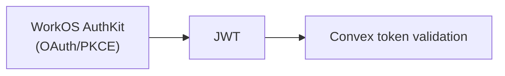
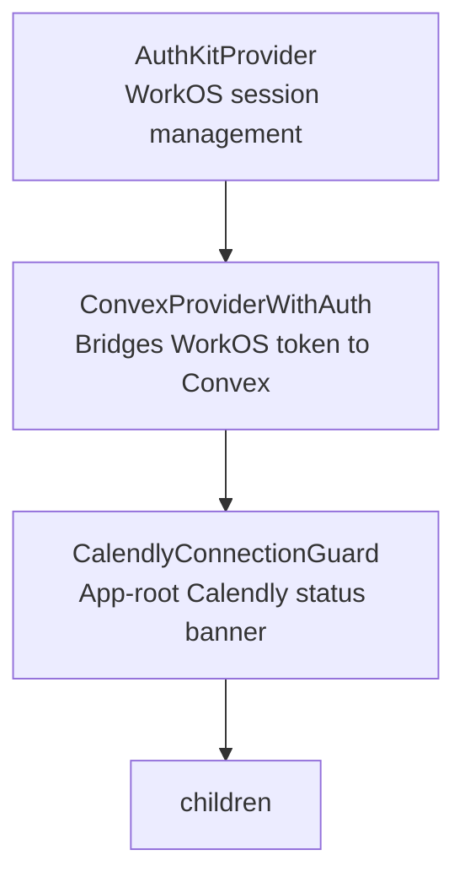
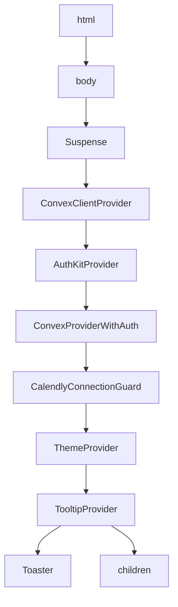
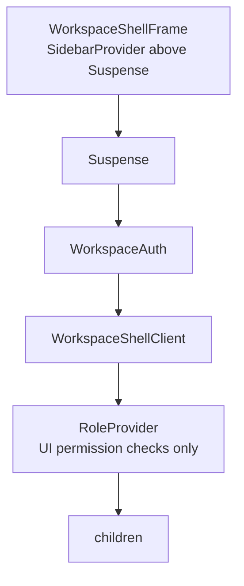
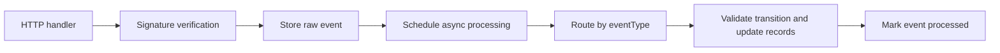

# AGENTS.md — ptdom-crm

> **This app is under heavy development with 1 test tenant on production.**
> Any significant schema or data changes require a migration strategy — use the `convex-migration-helper` skill.

# Version-Specific & Framework Guidance

## Next.js 16 (App Router)

<!-- BEGIN:nextjs-agent-rules -->

# This is NOT the Next.js you know

This version has breaking changes — APIs, conventions, and file structure may all differ from your training data. Read the relevant guide in `node_modules/next/dist/docs/` before writing any code. Heed deprecation notices.

For **Convex-specific** Next.js usage (SSR, preloading, server components), also read `.docs/convex/nextjs.md` and `.docs/convex/module-nextjs.md`.

<!-- END:nextjs-agent-rules -->

**Key patterns established in this codebase:**

| Pattern                  | Implementation                                                                     |
| ------------------------ | ---------------------------------------------------------------------------------- |
| Layouts                  | Server Components by default; auth checks happen here                              |
| Pages                    | Set `unstable_instant = false`; thin RSC wrapper around a `-page-client` component |
| Client boundaries        | `"use client"` components wrapped in `<Suspense>` for streaming                    |
| Server-side Convex calls | `fetchQuery` / `fetchMutation` / `fetchAction` from `convex/nextjs`                |
| Client-side Convex calls | `useQuery` / `useMutation` / `useAction` from `convex/react`                       |
| Preloading               | `preloadQuery` in RSC → `usePreloadedQuery` in client component                    |
| Redirects (server)       | `redirect()` from `next/navigation` in RSCs and `lib/auth.ts`                      |
| View Transitions         | Enabled globally in `next.config.ts` (`viewTransition: true`)                      |
| Component caching        | `cacheComponents: true` in `next.config.ts`                                        |
| Package optimization     | `optimizePackageImports` for `lucide-react`, `date-fns`, `recharts`                |

## Convex Backend

<!-- convex-ai-start -->

This project uses [Convex](https://convex.dev) as its backend.

When working on Convex code, **always read `convex/_generated/ai/guidelines.md` first** for important guidelines on how to correctly use Convex APIs and patterns. The file contains rules that override what you may have learned about Convex from training data.

Convex agent skills for common tasks can be installed by running `npx convex ai-files install`.

<!-- convex-ai-end -->

---

---

## Table of Contents

1. [Plans & Documentation](#plans--documentation)
2. [Codebase Standards & Architecture](#codebase-standards--architecture)
    - [Multi-Tenant Model](#multi-tenant-model)
    - [Authentication (WorkOS AuthKit)](#authentication-workos-authkit)
    - [Authorization (RBAC)](#authorization-rbac)
    - [Server Component (RSC) & Streaming Architecture](#server-component-rsc--streaming-architecture)
    - [Suspense, Skeletons & Error Isolation](#suspense-skeletons--error-isolation)
    - [Preloading Pattern (Convex + RSC)](#preloading-pattern-convex--rsc)
    - [Client-Side Role Context](#client-side-role-context)
    - [Convex Backend Standards](#convex-backend-standards)
    - [Frontend Architecture](#frontend-architecture)
    - [State Management](#state-management)
    - [Form Patterns](#form-patterns)
    - [Styling & Theming](#styling--theming)
    - [Analytics (PostHog)](#analytics-posthog)
3. [Version-Specific & Framework Guidance](#version-specific--framework-guidance)
4. [Available Skills](#available-skills-this-repository)

---

## Plans & Documentation

### Plan structure

Plans are stored in `plans/*/**.md`:

```
plans/featureset/design.md
plans/featureset/phases/phase1.md
plans/featureset/phases/phase2.md
```

Always check for an existing plan before starting new feature work.

### Local documentation (`.docs/`)

Use these indexes and mirrors before guessing paths or relying only on training data:

| Area                 | Start here                                                         | Notes                                                                                                    |
| -------------------- | ------------------------------------------------------------------ | -------------------------------------------------------------------------------------------------------- |
| **Calendly**         | `.docs/calendly/index.md`                                          | OAuth, API v2, webhooks, scopes, rate limits; indexes the local mirror under `.docs/calendly/`           |
| **Convex + Next.js** | `.docs/convex/nextjs.md`, `.docs/convex/module-nextjs.md`          | App Router overview, SSR, `convex/nextjs` (`preloadQuery`, `fetchQuery`, `fetchMutation`, `fetchAction`) |
| **PostHog**          | `.docs/posthog/nextjs-setup.md`, `.docs/posthog/posthog-convex.md` | Next.js analytics setup; `@posthog/convex` (events, flags from Convex)                                   |

---

# Codebase Standards & Architecture

This section documents the **established, stable patterns** across auth, RBAC, RSC/streaming, Convex, and testing. Follow these standards for all new work.

---

## Multi-Tenant Model

- **One WorkOS organization = one Convex tenant.** The `tenants` table stores `workosOrgId` as the linking key.
- **Data isolation**: Every data table includes a `tenantId` field. All queries filter by tenant context derived from the authenticated identity — never from a client-supplied argument.
- **Tenant lifecycle**: `pending_signup` → `pending_calendly` → `provisioning_webhooks` → `active` (also: `calendly_disconnected`, `suspended`, `invite_expired`).
- **System admin**: A single WorkOS org ID (`SYSTEM_ADMIN_ORG_ID` env var) designates the system admin tenant. This grants access to `/admin` routes, not CRM workspace routes.

---

## Authentication (WorkOS AuthKit)

**Stack**



### Frontend auth chain (`app/ConvexClientProvider.tsx`)



- `useAuthFromAuthKit()` bridges the WorkOS `useAuth()` / `useAccessToken()` hooks into Convex's `{ isLoading, isAuthenticated, fetchAccessToken }` contract.
- Session expiry is detected client-side and shows a persistent toast with a "Sign In" action.

### Server-side auth (`lib/auth.ts`)

All server-side auth helpers are in `lib/auth.ts` (imports `"server-only"`). Functions are cached per-request via React `cache()`:

| Function                 | Purpose                                                                  | Returns                                       |
| ------------------------ | ------------------------------------------------------------------------ | --------------------------------------------- |
| `verifySession()`        | Ensure a valid authenticated session; redirects to `/sign-in` if not     | `VerifiedSession` (user, accessToken, orgId)  |
| `getWorkspaceAccess()`   | Resolve full access state — discriminated union of 5 possible states     | `WorkspaceAccess` (see below)                 |
| `requireWorkspaceUser()` | Require a fully provisioned ("ready") workspace user; redirect otherwise | `{ kind: "ready", session, tenant, crmUser }` |
| `requireRole(roles[])`   | Require specific CRM roles; redirect to role-appropriate fallback        | Ready access state                            |
| `requireSystemAdmin()`   | Require system admin org; redirect to `/workspace` if not                | `VerifiedSession`                             |

**`WorkspaceAccess` discriminated union:**

| `kind`               | Meaning                                    | Redirect target       |
| -------------------- | ------------------------------------------ | --------------------- |
| `system_admin`       | User's org is the system admin org         | `/admin`              |
| `no_tenant`          | No CRM tenant exists for this org          | `/`                   |
| `pending_onboarding` | Tenant exists but not fully provisioned    | `/onboarding/connect` |
| `not_provisioned`    | Tenant active but user not in CRM          | `/`                   |
| `ready`              | Fully provisioned — includes tenant + user | _(no redirect)_       |

### Convex-side auth (`convex/requireTenantUser.ts`, `convex/requireSystemAdmin.ts`)

| Guard                                 | Use for                          | Returns                                    |
| ------------------------------------- | -------------------------------- | ------------------------------------------ |
| `requireTenantUser(ctx, roles[])`     | Any tenant-scoped query/mutation | `{ userId, tenantId, role, workosUserId }` |
| `requireSystemAdminSession(identity)` | Admin-only queries/mutations     | Throws if org mismatch                     |

**Identity resolution**: WorkOS JWT claims may use different key names (`organization_id`, `organizationId`, `org_id`). The helper `getIdentityOrgId(identity)` in `convex/lib/identity.ts` handles all variants.

**WorkOS user ID handling**: `convex/lib/workosUserId.ts` handles canonical (`issuer|rawId`) and raw ID formats for backward compatibility.

### Callback flow (`app/callback/route.ts`)

Two distinct flows:

1. **Invitation callback** (code without state) — user accepted a WorkOS invitation email; uses confidential client exchange.
2. **Standard PKCE** (code + state) — normal sign-in/sign-up flow.

---

## Authorization (RBAC)

### Roles

```
tenant_master   — Owner (highest privilege)
tenant_admin    — Admin
closer          — Individual contributor (lowest privilege)
```

Mapping between CRM roles and WorkOS RBAC slugs lives in `convex/lib/roleMapping.ts`:

- `tenant_master` ↔ `"owner"`, `tenant_admin` ↔ `"tenant-admin"`, `closer` ↔ `"closer"`

### Permission table (`convex/lib/permissions.ts`)

```
team:invite         → [tenant_master, tenant_admin]
team:remove         → [tenant_master, tenant_admin]
team:update-role    → [tenant_master]
pipeline:view-all   → [tenant_master, tenant_admin]
pipeline:view-own   → [tenant_master, tenant_admin, closer]
settings:manage     → [tenant_master, tenant_admin]
meeting:view-own    → [tenant_master, tenant_admin, closer]
meeting:manage-own  → [closer]
payment:record      → [closer]
payment:view-all    → [tenant_master, tenant_admin]
payment:view-own    → [tenant_master, tenant_admin, closer]
```

Use `hasPermission(role, permission)` to check.

### Authorization rules

| Layer         | How                                                                                   |
| ------------- | ------------------------------------------------------------------------------------- |
| **Page RSC**  | `await requireRole(["tenant_master", "tenant_admin"])` — redirects if unauthorized    |
| **Layout**    | `WorkspaceAuth` server component resolves `getWorkspaceAccess()` inside Suspense      |
| **Convex fn** | `requireTenantUser(ctx, allowedRoles)` — throws if role not in allowed list           |
| **Client UI** | `useRole().hasPermission("team:invite")` — **UI visibility only, never for security** |

**Key rules**:

- Always derive identity from `ctx.auth.getUserIdentity()` in Convex — never accept userId/role as args
- Always use `getWorkspaceAccess()` or `requireRole()` in RSCs — never trust client-sent role data
- `useRole()` is for hiding/showing UI elements only; the backend re-validates on every call

> **Phase 6 note**: Future work will make WorkOS session permissions the authoritative source (replacing CRM role lookups). See comments at the bottom of `lib/auth.ts`.

---

## Server Component (RSC) & Streaming Architecture

### Three-layer page pattern

Every workspace page follows this structure:

**Layer 1 — Page file** (`page.tsx`): Thin, static RSC wrapper

```tsx
export const unstable_instant = false;
export default function PipelinePage() {
	return <PipelinePageClient />;
}
```

**Layer 2 — Client component** (`_components/*-page-client.tsx`): Interactive boundary

```tsx
"use client";
export function PipelinePageClient() {
	// All hooks, useQuery, useState, event handlers live here
}
```

**Layer 3 — Layout** (`layout.tsx`): Auth gate + streaming shell

```tsx
export default function WorkspaceLayout({ children }) {
	return (
		<WorkspaceShellFrame>
			{" "}
			{/* Static sidebar frame — renders instantly */}
			<WebVitalsReporter /> {/* Outside Suspense — always mounted */}
			<Suspense fallback={<WorkspaceShellSkeleton />}>
				<WorkspaceAuth>
					{" "}
					{/* Async auth check — streams in */}
					{children}
				</WorkspaceAuth>
			</Suspense>
		</WorkspaceShellFrame>
	);
}
```

### Why this pattern

- **`WorkspaceShellFrame`** is a pure server component with `SidebarProvider` lifted **above** the Suspense boundary — sidebar open/close state persists during streaming.
- **`WorkspaceAuth`** is an async server component that resolves `getWorkspaceAccess()` and either redirects, shows an error screen, or renders `WorkspaceShellClient` with role/user data.
- **`unstable_instant = false`** on pages signals the PPR-ready architecture. The static shell renders before dynamic content.
- **`WebVitalsReporter`** sits outside Suspense so it captures metrics regardless of auth state.

### Provider nesting order



Inside workspace:



---

## Suspense, Skeletons & Error Isolation

### Skeleton strategy

| Level     | File                                   | Fallback for                            |
| --------- | -------------------------------------- | --------------------------------------- |
| Workspace | `workspace-shell-skeleton.tsx`         | Full shell (sidebar + header + content) |
| Route     | `app/workspace/[section]/loading.tsx`  | Individual page content area            |
| Section   | `_components/skeletons/*-skeleton.tsx` | Dashboard stats, pipeline summary, etc. |

All skeletons:

- Use the `<Skeleton />` primitive from `@/components/ui/skeleton`
- Match dimensions of real content to prevent CLS
- Include `role="status"` and `aria-label` for accessibility

### Error isolation (`SectionErrorBoundary`)

Each independent section is wrapped with `<SectionErrorBoundary sectionName="...">`:

```tsx
<SectionErrorBoundary sectionName="Pipeline Summary">
	<Suspense fallback={<PipelineSummarySkeleton />}>
		<PipelineSection token={token} tenantId={tenantId} />
	</Suspense>
</SectionErrorBoundary>
```

- Class component using `getDerivedStateFromError()`
- Shows a subtle `<Alert>` with the section name and error — rest of the page stays functional
- Route-level error boundary in `app/workspace/error.tsx` catches anything that escapes section boundaries

---

## Preloading Pattern (Convex + RSC)

For dashboard sections that need server-side data prefetch:

**Server component** (async RSC):

```tsx
async function StatsSection({ token, tenantId }) {
	const preloaded = await preloadQuery(
		api.dashboard.adminStats.getAdminDashboardStats,
		{ tenantId },
		{ token },
	);
	return <StatsRowClient preloadedStats={preloaded} />;
}
```

**Client component**:

```tsx
"use client";
function StatsRowClient({ preloadedStats }) {
	const stats = usePreloadedQuery(preloadedStats);
	// Render with real-time reactive data from the preloaded seed
}
```

**When to use**: Dashboard sections, "hero" data that should be visible on first paint. Import `preloadQuery` from `convex/nextjs` and `usePreloadedQuery` from `convex/react`.

---

## Client-Side Role Context

`RoleProvider` and `useRole()` — expose the current user's CRM role for **UI visibility only**.

- Wraps workspace content from inside `WorkspaceShellClient`
- `useRole()` returns `{ isAdmin, role, hasPermission(p) }`
- Use for conditional navigation items, button visibility, section toggling
- **Never** use for access control — always re-validate server-side in Convex functions

---

## Convex Backend Standards

### File organization

```
convex/
├── admin/           # System admin queries/mutations
├── calendly/        # OAuth, tokens, org member sync, health checks
├── closer/          # Closer-specific views (dashboard, pipeline, meetings)
├── pipeline/        # Webhook event processing, state transitions
├── webhooks/        # Webhook ingestion, signature verification
├── onboarding/      # Tenant onboarding (invite redemption)
├── users/           # User queries and mutations
├── workos/          # WorkOS user sync, role assignment, invitation flow
├── lib/             # Shared utilities:
│   ├── permissions.ts         # RBAC permission table
│   ├── roleMapping.ts         # CRM ↔ WorkOS role mapping
│   ├── identity.ts            # JWT claim extraction
│   ├── workosUserId.ts        # Canonical ID handling
│   ├── validation.ts          # Input validation helpers
│   ├── statusTransitions.ts   # State machine for opportunity/meeting status
│   ├── opportunityMeetingRefs.ts  # Denormalized ref updater
│   ├── inviteToken.ts         # HMAC-SHA256 invite token signing
│   └── constants.ts           # Shared constants (system admin org, etc.)
├── requireTenantUser.ts       # Tenant auth guard
├── requireSystemAdmin.ts      # System admin auth guard
├── schema.ts                  # Single source of truth for all tables
├── auth.config.ts             # JWT provider configuration (WorkOS)
├── auth.ts                    # AuthKit component initialization
├── crons.ts                   # Scheduled jobs (token refresh, health checks)
└── http.ts                    # HTTP router (webhooks, AuthKit routes)
```

### Schema patterns (`convex/schema.ts`)

- **Multi-tenant isolation**: Every data table includes `tenantId: v.id("tenants")`
- **Denormalized fields**: `opportunities.latestMeetingId/At` and `nextMeetingId/At` avoid expensive joins. Updated via `updateOpportunityMeetingRefs()` helper.
- **Union types for status**: Use `v.union(v.literal("scheduled"), v.literal("completed"), ...)` — never plain strings
- **Comprehensive indexing**: Every frequently-queried field combination has an index. Name indexes after their fields: `by_tenantId_and_status`, `by_workosUserId`
- **No unbounded arrays**: Use separate tables with foreign keys instead of growing arrays inside documents

### Function patterns

```ts
// ✅ Correct: Always validate, always use indexed queries, always bound results
export const getOpportunities = query({
	args: { statusFilter: v.optional(v.string()) },
	handler: async (ctx, args) => {
		const { tenantId, role } = await requireTenantUser(ctx, [
			"tenant_master",
			"tenant_admin",
		]);
		return ctx.db
			.query("opportunities")
			.withIndex("by_tenantId_and_status", (q) =>
				q.eq("tenantId", tenantId),
			)
			.take(50);
	},
});
```

**Rules**:

- Always include `args` validators, even for internal functions
- Use `internalQuery`/`internalMutation`/`internalAction` for server-only logic
- Use indexed queries (`withIndex`) — never `.filter()`
- Always return bounded results (`.take(n)`, `.first()`, `.unique()`, or `.paginate()`)
- Never use `.collect()` without a clear bound; never `.collect().length` for counting
- Actions that need Node.js builtins: add `"use node"` at file top; never mix with queries/mutations in the same file
- For bulk operations exceeding transaction limits: batch with `.take(n)` and `ctx.scheduler.runAfter(0, ...)` to continue

### Webhook processing pattern



1. `convex/webhooks/calendly.ts` — HMAC-SHA256 signature verification (timing-safe)
2. Raw event stored in `rawWebhookEvents` table
3. `ctx.scheduler.runAfter(0, internal.pipeline.processor.processRawEvent, { rawEventId })` for async dispatch
4. Processor routes to feature-specific handler based on `eventType`
5. Handler validates state transition → creates/updates records → updates denormalized refs → marks event processed

### Logging standard

Structured logs with domain tags at key decision points:

```ts
console.log(
	"[Pipeline] inviteeCreated | leadId=%s meetingId=%s",
	lead._id,
	meeting._id,
);
console.error("[Auth] requireTenantUser failed: org mismatch", {
	tenantOrgId,
	expectedOrgId,
});
```

Tags: `[Auth]`, `[Pipeline]`, `[Calendly:OAuth]`, `[Closer:Dashboard]`, `[Admin]`, etc.

### Cron jobs (`convex/crons.ts`)

```ts
crons.interval(
	"refresh-calendly-tokens",
	{ minutes: 90 },
	internal.calendly.tokens.refreshAllTokens,
	{},
);
crons.interval(
	"calendly-health-check",
	{ hours: 24 },
	internal.calendly.healthCheck.runHealthCheck,
	{},
);
crons.interval(
	"sync-calendly-org-members",
	{ hours: 24 },
	internal.calendly.orgMembers.syncAllTenants,
	{},
);
```

Always use `crons.interval()` or `crons.cron()` — never the deprecated `.hourly`/`.daily`/`.weekly` helpers.

---

## Frontend Architecture

### Route structure

```
app/
├── layout.tsx              # Root: providers, fonts, theme
├── page.tsx                # Landing: auth routing logic
├── sign-in/                # Public auth pages
├── sign-up/
├── callback/route.ts       # OAuth callback handler (invitation + PKCE flows)
├── admin/                  # System admin panel (org-gated)
├── onboarding/             # Tenant setup flow
├── api/                    # API routes (Calendly OAuth, etc.)
└── workspace/
    ├── layout.tsx           # Auth gate + streaming shell
    ├── loading.tsx          # Workspace-level skeleton
    ├── error.tsx            # Workspace-level error boundary
    ├── page.tsx             # Admin dashboard
    ├── pipeline/            # Admin pipeline management
    ├── team/                # Team member management
    ├── settings/            # Tenant settings
    ├── profile/             # User profile
    └── closer/              # Closer-specific routes
        ├── page.tsx         # Closer dashboard
        ├── pipeline/        # Closer pipeline view
        └── meetings/[id]    # Individual meeting detail
```

### Component organization

```
components/
├── ui/                     # shadcn/ui primitives (56+ components)
│   ├── button.tsx
│   ├── dialog.tsx
│   ├── field.tsx           # Compound form layout (Field + FieldGroup + FieldLabel)
│   ├── sidebar.tsx         # Navigation shell
│   └── skeleton.tsx        # Loading primitive
├── auth/
│   └── role-context.tsx    # RoleProvider + useRole()
├── theme-provider.tsx      # next-themes wrapper
├── command-palette.tsx     # Global Cmd+K overlay (dynamic import, no SSR)
├── notification-center.tsx # Real-time notifications
└── theme-toggle.tsx        # Light/dark mode toggle

app/workspace/_components/  # Workspace-specific components
├── workspace-shell.tsx
├── workspace-shell-client.tsx
├── workspace-shell-frame.tsx
├── workspace-shell-skeleton.tsx
├── workspace-auth.tsx      # Async RSC auth gate
├── section-error-boundary.tsx
├── web-vitals-reporter.tsx
├── skeletons/              # Section-level skeletons
└── *-page-client.tsx       # Page content (client components)
```

**File naming conventions**:

- `*-page-client.tsx` — page content wrapper (client component)
- `*-skeleton.tsx` — loading state skeleton
- `*-dialog.tsx`, `*-sheet.tsx` — modal/drawer components
- `_components/` — page-internal components (Next.js convention, not routable)

### Custom hooks

| Hook                  | Purpose                                                  | Location           |
| --------------------- | -------------------------------------------------------- | ------------------ |
| `usePageTitle`        | Set document title + restore on unmount                  | `hooks/`           |
| `useKeyboardShortcut` | Register global Cmd+1-4 navigation shortcuts             | `hooks/`           |
| `usePollingQuery`     | One-shot Convex fetch with optional polling interval     | `hooks/`           |
| `useBreadcrumbs`      | Derive breadcrumbs from pathname                         | `hooks/`           |
| `useTableSort`        | Client-side table sorting (asc/desc/null cycle)          | `hooks/`           |
| `usePostHogIdentify`  | Identify user in PostHog with org context                | `hooks/`           |
| `useRole`             | Access current user's role + `hasPermission()` (UI only) | `components/auth/` |
| `useMobile`           | Detect mobile viewport via media query                   | `hooks/`           |

### Dynamic imports

Non-critical components use `next/dynamic` to reduce initial bundle:

```tsx
const CommandPalette = dynamic(() => import("@/components/command-palette"), {
	ssr: false,
});
```

Use `ssr: false` for components that depend on browser APIs (e.g., keyboard events, local storage).

---

## State Management

**No external state library** (no Zustand, Redux, Jotai). All state is managed through:

| Layer                       | Tool                                      | Use case                                              |
| --------------------------- | ----------------------------------------- | ----------------------------------------------------- |
| **Server data (real-time)** | `useQuery(api.*)` from Convex             | Primary data — auto-updates on server changes         |
| **Server data (one-shot)**  | `usePollingQuery()` custom hook           | Dashboard stats with optional 60s polling interval    |
| **Preloaded server data**   | `usePreloadedQuery()` from Convex         | SSR-preloaded data that becomes reactive on hydration |
| **Server actions**          | `useAction(api.*)` / `useMutation(api.*)` | Write operations                                      |
| **Global context**          | `RoleProvider`, `ThemeProvider`           | User role, dark mode preference                       |
| **Local component state**   | `useState()`                              | Form inputs, modals, filters, loading flags           |

---

## Form Patterns

Forms use **React Hook Form + Zod** for state management and validation. All workspace form dialogs have been migrated to this pattern.

### Stack

| Library               | Version | Import                                                                         | Purpose                                     |
| --------------------- | ------- | ------------------------------------------------------------------------------ | ------------------------------------------- |
| `react-hook-form`     | ^7.x    | `import { useForm } from "react-hook-form"`                                    | Form state, submission, field registration  |
| `zod`                 | ^4.x    | `import { z } from "zod"`                                                      | Schema validation, type inference           |
| `@hookform/resolvers` | ^5.x    | `import { standardSchemaResolver } from "@hookform/resolvers/standard-schema"` | Bridges RHF + Zod via Standard Schema       |
| shadcn `form`         | —       | `import { Form, FormField, ... } from "@/components/ui/form"`                  | Styled form primitives with RHF integration |

> **Important:** Use `standardSchemaResolver` (not `zodResolver`) with native Zod v4. Zod v4 implements the [Standard Schema](https://standardschema.dev) spec, and `standardSchemaResolver` works via that interface. The `zodResolver` from `@hookform/resolvers/zod` has type overloads that only match `zod/v3` compat or `zod/v4/core` — not the main `"zod"` export. Do **not** use `import { z } from "zod/v3"` (the backward-compat shim) — always use `import { z } from "zod"`.

### Standard form dialog pattern

```tsx
import { useForm } from "react-hook-form";
import { standardSchemaResolver } from "@hookform/resolvers/standard-schema";
import { z } from "zod";
import {
	Form,
	FormField,
	FormItem,
	FormLabel,
	FormControl,
	FormMessage,
} from "@/components/ui/form";

// 1. Define Zod schema (co-located in the dialog file)
const mySchema = z.object({
	email: z.string().min(1, "Email is required").email("Invalid email"),
	role: z.enum(["closer", "tenant_admin"]),
});
type MyFormValues = z.infer<typeof mySchema>;

// 2. Initialize useForm — do NOT pass explicit generic, let the resolver infer types
const form = useForm({
	resolver: standardSchemaResolver(mySchema),
	defaultValues: { email: "", role: undefined },
});

// 3. Wrap JSX in <Form> and use <FormField> for each field
<Form {...form}>
	<form onSubmit={form.handleSubmit(onSubmit)}>
		<FormField
			control={form.control}
			name="email"
			render={({ field }) => (
				<FormItem>
					<FormLabel>
						Email <span className="text-destructive">*</span>
					</FormLabel>
					<FormControl>
						<Input {...field} disabled={isSubmitting} />
					</FormControl>
					<FormMessage /> {/* Inline error from Zod */}
				</FormItem>
			)}
		/>
	</form>
</Form>;
```

### Key patterns

- **State reduction**: Replace per-field `useState` hooks with a single `useForm` hook. Keep only UI state (`open`, `isSubmitting`, `submitError`) as `useState`.
- **Inline errors**: `<FormMessage />` reads field error state from RHF and renders it below the field. No manual error checking in submit handlers.
- **Submission-level errors**: Network/Convex failures display in `<Alert variant="destructive">` or `toast.error()` — separate from validation errors.
- **Conditional validation**: Use `.superRefine()` with `ctx.addIssue({ path: ["fieldName"] })` to target errors to specific fields based on cross-field logic.
- **Watched fields**: `form.watch("fieldName")` subscribes to a field for conditional rendering (e.g., show Calendly field only when `role === "closer"`).
- **Externally controlled dialogs**: Use `useEffect` to reset form state when `open` prop changes (e.g., Role Edit Dialog).
- **File inputs**: Destructure `{ value, onChange, ...fieldProps }` — file inputs can't have values set programmatically; pass `onChange` manually.
- **Form layout**: `<FieldGroup>` from `components/ui/field.tsx` is still used as a CSS-only layout wrapper inside `<Form>` — it has no form logic.
- **Schema co-location**: Zod schemas are defined in the same file as the dialog component (not in a shared lib).

### Migrated dialogs

| Dialog       | File                                                                | Pattern                                               |
| ------------ | ------------------------------------------------------------------- | ----------------------------------------------------- |
| Payment Form | `app/workspace/closer/meetings/_components/payment-form-dialog.tsx` | File upload + `.refine()`                             |
| Invite User  | `app/workspace/team/_components/invite-user-dialog.tsx`             | Conditional validation (`.superRefine()`) + `watch()` |
| Mark Lost    | `app/workspace/closer/meetings/_components/mark-lost-dialog.tsx`    | Simple optional field in `AlertDialog`                |
| Role Edit    | `app/workspace/team/_components/role-edit-dialog.tsx`               | Externally controlled + `useEffect` reset             |
| Follow-Up    | `app/workspace/closer/meetings/_components/follow-up-dialog.tsx`    | **Not migrated** — state-machine UI, no form fields   |

---

## Styling & Theming

| Aspect          | Tool                                                            |
| --------------- | --------------------------------------------------------------- |
| **Framework**   | Tailwind CSS 4 with `@tailwindcss/postcss` plugin               |
| **Color space** | OKLCH (perceptually uniform) — 70+ CSS custom properties        |
| **Components**  | shadcn/ui with `radix-nova` style preset, `mist` base color     |
| **Icons**       | `lucide-react` exclusively                                      |
| **Dark mode**   | `next-themes` with `theme-preference` storage key               |
| **Animations**  | `tw-animate-css` + View Transition API (enabled in next.config) |
| **Class utils** | `cn()` = `clsx` + `tailwind-merge` for conflict resolution      |
| **Variants**    | Class Variance Authority (`cva`) for component variant props    |

**CSS import order** (`app/globals.css`):

```css
@import "tailwindcss";
@import "tw-animate-css";
@import "shadcn/tailwind.css";
```

**shadcn/ui config** (`components.json`): Style `radix-nova`, RSC enabled, icon library `lucide`.

---

## Analytics (PostHog)

- **Client-side**: `posthog-js` — loaded via proxy rewrites (`/ingest/*` → PostHog servers) to avoid ad blockers
- **Server-side**: `posthog-node` for server-sent events
- **Web Vitals**: `WebVitalsReporter` component reports FCP, LCP, CLS, INP, TTFB to PostHog
- **User identification**: `usePostHogIdentify()` hook links PostHog anonymous ID to authenticated user + org context
- **Event tracking**: `posthog.capture("event_name", { properties })` at key user actions (invitations, role changes, etc.)

---

## Testing

This project relies on **manual QA testing**. See `TESTING.MD` for the end-to-end workflow: seeding test data via the Convex CLI test helpers (`testing/calendly:bookTestInvitee`), validating backend records through `npx convex data` and `npx convex logs`, then signing in as the appropriate test user to verify UI behavior in the browser.

---

## Available Skills (This Repository)

Repo-local skills live under **`.agents/skills/<skill-name>/SKILL.md`**. When a task matches a skill's purpose, read that file and follow it (in Cursor, use the Read tool; in Claude Code, use the Skill tool when available).

### Code Quality & Performance

| Skill                        | When to Invoke                                                                               | Key Trigger Words                                                                 |
| ---------------------------- | -------------------------------------------------------------------------------------------- | --------------------------------------------------------------------------------- |
| **convex-performance-audit** | Audit and optimize Convex performance — high read/write costs, function limits, sub overhead | "slow", "expensive", "performance audit", "high bytes", "npx convex insights"     |
| **web-design-guidelines**    | Review UI code for accessibility (WCAG), UX standards, design consistency                    | "review UI", "check accessibility", "audit design", "review UX", "best practices" |

### Frontend Development

| Skill                             | When to Invoke                                              | Key Trigger Words                                                                    |
| --------------------------------- | ----------------------------------------------------------- | ------------------------------------------------------------------------------------ |
| **frontend-design**               | Create production-grade frontend interfaces and components  | "build a component", "create a page", "design interface", "make it look good"        |
| **shadcn**                        | Manage shadcn/ui components, styling, and composition       | "add shadcn component", "fix component", "style component", "shadcn/ui"              |
| **vercel-react-best-practices**   | Apply React/Next.js performance optimization patterns       | "optimize React", "improve performance", "refactor component", "Next.js performance" |
| **vercel-react-view-transitions** | Implement smooth animations using React View Transition API | "add page transitions", "smooth animations", "view transitions", "page animation"    |
| **vercel-composition-patterns**   | Design scalable React composition patterns                  | "refactor component", "too many props", "compound components", "render props"        |
| **workos-widgets**                | Build and integrate WorkOS Widgets                          | "add WorkOS Widget", "User Management", "User Profile", "Admin Portal"               |

### Backend Development (Convex)

| Skill                       | When to Invoke                                                            | Key Trigger Words                                                               |
| --------------------------- | ------------------------------------------------------------------------- | ------------------------------------------------------------------------------- |
| **convex-quickstart**       | Initialize Convex project or add Convex to existing app                   | "new Convex project", "add Convex", "convex init", "setup Convex"               |
| **convex-setup-auth**       | Setup Convex authentication with user management                          | "add login", "setup auth", "Convex Auth", "Clerk", "Auth0", "WorkOS AuthKit"    |
| **convex-workos-auth**      | WorkOS AuthKit events/actions and auth sync in Convex                     | "@convex-dev/workos-authkit", "AuthKit webhooks", "sync WorkOS users to Convex" |
| **convex-migration-helper** | Plan and execute Convex schema and data migrations (widen-migrate-narrow) | "schema migration", "deployment fails", "widen-migrate-narrow", "backfill data" |
| **convex-create-component** | Design and build isolated Convex components                               | "create Convex component", "extract backend logic", "component with boundaries" |

### Third-party Integrations

| Skill      | When to Invoke                                          | Key Trigger Words                                                                 |
| ---------- | ------------------------------------------------------- | --------------------------------------------------------------------------------- |
| **workos** | Implement or debug WorkOS (auth, SSO, SAML, SCIM, RBAC) | "WorkOS", "SSO", "SAML", "Directory Sync", "organization", "roles", "permissions" |

---

## Quick Reference: Key Files

| File / Directory                                | Purpose                                                                   |
| ----------------------------------------------- | ------------------------------------------------------------------------- |
| `lib/auth.ts`                                   | Server-side auth helpers (verifySession, getWorkspaceAccess, requireRole) |
| `convex/requireTenantUser.ts`                   | Convex tenant auth guard                                                  |
| `convex/requireSystemAdmin.ts`                  | Convex system admin guard                                                 |
| `convex/lib/permissions.ts`                     | RBAC permission table                                                     |
| `convex/lib/roleMapping.ts`                     | CRM ↔ WorkOS role mapping                                                 |
| `convex/lib/statusTransitions.ts`               | State machine for opportunity/meeting status                              |
| `convex/schema.ts`                              | Single source of truth for all tables and indexes                         |
| `convex/_generated/ai/guidelines.md`            | Convex coding guidelines (read before any Convex work)                    |
| `app/ConvexClientProvider.tsx`                  | Root provider chain (AuthKit + Convex + CalendlyGuard)                    |
| `app/workspace/layout.tsx`                      | Workspace streaming shell + auth gate                                     |
| `app/workspace/_components/workspace-auth.tsx`  | Async RSC that resolves workspace access                                  |
| `components/auth/role-context.tsx`              | RoleProvider + useRole() hook                                             |
| `components/ui/field.tsx`                       | Compound form layout components                                           |
| `next.config.ts`                                | View Transitions, cacheComponents, package optimization                   |
| `TESTING.MD`                                    | Manual QA workflow: test data seeding, CLI validation, UI verification    |
| `.agents/skills/*/SKILL.md`                     | Repo-local AI agent skills                                                |
