# Multi-Tenant Calendly-Driven Sales CRM — Product Specification

**Version:** 0.1 (MVP)
**Status:** Draft
**Audience:** Engineering, Product, and Stakeholders

---

## Table of Contents

1. [Executive Summary](#1-executive-summary)
2. [System Architecture Overview](#2-system-architecture-overview)
3. [Technology Stack](#3-technology-stack)
4. [Multi-Tenancy Model](#4-multi-tenancy-model)
5. [Authentication & User Roles](#5-authentication--user-roles)
6. [Calendly Integration Strategy](#6-calendly-integration-strategy)
7. [Event-Driven Data Pipeline](#7-event-driven-data-pipeline)
8. [Core Domain Entities](#8-core-domain-entities)
9. [Sales Pipeline Workflow](#9-sales-pipeline-workflow)
10. [Closer Experience — UI & UX Flows](#10-closer-experience--ui--ux-flows)
11. [Admin Panel](#11-admin-panel)
12. [Tenant Onboarding Flow](#12-tenant-onboarding-flow)
13. [Webhook Event Handling](#13-webhook-event-handling)
14. [Round Robin Assignment](#14-round-robin-assignment)
15. [MVP Scope & Phasing](#15-mvp-scope--phasing)
16. [Open Questions & Future Considerations](#16-open-questions--future-considerations)

---

## 1. Executive Summary

This document describes the architecture, data flows, and product requirements for a **multi-tenant, event-driven Sales CRM** built on top of Calendly as its primary data ingestion source.

The system is designed to serve organizations (tenants) that rely on Calendly-scheduled meetings as their primary sales motion. Each tenant operates in full data isolation. The CRM captures inbound meeting data via webhooks, creates and tracks leads and opportunities through a structured sales pipeline, and provides operational dashboards for the people running those sales calls — referred to throughout as **Closers**.

The platform is **self-serve at the tenant level**: system administrators generate a unique registration link per tenant. Once registered, tenants connect their Calendly workspace, and the system provisions all necessary webhook subscriptions automatically via the Calendly API.

The MVP focuses on the **Closer's operational workflow**: calendar visibility, meeting execution, payment capture, and outcome logging.

---

## 2. System Architecture Overview

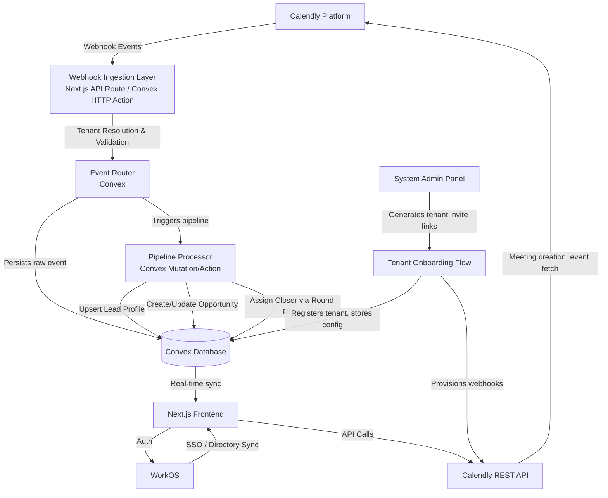

---

## 3. Technology Stack

| Layer | Technology | Role |
|---|---|---|
| **Frontend** | Next.js (App Router) | UI, SSR, API routes for lightweight server logic |
| **Backend / Database** | Convex | Real-time reactive database, business logic (mutations, actions, queries) |
| **Authentication** | WorkOS | SSO, multi-tenancy auth, organization management, directory sync |
| **Webhook Source** | Calendly | Primary data source for all meeting/event data |
| **External Calendaring** | Calendly REST API | Webhook provisioning, event fetching, meeting scheduling |
| **Payments** | External providers (Stripe, PayPal, etc.) | Payment links managed per calendar/event-type configuration |
| **Video Conferencing** | Zoom (via Calendly) | Meeting execution |

---

## 4. Multi-Tenancy Model

Each **Tenant** represents a single business or organization subscribing to the CRM. Tenants are fully isolated at the data layer.

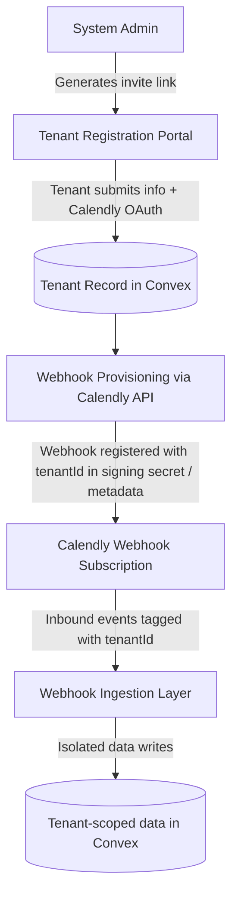

### Tenant Isolation Strategy

- Every Convex document that belongs to a tenant carries a `tenantId` field.
- All queries, mutations, and actions enforce `tenantId` scoping — no cross-tenant data access is possible at the application layer.
- WorkOS Organizations map 1:1 to Tenants; users are always resolved within their organization context.
- Calendly webhook subscriptions are provisioned per-tenant using the tenant's OAuth token, and the `tenantId` is embedded into the webhook subscription's signing metadata (or a dedicated endpoint path `/webhooks/calendly/{tenantId}`) to allow correct routing on receipt.

---

## 5. Authentication & User Roles

Authentication is handled exclusively through **WorkOS**, leveraging its AuthKit UI and organization-based access control.

### User Roles

| Role | Description | Key Permissions |
|---|---|---|
| **Tenant Master** | Primary point of contact or business owner for a tenant | Full access to all tenant data, pipeline, reporting, settings, and billing |
| **Tenant Admin** | Operational administrator within a tenant | Reporting, pipeline monitoring, user management, calendar configuration |
| **Closer** | Frontline sales operator | Own pipeline view, calendar, meeting execution, outcome logging |

### Role Resolution Flow

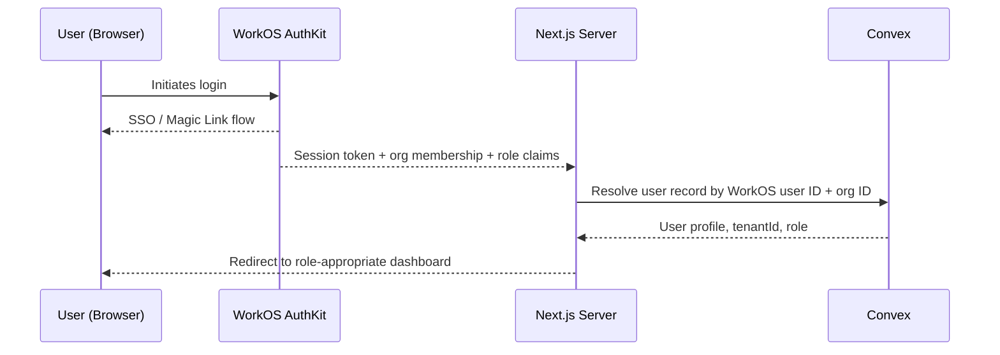

---

## 6. Calendly Integration Strategy

Calendly serves as the **sole inbound data source**. The CRM does not own scheduling — it consumes and enriches Calendly's data.

### 6.1 OAuth & Webhook Provisioning

When a tenant onboards:

1. The tenant completes a Calendly OAuth flow, granting the CRM access to their Calendly organization.
2. The CRM backend uses the obtained access token to call the Calendly API and register one or more webhook subscriptions for that tenant.
3. Webhook subscriptions are scoped to the tenant's Calendly organization and configured to fire on relevant event types.

### 6.2 Calendly App (OAuth App) Multi-Tenancy

The CRM is registered as a **single Calendly OAuth App**. Each tenant authorizes this app independently, producing a unique access token per tenant. This is the standard Calendly multi-tenant integration model. Token refresh and storage are handled securely in Convex, encrypted at rest.

### 6.3 Webhook Event Types Subscribed

| Event | Trigger | CRM Action |
|---|---|---|
| `invitee.created` | Lead books a meeting | Create/update Lead, create Opportunity, assign Closer |
| `invitee.canceled` | Meeting is canceled by lead or host | Update Opportunity status to Canceled, trigger follow-up prompt |
| `invitee_no_show` | Host marks invitee as no-show | Update Opportunity status, flag for follow-up |
| `routing_form_submission` | Routing form submitted | Enrich lead profile with pre-meeting qualification data |

### 6.4 Calendly API Supplemental Calls

When a webhook payload lacks necessary detail (e.g., invitee answers, event type metadata, assigned host), the CRM will issue supplemental GET requests to the Calendly API to fetch:

- Full invitee details (`/invitees/{uuid}`)
- Event details (`/scheduled_events/{uuid}`)
- Event type configuration (`/event_types/{uuid}`)
- Organization memberships (for round robin resolution)

---

## 7. Event-Driven Data Pipeline

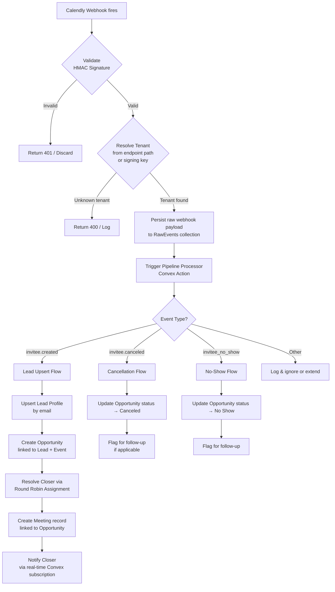

---

## 8. Core Domain Entities

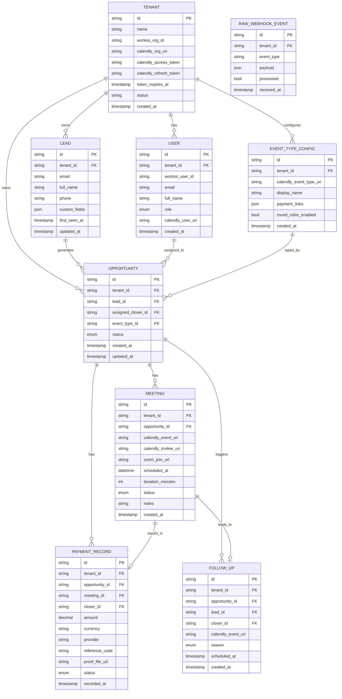

### Opportunity Status State Machine

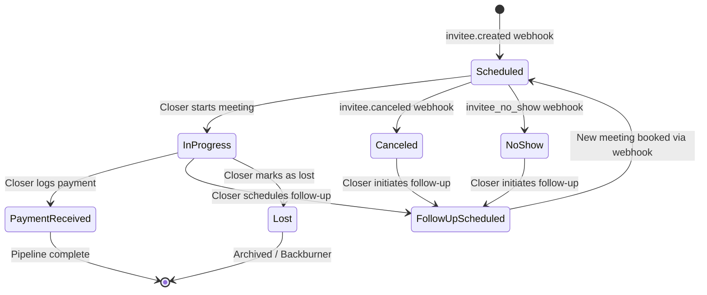

---

## 9. Sales Pipeline Workflow

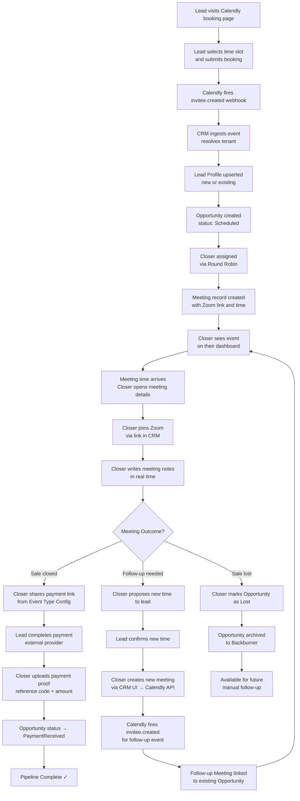

---

## 10. Closer Experience — UI & UX Flows

### 10.1 Dashboard Layout

Upon login, the Closer lands on their personal pipeline dashboard. The layout is structured as follows:

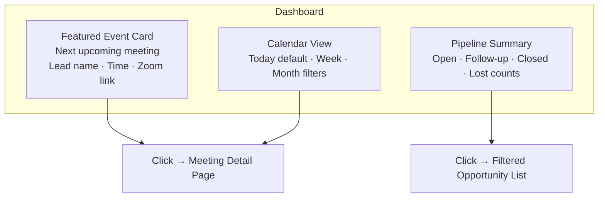

### 10.2 Meeting Detail Page

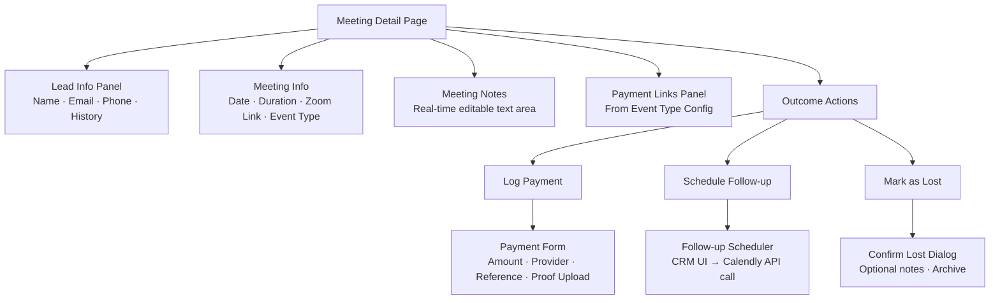

### 10.3 Follow-Up Meeting Scheduling Flow

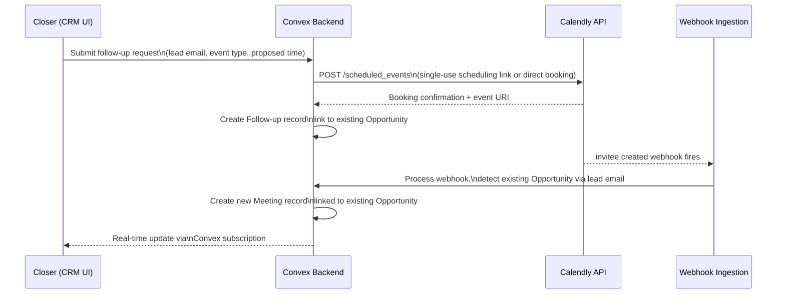

---

## 11. Admin Panel

The Admin Panel is accessible to **System Admins** (internal team) and provides cross-tenant visibility.

### 11.1 System Admin Capabilities

- **Tenant Management**: View all tenants, their status (active, onboarding, suspended), and key metrics.
- **Invite Link Generation**: Generate unique, time-limited registration URLs for new tenants.
- **Webhook Health Monitoring**: View per-tenant webhook subscription status and recent event logs.
- **Impersonation / Support Mode**: Ability to view a tenant's dashboard in read-only mode for support purposes.

### 11.2 Tenant Admin Capabilities

- **Pipeline Reporting**: Aggregate pipeline metrics — opportunities by status, conversion rates, revenue logged.
- **Closer Performance**: Per-closer breakdown of meetings, closes, and follow-ups.
- **Event Type Configuration**: Associate Calendly event types with payment link sets and round robin settings.
- **User Management**: Invite/remove Closers and Tenant Admins within their organization.

---

## 12. Tenant Onboarding Flow

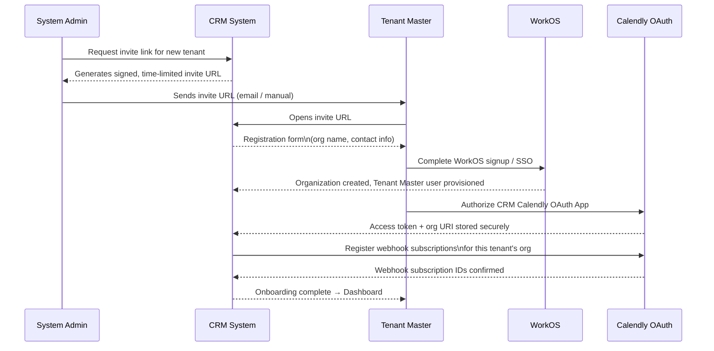

---

## 13. Webhook Event Handling

### 13.1 Signature Validation

All inbound webhook requests from Calendly are validated using HMAC-SHA256 signature verification before any processing occurs. Invalid requests are rejected with a `401` and logged for audit purposes.

### 13.2 Idempotency

Each webhook event carries a unique Calendly event URI. The ingestion layer checks for duplicate `RawWebhookEvent` records before processing to ensure exactly-once pipeline execution, even if Calendly retries delivery.

### 13.3 Cancellation Handling

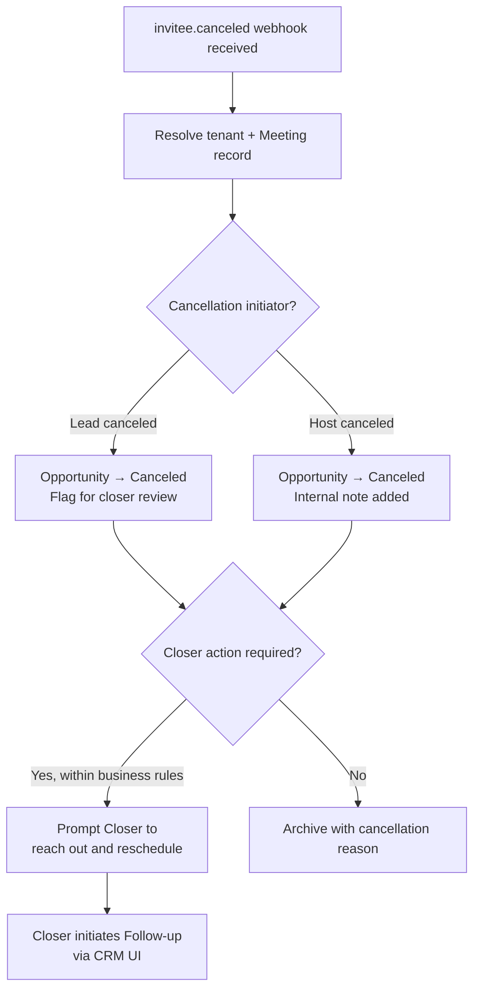

---

## 14. Round Robin Assignment

Calendly natively supports round robin event types (distributing meetings across a team). The CRM must map these assignments back to its own User records.

### 14.1 Assignment Strategy

When a `invitee.created` event arrives, the payload includes the assigned Calendly host's URI (`event.event_memberships[].user`). The CRM resolves this URI against the `calendly_user_uri` field stored on each `USER` record to identify the correct Closer.

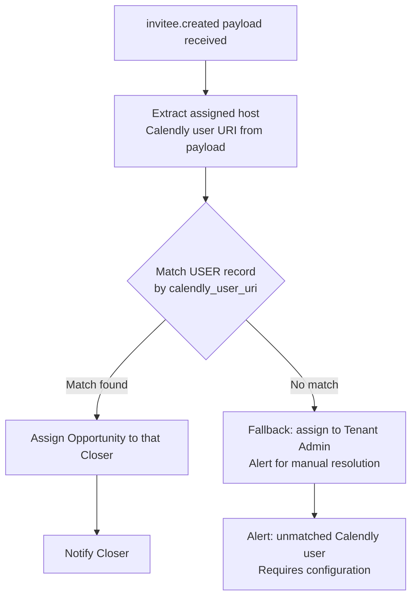

### 14.2 Calendly User Sync

During and after onboarding, the CRM syncs Calendly organization members via the Calendly API (`/organization_memberships`) and attempts to match them to existing CRM users by email. Tenant Admins can manually complete the mapping via the admin UI when automatic matching fails.

---

## 15. MVP Scope & Phasing

### Phase 1 — MVP (Current Focus)

| Area | Included |
|---|---|
| Multi-tenant infrastructure | ✅ Tenant isolation, WorkOS auth, Convex backend |
| Calendly webhook ingestion | ✅ `invitee.created`, `invitee.canceled`, `invitee_no_show` |
| Lead & Opportunity creation | ✅ Automatic upsert from webhook data |
| Closer dashboard | ✅ Calendar view (Today/Week/Month), featured event |
| Meeting detail page | ✅ Notes, Zoom link, outcome actions |
| Payment logging | ✅ Manual entry + proof upload |
| Follow-up scheduling | ✅ Via Calendly API from CRM UI |
| Lost / Backburner flow | ✅ Status transitions, archival |
| Round robin resolution | ✅ Via Calendly host URI matching |
| System Admin panel | ✅ Tenant management, invite link generation |
| Tenant Admin reporting | 🔜 Phase 2 |
| Advanced analytics | 🔜 Phase 2 |
| Automated lead communication | 🔜 Phase 2 |
| Mobile-first Closer app | 🔜 Phase 3 |

---

## 16. Open Questions & Future Considerations

| # | Question | Notes |
|---|---|---|
| 1 | What is the canonical strategy for embedding `tenantId` in webhook URLs vs. signing key metadata? | Dedicated path `/webhooks/calendly/{tenantId}` is simpler and more debuggable; signing key per tenant adds security but complexity. |
| 2 | How should token refresh be handled for Calendly OAuth tokens in Convex? | Convex scheduled actions on a cron to proactively refresh before expiry. |
| 3 | How exactly does the CRM create a follow-up meeting via Calendly API? | Calendly supports single-use scheduling links; direct booking via API is limited. Investigate one-off links scoped to a specific invitee. |
| 4 | What happens when a Calendly event type is deleted or modified? | CRM must handle orphaned `EVENT_TYPE_CONFIG` records gracefully. |
| 5 | What is the payment proof storage strategy? | Convex file storage or an S3-compatible bucket; access must be tenant-scoped. |
| 6 | Should the CRM send any outbound notifications (email/SMS) to leads? | Out of scope for MVP; Phase 2 candidate via a provider like Resend or Twilio. |
| 7 | How is "Backburner" surfaced to Tenant Admins for future follow-up campaigns? | To be designed in Phase 2 reporting module. |
| 8 | Should routing form submission data from Calendly be captured as lead qualification fields? | Yes — recommended for Phase 1 if routing forms are in use by tenants. |

---

*This document is a living specification. As implementation decisions are finalized, sections will be updated to reflect confirmed architectural choices, API contracts, and UX designs.*
