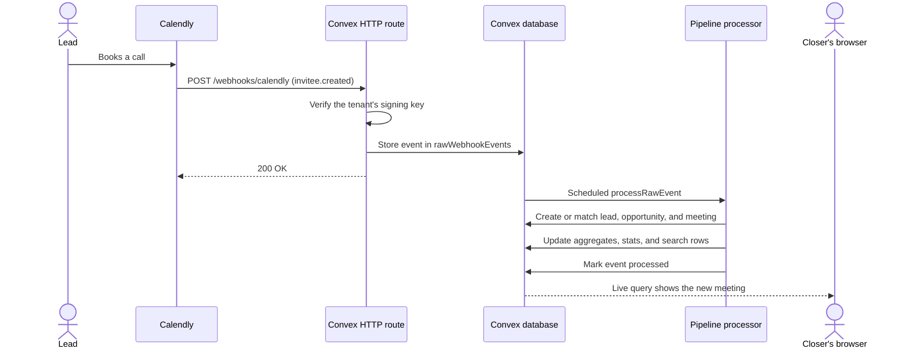
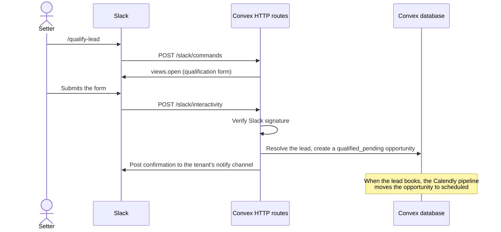
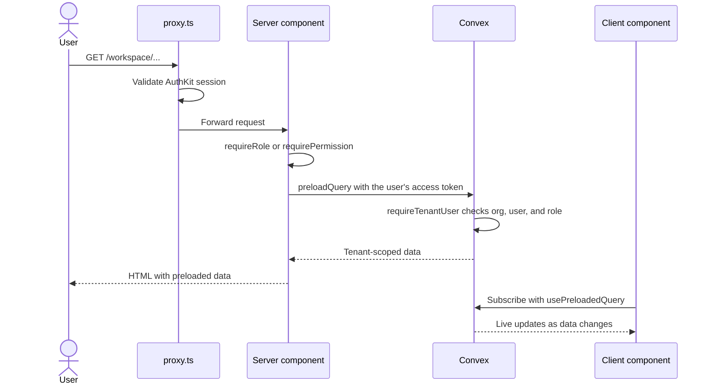

# Magnus CRM

Magnus CRM is a multi-tenant sales CRM for teams that sell through booked calls. It connects to each team's Calendly organization, turns every booking into a lead, opportunity, and meeting, and gives closers and admins one place to run the sales process from first DM to collected payment.

## What it does

Each business is a tenant with its own WorkOS organization, Calendly connection, team, and data. Inside a tenant, each user has one of four roles, and owners and admins share the same view:

| Role | Uses the app to |
| --- | --- |
| Owner and admin | Run the operations dashboards (lead gen, qualifications, booked calls, sales calls), manage the pipeline, team, programs, and payment types, review billing, and export reports as PDF or Excel |
| Closer | Work their calendar and meetings, record outcomes and payments, handle no-shows and reschedules, and follow up on leads |
| Lead generator | Log prospects they reach on social media and track their own activity |

Two groups work outside the CRM login:

- **DM closers** open a password-protected link portal at `/dm-links/<portal>` to copy booking links and look up their leads.
- **Slack users** qualify leads with the `/qualify-lead` command in the tenant's Slack workspace.

A system admin organization manages the platform from `/admin`: it creates tenants and their invite links, deletes tenants, and answers support requests.

## How it works

Convex holds all data and business logic. Calendly and Slack call Convex HTTP routes directly, and the Next.js app reads and writes through Convex functions. WorkOS AuthKit handles sign-in, and one WorkOS organization maps to one tenant.

### A lead books a call

Calendly sends booking, cancellation, and no-show events to the Convex site URL. Convex stores each raw event before processing it, so a failed event can be replayed from the Convex CLI.



### A setter qualifies a lead in Slack

Setters log leads they're messaging on social media before the lead books. When the lead later books through Calendly, the pipeline attaches the meeting to the opportunity Slack created.



### A user opens a workspace page

`proxy.ts` checks the AuthKit session on every request. The page then checks the role on the server, and Convex checks it again inside every function.



Crons in `convex/crons.ts` refresh Calendly and Slack tokens, check Calendly connection health, sync Calendly members, and clean up expired events, invites, and report files.

## Tech stack

- [Next.js 16](https://nextjs.org) App Router with React 19
- [Convex](https://convex.dev) for the database, functions, HTTP endpoints, crons, and file storage
- [WorkOS AuthKit](https://workos.com/docs/authkit) for authentication and organizations
- [shadcn/ui](https://ui.shadcn.com) and Tailwind CSS 4 for UI
- [PostHog](https://posthog.com) for product analytics and error tracking
- Calendly and Slack APIs for scheduling and lead qualification
- pnpm, TypeScript 7, Vitest, and ESLint for tooling

## Repository layout

| Path | Contents |
| --- | --- |
| `app/` | Next.js routes: `workspace/` (the CRM), `admin/`, `onboarding/`, `dm-links/`, OAuth callbacks, and API routes |
| `components/` | Shared React components; `components/ui/` holds the shadcn primitives |
| `convex/` | Schema, queries, mutations, actions, HTTP routes, crons, and migrations, grouped by domain |
| `lib/` | Server and client helpers: auth (`lib/auth.ts`), PostHog, report rendering |
| `hooks/` | Shared React hooks |
| `docs/agents/` | Conventions for the backend, frontend, and auth, written for coding agents and useful for people too |
| `.docs/` | Local copies of Calendly, Slack, Convex, PostHog, and WorkOS reference docs |
| `runbooks/` | Steps for production incidents |

## Getting started

You need Node.js 24 or later, pnpm, and access to the project's Convex team, WorkOS environment, and Calendly OAuth app. Slack is only needed to work on the Slack bot.

1. Install dependencies:

   ```bash
   pnpm install
   ```

2. Start Convex and keep it running. The first run asks you to log in and pick the project, then writes `CONVEX_DEPLOYMENT` and `NEXT_PUBLIC_CONVEX_URL` to `.env.local`. The `authKit` block in `convex.json` also configures WorkOS for `localhost:3000` and writes the WorkOS variables.

   ```bash
   pnpm convex:dev
   ```

3. Fill in the remaining variables in `.env.local` and on the Convex deployment (see [Environment variables](#environment-variables)).

4. Start Next.js in a second terminal and open `http://localhost:3000`:

   ```bash
   pnpm dev
   ```

5. Sign in with an account in the system admin organization (`SYSTEM_ADMIN_ORG_ID`). From `/admin`, create a tenant and open its invite link in a private window to sign up as the tenant owner, then connect Calendly. The tenant moves from `pending_signup` through `pending_calendly` and `provisioning_webhooks` to `active`.

Calendly webhooks and Slack requests go to the Convex site URL, which is already public, so they reach your dev deployment without a tunnel. When an OAuth app needs a public URL for the Next.js side, `pnpm expose` tunnels the project's reserved ngrok domain to `localhost:3000`.

## Environment variables

Next.js reads `.env.local` locally and the Vercel project settings in production. Convex functions read variables set on the deployment with `npx convex env set <NAME> <value>` or in the Convex dashboard. Ask a maintainer for the values.

### Next.js (`.env.local`)

| Variable | Required | Purpose |
| --- | --- | --- |
| `CONVEX_DEPLOYMENT`, `NEXT_PUBLIC_CONVEX_URL` | Yes | Convex deployment; written by `pnpm convex:dev` |
| `NEXT_PUBLIC_CONVEX_SITE_URL` | Yes | The deployment's `.convex.site` URL, where HTTP routes and webhooks live |
| `WORKOS_CLIENT_ID`, `WORKOS_API_KEY`, `NEXT_PUBLIC_WORKOS_REDIRECT_URI` | Yes | WorkOS AuthKit; written by `pnpm convex:dev` |
| `WORKOS_COOKIE_PASSWORD` | Yes | Encrypts the AuthKit session cookie (32 or more characters) |
| `SYSTEM_ADMIN_ORG_ID` | Yes | WorkOS organization whose members get `/admin` |
| `NEXT_PUBLIC_APP_URL` | Yes | Public URL of the app, used to build redirect and invite links |
| `LINK_PORTAL_IP_HASH_SECRET` | In production | Hashes client IPs for DM portal rate limiting; development falls back to a built-in secret |
| `NEXT_PUBLIC_POSTHOG_PROJECT_TOKEN`, `NEXT_PUBLIC_POSTHOG_HOST` | No | PostHog; analytics only run in production builds |
| `POSTHOG_API_KEY`, `POSTHOG_PROJECT_ID` | No | Upload source maps to PostHog during production builds |

### Convex deployment

| Variable | Required | Purpose |
| --- | --- | --- |
| `WORKOS_CLIENT_ID`, `WORKOS_API_KEY` | Yes | Validate WorkOS tokens and manage users and roles |
| `SYSTEM_ADMIN_ORG_ID` | Yes | Same organization ID as in Next.js |
| `NEXT_PUBLIC_APP_URL` | Yes | Builds the Calendly OAuth redirect and invite links |
| `INVITE_SIGNING_SECRET` | Yes | Signs tenant invite tokens |
| `CALENDLY_CLIENT_ID`, `CALENDLY_CLIENT_SECRET` | Yes | Calendly OAuth and token refresh |
| `LINK_PORTAL_SESSION_SECRET`, `LINK_PORTAL_PASSWORD_PEPPER` | For the DM portal | Sign portal sessions and hash portal passwords |
| `SLACK_CLIENT_ID`, `SLACK_CLIENT_SECRET`, `SLACK_SIGNING_SECRET`, `SLACK_STATE_SIGNING_SECRET`, `SLACK_REDIRECT_URI` | For Slack | Slack OAuth, request signatures, and install state |
| `SLACK_SIGNING_SECRET_PREVIOUS` | No | Accepts the old signing secret while you rotate it |
| `APP_URL` | For Slack | Links back to the app from Slack messages |

## Scripts

| Command | What it does |
| --- | --- |
| `pnpm dev` | Starts the Next.js dev server on `localhost:3000` |
| `pnpm convex:dev` | Syncs `convex/` to your dev deployment and regenerates `convex/_generated` |
| `pnpm build` / `pnpm start` | Builds and serves the production Next.js app |
| `pnpm typecheck` | Type-checks with TypeScript 7 (`tsgo`) |
| `pnpm lint` | Runs ESLint |
| `pnpm test` | Runs the Vitest suites in `convex/` and `lib/operations-reports/` |
| `pnpm expose` | Tunnels the project's ngrok domain to `localhost:3000` |

The Convex CLI covers backend work: `npx convex data <table>` lists rows, `npx convex logs` streams function logs, and `npx convex run <module>:<function>` calls a function. `npx convex run testing/calendly:bookTestInvitee` books a real Calendly test meeting on the connected tenant.

## Testing

Automated tests cover the operations report system, lead gen reporting, and bounded live queries, using [`convex-test`](https://docs.convex.dev/testing/convex-test) for backend functions. Most features are checked by hand: book a test meeting through the Convex CLI, confirm the records with `npx convex data` and `npx convex logs`, then check the UI while signed in as each role.

## Deployment

Production runs on Vercel at `magnus-crm-drab.vercel.app` with a Convex production deployment. Vercel holds `CONVEX_DEPLOY_KEY` so the build can deploy Convex functions, and `convex.json` configures the production WorkOS redirect URIs. Production has one live tenant, so schema and data changes ship as migrations; see `docs/agents/convex.md`.

The Slack app is defined by `slack-manifest.prod.yaml` and `slack-manifest.dev.yaml`. Token rotation is on for the production app, and Slack can't turn it off once enabled, so a GitHub Actions check fails any change that sets `token_rotation_enabled` to anything but `true` in the production manifest.

## More documentation

- `AGENTS.md`: instructions for AI coding agents, with links to `docs/agents/`
- `docs/follow-ups.md`: known issues and cleanup waiting to be done
- `runbooks/`: incident steps, such as a failed Slack token refresh
- `.docs/`: vendor API references
