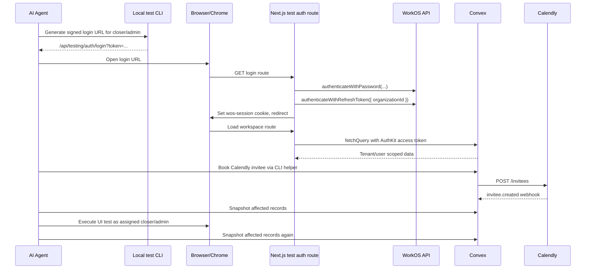

# Agent Browser E2E Testing Workflow

> **Status:** Proposed testing architecture  
> **Audience:** Codex/AI agents and developers running browser UI tests against the development or production test tenant  
> **Primary goal:** Let an AI agent reliably test the app in Browser/Chrome while authenticated as the correct WorkOS/AuthKit user, without manually driving the hosted WorkOS login UI.

This document complements `TESTING.MD`. Keep using `TESTING.MD` for the current manual Calendly and Convex validation rules. This document describes the additional pieces needed to make browser-based AI-agent testing repeatable.

## Core Decision

Do not automate the hosted WorkOS login form for normal E2E tests.

Instead, add a **test-only AuthKit session bridge**:

1. The test runner asks for a short-lived signed login URL for a role alias such as `tenant_owner`, `closer1`, or `closer2`.
2. Browser/Chrome opens that URL.
3. A Next.js route authenticates the configured test user through WorkOS server-side.
4. The route saves the normal AuthKit session cookie with `saveSession`.
5. The browser is redirected to the requested app route.

The app still uses real WorkOS users, real AuthKit cookies, real Convex JWT validation, and real role-based app logic. The only bypass is skipping the brittle hosted login UI.

## Why This Is Needed

The current weak point is not data setup. The Convex Calendly helper already gives us a reliable way to book real Calendly meetings and produce real webhooks.

The weak point is browser authentication:

- A hosted login form is hard for an agent to drive reliably.
- Browser/Chrome profiles can retain cookies for the wrong role.
- Signing out and signing in as another role creates race conditions and stale sessions.
- `/sign-in` currently defaults missing `organization_id` to `SYSTEM_ADMIN_ORG_ID`, which is not the tenant org needed for normal CRM test users.

The test auth bridge makes role switching explicit and deterministic.

## Architecture



## Pieces To Add

| Piece | Purpose |
| --- | --- |
| `lib/testing/e2e-auth.ts` | Server-only role alias mapping, token signing, token verification, login URL helpers |
| `app/api/testing/auth/login/route.ts` | Test-only route that exchanges a signed token for a real AuthKit session cookie |
| `app/api/testing/auth/logout/route.ts` | Optional cleanup route for clearing the session between roles |
| `scripts/e2e-login-url.mjs` | Local command that prints a signed login URL for Browser/Chrome |
| `convex/testing/e2e.ts` | Convex test queries for tenant discovery, booking result lookup, and focused snapshots |
| `scripts/e2e-book-calendly.mjs` | Optional orchestrator around `testing/calendly:bookTestInvitee` |
| `tests/e2e/*` | Optional Playwright tests once the auth bridge exists |

No schema change should be required for the auth bridge itself. Convex helper queries are read-only unless we later decide to store test run metadata.

## Required Environment Variables

Add these to `.env.local` for local test runs only:

```bash
# Enables the test-only auth route. Route must return 404 unless this is "1".
E2E_AUTH_ENABLED=1

# Long random secret used to sign short-lived login URLs.
# Generate with: openssl rand -base64 48
E2E_AUTH_TOKEN_SECRET="..."

# Tenant org used by the normal CRM test users.
E2E_TEST_TENANT_WORKOS_ORG_ID="org_..."

# Optional hard stop. Defaults should only allow localhost.
E2E_AUTH_ALLOWED_ORIGINS="http://localhost:3000,http://127.0.0.1:3000"

# Existing test users.
E2E_TENANT_OWNER_EMAIL="vas.claudio15+tenantowner@icloud.com"
E2E_CLOSER1_EMAIL="vas.claudio15+closer1@icloud.com"
E2E_CLOSER2_EMAIL="vas.claudio15+closer2@icloud.com"
TEST_USERS_PASSWORD="..."

# Already required by the app.
WORKOS_API_KEY="sk_..."
WORKOS_CLIENT_ID="client_..."
WORKOS_COOKIE_PASSWORD="..."
NEXT_PUBLIC_WORKOS_REDIRECT_URI="http://localhost:3000/callback"
NEXT_PUBLIC_APP_URL="http://localhost:3000"
```

Do not put raw passwords or signed login tokens in committed docs, test snapshots, or logs.

## Role Aliases

Tests should never pass arbitrary emails to the auth route. They should pass role aliases.

```ts
export type E2ERoleAlias = "tenant_owner" | "closer1" | "closer2";

const ROLE_EMAIL_ENV: Record<E2ERoleAlias, string> = {
  tenant_owner: "E2E_TENANT_OWNER_EMAIL",
  closer1: "E2E_CLOSER1_EMAIL",
  closer2: "E2E_CLOSER2_EMAIL",
};
```

The route resolves the alias server-side. This keeps the public login URL from becoming a generic password-auth endpoint.

## Signed Login Token Shape

The test CLI generates a short-lived token. The browser sends only the token to the Next.js route.

```ts
type E2ELoginTokenPayload = {
  typ: "magnus.e2e.login";
  role: "tenant_owner" | "closer1" | "closer2";
  orgId: string;
  returnTo: string;
  iat: number;
  exp: number;
  nonce: string;
};
```

Recommended TTL: 60 seconds. These tokens should be single-purpose and short-lived. If we later need replay protection, add a tiny in-memory nonce cache in the route or a Convex-backed nonce table.

## `lib/testing/e2e-auth.ts` Shape

This module should be server-only. It signs and verifies tokens with HMAC-SHA256.

```ts
import "server-only";
import crypto from "node:crypto";

export type E2ERoleAlias = "tenant_owner" | "closer1" | "closer2";

export type E2ELoginTokenPayload = {
  typ: "magnus.e2e.login";
  role: E2ERoleAlias;
  orgId: string;
  returnTo: string;
  iat: number;
  exp: number;
  nonce: string;
};

const roleEmailEnv: Record<E2ERoleAlias, string> = {
  tenant_owner: "E2E_TENANT_OWNER_EMAIL",
  closer1: "E2E_CLOSER1_EMAIL",
  closer2: "E2E_CLOSER2_EMAIL",
};

function base64url(input: Buffer | string) {
  return Buffer.from(input)
    .toString("base64")
    .replaceAll("+", "-")
    .replaceAll("/", "_")
    .replaceAll("=", "");
}

function requireE2ESecret() {
  const secret = process.env.E2E_AUTH_TOKEN_SECRET;
  if (!secret || secret.length < 32) {
    throw new Error("Missing or weak E2E_AUTH_TOKEN_SECRET.");
  }
  return secret;
}

export function requireE2EEnabled() {
  if (process.env.E2E_AUTH_ENABLED !== "1") {
    throw new Error("E2E auth is disabled.");
  }
}

export function getE2EEmailForRole(role: E2ERoleAlias) {
  const envName = roleEmailEnv[role];
  const email = process.env[envName];
  if (!email) {
    throw new Error(`Missing ${envName}.`);
  }
  return email;
}

export function signE2ELoginToken(
  payload: Omit<E2ELoginTokenPayload, "typ" | "iat" | "exp" | "nonce">,
  ttlMs = 60_000,
) {
  requireE2EEnabled();
  const now = Date.now();
  const fullPayload: E2ELoginTokenPayload = {
    typ: "magnus.e2e.login",
    ...payload,
    iat: now,
    exp: now + ttlMs,
    nonce: crypto.randomUUID(),
  };

  const body = base64url(JSON.stringify(fullPayload));
  const signature = crypto
    .createHmac("sha256", requireE2ESecret())
    .update(body)
    .digest();

  return `${body}.${base64url(signature)}`;
}

export function verifyE2ELoginToken(token: string): E2ELoginTokenPayload {
  requireE2EEnabled();

  const [body, signature] = token.split(".");
  if (!body || !signature) {
    throw new Error("Malformed E2E login token.");
  }

  const expected = base64url(
    crypto.createHmac("sha256", requireE2ESecret()).update(body).digest(),
  );

  const actualBuffer = Buffer.from(signature);
  const expectedBuffer = Buffer.from(expected);
  if (
    actualBuffer.length !== expectedBuffer.length ||
    !crypto.timingSafeEqual(actualBuffer, expectedBuffer)
  ) {
    throw new Error("Invalid E2E login token signature.");
  }

  const payload = JSON.parse(Buffer.from(body, "base64url").toString("utf8"));
  if (payload.typ !== "magnus.e2e.login") {
    throw new Error("Invalid E2E token type.");
  }
  if (Date.now() > payload.exp) {
    throw new Error("Expired E2E login token.");
  }
  if (!["tenant_owner", "closer1", "closer2"].includes(payload.role)) {
    throw new Error("Invalid E2E role alias.");
  }
  if (!payload.returnTo.startsWith("/") || payload.returnTo.startsWith("//")) {
    throw new Error("E2E returnTo must be an app-relative path.");
  }

  return payload;
}
```

## Login Route Shape

File: `app/api/testing/auth/login/route.ts`

This route should run only in local/test environments. It should return `404` when disabled so it is not discoverable in normal app usage.

```ts
import { type NextRequest, NextResponse } from "next/server";
import { getWorkOS, saveSession } from "@workos-inc/authkit-nextjs";
import {
  getE2EEmailForRole,
  requireE2EEnabled,
  verifyE2ELoginToken,
} from "@/lib/testing/e2e-auth";

function notFound() {
  return new NextResponse("Not found", { status: 404 });
}

function assertAllowedOrigin(request: NextRequest) {
  const allowed = (process.env.E2E_AUTH_ALLOWED_ORIGINS ?? "http://localhost:3000,http://127.0.0.1:3000")
    .split(",")
    .map((origin) => origin.trim())
    .filter(Boolean);

  if (!allowed.includes(request.nextUrl.origin)) {
    throw new Error("E2E auth origin is not allowed.");
  }
}

function safeRedirectTarget(request: NextRequest, returnTo: string) {
  const appUrl = process.env.NEXT_PUBLIC_APP_URL ?? request.nextUrl.origin;
  return new URL(returnTo, appUrl);
}

export async function GET(request: NextRequest) {
  try {
    requireE2EEnabled();
    assertAllowedOrigin(request);
  } catch {
    return notFound();
  }

  if (process.env.NODE_ENV === "production" && process.env.E2E_AUTH_ENABLED !== "1") {
    return notFound();
  }

  const token = request.nextUrl.searchParams.get("token");
  if (!token) {
    return new NextResponse("Missing token", { status: 400 });
  }

  let payload;
  try {
    payload = verifyE2ELoginToken(token);
  } catch (error) {
    return new NextResponse(
      error instanceof Error ? error.message : "Invalid token",
      { status: 401 },
    );
  }

  const expectedOrgId = process.env.E2E_TEST_TENANT_WORKOS_ORG_ID;
  if (!expectedOrgId || payload.orgId !== expectedOrgId) {
    return new NextResponse("Invalid E2E organization", { status: 403 });
  }

  const email = getE2EEmailForRole(payload.role);
  const password = process.env.TEST_USERS_PASSWORD;
  if (!password) {
    return new NextResponse("Missing TEST_USERS_PASSWORD", { status: 500 });
  }

  const workos = getWorkOS();

  const passwordAuth = await workos.userManagement.authenticateWithPassword({
    clientId: process.env.WORKOS_CLIENT_ID!,
    email,
    password,
  });

  const orgScopedAuth = await workos.userManagement.authenticateWithRefreshToken({
    clientId: process.env.WORKOS_CLIENT_ID!,
    refreshToken: passwordAuth.refreshToken,
    organizationId: payload.orgId,
  });

  await saveSession(
    {
      accessToken: orgScopedAuth.accessToken,
      refreshToken: orgScopedAuth.refreshToken,
      user: orgScopedAuth.user,
      impersonator: orgScopedAuth.impersonator,
    },
    request,
  );

  return NextResponse.redirect(safeRedirectTarget(request, payload.returnTo));
}
```

If WorkOS returns an organization-selection challenge for password auth in this environment, add a catch branch that calls `authenticateWithOrganizationSelection` using the pending authentication token. The happy path should first try password auth followed by refresh-token org scoping because that matches the existing callback route's organization-scoped session pattern.

## Optional Logout Route

File: `app/api/testing/auth/logout/route.ts`

This is useful before switching roles in the same browser context.

```ts
import { NextResponse } from "next/server";

export async function GET() {
  if (process.env.E2E_AUTH_ENABLED !== "1") {
    return new NextResponse("Not found", { status: 404 });
  }

  const response = NextResponse.redirect(
    new URL("/", process.env.NEXT_PUBLIC_APP_URL ?? "http://localhost:3000"),
  );
  response.cookies.delete(process.env.WORKOS_COOKIE_NAME ?? "wos-session");
  return response;
}
```

The stronger option is to use a fresh browser context per role, especially in Playwright.

## Login URL CLI Shape

File: `scripts/e2e-login-url.mjs`

```js
#!/usr/bin/env node

import crypto from "node:crypto";

const role = process.argv[2];
const returnTo = process.argv[3] ?? "/workspace";

if (!["tenant_owner", "closer1", "closer2"].includes(role)) {
  throw new Error("Usage: node scripts/e2e-login-url.mjs <tenant_owner|closer1|closer2> [returnTo]");
}

const appUrl = process.env.NEXT_PUBLIC_APP_URL ?? "http://localhost:3000";
const orgId = process.env.E2E_TEST_TENANT_WORKOS_ORG_ID;
const secret = process.env.E2E_AUTH_TOKEN_SECRET;

if (!orgId) throw new Error("Missing E2E_TEST_TENANT_WORKOS_ORG_ID.");
if (!secret) throw new Error("Missing E2E_AUTH_TOKEN_SECRET.");

function base64url(input) {
  return Buffer.from(input)
    .toString("base64")
    .replaceAll("+", "-")
    .replaceAll("/", "_")
    .replaceAll("=", "");
}

const now = Date.now();
const payload = {
  typ: "magnus.e2e.login",
  role,
  orgId,
  returnTo,
  iat: now,
  exp: now + 60_000,
  nonce: crypto.randomUUID(),
};

const body = base64url(JSON.stringify(payload));
const signature = base64url(
  crypto.createHmac("sha256", secret).update(body).digest(),
);

const url = new URL("/api/testing/auth/login", appUrl);
url.searchParams.set("token", `${body}.${signature}`);

console.log(url.toString());
```

Example:

```bash
node scripts/e2e-login-url.mjs closer1 /workspace/closer
node scripts/e2e-login-url.mjs tenant_owner /workspace/pipeline
```

Add a package script after implementation:

```json
{
  "scripts": {
    "e2e:login-url": "node scripts/e2e-login-url.mjs"
  }
}
```

## Convex E2E Helper Shape

File: `convex/testing/e2e.ts`

These helpers should return focused records so tests do not scrape large `npx convex data` output.

```ts
import { v } from "convex/values";
import { internalQuery } from "../_generated/server";

export const getTenantByWorkosOrgId = internalQuery({
  args: { workosOrgId: v.string() },
  handler: async (ctx, { workosOrgId }) => {
    return await ctx.db
      .query("tenants")
      .withIndex("by_workosOrgId", (q) => q.eq("workosOrgId", workosOrgId))
      .unique();
  },
});

export const getTestUserMap = internalQuery({
  args: { tenantId: v.id("tenants") },
  handler: async (ctx, { tenantId }) => {
    const users = await ctx.db
      .query("users")
      .withIndex("by_tenantId", (q) => q.eq("tenantId", tenantId))
      .take(100);

    return users.map((user) => ({
      userId: user._id,
      email: user.email,
      role: user.role,
      calendlyUserUri: user.calendlyUserUri,
      isActive: user.isActive,
    }));
  },
});

export const getBookingResultByInviteeEmail = internalQuery({
  args: {
    tenantId: v.id("tenants"),
    inviteeEmail: v.string(),
  },
  handler: async (ctx, { tenantId, inviteeEmail }) => {
    const email = inviteeEmail.toLowerCase();
    const lead = await ctx.db
      .query("leads")
      .withIndex("by_tenantId_and_email", (q) =>
        q.eq("tenantId", tenantId).eq("email", email),
      )
      .unique();

    if (!lead) {
      return null;
    }

    const opportunities = await ctx.db
      .query("opportunities")
      .withIndex("by_tenantId_and_leadId", (q) =>
        q.eq("tenantId", tenantId).eq("leadId", lead._id),
      )
      .take(10);

    const opportunity = opportunities
      .sort((a, b) => b._creationTime - a._creationTime)[0];

    if (!opportunity) {
      return { lead, opportunity: null, meeting: null, assignedCloser: null };
    }

    const meetings = await ctx.db
      .query("meetings")
      .withIndex("by_tenantId_and_opportunityId", (q) =>
        q.eq("tenantId", tenantId).eq("opportunityId", opportunity._id),
      )
      .take(10);

    const meeting = meetings.sort((a, b) => b._creationTime - a._creationTime)[0] ?? null;
    const assignedCloser = opportunity.assignedCloserId
      ? await ctx.db.get(opportunity.assignedCloserId)
      : null;

    return {
      lead: {
        id: lead._id,
        email: lead.email,
        fullName: lead.fullName,
        phone: lead.phone,
        customFields: lead.customFields,
      },
      opportunity: {
        id: opportunity._id,
        status: opportunity.status,
        assignedCloserId: opportunity.assignedCloserId,
        latestMeetingId: opportunity.latestMeetingId,
        nextMeetingId: opportunity.nextMeetingId,
        rawUtm: opportunity.rawUtm,
        attributionResolution: opportunity.attributionResolution,
      },
      meeting: meeting
        ? {
            id: meeting._id,
            status: meeting.status,
            scheduledAt: meeting.scheduledAt,
            assignedCloserId: meeting.assignedCloserId,
            calendlyEventUri: meeting.calendlyEventUri,
            calendlyInviteeUri: meeting.calendlyInviteeUri,
            rawUtm: meeting.rawUtm,
          }
        : null,
      assignedCloser: assignedCloser
        ? {
            id: assignedCloser._id,
            email: assignedCloser.email,
            fullName: assignedCloser.fullName,
            role: assignedCloser.role,
          }
        : null,
    };
  },
});
```

Index names in the example must match the final schema. If an index is missing, add a narrow read helper using an existing indexed path. Do not use unbounded `.collect()` in helper code.

## Focused Snapshot Contract

The test runner should snapshot only records affected by the case.

```ts
type E2ECaseSnapshot = {
  runId: string;
  takenAt: string;
  lead?: {
    id: string;
    email?: string;
    fullName?: string;
    phone?: string;
    customFields?: Record<string, string>;
  };
  opportunity?: {
    id: string;
    status: string;
    assignedCloserId?: string;
    latestMeetingId?: string;
    nextMeetingId?: string;
    rawUtm?: {
      utm_source?: string;
      utm_medium?: string;
      utm_campaign?: string;
    };
  };
  meeting?: {
    id: string;
    status: string;
    scheduledAt: number;
    assignedCloserId: string;
    calendlyEventUri?: string;
    calendlyInviteeUri?: string;
  };
  assignedCloser?: {
    id: string;
    email: string;
    role: string;
  };
};
```

Store snapshots as test artifacts, not as committed repo files, unless the user explicitly asks for an evidence bundle.

## Calendly Booking Command

Keep using the existing helper:

```bash
npx convex run testing/calendly:bookTestInvitee '{
  "tenantId": "<tenantId>",
  "eventTypeUri": "<eventTypeUri>",
  "inviteeEmail": "vas.claudio15+lead123@icloud.com",
  "inviteeName": "Agent E2E Lead 123",
  "inviteeTimezone": "America/Tegucigalpa",
  "textReminderNumber": "+15005550123",
  "questionAnswers": {
    "Instagram Handle": "agent_e2e_lead_123",
    "Phone Number": "+15005550123",
    "Message": "Agent E2E booking"
  },
  "tracking": {
    "utm_source": "dm_team",
    "utm_medium": "claudio_vasquez",
    "utm_campaign": "organic"
  }
}'
```

The canonical public scheduling URL for manual checks is:

```txt
https://calendly.com/d/cvmm-vy4-696/test-meeting-for-crm?utm_source=dm_team&utm_medium=claudio_vasquez&utm_campaign=organic
```

The programmatic helper is preferred because it avoids date-picker and availability UI flakiness while still producing real Calendly webhook traffic.

## End-To-End Workflow

### 1. Start Local Services

Use separate terminals:

```bash
pnpm convex:dev
pnpm dev
```

Make sure `NEXT_PUBLIC_APP_URL` points at the running app, usually `http://localhost:3000`.

### 2. Discover Tenant And Event Type

```bash
npx convex run testing/e2e:getTenantByWorkosOrgId '{"workosOrgId":"<orgId>"}'
npx convex run testing/calendly:listEventTypes '{"tenantId":"<tenantId>"}'
npx convex run testing/calendly:getEventTypeDetailsForTesting '{"tenantId":"<tenantId>","eventTypeUri":"<eventTypeUri>"}'
```

Record:

- `tenantId`
- `eventTypeUri`
- exact custom question names
- test owner email
- closer emails

### 3. Pick Fresh Lead Identity

Before booking:

```bash
npx convex data leads | rg 'vas\.claudio15\+lead123@icloud\.com'
npx convex data leadIdentifiers | rg '\+15005550123'
```

If either exists, increment the lead number and phone number.

### 4. Book A Real Calendly Meeting

Run `testing/calendly:bookTestInvitee` with the UTM tracking object. Capture:

- `inviteeUri`
- `eventUri`
- `bookedStartTime`

### 5. Wait For Webhook Processing

Poll focused helper first:

```bash
npx convex run testing/e2e:getBookingResultByInviteeEmail '{
  "tenantId": "<tenantId>",
  "inviteeEmail": "vas.claudio15+lead123@icloud.com"
}'
```

If it returns `null` or missing opportunity/meeting, inspect logs:

```bash
npx convex logs --history 100
npx convex data rawWebhookEvents --limit 10
```

Do not open the browser until Convex confirms the backend data is present.

### 6. Derive The Assigned Closer

Read `assignedCloser.email` from the booking result.

Mapping:

| Assigned closer email | Login role alias |
| --- | --- |
| `vas.claudio15+closer1@icloud.com` | `closer1` |
| `vas.claudio15+closer2@icloud.com` | `closer2` |

If the assigned closer email is not one of the configured aliases, stop and fix test user mapping before browser testing.

### 7. Snapshot Before UI Actions

Save the focused snapshot output before interaction. For agent runs, paste the important IDs into the working notes:

- lead ID
- opportunity ID
- meeting ID
- assigned closer ID/email
- initial statuses
- UTM attribution fields

### 8. Login As Assigned Closer

Generate the login URL:

```bash
node scripts/e2e-login-url.mjs closer1 /workspace/closer
```

Or deep-link directly to the meeting:

```bash
node scripts/e2e-login-url.mjs closer1 /workspace/closer/meetings/<meetingId>
```

Open the printed URL with Browser/Chrome. The app should land on the requested authenticated route with a real AuthKit session cookie.

### 9. Execute Closer UI Steps

Examples:

- Open closer dashboard.
- Confirm the meeting appears.
- Open meeting detail.
- Verify lead fields and booking answers.
- Open Mark Lost, Payment, No Show, or Follow-Up dialogs depending on the test case.
- Submit the action.
- Confirm toast and visible status updates.

For every mutating action, take a Convex snapshot immediately after.

### 10. Switch To Tenant Owner

Preferred: create a fresh browser context and open:

```bash
node scripts/e2e-login-url.mjs tenant_owner /workspace/pipeline
```

Acceptable local fallback:

```bash
open http://localhost:3000/api/testing/auth/logout
node scripts/e2e-login-url.mjs tenant_owner /workspace/pipeline
```

Do not rely on clicking the app sign-out button as part of test setup. That turns auth setup into another UI dependency.

### 11. Execute Admin UI Steps

Examples:

- Open `/workspace/pipeline`.
- Confirm the opportunity is visible.
- Confirm assigned closer.
- Open opportunity detail.
- Verify meeting status and attribution.
- Confirm dashboard/reporting counts if the test case touches them.

### 12. Final Snapshot And Assertion

Run the focused snapshot again and compare to expected state.

Examples:

| Test action | Expected Convex change |
| --- | --- |
| Mark lost | meeting/opportunity status becomes `lost`, lost reason stored |
| Start meeting | meeting/opportunity status becomes `in_progress` |
| Record payment | payment record exists, opportunity becomes `payment_received`, customer may be created |
| Schedule follow-up | follow-up record exists, opportunity status reflects follow-up state |
| Admin reassignment | opportunity and meeting `assignedCloserId` match new closer |

Browser validation confirms the UI renders and interactions work. Convex snapshot confirms the source of truth changed correctly.

## Browser And Chrome Usage Rules

Use Browser for local app testing unless the test requires the user's real Chrome profile.

Recommended:

- One browser context per role.
- Generate a fresh login URL for every context.
- Never reuse a login URL after its TTL.
- Always verify current role in the UI before mutating data.
- Keep Convex CLI output as the backend source of truth.

Avoid:

- Manual hosted WorkOS login in tests.
- Sharing one long-lived Chrome profile between roles.
- Browser-only assertions for backend state.
- Screenshots of `.env.local`, passwords, or signed tokens.

## Playwright Fixture Shape

If Playwright is added later, make auth a fixture rather than a repeated test step.

```ts
import { test as base, expect } from "@playwright/test";
import { execFileSync } from "node:child_process";

type Role = "tenant_owner" | "closer1" | "closer2";

async function loginAs(page, role: Role, returnTo = "/workspace") {
  const url = execFileSync(
    "node",
    ["scripts/e2e-login-url.mjs", role, returnTo],
    { encoding: "utf8" },
  ).trim();

  await page.goto(url);
  await page.waitForURL(`**${returnTo}`);
}

export const test = base.extend<{
  loginAs: (role: Role, returnTo?: string) => Promise<void>;
}>({
  loginAs: async ({ page }, use) => {
    await use((role, returnTo) => loginAs(page, role, returnTo));
  },
});

export { expect };
```

Example:

```ts
test("assigned closer can open the booked meeting", async ({ page, loginAs }) => {
  await loginAs("closer1", "/workspace/closer");
  await expect(page.getByRole("heading", { name: /dashboard/i })).toBeVisible();
});
```

For role switching inside one test, create separate contexts:

```ts
const closerContext = await browser.newContext();
const closerPage = await closerContext.newPage();
await loginAs(closerPage, "closer1", `/workspace/closer/meetings/${meetingId}`);

const ownerContext = await browser.newContext();
const ownerPage = await ownerContext.newPage();
await loginAs(ownerPage, "tenant_owner", "/workspace/pipeline");
```

## Agent Manual Run Template

Use this structure in an agent test note:

```md
## Run

- Run ID:
- Tenant ID:
- Event type URI:
- Invitee email:
- Phone:
- Calendly event URI:
- Calendly invitee URI:

## Backend Before Browser

- Lead ID:
- Opportunity ID:
- Meeting ID:
- Assigned closer:
- Opportunity status:
- Meeting status:
- UTM source/medium/campaign:

## Closer Session

- Role alias:
- Route opened:
- UI actions:
- Result observed:

## Backend After Closer Action

- Opportunity status:
- Meeting status:
- Payment/follow-up/lost fields:

## Owner Session

- Route opened:
- UI actions:
- Result observed:

## Final Backend Snapshot

- Expected:
- Actual:
- Pass/fail:
```

## Failure Modes And Fixes

### Login URL Returns 404

Likely causes:

- `E2E_AUTH_ENABLED` is not `1`.
- The dev server was started before `.env.local` was updated.
- The route file is missing or in the wrong path.

### Login URL Returns 401

Likely causes:

- Token expired. Generate a fresh URL.
- `E2E_AUTH_TOKEN_SECRET` differs between CLI and dev server.
- Token was copied incompletely.

### Login URL Returns 403

Likely causes:

- `E2E_TEST_TENANT_WORKOS_ORG_ID` does not match token `orgId`.
- The selected user is not a member of the tenant WorkOS org.

### Browser Lands On `/` Instead Of Workspace

Likely causes:

- The AuthKit session was created without organization context.
- `authenticateWithRefreshToken({ organizationId })` failed or was skipped.
- The CRM user is missing/inactive in Convex.

Check:

```bash
npx convex run testing/e2e:getTestUserMap '{"tenantId":"<tenantId>"}'
```

### Closer Cannot See Meeting

Likely causes:

- Calendly round-robin assigned the other closer.
- The app is logged in as the wrong role alias.
- `users.calendlyUserUri` does not match the Calendly webhook host.

Check `assignedCloser.email` from `testing/e2e:getBookingResultByInviteeEmail`.

### Backend Data Missing After Booking

Likely causes:

- Webhook did not arrive.
- Webhook failed processing.
- Duplicate email/phone updated an old lead.
- Calendly host URI did not map to a CRM user.

Check:

```bash
npx convex logs --history 100
npx convex data rawWebhookEvents --limit 10
npx convex data leads | rg '<email>'
npx convex data leadIdentifiers | rg '<phone>'
```

## Security Checklist Before Merging

- [ ] Test auth route returns 404 unless `E2E_AUTH_ENABLED=1`.
- [ ] Route accepts only signed tokens.
- [ ] Tokens expire quickly.
- [ ] Route accepts role aliases only, not arbitrary email/password input.
- [ ] Route validates `E2E_TEST_TENANT_WORKOS_ORG_ID`.
- [ ] Route uses app-relative `returnTo` only.
- [ ] No token or password is logged.
- [ ] `.env.local` contains secrets; committed docs contain only variable names.
- [ ] Production deployments do not set `E2E_AUTH_ENABLED=1` except an explicitly approved throwaway test deployment.

## Implementation Order

1. Add `lib/testing/e2e-auth.ts`.
2. Add `app/api/testing/auth/login/route.ts`.
3. Add `scripts/e2e-login-url.mjs`.
4. Start the dev server and manually verify login as `tenant_owner`.
5. Verify login as `closer1` and `closer2`.
6. Add `convex/testing/e2e.ts` focused query helpers.
7. Run a full Calendly booking flow through Convex.
8. Use the assigned closer login URL to open the closer meeting detail.
9. Switch to tenant owner via a fresh browser context and verify admin views.
10. Only after this is stable, add Playwright or higher-level browser automation.

## Success Criteria

The workflow is ready when an agent can complete this sequence without manual auth help:

1. Book a real Calendly invitee with required UTM attribution.
2. Confirm webhook-created lead, opportunity, meeting, and assigned closer through Convex.
3. Generate and open a signed login URL for the assigned closer.
4. Perform the required closer UI action.
5. Confirm the database changed through Convex.
6. Generate and open a signed login URL for the tenant owner.
7. Confirm the admin UI reflects the final state.
