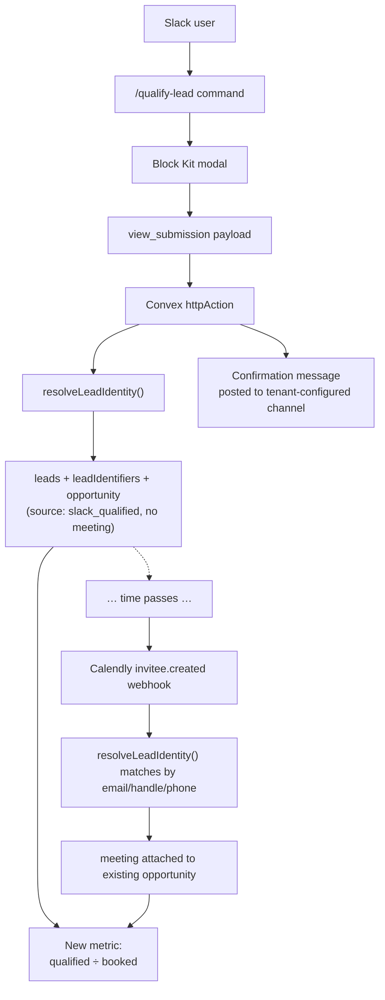
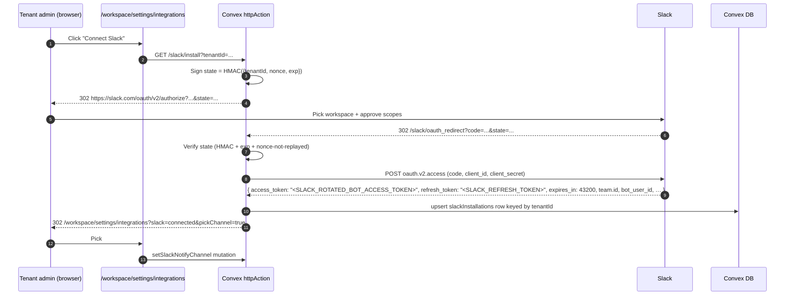
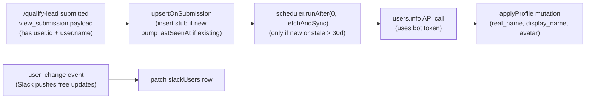

# Slack Bot for Multi-Tenant Qualified-Lead Ingestion

> **Date:** 2026-04-27
> **Status:** Brainstorm / Pre-Plan
> **Context:** A single Slack app distributed across all tenant workspaces. A slash command opens a modal where any Slack user (we don't distinguish setter vs. closer — they're all just "the Slack user who submitted") registers a qualified lead they're DMing on social — _before_ Calendly. When a Calendly booking later arrives matching that lead (by email, social handle, or phone), the meeting attaches to the pre-existing opportunity. This unlocks a new metric: **qualified leads submitted ÷ meetings booked**, i.e. the conversion rate from "DM'd a qualified lead" to "lead actually scheduled."

---

## Table of Contents

1. [The Insight — Why Build This](#1-the-insight--why-build-this)
2. [What We're Building (One Paragraph)](#2-what-were-building-one-paragraph)
3. [High-Level Architecture](#3-high-level-architecture)
4. [Slack Platform Fundamentals](#4-slack-platform-fundamentals)
5. [Multi-Tenant OAuth Install Flow](#5-multi-tenant-oauth-install-flow)
6. [Slash Command → Modal → Submit](#6-slash-command--modal--submit)
7. [From Form Data → Lead + Opportunity](#7-from-form-data--lead--opportunity)
8. [The Slack ↔ Calendly Join](#8-the-slack--calendly-join)
9. [Posting Confirmation to a Channel](#9-posting-confirmation-to-a-channel)
10. [New Metrics Unlocked](#10-new-metrics-unlocked)
11. [Schema Additions](#11-schema-additions)
12. [Convex Endpoints Needed](#12-convex-endpoints-needed)
13. [App Manifest](#13-app-manifest)
14. [Lifecycle & Failure Modes](#14-lifecycle--failure-modes)
15. [Build vs. Buy — and Why We Skip Bolt](#15-build-vs-buy--and-why-we-skip-bolt)
16. [Effort Estimate (Phased Plan)](#16-effort-estimate-phased-plan)
17. [Risk Assessment](#17-risk-assessment)
18. [Recommended Approach](#18-recommended-approach)
19. [Open Questions](#19-open-questions)
20. [Appendix — References](#20-appendix--references)

---

## 1. The Insight — Why Build This

Today the funnel starts at Calendly:

```
(unknown DM activity) → Calendly booking → opportunity created
```

We see the meetings, but we have **no visibility into the top of the funnel** — the "we're DMing a qualified lead, they haven't booked yet" stage. The only way we know a lead exists is if and when they book.

This means we cannot compute the most actionable conversion metric for the team:

> **"Of the qualified leads we surfaced from DMs, what fraction actually booked a call?"**

If we capture qualified leads at the moment they're identified — _before_ a meeting is booked — and then automatically attach a Calendly booking to that lead when one arrives, we get:

| Metric                                  | Today | After Slack bot |
| --------------------------------------- | :---: | :-------------: |
| Total meetings                          |   ✅   |        ✅        |
| Total qualified leads surfaced          |   ❌   |        ✅        |
| Qualified-lead → booked-meeting ratio   |   ❌   |        ✅        |
| Per-Slack-user "fill rate"              |   ❌   |        ✅        |
| Time-to-book (DM'd → scheduled latency) |   ❌   |        ✅        |
| Stale-lead detection (DM'd, never booked, > N days) | ❌ |    ✅       |

The Slack bot is the cheapest way to capture that top-of-funnel event because **the work happens in Slack already.** The team lives in Slack DMs. Asking them to open the CRM, click around, and create a "future opportunity" is friction that won't happen. A `/qualify-lead` slash command in the same Slack workspace where they're already discussing the lead is zero-friction.

---

## 2. What We're Building (One Paragraph)

A single Slack app — published via "Public Distribution" so any tenant's workspace can install it — that ships one slash command (`/qualify-lead`) and one Block Kit modal. The modal collects: full name, social platform (Instagram, TikTok, Twitter/X, Facebook, LinkedIn, Other), social handle, optional email, optional phone. On submit the bot creates a `lead` + an `opportunity` with `source: "slack_qualified"` and **no meeting attached yet**, posts a confirmation to a tenant-configured channel, and stores the opaque `slackUserId` of whoever submitted it (for attribution — we deliberately do _not_ label them as setter or closer; the Slack user is just the Slack user). When a Calendly `invitee.created` webhook later arrives, the existing `resolveLeadIdentity()` matcher finds the pre-existing lead by email / social handle / phone, attaches the new `meeting` to the **same opportunity**, and we now have a closed-loop "DM → booking" event chain with a measurable ratio.

---

## 3. High-Level Architecture



The architecture is intentionally minimal because **most of the heavy lifting already exists** in this codebase. We are bolting an additional ingestion source onto the existing identity-resolution and opportunity model — not building a new pipeline.

---

## 4. Slack Platform Fundamentals

### 4.1 Single app, many workspaces — `team_id` is the join key

We register one Slack app under our developer account and turn on **Public Distribution** in the App Config. Every tenant workspace that installs it gets its own `team_id` (Slack workspace ID, e.g. `T9TK3CUKW`). Slack signs every inbound request (slash, interactivity, events) with `team_id` in the payload.

> **The `team_id` is what we use to look up the right tenant on every inbound request.**

This mirrors exactly how `tenantId` is passed as a query string parameter on the Calendly webhook URL today — except for Slack, the workspace identifier comes embedded in the payload, not the URL, so no per-tenant URL is needed.

### 4.2 Scopes we need

For the v1 product:

| Scope                | Why                                                                       |
| -------------------- | ------------------------------------------------------------------------- |
| `commands`           | Register `/qualify-lead` slash command                                    |
| `chat:write`         | `chat.postMessage` to the configured channel                              |
| `chat:write.public`  | Post to public channels the bot has not been explicitly invited to        |
| `channels:read`      | List public channels for the onboarding channel-picker                    |
| `groups:read`        | List private channels (so picker can show channels the bot is a member of) |
| `users:read`         | Call `users.info` to populate the `slackUsers` table; subscribe to `user_change` events for free profile-update pushes (see §7.4) |

**Deliberately excluded** — `users:read.email`. We do not store Slack-side emails in v1. Auto-mapping Slack users to CRM users by email is a possible future enhancement (see §19 Q2) but adds a privacy-sensitive scope for marginal benefit today.

These are all **bot-token scopes**. We do **not** need any user-token scopes — the bot acts as itself, not on behalf of any user.

### 4.3 Token model — rotating tokens from day one

Slack offers two token modes:

- **Long-lived Slack bot token** (default) — never expires, simpler to operate.
- **Rotated Slack bot token** — expires every 12h, comes with a single-use refresh token, and is **irreversible** once enabled on the app (Slack: _"Token rotation may not be turned off once it's turned on."_).

> **Decision: ship with rotation enabled from v1.**

This is the opposite of the usual "defer complexity" instinct, and the reasoning is structural:

1. **Rotation is one-way at the Slack-app level, not the per-installation level.** If we ship without rotation and later need it, we cannot enable it on the existing app. We'd have to register a brand new app, ship a new install URL, and force **every existing tenant to re-OAuth from scratch** — which means every Slack workspace admin has to click through the install flow again, and any tenant who doesn't loses the integration entirely. That cost grows linearly with adoption. Pay it now while we have zero installs.
2. **The pattern already exists in this codebase.** `convex/calendly/tokens.ts` implements single-use refresh rotation, distributed locking against concurrent refreshes, 401-retry-with-refresh, and rate-limit backoff. We adapt that primitive for Slack — we don't author it from scratch. (See §5.3 for the Slack-specific shape.)
3. **12 hours is a generous tolerance window.** Calendly tokens we already manage are 2 hours; we operate that gracefully today. A 12h bot-token lifetime means even a fully-broken refresh cron has half a day of grace before user impact, more than enough time for paging + manual intervention.
4. **Stronger security posture.** A bot token leaked from an env var or DB dump is a 12-hour problem under rotation; under long-lived tokens it's an "until somebody notices and rotates the app secret" problem.

The implementation cost is one helper module (`convex/slack/tokens.ts`) plus one cron entry — call it ~150 LOC, lifted heavily from the Calendly equivalent. The retrofit cost (new app registration + every-tenant re-OAuth) is incomparably higher. **Pay it now.**

### 4.4 Don't use Bolt — use `@slack/web-api` directly

[Bolt-JS](https://docs.slack.dev/tools/bolt-js/) (Slack's official SDK) assumes a long-lived process: you `app.start()`, it opens a port, in-memory installation stores, lifecycle hooks. There are serverless adapters, but they are uphill battles, and Slack's own developer-relations comments acknowledge no plans to fix Bolt's serverless friction.

`@slack/web-api` is the thin typed wrapper — `client.views.open()`, `client.chat.postMessage()`, `client.oauth.v2.access()`. Zero state, zero lifecycle, works in any runtime that has `fetch`. We write four `httpAction`s, do HMAC verification ourselves (15 lines, identical pattern to the existing `convex/webhooks/calendly.ts`), and call Web API for outbound. This is the right shape for Convex.

---

## 5. Multi-Tenant OAuth Install Flow



### 5.1 Reusing existing primitives

| Need                       | Existing primitive in this codebase                                        |
| -------------------------- | -------------------------------------------------------------------------- |
| HMAC state signing for CSRF + tenant context | `convex/lib/inviteToken.ts` — already does HMAC-SHA256 of `{payload, exp}` |
| OAuth callback route       | `app/callback/calendly/route.ts` — copy structure for `/slack/oauth_redirect` |
| Tenant settings page       | `app/workspace/settings/` — add "Integrations" tab with "Connect Slack"    |
| Per-tenant token table     | Pattern from `tenantCalendlyConnections` (see `convex/lib/tenantCalendlyConnection.ts`) |
| Token-fetch helper with auto-refresh | Same shape as `getValidCalendlyAccessToken()` (no-op for v1 since tokens don't expire) |

### 5.2 The `slackInstallations` table

A new top-level table, parallel to `tenantCalendlyConnections`. We **do not** extend `tenantCalendlyConnections` because Slack and Calendly have independent connection lifecycles; squashing them into one table couples failure modes.

```ts
// convex/schema.ts
slackInstallations: defineTable({
  tenantId: v.id("tenants"),

  // Slack workspace identity
  teamId: v.string(),                    // "T9TK3CUKW" — the join key
  teamName: v.string(),                  // human display
  enterpriseId: v.optional(v.string()),  // null for non-grid workspaces
  isEnterpriseInstall: v.boolean(),
  appId: v.string(),

  // Bot identity
  botUserId: v.string(),                 // "U0KRQLJ9H"
  botAccessToken: v.string(),            // rotation-enabled Slack bot token
  scopes: v.array(v.string()),

  // Notification target — qualified-lead confirmations posted here (set in onboarding step 2)
  notifyChannelId: v.optional(v.string()),
  notifyChannelName: v.optional(v.string()),

  // Stale-lead reminder target — separate from notifyChannelId so tenants can route the
  // 08:00 ET digest to the channel where setters actually work (often different from
  // the manager-visible "new lead" channel). Falls back to notifyChannelId if unset.
  staleReminderChannelId: v.optional(v.string()),
  staleReminderChannelName: v.optional(v.string()),

  // Audit
  installedByWorkosUserId: v.string(),
  installedAt: v.number(),

  // Token rotation — required from day one (see §4.3, §5.3). Slack rotates bot tokens
  // every 12h and refresh tokens are single-use (immediately invalidated on refresh).
  tokenExpiresAt: v.number(),                       // epoch ms; access token expiry
  refreshToken: v.string(),                         // single-use Slack refresh token
  lastRefreshedAt: v.optional(v.number()),          // observability for the refresh cron
  refreshLockHolder: v.optional(v.string()),        // distributed lock — see §5.3.4
  refreshLockAcquiredAt: v.optional(v.number()),    // for lock-expiry / stale-lock detection

  // Lifecycle
  status: v.union(
    v.literal("active"),
    v.literal("token_expired"),  // refresh failed; needs re-OAuth (see §5.3.5)
    v.literal("revoked"),        // tokens_revoked event fired
    v.literal("uninstalled"),    // app_uninstalled event fired
  ),
  uninstalledAt: v.optional(v.number()),
})
  .index("by_tenantId", ["tenantId"])
  .index("by_teamId", ["teamId"])                 // hot path: every inbound Slack request
  .index("by_teamId_and_appId", ["teamId", "appId"])
  .index("by_status_and_tokenExpiresAt", ["status", "tokenExpiresAt"]); // refresh cron scan
```

Every inbound Slack request resolves the tenant via `slackInstallations.by_teamId`. Index it. The `by_status_and_tokenExpiresAt` index lets the proactive refresh cron find expiring tokens cheaply.

---

### 5.3 Token refresh — proactive + just-in-time

Token rotation introduces a small but unavoidable amount of new state. The full pattern (lifted from `convex/calendly/tokens.ts` and adapted) has five concerns. This is what `convex/slack/tokens.ts` will own.

#### 5.3.1 The refresh API call

```http
POST https://slack.com/api/oauth.v2.access
Content-Type: application/x-www-form-urlencoded

grant_type=refresh_token&refresh_token=<SLACK_REFRESH_TOKEN>&client_id=...&client_secret=...
```

Successful response:

```jsonc
{
  "ok": true,
  "access_token": "<SLACK_ROTATED_BOT_ACCESS_TOKEN>",     // NEW access token
  "token_type": "bot",
  "refresh_token": "<SLACK_REFRESH_TOKEN>",     // NEW refresh token — old one is now invalid
  "expires_in": 43200,                   // 12 hours, in seconds
  "scope": "commands,chat:write,...",
  "bot_user_id": "U0KRQLJ9H",
  "team": { "id": "T123", "name": "..." },
  "enterprise": null
}
```

The critical property: **the old refresh token is invalidated the instant Slack issues the new one.** If our atomic write of the new token fails — e.g. the Convex mutation throws after Slack responded — we've lost access permanently. This is why §5.3.4 (distributed lock + atomic update) matters more than it would for a "stateful" refresh model.

#### 5.3.2 Just-in-time helper — `getValidSlackBotToken(tenantId)`

The hot-path helper called before any outbound Slack API call:

```ts
// convex/slack/tokens.ts (sketch)
export async function getValidSlackBotToken(
  ctx: ActionCtx,
  args: { tenantId: Id<"tenants"> },
): Promise<string> {
  const inst = await ctx.runQuery(internal.slack.installations.byTenantId, args);
  if (!inst || inst.status === "uninstalled" || inst.status === "revoked") {
    throw new SlackInstallationNotActiveError(inst?.status);
  }

  const bufferMs = 60_000; // refresh if expiring within 60s
  if (inst.tokenExpiresAt - Date.now() > bufferMs) {
    return inst.botAccessToken; // fast path — still fresh
  }

  // Slow path — refresh under lock
  return await refreshBotToken(ctx, inst);
}
```

#### 5.3.3 Proactive cron — refresh well before user-facing requests need it

```ts
// convex/crons.ts (additions)
crons.interval(
  "refresh-slack-tokens",
  { hours: 1 },                                       // 12h lifetime ÷ 12 buffer factor
  internal.slack.tokens.refreshExpiringTokens,
  {},
);
```

The cron handler scans `slackInstallations` via `by_status_and_tokenExpiresAt` for rows where `status = "active"` and `tokenExpiresAt < now + 2h` (refresh anything that'll expire in the next two hours), and refreshes each. With a 12h token lifetime + hourly cron + 2h refresh-ahead window, every active installation gets refreshed roughly twice per token lifetime, leaving ~10h of safety margin if any single refresh attempt fails.

This is borrowed directly from the Calendly cron at 90 minutes — for Slack we can be less aggressive (hourly) because the lifetime is 6× longer.

#### 5.3.4 Concurrent-refresh races and distributed locking

Two ways a refresh can race:

- The cron fires while a user-driven request is mid-flight in `getValidSlackBotToken` and triggers its own refresh.
- Two user-driven requests arrive within milliseconds of each other, both finding the token nearly expired.

If both win the race to call `oauth.v2.access`, the second one will use a refresh token that the first call has already invalidated — and we lose access.

The lock pattern (same as Calendly):

```ts
async function refreshBotToken(ctx: ActionCtx, inst: SlackInstallation): Promise<string> {
  const lockHolder = crypto.randomUUID();
  const acquired = await ctx.runMutation(internal.slack.installations.tryAcquireRefreshLock, {
    installationId: inst._id,
    lockHolder,
    staleAfterMs: 30_000, // any older lock is treated as abandoned
  });

  if (!acquired) {
    // Someone else is refreshing — wait briefly, then re-read the row.
    await sleep(500 + Math.random() * 500);
    const fresh = await ctx.runQuery(internal.slack.installations.byId, { id: inst._id });
    if (fresh && fresh.tokenExpiresAt - Date.now() > 60_000) return fresh.botAccessToken;
    // Fall through and retry; bounded retry count to avoid infinite loop
  }

  try {
    const r = await fetch("https://slack.com/api/oauth.v2.access", { /* refresh call */ });
    const d = await r.json();
    if (!d.ok) {
      if (d.error === "invalid_grant" || d.error === "token_revoked") {
        await ctx.runMutation(internal.slack.installations.markTokenExpired, { id: inst._id });
        throw new SlackTokenExpiredError();
      }
      throw new Error(`Slack token refresh failed: ${d.error}`);
    }
    // Atomic write: new access token + new refresh token + new expiresAt + clear lock.
    await ctx.runMutation(internal.slack.installations.completeRefresh, {
      id: inst._id,
      lockHolder,
      botAccessToken: d.access_token,
      refreshToken: d.refresh_token,
      tokenExpiresAt: Date.now() + d.expires_in * 1000,
      lastRefreshedAt: Date.now(),
    });
    return d.access_token;
  } catch (e) {
    await ctx.runMutation(internal.slack.installations.releaseRefreshLock, {
      id: inst._id, lockHolder,
    });
    throw e;
  }
}
```

`tryAcquireRefreshLock` uses Convex's serializable mutation semantics: it reads `refreshLockHolder` + `refreshLockAcquiredAt`, returns `false` if a holder is set and not stale, otherwise writes the new holder atomically. No external lock service needed.

`completeRefresh` is the **single mutation** that swaps both tokens. Either the whole tuple lands or none of it does. There is no intermediate state where we have a new access token but old refresh token, or vice versa.

#### 5.3.5 Failure modes

| Failure                            | Detection                                | Action                                                                     |
| ---------------------------------- | ---------------------------------------- | -------------------------------------------------------------------------- |
| `invalid_grant` on refresh         | Slack OAuth response                     | Mark `status: "token_expired"`. Surface in CRM with reconnect prompt. Stop calls. |
| `token_revoked` on refresh         | Slack OAuth response                     | Mark `status: "revoked"`. Same UX as above.                                |
| Network error mid-refresh          | `fetch` throws                           | Release lock, retry on next cron tick. The old access token is still valid until `tokenExpiresAt`. |
| Refresh succeeds, write fails      | DB error after Slack responded           | **Worst case.** Old refresh token is invalidated; new one is in our memory but never persisted. Mark `status: "token_expired"` and force re-OAuth. Log loudly. |
| Concurrent refreshes (cron + user) | Both find token expiring                 | Lock prevents — second caller waits, re-reads, returns fresh token         |
| Stale lock (process died holding)  | `lockAcquiredAt < now - 30s`             | `tryAcquireRefreshLock` treats as abandoned and overrides                  |
| Token already expired before first refresh attempt | `expires_in` < 0       | Cron behavior: still attempt refresh; Slack accepts a recently-expired token in the refresh call. If it fails, mark `token_expired`. |

The "refresh succeeded but write failed" case is the one that motivates a single atomic `completeRefresh` mutation rather than separate writes for access token and refresh token. We minimize the window, but it's not zero — the Slack-side rotation happens before we know whether our write will succeed. Mitigation: keep `completeRefresh` ultra-thin (one update, no joins, no scheduler calls), and surface `token_expired` clearly in the CRM so a tenant admin can re-OAuth in 30 seconds.

#### 5.3.6 Comparing to Calendly

| Concern                              | Calendly today                              | Slack with rotation                            |
| ------------------------------------ | ------------------------------------------- | ---------------------------------------------- |
| Access token lifetime                | 2h                                          | 12h                                            |
| Refresh token lifetime               | 60d (or until use; rotated single-use)      | Single-use (rotated on every refresh)          |
| Refresh response includes new refresh? | Sometimes (rotation policy)               | **Always**                                     |
| Cron interval                        | 90 minutes                                  | 1 hour (much more conservative)                |
| Lock pattern                         | Distributed lock on row                     | **Identical** — lift verbatim                  |
| 401-then-refresh-and-retry helper    | Yes                                         | Yes — same shape                               |
| Mark-dead status                     | `calendly_disconnected`                     | `token_expired` / `revoked` / `uninstalled`    |
| LOC                                  | ~250                                        | ~150 (less event-handling boilerplate)         |

The shape is essentially identical. New code for Slack is small because the hard parts — locking, atomicity, retry semantics — have been solved in this repo for almost two years.

---

## 6. Slash Command → Modal → Submit

### 6.1 The double 3-second window

Slack imposes _two_ 3-second deadlines on the slash command path:

1. The slash command HTTP request must receive a 200 response within 3 seconds.
2. The `trigger_id` returned in that request expires 3 seconds after it's issued — `views.open` must succeed before then.

These windows **overlap.** You cannot ack first and _then_ open the modal — the trigger_id will be expired. The handler must:

```
slash arrives
  → verify HMAC
  → look up installation by team_id (1 read)
  → call views.open with the modal payload
  → return 200
```

No DB writes, no scheduler calls, no analytics emission inline. Convex isolates start in 50–200ms; with discipline this fits comfortably. Defer all heavy work to `view_submission`, which has its own 3-second budget but doesn't block UX.

### 6.2 Block Kit modal definition

```jsonc
{
  "type": "modal",
  "callback_id": "qualify_lead_submit",
  "private_metadata": "{\"tenantId\":\"<id>\",\"slackUserId\":\"U214\",\"channelId\":\"C123\"}",
  "title":  { "type": "plain_text", "text": "Qualify a Lead" },
  "submit": { "type": "plain_text", "text": "Create lead" },
  "close":  { "type": "plain_text", "text": "Cancel" },
  "blocks": [
    {
      "type": "input",
      "block_id": "full_name",
      "label": { "type": "plain_text", "text": "Full name" },
      "element": { "type": "plain_text_input", "action_id": "v" }
    },
    {
      "type": "input",
      "block_id": "platform",
      "label": { "type": "plain_text", "text": "Social platform" },
      "element": {
        "type": "static_select",
        "action_id": "v",
        "options": [
          { "text": { "type": "plain_text", "text": "Instagram" }, "value": "instagram" },
          { "text": { "type": "plain_text", "text": "TikTok" },    "value": "tiktok" },
          { "text": { "type": "plain_text", "text": "Twitter/X" }, "value": "twitter" },
          { "text": { "type": "plain_text", "text": "Facebook" },  "value": "facebook" },
          { "text": { "type": "plain_text", "text": "LinkedIn" },  "value": "linkedin" },
          { "text": { "type": "plain_text", "text": "Other" },     "value": "other_social" }
        ]
      }
    },
    {
      "type": "input",
      "block_id": "handle",
      "label": { "type": "plain_text", "text": "Social handle" },
      "element": {
        "type": "plain_text_input",
        "action_id": "v",
        "placeholder": { "type": "plain_text", "text": "@username" }
      }
    },
    {
      "type": "input",
      "block_id": "email",
      "optional": true,
      "label": { "type": "plain_text", "text": "Email (optional)" },
      "element": { "type": "email_text_input", "action_id": "v" }
    },
    {
      "type": "input",
      "block_id": "phone",
      "optional": true,
      "label": { "type": "plain_text", "text": "Phone (optional)" },
      "element": { "type": "plain_text_input", "action_id": "v" }
    }
  ]
}
```

The platform options align **1:1** with the existing `leadIdentifiers.type` enum in `convex/schema.ts` (lines 160–191) — `instagram`, `tiktok`, `twitter`, `facebook`, `linkedin`, `other_social`. No schema additions needed for the platform set.

### 6.3 `private_metadata` — passing tenantId through the round trip

`private_metadata` is a 3000-char string blob Slack returns verbatim in the `view_submission` payload. We stuff `{tenantId, slackUserId, channelId}` into it at modal-open time so the submit handler doesn't have to re-resolve them. **Never trust the user to send these — sign or include only what we already verified at slash-command time.**

### 6.4 Inline validation errors

If a submission is invalid (e.g. handle is empty after trimming, or the email already belongs to a different lead), respond to `view_submission` with:

```json
{
  "response_action": "errors",
  "errors": {
    "handle": "Required",
    "email": "This email is already on a different lead — open it from the CRM"
  }
}
```

Slack highlights the offending blocks inline, so the user can correct without re-opening the modal.

### 6.5 Reading values out of `view_submission`

```
const v = payload.view.state.values;
const fullName = v.full_name.v.value;            // string
const platform = v.platform.v.selected_option.value;  // "instagram" | …
const handle   = v.handle.v.value;
const email    = v.email?.v?.value ?? null;
const phone    = v.phone?.v?.value ?? null;
```

Required: `fullName`, `platform`, `handle`. Optional: `email`, `phone`.

---

## 7. From Form Data → Lead + Opportunity

### 7.1 The schema already supports this

This is the key insight that makes this feature cheap to build. The lead-identity model in `convex/schema.ts` and `convex/leads/identityResolution.ts` was designed for exactly this kind of multi-source ingestion:

| Schema feature                        | Where                            | What it does                                                      |
| ------------------------------------- | -------------------------------- | ----------------------------------------------------------------- |
| `leadIdentifiers` table               | `convex/schema.ts:160-191`       | Multi-identifier model (email, phone, IG, TikTok, Twitter, …)    |
| `leadIdentifiers.source` enum         | same                             | Already includes `manual_entry`, `calendly_booking`, `merge`, `side_deal` — we add `slack_qualified` |
| `leadIdentifiers.confidence` enum     | same                             | `verified` / `inferred` / `suggested` — Slack-form values are `verified` |
| `leads.socialHandles` denormalization | `convex/schema.ts:134-141`       | Display-side array on the lead doc itself                         |
| `resolveLeadIdentity()`               | `convex/leads/identityResolution.ts:282-400` | Email → social → phone → fuzzy-name match hierarchy   |
| `opportunities.source` enum           | `convex/schema.ts:210-363`       | Already supports `side_deal` for non-Calendly origins — we add `slack_qualified` |

We are adding **one literal** to two enums (`leadIdentifiers.source`, `opportunities.source`). No structural schema work.

### 7.2 `resolveLeadIdentity()` is the engine

The submit handler calls the existing identity resolver with whatever the user typed:

```ts
// convex/slack/createQualifiedLead.ts (new)
const resolution = await resolveLeadIdentity(ctx, {
  tenantId,
  email: form.email,
  socialHandles: [{ type: form.platform, handle: form.handle }],
  phone: form.phone,
  fullName: form.fullName,
});
```

The resolver returns `{ leadId, resolvedVia, potentialDuplicateLeadId }`. If the lead already exists (because someone qualified them in Slack last week, or because they previously booked a Calendly call), we **reuse** that lead. If brand new, the resolver creates the lead and registers the identifiers.

### 7.3 Creating a "qualified, no meeting yet" opportunity

```ts
const opportunityId = await ctx.db.insert("opportunities", {
  tenantId,
  leadId: resolution.leadId,
  status: "qualified_pending",   // NEW status — see §11
  source: "slack_qualified",     // NEW source literal
  createdAt: Date.now(),
  // No latestMeetingId / nextMeetingId / calendlyEventUri — none yet
  qualifiedBy: {
    slackUserId: meta.slackUserId,
    slackTeamId: meta.teamId,
    submittedAt: Date.now(),
  },
});
```

A new opportunity status — `qualified_pending` — represents "in the pipeline, no meeting yet." The state machine at `convex/lib/statusTransitions.ts` gets one new node:

```
qualified_pending  ──[meeting booked]──>  scheduled
                  ──[manual mark lost]──>  lost
                  ──[stale > N days]────>  lost (auto, optional)
```

### 7.4 Recording the source — the `slackUsers` table

We could store the Slack user ID as an opaque string and call it a day. We don't, because then per-user reporting in the CRM dashboard would render "U214 qualified 47 leads" instead of "Steve Hansen qualified 47 leads" — readable to nobody outside Slack itself. So we introduce a tenant-scoped `slackUsers` table that captures basic profile info and acts as the join target for `qualifiedBy.slackUserId`.

**Why a dedicated table (and not a denormalized name on the opportunity):** Slack display names change over time ("steve" → "Stephen, Manager"). If we wrote the name onto the opportunity at submission time, the dashboard would show stale historical names months later. A normalized table stays current — the opportunity stores only the immutable `slackUserId`, the dashboard joins to `slackUsers` at render time, and a single `user_change` event from Slack updates every historical attribution display in one row update.

#### Schema sketch

```ts
slackUsers: defineTable({
  tenantId: v.id("tenants"),
  installationId: v.id("slackInstallations"),

  // Slack identity (the join key from qualifiedBy.slackUserId)
  slackUserId: v.string(),                 // "U214"
  slackTeamId: v.string(),                 // "T0001"

  // Profile snapshot — refreshed via users.info + user_change event
  username: v.optional(v.string()),        // .name — e.g. "steve" (deprecated by Slack but still populated)
  realName: v.optional(v.string()),        // .real_name — "Steve Hansen"
  displayName: v.optional(v.string()),     // .profile.display_name — "Steve" (overrides realName for chat)
  avatarUrl: v.optional(v.string()),       // .profile.image_72 — for dashboard cards
  timezone: v.optional(v.string()),        // .tz — "America/New_York" (potentially useful for future per-user reminders)

  // Lifecycle
  isBot: v.boolean(),                      // filter out workflow bots if any submit
  isDeleted: v.boolean(),                  // Slack-side soft delete; flagged via user_change

  // Optional cross-system mapping (future — see §19 Q2)
  crmUserId: v.optional(v.id("users")),    // null in v1; reserved field for later auto- or manual-mapping

  // Bookkeeping
  firstSeenAt: v.number(),                 // when this Slack user first interacted with the bot
  lastSeenAt: v.number(),                  // bumped on every interaction
  lastSyncedAt: v.number(),                // when we last fetched users.info; 0 = stub never enriched
})
  .index("by_tenantId_and_slackUserId", ["tenantId", "slackUserId"])  // upsert key
  .index("by_tenantId", ["tenantId"]);                                 // dashboard listing
```

The `(tenantId, slackUserId)` composite is the upsert key — the same Slack user installed in two tenants gets two rows, which is correct because tenants are isolated and reporting is tenant-scoped.

#### When we populate / refresh — three triggers



1. **Lazy upsert on `view_submission`.** Before creating the opportunity, the submit handler calls `upsertOnSubmission` with `{tenantId, slackUserId, slackTeamId, usernameHint}` — `usernameHint` comes free from the payload's `user.name` field. If the row doesn't exist, insert a stub with what we know and schedule a `users.info` fetch to fill in the rest. If it exists, just bump `lastSeenAt`.
2. **`user_change` event subscription.** Slack pushes this event whenever any user profile changes in any installed workspace. Free, real-time, no polling. The handler patches the matching `slackUsers` row.
3. **Stale-row sweep on access.** Anything with `lastSyncedAt > 30 days` triggers a re-fetch on next access. Catches the case where `user_change` was missed (subscription not yet enabled, event delivery failure, network issue, deleted-then-recreated user).

The opportunity creation path **never blocks** on the `users.info` call — the stub row is enough for `qualifiedBy.slackUserId` to be a valid join key. Profile enrichment is fire-and-forget.

#### Where names get rendered

| Surface                                          | Rendering                                                                |
| ------------------------------------------------ | ------------------------------------------------------------------------ |
| Slack messages (confirmations, stale digests)    | `<@U214>` — Slack expands client-side to the user's current display name; we never need the local copy in Slack-rendered surfaces |
| CRM dashboard (per-user cards, leaderboards)     | `displayName ?? realName ?? username ?? slackUserId` (fallback chain)    |
| API responses for analytics                      | Joined `slackUsers` row attached to each opportunity                     |

#### Roles still aren't on this table

This stays consistent with the §19 "Settled" decision: `slackUsers` has no role field, no setter/closer label, no link to a CRM `users` row in v1. It's purely a display + identity table. Per-user reporting groups by `slackUserId` and renders the name; it does **not** know whether that user is a setter, closer, marketer, or visiting consultant. The optional `crmUserId` field is reserved for a future cross-system mapping feature, deferred to §19 Q2.

---

## 8. The Slack ↔ Calendly Join

### 8.1 The current `inviteeCreated` matching hierarchy

Already implemented (see `convex/leads/identityResolution.ts:282-400`):

```
1. Email exact match  →  reuse lead
2. Social handle exact match (per platform)  →  reuse lead
3. Phone exact match  →  reuse lead
4. Fuzzy name + company-email-domain match  →  flag potential duplicate
5. None of the above  →  create new lead
```

When Calendly's `invitee.created` arrives with email `jane@example.com`, the handler runs this resolver. If we already created a Slack-sourced lead with that same email, we get back the **existing leadId** — and with it, the existing `qualified_pending` opportunity.

### 8.2 What changes for the join to work

The Calendly `invitee.created` handler currently creates a fresh opportunity for every booking. We change the logic:

```
on invitee.created:
  resolution = resolveLeadIdentity(...)
  existingOpp = find latest opportunity for resolution.leadId where:
    - status = "qualified_pending"
    - source = "slack_qualified"
    - createdAt within last N days (default 30)

  if existingOpp:
    # JOIN: attach this meeting to the pre-existing opportunity
    update existingOpp: status = "scheduled", calendlyEventUri = ...
    create meeting attached to existingOpp
    updateOpportunityMeetingRefs(existingOpp.id)
    log domainEvent: "slack_qualified_lead_booked"
  else:
    # Standard flow — create new opportunity + meeting
```

This single change is the "join." Everything else (the meeting creation, the closer assignment, the opportunity refs) is unchanged.

### 8.3 Edge cases

| Case                                              | Handling                                                                                        |
| ------------------------------------------------- | ----------------------------------------------------------------------------------------------- |
| User typo'd the email — booking comes with correct email | Email match fails. Social-handle match likely succeeds (we have IG handle for both). Join works. |
| User submitted no email + no handle, only name    | Resolver returns "new" — booking creates separate opportunity. Acceptable; this is a bad-data tradeoff. |
| Two Slack users qualify the same lead             | Second submission resolves to existing lead. Reject with inline error: "Already qualified by @bob 3 days ago" |
| Lead books a meeting, then someone qualifies them after | Resolver finds existing booked opportunity. Reject with: "@jane already booked a meeting on Tue 4pm" |
| Same lead qualifies, books, then someone qualifies _again_ for a follow-up call | Allow — qualified-for-followup is a valid signal. Distinguish via a `purpose` field on opportunities. |
| Calendly booking arrives 60 days after Slack qualification | Past lookback window. Treat as cold lead — create new opportunity. The old qualified_pending stays open until manually closed or auto-aged out. |

### 8.4 The "qualified before meeting" signal

Once joined, the opportunity carries a flag (`source: "slack_qualified"` + `qualifiedBy` populated) that says **this opportunity was qualified before booking.** This is the metric primitive. Compared to `source: "calendly"` (cold inbound), we can now compute:

```
slackSourcedQualified = count(opportunities where source = "slack_qualified")
slackSourcedBooked    = count(opportunities where source = "slack_qualified" AND latestMeetingId != null)
ratio                 = slackSourcedBooked / slackSourcedQualified
```

Sliceable per Slack user (`qualifiedBy.slackUserId` — opaque, no role label), per CRM closer (`meeting.assignedCloserId` — only meaningful once a meeting attaches), per platform (`leadIdentifiers.type`), per time window.

---

## 9. Posting Confirmation to a Channel

### 9.1 Channel selection at onboarding

After OAuth completes, the redirect lands on `/workspace/settings/integrations?slack=connected&pickChannel=true`. We render a `<Combobox>` populated by:

```ts
// convex/slack/listChannels.ts (action — 'use node' if needed)
const slack = new WebClient(installation.botAccessToken);
const channels = [];
let cursor: string | undefined;
do {
  const r = await slack.conversations.list({
    types: "public_channel,private_channel",
    limit: 200,
    cursor,
  });
  channels.push(...(r.channels ?? []));
  cursor = r.response_metadata?.next_cursor || undefined;
} while (cursor);
return channels.map((c) => ({ id: c.id, name: c.name, isPrivate: c.is_private }));
```

The user picks one, we save `notifyChannelId` + `notifyChannelName` on the installation row.

### 9.2 Block Kit confirmation message

Exact copy is TBD (the user said "we will define exactly what it will contain later"), but the structure:

```jsonc
{
  "channel": "<notifyChannelId>",
  "text": "Jane Doe was qualified by @bob",   // fallback for notifications
  "blocks": [
    {
      "type": "header",
      "text": { "type": "plain_text", "text": "🎯 New Qualified Lead" }
    },
    {
      "type": "section",
      "fields": [
        { "type": "mrkdwn", "text": "*Name:*\nJane Doe" },
        { "type": "mrkdwn", "text": "*Platform:*\nInstagram" },
        { "type": "mrkdwn", "text": "*Handle:*\n@janedoe" },
        { "type": "mrkdwn", "text": "*Qualified by:*\n<@U214>" }
      ]
    },
    {
      "type": "actions",
      "elements": [
        {
          "type": "button",
          "text": { "type": "plain_text", "text": "Open in CRM" },
          "url": "https://ptdom-crm.com/workspace/pipeline?opportunity=<id>"
        }
      ]
    }
  ]
}
```

### 9.3 Scopes recap

- `chat:write` — required for `chat.postMessage`
- `chat:write.public` — required to post to public channels the bot wasn't `/invite`'d to
- For private channels, the bot **must be invited** — surface a clean error in the CRM UI: "Bot not in #ops-leads — run `/invite @PTDom` in that channel."

### 9.4 Failure modes

| Failure                | Slack error code            | Handling                                                                  |
| ---------------------- | --------------------------- | ------------------------------------------------------------------------- |
| Channel deleted        | `channel_not_found`         | Mark `notifyChannelId` invalid, surface CRM toast "Reconfigure channel"   |
| Bot kicked from channel | `not_in_channel`            | If public channel, retry with `chat:write.public`. If private, prompt re-invite. |
| Channel archived       | `is_archived`               | Same as deleted                                                           |
| Rate-limited (`429`)   | header `Retry-After: <s>`   | Backoff + retry once; if still failing, fire-and-forget log               |
| Token revoked          | `token_revoked` / `account_inactive` | Mark installation `revoked`, prompt re-install in CRM                     |

The lead/opportunity creation **does not** fail if the channel post fails. The CRM record is the source of truth; Slack notification is best-effort.

---

## 10. New Metrics Unlocked

> Slack-user attribution is **opaque from a role perspective** — we group by `qualifiedBy.slackUserId` without labelling that user as setter, closer, or anything else. **For display purposes** we always join to the `slackUsers` table (§7.4) so the dashboard shows "Steve Hansen qualified 47 leads" instead of "U214 qualified 47 leads." CRM-side roles (closer / admin / etc.) only enter the picture once a meeting is assigned via Calendly's `assignedCloserId`.

### 10.1 Top of funnel

```
qualified_leads_total          = count(opportunities where source = "slack_qualified")
qualified_leads_per_slack_user = group by qualifiedBy.slackUserId
qualified_leads_per_platform   = group by primary leadIdentifiers.type
qualified_leads_per_week       = group by date_trunc('week', createdAt)
```

### 10.2 The conversion ratio

```
booked_qualified = count(opportunities where source = "slack_qualified" AND latestMeetingId IS NOT NULL)
ratio            = booked_qualified / qualified_leads_total
```

Sliceable per Slack user, per CRM closer (only on the post-booking side), per platform, per week. **This is the metric that makes the whole feature worth it.**

### 10.3 Time-to-book

```
avg(opportunity.firstMeeting.scheduledAt - opportunity.createdAt)
```

Tells us "from DM-qualified to actually-on-the-calendar takes ~3 days on average." Useful for identifying which Slack users close DMs quickly vs. let leads go cold — without us having to model whether they're setters or closers.

### 10.4 Stale-lead detection — push, not pull

The reminder lives **where the work lives**. Setters do their DM outreach in Slack, not in the CRM. So instead of waiting for someone to log in and notice a "needs follow-up" widget, we push a daily Slack message into the channel where setters already are.

**Mechanic:** Every weekday morning at **08:00 America/New_York** (Eastern, DST-aware), a cron looks at all `qualified_pending` opportunities tenant-by-tenant, filters those whose `createdAt` is older than the tenant-configured stale window (default 30 days, see §19 Q4), and posts a single digest message to the tenant's configured **stale-reminder channel** (a Slack channel ID stored on `slackInstallations.staleReminderChannelId` — falls back to `notifyChannelId` if not separately configured). Each lead in the digest links straight back to the CRM opportunity.

```jsonc
// One scheduled message per tenant; each has a Block Kit body like:
{
  "channel": "<staleReminderChannelId>",
  "text": "3 qualified leads need follow-up",
  "blocks": [
    {
      "type": "header",
      "text": { "type": "plain_text", "text": "🔔 Stale qualified leads — follow up or mark dead?" }
    },
    {
      "type": "context",
      "elements": [
        { "type": "mrkdwn", "text": "_Qualified > 30 days ago, no meeting yet._" }
      ]
    },
    { "type": "divider" },
    {
      "type": "section",
      "text": { "type": "mrkdwn",
        "text": "*Jane Doe* — IG `@janedoe`\nQualified by <@U214> · 34 days ago" },
      "accessory": {
        "type": "button",
        "text": { "type": "plain_text", "text": "Open" },
        "url": "https://ptdom-crm.com/workspace/pipeline?opportunity=<id>"
      }
    },
    // ...one section per stale lead, capped at e.g. 25 to stay under message size limits...
    {
      "type": "actions",
      "elements": [
        {
          "type": "button",
          "text": { "type": "plain_text", "text": "View all in CRM" },
          "url": "https://ptdom-crm.com/workspace/pipeline?status=qualified_pending"
        }
      ]
    }
  ]
}
```

**Why a digest rather than one message per lead?** At 25+ stale leads in a tenant we'd spam the channel and risk hitting `chat.postMessage`'s 1-msg/sec/channel rate limit. One ranked digest message per tenant per morning is calm, scannable, and respects the rate limit cleanly.

**Why 08:00 Eastern specifically?**
- Setters generally do their first DM batches early in the morning. Catching them at the start of their workday means stale leads get triaged before they pick up new DMs.
- Most US-based tenants overlap heavily with Eastern hours; for tenants in other timezones we eventually want a `tenants.timezone` field but for v1 default to `America/New_York`.

**DST handling.** Convex `crons.cron()` expressions run in **UTC** with no native timezone support. Two implementation options:

| Approach                                      | Pros                                  | Cons                                                 |
| --------------------------------------------- | ------------------------------------- | ---------------------------------------------------- |
| **Cron hourly + gate inside the handler** (recommended) | Always exactly 08:00 ET regardless of DST; trivial to debug | Runs the function 24× per day, mostly as a no-op    |
| **Single UTC cron at `0 13 * * *`**           | Runs once per day                    | Drifts 1h during EST winter (becomes 09:00 ET)       |

Recommended pattern:

```ts
// convex/crons.ts
crons.cron(
  "stale-qualified-leads-reminder",
  "0 * * * *",  // top of every hour, UTC
  internal.slack.staleReminders.maybeRun,
  {},
);

// convex/slack/staleReminders.ts
export const maybeRun = internalAction({
  args: {},
  handler: async (ctx) => {
    const hourInNY = Number(
      new Intl.DateTimeFormat("en-US", {
        timeZone: "America/New_York",
        hour: "numeric",
        hour12: false,
      }).format(new Date()),
    );
    if (hourInNY !== 8) return;
    await ctx.runAction(internal.slack.staleReminders.fanOut, {});
  },
});
```

`fanOut` then iterates active `slackInstallations`, queries each tenant's stale `qualified_pending` opportunities, builds the digest, and posts via `chat.postMessage`.

**Skip days with nothing to send.** If a tenant has zero stale leads, the cron simply skips them — no "all clear ✅" message. (Slack-channel hygiene > completionism.)

**Today this is impossible** because we don't even know about the leads until they book.

### 10.5 Where to display

| Metric                              | Surface                                                              |
| ----------------------------------- | -------------------------------------------------------------------- |
| Per-Slack-user conversion ratio     | New "Slack-qualified leads" card on `/workspace` (admin) dashboard, listing each Slack user (rendered via `slackUsers` join — `displayName` / `realName` / `username` / avatar) with submission + conversion counts |
| Per-closer "Slack-qualified" share  | Existing closer dashboard — "X of your Y meetings were Slack-qualified first" |
| Stale qualified leads               | **Daily 08:00 ET digest** posted to the tenant's stale-reminder Slack channel — surfaced where setters already work, not in the CRM |
| Platform-level conversion           | New `/workspace/analytics` page (also useful for the SMS/WhatsApp follow-up brainstorm in `sms-whatsapp.md`) |

---

## 11. Schema Additions

```ts
// convex/schema.ts — additions only

slackInstallations: defineTable({
  tenantId: v.id("tenants"),
  teamId: v.string(),
  teamName: v.string(),
  enterpriseId: v.optional(v.string()),
  isEnterpriseInstall: v.boolean(),
  appId: v.string(),
  botUserId: v.string(),
  botAccessToken: v.string(),                       // Slack bot token
  scopes: v.array(v.string()),
  notifyChannelId: v.optional(v.string()),
  notifyChannelName: v.optional(v.string()),
  staleReminderChannelId: v.optional(v.string()),
  staleReminderChannelName: v.optional(v.string()),
  installedByWorkosUserId: v.string(),
  installedAt: v.number(),
  // Token rotation — required (see §4.3, §5.3)
  tokenExpiresAt: v.number(),
  refreshToken: v.string(),
  lastRefreshedAt: v.optional(v.number()),
  refreshLockHolder: v.optional(v.string()),
  refreshLockAcquiredAt: v.optional(v.number()),
  status: v.union(
    v.literal("active"),
    v.literal("token_expired"),
    v.literal("revoked"),
    v.literal("uninstalled"),
  ),
  uninstalledAt: v.optional(v.number()),
})
  .index("by_tenantId", ["tenantId"])
  .index("by_teamId", ["teamId"])
  .index("by_teamId_and_appId", ["teamId", "appId"])
  .index("by_status_and_tokenExpiresAt", ["status", "tokenExpiresAt"]),

// rawSlackEvents — audit trail, idempotency, debugging
rawSlackEvents: defineTable({
  tenantId: v.optional(v.id("tenants")),  // optional — may be unresolvable for some events
  teamId: v.string(),
  eventType: v.string(),                  // "slash_command" | "view_submission" | "app_uninstalled" | "user_change" | …
  payload: v.string(),                    // JSON-stringified raw body
  receivedAt: v.number(),
  processed: v.boolean(),
  processingError: v.optional(v.string()),
})
  .index("by_tenantId_and_processed", ["tenantId", "processed"])
  .index("by_teamId", ["teamId"]),

// slackUsers — per-tenant directory of Slack users who've interacted with the bot
// (see §7.4 for full design). Lazy-populated on first /qualify-lead submission;
// kept fresh via the user_change Slack event + a 30-day stale-row sweep.
slackUsers: defineTable({
  tenantId: v.id("tenants"),
  installationId: v.id("slackInstallations"),
  slackUserId: v.string(),                // "U214"
  slackTeamId: v.string(),                // "T0001"
  username: v.optional(v.string()),       // .name (deprecated by Slack but still populated)
  realName: v.optional(v.string()),       // .real_name
  displayName: v.optional(v.string()),    // .profile.display_name (preferred render)
  avatarUrl: v.optional(v.string()),      // .profile.image_72
  timezone: v.optional(v.string()),       // .tz (future per-user reminders)
  isBot: v.boolean(),
  isDeleted: v.boolean(),                 // Slack-side soft delete
  crmUserId: v.optional(v.id("users")),   // reserved for future cross-system mapping (§19 Q2)
  firstSeenAt: v.number(),
  lastSeenAt: v.number(),
  lastSyncedAt: v.number(),               // 0 = stub, never enriched
})
  .index("by_tenantId_and_slackUserId", ["tenantId", "slackUserId"])
  .index("by_tenantId", ["tenantId"]),

// Modifications:

// leadIdentifiers.source — add literal:
//   v.literal("slack_qualified")

// opportunities.source — add literal:
//   v.literal("slack_qualified")

// opportunities.status — add literal:
//   v.literal("qualified_pending")

// opportunities — add optional field:
//   The slackUserId is the join key into slackUsers; we deliberately do NOT
//   denormalize the name here — see §7.4 for why.
qualifiedBy: v.optional(v.object({
  slackUserId: v.string(),
  slackTeamId: v.string(),
  submittedAt: v.number(),
})),
```

> **Migration note:** This is a non-trivial schema change on production data. Per `AGENTS.md`, use the `convex-migration-helper` skill — widen-migrate-narrow rollout. The opportunity `source` and `status` enum widening + `qualifiedBy` field addition + the three new tables (`slackInstallations`, `rawSlackEvents`, `slackUsers`) should ship in one Convex deploy. No backfill is needed — existing rows stay on their current statuses.

---

## 12. Convex Endpoints Needed

All under `convex/http.ts` as `httpAction` handlers:

| Route                        | Method | Purpose                                                       |
| ---------------------------- | :----: | ------------------------------------------------------------- |
| `/slack/install`             |  GET   | Builds authorize URL with signed state, 302s to Slack         |
| `/slack/oauth_redirect`      |  GET   | Verifies state, exchanges code for token, persists installation |
| `/slack/commands`            |  POST  | Slash command handler — opens modal via `views.open`          |
| `/slack/interactivity`       |  POST  | `view_submission` — creates lead + opportunity, posts confirmation |
| `/slack/events`              |  POST  | `app_uninstalled`, `tokens_revoked` — lifecycle              |

All five do HMAC verification using the same primitive (`verifySlackSignature(rawBody, headers, signingSecret)`), implemented once in `convex/lib/slackSignature.ts`. Pattern is identical to `convex/webhooks/calendly.ts:verifyCalendlySignature()`.

`/slack/commands` and `/slack/interactivity` use form-encoded bodies; `/slack/events` uses JSON. All read `request.text()` first for HMAC, then parse.

### 12.1 New Convex modules

```
convex/slack/
  oauth.ts                  # exchangeCodeAndProvision action, storeInstallation mutation
  installations.ts          # byTeamId / byTenantId / byId queries; upsert; tryAcquireRefreshLock;
                            #   completeRefresh; releaseRefreshLock; markTokenExpired;
                            #   markRevoked; markUninstalled
  tokens.ts                 # getValidSlackBotToken helper; refreshBotToken (lock + atomic update);
                            #   refreshExpiringTokens cron handler — see §5.3
  commands.ts               # slash command handler logic (modal definition + views.open)
  interactivity.ts          # view_submission handler — creates lead + opp, schedules notify
  notify.ts                 # postQualifiedLeadConfirmation action — chat.postMessage
  listChannels.ts           # for onboarding channel-picker (used twice — confirmation + reminder)
  staleReminders.ts         # 08:00-ET hourly-gated cron + per-tenant digest fanOut
  users.ts                  # upsertOnSubmission + fetchAndSync (users.info) +
                            #   applyProfile + handleUserChange (event)
                            #   — see §7.4
  events.ts                 # app_uninstalled, tokens_revoked, user_change handlers
convex/lib/
  slackSignature.ts         # HMAC verification (shared)
  slackBlockKit.ts          # modal + message + digest builders (typed)
```

### 12.2 New cron registrations

```ts
// convex/crons.ts (additions)

crons.interval(
  "refresh-slack-tokens",
  { hours: 1 },                                     // 12h token lifetime, refresh ~2× per lifetime
  internal.slack.tokens.refreshExpiringTokens,
  {},
);

crons.cron(
  "slack-stale-qualified-leads-reminder",
  "0 * * * *",                                      // hourly UTC
  internal.slack.staleReminders.maybeRun,           // gates internally on hourInNY === 8
  {},
);
```

---

## 13. App Manifest

Slack supports paste-in YAML manifests for one-shot config of scopes, slash commands, redirect URLs, and event subscriptions:

```yaml
_metadata:
  major_version: 2
  minor_version: 1
display_information:
  name: "PTDom CRM"
  description: "Qualify leads from Slack into your CRM."
  background_color: "#0b1020"
features:
  bot_user:
    display_name: "PTDom"
    always_online: true
  slash_commands:
    - command: "/qualify-lead"
      description: "Open a form to qualify a new lead"
      usage_hint: " "
      url: "https://<convex-deployment>.convex.site/slack/commands"
      should_escape: false
oauth_config:
  redirect_urls:
    - "https://<convex-deployment>.convex.site/slack/oauth_redirect"
  scopes:
    bot:
      - commands
      - chat:write
      - chat:write.public
      - channels:read
      - groups:read
      - users:read           # users.info + receive user_change events (see §7.4)
settings:
  interactivity:
    is_enabled: true
    request_url: "https://<convex-deployment>.convex.site/slack/interactivity"
  event_subscriptions:
    request_url: "https://<convex-deployment>.convex.site/slack/events"
    bot_events:
      - app_uninstalled
      - tokens_revoked
      - user_change          # free profile updates for slackUsers (see §7.4)
  socket_mode_enabled: false
  token_rotation_enabled: true     # IRREVERSIBLE — once true, cannot be turned off. See §4.3.
```

We keep two manifests in source control: `slack-manifest.dev.yaml` (points to the dev Convex deployment URL) and `slack-manifest.prod.yaml` (production). When environment endpoints change, update + paste; no console clicking.

> **Manifest gotcha:** `token_rotation_enabled` is the one field you must get right on **first** publish to prod. Because the setting is irreversible at the app level, an accidental `false` ship means we either live with long-lived tokens forever or register a brand-new app and force every tenant to re-OAuth. Add a manual deploy checklist note: "Confirm `token_rotation_enabled: true` before publishing prod manifest."

---

## 14. Lifecycle & Failure Modes

### 14.1 `app_uninstalled` and `tokens_revoked`

Both events fire when a workspace removes the app. Order is **not guaranteed** — Slack may deliver them in either sequence. Handling:

```
on app_uninstalled OR tokens_revoked for teamId T:
  installation = lookup by teamId
  if installation.status != "uninstalled":
    update installation: status = "uninstalled", uninstalledAt = now
  log domainEvent
  do NOT delete the row — keep for audit + reinstall
  do NOT delete slackUsers rows — keep for historical attribution; rendering
    falls back through (displayName ?? realName ?? username ?? slackUserId)
```

Treat the two events as idempotent triggers of the same "mark dead" mutation.

### 14.1a `user_change` event

Fired by Slack whenever any user in a connected workspace updates their profile (name change, avatar change, status change, becoming deleted, etc.). Handler:

```
on user_change for teamId T, user U:
  installation = lookup by teamId; ignore if uninstalled
  row = lookup slackUsers by (installation.tenantId, U.id)
  if row exists:
    patch row with: realName, displayName, username, avatarUrl,
                    timezone, isBot, isDeleted, lastSyncedAt = now
  if row does not exist:
    ignore — we only track users who've actually engaged with the bot
```

Notes:
- `isDeleted: true` does **not** invalidate historical attribution. The dashboard still renders "Steve Hansen qualified 47 leads (deactivated)". We just stop offering them as autocomplete in any future filters.
- `user_change` fires for the bot user itself when admins edit it. The handler skips if `U.id == installation.botUserId`.
- Idempotency: the event payload includes a `event_ts`; if `lastSyncedAt > event_ts` we skip. Stops out-of-order delivery from clobbering newer state.

### 14.2 Tenant lifecycle additions

The current tenant lifecycle (`AGENTS.md`):

```
pending_signup → pending_calendly → provisioning_webhooks → active
```

Slack is **not in the critical path** of tenant onboarding — a tenant can use the CRM fully without ever installing Slack. So we do **not** add a `pending_slack` status. Slack connection is opt-in, surfaced under `/workspace/settings/integrations` with a "Connect Slack" button. Status is tracked on `slackInstallations.status`, not on the tenant.

### 14.3 Reinstall + reconnect flow

A reinstall can come from three places:

1. After `app_uninstalled` / `tokens_revoked` — workspace removed and is re-adding
2. After `status: "token_expired"` — refresh failed and tenant admin clicks "Reconnect" in the integrations page
3. Cross-tenant reinstall (edge case) — same Slack workspace tries to install on a different CRM tenant

The `oauth_redirect` handler:

```ts
const existing = await ctx.runQuery(internal.slack.installations.byTeamId, { teamId });
if (existing && (existing.status === "uninstalled" ||
                 existing.status === "revoked" ||
                 existing.status === "token_expired")) {
  // Re-activate with the freshly-issued token tuple. Note that token rotation
  // means we're persisting BOTH a new access token AND a new refresh token.
  await ctx.runMutation(internal.slack.installations.reactivate, {
    id: existing._id,
    botAccessToken,                     // Slack bot token
    refreshToken,                       // Slack refresh token
    tokenExpiresAt,                     // Date.now() + expires_in * 1000
    scopes,
    installedAt: Date.now(),
    status: "active",
    uninstalledAt: undefined,
    refreshLockHolder: undefined,       // clear any stale lock state
    refreshLockAcquiredAt: undefined,
  });
} else if (existing && existing.tenantId !== verifiedTenantId) {
  // Cross-tenant reinstall edge case — error out, this is suspicious
  throw new Error("Slack workspace already linked to another tenant");
} else {
  await ctx.runMutation(internal.slack.installations.upsert, {...});
}
```

### 14.4 Rate limits

| Method                | Tier          | Limit               | Our usage notes                                            |
| --------------------- | ------------- | ------------------- | ---------------------------------------------------------- |
| `views.open`          | Tier 4        | ~100/min            | One per slash invocation — well under                      |
| `chat.postMessage`    | "Special"     | 1 msg/sec/channel   | The cap that matters; debounce confirmations under burst   |
| `conversations.list`  | Tier 2        | ~20/min             | Paginate carefully during onboarding                       |
| `oauth.v2.access`     | Tier 4        | ~100/min            | **Refresh cron** scans hourly; with N tenants this is N requests/hour worst-case (each refresh is one call). Even at 1k tenants we're at ~17/min — comfortable. |

`chat.postMessage`'s 1/s/channel cap can bite if many users submit at once. Mitigation: queue via `ctx.scheduler.runAfter(0, …)`, batch confirmations into one digest message if rate-limited (debounce to 1/min/channel under burst).

The token-refresh cron is rate-limit-bounded: at 1000 active installations refreshing once per hour, we make 1000 `oauth.v2.access` calls per hour = ~17/min, well below the Tier 4 cap. Beyond ~5000 tenants we'd want to chunk the refresh fan-out across multiple cron ticks to stay safely below.

---

## 15. Build vs. Buy — and Why We Skip Bolt

| Component                         | Build | Buy / Use OSS                  | Recommendation                                                              |
| --------------------------------- | :---: | :----------------------------: | --------------------------------------------------------------------------- |
| OAuth flow                        |   ✅   | —                              | **Build** — same pattern as Calendly, ~150 LOC                              |
| HMAC signature verification       |   ✅   | `@slack/bolt` (handles it)     | **Build** — 15 LOC, identical to existing Calendly verifier                 |
| Web API client                    |   —   | `@slack/web-api`               | **Use SDK** — typed wrapper, zero state                                     |
| App framework / receiver          |   —   | `@slack/bolt`                  | **Skip** — Bolt assumes long-lived process, fights serverless. See §15.1   |
| Modal Block Kit definitions       |   ✅   | —                              | **Build** — typed builders in `convex/lib/slackBlockKit.ts`                 |
| Identity resolution               |   —   | `convex/leads/identityResolution.ts` (already exists) | **Reuse** — the killer feature; this is why this product is cheap |
| Multi-tenant token store          |   ✅   | Bolt's `InstallationStore`     | **Build** — Bolt's store is an in-memory abstraction we don't need          |
| Channel-picker UI                 |   ✅   | —                              | **Build** — shadcn `<Combobox>` over `conversations.list` results           |

### 15.1 Why we don't use Bolt

Bolt-JS is Slack's reference SDK. It's excellent for Express-style long-lived servers and gives you:

- Auto signature verification
- A receiver abstraction (HTTPReceiver, SocketModeReceiver, AwsLambdaReceiver)
- Action/command/view registration via decorators
- `InstallationStore` for multi-workspace OAuth state
- Lazy listener pattern (Python-only)

But it assumes:

- A persistent process with `app.start()` and lifecycle hooks
- An in-memory or sticky-session installation store
- The ability to share state between request handlers

Convex is HTTP-action-only — every request is a stateless invocation of an `httpAction`. Bolt's serverless adapters (`AwsLambdaReceiver`) work in theory but fight the framework: you give up Convex's mutation/query/action model, end up with raw `fetch` + a Bolt receiver wrapped in your `httpAction`, and the InstallationStore becomes an awkward shim over Convex's database.

The replacement is:

- `@slack/web-api` (40kb, typed, zero deps beyond `axios`) for outbound calls
- 15 lines of HMAC verification we already wrote for Calendly
- 5 explicit `httpAction` routes — they're better named than Bolt's middleware chain anyway
- A normal Convex table for the installation store

Net code we write: ~300–500 LOC. Net code we save vs. Bolt: roughly the same. But we own every piece, debug paths are obvious, and the architecture matches the rest of the codebase. **Strong recommend: skip Bolt.**

### 15.2 The `@slack/web-api` calls we make

```
oauth.v2.access            — exchange code for token + refresh-token rotation
views.open                  — open the modal
chat.postMessage            — confirmation in channel + stale-lead digests
conversations.list          — channel picker (paginated)
users.info                  — populate slackUsers profile snapshot (§7.4)
auth.test                   — health check (optional)
```

Six methods. We could even skip the SDK and use `fetch` directly — the SDK is convenience.

---

## 16. Effort Estimate (Phased Plan)

### Phase A: Plumbing + token rotation (Week 1–1.5)

- Create Slack app in dev workspace, configure manifest with `token_rotation_enabled: true` (dev URLs). **Verify the rotation flag before publishing prod manifest** — it's irreversible.
- `convex/lib/slackSignature.ts` — HMAC verifier (port from Calendly verifier)
- `convex/lib/inviteToken.ts` reused for state signing — **no new code**
- `slackInstallations` + `rawSlackEvents` schema additions, including the rotation fields (`tokenExpiresAt`, `refreshToken`, `lastRefreshedAt`, `refreshLockHolder`, `refreshLockAcquiredAt`) and the `by_status_and_tokenExpiresAt` index
- `/slack/install` + `/slack/oauth_redirect` `httpAction`s — the redirect handler persists `expires_in → tokenExpiresAt` and the initial `refresh_token`
- `convex/slack/oauth.ts` — code exchange + installation upsert
- `convex/slack/installations.ts` — query/mutation helpers + lock primitives (`tryAcquireRefreshLock`, `completeRefresh`, `releaseRefreshLock`, `markTokenExpired`)
- `convex/slack/tokens.ts` — `getValidSlackBotToken` + `refreshBotToken` + `refreshExpiringTokens` cron handler (see §5.3)
- Register `refresh-slack-tokens` cron at hourly interval
- **Test:** Force-expire a token in the dev DB; verify the cron + JIT helper both refresh cleanly without races
- **Gate:** Can install the app, see token row, and observe a refresh happen successfully (cron-driven and on-demand) before the original 12h is up

### Phase B: Slash command + modal (Week 2)

- Slash command registered in app config (`/qualify-lead`)
- `/slack/commands` `httpAction` — verify, lookup installation, `views.open`
- `convex/lib/slackBlockKit.ts` — typed modal builder
- `/slack/interactivity` `httpAction` — verify, parse `view_submission`, validate
- `convex/slack/interactivity.ts` — extract values, schedule lead creation
- **Gate:** A Slack user types `/qualify-lead`, modal opens, submits, server logs the data

### Phase C: Lead + opportunity creation + Slack-user directory (Week 2–3)

- Schema migration: widen `leadIdentifiers.source` + `opportunities.source` + `opportunities.status` enums; add `qualifiedBy` field; **add `slackUsers` table**
- `convex/slack/createQualifiedLead.ts` — calls existing `resolveLeadIdentity()`, inserts opportunity with `source: "slack_qualified"`, `status: "qualified_pending"`
- `convex/slack/users.ts` — `upsertOnSubmission` (called by interactivity handler before opportunity insert), `fetchAndSync` (scheduled action that hits `users.info`), `applyProfile` mutation, `handleUserChange` (event)
- Wire `user_change` event subscription into the manifest + `/slack/events` route
- Handle dedup edge cases (existing lead, already-booked, recently-qualified)
- Inline error responses on `view_submission`
- **Gate:** Submission creates a real lead + opportunity, visible on `/workspace/pipeline` with `qualified_pending` status, and the dashboard renders the submitter's display name (not the bare `U214`) within ~1s of submission as the async `users.info` fetch completes

### Phase D: Calendly join (Week 3)

- Modify `convex/pipeline/handlers/inviteeCreated.ts` (or wherever the invitee.created handler lives — see investigation report) to look up open `qualified_pending` opportunities for the resolved lead, attach the meeting to the existing opportunity instead of creating a fresh one
- Status transition: `qualified_pending → scheduled`
- `domainEvents` log entry for "slack-qualified lead booked"
- **Gate:** End-to-end test — Slack-qualify a lead, then book a Calendly meeting with that email → only one opportunity exists, transitioned correctly

### Phase E: Channel notification + stale-lead reminder (Week 4)

- `conversations.list` action for channel picker
- `/workspace/settings/integrations` page with "Connect Slack" + **two** channel pickers: confirmation channel (`notifyChannelId`) and stale-reminder channel (`staleReminderChannelId`, defaults to confirmation channel if blank)
- `convex/slack/notify.ts` — `chat.postMessage` action with Block Kit confirmation
- `convex/slack/staleReminders.ts` — hourly UTC cron + `maybeRun` gate that fires only at 08:00 `America/New_York`, then `fanOut` builds and posts the per-tenant digest
- Schedule confirmations via `ctx.scheduler.runAfter(0, …)` from interactivity handler
- Failure handling (channel deleted, bot kicked, rate limit) — both for confirmations and reminders
- **Gate:** Submission posts to the confirmation channel; tomorrow at 08:00 ET, stale qualified leads digest into the reminder channel

### Phase F: Lifecycle + metrics (Week 5)

- `/slack/events` route for `app_uninstalled` + `tokens_revoked`
- Reinstall flow
- Status tracking + UI signal in CRM ("Slack disconnected, reconnect")
- New analytics queries: total qualified, conversion ratio, time-to-book
- Per-Slack-user cards on dashboards (and per-CRM-closer card on the post-booking side)
- **Gate:** Uninstall → row marked dead, reinstall reactivates; admin dashboard shows ratios

### Total: 4.5–5.5 weeks for one engineer

| Scope                                                | Weeks    | Confidence |
| ---------------------------------------------------- | :------: | :--------: |
| MVP + token rotation (Phases A–D, no notify, no analytics) | 3.5–4 | High       |
| MVP + channel notify + stale reminder (A–E)          | 4.5      | High       |
| Full feature (A–F, analytics surfaces)               | 5–5.5    | Medium     |
| Distribution / Slack App Directory listing           | +1–2     | Low (review process) |

The half-week increase over the previous estimate (was 4–5, now 4.5–5.5) reflects the token-rotation work in Phase A: the refresh helper, the lock primitives, and the cron. ~150 LOC, lifted heavily from the Calendly equivalent. **This cost is paid once; the retrofit cost (new app + every-tenant re-OAuth) would be open-ended.**

Still dramatically cheaper than `replace-calendly.md` (10–14 weeks) because we are **not building infrastructure** — we are connecting an existing data model (`leadIdentifiers`, `resolveLeadIdentity()`, `opportunities.source`) to a new ingestion endpoint, and reusing the token-refresh primitive that already exists.

---

## 17. Risk Assessment

### High Risk

**Identity resolution false-positive merging.** If a user typos an email and we merge the new lead into an unrelated existing lead, we corrupt opportunity history. Mitigation: the existing resolver already has `confidence` levels and `potentialDuplicateLeadId` flagging. Surface "looks like an existing lead — confirm or create new?" in the modal as a second step (push a new view) when confidence is below `verified`.

**Refresh-succeeded-but-write-failed window.** Slack invalidates the old refresh token the instant it issues a new one. If our `completeRefresh` mutation fails (DB error, deploy mid-flight, network blip after the Slack response landed), we hold a new access+refresh tuple in process memory only — and the persisted refresh token is dead. The installation effectively bricks until a tenant admin re-OAuths. Mitigation: keep `completeRefresh` ultra-thin (one row update, zero side effects, no joined writes); aggressively log and alert on this exact failure mode; surface `status: "token_expired"` in the CRM with a one-click reconnect; consider double-writing (immediately after Slack response and before any other work) the token tuple to a quarantine table the operator can manually replay if needed. **This is the highest-severity scenario in the rotation design and warrants a runbook entry.**

### Medium Risk

**Signing-secret leakage.** The Slack signing secret is in our env vars. If leaked, an attacker can forge slash commands and create leads in any tenant whose workspace is connected. Mitigation: scope the secret to one Convex deployment, rotate quarterly, and add a tenant-side audit log of "leads created from Slack" so anomalies are noticed.

**Token-rotation manifest drift.** `token_rotation_enabled: true` is **irreversible at the app level**. If we accidentally publish the prod manifest with `false`, we cannot enable it later — we'd register a new app and force every existing tenant to re-OAuth from scratch. Mitigation: prod-manifest deploy checklist with explicit verification of the rotation flag; CI lint rule that fails the build if `slack-manifest.prod.yaml` has the flag set to anything other than `true`.

**Refresh race conditions.** Cron + user-driven refresh attempt to refresh the same row simultaneously. The second caller would burn an already-invalidated refresh token. Mitigation: distributed lock pattern in §5.3.4 — `tryAcquireRefreshLock` is serializable; the loser waits, re-reads, and uses the freshly-rotated token. Stale locks (>30s old) are reclaimable to prevent permanent deadlock from a process death.

**Token revocation race.** Tenant uninstalls the app while a `view_submission` is mid-flight. The lead might be created but the channel notification fails with `account_inactive`. Mitigation: lead creation is the source of truth; notification is best-effort. Failed notifications log to `domainEvents` and are surfaced in the integrations page.

**Slack API outages.** When Slack is down, `views.open` fails inside the slash command handler — the user sees an error and the modal never opens. Mitigation: detect API errors specifically, return an ephemeral `response_url` message ("Slack is having trouble opening the form, try again in a minute"). Don't leave the user staring at "operation_timeout."

**Refresh failure cascading into stale UI.** A tenant whose token enters `token_expired` keeps showing "Slack: connected" in the integrations page until they refresh it. Mitigation: the integrations page reads `slackInstallations.status` directly; show a clear "Reconnect" CTA when not `active`. Optional: a banner in the workspace shell when the user is admin and their tenant's Slack is in `token_expired` state.

**Slack profile drift.** A user changes their Slack display name; we miss the `user_change` event (subscription temporarily off, network drop, message lost in transit); the dashboard shows the old name indefinitely. Mitigation: stale-row sweep in `slackUsers.users.ts` re-fetches any row with `lastSyncedAt > 30 days` on next access; a manual "refresh" button on the per-user dashboard card that triggers `fetchAndSync` immediately; in-message we always use `<@U214>` so Slack itself renders the live name and we never show drift inside Slack.

### Low Risk

**Schema migration.** Widening enums + adding a new optional field is the easy mode of Convex migrations. Use the migration helper, ship in one deploy.

**Rate limits.** `chat.postMessage` 1/s/channel is the only realistic cap, and our use case (a few qualified leads per hour per workspace) is far below it.

**Bot kicked from channel.** Annoying UX but not data-corrupting. Surface an error, ask user to re-invite or pick a new channel.

### Surprise Risk: User Adoption

The technical work is straightforward. The product risk is whether anyone actually uses `/qualify-lead`. If they don't, we capture nothing and the metric is empty. Mitigation:

- Make it _faster_ than logging into the CRM — five fields (two optional), modal closes on submit, done.
- Daily/weekly nudge from the bot in the channel: "📊 7 qualified leads booked this week. Submit yours with `/qualify-lead`."
- Per-Slack-user leaderboard (just by `slackUserId`, no role label) so it becomes a visible status game.
- Anyone can `/qualify-lead` retroactively for any meeting where the lead was DM'd first — reward tagging old conversions, regardless of who that person is in the CRM.

---

## 18. Recommended Approach

**Build it. Ship Phases A–E in 4.5 weeks (token rotation included from day one) behind a feature flag, dogfood with one tenant, then enable for all.**

The reasons this is a strong "yes":

1. **The schema already supports this.** We are widening two enums, adding one nullable field, and adding two new tables. No restructuring. The `leadIdentifiers` model was clearly designed with multi-source ingestion in mind.

2. **The matching engine already supports this.** `resolveLeadIdentity()` does email + social + phone + fuzzy-name resolution. We just call it from a new entry point.

3. **The webhook + signature + scheduler patterns are reusable.** The `convex/webhooks/calendly.ts` HMAC verifier ports to Slack with the algorithm swapped. The `ctx.scheduler.runAfter(0, …)` pattern is identical.

4. **The OAuth + token-storage + token-rotation pattern is reusable.** `tenantCalendlyConnections` becomes the template for `slackInstallations`. The state-signing primitive (`convex/lib/inviteToken.ts`) is already there. The Calendly token-refresh primitive (lock + atomic completion + cron) ports to Slack with minimal change.

5. **The metric we unlock is genuinely valuable.** "Conversion from DM-qualified to booked" is the single most actionable number the team can act on — and we currently can't compute it at all.

6. **The integration is non-blocking.** Tenants who don't install Slack get exactly today's experience. There's no risk of regressing the core product.

7. **The code volume is small** — ~600–700 LOC of new Convex code (including the rotation helper), plus the manifest YAML and a settings page. This is a 4.5-week project, not a quarter.

### What we explicitly do upfront (and why we don't defer)

- **Token rotation.** `token_rotation_enabled: true` in the manifest from the first publish. Slack's flag is irreversible at the app level, and the retrofit cost (new app + every-tenant re-OAuth) scales linearly with adoption. The implementation cost is ~150 LOC, lifted from `convex/calendly/tokens.ts`. See §4.3, §5.3.
- **Distributed lock + atomic refresh completion.** Same code path the cron and the JIT helper both use. The "refresh-succeeded-but-write-failed" failure mode is the worst-case scenario in this design (§17 High Risk) and warrants getting the atomic write right the first time.
- **A `token_expired` installation status.** Surfaced in the integrations page with a one-click reconnect. We do **not** silently swallow refresh failures.

### What to defer

- **Enterprise Grid org-wide installs.** Nice-to-have, but adds `enterprise_id` routing complexity. Start workspace-scoped.
- **Slack App Directory listing.** Public Distribution is enough for tenants to install via direct URL. Marketplace listing is a marketing decision, not a code one.
- **Meeting notes from any Slack user to a specific meeting** (the second item in this brainstorming file — originally phrased "Closer/Setter" but, consistent with the rest of this doc, just "any Slack user"). Different feature; same Slack app could host it later as `/note-meeting <meeting-id>`. Out of scope for v1 but worth noting that each new slash command we add costs only a route + a modal + a handler.

### What to add later (post-v1, if metric proves valuable)

- Slack DM home tab showing the user their own qualified-lead pipeline + ratios
- Slack App Mention (`@PTDom how am I doing this week?`) returning a stats card
- Two-way sync — surface "your Slack-qualified lead just booked" as a personal DM to the original submitter
- `/qualify-lead` shortcut from Slack message context menus (right-click → Qualify this lead from this DM)

---

## 19. Open Questions

> **Settled:** We do **not** distinguish Slack users by role. Anyone in a connected workspace who can run the slash command counts as "the Slack user who submitted." `qualifiedBy.slackUserId` is opaque — we never label it setter / closer / other. CRM-side roles (closer assignment, etc.) remain on the meeting / opportunity post-booking, never on the Slack-side identity.

1. **Should we lock `/qualify-lead` to specific Slack users?** Probably not for v1 — anyone in the workspace can run it. If spam becomes a problem, gate by a configurable Slack user-group or by the bot only responding in certain channels.
2. **Mapping Slack users to CRM users.** The `slackUsers` table (§7.4) holds Slack-side identity for display and per-user reporting; the optional `crmUserId` field is reserved but unused in v1. Do we eventually link automatically by email (would require adding the `users:read.email` scope and matching against CRM `users.email`)? Manual mapping in a settings page ("This Slack user is also CRM user @stephen")? Or leave the two systems disconnected forever and group reporting by Slack user only? **Default for v1: disconnected.** Per-user reporting groups by `slackUserId` and renders `displayName ?? realName ?? username ?? slackUserId`. The cross-system join is a v1.5+ decision that depends on whether anyone asks for it.
3. **What's the dedup behavior when the same lead is qualified twice?** Hard reject ("already qualified") or accept as a follow-up signal? Ties to the "purpose" field idea in §8.3.
4. **Stale-lead window + reminder cadence** — Default window: 30 days (configurable per tenant). Default cadence: once daily at 08:00 ET into the configured stale-reminder channel (see §10.4). Open: should the reminder skip weekends? Should we let tenants pick the hour (08:00 default)? Should tenants be able to switch to a non-Eastern timezone — and if so, when do we add the `tenants.timezone` field that several other features will eventually want?
5. **Channel notification copy.** User said "we'll define exactly what it will contain later" — fine, but worth a 30-min copy session with someone on the team before we ship Phase E.
6. **Multiple notification channels per tenant?** E.g. `#leads-instagram` for IG-sourced, `#leads-tiktok` for TikTok? Adds complexity; probably yes for v1.5 but pick one channel for v1.
7. **Slack Connect / Shared Channels.** If a tenant invites our internal team to a Slack Connect channel, do we want the bot to function there? Probably yes for support, but it changes the `team_id` shape — defer.
8. **Is `qualified_pending` the right status name?** Alternatives: `pending_meeting`, `qualified`, `pre_meeting`. Bikeshed worth one Slack thread before merging the schema change.
9. **Do we want a rich text "notes" field on the qualified-lead form?** E.g. "saw their post about…" / "DM'd via X campaign." Block Kit `plain_text_input` with `multiline: true`. Adds 30s of friction; probably worth it if users want to log context.
10. **Bulk qualify?** "Here are 12 leads I just identified" via CSV upload? Probably out of scope — the value is the friction-free single-lead flow.

---

## 20. Appendix — References

### Slack platform docs (post-2025 migration: `docs.slack.dev`)

- [OAuth v2 install flow](https://docs.slack.dev/authentication/installing-with-oauth/) — canonical install + token-exchange spec
- [Verifying requests from Slack](https://docs.slack.dev/authentication/verifying-requests-from-slack/) — exact HMAC algorithm, replay window
- [Implementing slash commands](https://docs.slack.dev/interactivity/implementing-slash-commands/) — payload fields, 3-second window
- [Modals](https://docs.slack.dev/surfaces/modals/) — `views.open`, `view_submission`, `response_action: errors`
- [Handling user interaction](https://docs.slack.dev/interactivity/handling-user-interaction/) — interactivity payload reference
- [`views.open` reference](https://docs.slack.dev/reference/methods/views.open/) — error codes (`expired_trigger_id`, `view_too_large`)
- [`chat.postMessage` reference](https://docs.slack.dev/reference/methods/chat.postMessage/) — Block Kit, channel formats
- [App Manifest reference](https://docs.slack.dev/reference/app-manifest/) — every field
- [Configuring apps with App Manifests](https://docs.slack.dev/app-manifests/configuring-apps-with-app-manifests/)
- [Using token rotation](https://docs.slack.dev/authentication/using-token-rotation/) — `oauth.v2.exchange`, refresh flow, irreversibility note
- [`tokens_revoked` event](https://docs.slack.dev/reference/events/tokens_revoked/)
- [`app_uninstalled` event](https://docs.slack.dev/reference/events/app_uninstalled/)
- [Web API rate limits](https://docs.slack.dev/apis/web-api/rate-limits/) — Tier 1–4

### Tooling decisions

- [Bolt-JS Receiver concept](https://docs.slack.dev/tools/bolt-js/concepts/receiver/) — the abstraction we're choosing not to use
- [HTTP vs Socket Mode](https://docs.slack.dev/apis/events-api/comparing-http-socket-mode/) — why we use HTTP

### Convex-specific patterns

- [Convex Discord webhooks walkthrough](https://stack.convex.dev/webhooks-with-convex) — closest analog: HMAC verification in `httpAction`
- `convex/webhooks/calendly.ts` (this codebase) — direct verifier pattern to copy
- `convex/lib/inviteToken.ts` (this codebase) — HMAC state signing primitive to reuse
- `convex/leads/identityResolution.ts` (this codebase) — the identity engine this whole feature depends on
- `convex/lib/tenantCalendlyConnection.ts` (this codebase) — multi-tenant connection state pattern to mirror

### Practitioner notes

- [Christopher Hayes — Bolt-on-serverless gotchas](https://gist.github.com/Christopher-Hayes/684ab3a73e0e8945384d4742e6547693)
- [Renzo Lucioni — Serverless Slack Bolt App](https://renzolucioni.com/serverless-slack-bolt-app/)
- [Inventive HQ — Slack Webhooks signature verification (2025)](https://inventivehq.com/blog/slack-webhooks-guide)
- [Soumya Dey — Verifying Slack requests in Node.js](https://dev.to/soumyadey/verifying-requests-from-slack-the-correct-method-for-nodejs-417i)
