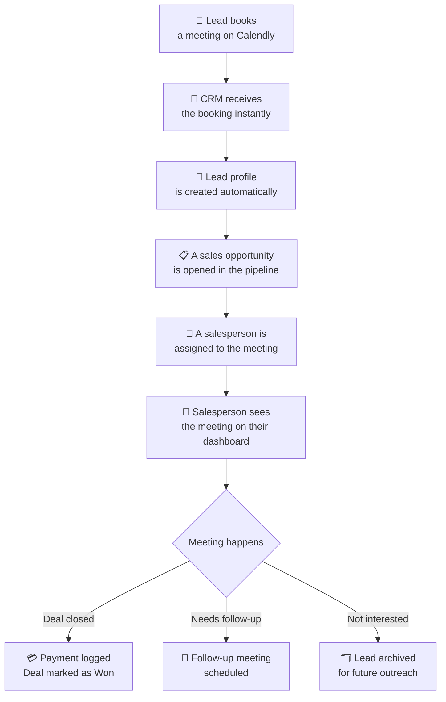
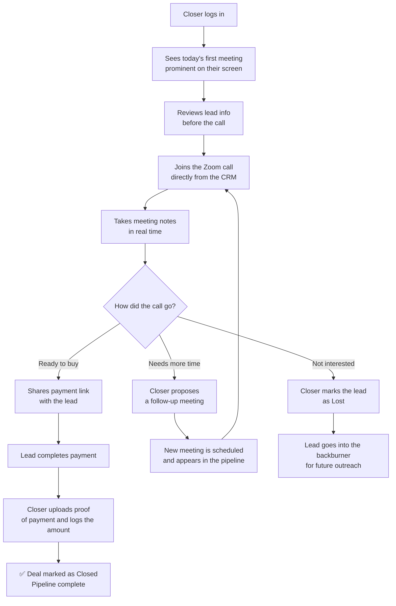
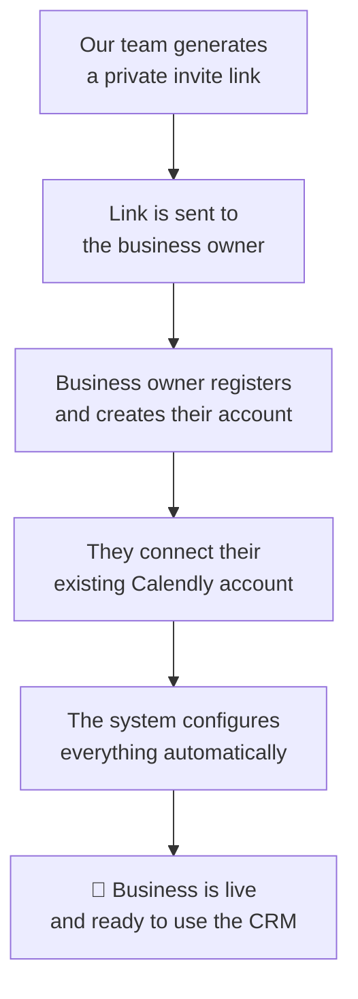

# Sales CRM Platform — Executive Summary

**For:** Leadership, Stakeholders, and Non-Technical Team Members
**Version:** 0.1
**Status:** Pre-Development

---

## What Are We Building?

We are building a **Sales CRM** — a platform that helps sales teams manage their leads, track meetings, and close deals in a structured, organized way.

The product is designed to serve **multiple businesses at once** (called tenants). Each business gets their own private workspace, their own team, and their own data — completely separated from every other business on the platform.

Think of it like a building with many offices. We own and manage the building, but each business rents their own office and operates independently inside it.

---

## The Problem We're Solving

Sales teams that rely on scheduled calls to close deals face a common set of challenges:

- Meetings get booked but nobody tracks what happened afterward
- There's no clear record of which salesperson handled which lead
- Payment confirmation is manual, scattered, and easy to lose
- When a deal doesn't close, follow-ups are forgotten or never happen
- Managers have no real-time visibility into what their team is actually doing

This platform solves all of that — automatically — by connecting directly to the tool these teams already use to schedule meetings: **Calendly**.

---

## How It Works — The Big Picture

The entire system starts the moment a lead books a meeting on Calendly. From that point forward, the CRM takes over and handles everything automatically.

No manual data entry is needed to open a lead. No spreadsheets. No copy-pasting from Calendly into another system. It all flows in automatically.

---

## Who Uses This Platform?

There are three types of people inside each business's workspace:

### 🏢 The Business Owner (Tenant Master)
This is the primary contact for the business — typically the owner or founder. They have full visibility into everything: the entire pipeline, all their salespeople's activity, revenue logged, and overall performance. They can also configure how the system works for their business.

### 📊 The Manager (Tenant Admin)
Managers can monitor the team's pipeline, pull reports, see how each salesperson is performing, and manage who is on the team. They don't close deals themselves — they oversee the operation.

### 📞 The Closer
This is the salesperson on the front lines. They log in and immediately see their schedule for the day — which meetings they have, with whom, and when. They run the call, take notes, share payment links, and log the outcome. Their entire workflow lives inside the CRM.

---

## The Salesperson's Day-to-Day Experience

Everything the closer needs is in one place: the lead's information, the meeting link, a place to write notes, payment links, and the ability to log what happened — all without switching between multiple tools.

---

## How Businesses Get Set Up

We control who gets access to the platform. A new business cannot simply sign up on their own — they go through a managed onboarding process:

Once connected to Calendly, the platform automatically sets up all the behind-the-scenes configuration needed to start receiving meeting data. The business owner doesn't need to do anything technical — they just authorize the connection and they're ready to go.

---

## How Meetings Get Assigned to the Right Salesperson

Many businesses use a setup where Calendly automatically rotates meeting assignments across their sales team — making sure no single closer gets overloaded. This is called a **round robin**.

Our platform reads who Calendly assigned the meeting to, and automatically routes that meeting to the correct salesperson inside the CRM. The closer sees the meeting appear on their dashboard without anyone having to manually assign it.

---

## What Happens When a Meeting Is Canceled?

If a lead cancels their meeting, the CRM catches that too — automatically. The opportunity is updated, and the salesperson is prompted to reach out and attempt to reschedule. Nothing falls through the cracks silently.

---

## The Admin View — For Our Team

Beyond the individual business workspaces, our internal team has a separate admin panel where we can:

- See all businesses currently on the platform and their activity
- Generate invite links for new businesses
- Monitor the health of each business's connection to Calendly
- Assist a business with support without disrupting their data

This gives us full operational control over the platform from a single place.

---

## What We're Building First (MVP)

Rather than building everything at once, we're starting with the core experience that delivers the most immediate value: **the closer's workflow**.

This means that in the first version of the product, the following will be fully functional:

- ✅ Automatic lead creation from Calendly bookings
- ✅ Salesperson dashboard with daily, weekly, and monthly calendar views
- ✅ Meeting detail pages with notes and outcome logging
- ✅ Payment capture with proof upload
- ✅ Follow-up meeting scheduling from within the CRM
- ✅ Lost deal archiving and backburner management
- ✅ Cancellation handling
- ✅ Our internal admin panel for managing tenants

Advanced reporting, manager dashboards, and automated lead communications will follow in subsequent phases once the core pipeline is proven and in use.

---

## Summary

| What | Detail |
|---|---|
| **Product type** | Multi-tenant Sales CRM |
| **Primary data source** | Calendly (meeting bookings) |
| **Core user** | Sales Closers |
| **Key automation** | Lead creation, assignment, and pipeline tracking — all triggered by meeting bookings |
| **MVP focus** | The end-to-end closer workflow: from meeting booked to deal won, followed up, or archived |
| **How businesses join** | Invite-only, managed onboarding by our team |

The goal is simple: **a salesperson should never have to wonder what they're doing today, who they're talking to, or what happened after a call.** The CRM answers all of that automatically, the moment a meeting is booked.

---

*For technical architecture details, refer to the accompanying Technical Specification document.*