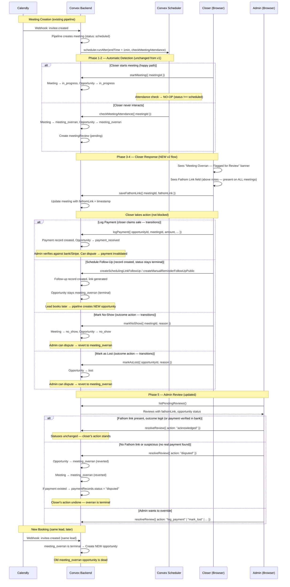
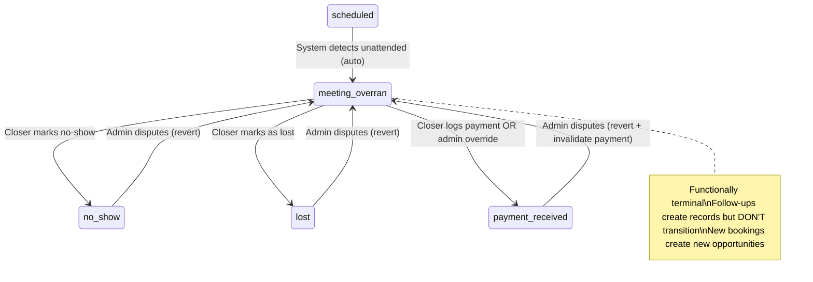
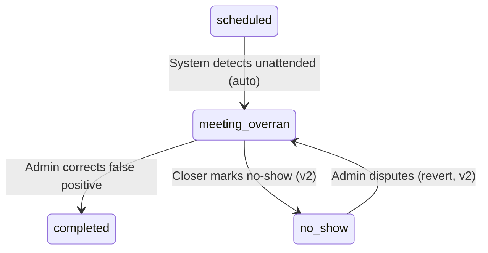

# Meeting Overran Review System v2 — Design Specification

**Version:** 2.0
**Status:** Draft
**Scope:** Redesign the meeting-overran flow from a blocking review gate to a non-blocking flag-and-validate system while the review is pending. The closer retains full operational capability (schedule follow-up, mark no-show, mark lost, log payment) while the system records the flag for admin review. A Fathom recording link field is added to both closer and admin meeting detail pages as the primary attendance artifact for any meeting — replacing the flagged-meeting-only "Provide Context" dialog and providing a general-purpose recording record. Admins gain a `disputed` resolution action for questionable outcomes, and a resolved review locks the overran flow as final.
**Prerequisite:** Meeting Overran Review System v1 fully deployed (schema, detection, admin review pipeline, closer banner). See `plans/late-start-review/late-start-review-design.md`.

---

## Table of Contents

1. [Goals & Non-Goals](#1-goals--non-goals)
2. [Actors & Roles](#2-actors--roles)
3. [End-to-End Flow Overview](#3-end-to-end-flow-overview)
4. [Phase 1: Schema & Status Transition Changes](#4-phase-1-schema--status-transition-changes)
5. [Phase 2: Backend — Replace Blanket Overran Guards](#5-phase-2-backend--replace-blanket-overran-guards)
6. [Phase 3: Backend — Fathom Link & Disputed Resolution](#6-phase-3-backend--fathom-link--disputed-resolution)
7. [Phase 4: Frontend — Closer UX Overhaul](#7-phase-4-frontend--closer-ux-overhaul)
8. [Phase 5: Frontend — Admin Review Updates](#8-phase-5-frontend--admin-review-updates)
9. [Phase 6: Cleanup](#9-phase-6-cleanup)
10. [Data Model](#10-data-model)
11. [Convex Function Architecture](#11-convex-function-architecture)
12. [Routing & Authorization](#12-routing--authorization)
13. [Security Considerations](#13-security-considerations)
14. [Error Handling & Edge Cases](#14-error-handling--edge-cases)
15. [Open Questions](#15-open-questions)
16. [Dependencies](#16-dependencies)
17. [Applicable Skills](#17-applicable-skills)

---

## 1. Goals & Non-Goals

### Goals

- **Flag, don't block.** The system still detects and flags unattended meetings automatically, but the closer retains full operational capability — they can schedule follow-ups (with a Calendly scheduling link or a manual reminder), mark no-show, or mark as lost directly from the meeting detail page.
- **Fathom link = primary attendance evidence (all meeting detail pages).** Both closer and admin meeting detail pages include a Fathom recording link field (above the notes section). The closer pastes their Fathom URL after any meeting — not just flagged ones. The link is stored on the `meetings` table as a first-class meeting attribute. This replaces the "Provide Context" dialog for flagged meetings and provides a general-purpose attendance record.
- **No Fathom link on a flagged meeting = heightened scrutiny, not automatic guilt.** When reviewing a flagged meeting, the admin checks the meeting's Fathom link first. If present, the admin can usually `acknowledge`. If absent, the admin investigates further and either `acknowledges` based on other corroborating evidence (for example a verified payment) or marks the review as `disputed`.
- **`disputed` = revert to `meeting_overran`.** When the admin disputes a review, both the opportunity and meeting statuses revert to `meeting_overran`. Any action the closer took (follow-up, no-show, mark-lost, payment) is undone at the status level. Audit history is preserved, but disputed operational artifacts are neutralized: pending follow-ups are expired, disputed payments are invalidated, and empty auto-conversions are rolled back. The `meeting_overran` status then stands as the final outcome.
- **`meeting_overran` is functionally terminal.** Like `lost`, but tracked separately for reporting purposes. A `meeting_overran` opportunity represents a deal lost because the closer did not attend the meeting — an important signal distinct from "couldn't close." New Calendly bookings from the same lead create a new opportunity; they do not link to the overran one.
- **Closer actions are real — but disputable.** The closer takes normal actions directly. The admin validates the closer's choice. If the Fathom link is missing or the outcome is suspicious, the admin disputes and the closer's action is reversed. Admin override actions remain available for cases where the closer hasn't acted.
- **Pending review is non-blocking; resolved review is final.** While the review is `pending`, the closer can act normally from the meeting detail page. Once an admin resolves the review (`acknowledged` or `disputed`), the overran flow is final: the banner remains visible, but overran-specific outcome actions lock and the backend rejects repeat attempts.
- **Backward-compatible deployment.** All schema changes are additive (new optional fields, expanded union). Existing `meetingReview` records remain valid. No widen-migrate-narrow needed.

### Non-Goals (deferred)

- **Automatic Fathom link validation** — verifying the URL actually points to a real Fathom recording (future integration).
- **Closer-side review status tracking** — showing the admin's resolution to the closer (Phase 2 of the review system, separate design).
- **Compliance reporting dashboards** — aggregated metrics on disputed vs. acknowledged reviews (separate design doc).
- **Close-rate impact of `meeting_overran`** — for reporting purposes, `meeting_overran` as a terminal outcome affects the closer's close rate (same as `lost`). The reporting side-effects are deferred to the compliance dashboard design. The status distinction is established now so reporting can consume it later.
- **Removing `meeting_overran` from `ACTIVE_OPPORTUNITY_STATUSES`** — currently `meeting_overran` is counted as "active" in tenant stats. Since it's functionally terminal, this may need to change, but that's a reporting concern deferred with the dashboard work.
- **Configurable grace period** — per-tenant detection window (deferred from v1, still deferred).

---

## 2. Actors & Roles

| Actor                | Identity                       | Auth Method                               | Key Permissions                                                                                 |
| -------------------- | ------------------------------ | ----------------------------------------- | ----------------------------------------------------------------------------------------------- |
| **Closer**           | Sales rep assigned to meetings | WorkOS AuthKit, member of tenant org       | Save Fathom link on own meetings; schedule follow-up, mark no-show, mark lost, and log payment on own meetings |
| **Tenant Admin**     | Manager / team lead            | WorkOS AuthKit, member of tenant org       | View all pending reviews; resolve reviews (acknowledge, dispute, override); view Fathom links    |
| **Tenant Master**    | Business owner                 | WorkOS AuthKit, member of tenant org       | Same as Tenant Admin + full control                                                              |
| **System (Scheduler)** | Convex scheduled function    | Internal — no user identity               | Automatically flag unattended meetings after scheduled end time (unchanged from v1)              |

### CRM Role ↔ Review Permissions

| CRM `users.role` | Can Save Fathom Link | Can Take Outcome Actions | Can View Review Pipeline | Can Resolve/Dispute Reviews |
| ---------------- | -------------------- | ------------------------ | ------------------------ | --------------------------- |
| `closer`         | ✅ Own meetings      | ✅ Own meetings only     | ❌                       | ❌                          |
| `tenant_admin`   | ✅ All meetings      | ❌                       | ✅ All tenant reviews    | ✅                          |
| `tenant_master`  | ✅ All meetings      | ❌                       | ✅ All tenant reviews    | ✅                          |

### Admin Decision Matrix

| Closer Action      | Fathom Link? | Opp Status After Closer | Admin Action | Effect of Admin Action                                                 | Rationale                                                              |
| ------------------ | ------------ | ----------------------- | ------------ | ---------------------------------------------------------------------- | ---------------------------------------------------------------------- |
| Log Payment        | ✅ Yes       | `payment_received`      | Acknowledged | Stays `payment_received`                                               | Attended, got paid — legit. Admin can verify against bank/Stripe       |
| Log Payment        | ❌ No        | `payment_received`      | Acknowledged | Stays `payment_received`                                               | No Fathom link but admin verified payment in bank/Stripe — legit       |
| Log Payment        | ❌ No        | `payment_received`      | Disputed     | **Reverted to `meeting_overran`; payment record invalidated** ²        | No proof of attendance AND no real payment. Fabricated payment = fraud |
| Mark No-Show       | ✅ Yes       | `no_show`               | Acknowledged | Stays `no_show`                                                        | No-show verified — closer attended, lead didn't                        |
| Mark No-Show       | ❌ No        | `no_show`               | Disputed     | **Reverted to `meeting_overran`**                                      | No proof closer attended. Fake no-show to protect close rate           |
| Mark as Lost       | ✅ Yes       | `lost`                  | Acknowledged | Stays `lost`                                                           | Attended, deal lost — legit                                            |
| Mark as Lost       | ❌ No        | `lost`                  | Disputed     | **Reverted to `meeting_overran`**                                      | Already affects close rate; admin takes offline disciplinary action    |
| Schedule Follow-Up | ✅ Yes       | `meeting_overran` ¹     | Acknowledged | Stays `meeting_overran`                                                | Attended, re-engaging lead — legit. New booking = new opportunity      |
| Schedule Follow-Up | ❌ No        | `meeting_overran` ¹     | Acknowledged | Stays `meeting_overran`                                                | Follow-up doesn't change outcome. Admin notes the missing Fathom link  |
| Schedule Follow-Up | ❌ No        | `meeting_overran` ¹     | Disputed     | **Stays `meeting_overran`; pending follow-up expired**                 | No proof closer attended and the follow-up claim is not trusted        |
| No action taken    | —            | `meeting_overran`       | Override     | Admin sets the outcome (or leaves as `meeting_overran`)                | Admin picks the right outcome based on investigation                   |
| No action taken    | —            | `meeting_overran`       | Acknowledged | Stays `meeting_overran` (functionally terminal)                        | Confirms closer didn't attend — `meeting_overran` is the final status |

¹ *Follow-up actions create the scheduling link / reminder record but do NOT transition the opportunity. The status stays `meeting_overran`. When the lead books through the link, the pipeline creates a new opportunity. Because status does not move, the review UI must also surface the active follow-up record; that record counts as "closer already acted" even while the opportunity remains `meeting_overran`.*

² *When disputing a logged payment: the `paymentRecords` entry is marked `"disputed"` (not deleted — preserved for audit). The `paymentRecords.status` field already supports `"disputed"` and the codebase already filters disputed payments from all revenue calculations (`syncCustomerPaymentSummary`, reporting aggregates, dashboard stats). Tenant stats (`wonDeals`, `totalRevenueMinor`, `totalPaymentRecords`) are reversed in the same transaction, and if that payment was the sole basis for an auto-converted customer, the customer conversion is rolled back. The closer fabricating a payment is a much worse offense than missing a meeting — the admin handles disciplinary action offline.*

---

## 3. End-to-End Flow Overview



---

## 4. Phase 1: Schema & Status Transition Changes

### 4.1 Why Schema First

Schema changes must deploy to Convex before any backend code that reads/writes the new fields. All changes are additive (new optional fields, expanded union) — no migration is needed.

> **Decision:** Keep existing `closerResponse`, `closerNote`, `closerStatedOutcome`, and `estimatedMeetingDurationMinutes` fields on `meetingReviews`. There is production data in these fields from the v1 system. They are deprecated in v2 but remain valid for backward display in the admin review pipeline.

### 4.2 Schema Additions — `meetings` Table (Fathom Link)

The Fathom link is a **general meeting attribute**, not specific to the overran review. Every meeting can have one. It lives on the `meetings` table alongside `notes` and `meetingOutcome`.

```typescript
// Path: convex/schema.ts — meetings table, after meetingOutcome field
    // NEW v2: Fathom recording link — proof of attendance.
    // Available on all meetings. Checked by admin when reviewing flagged meetings.
    fathomLink: v.optional(v.string()),
    fathomLinkSavedAt: v.optional(v.number()),
```

### 4.3 Schema Additions — `meetingReviews` Table (Disputed Resolution)

```typescript
// Path: convex/schema.ts — meetingReviews table
meetingReviews: defineTable({
  // ... existing fields ...

  // MODIFIED v2: Expanded resolutionAction union
  resolutionAction: v.optional(
    v.union(
      v.literal("log_payment"),
      v.literal("schedule_follow_up"),
      v.literal("mark_no_show"),
      v.literal("mark_lost"),
      v.literal("acknowledged"),
      v.literal("disputed"),       // ← NEW v2
    ),
  ),
})
```

### 4.4 Meeting Status Transition Expansion

The `markNoShow` closer mutation transitions both the meeting and opportunity statuses. Currently `MEETING_VALID_TRANSITIONS.meeting_overran` only allows `["completed"]` (false-positive correction by admin). We need to add `no_show` so the closer can mark a flagged meeting's lead as a no-show.

```typescript
// Path: convex/lib/statusTransitions.ts
export const MEETING_VALID_TRANSITIONS: Record<MeetingStatus, MeetingStatus[]> = {
  scheduled: ["in_progress", "completed", "meeting_overran", "canceled", "no_show"],
  in_progress: ["completed", "no_show", "canceled"],
  meeting_overran: ["completed", "no_show"],  // was: ["completed"] only
  completed: [],
  canceled: [],
  no_show: ["scheduled"],
};
```

> **Decision:** We do NOT add a transition from `meeting_overran` → `lost` or `meeting_overran` → `follow_up_scheduled` at the **meeting** level. The `markAsLost` and follow-up mutations only transition the **opportunity** status — they don't touch the meeting status. The meeting stays `meeting_overran` unless the admin corrects a false positive (→ `completed`) or the closer marks no-show (→ `no_show`). This preserves the system's observation as a permanent record on the meeting.

### 4.5 Opportunity Transitions (No Change)

`VALID_TRANSITIONS.meeting_overran` already includes `["payment_received", "follow_up_scheduled", "no_show", "lost"]`. No modification needed to the map. However, `follow_up_scheduled` is effectively unreachable in v2 because follow-up mutations skip the transition for `meeting_overran` (see Phase 2, Section 5.4). The transitions that actually fire are: `no_show` (closer marks no-show), `lost` (closer marks as lost), `payment_received` (closer logs payment or admin override).

---

## 5. Phase 2: Backend — Replace Blanket Overran Guards

### 5.1 What & Why

Every closer mutation explicitly rejects `meeting_overran` opportunities with the same error: _"This opportunity is under meeting-overran review and cannot be resolved by the closer."_ This appears in **8 locations** across 5 files.

That blanket guard is too strict while a review is still pending, but deleting it outright would create a second problem: after an admin resolves the review, the closer could keep re-acting on the same flagged meeting forever. The correct change is to replace the blanket throw with a shared **pending-review guard**:

- If the linked overran review is `pending`, allow the action.
- If the linked overran review is `resolved`, reject the action because the review outcome is final.
- If the action is a follow-up, still keep the opportunity status at `meeting_overran`.

Since `meeting_overran` is functionally terminal, the three types of closer actions need different treatment:

| Action type     | Examples                          | Behavior for `meeting_overran`                                              |
| --------------- | --------------------------------- | --------------------------------------------------------------------------- |
| **Outcome**     | Mark as Lost, Mark No-Show        | **Replace guard → allow while review is pending.** Closer declares an outcome; admin can dispute & revert. |
| **Payment**     | Log Payment                       | **Replace guard → allow while review is pending.** Closer logs payment; admin verifies against bank/Stripe. If fraudulent, admin disputes → payment invalidated, stats reversed. |
| **Follow-up**   | Scheduling Link, Manual Reminder  | **Replace guard → allow while review is pending + skip status transition.** Create the record (link/reminder) but do NOT transition the opportunity. Status stays `meeting_overran`. |

Additionally, **pipeline webhook guards** in `inviteeNoShow.ts` and `inviteeCanceled.ts` explicitly ignore webhook events when the opportunity is `meeting_overran`. These guards are **unchanged** — they correctly prevent race conditions where a Calendly webhook could inadvertently transition a flagged opportunity.

> **Decision — why follow-ups don't transition:** If the opportunity transitions to `follow_up_scheduled`, the pipeline's UTM deterministic linking (line 1041 of `inviteeCreated.ts`) would link the lead's new booking to the same dead opportunity. By keeping the status as `meeting_overran`, the pipeline's UTM check fails (`"meeting_overran" !== "follow_up_scheduled"`) and falls through to create a **new opportunity** — which is the correct behavior for a terminal opportunity.
>
> The closer still gets the scheduling link to send to the lead. The follow-up record is still created for reference. But the opportunity is already dead — the new booking gets a fresh start.

> **Implementation rule:** Do **not** remove the `meeting_overran` checks as raw deletions. Centralize the new behavior in a helper such as `assertOverranReviewStillPending(...)`, and call it from every closer mutation/action that now supports `meeting_overran`. This keeps the non-blocking behavior during review, but preserves a hard stop once the admin has resolved the review.

### 5.2 `markAsLost` — Replace Guard with Pending-Review Check

```typescript
// Path: convex/closer/meetingActions.ts — markAsLost handler

// REPLACE the blanket guard with the shared pending-review helper:
if (opportunity.status === "meeting_overran") {
  await assertOverranReviewStillPending(ctx, opportunity._id);
}

// The validateTransition() call below already allows meeting_overran → lost:
if (!validateTransition(opportunity.status, "lost")) {
  throw new Error(
    `Cannot mark as lost from status "${opportunity.status}". ` +
    `Only "in_progress" opportunities can be marked as lost.`
  );
}
```

The error message on the `validateTransition` fallback should also be updated since `"in_progress"` is no longer the only valid source:

```typescript
// Path: convex/closer/meetingActions.ts
if (!validateTransition(opportunity.status, "lost")) {
  throw new Error(
    `Cannot mark as lost from status "${opportunity.status}"`,
  );
}
```

### 5.3 `markNoShow` — Replace Guard + Expand Meeting Status Check

Two changes in the same handler:

```typescript
// Path: convex/closer/noShowActions.ts — markNoShow handler

// 1. EXPAND meeting status check (~line 49-52):
// BEFORE:
if (meeting.status !== "in_progress") {
  throw new Error(
    `Can only mark no-show on in-progress meetings (current: "${meeting.status}")`,
  );
}

// AFTER:
if (meeting.status !== "in_progress" && meeting.status !== "meeting_overran") {
  throw new Error(
    `Can only mark no-show on in-progress or meeting-overran meetings (current: "${meeting.status}")`,
  );
}

// 2. REPLACE the opportunity guard (~lines 62-66):
if (opportunity.status === "meeting_overran") {
  await assertOverranReviewStillPending(ctx, opportunity._id);
}
```

The meeting transition `meeting_overran → no_show` is now validated via `MEETING_VALID_TRANSITIONS` (added in Phase 1). The opportunity transition `meeting_overran → no_show` is already valid.

### 5.4 Follow-Up Mutations — Replace Guards with Skip-Transition Logic

The follow-up mutations need a more nuanced change than the outcome mutations. Instead of deleting the guard, we **replace it with two behaviors**:

1. Call the shared pending-review helper so follow-up creation is only allowed while the overran review is still `pending`.
2. Keep the opportunity status in `meeting_overran` even when the follow-up record is created.

#### `createSchedulingLinkFollowUp` (~line 185-189)

**Replace the throw with the shared helper.** This function already does NOT transition the opportunity (it defers to `confirmFollowUpScheduled`). After the helper passes, the follow-up record and scheduling link URL are created normally.

```typescript
// Path: convex/closer/followUpMutations.ts — createSchedulingLinkFollowUp

// REPLACE this block:
if (opportunity.status === "meeting_overran") {
  await assertOverranReviewStillPending(ctx, opportunity._id);
}

// The validateTransition() check below will pass (meeting_overran → follow_up_scheduled is valid)
// but the actual transition is deferred to confirmFollowUpScheduled — which handles the skip.
```

#### `confirmFollowUpScheduled` (~line 269-273)

**Replace the throw with a resolved-review check + silent return.** When the closer clicks "Done" in the scheduling link dialog, this mutation is called. For `meeting_overran`, we skip the transition — the opportunity is terminal.

```typescript
// Path: convex/closer/followUpMutations.ts — confirmFollowUpScheduled

// BEFORE:
if (opportunity.status === "meeting_overran") {
  await assertOverranReviewStillPending(ctx, opportunity._id);
}

// AFTER:
// meeting_overran is terminal — the scheduling link was created but the opportunity
// doesn't transition. When the lead books, the pipeline creates a new opportunity.
if (opportunity.status === "meeting_overran") {
  return;
}
```

#### `createManualReminderFollowUpPublic` (~line 329-333)

**Replace the throw with conditional transition.** Create the reminder record but skip the opportunity status change.

```typescript
// Path: convex/closer/followUpMutations.ts — createManualReminderFollowUpPublic

// REPLACE the guard with conditional logic:
if (opportunity.status === "meeting_overran") {
  await assertOverranReviewStillPending(ctx, opportunity._id);
}
const isTerminalOverran = opportunity.status === "meeting_overran";

// ... create the followUps record (always) ...

// Only transition if the opportunity is NOT terminal
if (!isTerminalOverran) {
  if (!validateTransition(opportunity.status, "follow_up_scheduled")) {
    throw new Error(
      `Cannot schedule follow-up from status "${opportunity.status}"`,
    );
  }

  await ctx.db.patch(opportunityId, {
    status: "follow_up_scheduled",
    updatedAt: now,
  });
  await replaceOpportunityAggregate(ctx, opportunity, opportunityId);

  // ... stat updates, domain events for status change ...
}

// Domain event for the follow-up creation is emitted regardless
```

#### `transitionToFollowUp` internal helper (~line 75-79)

**Same pattern as `createManualReminderFollowUpPublic`** — skip the transition when `meeting_overran`.

```typescript
// Path: convex/closer/followUpMutations.ts — transitionToFollowUp

// REPLACE:
if (opportunity.status === "meeting_overran") {
  await assertOverranReviewStillPending(ctx, opportunity._id);
  return;
}
```

> **Why this matters:** The scheduling link URL includes `utm_campaign=<opportunityId>`. If the opportunity transitioned to `follow_up_scheduled`, the pipeline's UTM deterministic linking (line 1041 of `inviteeCreated.ts`) would match the status and link the new booking to the same dead opportunity. By keeping the status as `meeting_overran`, the UTM check fails → pipeline creates a new opportunity.

### 5.5 `logPayment` — Replace Guard with Pending-Review Check

The `logPayment` mutation in `convex/closer/payments.ts` has a `meeting_overran` guard (~line 124) that must be **replaced with the shared pending-review helper**. The closer may have genuinely attended the meeting and received payment — blocking this action punishes honest closers while the review is still pending. After the review is resolved, the helper blocks repeat action attempts.

```typescript
// Path: convex/closer/payments.ts — logPayment handler

// REPLACE this block (~lines 124-128):
if (opportunity.status === "meeting_overran") {
  await assertOverranReviewStillPending(ctx, opportunity._id);
}

// The validateTransition() call below already allows meeting_overran → payment_received.
// The payment record is created normally. If the admin later disputes, the payment
// record is marked "disputed" and all stats are reversed (see Section 6.2).
```

> **Rationale:** If a closer fabricates a payment on a meeting they didn't attend, that's outright fraud — a far worse offense than missing a meeting. The admin can verify the payment against bank records / Stripe / the payment provider. The existing `paymentRecords.status` field already supports `"disputed"`, and the entire codebase already filters disputed payments from revenue calculations. The closer has strong incentives not to lie about payment since it's easily verifiable. The admin review process catches any discrepancies.
>
> **Error message update:** The `validateTransition` fallback message should also be updated:
> ```typescript
> if (!validateTransition(opportunity.status, "payment_received")) {
>   throw new Error(
>     `Cannot log payment for opportunity with status "${opportunity.status}"`,
>   );
> }
> ```

### 5.6 `createFollowUp` Action — Replace Guard with Pending-Review Check

The `createFollowUp` action in `convex/closer/followUp.ts` is a `"use node"` Convex action that creates Calendly scheduling links via the Calendly API. It has a `meeting_overran` guard (~line 103) that must be **replaced** so the closer can generate scheduling links for flagged meetings while the review is still pending.

```typescript
// Path: convex/closer/followUp.ts — createFollowUp action

// REPLACE this block (~lines 103-107):
if (opportunity.status === "meeting_overran") {
  await assertOverranReviewStillPendingViaQuery(ctx, opportunityId);
}

// The validateTransition() call below passes (meeting_overran → follow_up_scheduled is valid
// in VALID_TRANSITIONS). The action proceeds to create the Calendly scheduling link.
// The actual status transition is handled by the mutation chain (transitionToFollowUp in
// followUpMutations.ts), which returns early for meeting_overran — see Section 5.4.
```

> **Note:** This is a `"use node"` action file (separate from the mutation file `followUpMutations.ts`). The action handles the Calendly API call to create the scheduling link; the mutations handle the DB writes. The skip-transition logic lives at the mutation level (Section 5.4), but the pending-review check must exist here too so a resolved overran review cannot still create new links.

### 5.7 Pipeline Webhook Guards — Unchanged

Two pipeline handlers explicitly ignore webhook events when the opportunity is in `meeting_overran` status. These guards are **intentionally unchanged** — they prevent Calendly webhooks from interfering with the review process.

#### `inviteeNoShow.ts` (~line 96)

```typescript
// Path: convex/pipeline/inviteeNoShow.ts — NO CHANGE

// When Calendly fires a no-show webhook for a meeting whose opportunity is
// already meeting_overran, the pipeline logs a domain event and skips processing.
// This prevents the webhook from transitioning the meeting to no_show before
// the closer or admin has a chance to review.
if (opportunity?.status === "meeting_overran") {
  // ... logs "[Pipeline:no-show] IGNORED - opportunity is meeting_overran"
  // ... emits "meeting.webhook_ignored_overran" domain event
  // ... marks raw event as processed
  return;
}
```

#### `inviteeCanceled.ts` (~line 102)

```typescript
// Path: convex/pipeline/inviteeCanceled.ts — NO CHANGE

// Same pattern — Calendly cancellation webhooks are ignored for meeting_overran
// opportunities. The review process owns the outcome for these meetings.
if (opportunity?.status === "meeting_overran") {
  // ... logs "[Pipeline:invitee.canceled] IGNORED - opportunity is meeting_overran"
  // ... emits "meeting.webhook_ignored_overran" domain event
  // ... marks raw event as processed
  return;
}
```

> **Rationale:** These guards protect a critical invariant: once a meeting is flagged as overran, only the closer (via direct action) or admin (via review resolution) can change its status. External webhook events must not bypass the review pipeline. The `meeting.webhook_ignored_overran` domain event provides an audit trail of ignored webhooks.

---

## 6. Phase 3: Backend — Fathom Link & Disputed Resolution

### 6.1 New Mutation: `saveFathomLink`

The closer pastes a Fathom recording URL and clicks Save. This works on **any meeting**, not just flagged ones. The mutation follows the same pattern as `updateMeetingNotes` — takes a `meetingId`, validates tenant + ownership, patches the meeting document.

```typescript
// Path: convex/closer/meetingActions.ts

export const saveFathomLink = mutation({
  args: {
    meetingId: v.id("meetings"),
    fathomLink: v.string(),
  },
  handler: async (ctx, { meetingId, fathomLink: rawLink }) => {
    console.log("[Closer:Meeting] saveFathomLink called", { meetingId });
    const { userId, tenantId, role } = await requireTenantUser(ctx, [
      "closer",
      "tenant_master",
      "tenant_admin",
    ]);

    const { meeting, opportunity } = await loadMeetingContext(ctx, meetingId, tenantId);

    // Closer authorization: only own meetings
    if (role === "closer" && opportunity.assignedCloserId !== userId) {
      throw new Error("Not your meeting");
    }

    const fathomLink = rawLink.trim();
    if (!fathomLink) {
      throw new Error("Fathom link is required");
    }

    const now = Date.now();
    await ctx.db.patch(meetingId, {
      fathomLink,
      fathomLinkSavedAt: now,
    });

    console.log("[Closer:Meeting] saveFathomLink completed", { meetingId });
  },
});
```

> **Decision:** The Fathom link is stored on the `meetings` table, not `meetingReviews`. It's a general meeting attribute — closers should record their Fathom link for every meeting, not just flagged ones. The admin review pipeline reads it from the meeting document (which it already fetches). This also means the Fathom link persists even if a review is resolved and a new review is created — the proof lives with the meeting itself.
>
> **Auth pattern:** Follows the exact same role + ownership pattern as `updateMeetingNotes` — closers can save on own meetings, admins can save on any meeting within their tenant. Uses the existing `loadMeetingContext` helper.

### 6.2 `resolveReview` — Add `disputed` Resolution Action

```typescript
// Path: convex/reviews/mutations.ts — resolveReview mutation args

// EXPAND the resolutionAction validator:
resolutionAction: v.union(
  v.literal("log_payment"),
  v.literal("schedule_follow_up"),
  v.literal("mark_no_show"),
  v.literal("mark_lost"),
  v.literal("acknowledged"),
  v.literal("disputed"),       // ← NEW v2
),
```

Handle `acknowledged` and `disputed` as separate early-return branches. `acknowledged` leaves statuses unchanged; `disputed` **reverts the flagged flow back to `meeting_overran` and finalizes it**.

There are four critical rules in v2:

1. **If the closer has already acted, the admin can only `acknowledge` or `dispute`.** "Already acted" means either the opportunity has moved away from `meeting_overran`, or there is an active follow-up record on the still-overran opportunity.
2. **`schedule_follow_up` is side-effect only in review resolution.** It creates the follow-up record, resolves the review, and keeps the opportunity in `meeting_overran`.
3. **A disputed payment must roll back the auto-conversion if that payment created a now-empty customer.** Leaving a zero-paid customer attached to a fraudulent `meeting_overran` outcome is not sound.
4. **A disputed pending follow-up must be expired, not left live.** The record stays for audit, but unused scheduling links and manual reminders must stop acting as current workflow after dispute.

```typescript
// Path: convex/reviews/mutations.ts — resolveReview handler

const followUpContext = await getLatestReviewFollowUpContext(
  ctx,
  opportunity._id,
);

const closerAlreadyActed =
  opportunity.status !== "meeting_overran" || followUpContext !== null;

// Only "acknowledged" and "disputed" are valid once the closer has already acted.
if (
  closerAlreadyActed &&
  args.resolutionAction !== "acknowledged" &&
  args.resolutionAction !== "disputed"
) {
  throw new Error(
    "Direct override actions are only available before the closer has already acted.",
  );
}

if (args.resolutionAction === "acknowledged") {
  // Resolve review, leave current statuses as-is.
}

if (args.resolutionAction === "schedule_follow_up") {
  await createManualReminder(...);
  // Resolve review, but do NOT transition the opportunity.
}

if (args.resolutionAction === "disputed") {
  const previousOpportunityStatus = opportunity.status;
  const previousMeetingStatus = meeting.status;

  // Revert any post-review descendant state back to meeting_overran.
  // This includes no_show, lost, payment_received, follow_up_scheduled,
  // and reschedule_link_sent if the closer kept acting after a no-show outcome.

  // Expire any pending follow-ups on this opportunity so disputed reminder/link
  // artifacts stop acting as live workflow while remaining in the audit trail.

  // If payment_received is being disputed, invalidate the winning payment
  // linked to this opportunity/meeting, reverse tenant stats, resync the
  // customer's payment summary, and roll back the auto-conversion if that
  // customer now has zero remaining non-disputed payments and this opportunity
  // was the winning opportunity.
}
```

> **Implementation note — payment/customer rollback:** Extract `syncCustomerPaymentSummary` to a shared export (for example `convex/lib/paymentHelpers.ts`) and add a companion helper such as `rollbackCustomerConversionIfEmpty(...)`. That helper should:
>
> - load the disputed payment's `customerId`
> - recompute non-disputed payments for that customer
> - if zero remain and `customer.winningOpportunityId === opportunity._id`, clear `customerId` from linked disputed payments, delete the customer, delete the customer aggregate row, patch the lead back to `active`, and reverse `tenantStats.totalCustomers/totalLeads`
> - otherwise keep the customer and only resync the payment summary
>
> This keeps the disputed payment in the audit trail without leaving behind a false customer conversion.
>
> **Implementation note — pending follow-up invalidation:** Add a helper such as `expirePendingFollowUpsForOpportunity(...)` that marks pending follow-ups on the disputed opportunity as `expired` without deleting them. `booked` and `completed` follow-ups should remain untouched for audit and downstream history.

### 6.3 Deprecate Old Mutations

```typescript
// Path: convex/closer/meetingOverrun.ts

/**
 * @deprecated v2 — The "Provide Context" dialog has been removed. Closers now
 * save a Fathom link via saveFathomLink() and take outcome actions directly.
 * Retained for backward compatibility with any in-flight requests during deploy.
 */
export const respondToOverranReview = mutation({ /* ... unchanged ... */ });

/**
 * @deprecated v2 — The closer now uses the standard FollowUpDialog (createSchedulingLinkFollowUp
 * or createManualReminderFollowUpPublic) instead of this overran-specific follow-up.
 * Retained for backward compatibility.
 */
export const scheduleFollowUpFromOverran = mutation({ /* ... unchanged ... */ });
```

---

## 7. Phase 4: Frontend — Closer UX Overhaul

### 7.1 `OutcomeActionBar` — Enable Overran Actions Only While Review Is Pending

Currently the component returns `null` when `opportunity.status === "meeting_overran"`, which creates the blocked v1 experience. In v2 that is only half-right: `meeting_overran` should be actionable while the linked review is `pending`, and locked once the review is `resolved`.

The component therefore needs review awareness:

```tsx
// Path: app/workspace/closer/meetings/_components/outcome-action-bar.tsx

type OutcomeActionBarProps = {
  meeting: Doc<"meetings">;
  opportunity: Doc<"opportunities">;
  payments: Doc<"paymentRecords">[];
  meetingReview?: Doc<"meetingReviews"> | null;   // ← NEW
  onStatusChanged?: () => Promise<void>;
};

const isMeetingOverran = opportunity.status === "meeting_overran";
const isPendingOverranReview =
  isMeetingOverran && meetingReview?.status === "pending";
const isResolvedOverranReview =
  isMeetingOverran && meetingReview?.status === "resolved";
```

Guarding rules:

- If `opportunity.status === "meeting_overran"` and `meetingReview?.status === "pending"`, show the overran action set.
- If `opportunity.status === "meeting_overran"` and the review is `resolved` or missing, hide overran actions. The backend also rejects them via the shared pending-review guard, so the UI should not imply they are available.
- Existing `no_show`, `payment_received`, `lost`, and other terminal-path rules remain unchanged.

```tsx
// Path: app/workspace/closer/meetings/_components/outcome-action-bar.tsx

if (isNoShow) return null;
if (isResolvedOverranReview) return null;

if (
  !isScheduled &&
  !isInProgress &&
  !isCanceled &&
  !isPendingOverranReview
) {
  return null;
}
```

Actions available for each state:

| Action             | `scheduled`     | `in_progress` | `canceled` | `meeting_overran` + review `pending` | `meeting_overran` + review `resolved` |
| ------------------ | --------------- | ------------- | ---------- | ------------------------------------ | ------------------------------------- |
| Start Meeting      | ✅ (in window)  | ❌            | ❌         | ❌                                   | ❌                                    |
| Log Payment        | ❌              | ✅            | ❌         | ✅                                   | ❌                                    |
| Schedule Follow-Up | ❌              | ✅            | ✅         | ✅                                   | ❌                                    |
| Mark No-Show       | ❌              | ✅            | ❌         | ✅                                   | ❌                                    |
| Mark as Lost       | ❌              | ✅            | ❌         | ✅                                   | ❌                                    |

Implementation:

```tsx
// Path: app/workspace/closer/meetings/_components/outcome-action-bar.tsx

{/* Log Payment — in_progress or pending overran review */}
{(isInProgress || isPendingOverranReview) && (
  <PaymentFormDialog
    opportunityId={opportunity._id}
    meetingId={meeting._id}
    onSuccess={onStatusChanged}
  />
)}

{/* Schedule Follow-Up — in_progress, canceled, or pending overran review */}
{(isInProgress || isCanceled || isPendingOverranReview) && (
  <FollowUpDialog
    opportunityId={opportunity._id}
    onSuccess={onStatusChanged}
  />
)}

{/* Separator — show when destructive actions are available */}
{(isInProgress || isPendingOverranReview) && <Separator />}

{/* Mark No-Show — in_progress or pending overran review */}
{(isInProgress || isPendingOverranReview) && (
  <>
    <Button variant="outline" onClick={() => setShowNoShowDialog(true)}>
      <UserXIcon data-icon="inline-start" />
      Mark No-Show
    </Button>
    <MarkNoShowDialog
      open={showNoShowDialog}
      onOpenChange={setShowNoShowDialog}
      meetingId={meeting._id}
      startedAt={meeting.startedAt}
      onSuccess={onStatusChanged}
    />
  </>
)}

{/* Mark as Lost — in_progress or pending overran review */}
{(isInProgress || isPendingOverranReview) && (
  <MarkLostDialog
    opportunityId={opportunity._id}
    onSuccess={onStatusChanged}
  />
)}
```

> **Important copy change:** [app/workspace/closer/meetings/_components/mark-lost-dialog.tsx](/Users/nimbus/dev/ptdom-crm/app/workspace/closer/meetings/_components/mark-lost-dialog.tsx) currently says the action is "permanent and cannot be undone." That is no longer true for flagged meetings. Update the copy to something like: _"This marks the opportunity as lost. If this meeting is under overran review, an admin may still dispute the outcome."_ The destructive tone stays, but it must not contradict the review model.

### 7.2 `MeetingOverranBanner` — Persistent Informational Banner Across the Review Lifecycle

The banner should stay visible whenever a `meetingReview` exists, not only while the opportunity or meeting status literally equals `meeting_overran`. Otherwise it disappears as soon as the closer marks `no_show`, `lost`, or `payment_received`, even though the review is still pending.

The banner remains purely informational, but it now needs the current opportunity status so it can communicate the right state:

- `pending` + opportunity still `meeting_overran`: flagged and awaiting closer/admin action
- `pending` + opportunity moved away from `meeting_overran`: closer action recorded and awaiting admin validation
- `resolved` + `acknowledged`: review completed, closer/admin outcome stands
- `resolved` + `disputed`: review completed, overran ruling stands as final

```tsx
// Path: app/workspace/closer/meetings/_components/meeting-overran-banner.tsx

type MeetingOverranBannerProps = {
  meeting: Doc<"meetings">;
  meetingReview: Doc<"meetingReviews">;
  opportunityStatus: Doc<"opportunities">["status"];   // ← NEW
};

const reviewPending = meetingReview.status === "pending";
const reviewResolved = meetingReview.status === "resolved";
const closerAlreadyActed = opportunityStatus !== "meeting_overran";
```

Recommended messaging blocks:

```tsx
{/* Pending + closer already acted */}
{reviewPending && closerAlreadyActed && (
  <div className="rounded-md border border-blue-200/60 bg-blue-50/60 p-3 dark:border-blue-800/30 dark:bg-blue-950/20">
    <p className="text-sm font-medium text-blue-700 dark:text-blue-400">
      Your action has been recorded and is awaiting admin validation.
    </p>
  </div>
)}

{/* Resolved */}
{reviewResolved && (
  <div className={cn(
    "rounded-md border p-3",
    meetingReview.resolutionAction === "disputed"
      ? "border-red-200/60 bg-red-50/60 dark:border-red-800/30 dark:bg-red-950/20"
      : "border-emerald-200/60 bg-emerald-50/60 dark:border-emerald-800/30 dark:bg-emerald-950/20",
  )}>
    <p className={cn(
      "text-sm font-medium",
      meetingReview.resolutionAction === "disputed"
        ? "text-red-700 dark:text-red-400"
        : "text-emerald-700 dark:text-emerald-400",
    )}>
      {meetingReview.resolutionAction === "disputed"
        ? "This review was disputed by an admin. Meeting overran is the final outcome."
        : "This review was acknowledged by an admin."}
    </p>
  </div>
)}
```

> **Decision:** Banner visibility follows the existence of the review record, not the current status string. That keeps the closer informed during the exact window where the review still matters.

### 7.3 New Component: `FathomLinkField` — Reused on Both Meeting Detail Pages

A new component rendered on both meeting detail pages, right above the `MeetingNotes` section. It follows the same save pattern regardless of whether the viewer is the closer or an admin.

**Visual structure:**

```
┌─────────────────────────────────────────────────────────────────┐
│ 🔗 Fathom Recording                               ✓ Saved 3:15 │
│ ┌────────────────────────────────────────────┐ ┌─────────────┐  │
│ │ https://fathom.video/call/abc123...         │ │  Save       │  │
│ └────────────────────────────────────────────┘ └─────────────┘  │
│ Paste your Fathom recording link for this meeting.              │
└─────────────────────────────────────────────────────────────────┘
```

```tsx
// Path: app/workspace/closer/meetings/_components/fathom-link-field.tsx
"use client";

import { useState } from "react";
import { useMutation } from "convex/react";
import { api } from "@/convex/_generated/api";
import type { Id } from "@/convex/_generated/dataModel";
import { Button } from "@/components/ui/button";
import { Input } from "@/components/ui/input";
import { Card, CardContent, CardHeader, CardTitle } from "@/components/ui/card";
import { Spinner } from "@/components/ui/spinner";
import { LinkIcon, SaveIcon, CheckCircle2Icon } from "lucide-react";
import { format } from "date-fns";
import { toast } from "sonner";
import posthog from "posthog-js";

type FathomLinkFieldProps = {
  meetingId: Id<"meetings">;
  initialLink: string;
  savedAt: number | undefined;
};
```

> **Decision:** Keep this as a shared UI component and reuse it from both the closer and admin meeting detail routes. The field is a meeting attribute, not a persona-specific affordance.

### 7.4 Delete `meeting-overran-context-dialog.tsx`

Remove the file entirely. It contained the v1 "Provide Context" workflow, which is no longer part of the v2 interaction model.

```bash
rm app/workspace/closer/meetings/_components/meeting-overran-context-dialog.tsx
```

### 7.5 `meeting-detail-page-client.tsx` — Keep Banner Mounted, Pass Review State, Add Fathom Field

Three changes are required:

1. Render the overran banner whenever `meetingReview` exists.
2. Pass `meetingReview` into `OutcomeActionBar` so overran actions only appear while the review is pending.
3. Add `FathomLinkField` above `MeetingNotes`.

```tsx
// Path: app/workspace/closer/meetings/[meetingId]/_components/meeting-detail-page-client.tsx

import { FathomLinkField } from "../../_components/fathom-link-field";

{/* Banner — render whenever the review record exists */}
{meetingReview && (
  <MeetingOverranBanner
    meeting={meeting}
    meetingReview={meetingReview}
    opportunityStatus={opportunity.status}
  />
)}

{/* Outcome action bar — now review-aware */}
<OutcomeActionBar
  meeting={meeting}
  opportunity={opportunity}
  payments={payments}
  meetingReview={meetingReview}
  onStatusChanged={refreshDetail}
/>

{/* Fathom Recording Link — all meetings */}
<FathomLinkField
  meetingId={meeting._id}
  initialLink={meeting.fathomLink ?? ""}
  savedAt={meeting.fathomLinkSavedAt}
/>

{/* Notes with outcome select */}
<MeetingNotes
  meetingId={meeting._id}
  initialNotes={meeting.notes ?? ""}
  meetingOutcome={meeting.meetingOutcome}
/>
```

---

## 8. Phase 5: Frontend — Admin Review Updates

### 8.1 `ReviewResolutionBar` — Add `disputed` and Narrow Actions Once the Closer Has Already Acted

The current bar always shows every resolution action plus `acknowledge`. That is too permissive for v2.

The correct rule is:

- If the closer has **not** acted yet, the admin may use direct override actions.
- If the closer **has** acted already, the admin should only see `acknowledge` and `dispute`.

In v2, "closer has already acted" means either:

- `opportunityStatus !== "meeting_overran"`, or
- there is an active follow-up record on the still-overran opportunity

That second branch matters because follow-up on a terminal overran opportunity does not change the status.

```tsx
// Path: app/workspace/reviews/[reviewId]/_components/review-resolution-bar.tsx

import { ShieldAlertIcon } from "lucide-react";

type ResolutionAction =
  | "log_payment"
  | "schedule_follow_up"
  | "mark_no_show"
  | "mark_lost"
  | "acknowledged"
  | "disputed";

type ReviewResolutionBarProps = {
  reviewId: Id<"meetingReviews">;
  closerResponse?: string;
  opportunityStatus: string;
  activeFollowUp?: {
    type: "scheduling_link" | "manual_reminder";
    status: "pending" | "booked" | "completed" | "expired";
  } | null;   // ← NEW
};

const closerAlreadyActed =
  opportunityStatus !== "meeting_overran" || Boolean(activeFollowUp);

const visibleButtons = closerAlreadyActed
  ? RESOLUTION_BUTTONS.filter(
      ({ action }) => action === "acknowledged" || action === "disputed",
    )
  : RESOLUTION_BUTTONS;
```

Message logic:

```tsx
{opportunityStatus !== "meeting_overran" && (
  <p className="mb-3 text-sm text-muted-foreground">
    The closer has already taken action — the opportunity is now{" "}
    <strong>{opportunityStatus.replace(/_/g, " ")}</strong>. You may
    acknowledge or dispute that action.
  </p>
)}

{opportunityStatus === "meeting_overran" && activeFollowUp && (
  <p className="mb-3 text-sm text-muted-foreground">
    The closer already created a{" "}
    <strong>
      {activeFollowUp.type === "manual_reminder"
        ? "manual reminder"
        : "scheduling link"}
    </strong>{" "}
    while leaving the opportunity in meeting overran. You may acknowledge
    or dispute that action.
  </p>
)}
```

### 8.2 `ReviewResolutionDialog` — Add `disputed` and Fix `schedule_follow_up` Copy

```tsx
// Path: app/workspace/reviews/[reviewId]/_components/review-resolution-dialog.tsx

type ResolutionAction =
  | "log_payment"
  | "schedule_follow_up"
  | "mark_no_show"
  | "mark_lost"
  | "acknowledged"
  | "disputed";

const ACTION_CONFIG = {
  // ...
  schedule_follow_up: {
    title: "Schedule Follow-Up",
    description:
      "Create a follow-up for this lead and resolve the review. The opportunity will remain in 'meeting overran'.",
    confirmLabel: "Create Follow-Up & Resolve",
  },
  disputed: {
    title: "Dispute Review",
    description:
      "Dispute this review. The final outcome will be 'meeting overran', and any disputed follow-up/payment side effects will be neutralized without deleting the audit trail.",
    confirmLabel: "Dispute & Finalize",
  },
} satisfies Record<
  ResolutionAction,
  { title: string; description: string; confirmLabel: string }
>;
```

The `disputed` action needs no extra fields beyond the optional admin note. Its submit button should use the destructive variant:

```tsx
// Path: app/workspace/reviews/[reviewId]/_components/review-resolution-dialog.tsx

variant={
  resolutionAction === "mark_lost" || resolutionAction === "disputed"
    ? "destructive"
    : "default"
}
```

### 8.3 `ReviewContextCard` — Show Fathom Evidence, Active Follow-Up Context, and `disputed`

The admin needs to see the actual evidence and current state, not just v1-era closer self-reporting.

Required additions:

1. `disputed` label in `RESOLUTION_LABELS`
2. Fathom recording card sourced from `meeting.fathomLink`
3. Active follow-up card sourced from a new `activeFollowUp` value returned by `convex/reviews/queries.ts`

```tsx
// Path: app/workspace/reviews/[reviewId]/_components/review-context-card.tsx

const RESOLUTION_LABELS: Record<string, string> = {
  log_payment: "Payment Logged",
  schedule_follow_up: "Follow-Up Scheduled",
  mark_no_show: "Marked as No-Show",
  mark_lost: "Marked as Lost",
  acknowledged: "Acknowledged",
  disputed: "Disputed",
};
```

Add a Fathom card:

```tsx
// Path: app/workspace/reviews/[reviewId]/_components/review-context-card.tsx

<Card>
  <CardHeader className="pb-3">
    <CardTitle className="flex items-center gap-2 text-base">
      <LinkIcon className="size-4" />
      Fathom Recording
    </CardTitle>
  </CardHeader>
  <CardContent className="text-sm">
    {meeting.fathomLink ? (
      <div className="space-y-1">
        <a
          href={meeting.fathomLink}
          target="_blank"
          rel="noopener noreferrer"
          className="break-all text-primary underline-offset-4 hover:underline"
        >
          {meeting.fathomLink}
        </a>
        {meeting.fathomLinkSavedAt && (
          <p className="text-xs text-muted-foreground">
            Saved{" "}
            {format(
              new Date(meeting.fathomLinkSavedAt),
              "MMM d, yyyy 'at' h:mm a",
            )}
          </p>
        )}
      </div>
    ) : (
      <div className="flex items-center gap-2 text-amber-600 dark:text-amber-400">
        <AlertTriangleIcon className="size-4 shrink-0" />
        <span className="font-medium">No Fathom link provided</span>
      </div>
    )}
  </CardContent>
</Card>
```

Add an active follow-up card when `activeFollowUp` exists:

```tsx
// Path: app/workspace/reviews/[reviewId]/_components/review-context-card.tsx

{activeFollowUp && (
  <Card>
    <CardHeader className="pb-3">
      <CardTitle className="flex items-center gap-2 text-base">
        <CalendarPlusIcon className="size-4" />
        Current Follow-Up
      </CardTitle>
    </CardHeader>
    <CardContent className="space-y-2 text-sm">
      <div>
        <span className="text-muted-foreground">Type:</span>{" "}
        {activeFollowUp.type === "manual_reminder"
          ? "Manual reminder"
          : "Scheduling link"}
      </div>
      <div>
        <span className="text-muted-foreground">Status:</span>{" "}
        {activeFollowUp.status}
      </div>
      {activeFollowUp.reminderScheduledAt && (
        <div>
          <span className="text-muted-foreground">Reminder for:</span>{" "}
          {format(
            new Date(activeFollowUp.reminderScheduledAt),
            "MMM d, yyyy 'at' h:mm a",
          )}
        </div>
      )}
    </CardContent>
  </Card>
)}
```

Update the resolution card styling so `disputed` is destructive rather than green success state.

### 8.4 `AdminMeetingDetailClient` — Reuse `FathomLinkField`

The scope statement says the Fathom field belongs on both meeting detail pages, so the admin meeting detail page must be updated as well.

```tsx
// Path: app/workspace/pipeline/meetings/[meetingId]/_components/admin-meeting-detail-client.tsx

import { FathomLinkField } from "@/app/workspace/closer/meetings/_components/fathom-link-field";

// ... render above <MeetingNotes>:
<FathomLinkField
  meetingId={meeting._id}
  initialLink={meeting.fathomLink ?? ""}
  savedAt={meeting.fathomLinkSavedAt}
/>

<MeetingNotes
  meetingId={meeting._id}
  initialNotes={meeting.notes ?? ""}
  meetingOutcome={meeting.meetingOutcome}
/>
```

This is intentionally the same component, not a separate admin-only version.

### 8.5 `ReviewsTable` — Replace v1 Columns with v2-Relevant Signals

The current table still emphasizes `closerResponse` and `closerStatedOutcome`, which are legacy v1 fields and no longer represent the primary review evidence.

Replace that emphasis with:

- Fathom presence (`Provided` / `Missing`)
- Current state (`payment_received`, `lost`, `no_show`, `meeting_overran`)
- Active follow-up state when the opportunity is still `meeting_overran`
- `disputed` label in resolved rows

This requires `convex/reviews/queries.ts` to return `activeFollowUp` for each review row, alongside the existing meeting and opportunity data.

Example direction:

```tsx
// Path: app/workspace/reviews/_components/reviews-table.tsx

const resolutionLabels: Record<string, string> = {
  log_payment: "Payment Logged",
  schedule_follow_up: "Follow-Up Scheduled",
  mark_no_show: "Marked No-Show",
  mark_lost: "Marked Lost",
  acknowledged: "Acknowledged",
  disputed: "Disputed",
};
```

Recommended pending-table columns:

| Column           | Purpose                                                                 |
| ---------------- | ----------------------------------------------------------------------- |
| Lead             | Who the review is about                                                 |
| Closer           | Who owns the meeting                                                    |
| Fathom           | Fast yes/no evidence signal                                             |
| Current State    | Current opportunity status or `"Follow-up pending"` when applicable     |
| Detected         | When the overran review was created                                     |
| Action           | View                                                                     |

### 8.6 `ReviewDetailPageClient` — Pass Active Follow-Up Context Through

`ReviewDetailPageClient` already passes `opportunityStatus` into `ReviewResolutionBar`. In v2 it should also pass `activeFollowUp` into both the resolution bar and the context card, so the admin UI can correctly identify when a closer already acted via a follow-up that did not move the status.

```tsx
// Path: app/workspace/reviews/[reviewId]/_components/review-detail-page-client.tsx

<ReviewContextCard
  review={review}
  meeting={meeting}
  closerName={closerName}
  closerEmail={closerEmail}
  resolverName={resolverName}
  activeFollowUp={activeFollowUp}
/>

{review.status === "pending" && (
  <ReviewResolutionBar
    reviewId={review._id}
    closerResponse={review.closerResponse}
    opportunityStatus={opportunity.status}
    activeFollowUp={activeFollowUp}
  />
)}
```

---

## 9. Phase 6: Cleanup

### 9.1 Delete Context Dialog

```bash
rm app/workspace/closer/meetings/_components/meeting-overran-context-dialog.tsx
```

Verify no other files import it:

```bash
rg "meeting-overran-context-dialog" app/
```

The only import is in `meeting-overran-banner.tsx`, which is being rewritten in Phase 4.

### 9.2 Update Original Design Plan

Add a note to the top of `plans/late-start-review/late-start-review-design.md`:

```markdown
> **Superseded by v2:** The closer UX, "Provide Context" dialog, and blocking
> behavior described in this document have been replaced by `plans/Late-start-reviewv2/overhaul-v2.md`.
> The automatic detection system (Phases 1-2) and admin review pipeline (Phase 4)
> remain as designed, with the addition of `disputed` resolution and Fathom link support.
```

### 9.3 Verify Deprecated Mutations

Confirm `respondToOverranReview` and `scheduleFollowUpFromOverran` are not imported by any frontend files after the banner rewrite. They remain in the API surface for backward compatibility but should not be called.

---

## 10. Data Model

### 10.1 Modified: `meetings` Table (Fathom Link)

```typescript
// Path: convex/schema.ts — meetings table
meetings: defineTable({
  // ... existing fields ...

  // Feature I: Meeting outcome classification tag.
  meetingOutcome: v.optional(
    v.union(
      v.literal("interested"),
      v.literal("needs_more_info"),
      v.literal("price_objection"),
      v.literal("not_qualified"),
      v.literal("ready_to_buy"),
    ),
  ),

  // NEW v2: Fathom recording link — proof of attendance.
  // Available on ALL meetings. The admin review pipeline reads this when
  // reviewing flagged meetings.
  fathomLink: v.optional(v.string()),
  fathomLinkSavedAt: v.optional(v.number()),

  // ... remaining existing fields ...
})
```

### 10.2 Modified: `meetingReviews` Table (Disputed Resolution)

```typescript
// Path: convex/schema.ts — meetingReviews table
meetingReviews: defineTable({
  tenantId: v.id("tenants"),
  meetingId: v.id("meetings"),
  opportunityId: v.id("opportunities"),
  closerId: v.id("users"),
  category: v.literal("meeting_overran"),

  // Closer response (v1 — deprecated, kept for backward compat)
  closerResponse: v.optional(
    v.union(v.literal("forgot_to_press"), v.literal("did_not_attend")),
  ),
  closerNote: v.optional(v.string()),
  closerStatedOutcome: v.optional(
    v.union(
      v.literal("sale_made"),
      v.literal("follow_up_needed"),
      v.literal("lead_not_interested"),
      v.literal("lead_no_show"),
      v.literal("other"),
    ),
  ),
  estimatedMeetingDurationMinutes: v.optional(v.number()),
  closerRespondedAt: v.optional(v.number()),

  // Resolution
  status: v.union(v.literal("pending"), v.literal("resolved")),
  resolvedAt: v.optional(v.number()),
  resolvedByUserId: v.optional(v.id("users")),
  resolutionAction: v.optional(
    v.union(
      v.literal("log_payment"),
      v.literal("schedule_follow_up"),
      v.literal("mark_no_show"),
      v.literal("mark_lost"),
      v.literal("acknowledged"),
      v.literal("disputed"),           // ← NEW v2
    ),
  ),
  resolutionNote: v.optional(v.string()),
  createdAt: v.number(),
})
  .index("by_tenantId_and_status_and_createdAt", ["tenantId", "status", "createdAt"])
  .index("by_meetingId", ["meetingId"])
  .index("by_tenantId_and_closerId_and_createdAt", ["tenantId", "closerId", "createdAt"]),
```

### 10.3 Modified: `statusTransitions.ts` — Meeting Transitions

```typescript
// Path: convex/lib/statusTransitions.ts
export const MEETING_VALID_TRANSITIONS: Record<MeetingStatus, MeetingStatus[]> = {
  scheduled: ["in_progress", "completed", "meeting_overran", "canceled", "no_show"],
  in_progress: ["completed", "no_show", "canceled"],
  meeting_overran: ["completed", "no_show"],  // MODIFIED v2: was ["completed"] only
  completed: [],
  canceled: [],
  no_show: ["scheduled"],
};
```

### 10.4 Status State Machine — Opportunity (Overran Path)



> **Note:** `meeting_overran → follow_up_scheduled` is NOT shown because follow-up actions on overran opportunities create records (scheduling link, reminder) but do **not** transition the opportunity status. The opportunity stays `meeting_overran`. This ensures the pipeline creates a new opportunity when the lead books through the scheduling link.
>
> The `disputed` reversal transitions (`no_show → meeting_overran`, `lost → meeting_overran`, `payment_received → meeting_overran`) are **not** added to `VALID_TRANSITIONS`. They are admin overrides executed directly in the `resolveReview` mutation, bypassing `validateTransition()`. This prevents any other code path from making these reverse transitions. When disputing a `payment_received` outcome, the associated `paymentRecords` entry is marked `"disputed"` (not deleted) — the existing `"disputed"` status in the schema is already filtered from all revenue calculations across the codebase.

### 10.5 Status State Machine — Meeting (Overran Path)



### 10.6 Pipeline Behavior — New Bookings for Overran Leads

When a new `invitee.created` webhook arrives for a lead whose most recent opportunity is `meeting_overran`:

1. **UTM deterministic linking** — Only matches `follow_up_scheduled` or `reschedule_link_sent` status. `meeting_overran` does NOT match → falls through.
2. **Heuristic reschedule** — Only matches `no_show` or `canceled` within 14 days. `meeting_overran` does NOT match → falls through.
3. **Follow-up fallback** — Only matches `follow_up_scheduled`. `meeting_overran` does NOT match → falls through.
4. **Default** → **Create a new opportunity.**

This already works correctly — no pipeline code changes needed. The pipeline in `convex/pipeline/inviteeCreated.ts` never looks for `meeting_overran` opportunities to link to.

> **Decision:** No changes to the pipeline processor. The existing decision tree naturally treats `meeting_overran` as terminal because it's not in any of the pipeline's status lookups (`follow_up_scheduled`, `reschedule_link_sent`, `no_show`, `canceled`). A new booking from the same lead always creates a fresh opportunity.

---

## 11. Convex Function Architecture

```
convex/
├── closer/
│   ├── meetingActions.ts              # MODIFIED: Add saveFathomLink mutation; replace blanket overran guard in markAsLost — Phases 2, 3
│   ├── meetingOverrun.ts              # MODIFIED: Deprecate respondToOverranReview & scheduleFollowUpFromOverran — Phase 6
│   ├── meetingOverrunSweep.ts         # UNCHANGED: Safety sweep cron
│   ├── noShowActions.ts               # MODIFIED: Replace guard, expand meeting status check — Phase 2
│   ├── followUpMutations.ts           # MODIFIED: Replace guards, skip transition for meeting_overran — Phase 2
│   ├── followUp.ts                    # MODIFIED: Replace guard in createFollowUp action — Phase 2
│   └── payments.ts                    # MODIFIED: Replace guard in logPayment — Phase 2 (Section 5.5)
├── pipeline/
│   ├── inviteeNoShow.ts               # UNCHANGED: meeting_overran webhook guard intentionally retained — see Section 5.7
│   └── inviteeCanceled.ts             # UNCHANGED: meeting_overran webhook guard intentionally retained — see Section 5.7
├── reviews/
│   ├── mutations.ts                   # MODIFIED: Add disputed, expire disputed pending follow-ups, rollback disputed payment conversions — Phase 3
│   └── queries.ts                     # MODIFIED: Return activeFollowUp context for list/detail — Phase 5
├── lib/
│   ├── overranReviewGuards.ts         # NEW: Shared pending-review guard helper for closer flows
│   ├── paymentHelpers.ts              # NEW: Shared payment summary + conversion rollback helpers
│   └── statusTransitions.ts           # MODIFIED: Add no_show to meeting_overran transitions — Phase 1
└── schema.ts                          # MODIFIED: Add fathomLink to meetings table + disputed to meetingReviews — Phase 1

app/workspace/closer/meetings/
├── _components/
│   ├── fathom-link-field.tsx           # NEW: Fathom recording link card (all meetings) — Phase 4
│   ├── meeting-overran-banner.tsx      # MODIFIED: Informational banner persists across review lifecycle — Phase 4
│   ├── meeting-overran-context-dialog.tsx  # DELETED: "Provide Context" removed — Phase 6
│   └── outcome-action-bar.tsx          # MODIFIED: Overran actions gated by pending review — Phase 4
└── [meetingId]/
    └── _components/
        └── meeting-detail-page-client.tsx  # MODIFIED: Keep banner mounted; pass meetingReview; add FathomLinkField — Phase 4

app/workspace/pipeline/meetings/[meetingId]/
└── _components/
    └── admin-meeting-detail-client.tsx     # MODIFIED: Reuse FathomLinkField on admin meeting detail — Phase 5

app/workspace/reviews/
├── _components/
│   └── reviews-table.tsx                   # MODIFIED: Show v2 evidence signals + disputed label — Phase 5
└── [reviewId]/
    └── _components/
        ├── review-resolution-bar.tsx       # MODIFIED: Add dispute; narrow actions once closer already acted — Phase 5
        ├── review-resolution-dialog.tsx    # MODIFIED: Handle disputed; fix schedule_follow_up copy — Phase 5
        ├── review-context-card.tsx         # MODIFIED: Show Fathom + active follow-up context; disputed styling — Phase 5
        └── review-detail-page-client.tsx   # MODIFIED: Pass activeFollowUp through — Phase 5
```

---

## 12. Routing & Authorization

No new routes are introduced. All changes are within existing pages:

| Route                                     | Change                                                                                  |
| ----------------------------------------- | --------------------------------------------------------------------------------------- |
| `/workspace/closer/meetings/[meetingId]`  | Banner stays visible while a review exists; overran actions only show while review is pending; Fathom field added |
| `/workspace/pipeline/meetings/[meetingId]`| Admin meeting detail also gets the shared Fathom field                                 |
| `/workspace/reviews`                      | Table shifts to v2 evidence signals (Fathom, current state, active follow-up, disputed label) |
| `/workspace/reviews/[reviewId]`           | Fathom evidence + active follow-up context added; dispute action added; override actions hidden once closer already acted |

Authorization remains unchanged:
- Closer actions are gated by `requireTenantUser(ctx, ["closer"])` + ownership checks
- Admin review actions are gated by `requireTenantUser(ctx, ["tenant_master", "tenant_admin"])`
- Page-level auth uses `requireRole()` in RSCs

---

## 13. Security Considerations

### 13.1 Multi-Tenant Isolation

All review mutations validate `review.tenantId === tenantId` (derived from the authenticated identity, never from client input). The `saveFathomLink` mutation follows the same tenant-scoped meeting-context pattern as `updateMeetingNotes` / `loadMeetingContext`, validating the meeting and its parent opportunity against the authenticated tenant before patching.

### 13.2 Ownership Enforcement

The `saveFathomLink` mutation follows the same auth pattern as `updateMeetingNotes`: closers can save on their own meetings (`opportunity.assignedCloserId === userId`), while admins can save on any meeting within their tenant. This is consistent — the Fathom link is a meeting attribute, not a review-specific one.

### 13.3 Role-Based Access — Overran Feature

| Resource                 | Closer        | Tenant Admin | Tenant Master |
| ------------------------ | ------------- | ------------ | ------------- |
| Save Fathom link         | Own only      | All meetings | All meetings  |
| Schedule follow-up       | Own only      | Via review   | Via review    |
| Mark no-show             | Own only      | Via review   | Via review    |
| Mark as lost             | Own only      | Via review   | Via review    |
| Log payment              | Own only      | Via review   | Via review    |
| Resolve / Dispute review | None          | Full         | Full          |
| View Fathom link         | Own meetings  | Full         | Full          |

### 13.4 Fathom Link Validation

The Fathom link is stored as a plain string — no URL validation or Fathom API verification is performed (deferred non-goal). The admin visually inspects the link. This is acceptable for MVP because:
- The link is evidence, not an access control mechanism
- A malicious closer could paste a random URL, but the admin's review catches this
- Future Fathom API integration can verify links automatically

---

## 14. Error Handling & Edge Cases

### 14.1 Closer Acts Before Saving Fathom Link

**Scenario:** Closer takes an outcome action (follow-up, no-show, lost, or payment) but hasn't saved a Fathom link yet.

**Detection:** The opportunity transitions normally. The `meeting.fathomLink` field remains `undefined`.

**Recovery:** The closer can save a Fathom link at any time — the `saveFathomLink` mutation has no status-based restrictions (same as `updateMeetingNotes`). The admin sees "No Fathom link provided" in the review detail and decides whether to dispute.

**User-facing behavior:** No warning on the action bar — the closer isn't blocked. The admin sees the missing link in the review.

### 14.2 Fathom Link Saved After Review Is Resolved

**Scenario:** Admin resolves the review, then the closer saves a Fathom link.

**Detection:** The `saveFathomLink` mutation has no review-awareness — it's a general meeting operation. The save succeeds.

**Recovery:** No special handling needed. The Fathom link is on the meeting, not the review. If the admin re-opens the review detail, they'll see the newly-saved link. In practice this is unlikely since the review is already resolved.

**User-facing behavior:** The Fathom link field on the meeting detail page works normally at all times.

### 14.3 Opportunity Drift — Closer Has Already Acted

**Scenario:** By the time the admin opens the review, the closer has already acted. That may mean the opportunity is now `no_show`, `lost`, or `payment_received`, or it may still be `meeting_overran` but already have an active follow-up record.

**Detection:** The review UI derives `closerAlreadyActed = opportunityStatus !== "meeting_overran" || Boolean(activeFollowUp)`.

**Recovery:** Once `closerAlreadyActed` is true, the admin can only `acknowledge` or `dispute`. Direct override actions are hidden in the UI and rejected in `resolveReview`.

**User-facing behavior:** The page explains what already happened and narrows the action set to validation, not replacement.

### 14.4 Concurrent Save — Closer Submits Fathom Link Twice

**Scenario:** Closer double-clicks Save or has two browser tabs open.

**Detection:** Both mutations succeed — the second write overwrites the first with the same value.

**Recovery:** No-op. The Fathom link field is idempotent.

### 14.5 Disputed Reversal — Closer Created Side-Effect Records

**Scenario:** The closer already created follow-up, no-show, lost, or payment side effects before the admin disputes the review.

**Detection:** Not a failure state — this is exactly the kind of state v2 must reconcile.

**Recovery:**

- `noShow*` fields on the meeting and `lostAt` / `lostReason` on the opportunity are preserved for audit.
- Pending follow-ups on the disputed opportunity are marked `expired`, not deleted. `booked` and `completed` follow-ups remain untouched for audit and downstream history.
- The disputed payment record is marked `status: "disputed"`, excluded from revenue math, and used to resync customer payment totals.
- If that payment was the only remaining non-disputed payment for an auto-converted customer and `customer.winningOpportunityId === opportunity._id`, the conversion is rolled back: linked disputed payments are detached from the customer, the customer and aggregate row are deleted, the lead returns to `active`, and customer-related tenant stats are reversed.

**User-facing behavior:** The opportunity and meeting revert to `meeting_overran`. The review is marked `Disputed`. Pending reminders disappear from live workflow, scheduling links stop being treated as active follow-up, and disputed payments remain visible only as audit evidence.

### 14.6 Follow-Up Records on Terminal Overran Opportunities

**Scenario:** The closer creates a scheduling link or manual reminder for a `meeting_overran` opportunity. The follow-up record exists, but the opportunity never transitions.

**Detection:** `followUps` record with `status: "pending"` pointing to an opportunity in `meeting_overran` status.

**Recovery:** The record is live while the review is still pending or acknowledged:

- a scheduling link remains usable
- a manual reminder appears on the closer dashboard because `getActiveReminders` filters only by closer, type, and pending status

If the review is later `disputed`, pending follow-ups for that opportunity are marked `expired` and stop appearing as active work. If the lead books through a scheduling link before that, the pipeline still creates a new opportunity because the source opportunity stayed `meeting_overran`.

**User-facing behavior:** The closer may still see a live reminder task or usable scheduling link while the review is pending. The opportunity badge remains `Meeting Overran` the entire time.

### 14.7 Disputed Reversal — Tenant Stats Consistency

**Scenario:** Closer took an outcome action that updated tenant stats — marked as `lost` (incremented `lostDeals`, decremented `activeOpportunities`) or logged payment (incremented `wonDeals`, `totalRevenueMinor`, `totalPaymentRecords`). Admin disputes, reverting to `meeting_overran`.

**Detection:** The `disputed` handler in `resolveReview` computes the reverse delta using `getActiveOpportunityDelta(currentStatus, "meeting_overran")`. Additionally:
- If previous status was `lost`: decrements `lostDeals` by 1
- If previous status was `payment_received`: decrements `wonDeals` by 1, `totalPaymentRecords` by 1, and `totalRevenueMinor` by the payment's `amountMinor`. The payment record is also used to resync the customer's payment summary via `syncCustomerPaymentSummary`.
- If the disputed payment rollback removes an auto-converted customer: decrements the customer-related tenant stats that were created by that conversion (`totalCustomers`, and any paired lead/customer aggregates the current conversion path increments).

**Recovery:** Stats are corrected in the same transaction as the status revert. No eventual consistency gap. The payment record's `status: "disputed"` is immediately reflected in all aggregate queries that filter by payment status.

**User-facing behavior:** Tenant dashboard stats update immediately. Revenue figures drop by the invalidated payment amount.

### 14.8 Mark No-Show on Meeting That Was Never Started

**Scenario:** Closer marks no-show on a `meeting_overran` meeting. The meeting was never started (`startedAt` is `undefined`), so there is no wait duration to calculate.

**Detection:** The `MarkNoShowDialog` receives `startedAt={meeting.startedAt}` which is `undefined` for overran meetings. The dialog's wait-time timer conditionally renders only when `startedAt` is available (line 93: `if (!open || !startedAt) return;`).

**Recovery:** The backend's `markNoShow` handler gracefully handles this — `waitDurationMs` is computed as `undefined` when `meeting.startedAt` is `undefined` (line 76-78 of `noShowActions.ts`). The no-show record is created without a wait duration.

**User-facing behavior:** The MarkNoShowDialog renders without the "Waiting since..." timer. The closer selects a reason and submits normally. No UX confusion — the wait timer simply doesn't appear.

### 14.9 Resolved Review Locks Further Overran Actions

**Scenario:** After a review is `acknowledged` or `disputed`, the closer tries to take another overran action on the same opportunity.

**Detection:** The frontend hides overran actions because `OutcomeActionBar` only enables them while `meetingReview.status === "pending"`. If a stale client still submits anyway, the shared backend pending-review guard sees that the overran review is already resolved and rejects the request.

**Recovery:** No second review is created. The resolved review stands as final and the new action is rejected.

**User-facing behavior:** The banner remains for context, but the overran action set is gone. If an API call sneaks through from stale state, the closer gets a clear error such as _"This meeting-overran review has already been resolved."_

### 14.10 Legacy Meetings Without Fathom Link Fields

**Scenario:** Existing meetings created before v2 don't have `fathomLink` or `fathomLinkSavedAt` fields.

**Detection:** Fields are `v.optional` — reads return `undefined`.

**Recovery:** The `FathomLinkField` component receives `initialLink=""` and renders an empty input. The admin review UI shows "No Fathom link provided" for the associated meeting. The v1 closer response data (`closerResponse`, `closerNote`, etc.) still displays in the legacy section of the context card for reviews created under v1.

### 14.11 Reporting Derivation Drift

**Scenario:** Operational flow is updated to treat `meeting_overran` as a distinct terminal outcome, but reporting helpers still derive it incorrectly.

**Detection:** `convex/reporting/lib/outcomeDerivation.ts` currently maps `meeting.status === "meeting_overran"` to `no_show` and `opportunity.status === "meeting_overran"` to `in_progress`.

**Recovery:** This rollout intentionally does not change reporting, but the document must be honest that close-rate/compliance reporting is not semantically aligned yet. Any follow-on reporting work must correct these derivations before claiming v2 accuracy.

**User-facing behavior:** The core review workflow is correct, but analytics that rely on current derived-outcome helpers may still lag until the reporting follow-up lands.

---

## 15. Open Questions

| #   | Question                                                                                                                           | Current Thinking                                                                                                                                                                    |
| --- | ---------------------------------------------------------------------------------------------------------------------------------- | ----------------------------------------------------------------------------------------------------------------------------------------------------------------------------------- |
| 1   | Should we validate Fathom URLs (regex or allowlist)?                                                                               | No — store as plain string. Admin visually inspects. URL validation adds complexity without real security value since a closer could paste any valid URL. Deferred to Fathom API integration. |
| 2   | Should the closer be warned (soft prompt) when taking an action without a Fathom link?                                             | No — the design principle is "flag, don't block." A warning dialog re-introduces friction. The admin is the enforcement layer.                                                      |
| 3   | Should the `scheduleFollowUpFromOverran` follow-up records with the overdue bug be patched?                                        | Separate bug fix — the follow-ups created before this deploy will still show as overdue. The v2 flow uses normal follow-up mutations which don't have the bug.                       |
| 4   | Should `meeting_overran` affect the closer's close rate in automated metrics?                                                      | Yes — it counts the same as `lost` for close-rate purposes. But the reporting implementation is deferred. The status distinction is established now so reporting can consume it later. |
| 5   | ~~Should the pipeline create a new opportunity when a lead with a `meeting_overran` opportunity books again?~~                    | **Resolved.** Yes — already works. The pipeline's decision tree never matches `meeting_overran` in any status lookup (`follow_up_scheduled`, `reschedule_link_sent`, `no_show`, `canceled`), so it always falls through to "create new opportunity." No pipeline changes needed. |
| 6   | Should `meeting_overran` be removed from `ACTIVE_OPPORTUNITY_STATUSES`?                                                            | Likely yes — it's functionally terminal. But this is a reporting/stats concern deferred with the dashboard work. Changing it now would affect existing tenant stats counters.         |
| ~~7~~ | ~~Should the review queries expose active follow-up context when the opportunity still shows `meeting_overran`?~~                 | **Resolved.** Yes — otherwise a closer-created follow-up is invisible to the admin because the status does not move. Both `listPendingReviews` and `getReviewDetail` should return the latest active follow-up for the opportunity. |
| 8   | Should reporting helpers be updated in the same rollout?                                                                           | No for this rollout, but any later reporting or close-rate work must first fix the current `meeting_overran` derivation drift in `convex/reporting/lib/outcomeDerivation.ts` and related consumers. |

---

## 16. Dependencies

### New Packages

None. All changes use existing packages.

### Already Installed (no action needed)

| Package                               | Used for                                                  |
| ------------------------------------- | --------------------------------------------------------- |
| `react-hook-form`                     | Existing review / confirmation form flows (`ReviewResolutionDialog`, `MarkLostDialog`, `MarkNoShowDialog`) |
| `lucide-react`                        | `ShieldAlertIcon` for dispute button, `SaveIcon`, `LinkIcon` for Fathom field |
| `sonner`                              | Toast notifications on save                                |
| `posthog-js`                          | Event tracking for Fathom link save                        |
| `date-fns`                            | Formatting `fathomLinkSavedAt` timestamp                   |

### Environment Variables

No new environment variables.

---

## 17. Applicable Skills

| Skill                  | When to Invoke                                                          | Phase(s) |
| ---------------------- | ----------------------------------------------------------------------- | -------- |
| `convex-migration-helper` | Not needed — all schema changes are additive                         | —        |
| `shadcn`               | Ensure `Alert`, `Badge`, `Input`, `Button` components used correctly    | 4, 5     |
| `expect`               | Verify banner UI, action bar, admin dispute flow in real browser         | 4, 5     |
| `web-design-guidelines` | WCAG audit on banner + Fathom link field accessibility                 | 4        |
| `frontend-design`      | Ensure banner and dispute button have production-grade design quality    | 4, 5     |

---

## Execution Order

```
Phase 1 ──→ Phase 2 ──→ Phase 4 ──→ Phase 6
         ╲          ╱           ╱
          → Phase 3 ──→ Phase 5 ╱
```

1. **Phase 1** — Schema + transitions (deploy to Convex first)
2. **Phase 2 + 3** — Backend changes (can execute in parallel; both depend on Phase 1)
3. **Phase 4 + 5** — Frontend changes (can execute in parallel; depend on Phases 2 + 3)
4. **Phase 6** — Cleanup (after all phases verified)

---

*This document supersedes the closer UX, "Provide Context" dialog, and blocking behavior described in `plans/late-start-review/late-start-review-design.md`. The automatic detection system and admin review pipeline remain as designed in v1, with the additions described here.*
