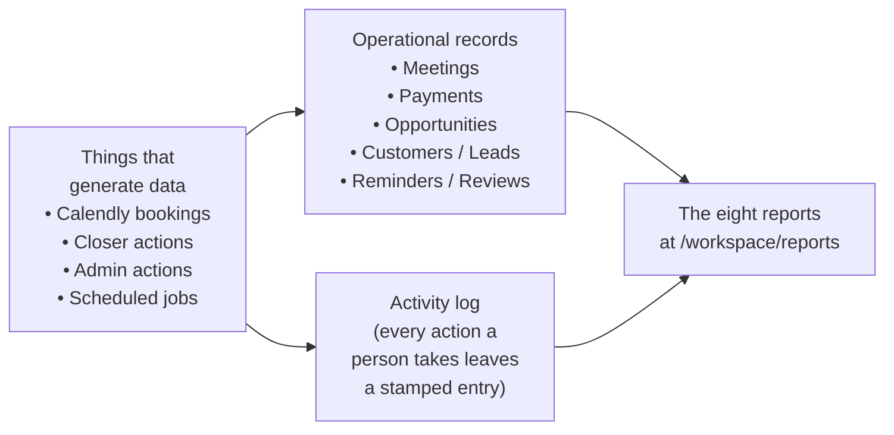
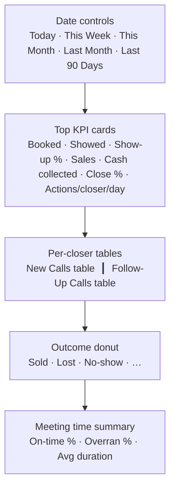
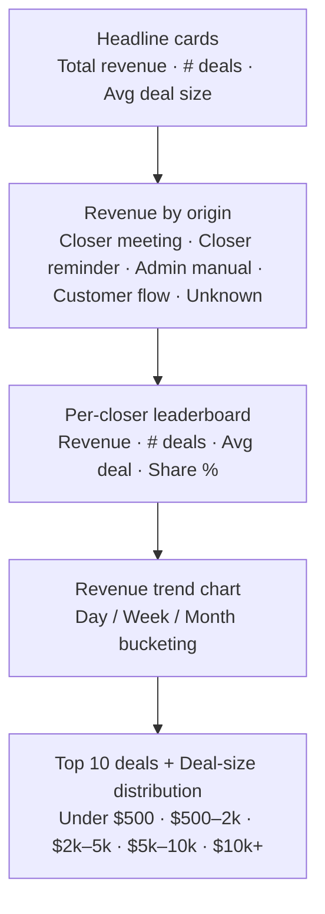
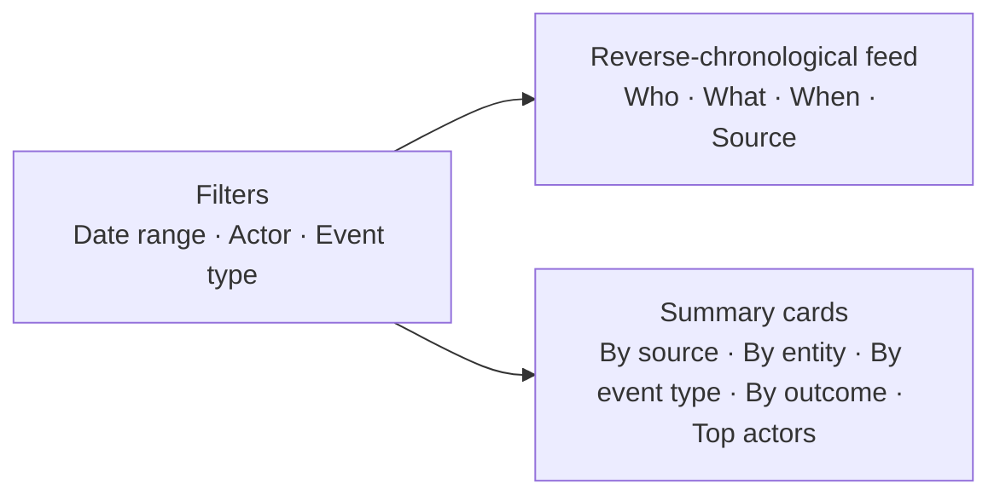
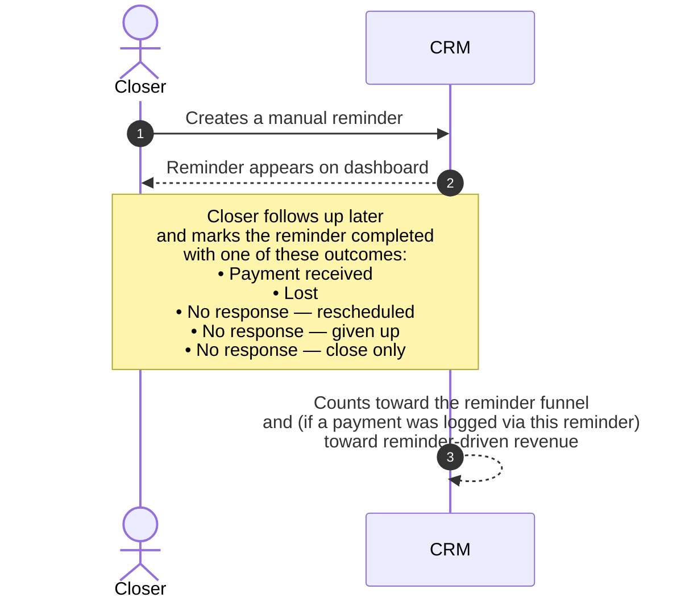
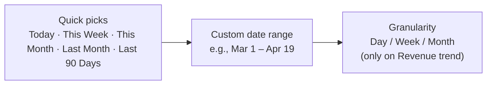

# Reporting Feature — Stakeholder Overview

**Audience:** Founders, sales leaders, ops, finance, and anyone who reviews CRM reports.
**Purpose:** Explain — in plain English — what the reporting suite does, what each report answers, and how to read the numbers with confidence.

> If you want the engineering-grade companion (formulas, code references, data-pipeline internals), see `Reporting-feature.md`.

---

## Table of Contents

1. [Executive Summary](#1-executive-summary)
2. [How the Data Gets to the Reports](#2-how-the-data-gets-to-the-reports)
3. [Who Can See the Reports](#3-who-can-see-the-reports)
4. [The Eight Reports](#4-the-eight-reports)
   - [Team Performance](#41-team-performance)
   - [Revenue](#42-revenue)
   - [Pipeline Health](#43-pipeline-health)
   - [Lead Conversion](#44-lead-conversion)
   - [Activity Feed](#45-activity-feed)
   - [Reminders](#46-reminders)
   - [Meeting Time](#47-meeting-time)
   - [Reviews (Admin)](#48-reviews-admin)
5. [Date Controls](#5-date-controls)
6. [Data Freshness, Accuracy and Limits](#6-data-freshness-accuracy-and-limits)
7. [Glossary of Key Metrics](#7-glossary-of-key-metrics)
8. [Talking Points for Stakeholders](#8-talking-points-for-stakeholders)

---

## 1. Executive Summary

The CRM ships with **eight live reports** that turn raw closer activity into the KPIs leaders use to run the business — sales, show-up rates, pipeline aging, follow-up effectiveness, meeting time discipline, and lead conversion.

Three things make the reporting suite trustworthy:

1. **Live data, no nightly batch.** Reports refresh automatically as closers update meetings and log payments. There is no "as of yesterday."
2. **One source of truth.** Every report pulls from the same operational tables that power the closer pipeline view, so the numbers in a report and the numbers a closer sees on screen always agree.
3. **Visible limits.** When a report has more data than it can display in a single view, a yellow banner tells the user the chart is sampled. Numbers are never silently truncated.

Reports are restricted to **owners and admins** (closers don't see them). The whole suite lives at `/workspace/reports`.

---

## 2. How the Data Gets to the Reports

Every report is the end of a four-step pipeline. The diagram below is a stakeholder-level view — the engineering version is in `Reporting-feature.md`.

**The four steps in plain words:**

1. Something happens — a Calendly invitee books, a closer marks a meeting started/stopped, a payment is logged, an admin resolves a review.
2. The CRM writes it to the operational records (the same tables that drive the live pipeline view).
3. The CRM also drops a stamped entry into the **activity log** — who did what, when, for which entity. This is what powers the Activity Feed and the "actions per closer per day" KPI.
4. When a leader opens a report, the system reads from those records and the activity log, applies the formulas, and shows the chart.

> **Why this matters for trust:** Reports never read from an offline copy of the data, and the activity log is append-only — it can't be silently rewritten after the fact.

---

## 3. Who Can See the Reports

| Role | Reports access |
|------|----------------|
| **Owner** (`tenant_master`) | Full access to all 8 reports |
| **Admin** (`tenant_admin`) | Full access to all 8 reports |
| **Closer** | No reports access — closers see their own pipeline, not team-level analytics |

The reports menu does not appear in the sidebar for closers, and direct links redirect them away. The backend re-checks permission on every request, so even a manually-typed URL is rejected.

---

## 4. The Eight Reports

Each report below follows the same template:

- **Where:** the URL inside the workspace
- **What it answers:** the business question
- **Who looks at it:** the natural audience
- **Key sections:** what's on the screen
- **Plain-English KPIs:** the metrics in business language
- **What you can do with it:** decisions it supports

---

### 4.1 Team Performance

- **Where:** `/workspace/reports/team` (this is also the default landing page)
- **What it answers:** "How is each closer performing this period, and how does the team look overall?"
- **Who looks at it:** Sales leader on a daily/weekly basis; founder during weekly reviews.

**Key sections**

**Plain-English KPIs**

| KPI | What it means |
|-----|---------------|
| **Booked** | Total meetings that were on the calendar in the period (any status). |
| **Showed** | Meetings where the closer started the call (or it's still in progress). |
| **Show-up %** | Of the meetings the closer should have run (booked, minus the ones the lead canceled or that overran into a review), how many actually started. |
| **Sales** | Number of paid deals attributed to each closer. |
| **Cash collected** | Total revenue (in dollars) attributed to the closer in the period. |
| **Close %** | Of the meetings that started, how many turned into a paid deal. |
| **Actions/closer/day** | How busy the average active closer was per day in the period. |
| **Excluded revenue** | Money paid in the period that we couldn't attribute to a current active closer (e.g., the closer was deactivated). Surfaced so totals always reconcile. |

**What you can do with it**

- Spot under-performing closers early (low show-up %, low close %).
- Compare new-call performance vs. follow-up performance per closer.
- See whether the team's outcome mix is healthy (lots of sold vs. lots of no-show).
- Confirm the team is actually putting in the daily action volume you expect.

---

### 4.2 Revenue

- **Where:** `/workspace/reports/revenue`
- **What it answers:** "How much money did we collect, where did it come from, and what's the trend?"
- **Who looks at it:** Founder, finance, sales leader.

**Key sections**

**Plain-English KPIs**

| KPI | What it means |
|-----|---------------|
| **Total revenue** | Sum of all logged payments in the period, excluding any payment marked as **disputed**. |
| **Average deal size** | Total revenue divided by the number of deals — a useful pricing/discount signal. |
| **Revenue by origin** | Where the payment was logged from: a closer's meeting, a follow-up reminder, an admin entry, the customer-flow form, or unknown. Lets you see which channels are generating cash. |
| **Per-closer revenue & share %** | Each closer's revenue and what fraction of total revenue that represents. |
| **Revenue trend** | Same revenue, bucketed by day/week/month so you can see momentum (or a slump) over time. |
| **Top 10 deals** | The largest individual payments in the period — useful for celebrating wins and spotting outliers. |
| **Deal-size distribution** | Count of payments in each price bucket — answers "are we mostly closing small deals or big deals?" |

**Important rule:** disputed payments are excluded from every revenue total. If a payment is disputed during a review, it stops counting toward the closer's cash and toward team revenue immediately. The Reviews report (4.8) shows the disputed-revenue total separately.

**What you can do with it**

- Spot revenue concentration risk (one closer = 70% of revenue?).
- Decide whether reminder follow-ups are paying for themselves.
- Detect a drop in deal size before it shows up in total revenue.

---

### 4.3 Pipeline Health

- **Where:** `/workspace/reports/pipeline`
- **What it answers:** "What's in the pipeline right now, what's stuck, and where are we losing deals?"
- **Who looks at it:** Sales leader for daily standup; ops for backlog triage.

**Key sections**

| Section | What it shows |
|---------|---------------|
| **Live status pie** | Snapshot of every open opportunity by status — Scheduled, In Progress, Follow-Up Scheduled, etc. (Live, ignores the date picker.) |
| **Velocity** | Average number of days from "opportunity created" to "first payment received" for deals won in the last 90 days. |
| **Aging by status** | For each active status, the average and oldest age (in days) of opportunities currently sitting there. |
| **Stale opportunities (top 20)** | Opportunities that either have no upcoming meeting scheduled, or whose next meeting is more than 14 days away. |
| **Pending review backlog** | How many overran-meeting reviews are waiting on an admin. |
| **Unresolved manual reminders** | How many manual reminders are still open. |
| **No-show source split** | Who marked recent no-shows — the closer, the Calendly webhook (lead didn't join), or unknown. |
| **Loss attribution** | Of deals marked lost in the period, who marked them — admin vs. closer, broken down per person. |

**Plain-English KPIs**

| KPI | What it means |
|-----|---------------|
| **Velocity (days to close)** | The average sales cycle length, measured only on closed-won deals from the last 90 days. |
| **Stale** | A deal qualifies as stale if there's nothing scheduled in the next 14 days for it. |
| **Backlog** | Anything pending action (overrun reviews, open reminders) that's currently sitting on the team. |

**What you can do with it**

- Identify deals about to slip and intervene.
- Decide whether the admin team is keeping up with reviews.
- See whether losses are coming from a small number of closers or are evenly distributed.

---

### 4.4 Lead Conversion

- **Where:** `/workspace/reports/leads`
- **What it answers:** "How effectively are we turning fresh leads into paying customers?"
- **Who looks at it:** Founder, marketing/lead-gen, sales leader.

**Key sections**

| Section | What it shows |
|---------|---------------|
| **New leads** | Total fresh leads created in the period. |
| **Conversions** | Customers won in the period (a customer is created when a deal is paid). |
| **Conversion rate** | Conversions ÷ new leads. |
| **Avg meetings per sale** | On average, how many meetings the winning opportunity took. |
| **Avg time to conversion** | Average days from a lead's first appearance to becoming a customer. |
| **Conversions per closer** | Leaderboard of who closed the most. |
| **Form responses** | Top answers and response rate from the booking form (lead-quality signal). |

**Plain-English KPIs**

| KPI | What it means |
|-----|---------------|
| **Conversion rate** | What % of new leads turn into customers. The single best top-of-funnel health metric. |
| **Avg time to conversion** | If this number creeps up, the sales cycle is lengthening. |
| **Form response rate** | The % of meetings that came in with a completed Calendly form — proxy for lead-quality discipline. |
| **Excluded conversions** | Customers we couldn't attribute to a current active closer (e.g., closer left). Always shown so totals reconcile. |

**What you can do with it**

- Decide whether the marketing channel mix is bringing in leads that actually close.
- Spot a slowdown in cycle time before it impacts revenue.
- Validate that closers are filling out the Calendly form discipline (form-response rate).

---

### 4.5 Activity Feed

- **Where:** `/workspace/reports/activity`
- **What it answers:** "What did the team do recently?"
- **Who looks at it:** Founder for spot-checks; ops for incident investigations.

**Key sections**

**What's in the feed**

Every meaningful action leaves an entry — meeting started/stopped, payment recorded, opportunity status changed, follow-up created/booked/completed, customer converted, user role changed, etc. Each entry shows:

- Who did it (or "system" if automated)
- What kind of event (e.g., "meeting.started", "payment.recorded")
- When it happened
- Where it came from (closer, admin, automated pipeline, scheduled job)

**What you can do with it**

- Investigate "what happened to this deal?" by filtering to one closer or one event type.
- Audit a sensitive action — e.g., who marked a meeting as no-show, who disputed a payment.
- Check team activity heat-maps by source ("how much did closers vs. admins do this week?").

---

### 4.6 Reminders

- **Where:** `/workspace/reports/reminders`
- **What it answers:** "Are our manual follow-up reminders working — and how much revenue do they drive?"
- **Who looks at it:** Sales leader, ops.

**Key sections**

**Plain-English KPIs**

| KPI | What it means |
|-----|---------------|
| **Total created** | Manual reminders the team set up in the period. |
| **Total completed** | How many of those reminders were actually closed out. |
| **Completion rate** | % of reminders that were resolved (vs. abandoned). |
| **Outcome mix** | Breakdown of completed reminders by what happened — payment received, lost, etc. |
| **Reminder-driven revenue** | Total cash logged from payments whose origin was a closer-driven reminder follow-up. The clearest "ROI of follow-ups" number. |
| **Chain length histogram** | How many reminders each opportunity needed: 1, 2, 3, 4, 5+. Long chains = a deal that took many touches. |
| **Per-closer leaderboard** | Who's making the most reminder-driven sales. |

**What you can do with it**

- Decide whether reminder discipline is a real revenue lever or a vanity metric.
- Identify closers whose reminders convert well (and learn from their cadence).
- Spot opportunities with abnormally long reminder chains — they may need help or a "decline gracefully" policy.

---

### 4.7 Meeting Time

- **Where:** `/workspace/reports/meeting-time`
- **What it answers:** "Are meetings starting on time, ending on time, and being properly recorded?"
- **Who looks at it:** Sales leader for coaching, ops for evidence/compliance.

**Key sections**

| Section | What it shows |
|---------|---------------|
| **On-time start rate** | % of started meetings that began at or before the scheduled time. |
| **Overran rate** | % of completed meetings that ran past their scheduled length. |
| **Average actual duration** | The real average length of a meeting. |
| **Schedule adherence** | % of meetings that both started on time **and** ended on time. |
| **Late-start histogram** | How late starts are distributed: 0 / 1–5 / 6–15 / 16–30 / 30+ minutes. |
| **Overrun histogram** | Same buckets, for how much over the scheduled length. |
| **Source attribution** | Who marked the meeting started/stopped — the closer, an admin override, or the system. |
| **Manually corrected count** | How many meetings had their times overridden by an admin (data-quality signal). |
| **Fathom evidence rate** | Of meetings that should have a Fathom recording, how many actually have one. |

**What you can do with it**

- Coach closers who are chronically late or running long.
- Spot an admin who's manually correcting times often (could indicate tech issues).
- Confirm that recording-evidence policy is being followed.

---

### 4.8 Reviews (Admin)

- **Where:** `/workspace/reports/reviews`
- **What it answers:** "Is the admin team keeping up with overran-meeting reviews, and how are they resolving them?"
- **Who looks at it:** Admin team lead, ops.

**Background:** When a meeting is marked overran, an **admin review** is created. An admin must triage it and pick a resolution: log a payment, schedule a follow-up, mark no-show, mark lost, acknowledge, or dispute.

**Key sections**

| Section | What it shows |
|---------|---------------|
| **Live backlog** | How many reviews are pending right now (ignores the date picker). |
| **Resolution mix** | Of the reviews resolved in the period, how the admin resolved each. |
| **Manual time correction rate** | What % of resolutions involved an admin overriding the closer's start/stop times. |
| **Average resolve latency** | How many days/hours pass between "review created" and "review resolved." |
| **Closer response mix** | When the admin asked the closer for context, what answer did the closer give (e.g., "forgot to press the button", "did not attend", or no response). |
| **Dispute rate** | What % of reviewed meetings were resolved as disputed. |
| **Disputed revenue** | Total dollars of payments disputed in the period — this revenue is excluded from every other report. |
| **Reviewer workload** | Per-admin: # resolved + average latency. |

**What you can do with it**

- See whether admin reviews are creating a meaningful dispute path (or just rubber-stamped).
- Spot an admin who is consistently slow to resolve.
- Quantify the financial impact of disputes (the disputed-revenue figure).

---

## 5. Date Controls

Every report has a date-range picker at the top.

**Two non-obvious rules:**

1. **The end date is exclusive.** "Today" means everything from midnight today up to (but not including) midnight tomorrow. This matches how the underlying data is stored, so the picker and the chart always agree.
2. **Some sections are always live.** A handful of sections — the Pipeline status pie, the live review backlog, "stale opportunities" — ignore the date picker because they always answer "right now." This is deliberate; those numbers are operational, not historical.

**Default ranges per report**

| Report | Default range |
|--------|---------------|
| Team Performance | This Month |
| Revenue | This Month |
| Pipeline (history sections) | This Month |
| Leads | This Month |
| Activity Feed | This Month |
| Reminders | This Month |
| Meeting Time | Last 30 Days (rolling) |
| Reviews | Last 30 Days (rolling) |

---

## 6. Data Freshness, Accuracy and Limits

### 6.1 Freshness

- **Live and reactive.** When a closer logs a payment in another browser tab, an open report updates in real time — there is no "refresh" button needed.
- **No batch jobs.** There is no nightly ETL that could be a day behind.
- **Calendly is near-real-time.** Calendly fires a webhook within seconds of a booking change, so reports reflect bookings in seconds, not hours.

### 6.2 Accuracy & attribution rules

- **Disputed payments are excluded** from every revenue total in every report. They appear only in the Reviews report's "disputed revenue" line.
- **The "right" closer is always the deal owner**, not whoever logged the payment. If an admin logs a payment on behalf of a closer, the revenue is still credited to that closer. If the deal owner has been deactivated, the revenue is shown as **excluded revenue** so totals reconcile.
- **A meeting with a payment is always counted as "sold"** in the outcome donut, even if it was technically marked as no-show. Cash overrides status — this matches how a sales leader thinks about results.
- **Overran meetings count as no-show** in the team-outcome donut while the admin review is pending — they only get re-classified once the admin picks a resolution.

### 6.3 Limits — when a report is "sampled"

To keep the system fast, every report has a per-section ceiling on how many records it scans (typically 2,000–10,000). If the period the user picked has more data than that, the report shows a yellow banner like:

> ⚠ **Sampled data:** This report scanned the most-recent 2,000 meetings in your range. Narrow the date range to see the full picture.

Numbers shown are always exact for the records that were scanned — they are never extrapolated. The banner is purely a "you may be missing earlier records" signal.

In practice, the caps are well above what a single tenant generates in a month, so the banner rarely appears.

---

## 7. Glossary of Key Metrics

This is the single-page cheat sheet to print and put on the wall.

| KPI | Formula in plain English |
|-----|--------------------------|
| **Show-up rate** | Of the meetings that should have happened (booked, minus the ones the lead canceled or that overran into review), what % actually started. |
| **Close rate** | Of the meetings that started, what % turned into a paid deal. |
| **Cash collected** | Total dollars logged in payments — disputed payments not counted. |
| **Average deal size** | Total revenue ÷ number of deals. |
| **Revenue share %** | A closer's revenue ÷ total team revenue, ×100. |
| **Conversion rate** | Customers won ÷ new leads in the period. |
| **Average time to conversion** | Average days from a lead's first appearance to becoming a customer. |
| **Average meetings per sale** | Average number of meetings on a winning opportunity. |
| **Velocity (days to close)** | For deals won in the last 90 days: average days from opportunity creation to first payment. |
| **Stale opportunity** | An open opportunity with no meeting scheduled in the next 14 days. |
| **On-time start rate** | % of meetings that started at or before their scheduled time. |
| **Overran rate** | % of completed meetings that ran past their scheduled length. |
| **Schedule adherence** | % of meetings that both started on time and ended on time. |
| **Fathom compliance** | % of meetings that should have a recording and actually do. |
| **Rebook rate** | Of meetings that were canceled or no-show'd, what % were rescheduled. |
| **Reminder completion rate** | % of manual reminders that were actually resolved (not abandoned). |
| **Reminder-driven revenue** | Total dollars from payments logged via a closer's reminder follow-up. |
| **Manual time correction rate** | % of resolved reviews where an admin overrode the meeting times. |
| **Average resolve latency** | Average time between a review being created and being resolved. |
| **Dispute rate** | % of resolved reviews that ended in a dispute. |
| **Disputed revenue** | Total dollars of disputed payments — excluded from every other revenue figure. |
| **Actions per closer per day** | Average daily activity volume for closers who took at least one action in the period. |

---

## 8. Talking Points for Stakeholders

If you're presenting the reporting suite to investors, advisors, or new hires, these are the points worth landing.

**1. "Live, not lagging."** Every chart is reactive; there is no overnight batch. A closer recording a payment shows up in the leader's chart immediately.

**2. "One source of truth."** The team-performance numbers, the closer's own dashboard, and the audit log all read from the same operational records — they cannot disagree.

**3. "Auditable."** The activity feed is append-only. Every meaningful action — a status change, a payment, a review resolution — is stamped with who/what/when, and is queryable.

**4. "Attribution that matches reality."** Revenue is credited to the deal owner, not the data-entry person. Disputed money is excluded everywhere except the Reviews dispute total. Cash beats status (a "no-show" with a payment counts as sold).

**5. "Honest about its limits."** When a report is sampled, the user sees a banner. There are no hidden truncations.

**6. "Permissioned by default."** Closers can't see team-level reports; admins can; owners have everything. The check is enforced server-side, so it can't be bypassed by URL.

**7. "Built to scale."** The expensive counts (per-closer, per-status) are kept up-to-date in pre-computed tallies, not recalculated on every page load — so the reports stay fast as the business grows.

— END OF OVERVIEW —
