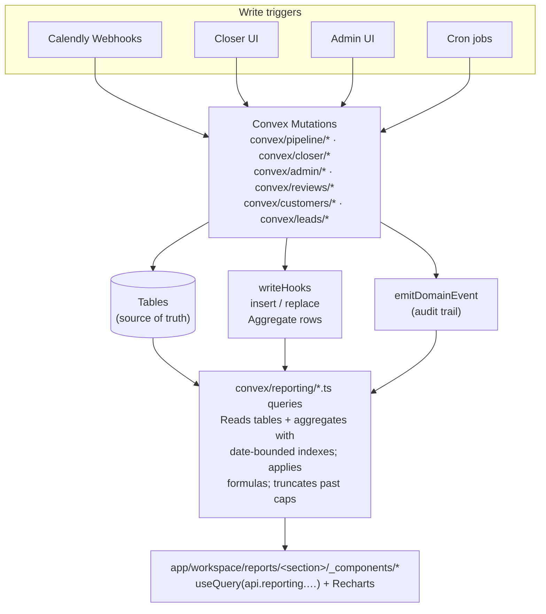
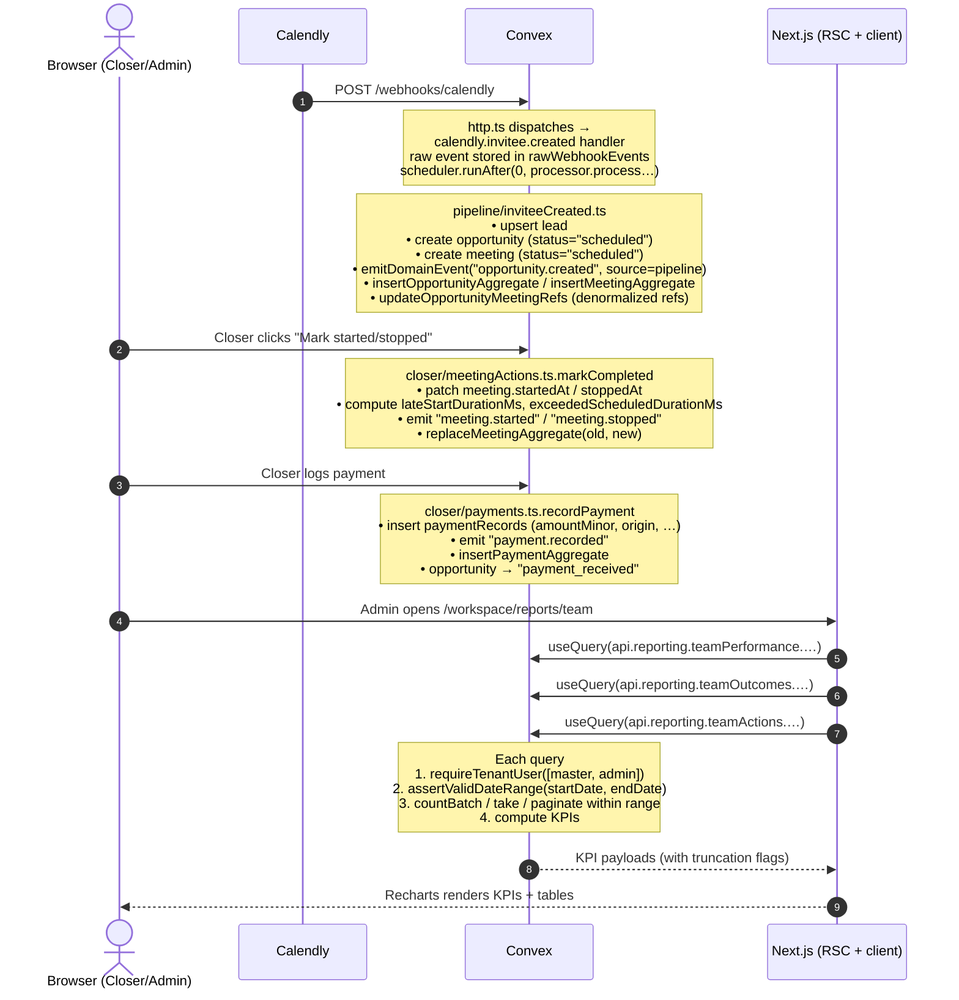
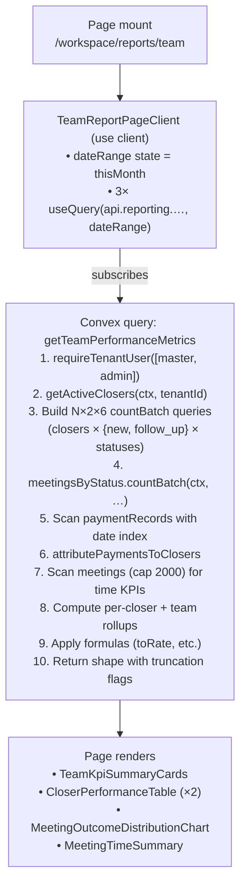
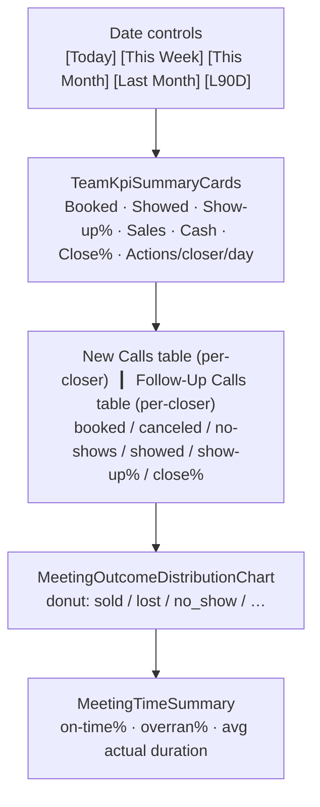
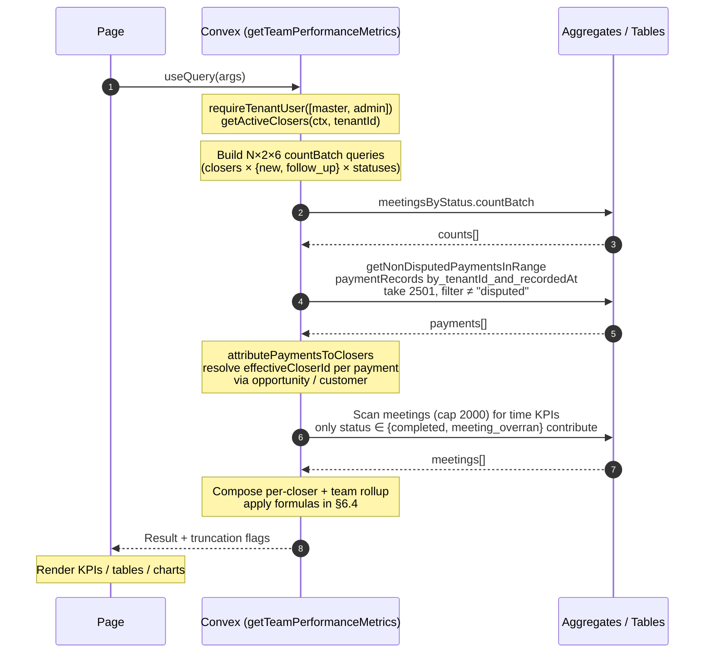
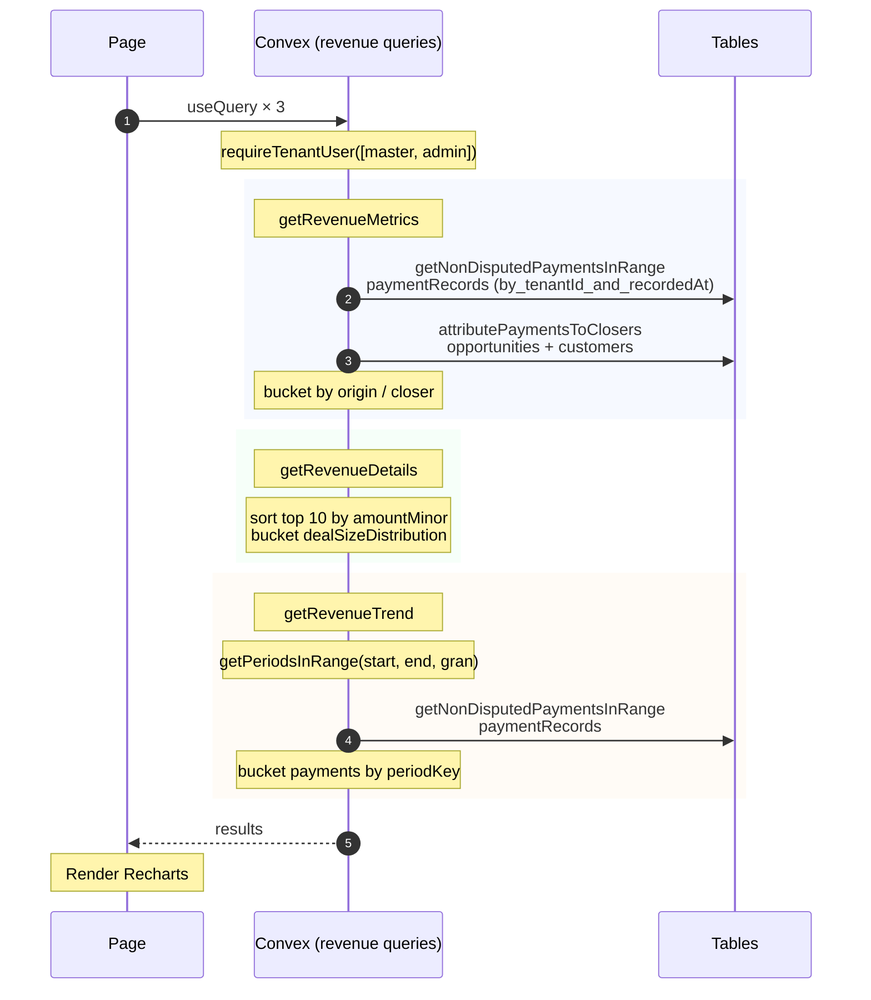
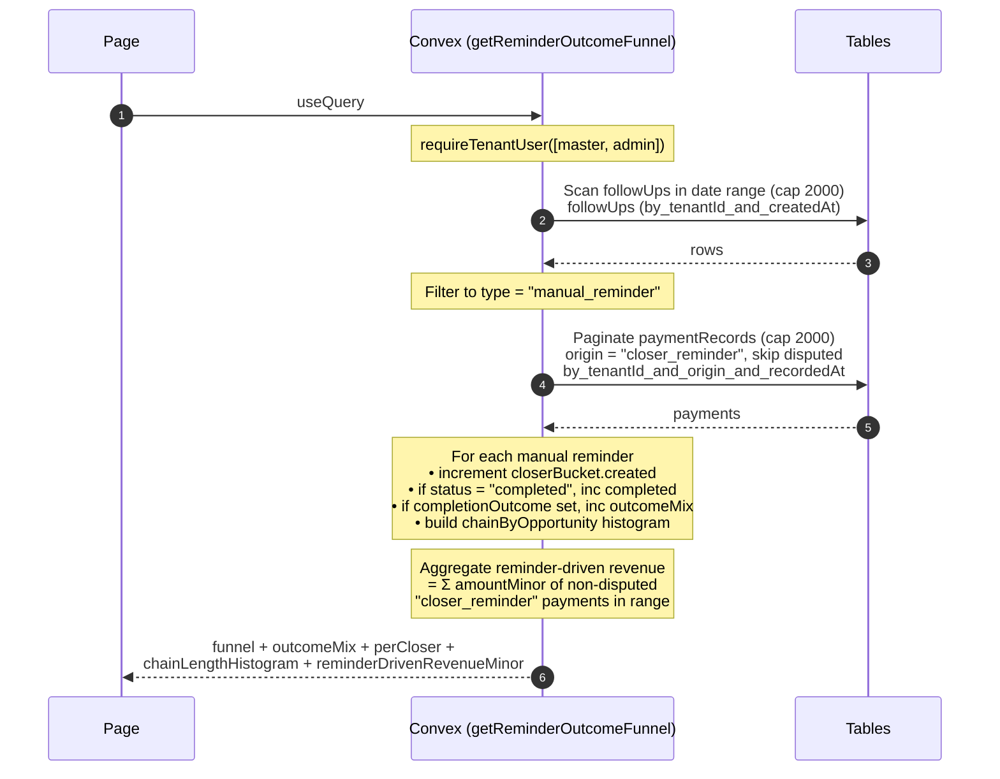
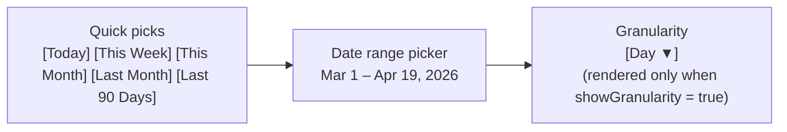

# Reporting Feature — Technical Report

**Repository:** `ptdom-crm`
**Version:** v0.5b reporting plane (current as of 2026-04-19)
**Audience:** Engineers, product owners, anyone needing to reason about how reports are computed.

This document describes — in exhaustive detail — every reporting page in the workspace, the Convex query that powers it, the upstream events that produce its data, and the **exact formulas** used. Every formula here is copied verbatim from the source files in `convex/reporting/**` so the report can be read as a reference manual without opening the codebase.

---

## Table of Contents

1. [System Overview](#1-system-overview)
2. [End-to-End Data Pipeline](#2-end-to-end-data-pipeline)
3. [Source Tables](#3-source-tables)
4. [Event Emission and Aggregate Sync](#4-event-emission-and-aggregate-sync)
5. [Reporting Library Primitives](#5-reporting-library-primitives)
6. [Report 1 — Team Performance](#6-report-1--team-performance)
7. [Report 2 — Revenue](#7-report-2--revenue)
8. [Report 3 — Pipeline Health](#8-report-3--pipeline-health)
9. [Report 4 — Lead Conversion](#9-report-4--lead-conversion)
10. [Report 5 — Activity Feed](#10-report-5--activity-feed)
11. [Report 6 — Reminders](#11-report-6--reminders)
12. [Report 7 — Meeting Time](#12-report-7--meeting-time)
13. [Report 8 — Reviews (Admin)](#13-report-8--reviews-admin)
14. [Form Response Analytics](#14-form-response-analytics)
15. [Time Bucketing & Date Controls](#15-time-bucketing--date-controls)
16. [Permissions & Truncation Caps](#16-permissions--truncation-caps)
17. [Appendix A — Catalog of Domain Events](#17-appendix-a--catalog-of-domain-events)

---

## 1. System Overview

The reporting layer lives in **two halves**:

- **Backend (Convex)**: 13 query functions in `convex/reporting/*.ts` that aggregate transactional rows into KPIs.
- **Frontend (Next.js 16 RSC + client components)**: 8 pages under `app/workspace/reports/<section>/` that call those queries through `useQuery` and render charts/tables.

Three architectural decisions shape how every report works:

1. **Indexes over filters.** Every query uses a `withIndex(...).gte/lt(scheduledAt, ...)`-style call to keep cost proportional to the date range, never the whole tenant.
2. **Aggregates for hot counts.** Five `TableAggregate` instances (`convex/reporting/aggregates.ts`) keep precomputed sums/counts that report queries call via `countBatch()` or `count()` to avoid full scans.
3. **Hard truncation caps.** Every scan is bounded (typically 2,000–10,000 rows). When a cap is hit the query returns `isTruncated: true` and the UI shows a banner so users know the chart is sampled.



---

## 2. End-to-End Data Pipeline

### 2.1 The full sequence — from a Calendly booking to a chart pixel



### 2.2 Read-time sequence — what one report query does



---

## 3. Source Tables

The 9 tables in `convex/schema.ts` that feed the reporting queries:

| Table | Owner Code | Purpose | Status Union | Key Indexes |
|-------|------------|---------|--------------|-------------|
| `meetings` | `convex/pipeline/*`, `convex/closer/meetingActions.ts` | One row per scheduled call | `scheduled \| in_progress \| completed \| canceled \| no_show \| meeting_overran` | `by_tenantId_and_scheduledAt`, `by_tenantId_and_status_and_scheduledAt`, `by_opportunityId` |
| `paymentRecords` | `convex/closer/payments.ts`, `convex/customers/mutations.ts`, admin mutations | One row per logged payment | `recorded \| verified \| disputed` | `by_tenantId_and_recordedAt`, `by_tenantId_and_status_and_recordedAt`, `by_tenantId_and_origin_and_recordedAt` |
| `opportunities` | `convex/pipeline/*`, `convex/closer/*`, `convex/customers/*` | One row per "deal" | `scheduled \| in_progress \| meeting_overran \| follow_up_scheduled \| reschedule_link_sent \| payment_received \| lost \| canceled \| no_show` | `by_tenantId_and_status`, `by_tenantId_and_status_and_createdAt`, `by_tenantId_and_assignedCloserId_and_status` |
| `customers` | `convex/customers/conversion.ts` | Created at conversion (winning opp + lead) | `active \| churned \| paused` | `by_tenantId_and_convertedAt` |
| `leads` | `convex/pipeline/inviteeCreated.ts`, `convex/leads/merge.ts` | Source-of-record for prospects | `active \| converted \| merged` | `by_tenantId_and_firstSeenAt`, `by_tenantId_and_status` |
| `followUps` | `convex/closer/followUpMutations.ts`, admin mutations | Reminders + scheduled follow-ups | `pending \| booked \| completed \| expired` | `by_tenantId_and_status_and_createdAt`, `by_tenantId_and_createdAt` |
| `meetingReviews` | `convex/closer/meetingOverrun.ts`, `convex/reviews/mutations.ts` | Created when a meeting overruns; admin resolves | `pending \| resolved` | `by_tenantId_and_status_and_createdAt`, `by_tenantId_and_resolvedAt` |
| `domainEvents` | `convex/lib/domainEvents.ts` (`emitDomainEvent`) | Append-only audit trail | n/a (free-form `eventType`) | `by_tenantId_and_occurredAt`, `by_tenantId_and_eventType_and_occurredAt`, `by_tenantId_and_actorUserId_and_occurredAt` |
| `meetingFormResponses` | Calendly form ingest | Question/answer pairs scraped from Calendly invitee form | n/a | `by_meetingId`, `by_tenantId_and_fieldKey` |

### 3.1 `domainEvents` schema

The activity feed (Report 5) and several outcome breakdowns are powered by one table whose schema is intentionally generic:

```ts
// convex/schema.ts:817–860
domainEvents: defineTable({
  tenantId: v.id("tenants"),
  entityType: v.union(
    v.literal("opportunity"), v.literal("meeting"), v.literal("lead"),
    v.literal("customer"), v.literal("followUp"), v.literal("user"),
    v.literal("payment"),
  ),
  entityId: v.string(),
  eventType: v.string(),          // e.g. "meeting.started", "payment.recorded"
  occurredAt: v.number(),
  actorUserId: v.optional(v.id("users")),
  source: v.union(v.literal("closer"), v.literal("admin"),
                  v.literal("pipeline"), v.literal("system")),
  fromStatus: v.optional(v.string()),
  toStatus:   v.optional(v.string()),
  reason:     v.optional(v.string()),
  metadata:   v.optional(v.string()),  // JSON-stringified payload
})
```

`metadata` is a JSON string that is parsed at read time by `parseEventMetadata()` (`convex/reporting/activityFeed.ts:49–59`). It's how `followUp.completed` carries `outcome` and `meeting.overran_review_resolved` carries `resolutionAction`.

---

## 4. Event Emission and Aggregate Sync

Reports do **not** scan tables blindly. Two side-effects fire on every transactional mutation:

1. **`emitDomainEvent(...)`** writes one row to `domainEvents`.
2. **`writeHooks.ts`** keeps the five `TableAggregate`s in sync.

### 4.1 `emitDomainEvent`

```ts
// convex/lib/domainEvents.ts:29–48
export async function emitDomainEvent(
  ctx: MutationCtx,
  params: EmitDomainEventParams,
): Promise<Id<"domainEvents">> {
  const occurredAt = params.occurredAt ?? Date.now();
  return await ctx.db.insert("domainEvents", {
    tenantId: params.tenantId,
    entityType: params.entityType,
    entityId: params.entityId,
    eventType: params.eventType,
    occurredAt,
    source: params.source,
    actorUserId: params.actorUserId,
    fromStatus: params.fromStatus,
    toStatus: params.toStatus,
    reason: params.reason,
    metadata: params.metadata ? JSON.stringify(params.metadata) : undefined,
  });
}
```

Eighteen call sites currently emit events (full catalog in [Appendix A](#17-appendix-a--catalog-of-domain-events)).

### 4.2 Aggregate write hooks

`convex/reporting/writeHooks.ts` exposes thin wrappers around the five aggregates:

```ts
// convex/reporting/writeHooks.ts:46–113 (excerpts)
export async function insertMeetingAggregate(ctx, meetingId)       { … meetingsByStatus.insert(ctx, meeting); }
export async function replaceMeetingAggregate(ctx, oldMeeting, id) { … meetingsByStatus.replace(ctx, oldMeeting, meeting); }
export async function insertOpportunityAggregate(ctx, id)          { … opportunityByStatus.insert(ctx, opp); }
export async function replaceOpportunityAggregate(ctx, oldOpp, id) { … opportunityByStatus.replace(ctx, oldOpp, opp); }
export async function insertLeadAggregate(ctx, id)                  { … leadTimeline.insert(ctx, lead); }
export async function insertPaymentAggregate(ctx, id)              { … paymentSums.insert(ctx, payment); }
export async function replacePaymentAggregate(ctx, oldPayment, id) { … paymentSums.replace(ctx, oldPayment, payment); }
export async function insertCustomerAggregate(ctx, id)             { … customerConversions.insert(ctx, customer); }
export async function deleteCustomerAggregate(ctx, id)             { … customerConversions.delete(ctx, customer); }
```

Every transactional mutation that changes a meeting status, payment amount, opportunity status, etc. calls the matching `replace*` hook. This is what guarantees `countBatch()` reads in report queries are O(log N) instead of O(rows in tenant).

### 4.3 The five aggregates

```ts
// convex/reporting/aggregates.ts:8–66

export const meetingsByStatus = new TableAggregate<{
  Namespace: Id<"tenants">;
  Key: [Id<"users">, MeetingCallClassification, Doc<"meetings">["status"], number];
  …
}>(components.meetingsByStatus, {
  namespace: (doc) => doc.tenantId,
  sortKey:  (doc) => [doc.assignedCloserId, doc.callClassification ?? "new",
                      doc.status, doc.scheduledAt],
});

export const paymentSums = new TableAggregate<{
  Namespace: Id<"tenants">;
  Key: [Id<"users">, number];
  …
}>(components.paymentSums, {
  namespace: (doc) => doc.tenantId,
  sortKey:  (doc) => [doc.closerId, doc.recordedAt],
  sumValue: (doc) => (doc.status === "disputed" ? 0 : doc.amountMinor),
});

export const opportunityByStatus = new TableAggregate<{
  Namespace: Id<"tenants">;
  Key: [Doc<"opportunities">["status"], OpportunityAssignedCloserKey, number];
  …
}>(components.opportunityByStatus, {
  namespace: (doc) => doc.tenantId,
  sortKey:  (doc) => [doc.status, doc.assignedCloserId ?? "", doc.createdAt],
});

export const leadTimeline = new TableAggregate<{
  Namespace: Id<"tenants">;
  Key: number;
  …
}>(components.leadTimeline, {
  namespace: (doc) => doc.tenantId,
  sortKey:  (doc) => doc._creationTime,
});

export const customerConversions = new TableAggregate<{
  Namespace: Id<"tenants">;
  Key: [Id<"users">, number];
  …
}>(components.customerConversions, {
  namespace: (doc) => doc.tenantId,
  sortKey:  (doc) => [doc.convertedByUserId, doc.convertedAt],
});
```

Note `paymentSums.sumValue` ignores disputed payments at write time. This is why "disputed revenue" is _not_ present in any of the per-closer cash-collected formulas — it has to be queried separately from the `paymentRecords` table directly.

---

## 5. Reporting Library Primitives

Three helper files factor out logic shared by every report.

### 5.1 `convex/reporting/lib/helpers.ts`

| Helper | Purpose | Code |
|--------|---------|------|
| `getActiveClosers(ctx, tenantId)` | Returns `Doc<"users">[]` filtered to `role === "closer"` and `isActive === true`, sorted by display name. | Lines 23–46 |
| `assertValidDateRange(startDate, endDate)` | Throws if either arg isn't finite or `startDate >= endDate`. | Lines 48–56 |
| `makeDateBounds(startDate, endDate)` | Builds `{lower:{key, inclusive:true}, upper:{key, inclusive:false}}` for scalar aggregate keys. | Lines 61–67 |
| `makeTupleDateBounds(prefix, startDate, endDate)` | Same but appends the timestamp to a prefix tuple — used for `meetingsByStatus` queries. | Lines 72–88 |
| `attributePaymentsToClosers(ctx, payments)` | Resolves each `paymentRecord.effectiveCloserId` by looking up the source opportunity's `assignedCloserId` (or customer's `convertedByUserId`), falling back to the recorder. | Lines 94–159 |
| `getNonDisputedPaymentsInRange(ctx, tenantId, start, end)` | Date-indexed scan capped at 2,500 rows; filters out `status === "disputed"`. | Lines 161–185 |
| `summarizeAttributedPayments(payments)` | Returns `{ byCloser: Map, totalDealCount, totalRevenueMinor }`. | Lines 187–223 |
| `getUserDisplayName(user)` | `user.fullName.trim() || user.email || "Unknown"` | Lines 11–18 |

The **payment attribution rule** (lines 142–158) is critical because the closer who _logs_ a payment is not always the closer who _owns_ the deal:

```ts
return payments.map((payment) => {
  if (payment.contextType === "opportunity" && payment.opportunityId) {
    const effectiveCloserId =
      opportunityById.get(payment.opportunityId)?.assignedCloserId ??
      payment.closerId;
    return { ...payment, effectiveCloserId: effectiveCloserId ?? null };
  }
  if (payment.contextType === "customer" && payment.customerId) {
    const effectiveCloserId =
      customerById.get(payment.customerId)?.convertedByUserId ??
      payment.closerId;
    return { ...payment, effectiveCloserId: effectiveCloserId ?? null };
  }
  return { ...payment, effectiveCloserId: payment.closerId ?? null };
});
```

### 5.2 `convex/reporting/lib/periodBucketing.ts`

Used by the revenue trend chart. UTC-aligned, 90-period max (lines 9, 23):

```ts
const MAX_PERIODS = 90;

export function getPeriodKey(timestamp, granularity): string {
  switch (granularity) {
    case "day":   return `${YYYY}-${MM}-${DD}`;       // e.g. "2026-04-19"
    case "week": {                                     // ISO 8601 week
      const { week, year } = getIsoWeekInfo(periodStart);
      return `${year}-W${pad2(week)}`;                 // e.g. "2026-W17"
    }
    case "month": return `${YYYY}-${MM}`;              // e.g. "2026-04"
  }
}

function startOfUtcIsoWeek(timestamp) {                // Monday-start
  const date = new Date(startOfUtcDay(timestamp));
  const utcDay = date.getUTCDay() || 7;
  return Date.UTC(year, month, date - (utcDay - 1));
}
```

### 5.3 `convex/reporting/lib/outcomeDerivation.ts`

The single source of truth for "what was the outcome of this meeting?". Used by the team outcome chart and the closer pipeline view.

```ts
// convex/reporting/lib/outcomeDerivation.ts:18–80
export type CallOutcome =
  | "sold" | "lost" | "no_show" | "canceled" | "rescheduled"
  | "dq"   | "follow_up" | "scheduled" | "in_progress";

// Priority order:
// sold > lost > no_show > canceled > rescheduled > dq > follow_up > in_progress > scheduled
export function deriveCallOutcome(meeting, opportunity, hasPayment, isRescheduled): CallOutcome {
  if (hasPayment) return "sold";
  if (opportunity.status === "lost" && opportunity.latestMeetingId === meeting._id) return "lost";
  if (meeting.status === "no_show")        return "no_show";
  if (meeting.status === "meeting_overran") return "no_show";   // overran === proxy no-show
  if (meeting.status === "canceled")       return "canceled";
  if (isRescheduled)                        return "rescheduled";
  // "dq" branch is intentionally unreachable until v0.6b — see file comment lines 48–62
  if (meeting.status === "completed" && opportunity.status === "follow_up_scheduled") return "follow_up";
  if (opportunity.status === "meeting_overran") return "in_progress";
  if (meeting.status === "in_progress")    return "in_progress";
  return "scheduled";
}
```

A meeting that has a non-disputed payment is **always** counted as "sold," even if the meeting itself was marked no_show — this matches the human reality that revenue overrides any other status.

---

## 6. Report 1 — Team Performance

**Route:** `/workspace/reports/team` (default landing page; `/workspace/reports` redirects here)
**Roles:** `tenant_master`, `tenant_admin`
**File:** `app/workspace/reports/team/_components/team-report-page-client.tsx`
**Backing queries:** `api.reporting.teamPerformance.getTeamPerformanceMetrics`, `api.reporting.teamOutcomes.getTeamOutcomeMix`, `api.reporting.teamActions.getActionsPerCloserPerDay`

### 6.1 What it shows



### 6.2 Sequence diagram



### 6.3 Aggregations performed

For each closer × call classification (`new` | `follow_up`) × meeting status (6 values), one `meetingsByStatus.countBatch` entry is added (`teamPerformance.ts:152–185`):

```ts
for (const closer of closers) {
  for (const classification of CALL_CLASSIFICATIONS) {  // ["new","follow_up"]
    for (const status of MEETING_STATUSES) {            // 6 statuses
      countQueries.push({
        namespace: tenantId,
        bounds: makeTupleDateBounds([closer._id, classification, status],
                                    startDate, endDate),
      });
    }
  }
}
const counts = await meetingsByStatus.countBatch(ctx, countQueries);
```

Then the per-closer meeting-time scan at lines 238–295:

```ts
for (const meeting of meetingsForMeetingTime) {
  if (meeting.status !== "completed" && meeting.status !== "meeting_overran") continue;

  if (meeting.startedAt !== undefined) {
    next.startedMeetingsCount += 1;
    const lateStartMs = meeting.lateStartDurationMs ?? 0;
    if (lateStartMs === 0) next.onTimeStartCount += 1;
    else { next.lateStartCount += 1; next.totalLateStartMs += lateStartMs; }
  }

  if (meeting.startedAt !== undefined && meeting.stoppedAt !== undefined) {
    next.completedWithDurationCount += 1;
    next.totalActualDurationMs += meeting.stoppedAt - meeting.startedAt;

    const overrunMs = meeting.exceededScheduledDurationMs ?? 0;
    if (overrunMs > 0) { next.overranCount += 1; next.totalOverrunMs += overrunMs; }

    const lateStartMs = meeting.lateStartDurationMs ?? 0;
    if (lateStartMs === 0 && overrunMs === 0) next.scheduleAdherentCount += 1;
  }

  if (meeting.startedAtSource === "admin_manual" || meeting.stoppedAtSource === "admin_manual") {
    next.manuallyCorrectedCount += 1;
  }
}
```

### 6.4 Formulas

All rates use the helper `toRate(num, denom) = denom > 0 ? num/denom : null` (lines 64–66).

#### Per-closer attendance metrics (lines 307–330)

```
newCalls.bookedCalls          = sum over MEETING_STATUSES of countsForClassification["new"][status]
newCalls.canceledCalls        = countsForClassification["new"]["canceled"]
newCalls.noShows              = countsForClassification["new"]["no_show"]
newCalls.reviewRequiredCalls  = countsForClassification["new"]["meeting_overran"]
newCalls.callsShowed          = countsForClassification["new"]["completed"]
                              + countsForClassification["new"]["in_progress"]
newCalls.confirmedAttendanceDenominator
                              = bookedCalls - canceledCalls - reviewRequiredCalls
newCalls.showUpRate           = callsShowed / confirmedAttendanceDenominator
```

(Identical formulas for `followUpCalls`.)

#### Per-closer commercial metrics (lines 339–354)

```
sales                  = paymentSummary.byCloser[closerId].dealCount
cashCollectedMinor     = paymentSummary.byCloser[closerId].revenueMinor   // sum of non-disputed amountMinor
adminLoggedRevenueMinor= sum of attributedPayments[i].amountMinor where loggedByAdminUserId is set
totalShowed            = newCalls.callsShowed + followUpCalls.callsShowed
closeRate              = sales / totalShowed
avgCashCollectedMinor  = cashCollectedMinor / sales
```

#### Per-closer meeting-time KPIs (lines 106–135)

```
onTimeStartRate        = onTimeStartCount        / startedMeetingsCount
avgLateStartMs         = totalLateStartMs        / lateStartCount
overranRate            = overranCount            / completedWithDurationCount
avgOverrunMs           = totalOverrunMs          / overranCount
avgActualDurationMs    = totalActualDurationMs   / completedWithDurationCount
scheduleAdherenceRate  = scheduleAdherentCount   / completedWithDurationCount
```

#### Team-level rollup (lines 410–447)

```
totalBookedCalls           = newBookedCalls + followUpBookedCalls
totalCanceledCalls         = newCanceled    + followUpCanceled
totalReviewRequiredCalls   = newReviewRequired + followUpReviewRequired
totalShowedCalls           = newShowed      + followUpShowed
overallConfirmedDenominator= totalBookedCalls - totalCanceledCalls - totalReviewRequiredCalls

newShowUpRate              = newShowed / (newBookedCalls - newCanceled - newReviewRequired)
followUpShowUpRate         = followUpShowed / (followUpBookedCalls - followUpCanceled - followUpReviewRequired)
overallShowUpRate          = totalShowedCalls / overallConfirmedDenominator
overallCloseRate           = totalSales       / totalShowedCalls
avgCashCollectedMinor      = totalRevenue     / totalSales
excludedRevenueMinor       = paymentSummary.totalRevenueMinor - visibleRevenueMinor   // payments whose effectiveCloser is inactive/missing
excludedSales              = paymentSummary.totalDealCount   - visibleDealCount
```

#### Outcome mix and rebook rate — `getTeamOutcomeMix`

```ts
// convex/reporting/teamOutcomes.ts:102–131
for (const meeting of meetings) {
  const opportunity = opportunityById.get(meeting.opportunityId);
  if (!opportunity) continue;
  const outcome = deriveCallOutcome(
    meeting, opportunity,
    opportunityHasPayment.has(meeting.opportunityId),
    rescheduledMeetingIds.has(meeting._id),
  );
  counts[outcome] += 1;
}

const rebookDenominator = teamOutcome.canceled + teamOutcome.no_show;
const rebookRate = rebookDenominator > 0
  ? teamOutcome.rescheduled / rebookDenominator
  : null;
```

```
rebookRate = teamOutcome.rescheduled / (teamOutcome.canceled + teamOutcome.no_show)
```

`opportunityHasPayment` (lines 84–93) is the set of opportunity IDs that have **any** non-disputed `paymentRecord` in range — this is the source-of-truth for the `"sold"` outcome.

`rescheduledMeetingIds` (lines 95–100) is the set of meeting IDs referenced by a newer meeting's `rescheduledFromMeetingId` — these become the `"rescheduled"` outcomes for the original meeting.

#### Closer activity velocity — `getActionsPerCloserPerDay`

```ts
// convex/reporting/teamActions.ts:23–77
const eventRows = await ctx.db
  .query("domainEvents")
  .withIndex("by_tenantId_and_occurredAt", q =>
    q.eq("tenantId", tenantId).gte("occurredAt", startDate).lt("occurredAt", endDate))
  .take(MAX_EVENTS_SCAN + 1);   // 5001

for (const event of events) {
  if (event.source !== "closer" || !event.actorUserId) continue;
  closerActions.set(event.actorUserId, (closerActions.get(event.actorUserId) ?? 0) + 1);
}

const totalCloserActions    = sum over closerActions.values()
const distinctCloserActors  = closerActions.size
const daySpanDays           = Math.max(1, Math.ceil((endDate - startDate) / 86_400_000))
```

```
actionsPerCloserPerDay = totalCloserActions / distinctCloserActors / daySpanDays
```

(Returns `null` if `distinctCloserActors === 0`.)

---

## 7. Report 2 — Revenue

**Route:** `/workspace/reports/revenue`
**File:** `app/workspace/reports/revenue/_components/revenue-report-page-client.tsx`
**Queries:** `api.reporting.revenue.getRevenueMetrics`, `api.reporting.revenue.getRevenueDetails`, `api.reporting.revenueTrend.getRevenueTrend`

### 7.1 Sequence diagram



### 7.2 Formulas

#### `getRevenueMetrics` (`convex/reporting/revenue.ts:30–112`)

**By-origin breakdown (lines 55–61):**

```ts
const REVENUE_ORIGINS = ["closer_meeting","closer_reminder","admin_meeting",
                         "customer_flow","unknown"];
for (const payment of paymentScan.payments) {
  byOrigin[payment.origin ?? "unknown"] += payment.amountMinor;
}
```

```
byOrigin[origin] = Σ payment.amountMinor where payment.origin = origin and payment.status ≠ "disputed"
```

**Per-closer rollup (lines 63–109):**

```
byCloser[i].revenueMinor   = paymentSummary.byCloser[closer._id].revenueMinor
byCloser[i].dealCount      = paymentSummary.byCloser[closer._id].dealCount
byCloser[i].avgDealMinor   = revenueMinor / dealCount
byCloser[i].revenuePercent = (revenueMinor / totalRevenueMinor) × 100
```

Sorted by `revenueMinor DESC` then by name.

**Aggregate totals:**

```
totalRevenueMinor    = Σ byCloser[i].revenueMinor
totalDeals           = Σ byCloser[i].dealCount
avgDealMinor         = totalRevenueMinor / totalDeals
excludedRevenueMinor = paymentSummary.totalRevenueMinor - totalRevenueMinor
excludedDealCount    = paymentSummary.totalDealCount   - totalDeals
```

#### `getRevenueDetails` — deal-size histogram (lines 154–175)

```
under500: amountDollars < 500
to2k:     500   ≤ amountDollars < 2000
to5k:     2000  ≤ amountDollars < 5000
to10k:    5000  ≤ amountDollars < 10000
over10k:  amountDollars ≥ 10000
```

where `amountDollars = payment.amountMinor / 100`.

**Top deals (lines 133–139):** sort `paymentScan.payments` by `(amountMinor DESC, recordedAt DESC)` and slice the first 10.

#### `getRevenueTrend` — time-bucketed series (`convex/reporting/revenueTrend.ts:14–69`)

```ts
const periods = getPeriodsInRange(startDate, endDate, granularity);  // up to 90
const trend   = periods.map(p => ({ periodKey: p.key, revenueMinor: 0, dealCount: 0 }));

for (const payment of paymentScan.payments) {
  const periodKey = getPeriodKey(payment.recordedAt, granularity);
  const index     = indexByPeriodKey.get(periodKey);
  if (index === undefined) continue;
  trend[index].revenueMinor += payment.amountMinor;
  trend[index].dealCount    += 1;
}
```

```
trend[i].revenueMinor = Σ payment.amountMinor where periodKey(payment.recordedAt) = trend[i].periodKey
trend[i].dealCount    = COUNT(payment) where periodKey(payment.recordedAt) = trend[i].periodKey
```

(Disputed payments are already filtered out by `getNonDisputedPaymentsInRange`.)

---

## 8. Report 3 — Pipeline Health

**Route:** `/workspace/reports/pipeline`
**Queries:** `api.reporting.pipelineHealth.getPipelineDistribution`, `getPipelineAging`, `getPipelineBacklogAndLoss`

### 8.1 What it shows

| Section | Source query | Notes |
|---------|--------------|-------|
| **Live status pie** | `getPipelineDistribution` | No date range — counts current state |
| **Velocity (avg days to close)** | `getPipelineAging` | Last 90 days, capped at 500 won deals |
| **Aging by status (avg & oldest age in days)** | `getPipelineAging` | Live, scans full active pipeline |
| **Stale opportunities (top 20)** | `getPipelineAging` | Stale = no `nextMeetingAt` _or_ `nextMeetingAt < now − 14d` |
| **Pending review backlog** | `getPipelineBacklogAndLoss` | Live count of `meetingReviews` where status="pending" |
| **Unresolved manual reminders** | `getPipelineBacklogAndLoss` | Live count of `followUps` where status="pending" and type="manual_reminder" |
| **No-show source split** | `getPipelineBacklogAndLoss` | In-range — categorizes who marked the no-show |
| **Loss attribution (bar)** | `getPipelineBacklogAndLoss` | In-range — categorizes by user role and individual |

### 8.2 Formulas

#### `getPipelineDistribution` (`convex/reporting/pipelineHealth.ts:105–128`)

```ts
const counts = await opportunityByStatus.countBatch(ctx,
  OPPORTUNITY_STATUSES.map(status => ({
    namespace: tenantId,
    bounds: { prefix: [status] },     // count all opportunities with this status, any closer, any time
  })),
);
return { distribution: OPPORTUNITY_STATUSES.map((status, i) => ({ status, count: counts[i] ?? 0 })) };
```

```
distribution[status].count = COUNT(opportunities WHERE tenantId = T AND status = STATUS)
```

Live, no time filter.

#### `getPipelineAging` (`pipelineHealth.ts:130–256`)

For each `ACTIVE_PIPELINE_STATUSES` (`scheduled`, `in_progress`, `meeting_overran`, `follow_up_scheduled`, `reschedule_link_sent`):

```ts
for await (const opportunity of ctx.db.query("opportunities")
  .withIndex("by_tenantId_and_status", q => q.eq("tenantId", tenantId).eq("status", status))) {
  opportunityCount += 1;
  const ageDays = (now - opportunity.createdAt) / 86_400_000;
  totalAgeDays   += ageDays;
  oldestAgeDays   = Math.max(oldestAgeDays, ageDays);

  if (opportunity.nextMeetingAt === undefined ||
      opportunity.nextMeetingAt < now - STALE_THRESHOLD_MS) {     // STALE_THRESHOLD_MS = 14 days
    staleCount += 1;
    staleCandidates.push({ opportunity, ageDays, nextMeetingAt });
  }
}
agingByStatus[status] = {
  count: opportunityCount,
  averageAgeDays: opportunityCount > 0 ? totalAgeDays / opportunityCount : null,
  oldestAgeDays:  opportunityCount > 0 ? oldestAgeDays : null,
};
```

```
ageDays                          = (now - opportunity.createdAt) / 86_400_000
agingByStatus[s].averageAgeDays  = Σ ageDays / opportunityCount
agingByStatus[s].oldestAgeDays   = MAX(ageDays)
isStale                          = nextMeetingAt is undefined  OR  nextMeetingAt < now - 14_days
```

**Velocity (lines 188–235):**

```ts
const velocityRows = await ctx.db.query("opportunities")
  .withIndex("by_tenantId_and_status_and_createdAt", q =>
    q.eq("tenantId", tenantId)
     .eq("status", "payment_received")
     .gte("createdAt", now - 90 * 24 * 60 * 60 * 1000))
  .take(MAX_VELOCITY_ROWS + 1);     // 501

for (const opportunity of wonRows) {
  if (opportunity.paymentReceivedAt === undefined) continue;
  velocityTotalDays += (opportunity.paymentReceivedAt - opportunity.createdAt) / 86_400_000;
  velocityCount += 1;
}
```

```
velocityDays = Σ (paymentReceivedAt - createdAt) / 86_400_000  /  velocityCount
             // average days between opportunity creation and first payment
             // sample = won deals created in the last 90 days, capped at 500
```

#### `getPipelineBacklogAndLoss` (`pipelineHealth.ts:258–386`)

**No-show source split (lines 311–315):**

```
noShowSourceSplit[source] = COUNT(meetings WHERE status="no_show"
                                  AND scheduledAt ∈ [start, end)
                                  AND noShowSource maps to `source`)
mapping: "closer" → closer
         "calendly_webhook" → calendly_webhook
         (undefined or other) → none
```

**Loss attribution (lines 317–372):**

```ts
for (const opportunity of lostOpportunities) {
  if (!opportunity.lostByUserId) { unknownLossCount += 1; continue; }
  lossCountsByActor.set(opportunity.lostByUserId,
    (lossCountsByActor.get(opportunity.lostByUserId) ?? 0) + 1);
}
// Then categorize each actor by role:
// tenant_master|tenant_admin → admin
// closer                      → closer
// missing user                → unknown
```

```
lossAttribution.admin   = Σ count for actors with role ∈ {tenant_master, tenant_admin}
lossAttribution.closer  = Σ count for actors with role = closer
lossAttribution.unknown = COUNT(opportunities WHERE lostAt ∈ [start,end) AND lostByUserId is undefined)
                        + Σ count for actors whose user doc is missing
lossAttribution.byActor = sorted list of {userId, name, role, count}
```

---

## 9. Report 4 — Lead Conversion

**Route:** `/workspace/reports/leads`
**Query:** `api.reporting.leadConversion.getLeadConversionMetrics`
**Form analytics:** `api.reporting.formResponseAnalytics.getFormResponseKpis`

### 9.1 Formulas

```ts
// convex/reporting/leadConversion.ts:30–142

// 1. New leads — answered by aggregate, no scan
const newLeads = await leadTimeline.count(ctx, {
  namespace: tenantId,
  bounds: makeDateBounds(startDate, endDate),
});

// 2. Customers converted in range
const customerRows = await ctx.db.query("customers")
  .withIndex("by_tenantId_and_convertedAt", q =>
    q.eq("tenantId", tenantId).gte("convertedAt", startDate).lt("convertedAt", endDate))
  .take(MAX_CONVERSION_SCAN_ROWS + 1);   // 2501

// 3. Per-opportunity meeting count
for (const opportunityId of winningOpportunityIds) {
  let meetingCount = 0;
  for await (const _meeting of ctx.db.query("meetings")
    .withIndex("by_opportunityId", q => q.eq("opportunityId", opportunityId))) {
    meetingCount += 1;
  }
  meetingsPerOpportunity.set(opportunityId, meetingCount);
}

// 4. Aggregate per customer
for (const customer of customers) {
  const meetingsOnWinner = meetingsPerOpportunity.get(customer.winningOpportunityId) ?? 0;
  if (meetingsOnWinner > 0) { totalMeetingsOnWinners += meetingsOnWinner; winnersWithMeetings += 1; }

  const lead = leadById.get(customer.leadId);
  if (lead) {
    const timeToConversionMs = customer.convertedAt - lead.firstSeenAt;
    if (timeToConversionMs >= 0) {
      totalTimeToConversionMs += timeToConversionMs;
      timeToConversionSampleCount += 1;
    }
  }

  const effectiveCloserId =
    opportunityById.get(customer.winningOpportunityId)?.assignedCloserId
    ?? customer.convertedByUserId;

  if (!effectiveCloserId || !activeCloserIds.has(effectiveCloserId)) {
    excludedConversions += 1; continue;
  }
  totalConversions += 1;
  conversionsByCloser.set(effectiveCloserId, (conversionsByCloser.get(effectiveCloserId) ?? 0) + 1);
}
```

```
newLeads                = leadTimeline.count(tenantId, [start, end))
totalConversions        = Σ customers in range whose effectiveCloser is an ACTIVE closer
conversionRate          = totalConversions / newLeads
avgMeetingsPerSale      = totalMeetingsOnWinners / winnersWithMeetings
                          // # meetings on the winning opportunity, averaged over customers that had ≥1 meeting
avgTimeToConversionMs   = Σ (customer.convertedAt - lead.firstSeenAt) / timeToConversionSampleCount
                          // only counts when lead.firstSeenAt ≤ customer.convertedAt
excludedConversions     = customers whose effectiveCloser is missing or no longer active
```

`byCloser[i].conversions` = `conversionsByCloser.get(closer._id) ?? 0`, sorted by conversions DESC then name.

### 9.2 Form response KPIs

```ts
// convex/reporting/formResponseAnalytics.ts:139–226
for (const meeting of meetings) {
  for await (const response of ctx.db.query("meetingFormResponses")
    .withIndex("by_meetingId", q => q.eq("meetingId", meeting._id))) {
    if (totalFormResponsesRead >= MAX_FORM_RESPONSE_KPI_RESPONSE_ROWS) {  // 5000
      isFormResponsesTruncated = true; break;
    }
    totalFormResponsesRead += 1;
    respondedMeetingIds.add(meeting._id);
    const answer = response.answerText.trim();
    if (answer.length === 0) continue;
    const countsForField = answersByField.get(response.fieldKey) ?? new Map();
    countsForField.set(answer, (countsForField.get(answer) ?? 0) + 1);
    answersByField.set(response.fieldKey, countsForField);
  }
}
```

```
formResponseRate          = respondedMeetingIds.size / meetings.length
topAnswerPerField[k]:
  topAnswer               = ARG MAX over (answer, count) of count for fieldKey k
  topAnswerCount          = MAX(count)
  totalResponses          = Σ count
  topAnswerShare          = topAnswerCount / totalResponses
```

`getAnswerDistribution(fieldKey, startDate?, endDate?)` (lines 58–137) returns the full bar-chart data for one field:

```
distribution[i].percent = (count / totalResponses) × 100
```

---

## 10. Report 5 — Activity Feed

**Route:** `/workspace/reports/activity`
**Queries:** `api.reporting.activityFeed.getActivityFeed`, `api.reporting.activityFeed.getActivitySummary`

### 10.1 Index selection — `getActivityFeed`

The feed picks the most selective index for the supplied filter:

```ts
// convex/reporting/activityFeed.ts:96–127
const querySource = args.actorUserId
  ? // by_tenantId_and_actorUserId_and_occurredAt
  : args.eventType
    ? // by_tenantId_and_eventType_and_occurredAt
    : // by_tenantId_and_occurredAt
```

This is why filtering by actor or event type is significantly faster than the unfiltered feed: the chosen index already narrows the scan before any in-memory filtering.

The result is reverse-chronological, paginated (`limit`: 1–100, default 50). Actor names are batch-resolved with `Promise.all`, and `metadata` is JSON-parsed before return.

### 10.2 `getActivitySummary` — outcome bucketing

```ts
// convex/reporting/activityFeed.ts:185–222
for await (const event of ctx.db.query("domainEvents")
  .withIndex("by_tenantId_and_occurredAt", q =>
    q.eq("tenantId", tenantId).gte("occurredAt", startDate).lt("occurredAt", endDate))
  .order("desc")) {
  if (totalEvents >= MAX_ACTIVITY_SUMMARY_EVENTS) { isTruncated = true; break; }   // 10_000

  bySource[event.source]++;
  byEntity[event.entityType]++;
  byEventType[event.eventType] = (byEventType[event.eventType] ?? 0) + 1;

  const meta = parseEventMetadata(event.metadata);
  if (event.eventType === "followUp.completed") {
    const outcome = meta?.outcome;
    if (typeof outcome === "string")
      byOutcome[`reminder_${outcome}`] = (byOutcome[`reminder_${outcome}`] ?? 0) + 1;
  } else if (event.eventType === "meeting.overran_review_resolved") {
    const action = meta?.resolutionAction;
    if (typeof action === "string")
      byOutcome[`review_resolved_${action}`] = (byOutcome[`review_resolved_${action}`] ?? 0) + 1;
  }

  if (event.actorUserId)
    actorCounts.set(event.actorUserId, (actorCounts.get(event.actorUserId) ?? 0) + 1);
}
```

```
totalEvents                  = COUNT(domainEvents WHERE tenantId = T AND occurredAt ∈ [start,end))   capped at 10000
bySource[s]                  = COUNT events with source = s
byEntity[e]                  = COUNT events with entityType = e
byEventType[t]               = COUNT events with eventType = t
byOutcome["reminder_X"]      = COUNT events of type followUp.completed with metadata.outcome = X
byOutcome["review_resolved_A"] = COUNT events of type meeting.overran_review_resolved with metadata.resolutionAction = A
actorBreakdown[i].count      = events emitted by user i, sorted DESC
```

---

## 11. Report 6 — Reminders

**Route:** `/workspace/reports/reminders`
**Query:** `api.reporting.remindersReporting.getReminderOutcomeFunnel`
**Note:** "Manual reminders only" badge — the query filters `followUps` to `type === "manual_reminder"`.

### 11.1 Sequence diagram



### 11.2 Formulas

```ts
// convex/reporting/remindersReporting.ts:149–216
for (const reminder of manualReminders) {
  closerBucket.created += 1;
  if (reminder.status === "completed") {
    totalCompleted += 1;
    closerBucket.completed += 1;
    if (reminder.completionOutcome) {
      outcomeMix[reminder.completionOutcome] += 1;
      closerBucket[reminder.completionOutcome] += 1;
    } else {
      completedWithoutOutcomeCount += 1;
      closerBucket.completedWithoutOutcomeCount += 1;
    }
  }
  chainByOpportunity.set(reminder.opportunityId,
    (chainByOpportunity.get(reminder.opportunityId) ?? 0) + 1);
}
```

```
totalCreated                    = COUNT(followUps WHERE tenantId = T
                                          AND createdAt ∈ [start,end)
                                          AND type = "manual_reminder")
totalCompleted                  = COUNT same WHERE status = "completed"
completionRate                  = totalCompleted / totalCreated
outcomeMix[outcome]             = COUNT same WHERE status = "completed" AND completionOutcome = outcome
                                  // outcome ∈ { payment_received, lost,
                                  //             no_response_rescheduled,
                                  //             no_response_given_up,
                                  //             no_response_close_only }
outcomeBreakdown[i].percentOfCompleted = outcomeMix[outcome] / totalCompleted
completedWithoutOutcomeCount    = COUNT same WHERE status = "completed" AND completionOutcome is undefined
```

**Chain length histogram (lines 57–71, 205–211):**

```ts
function bucketChainLength(length) {
  if (length <= 1) return "1";
  if (length === 2) return "2";
  if (length === 3) return "3";
  if (length === 4) return "4";
  return "5+";
}
```

```
chainByOpportunity[oppId] = COUNT(manualReminders WHERE opportunityId = oppId AND createdAt ∈ [start,end))
chainLengthHistogram["1"]   = #opportunities with exactly 1 reminder in range
chainLengthHistogram["2"]   = … 2 …
…
chainLengthHistogram["5+"]  = #opportunities with 5+ reminders in range
```

**Reminder-driven revenue (lines 100–141):**

```
reminderDrivenRevenueMinor = Σ payment.amountMinor
                             WHERE tenantId = T
                               AND origin = "closer_reminder"
                               AND status ≠ "disputed"
                               AND recordedAt ∈ [start,end)
                             (paginated, capped at 2000)
```

**Per-closer table (lines 180–203)** — sorted by `paymentReceivedCount DESC, completionRate DESC, created DESC, name ASC`:

```
perCloser[i].completionRate         = completed / created
perCloser[i].paymentReceivedCount   = outcome counts for completionOutcome="payment_received"
```

---

## 12. Report 7 — Meeting Time

**Route:** `/workspace/reports/meeting-time`
**Query:** `api.reporting.meetingTime.getMeetingTimeMetrics`
**Default range:** Last 30 days (NOT month-aligned).

### 12.1 Histogram bucketing rule (`meetingTime.ts:49–56`)

```ts
function bucketFor(durationMs: number): HistogramBucket {
  const minutes = Math.floor(Math.max(0, durationMs) / 60_000);
  if (minutes === 0)  return "0";
  if (minutes <= 5)   return "1-5";
  if (minutes <= 15)  return "6-15";
  if (minutes <= 30)  return "16-30";
  return "30+";
}
```

| Bucket | Minutes range |
|--------|---------------|
| `0` | exactly 0 |
| `1-5` | 1 through 5 |
| `6-15` | 6 through 15 |
| `16-30` | 16 through 30 |
| `30+` | 31 or more |

### 12.2 Per-meeting iteration (lines 154–210)

```ts
for (const meeting of meetings) {
  const lateStartDurationMs       = Math.max(0, meeting.lateStartDurationMs        ?? 0);
  const exceededScheduledDurationMs = Math.max(0, meeting.exceededScheduledDurationMs ?? 0);

  startedAtSource[toStartedAtSource(meeting.startedAtSource)] += 1;
  stoppedAtSource[toStoppedAtSource(meeting.stoppedAtSource)] += 1;
  noShowSource[toNoShowSource(meeting.noShowSource)] += 1;

  if (meeting.startedAtSource === "admin_manual" || meeting.stoppedAtSource === "admin_manual")
    manuallyCorrectedCount += 1;

  if (meeting.status === "completed" || meeting.status === "meeting_overran") {
    evidenceRequired += 1;
    if (hasFathomLink(meeting)) evidenceProvided += 1;
  }

  if (meeting.startedAt !== undefined) {
    startedMeetingsCount += 1;
    if (lateStartDurationMs === 0) onTimeStartCount += 1;
    else { lateStartCount += 1; totalLateStartMs += lateStartDurationMs; }
    lateStartHistogram[bucketFor(lateStartDurationMs)] += 1;
  }

  if (meeting.startedAt !== undefined && meeting.stoppedAt !== undefined) {
    completedWithDurationCount += 1;
    const actualDurationMs = Math.max(0, meeting.stoppedAt - meeting.startedAt);
    totalActualDurationMs += actualDurationMs;
    if (exceededScheduledDurationMs === 0) {
      if (lateStartDurationMs === 0) scheduleAdherentCount += 1;
    } else {
      overranCount += 1;
      totalOverrunMs += exceededScheduledDurationMs;
    }
    overrunHistogram[bucketFor(exceededScheduledDurationMs)] += 1;
  }
}
```

### 12.3 Returned KPIs (lines 212–242)

```
onTimeStartRate         = onTimeStartCount        / startedMeetingsCount
avgLateStartMs          = totalLateStartMs        / lateStartCount
overranRate             = overranCount            / completedWithDurationCount
avgOverrunMs            = totalOverrunMs          / overranCount
avgActualDurationMs     = totalActualDurationMs   / completedWithDurationCount
scheduleAdherenceRate   = scheduleAdherentCount   / completedWithDurationCount
fathomCompliance.rate   = evidenceProvided        / evidenceRequired
```

Source-attribution counts:

```
startedAtSource[k]  ∈ {closer, admin_manual, none}
stoppedAtSource[k]  ∈ {closer, closer_no_show, admin_manual, system, none}
noShowSource[k]     ∈ {closer, calendly_webhook, none}
```

`manuallyCorrectedCount` = COUNT meetings whose `startedAtSource` OR `stoppedAtSource` is `"admin_manual"`.

---

## 13. Report 8 — Reviews (Admin)

**Route:** `/workspace/reports/reviews`
**Query:** `api.reporting.reviewsReporting.getReviewReportingMetrics`
**Badge:** "Admin Report"

### 13.1 What it shows

| Section | What it answers |
|---------|-----------------|
| **Live backlog** | "How many reviews are currently pending?" — ignores the date picker |
| **Resolution mix** | Of the reviews resolved in range, how were they resolved? |
| **Manual-time-correction rate** | What fraction of resolutions involved an admin overriding the meeting times? |
| **Avg resolve latency** | How long between `createdAt` and `resolvedAt` on a resolved review? |
| **Closer response mix** | When admins resolved, what response had the closer given? |
| **Dispute rate / disputed revenue** | Reviews resolved as "disputed" / Σ amountMinor of disputed payments in range |
| **Reviewer workload** | Per-admin: # resolved + avg latency |

### 13.2 Formulas (`reviewsReporting.ts:54–183`)

**Backlog (live):**

```
backlog.pendingCount = MIN(COUNT(meetingReviews WHERE tenantId=T AND status="pending"), 2000)
backlog.measuredAt   = Date.now()
```

**Resolutions in range:**

```ts
for (const review of resolvedReviews) {
  if (review.resolutionAction)
    resolutionMix[review.resolutionAction] += 1;
  else
    unclassifiedResolved += 1;

  if (review.timesSetByUserId) manualTimeCorrectionCount += 1;

  if (review.closerResponse) closerResponseMix[review.closerResponse] += 1;
  else                       closerResponseMix.no_response += 1;

  if (review.resolvedAt !== undefined) {
    const latencyMs = review.resolvedAt - review.createdAt;
    totalResolveLatencyMs += latencyMs;
    latencySampleCount += 1;
    if (review.resolvedByUserId) {
      const cur = reviewerStats.get(review.resolvedByUserId) ?? { resolved: 0, totalLatencyMs: 0 };
      reviewerStats.set(review.resolvedByUserId,
        { resolved: cur.resolved + 1, totalLatencyMs: cur.totalLatencyMs + latencyMs });
    }
  }
}
```

```
resolvedCount             = COUNT(meetingReviews WHERE tenantId=T AND resolvedAt ∈ [start,end))   capped at 2000
resolutionMix[a]          = COUNT same WHERE resolutionAction = a
                            // a ∈ {log_payment, schedule_follow_up, mark_no_show, mark_lost, acknowledged, disputed}
manualTimeCorrectionCount = COUNT same WHERE timesSetByUserId is set
manualTimeCorrectionRate  = manualTimeCorrectionCount / resolvedCount
avgResolveLatencyMs       = Σ (resolvedAt - createdAt) / latencySampleCount
closerResponseMix[r]      = COUNT same WHERE closerResponse = r (else "no_response")
                            // r ∈ {forgot_to_press, did_not_attend, no_response}
disputeRate               = resolutionMix.disputed / resolvedCount

reviewer i:
  resolved      = COUNT same WHERE resolvedByUserId = i
  avgLatencyMs  = totalLatencyMs / resolved
sorted DESC by resolved, then by reviewer name.
```

**Disputed revenue (separate scan, lines 143–160):**

```
disputedRevenueMinor = Σ payment.amountMinor
                       WHERE tenantId = T
                         AND status   = "disputed"
                         AND recordedAt ∈ [start, end)
                       (capped at 2000)
```

---

## 14. Form Response Analytics

`convex/reporting/formResponseAnalytics.ts` exposes three queries:

| Query | Purpose |
|-------|---------|
| `getFieldCatalog` | Returns up to 200 known form fields (label, valueType, last seen) for the field selector UI. |
| `getAnswerDistribution(fieldKey, startDate?, endDate?)` | Returns one field's full answer distribution sorted by count. |
| `getFormResponseKpis(startDate, endDate)` | Returns formResponseRate + topAnswerPerField for the leads dashboard (already documented in §9.2). |

#### `getAnswerDistribution` formulas (lines 105–127)

```
counts[answer]           = COUNT(meetingFormResponses WHERE tenantId=T AND fieldKey=K AND answerText.trim() = answer
                                                       AND capturedAt ∈ [start, end))
totalResponses           = Σ counts[answer]
distribution[i].percent  = (counts[answer] / totalResponses) × 100
distinctAnswers          = number of distinct non-empty answers
```

Empty answers are dropped before counting.

---

## 15. Time Bucketing & Date Controls

### 15.1 Frontend date controls — `report-date-controls.tsx`



The "Quick pick" range bounds (lines 66–118):

```
Today       = [startOfDay(now),   startOfDay(addDays(now, 1)))
This Week   = [startOfWeek(now),  startOfDay(addDays(now, 1)))
This Month  = [startOfMonth(now), startOfDay(addDays(now, 1)))
Last Month  = [startOfMonth(subMonths(now, 1)), startOfMonth(now))
Last 90 Days= [subDays(startOfDay(now), 89), startOfDay(addDays(now, 1)))
```

All ranges are exclusive on the upper bound to match the queries' `.lt(field, endDate)` semantics. The granularity dropdown is only rendered when the parent passes `showGranularity={true}` (only the Revenue Trend chart needs it).

### 15.2 Default ranges per report

| Report | Default range | Rationale |
|--------|---------------|-----------|
| Team Performance | This Month | Operational pacing |
| Revenue          | This Month | Financial reporting |
| Pipeline         | This Month for diagnostics; live for distribution/aging | Live = no time filter; diagnostics filtered |
| Leads            | This Month | Lead funnel cycle |
| Activity Feed    | This Month | Audit visibility |
| Reminders        | This Month | Reminder cadence is short |
| Meeting Time     | Last 30 days | Continuous distribution, not calendar-aligned |
| Reviews          | Last 30 days | Continuous distribution, not calendar-aligned |

### 15.3 UTC alignment for trend buckets

`getRevenueTrend` uses `convex/reporting/lib/periodBucketing.ts`. Period boundaries are **always UTC** so a deal recorded at 23:30 Pacific on March 31 will land in the April bucket if it crossed midnight UTC. Period keys:

```
Granularity = day   →  "YYYY-MM-DD"
Granularity = week  →  "YYYY-Www"      // ISO 8601 week, Monday-start, week 1 contains the first Thursday of the year
Granularity = month →  "YYYY-MM"
```

`MAX_PERIODS = 90` caps the result regardless of granularity — selecting "day" over a year-long range yields only the first 90 days.

---

## 16. Permissions & Truncation Caps

### 16.1 Authorization

```ts
// app/workspace/reports/layout.tsx
export default async function ReportsLayout({ children }) {
  const access = await requireWorkspaceUser();
  if (!hasPermission(access.crmUser.role, "reports:view")) {
    redirect(access.crmUser.role === "closer" ? "/workspace/closer" : "/workspace");
  }
  return <>{children}</>;
}
```

`reports:view` is granted to `tenant_master` and `tenant_admin` only (`convex/lib/permissions.ts`). Every backend query also re-checks via `requireTenantUser(ctx, ["tenant_master", "tenant_admin"])`.

### 16.2 Scan caps

| Query | Table(s) | Cap | Truncation flag returned |
|-------|----------|-----|--------------------------|
| `getTeamPerformanceMetrics` | meetings | 2000 | `isMeetingTimeTruncated` |
| `getTeamPerformanceMetrics` | paymentRecords | 2500 | `isPaymentDataTruncated` |
| `getRevenueMetrics` | paymentRecords | 2500 | `isPaymentDataTruncated` |
| `getRevenueDetails` | paymentRecords | 2500 | `isPaymentDataTruncated` |
| `getRevenueTrend` | paymentRecords | 2500 | `isPaymentDataTruncated` |
| `getPipelineDistribution` | (aggregate) | n/a | n/a |
| `getPipelineAging` | opportunities | 500 (won deals) | `isVelocityTruncated` |
| `getPipelineBacklogAndLoss` | meetingReviews | 2000 | `isPendingReviewsTruncated` |
| `getPipelineBacklogAndLoss` | followUps | 2000 | `isUnresolvedRemindersTruncated` |
| `getPipelineBacklogAndLoss` | meetings (no_show) | 2000 | `isNoShowSourceTruncated` |
| `getPipelineBacklogAndLoss` | opportunities (lost) | 2000 | `isLossAttributionTruncated` |
| `getLeadConversionMetrics` | customers | 2500 | `isCustomersTruncated` |
| `getTeamOutcomeMix` | meetings | 2000 | `isTruncated` |
| `getTeamOutcomeMix` | paymentRecords | 2000 | `isTruncated` |
| `getMeetingTimeMetrics` | meetings | 2000 | `isTruncated` |
| `getActivityFeed` | domainEvents | 100 (limit) | n/a |
| `getActivitySummary` | domainEvents | 10000 | `isTruncated` |
| `getReminderOutcomeFunnel` | followUps | 2000 | `isTruncated` |
| `getReminderOutcomeFunnel` | paymentRecords (closer_reminder) | 2000 | `isReminderRevenueTruncated` |
| `getReviewReportingMetrics` | meetingReviews (pending) | 2000 | `backlog.isTruncated` |
| `getReviewReportingMetrics` | meetingReviews (resolved) | 2000 | `isResolvedRangeTruncated` |
| `getReviewReportingMetrics` | paymentRecords (disputed) | 2000 | `isDisputedRevenueTruncated` |
| `getFormResponseKpis` | meetings | 2000 | `isMeetingsTruncated` |
| `getFormResponseKpis` | meetingFormResponses | 5000 | `isFormResponsesTruncated` |
| `getAnswerDistribution` | meetingFormResponses | 2500 | `isTruncated` |
| `getActionsPerCloserPerDay` | domainEvents | 5000 | `isTruncated` |
| `getFieldCatalog` | eventTypeFieldCatalog | 200 | n/a |

When any flag is `true`, the matching `report-page-client` shows an `<Alert>` banner like:

```tsx
{notices.map(notice => (
  <Alert key={notice.id}>
    <AlertTriangleIcon className="size-4" />
    <AlertTitle>{notice.title}</AlertTitle>
    <AlertDescription>{notice.description}</AlertDescription>
  </Alert>
))}
```

### 16.3 Chart components (Recharts 3.8)

| Type | Component file | Data shape |
|------|----------------|------------|
| Line chart | `revenue/_components/revenue-trend-chart.tsx` | `[{ periodKey, revenueMinor, dealCount }]` |
| Donut | `pipeline/_components/status-distribution-chart.tsx` | `[{ status, count }]` |
| Donut | `team/_components/meeting-outcome-distribution-chart.tsx` | `[{ outcome, count }]` |
| Bar | `meeting-time/_components/late-start-histogram-card.tsx` | `[{ bucket, count }]` |
| Bar | `meeting-time/_components/overrun-histogram-card.tsx` | `[{ bucket, count }]` |
| Pie | `revenue/_components/revenue-by-origin-chart.tsx` | `[{ origin, amountMinor }]` |
| Bar | `pipeline/_components/loss-attribution-chart.tsx` | `[{ name, count }]` |
| Bar | `pipeline/_components/no-show-source-split-chart.tsx` | `[{ source, count }]` |
| Bar | `reminders/_components/reminder-outcome-card-grid.tsx` | `[{ outcome, count, percent }]` |
| Bar | `reminders/_components/reminder-funnel-chart.tsx` | derived from outcome breakdown |

All amounts are converted to dollars at render-time:

```tsx
revenueDollars = revenueMinor / 100
```

All percentages are formatted at render-time:

```tsx
share = totalOutcomes > 0 ? (entry.count / totalOutcomes) * 100 : 0;
shareLabel = `${share.toFixed(0)}%`;
```

---

## 17. Appendix A — Catalog of Domain Events

Every `eventType` string currently emitted by `emitDomainEvent`, with its source file:

### Lifecycle / status events
| `eventType` | Source files |
|-------------|--------------|
| `opportunity.status_changed` | `convex/closer/meetingActions.ts:111`, `convex/closer/payments.ts:205`, `convex/closer/followUpMutations.ts:118,312,404`, `convex/admin/meetingActions.ts:209,306,425,556`, `convex/reviews/mutations.ts:408,579` |
| `opportunity.created` | (implicit from pipeline) |
| `opportunity.marked_lost` | `convex/closer/meetingActions.ts:275`, `convex/admin/meetingActions.ts:65` |
| `meeting.status_changed` | `convex/reviews/mutations.ts:423` |
| `meeting.started` | `convex/closer/meetingActions.ts:122` |
| `meeting.stopped` | `convex/closer/meetingActions.ts:177` |
| `meeting.times_manually_set` | `convex/reviews/mutations.ts:222` |
| `meeting.overran_review_resolved` | `convex/reviews/mutations.ts:245,437,597` |
| `meeting.admin_resolved` | `convex/admin/meetingActions.ts:538` |

### Customer / lead events
| `eventType` | Source |
|-------------|--------|
| `customer.converted` | `convex/customers/conversion.ts:129` |
| `customer.status_changed` | `convex/customers/mutations.ts:105` |
| `customer.conversion_rolled_back` | `convex/lib/paymentHelpers.ts:134` |
| `lead.status_changed` | `convex/customers/conversion.ts:143`, `convex/lib/paymentHelpers.ts:115` |
| `lead.merged` | `convex/leads/merge.ts:215` |

### Payment events
| `eventType` | Source |
|-------------|--------|
| `payment.recorded` | `convex/closer/payments.ts:187`, `convex/customers/mutations.ts:214`, `convex/lib/outcomeHelpers.ts:102` |
| `payment.disputed` | `convex/reviews/mutations.ts:307` |

### Follow-up events
| `eventType` | Source |
|-------------|--------|
| `followUp.created` | `convex/closer/followUpMutations.ts:65,243,379`, `convex/admin/meetingActions.ts:147,292,415`, `convex/lib/outcomeHelpers.ts:185` |
| `followUp.booked` | `convex/closer/followUpMutations.ts:164` |
| `followUp.completed` | `convex/closer/followUpMutations.ts:460` (carries `metadata.outcome`) |
| `followUp.expired` | `convex/lib/paymentHelpers.ts:52` |

### User events
| `eventType` | Source |
|-------------|--------|
| `user.created` | `convex/workos/userMutations.ts:139,284` |
| `user.role_changed` | `convex/workos/userMutations.ts:103,249,504,544` |
| `user.reactivated` | `convex/workos/userMutations.ts:94,240` |
| `user.deactivated` | `convex/workos/userMutations.ts:624` |

These events are the **only** source of data behind:
- The Activity Feed paginated list and summary cards
- The "Actions per closer per day" KPI on Team Performance
- The `byOutcome` breakdowns in `getActivitySummary` (which mirror the `outcomeMix` data on the Reminders and Reviews pages, but sourced from the audit log instead of recomputed from the originating tables — useful as a cross-check)

---

## Summary Cheat Sheet

| KPI | Formula | Source query |
|-----|---------|--------------|
| **Show-up rate (per call type)** | `callsShowed / (booked − canceled − reviewRequired)` where `callsShowed = completed + in_progress` | `teamPerformance.getTeamPerformanceMetrics` |
| **Close rate** | `sales / (newShowed + followUpShowed)` | `teamPerformance.getTeamPerformanceMetrics` |
| **Avg cash collected** | `cashCollectedMinor / sales` | `teamPerformance.getTeamPerformanceMetrics` |
| **On-time start rate** | `onTimeStartCount / startedMeetingsCount` | `meetingTime.getMeetingTimeMetrics`, `teamPerformance.getTeamPerformanceMetrics` |
| **Overran rate** | `overranCount / completedWithDurationCount` | same |
| **Avg actual duration** | `totalActualDurationMs / completedWithDurationCount` | same |
| **Schedule adherence** | `scheduleAdherentCount / completedWithDurationCount` (lateStart=0 AND overrun=0) | same |
| **Fathom compliance** | `evidenceProvided / evidenceRequired` (status ∈ {completed, meeting_overran}) | `meetingTime.getMeetingTimeMetrics` |
| **Rebook rate** | `rescheduled / (canceled + no_show)` | `teamOutcomes.getTeamOutcomeMix` |
| **Conversion rate** | `totalConversions / newLeads` | `leadConversion.getLeadConversionMetrics` |
| **Avg meetings per sale** | `Σ meetingsOnWinner / winnersWithMeetings` | same |
| **Avg time to conversion** | `Σ (convertedAt − firstSeenAt) / sampleCount` | same |
| **Form response rate** | `respondedMeetingsCount / meetings.length` | `formResponseAnalytics.getFormResponseKpis` |
| **Velocity (days to close)** | `Σ (paymentReceivedAt − createdAt) / count` over last-90d won deals | `pipelineHealth.getPipelineAging` |
| **Stale opportunity** | `nextMeetingAt is undefined OR nextMeetingAt < now − 14d` | `pipelineHealth.getPipelineAging` |
| **Reminder completion rate** | `totalCompleted / totalCreated` over manual_reminder | `remindersReporting.getReminderOutcomeFunnel` |
| **Reminder-driven revenue** | `Σ amountMinor where origin = "closer_reminder" AND status ≠ "disputed"` | same |
| **Manual time correction rate** | `manualTimeCorrectionCount / resolvedCount` | `reviewsReporting.getReviewReportingMetrics` |
| **Avg resolve latency** | `Σ (resolvedAt − createdAt) / sampleCount` | same |
| **Dispute rate** | `resolutionMix.disputed / resolvedCount` | same |
| **Disputed revenue** | `Σ amountMinor where status = "disputed" AND recordedAt ∈ [s,e)` | same |
| **Actions per closer per day** | `totalCloserActions / distinctCloserActors / daySpanDays` | `teamActions.getActionsPerCloserPerDay` |
| **Revenue by origin** | `Σ amountMinor by origin` (non-disputed) | `revenue.getRevenueMetrics` |
| **Per-closer revenue %** | `(closer.revenueMinor / totalRevenueMinor) × 100` | same |
| **Avg deal size** | `totalRevenueMinor / totalDeals` | same |
| **Trend bucket revenue** | `Σ amountMinor where periodKey(recordedAt) = bucket` | `revenueTrend.getRevenueTrend` |

— END OF REPORT —
