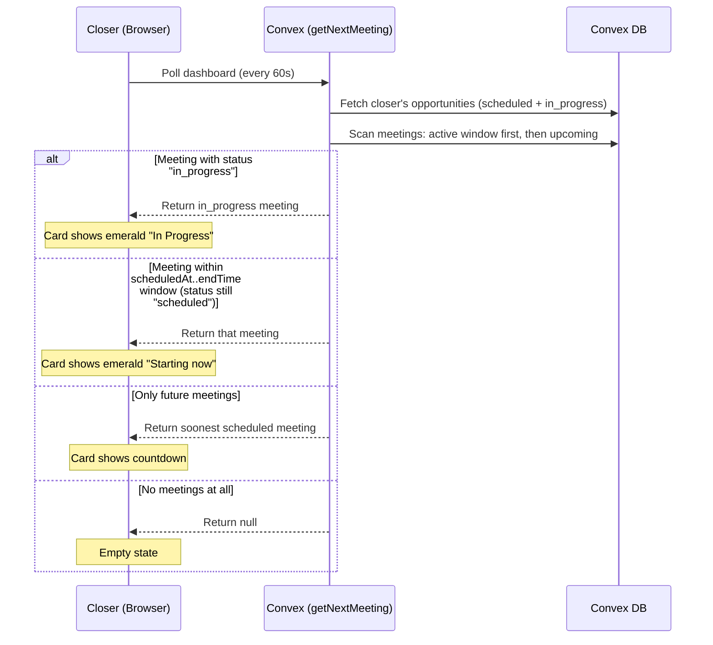
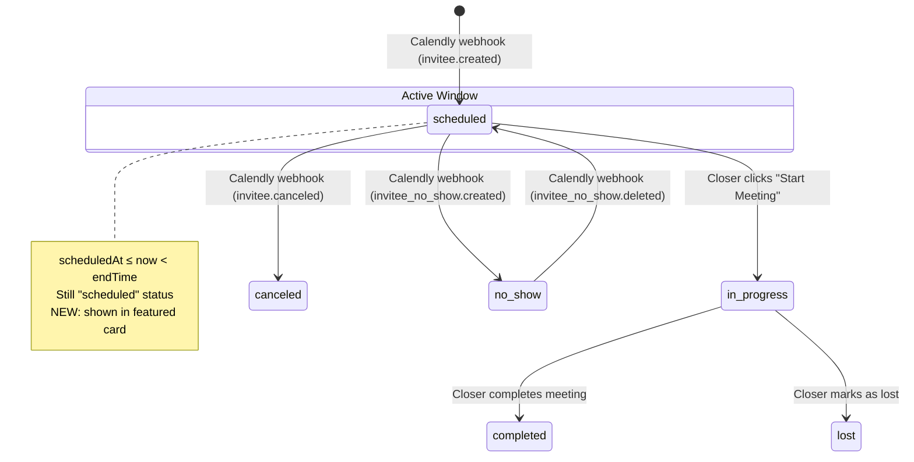

# Current Meeting Priority — Design Specification

**Version:** 0.2 (Revised)
**Status:** Draft
**Scope:** The closer dashboard's featured meeting card disappears the instant a meeting's `scheduledAt` passes, even though the meeting is still active. Fix the `getNextMeeting` query to show the most contextually relevant meeting: an ongoing meeting (within its duration window or explicitly in-progress) takes priority over the next future meeting.
**Prerequisite:** None. All required schema fields (`scheduledAt`, `durationMinutes`, `status`) and indexes already exist.

---

## Table of Contents

1. [Goals & Non-Goals](#1-goals--non-goals)
2. [Actors & Roles](#2-actors--roles)
3. [End-to-End Flow Overview](#3-end-to-end-flow-overview)
4. [Phase 1: Fix Query Logic](#4-phase-1-fix-query-logic)
5. [Phase 2: Frontend Polish](#5-phase-2-frontend-polish)
6. [Data Model](#6-data-model)
7. [Convex Function Architecture](#7-convex-function-architecture)
8. [Security Considerations](#8-security-considerations)
9. [Error Handling & Edge Cases](#9-error-handling--edge-cases)
10. [Open Questions](#10-open-questions)
11. [Dependencies](#11-dependencies)
12. [Applicable Skills](#12-applicable-skills)

---

## 1. Goals & Non-Goals

### Goals

- A meeting whose time window is currently active (`scheduledAt ≤ now < scheduledAt + durationMinutes × 60 000`) appears in the featured card — regardless of whether the closer has clicked "Start Meeting".
- A meeting explicitly marked `"in_progress"` always appears in the featured card, even if its computed time window has elapsed (meetings can run long).
- When no meeting is currently active, the card falls back to the soonest future `"scheduled"` meeting — identical to today's behavior.
- The fix uses existing indexes and requires zero schema changes.

### Non-Goals (deferred)

- Automatic status transition from `"scheduled"` → `"in_progress"` when `scheduledAt` passes (separate cron/webhook concern).
- Showing multiple concurrent meetings (if a closer has overlapping meetings, show the earliest-started one).
- Meeting history or "just finished" card (Phase 2 / separate feature).

---

## 2. Actors & Roles

| Actor       | Identity                  | Auth Method                                          | Key Permissions                            |
| ----------- | ------------------------- | ---------------------------------------------------- | ------------------------------------------ |
| **Closer**  | Closer team member        | WorkOS AuthKit, member of tenant org, role=`"closer"` | View own assigned meetings on dashboard    |

---

## 3. End-to-End Flow Overview



---

## 4. Phase 1: Fix Query Logic

### 4.1 Root Cause

Two bugs compound in `getNextMeeting` (`convex/closer/dashboard.ts`):

**Bug A — Time filter excludes ongoing meetings:**

```typescript
// Path: convex/closer/dashboard.ts (current, line 41-43)
const upcomingMeetings = ctx.db
  .query("meetings")
  .withIndex("by_tenantId_and_scheduledAt", (q) =>
    q.eq("tenantId", tenantId).gte("scheduledAt", now)  // ← excludes meetings that have started
  );
```

Once `now > scheduledAt`, the meeting vanishes from results — even if the closer hasn't joined yet and the meeting window is still open.

**Bug B — Opportunity filter too narrow:**

```typescript
// Path: convex/closer/dashboard.ts (current, line 27)
const scheduledOpps = myOpps.filter((opportunity) => opportunity.status === "scheduled");
```

If a meeting has been started (opportunity status is `"in_progress"`), its opportunity is excluded from `oppIds`, so even if we found the meeting, we'd skip it.

> **Why the previous design was wrong:** The prior design (v0.1) proposed scanning all meetings with `.collect()` (no index) to find `status === "in_progress"` meetings. This is a full table scan — O(n) over every meeting in the tenant — and still doesn't fix Bug A for the common case where the closer hasn't clicked "Start" and the meeting is still `"scheduled"` but `scheduledAt` has passed.

### 4.2 Fix Strategy

The fix uses a **two-pass approach** with the existing `by_tenantId_and_scheduledAt` index:

1. **Pass 1 — Active meetings:** Query meetings where `scheduledAt >= now - maxDuration`. This captures any meeting that _could_ still be active. Filter in application code to meetings whose end time (`scheduledAt + durationMinutes * 60_000`) is in the future, OR whose status is `"in_progress"`. Pick the one with the latest `scheduledAt`.

2. **Pass 2 — Future meetings (fallback):** Same as today: `scheduledAt >= now`, status `"scheduled"`. Pick the earliest.

The opportunity filter is widened to include both `"scheduled"` and `"in_progress"` statuses.

> **Why two passes instead of one wider scan:** A single scan from `scheduledAt >= now - MAX_WINDOW` could work but would process every meeting from the last N hours. By splitting into two focused scans — one backward-looking (small window, ~4h max) and one forward-looking — we keep each scan tight and early-exit when a match is found. Convex index scans are already sorted by `scheduledAt`, so both passes are efficient.
>
> **Why not add a new index on `["tenantId", "status", "scheduledAt"]`:** Adding a composite index would let us filter by status in the index, but it adds write overhead to every meeting mutation. Since the number of meetings scanned in the backward window is very small (a closer typically has 0-2 meetings in any 4-hour window), the application-level filter is negligible cost.

### 4.3 Updated Query Implementation

```typescript
// Path: convex/closer/dashboard.ts
import { query } from "../_generated/server";
import { requireTenantUser } from "../requireTenantUser";

/**
 * Maximum meeting duration we support (in ms).
 * Used to set the lookback window for active-meeting detection.
 * 4 hours covers any realistic meeting length.
 */
const MAX_MEETING_DURATION_MS = 4 * 60 * 60 * 1000;

export const getNextMeeting = query({
  args: {},
  handler: async (ctx) => {
    const { userId, tenantId } = await requireTenantUser(ctx, ["closer"]);
    const now = Date.now();

    // ── Fetch this closer's relevant opportunities ──────────────────
    // Include both "scheduled" (upcoming) and "in_progress" (active)
    // so we can surface meetings in either state.
    const myOpps = await ctx.db
      .query("opportunities")
      .withIndex("by_tenantId_and_assignedCloserId", (q) =>
        q.eq("tenantId", tenantId).eq("assignedCloserId", userId)
      )
      .collect();

    const activeOpps = myOpps.filter(
      (opp) => opp.status === "scheduled" || opp.status === "in_progress"
    );

    if (activeOpps.length === 0) return null;

    const oppIds = new Set(activeOpps.map((opp) => opp._id));
    const opportunityById = new Map(
      activeOpps.map((opp) => [opp._id, opp]),
    );

    // Helper: enrich a meeting with lead + event type data
    const enrichMeeting = async (meeting: typeof nextMeeting) => {
      if (!meeting) return null;
      const opportunity = opportunityById.get(meeting.opportunityId);
      const lead = opportunity ? await ctx.db.get(opportunity.leadId) : null;
      const eventTypeConfig = opportunity?.eventTypeConfigId
        ? await ctx.db.get(opportunity.eventTypeConfigId)
        : null;
      return {
        meeting,
        opportunity,
        lead,
        eventTypeName: eventTypeConfig?.displayName ?? null,
      };
    };

    // ── Pass 1: Find an active meeting ──────────────────────────────
    // Look back up to MAX_MEETING_DURATION_MS to find meetings that
    // started recently and may still be in their time window.
    const lookbackStart = now - MAX_MEETING_DURATION_MS;

    // We need meetings between lookbackStart and now, iterated in
    // reverse chronological order so we find the most recently started
    // active meeting first.
    const recentMeetings = ctx.db
      .query("meetings")
      .withIndex("by_tenantId_and_scheduledAt", (q) =>
        q
          .eq("tenantId", tenantId)
          .gte("scheduledAt", lookbackStart)
          .lt("scheduledAt", now)
      )
      .order("desc");

    for await (const meeting of recentMeetings) {
      if (!oppIds.has(meeting.opportunityId)) continue;

      // Explicitly in-progress — always show (meeting may run over)
      if (meeting.status === "in_progress") {
        return enrichMeeting(meeting);
      }

      // Still "scheduled" but within its duration window — treat as active
      if (meeting.status === "scheduled") {
        const meetingEndTime =
          meeting.scheduledAt + meeting.durationMinutes * 60_000;
        if (now < meetingEndTime) {
          return enrichMeeting(meeting);
        }
      }

      // Skip completed, canceled, no_show
    }

    // ── Pass 2: Fallback to next future scheduled meeting ───────────
    // Same logic as original — scan forward from now.
    const upcomingMeetings = ctx.db
      .query("meetings")
      .withIndex("by_tenantId_and_scheduledAt", (q) =>
        q.eq("tenantId", tenantId).gte("scheduledAt", now)
      );

    let nextMeeting = null;
    for await (const meeting of upcomingMeetings) {
      if (meeting.status !== "scheduled") continue;
      if (!oppIds.has(meeting.opportunityId)) continue;
      nextMeeting = meeting;
      break;
    }

    return enrichMeeting(nextMeeting);
  },
});
```

### 4.4 Priority Logic Summary

The query returns the **first match** from this priority order:

| Priority | Condition                                                                 | Status          | Typical scenario                                    |
| -------- | ------------------------------------------------------------------------- | --------------- | --------------------------------------------------- |
| 1        | `status === "in_progress"`                                                | `in_progress`   | Closer clicked "Start Meeting"                      |
| 2        | `scheduledAt ≤ now < scheduledAt + durationMinutes × 60k` | `scheduled`     | Meeting time arrived, closer hasn't clicked "Start" |
| 3        | `scheduledAt > now` (soonest)                                             | `scheduled`     | Normal upcoming meeting                             |

### 4.5 How This Fixes the Production Bug

The user reported:
- Calendar shows an **ongoing meeting right now**
- Featured card shows the **next meeting in ~4 hours** (Nurse Sigsbury, 5:15 PM)

What's happening: The ongoing meeting has `scheduledAt` in the past → excluded by `.gte("scheduledAt", now)`. The 5:15 PM meeting has `scheduledAt` in the future → picked up as "next."

After the fix: Pass 1 looks back and finds the ongoing meeting (its `scheduledAt` is in the past but within `scheduledAt + durationMinutes * 60_000 > now`). It's returned as the featured meeting. Once that meeting's window ends (or the closer completes it), Pass 2 kicks in and shows the 5:15 PM meeting.

---

## 5. Phase 2: Frontend Polish

### 5.1 "In Progress" Badge State

The `FeaturedMeetingCard` already handles `hasStarted` (when `scheduledAt <= now`) with an emerald badge and "Starting now" text. However, we can improve the copy for meetings that have been running for a while:

```typescript
// Path: app/workspace/closer/_components/featured-meeting-card.tsx
const timeUntil = meeting.scheduledAt - now;
const hasStarted = timeUntil <= 0;

// Improved: show elapsed time for meetings that started more than 5 min ago
const countdownText = hasStarted
  ? timeUntil < -5 * 60 * 1000
    ? `Started ${formatDistanceToNow(meeting.scheduledAt, { addSuffix: true })}`
    : "Starting now"
  : formatDistanceToNow(meeting.scheduledAt, { addSuffix: true });
```

> **Why "Started X ago" vs just "Starting now":** If a meeting started 30 minutes ago, "Starting now" is misleading. "Started 30 minutes ago" gives the closer better context — they can see they may have missed the start and should join immediately. The 5-minute threshold avoids flickering between "Starting now" and "Started 1 minute ago".

### 5.2 No Other Frontend Changes

The rest of the `FeaturedMeetingCard` component works correctly with the updated query data. The urgency border colors, countdown timer, and action buttons all derive from `scheduledAt` and work for both currently-active and future meetings.

---

## 6. Data Model

### 6.1 `meetings` Table (No Changes)

The existing schema already has all fields needed:

```typescript
meetings: defineTable({
  tenantId: v.id("tenants"),
  opportunityId: v.id("opportunities"),
  calendlyEventUri: v.string(),
  calendlyInviteeUri: v.string(),
  zoomJoinUrl: v.optional(v.string()),
  scheduledAt: v.number(),       // Unix ms — when the meeting starts
  durationMinutes: v.number(),   // Used to compute end time for active-window check
  status: v.union(
    v.literal("scheduled"),      // Not started yet
    v.literal("in_progress"),    // Closer clicked "Start Meeting"
    v.literal("completed"),      // Finished
    v.literal("canceled"),       // Canceled via Calendly webhook
    v.literal("no_show"),        // No-show via Calendly webhook
  ),
  notes: v.optional(v.string()),
  leadName: v.optional(v.string()),
  createdAt: v.number(),
})
  .index("by_opportunityId", ["opportunityId"])
  .index("by_tenantId_and_scheduledAt", ["tenantId", "scheduledAt"])     // ← used by both passes
  .index("by_tenantId_and_calendlyEventUri", ["tenantId", "calendlyEventUri"]),
```

**No schema migrations required.** The `durationMinutes` field is already populated for every meeting by the Calendly webhook processor.

### 6.2 `opportunities` Table (No Changes)

The query widens the filter to include `"in_progress"` opportunities in addition to `"scheduled"`, but no schema change is needed.

### 6.3 Meeting Lifecycle State Machine



---

## 7. Convex Function Architecture

```
convex/
├── closer/
│   ├── dashboard.ts              # MODIFIED: two-pass active+upcoming logic in getNextMeeting — Phase 1
│   ├── meetingActions.ts         # No change
│   ├── meetingDetail.ts          # No change
│   └── followUp.ts               # No change
├── schema.ts                     # No change
└── ...
```

```
app/
├── workspace/
│   └── closer/
│       └── _components/
│           ├── featured-meeting-card.tsx     # MODIFIED: "Started X ago" copy — Phase 2
│           └── closer-dashboard-page-client.tsx  # No change
```

---

## 8. Security Considerations

### 8.1 Multi-Tenant Isolation

- Both passes use the `by_tenantId_and_scheduledAt` index, scoping all reads to the authenticated user's tenant.
- `requireTenantUser()` enforces tenant membership and closer role.
- No cross-tenant data is ever accessible.

### 8.2 Role-Based Data Access

| Data                             | Closer      | Admin/Owner |
| -------------------------------- | ----------- | ----------- |
| Own active/scheduled meetings    | Full        | N/A (not this query) |
| Other closer's meetings          | None        | N/A         |

The query scopes to meetings belonging to opportunities assigned to the authenticated closer via `oppIds.has(meeting.opportunityId)`. No change to authorization logic.

### 8.3 No Credential or Rate Limit Impact

- Pure read query against existing Convex data — no external API calls.
- No new credentials or environment variables.

---

## 9. Error Handling & Edge Cases

### 9.1 Meeting Window Already Elapsed, Status Still "scheduled"

**Scenario:** A meeting was scheduled for 1:00 PM (45 min duration), it's now 2:00 PM, the closer never joined, and the status is still `"scheduled"`.

**Detection:** `scheduledAt + durationMinutes * 60_000 < now` — the meeting end time is in the past.

**Behavior:** Pass 1 skips it (end time has passed). Pass 2 also skips it (scheduledAt < now). The meeting effectively "ages out" — the card shows the next future meeting or empty state. This is correct: if the window has fully elapsed, it's no longer relevant.

### 9.2 Meeting Runs Over Its Duration

**Scenario:** A 30-minute meeting at 2:00 PM has been going for 45 minutes (it's 2:45 PM). The closer clicked "Start Meeting" so status is `"in_progress"`.

**Detection:** `status === "in_progress"` in Pass 1.

**Behavior:** Shown in the featured card regardless of the computed end time. The `"in_progress"` status takes priority — we trust that the closer is still in the meeting until they explicitly end it.

### 9.3 Multiple Active Meetings

**Scenario:** The closer has two meetings, both within their time windows (e.g., a 2:00 PM meeting running long and a 2:30 PM meeting that has started).

**Detection:** Pass 1 iterates in reverse chronological order (`order("desc")`).

**Behavior:** The most recently started active meeting is returned (the 2:30 PM one). This is the most contextually relevant one.

### 9.4 `durationMinutes` is Zero or Missing

**Scenario:** A meeting has `durationMinutes: 0` (malformed Calendly data).

**Detection:** `scheduledAt + 0 * 60_000 = scheduledAt`, so `now < scheduledAt` is false the instant the meeting starts.

**Behavior:** The meeting would age out immediately. However, if the closer clicks "Start Meeting" (setting status to `"in_progress"`), it will still be shown. This edge case is acceptable — Calendly always provides a valid duration.

### 9.5 Lookback Window Too Small

**Scenario:** `MAX_MEETING_DURATION_MS` is set to 4 hours, but someone has a 5-hour meeting.

**Detection:** The meeting's `scheduledAt` falls outside the lookback window after 4 hours.

**Behavior:** After 4 hours, Pass 1 won't find it via the time range. However, if status is `"in_progress"`, this is a real issue. Mitigation: 4 hours is generous for any realistic sales meeting. If needed, increase `MAX_MEETING_DURATION_MS`.

| Edge Case                        | Detection                        | User-Facing Behavior                    |
| -------------------------------- | -------------------------------- | --------------------------------------- |
| Window elapsed, status scheduled | End time < now                   | Falls through to next meeting or empty  |
| Meeting runs over duration       | `status === "in_progress"`       | Still shown (status trumps time)        |
| Multiple active meetings         | desc order on scheduledAt        | Most recent active meeting shown        |
| Duration is 0                    | End time = start time            | Ages out immediately; ok for data edge  |

---

## 10. Open Questions

| #    | Question                                                                                          | Current Thinking                                                                                                 |
| ---- | ------------------------------------------------------------------------------------------------- | ---------------------------------------------------------------------------------------------------------------- |
| 1    | Should we add a `by_tenantId_and_status` index to avoid scanning meetings by time range?          | No. The lookback window is tight (≤4h) and a closer rarely has more than 2-3 meetings in that window. An extra index adds write overhead to every meeting mutation for negligible read benefit. |
| ~~2~~ | ~~Should the query also check for `"in_progress"` opportunities?~~                               | **Resolved.** Yes — the opportunity filter is widened to `"scheduled" \|\| "in_progress"`. Without this, an in-progress meeting's opportunity would be excluded from `oppIds`. |
| 3    | Should we add a cron that auto-transitions `"scheduled"` → `"in_progress"` at `scheduledAt`?     | Deferred. The time-window check in this fix handles the display correctly without requiring status transitions. A cron could be added later for data hygiene. |

---

## 11. Dependencies

### New Packages

None.

### Already Installed (no action needed)

| Package    | Used for                                    |
| ---------- | ------------------------------------------- |
| `convex`   | Backend runtime, queries, index scans       |
| `date-fns` | Frontend: `formatDistanceToNow` for elapsed |

### Environment Variables

None.

---

## 12. Applicable Skills

| Skill                      | When to Invoke                                         | Phase   |
| -------------------------- | ------------------------------------------------------ | ------- |
| `convex-performance-audit` | If monitoring shows excessive reads in the lookback scan | Post-deploy |

---

*This document is a living specification. Sections will be updated as implementation progresses and open questions are resolved.*
