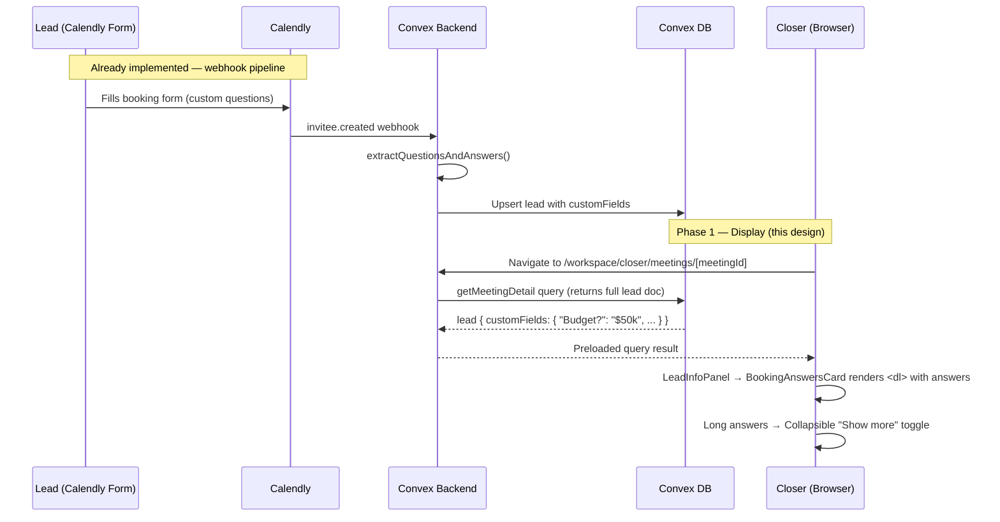

# Custom Event Fields Display — Design Specification

**Version:** 0.1 (MVP)
**Status:** Draft
**Scope:** Calendly booking-form answers are extracted by the webhook pipeline and stored on `leads.customFields` but never shown to closers → this feature adds a "Booking Answers" card to the meeting-detail sidebar so closers see every custom answer before the call.
**Prerequisite:** Calendly webhook ingestion pipeline fully operational; `leads.customFields` populated from `invitee.created` events (confirmed in technical report 2026-04-05).

---

## Table of Contents

1. [Goals & Non-Goals](#1-goals--non-goals)
2. [Actors & Roles](#2-actors--roles)
3. [End-to-End Flow Overview](#3-end-to-end-flow-overview)
4. [Phase 1: Display Custom Fields in LeadInfoPanel](#4-phase-1-display-custom-fields-in-leadinfopanel)
5. [Phase 2: Schema Hardening (VULN-08)](#5-phase-2-schema-hardening-vuln-08)
6. [Data Model](#6-data-model)
7. [Convex Function Architecture](#7-convex-function-architecture)
8. [Routing & Authorization](#8-routing--authorization)
9. [Security Considerations](#9-security-considerations)
10. [Error Handling & Edge Cases](#10-error-handling--edge-cases)
11. [Open Questions](#11-open-questions)
12. [Dependencies](#12-dependencies)
13. [Applicable Skills](#13-applicable-skills)

---

## 1. Goals & Non-Goals

### Goals

- **Surface booking-form answers** in a dedicated "Booking Answers" card within the `LeadInfoPanel` sidebar, so closers have full context before every call.
- **Semantic HTML** — use `<dl>/<dt>/<dd>` (definition list) for question-answer pairs, the correct HTML element for this data shape.
- **Long-text handling** — answers longer than ~3 lines collapse with an inline "Show more" toggle using the existing `Collapsible` component, instead of relying on browser-tooltip hover (poor accessibility, invisible on touch devices).
- **Conditional rendering** — hide the card entirely when no custom fields exist (matching the `MeetingHistoryTimeline` pattern), rather than showing an empty card that adds visual noise.
- **Responsive layout** — maintain sidebar integrity at all breakpoints (mobile single-column through desktop 4-column grid).
- **Accessibility** — WCAG 2.1 AA: sufficient color contrast, keyboard-navigable collapsible triggers, no information hidden behind hover-only interactions.
- **Schema hardening** — tighten `leads.customFields` from `v.any()` to a bounded record validator (VULN-08 remediation).

### Non-Goals (deferred)

- Editing custom answers from the CRM UI (Phase 2).
- Per-field visibility controls for admins (Phase 3).
- Rendering Calendly **routing form** submissions — `routing_form_submission.created` is unhandled by the pipeline today (separate design).
- Markdown or rich-text rendering of answer values (Phase 2+).
- Bulk export of custom fields to CSV (Phase 3).

---

## 2. Actors & Roles

| Actor              | Identity                 | Auth Method                                   | Key Permissions                                           |
|--------------------|--------------------------|-----------------------------------------------|-----------------------------------------------------------|
| **Closer**         | Sales rep at tenant org  | WorkOS AuthKit, `closer` role in tenant org   | View custom fields for own assigned meetings              |
| **Tenant Master**  | Tenant owner/admin       | WorkOS AuthKit, `tenant_master` role          | View custom fields for all meetings in tenant             |
| **Tenant Admin**   | Tenant administrator     | WorkOS AuthKit, `tenant_admin` role           | View custom fields for all meetings in tenant             |
| **System**         | Convex backend           | Internal mutation/query                       | Store and return `leads.customFields` via existing queries |

---

## 3. End-to-End Flow Overview



---

## 4. Phase 1: Display Custom Fields in LeadInfoPanel

### 4.1 Why No Backend Changes Are Needed

The existing `getMeetingDetail` query (`convex/closer/meetingDetail.ts`) already returns the full `lead: Doc<"leads">` document, which includes `customFields`. The `LeadInfoPanel` component already receives `lead` as a prop. **Zero backend changes are required** — this is a frontend-only phase.

> **Runtime decision:** We do not add a separate query or reshape the data on the server. The `customFields` value is small (typically 3–8 string pairs, under 2 KB) and already travels with the lead document. Adding a projection would complicate the query for no measurable performance benefit.

### 4.2 Client-Side Type Guard

Since `customFields` is typed as `v.any()` in the schema, we need a runtime type guard on the client to safely narrow the type before rendering. This guard lives **in the component file** — it's a 10-line utility, not worth a separate module.

```typescript
// Path: app/workspace/closer/meetings/_components/booking-answers-card.tsx

/**
 * Runtime guard: true when value is a non-empty Record<string, string>.
 *
 * Rejects: null, undefined, arrays, objects with non-string values,
 * empty objects.
 */
function isStringRecord(
  value: unknown,
): value is Record<string, string> {
  if (typeof value !== "object" || value === null || Array.isArray(value)) {
    return false;
  }
  const entries = Object.entries(value);
  if (entries.length === 0) return false;
  return entries.every(
    ([, v]) => typeof v === "string" && v.length > 0,
  );
}
```

> **Why not in `convex/lib/`?** The guard is only used by the frontend component. Placing it in `convex/lib/` would require a `"use node"` directive (unnecessary), and it would blur the boundary between Convex server code and React client code. Keeping it co-located with the component that uses it follows the colocation principle.

### 4.3 BookingAnswersCard Component

New component that renders the custom fields as a semantic definition list (`<dl>`), with collapsible long answers.

```typescript
// Path: app/workspace/closer/meetings/_components/booking-answers-card.tsx
"use client";

import { useState } from "react";
import {
  Card,
  CardContent,
  CardHeader,
  CardTitle,
} from "@/components/ui/card";
import {
  Collapsible,
  CollapsibleContent,
  CollapsibleTrigger,
} from "@/components/ui/collapsible";
import { Separator } from "@/components/ui/separator";
import { ClipboardListIcon, ChevronDownIcon } from "lucide-react";
import { cn } from "@/lib/utils";

/** Character threshold above which an answer gets a "Show more" toggle. */
const LONG_ANSWER_THRESHOLD = 120;

type BookingAnswersCardProps = {
  customFields: unknown;
};

/**
 * Displays Calendly booking-form answers as a definition list.
 *
 * - Uses <dl>/<dt>/<dd> for semantic correctness (question → answer pairs).
 * - Hides entirely when customFields is absent / empty / malformed.
 * - Long answers (>120 chars) collapse behind a Collapsible toggle.
 */
export function BookingAnswersCard({ customFields }: BookingAnswersCardProps) {
  if (!isStringRecord(customFields)) return null;

  const entries = Object.entries(customFields);

  return (
    <Card>
      <CardHeader className="pb-3">
        <CardTitle className="text-base">Booking Answers</CardTitle>
      </CardHeader>
      <CardContent>
        <dl className="flex flex-col gap-3">
          {entries.map(([question, answer], index) => (
            <div key={question}>
              <dt className="text-xs font-medium uppercase tracking-wide text-muted-foreground">
                {question}
              </dt>
              {answer.length > LONG_ANSWER_THRESHOLD ? (
                <CollapsibleAnswer answer={answer} />
              ) : (
                <dd className="mt-1 text-sm leading-relaxed break-words">
                  {answer}
                </dd>
              )}
              {index < entries.length - 1 && (
                <Separator className="mt-3" />
              )}
            </div>
          ))}
        </dl>
      </CardContent>
    </Card>
  );
}

// ─── Internal ──────────────────────────────────────────────────────────

function CollapsibleAnswer({ answer }: { answer: string }) {
  const [open, setOpen] = useState(false);

  return (
    <Collapsible open={open} onOpenChange={setOpen}>
      <dd className="mt-1">
        {!open && (
          <p className="line-clamp-3 text-sm leading-relaxed break-words">
            {answer}
          </p>
        )}
        <CollapsibleContent>
          <p className="text-sm leading-relaxed break-words">{answer}</p>
        </CollapsibleContent>
        <CollapsibleTrigger asChild>
          <button
            type="button"
            className="mt-1 inline-flex items-center gap-1 text-xs font-medium text-primary hover:underline focus-visible:outline-none focus-visible:ring-2 focus-visible:ring-ring focus-visible:ring-offset-2 rounded"
          >
            {open ? "Show less" : "Show more"}
            <ChevronDownIcon
              className={cn(
                "size-3 transition-transform",
                open && "rotate-180",
              )}
            />
          </button>
        </CollapsibleTrigger>
      </dd>
    </Collapsible>
  );
}

function isStringRecord(
  value: unknown,
): value is Record<string, string> {
  if (typeof value !== "object" || value === null || Array.isArray(value)) {
    return false;
  }
  const entries = Object.entries(value);
  if (entries.length === 0) return false;
  return entries.every(
    ([, v]) => typeof v === "string" && v.length > 0,
  );
}
```

**Design decisions:**

| Decision                      | Choice                         | Why                                                                                                                                                       |
|-------------------------------|--------------------------------|-----------------------------------------------------------------------------------------------------------------------------------------------------------|
| HTML element for Q&A          | `<dl>/<dt>/<dd>`               | Semantically correct for term–definition pairs; screen readers announce the relationship automatically.                                                   |
| Long answer handling          | `Collapsible` + "Show more"    | Accessible on touch devices (no hover required), keyboard-navigable, uses an existing app component. `title` tooltip is invisible to screen readers.       |
| Collapse threshold            | 120 characters                 | Roughly 3 lines in the narrow sidebar. Avoids collapsing short answers unnecessarily.                                                                     |
| Empty / malformed state       | Return `null` (hide card)      | Matches `MeetingHistoryTimeline` pattern — the card simply doesn't appear. Avoids an empty card that adds visual noise with zero information.              |
| Card title                    | "Booking Answers"              | User-facing label tied to the Calendly booking form. "Custom Fields" is a dev term; "Custom Answers" is ambiguous. "Booking Answers" is clear.            |
| Type guard location           | Co-located in component file   | Single consumer, <15 lines, no reuse need. Colocation > premature abstraction.                                                                            |
| Prop type for `customFields`  | `unknown`                      | Reflects the actual runtime type (`v.any()`). The component narrows with the guard — no cast needed upstream.                                             |

### 4.4 Integration into LeadInfoPanel

The `BookingAnswersCard` is inserted between the "Lead Information" card and the "Meeting History" card. This placement follows the information hierarchy: **who they are → what they told us → their history**.

```typescript
// Path: app/workspace/closer/meetings/_components/lead-info-panel.tsx
// ─── Changes ────────────────────────────────────────────────────────────

// ADD import (after existing imports):
import { BookingAnswersCard } from "./booking-answers-card";

// In the JSX return, between the Lead Profile card and Meeting History card:
export function LeadInfoPanel({ lead, meetingHistory }: LeadInfoPanelProps) {
  return (
    <div className="flex flex-col gap-4">
      {/* Lead Profile — existing, unchanged */}
      <Card>
        {/* ... name, email, phone ... */}
      </Card>

      {/* Booking Answers — NEW */}
      <BookingAnswersCard customFields={lead.customFields} />

      {/* Meeting History — existing, unchanged */}
      {meetingHistory.length > 0 && (
        <Card>
          {/* ... MeetingHistoryTimeline ... */}
        </Card>
      )}
    </div>
  );
}
```

> **Why between contact info and meeting history?** The closer's mental model when preparing for a call:
> 1. Who is this person? (name, email, phone)
> 2. What did they tell us in the booking form? (budget, use case, company size)
> 3. What's our history with them? (past meetings, outcomes)
>
> Placing booking answers after contact info and before history matches this flow.

### 4.5 Visual Design — Spatial Context

#### 4.5.1 Full-Page Layout (current state)

The meeting detail page uses a **nav sidebar + two-column content grid** layout. The diagram below represents the current live UI at the `md` breakpoint (~1200px viewport):

```
┌──────────┬──────────────────────────────────────────────────────────────────┐
│ MAGNUS   │  Dashboard > Meetings > ...                    🔍 Search  ☀ 🔔 │
│          ├──────────────────────────────────────────────────────────────────┤
│ User     │  ← Back                                            ┌──────────┐│
│ Closer   │                                                    │Scheduled ││
│          │                                                    └──────────┘│
│ ──────── │  ┌─────────────────────┐  ┌──────────────────────────────────┐ │
│ Dashboard│  │ Lead Information    │  │ Meeting Details       Scheduled  │ │
│ My Pipeln│  │                     │  │                                  │ │
│          │  │ 🟦 NAME             │  │  📅 DATE & TIME                  │ │
│          │  │    LALALELEL        │  │     Monday, April 6, 2026        │ │
│          │  │                     │  │     9:30 AM                      │ │
│          │  │ 🟦 EMAIL            │  │                                  │ │
│          │  │    vas.claudio15+…  │  │  🕐 DURATION                    │ │
│          │  │                     │  │     30 minutes                   │ │
│          │  └─────────────────────┘  │                                  │ │
│          │          16px gap          │  👤 ASSIGNED CLOSER              │ │
│          │  ┌─────────────────────┐  │     Nimbususus NASNNSN           │ │
│          │  │ Meeting History     │  │     vas.claudio15+closer2@…      │ │
│          │  │                     │  │  ─────────────────────────────── │ │
│          │  │  ● Apr 6, 2026     │  │  🔗 No Zoom link available       │ │
│          │  │    Scheduled       │  └──────────────────────────────────┘ │
│          │  │    9:30 AM · Currnt│                                       │
│          │  │                     │  ┌──────────────────────────────────┐ │
│          │  └─────────────────────┘  │ Meeting Notes                    │ │
│          │                           │                                  │ │
│          │    LEFT COLUMN            │  Add notes about this meeting.   │ │
│          │    ~1/3 width             │  Changes auto-save as you type…  │ │
│          │    (md:col-span-1)        │                                  │ │
│          │                           │                                  │ │
│          │                           └──────────────────────────────────┘ │
│          │                             RIGHT COLUMN                       │
│          │                             ~2/3 width (md:col-span-2)         │
│          │                                                                │
│          │  ┌──────────┐                                                  │
│          │  │▸ Start   │  ℹ Click "Start Meeting" to open Zoom and mark…  │
│          │  │ Meeting  │                                                  │
│          │  └──────────┘                                                  │
│ ──────── │                                                                │
│ Profile  │                                                                │
│ Sign Out │                                                                │
└──────────┴──────────────────────────────────────────────────────────────────┘
```

**Key spatial facts (from screenshot):**

| Property                     | Value                                                                 |
|------------------------------|-----------------------------------------------------------------------|
| Nav sidebar                  | ~240px fixed, dark surface, branding + user role + nav links          |
| Content grid                 | `grid-cols-1` → `md:grid-cols-3` → `lg:grid-cols-4`                  |
| Left column                  | `md:col-span-1` (~33% at md, ~25% at lg). Approx **380px** at 1200px |
| Right column                 | `md:col-span-2` / `lg:col-span-3`                                    |
| Card gap (vertical)          | `gap-4` (16px) between stacked cards in each column                  |
| Grid gap (horizontal)        | `gap-6` (24px) between left and right columns                        |
| Card style                   | Dark surface, `rounded-xl` corners, subtle border                    |
| Header row                   | `← Back` (ghost button) left-aligned, status badge right-aligned     |
| Action bar                   | Full-width below grid, green primary button + helper text            |

#### 4.5.2 Left Column — After Change (with Booking Answers inserted)

The new `BookingAnswersCard` inserts between "Lead Information" and "Meeting History", adding a third card to the left column. The left column grows vertically; this is fine because it scrolls independently within the page layout.

```
  LEFT COLUMN (~380px at md)
  ┌─────────────────────────────────┐
  │  Lead Information               │  EXISTING — unchanged
  │                                 │
  │  ┌────┐ NAME                    │  Icon: 32×32 rounded-lg container
  │  │ 👤 │ LALALELEL               │  bg-primary/10, text-primary
  │  └────┘                         │  Label: text-xs uppercase muted
  │                                 │  Value: text-sm font-semibold
  │  ┌────┐ EMAIL                   │
  │  │ ✉️  │ vas.claudio15+algo2@…   │  Value: text-sm text-primary link
  │  └────┘                         │
  │                                 │  (Phone row renders conditionally
  │                                 │   — absent in this screenshot)
  └─────────────────────────────────┘
              ↕ 16px gap (gap-4)
  ┌─────────────────────────────────┐
  │  Booking Answers                │  ★ NEW CARD
  │                                 │
  │  WHAT IS YOUR BUDGET?           │  <dt>: text-xs uppercase muted
  │  $50,000–$100,000               │  <dd>: text-sm leading-relaxed
  │  ──────────────────────────     │  <Separator>
  │                                 │
  │  TELL US ABOUT YOUR PROJECT     │  <dt>: same label style
  │  We're looking to migrate our   │  <dd>: line-clamp-3 (collapsed)
  │  legacy platform to a modern    │
  │  cloud-based solution that…     │
  │  ▸ Show more                    │  Collapsible trigger: text-xs
  │  ──────────────────────────     │  text-primary, ChevronDownIcon
  │                                 │
  │  COMPANY SIZE                   │
  │  50–200 employees               │  Last item: no separator
  └─────────────────────────────────┘
              ↕ 16px gap (gap-4)
  ┌─────────────────────────────────┐
  │  Meeting History                │  EXISTING — unchanged
  │                                 │
  │  ● Apr 6, 2026   ┌──────────┐  │  Green dot + date + status badge
  │    9:30 AM        │Scheduled │  │
  │    · Current      └──────────┘  │
  └─────────────────────────────────┘
```

#### 4.5.3 Design Language Alignment

The new card must match the exact visual patterns observed in the current UI:

**Card chrome** (shared by all cards on the page):

| Property         | Value                              | Source                                         |
|------------------|------------------------------------|------------------------------------------------|
| Background       | Dark card surface (`bg-card`)      | Slightly lighter than page bg in dark theme    |
| Border           | Subtle (`border` token)            | 1px, low-contrast in dark mode                 |
| Corner radius    | `rounded-xl`                       | Consistent across Lead Info, Meeting History, Meeting Details, Notes |
| Header padding   | `CardHeader className="pb-3"`      | Tight bottom padding — title sits close to content |
| Title size       | `text-base` (~16px, semibold)      | Matches "Lead Information", "Meeting History", "Meeting Details", "Meeting Notes" |

**Label style** (the new `<dt>` must match the existing `ContactRow` labels):

The "Lead Information" card uses this exact pattern for labels:
```
NAME          ← text-xs font-medium uppercase tracking-wide text-muted-foreground
LALALELEL     ← text-sm font-semibold (value)

EMAIL         ← same label style
vas.claudi…   ← text-sm text-primary (link value)
```

The "Meeting Details" card on the right column uses the same label style:
```
DATE & TIME       ← text-xs uppercase muted (identical treatment)
Monday, April…    ← text-sm value

DURATION          ← same
30 minutes        ← same

ASSIGNED CLOSER   ← same
Nimbususus…       ← same
```

This uppercase-muted-label-above-value pattern is the **universal label convention** across the entire page. The `BookingAnswersCard` `<dt>` elements use the identical class string to maintain visual consistency:

```
text-xs font-medium uppercase tracking-wide text-muted-foreground
```

**Answer values** differ from contact values — they are plain text (not links, not bold names), so they use `text-sm leading-relaxed` without `font-semibold`. This matches how a read-only informational value should appear.

#### 4.5.4 Typography & Spacing Spec

| Element                   | Class                                                            | Rendered result                                                 |
|---------------------------|------------------------------------------------------------------|-----------------------------------------------------------------|
| Card title                | `text-base` (from `CardTitle`)                                   | ~16px, semibold. Matches "Lead Information", "Meeting History"  |
| Question label (`<dt>`)   | `text-xs font-medium uppercase tracking-wide text-muted-foreground` | ~12px, uppercase, muted. Identical to "NAME", "EMAIL", "DATE & TIME" labels |
| Answer text (`<dd>`)      | `mt-1 text-sm leading-relaxed break-words`                       | ~14px, relaxed line-height, word-wrapping for narrow column     |
| "Show more" trigger       | `text-xs font-medium text-primary`                               | ~12px, primary color (teal/green tint), hover underline         |
| Chevron icon              | `size-3` (12px), `transition-transform`, rotates 180° on open   | Subtle directional cue next to "Show more" text                 |
| Separator between Q&As    | `<Separator className="mt-3" />`                                 | 1px `bg-border` line, 12px top margin. Matches the separator in Meeting Details card |
| Gap between Q&A pairs     | `gap-3` on `<dl>` container                                     | 12px vertical spacing between each question-answer group        |

#### 4.5.5 Responsive Behavior

| Breakpoint    | Grid                              | Left column width   | Booking Answers card behavior                    |
|---------------|------------------------------------|---------------------|--------------------------------------------------|
| `< md` (mobile) | `grid-cols-1` — single stack     | 100% of content     | Full-width card, renders between Lead Info and Meeting Details. Plenty of room for answers. |
| `md` (~768px+)  | `grid-cols-3` — 1 + 2 split     | ~33% ≈ 380px        | Narrow sidebar. `break-words` prevents overflow. Long answers collapse via Collapsible. |
| `lg` (~1024px+) | `grid-cols-4` — 1 + 3 split     | ~25% ≈ 300px        | Narrowest. Same handling — `break-words` + `line-clamp-3` keep card tidy. |

At the `lg` breakpoint (~300px column), a 120-character answer spans roughly 4–5 lines before clamping. The `LONG_ANSWER_THRESHOLD` of 120 characters ensures only genuinely long answers get the Collapsible treatment at this width.

### 4.6 Accessibility Audit

| WCAG Criterion                    | Status | Implementation Detail                                                                                                   |
|-----------------------------------|--------|--------------------------------------------------------------------------------------------------------------------------|
| 1.1.1 Non-text Content            | N/A    | No images or icons carrying meaning                                                                                      |
| 1.3.1 Info and Relationships      | Pass   | `<dl>/<dt>/<dd>` conveys question-answer relationship to assistive technology                                            |
| 1.4.3 Contrast (Minimum)          | Pass   | `text-muted-foreground` on question labels; full-contrast answer text; verified via theme tokens in OKLch color space    |
| 2.1.1 Keyboard                    | Pass   | "Show more" button is a native `<button>` — focusable and activable via Enter/Space                                     |
| 2.4.7 Focus Visible               | Pass   | `focus-visible:ring-2 focus-visible:ring-ring focus-visible:ring-offset-2` on trigger button                             |
| 4.1.2 Name, Role, Value           | Pass   | Radix `Collapsible` manages `aria-expanded` on trigger; `<button>` has visible text label ("Show more" / "Show less")    |

---

## 5. Phase 2: Schema Hardening (VULN-08)

### 5.1 Problem Statement

`leads.customFields` is currently `v.optional(v.any())`. While the pipeline's `extractQuestionsAndAnswers()` naturally produces `Record<string, string>`, the schema provides no enforcement. A compromised webhook signing key or future code change could store arbitrary data shapes, causing:

- Storage exhaustion (very large payloads)
- Rendering failures in the new `BookingAnswersCard`
- Query performance degradation (deeply nested objects)

### 5.2 Target Schema

```typescript
// Path: convex/schema.ts
leads: defineTable({
  // ... existing fields ...

  // CHANGED: from v.optional(v.any()) to bounded record
  customFields: v.optional(
    v.record(v.string(), v.string()),
  ),

  // ... existing fields ...
})
```

> **Why `v.record(v.string(), v.string())` and not `v.union(v.string(), v.number(), v.boolean())`?**
> The extraction function in `inviteeCreated.ts` already constrains values to strings only. Adding number/boolean support would be premature — Calendly booking form answers are always strings. Keeping it narrow is safer.

### 5.3 Migration Strategy

This requires the widen–migrate–narrow pattern because existing documents may have `customFields` values that don't match the new validator (edge cases: malformed data from early pipeline runs, manual DB edits).

**Step 1 — Validate existing data:**

```typescript
// Path: convex/migrations/validateCustomFields.ts
import { internalMutation } from "../_generated/server";

export const validate = internalMutation({
  args: {},
  handler: async (ctx) => {
    const leads = await ctx.db.query("leads").collect();
    let clean = 0;
    let dirty = 0;

    for (const lead of leads) {
      if (lead.customFields === undefined) {
        clean++;
        continue;
      }

      const cf = lead.customFields;
      if (
        typeof cf === "object" &&
        cf !== null &&
        !Array.isArray(cf) &&
        Object.values(cf).every((v) => typeof v === "string")
      ) {
        clean++;
      } else {
        dirty++;
        console.warn(
          `[Migration] Lead ${lead._id} has invalid customFields:`,
          JSON.stringify(cf).slice(0, 200),
        );
        // Remediate: drop invalid customFields
        await ctx.db.patch(lead._id, { customFields: undefined });
      }
    }

    console.log(`[Migration] customFields audit: ${clean} clean, ${dirty} remediated`);
  },
});
```

**Step 2 — Narrow schema** (after validation confirms 0 dirty records):

```typescript
// Path: convex/schema.ts — update the validator
customFields: v.optional(v.record(v.string(), v.string())),
```

**Step 3 — Deploy** with `npx convex deploy`.

> **Skill:** Use `convex-migration-helper` for safe execution of this migration.

---

## 6. Data Model

### 6.1 `leads` Table (existing — modified in Phase 2)

```typescript
// Path: convex/schema.ts
leads: defineTable({
  tenantId: v.id("tenants"),
  email: v.string(),
  fullName: v.optional(v.string()),
  phone: v.optional(v.string()),

  // Phase 1: no change — v.optional(v.any())
  // Phase 2: narrowed to bounded record
  customFields: v.optional(v.record(v.string(), v.string())),

  firstSeenAt: v.number(),  // Unix ms
  updatedAt: v.number(),    // Unix ms
})
  .index("by_tenantId", ["tenantId"])
  .index("by_tenantId_and_email", ["tenantId", "email"]),
```

No new tables. No new indexes.

---

## 7. Convex Function Architecture

```
convex/
├── closer/
│   └── meetingDetail.ts                 # UNCHANGED — already returns full lead doc
├── pipeline/
│   └── inviteeCreated.ts                # UNCHANGED — extraction logic stays as-is
├── migrations/
│   └── validateCustomFields.ts          # NEW: Data validation — Phase 2
├── schema.ts                            # MODIFIED: customFields validator — Phase 2
└── ... other existing files ...

app/
├── workspace/
│   └── closer/
│       └── meetings/
│           └── _components/
│               ├── lead-info-panel.tsx           # MODIFIED: import BookingAnswersCard — Phase 1
│               ├── booking-answers-card.tsx      # NEW: Custom fields display — Phase 1
│               ├── meeting-info-panel.tsx        # UNCHANGED
│               ├── meeting-history-timeline.tsx  # UNCHANGED
│               ├── meeting-notes.tsx             # UNCHANGED
│               ├── payment-links-panel.tsx       # UNCHANGED
│               └── outcome-action-bar.tsx        # UNCHANGED
```

---

## 8. Routing & Authorization

### 8.1 Route Structure

No new routes. The component renders within the existing meeting detail page:

```
app/
├── workspace/                                    # Requires WorkOS AuthKit session
│   └── closer/
│       └── meetings/
│           ├── page.tsx                          # Meeting list (closer, tenant_master, tenant_admin)
│           └── [meetingId]/
│               ├── page.tsx                      # Server component — preloads getMeetingDetail
│               └── _components/
│                   └── meeting-detail-page-client.tsx  # Client component — renders grid layout
```

### 8.2 Authorization Logic

No new authorization logic. The `getMeetingDetail` query already enforces:

1. **Authentication** — `requireTenantUser(ctx, ["closer", "tenant_master", "tenant_admin"])` verifies session and role.
2. **Tenant isolation** — `meeting.tenantId !== tenantId` check rejects cross-tenant access.
3. **Closer scoping** — `role === "closer" && opportunity.assignedCloserId !== userId` restricts closers to their own meetings.

The `BookingAnswersCard` inherits all these protections — it only receives data that the query has already authorized.

---

## 9. Security Considerations

### 9.1 XSS Prevention

- React JSX auto-escapes all text content in `<dt>` and `<dd>` elements. If a booking answer contains `<script>alert('xss')</script>`, it renders as literal visible text.
- **No `dangerouslySetInnerHTML`** is used anywhere in this component.
- The Radix `Collapsible` component uses safe DOM manipulation — no innerHTML.

### 9.2 Multi-Tenant Isolation

- `customFields` is stored on the `leads` document, scoped to `tenantId`.
- The `getMeetingDetail` query resolves `tenantId` from the authenticated user's session — never from client input.
- `BookingAnswersCard` receives only the lead document the query returned — no additional database access.

### 9.3 Role-Based Data Access

| Data                              | Closer       | Tenant Master | Tenant Admin | Unauthenticated |
|-----------------------------------|--------------|---------------|--------------|-----------------|
| Own meeting's lead custom fields  | Read         | Read          | Read         | None            |
| Team meeting's lead custom fields | None         | Read          | Read         | None            |
| Edit custom fields                | None (defer) | None (defer)  | None (defer) | None            |

### 9.4 Data Sensitivity

Custom fields may contain PII or business-sensitive data (budgets, company details, contact preferences). This feature **does not introduce new data exposure** — the data already exists in the database and is already returned by the query. It only adds a visual display layer for data the closer is already authorized to access.

---

## 10. Error Handling & Edge Cases

### 10.1 Missing or Malformed `customFields`

| `customFields` Value                  | `isStringRecord` Result | Component Behavior           |
|---------------------------------------|-------------------------|------------------------------|
| `undefined`                           | `false`                 | Returns `null` (card hidden) |
| `null`                                | `false`                 | Returns `null` (card hidden) |
| `{}`                                  | `false`                 | Returns `null` (card hidden) |
| `[]` (array)                          | `false`                 | Returns `null` (card hidden) |
| `{ "Budget": 50000 }` (non-string v) | `false`                 | Returns `null` (card hidden) |
| `"string"` (primitive)                | `false`                 | Returns `null` (card hidden) |
| `{ "Budget": "$50k" }`               | `true`                  | Renders one Q&A pair         |

**No error toast or error boundary needed** — the guard silently falls back to hiding the card. Malformed data is a backend concern (addressed by Phase 2 schema hardening).

### 10.2 Very Long Answers (1000+ characters)

**Scenario:** A Calendly text-area question yields a 2000-character answer.

**Handling:** Answers exceeding `LONG_ANSWER_THRESHOLD` (120 chars) render with `line-clamp-3` initially. The closer can toggle "Show more" to reveal the full text. The `break-words` class prevents horizontal overflow.

**No truncation of stored data** — the full answer is always in the DOM (for search, copy-paste); only visual display is collapsed.

### 10.3 Many Custom Fields (>10)

**Scenario:** A Calendly event type has 15 custom questions.

**Handling:** All 15 render in the card with `Separator` dividers. The sidebar is inside a scrollable container (flex column in the page grid). The card grows vertically — no virtualization needed for <20 items. Performance impact is negligible (15 `<div>` elements).

### 10.4 Special Characters and Unicode

**Scenario:** Answers contain emoji (🎉), CJK characters (日本語), RTL text (عربي), or HTML entities (`&amp;`).

**Handling:** React renders all Unicode correctly. `break-words` handles CJK word wrapping. No explicit RTL support is added (app-wide concern, not component-specific). HTML entities render as literal text (React escaping).

### 10.5 Race Condition: Lead Updated While Viewing

**Scenario:** A new Calendly booking arrives for the same lead while the closer has the meeting detail open. The pipeline calls `mergeCustomFields`, adding new Q&A pairs.

**Handling:** The `getMeetingDetail` query is a Convex reactive query (via `usePreloadedQuery`). The UI will automatically re-render with the updated custom fields when the lead document changes. No manual refresh needed.

---

## 11. Open Questions

| #      | Question                                                                          | Current Thinking                                                                                                                                 |
|--------|-----------------------------------------------------------------------------------|--------------------------------------------------------------------------------------------------------------------------------------------------|
| 1      | Should we preserve the `position` field from Calendly Q&A for display ordering?   | Yes — worth doing. The pipeline currently discards `position`. We should extract and store it so answers render in the same order as the form.   |
| 2      | Should the card title be "Booking Answers" or "Form Responses"?                   | "Booking Answers" — closer-friendly language. "Form Responses" sounds like a developer term.                                                     |
| 3      | Should closers be able to copy individual answers?                                | Deferred to Phase 2. For MVP, browser-native text selection works.                                                                               |
| 4      | Should admins configure which questions are visible to closers?                   | Deferred to Phase 3. MVP shows all answers — the closer already has access to this lead.                                                         |
| ~~5~~  | ~~Do we need a separate backend query for custom fields?~~                        | **Resolved.** No — `getMeetingDetail` already returns the full lead document including `customFields`.                                            |
| ~~6~~  | ~~Should we show an empty state card when there are no custom fields?~~           | **Resolved.** No — hide the card entirely. Matches the `MeetingHistoryTimeline` conditional rendering pattern and avoids visual noise.             |

---

## 12. Dependencies

### New Packages

None. All dependencies are already installed.

### Already Installed (no action needed)

| Package            | Used for                                             |
|--------------------|------------------------------------------------------|
| `react`            | Component framework, `useState` for collapsible state |
| `next`             | App Router, server-side preloading                   |
| `radix-ui`         | `Collapsible` primitive (already in `components/ui/`) |
| `lucide-react`     | `ChevronDownIcon` for collapsible toggle indicator   |
| `class-variance-authority` | `cn()` utility for conditional classes       |
| `convex`           | Schema validators, reactive queries                  |

### Environment Variables

None. No new environment variables required.

---

## 13. Applicable Skills

| Skill                          | When to Invoke                                                                 | Phase(s) |
|--------------------------------|--------------------------------------------------------------------------------|----------|
| `shadcn`                       | Verify Card, Collapsible, Separator component APIs and usage patterns          | Phase 1  |
| `web-design-guidelines`        | Accessibility audit of `BookingAnswersCard` — semantic HTML, focus, contrast   | Phase 1  |
| `frontend-design`              | Visual polish — spacing, typography, alignment with existing sidebar cards     | Phase 1  |
| `vercel-react-best-practices`  | Verify no unnecessary re-renders from `useState` in `CollapsibleAnswer`       | Phase 1  |
| `convex-migration-helper`      | Safe widen–migrate–narrow for `customFields` schema change                    | Phase 2  |
| `simplify`                     | Post-implementation review of component code for reuse and quality            | Phase 1  |

---

## Implementation Checklist

### Phase 1 — Display (frontend only)

- [ ] Create `app/workspace/closer/meetings/_components/booking-answers-card.tsx` with `BookingAnswersCard` component
- [ ] Add `isStringRecord` type guard (co-located in component file)
- [ ] Add `CollapsibleAnswer` sub-component for long answers
- [ ] Update `lead-info-panel.tsx` — import and render `BookingAnswersCard` between contact info and meeting history
- [ ] Invoke `web-design-guidelines` skill — verify WCAG 2.1 AA compliance
- [ ] Invoke `frontend-design` skill — verify visual alignment with existing sidebar
- [ ] Test with payloads: empty, single field, 10+ fields, long text, Unicode, malformed data
- [ ] Verify responsive layout: mobile, tablet (md), desktop (lg)
- [ ] Verify Convex reactive update: lead changes → card re-renders automatically

### Phase 2 — Schema Hardening

- [ ] Create `convex/migrations/validateCustomFields.ts` — audit existing data
- [ ] Run validation migration on production
- [ ] Update `convex/schema.ts` — change `v.any()` to `v.record(v.string(), v.string())`
- [ ] Invoke `convex-migration-helper` skill for safe deployment
- [ ] Deploy and verify no schema validation errors

---

*This document is a living specification. Sections will be updated as implementation progresses and open questions are resolved.*
