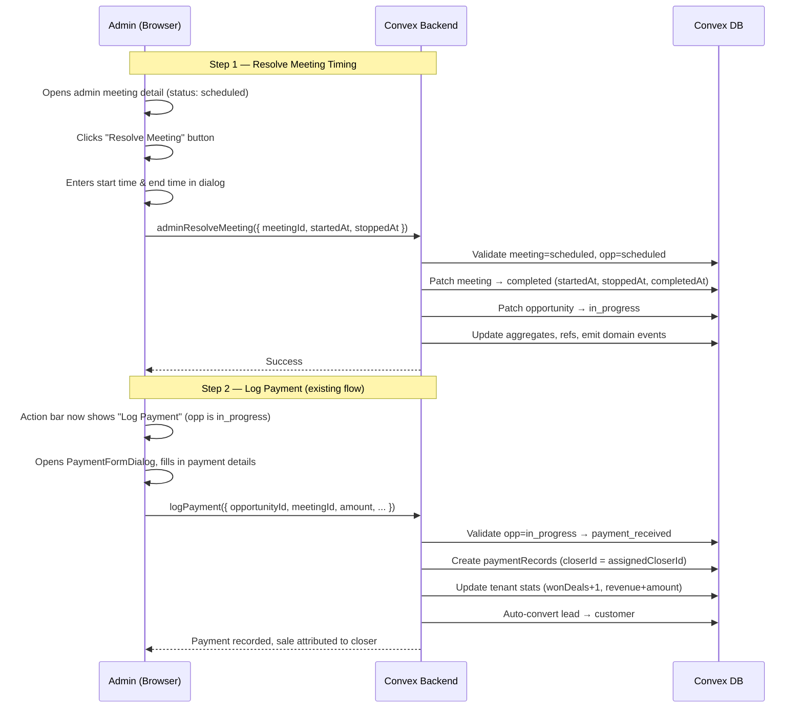

# Admin Meeting Override (Quick Patch) — Design Specification

**Version:** 0.1 (Quick Patch)
**Status:** Draft
**Scope:** `scheduled` meeting that already happened today (closer didn't start it) → admin retroactively sets meeting start/end times → logs payment → sale attributed to the assigned closer. Bridges the gap until the full Late Start Review System (Phase 6) ships.
**Prerequisite:** Current production schema (v0.6). No schema changes required — all needed fields already exist on `meetings`.

---

## Table of Contents

1. [Goals & Non-Goals](#1-goals--non-goals)
2. [Actors & Roles](#2-actors--roles)
3. [End-to-End Flow Overview](#3-end-to-end-flow-overview)
4. [Phase 1: Backend — Admin Resolve Meeting Mutation](#4-phase-1-backend--admin-resolve-meeting-mutation)
5. [Phase 2: Backend — Fix Payment Closer Attribution](#5-phase-2-backend--fix-payment-closer-attribution)
6. [Phase 3: Frontend — Admin Resolve Meeting Dialog](#6-phase-3-frontend--admin-resolve-meeting-dialog)
7. [Data Model](#7-data-model)
8. [Convex Function Architecture](#8-convex-function-architecture)
9. [Security Considerations](#9-security-considerations)
10. [Error Handling & Edge Cases](#10-error-handling--edge-cases)
11. [Open Questions](#11-open-questions)
12. [Dependencies](#12-dependencies)
13. [Applicable Skills](#13-applicable-skills)

---

## 1. Goals & Non-Goals

### Goals

- **Admins can retroactively resolve a `scheduled` meeting** by providing the actual start time and end time, transitioning the meeting to `completed` and the opportunity to `in_progress` — unlocking outcome actions (Log Payment, Mark Lost, Follow-up).
- **After resolving, the admin logs a payment** using the existing `PaymentFormDialog` — no new payment UI needed.
- **The sale is attributed to the assigned closer**, not the admin who logged it. The `closerId` on `paymentRecords` reflects the closer who was in the meeting.
- **Full audit trail**: domain events with `source: "admin"` capture who resolved the meeting and when, separate from the retroactive timestamps.
- **No schema changes**: all fields used (`startedAt`, `stoppedAt`, `completedAt`, `overranDurationMs`) already exist on the `meetings` table.

### Non-Goals (deferred)

- **Full Late Start Review pipeline** — that's the `late-start-review-design.md` system with `pending_review` status, `meetingReviews` table, and closer evidence uploads. This patch is a manual admin-side bridge.
- **Closer self-service for missed starts** — the closer cannot retroactively start their own meeting. Only admins.
- **Bulk resolution** — one meeting at a time.
- **Meeting timing validation against Calendly** — admin is trusted to enter correct times.

---

## 2. Actors & Roles

| Actor | Identity | Auth Method | Key Permissions |
|---|---|---|---|
| **Tenant Master** | Business owner | WorkOS AuthKit, member of tenant org | Resolve meetings, log payments on behalf of closer |
| **Tenant Admin** | Manager / team lead | WorkOS AuthKit, member of tenant org | Same as Tenant Master |

> No closer involvement — the closer's meeting just stays `scheduled` from their perspective until the admin resolves it. After resolution, they'd see it as `completed` / `payment_received` as normal.

---

## 3. End-to-End Flow Overview



---

## 4. Phase 1: Backend — Admin Resolve Meeting Mutation

### 4.1 What & Why

The closer's `startMeeting` mutation only allows closers on their own meetings. We need a new admin-only mutation that retroactively resolves a `scheduled` meeting by setting the actual meeting timestamps and transitioning both the meeting and opportunity statuses.

> **Why not modify `startMeeting` to accept admins?** The closer's `startMeeting` is tightly coupled to the late-start detection flow (window calculations, `lateStartCategory` prompts, `effectiveStartedAt`). The admin override is conceptually different — the admin is retrospectively recording what happened, not "starting" a meeting. A separate mutation keeps concerns clean and matches the existing pattern in `convex/admin/meetingActions.ts`.

> **Why transition to `completed` and not `in_progress`?** The meeting already happened. Going directly to `completed` (with `startedAt` + `stoppedAt`) accurately reflects reality. The opportunity goes to `in_progress` because that's the only valid source status for `payment_received`, `lost`, or `follow_up_scheduled` — all the outcome transitions the admin might need.

### 4.2 Mutation Implementation

```typescript
// Path: convex/admin/meetingActions.ts

import { updateOpportunityMeetingRefs } from "../lib/opportunityMeetingRefs";
import {
  replaceMeetingAggregate,
  replaceOpportunityAggregate,
} from "../reporting/writeHooks";

// ---------------------------------------------------------------------------
// adminResolveMeeting — Retroactively resolve a scheduled meeting's timing
// ---------------------------------------------------------------------------

export const adminResolveMeeting = mutation({
  args: {
    meetingId: v.id("meetings"),
    startedAt: v.number(),   // Unix ms — when the closer actually joined
    stoppedAt: v.number(),   // Unix ms — when the meeting actually ended
  },
  handler: async (ctx, args) => {
    const { tenantId, userId } = await requireTenantUser(ctx, [
      "tenant_master",
      "tenant_admin",
    ]);

    // Load and validate meeting
    const meeting = await ctx.db.get(args.meetingId);
    if (!meeting || meeting.tenantId !== tenantId) {
      throw new Error("Meeting not found");
    }
    if (meeting.status !== "scheduled") {
      throw new Error(
        `Cannot resolve a meeting with status "${meeting.status}". Only scheduled meetings can be resolved.`
      );
    }

    // Load and validate opportunity
    const opportunity = await ctx.db.get(meeting.opportunityId);
    if (!opportunity || opportunity.tenantId !== tenantId) {
      throw new Error("Opportunity not found");
    }
    if (!validateTransition(opportunity.status, "in_progress")) {
      throw new Error(
        `Cannot resolve meeting: opportunity status "${opportunity.status}" cannot transition to in_progress.`
      );
    }

    // Validate timestamps
    if (args.startedAt >= args.stoppedAt) {
      throw new Error("Start time must be before end time");
    }
    if (args.stoppedAt > Date.now() + 60_000) {
      throw new Error("End time cannot be in the future");
    }

    const now = Date.now();
    const scheduledEndMs =
      meeting.scheduledAt + meeting.durationMinutes * 60_000;
    const overranDurationMs = Math.max(0, args.stoppedAt - scheduledEndMs);

    // Transition opportunity: scheduled → in_progress
    const oldOpportunity = opportunity;
    await ctx.db.patch(opportunity._id, {
      status: "in_progress",
      updatedAt: now,
    });
    await replaceOpportunityAggregate(ctx, oldOpportunity, opportunity._id);

    // Transition meeting: scheduled → completed (skip in_progress — it's retroactive)
    const oldMeeting = meeting;
    await ctx.db.patch(args.meetingId, {
      status: "completed",
      startedAt: args.startedAt,
      stoppedAt: args.stoppedAt,
      completedAt: args.stoppedAt,
      overranDurationMs,
    });
    await replaceMeetingAggregate(ctx, oldMeeting, args.meetingId);
    await updateOpportunityMeetingRefs(ctx, opportunity._id);

    // Domain events — full audit trail
    await emitDomainEvent(ctx, {
      tenantId,
      entityType: "meeting",
      entityId: args.meetingId,
      eventType: "meeting.admin_resolved",
      source: "admin",
      actorUserId: userId,
      fromStatus: "scheduled",
      toStatus: "completed",
      occurredAt: now,
      metadata: {
        retroactiveStartedAt: args.startedAt,
        retroactiveStoppedAt: args.stoppedAt,
        overranDurationMs,
        resolvedAt: now,
      },
    });
    await emitDomainEvent(ctx, {
      tenantId,
      entityType: "opportunity",
      entityId: opportunity._id,
      eventType: "opportunity.status_changed",
      source: "admin",
      actorUserId: userId,
      fromStatus: opportunity.status,
      toStatus: "in_progress",
      occurredAt: now,
    });

    console.log("[Admin] adminResolveMeeting completed", {
      meetingId: args.meetingId,
      opportunityId: opportunity._id,
      startedAt: args.startedAt,
      stoppedAt: args.stoppedAt,
    });
  },
});
```

### 4.3 Status Transitions

```
Meeting:      scheduled → completed  (retroactive — startedAt/stoppedAt set by admin)
Opportunity:  scheduled → in_progress  (unlocks Log Payment, Mark Lost, Follow-up)
```

> **Why skip `in_progress` for the meeting?** The meeting is already over. Setting it to `in_progress` then immediately to `completed` in the same mutation would create misleading domain events. Going directly to `completed` with accurate timestamps is the honest representation.

---

## 5. Phase 2: Backend — Fix Payment Closer Attribution

### 5.1 What & Why

The existing `logPayment` mutation in `convex/closer/payments.ts` already allows admins (`tenant_master`, `tenant_admin`). However, it sets `closerId: userId` — meaning when an admin logs a payment, the payment is attributed to the admin, not the closer who actually handled the meeting.

For this patch, when an admin logs a payment, `closerId` must be the **assigned closer** on the opportunity so the sale appears in the closer's stats and dashboard.

### 5.2 Implementation Change

```typescript
// Path: convex/closer/payments.ts
// Inside logPayment mutation handler, change the closerId assignment:

    // Determine attribution: admin logs are attributed to the assigned closer
    const attributedCloserId =
      role === "closer" ? userId : opportunity.assignedCloserId ?? userId;

    // Create payment record
    const paymentId = await ctx.db.insert("paymentRecords", {
      tenantId,
      opportunityId: args.opportunityId,
      meetingId: args.meetingId,
      closerId: attributedCloserId,  // ← was: userId
      amountMinor,
      currency,
      provider,
      referenceCode: referenceCode || undefined,
      proofFileId: args.proofFileId ?? undefined,
      status: "recorded",
      statusChangedAt: now,
      recordedAt: now,
      contextType: "opportunity",
    });
```

> **Why not a separate admin mutation?** `logPayment` already has admin auth, tenant scoping, full side effects (customer conversion, stats, domain events). Duplicating all of that into `convex/admin/` would create maintenance burden. The one-line `closerId` fix is surgical and correct — the admin is recording the payment but the closer earned it.

> **Edge case: no assigned closer.** If `opportunity.assignedCloserId` is `null` (shouldn't happen for meetings that went through the pipeline, but defensively), we fall back to `userId` (the admin).

### 5.3 Domain Event Metadata Addition

To preserve full auditability, add the admin's identity to the payment domain event metadata when the caller is an admin:

```typescript
// Path: convex/closer/payments.ts
// In the payment.recorded domain event, add loggedByUserId when admin:

    await emitDomainEvent(ctx, {
      tenantId,
      entityType: "payment",
      entityId: paymentId,
      eventType: "payment.recorded",
      source: role === "closer" ? "closer" : "admin",
      actorUserId: userId,
      toStatus: "recorded",
      metadata: {
        opportunityId: args.opportunityId,
        meetingId: args.meetingId,
        amountMinor,
        currency,
        ...(role !== "closer" && { loggedByAdminUserId: userId }),
        attributedCloserId,
      },
      occurredAt: now,
    });
```

---

## 6. Phase 3: Frontend — Admin Resolve Meeting Dialog

### 6.1 What & Why

A new dialog accessible from the `AdminActionBar` when `opportunity.status === "scheduled"`. The admin enters the actual start and end times, submits, and the meeting is resolved — unlocking outcome actions.

### 6.2 Dialog Component

```typescript
// Path: app/workspace/pipeline/meetings/_components/admin-resolve-meeting-dialog.tsx
"use client";

import { useState } from "react";
import { useForm } from "react-hook-form";
import { standardSchemaResolver } from "@hookform/resolvers/standard-schema";
import { z } from "zod";
import { useMutation } from "convex/react";
import { api } from "@/convex/_generated/api";
import type { Id } from "@/convex/_generated/dataModel";
import {
  Dialog,
  DialogContent,
  DialogDescription,
  DialogFooter,
  DialogHeader,
  DialogTitle,
  DialogTrigger,
} from "@/components/ui/dialog";
import {
  Form,
  FormField,
  FormItem,
  FormLabel,
  FormControl,
  FormMessage,
  FormDescription,
} from "@/components/ui/form";
import { Input } from "@/components/ui/input";
import { Button } from "@/components/ui/button";
import { Alert, AlertDescription } from "@/components/ui/alert";
import { Spinner } from "@/components/ui/spinner";
import { ClockIcon } from "lucide-react";
import { toast } from "sonner";
import posthog from "posthog-js";

const resolveMeetingSchema = z
  .object({
    startTime: z.string().min(1, "Start time is required"),
    endTime: z.string().min(1, "End time is required"),
  })
  .refine(
    (data) => {
      if (!data.startTime || !data.endTime) return true;
      return new Date(data.startTime) < new Date(data.endTime);
    },
    { message: "Start time must be before end time", path: ["endTime"] },
  )
  .refine(
    (data) => {
      if (!data.endTime) return true;
      return new Date(data.endTime) <= new Date();
    },
    { message: "End time cannot be in the future", path: ["endTime"] },
  );

type ResolveMeetingFormValues = z.infer<typeof resolveMeetingSchema>;

export function AdminResolveMeetingDialog({
  meetingId,
  scheduledAt,
  durationMinutes,
}: {
  meetingId: Id<"meetings">;
  scheduledAt: number;
  durationMinutes: number;
}) {
  const [open, setOpen] = useState(false);
  const [isSubmitting, setIsSubmitting] = useState(false);
  const [submitError, setSubmitError] = useState<string | null>(null);

  const resolveMeeting = useMutation(
    api.admin.meetingActions.adminResolveMeeting,
  );

  // Pre-fill with scheduled times as sensible defaults
  const scheduledDate = new Date(scheduledAt);
  const scheduledEndDate = new Date(
    scheduledAt + durationMinutes * 60_000,
  );

  const toLocalDatetimeString = (d: Date) => {
    const pad = (n: number) => n.toString().padStart(2, "0");
    return `${d.getFullYear()}-${pad(d.getMonth() + 1)}-${pad(d.getDate())}T${pad(d.getHours())}:${pad(d.getMinutes())}`;
  };

  const form = useForm({
    resolver: standardSchemaResolver(resolveMeetingSchema),
    defaultValues: {
      startTime: toLocalDatetimeString(scheduledDate),
      endTime: toLocalDatetimeString(scheduledEndDate),
    },
  });

  const onSubmit = async (values: ResolveMeetingFormValues) => {
    setIsSubmitting(true);
    setSubmitError(null);
    try {
      await resolveMeeting({
        meetingId,
        startedAt: new Date(values.startTime).getTime(),
        stoppedAt: new Date(values.endTime).getTime(),
      });
      posthog.capture("admin_meeting_resolved", {
        meeting_id: meetingId,
      });
      toast.success("Meeting resolved — you can now log the outcome.");
      setOpen(false);
    } catch (error) {
      const message =
        error instanceof Error ? error.message : "Failed to resolve meeting";
      setSubmitError(message);
      posthog.captureException(error);
    } finally {
      setIsSubmitting(false);
    }
  };

  return (
    <Dialog open={open} onOpenChange={setOpen}>
      <DialogTrigger asChild>
        <Button variant="default" size="sm">
          <ClockIcon data-icon="inline-start" />
          Resolve Meeting
        </Button>
      </DialogTrigger>
      <DialogContent>
        <DialogHeader>
          <DialogTitle>Resolve Meeting Timing</DialogTitle>
          <DialogDescription>
            Set the actual start and end times for this meeting. This will
            unlock outcome actions (Log Payment, Mark Lost, etc.)
          </DialogDescription>
        </DialogHeader>

        {submitError && (
          <Alert variant="destructive">
            <AlertDescription>{submitError}</AlertDescription>
          </Alert>
        )}

        <Form {...form}>
          <form
            onSubmit={form.handleSubmit(onSubmit)}
            className="flex flex-col gap-4"
          >
            <FormField
              control={form.control}
              name="startTime"
              render={({ field }) => (
                <FormItem>
                  <FormLabel>
                    Start Time <span className="text-destructive">*</span>
                  </FormLabel>
                  <FormControl>
                    <Input
                      type="datetime-local"
                      {...field}
                      disabled={isSubmitting}
                    />
                  </FormControl>
                  <FormDescription>
                    When the closer actually joined the meeting
                  </FormDescription>
                  <FormMessage />
                </FormItem>
              )}
            />

            <FormField
              control={form.control}
              name="endTime"
              render={({ field }) => (
                <FormItem>
                  <FormLabel>
                    End Time <span className="text-destructive">*</span>
                  </FormLabel>
                  <FormControl>
                    <Input
                      type="datetime-local"
                      {...field}
                      disabled={isSubmitting}
                    />
                  </FormControl>
                  <FormDescription>
                    When the meeting actually ended
                  </FormDescription>
                  <FormMessage />
                </FormItem>
              )}
            />

            <DialogFooter>
              <Button
                type="button"
                variant="outline"
                onClick={() => setOpen(false)}
                disabled={isSubmitting}
              >
                Cancel
              </Button>
              <Button type="submit" disabled={isSubmitting}>
                {isSubmitting ? (
                  <>
                    <Spinner data-icon="inline-start" />
                    Resolving...
                  </>
                ) : (
                  "Resolve Meeting"
                )}
              </Button>
            </DialogFooter>
          </form>
        </Form>
      </DialogContent>
    </Dialog>
  );
}
```

### 6.3 Admin Action Bar Update

```typescript
// Path: app/workspace/pipeline/meetings/_components/admin-action-bar.tsx
// Add "Resolve Meeting" for scheduled status:

import { AdminResolveMeetingDialog } from "./admin-resolve-meeting-dialog";

// Inside the AdminActionBar component, add before the terminal check:

      {/* Resolve Meeting — scheduled only (meeting already happened but closer didn't start it) */}
      {status === "scheduled" && (
        <AdminResolveMeetingDialog
          meetingId={meeting._id}
          scheduledAt={meeting.scheduledAt}
          durationMinutes={meeting.durationMinutes}
        />
      )}
```

Updated action bar table:

| Status                 | Actions                                                |
|------------------------|--------------------------------------------------------|
| **scheduled**          | **Resolve Meeting** *(new)*                            |
| in_progress            | Log Payment, Follow-up, Mark Lost                      |
| no_show                | Reschedule Link, Follow-up                             |
| canceled               | Follow-up                                              |
| follow_up_scheduled    | *(view only)*                                          |
| reschedule_link_sent   | *(view only)*                                          |
| payment_received       | *(terminal — view only)*                               |
| lost                   | *(terminal — view only)*                               |

---

## 7. Data Model

### No Schema Changes Required

All fields used by this patch already exist on the `meetings` table:

| Field | Validator | Set By This Patch |
|---|---|---|
| `startedAt` | `v.optional(v.number())` | `adminResolveMeeting` — admin-entered start time |
| `stoppedAt` | `v.optional(v.number())` | `adminResolveMeeting` — admin-entered end time |
| `completedAt` | `v.optional(v.number())` | `adminResolveMeeting` — same as `stoppedAt` |
| `overranDurationMs` | `v.optional(v.number())` | `adminResolveMeeting` — computed from stoppedAt vs scheduledEnd |
| `status` | `v.union(...)` | `adminResolveMeeting` — "scheduled" → "completed" |

The `opportunities` table status field already supports the `scheduled → in_progress` transition.

The `paymentRecords.closerId` field already exists — the change is behavioral (admin-logged payments now use `assignedCloserId`).

---

## 8. Convex Function Architecture

```
convex/
├── admin/
│   └── meetingActions.ts              # MODIFIED: +adminResolveMeeting — Phase 1
├── closer/
│   └── payments.ts                    # MODIFIED: closerId attribution fix — Phase 2
└── lib/
    └── (no changes)

app/workspace/pipeline/meetings/
├── _components/
│   ├── admin-action-bar.tsx           # MODIFIED: +scheduled status handler — Phase 3
│   └── admin-resolve-meeting-dialog.tsx  # NEW: resolve timing dialog — Phase 3
```

---

## 9. Security Considerations

### 9.1 Authorization

- `adminResolveMeeting` uses `requireTenantUser(ctx, ["tenant_master", "tenant_admin"])` — closers cannot resolve meetings.
- Tenant isolation: meeting and opportunity are validated against the admin's `tenantId`.
- The existing `logPayment` already validates admin access — no change needed there.

### 9.2 Closer Attribution Safety

- `closerId` on `paymentRecords` is set to `opportunity.assignedCloserId` (not a client-supplied argument). The admin cannot attribute a sale to an arbitrary user.
- Falls back to `userId` (admin) only if `assignedCloserId` is `null` — which shouldn't happen for pipeline meetings but handles edge cases.

### 9.3 Timestamp Trust

- Admin-entered timestamps are trusted — admins are authorized personnel making corrections.
- Basic server-side validation: start < end, end not in future (1-minute tolerance for clock skew).
- Full audit trail via domain events: the actual `resolvedAt` timestamp (when the admin clicked submit) is captured alongside the retroactive `startedAt`/`stoppedAt`.

---

## 10. Error Handling & Edge Cases

### 10.1 Meeting Already Started

| Error | Cause | Action |
|---|---|---|
| `Cannot resolve a meeting with status "in_progress"` | Closer started it (or already resolved) | Show error toast. No action needed. |

### 10.2 Opportunity Already Transitioned

| Error | Cause | Action |
|---|---|---|
| `Cannot resolve meeting: opportunity status "in_progress" cannot transition...` | Race condition — closer started, or another admin resolved | Show error toast. Reload to see current state. |

### 10.3 No Assigned Closer on Opportunity

| Error | Cause | Action |
|---|---|---|
| `logPayment` sets `closerId: userId` (admin) | `assignedCloserId` is null | Payment still works but attributed to admin. Rare edge case for orphaned meetings. |

### 10.4 End Time in Future

| Error | Cause | Action |
|---|---|---|
| `End time cannot be in the future` | Admin fat-fingered the date | Client-side validation catches it. Server rejects with clear message. |

---

## 11. Open Questions

| # | Question | Current Thinking |
|---|---|---|
| 1 | Should we add a "resolved by admin" visual indicator on the meeting detail? | **Yes, Phase 2.** Could show a small badge or banner. For now the domain event provides the audit trail. Deferred to avoid scope creep. |
| 2 | Should the closer see that their meeting was admin-resolved? | **Deferred.** The meeting shows as `completed` / `payment_received` which is accurate. No special UI for the closer in this patch. |
| 3 | Should we backfill `closerId` on existing admin-logged payments? | **Not needed now.** Only one instance (today's). If it recurs, write a one-off mutation. |

---

## 12. Dependencies

### New Packages

None — all packages already installed.

### Already Installed (no action needed)

| Package | Used for |
|---|---|
| `react-hook-form` | Resolve Meeting dialog form state |
| `@hookform/resolvers` | `standardSchemaResolver` for Zod v4 |
| `zod` | Form validation schema |
| `sonner` | Toast notifications |
| `posthog-js` | Analytics event capture |
| `date-fns` | Time formatting (existing usage) |
| `lucide-react` | `ClockIcon` for resolve button |

### Environment Variables

None — no new env vars required.

---

## 13. Applicable Skills

| Skill | When to Invoke | Phase |
|---|---|---|
| `shadcn` | If `datetime-local` input needs a custom component or the dialog needs new shadcn primitives | Phase 3 |
| `expect` | Browser verification after implementing the dialog | Phase 3 |

---

## Implementation Checklist

- [ ] Add `adminResolveMeeting` mutation to `convex/admin/meetingActions.ts`
- [ ] Fix `closerId` attribution in `convex/closer/payments.ts` — use `assignedCloserId` for admin callers
- [ ] Add `loggedByAdminUserId` to payment domain event metadata when admin
- [ ] Create `admin-resolve-meeting-dialog.tsx`
- [ ] Update `admin-action-bar.tsx` to show Resolve Meeting button for `scheduled` status
- [ ] Manual test: resolve today's meeting, log payment, verify closer attribution

---

*This is a targeted quick patch. The full Late Start Review System in `late-start-review-design.md` will supersede this with structured review workflows, closer evidence uploads, and an admin review pipeline.*
