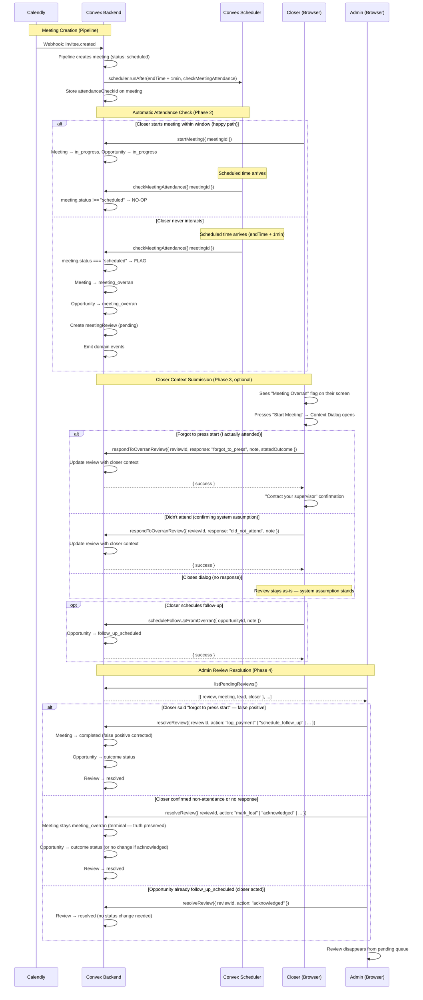
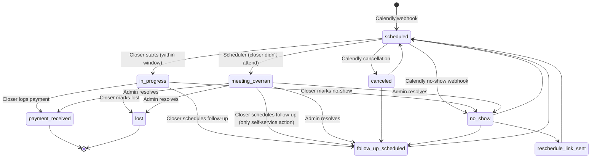
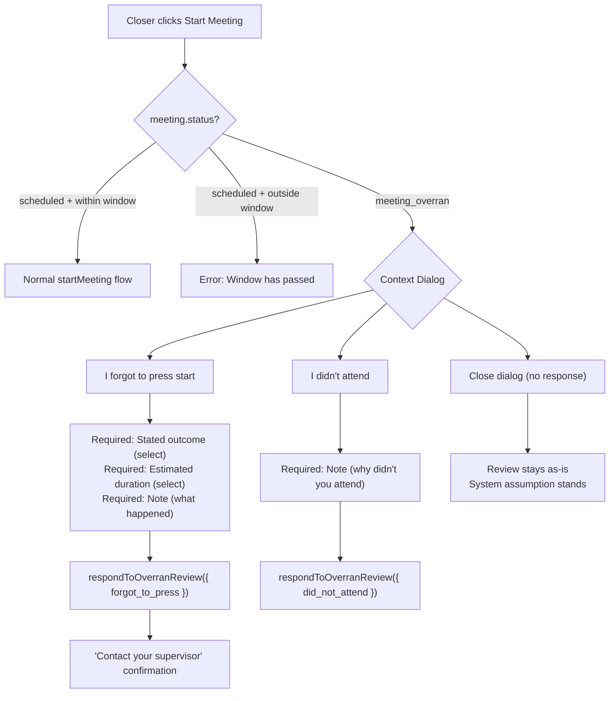
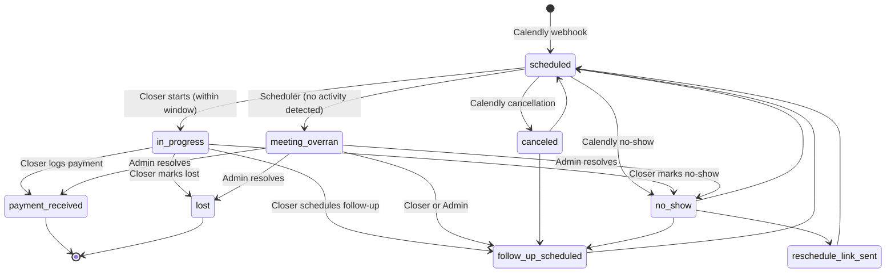
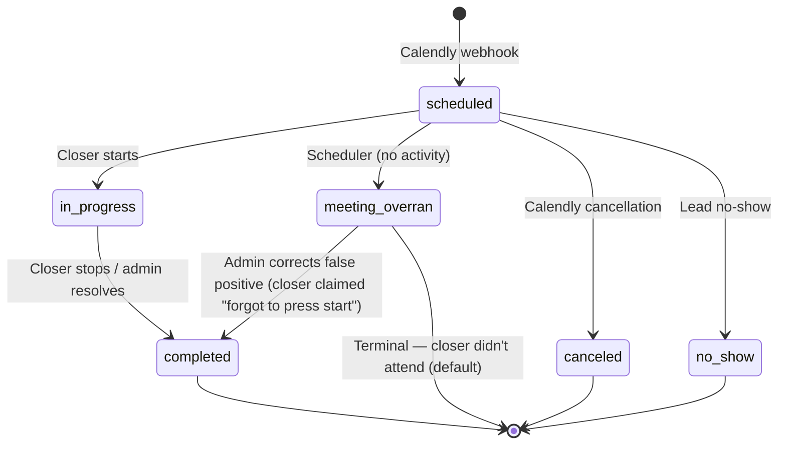

# Meeting Overran & Review System — Design Specification

**Version:** 3.0
**Status:** Draft
**Scope:** Automatic detection of unattended meetings via scheduled functions, closer context submission, and admin review pipeline. When a meeting's scheduled end time passes with no closer activity, the system flags it as "meeting overran" (meaning: the closer did not attend). The closer can optionally provide context ("forgot to press start" or confirm non-attendance). An admin reviews and resolves the outcome.
**Prerequisite:** v0.6 schema deployed (meeting time tracking, domain events). WIP late-start dialog + schema additions from the current branch must be **refactored** (not reverted — some fields are reused).

---

## Table of Contents

1. [Goals & Non-Goals](#1-goals--non-goals)
2. [Actors & Roles](#2-actors--roles)
3. [End-to-End Flow Overview](#3-end-to-end-flow-overview)
4. [Phase 0: WIP System Refactoring](#4-phase-0-wip-system-refactoring)
5. [Phase 1: Schema & Data Model](#5-phase-1-schema--data-model)
6. [Phase 2: Backend — Automatic Attendance Detection](#6-phase-2-backend--automatic-attendance-detection)
7. [Phase 3: Backend — Closer Context Submission](#7-phase-3-backend--closer-context-submission)
8. [Phase 4: Backend — Admin Review Resolution](#8-phase-4-backend--admin-review-resolution)
9. [Phase 5: Frontend — Closer Context Dialog](#9-phase-5-frontend--closer-context-dialog)
10. [Phase 6: Frontend — Meeting Detail Updates](#10-phase-6-frontend--meeting-detail-updates)
11. [Phase 7: Frontend — Admin Review Pipeline](#11-phase-7-frontend--admin-review-pipeline)
12. [Data Model](#12-data-model)
13. [Convex Function Architecture](#13-convex-function-architecture)
14. [Routing & Authorization](#14-routing--authorization)
15. [Security Considerations](#15-security-considerations)
16. [Error Handling & Edge Cases](#16-error-handling--edge-cases)
17. [Open Questions](#17-open-questions)
18. [Dependencies](#18-dependencies)
19. [Applicable Skills](#19-applicable-skills)

---

## 1. Goals & Non-Goals

### Goals

- **Every meeting created via Calendly webhook gets an automatic attendance check** — when the meeting is saved in the pipeline, a scheduled function is registered for 1 minute after the meeting's scheduled end time.
- **If the closer never interacted with a meeting, the system flags it automatically** — the scheduled check verifies that the meeting status is still `scheduled` (no start, no outcome, no events). If so, the meeting and opportunity transition to `meeting_overran`, and a review record is created.
- **"Meeting Overran" means "the closer did not attend"** — this is not about meeting duration. The term specifically means: the meeting's scheduled end time passed with no system activity from the closer. All references to "overran" in the review context carry this meaning.
- **The existing `overranDurationMs` field (time tracking) is renamed to `exceededScheduledDurationMs`** — this field measures how long a normally-attended meeting ran past its scheduled end and is unrelated to the review system. Renaming eliminates confusion between time tracking and the review concept.
- **After flagging, the closer can provide context** — pressing "Start Meeting" on a flagged meeting opens a dialog with one primary option: "Forgot to press start" (I actually attended). The closer can also confirm "I didn't attend" with a note, or simply close the dialog. The review already exists regardless of the closer's response.
- **Closers can schedule a follow-up on flagged meetings** — the most likely next step after a missed meeting is to reach out to the lead and reschedule. This is the only outcome action available to the closer. All other outcomes (payment, no-show, lost) require admin resolution.
- **`meeting_overran` is a permanent record at the meeting level** — once the system flags a meeting, the meeting status stays `meeting_overran` unless the admin validates a "forgot to press start" claim (correcting a false positive to `completed`). For confirmed non-attendance, the meeting status is the truth and never changes. The *opportunity* transitions based on admin resolution; the *meeting* preserves the system observation.
- **Admins review and resolve** — the admin sees the system flag, the closer's context (if provided), and the meeting details. They resolve with an outcome (payment, follow-up, no-show, lost) or acknowledge. For confirmed non-attendance, the admin can simply acknowledge the outcome — the meeting stays `meeting_overran` and the opportunity may stay there or transition via a separate action.
- **Calendly webhooks are ignored for flagged meetings** — once a meeting enters `meeting_overran`, external webhook events (cancellations, no-shows) are silently dropped. The review system owns the resolution.
- **Everything is tracked for compliance** — scheduled function audit trail, closer response timestamps, domain events with metadata, and the `meetingReviews` table provide full auditability.

### Non-Goals (deferred)

- **Compliance reporting dashboards** — graphs, trends, and aggregated metrics on unattended meetings (separate design doc, post-MVP).
- **Automatic escalation or notifications** — email/push to admins when a review is created (Phase 2+).
- **Bulk review resolution** — admin processes reviews one at a time in MVP.
- **Closer-side review status tracking** — the closer sees "Meeting Overran" status but cannot see the admin's resolution notes (Phase 2).
- **Configurable grace period** — MVP fires 1 minute after scheduled end. A per-tenant configurable grace period (e.g., 5–10 minutes) may be added based on feedback.
- **Duration-based overrun detection** — detecting meetings that were attended but ran past their scheduled end is a separate concern from attendance detection and is not in scope.

---

## 2. Actors & Roles

| Actor | Identity | Auth Method | Key Permissions |
|---|---|---|---|
| **Closer** | Sales rep assigned to meetings | WorkOS AuthKit, member of tenant org | Start meetings (within window), provide context on flagged meetings, schedule follow-up on flagged meetings |
| **Tenant Admin** | Manager / team lead | WorkOS AuthKit, member of tenant org | View all pending reviews, resolve reviews (log outcomes), acknowledge reviews |
| **Tenant Master** | Business owner | WorkOS AuthKit, member of tenant org | Same as Tenant Admin + full control |
| **System (Scheduler)** | Convex scheduled function | Internal — no user identity | Automatically flag unattended meetings after scheduled end time |

### CRM Role ↔ Review Permissions

| CRM `users.role` | Can Provide Context | Can Schedule Follow-Up | Can View Review Pipeline | Can Resolve/Acknowledge Reviews |
|---|---|---|---|---|
| `closer` | ✅ Own meetings only | ✅ Own meetings only | ❌ | ❌ |
| `tenant_admin` | ❌ | ❌ | ✅ All tenant reviews | ✅ |
| `tenant_master` | ❌ | ❌ | ✅ All tenant reviews | ✅ |

---

## 3. End-to-End Flow Overview



---

## 4. Phase 0: WIP System Refactoring

> **This design replaces the existing WIP late-start review system, not a blank slate.** The current codebase has a partially-implemented review workflow triggered when a closer starts a meeting outside the allowed window. This v3.0 design fundamentally changes the concept: instead of the *closer* triggering a review by starting late, the *system* (scheduler) detects that the closer never attended at all. Every existing file in the WIP system must be refactored.

### 4.1 Existing WIP System Being Replaced

The following infrastructure already exists and must be **refactored** (not created from scratch):

| Existing File / Artifact | Current Purpose | v3.0 Action |
|---|---|---|
| `convex/schema.ts` — `meetingReviews` table | WIP schema: `lateStartCategory` (required), `closerNote` (required), `minutesPastWindow` (required), `evidenceFileId`, `paymentEvidenceFileId`, status `pending \| evidence_uploaded \| resolved`, resolution `log_payment \| schedule_follow_up \| mark_no_show \| mark_lost \| evidence_not_uploaded` | **Refactor**: Replace `lateStartCategory` → `category` (literal). Make `closerNote` optional. Remove `minutesPastWindow`, `evidenceFileId`, `paymentEvidenceFileId`. Remove `evidence_uploaded` from status union. Add `closerResponse`, `closerStatedOutcome`, `estimatedMeetingDurationMinutes`, `closerRespondedAt`. Replace `evidence_not_uploaded` → `acknowledged` in resolution actions. |
| `convex/reviews/queries.ts` | `listPendingReviews` (with `evidence_uploaded` handling, Map-based batch enrichment), `getReviewDetail` (with evidence URLs) | **Refactor**: Remove `evidence_uploaded` status handling. Remove evidence URL fetching. Simplify default filter to pending-only. Add `getPendingReviewCount`. |
| `convex/reviews/mutations.ts` | `resolveReview` (with evidence validation guards, `evidence_not_uploaded` action, tenant stats updates) | **Refactor**: Remove evidence validation. Replace `evidence_not_uploaded` → `acknowledged`. Add opportunity status drift handling (`acknowledged` when opportunity has moved on). Keep tenant stats updates. |
| `convex/closer/lateStartReview.ts` | Closer context submission mutation (late start categories, evidence file upload/validation) | **Remove entirely**. Closer context submission moves to `convex/closer/meetingOverrun.ts` → `respondToOverranReview`. Evidence upload is dropped. |
| `convex/lib/outcomeHelpers.ts` | `createPaymentRecord`, `createManualReminder` — plain async functions accepting `MutationCtx` | **Keep as-is**. These are already correctly extracted as same-transaction helpers. Do NOT convert to `internalMutation`. |
| `app/workspace/closer/meetings/_components/late-start-reason-dialog.tsx` | Late start reason dialog (category select, evidence upload, note input) | **Remove entirely**. Replaced by the new "Context Dialog" in Phase 5. |

### 4.2 Status Renames (Codebase-Wide)

**Opportunity status: `pending_review` → `meeting_overran`**

The WIP system uses `pending_review` for opportunities in the review pipeline. This rename affects **26 files**:

| File | Context | Action |
|---|---|---|
| `convex/schema.ts` | Opportunity status union | Rename literal |
| `convex/lib/statusTransitions.ts` | `OPPORTUNITY_STATUSES` array, `VALID_TRANSITIONS` map | Rename key and update transitions |
| `convex/lib/tenantStatsHelper.ts` | `ACTIVE_OPPORTUNITY_STATUSES` set | Rename entry |
| `lib/status-config.ts` | `opportunityStatusConfig`, `PIPELINE_DISPLAY_ORDER` | Rename key, update label/styling |
| `convex/pipeline/inviteeCanceled.ts` | Guard: `opportunity.status === "pending_review"` | Rename to `"meeting_overran"` |
| `convex/pipeline/inviteeNoShow.ts` | Guard: `opportunity.status === "pending_review"` | Rename to `"meeting_overran"` |
| `convex/reviews/mutations.ts` | Guard: `opportunity.status !== "pending_review"` | Rename to `"meeting_overran"` |
| `convex/closer/dashboard.ts` | Status filter/grouping | Rename reference |
| `convex/closer/meetingActions.ts` | Status references | Rename reference |
| `convex/closer/followUpMutations.ts` | Status check | Rename reference |
| `convex/closer/followUp.ts` | Status check | Rename reference |
| `convex/closer/noShowActions.ts` | Status check | Rename reference |
| `convex/closer/payments.ts` | Status check | Rename reference |
| `convex/closer/pipeline.ts` | Status filter | Rename reference |
| `convex/opportunities/queries.ts` | Status filter | Rename reference |
| `convex/workos/userMutations.ts` | Status reference | Rename reference |
| `convex/users/queries.ts` | Status reference | Rename reference |
| `convex/reporting/pipelineHealth.ts` | Report aggregation | Rename reference |
| `convex/reporting/lib/outcomeDerivation.ts` | Outcome derivation | Rename reference |
| `app/workspace/pipeline/_components/pipeline-filters.tsx` | Filter option | Rename label |
| `app/workspace/reports/pipeline/_components/status-distribution-chart.tsx` | Chart category | Rename label |
| `app/workspace/reports/pipeline/_components/pipeline-aging-table.tsx` | Table category | Rename label |
| `app/workspace/closer/meetings/_components/outcome-action-bar.tsx` | Status check | Rename reference |

**Meeting status: `closer_no_show` → removed (replaced by `meeting_overran`)**

The WIP system uses `closer_no_show` as a meeting status. This removal affects **8 files**:

| File | Context | Action |
|---|---|---|
| `convex/schema.ts` | Meeting status union | Remove `closer_no_show`, add `meeting_overran` |
| `convex/lib/statusTransitions.ts` | `MEETING_STATUSES` array | Remove `closer_no_show`, add `meeting_overran` |
| `lib/status-config.ts` | `meetingStatusConfig` | Remove `closer_no_show` entry, add `meeting_overran` entry |
| `convex/closer/lateStartReview.ts` | Category validator literal | File being removed entirely |
| `convex/reporting/lib/outcomeDerivation.ts` | Outcome derivation logic | Remove `closer_no_show` case, add `meeting_overran` case |
| `convex/reporting/teamPerformance.ts` | Performance metrics | Remove `closer_no_show` case, add `meeting_overran` case |
| `app/workspace/closer/meetings/_components/late-start-reason-dialog.tsx` | Dialog option | File being removed entirely |

> **Migration note:** Not needed for data. Only 1 test tenant on production; the late-start review feature has never been used in production (no `meetingReviews` documents exist, no meetings have `closer_no_show` status, no opportunities have `pending_review` status). Schema changes can be applied directly. The `overranDurationMs` rename (Section 5.12) **does** affect production data — see that section for handling.

---

## 5. Phase 1: Schema & Data Model

### 5.1 Opportunity Status: `meeting_overran` (replaces `pending_review`)

The opportunity status machine gains a new non-terminal state for meetings where the system detected the closer did not attend. The closer can schedule a follow-up (only allowed self-service action). The admin resolves all other outcomes.



> **Why `meeting_overran` instead of `pending_review`?** The term "meeting overran" is the established business term for "the closer didn't attend." Using it directly in the status machine makes pipeline views, badge labels, and status filters self-explanatory to admins/owners without needing to know the system's internal review terminology.

### 5.2 Meeting Status: `meeting_overran` (replaces `closer_no_show`)

A terminal meeting status meaning "the closer did not attend this meeting." This is a system-detected fact — the meeting's scheduled end time passed with no closer activity. The status is permanent: it records what happened with this specific meeting.

**Terminal by default.** When the closer confirms non-attendance (or doesn't respond), the meeting stays `meeting_overran`. The admin resolves the review and the opportunity transitions, but the meeting record preserves the truth.

**Correctable only on false positive.** If the closer says "I forgot to press start" (claiming they actually attended) AND the admin validates this by resolving with an outcome (log payment, schedule follow-up, etc.), the meeting transitions to `completed` — correcting the false positive. The review record preserves the full audit trail of the correction.

Any follow-up with the lead creates a **new** meeting record via Calendly webhook — the original meeting's status is never reused.

```typescript
// Path: convex/lib/statusTransitions.ts — MEETING_STATUSES
export const MEETING_STATUSES = [
  "scheduled",
  "in_progress",
  "completed",
  "canceled",
  "no_show",            // Lead didn't attend (existing)
  "meeting_overran",    // NEW — Closer didn't attend (system-detected)
] as const;
```

```typescript
// Path: convex/schema.ts — meetings table, status field
status: v.union(
  v.literal("scheduled"),
  v.literal("in_progress"),
  v.literal("completed"),
  v.literal("canceled"),
  v.literal("no_show"),
  v.literal("meeting_overran"),      // NEW
),
```

> **Removed: `closer_no_show`** — the v1.0/v2.0 design had a separate `closer_no_show` meeting status for self-reported absence. This is no longer needed. The system detects all non-attendance automatically via the scheduler, and the meeting status is `meeting_overran`. The closer's self-report (if any) is captured on the review record as `closerResponse`.

### 5.3 Refactored Table: `meetingReviews`

Captures the system's attendance flag, the closer's optional context, and the admin's resolution. This table already exists with the WIP late-start schema — see [Phase 0 Section 4.1](#41-existing-wip-system-being-replaced) for the full delta.

```typescript
// Path: convex/schema.ts
meetingReviews: defineTable({
  tenantId: v.id("tenants"),
  meetingId: v.id("meetings"),
  opportunityId: v.id("opportunities"),
  closerId: v.id("users"), // The assigned closer (who the review is about)

  // ── System Detection ────────────────────────────────────────────────
  // Always "meeting_overran" — all reviews are triggered by the scheduler
  // detecting that the closer did not interact with the meeting.
  category: v.literal("meeting_overran"),

  // ── Closer Response (optional — closer may never respond) ───────────
  // The closer's explanation after seeing the flag.
  closerResponse: v.optional(
    v.union(
      v.literal("forgot_to_press"),   // "I actually attended, forgot to press start"
      v.literal("did_not_attend"),    // "I confirm I didn't attend" (with reason)
    ),
  ),
  // Free-text note from the closer (required when they respond).
  closerNote: v.optional(v.string()),
  // For "forgot_to_press": what the closer says happened.
  closerStatedOutcome: v.optional(
    v.union(
      v.literal("sale_made"),
      v.literal("follow_up_needed"),
      v.literal("lead_not_interested"),
      v.literal("lead_no_show"),
      v.literal("other"),
    ),
  ),
  // For "forgot_to_press": how long the closer estimates the meeting lasted.
  estimatedMeetingDurationMinutes: v.optional(v.number()),
  // When the closer submitted their response.
  closerRespondedAt: v.optional(v.number()),

  // ── Review Lifecycle ────────────────────────────────────────────────
  status: v.union(
    v.literal("pending"),   // Awaiting admin resolution or acknowledgment
    v.literal("resolved"),  // Admin resolved or acknowledged
  ),

  // ── Resolution (set by admin) ──────────────────────────────────────
  resolvedAt: v.optional(v.number()),
  resolvedByUserId: v.optional(v.id("users")),
  resolutionAction: v.optional(
    v.union(
      v.literal("log_payment"),        // Admin logs payment (closer claimed sale)
      v.literal("schedule_follow_up"), // Admin schedules follow-up
      v.literal("mark_no_show"),       // Admin marks as lead no-show
      v.literal("mark_lost"),          // Admin marks as lost
      v.literal("acknowledged"),       // Admin acknowledges (closer already handled follow-up)
    ),
  ),
  resolutionNote: v.optional(v.string()),

  createdAt: v.number(), // When the scheduler flagged the meeting
})
  .index("by_tenantId_and_status_and_createdAt", [
    "tenantId",
    "status",
    "createdAt",
  ])
  .index("by_meetingId", ["meetingId"])
  .index("by_tenantId_and_closerId_and_createdAt", [
    "tenantId",
    "closerId",
    "createdAt",
  ]),
```

> **Why a single `category` literal instead of a union?** All reviews originate from the same trigger: the scheduler detecting non-attendance. The closer's response (`closerResponse`) adds context but doesn't change the nature of the review. If future review categories are needed (e.g., admin-initiated reviews), the `category` field can be extended to a union at that time.

### 5.4 Modified: `opportunities` Status Union

```typescript
// Path: convex/schema.ts — opportunities table, status field
status: v.union(
  v.literal("scheduled"),
  v.literal("in_progress"),
  v.literal("meeting_overran"),     // NEW — system detected closer didn't attend
  v.literal("payment_received"),
  v.literal("follow_up_scheduled"),
  v.literal("reschedule_link_sent"),
  v.literal("lost"),
  v.literal("canceled"),
  v.literal("no_show"),
),
```

### 5.5 Modified: Status Transitions

```typescript
// Path: convex/lib/statusTransitions.ts
export const OPPORTUNITY_STATUSES = [
  "scheduled",
  "in_progress",
  "meeting_overran",     // NEW
  "payment_received",
  "follow_up_scheduled",
  "reschedule_link_sent",
  "lost",
  "canceled",
  "no_show",
] as const;

export const VALID_TRANSITIONS: Record<OpportunityStatus, OpportunityStatus[]> = {
  scheduled: ["in_progress", "meeting_overran", "canceled", "no_show"],  // MODIFIED: added meeting_overran
  in_progress: ["payment_received", "follow_up_scheduled", "no_show", "lost"],
  meeting_overran: ["follow_up_scheduled", "payment_received", "no_show", "lost"],  // NEW — follow_up from closer; others from admin
  canceled: ["follow_up_scheduled", "scheduled"],
  no_show: ["follow_up_scheduled", "reschedule_link_sent", "scheduled"],
  follow_up_scheduled: ["scheduled"],
  reschedule_link_sent: ["scheduled"],
  payment_received: [],
  lost: [],
};
```

### 5.6 Modified: `meetings` Table — Field Changes

**Renamed field:**

```typescript
// Path: convex/schema.ts — meetings table
// RENAMED: overranDurationMs → exceededScheduledDurationMs
// This field tracks how long a NORMALLY-ATTENDED meeting ran past its scheduled end.
// It is a time-tracking metric, UNRELATED to the "meeting overran" review concept
// (which means "closer didn't attend").
// Set by stopMeeting when stoppedAt > scheduledAt + durationMinutes.
exceededScheduledDurationMs: v.optional(v.number()),
```

> **Why rename?** "Meeting overran" now exclusively means "the closer did not attend." Keeping `overranDurationMs` to mean "minutes past scheduled end for attended meetings" creates confusion. `exceededScheduledDurationMs` is unambiguous — it measures excess duration for meetings that were actually attended.

**New and existing fields:**

```typescript
// Path: convex/schema.ts — meetings table

// === Attendance Check ===
// NEW: Scheduled function ID for the attendance check, set when meeting is
// created in the webhook pipeline. Fires 1 minute after scheduled end time.
attendanceCheckId: v.optional(v.id("_scheduled_functions")),
// NEW: When the system detected non-attendance (set by checkMeetingAttendance).
overranDetectedAt: v.optional(v.number()),
// EXISTING (kept): Links to the meetingReviews record when flagged.
// Already in schema from WIP system — repurposed for scheduler-created reviews.
reviewId: v.optional(v.id("meetingReviews")),
// === End Attendance Check ===
```

**Removed fields (from WIP / v1.0 design):**

```typescript
// REMOVE: startedOutsideWindow — no longer a concept; scheduler handles detection
// REMOVE: lateStartCategory — closer's response is on the review record, not the meeting
// REMOVE: lateStartNote — closer's note is on the review record
// REMOVE: estimatedMeetingDurationMinutes — moved to review record
// REMOVE: effectiveStartedAt — moved to review record
// REMOVE: lateStartReason — deprecated WIP field (replaced by structured review)
// REMOVE: closer_no_show from status union — replaced by meeting_overran
```

**Kept fields:**

```typescript
// KEEP: lateStartDurationMs — time tracking for meetings started late but within window
//   e.g., meeting at 4:00, closer starts at 4:10 → lateStartDurationMs = 600000
//   This is normal time tracking, not related to the review system.
lateStartDurationMs: v.optional(v.number()),
```

> **Migration note for WIP fields:** Not needed. The WIP review fields (`startedOutsideWindow`, `lateStartCategory`, `lateStartNote`, `estimatedMeetingDurationMinutes`, `effectiveStartedAt`) have never been populated in production. Simply remove from schema directly.
>
> **Migration note for `overranDurationMs` rename:** This field IS actively set in production by `stopMeeting` and `adminResolveMeeting`. With 1 test tenant, any existing meetings that have `overranDurationMs` set will lose the value when the field is renamed in schema. To preserve data: (1) deploy the widened schema with both fields optional, (2) run a one-off migration to copy `overranDurationMs` → `exceededScheduledDurationMs`, (3) remove `overranDurationMs`. Alternatively, given 1 test tenant, accept the data loss and rename directly — the overran duration values are informational and non-critical.

### 5.7 Status Config UI Entries

```typescript
// Path: lib/status-config.ts — opportunityStatusConfig
meeting_overran: {
  label: "Meeting Overran",
  badgeClass:
    "bg-amber-500/10 text-amber-700 border-amber-200 dark:text-amber-400 dark:border-amber-900",
  dotClass: "bg-amber-500",
  stripBg:
    "bg-amber-500/5 hover:bg-amber-500/10 border-amber-200/60 dark:border-amber-900/60",
},
```

```typescript
// Path: lib/status-config.ts — meetingStatusConfig
meeting_overran: {
  label: "Meeting Overran",
  blockClass: "bg-amber-500/10 border-amber-200 dark:border-amber-900",
  textClass: "text-amber-700 dark:text-amber-400",
},
```

### 5.8 Permission Table (Already Present)

These permissions already exist from the WIP system — no changes needed:

```typescript
// Path: convex/lib/permissions.ts — already present
"review:view":     ["tenant_master", "tenant_admin"],
"review:resolve":  ["tenant_master", "tenant_admin"],
```

### 5.9 Tenant Stats: Active Status Update

```typescript
// Path: convex/lib/tenantStatsHelper.ts
const ACTIVE_OPPORTUNITY_STATUSES = new Set([
  "scheduled",
  "in_progress",
  "meeting_overran",       // NEW — not terminal, awaiting follow-up or admin resolution
  "follow_up_scheduled",
  "reschedule_link_sent",
]);
```

### 5.10 Pipeline Display Order

```typescript
// Path: lib/status-config.ts
export const PIPELINE_DISPLAY_ORDER: OpportunityStatus[] = [
  "scheduled",
  "in_progress",
  "meeting_overran",       // NEW — after in_progress
  "follow_up_scheduled",
  "reschedule_link_sent",
  "payment_received",
  "lost",
  "canceled",
  "no_show",
];
```

### 5.11 Analytics Events (PostHog)

| Event Name | Trigger | Properties |
|---|---|---|
| `meeting_overran_detected` | Scheduler flags unattended meeting | `meetingId`, `closerId`, `scheduledDurationMinutes` |
| `meeting_overran_closer_responded` | Closer provides context to a flagged meeting | `reviewId`, `closerResponse`, `hasStatedOutcome` |
| `meeting_overran_follow_up_scheduled` | Closer schedules follow-up on flagged meeting | `opportunityId`, `meetingId` |
| `meeting_overran_review_resolved` | Admin resolves a review | `resolutionAction`, `closerResponse`, `hasCloserNote` |
| `meeting_overran_webhook_ignored` | Calendly webhook ignored for flagged meeting | `webhookEventType`, `meetingId` |

### 5.12 Rename Reference Map: `overranDurationMs` → `exceededScheduledDurationMs`

All source files referencing the old field name:

| File | Context | Action |
|---|---|---|
| `convex/schema.ts` | Field definition on `meetings` table | Rename field |
| `convex/closer/meetingActions.ts` | Set in `stopMeeting` when meeting runs long | Rename usage |
| `convex/admin/meetingActions.ts` | Set in admin backdate flow | Rename usage |
| `plans/v0.6/phases/phase1.md` | Design doc references | Update text |

---

## 6. Phase 2: Backend — Automatic Attendance Detection

### 6.1 Scheduling the Attendance Check (Pipeline Hook)

When the Calendly webhook pipeline creates a meeting, an attendance check is scheduled for 1 minute after the meeting's scheduled end time. This hook is added to all 3 meeting creation paths in `inviteeCreated.ts`.

```typescript
// Path: convex/pipeline/inviteeCreated.ts — added after each meeting insertion + domain event

// ── Schedule attendance check ──────────────────────────────────────
// Fires 1 minute after the meeting's scheduled end time.
// If the closer hasn't interacted with the meeting by then,
// it's flagged as "meeting overran" (closer didn't attend).
const meetingEndTimeMs = scheduledAt + durationMinutes * 60_000;
const checkDelayMs = Math.max(0, meetingEndTimeMs + 60_000 - Date.now());

const attendanceCheckId = await ctx.scheduler.runAfter(
  checkDelayMs,
  internal.closer.meetingOverrun.checkMeetingAttendance,
  { meetingId },
);

await ctx.db.patch(meetingId, { attendanceCheckId });

console.log("[Pipeline] inviteeCreated | attendance check scheduled", {
  meetingId,
  scheduledFireTime: new Date(Date.now() + checkDelayMs).toISOString(),
  durationMinutes,
});
```

This block is inserted in all 3 meeting creation paths:

1. **UTM Deterministic Linking** (line ~1218 area) — after meeting insert + domain event
2. **Heuristic Auto-Reschedule** (line ~1479 area) — after meeting insert + domain event
3. **Standard New/Follow-up Booking** (line ~1691 area) — after meeting insert + domain event

> **Why schedule at creation, not at `startMeeting`?** The entire point is to detect meetings the closer **never started**. If we only scheduled at `startMeeting`, unattended meetings would never be detected. Scheduling at creation ensures every meeting has an attendance check regardless of closer behavior.

> **Why 1 minute after end time, not at end time exactly?** A small buffer accounts for closers who start the meeting at the last moment (within the window but close to end time). The 1-minute delay also avoids race conditions where `startMeeting` and the scheduler fire at the same instant. The scheduler's idempotent guard handles any remaining edge cases.

### 6.2 The Attendance Check: `checkMeetingAttendance`

This is the core scheduled function. It fires after the meeting's scheduled end time and checks whether the closer interacted with the meeting in any way.

```typescript
// Path: convex/closer/meetingOverrun.ts
import { v } from "convex/values";
import { internalMutation } from "../_generated/server";
import { emitDomainEvent } from "../lib/domainEvents";
import {
  replaceMeetingAggregate,
  replaceOpportunityAggregate,
} from "../reporting/writeHooks";
import { updateOpportunityMeetingRefs } from "../lib/opportunityMeetingRefs";

/**
 * Scheduled function that fires ~1 minute after a meeting's scheduled end time.
 * If the meeting status is still "scheduled" (no closer activity whatsoever),
 * it's flagged as "meeting overran" — meaning the closer did not attend.
 *
 * Idempotent: if the meeting has already transitioned to any other status
 * (in_progress, completed, canceled, no_show, meeting_overran), this is a no-op.
 */
export const checkMeetingAttendance = internalMutation({
  args: { meetingId: v.id("meetings") },
  handler: async (ctx, { meetingId }) => {
    const meeting = await ctx.db.get(meetingId);
    if (!meeting) {
      console.log("[MeetingOverrun] meeting not found, skipping", { meetingId });
      return;
    }

    // ── Idempotent guard ──────────────────────────────────────────────
    // Only flag meetings that are STILL "scheduled" — meaning the closer
    // never started, never cancelled, never did anything.
    // Any other status means the meeting was handled through normal flows.
    if (meeting.status !== "scheduled") {
      console.log("[MeetingOverrun] meeting already handled, skipping", {
        meetingId,
        currentStatus: meeting.status,
      });
      return;
    }

    const opportunity = await ctx.db.get(meeting.opportunityId);
    if (!opportunity) {
      console.error("[MeetingOverrun] opportunity not found", {
        meetingId,
        opportunityId: meeting.opportunityId,
      });
      return;
    }

    // ── Guard: opportunity should still be "scheduled" ────────────────
    // If the opportunity has already moved on (e.g., a different meeting on the
    // same opportunity triggered a status change), don't override it.
    if (opportunity.status !== "scheduled") {
      console.log("[MeetingOverrun] opportunity already transitioned, skipping", {
        meetingId,
        opportunityStatus: opportunity.status,
      });
      return;
    }

    const now = Date.now();

    console.log("[MeetingOverrun] closer did not attend — flagging", {
      meetingId,
      closerId: meeting.assignedCloserId,
      tenantId: meeting.tenantId,
    });

    // ── Create review record ──────────────────────────────────────────
    const reviewId = await ctx.db.insert("meetingReviews", {
      tenantId: meeting.tenantId,
      meetingId,
      opportunityId: opportunity._id,
      closerId: meeting.assignedCloserId,
      category: "meeting_overran",
      status: "pending",
      createdAt: now,
    });

    // ── Transition meeting → meeting_overran ──────────────────────────
    const oldMeeting = meeting;
    await ctx.db.patch(meetingId, {
      status: "meeting_overran",
      overranDetectedAt: now,
      reviewId,
    });
    await replaceMeetingAggregate(ctx, oldMeeting, meetingId);

    // ── Transition opportunity → meeting_overran ──────────────────────
    const oldOpportunity = opportunity;
    await ctx.db.patch(opportunity._id, {
      status: "meeting_overran",
      updatedAt: now,
    });
    await replaceOpportunityAggregate(ctx, oldOpportunity, opportunity._id);
    await updateOpportunityMeetingRefs(ctx, opportunity._id);

    // ── Domain events ─────────────────────────────────────────────────
    await emitDomainEvent(ctx, {
      tenantId: meeting.tenantId,
      entityType: "meeting",
      entityId: meetingId,
      eventType: "meeting.overran_detected",
      source: "system",  // "scheduler" is not a valid DomainEventSource; use "system"
      occurredAt: now,
      metadata: {
        reviewId,
        scheduledAt: meeting.scheduledAt,
        durationMinutes: meeting.durationMinutes,
      },
    });
    await emitDomainEvent(ctx, {
      tenantId: meeting.tenantId,
      entityType: "opportunity",
      entityId: opportunity._id,
      eventType: "opportunity.status_changed",
      source: "system",
      fromStatus: "scheduled",
      toStatus: "meeting_overran",
      occurredAt: now,
      metadata: { reviewId, trigger: "attendance_check" },
    });

    console.log("[MeetingOverrun] review created, statuses updated", {
      meetingId,
      reviewId,
    });
  },
});
```

> **Why `internalMutation` instead of `internalAction`?** The check only reads and writes to the Convex database — no external API calls. A mutation is atomic (the review creation, meeting patch, and opportunity patch all succeed or fail together), and the scheduled function guarantees exactly-once execution.

> **Why check `opportunity.status !== "scheduled"` too?** A single opportunity can have multiple meetings (follow-ups, reschedules). If an earlier meeting on the same opportunity already transitioned the opportunity (e.g., to `in_progress` or `payment_received`), the attendance check on a later meeting shouldn't override that status. The opportunity guard prevents this.

### 6.3 Cancel Attendance Check on Normal Meeting Flows

When the meeting transitions through normal flows (start, cancel, no-show), cancel the pending attendance check:

```typescript
// Path: convex/closer/meetingActions.ts — inside startMeeting handler

// Cancel attendance check — closer is attending
if (meeting.attendanceCheckId) {
  await ctx.scheduler.cancel(meeting.attendanceCheckId);
}
```

```typescript
// Path: convex/pipeline/inviteeCanceled.ts — when cancelling a meeting

// Cancel attendance check — meeting is cancelled
if (meeting.attendanceCheckId) {
  await ctx.scheduler.cancel(meeting.attendanceCheckId);
}
```

```typescript
// Path: convex/pipeline/inviteeNoShow.ts — when marking no-show

// Cancel attendance check — no-show already handled
if (meeting.attendanceCheckId) {
  await ctx.scheduler.cancel(meeting.attendanceCheckId);
}
```

```typescript
// Path: convex/admin/meetingActions.ts — inside adminResolveMeeting handler (backdate flow)

// Cancel attendance check — admin is backdating the meeting
if (meeting.attendanceCheckId) {
  await ctx.scheduler.cancel(meeting.attendanceCheckId);
}
```

> **Is cancellation required?** No — the idempotent guard in `checkMeetingAttendance` makes cancellation optional. If the check fires and finds `meeting.status !== "scheduled"`, it returns harmlessly. Explicit cancellation is for cleanliness: it prevents unnecessary function invocations and keeps the `_scheduled_functions` table clean.

### 6.4 Webhook Isolation: Ignore Calendly Events for `meeting_overran`

Once a meeting is flagged as `meeting_overran`, external Calendly webhooks are silently ignored:

```typescript
// Path: convex/pipeline/inviteeCanceled.ts — early return guard

if (opportunity.status === "meeting_overran") {
  console.log("[Pipeline] inviteeCanceled | IGNORED — opportunity is meeting_overran", {
    opportunityId: opportunity._id,
    meetingId: meeting._id,
  });
  await emitDomainEvent(ctx, {
    tenantId: opportunity.tenantId,
    entityType: "meeting",
    entityId: meeting._id,
    eventType: "meeting.webhook_ignored_overran",
    source: "pipeline",
    occurredAt: Date.now(),
    metadata: { webhookEventType: "invitee.canceled" },
  });
  return;
}
```

```typescript
// Path: convex/pipeline/inviteeNoShow.ts — early return guard

if (opportunity.status === "meeting_overran") {
  console.log("[Pipeline] inviteeNoShow | IGNORED — opportunity is meeting_overran", {
    opportunityId: opportunity._id,
    meetingId: meeting._id,
  });
  await emitDomainEvent(ctx, {
    tenantId: opportunity.tenantId,
    entityType: "meeting",
    entityId: meeting._id,
    eventType: "meeting.webhook_ignored_overran",
    source: "pipeline",
    occurredAt: Date.now(),
    metadata: { webhookEventType: "invitee_no_show.created" },
  });
  return;
}
```

---

## 7. Phase 3: Backend — Closer Context Submission

### 7.1 Mutation: `respondToOverranReview`

After the scheduler flags a meeting, the closer can provide context by pressing "Start Meeting" (which opens the context dialog on flagged meetings). This mutation UPDATES the existing review — it does not create a new one.

```typescript
// Path: convex/closer/meetingOverrun.ts

const closerResponseValidator = v.union(
  v.literal("forgot_to_press"),
  v.literal("did_not_attend"),
);

const closerStatedOutcomeValidator = v.union(
  v.literal("sale_made"),
  v.literal("follow_up_needed"),
  v.literal("lead_not_interested"),
  v.literal("lead_no_show"),
  v.literal("other"),
);

export const respondToOverranReview = mutation({
  args: {
    reviewId: v.id("meetingReviews"),
    closerResponse: closerResponseValidator,
    closerNote: v.string(),
    closerStatedOutcome: v.optional(closerStatedOutcomeValidator),
    estimatedMeetingDurationMinutes: v.optional(v.number()),
  },
  handler: async (ctx, args) => {
    const { reviewId, closerResponse, closerNote, closerStatedOutcome, estimatedMeetingDurationMinutes } = args;
    const { userId, tenantId } = await requireTenantUser(ctx, ["closer"]);

    const review = await ctx.db.get(reviewId);
    if (!review || review.tenantId !== tenantId) throw new Error("Review not found");
    if (review.closerId !== userId) throw new Error("Not your review");
    if (review.status === "resolved") throw new Error("Review already resolved");
    if (review.closerResponse) throw new Error("You have already responded to this review");

    // Validate required note
    if (!closerNote?.trim()) {
      throw new Error("A note describing what happened is required");
    }

    // Validate "forgot_to_press" specific fields
    if (closerResponse === "forgot_to_press") {
      if (!closerStatedOutcome) throw new Error("Stated outcome is required when claiming you forgot to press start");
      if (!estimatedMeetingDurationMinutes || estimatedMeetingDurationMinutes < 1 || estimatedMeetingDurationMinutes > 480) {
        throw new Error("Estimated meeting duration must be between 1 and 480 minutes");
      }
    }

    const now = Date.now();

    // ── Update review with closer's context ───────────────────────────
    await ctx.db.patch(reviewId, {
      closerResponse,
      closerNote: closerNote.trim(),
      closerStatedOutcome: closerResponse === "forgot_to_press" ? closerStatedOutcome : undefined,
      estimatedMeetingDurationMinutes: closerResponse === "forgot_to_press" ? estimatedMeetingDurationMinutes : undefined,
      closerRespondedAt: now,
    });

    // ── Domain event ──────────────────────────────────────────────────
    await emitDomainEvent(ctx, {
      tenantId,
      entityType: "meeting",
      entityId: review.meetingId,
      eventType: "meeting.overran_closer_responded",
      source: "closer",
      actorUserId: userId,
      occurredAt: now,
      metadata: {
        reviewId,
        closerResponse,
        closerStatedOutcome,
      },
    });

    console.log("[MeetingOverrun] closer responded", { reviewId, closerResponse });
    return { success: true };
  },
});
```

> **Why update instead of create?** The review already exists (created by the scheduler). The closer is adding context to the system's automatic detection, not initiating a review. This preserves the audit trail: `review.createdAt` is when the system detected non-attendance, `review.closerRespondedAt` is when the closer acknowledged it.

### 7.2 Mutation: `scheduleFollowUpFromOverran`

The closer's only self-service outcome action on a flagged meeting: schedule a follow-up with the lead.

```typescript
// Path: convex/closer/meetingOverrun.ts

export const scheduleFollowUpFromOverran = mutation({
  args: {
    opportunityId: v.id("opportunities"),
    note: v.string(),  // Required — every follow-up needs context for the admin review
  },
  handler: async (ctx, { opportunityId, note }) => {
    const { userId, tenantId } = await requireTenantUser(ctx, ["closer"]);

    const trimmedNote = note.trim();
    if (!trimmedNote) {
      throw new Error("A note describing the follow-up plan is required");
    }

    const opportunity = await ctx.db.get(opportunityId);
    if (!opportunity || opportunity.tenantId !== tenantId) throw new Error("Opportunity not found");
    if (opportunity.assignedCloserId !== userId) throw new Error("Not your opportunity");
    if (opportunity.status !== "meeting_overran") {
      throw new Error(`Expected status "meeting_overran", got "${opportunity.status}"`);
    }

    if (!validateTransition("meeting_overran", "follow_up_scheduled")) {
      throw new Error("Invalid transition: meeting_overran → follow_up_scheduled");
    }

    const now = Date.now();

    const oldOpportunity = opportunity;
    await ctx.db.patch(opportunityId, {
      status: "follow_up_scheduled",
      updatedAt: now,
    });
    await replaceOpportunityAggregate(ctx, oldOpportunity, opportunityId);

    // Always create a follow-up record — the admin needs to see what the closer planned
    await ctx.db.insert("followUps", {
      tenantId,
      opportunityId,
      createdByUserId: userId,
      note: trimmedNote,
      contactMethod: "other",
      status: "pending",
      createdAt: now,
    });

    await emitDomainEvent(ctx, {
      tenantId,
      entityType: "opportunity",
      entityId: opportunityId,
      eventType: "opportunity.status_changed",
      source: "closer",
      actorUserId: userId,
      fromStatus: "meeting_overran",
      toStatus: "follow_up_scheduled",
      occurredAt: now,
      metadata: { reason: "follow_up_after_overran" },
    });

    console.log("[MeetingOverrun] follow-up scheduled", { opportunityId });
    return { success: true };
  },
});
```

---

## 8. Phase 4: Backend — Admin Review Resolution

### 8.1 Query: `listPendingReviews` (refactored from existing)

```typescript
// Path: convex/reviews/queries.ts

export const listPendingReviews = query({
  args: {
    statusFilter: v.optional(
      v.union(v.literal("pending"), v.literal("resolved")),
    ),
  },
  handler: async (ctx, { statusFilter }) => {
    const { tenantId } = await requireTenantUser(ctx, ["tenant_master", "tenant_admin"]);

    const targetStatus = statusFilter ?? "pending";

    const reviews = await ctx.db
      .query("meetingReviews")
      .withIndex("by_tenantId_and_status_and_createdAt", (q) =>
        q.eq("tenantId", tenantId).eq("status", targetStatus),
      )
      .order("desc")
      .take(50);

    const enriched = await Promise.all(
      reviews.map(async (review) => {
        const [meeting, closer] = await Promise.all([
          ctx.db.get(review.meetingId),
          ctx.db.get(review.closerId),
        ]);
        const opportunity = meeting ? await ctx.db.get(meeting.opportunityId) : null;
        const lead = opportunity ? await ctx.db.get(opportunity.leadId) : null;

        return {
          ...review,
          meetingScheduledAt: meeting?.scheduledAt,
          meetingDurationMinutes: meeting?.durationMinutes,
          leadName: lead?.fullName ?? lead?.email ?? "Unknown",
          leadEmail: lead?.email,
          closerName: closer?.fullName ?? closer?.email ?? "Unknown",
          opportunityStatus: opportunity?.status,
        };
      }),
    );

    return enriched;
  },
});
```

### 8.2 Query: `getReviewDetail` (refactored from existing)

```typescript
// Path: convex/reviews/queries.ts

export const getReviewDetail = query({
  args: { reviewId: v.id("meetingReviews") },
  handler: async (ctx, { reviewId }) => {
    const { tenantId } = await requireTenantUser(ctx, ["tenant_master", "tenant_admin"]);

    const review = await ctx.db.get(reviewId);
    if (!review || review.tenantId !== tenantId) return null;

    const [meeting, closer, resolver] = await Promise.all([
      ctx.db.get(review.meetingId),
      ctx.db.get(review.closerId),
      review.resolvedByUserId ? ctx.db.get(review.resolvedByUserId) : null,
    ]);
    if (!meeting) return null;

    const opportunity = await ctx.db.get(meeting.opportunityId);
    if (!opportunity) return null;

    const lead = await ctx.db.get(opportunity.leadId);

    return {
      review,
      meeting,
      opportunity,
      lead,
      closerName: closer?.fullName ?? closer?.email ?? "Unknown",
      closerEmail: closer?.email ?? "Unknown",
      resolverName: resolver?.fullName ?? resolver?.email ?? null,
    };
  },
});
```

### 8.3 Query: `getPendingReviewCount` (new)

```typescript
// Path: convex/reviews/queries.ts

export const getPendingReviewCount = query({
  args: {},
  handler: async (ctx) => {
    const { tenantId } = await requireTenantUser(ctx, ["tenant_master", "tenant_admin"]);

    const pending = await ctx.db
      .query("meetingReviews")
      .withIndex("by_tenantId_and_status_and_createdAt", (q) =>
        q.eq("tenantId", tenantId).eq("status", "pending"),
      )
      .take(100);

    return { count: pending.length };
  },
});
```

### 8.4 Mutation: `resolveReview` (refactored from existing)

The admin resolves a review by choosing an outcome or acknowledging that the closer has already handled it.

```typescript
// Path: convex/reviews/mutations.ts

export const resolveReview = mutation({
  args: {
    reviewId: v.id("meetingReviews"),
    resolutionAction: v.union(
      v.literal("log_payment"),
      v.literal("schedule_follow_up"),
      v.literal("mark_no_show"),
      v.literal("mark_lost"),
      v.literal("acknowledged"),  // Closer already handled follow-up, or admin just notes it
    ),
    resolutionNote: v.optional(v.string()),
    paymentData: v.optional(v.object({
      amount: v.number(),  // Matches createPaymentRecord in outcomeHelpers.ts
      currency: v.string(),
      provider: v.string(),
      referenceCode: v.optional(v.string()),
      proofFileId: v.optional(v.id("_storage")),
    })),
    lostReason: v.optional(v.string()),
    noShowReason: v.optional(v.union(
      v.literal("no_response"),
      v.literal("late_cancel"),
      v.literal("technical_issues"),
      v.literal("other"),
    )),
  },
  handler: async (ctx, args) => {
    const { userId, tenantId } = await requireTenantUser(ctx, ["tenant_master", "tenant_admin"]);

    const review = await ctx.db.get(args.reviewId);
    if (!review || review.tenantId !== tenantId) throw new Error("Review not found");
    if (review.status === "resolved") throw new Error("Review already resolved");

    const meeting = await ctx.db.get(review.meetingId);
    if (!meeting) throw new Error("Meeting not found");
    const opportunity = await ctx.db.get(review.opportunityId);
    if (!opportunity) throw new Error("Opportunity not found");

    const now = Date.now();

    // ── Validate required fields per action ─────────────────────────
    if (args.resolutionAction === "log_payment" && !args.paymentData) {
      throw new Error("Payment data is required when logging a payment");
    }

    // ── "acknowledged" — no opportunity/meeting transition needed ─────
    // Used when the closer already scheduled a follow-up (opportunity is
    // already follow_up_scheduled) or the admin just wants to note the review.
    if (args.resolutionAction === "acknowledged") {
      await ctx.db.patch(args.reviewId, {
        status: "resolved",
        resolvedAt: now,
        resolvedByUserId: userId,
        resolutionAction: "acknowledged",
        resolutionNote: args.resolutionNote?.trim() || undefined,
      });
      await emitDomainEvent(ctx, {
        tenantId,
        entityType: "meeting",
        entityId: review.meetingId,
        eventType: "meeting.overran_review_resolved",
        source: "admin",
        actorUserId: userId,
        occurredAt: now,
        metadata: { reviewId: args.reviewId, resolutionAction: "acknowledged" },
      });
      console.log("[Review] acknowledged", { reviewId: args.reviewId });
      return;
    }

    // ── Outcome-based resolution ─────────────────────────────────────
    // The admin is resolving with a specific outcome that transitions
    // the opportunity to a terminal/next status.
    let targetOpportunityStatus: string;

    switch (args.resolutionAction) {
      case "log_payment":
        targetOpportunityStatus = "payment_received";
        break;
      case "schedule_follow_up":
        targetOpportunityStatus = "follow_up_scheduled";
        break;
      case "mark_no_show":
        targetOpportunityStatus = "no_show";
        break;
      case "mark_lost":
        targetOpportunityStatus = "lost";
        break;
    }

    // Only transition opportunity if it's still in meeting_overran
    // (closer may have already scheduled a follow-up)
    if (opportunity.status === "meeting_overran") {
      if (!validateTransition(opportunity.status, targetOpportunityStatus)) {
        throw new Error(`Cannot transition from "${opportunity.status}" to "${targetOpportunityStatus}"`);
      }

      const oldOpportunity = opportunity;
      await ctx.db.patch(opportunity._id, {
        status: targetOpportunityStatus,
        updatedAt: now,
        ...(args.resolutionAction === "log_payment" && {
          paymentReceivedAt: now,
        }),
        ...(args.resolutionAction === "mark_lost" && {
          lostAt: now,
          lostByUserId: userId,
          lostReason: args.lostReason?.trim() || undefined,
        }),
        ...(args.resolutionAction === "mark_no_show" && {
          noShowAt: now,
        }),
      });
      await replaceOpportunityAggregate(ctx, oldOpportunity, opportunity._id);
    }

    // ── Meeting status: terminal by default, correctable on false positive ──
    // "meeting_overran" means "the closer didn't attend" — that's a permanent
    // system-detected fact. The meeting status only changes if the closer claimed
    // "forgot to press start" (false positive) AND the admin is validating that
    // claim by resolving with an outcome. In confirmed non-attendance cases
    // (closer said "did_not_attend" or never responded), the meeting stays
    // meeting_overran — it's the truth about what happened with this meeting.
    const isFalsePositiveCorrection = review.closerResponse === "forgot_to_press";
    if (isFalsePositiveCorrection && meeting.status === "meeting_overran") {
      const oldMeeting = meeting;
      await ctx.db.patch(review.meetingId, {
        status: "completed",
        completedAt: now,
      });
      await replaceMeetingAggregate(ctx, oldMeeting, review.meetingId);
    }

    // Execute outcome side effects via direct function calls (same transaction).
    // IMPORTANT: Do NOT use ctx.runMutation(internal.lib.outcomeHelpers.*) here.
    // ctx.runMutation creates a SEPARATE transaction — if the inner mutation fails
    // after the outer has already patched the opportunity, data is inconsistent.
    // Import directly: import { createPaymentRecord, createManualReminder } from "../lib/outcomeHelpers";
    if (args.resolutionAction === "log_payment" && args.paymentData) {
      await createPaymentRecord(ctx, {
        tenantId,
        opportunityId: review.opportunityId,
        meetingId: review.meetingId,
        actorUserId: userId,
        amount: args.paymentData.amount,
        currency: args.paymentData.currency,
        provider: args.paymentData.provider,
        referenceCode: args.paymentData.referenceCode,
        proofFileId: args.paymentData.proofFileId,
      });
    } else if (args.resolutionAction === "schedule_follow_up") {
      await createManualReminder(ctx, {
        tenantId,
        opportunityId: review.opportunityId,
        actorUserId: userId,
        note: args.resolutionNote?.trim() || "Scheduled via overran review resolution",
      });
    }

    // ── Tenant stats ─────────────────────────────────────────────────
    // Maintain activeOpportunities and lostDeals counters.
    const fromActive = isActiveOpportunityStatus(opportunity.status);
    const toActive = isActiveOpportunityStatus(targetOpportunityStatus);
    const activeDelta = fromActive === toActive ? 0 : toActive ? 1 : -1;
    await updateTenantStats(ctx, tenantId, {
      ...(activeDelta !== 0 ? { activeOpportunities: activeDelta } : {}),
      ...(args.resolutionAction === "mark_lost" && { lostDeals: 1 }),
    });

    await ctx.db.patch(args.reviewId, {
      status: "resolved",
      resolvedAt: now,
      resolvedByUserId: userId,
      resolutionAction: args.resolutionAction,
      resolutionNote: args.resolutionNote?.trim() || undefined,
    });

    await updateOpportunityMeetingRefs(ctx, opportunity._id);

    await emitDomainEvent(ctx, {
      tenantId,
      entityType: "meeting",
      entityId: review.meetingId,
      eventType: "meeting.overran_review_resolved",
      source: "admin",
      actorUserId: userId,
      occurredAt: now,
      metadata: {
        reviewId: args.reviewId,
        resolutionAction: args.resolutionAction,
        closerResponse: review.closerResponse,
      },
    });

    console.log("[Review] resolved", {
      reviewId: args.reviewId,
      action: args.resolutionAction,
    });
  },
});
```

### 8.5 Shared Outcome Helpers (Already Extracted)

`convex/lib/outcomeHelpers.ts` already contains these **plain async functions** (not `internalMutation`). They accept `MutationCtx` and execute within the caller's transaction — this is the correct pattern for atomicity. **No extraction needed.**

| Helper | Signature | Side Effects |
|---|---|---|
| `createPaymentRecord(ctx, args)` | `(MutationCtx, CreatePaymentRecordArgs) → Promise<void>` | Create `paymentRecords` doc, convert lead → customer, update `tenantStats` |
| `createManualReminder(ctx, args)` | `(MutationCtx, CreateManualReminderArgs) → Promise<void>` | Create `followUps` doc with `contactMethod`, `note` |

> **Why NOT `internalMutation`?** Using `ctx.runMutation(internal.lib.outcomeHelpers.createPaymentRecord, {...})` inside a mutation creates a separate transaction. If the payment creation fails after the review/opportunity patches succeed, the database is left inconsistent. Plain functions called directly (`await createPaymentRecord(ctx, {...})`) share the same atomic transaction as the caller.

---

## 9. Phase 5: Frontend — Closer Context Dialog

### 9.1 Context Dialog on Flagged Meetings

When the closer presses "Start Meeting" on a meeting with `meeting.status === "meeting_overran"`, a context dialog opens instead of the normal start flow.



**Dialog options:**

| Option | Meaning | Required Fields | Post-Submit Behavior |
|---|---|---|---|
| "I forgot to press start" | Closer claims they actually attended but forgot to use the system | Note, Stated outcome, Estimated duration | Confirmation: "Contact your supervisor. This meeting is flagged for review." |
| "I didn't attend" | Closer confirms they did not attend the meeting | Note (why) | Toast: "Response recorded" |
| *(close dialog)* | Closer does not respond | None | Review stays as-is — the system's non-attendance detection stands |

**Stated outcome options** (for "forgot to press start"):

| Value | Label |
|---|---|
| `sale_made` | "Sale was made — payment needs to be logged" |
| `follow_up_needed` | "Lead wants to think about it — needs follow-up" |
| `lead_not_interested` | "Lead is not interested — deal is lost" |
| `lead_no_show` | "Lead didn't show up" |
| `other` | "Other (describe in note)" |

### 9.2 "Start Meeting" Button Behavior

The existing Start Meeting button's behavior branches based on meeting status:

```typescript
// Path: app/workspace/closer/meetings/_components/outcome-action-bar.tsx

const handleStartMeeting = () => {
  if (meeting.status === "meeting_overran") {
    // Open context dialog — the meeting is already flagged
    setShowContextDialog(true);
  } else if (meeting.status === "scheduled") {
    // Normal start flow (existing behavior, with window check)
    startMeeting({ meetingId: meeting._id });
  }
};
```

### 9.3 Confirmation Dialog (forgot_to_press only)

```
┌──────────────────────────────────────────────────┐
│  ⚠️  Meeting Flagged for Review                  │
│                                                   │
│  Your response has been recorded. This meeting    │
│  is flagged for admin review.                     │
│                                                   │
│  Please contact your supervisor or admin to       │
│  notify them so they can process the outcome.     │
│                                                   │
│                              [ Understood ]        │
└──────────────────────────────────────────────────┘
```

---

## 10. Phase 6: Frontend — Meeting Detail Updates

### 10.1 Meeting Overran Banner

When `opportunity.status === "meeting_overran"`, a prominent banner replaces the normal `OutcomeActionBar`:

```
┌─────────────────────────────────────────────────────────────┐
│  ⏱️  Meeting Overran — Closer Did Not Attend                │
│                                                              │
│  The system detected that no activity occurred for this      │
│  meeting before its scheduled end time.                      │
│  Detected: Apr 15, 2026 at 4:31 PM                         │
│                                                              │
│  Closer Response: Not yet responded                          │
│  OR: Closer Response: "Forgot to press start"               │
│     Stated Outcome: Sale was made                            │
│     Note: "Had a great call, lead signed..."                │
│                                                              │
│  ┌───────────────────────────────────────────────────────┐  │
│  │  Note (optional): [__________________________]        │  │
│  └───────────────────────────────────────────────────────┘  │
│                                                              │
│  [ Provide Context ]        [ Schedule Follow-Up ]           │
└─────────────────────────────────────────────────────────────┘
```

- **"Provide Context"** opens the context dialog (Section 9.1) — only visible if `review.closerResponse` is null.
- **"Schedule Follow-Up"** calls `scheduleFollowUpFromOverran` — always visible while opportunity is `meeting_overran`.

### 10.2 Blocked Outcome Action Bar

```typescript
// Path: app/workspace/closer/meetings/_components/outcome-action-bar.tsx

// Meeting overran: handled by MeetingOverranBanner — no normal actions
if (opportunity.status === "meeting_overran") return null;
```

### 10.3 Meeting Detail Query Enrichment

```typescript
// Path: convex/closer/meetingDetail.ts — inside getMeetingDetail handler

let meetingReview = null;
if (meeting.reviewId) {
  meetingReview = await ctx.db.get(meeting.reviewId);
}

return {
  // ... existing fields ...
  meetingReview,
};
```

### 10.4 Closer Dashboard & Pipeline Impact

**Closer dashboard** (`/workspace/closer`):
- Meetings with `meeting_overran` opportunity status appear in a "Flagged — Needs Attention" section.
- The meeting card shows the overran banner inline with "Provide Context" and "Schedule Follow-Up" buttons.

**Closer pipeline** (`/workspace/closer/pipeline`):
- Add `meeting_overran` to the status filter options.
- Opportunities in this state show the amber "Meeting Overran" badge.
- Clicking through shows the meeting detail with the overran banner.

**Admin pipeline** (`/workspace/pipeline`):
- `meeting_overran` appears as its own status group in the pipeline display order (Section 5.10).
- The count links to the review pipeline page.

---

## 11. Phase 7: Frontend — Admin Review Pipeline

### 11.1 Route Structure

```
app/workspace/reviews/
├── page.tsx                     # Review list (RSC wrapper)
├── loading.tsx                  # List skeleton
├── [reviewId]/
│   ├── page.tsx                 # Review detail (RSC wrapper)
│   └── _components/
│       ├── review-detail-page-client.tsx   # Main client component
│       ├── review-resolution-bar.tsx       # Admin action buttons
│       ├── review-context-card.tsx         # System flag + closer response display
│       └── review-resolution-dialog.tsx    # Confirmation dialog per action
└── _components/
    ├── reviews-page-client.tsx  # List page client component
    ├── reviews-table.tsx        # Table with sorting, filtering
    └── review-row.tsx           # Individual row
```

### 11.2 Sidebar Navigation

```typescript
// Path: app/workspace/_components/workspace-shell-client.tsx
const adminNavItems: NavItem[] = [
  { href: "/workspace", label: "Overview", icon: LayoutDashboardIcon, exact: true },
  { href: "/workspace/pipeline", label: "Pipeline", icon: KanbanIcon },
  { href: "/workspace/reviews", label: "Reviews", icon: ClipboardCheckIcon, badge: pendingReviewCount },  // NEW
  { href: "/workspace/leads", label: "Leads", icon: ContactIcon },
  // ...
];
```

**Badge implementation:** The "Reviews" nav item displays a reactive count of pending reviews via `useQuery(api.reviews.queries.getPendingReviewCount)`. The count is capped at "99+" for display (query uses `.take(100).length`). The badge uses the same style as existing notification badges: `bg-destructive text-destructive-foreground text-xs rounded-full px-1.5`. Badge is hidden when count is 0. The query only fires for admin roles (the nav item itself is admin-only).

### 11.3 Review List Page

```
┌──────────────────────────────────────────────────────────────────────┐
│  Meeting Reviews                                                      │
│  Meetings flagged by the system where the closer did not attend.      │
│                                                                       │
│  [ Pending (3) ]  [ Resolved ]                                       │
│                                                                       │
│  ┌───────┬──────────┬───────────────┬───────────┬───────────┬───────┐ │
│  │ Lead  │ Closer   │ Closer Said   │ Detected  │ Opp Status│ Action│ │
│  ├───────┼──────────┼───────────────┼───────────┼───────────┼───────┤ │
│  │ John  │ Mike C.  │ Forgot start  │ Apr 15    │ Overran   │[View] │ │
│  │ Sarah │ Mike C.  │ Didn't attend │ Apr 14    │ Overran   │[View] │ │
│  │ Alex  │ Jane D.  │ No response   │ Apr 14    │ Follow-up │[Ack]  │ │
│  └───────┴──────────┴───────────────┴───────────┴───────────┴───────┘ │
└──────────────────────────────────────────────────────────────────────┘
```

**Table columns:**

| Column | Source | Notes |
|---|---|---|
| Lead | `leadName` | Name + email tooltip |
| Closer | `closerName` | Who was supposed to attend |
| Closer Said | `review.closerResponse` | "Forgot to press start", "Didn't attend", or "No response" |
| Stated Outcome | `review.closerStatedOutcome` | Only when closerResponse is "forgot_to_press" |
| Detected | `review.createdAt` | When the system flagged it |
| Opp Status | `opportunityStatus` | Current opportunity status (overran, follow-up, etc.) |
| Action | — | "View" → detail page. "Ack" if closer already handled follow-up |

### 11.4 Review Detail Page

```
┌─ Back to Reviews ───────────────────── [Meeting Overran] badge ───┐
│                                                                    │
│  ┌── System Detection ───────────────────────────────────────────┐ │
│  │  Detected: Apr 15, 2026 at 4:31 PM                           │ │
│  │  Meeting: Apr 15, 4:00 PM – 4:30 PM (30 min)                 │ │
│  │  Closer: Mike C. (mike@company.com)                           │ │
│  └───────────────────────────────────────────────────────────────┘ │
│                                                                    │
│  ┌── Closer Response ────────────────────────────────────────────┐ │
│  │  Response: "I forgot to press start"                          │ │
│  │  Responded: Apr 15, 2026 at 5:10 PM                          │ │
│  │  Stated Outcome: Sale was made — payment needs to be logged   │ │
│  │  Estimated Duration: 25 minutes                               │ │
│  │  Note: "Had a great call, lead signed up for premium plan.    │ │
│  │  Forgot to click start before the call."                      │ │
│  │                                                                │ │
│  │  OR: Response: "I didn't attend"                              │ │
│  │  Note: "Had a scheduling conflict, couldn't make it."         │ │
│  │                                                                │ │
│  │  OR: No response from closer.                                 │ │
│  └───────────────────────────────────────────────────────────────┘ │
│                                                                    │
│  ┌── Meeting Info ─┐  ┌── Lead Info ──────────────────────────┐   │
│  │  Same as closer │  │  Name, email, phone, booking Qs       │   │
│  │  meeting detail │  │                                        │   │
│  └─────────────────┘  └──────────────────────────────────────┘   │
│                                                                    │
│  ═══════════════════ Resolution ═══════════════════════════════    │
│  [ Log Payment ]  [ Schedule Follow-up ]  [ Mark No-Show ]        │
│  [ Mark as Lost ] [ Acknowledge ]                                  │
│                                                                    │
│  Optional admin note: [textarea]                                   │
└───────────────────────────────────────────────────────────────────┘
```

**Resolution actions:**

| Action | When to Use | Required Fields | Meeting Effect | Opportunity Effect |
|---|---|---|---|---|
| Log Payment | Closer forgot to press start, sale happened | Payment form (amount, currency, provider) | → `completed` (false positive corrected) | → `payment_received` |
| Schedule Follow-up | Closer forgot to press start, needs follow-up | Note (what was agreed) | → `completed` (false positive corrected) | → `follow_up_scheduled` |
| Mark No-Show | Lead didn't show up | Reason | → `completed` if forgot-to-press; stays `meeting_overran` otherwise | → `no_show` |
| Mark as Lost | Deal is lost | Optional reason | → `completed` if forgot-to-press; stays `meeting_overran` otherwise | → `lost` |
| Acknowledge | Closer already scheduled follow-up, admin accepts non-attendance, or admin just notes it | Optional admin note | No change | No change |

> **Meeting status is conditional on the closer's response.** When `closerResponse === "forgot_to_press"`, the admin is correcting a false positive — the meeting transitions to `completed` because the closer claims they actually attended. When `closerResponse === "did_not_attend"` or no response, the meeting stays `meeting_overran` because that's the truth — the closer didn't show up. The opportunity transitions regardless (driven by the admin's chosen action).
>
> **"Acknowledge" covers multiple scenarios.** (1) Closer already scheduled a follow-up — opportunity is already `follow_up_scheduled`. (2) Admin accepts the non-attendance as-is — opportunity stays `meeting_overran` for now, and may be resolved later through normal pipeline actions. (3) Admin just notes they've seen it. In all cases: review → resolved, no status changes.

---

## 12. Data Model

### 12.1 `meetingReviews` Table (Refactored)

Full schema shown in [Section 5.3](#53-refactored-table-meetingreviews). See [Phase 0](#4-phase-0-wip-system-refactoring) for the delta from the existing WIP schema.

### 12.2 Modified: `opportunities` Table

```typescript
status: v.union(
  v.literal("scheduled"),
  v.literal("in_progress"),
  v.literal("meeting_overran"),     // NEW — system detected non-attendance
  v.literal("payment_received"),
  v.literal("follow_up_scheduled"),
  v.literal("reschedule_link_sent"),
  v.literal("lost"),
  v.literal("canceled"),
  v.literal("no_show"),
),
```

### 12.3 Modified: `meetings` Table

Key changes from existing schema:
- **Added:** `attendanceCheckId`, `overranDetectedAt`, `reviewId`
- **Renamed:** `overranDurationMs` → `exceededScheduledDurationMs`
- **Removed:** `startedOutsideWindow`, `lateStartCategory`, `lateStartNote`, `estimatedMeetingDurationMinutes`, `effectiveStartedAt`, `lateStartReason`, `closer_no_show` status
- **Added to status union:** `meeting_overran`

### 12.4 Status State Machines

**Opportunity:**



**Meeting:**



> **Meeting `meeting_overran` is terminal by default.** It only transitions to `completed` when the admin validates a "forgot to press start" claim — correcting a false positive. In confirmed non-attendance cases (closer said "didn't attend" or no response), the meeting stays `meeting_overran` permanently. The opportunity transitions independently via admin resolution.

---

## 13. Convex Function Architecture

```
convex/
├── closer/
│   ├── meetingActions.ts              # MODIFIED: startMeeting adds attendanceCheckId cancellation — Phase 2
│   ├── lateStartReview.ts            # REMOVED: replaced by meetingOverrun.ts — Phase 0
│   ├── meetingOverrun.ts             # NEW: checkMeetingAttendance (internalMutation, scheduler target),
│   │                                  #       respondToOverranReview (closer context submission),
│   │                                  #       scheduleFollowUpFromOverran (closer follow-up)
│   │                                  #       — Phases 2 + 3
│   ├── meetingDetail.ts              # MODIFIED: enrich with meetingReview data — Phase 6
│   └── ...
├── pipeline/
│   ├── inviteeCreated.ts            # MODIFIED: schedule attendanceCheck after meeting creation
│   │                                  #           (all 3 creation paths) — Phase 2
│   ├── inviteeCanceled.ts            # MODIFIED: ignore meeting_overran, cancel attendanceCheck — Phase 2
│   └── inviteeNoShow.ts             # MODIFIED: ignore meeting_overran, cancel attendanceCheck — Phase 2
├── reviews/                           # REFACTORED: Admin review pipeline — Phase 4
│   ├── queries.ts                     # MODIFIED: simplify listPendingReviews (drop evidence_uploaded),
│   │                                  #           add getPendingReviewCount — Phase 4
│   └── mutations.ts                   # MODIFIED: refactor resolveReview (drop evidence logic,
│                                      #           add acknowledged, add opportunity drift handling) — Phase 4
├── lib/
│   ├── statusTransitions.ts           # MODIFIED: meeting_overran added to both machines — Phase 1
│   ├── permissions.ts                 # MODIFIED: review:view, review:resolve — Phase 1
│   ├── tenantStatsHelper.ts           # MODIFIED: meeting_overran in ACTIVE_OPPORTUNITY_STATUSES — Phase 1
│   ├── outcomeHelpers.ts             # EXISTING: shared plain helper functions (already extracted) — no changes
│   └── ...
├── schema.ts                          # MODIFIED: meetingReviews table, status unions,
│                                      #           meetings field changes, rename — Phase 1
└── ...
```

---

## 14. Routing & Authorization

### Route Structure

```
app/workspace/
├── reviews/                               # NEW — Phase 7
│   ├── page.tsx                           # RSC: requireRole(["tenant_master", "tenant_admin"])
│   ├── loading.tsx
│   ├── [reviewId]/
│   │   ├── page.tsx                       # RSC: requireRole + preloadQuery
│   │   └── _components/
│   │       ├── review-detail-page-client.tsx
│   │       ├── review-resolution-bar.tsx
│   │       ├── review-context-card.tsx
│   │       └── review-resolution-dialog.tsx
│   └── _components/
│       ├── reviews-page-client.tsx
│       ├── reviews-table.tsx
│       └── review-row.tsx
├── closer/meetings/[meetingId]/
│   └── _components/
│       ├── meeting-detail-page-client.tsx  # MODIFIED: overran banner + context dialog — Phase 6
│       └── ...
├── _components/
│   └── workspace-shell-client.tsx         # MODIFIED: "Reviews" nav item + badge — Phase 7
lib/
├── status-config.ts                       # MODIFIED: meeting_overran config + display order — Phase 1
└── ...
```

### Auth Gating

| Route | RSC Auth Check | Convex Guard |
|---|---|---|
| `/workspace/reviews` | `requireRole(["tenant_master", "tenant_admin"])` | `requireTenantUser(ctx, ["tenant_master", "tenant_admin"])` |
| `/workspace/reviews/[reviewId]` | `requireRole(["tenant_master", "tenant_admin"])` | `requireTenantUser(ctx, ["tenant_master", "tenant_admin"])` |
| `/workspace/closer/meetings/[id]` | `requireRole(["closer"])` | `requireTenantUser(ctx, ["closer"])` |

---

## 15. Security Considerations

### 15.1 Credential Security

No new credentials. Scheduled functions run server-side. All data in Convex database.

### 15.2 Multi-Tenant Isolation

- Every `meetingReviews` record includes `tenantId`.
- All queries filter by `tenantId` from authenticated identity.
- `checkMeetingAttendance` (scheduler) derives `tenantId` from the meeting record — no user identity in scheduler context.
- `requireTenantUser()` called in every review query and mutation.

### 15.3 Role-Based Data Access

| Data | `tenant_master` | `tenant_admin` | `closer` |
|---|---|---|---|
| Own review (provide context) | N/A | N/A | ✅ Own meetings only |
| Schedule follow-up on overran | N/A | N/A | ✅ Own meetings only |
| All pending reviews | Full (view + resolve) | Full (view + resolve) | None |
| Review resolution | Full | Full | None |
| Meeting detail (review context) | Full | Full | Own meeting only |

### 15.4 Server-Side Enforcement

- `checkMeetingAttendance`: `internalMutation` — not callable from client. Only the scheduler invokes it.
- `respondToOverranReview`: verifies `review.closerId === userId`. A closer can only respond to their own reviews.
- `scheduleFollowUpFromOverran`: verifies `opportunity.assignedCloserId === userId` and `opportunity.status === "meeting_overran"`.
- `resolveReview`: only `tenant_master` and `tenant_admin`. A closer cannot resolve reviews.
- `startMeeting`: still rejects after window close. The closer cannot bypass the attendance detection.

### 15.5 Scheduler Security

- `ctx.scheduler.runAfter()` is atomic with the pipeline mutation — if the pipeline fails, the schedule is cancelled.
- Scheduled function ID stored on meeting as `attendanceCheckId` for audit and cancellation.
- The attendance check is idempotent: any status other than `scheduled` is a no-op.

---

## 16. Error Handling & Edge Cases

### 16.1 Closer Starts Meeting Normally, Scheduler Fires Later

Meeting starts at 4:10, goes to `in_progress`. Scheduler fires at 4:31, finds `meeting.status === "in_progress"` → no-op. The `startMeeting` mutation also cancels the attendance check via `ctx.scheduler.cancel(meeting.attendanceCheckId)`.

### 16.2 Meeting Cancelled Before End Time

Calendly cancellation webhook arrives at 3:45 for a 4:00-4:30 meeting. Pipeline sets meeting to `canceled` and cancels the attendance check. Scheduler never fires (cancelled) or fires and finds `status !== "scheduled"` → no-op.

### 16.3 Lead No-Show Before End Time

Calendly no-show webhook arrives at 4:20 for a 4:00-4:30 meeting. Pipeline sets meeting to `no_show`. Scheduler fires at 4:31, finds `status === "no_show"` → no-op.

### 16.4 Webhook Arrives After Meeting Already Flagged

Calendly cancellation webhook arrives after the meeting is already `meeting_overran`. The webhook handler checks `opportunity.status === "meeting_overran"` and returns without processing. Domain event logged for audit.

### 16.5 Closer Tries "Start Meeting" Between Window Close and Scheduler Fire

Meeting window closes at 4:30. Scheduler fires at 4:31. At 4:30:30, the closer clicks "Start Meeting". The `startMeeting` mutation rejects: "Meeting window has passed." The closer waits ~30 seconds for the system to flag it, then provides context via the dialog.

### 16.6 Multiple Meetings on Same Opportunity

Each meeting has its own attendance check and its own review record. The `checkMeetingAttendance` function guards against transitioning an opportunity that's already moved on: `if (opportunity.status !== "scheduled") → no-op`. Only the first unattended meeting flags the opportunity.

### 16.7 Admin Resolves Review While Closer Is on Meeting Page

Convex queries are reactive. When the admin resolves, the closer's `useQuery` automatically updates. If the admin resolves with `log_payment`, the opportunity transitions to `payment_received` and the UI updates in real time.

### 16.8 Closer Responds After Admin Already Resolved

The `respondToOverranReview` mutation checks `review.status === "resolved"` and throws. The UI also hides the "Provide Context" button once the review is resolved.

### 16.9 Closer Schedules Follow-Up, Then Admin Resolves with Different Outcome

The closer schedules a follow-up (opportunity → `follow_up_scheduled`). The admin then tries to resolve with `log_payment`. Since `opportunity.status !== "meeting_overran"`, the admin mutation skips the opportunity transition. The review is marked resolved, but the opportunity stays as `follow_up_scheduled`. The admin would need to use the normal admin pipeline actions (outside the review system) to override.

### 16.10 Webhook Arrives Late — Meeting Created After Its End Time

If the Calendly webhook is delayed and the meeting is created after its scheduled end time, `checkDelayMs = Math.max(0, endTime + 60_000 - now)` resolves to 0. The scheduler fires immediately. Since the meeting was just created (status `scheduled`), it gets flagged. This is correct — the meeting's time has already passed and the closer couldn't have attended through our system.

### 16.11 Closer Responds with "Forgot to Press Start" but Never Provides Context

The closer opens the dialog, selects "Forgot to press start", but doesn't fill in the required fields and closes the dialog. No mutation is called. The review stays without a `closerResponse`. This is the same as "no response" — the admin resolves based on available information.

### 16.12 Scheduler Latency

Convex scheduler typically has < 1 second latency, occasionally up to a few seconds. The attendance check fires at `endTime + 1 minute ± scheduler latency`. This is negligible for the business process.

---

## 17. Open Questions

| # | Question | Current Thinking |
|---|---|---|
| 1 | Should the sidebar badge cap at "9+" or "99+"? | **Resolved:** Cap at "99+". Use `.take(100).length`. |
| 2 | Should resolved reviews be visible to closers? | **Deferred to post-MVP.** Closer sees "Meeting Overran" status but not the admin's resolution details. |
| 3 | Should the attendance check include a grace period? | **Open.** MVP fires 1 minute after scheduled end. A configurable per-tenant grace period may be needed if closers commonly join meetings 1-2 minutes before the scheduled end, causing false flags. |
| 4 | Should the schema migration use widen-migrate-narrow? | **Resolved: No.** Feature hasn't been used in production. Replace directly. |
| 5 | Should the `exceededScheduledDurationMs` rename be done in this feature or separately? | **Resolved: In this feature.** The meetings table schema is already being modified extensively (new fields, removed fields, new status). Doing the rename in the same deployment avoids two separate schema pushes. The rename is mechanical (4 files) and doesn't affect business logic. |
| 6 | Should the closer be required to respond before the admin can resolve? | **Resolved: No.** The admin can resolve at any time. If the closer never responds, the admin decides based on the system flag and available context. |
| 7 | Should meetings with `meeting_overran` still show the original Calendly join URL? | **Resolved: Hide in action bar, keep in meeting info.** The meeting's scheduled end has passed and the URL is expired. The action bar should not show it (avoids confusion). The read-only meeting info section retains it for reference if the closer needs to cite it when providing context. |
| 8 | What if the closer started the meeting outside our system (e.g., joined Calendly directly without pressing Start)? | **Known limitation.** The system can only detect activity within our platform. If the closer joined the Calendly call directly, the meeting stays `scheduled` and gets flagged. The closer then responds with "forgot to press start." This is the intended flow — the system forces closers to use our Start Meeting button. |

---

## 18. Dependencies

### New Packages

None. All capabilities (scheduler, mutations, queries, UI components) are already available.

### Already Installed (no action needed)

| Package | Used for |
|---|---|
| `react-hook-form` + `@hookform/resolvers` | Context dialog, resolution dialog forms |
| `zod` (v4) + `standardSchemaResolver` | Schema validation |
| `lucide-react` | Icons (ClipboardCheckIcon, TimerIcon, etc.) |
| `sonner` | Toast notifications |
| `posthog-js` | Analytics events |
| `date-fns` | Date formatting in review tables |

### Environment Variables

None.

---

## 19. Applicable Skills

| Skill | When to Invoke | Phase |
|---|---|---|
| ~~`convex-migration-helper`~~ | ~~Not needed — no production data~~ | ~~Phase 1~~ |
| `frontend-design` | Review list page, review detail page, overran banner, context dialog | Phases 5, 6, 7 |
| `shadcn` | New UI components (review cards, overran banner, resolution bar, context dialog) | Phases 5, 6, 7 |
| `vercel-react-best-practices` | Component optimization, lazy loading dialogs | Phases 5, 6, 7 |
| `web-design-guidelines` | Accessibility audit on review pages | Phase 7 |
| `expect` | Browser verification of overran flow, review pipeline, context dialog | All UI phases |
| `next-best-practices` | RSC wrappers, preloading, streaming | Phase 7 |
| `vercel-composition-patterns` | Review detail page hierarchy, shared resolution dialog | Phase 7 |

---

*This specification is v3.0 — a complete redesign. Key changes from v2.0: (1) "Meeting Overran" redefined from "meeting ran too long" to "closer didn't attend"; (2) Scheduling happens at meeting creation (webhook pipeline), not at startMeeting; (3) Removed closer-initiated late-start flow entirely — all detection is automatic; (4) Removed `pending_review` status — only `meeting_overran` needed; (5) Closer provides context to existing review (not creating new ones); (6) Renamed `overranDurationMs` to `exceededScheduledDurationMs` to decouple time-tracking from review terminology; (7) Removed evidence upload system; (8) Removed `closer_no_show` meeting status (replaced by `meeting_overran`).*
