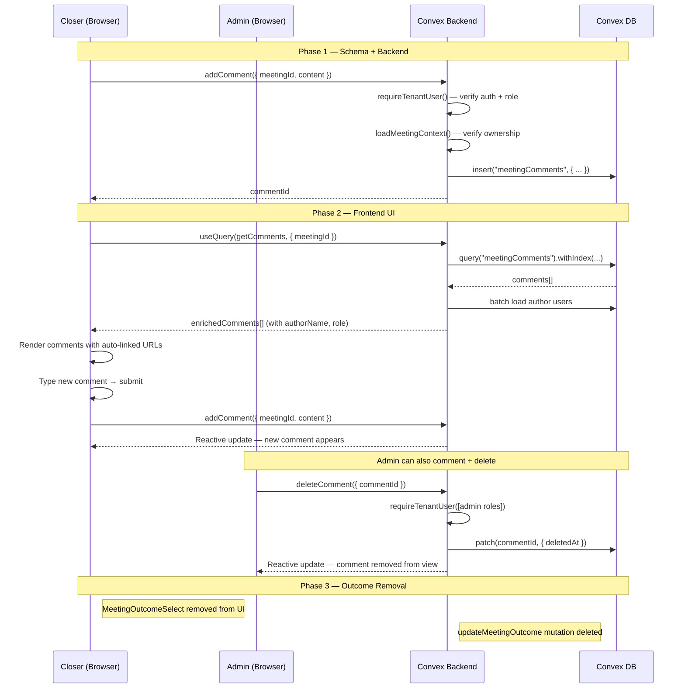

# Meeting Comments System — Design Specification

**Version:** 0.1 (MVP)
**Status:** Draft
**Date:** 2026-04-14
**Scope:** Replace the current meeting notes notepad (single-textarea auto-save) with a multi-user comment system and remove the outcome dropdown. Current state: a free-text `notes` field on the `meetings` table with a `meetingOutcome` dropdown → End state: a dedicated `meetingComments` table with threaded comment entries, author attribution, timestamps, and automatic URL hyperlinking.
**Prerequisite:** None — this is a standalone feature. The existing `notes` field and `meetingOutcome` field will be deprecated (not immediately removed) to support migration.

---

## Table of Contents

1. [Goals & Non-Goals](#1-goals--non-goals)
2. [Actors & Roles](#2-actors--roles)
3. [End-to-End Flow Overview](#3-end-to-end-flow-overview)
4. [Phase 1: Schema & Backend — Comments Table + Mutations](#4-phase-1-schema--backend--comments-table--mutations)
5. [Phase 2: Frontend — Comment System UI](#5-phase-2-frontend--comment-system-ui)
6. [Phase 3: Outcome Dropdown Removal & Cleanup](#6-phase-3-outcome-dropdown-removal--cleanup)
7. [Phase 4: Data Migration — Notes → Comments](#7-phase-4-data-migration--notes--comments)
8. [Data Model](#8-data-model)
9. [Convex Function Architecture](#9-convex-function-architecture)
10. [Routing & Authorization](#10-routing--authorization)
11. [Security Considerations](#11-security-considerations)
12. [Error Handling & Edge Cases](#12-error-handling--edge-cases)
13. [Open Questions](#13-open-questions)
14. [Dependencies](#14-dependencies)
15. [Applicable Skills](#15-applicable-skills)

---

## 1. Goals & Non-Goals

### Goals

- **Replace notepad with comments**: The "Meeting Notes" card becomes a "Comments" card showing a chronological list of comments authored by any user with access to the meeting.
- **Author attribution**: Every comment displays who wrote it and when, with user display name resolution.
- **URL auto-linking**: Any URL in a comment body is rendered as a clickable hyperlink (opens in a new tab) once the comment is posted. The input is plain text; rendering applies link detection.
- **Remove outcome dropdown completely**: The `MeetingOutcomeSelect` component, the `updateMeetingOutcome` mutation, and all UI references to meeting outcomes are fully deleted. The `meetingOutcome` schema field remains temporarily (removing it requires a widen-migrate-narrow migration) but no code reads or writes to it. The feature provided no actionable value.
- **Admin + closer parity**: Both the closer meeting detail view (`/workspace/closer/meetings/[id]`) and the admin meeting detail view (`/workspace/pipeline/meetings/[id]`) use the same comments component.
- **Real-time updates**: Comments appear immediately for all users viewing the same meeting, powered by Convex reactive queries.
- **Edit and delete**: Comment authors can edit their own comments. Admins (`tenant_master`, `tenant_admin`) can delete any comment. Deleted comments use soft-delete.

### Non-Goals (deferred)

- **Rich text editor / Markdown rendering** — Keep input as plain text for MVP. Rich text is a future enhancement.
- **@mentions / notifications** — No in-app notification when someone comments on your meeting. Deferred to a notifications feature.
- **Threaded replies / nested comments** — Comments are a flat chronological list. Threading is a future enhancement.
- **File attachments on comments** — Deferred; the existing payment form handles file uploads separately.
- **Comment reactions (emoji, likes)** — Deferred.
- **Bulk migration of existing `notes` data** — Phase 4 provides the migration path but actual execution is an operational step, not shipped code.
- **Full removal of `meetingOutcome` schema field** — Requires a widen-migrate-narrow schema migration. Deferred to a follow-up task (use `convex-migration-helper` skill).

---

## 2. Actors & Roles

| Actor              | Identity                              | Auth Method                                  | Key Permissions                                                                    |
| ------------------ | ------------------------------------- | -------------------------------------------- | ---------------------------------------------------------------------------------- |
| **Closer**         | CRM user with `closer` role           | WorkOS AuthKit, member of tenant org         | View/add comments on own assigned meetings; edit own comments; cannot delete others |
| **Tenant Admin**   | CRM user with `tenant_admin` role     | WorkOS AuthKit, member of tenant org         | View/add comments on all meetings; edit own comments; delete any comment            |
| **Tenant Master**  | CRM user with `tenant_master` role    | WorkOS AuthKit, member of tenant org         | View/add comments on all meetings; edit own comments; delete any comment            |

### Permission Mapping

| Action               | `tenant_master` | `tenant_admin` | `closer`              |
| -------------------- | --------------- | -------------- | --------------------- |
| View comments        | All meetings    | All meetings   | Own assigned meetings |
| Add comment          | All meetings    | All meetings   | Own assigned meetings |
| Edit own comment     | Yes             | Yes            | Yes                   |
| Delete own comment   | Yes             | Yes            | No                    |
| Delete any comment   | Yes             | Yes            | No                    |

> **Design decision:** Closers cannot delete comments (even their own) because the comment history serves as an audit trail that admins rely on to understand closer activity. If a closer makes a mistake, they can edit the comment to correct it.

---

## 3. End-to-End Flow Overview



---

## 4. Phase 1: Schema & Backend — Comments Table + Mutations

### 4.1 New `meetingComments` Table

A dedicated table following the established codebase patterns: `tenantId` for multi-tenant isolation, `authorId` referencing the `users` table, temporal fields, and soft-delete support.

> **Design decision:** A separate table instead of an array field on `meetings` is required because:
> 1. The schema guidelines prohibit unbounded arrays (see AGENTS.md: "No unbounded arrays: Use separate tables with foreign keys").
> 2. Comments are an independent entity with their own lifecycle (create, edit, delete).
> 3. Convex reactive queries on a separate table are more efficient — only comment subscribers re-fire, not the entire meeting detail query.

```typescript
// Path: convex/schema.ts (addition)
meetingComments: defineTable({
  tenantId: v.id("tenants"),
  meetingId: v.id("meetings"),
  authorId: v.id("users"),
  content: v.string(),
  createdAt: v.number(),
  editedAt: v.optional(v.number()),
  deletedAt: v.optional(v.number()),
})
  .index("by_meetingId_and_createdAt", ["meetingId", "createdAt"])
  .index("by_tenantId_and_createdAt", ["tenantId", "createdAt"]),
```

### 4.2 Convex Mutations

Three mutations in a new `convex/closer/meetingComments.ts` file:

#### `addComment`

```typescript
// Path: convex/closer/meetingComments.ts
import { mutation, query } from "../_generated/server";
import { v } from "convex/values";
import { requireTenantUser } from "../requireTenantUser";

const MAX_COMMENT_LENGTH = 5000;

export const addComment = mutation({
  args: {
    meetingId: v.id("meetings"),
    content: v.string(),
  },
  handler: async (ctx, { meetingId, content }) => {
    const { userId, tenantId, role } = await requireTenantUser(ctx, [
      "closer",
      "tenant_master",
      "tenant_admin",
    ]);

    // Validate content
    const trimmed = content.trim();
    if (trimmed.length === 0) {
      throw new Error("Comment cannot be empty");
    }
    if (trimmed.length > MAX_COMMENT_LENGTH) {
      throw new Error(`Comment exceeds ${MAX_COMMENT_LENGTH} character limit`);
    }

    // Verify meeting exists and belongs to tenant
    const meeting = await ctx.db.get(meetingId);
    if (!meeting || meeting.tenantId !== tenantId) {
      throw new Error("Meeting not found");
    }

    // Closers can only comment on own assigned meetings
    if (role === "closer") {
      const opportunity = await ctx.db.get(meeting.opportunityId);
      if (!opportunity || opportunity.assignedCloserId !== userId) {
        throw new Error("Not your meeting");
      }
    }

    const commentId = await ctx.db.insert("meetingComments", {
      tenantId,
      meetingId,
      authorId: userId,
      content: trimmed,
      createdAt: Date.now(),
    });

    console.log(
      "[Comments] addComment | meetingId=%s authorId=%s commentId=%s",
      meetingId,
      userId,
      commentId,
    );

    return commentId;
  },
});
```

#### `editComment`

```typescript
// Path: convex/closer/meetingComments.ts (continued)
export const editComment = mutation({
  args: {
    commentId: v.id("meetingComments"),
    content: v.string(),
  },
  handler: async (ctx, { commentId, content }) => {
    const { userId, tenantId } = await requireTenantUser(ctx, [
      "closer",
      "tenant_master",
      "tenant_admin",
    ]);

    const comment = await ctx.db.get(commentId);
    if (!comment || comment.tenantId !== tenantId) {
      throw new Error("Comment not found");
    }
    if (comment.deletedAt) {
      throw new Error("Cannot edit a deleted comment");
    }
    if (comment.authorId !== userId) {
      throw new Error("You can only edit your own comments");
    }

    const trimmed = content.trim();
    if (trimmed.length === 0) {
      throw new Error("Comment cannot be empty");
    }
    if (trimmed.length > MAX_COMMENT_LENGTH) {
      throw new Error(`Comment exceeds ${MAX_COMMENT_LENGTH} character limit`);
    }

    await ctx.db.patch(commentId, {
      content: trimmed,
      editedAt: Date.now(),
    });
  },
});
```

#### `deleteComment`

```typescript
// Path: convex/closer/meetingComments.ts (continued)
export const deleteComment = mutation({
  args: {
    commentId: v.id("meetingComments"),
  },
  handler: async (ctx, { commentId }) => {
    const { userId, tenantId, role } = await requireTenantUser(ctx, [
      "tenant_master",
      "tenant_admin",
    ]);

    const comment = await ctx.db.get(commentId);
    if (!comment || comment.tenantId !== tenantId) {
      throw new Error("Comment not found");
    }
    if (comment.deletedAt) {
      return; // Already deleted — idempotent
    }

    await ctx.db.patch(commentId, {
      deletedAt: Date.now(),
    });

    console.log(
      "[Comments] deleteComment | commentId=%s deletedBy=%s role=%s",
      commentId,
      userId,
      role,
    );
  },
});
```

> **Design decision — Closers excluded from delete:** The `deleteComment` mutation only allows `tenant_master` and `tenant_admin`. This is intentional: the comment thread serves as an audit trail that admins rely on. Closers who make errors can edit instead.

### 4.3 Query: `getComments`

```typescript
// Path: convex/closer/meetingComments.ts (continued)
import { getUserDisplayName } from "../reporting/lib/helpers";

export const getComments = query({
  args: {
    meetingId: v.id("meetings"),
  },
  handler: async (ctx, { meetingId }) => {
    const { userId, tenantId, role } = await requireTenantUser(ctx, [
      "closer",
      "tenant_master",
      "tenant_admin",
    ]);

    // Verify meeting access
    const meeting = await ctx.db.get(meetingId);
    if (!meeting || meeting.tenantId !== tenantId) {
      return [];
    }

    if (role === "closer") {
      const opportunity = await ctx.db.get(meeting.opportunityId);
      if (!opportunity || opportunity.assignedCloserId !== userId) {
        return [];
      }
    }

    // Fetch non-deleted comments ordered by creation time
    const comments = await ctx.db
      .query("meetingComments")
      .withIndex("by_meetingId_and_createdAt", (q) =>
        q.eq("meetingId", meetingId),
      )
      .take(200);

    const activeComments = comments.filter((c) => !c.deletedAt);

    // Batch-load author display names
    const authorIds = [...new Set(activeComments.map((c) => c.authorId))];
    const authorDocs = await Promise.all(
      authorIds.map(async (id) => [id, await ctx.db.get(id)] as const),
    );
    const authorById = new Map(authorDocs);

    return activeComments.map((comment) => {
      const author = authorById.get(comment.authorId);
      return {
        _id: comment._id,
        content: comment.content,
        createdAt: comment.createdAt,
        editedAt: comment.editedAt,
        authorId: comment.authorId,
        authorName: getUserDisplayName(author),
        authorRole: author?.role,
        isOwn: comment.authorId === userId,
      };
    });
  },
});
```

> **Design decision — `.take(200)` bound:** Following codebase standards, we never use unbounded `.collect()`. 200 comments per meeting is a generous upper bound; most meetings will have < 20 comments. If this becomes insufficient, pagination can be added later.

---

## 5. Phase 2: Frontend — Comment System UI

### 5.1 Component Architecture

Replace the current `MeetingNotes` card with a new `MeetingComments` card:

```
<Card> "Comments"
├── <CommentsList>               — Scrollable list of existing comments
│   └── <CommentEntry>           — Individual comment (avatar, name, time, content)
│       ├── Author name + role badge
│       ├── Relative timestamp ("2 min ago")
│       ├── Content with auto-linked URLs
│       ├── "edited" indicator (if editedAt is set)
│       └── Action menu (edit / delete, based on permissions)
└── <CommentInput>               — Textarea + submit button for new comments
```

### 5.2 URL Auto-Linking

When rendering a posted comment, URLs in the content are detected and rendered as clickable hyperlinks. The input remains plain text.

```typescript
// Path: app/workspace/closer/meetings/_components/comment-content.tsx
"use client";

import { Fragment } from "react";

// Match URLs starting with http(s):// or www.
const URL_REGEX =
  /(?:https?:\/\/|www\.)[^\s<>)"'\]]+/gi;

type CommentContentProps = {
  content: string;
};

/**
 * Renders comment text with URLs converted to clickable hyperlinks.
 * All links open in a new tab with security attributes.
 */
export function CommentContent({ content }: CommentContentProps) {
  const parts: Array<{ type: "text" | "link"; value: string }> = [];
  let lastIndex = 0;

  for (const match of content.matchAll(URL_REGEX)) {
    const matchIndex = match.index!;
    if (matchIndex > lastIndex) {
      parts.push({ type: "text", value: content.slice(lastIndex, matchIndex) });
    }

    let url = match[0];
    // Ensure URL has protocol for href
    const href = url.startsWith("http") ? url : `https://${url}`;
    parts.push({ type: "link", value: url });
    lastIndex = matchIndex + url.length;
  }

  if (lastIndex < content.length) {
    parts.push({ type: "text", value: content.slice(lastIndex) });
  }

  // If no URLs found, render as plain text (avoids unnecessary elements)
  if (parts.length === 0) {
    return <p className="whitespace-pre-wrap text-sm">{content}</p>;
  }

  return (
    <p className="whitespace-pre-wrap text-sm">
      {parts.map((part, i) =>
        part.type === "link" ? (
          <a
            key={i}
            href={part.value.startsWith("http") ? part.value : `https://${part.value}`}
            target="_blank"
            rel="noopener noreferrer"
            className="text-primary underline underline-offset-2 hover:text-primary/80 break-all"
          >
            {part.value}
          </a>
        ) : (
          <Fragment key={i}>{part.value}</Fragment>
        ),
      )}
    </p>
  );
}
```

> **Design decision — Client-side URL detection, not server-side:** URLs are detected at render time, not stored as structured data. This is simpler, avoids schema complexity, and means existing comments automatically get linking when the component ships. The regex approach handles the vast majority of URLs users will paste (full `https://` URLs and `www.` prefixed URLs).

### 5.3 Comment Entry Component

```typescript
// Path: app/workspace/closer/meetings/_components/comment-entry.tsx
"use client";

import { formatDistanceToNow } from "date-fns";
import { Badge } from "@/components/ui/badge";
import { Button } from "@/components/ui/button";
import {
  DropdownMenu,
  DropdownMenuContent,
  DropdownMenuItem,
  DropdownMenuTrigger,
} from "@/components/ui/dropdown-menu";
import { MoreHorizontalIcon, PencilIcon, Trash2Icon } from "lucide-react";
import { CommentContent } from "./comment-content";
import { useRole } from "@/components/auth/role-context";

type CommentEntryProps = {
  comment: {
    _id: string;
    content: string;
    createdAt: number;
    editedAt?: number;
    authorName: string;
    authorRole?: string;
    isOwn: boolean;
  };
  onEdit: (commentId: string) => void;
  onDelete: (commentId: string) => void;
};

export function CommentEntry({ comment, onEdit, onDelete }: CommentEntryProps) {
  const { isAdmin } = useRole();

  const canEdit = comment.isOwn;
  const canDelete = isAdmin;
  const hasActions = canEdit || canDelete;

  return (
    <div className="group flex gap-3 py-3">
      {/* Author initial avatar */}
      <div className="flex size-8 shrink-0 items-center justify-center rounded-full bg-muted text-xs font-medium">
        {comment.authorName.charAt(0).toUpperCase()}
      </div>

      <div className="min-w-0 flex-1">
        {/* Header: name, role badge, timestamp, actions */}
        <div className="flex items-center gap-2">
          <span className="text-sm font-medium">{comment.authorName}</span>
          {comment.authorRole && (
            <Badge variant="outline" className="text-[10px] px-1.5 py-0">
              {comment.authorRole === "tenant_master"
                ? "Owner"
                : comment.authorRole === "tenant_admin"
                  ? "Admin"
                  : "Closer"}
            </Badge>
          )}
          <span className="text-xs text-muted-foreground">
            {formatDistanceToNow(comment.createdAt, { addSuffix: true })}
          </span>
          {comment.editedAt && (
            <span className="text-[10px] text-muted-foreground italic">
              (edited)
            </span>
          )}

          {/* Action menu — visible on hover */}
          {hasActions && (
            <DropdownMenu>
              <DropdownMenuTrigger asChild>
                <Button
                  variant="ghost"
                  size="icon"
                  className="ml-auto size-6 opacity-0 group-hover:opacity-100 transition-opacity"
                >
                  <MoreHorizontalIcon className="size-3.5" />
                  <span className="sr-only">Comment actions</span>
                </Button>
              </DropdownMenuTrigger>
              <DropdownMenuContent align="end">
                {canEdit && (
                  <DropdownMenuItem onClick={() => onEdit(comment._id)}>
                    <PencilIcon className="mr-2 size-3.5" />
                    Edit
                  </DropdownMenuItem>
                )}
                {canDelete && (
                  <DropdownMenuItem
                    onClick={() => onDelete(comment._id)}
                    className="text-destructive focus:text-destructive"
                  >
                    <Trash2Icon className="mr-2 size-3.5" />
                    Delete
                  </DropdownMenuItem>
                )}
              </DropdownMenuContent>
            </DropdownMenu>
          )}
        </div>

        {/* Comment body with auto-linked URLs */}
        <div className="mt-1">
          <CommentContent content={comment.content} />
        </div>
      </div>
    </div>
  );
}
```

### 5.4 Comment Input Component

```typescript
// Path: app/workspace/closer/meetings/_components/comment-input.tsx
"use client";

import { useState, useCallback, useRef } from "react";
import { useMutation } from "convex/react";
import { api } from "@/convex/_generated/api";
import type { Id } from "@/convex/_generated/dataModel";
import { Textarea } from "@/components/ui/textarea";
import { Button } from "@/components/ui/button";
import { SendIcon } from "lucide-react";
import { toast } from "sonner";

type CommentInputProps = {
  meetingId: Id<"meetings">;
};

export function CommentInput({ meetingId }: CommentInputProps) {
  const [content, setContent] = useState("");
  const [isSubmitting, setIsSubmitting] = useState(false);
  const textareaRef = useRef<HTMLTextAreaElement>(null);

  const addComment = useMutation(api.closer.meetingComments.addComment);

  const handleSubmit = useCallback(async () => {
    const trimmed = content.trim();
    if (!trimmed || isSubmitting) return;

    setIsSubmitting(true);
    try {
      await addComment({ meetingId, content: trimmed });
      setContent("");
      textareaRef.current?.focus();
    } catch (error) {
      toast.error(
        error instanceof Error ? error.message : "Failed to post comment",
      );
    } finally {
      setIsSubmitting(false);
    }
  }, [content, meetingId, addComment, isSubmitting]);

  const handleKeyDown = useCallback(
    (e: React.KeyboardEvent) => {
      // Cmd/Ctrl + Enter to submit
      if ((e.metaKey || e.ctrlKey) && e.key === "Enter") {
        e.preventDefault();
        handleSubmit();
      }
    },
    [handleSubmit],
  );

  return (
    <div className="flex gap-2">
      <Textarea
        ref={textareaRef}
        value={content}
        onChange={(e) => setContent(e.target.value)}
        onKeyDown={handleKeyDown}
        placeholder="Add a comment… (Cmd+Enter to send)"
        className="min-h-[80px] resize-y"
        aria-label="New comment"
        disabled={isSubmitting}
      />
      <Button
        size="icon"
        onClick={handleSubmit}
        disabled={!content.trim() || isSubmitting}
        className="shrink-0 self-end"
        aria-label="Post comment"
      >
        <SendIcon className="size-4" />
      </Button>
    </div>
  );
}
```

### 5.5 Main `MeetingComments` Card

```typescript
// Path: app/workspace/closer/meetings/_components/meeting-comments.tsx
"use client";

import { useQuery } from "convex/react";
import { api } from "@/convex/_generated/api";
import type { Id } from "@/convex/_generated/dataModel";
import { Card, CardContent, CardHeader, CardTitle } from "@/components/ui/card";
import { MessageSquareIcon } from "lucide-react";
import { CommentEntry } from "./comment-entry";
import { CommentInput } from "./comment-input";
import { Spinner } from "@/components/ui/spinner";
import { useMutation } from "convex/react";
import { toast } from "sonner";
import { useState, useCallback } from "react";

type MeetingCommentsProps = {
  meetingId: Id<"meetings">;
};

export function MeetingComments({ meetingId }: MeetingCommentsProps) {
  const comments = useQuery(api.closer.meetingComments.getComments, {
    meetingId,
  });

  const deleteComment = useMutation(api.closer.meetingComments.deleteComment);
  const [editingId, setEditingId] = useState<string | null>(null);

  const handleDelete = useCallback(
    async (commentId: string) => {
      try {
        await deleteComment({
          commentId: commentId as Id<"meetingComments">,
        });
        toast.success("Comment deleted");
      } catch (error) {
        toast.error(
          error instanceof Error ? error.message : "Failed to delete comment",
        );
      }
    },
    [deleteComment],
  );

  const isLoading = comments === undefined;

  return (
    <Card>
      <CardHeader className="pb-3">
        <div className="flex items-center gap-2">
          <MessageSquareIcon className="size-4 text-muted-foreground" />
          <CardTitle className="text-base">Comments</CardTitle>
          {!isLoading && comments.length > 0 && (
            <span className="text-xs text-muted-foreground">
              ({comments.length})
            </span>
          )}
        </div>
      </CardHeader>
      <CardContent className="flex flex-col gap-4">
        {/* Comments list */}
        {isLoading ? (
          <div className="flex items-center justify-center py-6">
            <Spinner className="size-5" />
          </div>
        ) : comments.length === 0 ? (
          <p className="py-4 text-center text-sm text-muted-foreground">
            No comments yet. Be the first to add one.
          </p>
        ) : (
          <div className="divide-y max-h-[400px] overflow-y-auto">
            {comments.map((comment) => (
              <CommentEntry
                key={comment._id}
                comment={comment}
                onEdit={setEditingId}
                onDelete={handleDelete}
              />
            ))}
          </div>
        )}

        {/* Comment input */}
        <CommentInput meetingId={meetingId} />
      </CardContent>
    </Card>
  );
}
```

### 5.6 Integration Points — Page Client Components

Both the closer and admin meeting detail pages consume `MeetingNotes` today. They need to swap to `MeetingComments`:

**Closer detail** (`meeting-detail-page-client.tsx`, ~line 257):

```typescript
// Path: app/workspace/closer/meetings/[meetingId]/_components/meeting-detail-page-client.tsx
// BEFORE:
<MeetingNotes
  meetingId={meeting._id}
  initialNotes={meeting.notes ?? ""}
  meetingOutcome={meeting.meetingOutcome}
/>

// AFTER:
<MeetingComments meetingId={meeting._id} />
```

**Admin detail** (`admin-meeting-detail-client.tsx`, ~line 246):

```typescript
// Path: app/workspace/pipeline/meetings/[meetingId]/_components/admin-meeting-detail-client.tsx
// BEFORE:
<MeetingNotes
  meetingId={meeting._id}
  initialNotes={meeting.notes ?? ""}
  meetingOutcome={meeting.meetingOutcome}
/>

// AFTER:
<MeetingComments meetingId={meeting._id} />
```

### 5.7 Edit Inline Flow

When a user clicks "Edit" on their own comment, the `CommentEntry` swaps the text content for an inline textarea pre-filled with the current text and a "Save" / "Cancel" button pair. This avoids modals and keeps the editing experience lightweight.

```typescript
// Inside CommentEntry — when editingId matches this comment:
// Replace <CommentContent> with:
<div className="mt-1 flex flex-col gap-2">
  <Textarea
    value={editContent}
    onChange={(e) => setEditContent(e.target.value)}
    className="min-h-[60px] resize-y"
    autoFocus
  />
  <div className="flex gap-2 justify-end">
    <Button variant="ghost" size="sm" onClick={onCancelEdit}>
      Cancel
    </Button>
    <Button size="sm" onClick={handleSaveEdit} disabled={isSaving}>
      Save
    </Button>
  </div>
</div>
```

---

## 6. Phase 3: Outcome Dropdown Removal & Cleanup

### 6.1 What Gets Removed

| Item                            | File                                                            | Action                     |
| ------------------------------- | --------------------------------------------------------------- | -------------------------- |
| `MeetingOutcomeSelect` component | `meetings/_components/meeting-outcome-select.tsx`               | **Delete file**            |
| `MeetingOutcome` type export     | `meeting-outcome-select.tsx` line 51                            | Deleted with file          |
| `meetingOutcome` prop on `MeetingNotes` | `meetings/_components/meeting-notes.tsx`                  | Remove from props type     |
| `MeetingOutcomeSelect` rendering | `meeting-notes.tsx` lines 118-121                              | Remove JSX                 |
| `updateMeetingOutcome` mutation  | `convex/closer/meetingActions.ts` lines 319-356                | **Delete entire mutation** |
| `deriveCallOutcome` — `meetingOutcome` branch | `convex/reporting/lib/outcomeDerivation.ts` line 48 | **Delete the `if` block** + add TODO comment (see §6.3) |
| Outcome column in lead meetings tab | `leads/[leadId]/_components/tabs/lead-meetings-tab.tsx` lines 103-110 | Remove column       |
| PostHog `meeting_outcome_set` event | `meeting-outcome-select.tsx` line 83                        | Deleted with file          |

### 6.2 What Gets Preserved (Not Removed in Phase 3)

| Item                                | Reason                                                           |
| ----------------------------------- | ---------------------------------------------------------------- |
| `meetingOutcome` field in `convex/schema.ts` | Removing a field from the schema requires a widen-migrate-narrow migration. Deferred — use `convex-migration-helper` skill in a follow-up task. |
| `by_tenantId_and_meetingOutcome_and_scheduledAt` index | Must stay until the field is removed from the schema |
| Existing `meetingOutcome` data in DB | Preserved; no code reads or writes to it. Will be cleaned up during schema migration. |

> **Design decision — Full deletion, not deprecation:** The outcome dropdown provided no actionable value — closers rarely used it, and no production code consumes the data. Keeping a deprecated-but-present mutation invites confusion. Deleting it cleanly signals the feature is gone. The schema field is the only thing we can't delete immediately (Convex schema constraints), but all code paths that reference it are removed.

### 6.3 Reporting Impact Assessment

**`deriveCallOutcome` function** (`convex/reporting/lib/outcomeDerivation.ts`, line 48):

```typescript
// BEFORE — line 48:
if (meeting.meetingOutcome === "not_qualified") {
  return "dq";
}

// AFTER — remove the block, add TODO:
// TODO: The "dq" (disqualified) outcome previously derived from meetingOutcome === "not_qualified".
// The meetingOutcome field has been removed. When reporting ships, implement an explicit
// "Disqualify" action (separate mutation on the meeting or opportunity) to classify DQs.
// See: plans/meeting-comments/meeting-comments-design.md §6.3
```

**Impact analysis:**

1. `deriveCallOutcome` is **not imported or called** by any production Convex function — it exists only as a prepared utility for future reporting work (confirmed: only reference is the auto-generated `_generated/api.d.ts` import).
2. The function is referenced in reporting design docs (`plans/v0.6b/`, `plans/v0.6/`) for future Team Performance queries, but none of that code is shipped.
3. Removing the `meetingOutcome === "not_qualified"` branch means the "dq" `CallOutcome` variant **has no trigger** until a replacement signal is built.
4. **No production data loss or behavior change** — no user-facing feature or shipped reporting relies on this code path today.

> **⚠️ Reporting note (deferred):** When the reporting feature ships (v0.6b Team Performance), it will need a new mechanism to classify meetings as "DQ". Options include: (a) an explicit "Disqualify" mutation on the meeting, (b) deriving DQ from opportunity status (`lost` + specific reason), or (c) a comment-based signal (e.g., a structured "DQ" tag). This is tracked as a deferred decision — no action required for this feature.

### 6.4 Lead Meetings Tab Update

The `meetingOutcome` column in the lead meetings tab table (`lead-meetings-tab.tsx`) should be removed:

```typescript
// Path: app/workspace/leads/[leadId]/_components/tabs/lead-meetings-tab.tsx
// REMOVE: TableHead for "Outcome" and the corresponding TableCell rendering
// Lines ~73 (header) and ~103-110 (cell)
```

This is a simple column deletion from the table — no other columns or data flow are affected.

---

## 7. Phase 4: Data Migration — Notes → Comments

### 7.1 Strategy

For tenants with existing `notes` data on meetings, those notes can be migrated to the first comment on each meeting. This is a one-time data migration.

> **Important:** This phase is optional for the MVP. Existing notes data is not deleted by any earlier phase — it remains on the `meetings` table. The migration converts it to comments format for a unified view.

### 7.2 Migration Script

```typescript
// Path: convex/closer/meetingCommentsMigration.ts
import { internalMutation } from "../_generated/server";
import { v } from "convex/values";

const BATCH_SIZE = 100;

/**
 * Migrates existing meeting.notes to meetingComments entries.
 * Safe to run multiple times — skips meetings that already have comments.
 */
export const migrateNotesToComments = internalMutation({
  args: {
    tenantId: v.id("tenants"),
    systemUserId: v.id("users"), // The user to attribute migrated notes to
    cursor: v.optional(v.string()),
  },
  handler: async (ctx, { tenantId, systemUserId, cursor }) => {
    const meetings = await ctx.db
      .query("meetings")
      .withIndex("by_tenantId_and_scheduledAt", (q) =>
        q.eq("tenantId", tenantId),
      )
      .take(BATCH_SIZE);

    let migrated = 0;

    for (const meeting of meetings) {
      // Skip if no notes
      if (!meeting.notes || meeting.notes.trim().length === 0) continue;

      // Skip if meeting already has comments (idempotency)
      const existing = await ctx.db
        .query("meetingComments")
        .withIndex("by_meetingId_and_createdAt", (q) =>
          q.eq("meetingId", meeting._id),
        )
        .first();
      if (existing) continue;

      await ctx.db.insert("meetingComments", {
        tenantId,
        meetingId: meeting._id,
        authorId: systemUserId,
        content: `[Migrated from meeting notes]\n\n${meeting.notes.trim()}`,
        createdAt: meeting.createdAt, // Use meeting creation time
      });
      migrated++;
    }

    console.log(
      "[Migration] migrateNotesToComments | tenantId=%s migrated=%d batch=%d",
      tenantId,
      migrated,
      meetings.length,
    );

    // If batch was full, schedule continuation
    if (meetings.length === BATCH_SIZE) {
      await ctx.scheduler.runAfter(
        0,
        // @ts-expect-error — self-referencing internal function
        migrateNotesToComments,
        { tenantId, systemUserId },
      );
    }
  },
});
```

> **Note:** This uses `ctx.scheduler.runAfter(0, ...)` for batch continuation, following the codebase's established pattern for bulk operations that may exceed transaction limits.

---

## 8. Data Model

### 8.1 New: `meetingComments` Table

```typescript
// Path: convex/schema.ts
meetingComments: defineTable({
  tenantId: v.id("tenants"),          // Multi-tenant isolation
  meetingId: v.id("meetings"),        // Parent meeting reference
  authorId: v.id("users"),            // Comment author (CRM user)
  content: v.string(),                // Plain text content (URLs detected at render)
  createdAt: v.number(),              // Unix ms — insertion timestamp
  editedAt: v.optional(v.number()),   // Unix ms — last edit timestamp (undefined = never edited)
  deletedAt: v.optional(v.number()),  // Unix ms — soft-delete timestamp (undefined = active)
})
  .index("by_meetingId_and_createdAt", ["meetingId", "createdAt"])
  .index("by_tenantId_and_createdAt", ["tenantId", "createdAt"]),
```

### 8.2 Modified: `meetings` Table (Phase 3 — Deprecation Only)

```typescript
// Path: convex/schema.ts
meetings: defineTable({
  // ... existing fields ...

  // DEPRECATED: Free-text notes field. Replaced by meetingComments table.
  // Will be removed in a future schema migration after data is migrated.
  notes: v.optional(v.string()),

  // DEAD FIELD — All code that reads/writes meetingOutcome has been deleted (Phase 3).
  // Field + index remain in schema only because Convex requires widen-migrate-narrow
  // to remove a field. Schedule removal via `convex-migration-helper` skill.
  // No production code references this field.
  meetingOutcome: v.optional(
    v.union(
      v.literal("interested"),
      v.literal("needs_more_info"),
      v.literal("price_objection"),
      v.literal("not_qualified"),
      v.literal("ready_to_buy"),
    ),
  ),

  // ... rest of fields ...
})
```

> **No immediate schema field removal.** Both `notes` and `meetingOutcome` remain as optional fields in the schema — Convex requires a widen-migrate-narrow migration to remove fields. However, all code that reads or writes `meetingOutcome` is deleted in Phase 3 — the field is dead. When ready for full schema cleanup, use the `convex-migration-helper` skill.

---

## 9. Convex Function Architecture

```
convex/
├── closer/
│   ├── meetingComments.ts                # NEW: CRUD mutations + query — Phase 1
│   ├── meetingCommentsMigration.ts       # NEW: Notes → Comments migration — Phase 4
│   ├── meetingActions.ts                 # MODIFIED: updateMeetingOutcome mutation deleted — Phase 3
│   └── meetingDetail.ts                  # UNMODIFIED (notes field still returned but unused by UI)
├── reporting/
│   └── lib/
│       └── outcomeDerivation.ts          # MODIFIED: meetingOutcome branch deleted, TODO added for DQ replacement — Phase 3
├── schema.ts                            # MODIFIED: new meetingComments table + deprecation comments — Phase 1
└── lib/
    └── permissions.ts                   # UNMODIFIED (no new permission keys for MVP)
```

---

## 10. Routing & Authorization

### Route Structure (No Changes)

The comment system lives entirely within the existing meeting detail pages. No new routes are needed.

```
app/workspace/
├── closer/
│   └── meetings/
│       ├── _components/
│       │   ├── meeting-comments.tsx         # NEW: Main comment card — Phase 2
│       │   ├── comment-entry.tsx            # NEW: Individual comment — Phase 2
│       │   ├── comment-input.tsx            # NEW: New comment textarea — Phase 2
│       │   ├── comment-content.tsx          # NEW: URL auto-linking renderer — Phase 2
│       │   ├── meeting-notes.tsx            # DELETED in Phase 3 (after MeetingComments is live)
│       │   └── meeting-outcome-select.tsx   # DELETED in Phase 3
│       └── [meetingId]/
│           └── _components/
│               └── meeting-detail-page-client.tsx  # MODIFIED: swap MeetingNotes → MeetingComments — Phase 2
└── pipeline/
    └── meetings/
        └── [meetingId]/
            └── _components/
                └── admin-meeting-detail-client.tsx  # MODIFIED: swap MeetingNotes → MeetingComments — Phase 2
```

### Authorization Flow

```
User opens meeting detail page
  └─ Page RSC: requireRole(["closer"]) or requireRole(["tenant_master", "tenant_admin"])
      └─ MeetingComments component mounts
          └─ useQuery(getComments, { meetingId })
              └─ Convex: requireTenantUser() — re-validates auth
              └─ Convex: tenant isolation check (meeting.tenantId === user's tenantId)
              └─ Convex: ownership check (closer can only see own assigned meetings)
```

No client-side role check is needed for showing/hiding the comments section itself — it appears for all users who can access the meeting detail page. The edit/delete action visibility uses `useRole().isAdmin` for UI gating (with server-side re-validation on every mutation).

---

## 11. Security Considerations

### 11.1 Multi-Tenant Isolation

- Every `meetingComments` record includes `tenantId`, set from the authenticated user's resolved tenant — never from client input.
- The `getComments` query verifies `meeting.tenantId === user's tenantId` before returning data.
- Comments cannot cross tenant boundaries.

### 11.2 Role-Based Data Access

| Data                 | `tenant_master` | `tenant_admin` | `closer`              |
| -------------------- | --------------- | -------------- | --------------------- |
| View comments        | All meetings    | All meetings   | Own assigned meetings |
| Add comment          | All meetings    | All meetings   | Own assigned meetings |
| Edit comment         | Own only        | Own only       | Own only              |
| Delete comment       | Any             | Any            | None                  |

### 11.3 Input Validation

- Comment content is trimmed and validated for:
  - Non-empty after trim
  - Maximum 5,000 characters
- No HTML is accepted or rendered — plain text only, with URL detection at render time
- XSS risk from URL auto-linking is mitigated by:
  - Only `https://` and `www.` prefixed strings are linkified
  - `rel="noopener noreferrer"` on all generated links
  - `target="_blank"` for opening in new tab
  - React's built-in JSX escaping prevents injection in non-href text

### 11.4 Soft Delete Integrity

- Soft-deleted comments (`deletedAt` set) are filtered out in `getComments` query
- The `deleteComment` mutation is idempotent — calling it on an already-deleted comment is a no-op
- Hard deletion is not exposed to any user — data is preserved for potential audit needs

---

## 12. Error Handling & Edge Cases

### 12.1 Meeting Not Found or Unauthorized

**Scenario:** User navigates to a meeting that doesn't exist or belongs to another tenant.
**Detection:** `getComments` query checks `meeting.tenantId !== tenantId`.
**Recovery:** Returns empty array `[]` — the parent page's own "Meeting Not Found" handling takes precedence.
**User sees:** The meeting detail page shows the not-found state; comments section is not rendered.

### 12.2 Rapid Comment Submission

**Scenario:** User clicks "Send" multiple times quickly.
**Detection:** `isSubmitting` state flag prevents double submission.
**Recovery:** Button is disabled during mutation; content is cleared only on success.
**User sees:** Button appears disabled momentarily; single comment appears.

### 12.3 Comment Edit Conflict

**Scenario:** Two users load the same meeting; User A edits a comment while User B views it.
**Detection:** Convex's reactive queries automatically push updates.
**Recovery:** User B's view updates in real-time when User A saves the edit.
**User sees:** Comment content updates live; "(edited)" indicator appears.

### 12.4 Deleted Comment While Editing

**Scenario:** Admin deletes a comment while the author is editing it.
**Detection:** The `editComment` mutation checks `comment.deletedAt` before applying the edit.
**Recovery:** Mutation throws "Cannot edit a deleted comment"; toast shows error.
**User sees:** Error toast; the comment disappears from the list on next reactive update.

### 12.5 Network Failure on Comment Submit

**Scenario:** User submits a comment but the network request fails.
**Detection:** `try/catch` around `addComment` mutation.
**Recovery:** Error toast displayed; comment text is **not** cleared from the input, so the user can retry.
**User sees:** Error toast with message; their typed text remains in the textarea.

### 12.6 Stale Data After Page Rehydration

**Scenario:** User returns to the meeting page after the browser tab was backgrounded.
**Detection:** Convex's WebSocket reconnection automatically refetches subscribed queries.
**Recovery:** Comments list refreshes automatically.
**User sees:** Up-to-date comments without manual refresh.

### 12.7 Very Long Comments

**Scenario:** User attempts to post a comment exceeding 5,000 characters.
**Detection:** Server-side validation in `addComment` mutation.
**Recovery:** Mutation throws; toast displays character limit error.
**User sees:** Error toast. Future enhancement: client-side character counter before submission.

---

## 13. Open Questions

| #   | Question                                                                                          | Current Thinking                                                                                                                                                                           |
| --- | ------------------------------------------------------------------------------------------------- | ------------------------------------------------------------------------------------------------------------------------------------------------------------------------------------------ |
| 1   | Should existing `notes` data be automatically migrated to comments, or shown in a read-only legacy section? | **Migrate** (Phase 4). One-time batch script converts notes to first comment with "[Migrated from meeting notes]" prefix. Simpler than maintaining two UIs.                              |
| 2   | Should the Calendly `meeting_notes_plain` webhook data still populate `meetings.notes`?           | **Yes, for now.** The webhook sets initial notes from Calendly. Phase 4 migration converts them. Long-term: webhook could create a system comment directly.                              |
| 3   | What replaces `meetingOutcome === "not_qualified"` in `deriveCallOutcome` for DQ classification?  | **Deferred.** The `meetingOutcome` branch is deleted in Phase 3 (the function is unused in production). When reporting ships (v0.6b), implement a replacement DQ signal — options: explicit "Disqualify" mutation, opportunity status derivation, or structured comment tag. See §6.3 for full analysis. |
| 4   | Should comments emit `domainEvents` for the activity feed?                                        | **Yes, future enhancement.** Not in MVP. When added, use event type `"meeting.comment_created"` with `source: "closer"` or `source: "admin"`.                                           |
| 5   | Should there be a comment count badge on meeting list views?                                       | **Deferred.** Would require denormalizing `commentCount` onto the meeting record. Not needed for MVP.                                                                                    |
| 6   | Should closers be able to delete their own comments?                                               | **No for MVP.** Comments serve as an audit trail. Closers can edit to correct mistakes. Revisit if user feedback indicates frustration.                                                   |
| 7   | Max height for the comments list before scrolling?                                                 | **400px** with `overflow-y-auto`. Keeps the page layout stable while allowing scrolling through many comments.                                                                           |

---

## 14. Dependencies

### New Packages

None — all required packages are already installed.

### Already Installed (no action needed)

| Package                  | Used for                                              |
| ------------------------ | ----------------------------------------------------- |
| `convex`                 | Backend mutations, queries, schema                    |
| `convex/react`           | `useQuery`, `useMutation` hooks                       |
| `react-hook-form`        | Not needed for comment input (too simple for RHF)     |
| `date-fns`               | `formatDistanceToNow` for relative timestamps         |
| `sonner`                 | Toast notifications on success/error                  |
| `lucide-react`           | Icons (MessageSquare, Send, MoreHorizontal, etc.)     |
| `@/components/ui/*`      | Card, Button, Textarea, Badge, DropdownMenu, Spinner  |

### Environment Variables

None — no new environment variables required.

---

## 15. Applicable Skills

| Skill                        | When to Invoke                                                        | Phase     |
| ---------------------------- | --------------------------------------------------------------------- | --------- |
| `convex-migration-helper`    | If/when `notes` or `meetingOutcome` schema fields need full removal   | Phase 4+  |
| `shadcn`                     | When building the comment UI components                               | Phase 2   |
| `frontend-design`            | Production-grade comment entry layout, avatar, hover states           | Phase 2   |
| `web-design-guidelines`      | Accessibility review of the comments UI                               | Phase 2   |
| `expect`                     | Browser-based verification of comment CRUD, URL linking, responsive   | Phase 2-3 |
| `simplify`                   | Code quality review after Phase 2 implementation                      | Phase 2   |
| `vercel-react-best-practices`| Ensure comment list rendering is optimized (key props, memo, etc.)   | Phase 2   |

---

*This document is a living specification. Sections will be updated as implementation progresses and open questions are resolved.*
