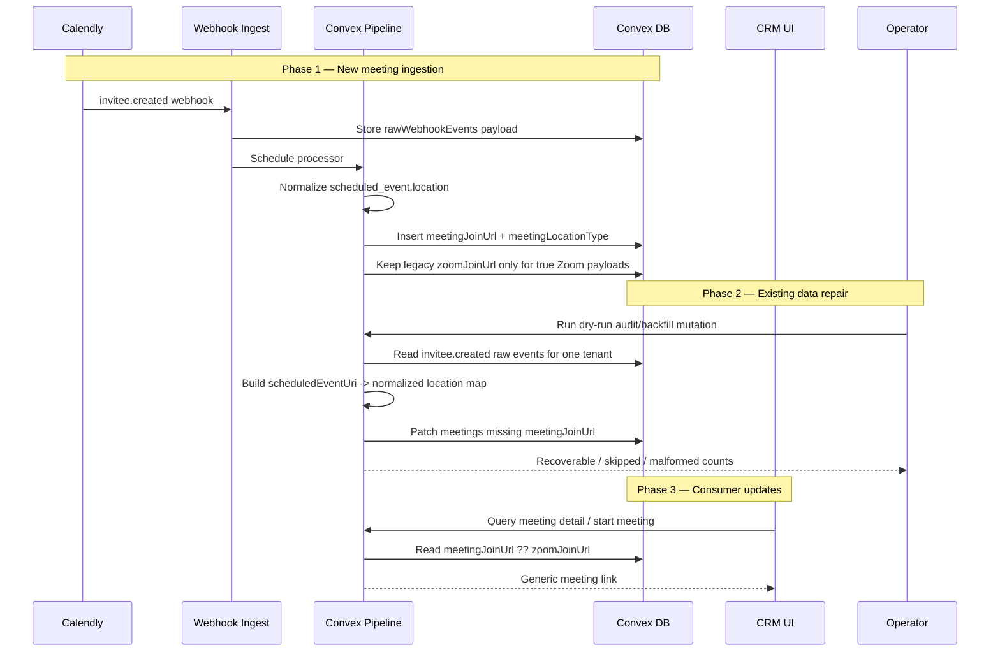

# Meeting Link Normalization — Design Specification

**Version:** 0.1 (MVP)
**Status:** Draft
**Scope:** Fix meeting-link ingestion so Calendly `custom` locations are stored and usable across the CRM, then backfill existing production meetings safely from retained raw webhook payloads. This changes the system from a Zoom-only assumption to a generic meeting-link model while keeping the current app working during rollout.
**Prerequisite:** Existing `meetings` and `rawWebhookEvents` data in production, plus the current Calendly webhook pipeline. The bug analysis in [zoom-link-issue.md](/Users/nimbus/dev/ptdom-crm/bugs/zoom-link-issue.md) is the input artifact for this design.

---

## Table of Contents

1. [Goals & Non-Goals](#1-goals--non-goals)
2. [Actors & Roles](#2-actors--roles)
3. [End-to-End Flow Overview](#3-end-to-end-flow-overview)
4. [Phase 1: Normalize Meeting Link Extraction](#4-phase-1-normalize-meeting-link-extraction)
5. [Phase 2: Audit And Backfill Existing Meetings](#5-phase-2-audit-and-backfill-existing-meetings)
6. [Phase 3: Consumer Updates And UI Cleanup](#6-phase-3-consumer-updates-and-ui-cleanup)
7. [Data Model](#7-data-model)
8. [Convex Function Architecture](#8-convex-function-architecture)
9. [Routing & Authorization](#9-routing--authorization)
10. [Security Considerations](#10-security-considerations)
11. [Error Handling & Edge Cases](#11-error-handling--edge-cases)
12. [Open Questions](#12-open-questions)
13. [Dependencies](#13-dependencies)
14. [Applicable Skills](#14-applicable-skills)

---

## 1. Goals & Non-Goals

### Goals

- New meetings store a generic join URL when Calendly sends any usable online meeting location, not only Zoom-native `join_url`.
- Existing production meetings are backfilled safely from `rawWebhookEvents` with a dry-run path first.
- Frontend and Convex consumers read from a generic meeting-link field, with fallback to the legacy `zoomJoinUrl` during rollout.
- The rollout is safe under Convex schema constraints and avoids a breaking deploy.

### Non-Goals (deferred)

- Re-fetching historical meetings from the live Calendly API.
- Converting malformed historical custom locations beyond conservative normalization.
- Removing `zoomJoinUrl` in the first deploy. That cleanup is a later narrowing step after the new field is stable.
- Redesigning the closer meeting UI beyond copy updates from "Zoom" to "Meeting".

---

## 2. Actors & Roles

| Actor | Identity | Auth Method | Key Permissions |
|---|---|---|---|
| **Closer** | Tenant-scoped CRM closer | WorkOS AuthKit + Convex tenant auth | Starts meetings, copies join links, views own assigned meetings |
| **Tenant Admin / Tenant Master** | Tenant-scoped CRM admin user | WorkOS AuthKit + Convex tenant auth | Views meeting detail pages and meeting links |
| **Operator / Engineer** | Repo maintainer running Convex CLI | Convex deploy key / production deployment access | Runs dry-run audit and backfill mutation |

### CRM Role Context

| CRM `users.role` | Relevance To This Fix | Notes |
|---|---|---|
| `closer` | Primary consumer | Needs reliable meeting-link launch flow |
| `tenant_admin` | Secondary consumer | Can inspect affected meetings |
| `tenant_master` | Secondary consumer | Can inspect affected meetings |

---

## 3. End-to-End Flow Overview



---

## 4. Phase 1: Normalize Meeting Link Extraction

### 4.1 What Changes

The current pipeline only reads `scheduled_event.location.join_url`, which is correct for `type = "zoom"` but wrong for `type = "custom"`. Production analysis showed the missing-link bug maps exactly to this assumption.

The fix introduces a shared normalization helper that inspects Calendly `scheduled_event.location` and returns:

- `meetingJoinUrl` when the payload contains a usable online URL
- `meetingLocationType` for observability and future UX
- `zoomJoinUrl` only when the payload is genuinely Zoom-native

> **Schema strategy:** This is a widen-first rollout. We add new optional fields and keep `zoomJoinUrl` in place. That matches the `convex-migration-helper` guidance: introduce the new format first, write it for all new documents, then migrate old data, then optionally narrow later.

### 4.2 Location Normalization Rules

| Calendly payload shape | Stored `meetingJoinUrl` | Stored `meetingLocationType` | Stored legacy `zoomJoinUrl` |
|---|---|---|---|
| `{ type: "zoom", join_url: "https://..." }` | `join_url.trim()` | `"zoom"` | same URL |
| `{ type: "custom", location: "https://..." }` | `location.trim()` | `"custom"` | unset |
| `{ type: "custom", location: "go.ptdomtakeover.com/foo" }` | `https://go.ptdomtakeover.com/foo` if conservatively normalizable | `"custom"` | unset |
| `{ type: "physical", location: "Office" }` | unset | `"physical"` | unset |
| malformed / null object | unset | best-effort type or unset | unset |

### 4.3 Implementation Sketch

```typescript
// Path: convex/lib/meetingLocation.ts
function isRecord(value: unknown): value is Record<string, unknown> {
  return typeof value === "object" && value !== null && !Array.isArray(value);
}

function getTrimmedString(
  record: Record<string, unknown>,
  key: string,
): string | undefined {
  const value = record[key];
  if (typeof value !== "string") return undefined;
  const trimmed = value.trim();
  return trimmed.length > 0 ? trimmed : undefined;
}

function normalizeHttpUrl(value: string | undefined): string | undefined {
  if (!value) return undefined;
  if (value.startsWith("http://") || value.startsWith("https://")) return value;
  if (value.includes(" ") || !value.includes(".")) return undefined;
  return `https://${value}`;
}

export function extractMeetingLocation(location: unknown): {
  meetingJoinUrl?: string;
  meetingLocationType?: string;
  zoomJoinUrl?: string;
} {
  if (!isRecord(location)) return {};

  const type = getTrimmedString(location, "type");
  const joinUrl = normalizeHttpUrl(getTrimmedString(location, "join_url"));
  const customLocation = normalizeHttpUrl(getTrimmedString(location, "location"));

  if (type === "zoom" && joinUrl) {
    return {
      meetingJoinUrl: joinUrl,
      meetingLocationType: "zoom",
      zoomJoinUrl: joinUrl,
    };
  }

  if (customLocation) {
    return {
      meetingJoinUrl: customLocation,
      meetingLocationType: type ?? "custom",
    };
  }

  return {
    meetingLocationType: type,
  };
}
```

### 4.4 Pipeline Integration

```typescript
// Path: convex/pipeline/inviteeCreated.ts
import { extractMeetingLocation } from "../lib/meetingLocation";

const meetingLocation = extractMeetingLocation(scheduledEvent.location);

const meetingId = await ctx.db.insert("meetings", {
  tenantId,
  opportunityId,
  calendlyEventUri,
  calendlyInviteeUri,
  zoomJoinUrl: meetingLocation.zoomJoinUrl,
  meetingJoinUrl: meetingLocation.meetingJoinUrl,
  meetingLocationType: meetingLocation.meetingLocationType,
  scheduledAt,
  durationMinutes,
  status: "scheduled",
  notes: meetingNotes,
  leadName: lead.fullName ?? lead.email,
  createdAt: now,
  utmParams,
});
```

> **Why not keep writing all custom URLs into `zoomJoinUrl`:** That would reduce code changes in the short term, but it preserves the wrong domain model. Redirect URLs and non-Zoom custom links are not Zoom URLs. The right compatibility strategy here is dual-read, not semantic corruption.

---

## 5. Phase 2: Audit And Backfill Existing Meetings

### 5.1 Migration Approach

This fix needs a production data repair, so the `convex-migration-helper` workflow applies. However, the current production scale is small:

- `130` meetings
- `132` `invitee.created` raw events

That is well within the skill's "small table shortcut" guidance. The design therefore uses:

- widened schema with optional new fields
- a tenant-scoped dry-run/audit mutation
- a tenant-scoped backfill mutation implemented as a bounded `internalMutation`

This avoids adding `@convex-dev/migrations` component overhead for a one-off repair while still following the same safe sequence.

> **Runtime decision:** Use a tenant-scoped `internalMutation` instead of the migrations component for the first repair. The data volume is tiny, the backfill needs to construct an in-memory map from raw events to meetings, and a single tenant-scoped transaction is simpler and more observable. If the table count grows beyond a few thousand meetings per tenant, switch this design to the component runner.

### 5.2 Why Raw Event Indexes Are Not Enough

`rawWebhookEvents.calendlyEventUri` is not consistently the `scheduled_event.uri`. In webhook ingest, the helper prefers `payload.uri` first, which for `invitee.created` is the invitee URI, not the scheduled event URI.

Relevant code:

- [convex/webhooks/calendly.ts](/Users/nimbus/dev/ptdom-crm/convex/webhooks/calendly.ts)

That means the backfill cannot rely on `rawWebhookEvents.by_calendlyEventUri` directly. It must parse `payload.scheduled_event.uri` from the stored JSON.

### 5.3 Audit / Backfill Implementation

```typescript
// Path: convex/meetings/maintenance.ts
import { internalMutation } from "../_generated/server";
import { v } from "convex/values";
import { extractMeetingLocation } from "../lib/meetingLocation";

export const backfillMeetingLinks = internalMutation({
  args: {
    tenantId: v.id("tenants"),
    dryRun: v.optional(v.boolean()),
  },
  handler: async (ctx, { tenantId, dryRun }) => {
    const inviteeCreated = await ctx.db
      .query("rawWebhookEvents")
      .withIndex("by_tenantId_and_eventType", (q) =>
        q.eq("tenantId", tenantId).eq("eventType", "invitee.created"),
      )
      .collect();

    const locationByScheduledEventUri = new Map<string, ReturnType<typeof extractMeetingLocation>>();

    for (const rawEvent of inviteeCreated) {
      const envelope = JSON.parse(rawEvent.payload) as { payload?: { scheduled_event?: { uri?: string; location?: unknown } } };
      const scheduledEventUri = envelope.payload?.scheduled_event?.uri;
      if (!scheduledEventUri || locationByScheduledEventUri.has(scheduledEventUri)) continue;
      locationByScheduledEventUri.set(
        scheduledEventUri,
        extractMeetingLocation(envelope.payload?.scheduled_event?.location),
      );
    }

    const meetings = await ctx.db
      .query("meetings")
      .withIndex("by_tenantId_and_scheduledAt", (q) => q.eq("tenantId", tenantId))
      .collect();

    let patched = 0;
    let recoverable = 0;
    let malformed = 0;

    for (const meeting of meetings) {
      if (meeting.meetingJoinUrl) continue;

      const normalized = locationByScheduledEventUri.get(meeting.calendlyEventUri);
      if (!normalized) continue;

      if (normalized.meetingJoinUrl) {
        recoverable += 1;
        if (!dryRun) {
          await ctx.db.patch(meeting._id, {
            meetingJoinUrl: normalized.meetingJoinUrl,
            meetingLocationType: normalized.meetingLocationType,
          });
        }
        patched += 1;
      } else {
        malformed += 1;
      }
    }

    return { patched, recoverable, malformed, dryRun: !!dryRun };
  },
});
```

### 5.4 Backfill Categories

| Category | Detection | Action |
|---|---|---|
| Recoverable direct URL | `meetingJoinUrl` extracted as valid `http(s)` | patch automatically |
| Recoverable normalized URL | bare domain/path without spaces | prefix `https://`, then patch |
| Non-link custom value | string but not safely normalizable | report only |
| Null / malformed location | no usable string | report only |

### 5.5 Execution Order

1. Deploy widened schema and new write path.
2. Run dry-run audit mutation on production for the tenant.
3. Inspect counts and sample malformed rows.
4. Run live backfill mutation.
5. Re-run audit to confirm remaining rows are only intentionally blank or malformed.

---

## 6. Phase 3: Consumer Updates And UI Cleanup

### 6.1 Consumer Read Strategy

All read paths should prefer the generic field and fall back to the legacy field:

```typescript
// Path: convex/lib/meetingLocation.ts
import type { Doc } from "../_generated/dataModel";

export function getStoredMeetingJoinUrl(meeting: Doc<"meetings">): string | undefined {
  return meeting.meetingJoinUrl ?? meeting.zoomJoinUrl;
}
```

### 6.2 Affected Consumers

| File | Change |
|---|---|
| `convex/closer/meetingActions.ts` | return `meetingJoinUrl` instead of `zoomJoinUrl` |
| `app/workspace/closer/meetings/_components/meeting-info-panel.tsx` | read generic link and update copy |
| `app/workspace/closer/_components/featured-meeting-card.tsx` | read generic link |
| `app/workspace/closer/meetings/_components/outcome-action-bar.tsx` | open generic link and update analytics property name |

### 6.3 API / UI Sketch

```typescript
// Path: convex/closer/meetingActions.ts
const joinUrl = getStoredMeetingJoinUrl(meeting);
return { meetingJoinUrl: joinUrl ?? null };
```

```tsx
// Path: app/workspace/closer/meetings/_components/meeting-info-panel.tsx
const joinUrl = meeting.meetingJoinUrl ?? meeting.zoomJoinUrl;

{joinUrl ? (
  <Button asChild>
    <a href={joinUrl} target="_blank" rel="noopener noreferrer">
      Join Meeting
    </a>
  </Button>
) : (
  <p>No meeting link available</p>
)}
```

> **Why change the response name now:** `startMeeting` is a user-facing action boundary. Returning `meetingJoinUrl` makes the API accurate and avoids spreading the legacy field name into new code.

---

## 7. Data Model

### 7.1 Modified: `meetings` Table

```typescript
// Path: convex/schema.ts
meetings: defineTable({
  tenantId: v.id("tenants"),
  opportunityId: v.id("opportunities"),
  calendlyEventUri: v.string(),
  calendlyInviteeUri: v.string(),
  zoomJoinUrl: v.optional(v.string()), // Legacy Zoom-only field. Keep during migration window.
  meetingJoinUrl: v.optional(v.string()), // Generic online join URL from Calendly location payloads.
  meetingLocationType: v.optional(v.string()), // Raw/normalized Calendly location.type. String to avoid schema churn for new provider types.
  scheduledAt: v.number(),
  durationMinutes: v.number(),
  status: v.union(
    v.literal("scheduled"),
    v.literal("in_progress"),
    v.literal("completed"),
    v.literal("canceled"),
    v.literal("no_show"),
  ),
  notes: v.optional(v.string()),
  leadName: v.optional(v.string()),
  createdAt: v.number(),
  utmParams: v.optional(utmParamsValidator),
})
  .index("by_opportunityId", ["opportunityId"])
  .index("by_tenantId_and_scheduledAt", ["tenantId", "scheduledAt"])
  .index("by_tenantId_and_calendlyEventUri", ["tenantId", "calendlyEventUri"]),
```

### 7.2 Schema Notes

| Field | Reason |
|---|---|
| `meetingJoinUrl` | fixes the domain model; not all online meetings are Zoom-native |
| `meetingLocationType` | helps audit future Calendly payload variations without reparsing raw JSON in normal reads |
| `zoomJoinUrl` | remains optional for compatibility and rollback safety |

---

## 8. Convex Function Architecture

```text
convex/
├── lib/
│   └── meetingLocation.ts                # NEW - normalization and read helper
├── meetings/
│   └── maintenance.ts                    # NEW - dry-run audit and backfill
├── pipeline/
│   └── inviteeCreated.ts                 # MODIFIED - write meetingJoinUrl for new meetings
├── closer/
│   └── meetingActions.ts                 # MODIFIED - return generic meetingJoinUrl
└── schema.ts                             # MODIFIED - widened meetings table
```

---

## 9. Routing & Authorization

No route changes are required.

Existing auth remains correct:

- workspace pages continue using `requireWorkspaceUser()` / `requireRole()` in RSC boundaries
- Convex mutations continue using `requireTenantUser()`
- maintenance functions are `internalMutation`s and are not exposed to clients

The only frontend change is consumer copy and field selection in existing meeting UI surfaces.

---

## 10. Security Considerations

### 10.1 Credential Security

No new credentials, tokens, or external secrets are introduced.

### 10.2 Multi-Tenant Isolation

The backfill must run per tenant and only query:

- `rawWebhookEvents` via `by_tenantId_and_eventType`
- `meetings` via `by_tenantId_and_scheduledAt`

That keeps repair work strictly tenant-scoped.

### 10.3 Data Access Matrix

| Resource | Closer | Tenant Admin / Master | Operator |
|---|---|---|---|
| `meetingJoinUrl` on own meetings | Read | Read | Read / repair |
| `meetingJoinUrl` on other tenant meetings | None | Read within tenant | None unless explicitly targeting tenant |
| backfill mutation | None | None | Full via Convex CLI / internal function |

### 10.4 URL Validation

Only store URLs when they are conservatively safe:

- accept existing `http://` or `https://`
- optionally prefix `https://` only for obvious bare host/path strings with no whitespace
- do not attempt to "fix" malformed values aggressively

This prevents turning arbitrary strings into clickable links.

---

## 11. Error Handling & Edge Cases

### 11.1 `custom` Location Contains Leading / Trailing Whitespace

- Detection: `trim()`
- Recovery: store the trimmed URL
- User-facing behavior: normal clickable meeting link

### 11.2 `custom` Location Is Bare Host / Path

- Detection: no scheme, contains `.`, no spaces
- Recovery: prefix `https://`
- User-facing behavior: normal clickable meeting link

### 11.3 `custom` Location Is Malformed

- Detection: contains spaces or otherwise not safely normalizable
- Recovery: leave `meetingJoinUrl` unset and report in dry-run output
- User-facing behavior: "No meeting link available"

### 11.4 `custom` Location Is Null

- Detection: location string missing after parse
- Recovery: report only
- User-facing behavior: "No meeting link available"

### 11.5 Future Calendly Location Types

- Detection: `meetingLocationType` stores the raw type string
- Recovery: if a usable URL exists in known fields, store it; otherwise leave unset
- User-facing behavior: no regression for supported types, graceful degradation for unknown ones

### 11.6 Raw Event Does Not Map By Indexed `calendlyEventUri`

- Detection: known ingestion behavior prefers invitee URI over scheduled event URI
- Recovery: parse `payload.scheduled_event.uri` from the raw JSON during backfill
- User-facing behavior: none; this is an internal repair concern

---

## 12. Open Questions

| # | Question | Current Thinking |
|---|---|---|
| 1 | Should `startMeeting` return both `meetingJoinUrl` and `zoomJoinUrl` during compatibility? | Prefer only `meetingJoinUrl` for new code. If analytics or downstream callers still expect `zoomJoinUrl`, add it temporarily in the same payload. |
| 2 | Should bare `go.ptdomtakeover.com/...` strings always be normalized to `https://`? | Yes, but only when the string contains no whitespace and clearly looks like host/path data. |
| 3 | When should `zoomJoinUrl` be removed? | After one stable deploy cycle and after verification shows all consumers have switched to `meetingJoinUrl`. |

---

## 13. Dependencies

### New Packages

None for the initial implementation.

### Already-Installed Packages

| Package | Used For |
|---|---|
| `convex` | schema changes, internal mutations, CLI execution |

### Environment Variables

No new environment variables.

### External Service Configuration

None. Existing Calendly webhook configuration remains unchanged.

---

## 14. Applicable Skills

| Skill | When To Invoke | Phase(s) |
|---|---|---|
| `convex-migration-helper` | Plan the safe widen-first rollout and data repair workflow | 1, 2 |
| `expect` | Optional UI verification after consumer copy and field changes land | 3 |
