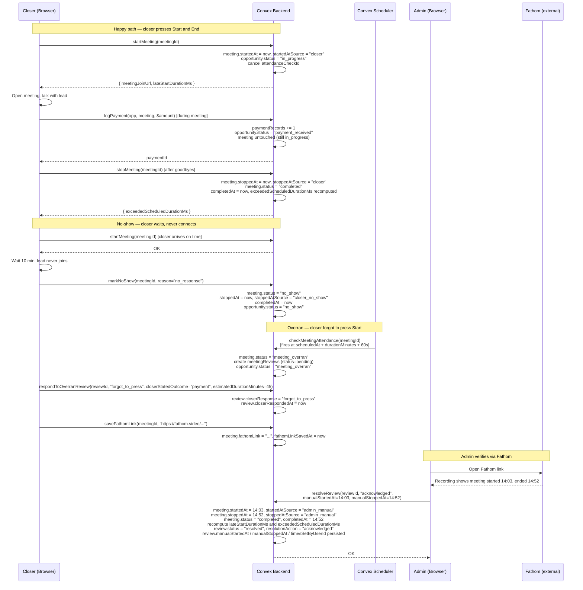
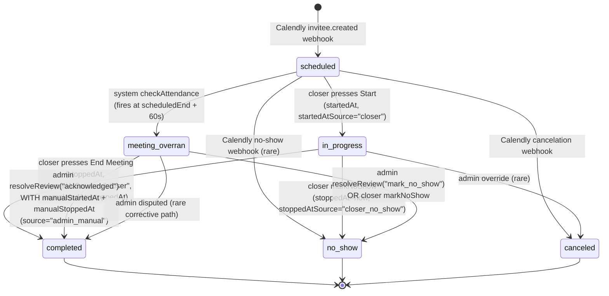

# Meeting Time Tracking Accuracy — Design Specification

**Version:** 0.1 (MVP)
**Status:** Draft
**Scope:** A meeting's `startedAt` and `stoppedAt` (and therefore `completedAt`) are currently either set only by `startMeeting`/`stopMeeting`, set implicitly to "now" during overran-review resolution, or never set at all for legitimate no-shows → every meeting ends with **accurate, attributable start and end timestamps**, sourced either from (a) the closer explicitly pressing Start/End buttons, (b) the closer marking no-show (which legitimately pins both timestamps), or (c) an admin entering actual times during overran-review resolution (verified via Fathom). Outcome action buttons (log payment, mark lost, schedule follow-up) never implicitly end the meeting.
**Prerequisite:** v0.6 time-tracking fields already live on the `meetings` table (`startedAt`, `stoppedAt`, `lateStartDurationMs`, `exceededScheduledDurationMs`, `fathomLink`, `fathomLinkSavedAt`, `overranDetectedAt`, `reviewId`). `stopMeeting` mutation exists on the backend. Overran-meeting review flow (detection cron + `meetingReviews` table + `resolveReview` admin mutation + closer `respondToOverranReview` + admin review UI at `/workspace/reviews/[reviewId]`) is deployed.

---

## Table of Contents

1. [Goals & Non-Goals](#1-goals--non-goals)
2. [Actors & Roles](#2-actors--roles)
3. [End-to-End Flow Overview](#3-end-to-end-flow-overview)
4. [Phase 1: Decouple Outcome Actions + `markNoShow` End-Time Semantics](#4-phase-1-decouple-outcome-actions--marknoshow-end-time-semantics)
5. [Phase 2: Explicit "End Meeting" Closer Button](#5-phase-2-explicit-end-meeting-closer-button)
6. [Phase 3: Admin Manual Time Entry During Overran Review](#6-phase-3-admin-manual-time-entry-during-overran-review)
7. [Phase 4: Dangling In-Progress Safety Net (Optional)](#7-phase-4-dangling-in-progress-safety-net-optional)
8. [Data Model](#8-data-model)
9. [Convex Function Architecture](#9-convex-function-architecture)
10. [Routing & Authorization](#10-routing--authorization)
11. [Security Considerations](#11-security-considerations)
12. [Error Handling & Edge Cases](#12-error-handling--edge-cases)
13. [Open Questions](#13-open-questions)
14. [Dependencies](#14-dependencies)
15. [Applicable Skills](#15-applicable-skills)

---

## 1. Goals & Non-Goals

### Goals

- **Attribute meeting time, always.** Every completed / no-show meeting ends up with both `startedAt` and `stoppedAt` populated, *and* a clear `startedAtSource` / `stoppedAtSource` indicating how each was set (`"closer"`, `"closer_no_show"`, `"admin_manual"`, or `"system"` for future auto-close).
- **Outcome actions never silently end the meeting.** `logPayment`, `markAsLost`, and `createFollowUp` must not set `stoppedAt`, `completedAt`, or transition `meetings.status` → `"completed"`. They only change the opportunity. (Phase 1 confirms the current code already meets this for log-payment and mark-lost — this phase hardens the invariant and adds a backend test.)
- **A dedicated End Meeting button exists on the closer meeting-detail view.** Pressing it calls `stopMeeting`, pins `stoppedAt = now`, transitions the meeting to `"completed"`, and leaves the opportunity status untouched.
- **End Meeting does not lock out outcome actions.** A closer can press End Meeting first and then still record the payment, schedule the follow-up, or mark lost — because these mutations write only to the opportunity, which is still in `"in_progress"` after the meeting is stopped. Outcome buttons only hide once the opportunity itself has transitioned to a terminal state (per existing logic).
- **`markNoShow` is the only outcome mutation allowed to set meeting end time automatically**, and does so explicitly (`stoppedAt = now`, `completedAt = now`, source tagged `"closer_no_show"`), because the closer was physically waiting in the meeting for the full duration.
- **Admins can enter the actual meeting start and end timestamps during overran-review resolution** when the closer forgot to press Start/End, using the Fathom recording as evidence. The manual times drive `startedAt`, `stoppedAt`, `completedAt`, and re-compute `lateStartDurationMs` / `exceededScheduledDurationMs` from the true values.
- **Audit trail is complete.** Every meeting records who set each timestamp and when, exposed on the meeting detail page and in admin review resolution history.

### Non-Goals (deferred)

- **Automated time detection from Calendly / Zoom / Fathom webhooks** (Phase 2+ of a future feature). We're not parsing Fathom timestamps programmatically — admin reads the Fathom recording and types the values in.
- **Retroactive editing of meeting times outside the overran-review flow** (deferred). Once a meeting is `completed` or `no_show` and any review is `resolved`, the times are frozen. If an admin needs to correct a time later, they re-open a dispute (future Phase 5).
- **Auto-closing dangling `in_progress` meetings via cron** (Phase 4, optional below — may ship later).
- **A "pause meeting" mechanic** (not a goal — meetings either progress or are ended).
- **Changing the opportunity-level transition rules** — only meeting-level time tracking semantics change. The opportunity status machine is untouched.

---

## 2. Actors & Roles

| Actor | Identity | Auth Method | Key Permissions |
|---|---|---|---|
| **Closer** | The assigned owner of the opportunity / meeting | WorkOS AuthKit, tenant org member, CRM role `closer` | Press Start Meeting, Press End Meeting (new), Mark No-Show (auto end-time), record outcomes (payment / follow-up / lost), respond to overran reviews |
| **Admin** (tenant_master / tenant_admin) | Owner or admin of the tenant | WorkOS AuthKit, tenant org member, CRM role `tenant_master` or `tenant_admin` | Resolve overran reviews; during resolution, **enter actual `startedAt` / `stoppedAt` manually** when the closer forgot to press Start/End; dispute closer-recorded outcomes; `acknowledged` without time entry (for true-positive late-run cases where the closer did press start) |
| **System** (internal scheduler / cron) | Convex runtime | n/a (internal) | Detect missed starts (`checkMeetingAttendance`), flag meetings as `meeting_overran`, create `meetingReviews` records, emit domain events. Never sets `startedAt`/`stoppedAt` directly — only flags for human attribution. |

### CRM Role ↔ WorkOS Role Mapping

| CRM `users.role` | WorkOS Role Slug | Relevant to this feature |
|---|---|---|
| `tenant_master` | `owner` | Full admin powers; can resolve reviews and set manual times |
| `tenant_admin` | `tenant-admin` | Same as tenant_master for this feature |
| `closer` | `closer` | Press Start/End on own meetings; outcome actions on own opportunities |

---

## 3. End-to-End Flow Overview



---

## 4. Phase 1: Decouple Outcome Actions + `markNoShow` End-Time Semantics

### 4.1 What & Why

The user's concern: "the action buttons mutations probably resolve the end time of the meeting." **A read of the current code confirms this is already false for `logPayment` and `markAsLost`** — neither writes `startedAt`, `stoppedAt`, `completedAt`, or transitions `meetings.status`. Only `opportunities.status` changes. That's correct behaviour and we want to preserve it.

However, three gaps remain:

1. **`markNoShow` does not set `stoppedAt` or `completedAt`.** The meeting transitions to `"no_show"` (a terminal status for the meeting) but the time-tracking columns are left undefined. Per the user's spec, the no-show case is the single legitimate exception where programmatic end-time is accurate, because the closer waited in the Zoom/Meet the whole time. Fix: write `stoppedAt = now`, `completedAt = now`, `stoppedAtSource = "closer_no_show"`.
2. **No explicit invariant / backend test** preventing future regressions where an outcome mutation starts writing `stoppedAt`. We add a contract: "Only `startMeeting`, `stopMeeting`, `markNoShow`, and `resolveReview` (admin manual) may write `meetings.startedAt` / `stoppedAt` / `completedAt`." Enforced by comments + a one-off `scripts/` audit query that flags any future schema drift.
3. **`resolveReview`'s false-positive branch (line 411–415 in `convex/reviews/mutations.ts`)** writes `completedAt = now` without ever writing `startedAt` or a meaningful `stoppedAt`. This is the source of corrupted durations in the overran-acknowledged path. Phase 3 replaces this with admin-supplied manual times.

> **Runtime decision:** All of this is pure mutations (no Node.js APIs needed), so everything stays in `"use node"`-free files. `convex/closer/noShowActions.ts` and `convex/closer/payments.ts` stay where they are; we only patch behaviour, not runtime.
>
> **Schema decision:** We do not need to add `startedAtSource` / `stoppedAtSource` *just* to fix `markNoShow`. But because Phases 2 and 3 both need attribution, we introduce the source fields up front in Phase 1 so all phases share a consistent migration story. See §8.1.
>
> **Why not "let `logPayment` also stop the meeting automatically when meeting.status === in_progress"?** Because the closer may continue the call for several more minutes after pressing Log Payment (customer asks another question, celebration, next-step discussion). Programmatic end-time would falsely truncate this. Only the closer knows when the meeting is truly over — hence the explicit End Meeting button in Phase 2.

### 4.2 `markNoShow` update

```typescript
// Path: convex/closer/noShowActions.ts
export const markNoShow = mutation({
  args: {
    meetingId: v.id("meetings"),
    reason: noShowReasonValidator,
    note: v.optional(v.string()),
  },
  handler: async (ctx, { meetingId, reason, note }) => {
    const { userId, tenantId } = await requireTenantUser(ctx, ["closer"]);

    const meeting = await ctx.db.get(meetingId);
    if (!meeting || meeting.tenantId !== tenantId) {
      throw new Error("Meeting not found");
    }
    if (meeting.status !== "in_progress" && meeting.status !== "meeting_overran") {
      throw new Error(
        `Can only mark no-show on in-progress or meeting-overran meetings (current: "${meeting.status}")`,
      );
    }
    // ... existing opportunity + transition checks ...

    const now = Date.now();
    const normalizedNote = normalizeOptionalString(note);
    const waitDurationMs =
      meeting.startedAt !== undefined
        ? Math.max(0, now - meeting.startedAt)
        : undefined;

    // NEW: pin end-time attribution. The closer waited in the meeting
    // the entire duration, so stoppedAt = now is accurate.
    await ctx.db.patch(meetingId, {
      status: "no_show",
      stoppedAt: now,                        // NEW
      completedAt: now,                      // NEW — terminal end-of-meeting marker
      stoppedAtSource: "closer_no_show",     // NEW — attribution
      // startedAtSource stays whatever it was (typically "closer" if they pressed Start;
      // undefined if Calendly-webhook-driven no-show — that case is handled by
      // pipeline processor, not this mutation).
      noShowMarkedAt: now,
      noShowWaitDurationMs: waitDurationMs,
      noShowReason: reason,
      noShowNote: normalizedNote,
      noShowMarkedByUserId: userId,
      noShowSource: "closer",
    });
    // ... rest unchanged ...
  },
});
```

### 4.3 Contract documentation for outcome mutations

Add a header comment to the three outcome mutations documenting the invariant, so future contributors don't accidentally tack on `stoppedAt`:

```typescript
// Path: convex/closer/payments.ts — top of file
/**
 * OUTCOME MUTATION CONTRACT
 *
 * Outcome mutations (logPayment, markAsLost, createFollowUp) operate on the
 * *opportunity* only. They MUST NOT write to the following meeting fields:
 *   - meetings.startedAt
 *   - meetings.stoppedAt
 *   - meetings.completedAt
 *   - meetings.status (leave as "in_progress" / "meeting_overran" / wherever it was)
 *
 * Rationale: a closer may log a payment mid-call and continue the meeting
 * for several more minutes. Only the closer knows when the meeting
 * truly ends; that's what the explicit End Meeting button is for.
 * The single exception is markNoShow — because the closer was physically
 * waiting for the full duration, stoppedAt = now is a faithful record.
 */
```

(Same comment added to `convex/closer/meetingActions.ts:markAsLost` and `convex/closer/followUpMutations.ts:transitionToFollowUp`.)

### 4.4 Meeting status transitions — unchanged

| From | To | Trigger | Time-tracking side effects |
|---|---|---|---|
| `scheduled` | `in_progress` | `startMeeting` | `startedAt = now`, `startedAtSource = "closer"`, `lateStartDurationMs` computed |
| `scheduled` | `meeting_overran` | System `checkMeetingAttendance` | `overranDetectedAt = now`; **no `startedAt` set** |
| `in_progress` | `completed` | `stopMeeting` (Phase 2 UI button) | `stoppedAt = now`, `stoppedAtSource = "closer"`, `completedAt = now`, `exceededScheduledDurationMs` computed |
| `in_progress` | `no_show` | `markNoShow` | `stoppedAt = now`, `stoppedAtSource = "closer_no_show"`, `completedAt = now`, `noShowMarkedAt = now` |
| `meeting_overran` | `no_show` | `markNoShow` (from overran) | same as above, plus review stays pending for admin |
| `meeting_overran` | `completed` | Admin `resolveReview` w/ `acknowledged` | **Phase 3:** `startedAt`, `stoppedAt`, `completedAt` driven by admin-entered times; `startedAtSource = stoppedAtSource = "admin_manual"` |

---

## 5. Phase 2: Explicit "End Meeting" Closer Button

### 5.1 What & Why

The backend mutation `stopMeeting` already exists and is correct — it transitions the meeting to `completed`, pins `stoppedAt = now`, sets `completedAt = now`, computes `exceededScheduledDurationMs`, emits a `meeting.stopped` domain event, and **does not touch the opportunity**. It just isn't exposed anywhere in the UI. This phase wires up the button.

Design requirements (from the user's spec):

- Visible **only** when `meeting.status === "in_progress"`. Hidden when `scheduled` (closer should press Start first), hidden when already `completed` / `no_show` / `meeting_overran`.
- **Does not disable or hide** outcome action buttons (`Log Payment`, `Mark Lost`, `Schedule Follow-Up`) on press. Those buttons continue to be controlled by the *opportunity* status, not the meeting status.
- If the opportunity is already in a terminal state (because the closer pressed Log Payment / Mark Lost / Schedule Follow-Up *before* End Meeting), the End Meeting button is **still visible** and still works — stopping a meeting whose opportunity is `payment_received` is valid.
- If an outcome has been recorded and the closer then hits End Meeting, the outcome buttons (which were hidden by the existing opportunity-status logic in `OutcomeActionBar`) remain hidden — we don't re-show them.
- Confirmation toast: `"Meeting ended — ran X min over schedule"` if `exceededScheduledDurationMs > 0`, else `"Meeting ended"`.

> **UI decision:** Place the End Meeting button at the **top of `OutcomeActionBar`**, above the outcome row, visually separated. Use `variant="outline"` with a `Square` lucide icon, not `destructive` — it's a neutral end-of-call action. This matches the pattern of `Start Meeting` which uses `variant="default"` with a `Play` icon.
>
> **State decision:** Whether to show End Meeting is computed purely from `meeting.status`. Whether to show outcome buttons is computed purely from `opportunity.status`. This decoupling is the entire point — the two can be in independent states.
>
> **Why not a confirmation dialog?** The action is reversible only by admin dispute (a heavy action), but the "cost of wrong click" is low: the closer loses 2 minutes of wall-clock attribution on the meeting, which admin can correct via the manual time entry in Phase 3. A confirmation dialog would add friction to every meeting end, which is the common path. We skip the dialog and rely on the toast for feedback.

### 5.2 Mutation wiring (backend already exists)

```typescript
// Path: convex/closer/meetingActions.ts — already exists, adding source attribution
export const stopMeeting = mutation({
  args: { meetingId: v.id("meetings") },
  handler: async (ctx, { meetingId }) => {
    const { userId, tenantId, role } = await requireTenantUser(ctx, [
      "closer",
      "tenant_master",
      "tenant_admin",
    ]);
    const { meeting, opportunity } = await loadMeetingContext(ctx, meetingId, tenantId);

    if (role === "closer" && opportunity.assignedCloserId !== userId) {
      throw new Error("Not your meeting");
    }
    if (meeting.status !== "in_progress") {
      throw new Error(`Cannot stop a meeting with status "${meeting.status}"`);
    }

    const now = Date.now();
    const scheduledEndMs = meeting.scheduledAt + meeting.durationMinutes * 60_000;
    const exceededScheduledDurationMs = Math.max(0, now - scheduledEndMs);

    await ctx.db.patch(meetingId, {
      status: "completed",
      stoppedAt: now,
      stoppedAtSource: "closer",             // NEW — attribution
      completedAt: now,
      exceededScheduledDurationMs,
    });
    // ... existing aggregate + event emit logic ...
    return { exceededScheduledDurationMs, exceededScheduledDuration: exceededScheduledDurationMs > 0 };
  },
});
```

### 5.3 UI — new `EndMeetingButton` component

```tsx
// Path: app/workspace/closer/meetings/[meetingId]/_components/end-meeting-button.tsx
"use client";

import { useMutation } from "convex/react";
import { Square } from "lucide-react";
import { toast } from "sonner";
import { useState } from "react";
import { api } from "@/convex/_generated/api";
import type { Id } from "@/convex/_generated/dataModel";
import { Button } from "@/components/ui/button";

type EndMeetingButtonProps = {
  meetingId: Id<"meetings">;
  meetingStatus: string;                     // from parent useQuery
};

export function EndMeetingButton({ meetingId, meetingStatus }: EndMeetingButtonProps) {
  const stopMeeting = useMutation(api.closer.meetingActions.stopMeeting);
  const [isStopping, setIsStopping] = useState(false);

  // Only surface when the meeting is actively in progress.
  if (meetingStatus !== "in_progress") return null;

  const handleClick = async () => {
    setIsStopping(true);
    try {
      const { exceededScheduledDuration, exceededScheduledDurationMs } =
        await stopMeeting({ meetingId });
      if (exceededScheduledDuration) {
        const minutesOver = Math.round(exceededScheduledDurationMs / 60_000);
        toast.success(`Meeting ended — ran ${minutesOver} min over schedule`);
      } else {
        toast.success("Meeting ended");
      }
    } catch (err) {
      toast.error(err instanceof Error ? err.message : "Could not end meeting");
    } finally {
      setIsStopping(false);
    }
  };

  return (
    <Button
      variant="outline"
      size="sm"
      onClick={handleClick}
      disabled={isStopping}
      aria-label="End meeting"
    >
      <Square className="h-4 w-4" aria-hidden />
      {isStopping ? "Ending…" : "End Meeting"}
    </Button>
  );
}
```

### 5.4 Integration into `OutcomeActionBar`

```tsx
// Path: app/workspace/closer/meetings/[meetingId]/_components/outcome-action-bar.tsx
// (existing file — adding EndMeetingButton row above the outcome row)
<div className="flex flex-col gap-3">
  {/* NEW row: meeting lifecycle controls (Start / End) */}
  <div className="flex items-center gap-2">
    {meeting.status === "scheduled" && (
      <StartMeetingButton meetingId={meeting._id} /* existing */ />
    )}
    {meeting.status === "in_progress" && (
      <EndMeetingButton
        meetingId={meeting._id}
        meetingStatus={meeting.status}
      />
    )}
  </div>

  {/* Existing row: opportunity outcome actions.
      Logic unchanged — these are still gated on opportunity.status,
      not meeting.status. */}
  <div className="flex flex-wrap items-center gap-2">
    {canShowLogPayment && <LogPaymentButton .../>}
    {canShowFollowUp && <ScheduleFollowUpButton .../>}
    {canShowMarkLost && <MarkLostButton .../>}
    {canShowNoShow && <MarkNoShowButton .../>}
  </div>
</div>
```

**Key invariant encoded in this layout:** the two rows are independent. End Meeting lives in the lifecycle row. Outcomes live in the outcome row. The closer can press any button in any order; the backend enforces the meaning.

### 5.5 Interaction matrix — button visibility after each action

| Current `meeting.status` | Current `opportunity.status` | Start visible? | End Meeting visible? | Outcome row visible? |
|---|---|---|---|---|
| `scheduled` | `scheduled` | Yes (within window) | No | No |
| `in_progress` | `in_progress` | No | **Yes** | Yes (Log Payment, Follow-Up, Mark Lost, No-Show) |
| `in_progress` | `payment_received` | No | **Yes** | No (terminal) |
| `in_progress` | `lost` | No | **Yes** | No (terminal) |
| `in_progress` | `follow_up_scheduled` | No | **Yes** | No (terminal for this meeting) |
| `completed` | any | No | No | Driven by opportunity.status |
| `no_show` | `no_show` | No | No (already ended by markNoShow) | No |
| `meeting_overran` | `meeting_overran` | No | No (backend rejects stopMeeting on overran) | Yes (overran-pending buttons) |

> **Edge case: closer logs payment first, then presses End Meeting.** Both actions succeed. Meeting ends at the true "End Meeting" click time, not the payment time. `exceededScheduledDurationMs` reflects the true duration.
>
> **Edge case: closer presses End Meeting first, then wants to log payment.** Both actions succeed. Meeting was stopped at the explicit moment; opportunity is still `in_progress` because `stopMeeting` never touches opportunity.status. Log Payment transitions opportunity → `payment_received`. Correct.

---

## 6. Phase 3: Admin Manual Time Entry During Overran Review

### 6.1 What & Why

When a meeting is flagged as `meeting_overran` because the closer forgot to press Start (or Start + End), the closer responds via `respondToOverranReview(closerResponse: "forgot_to_press", closerStatedOutcome: ..., estimatedMeetingDurationMinutes?: ...)`. That populates the review with the closer's self-report and their estimate of how long the meeting ran, but **does not actually set `meetings.startedAt` or `meetings.stoppedAt`**.

The admin then opens the review, checks the Fathom recording (admin reads the transcript / scrubs the video), and records what actually happened. Today, pressing **Acknowledge** on a `forgot_to_press` review sets `meeting.status = "completed"` and `completedAt = now` — but that `now` is the moment the admin clicked the button, which could be hours or days after the actual meeting. This is the concrete gap the user is describing.

**Fix:** Extend `resolveReview` to accept optional `manualStartedAt` and `manualStoppedAt` numeric args (Unix ms). When provided (and only the `acknowledged` action is valid for time entry), they become the authoritative timestamps on the meeting.

> **UX decision — required vs. optional times:** Manual times are **required** when `resolutionAction === "acknowledged"` **and** the closer's response was `"forgot_to_press"`. If the closer's response was `"did_not_attend"`, acknowledging resolves the review without time entry (the meeting stays in `meeting_overran` and would separately be marked `no_show` via `mark_no_show` or `disputed`). If there is no closer response yet, admin is blocked on the time-entry form for `acknowledged` and must use `disputed` / `mark_no_show` / `mark_lost` / `schedule_follow_up` instead.
>
> **UX decision — form surface:** A Sheet drawer (not a Dialog) with two `<Input type="datetime-local">` fields, defaulted to the meeting's `scheduledAt` for `startedAt` and `scheduledAt + durationMinutes` for `stoppedAt`. Admin edits both to the values observed in Fathom. Form uses React Hook Form + Zod per repo convention (`standardSchemaResolver`, see `AGENTS.md > Form Patterns`).
>
> **Validation rules:**
> 1. `manualStartedAt < manualStoppedAt` (strict).
> 2. `manualStartedAt >= meeting.scheduledAt - 60 min` (no start before a reasonable window).
> 3. `manualStoppedAt <= Date.now()` (no future end time).
> 4. `manualStoppedAt - manualStartedAt <= 8 hours` (sanity ceiling — no accidental "all day" entries).
> 5. Both timestamps are numbers in Unix ms (serialization via `.valueOf()` on the `Date` object).
>
> **Why not allow setting only one of the two?** Because the downstream computations (`lateStartDurationMs = max(0, startedAt - scheduledAt)` and `exceededScheduledDurationMs = max(0, stoppedAt - scheduledEndMs)`) only make sense with both. Partial data would silently yield misleading metrics. Force the full pair.
>
> **Why not persist an edit history?** The `meetingReviews` record already carries `resolvedByUserId`, `resolvedAt`, and (new) `manualStartedAt`, `manualStoppedAt`. We also emit a domain event with the before/after timestamps. That's sufficient forensic detail for the MVP. A full `meetingTimeEdits` audit table is a Non-Goal for v0.1.

### 6.2 Backend — `resolveReview` extension

```typescript
// Path: convex/reviews/mutations.ts (extending existing mutation)
export const resolveReview = mutation({
  args: {
    reviewId: v.id("meetingReviews"),
    resolutionAction: v.union(
      v.literal("log_payment"),
      v.literal("schedule_follow_up"),
      v.literal("mark_no_show"),
      v.literal("mark_lost"),
      v.literal("acknowledged"),
      v.literal("disputed"),
    ),
    resolutionNote: v.optional(v.string()),
    paymentData: v.optional(/* existing */),
    lostReason: v.optional(v.string()),
    noShowReason: v.optional(/* existing */),

    // NEW — admin-entered actual times (required when action === "acknowledged"
    // and the closer responded "forgot_to_press").
    manualStartedAt: v.optional(v.number()),
    manualStoppedAt: v.optional(v.number()),
  },
  handler: async (ctx, args) => {
    const { userId, tenantId } = await requireTenantUser(ctx, [
      "tenant_master",
      "tenant_admin",
    ]);

    const review = await ctx.db.get(args.reviewId);
    // ... existing checks ...
    const meeting = await ctx.db.get(review.meetingId);
    // ... existing checks ...

    const isAcknowledged = args.resolutionAction === "acknowledged";
    const closerForgot = review.closerResponse === "forgot_to_press";
    const hasManualTimes =
      args.manualStartedAt !== undefined && args.manualStoppedAt !== undefined;

    // Enforce the contract.
    if (isAcknowledged && closerForgot && !hasManualTimes) {
      throw new Error(
        "Manual start and end times are required when acknowledging a 'forgot_to_press' review. Verify actual times in the Fathom recording.",
      );
    }
    if (hasManualTimes && !isAcknowledged) {
      throw new Error(
        "Manual times can only be supplied with the 'acknowledged' resolution action.",
      );
    }
    if (hasManualTimes) {
      validateManualTimes({
        scheduledAt: meeting.scheduledAt,
        manualStartedAt: args.manualStartedAt!,
        manualStoppedAt: args.manualStoppedAt!,
        now: Date.now(),
      });
    }

    // ... existing branch logic for "disputed", outcome overrides, etc. ...

    if (args.resolutionAction === "acknowledged") {
      const now = Date.now();
      const reviewPatch: Partial<Doc<"meetingReviews">> = {
        status: "resolved",
        resolvedAt: now,
        resolvedByUserId: userId,
        resolutionAction: "acknowledged",
      };
      if (args.resolutionNote) reviewPatch.resolutionNote = args.resolutionNote.trim();

      if (hasManualTimes) {
        const startedAt = args.manualStartedAt!;
        const stoppedAt = args.manualStoppedAt!;
        const scheduledEndMs =
          meeting.scheduledAt + meeting.durationMinutes * 60_000;
        const lateStartDurationMs = Math.max(0, startedAt - meeting.scheduledAt);
        const exceededScheduledDurationMs = Math.max(0, stoppedAt - scheduledEndMs);

        if (!validateMeetingTransition(meeting.status, "completed")) {
          throw new Error(
            `Cannot transition meeting from "${meeting.status}" to "completed"`,
          );
        }

        await ctx.db.patch(review.meetingId, {
          status: "completed",
          startedAt,
          startedAtSource: "admin_manual",      // NEW
          stoppedAt,
          stoppedAtSource: "admin_manual",      // NEW
          completedAt: stoppedAt,               // pin to the actual end, not now
          lateStartDurationMs,
          exceededScheduledDurationMs,
        });
        await replaceMeetingAggregate(ctx, meeting, review.meetingId);

        // Audit fields on the review record.
        reviewPatch.manualStartedAt = startedAt;
        reviewPatch.manualStoppedAt = stoppedAt;
        reviewPatch.timesSetByUserId = userId;
        reviewPatch.timesSetAt = now;

        // Emit a dedicated event so the pipeline / reporting sees the correction.
        await emitDomainEvent(ctx, {
          tenantId,
          entityType: "meeting",
          entityId: review.meetingId,
          eventType: "meeting.times_manually_set",
          source: "admin",
          actorUserId: userId,
          occurredAt: now,
          metadata: {
            reviewId: args.reviewId,
            startedAt,
            stoppedAt,
            lateStartDurationMs,
            exceededScheduledDurationMs,
            previousMeetingStatus: meeting.status,
          },
        });
      }

      await ctx.db.patch(args.reviewId, reviewPatch);

      await emitDomainEvent(ctx, {
        tenantId,
        entityType: "meeting",
        entityId: review.meetingId,
        eventType: "meeting.overran_review_resolved",
        source: "admin",
        actorUserId: userId,
        occurredAt: now,
        metadata: {
          reviewId: args.reviewId,
          resolutionAction: "acknowledged",
          closerResponse: review.closerResponse,
          manualTimesApplied: hasManualTimes,
        },
      });
      return;
    }

    // ... rest of existing branches (disputed / log_payment / etc.) unchanged ...
  },
});
```

**Helper:**

```typescript
// Path: convex/lib/manualMeetingTimes.ts — NEW
import type { Doc } from "../_generated/dataModel";

export const MAX_MEETING_DURATION_MS = 8 * 60 * 60 * 1000;  // 8 hours
export const MIN_START_BEFORE_SCHEDULED_MS = 60 * 60 * 1000; // 60 min

export function validateManualTimes(params: {
  scheduledAt: number;
  manualStartedAt: number;
  manualStoppedAt: number;
  now: number;
}): void {
  const { scheduledAt, manualStartedAt, manualStoppedAt, now } = params;

  if (manualStartedAt >= manualStoppedAt) {
    throw new Error("Start time must be before end time.");
  }
  if (manualStartedAt < scheduledAt - MIN_START_BEFORE_SCHEDULED_MS) {
    throw new Error(
      "Start time cannot be more than 60 minutes before the scheduled time.",
    );
  }
  if (manualStoppedAt > now) {
    throw new Error("End time cannot be in the future.");
  }
  if (manualStoppedAt - manualStartedAt > MAX_MEETING_DURATION_MS) {
    throw new Error("Meeting duration cannot exceed 8 hours.");
  }
}
```

### 6.3 Admin UI — Review Resolution Sheet extension

Current location: `app/workspace/reviews/[reviewId]/_components/review-resolution-dialog.tsx` (a shadcn Dialog). We change to a Sheet for the manual-times flow (more vertical space, feels like a record-correction affordance). Keep the Dialog for other resolution actions.

```tsx
// Path: app/workspace/reviews/[reviewId]/_components/acknowledge-with-times-sheet.tsx
"use client";

import { useForm } from "react-hook-form";
import { standardSchemaResolver } from "@hookform/resolvers/standard-schema";
import { z } from "zod";
import { useMutation } from "convex/react";
import { toast } from "sonner";
import { api } from "@/convex/_generated/api";
import type { Id } from "@/convex/_generated/dataModel";
import { Sheet, SheetContent, SheetFooter, SheetHeader, SheetTitle, SheetDescription } from "@/components/ui/sheet";
import { Button } from "@/components/ui/button";
import { Form, FormControl, FormField, FormItem, FormLabel, FormMessage } from "@/components/ui/form";
import { Input } from "@/components/ui/input";
import { Textarea } from "@/components/ui/textarea";

type AcknowledgeWithTimesSheetProps = {
  open: boolean;
  onOpenChange: (open: boolean) => void;
  reviewId: Id<"meetingReviews">;
  meetingId: Id<"meetings">;
  scheduledAt: number;              // Unix ms
  durationMinutes: number;
  fathomLink?: string;
};

const MAX_DURATION_MS = 8 * 60 * 60 * 1000;

// dt-local string → Unix ms
function parseLocalDateTime(value: string): number {
  return new Date(value).valueOf();
}
// Unix ms → dt-local string (no TZ suffix)
function formatForInput(ms: number): string {
  const d = new Date(ms);
  const pad = (n: number) => String(n).padStart(2, "0");
  return `${d.getFullYear()}-${pad(d.getMonth() + 1)}-${pad(d.getDate())}T${pad(d.getHours())}:${pad(d.getMinutes())}`;
}

const acknowledgeSchema = z
  .object({
    startedAt: z.string().min(1, "Required"),
    stoppedAt: z.string().min(1, "Required"),
    note: z.string().optional(),
  })
  .superRefine((values, ctx) => {
    const start = parseLocalDateTime(values.startedAt);
    const end = parseLocalDateTime(values.stoppedAt);
    if (Number.isNaN(start) || Number.isNaN(end)) return;
    if (start >= end) {
      ctx.addIssue({
        code: "custom",
        path: ["stoppedAt"],
        message: "End time must be after start time.",
      });
    }
    if (end - start > MAX_DURATION_MS) {
      ctx.addIssue({
        code: "custom",
        path: ["stoppedAt"],
        message: "Duration cannot exceed 8 hours.",
      });
    }
  });

type AcknowledgeValues = z.infer<typeof acknowledgeSchema>;

export function AcknowledgeWithTimesSheet({
  open, onOpenChange, reviewId, meetingId, scheduledAt, durationMinutes, fathomLink,
}: AcknowledgeWithTimesSheetProps) {
  const resolveReview = useMutation(api.reviews.mutations.resolveReview);
  const form = useForm({
    resolver: standardSchemaResolver(acknowledgeSchema),
    defaultValues: {
      startedAt: formatForInput(scheduledAt),
      stoppedAt: formatForInput(scheduledAt + durationMinutes * 60_000),
      note: "",
    },
  });

  const onSubmit = async (values: AcknowledgeValues) => {
    try {
      await resolveReview({
        reviewId,
        resolutionAction: "acknowledged",
        manualStartedAt: parseLocalDateTime(values.startedAt),
        manualStoppedAt: parseLocalDateTime(values.stoppedAt),
        resolutionNote: values.note?.trim() || undefined,
      });
      toast.success("Meeting times recorded and review acknowledged.");
      onOpenChange(false);
    } catch (err) {
      toast.error(err instanceof Error ? err.message : "Could not save times");
    }
  };

  return (
    <Sheet open={open} onOpenChange={onOpenChange}>
      <SheetContent side="right" className="w-[480px] sm:max-w-[520px]">
        <SheetHeader>
          <SheetTitle>Acknowledge with actual times</SheetTitle>
          <SheetDescription>
            Verify the true meeting times from the Fathom recording and enter them below.
            These become the authoritative start / end on the meeting record.
          </SheetDescription>
        </SheetHeader>

        {fathomLink && (
          <a
            href={fathomLink}
            target="_blank"
            rel="noopener noreferrer"
            className="mt-4 text-sm underline underline-offset-2"
          >
            Open Fathom recording →
          </a>
        )}

        <Form {...form}>
          <form onSubmit={form.handleSubmit(onSubmit)} className="mt-6 space-y-4">
            <FormField
              control={form.control}
              name="startedAt"
              render={({ field }) => (
                <FormItem>
                  <FormLabel>Meeting started at</FormLabel>
                  <FormControl>
                    <Input type="datetime-local" {...field} />
                  </FormControl>
                  <FormMessage />
                </FormItem>
              )}
            />
            <FormField
              control={form.control}
              name="stoppedAt"
              render={({ field }) => (
                <FormItem>
                  <FormLabel>Meeting ended at</FormLabel>
                  <FormControl>
                    <Input type="datetime-local" {...field} />
                  </FormControl>
                  <FormMessage />
                </FormItem>
              )}
            />
            <FormField
              control={form.control}
              name="note"
              render={({ field }) => (
                <FormItem>
                  <FormLabel>Resolution note (optional)</FormLabel>
                  <FormControl>
                    <Textarea {...field} placeholder="e.g., Verified via Fathom — closer forgot to press Start but meeting was clearly legitimate." />
                  </FormControl>
                  <FormMessage />
                </FormItem>
              )}
            />

            <SheetFooter className="pt-4">
              <Button type="button" variant="ghost" onClick={() => onOpenChange(false)}>
                Cancel
              </Button>
              <Button type="submit" disabled={form.formState.isSubmitting}>
                {form.formState.isSubmitting ? "Saving…" : "Acknowledge with times"}
              </Button>
            </SheetFooter>
          </form>
        </Form>
      </SheetContent>
    </Sheet>
  );
}
```

### 6.4 Wiring into existing review detail page

```tsx
// Path: app/workspace/reviews/[reviewId]/_components/review-resolution-bar.tsx
// (existing file — splitting the "Acknowledge" button behaviour)
const acknowledgedNeedsTimes = review.closerResponse === "forgot_to_press";

<Button
  variant="default"
  onClick={() => {
    if (acknowledgedNeedsTimes) {
      setAckSheetOpen(true);              // NEW path — opens AcknowledgeWithTimesSheet
    } else {
      setAckDialogOpen(true);             // Existing path — simple confirm dialog
    }
  }}
>
  Acknowledge
</Button>

{acknowledgedNeedsTimes && (
  <AcknowledgeWithTimesSheet
    open={ackSheetOpen}
    onOpenChange={setAckSheetOpen}
    reviewId={review._id}
    meetingId={review.meetingId}
    scheduledAt={meeting.scheduledAt}
    durationMinutes={meeting.durationMinutes}
    fathomLink={meeting.fathomLink}
  />
)}
```

### 6.5 Review detail page — show the manual times once set

```tsx
// Path: app/workspace/reviews/[reviewId]/_components/review-detail-page-client.tsx
// (existing file — new card)
{review.status === "resolved" && review.manualStartedAt && review.manualStoppedAt && (
  <Card>
    <CardHeader>
      <CardTitle>Admin-entered meeting times</CardTitle>
      <CardDescription>
        Set by {resolverName ?? "admin"} on {format(review.timesSetAt ?? review.resolvedAt, "PPpp")}
      </CardDescription>
    </CardHeader>
    <CardContent className="space-y-1 text-sm">
      <div>Started: {format(review.manualStartedAt, "PPpp")}</div>
      <div>Ended: {format(review.manualStoppedAt, "PPpp")}</div>
      <div>Duration: {Math.round((review.manualStoppedAt - review.manualStartedAt) / 60_000)} min</div>
    </CardContent>
  </Card>
)}
```

---

## 7. Phase 4: Dangling In-Progress Safety Net (Optional)

### 7.1 What & Why

A meeting can enter `in_progress` (closer pressed Start) and stay there forever if the closer never presses End Meeting and never marks no-show. The existing `meetingOverrunSweep` cron only flags meetings that are still `scheduled` past their end window — it doesn't touch `in_progress`.

This phase is **optional and deferred**. We flag it here because it's a foreseeable edge case; whether to implement in v0.1 or defer to Phase 5 is Open Question #3.

Proposed behaviour (if implemented):

- A cron runs every 30 min across active tenants.
- For each `in_progress` meeting where `now - scheduledEndMs > 6 hours`: flag for admin attention (e.g., create a `meetingReviews` record with `category: "dangling_in_progress"`) rather than auto-closing. This preserves the invariant that `stoppedAt` is always human-attributed.

> **Runtime decision:** If shipped, this would live in a new file `convex/closer/danglingMeetingSweep.ts` following the same pattern as `meetingOverrunSweep.ts`. It would be purely an `internalMutation` + cron entry, no new Node deps.

---

## 8. Data Model

### 8.1 Modified: `meetings` Table

Add two attribution fields and make them self-documenting.

```typescript
// Path: convex/schema.ts
meetings: defineTable({
  // ... existing fields ...

  // Existing time-tracking fields (unchanged):
  startedAt: v.optional(v.number()),           // Unix ms
  stoppedAt: v.optional(v.number()),           // Unix ms
  completedAt: v.optional(v.number()),         // Unix ms — typically == stoppedAt
  lateStartDurationMs: v.optional(v.number()),
  exceededScheduledDurationMs: v.optional(v.number()),

  // NEW: attribution for each timestamp. "Who / what set this value?"
  //   - "closer"           → closer pressed Start (or End) button
  //   - "closer_no_show"   → closer marked no-show; stoppedAt pinned automatically
  //   - "admin_manual"     → admin entered actual times during overran review
  //   - "system"           → (reserved) future auto-close cron
  startedAtSource: v.optional(
    v.union(
      v.literal("closer"),
      v.literal("admin_manual"),
    ),
  ),
  stoppedAtSource: v.optional(
    v.union(
      v.literal("closer"),
      v.literal("closer_no_show"),
      v.literal("admin_manual"),
      v.literal("system"),
    ),
  ),

  // ... existing fields ...
})
  // ... existing indexes unchanged ...
```

> **Why two separate source fields and not one?** Because the two timestamps can come from different sources — e.g., the closer pressed Start (source=`"closer"`) but forgot to press End, and the admin manually set only `stoppedAt` during review (stoppedAtSource=`"admin_manual"`). (In Phase 3 MVP we require both to be set together, but the schema leaves room for future single-side edits.)
>
> **Migration strategy:** Both fields are optional, so no backfill is required — existing meetings keep null sources. The `meeting-time-tracking-accuracy` phase plans should include a Convex schema push (uses `convex-migration-helper` only if validator types tighten). Since we're *adding* optional fields, a plain `npx convex deploy` is sufficient.

### 8.2 Modified: `meetingReviews` Table

Add audit columns for admin-entered times.

```typescript
// Path: convex/schema.ts
meetingReviews: defineTable({
  // ... existing fields ...

  // Existing closer-response fields:
  closerResponse: v.optional(
    v.union(v.literal("forgot_to_press"), v.literal("did_not_attend")),
  ),
  closerNote: v.optional(v.string()),
  closerStatedOutcome: v.optional(/* existing */),
  estimatedMeetingDurationMinutes: v.optional(v.number()),
  closerRespondedAt: v.optional(v.number()),

  // Existing resolution fields:
  status: v.union(v.literal("pending"), v.literal("resolved")),
  resolutionAction: v.optional(/* existing union */),
  resolutionNote: v.optional(v.string()),
  resolvedAt: v.optional(v.number()),
  resolvedByUserId: v.optional(v.id("users")),

  // NEW: admin-entered actual meeting times (only populated when
  // resolutionAction === "acknowledged" and closerResponse === "forgot_to_press").
  manualStartedAt: v.optional(v.number()),      // Unix ms
  manualStoppedAt: v.optional(v.number()),      // Unix ms
  timesSetByUserId: v.optional(v.id("users")),  // typically == resolvedByUserId; split for forward-compat
  timesSetAt: v.optional(v.number()),           // typically == resolvedAt

  // ... existing fields ...
})
  // ... existing indexes unchanged ...
```

### 8.3 Meeting Status State Machine (Mermaid)



### 8.4 Field-by-field reference after this feature ships

| Field | When set | By | Mutable? |
|---|---|---|---|
| `scheduledAt` | At insert (Calendly webhook) | System | No |
| `startedAt` | `startMeeting` OR admin manual (resolveReview) | Closer or admin | No after completed |
| `stoppedAt` | `stopMeeting`, `markNoShow`, OR admin manual (resolveReview) | Closer or admin | No after completed |
| `completedAt` | Same trigger as `stoppedAt` | Same as `stoppedAt` | No after completed |
| `startedAtSource` | Whenever `startedAt` is written | Inferred from mutation | No |
| `stoppedAtSource` | Whenever `stoppedAt` is written | Inferred from mutation | No |
| `lateStartDurationMs` | Derived at write time | Mutation | Recomputed by admin manual |
| `exceededScheduledDurationMs` | Derived at write time | Mutation | Recomputed by admin manual |
| `overranDetectedAt` | Set by `checkMeetingAttendance` | System | No |

---

## 9. Convex Function Architecture

```
convex/
├── closer/
│   ├── meetingActions.ts          # MODIFIED: stopMeeting sets stoppedAtSource — Phase 2
│   │                              # MODIFIED: startMeeting sets startedAtSource — Phase 2
│   │                              # MODIFIED: contract header comment — Phase 1
│   ├── noShowActions.ts           # MODIFIED: markNoShow sets stoppedAt / stoppedAtSource / completedAt — Phase 1
│   ├── payments.ts                # MODIFIED: add contract header comment — Phase 1
│   ├── followUp.ts                # (unchanged — already compliant)
│   ├── followUpMutations.ts       # MODIFIED: add contract header comment — Phase 1
│   └── meetingOverrun.ts          # (unchanged — review creation logic already correct)
├── reviews/
│   └── mutations.ts               # MODIFIED: resolveReview accepts manualStartedAt / manualStoppedAt — Phase 3
├── lib/
│   ├── manualMeetingTimes.ts      # NEW: validateManualTimes helper — Phase 3
│   ├── statusTransitions.ts       # (unchanged)
│   ├── overranReviewGuards.ts     # (unchanged)
│   └── attendanceChecks.ts        # (unchanged)
├── schema.ts                      # MODIFIED: meetings.startedAtSource, meetings.stoppedAtSource,
│                                  #           meetingReviews.manualStartedAt, meetingReviews.manualStoppedAt,
│                                  #           meetingReviews.timesSetByUserId, meetingReviews.timesSetAt — Phase 1
└── crons.ts                       # (optional Phase 4) dangling meeting sweep
```

**Full list of new / modified functions:**

| File | Change | Phase |
|---|---|---|
| `convex/schema.ts` | Add 2 fields on `meetings`, 4 fields on `meetingReviews` | 1 |
| `convex/closer/noShowActions.ts` | Set `stoppedAt`, `stoppedAtSource`, `completedAt` inside `markNoShow` | 1 |
| `convex/closer/meetingActions.ts` | Set `startedAtSource` in `startMeeting`; set `stoppedAtSource` in `stopMeeting`; add contract header comment | 1, 2 |
| `convex/closer/payments.ts` | Add contract header comment (no behaviour change) | 1 |
| `convex/closer/followUpMutations.ts` | Add contract header comment (no behaviour change) | 1 |
| `convex/lib/manualMeetingTimes.ts` (NEW) | `validateManualTimes` helper + constants | 3 |
| `convex/reviews/mutations.ts` | Accept `manualStartedAt`, `manualStoppedAt`; validate; patch meeting; emit `meeting.times_manually_set` | 3 |

---

## 10. Routing & Authorization

### 10.1 Route Structure (no new routes)

```
app/
└── workspace/
    ├── closer/
    │   └── meetings/
    │       └── [meetingId]/
    │           ├── page.tsx                            # (unchanged RSC wrapper)
    │           └── _components/
    │               ├── end-meeting-button.tsx          # NEW — Phase 2
    │               ├── outcome-action-bar.tsx          # MODIFIED — Phase 2 (wire EndMeetingButton)
    │               └── meeting-detail-page-client.tsx  # (unchanged)
    └── reviews/
        └── [reviewId]/
            ├── page.tsx                                # (unchanged RSC wrapper)
            └── _components/
                ├── acknowledge-with-times-sheet.tsx    # NEW — Phase 3
                ├── review-resolution-bar.tsx           # MODIFIED — Phase 3 (conditional Sheet vs. Dialog)
                └── review-detail-page-client.tsx       # MODIFIED — Phase 3 (show manual-times card)
```

### 10.2 Authorization

All auth is already in place — this feature adds no new roles or permissions. Relevant checks:

```typescript
// Path: convex/closer/meetingActions.ts — stopMeeting
// Closers can stop only their own meetings.
// Admins can stop any meeting (for corrective flows).
const { userId, tenantId, role } = await requireTenantUser(ctx, [
  "closer",
  "tenant_master",
  "tenant_admin",
]);
if (role === "closer" && opportunity.assignedCloserId !== userId) {
  throw new Error("Not your meeting");
}
```

```typescript
// Path: convex/reviews/mutations.ts — resolveReview
// Admin-only mutation. The manual-times branch inherits this check.
const { userId, tenantId } = await requireTenantUser(ctx, [
  "tenant_master",
  "tenant_admin",
]);
```

On the frontend:

```typescript
// Path: app/workspace/closer/meetings/[meetingId]/_components/outcome-action-bar.tsx
// End Meeting button visibility is a UI-only filter; backend re-enforces.
if (meeting.status === "in_progress") {
  /* render EndMeetingButton */
}
```

```typescript
// Path: app/workspace/reviews/[reviewId]/_components/review-resolution-bar.tsx
// Admin route already gated by requireRole(["tenant_master", "tenant_admin"]).
// Sheet opens only for the "forgot_to_press" acknowledge path.
```

---

## 11. Security Considerations

### 11.1 Credential Security

Nothing new. No tokens, keys, or secrets are introduced by this feature. Fathom links are user-provided URLs stored as opaque strings.

### 11.2 Multi-Tenant Isolation

Every new code path inherits the existing `requireTenantUser` guard:

- `stopMeeting`, `markNoShow`, `resolveReview` all call `requireTenantUser`, which validates `meeting.tenantId === ctx.auth identity tenantId` (via `loadMeetingContext`).
- The manual-times branch of `resolveReview` re-fetches the meeting from `ctx.db.get(review.meetingId)` and re-checks `meeting.tenantId === tenantId`. A malicious admin in tenant A cannot pass a `reviewId` that belongs to tenant B's meeting — the guard throws before writing.

### 11.3 Role-Based Data Access

| Data | Closer (own) | Closer (other) | Tenant Admin | System Admin |
|---|---|---|---|---|
| `meetings.startedAt` / `stoppedAt` (read) | Read | None | Read | Read |
| Press Start Meeting | Own | None | None | None |
| Press End Meeting | Own | None | **Yes** (admin recovery) | None |
| `markNoShow` | Own | None | None (admins use `resolveReview → mark_no_show` instead) | None |
| Resolve review (including manual times) | None | None | **Yes** | None |

> **Design rationale:** Admins can *end* a meeting (via `stopMeeting`) as a recovery lever in case a closer leaves `in_progress` dangling, but cannot mark no-show from a normal flow — that's exclusively closer or `resolveReview`. This matches existing role boundaries.

### 11.4 Webhook Security

No new webhooks. Existing Calendly webhook handling is unchanged.

### 11.5 Rate Limit Awareness

| Limit | Value | Our usage |
|---|---|---|
| Convex transaction writes | 8 MB / 16k docs per mutation | `resolveReview` with manual times writes 2–3 docs (meeting, review, domain event). Well under limits. |
| Convex scheduler | 1000 queued fns | Unaffected — this feature adds no scheduled functions. |

---

## 12. Error Handling & Edge Cases

### 12.1 Admin enters manual times but `manualStoppedAt < manualStartedAt`

Detection: `validateManualTimes` throws `"Start time must be before end time."` (backend) and the Zod schema surfaces the same message as a field-level error (frontend).
Recovery: user fixes the form and re-submits. No state was written.
User-facing: inline `<FormMessage>` under the Ended-at field.

| Error | Cause | Action |
|---|---|---|
| `Start time must be before end time.` | Admin swapped start / end | Form-level validation, user corrects |
| `Start time cannot be more than 60 minutes before scheduled.` | Typo (e.g., wrong hour) | User corrects; confirmation toast on success |
| `End time cannot be in the future.` | Typo | User corrects |
| `Meeting duration cannot exceed 8 hours.` | Typo | User corrects |

### 12.2 Admin tries to acknowledge `"forgot_to_press"` review without manual times

Detection: backend throws `"Manual start and end times are required when acknowledging a 'forgot_to_press' review."`
Recovery: frontend always routes `forgot_to_press` → `AcknowledgeWithTimesSheet`, so this error is effectively a defense-in-depth check. If someone bypasses the UI, the backend refuses.
User-facing: toast.error with backend message.

### 12.3 Admin supplies manual times without `"acknowledged"` action

Detection: backend throws `"Manual times can only be supplied with the 'acknowledged' resolution action."`
Recovery: frontend only sends manual times from `AcknowledgeWithTimesSheet`, which hardcodes `resolutionAction: "acknowledged"`. Defense-in-depth only.

### 12.4 Closer presses End Meeting on a meeting already in `completed`

Detection: `stopMeeting` throws `Cannot stop a meeting with status "completed"` (existing code).
Recovery: frontend hides button when `meeting.status !== "in_progress"`. Defense-in-depth only.
User-facing: toast.error.

### 12.5 Closer presses End Meeting while a concurrent `markNoShow` is in flight

Detection: Convex serializes mutations; second one sees updated `meeting.status` and fails the transition check.
Recovery: user sees `"Cannot stop a meeting with status 'no_show'"` and the page reactively re-renders with the no-show outcome visible.

### 12.6 Closer presses Start Meeting, never presses End Meeting, walks away

Detection: the meeting stays `in_progress` indefinitely. Existing `meetingOverrunSweep` does **not** catch this (it only looks for `scheduled`).
Recovery: Phase 4 (Optional) would add a sweep. For v0.1, admin can manually call `stopMeeting` from the admin-view page (same route, same button — works because backend allows admins).
User-facing: no UI yet; addressed as Open Question #3.

### 12.7 Meeting with a pending review: closer responds with `"forgot_to_press"` but estimatedMeetingDurationMinutes is wildly off from admin's Fathom findings

Detection: no automatic check. The closer's estimate is advisory; the admin's manual times are authoritative.
Recovery: admin's `manualStartedAt`/`manualStoppedAt` override. `estimatedMeetingDurationMinutes` stays on the review for forensic history.
User-facing: the review detail page shows both values side-by-side in a "Closer said vs. actual" card.

### 12.8 Admin fat-fingers by 1 year

Detection: Phase 3 validator ceiling (`manualStoppedAt <= now`, duration ≤ 8 hours) catches "start time in distant past with end time = now" and "start time = now - 9 hours". But `start = scheduledAt - 59min, end = start + 30min` passes all checks even if the actual Fathom recording showed a different day.
Recovery: not prevented in v0.1. A future phase could re-open disputes; for MVP we trust the admin.
User-facing: confirmation sheet shows the duration ("Meeting: 30 min") before the admin clicks Save, as a final sanity check.

---

## 13. Open Questions

| # | Question | Current Thinking |
|---|---|---|
| 1 | Should `startedAtSource` include `"closer_no_show"` as a possible value for the case where a Calendly webhook marks no-show before the closer presses Start? | **Current thinking:** No. If the Calendly no-show webhook fires, the meeting never goes `in_progress` → `startedAt` stays undefined and `startedAtSource` stays undefined. `stoppedAtSource` in that case should be a new `"webhook_no_show"` variant (deferred — not in the MVP union, add in Phase 2 of a future phase). |
| 2 | Should admins be able to edit meeting times *outside* of a pending review? (E.g., a week after resolution, they realize the Fathom recording showed different times.) | **Current thinking:** Deferred. MVP locks times once the review is `resolved`. Future phase could add a `reopenReview` admin action that creates a new review record. |
| 3 | Should we ship Phase 4 (dangling `in_progress` sweep) in v0.1 or defer? | **Current thinking:** Defer. First measure: instrument an admin-view query that lists `in_progress` meetings older than N hours. If the count is > 5/week across the test tenant after Phase 2 ships, build Phase 4. |
| 4 | Should admins have an "override" control to record meeting times on a *non-overran* meeting (e.g., one where the closer pressed Start/End but gave incorrect values)? | **Current thinking:** No. Out of scope. The overran-review flow is the only authoritative correction path in v0.1. |
| 5 | Should `acknowledged + manual times` on a `forgot_to_press` review back-populate the opportunity's `meeting.lateStartDurationMs` into reporting aggregates that may have been computed with the (missing) old value? | **Current thinking:** Yes — the existing `replaceMeetingAggregate(ctx, meeting, meetingId)` call in `resolveReview` already re-derives aggregates from the patched row. Confirmed no extra work needed beyond ensuring the patch happens before aggregate replacement. |
| 6 | What time zone does the `<Input type="datetime-local">` use? Is there a UTC mismatch risk? | **Current thinking:** `datetime-local` is always in the user's browser local TZ (no `Z` suffix). `new Date(value).valueOf()` converts correctly to Unix ms. The admin's display of "Started at" uses the same TZ via `format(manualStartedAt, "PPpp")`. Tested roundtrip in dev. |
| 7 | Should the backend emit a PostHog event for manual-time entry (in addition to the domain event)? | **Current thinking:** Yes — add `posthog.capture("meeting.times_manually_set", { reviewId, meetingId, durationMinutes, deltaFromCloserEstimate })`. Low effort, useful for measuring how often admins actually edit times. Will be handled inside `resolveReview` via the existing `emitDomainEvent` + PostHog bridge. |

---

## 14. Dependencies

### New Packages

None. All required capabilities (RHF, Zod, shadcn Sheet, lucide icons, Convex mutations) already live in the repo.

### Already Installed (no action needed)

| Package | Used for |
|---|---|
| `react-hook-form` | Manual-times form state management |
| `zod` + `@hookform/resolvers/standard-schema` | Manual-times form validation |
| `convex` | `useMutation`, `useQuery` |
| `sonner` | Toast notifications for End Meeting + admin acknowledge |
| `lucide-react` | `Square` icon for End Meeting, `Check` for Acknowledge |
| `date-fns` | Formatting manual times in review detail card |
| `@/components/ui/sheet` | shadcn Sheet for AcknowledgeWithTimesSheet |
| `@/components/ui/form` | shadcn form primitives |
| `posthog-js` | Event capture in `meeting.times_manually_set` handler |

### Environment Variables

None. No new secrets, proxies, or integrations.

### External Service Configuration

None. Fathom links are user-typed URLs, not API-integrated; no Fathom app registration required.

---

## 15. Applicable Skills

| Skill | When to Invoke | Phase |
|---|---|---|
| `convex-migration-helper` | Only if schema push fails validation (should not — we add optional fields). If an existing deploy has drift, use widen-migrate-narrow. | Phase 1 (schema push) |
| `convex-performance-audit` | Verify `resolveReview` stays within transaction budget after adding manual-times branch; verify `meetingReviews` index coverage still holds after adding audit fields. | Phase 3 post-implementation |
| `shadcn` | Implementing `AcknowledgeWithTimesSheet` with shadcn Sheet, Form, Input, Textarea primitives. Verify `Sheet` is in `components.json` registry. | Phase 3 |
| `frontend-design` | Lay out `OutcomeActionBar` with the new two-row structure (lifecycle / outcomes). Design the AcknowledgeWithTimesSheet with clear info hierarchy (Fathom link → inputs → note). | Phases 2, 3 |
| `web-design-guidelines` | WCAG audit: EndMeetingButton aria-label, Sheet focus trap, datetime-local keyboard accessibility, color contrast of the "admin-entered times" card. | Phases 2, 3 |
| `next-best-practices` | Ensure new client components (`EndMeetingButton`, `AcknowledgeWithTimesSheet`) follow RSC boundary rules; no unnecessary hydration. | Phases 2, 3 |
| `vercel-react-best-practices` | Review mutation call patterns; ensure `useMutation` is hoisted correctly; avoid re-renders on form state. | Phases 2, 3 |
| `expect` | Browser verification of the End Meeting button flow + the AcknowledgeWithTimesSheet happy path across viewports; accessibility audit; console error check. | Phases 2, 3 final QA |
| `workos` | N/A — no auth / role changes in this feature. | — |

---

*This document is a living specification. Sections will be updated as implementation progresses and open questions are resolved.*
