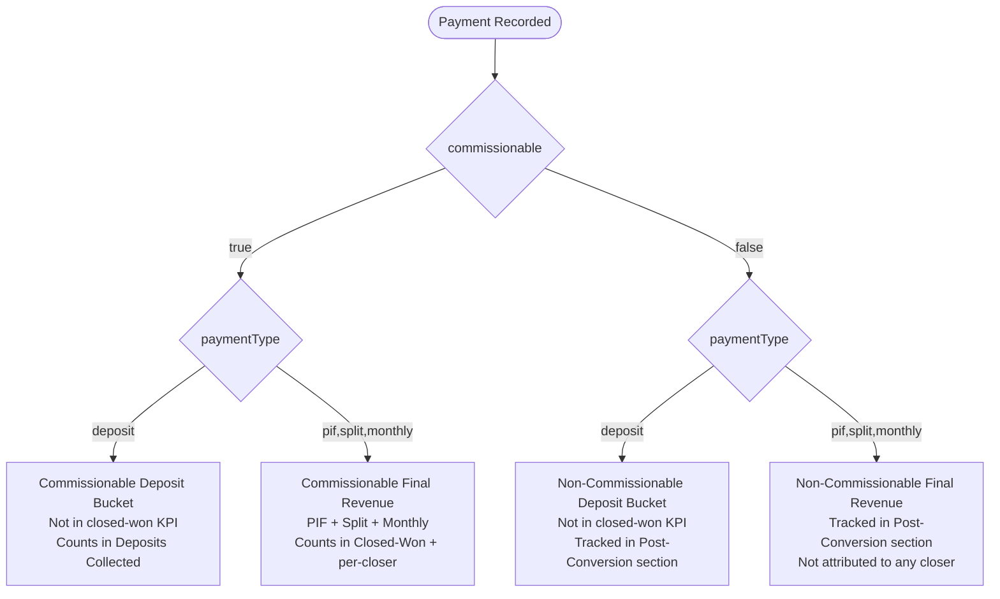
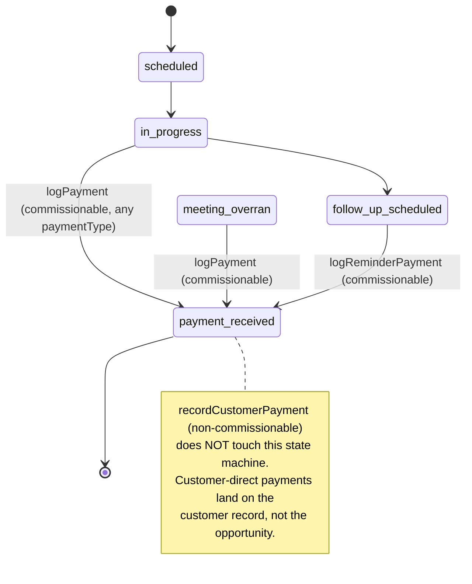

# Payment Programs & Payment Types — Design Specification

**Version:** 0.5.1 (final consistency pass)
**Status:** Draft
**Scope:** Today, the Log Payment dialog collects `provider` (hardcoded Stripe/PayPal/Square/Cash/Bank Transfer/Other) and a mis-labeled Fathom Link (bound to `referenceCode`), with no notion of which program the customer is paying for or how (Monthly/Split/PIF/Deposit). Payments are also attributed to closers via a compound inference at report time (`attributePaymentsToClosers` re-derives the closer from the opportunity or customer), which silently counts post-conversion customer payments toward closer commission. After this feature ships, closers will pick a **Program** from a tenant-configurable registry and a **Payment Type** from a fixed enum on meeting-driven payment flows, post-conversion customer payments will be **admin-only**, the customer area will be **tenant-wide read-only for closers**, the Fathom link will be removed from the opportunity payment dialogs (it already lives on the meeting record), `provider` is dropped, **attribution is made authoritative at write time** with an explicit `commissionable` flag and a dedicated `attributedCloserId` field, and every revenue-bearing reporting surface filters or segments by Program + Payment Type + Commissionability — with deposits reported in their own bucket so they don't inflate "closed-won revenue."
**Operational note (2026-04-20):** Current ops context confirms **no live payment or customer operational data** in dev or production — `paymentRecords` and `customers` are empty on every environment, including the single test tenant on production. Only future Calendly-booked meetings exist, and meetings hold no payment/program references. That makes the destructive `paymentRecords`/`customers` schema changes safe **if pre-flight re-verifies those counts immediately before deploy**. Existing `tenantStats` rows and other operational tables still exist, so any dashboard/stat-counter changes in this design remain additive.
**Prerequisite:** v0.5 Feature D (Lead → Customer conversion) and v0.5b domain events infrastructure are deployed. `paymentRecords`, `customers`, `followUps`, `eventTypeConfigs`, and the reporting aggregates (`paymentSums`) already exist. Because the payment/customer table changes are destructive and atomic, **the feature ships as one coordinated release**: Convex deploy (schema + functions) → seed at least one active program per active tenant → Vercel deploy. See §18 for the exact order.

---

## Table of Contents

1. [Goals & Non-Goals](#1-goals--non-goals)
2. [Actors & Roles](#2-actors--roles)
3. [End-to-End Flow Overview](#3-end-to-end-flow-overview)
4. [Phase 1: Tenant Programs Registry](#4-phase-1-tenant-programs-registry)
5. [Phase 2: Payment Schema Changes (Destructive) — Attribution + Program + Type](#5-phase-2-payment-schema-changes-destructive--attribution--program--type)
6. [Phase 3: Payment UI Redesign (All Entry Points)](#6-phase-3-payment-ui-redesign-all-entry-points)
7. [Phase 4: Mutation Updates — Attribution at Write Time](#7-phase-4-mutation-updates--attribution-at-write-time)
8. [Phase 5: Customer Program Linkage & Post-Conversion Payment Semantics](#8-phase-5-customer-program-linkage--post-conversion-payment-semantics)
9. [Phase 6: Reporting Updates — Commissionable × Final/Deposit × Program × Type](#9-phase-6-reporting-updates--commissionable--finaldeposit--program--type)
10. [Data Model](#10-data-model)
11. [Convex Function Architecture](#11-convex-function-architecture)
12. [Routing & Authorization](#12-routing--authorization)
13. [Security Considerations](#13-security-considerations)
14. [Error Handling & Edge Cases](#14-error-handling--edge-cases)
15. [Open Questions](#15-open-questions)
16. [Dependencies](#16-dependencies)
17. [Applicable Skills](#17-applicable-skills)
18. [Rollout Checklist](#18-rollout-checklist)
19. [Blast Radius Summary](#19-blast-radius-summary)

---

## 1. Goals & Non-Goals

### Goals

- **Closer commission is only earned on meeting-driven payments.** A payment counts toward a closer's "cash collected" if and only if it was recorded as a direct result of a meeting the closer held, a reminder/follow-up the closer (or admin on behalf of the closer) worked, a reschedule they triggered, or an admin review-resolution attributed to them. Payments recorded directly against a customer after conversion (payment plan installments, upsells, renewals) **do not** count toward any closer's commission.
- **Attribution is decided and persisted at write time**, not re-inferred at report time. The payment row carries an explicit `commissionable: boolean`, an `attributedCloserId` that is set iff `commissionable === true`, and a `recordedByUserId` that is always set (who clicked the button). Reporting helpers then read these fields directly — no more `attributePaymentsToClosers` lookups joining `opportunities` / `customers`.
- **Every logged payment is attributed to a Program** chosen from a per-tenant registry (no more freeform strings, no more hardcoded provider list in the UI). `programId` is a required `v.id("tenantPrograms")` on `paymentRecords` from the first deploy.
- **Every logged payment records a Payment Type** from a fixed enum (`monthly`, `split`, `pif`, `deposit`), required on `paymentRecords` from the first deploy so reporting can distinguish deposits from final/recurring revenue.
- **Tenant admins manage their program registry from Settings → Programs** (list view, create/edit/archive), following the existing `eventTypeConfigs` CRUD pattern.
- **Deposits are reported in a separate bucket** from PIF / Monthly / Split revenue on every revenue-bearing surface. A deposit's amount is visible but excluded from "closed-won revenue" KPIs.
- **The Revenue report exposes two top-level slices:** *Commissionable Revenue* (meeting-driven, the money a closer is owed commission on) and *Post-Conversion Revenue* (non-commissionable, attributable to the customer, not a closer). Each slice has its own final/deposit split.
- **All-time dashboard counters split along the same axes** — `tenantStats` gains four additive optional counters (commissionable × final, commissionable × deposit, non-commissionable × final, non-commissionable × deposit) rather than trying to infer semantics from a single combined total.
- **Post-conversion payments stay linked to the original won opportunity** via a new `originatingOpportunityId` field on `paymentRecords`, so admins can audit "this $500 renewal came from the deal closed on meeting X" without re-querying the customer.
- **Closers get tenant-wide read-only customer visibility, but never record post-conversion payments.** `customers.convertedByUserId` remains an audit/reporting field, not a closer authorization gate. Customer-direct payments are recorded by tenant admins/masters only.
- **The schema is forward-compatible with a future "bookkeeper" role** that records post-conversion customer payments at scale. Adding that role is out of scope for this design, but the `origin` union already reserves a `"bookkeeper_direct"` value and every non-commissionable write path runs through a shared helper so adding a new caller is additive.
- **Fathom Link is removed from the meeting and reminder payment dialogs** — the field was bound to `paymentRecords.referenceCode` but mis-labeled in both dialogs; `meetings.fathomLink` is the authoritative source, edited via the existing `FathomLinkField` on the meeting detail page.
- **`paymentRecords.provider` is dropped outright** — removed from the UI and removed from the schema in the same deploy. The column is currently displayed in several detail views, but it is not an authoritative reporting/grouping dimension and there is no historical payment data to preserve.
- **Customer conversion links to Programs by ID**, replacing the current freeform `customers.programType` string with an indexed `customers.programId: v.id("tenantPrograms")`. The freeform string column is removed from `customers` in the same deploy (empty table — safe to drop).
- **Every payment write path and payment read surface stays internally consistent** — meeting flow, reminder flow, customer flow, admin review override, payment history cards/tables, and activity/report rows all speak the same `programId/programName/paymentType/commissionable/attributedCloserId` vocabulary.
- **Rollout never blocks payment logging for the live tenant** — before the new dialogs ship, each tenant has at least one active program available in the picker (pre-flight step in §18).

### Non-Goals (deferred)

- **Bookkeeper role implementation** — adding a new CRM role that logs post-conversion customer payments (no commission) at volume is a separate design. This doc reserves the `"bookkeeper_direct"` origin and designs all non-commissionable write paths to accept it, but does not add the role, permissions, UI, or routing for it.
- **Retroactively converting post-conversion customer payments to commissionable, or re-attributing a commissionable payment after recording** — once `commissionable` / `attributedCloserId` are persisted, correcting them requires a dedicated admin mutation. Out of scope; tracked as Open Question #12.
- **Deposit → final-payment chaining** (business side-effects). When a deposit is logged today the opportunity still transitions to `payment_received` (terminal). The user explicitly parked this: "these options have business side-effects but we will work on them later." Tracked as Open Question #1; design belongs to a separate follow-up doc.
- **Per-program pricing rules / discounts** — programs are name + description + currency hint only.
- **Program-level commission rules** — commissionability is a binary flag at the payment row; per-program commission tiers are out of scope.
- **Multi-program payments** (one payment split across programs) — one payment = one program.
- **Payment plan scheduler** (automatically expecting N installments for a `split` payment) — Phase N+1.
- **Per-closer aggregates** keyed by `[attributedCloserId, recordedAt]` beyond the existing `paymentSums` — in-memory filtering over the existing 2,500-row payment scan is sufficient at current data volume. Deferred until a tenant consistently exceeds ~1,500 payments per month.

---

## 2. Actors & Roles

| Actor | Identity | Auth Method | Key Permissions |
|---|---|---|---|
| **Tenant Admin / Master** | CRM user with role `tenant_master` or `tenant_admin` | WorkOS AuthKit, member of tenant org | Create / rename / archive programs in Settings → Programs; log payments from meeting / reminder / review-resolution paths (commissionable, attributed to assigned closer); log payments from the customer detail page (non-commissionable); see all customers; see all payment reports with program, payment-type, and commissionability filters |
| **Closer** | CRM user with role `closer` | WorkOS AuthKit, member of tenant org | Pick a program + payment type when logging a payment from meeting or reminder flow (commissionable, attributed to self); see **all** customers in read-only mode; cannot record customer-direct payments; cannot manage the program registry |
| **System Admin** | WorkOS user in the `SYSTEM_ADMIN_ORG_ID` org | WorkOS AuthKit, system admin | Not in scope — system admins operate `/admin`, not `/workspace` |
| **Bookkeeper (future, deferred)** | New CRM role, not implemented in this design | WorkOS AuthKit, member of tenant org | Reserved: log non-commissionable customer payments at scale. `"bookkeeper_direct"` is reserved in the `origin` union and the non-commissionable write helper accepts a role-agnostic caller; actual role introduction and permission wiring is a follow-up |

### CRM Role ↔ WorkOS Role Mapping (unchanged in this design)

| CRM `users.role` | WorkOS Role Slug | Notes |
|---|---|---|
| `tenant_master` | `owner` | Full program registry CRUD + all reports |
| `tenant_admin` | `tenant-admin` | Full program registry CRUD + all reports |
| `closer` | `closer` | Read-only access to active programs; picks at payment time |

---

## 3. End-to-End Flow Overview

```mermaid
sequenceDiagram
    participant Admin as Tenant Admin (UI)
    participant Closer as Closer (UI)
    participant Next as Next.js RSC
    participant CVX as Convex Backend
    participant Stats as tenantStats
    participant Report as Revenue / Reminders / Team Reports

    Note over Admin,CVX: Phase 1 — Program Registry Setup
    Admin->>Next: Opens Settings → Programs tab
    Next->>CVX: listPrograms({ includeArchived: false })
    CVX-->>Next: Array<Program>
    Admin->>CVX: upsertProgram({ name, description, defaultCurrency })
    CVX-->>Admin: programId

    Note over Closer,CVX: Phase 4 — Log COMMISSIONABLE Payment (Meeting Flow)
    Closer->>Next: Opens Log Payment dialog on meeting detail
    Next->>CVX: listPrograms({ includeArchived: false })
    CVX-->>Next: Active programs
    Closer->>CVX: logPayment({ ... programId, paymentType, proofFileId? })
    CVX->>CVX: validate program, validate status transition
    CVX->>CVX: insert paymentRecords (commissionable=true, attributedCloserId=userId, origin="closer_meeting")
    CVX->>CVX: patch opportunity.status = "payment_received"
    CVX->>CVX: executeConversion → customer.programId = programId
    CVX->>Stats: increment totalCommissionableFinalRevenueMinor (or …Deposit…)
    CVX-->>Closer: paymentId

    Note over Closer,CVX: Phase 4 — Log COMMISSIONABLE Payment (Reminder Flow)
    Closer->>CVX: logReminderPayment({ followUpId, ..., programId, paymentType })
    CVX->>CVX: insert paymentRecords (commissionable=true, attributedCloserId=userId, origin="closer_reminder")
    CVX-->>Closer: paymentId

    Note over Admin,CVX: Phase 4 — Admin-on-behalf COMMISSIONABLE Payment (Meeting / Reminder / Review)
    Admin->>Next: Opens admin meeting detail, admin reminder detail, or review-resolution action
    Admin->>CVX: logPayment | logReminderPayment | resolveReview(log_payment)
    CVX->>CVX: insert paymentRecords (commissionable=true, attributedCloserId=meeting/review -> opportunity.assignedCloserId; reminder -> followUp.closerId, with opportunity assignment normalized first if drifted, recordedByUserId=admin, origin="admin_meeting"|"admin_reminder"|"admin_review_resolution")
    CVX-->>Admin: paymentId

    Note over Closer,Next: Phase 5 — Customer Read Surface
    Closer->>Next: Opens /workspace/customers or /workspace/customers/[customerId]
    Next-->>Closer: Read-only customer list/detail for any tenant customer

    Note over Admin,CVX: Phase 5 — NON-COMMISSIONABLE Payment (Customer Detail)
    Admin->>CVX: recordCustomerPayment({ customerId, ..., programId, paymentType })
    CVX->>CVX: insert paymentRecords (commissionable=false, attributedCloserId=undefined, recordedByUserId=userId, origin="customer_direct", originatingOpportunityId=customer.winningOpportunityId)
    CVX->>Stats: increment totalNonCommissionableFinalRevenueMinor (or …Deposit…)
    CVX-->>Admin: paymentId (no closer commission)

    Note over Admin,Report: Phase 6 — Reports Query
    Admin->>Next: Opens /workspace/reports/revenue
    Next->>CVX: getRevenueMetrics({ startDate, endDate, programId?, paymentType?, commissionable? })
    CVX->>CVX: scan paymentRecords in range, apply filters, split commissionable × final/deposit
    CVX-->>Next: { commissionable: { finalRevenueMinor, depositRevenueMinor, byCloser, byProgram, ... }, nonCommissionable: { finalRevenueMinor, depositRevenueMinor, byProgram, ... } }
    Next-->>Admin: Revenue dashboard with two top-level slices + per-slice breakdowns
```

---

## 4. Phase 1: Tenant Programs Registry

### 4.1 What & Why

Today `customers.programType: v.optional(v.string())` holds a freeform program name, usually falling back to the Calendly event type's `displayName` during conversion (see `convex/customers/conversion.ts:78-85`). That has three problems: (1) admins can't see or edit the list, (2) closers don't know which values to type (so they pick nothing), (3) reports can't group by program because the string is inconsistent. Phase 1 creates a first-class `tenantPrograms` table with admin-only CRUD, mirroring the `eventTypeConfigs` upsert pattern that already works.

> **Runtime decision: `mutation` (not `action`).** Program CRUD is purely database work — no external API calls — so a server mutation is sufficient. This matches `upsertEventTypeConfig` in `convex/eventTypeConfigs/mutations.ts`. No `"use node"` required.
>
> **Data model decision: separate table, not a nested array on `tenants`.** The `tenants` table is flat today (see `convex/schema.ts:6-36`) and per-tenant config already lives in dedicated tables (`eventTypeConfigs`, `tenantCalendlyConnections`). A nested `programs: v.array(...)` on `tenants` would (a) re-serialize on every tenant write and (b) not be independently indexable for `by_tenantId_and_status` queries that reports will need. Separate table wins.
>
> **Archive vs. delete.** Deleting a program that has any `paymentRecords.programId` would orphan history. Programs use soft-delete (`archivedAt: v.optional(v.number())`) and payment-entry pickers filter out archived programs; reporting filters still include archived programs so historical slices remain accessible.

### 4.2 Schema

```typescript
// Path: convex/schema.ts (new table)
tenantPrograms: defineTable({
  tenantId: v.id("tenants"),
  // Human-visible label shown in the payment dialog dropdown and in reports.
  name: v.string(),
  // Lowercased/trimmed version used for uniqueness checks and lookup.
  normalizedName: v.string(),
  // Optional longer description shown only in the admin Programs list.
  description: v.optional(v.string()),
  // Hint used as the default currency for payments logged against this program
  // (closers can still override). Uses the same ISO codes as paymentRecords.currency.
  defaultCurrency: v.optional(v.string()),
  // Soft-delete timestamp. Archived programs are hidden from the dropdown
  // but kept around so historical payments still resolve their name.
  archivedAt: v.optional(v.number()),
  createdAt: v.number(),
  createdByUserId: v.id("users"),
  updatedAt: v.number(),
})
  .index("by_tenantId", ["tenantId"])
  // Drives the Settings list (active first, then archived); reports use
  // the same index because archived programs still need to be joinable.
  .index("by_tenantId_and_archivedAt", ["tenantId", "archivedAt"])
  // Uniqueness check on upsert — prevents duplicate names per tenant.
  .index("by_tenantId_and_normalizedName", ["tenantId", "normalizedName"]),
```

### 4.3 Admin Mutations

```typescript
// Path: convex/tenantPrograms/mutations.ts
import { v } from "convex/values";
import { mutation } from "../_generated/server";
import { internal } from "../_generated/api";
import { requireTenantUser } from "../requireTenantUser";
import { validateRequiredString } from "../lib/validation";

export const upsertProgram = mutation({
  args: {
    programId: v.optional(v.id("tenantPrograms")),
    name: v.string(),
    description: v.optional(v.string()),
    defaultCurrency: v.optional(v.string()),
  },
  handler: async (ctx, args) => {
    console.log("[Programs] upsertProgram called", {
      isUpdate: !!args.programId,
    });
    const { userId, tenantId } = await requireTenantUser(ctx, [
      "tenant_master",
      "tenant_admin",
    ]);

    const nameValidation = validateRequiredString(args.name, {
      fieldName: "Program name",
      maxLength: 80,
    });
    if (!nameValidation.valid) throw new Error(nameValidation.error);

    const name = args.name.trim();
    const normalizedName = name.toLocaleLowerCase();
    const now = Date.now();

    // Duplicate check on create (or rename that collides with another active program).
    const clash = await ctx.db
      .query("tenantPrograms")
      .withIndex("by_tenantId_and_normalizedName", (q) =>
        q.eq("tenantId", tenantId).eq("normalizedName", normalizedName),
      )
      .first();
    if (clash && clash._id !== args.programId && !clash.archivedAt) {
      throw new Error(`A program named "${name}" already exists.`);
    }

    if (args.programId) {
      const existing = await ctx.db.get(args.programId);
      if (!existing || existing.tenantId !== tenantId) {
        throw new Error("Program not found");
      }
      await ctx.db.patch(args.programId, {
        name,
        normalizedName,
        description: args.description?.trim() || undefined,
        defaultCurrency: args.defaultCurrency?.trim() || undefined,
        updatedAt: now,
      });
      // Only fire the rename-sync job when the name actually changed.
      if (existing.name !== name) {
        await ctx.scheduler.runAfter(
          0,
          internal.tenantPrograms.sync.syncRenamedProgram,
          { programId: args.programId },
        );
      }
      return args.programId;
    }

    return await ctx.db.insert("tenantPrograms", {
      tenantId,
      name,
      normalizedName,
      description: args.description?.trim() || undefined,
      defaultCurrency: args.defaultCurrency?.trim() || undefined,
      createdAt: now,
      createdByUserId: userId,
      updatedAt: now,
    });
  },
});

export const archiveProgram = mutation({
  args: { programId: v.id("tenantPrograms") },
  handler: async (ctx, { programId }) => {
    const { tenantId } = await requireTenantUser(ctx, [
      "tenant_master",
      "tenant_admin",
    ]);
    const program = await ctx.db.get(programId);
    if (!program || program.tenantId !== tenantId) {
      throw new Error("Program not found");
    }
    if (program.archivedAt) return; // idempotent
    const activePrograms = await ctx.db
      .query("tenantPrograms")
      .withIndex("by_tenantId", (q) => q.eq("tenantId", tenantId))
      .take(200);
    const activeCount = activePrograms.filter((row) => !row.archivedAt).length;
    if (activeCount <= 1) {
      throw new Error(
        "At least one active program is required. Create or restore another program before archiving this one.",
      );
    }
    await ctx.db.patch(programId, {
      archivedAt: Date.now(),
      updatedAt: Date.now(),
    });
  },
});

export const restoreProgram = mutation({
  args: { programId: v.id("tenantPrograms") },
  handler: async (ctx, { programId }) => {
    const { tenantId } = await requireTenantUser(ctx, [
      "tenant_master",
      "tenant_admin",
    ]);
    const program = await ctx.db.get(programId);
    if (!program || program.tenantId !== tenantId) {
      throw new Error("Program not found");
    }
    const clash = await ctx.db
      .query("tenantPrograms")
      .withIndex("by_tenantId_and_normalizedName", (q) =>
        q.eq("tenantId", tenantId).eq("normalizedName", program.normalizedName),
      )
      .first();
    if (clash && clash._id !== programId && !clash.archivedAt) {
      throw new Error(
        `Cannot restore "${program.name}" because an active program with that name already exists.`,
      );
    }
    await ctx.db.patch(programId, {
      archivedAt: undefined,
      updatedAt: Date.now(),
    });
  },
});
```

> **Denormalization contract.** `paymentRecords.programName` and `customers.programName` are **display caches**, not immutable historical snapshots. When an admin renames a program, the rename-sync job (§8.6) patches both denormalized fields so reports and detail pages follow the canonical name.

### 4.4 Query

```typescript
// Path: convex/tenantPrograms/queries.ts
import { v } from "convex/values";
import { query } from "../_generated/server";
import { requireTenantUser } from "../requireTenantUser";

export const listPrograms = query({
  args: { includeArchived: v.optional(v.boolean()) },
  handler: async (ctx, { includeArchived }) => {
    const { tenantId } = await requireTenantUser(ctx, [
      "closer",
      "tenant_master",
      "tenant_admin",
    ]);
    const rows = await ctx.db
      .query("tenantPrograms")
      .withIndex("by_tenantId", (q) => q.eq("tenantId", tenantId))
      .take(200); // bounded — we never expect hundreds of programs per tenant
    const sorted = [...rows].sort(
      (left, right) =>
        Number(Boolean(left.archivedAt)) - Number(Boolean(right.archivedAt)) ||
        left.name.localeCompare(right.name, undefined, { sensitivity: "base" }),
    );
    return includeArchived ? sorted : sorted.filter((r) => !r.archivedAt);
  },
});
```

### 4.5 Admin UI

The Settings page (`app/workspace/settings/_components/settings-page-client.tsx:57-75`) gets a fourth tab:

```tsx
// Path: app/workspace/settings/_components/settings-page-client.tsx (modified)
<TabsList>
  <TabsTrigger value="calendly">Calendly</TabsTrigger>
  <TabsTrigger value="event-types">Event Types</TabsTrigger>
  <TabsTrigger value="field-mappings">Field Mappings</TabsTrigger>
  <TabsTrigger value="programs">Programs</TabsTrigger>{/* NEW */}
</TabsList>
...
<TabsContent value="programs" className="mt-6">
  <ProgramsTab />
</TabsContent>
```

New components:

```
app/workspace/settings/_components/
├── programs-tab.tsx              # List container, empty state, "New program" button
├── program-form-dialog.tsx       # RHF + Zod create/edit modal (mirrors role-edit-dialog pattern)
└── program-row.tsx               # Row with name, description, currency, archive toggle
```

Form follows the codebase's canonical RHF + `standardSchemaResolver` pattern (see `AGENTS.md § Form Patterns` and `app/workspace/team/_components/role-edit-dialog.tsx` for the externally-controlled dialog precedent).

For rollout safety, add a **one-off internal seed path** under `convex/tenantPrograms/seed.ts`:

- `ensureInitialProgramForTenant({ tenantId, name, description?, defaultCurrency? })`
- Internal-only; callable from deploy orchestration between Convex and Vercel promotion
- Idempotent by `{ tenantId, normalizedName }`
- Safe to delete after rollout once every active tenant has at least one program

---

## 5. Phase 2: Payment Schema Changes (Destructive) — Attribution + Program + Type

### 5.1 What & Why

Because `paymentRecords` is empty on every environment, the schema change is destructive — no widen-migrate-narrow window, no backfill. Three orthogonal shape changes land in the same deploy:

1. **Attribution fields** — rename `closerId` → `attributedCloserId: v.optional(v.id("users"))` (set iff commissionable), add `recordedByUserId: v.id("users")` (always set), add `commissionable: v.boolean()` (explicit flag), add `originatingOpportunityId: v.optional(v.id("opportunities"))` (for post-conversion customer payments that need an audit pointer back to the won deal), expand the `origin` union with `"admin_reminder"`, `"admin_review_resolution"`, `"customer_direct"` (rename of `"customer_flow"`), and the reserved-for-future `"bookkeeper_direct"`. Drop `loggedByAdminUserId` — its information content collapses into `commissionable === true && recordedByUserId !== attributedCloserId`.
2. **Program fields** — add `programId` + `programName` (required), with a new index `by_tenantId_and_programId_and_recordedAt`.
3. **Payment Type fields** — add `paymentType: v.union("monthly"|"split"|"pif"|"deposit")` (required), with a new index `by_tenantId_and_paymentType_and_recordedAt`.

`provider` is dropped outright. `referenceCode` stays (used by customer-direct and admin review-resolution flows for real transaction IDs).

> **Why make attribution authoritative at write time?** Today the reporting helper `attributePaymentsToClosers` joins `opportunities` / `customers` for every report query to re-derive who gets credit (`convex/reporting/lib/helpers.ts:94-158`). That worked when "whoever wrote the row" was sometimes wrong (admin on behalf of closer), but it has three costs: (a) every report pays for N `ctx.db.get()` calls just to answer "who owns this?"; (b) the new *non-commissionable* concept would require the helper to consult yet another source of truth to know which payments to exclude; (c) authoritative-at-write semantics make the domain event metadata, activity feed, and the closer's own dashboard immediately correct without any re-derivation. Persisting `attributedCloserId` + `commissionable` at write time costs two fields per row, saves up to 2,500 document reads per report, and lets downstream consumers trust a single payment row.
>
> **Migration pattern: single-step destructive on empty tables.** The `@convex-dev/migrations` component is not needed for `paymentRecords` / `customers` because there are zero rows to migrate. A Convex schema push validates against empty tables and succeeds immediately.
>
> **Why not keep `provider` as an optional column "just in case"?** Detail views display it today, but no authoritative report or workflow groups by it, there is no historical payment data to preserve, and keeping a deprecated-but-optional field invites drift.

### 5.2 Schema Changes — `paymentRecords`

```typescript
// Path: convex/schema.ts (rewritten table)
paymentRecords: defineTable({
  tenantId: v.id("tenants"),

  // === Context links ===
  // Link to the originating opportunity. Required for commissionable payments
  // (meeting / reminder / admin / review), OPTIONAL for customer-direct payments
  // (those only point to the customer).
  opportunityId: v.optional(v.id("opportunities")),
  // Meeting link — required for commissionable payments whose trigger was a
  // meeting or a reminder chain that still has a meeting behind it. OPTIONAL
  // for customer-direct payments and for reminder payments on opportunities
  // whose meeting has been deleted (defensive).
  meetingId: v.optional(v.id("meetings")),
  // Customer link — present after conversion OR for customer-direct payments.
  customerId: v.optional(v.id("customers")),
  // NEW — for non-commissionable payments (customer_direct, bookkeeper_direct),
  // holds a pointer to the opportunity on which this customer was originally won.
  // Lets the audit trail answer "which closed deal does this renewal belong to?"
  // without walking through customers.winningOpportunityId at query time. Set by
  // the non-commissionable write helper; null for commissionable payments (they
  // already have opportunityId set to the same opportunity).
  originatingOpportunityId: v.optional(v.id("opportunities")),

  // === Attribution ===
  // Who earns commission on this payment. Set IFF commissionable === true.
  // When commissionable === false, this field is undefined and every
  // closer-scoped report excludes the row from cash-collected totals.
  attributedCloserId: v.optional(v.id("users")),
  // Who actually clicked "Log payment". Always set. For a closer self-logging:
  // recordedByUserId === attributedCloserId. For an admin on behalf of the
  // closer: recordedByUserId !== attributedCloserId. For customer-direct
  // payments (commissionable === false): recordedByUserId is the logger's ID
  // (closer or admin today; bookkeeper in the future).
  recordedByUserId: v.id("users"),
  // Explicit binary flag so every read surface agrees without walking logic.
  // Invariant: commissionable === true  ⇔  attributedCloserId !== undefined.
  // This is asserted by the write helper (§7.1) and verified by a runtime
  // assertion in reporting helpers.
  commissionable: v.boolean(),

  // === Money ===
  amountMinor: v.number(),
  currency: v.string(),
  // NEW — program reference + denormalized name cache.
  programId: v.id("tenantPrograms"),
  programName: v.string(),
  // NEW — business intent of the payment. Distinct from `status`:
  //   status     = processing state (recorded / verified / disputed)
  //   paymentType = business intent (pif / split / monthly / deposit)
  paymentType: v.union(
    v.literal("monthly"),
    v.literal("split"),
    v.literal("pif"),
    v.literal("deposit"),
  ),

  // === Provenance ===
  // Origin expands to cover the full commissionable/non-commissionable matrix.
  // Every value maps deterministically to a `commissionable` boolean (§7.1):
  //   closer_meeting           → commissionable: true
  //   closer_reminder          → commissionable: true
  //   admin_meeting            → commissionable: true
  //   admin_reminder           → commissionable: true  (NEW — admin on behalf of closer during reminder flow)
  //   admin_review_resolution  → commissionable: true  (admin resolving an overran review with a payment)
  //   customer_direct          → commissionable: false (rename of legacy "customer_flow")
  //   bookkeeper_direct        → commissionable: false (RESERVED — no write path lands here in MVP)
  origin: v.union(
    v.literal("closer_meeting"),
    v.literal("closer_reminder"),
    v.literal("admin_meeting"),
    v.literal("admin_reminder"),
    v.literal("admin_review_resolution"),
    v.literal("customer_direct"),
    v.literal("bookkeeper_direct"),
  ),
  contextType: v.union(v.literal("opportunity"), v.literal("customer")),

  // === Status & audit ===
  status: v.union(
    v.literal("recorded"),
    v.literal("verified"),
    v.literal("disputed"),
  ),
  verifiedAt: v.optional(v.number()),
  verifiedByUserId: v.optional(v.id("users")),
  statusChangedAt: v.optional(v.number()),
  recordedAt: v.number(),

  // === Retained ===
  // Kept for customer-direct + admin review-resolution (real transaction ID).
  // NEVER re-labeled as "Fathom Link" — the opportunity dialogs don't capture it.
  referenceCode: v.optional(v.string()),
  proofFileId: v.optional(v.id("_storage")),

  // REMOVED:
  //   closerId          — superseded by attributedCloserId + recordedByUserId
  //   provider          — dropped outright; no authoritative consumer
  //   loggedByAdminUserId — redundant with commissionable && recordedByUserId !== attributedCloserId
})
  // === Indexes ===
  .index("by_opportunityId", ["opportunityId"])
  .index("by_originatingOpportunityId", ["originatingOpportunityId"])
  .index("by_tenantId", ["tenantId"])
  .index("by_customerId", ["customerId"])
  .index("by_customerId_and_recordedAt", ["customerId", "recordedAt"])
  .index("by_tenantId_and_recordedAt", ["tenantId", "recordedAt"])
  .index("by_tenantId_and_status_and_recordedAt", [
    "tenantId", "status", "recordedAt",
  ])
  // Per-closer commissionable scan. Queries filter by attributedCloserId and
  // inherently exclude non-commissionable rows (which have undefined here).
  .index("by_tenantId_and_attributedCloserId_and_recordedAt", [
    "tenantId", "attributedCloserId", "recordedAt",
  ])
  // Top-level split between commissionable and non-commissionable revenue.
  .index("by_tenantId_and_commissionable_and_recordedAt", [
    "tenantId", "commissionable", "recordedAt",
  ])
  // Reminder-origin reporting still relies on this index (convex/reporting/remindersReporting.ts:102-113).
  .index("by_tenantId_and_origin_and_recordedAt", [
    "tenantId", "origin", "recordedAt",
  ])
  // Program + Payment-Type filters for Revenue report.
  .index("by_tenantId_and_programId_and_recordedAt", [
    "tenantId", "programId", "recordedAt",
  ])
  .index("by_tenantId_and_paymentType_and_recordedAt", [
    "tenantId", "paymentType", "recordedAt",
  ]),
```

### 5.3 Field Change Summary

| Field | Before | After | Why |
|---|---|---|---|
| `closerId` | `v.id("users")` required | **removed** | Conflated "who gets commission" with "who logged it". Replaced by the pair below. |
| `attributedCloserId` | — | `v.optional(v.id("users"))` | Commission recipient. Undefined iff `commissionable === false`. |
| `recordedByUserId` | — | `v.id("users")` required | Audit: who actually clicked the button. Always set. |
| `commissionable` | — | `v.boolean()` required | Explicit flag; reporting helpers read this instead of deriving from origin. |
| `originatingOpportunityId` | — | `v.optional(v.id("opportunities"))` | Audit pointer for non-commissionable customer payments. |
| `loggedByAdminUserId` | `v.optional(v.id("users"))` | **removed** | Derivable from `commissionable && recordedByUserId !== attributedCloserId`. |
| `provider` | `v.string()` required | **removed** | No authoritative consumer; table empty; drop outright. |
| `programId` | — | `v.id("tenantPrograms")` required | Reporting / filter dimension. |
| `programName` | — | `v.string()` required | Denormalized display cache; synced on rename. |
| `paymentType` | — | `v.union("monthly","split","pif","deposit")` required | Separate deposit vs. final in every report. |
| `origin` | 4-value union (optional) | 7-value union (required) | Adds `admin_reminder`, `admin_review_resolution`, `customer_direct` (rename), `bookkeeper_direct` (reserved). |
| `referenceCode` | optional | optional (kept) | Real transaction ID for customer-direct + admin review; never re-labeled. |
| `meetingId` | optional | optional (kept) | Required in write-path validation for commissionable paths; undefined for customer-direct. |

### 5.4 Invariants (enforced by the write helper, verified in dev)

For every row in `paymentRecords`:

1. `commissionable === true  ⇔  attributedCloserId !== undefined`
2. `commissionable === true  ⇒  contextType === "opportunity"` and `opportunityId !== undefined`
3. `commissionable === false ⇒  contextType === "customer"` and `customerId !== undefined`
4. `origin === "customer_direct" ∨ "bookkeeper_direct"  ⇔  commissionable === false`
5. `origin === "bookkeeper_direct"` does not appear in any MVP write path (reserved for future role)
6. `programId.tenantId === row.tenantId` (cross-tenant isolation)
7. `programName === tenantPrograms[programId].name` at insert time (rename-sync keeps it in lockstep thereafter)

These invariants are asserted inside the shared write helper `assertPaymentRow` (§7.1) called by every write path. Reporting helpers additionally emit a `console.warn` if they observe a violation at read time, but do not throw — bad rows degrade gracefully.

### 5.5 `paymentSums` Aggregate — Keying Update

The existing `paymentSums` aggregate (`convex/reporting/aggregates.ts:23-32`) is currently keyed by `[closerId, recordedAt]`. With `closerId` gone, the key must switch to `[attributedCloserId, recordedAt]`. Because `attributedCloserId` is optional, aggregates only accept rows where `commissionable === true` and write the key as `[attributedCloserId, recordedAt]`; non-commissionable rows are excluded from this aggregate (they never contribute to per-closer totals).

```typescript
// Path: convex/reporting/aggregates.ts (MODIFIED)
export const paymentSums = new TableAggregate<{
  Key: [Id<"users">, number];
  DataModel: DataModel;
  TableName: "paymentRecords";
}>(components.paymentSums, {
  sortKey: (doc) => [
    // Only commissionable rows contribute; non-commissionable rows are filtered
    // by the write hook before calling .insert (§5.5 write-hook change).
    doc.attributedCloserId!,
    doc.recordedAt,
  ],
  sumValue: (doc) =>
    // Exclude disputed rows.
    doc.status === "disputed" ? 0 : doc.amountMinor,
});
```

The `writeHooks.ts` helpers gain a guard so non-commissionable rows skip the aggregate:

```typescript
// Path: convex/reporting/writeHooks.ts (MODIFIED)
export async function insertPaymentAggregate(
  ctx: MutationCtx,
  paymentId: Id<"paymentRecords">,
) {
  const payment = await ctx.db.get(paymentId);
  if (!payment || !payment.commissionable) return; // skip non-commissionable
  await paymentSums.insert(ctx, payment);
}

export async function replacePaymentAggregate(
  ctx: MutationCtx,
  oldPayment: Doc<"paymentRecords">,
  paymentId: Id<"paymentRecords">,
) {
  const payment = await ctx.db.get(paymentId);
  if (!payment) return;
  if (!oldPayment.commissionable && !payment.commissionable) return;
  if (!payment.commissionable) {
    // If a row transitioned commissionable → non-commissionable, remove the old
    // aggregate entry using the OLD key.
    if (oldPayment.commissionable) {
      await paymentSums.deleteIfExists(ctx, oldPayment).catch(() => undefined);
    }
    return;
  }
  if (!oldPayment.commissionable) {
    await paymentSums.insert(ctx, payment);
    return;
  }
  await paymentSums.replace(ctx, oldPayment, payment);
}
```

As §5.4 of the prior draft noted, no query currently calls `paymentSums.sum()` — all revenue totals use direct scans via `getNonDisputedPaymentsInRange`. The aggregate is kept consistent so future consumers inherit commissionable-only semantics for free.

---

## 6. Phase 3: Payment UI Redesign (All Entry Points)

### 6.1 What & Why

There are three payment-dialog surfaces in scope plus one admin override path in review resolution. Every write entry point gains `program` + `paymentType`; the two opportunity-scoped dialogs lose the Fathom Link input entirely; the customer-scoped dialog keeps its Reference Code input. Additionally, the customer-scoped dialog becomes **admin-only** and gains a **non-commissionable** annotation so admins understand the payment is audit revenue, not closer commission. Closers can still open customer pages, but those pages are read-only in v0.5.1.

| Dialog | File | Trigger | Mutation | Commissionability | Changes |
|---|---|---|---|---|---|
| **Meeting Log Payment** | `app/workspace/closer/meetings/_components/payment-form-dialog.tsx` | Meeting detail outcome bar | `api.closer.payments.logPayment` | ✅ Commissionable | Remove Fathom Link, remove Provider, add Program, add Payment Type |
| **Reminder Log Payment** | `app/workspace/closer/reminders/[followUpId]/_components/reminder-payment-dialog.tsx` | Closer reminder detail page; new admin reminder detail page reuses the same outcome surface | `api.closer.reminderOutcomes.logReminderPayment` | ✅ Commissionable | Same as above. Mutation also accepts admin callers, but only through an explicit admin reminder route (§7.3, §12.1) |
| **Customer Record Payment** | `app/workspace/customers/[customerId]/_components/record-payment-dialog.tsx` | Customer detail page (**admin only**) | `api.customers.mutations.recordCustomerPayment` | ❌ **Non-commissionable** | Remove Provider, add Program (defaulted from `customer.programId`), add Payment Type, **add "No closer commission" explanatory banner**. Reference Code stays. Closers do not see this dialog |
| **Admin Review Resolution** | `app/workspace/reviews/[reviewId]/_components/review-resolution-dialog.tsx` | Admin resolves overrun review with "Log payment" | `api.reviews.mutations.resolveReview` → `convex/lib/outcomeHelpers.ts::createPaymentRecord` | ✅ Commissionable (attributed to assigned closer) | Replace Provider with Program + Payment Type; keep optional Reference Code |

> **Fathom Link is already captured on `meetings.fathomLink`** (schema.ts:375-378) and edited via `app/workspace/closer/meetings/_components/fathom-link-field.tsx`. Both opportunity-scoped payment dialogs currently have a "Fathom Link" label bound to `paymentRecords.referenceCode` — a duplicate (`payment-form-dialog.tsx:363-384` for meetings, `reminder-payment-dialog.tsx:339-359` for reminders). The customer dialog correctly labels its field "Reference Code" (`record-payment-dialog.tsx:311-331`) and is left alone.

### 6.2 Updated Zod Schema (shared shape for commissionable dialogs)

```typescript
// Path: app/workspace/closer/meetings/_components/payment-form-dialog.tsx
const CURRENCIES = ["USD", "EUR", "GBP", "CAD", "AUD", "JPY"] as const;
const PAYMENT_TYPES = ["monthly", "split", "pif", "deposit"] as const;

const paymentFormSchema = z.object({
  amount: z
    .string()
    .min(1, "Amount is required")
    .refine((v) => !Number.isNaN(parseFloat(v)) && parseFloat(v) > 0, {
      message: "Amount must be greater than 0",
    }),
  currency: z.enum(CURRENCIES),
  programId: z.custom<Id<"tenantPrograms">>(
    (value) => typeof value === "string" && value.length > 0,
    { message: "Please select a program" },
  ),
  paymentType: z.enum(PAYMENT_TYPES, { error: "Please select a payment type" }),
  proofFile: z
    .instanceof(File)
    .optional()
    .refine((f) => !f || f.size <= MAX_FILE_SIZE, "File size must be < 10 MB")
    .refine(
      (f) => !f || VALID_FILE_TYPES.includes(f.type),
      "Only images (JPEG, PNG, GIF) and PDFs are allowed",
    ),
  // REMOVED: provider, referenceCode (for meeting / reminder dialogs)
});
type PaymentFormValues = z.infer<typeof paymentFormSchema>;
```

The customer-dialog schema is identical plus an optional `referenceCode` string (for the real transaction ID).

### 6.3 Shared Program Dropdown Component

```tsx
// Path: app/workspace/closer/_components/program-select.tsx (NEW, shared)
"use client";
import { useQuery } from "convex/react";
import { api } from "@/convex/_generated/api";
import {
  Select,
  SelectContent,
  SelectItem,
  SelectTrigger,
  SelectValue,
} from "@/components/ui/select";
import { Spinner } from "@/components/ui/spinner";

type Props = {
  value: string | undefined;
  onChange: (v: string) => void;
  disabled?: boolean;
  placeholder?: string;
};

export function ProgramSelect({ value, onChange, disabled, placeholder }: Props) {
  const programs = useQuery(api.tenantPrograms.queries.listPrograms, {
    includeArchived: false,
  });

  if (programs === undefined) {
    return (
      <div className="flex h-9 items-center gap-2 rounded-md border px-3 text-sm text-muted-foreground">
        <Spinner className="size-3" />
        Loading programs…
      </div>
    );
  }

  if (programs.length === 0) {
    return (
      <p className="text-xs text-muted-foreground">
        No programs configured yet. Ask an admin to add one in Settings →
        Programs.
      </p>
    );
  }

  return (
    <Select value={value} onValueChange={onChange} disabled={disabled}>
      <SelectTrigger>
        <SelectValue placeholder={placeholder ?? "Select program"} />
      </SelectTrigger>
      <SelectContent>
        {programs.map((p) => (
          <SelectItem key={p._id} value={p._id}>
            {p.name}
          </SelectItem>
        ))}
      </SelectContent>
    </Select>
  );
}
```

### 6.4 Commissionable dialog structure (meeting variant)

```tsx
// Path: app/workspace/closer/meetings/_components/payment-form-dialog.tsx (MODIFIED)
<FieldGroup>
  <FormField control={form.control} name="amount" render={/* unchanged */} />
  <FormField control={form.control} name="currency" render={/* unchanged */} />

  {/* NEW — Program (replaces Provider) */}
  <FormField
    control={form.control}
    name="programId"
    render={({ field }) => (
      <FormItem>
        <FormLabel>Program <span className="text-destructive">*</span></FormLabel>
        <FormControl>
          <ProgramSelect
            value={field.value}
            onChange={field.onChange}
            disabled={isSubmitting}
          />
        </FormControl>
        <FormMessage />
      </FormItem>
    )}
  />

  {/* NEW — Payment Type */}
  <FormField
    control={form.control}
    name="paymentType"
    render={({ field }) => (
      <FormItem>
        <FormLabel>Payment Type <span className="text-destructive">*</span></FormLabel>
        <Select onValueChange={field.onChange} value={field.value} disabled={isSubmitting}>
          <FormControl>
            <SelectTrigger><SelectValue placeholder="Select payment type" /></SelectTrigger>
          </FormControl>
          <SelectContent>
            <SelectItem value="pif">PIF (Paid in Full)</SelectItem>
            <SelectItem value="split">Split</SelectItem>
            <SelectItem value="monthly">Monthly</SelectItem>
            <SelectItem value="deposit">Deposit</SelectItem>
          </SelectContent>
        </Select>
        {field.value === "deposit" && (
          <FormDescription>
            Deposits are tracked separately in reports — they do not count toward
            closed-won revenue until a final payment is logged.
          </FormDescription>
        )}
        <FormMessage />
      </FormItem>
    )}
  />

  <FormField control={form.control} name="proofFile" render={/* unchanged */} />
  {/* REMOVED — Fathom Link FormField */}
</FieldGroup>
```

### 6.5 Non-commissionable dialog (customer-detail, admin-only)

The customer dialog layout is almost identical, with three differences:

1. **Banner at the top** explaining that the payment is post-conversion revenue and does not credit any closer.
2. `programId` is pre-seeded from `customer.programId` when the customer's program is still active.
3. `referenceCode` field is kept (real transaction ID).

Closers do **not** render this dialog in v0.5.1. They can open the customer page, inspect payment history, and audit the linked winning opportunity, but all customer-write actions remain admin-only.

```tsx
// Path: app/workspace/customers/[customerId]/_components/record-payment-dialog.tsx (MODIFIED)
<Alert className="mb-4" variant="default">
  <InfoIcon className="size-4" />
  <AlertTitle>Post-conversion payment</AlertTitle>
  <AlertDescription>
    Payments recorded from the Customer page are <strong>not</strong> counted
    toward any closer's Cash Collected. They still appear in the customer's
    payment history and in admin revenue reports. Commission is only earned on
    payments logged from a meeting, reminder, or review-resolution flow.
  </AlertDescription>
</Alert>

<FieldGroup>
  <FormField control={form.control} name="amount" render={/* unchanged */} />
  <FormField control={form.control} name="currency" render={/* unchanged */} />
  <FormField control={form.control} name="programId" render={/* ProgramSelect */} />
  <FormField control={form.control} name="paymentType" render={/* as above */} />
  <FormField control={form.control} name="referenceCode" render={/* Reference Code kept */} />
  <FormField control={form.control} name="proofFile" render={/* unchanged */} />
</FieldGroup>
```

### 6.6 Field Migration Summary

The customer-direct dialog is rendered only for `tenant_master` / `tenant_admin`. Closers see the same payment history and customer metadata, but no write CTA.

| Dialog field | Before | After (meeting / reminder / review) | After (customer-direct) |
|---|---|---|---|
| Amount | ✅ Input, required, `> 0` | ✅ unchanged | ✅ unchanged |
| Currency | ✅ Select | ✅ unchanged | ✅ unchanged |
| **Provider** | ✅ Select (hardcoded 6) | ❌ **removed** | ❌ **removed** |
| **Fathom Link** | ✅ URL input mis-bound to `referenceCode` | ❌ **removed** | n/a (was already absent) |
| **Reference Code** | Customer dialog only | ✅ review resolution only | ✅ kept |
| **Program** | — | ✅ **new** — required, sourced from `listPrograms` | ✅ new; seeded from `customer.programId` if active |
| **Payment Type** | — | ✅ **new** — enum `pif / split / monthly / deposit` | ✅ new |
| Proof File | ✅ optional file | ✅ unchanged | ✅ unchanged |
| **Non-commission banner** | — | ❌ (payment IS commissionable) | ✅ shown to admins |

### 6.7 Existing Read Surfaces Updated Alongside The Forms

Removing `provider` and renaming `closerId` means every payment read surface must stop assuming those fields exist. Because `paymentRecords` is empty everywhere today, implementations should prefer the new `programName` / `paymentType` / `attributedCloserId` fields rather than carrying long-lived fallbacks.

| Surface | File(s) | Required update |
|---|---|---|
| Meeting deal-won card | `convex/closer/meetingDetail.ts`, `app/workspace/closer/meetings/_components/deal-won-card.tsx`, `app/workspace/pipeline/meetings/[meetingId]/_components/admin-meeting-detail-client.tsx` | Show `programName` + `paymentType`; remove provider; read `attributedCloserId` + `recordedByUserId` to show "Recorded by Admin X on behalf of Closer Y" when they differ |
| Reminder history | `convex/closer/reminderDetail.ts`, `app/workspace/closer/reminders/[followUpId]/_components/reminder-history-panel.tsx` | Add compact program/type context; show commissionability badge |
| Customer detail + payment history | `convex/customers/queries.ts`, `app/workspace/customers/[customerId]/_components/customer-detail-page-client.tsx`, `app/workspace/customers/[customerId]/_components/payment-history-table.tsx` | Show customer program from `programId/programName`; replace Provider column with Program / Payment Type; new column "Commission" with values "Closer X" (commissionable) or "Post-conversion" (non-commissionable); hide `Record Payment` CTA for closers so the page is read-only outside admin roles |
| Review outcome card | `convex/reviews/queries.ts`, `app/workspace/reviews/[reviewId]/_components/review-outcome-card.tsx` | Show program/type for payment audit rows; keep `referenceCode` only when present; show attribution meta if admin recorded on behalf of closer |
| Activity feed payment rows | `convex/reporting/activityFeed.ts`, `app/workspace/reports/activity/_components/activity-event-row.tsx` | Render payment metadata badges like `Launchpad • PIF • Commissionable` / `Launchpad • Monthly • Post-conversion` from domain event metadata |

---

## 7. Phase 4: Mutation Updates — Attribution at Write Time

### 7.1 What & Why

Every payment write path must now explicitly compute `commissionable`, `attributedCloserId`, `recordedByUserId`, and `origin` at write time. The values flow through a single shared helper `assertPaymentRow` that enforces the invariants in §5.4 before `ctx.db.insert` is called. This shifts attribution from a read-time inference (`attributePaymentsToClosers` in `convex/reporting/lib/helpers.ts:94-158`) to a write-time assertion — every row is correct at birth and every reader trusts the row directly.

Write paths updated:

1. `convex/closer/payments.ts::logPayment` — closer self + admin on behalf
2. `convex/closer/reminderOutcomes.ts::logReminderPayment` — **extended to accept admin callers** (new `admin_reminder` origin)
3. `convex/customers/mutations.ts::recordCustomerPayment` — non-commissionable
4. `convex/reviews/mutations.ts::resolveReview` (action `log_payment`) via `convex/lib/outcomeHelpers.ts::createPaymentRecord` — admin review resolution

All four paths delegate the actual insert to a shared **commissionable write helper** (`buildCommissionablePaymentInsert`) and a **non-commissionable write helper** (`buildNonCommissionablePaymentInsert`) in `convex/lib/paymentHelpers.ts`. This ensures origin → commissionable → attribution mapping is defined in one place.

```typescript
// Path: convex/lib/paymentHelpers.ts (NEW helpers, co-located with syncCustomerPaymentSummary)
import type { Id } from "../_generated/dataModel";
import type { MutationCtx } from "../_generated/server";

export type CommissionableOrigin =
  | "closer_meeting"
  | "closer_reminder"
  | "admin_meeting"
  | "admin_reminder"
  | "admin_review_resolution";

export type NonCommissionableOrigin =
  | "customer_direct"
  | "bookkeeper_direct";

export type PaymentType = "monthly" | "split" | "pif" | "deposit";

type AssertablePaymentShape = {
  tenantId: Id<"tenants">;
  commissionable: boolean;
  attributedCloserId: Id<"users"> | undefined;
  recordedByUserId: Id<"users">;
  origin: CommissionableOrigin | NonCommissionableOrigin;
  contextType: "opportunity" | "customer";
  opportunityId: Id<"opportunities"> | undefined;
  customerId: Id<"customers"> | undefined;
  programId: Id<"tenantPrograms">;
};

/**
 * Enforces the invariants in §5.4 of the design doc. Throws with a
 * developer-friendly message on violation. Called by every payment
 * write helper BEFORE ctx.db.insert.
 */
export function assertPaymentRow(row: AssertablePaymentShape): void {
  if (row.commissionable && !row.attributedCloserId) {
    throw new Error(
      "[Payments] invariant: commissionable row must have attributedCloserId",
    );
  }
  if (!row.commissionable && row.attributedCloserId) {
    throw new Error(
      "[Payments] invariant: non-commissionable row must not carry attributedCloserId",
    );
  }
  if (row.commissionable && (row.contextType !== "opportunity" || !row.opportunityId)) {
    throw new Error(
      "[Payments] invariant: commissionable row must link to an opportunity",
    );
  }
  if (!row.commissionable && (row.contextType !== "customer" || !row.customerId)) {
    throw new Error(
      "[Payments] invariant: non-commissionable row must link to a customer",
    );
  }
  const nonCommissionableOrigins = new Set([
    "customer_direct",
    "bookkeeper_direct",
  ]);
  if (
    row.commissionable === nonCommissionableOrigins.has(row.origin)
  ) {
    throw new Error(
      `[Payments] invariant: origin "${row.origin}" contradicts commissionable=${row.commissionable}`,
    );
  }
}

/**
 * Resolves a program ID to its tenant-scoped row, verifying isolation and
 * archive state. Returns the program doc (not null). Throws with a generic
 * message so cross-tenant probes cannot distinguish "exists elsewhere" from
 * "does not exist".
 */
export async function requireActiveProgram(
  ctx: MutationCtx,
  tenantId: Id<"tenants">,
  programId: Id<"tenantPrograms">,
) {
  const program = await ctx.db.get(programId);
  if (!program || program.tenantId !== tenantId) {
    throw new Error("Program not found");
  }
  if (program.archivedAt) {
    throw new Error(
      `Program "${program.name}" is archived and cannot accept new payments. Restore it in Settings → Programs first.`,
    );
  }
  return program;
}
```

### 7.2 Updated `logPayment` (meeting flow)

```typescript
// Path: convex/closer/payments.ts (MODIFIED)
export const logPayment = mutation({
  args: {
    opportunityId: v.id("opportunities"),
    meetingId: v.id("meetings"),
    amount: v.number(),
    currency: v.string(),
    programId: v.id("tenantPrograms"),
    paymentType: v.union(
      v.literal("monthly"),
      v.literal("split"),
      v.literal("pif"),
      v.literal("deposit"),
    ),
    // provider, referenceCode removed from this flow
    proofFileId: v.optional(v.id("_storage")),
  },
  handler: async (ctx, args) => {
    console.log("[Closer:Payment] logPayment called", {
      opportunityId: args.opportunityId,
      meetingId: args.meetingId,
      programId: args.programId,
      paymentType: args.paymentType,
    });
    const { userId, tenantId, role } = await requireTenantUser(ctx, [
      "closer",
      "tenant_master",
      "tenant_admin",
    ]);

    const opportunity = await ctx.db.get(args.opportunityId);
    if (!opportunity || opportunity.tenantId !== tenantId) {
      throw new Error("Opportunity not found");
    }
    if (role === "closer" && opportunity.assignedCloserId !== userId) {
      throw new Error("Not your opportunity");
    }

    const meeting = await ctx.db.get(args.meetingId);
    if (
      !meeting ||
      meeting.tenantId !== tenantId ||
      meeting.opportunityId !== args.opportunityId
    ) {
      throw new Error("Meeting does not belong to this opportunity");
    }
    if (opportunity.status === "meeting_overran") {
      await assertOverranReviewStillPending(ctx, opportunity._id);
    }
    if (!validateTransition(opportunity.status, "payment_received")) {
      throw new Error(`Cannot log payment for status "${opportunity.status}"`);
    }
    if (args.amount <= 0) throw new Error("Payment amount must be positive");

    const currency = validateCurrency(args.currency);
    const program = await requireActiveProgram(ctx, tenantId, args.programId);
    const now = Date.now();
    const amountMinor = toAmountMinor(args.amount);

    // === Attribution decision (commissionable) ===
    // Closer self-logs: attributedCloserId = userId, origin = "closer_meeting"
    // Admin on behalf:  attributedCloserId = opportunity.assignedCloserId,
    //                   origin = "admin_meeting"
    // No admin fallback exists. Commissionable money must be attributed to a
    // real closer, so orphaned opportunities must be assigned before logging.
    if (role !== "closer" && !opportunity.assignedCloserId) {
      throw new Error("Assign a closer before logging a commissionable payment");
    }
    const attributedCloserId =
      role === "closer" ? userId : opportunity.assignedCloserId!;
    const origin: CommissionableOrigin =
      role === "closer" ? "closer_meeting" : "admin_meeting";

    const row = {
      tenantId,
      opportunityId: args.opportunityId,
      meetingId: args.meetingId,
      attributedCloserId,
      recordedByUserId: userId,
      commissionable: true as const,
      amountMinor,
      currency,
      programId: args.programId,
      programName: program.name,
      paymentType: args.paymentType,
      proofFileId: args.proofFileId ?? undefined,
      status: "recorded" as const,
      statusChangedAt: now,
      recordedAt: now,
      contextType: "opportunity" as const,
      origin,
    };
    assertPaymentRow(row);
    const paymentId = await ctx.db.insert("paymentRecords", row);
    await insertPaymentAggregate(ctx, paymentId);

    // Opportunity state machine unchanged in MVP — every paymentType transitions
    // to payment_received. Deposit semantics live in reporting (§9), not here.
    await ctx.db.patch(args.opportunityId, {
      status: "payment_received",
      paymentReceivedAt: now,
      updatedAt: now,
    });
    await replaceOpportunityAggregate(ctx, opportunity, args.opportunityId);

    // === Tenant stats — split counters ===
    // Route the delta to the correct counter based on commissionable × final/deposit.
    await applyPaymentStatsDelta(ctx, tenantId, {
      commissionable: true,
      paymentType: args.paymentType,
      amountMinorDelta: amountMinor,
      wonDealDelta: 1,
      activeOpportunityDelta: isActiveOpportunityStatus(opportunity.status) ? -1 : 0,
    });

    await emitDomainEvent(ctx, {
      tenantId,
      entityType: "payment",
      entityId: paymentId,
      eventType: "payment.recorded",
      source: role === "closer" ? "closer" : "admin",
      actorUserId: userId,
      toStatus: "recorded",
      metadata: {
        opportunityId: args.opportunityId,
        meetingId: args.meetingId,
        amountMinor,
        currency,
        attributedCloserId,
        recordedByUserId: userId,
        commissionable: true,
        programId: args.programId,
        programName: program.name,
        paymentType: args.paymentType,
        origin,
      },
      occurredAt: now,
    });

    await emitDomainEvent(ctx, {
      tenantId,
      entityType: "opportunity",
      entityId: args.opportunityId,
      eventType: "opportunity.status_changed",
      source: role === "closer" ? "closer" : "admin",
      actorUserId: userId,
      fromStatus: opportunity.status,
      toStatus: "payment_received",
      occurredAt: now,
    });

    // Auto-conversion (unchanged shape; resolves program from the winning payment — §8.3).
    const customerId = await executeConversion(ctx, {
      tenantId,
      leadId: opportunity.leadId,
      convertedByUserId: userId,
      winningOpportunityId: args.opportunityId,
      winningMeetingId: args.meetingId,
    });
    if (customerId) {
      await ctx.db.patch(paymentId, { customerId });
      await syncCustomerPaymentSummary(ctx, customerId);
    } else {
      const existing = await ctx.db
        .query("customers")
        .withIndex("by_tenantId_and_leadId", (q) =>
          q.eq("tenantId", tenantId).eq("leadId", opportunity.leadId),
        )
        .first();
      if (existing) {
        await ctx.db.patch(paymentId, { customerId: existing._id });
        await syncCustomerPaymentSummary(ctx, existing._id);
      }
    }

    return paymentId;
  },
});
```

### 7.3 Updated `logReminderPayment` (extended to admins)

Today `logReminderPayment` is closer-only (`convex/closer/reminderOutcomes.ts:35` — `requireTenantUser(ctx, ["closer"])`). Extending it to admins is required to honor the rule that "admin-recorded payments on behalf of the closer" count as commissionable. To keep the scope honest, the extension ships together with an explicit admin reminder read/action surface:

- `app/workspace/pipeline/reminders/[followUpId]/page.tsx` — new admin reminder detail route
- `app/workspace/pipeline/reminders/[followUpId]/_components/admin-reminder-detail-page-client.tsx` — new admin client shell
- `convex/pipeline/reminderDetail.ts::getAdminReminderDetail` — tenant-admin reminder detail query

The admin route reuses the same payment outcome UI and calls the same `logReminderPayment` mutation. The attribution logic mirrors `logPayment`'s.

```typescript
// Path: convex/closer/reminderOutcomes.ts (MODIFIED)
export const logReminderPayment = mutation({
  args: {
    followUpId: v.id("followUps"),
    amount: v.number(),
    currency: v.string(),
    programId: v.id("tenantPrograms"),
    paymentType: v.union(
      v.literal("monthly"),
      v.literal("split"),
      v.literal("pif"),
      v.literal("deposit"),
    ),
    proofFileId: v.optional(v.id("_storage")),
  },
  handler: async (ctx, args) => {
    const { userId, tenantId, role } = await requireTenantUser(ctx, [
      "closer",
      "tenant_master",
      "tenant_admin",
    ]);

    const followUp = await ctx.db.get(args.followUpId);
    if (!followUp || followUp.tenantId !== tenantId) {
      throw new Error("Reminder not found");
    }
    // Closer authorization: only own reminders. Admins: any reminder in the tenant.
    if (role === "closer" && followUp.closerId !== userId) {
      throw new Error("Not your reminder");
    }
    if (followUp.type !== "manual_reminder") {
      throw new Error("Only manual reminders can be resolved on this page");
    }
    if (followUp.status !== "pending") {
      throw new Error("Reminder is not pending");
    }

    const opportunity = await ctx.db.get(followUp.opportunityId);
    if (!opportunity || opportunity.tenantId !== tenantId) {
      throw new Error("Opportunity not found");
    }
    if (opportunity.status === "meeting_overran") {
      await assertOverranReviewStillPending(ctx, opportunity._id);
    }
    if (!validateTransition(opportunity.status, "payment_received")) {
      throw new Error(`Cannot log payment from status "${opportunity.status}"`);
    }
    if (args.amount <= 0) throw new Error("Payment amount must be positive");

    const currency = validateCurrency(args.currency);
    const program = await requireActiveProgram(ctx, tenantId, args.programId);
    const now = Date.now();
    const amountMinor = toAmountMinor(args.amount);

    // Reminder owner is the authoritative closer for reminder-driven wins.
    // If the reminder owner and opportunity assignment drifted apart, normalize
    // the opportunity first so conversion, customer detail, and lead-conversion
    // reporting all point at the same closer.
    if (opportunity.assignedCloserId !== followUp.closerId) {
      await ctx.db.patch(opportunity._id, {
        assignedCloserId: followUp.closerId,
        updatedAt: now,
      });
    }

    // Attribution: commissionable; always attributed to the reminder owner.
    const attributedCloserId =
      role === "closer" ? userId : followUp.closerId;
    const origin: CommissionableOrigin =
      role === "closer" ? "closer_reminder" : "admin_reminder";

    const meetingId = opportunity.latestMeetingId ?? undefined;
    const previousOpportunityStatus = opportunity.status;

    const row = {
      tenantId,
      opportunityId: opportunity._id,
      meetingId,
      attributedCloserId,
      recordedByUserId: userId,
      commissionable: true as const,
      amountMinor,
      currency,
      programId: args.programId,
      programName: program.name,
      paymentType: args.paymentType,
      proofFileId: args.proofFileId ?? undefined,
      status: "recorded" as const,
      statusChangedAt: now,
      recordedAt: now,
      contextType: "opportunity" as const,
      origin,
    };
    assertPaymentRow(row);
    const paymentId = await ctx.db.insert("paymentRecords", row);
    await insertPaymentAggregate(ctx, paymentId);

    // ... rest unchanged (opportunity patch, followUp patch, domain events,
    //     conversion), plus applyPaymentStatsDelta as in logPayment ...

    return paymentId;
  },
});
```

### 7.4 Updated `recordCustomerPayment` (non-commissionable, admin-only)

```typescript
// Path: convex/customers/mutations.ts (MODIFIED)
export const recordCustomerPayment = mutation({
  args: {
    customerId: v.id("customers"),
    amount: v.number(),
    currency: v.string(),
    programId: v.id("tenantPrograms"),
    paymentType: v.union(
      v.literal("monthly"),
      v.literal("split"),
      v.literal("pif"),
      v.literal("deposit"),
    ),
    referenceCode: v.optional(v.string()),
    proofFileId: v.optional(v.id("_storage")),
  },
  handler: async (ctx, args) => {
    const { userId, tenantId } = await requireTenantUser(ctx, [
      "tenant_master",
      "tenant_admin",
    ]);

    const customer = await ctx.db.get(args.customerId);
    if (!customer || customer.tenantId !== tenantId) {
      throw new Error("Customer not found");
    }
    // Customer-direct payments are admin-only in v0.5.1. Closers can inspect
    // customer pages tenant-wide, but never write post-conversion revenue.
    if (args.amount <= 0) throw new Error("Payment amount must be positive");

    const currency = validateCurrency(args.currency);
    const program = await requireActiveProgram(ctx, tenantId, args.programId);
    const now = Date.now();
    const amountMinor = toAmountMinor(args.amount);

    // === Attribution decision (non-commissionable) ===
    // No attributedCloserId. recordedByUserId = whoever clicked the button.
    // originatingOpportunityId is copied from customer.winningOpportunityId so
    // admin audit tooling doesn't need to walk through the customer doc.
    const row = {
      tenantId,
      opportunityId: undefined,
      customerId: args.customerId,
      originatingOpportunityId: customer.winningOpportunityId,
      attributedCloserId: undefined,
      recordedByUserId: userId,
      commissionable: false as const,
      amountMinor,
      currency,
      programId: args.programId,
      programName: program.name,
      paymentType: args.paymentType,
      referenceCode: args.referenceCode?.trim() || undefined,
      proofFileId: args.proofFileId ?? undefined,
      status: "recorded" as const,
      statusChangedAt: now,
      recordedAt: now,
      contextType: "customer" as const,
      origin: "customer_direct" as const,
    };
    assertPaymentRow(row);
    const paymentId = await ctx.db.insert("paymentRecords", row);

    // Non-commissionable rows are NOT added to paymentSums (§5.5 write hook guard).
    await insertPaymentAggregate(ctx, paymentId);
    await syncCustomerPaymentSummary(ctx, args.customerId);

    // Tenant stats: non-commissionable counter only. No wonDeal delta (already won).
    await applyPaymentStatsDelta(ctx, tenantId, {
      commissionable: false,
      paymentType: args.paymentType,
      amountMinorDelta: amountMinor,
    });

    await emitDomainEvent(ctx, {
      tenantId,
      entityType: "payment",
      entityId: paymentId,
      eventType: "payment.recorded",
      source: "admin",
      actorUserId: userId,
      toStatus: "recorded",
      metadata: {
        customerId: args.customerId,
        originatingOpportunityId: customer.winningOpportunityId,
        amountMinor,
        currency,
        attributedCloserId: null,
        recordedByUserId: userId,
        commissionable: false,
        programId: args.programId,
        programName: program.name,
        paymentType: args.paymentType,
        origin: "customer_direct",
      },
      occurredAt: now,
    });

    return paymentId;
  },
});
```

### 7.5 Updated `createPaymentRecord` (admin review resolution)

```typescript
// Path: convex/lib/outcomeHelpers.ts (MODIFIED)
type CreatePaymentRecordArgs = {
  tenantId: Id<"tenants">;
  opportunityId: Id<"opportunities">;
  meetingId: Id<"meetings">;
  actorUserId: Id<"users">; // the admin resolving the review
  amount: number;
  currency: string;
  programId: Id<"tenantPrograms">;
  paymentType: PaymentType;
  referenceCode?: string;
  proofFileId?: Id<"_storage">;
};

export async function createPaymentRecord(
  ctx: MutationCtx,
  args: CreatePaymentRecordArgs,
): Promise<Id<"paymentRecords">> {
  if (args.amount <= 0) throw new Error("Payment amount must be positive");

  const opportunity = await ctx.db.get(args.opportunityId);
  if (!opportunity || opportunity.tenantId !== args.tenantId) {
    throw new Error("Opportunity not found");
  }

  const currency = validateCurrency(args.currency);
  const program = await requireActiveProgram(ctx, args.tenantId, args.programId);
  const now = Date.now();
  const amountMinor = toAmountMinor(args.amount);

  // Attribution: commissionable; attributed to the assigned closer.
  // No fallback to the admin actor exists in v0.5.1.
  if (!opportunity.assignedCloserId) {
    throw new Error("Assign a closer before logging a commissionable payment");
  }
  const attributedCloserId = opportunity.assignedCloserId;
  const origin: CommissionableOrigin = "admin_review_resolution";

  const row = {
    tenantId: args.tenantId,
    opportunityId: args.opportunityId,
    meetingId: args.meetingId,
    attributedCloserId,
    recordedByUserId: args.actorUserId,
    commissionable: true as const,
    amountMinor,
    currency,
    programId: args.programId,
    programName: program.name,
    paymentType: args.paymentType,
    referenceCode: args.referenceCode?.trim() || undefined,
    proofFileId: args.proofFileId ?? undefined,
    status: "recorded" as const,
    statusChangedAt: now,
    recordedAt: now,
    contextType: "opportunity" as const,
    origin,
  };
  assertPaymentRow(row);
  const paymentId = await ctx.db.insert("paymentRecords", row);

  await insertPaymentAggregate(ctx, paymentId);
  await emitDomainEvent(ctx, {
    tenantId: args.tenantId,
    entityType: "payment",
    entityId: paymentId,
    eventType: "payment.recorded",
    source: "admin",
    actorUserId: args.actorUserId,
    toStatus: "recorded",
    occurredAt: now,
    metadata: {
      opportunityId: args.opportunityId,
      meetingId: args.meetingId,
      amountMinor,
      currency,
      attributedCloserId,
      recordedByUserId: args.actorUserId,
      commissionable: true,
      programId: args.programId,
      programName: program.name,
      paymentType: args.paymentType,
      origin,
    },
  });
  await applyPaymentStatsDelta(ctx, args.tenantId, {
    commissionable: true,
    paymentType: args.paymentType,
    amountMinorDelta: amountMinor,
    wonDealDelta: 1,
  });

  // Conversion (unchanged shape; uses program from this payment — §8.3).
  const customerId = await executeConversion(ctx, {
    tenantId: args.tenantId,
    leadId: opportunity.leadId,
    convertedByUserId: args.actorUserId,
    winningOpportunityId: args.opportunityId,
    winningMeetingId: args.meetingId,
  });
  if (customerId) {
    await ctx.db.patch(paymentId, { customerId });
    await syncCustomerPaymentSummary(ctx, customerId);
  } else {
    const existing = await ctx.db
      .query("customers")
      .withIndex("by_tenantId_and_leadId", (q) =>
        q.eq("tenantId", args.tenantId).eq("leadId", opportunity.leadId),
      )
      .first();
    if (existing) {
      await ctx.db.patch(paymentId, { customerId: existing._id });
      await syncCustomerPaymentSummary(ctx, existing._id);
    }
  }
  return paymentId;
}
```

### 7.6 Dispute Reversal (`resolveReview` action `disputed`)

`resolveReview`'s dispute branch currently patches `paymentRecords.status = "disputed"` and decrements `tenantStats.totalRevenueMinor` by `amountMinor`. It must now decrement the **correct counter** based on the disputed row's `commissionable` × `paymentType`:

```typescript
// Path: convex/reviews/mutations.ts (relevant excerpt)
// After marking the payment disputed:
await applyPaymentStatsDelta(ctx, tenantId, {
  commissionable: disputedPayment.commissionable,
  paymentType: disputedPayment.paymentType,
  amountMinorDelta: -disputedPayment.amountMinor, // negative
  wonDealDelta: disputedPayment.commissionable ? -1 : 0,
  activeOpportunityDelta: disputedPayment.commissionable ? 1 : 0, // revived
});
await replacePaymentAggregate(ctx, previousPayment, disputedPayment._id);
```

`applyPaymentStatsDelta` is defined alongside the other `tenantStats` helpers:

```typescript
// Path: convex/lib/tenantStatsHelper.ts (NEW helper)
export type PaymentStatsDelta = {
  commissionable: boolean;
  paymentType: PaymentType;
  amountMinorDelta: number;
  wonDealDelta?: number;
  activeOpportunityDelta?: number;
};

export async function applyPaymentStatsDelta(
  ctx: MutationCtx,
  tenantId: Id<"tenants">,
  delta: PaymentStatsDelta,
) {
  const key =
    delta.commissionable
      ? delta.paymentType === "deposit"
        ? "totalCommissionableDepositRevenueMinor"
        : "totalCommissionableFinalRevenueMinor"
      : delta.paymentType === "deposit"
        ? "totalNonCommissionableDepositRevenueMinor"
        : "totalNonCommissionableFinalRevenueMinor";

  await updateTenantStats(ctx, tenantId, {
    [key]: delta.amountMinorDelta,
    totalPaymentRecords: Math.sign(delta.amountMinorDelta), // +1/-1
    totalRevenueMinor: delta.amountMinorDelta, // legacy combined total
    ...(delta.wonDealDelta ? { wonDeals: delta.wonDealDelta } : {}),
    ...(delta.activeOpportunityDelta
      ? { activeOpportunities: delta.activeOpportunityDelta }
      : {}),
  });
}
```

This routes every money delta (insert or dispute reversal) to exactly one counter and keeps the legacy combined `totalRevenueMinor` consistent for the duration of the rollout. Once Phase 6 dashboards switch to the split counters, the legacy field can be removed.

### 7.7 Deposit-Specific State Machine (unchanged in MVP)

In MVP the state machine is unchanged — every payment type transitions the opportunity to `payment_received`. Reporting buckets deposits separately so KPIs stay honest.



| Report KPI | Deposit Handling | Non-Commissionable Handling |
|---|---|---|
| Total Closed-Won Revenue (headline) | **Excludes** deposits | **Excludes** non-commissionable |
| Deposits Collected (new sidebar) | **Only** commissionable deposits | Shown separately as "Post-conv deposits" |
| Revenue by Closer | Excludes deposits | **Excludes entirely** (no closer owns these) |
| Revenue by Origin (reminder vs meeting) | Excludes deposits | Excludes non-commissionable (these origins aren't meeting-driven) |
| Deal Size Distribution | Excludes deposits | Excludes non-commissionable |
| Top Deals | Excludes deposits by default | Shows commissionable only by default; filter toggle exposes non-commissionable |
| NEW: Revenue by Program | Excludes deposits | Includes both; color-coded commissionable vs post-conversion |
| NEW: Revenue by Payment Type | Includes all four types (deposit is a row) | Includes both slices, stacked |
| NEW: Post-Conversion Revenue (customer-direct) | Broken out; never attributed to a closer | **This is the headline** for this slice |

---

## 8. Phase 5: Customer Program Linkage & Post-Conversion Payment Semantics

### 8.1 What & Why

`customers.programType: v.optional(v.string())` exists today (schema.ts:644) and gets backfilled at conversion time from the event type's `displayName` (`convex/customers/conversion.ts:78-85`). With an empty `customers` table across all environments, we drop the freeform string and replace it with a required foreign key `programId: v.id("tenantPrograms")`. A denormalized `programName: v.string()` stays on the row as a display cache; the rename-sync job (§4.3) keeps it consistent.

Additionally, this phase formalizes **post-conversion payment semantics**:

- Non-commissionable payments (`origin === "customer_direct"`) always land on an existing customer row. They never trigger conversion (there's nothing to convert).
- They carry `originatingOpportunityId = customer.winningOpportunityId` so downstream audit / reporting can link the revenue back to the won deal without walking the customer doc.
- They do not touch the opportunity state machine. The opportunity stays `payment_received`.
- They update `customers.totalPaidMinor` and `customers.totalPaymentCount` through `syncCustomerPaymentSummary` (unchanged function, just called with more rows).

### 8.2 Schema Changes — `customers`

```typescript
// Path: convex/schema.ts (customers table — only added/changed/dropped fields shown)
customers: defineTable({
  // ... existing fields ...

  // REMOVED — freeform program name.
  // programType: v.optional(v.string()),

  // NEW — canonical foreign key, required on every new customer.
  programId: v.id("tenantPrograms"),
  // NEW — denormalized cache, kept in sync with tenantPrograms.name via §4.3.
  programName: v.string(),
})
  // ... existing indexes ...
  .index("by_tenantId_and_programId", ["tenantId", "programId"]),
```

### 8.3 Updated `executeConversion`

```typescript
// Path: convex/customers/conversion.ts (MODIFIED — relevant excerpt)
// Resolve program from the winning payment. Since payments now require a
// programId (§5.2), the winning payment is guaranteed to have one.
const winningPayment = await ctx.db
  .query("paymentRecords")
  .withIndex("by_opportunityId", (q) => q.eq("opportunityId", winningOpportunityId))
  .order("desc")
  .first();

if (!winningPayment) {
  throw new Error("Cannot convert lead to customer: no payment found on winning opportunity");
}

const program = await ctx.db.get(winningPayment.programId);
if (!program || program.tenantId !== tenantId) {
  throw new Error("Program not found on winning payment");
}

await ctx.db.insert("customers", {
  // ... existing fields ...
  programId: program._id,
  programName: program.name,
});
```

The legacy fallback to `eventTypeConfig.displayName` is removed — with `programId` required on payments, every new customer inherits a canonical program. The old `programType` parameter on the `convertLeadToCustomer` admin mutation (`convex/customers/mutations.ts:16-64`) is removed entirely. Manual conversion resolves the canonical program from the winning payment in the same way automatic conversion does. If admins later need a manual override, that will be a separate follow-up instead of adding hidden backend-only scope here.

`customers.convertedByUserId` stays on the row as the historical converter for audit/reporting, but it is **not** used to limit closer customer visibility in v0.5.1. Customer read access is tenant-wide; customer-direct writes remain admin-only.

### 8.4 Customer Dialog Defaulting Rule

The admin-only `record-payment-dialog.tsx` preselects `customer.programId` when that program is still active. If the customer points at an archived program (possible if an admin archived a program after the customer was created), the dialog renders with no preselected program and requires the user to choose an active one.

### 8.5 Customer Canonical Program Semantics

`customers.programId` / `customers.programName` represent the **conversion-winning program** for that customer, not an ever-changing pointer to the customer's latest payment. Post-conversion payments may use a different `paymentRecords.programId` (for upsells, renewals, or a different offer) and **must not** overwrite the customer row's canonical program automatically.

### 8.6 Program Rename Sync

When a program name changes, schedule a batched sync (`ctx.scheduler.runAfter(0, internal.tenantPrograms.sync.syncRenamedProgram, { programId })`) that patches `programName` on every row referencing the program:

1. `paymentRecords` where `programId === renamedProgramId` → patch `programName`
2. `customers` where `programId === renamedProgramId` → patch `programName`

The job paginates in batches of 200 using `.take()` + `ctx.scheduler.runAfter(0, ...)` to stay under Convex transaction limits.

### 8.7 Post-Conversion Opportunity Link (`originatingOpportunityId`)

The new `paymentRecords.originatingOpportunityId` field is **only set for non-commissionable payments**. It is sourced from `customer.winningOpportunityId` at write time. Its purpose is operational:

- Admin revenue report's "Post-Conversion Revenue" section links each row to the opportunity that won the deal, so an admin can cross-check "this $500 renewal came from the deal closed on 2026-03-14".
- Future product-level analytics (e.g., LTV by won-deal cohort) can GROUP BY this field.
- It is not used for any commissionability calculation — the `commissionable` flag is authoritative.

---

## 9. Phase 6: Reporting Updates — Commissionable × Final/Deposit × Program × Type

### 9.1 What & Why

Today revenue reports re-attribute payments at read time via `attributePaymentsToClosers` (`convex/reporting/lib/helpers.ts:94-158`) and then sum everything that isn't disputed into a single "Total Revenue" figure — meeting-driven and customer-flow rolled together. After this phase, every revenue-bearing surface reads `commissionable` and `attributedCloserId` directly and routes rows through a shared `splitPaymentsForRevenueReporting` helper so Closed-Won, Deposits, Per-Closer, Per-Program, and Post-Conversion totals all agree.

Because attribution is now authoritative at write time, the existing `attributePaymentsToClosers` helper collapses into a trivial passthrough (it no longer walks `opportunities` / `customers`). This is a measurable perf win on every report query.

### 9.2 Shared Reporting Helper — `splitPaymentsForRevenueReporting`

```typescript
// Path: convex/reporting/lib/helpers.ts (NEW helper; replaces the bespoke
// attribution logic that used to live in every consumer)
export type AttributedPayment = Doc<"paymentRecords"> & {
  // Kept for backwards compat with existing call sites; equals attributedCloserId.
  effectiveCloserId: Id<"users"> | null;
};

export type RevenueBucket = {
  allPayments: Array<AttributedPayment>;
  finalPayments: Array<AttributedPayment>;
  depositPayments: Array<AttributedPayment>;
  finalRevenueMinor: number;
  depositRevenueMinor: number;
};

export type RevenueSplit = {
  filteredPayments: Array<AttributedPayment>;
  commissionable: RevenueBucket;
  nonCommissionable: RevenueBucket;
};

function bucket(subset: Array<AttributedPayment>): RevenueBucket {
  const final = subset.filter((p) => p.paymentType !== "deposit");
  const deposit = subset.filter((p) => p.paymentType === "deposit");
  return {
    allPayments: subset,
    finalPayments: final,
    depositPayments: deposit,
    finalRevenueMinor: final.reduce((s, p) => s + p.amountMinor, 0),
    depositRevenueMinor: deposit.reduce((s, p) => s + p.amountMinor, 0),
  };
}

export function splitPaymentsForRevenueReporting(
  payments: Array<Doc<"paymentRecords">>,
): RevenueSplit {
  const filteredPayments = payments
    .filter((p) => p.status !== "disputed")
    .map<AttributedPayment>((p) => ({
      ...p,
      effectiveCloserId: p.attributedCloserId ?? null,
    }));

  return {
    filteredPayments,
    commissionable: bucket(filteredPayments.filter((p) => p.commissionable)),
    nonCommissionable: bucket(filteredPayments.filter((p) => !p.commissionable)),
  };
}
```

`attributePaymentsToClosers` is kept as a compatibility shim that delegates to the same mapping — no more DB reads:

```typescript
// Path: convex/reporting/lib/helpers.ts (REPLACED)
export async function attributePaymentsToClosers(
  _ctx: QueryCtx,
  payments: Array<Doc<"paymentRecords">>,
): Promise<Array<AttributedPayment>> {
  // Attribution is now authoritative at write time; no joins required.
  return payments.map((p) => ({
    ...p,
    effectiveCloserId: p.attributedCloserId ?? null,
  }));
}
```

### 9.3 Revenue Report Query Signature

```typescript
// Path: convex/reporting/revenue.ts (REWRITTEN)
const COMMISSIONABLE_ORIGINS = [
  "closer_meeting",
  "closer_reminder",
  "admin_meeting",
  "admin_reminder",
  "admin_review_resolution",
] as const;

export const getRevenueMetrics = query({
  args: {
    startDate: v.number(),
    endDate: v.number(),
    // NEW — optional filters
    programId: v.optional(v.id("tenantPrograms")),
    paymentType: v.optional(
      v.union(
        v.literal("monthly"),
        v.literal("split"),
        v.literal("pif"),
        v.literal("deposit"),
      ),
    ),
    // NEW — "commissionable" | "non_commissionable" | undefined (both)
    revenueSlice: v.optional(
      v.union(v.literal("commissionable"), v.literal("non_commissionable")),
    ),
  },
  handler: async (ctx, args) => {
    assertValidDateRange(args.startDate, args.endDate);
    const { tenantId } = await requireTenantUser(ctx, [
      "tenant_master",
      "tenant_admin",
    ]);

    const closers = await getActiveClosers(ctx, tenantId);
    const scan = await getNonDisputedPaymentsInRange(
      ctx, tenantId, args.startDate, args.endDate,
    );
    // Apply filters in-memory on the bounded scan.
    const rows = scan.payments.filter(
      (p) =>
        (!args.programId || p.programId === args.programId) &&
        (!args.paymentType || p.paymentType === args.paymentType) &&
        (!args.revenueSlice ||
          (args.revenueSlice === "commissionable") === p.commissionable),
    );
    const split = splitPaymentsForRevenueReporting(rows);

    // === Per-closer breakdown: commissionable ONLY ===
    const byCloserMap = new Map<Id<"users">, { dealCount: number; revenueMinor: number }>();
    for (const p of split.commissionable.finalPayments) {
      if (!p.attributedCloserId) continue;
      const existing = byCloserMap.get(p.attributedCloserId) ?? { dealCount: 0, revenueMinor: 0 };
      existing.dealCount += 1;
      existing.revenueMinor += p.amountMinor;
      byCloserMap.set(p.attributedCloserId, existing);
    }
    const byCloser = closers
      .map((closer) => {
        const stats = byCloserMap.get(closer._id) ?? { dealCount: 0, revenueMinor: 0 };
        return {
          closerId: closer._id,
          closerName: getUserDisplayName(closer),
          revenueMinor: stats.revenueMinor,
          dealCount: stats.dealCount,
          avgDealMinor: stats.dealCount > 0 ? stats.revenueMinor / stats.dealCount : null,
        };
      })
      .sort(
        (l, r) =>
          r.revenueMinor - l.revenueMinor ||
          l.closerName.localeCompare(r.closerName),
      );

    // === Origin breakdown: commissionable only ===
    const byOrigin = Object.fromEntries(
      COMMISSIONABLE_ORIGINS.map((o) => [o, 0]),
    ) as Record<(typeof COMMISSIONABLE_ORIGINS)[number], number>;
    for (const p of split.commissionable.finalPayments) {
      if (p.origin in byOrigin) byOrigin[p.origin as keyof typeof byOrigin] += p.amountMinor;
    }

    // === Program breakdown — final only, both slices combined and broken out ===
    type ProgramRow = { revenueMinor: number; dealCount: number; name: string };
    const byProgramCommissionable = new Map<Id<"tenantPrograms">, ProgramRow>();
    const byProgramNonCommissionable = new Map<Id<"tenantPrograms">, ProgramRow>();
    for (const p of split.commissionable.finalPayments) {
      const row = byProgramCommissionable.get(p.programId) ??
        { revenueMinor: 0, dealCount: 0, name: p.programName };
      row.revenueMinor += p.amountMinor;
      row.dealCount += 1;
      byProgramCommissionable.set(p.programId, row);
    }
    for (const p of split.nonCommissionable.finalPayments) {
      const row = byProgramNonCommissionable.get(p.programId) ??
        { revenueMinor: 0, dealCount: 0, name: p.programName };
      row.revenueMinor += p.amountMinor;
      row.dealCount += 1;
      byProgramNonCommissionable.set(p.programId, row);
    }

    // === Payment-type breakdown: includes all four types AND both slices ===
    const byPaymentType = {
      commissionable: { pif: 0, split: 0, monthly: 0, deposit: 0 },
      nonCommissionable: { pif: 0, split: 0, monthly: 0, deposit: 0 },
    };
    for (const p of split.commissionable.allPayments) {
      byPaymentType.commissionable[p.paymentType] += p.amountMinor;
    }
    for (const p of split.nonCommissionable.allPayments) {
      byPaymentType.nonCommissionable[p.paymentType] += p.amountMinor;
    }

    return {
      commissionable: {
        finalRevenueMinor: split.commissionable.finalRevenueMinor,
        depositRevenueMinor: split.commissionable.depositRevenueMinor,
        totalDeals: split.commissionable.finalPayments.length,
        avgDealMinor:
          split.commissionable.finalPayments.length > 0
            ? split.commissionable.finalRevenueMinor /
              split.commissionable.finalPayments.length
            : null,
        byOrigin,
        byCloser: byCloser.map((c) => ({
          ...c,
          revenuePercent:
            split.commissionable.finalRevenueMinor > 0
              ? (c.revenueMinor / split.commissionable.finalRevenueMinor) * 100
              : 0,
        })),
        byProgram: Array.from(byProgramCommissionable.entries()).map(
          ([programId, v]) => ({
            programId, programName: v.name,
            revenueMinor: v.revenueMinor, dealCount: v.dealCount,
          }),
        ),
      },
      nonCommissionable: {
        finalRevenueMinor: split.nonCommissionable.finalRevenueMinor,
        depositRevenueMinor: split.nonCommissionable.depositRevenueMinor,
        totalDeals: split.nonCommissionable.finalPayments.length,
        byProgram: Array.from(byProgramNonCommissionable.entries()).map(
          ([programId, v]) => ({
            programId, programName: v.name,
            revenueMinor: v.revenueMinor, dealCount: v.dealCount,
          }),
        ),
      },
      byPaymentType,
      isPaymentDataTruncated: scan.isTruncated,
    };
  },
});
```

`getRevenueDetails` and `getRevenueTrend` accept the same filters and operate on the same split. Trend series returns **four parallel lines** per bucket: `commissionableFinal`, `commissionableDeposit`, `nonCommissionableFinal`, `nonCommissionableDeposit`.

### 9.4 Revenue Report UI Changes

```tsx
// Path: app/workspace/reports/revenue/_components/revenue-report-page-client.tsx (MODIFIED)
const [dateRange, setDateRange] = useState<DateRange>(getDefaultDateRange);
const [granularity, setGranularity] = useState<Granularity>("month");
const [programFilter, setProgramFilter] = useState<Id<"tenantPrograms"> | undefined>();
const [paymentTypeFilter, setPaymentTypeFilter] = useState<PaymentType | undefined>();
const [sliceFilter, setSliceFilter] = useState<"commissionable" | "non_commissionable" | undefined>();

const metrics = useQuery(api.reporting.revenue.getRevenueMetrics, {
  ...dateRange,
  programId: programFilter,
  paymentType: paymentTypeFilter,
  revenueSlice: sliceFilter,
});

return (
  <>
    <ReportDateControls /* unchanged */ />
    <ReportProgramFilter value={programFilter} onChange={setProgramFilter} includeArchived />
    <ReportPaymentTypeFilter value={paymentTypeFilter} onChange={setPaymentTypeFilter} />
    <ReportRevenueSliceFilter value={sliceFilter} onChange={setSliceFilter} />

    {/* Four-card headline: commissionable final/deposit + non-commissionable final/deposit */}
    <div className="grid grid-cols-2 gap-4 md:grid-cols-4">
      <KpiCard
        label="Closed-Won Revenue"
        value={formatMoney(metrics.commissionable.finalRevenueMinor)}
        hint="Meeting-driven; excludes deposits"
      />
      <KpiCard
        label="Deposits Collected"
        value={formatMoney(metrics.commissionable.depositRevenueMinor)}
        variant="muted"
        hint="Meeting-driven; tracked separately"
      />
      <KpiCard
        label="Post-Conversion Revenue"
        value={formatMoney(metrics.nonCommissionable.finalRevenueMinor)}
        variant="secondary"
        hint="Customer-direct; not closer commission"
      />
      <KpiCard
        label="Post-Conv. Deposits"
        value={formatMoney(metrics.nonCommissionable.depositRevenueMinor)}
        variant="muted"
      />
    </div>

    <RevenueTrendChart /* four-series overlay */ />
    <RevenueByOriginChart data={metrics.commissionable.byOrigin} />
    <CloserRevenueTable data={metrics.commissionable.byCloser} />
    <RevenueByProgramChart
      commissionable={metrics.commissionable.byProgram}
      nonCommissionable={metrics.nonCommissionable.byProgram}
    />
    <RevenueByPaymentTypeChart data={metrics.byPaymentType} />
    <PostConversionRevenueSection
      totals={metrics.nonCommissionable}
      programs={metrics.nonCommissionable.byProgram}
    />
  </>
);
```

### 9.5 Reminders Report Updates

`convex/reporting/remindersReporting.ts::getReminderOutcomeFunnel` already isolates reminder-driven revenue via `origin === "closer_reminder"`. After this phase, **it must broaden the filter to include `origin IN ("closer_reminder", "admin_reminder")`** so admin-on-behalf reminder payments are counted in reminder metrics (they're conceptually the same channel). The return shape splits `finalRevenueMinor` + `depositRevenueMinor` and honors the new `programId` / `paymentType` filters.

```typescript
// Path: convex/reporting/remindersReporting.ts (excerpt)
const REMINDER_ORIGINS = ["closer_reminder", "admin_reminder"] as const;

// ... inside getReminderOutcomeFunnel ...
// Page through payments keyed by origin + recordedAt. Two page loops (one per
// origin); merge into a single list.
for (const origin of REMINDER_ORIGINS) {
  let cursor: string | null = null;
  while (reminderRevenueRows.length <= MAX_REMINDER_REVENUE_SCAN_ROWS) {
    const page = await ctx.db
      .query("paymentRecords")
      .withIndex("by_tenantId_and_origin_and_recordedAt", (q) =>
        q.eq("tenantId", tenantId).eq("origin", origin)
         .gte("recordedAt", startDate).lt("recordedAt", endDate),
      )
      .paginate({ cursor, numItems: 250 });
    for (const p of page.page) {
      if (p.status !== "disputed") reminderRevenueRows.push(p);
    }
    if (page.isDone) break;
    cursor = page.continueCursor;
  }
}

// Then apply program / paymentType filters + split helper.
const split = splitPaymentsForRevenueReporting(reminderRevenueRows);
// Reminders are always commissionable, so split.commissionable is populated,
// split.nonCommissionable is always empty — sanity-assert that and log a warn
// if it isn't (bad data).
```

### 9.6 Team Performance & Workspace Dashboard Alignment

Every revenue-bearing code path outside `revenue.ts` must route through the shared split helper so final-vs-deposit and commissionable-vs-non-commissionable semantics stay consistent across the app.

- **`convex/reporting/revenueTrend.ts`** — emits four parallel series per bucket (`commissionableFinalMinor`, `commissionableDepositMinor`, `nonCommissionableFinalMinor`, `nonCommissionableDepositMinor`). Accepts `programId` / `paymentType` / `revenueSlice` filters. Chart renders commissionable as primary lines, non-commissionable as muted overlays.
- **`convex/reporting/teamPerformance.ts`** — "Cash Collected" and "Avg Deal" per closer use commissionable-final only. Non-commissionable revenue never appears in a closer-scoped column. Add a team-level chip "Post-Conversion Revenue" that's explicitly unattributed.
- **`convex/reporting/teamOutcomes.ts`** — already counts outcomes (Set of opportunityIds, never sums `amountMinor`). **Unchanged.** Deposit-only opportunities and customer-direct payments still count as operational outcomes (opportunity is still `payment_received`), but the label adjusts to "Outcome mix (operational) — see Revenue for cash metrics."
- **`convex/dashboard/adminStats.ts`** —
  - `getAdminDashboardStats` — `revenueLogged` switches from `stats.totalRevenueMinor / 100` to `stats.totalCommissionableFinalRevenueMinor / 100`; new `postConversionRevenueLogged` field exposes `stats.totalNonCommissionableFinalRevenueMinor / 100`; new `depositsCollected` field exposes `stats.totalCommissionableDepositRevenueMinor / 100`.
  - `getTimePeriodStats` — uses `splitPaymentsForRevenueReporting` and returns: `closedWonInPeriod` (commissionable final), `depositsInPeriod` (commissionable deposit), `postConversionInPeriod` (non-commissionable final). Deprecates the single `revenueInPeriod` field (still returned for rollout compatibility as the sum of all four).
- **`convex/lib/tenantStatsHelper.ts`** — adds `applyPaymentStatsDelta` (§7.6) and the four split counter keys.
- **`convex/reporting/activityFeed.ts`** and **`activity-event-row.tsx`** — render payment metadata (`programName`, `paymentType`, `commissionable`) from the enriched domain event (§7.2). Badges: `Launchpad • PIF • Commissionable (Closer Alice)` / `Launchpad • Monthly • Post-conversion`.
- **Review detail** — `convex/reviews/queries.ts` + `review-outcome-card.tsx` render payment audit rows with `programName` / `paymentType` / attribution meta. The aggregate Reviews report (`convex/reporting/reviewsReporting.ts`) needs no semantic change (only reports dispute totals).
- **Closer-facing pages** — `app/workspace/closer/page.tsx` currently shows **no monetary values**. If a future "My Cash Collected" closer view is added, it MUST query by `attributedCloserId === currentUserId` AND `commissionable === true` (the new index `by_tenantId_and_attributedCloserId_and_recordedAt` exists for this).

### 9.7 Aggregate Key Extension (Deferred)

`paymentSums` is now keyed by `[attributedCloserId, recordedAt]` and excludes non-commissionable rows via the write-hook guard (§5.5). No query currently consumes `paymentSums.sum()` — every revenue total is computed by direct scan. In-memory filtering over the 2,500-row scan is fine at current data volumes. If tenants scale past that, add a parallel aggregate keyed by `[programId, recordedAt]` and/or `[paymentType, recordedAt]` — and if non-commissionable revenue ever needs per-tenant sums, add a third aggregate keyed by `[commissionable, recordedAt]`. When that happens, each aggregate's `sumValue` must exclude deposits if the consumer is "closed-won" semantics.

### 9.8 Report Matrix

| Report | File | Change |
|---|---|---|
| Revenue | `app/workspace/reports/revenue/` | Program filter, Payment Type filter, Revenue Slice filter, four-card KPI headline, new Post-Conversion section, new charts |
| Reminders | `app/workspace/reports/reminders/` | Broadened origin filter (`closer_reminder` + `admin_reminder`), program/paymentType filters, final-vs-deposit split |
| Team Performance | `app/workspace/reports/team/` | Revenue columns use commissionable-final semantics; team-level "Post-Conversion Revenue" chip shown separately |
| Workspace Dashboard | `app/workspace/_components/stats-row.tsx`, `convex/dashboard/adminStats.ts` | Revenue card uses commissionable-final; new Deposits Collected + Post-Conv Revenue cards |
| Pipeline | `app/workspace/reports/pipeline/` | No change — opportunity counts, not money |
| Leads | `app/workspace/reports/leads/` | No change |
| Activity | `app/workspace/reports/activity/` | Domain event rows for `payment.recorded` gain `Program • Payment Type • Commissionable?` badges |
| Meeting Time | `app/workspace/reports/meeting-time/` | No change |
| Reviews | `app/workspace/reports/reviews/` | No revenue-semantic change |
| Review Detail | `app/workspace/reviews/[reviewId]/` | Payment audit rows switch from Provider to Program / Payment Type; show attributed vs recorded when they differ |

---

## 10. Data Model

### 10.1 NEW: `tenantPrograms`

```typescript
// Path: convex/schema.ts
tenantPrograms: defineTable({
  tenantId: v.id("tenants"),
  name: v.string(),                           // e.g. "12-Week Mentorship"
  normalizedName: v.string(),                 // lowercased/trimmed uniqueness key
  description: v.optional(v.string()),
  defaultCurrency: v.optional(v.string()),    // ISO code; payment dialog default
  archivedAt: v.optional(v.number()),         // soft-delete timestamp (ms)
  createdAt: v.number(),
  createdByUserId: v.id("users"),
  updatedAt: v.number(),
})
  .index("by_tenantId", ["tenantId"])
  .index("by_tenantId_and_archivedAt", ["tenantId", "archivedAt"])
  .index("by_tenantId_and_normalizedName", ["tenantId", "normalizedName"]),
```

### 10.2 REWRITTEN: `paymentRecords`

```typescript
// Path: convex/schema.ts
paymentRecords: defineTable({
  tenantId: v.id("tenants"),

  // Context links
  opportunityId: v.optional(v.id("opportunities")),
  meetingId: v.optional(v.id("meetings")),
  customerId: v.optional(v.id("customers")),
  originatingOpportunityId: v.optional(v.id("opportunities")), // NEW

  // Attribution
  attributedCloserId: v.optional(v.id("users")),   // NEW — commission recipient
  recordedByUserId: v.id("users"),                 // NEW — who clicked
  commissionable: v.boolean(),                     // NEW — explicit flag

  // Money
  amountMinor: v.number(),
  currency: v.string(),
  programId: v.id("tenantPrograms"),               // NEW — required
  programName: v.string(),                         // NEW — denormalized cache
  paymentType: v.union(                            // NEW — required
    v.literal("monthly"),
    v.literal("split"),
    v.literal("pif"),
    v.literal("deposit"),
  ),

  // Provenance
  origin: v.union(                                 // EXPANDED, now required
    v.literal("closer_meeting"),
    v.literal("closer_reminder"),
    v.literal("admin_meeting"),
    v.literal("admin_reminder"),
    v.literal("admin_review_resolution"),
    v.literal("customer_direct"),
    v.literal("bookkeeper_direct"),
  ),
  contextType: v.union(v.literal("opportunity"), v.literal("customer")),

  // Status & audit
  status: v.union(
    v.literal("recorded"),
    v.literal("verified"),
    v.literal("disputed"),
  ),
  verifiedAt: v.optional(v.number()),
  verifiedByUserId: v.optional(v.id("users")),
  statusChangedAt: v.optional(v.number()),
  recordedAt: v.number(),

  // Retained
  referenceCode: v.optional(v.string()),
  proofFileId: v.optional(v.id("_storage")),

  // REMOVED: closerId, provider, loggedByAdminUserId
})
  .index("by_opportunityId", ["opportunityId"])
  .index("by_originatingOpportunityId", ["originatingOpportunityId"])
  .index("by_tenantId", ["tenantId"])
  .index("by_customerId", ["customerId"])
  .index("by_customerId_and_recordedAt", ["customerId", "recordedAt"])
  .index("by_tenantId_and_recordedAt", ["tenantId", "recordedAt"])
  .index("by_tenantId_and_status_and_recordedAt", ["tenantId", "status", "recordedAt"])
  .index("by_tenantId_and_attributedCloserId_and_recordedAt", ["tenantId", "attributedCloserId", "recordedAt"])
  .index("by_tenantId_and_commissionable_and_recordedAt", ["tenantId", "commissionable", "recordedAt"])
  .index("by_tenantId_and_origin_and_recordedAt", ["tenantId", "origin", "recordedAt"])
  .index("by_tenantId_and_programId_and_recordedAt", ["tenantId", "programId", "recordedAt"])
  .index("by_tenantId_and_paymentType_and_recordedAt", ["tenantId", "paymentType", "recordedAt"]),
```

### 10.3 MODIFIED: `customers`

```typescript
// Path: convex/schema.ts (customers — only added/changed/dropped fields shown)
customers: defineTable({
  // ... existing fields ...

  // REMOVED — freeform programType: v.optional(v.string()),
  // NEW — canonical foreign key, required.
  programId: v.id("tenantPrograms"),
  // NEW — denormalized cache; synced on rename (§4.3).
  programName: v.string(),
})
  // ... existing indexes ...
  .index("by_tenantId_and_programId", ["tenantId", "programId"]),
```

### 10.4 MODIFIED: `tenantStats`

```typescript
// Path: convex/schema.ts (tenantStats — only added/changed fields shown)
tenantStats: defineTable({
  // ... existing fields including tenantId, wonDeals, etc. ...

  // NEW — 4-way split counters used by all-time dashboard KPIs.
  // Optional because tenantStats rows already exist and no migration is needed;
  // applyPaymentStatsDelta initializes them via `updateTenantStats` helper which
  // already handles undefined-to-number transitions.
  totalCommissionableFinalRevenueMinor: v.optional(v.number()),
  totalCommissionableDepositRevenueMinor: v.optional(v.number()),
  totalNonCommissionableFinalRevenueMinor: v.optional(v.number()),
  totalNonCommissionableDepositRevenueMinor: v.optional(v.number()),

  // KEPT for rollout compat; treated as derived = sum of the four above.
  totalRevenueMinor: v.number(),
})
  .index("by_tenantId", ["tenantId"])
```

### 10.5 Status State Machine (unchanged in MVP)



> **Deposit does NOT change state transitions in MVP.** Any commissionable `paymentType` (including `deposit`) transitions the opportunity to `payment_received`. Non-commissionable payments never touch the state machine — they only augment the customer payment history and the non-commissionable stats counters. A follow-up design will reconsider deposit chaining and a potential `deposit_received` status — Open Question #1.

---

## 11. Convex Function Architecture

```
convex/
├── tenantPrograms/                   # NEW: Programs registry — Phase 1
│   ├── queries.ts                    # listPrograms({ includeArchived? }) — Phase 1
│   ├── mutations.ts                  # upsertProgram, archiveProgram, restoreProgram — Phase 1
│   ├── seed.ts                       # NEW: initial-program seeding helper — Phases 1, 18
│   └── sync.ts                       # NEW: syncRenamedProgram internal mutation (paginated) — Phase 1
├── closer/
│   ├── payments.ts                   # MODIFIED: logPayment rewrites attribution; requires programId + paymentType — Phase 4
│   ├── reminderOutcomes.ts           # MODIFIED: logReminderPayment accepts admin callers (admin_reminder origin) — Phase 4
│   └── meetingDetail.ts              # MODIFIED: deal-won payload exposes programName/paymentType/attribution meta — Phase 3
├── pipeline/
│   └── reminderDetail.ts             # NEW: admin reminder detail query for on-behalf reminder logging — Phase 4
├── customers/
│   ├── mutations.ts                  # MODIFIED: recordCustomerPayment is admin-only + non-commissionable; sets originatingOpportunityId — Phase 4, 5
│   ├── conversion.ts                 # MODIFIED: resolve programId from winning payment (removes eventType fallback) — Phase 5
│   └── queries.ts                    # MODIFIED: customer detail/history surfaces render programName/paymentType/commissionability; closers read tenant-wide — Phase 3, 5
├── reviews/
│   ├── mutations.ts                  # MODIFIED: admin review log-payment path uses createPaymentRecord with programId + paymentType; dispute branch routes correct counter — Phase 4
│   └── queries.ts                    # MODIFIED: review detail payment audit renders programName/paymentType/attribution meta — Phase 3
├── reporting/
│   ├── revenue.ts                    # REWRITTEN: commissionable × final/deposit split; programId + paymentType + revenueSlice filters — Phase 6
│   ├── revenueTrend.ts               # REWRITTEN: 4-series output + filters — Phase 6
│   ├── remindersReporting.ts         # MODIFIED: broadened origin filter (closer_reminder + admin_reminder), program + paymentType filters, deposit split — Phase 6
│   ├── teamPerformance.ts            # MODIFIED: closer KPIs use commissionable-final only; team-level post-conversion chip — Phase 6
│   ├── reviewsReporting.ts           # UNCHANGED semantically — Phase 6
│   ├── activityFeed.ts               # MODIFIED: payment metadata badges include commissionable flag — Phase 6
│   ├── lib/helpers.ts                # MODIFIED: splitPaymentsForRevenueReporting; attributePaymentsToClosers becomes passthrough — Phase 6
│   ├── writeHooks.ts                 # MODIFIED: insert/replace aggregate hooks skip non-commissionable rows — Phase 2
│   └── aggregates.ts                 # MODIFIED: paymentSums keyed by [attributedCloserId, recordedAt] — Phase 2
├── lib/
│   ├── outcomeHelpers.ts             # MODIFIED: createPaymentRecord requires programId + paymentType; sets origin=admin_review_resolution — Phase 4
│   ├── paymentHelpers.ts             # MODIFIED/NEW: assertPaymentRow, requireActiveProgram, syncCustomerPaymentSummary — Phase 4
│   └── tenantStatsHelper.ts          # MODIFIED: applyPaymentStatsDelta routes to 4-way counters — Phase 4, 6
├── dashboard/
│   └── adminStats.ts                 # MODIFIED: dashboard totals split commissionable / post-conversion / deposits — Phase 6
└── schema.ts                         # MODIFIED: tenantPrograms added; paymentRecords rewritten; customers reshaped; tenantStats widened additively — Phases 2, 5, 6
```

---

## 12. Routing & Authorization

### 12.1 Route Structure

```
app/
├── workspace/
│   ├── settings/
│   │   ├── page.tsx                  # unchanged RSC wrapper
│   │   └── _components/
│   │       ├── settings-page-client.tsx    # MODIFIED: adds "Programs" tab
│   │       ├── programs-tab.tsx            # NEW
│   │       ├── program-form-dialog.tsx     # NEW: RHF + Zod create/edit
│   │       └── program-row.tsx             # NEW
│   ├── closer/
│   │   ├── _components/
│   │   │   └── program-select.tsx          # NEW: shared dropdown used in all 3 dialogs
│   │   ├── meetings/_components/
│   │   │   └── payment-form-dialog.tsx     # MODIFIED: Program + Payment Type; remove Fathom + Provider
│   │   └── reminders/[followUpId]/_components/
│   │       └── reminder-payment-dialog.tsx # MODIFIED: same as above
│   ├── pipeline/reminders/[followUpId]/
│   │   ├── page.tsx                        # NEW: admin reminder detail route
│   │   └── _components/
│   │       └── admin-reminder-detail-page-client.tsx # NEW: admin reminder shell reusing reminder outcome UI
│   ├── customers/[customerId]/_components/
│   │   └── record-payment-dialog.tsx       # MODIFIED: Program + Payment Type + non-commission banner; keep Reference Code; admin-only render
│   ├── reviews/[reviewId]/_components/
│   │   └── review-resolution-dialog.tsx    # MODIFIED: admin log-payment uses Program + Payment Type
│   └── reports/
│       ├── revenue/_components/
│       │   ├── revenue-report-page-client.tsx   # REWRITTEN: 4-card KPI, new filters, new sections
│       │   ├── revenue-by-program-chart.tsx     # NEW
│       │   ├── revenue-by-payment-type-chart.tsx # NEW
│       │   ├── post-conversion-revenue-section.tsx # NEW
│       │   ├── report-program-filter.tsx        # NEW (shared)
│       │   └── report-revenue-slice-filter.tsx  # NEW
│       ├── reminders/_components/
│       │   └── reminders-report-page-client.tsx # MODIFIED: program filter + deposit split
│       ├── team/_components/
│       │   ├── team-report-page-client.tsx      # MODIFIED: commissionable-final semantics
│       │   ├── team-kpi-summary-cards.tsx       # MODIFIED: split labels
│       │   └── closer-performance-table.tsx     # MODIFIED: cash metrics renamed to Commissionable-Final; post-conversion shown at team level only
│       └── activity/_components/
│           └── activity-event-row.tsx           # MODIFIED: payment badges
```

### 12.2 Authorization

| Page / Mutation | Allowed Roles | Enforcement |
|---|---|---|
| `Settings → Programs` tab (read) | `tenant_master`, `tenant_admin` | `useRole().isAdmin` gate + Convex `requireTenantUser(ctx, [admin roles])` |
| `upsertProgram` / `archiveProgram` / `restoreProgram` | `tenant_master`, `tenant_admin` | `requireTenantUser(ctx, ["tenant_master", "tenant_admin"])` |
| `listPrograms` | `closer`, `tenant_master`, `tenant_admin` | Closers need this to render the picker |
| `Customers` index/detail (read) | `closer`, `tenant_master`, `tenant_admin` | Tenant-scoped read only. No closer ownership filter; `convertedByUserId` is audit-only |
| `logPayment` (meeting flow, commissionable) | `closer`, `tenant_master`, `tenant_admin` | Existing guards + program tenant-scoping |
| `logReminderPayment` (reminder flow, commissionable) | `closer`, `tenant_master`, `tenant_admin` | **Extended** to allow admins (§7.3); closers still constrained to own reminders; admins reach it via the dedicated admin reminder route |
| `recordCustomerPayment` (customer flow, non-commissionable) | `tenant_master`, `tenant_admin` | Admin-only. Writes `commissionable=false`; closers never see the CTA |
| `resolveReview(log_payment)` | `tenant_master`, `tenant_admin` | Admin-only; shared program validation via `requireActiveProgram` |
| Reports with program / paymentType / revenueSlice filters | `tenant_master`, `tenant_admin` | Existing guards |

---

## 13. Security Considerations

### 13.1 Credential Security

No new credentials. Program names/descriptions are tenant-visible text; no secrets stored. Proof files continue to use the existing Convex storage flow (short-lived upload URL → tenant-scoped `getPaymentProofUrl` query).

### 13.2 Multi-Tenant Isolation

- Every query/mutation resolves `tenantId` from `requireTenantUser(ctx, ...)` — never from client input.
- `upsertProgram` / `archiveProgram` re-verify `program.tenantId === callerTenantId` before writing.
- All four write paths (`logPayment`, `logReminderPayment`, `recordCustomerPayment`, `createPaymentRecord`) call `requireActiveProgram(ctx, tenantId, programId)` which asserts `program.tenantId === tenantId`. Generic `Program not found` error avoids leaking existence.
- `attributedCloserId` references a user; the write helpers validate attribution only via IDs already resolved from the opportunity/follow-up/customer (which are themselves tenant-scoped). A malicious client cannot forge `attributedCloserId` — it is never accepted as a mutation arg.
- `recordedByUserId` is always set from `requireTenantUser`'s returned `userId`, never from client input.
- New indexes (`by_tenantId_and_programId_and_recordedAt`, `by_tenantId_and_paymentType_and_recordedAt`, `by_tenantId_and_attributedCloserId_and_recordedAt`, `by_tenantId_and_commissionable_and_recordedAt`) are tenant-scoped as their first key.
- The program rename-sync job scopes its batched updates by `{ tenantId, programId }` so a rename in one tenant can never touch another tenant's rows.
- Report-side program filters include archived programs, but payment-entry pickers do not.

### 13.3 Role-Based Data Access

| Data | `tenant_master` | `tenant_admin` | `closer` |
|---|---|---|---|
| `tenantPrograms` list (active) | Read/Write/Archive/Restore | Read/Write/Archive/Restore | **Read only** (to populate picker) |
| `tenantPrograms` list (archived) | Read/Write | Read/Write | No (hidden from picker) |
| Payment log (own opportunity, commissionable) | Full | Full | Full |
| Payment log (any opportunity, commissionable) | Full | Full | Own only |
| Payment log (own customer, non-commissionable) | Full | Full | Own only |
| Payment log (any customer, non-commissionable) | Full | Full | Own only |
| Revenue report with program / type / slice filters | Full | Full | None (admin-only route) |
| Commissionable vs Post-Conversion KPIs | Full | Full | None |
| Own `attributedCloserId` payment list (future closer view) | Full | Full | Own only |

### 13.4 Webhook Security

No changes — programs are not part of the Calendly webhook path. Future webhook-driven payment ingestion (if ever added) would land through the same commissionable/non-commissionable write helpers.

### 13.5 Rate Limit Awareness

| Limit | Value | Our usage |
|---|---|---|
| Convex query document scan cap | 16,384 | `listPrograms` takes 200 |
| `getNonDisputedPaymentsInRange` | 2,500 rows | unchanged; new filters applied in-memory on the same page |
| Rename-sync batch size | 200 rows per transaction | Paginated via `.take(200)` + `ctx.scheduler.runAfter(0, ...)` |
| Attribution re-derivation | **0** (was O(unique opps + unique customers) per report) | Attribution is now authoritative at write time — no report-side joins |

---

## 14. Error Handling & Edge Cases

### 14.1 Tenant has no programs yet

**Scenario:** A closer opens the Log Payment dialog on the first day after rollout; admin hasn't created a program yet.
**Detection:** `listPrograms` returns `[]`.
**Action:** The rollout checklist (§18) requires at least one active program per tenant before deploy. Defence in depth: `ProgramSelect` renders a muted message and disables submit. Server-side `programId` is required, so submission without selection also fails.
**User sees:** Friendly inline hint; no broken submit path.

### 14.2 Admin archives a program mid-dialog / last-active program protection

**Scenario:** Admin archives the selected program while a closer's dialog is still open, or tries to archive the last active program.
**Detection:** `archiveProgram` counts active programs before patching; payment mutations validate `program.archivedAt === undefined` via `requireActiveProgram`.
**Action:** `archiveProgram` rejects the last-active archive. If multiple active programs exist and the selected one is archived mid-dialog, the payment mutation throws `Program "X" is archived and cannot accept new payments.` The dialog stays open.
**User sees:** Either a blocking admin error before archive, or a destructive alert at submit time.

### 14.3 Cross-tenant program ID (malicious client)

**Scenario:** A modified client sends a `programId` belonging to another tenant.
**Detection:** `requireActiveProgram` detects `program.tenantId !== callerTenantId`.
**Action:** Throw generic `Program not found`. Convex logs a `[Programs]` warning with `callerTenantId` vs `programTenantId`.
**User sees:** "Program not found" alert.

### 14.4 Opportunity has no `assignedCloserId` when admin logs a commissionable payment

**Scenario:** An admin logs a payment from a meeting on an inbound-orphan opportunity that never got assigned.
**Detection:** `opportunity.assignedCloserId === undefined`.
**Action:** Reject the write. Commissionable money must always map to a real closer, so the admin must assign a closer to the opportunity first and then retry. Emit `console.warn("[Payments] blocked commissionable payment on unassigned opportunity", { opportunityId, adminUserId })` for ops visibility.
**User sees:** Blocking error: `Assign a closer before logging a commissionable payment`.

### 14.5 Closer opens a customer page they did not convert

**Scenario:** A closer opens the customer detail page for any tenant customer, including one converted by another closer or by an admin.
**Detection:** Tenant-scoped customer read authorization passes; no `convertedByUserId === userId` check is applied.
**Action:** Customer detail loads normally. Payment history, linked lead/opportunity data, and conversion metadata are visible. The `Record Payment` CTA and other write controls stay hidden.
**User sees:** Full customer detail in read-only mode; no write affordance.

### 14.6 Admin-recorded customer-direct payment

**Scenario:** An admin logs a payment from the customer detail page (e.g., a client called the office and paid).
**Detection:** Admin role detected in `recordCustomerPayment`.
**Action:** Payment is logged with `commissionable: false`, `attributedCloserId: undefined`, `recordedByUserId: adminUserId`, `origin: "customer_direct"`. The payment appears in the customer history and in the tenant admin's Post-Conversion Revenue section. It does **not** appear in any closer cash-collected metric.
**User sees:** Payment logs; admin revenue report shows it under Post-Conversion.

### 14.7 Reminder owner drift (`followUp.closerId !== opportunity.assignedCloserId`)

**Scenario:** A reminder still points at Closer A, but the linked opportunity's `assignedCloserId` says Closer B.
**Detection:** Reminder payment flow compares `followUp.closerId` vs `opportunity.assignedCloserId` before writing the payment row.
**Action:** Normalize `opportunity.assignedCloserId = followUp.closerId` before inserting the payment row and before conversion runs. This keeps reminder commission, customer detail, and lead-conversion reporting aligned on one closer.
**User sees:** Payment logs normally; downstream surfaces consistently show the reminder owner as the closer.

### 14.8 Payment dispute reversal across counter boundaries

**Scenario:** Admin disputes a previously commissionable payment. Alternatively, admin disputes a customer-direct payment.
**Detection:** `resolveReview` action `"disputed"`.
**Action:** `applyPaymentStatsDelta` routes the negative delta to the correct counter (commissionable vs non-commissionable, final vs deposit) based on the disputed row's own `commissionable` + `paymentType` fields. The `paymentSums` aggregate is updated via `replacePaymentAggregate` (which removes non-commissionable rows entirely via `deleteIfExists`). For commissionable disputes, the opportunity is also reverted from `payment_received` back to `meeting_overran` (existing behavior). Non-commissionable disputes do not touch the opportunity state machine.
**User sees:** Reports reflect the reversal consistently; no double-counting or orphaned stats.

### 14.9 Deposit but no prior / later PIF payment

**Scenario:** Closer logs a commissionable `deposit`, then the lead never comes back.
**Detection:** None in MVP.
**Action:** Reports show the deposit in the Commissionable Deposit bucket only; Closed-Won Revenue excludes it. Admin can see "Deposits Collected" vs realized revenue.
**User sees:** Honest KPIs. Open Question #1.

### 14.10 Program deleted hard (future risk)

**Scenario:** Admin asks engineering to hard-delete a program.
**Detection:** N/A in MVP — UI only exposes soft-delete (archive).
**Action:** Hard delete is forbidden for programs that have any `paymentRecords.programId` or `customers.programId` pointing at them. Archive is the supported deletion path.

### 14.11 Fathom Link muscle memory during rollout

**Scenario:** A closer has muscle memory for pasting the Fathom link into the payment dialog; after rollout the field is gone.
**Detection:** UX concern; no technical error.
**Action:** The Fathom link field on the meeting detail page (`FathomLinkField`) already exists and is editable after the meeting ends. Add a one-line hint in the meeting + reminder payment dialog headers for two weeks.

### 14.12 Payment type = `split` / `monthly` (MVP behavior)

**Scenario:** Closer logs a commissionable `split` payment expecting the opportunity to stay open.
**Detection:** Same as PIF in MVP — opportunity → `payment_received`.
**Action:** Same commissionable treatment as PIF (counts toward closed-won). Add an in-dialog hint for `split` + `monthly`: "MVP: Additional installments are recorded later from the Customer page by an admin. Those post-conversion payments do not count toward closer commission."
**User sees:** Opportunity shows as won after first split payment.

### 14.13 Program rename mid-flight

**Scenario:** Admin renames "Launchpad" to "Launchpad 2.0" while the batched sync job is still iterating.
**Detection:** A closer opens a report and sees a mix of old and new names briefly.
**Action:** The rename-sync job runs to completion. For tenants with <1,500 payment rows, the job finishes in a single batch (<1s). Reports filter by `programId`, so filter behavior stays correct.

### 14.14 Invariant violation at write time (developer error)

**Scenario:** A developer adds a new payment write path and forgets to set `commissionable` correctly (e.g., sets `commissionable: true` but leaves `attributedCloserId` undefined).
**Detection:** `assertPaymentRow` runs before `ctx.db.insert`.
**Action:** Throw `[Payments] invariant: commissionable row must have attributedCloserId`. The write does not land. Developer fixes their call site.
**User sees:** Payment submit shows a generic "Something went wrong" toast (never reaches a user in prod because the invariants hold structurally).

### 14.15 Invariant violation at read time (bad row in the wild)

**Scenario:** A legacy row or corrupted row has inconsistent `commissionable` + `attributedCloserId`.
**Detection:** Reporting helpers check `(p.commissionable && !p.attributedCloserId) || (!p.commissionable && p.attributedCloserId)` and `console.warn` with the row ID.
**Action:** The row is treated as non-commissionable for reporting purposes (fail-safe toward excluding from closer commission). Ops can fix the row via a one-off mutation.

---

## 15. Open Questions

| # | Question | Current Thinking |
|---|---|---|
| 1 | Should `deposit` payments leave the opportunity in `in_progress` (or a new `deposit_received` state) instead of terminating at `payment_received`? | **Deferred.** Ship MVP with opportunity still terminating; reporting bucketing is sufficient for the immediate need. Revisit in a follow-up design once we see real-world deposit-to-close conversion rates. |
| 2 | Should `split` / `monthly` payment types drive a payment plan scheduler? | **Deferred to Phase N+1.** |
| 3 | Do closers need to see which Payment Type is allowed per Program? | **Deferred.** MVP programs are name+description only. |
| ~~4~~ | ~~Should we keep `provider` for any use case?~~ | **Resolved.** Drop outright. |
| ~~5~~ | ~~Should we keep a backfill "Unassigned" program?~~ | **Resolved — N/A.** Tables are empty. |
| 6 | Per-program aggregate (`programRevenue`) needed for MVP? | Proposed: **no.** In-memory filter on 2,500-row scan is sufficient. |
| ~~7~~ | ~~Does `customers.programType` (denormalized string) get dropped?~~ | **Resolved.** Dropped and replaced by `customers.programId` + `customers.programName`. |
| 8 | Should deposit-only opportunities count toward operational `sold` / `won deal` counts while revenue excludes them? | Proposed: **yes on operational surfaces, no on revenue surfaces**. |
| 9 | Does `paymentSums` aggregate need a deposit-excluding `sumValue` in MVP? | **Resolved — no, but document it.** `paymentSums.sum()` is never called; aggregate totals are unused. |
| 10 | **NEW** — Should `logReminderPayment` be extended to admins, or should admins use a separate `adminLogReminderPayment` mutation? | **Resolved (extended, §7.3).** Extending the existing mutation keeps attribution logic in one place, but it only ships together with the dedicated admin reminder detail route/query so the capability is real, not backend-only. |
| 11 | **NEW** — Where exactly should `originatingOpportunityId` be indexed? Is `by_originatingOpportunityId` enough, or do we need `by_tenantId_and_originatingOpportunityId`? | **Proposed: `by_originatingOpportunityId` is enough for MVP.** Post-conversion payments per opportunity are expected to be <20. A single-column index is sufficient; add the tenant-prefixed variant if admins want "all post-conversion revenue linked to opportunity X in one query" at scale. |
| 12 | **NEW** — Do we need an admin mutation to correct `attributedCloserId` after the fact if the wrong closer was assigned before recording? | **Deferred.** v0.5.1 removes the admin-attribution fallback entirely, so this is now a rare operator-correction path rather than a normal edge case. If it becomes necessary, the design is a thin `reattributePayment({ paymentId, newCloserId })` that updates the row, `replacePaymentAggregate`, and rebalances the affected closer-facing counters. |
| 13 | **NEW** — When should the bookkeeper role actually be introduced? | **Deferred — separate design.** This doc reserves `"bookkeeper_direct"` in the origin union and keeps the non-commissionable helper role-agnostic. Follow-up design covers role introduction, permissions, UI, and any bulk-import tooling. |
| 14 | **NEW** — Should the `recordCustomerPayment` mutation be renamed to `recordCustomerDirectPayment` to match the origin naming? | **Resolved — no for MVP.** Keep the public function name stable and document the semantics instead. Renaming can happen later if the API surface grows. |

---

## 16. Dependencies

### 16.1 New Packages

| Package | Why | Runtime | Install |
|---|---|---|---|
| _(none)_ | The feature uses existing RHF + Zod + shadcn + Convex stack. | — | — |

### 16.2 Already Installed (no action needed)

| Package | Used for |
|---|---|
| `react-hook-form` | Program form + payment dialog state |
| `@hookform/resolvers` | `standardSchemaResolver` bridge |
| `zod` | Program form + payment form schemas |
| `convex` / `convex/react` | Queries + mutations |
| `@convex-dev/aggregate` | `paymentSums` (existing, re-keyed) |
| `sonner` | Toast notifications |
| `posthog-js` | `payment_logged` event (enriched with program/type/commissionable) |
| `lucide-react` | Icons |

> `@convex-dev/migrations` is not needed — no backfill.

### 16.3 Environment Variables

| Variable | Where Set | Used By |
|---|---|---|
| _(none new)_ | — | — |

### 16.4 External Service Configuration

None.

---

## 17. Applicable Skills

| Skill | When to Invoke | Phase |
|---|---|---|
| `shadcn` | Building the Programs tab list / form dialog / archive toggle; the new non-commission banner Alert variant; the four-card KPI row | Phases 1, 3, 6 |
| `frontend-design` | Designing the four-card KPI split (Closed-Won / Deposits / Post-Conv / Post-Conv Deposits), Revenue Slice filter chip, Post-Conversion section | Phases 3, 6 |
| `vercel-composition-patterns` | `ProgramSelect` is used in 3 payment dialogs; the non-commission banner is admin-only while customer pages stay read-only for closers | Phase 3 |
| `web-design-guidelines` | Accessibility audit of the new Programs tab, filter strip, and non-commission banner (labels, ARIA, keyboard) | Phases 1, 3, 6 |
| `convex-performance-audit` | Verify new indexes (`by_tenantId_and_attributedCloserId_and_recordedAt`, `by_tenantId_and_commissionable_and_recordedAt`, program / paymentType) don't regress; measure bytes-read on revised `getRevenueMetrics`; verify `attributePaymentsToClosers` passthrough saved read budget | Phase 6 |

> `convex-migration-helper` is intentionally omitted — no backfill; destructive-on-empty.

---

## 18. Rollout Checklist

Because the schema change is destructive and `programId` / `paymentType` / `commissionable` / `attributedCloserId` / `recordedByUserId` are required from the first deploy, the release must be sequenced carefully.

### 18.1 Pre-flight (before merging the schema change)

- [ ] Confirm `paymentRecords` count is zero in **every** environment (Convex dashboard data explorer). If any row exists, stop and add a backfill step to populate the new fields.
- [ ] Confirm `customers` count is zero in every environment.
- [ ] Confirm no remaining code in `app/` or `convex/` reads `paymentRecords.provider`, `paymentRecords.closerId`, `paymentRecords.loggedByAdminUserId`, or `customers.programType` after the implementation patch set lands (grep sweep).
- [ ] Confirm operational/admin tooling is updated in the same patch set: `convex/reporting/backfill.ts`, `convex/reporting/verification.ts`, and `convex/admin/migrations.ts` must all reflect the new fields and the commissionable-only `paymentSums` semantics.
- [ ] Confirm every active tenant has a plan for initial program(s). For MVP this is just the single test tenant.
- [ ] Confirm the write helper `assertPaymentRow` is called by every `ctx.db.insert("paymentRecords", ...)` site (`grep -nR "db.insert\\(\"paymentRecords\"" convex/` — every hit should be within 10 lines of an `assertPaymentRow(row)` call).

### 18.2 Deploy order (single coordinated release)

1. Deploy Convex once with the full backend patch set:
   - `tenantPrograms` table + CRUD + rename-sync
   - `paymentRecords` rewritten (commissionable / attribution / program / type fields)
   - `customers` reshaped (`programId` + `programName` replace `programType`)
   - `tenantStats` widened with four split counters
   - All updated queries/mutations/helpers (`applyPaymentStatsDelta`, `assertPaymentRow`, `requireActiveProgram`, `splitPaymentsForRevenueReporting`, etc.)
   - `paymentSums` aggregate re-keyed to `[attributedCloserId, recordedAt]` with the non-commissionable guard in write hooks.
2. Before the frontend is promoted, seed at least one active program for every active tenant using the freshly deployed backend.
3. Verify `listPrograms({ includeArchived: false })` returns at least one active program for the live tenant.
4. Deploy Vercel with the new Settings tab, payment dialogs, read-surface updates, and reporting UI.
5. Run smoke tests immediately after Vercel promotion.

### 18.3 Post-flight (first 24h)

- [ ] Confirm the seeded live-tenant program is visible in Settings → Programs and in each payment dialog.
- [ ] Smoke-test one **commissionable** payment via meeting flow as a closer. Confirm `paymentRecords` row has `commissionable: true`, `attributedCloserId === closerUserId`, `recordedByUserId === closerUserId`, `origin === "closer_meeting"`, `programId`, `programName`, `paymentType` set.
- [ ] Smoke-test one **admin-on-behalf** payment via meeting flow. Confirm `commissionable: true`, `attributedCloserId === opportunity.assignedCloserId`, `recordedByUserId === adminUserId`, `origin === "admin_meeting"`.
- [ ] Smoke-test one **admin-recorded non-commissionable** payment via customer detail. Confirm `commissionable: false`, `attributedCloserId === undefined`, `recordedByUserId === adminUserId`, `origin === "customer_direct"`, `originatingOpportunityId === customer.winningOpportunityId`.
- [ ] Smoke-test one **admin-reminder** payment. Confirm `commissionable: true`, `attributedCloserId === followUp.closerId`, `origin === "admin_reminder"`.
- [ ] Smoke-test a closer opening a customer they did **not** convert. Confirm the detail page loads, payment history is visible, `Record Payment` is absent, and status controls stay hidden.
- [ ] Open the Revenue report and confirm the four KPIs render, the Program filter lists the new program, the Payment Type filter lists all four types, and the Revenue Slice filter toggles between commissionable / non-commissionable / both.
- [ ] Confirm the Workspace Dashboard revenue card equals the Revenue report's Closed-Won (commissionable-final) KPI.
- [ ] Confirm `tenantStats.totalCommissionableFinalRevenueMinor` + `totalCommissionableDepositRevenueMinor` + `totalNonCommissionableFinalRevenueMinor` + `totalNonCommissionableDepositRevenueMinor` sum to `totalRevenueMinor` (integrity check).
- [ ] Rename a program and confirm the rename-sync job updates `programName` on every referencing payment + customer row within a second.
- [ ] Simulate a dispute on a commissionable payment — confirm `totalCommissionableFinalRevenueMinor` (or `…Deposit…`) decrements by the correct amount; `paymentSums` aggregate is updated.

### 18.4 Rollback

If a blocking issue is discovered after deploy, rollback = revert both the Convex deploy and the Vercel deploy. Because the schema change is destructive (dropped `provider`, dropped `programType`, renamed `closerId`), the revert also triggers a reverse destructive change — but since the tables were operationally empty pre-deploy (only seeded program rows and smoke-test rows should exist), deleting the seeded/smoke-test `tenantPrograms`, `paymentRecords`, and `customers` rows first is acceptable.

---

## 19. Blast Radius Summary

This section is a single-page cheat sheet for the reviewer: every touched file, every touched table, every touched concept, organized by concern. If you're scoping effort, start here.

### 19.1 Tables written / read

| Table | Read by | Written by |
|---|---|---|
| `tenantPrograms` (NEW) | `listPrograms`, every payment write path (`requireActiveProgram`), rename-sync | `upsertProgram`, `archiveProgram`, `restoreProgram`, `seed.ts` |
| `paymentRecords` (REWRITTEN) | All reporting queries, customer detail, meeting detail, reminder detail, **admin reminder detail**, review detail, activity feed | `logPayment`, `logReminderPayment`, `recordCustomerPayment`, `createPaymentRecord` (review resolution), dispute-reversal branch in `resolveReview`, program rename-sync (patch `programName` only) |
| `customers` (MODIFIED — `programId`, `programName` replace `programType`) | Customer detail, reporting, auto-conversion | `executeConversion`, `convertLeadToCustomer`, program rename-sync |
| `tenantStats` (MODIFIED — 4 additive counters) | `getAdminDashboardStats`, `getTimePeriodStats` | `applyPaymentStatsDelta` (called from every payment write + dispute reversal) |
| `opportunities` | All commissionable payment paths (to resolve `assignedCloserId`) | Existing status transitions still apply; reminder-payment flow also normalizes `assignedCloserId` to `followUp.closerId` if they drifted |
| `followUps` | `logReminderPayment`, `getAdminReminderDetail` | Unchanged by this design (patched to `completed` on reminder outcomes, existing behavior) |
| `meetings` | All commissionable payment paths (tenant + link validation) | Unchanged by this design |
| `domainEvents` | Activity feed, reporting | Every payment write path enriches metadata with `commissionable`, `attributedCloserId`, `recordedByUserId`, `programId`, `programName`, `paymentType`, `origin` |
| `paymentSums` aggregate | No consumers today (kept consistent for future) | `insertPaymentAggregate` + `replacePaymentAggregate` — now guarded to skip non-commissionable rows; re-keyed to `[attributedCloserId, recordedAt]` |

### 19.2 Mutations touched

| Mutation | Change |
|---|---|
| `convex/tenantPrograms/mutations.ts::upsertProgram` | NEW |
| `convex/tenantPrograms/mutations.ts::archiveProgram` | NEW |
| `convex/tenantPrograms/mutations.ts::restoreProgram` | NEW |
| `convex/tenantPrograms/sync.ts::syncRenamedProgram` | NEW (internal, paginated) |
| `convex/tenantPrograms/seed.ts::ensureInitialProgramForTenant` | NEW (internal, idempotent) |
| `convex/closer/payments.ts::logPayment` | REWRITTEN: new args (programId, paymentType), attribution block via `assertPaymentRow`, `applyPaymentStatsDelta` routing |
| `convex/closer/reminderOutcomes.ts::logReminderPayment` | REWRITTEN: accepts admin callers (new `admin_reminder` origin), same attribution + stats routing, and normalizes opportunity assignment to the reminder owner if needed |
| `convex/customers/mutations.ts::recordCustomerPayment` | REWRITTEN: **admin-only**, non-commissionable; sets `originatingOpportunityId`; routes to non-commissionable counters |
| `convex/customers/mutations.ts::convertLeadToCustomer` | MODIFIED: drops `programType`; falls through to `executeConversion`, which resolves canonical program from the winning payment |
| `convex/customers/conversion.ts::executeConversion` | MODIFIED: resolves `programId` from winning payment; no more `eventTypeConfig.displayName` fallback |
| `convex/reviews/mutations.ts::resolveReview` | MODIFIED: `log_payment` branch passes `programId` / `paymentType` to `createPaymentRecord`; `disputed` branch uses `applyPaymentStatsDelta` and `replacePaymentAggregate` |
| `convex/lib/outcomeHelpers.ts::createPaymentRecord` | REWRITTEN: accepts `programId` / `paymentType`, uses `assertPaymentRow`, origin `admin_review_resolution` |
| `convex/lib/paymentHelpers.ts::assertPaymentRow` | NEW |
| `convex/lib/paymentHelpers.ts::requireActiveProgram` | NEW |
| `convex/lib/tenantStatsHelper.ts::applyPaymentStatsDelta` | NEW |

### 19.3 Queries touched

| Query | Change |
|---|---|
| `convex/tenantPrograms/queries.ts::listPrograms` | NEW |
| `convex/pipeline/reminderDetail.ts::getAdminReminderDetail` | NEW — admin reminder detail read surface for on-behalf reminder logging |
| `convex/reporting/revenue.ts::getRevenueMetrics` | REWRITTEN — commissionable × final/deposit × program × type; new filters |
| `convex/reporting/revenue.ts::getRevenueDetails` | MODIFIED — same filters; top-deals filters by slice |
| `convex/reporting/revenueTrend.ts::getRevenueTrend` | REWRITTEN — 4-series output |
| `convex/reporting/remindersReporting.ts::getReminderOutcomeFunnel` | MODIFIED — origin filter broadened; deposit split |
| `convex/reporting/teamPerformance.ts::getTeamPerformance` | MODIFIED — commissionable-final semantics for closer KPIs |
| `convex/reporting/activityFeed.ts::*` | MODIFIED — payment metadata fields |
| `convex/reporting/lib/helpers.ts::splitPaymentsForRevenueReporting` | NEW |
| `convex/reporting/lib/helpers.ts::attributePaymentsToClosers` | COLLAPSED — passthrough; no more DB reads |
| `convex/dashboard/adminStats.ts::getAdminDashboardStats` | MODIFIED — exposes commissionable-final + post-conv + deposits |
| `convex/dashboard/adminStats.ts::getTimePeriodStats` | MODIFIED — time-period split |
| `convex/customers/queries.ts::*` | MODIFIED — render programId/programName/commissionability; closers read tenant-wide, but customer page stays write-restricted |
| `convex/reviews/queries.ts::*` | MODIFIED — render programId/programName/attribution meta |
| `convex/closer/meetingDetail.ts::*` | MODIFIED — deal-won payload includes program/type/commissionable |
| `convex/closer/reminderDetail.ts::*` | MODIFIED — reminder history includes program/type |

### 19.4 Frontend files touched

Documented in full in §12.1; summary:
- 4 new Settings components (programs-tab, program-form-dialog, program-row, plus the Settings tab wiring)
- 1 new shared `ProgramSelect`
- 4 payment dialogs updated (meeting, reminder, customer-direct, review-resolution)
- 1 new admin reminder route/client shell so `admin_reminder` is a real workflow, not just a mutation capability
- Revenue report rewritten (new filters, new KPI cards, new Post-Conversion section, new charts)
- 3 other reports modified (reminders, team, activity)
- Read surfaces updated for program/type/commissionability badges and closer read-only customer access

### 19.5 Observable behavior changes for end users

| User | Before | After |
|---|---|---|
| **Closer (meeting/reminder)** | Logs payment with Provider + mis-labeled Fathom Link. All logged payments credited as cash collected. | Logs payment with Program + Payment Type. All logged payments credited as cash collected (same). Admin can now also log reminder payments on behalf of closer. |
| **Closer (customer page)** | Sees only customers they converted; can log payment with Provider + Reference Code. Payment silently credited as cash collected. | Sees **all** tenant customers in read-only mode. Can inspect payment history and conversion metadata, but cannot record post-conversion payments. |
| **Admin (meeting/reminder)** | Logs payment attributed to assigned closer. | Same, but via `admin_meeting` / `admin_reminder` origin; reminder-driven payments use the reminder owner as the closer and normalize the opportunity assignment first if it drifted. Attribution is visible on every detail surface as "Recorded by Admin X on behalf of Closer Y". |
| **Admin (review resolution)** | Logs payment attributed to assigned closer. | Same, now via `admin_review_resolution` origin with explicit program + payment type. |
| **Admin (customer page)** | Logs payment with Provider + Reference Code. Payment silently inflates closer-facing metrics. | Logs payment with Program + Payment Type + Reference Code. Dialog explicitly states the payment is Post-Conversion and will **not** count toward any closer's commission. |
| **Admin (reports)** | Single "Total Revenue" figure mixed commissionable and customer-flow. | Four KPIs (Closed-Won / Deposits / Post-Conv / Post-Conv Deposits). Per-closer breakdown is commissionable-only. Post-Conv section details customer-direct revenue with program and `originatingOpportunityId` linkage. |

### 19.6 Operational / Admin Tooling Touched

- `convex/reporting/backfill.ts` — update origin unions and any legacy-field assumptions (`customer_flow`, `loggedByAdminUserId`) so operational backfills stay truthful.
- `convex/reporting/verification.ts` — update aggregate verification so `paymentSums` is expected to contain commissionable rows only, not 1:1 with `paymentRecords`.
- `convex/admin/migrations.ts` — replace `paymentRecords.closerId` audits with `attributedCloserId` / `recordedByUserId` checks.

---

*This document is a living specification. Sections will be updated as implementation progresses and open questions are resolved.*
