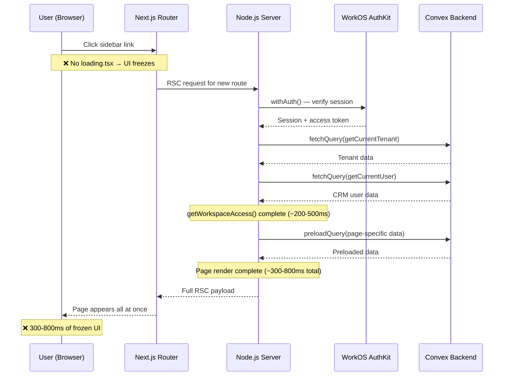
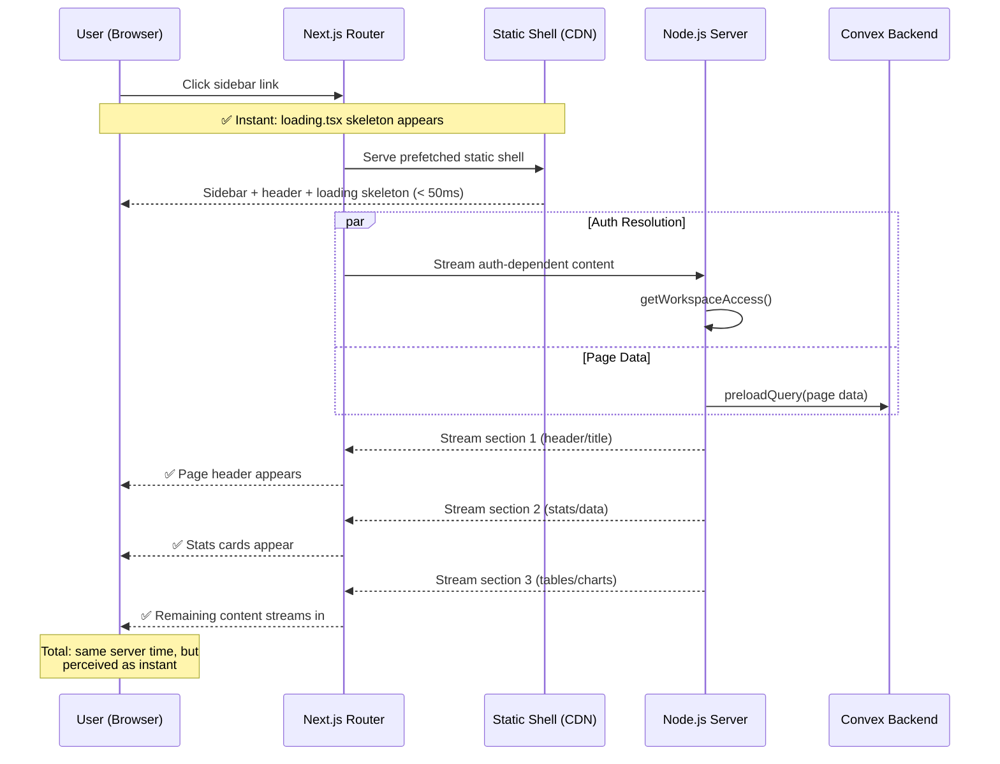
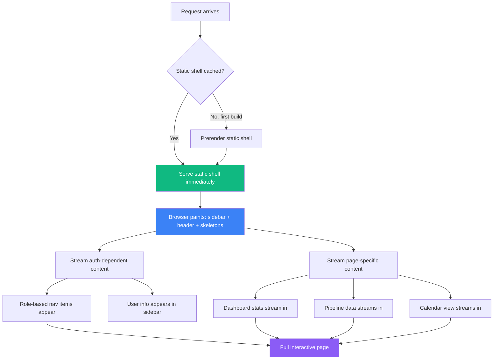
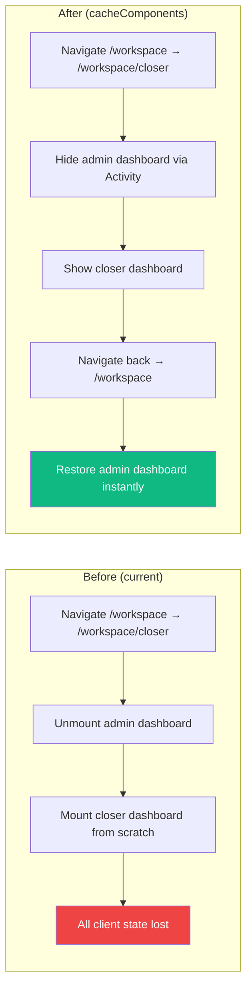

# Frontend Performance & UX Enhancement — Design Specification

**Version:** 0.2 (Single-Day Implementation)
**Status:** Ready for Implementation
**Scope:** Sluggish workspace navigation → Instant, animated, production-grade UX. Audit the current Next.js 16 frontend, enable Partial Prerendering (PPR) via Cache Components, add streaming with Suspense, implement loading states, view transitions, lazy loading, and Activity-based state preservation across the owner/admin and closer workspaces.
**Prerequisite:** Authorization Revamp Phase 2 complete (workspace layout is RSC). No backend/Convex changes required.
**Implementation Window:** Single day, consecutive runs. All phases execute sequentially without waiting between them.

---

## Table of Contents

1. [Goals & Non-Goals](#1-goals--non-goals)
2. [Actors & Roles](#2-actors--roles)
3. [Current State Audit](#3-current-state-audit)
4. [End-to-End Flow Overview](#4-end-to-end-flow-overview)
5. [Phase 1: Streaming Foundation & Config — loading.tsx, error.tsx, cacheComponents](#5-phase-1-streaming-foundation--config)
6. [Phase 2: Layout Streaming Architecture & Activity](#6-phase-2-layout-streaming-architecture--activity)
7. [Phase 3: Suspense Boundaries & Granular Streaming](#7-phase-3-suspense-boundaries--granular-streaming)
8. [Phase 4: View Transitions, Lazy Loading & Validation](#8-phase-4-view-transitions-lazy-loading--validation)
9. [Routing & Authorization](#9-routing--authorization)
10. [Error Handling & Edge Cases](#10-error-handling--edge-cases)
11. [Open Questions](#11-open-questions)
12. [Dependencies](#12-dependencies)
13. [Applicable Skills](#13-applicable-skills)

---

## 1. Goals & Non-Goals

### Goals

- **Instant navigation feedback**: Every workspace route shows a meaningful skeleton within 50ms of click, eliminating the "frozen UI" feel during server-side auth + data preloading.
- **Partial Prerendering (PPR)**: The workspace shell (sidebar, header, breadcrumbs) is prerendered as a static shell at build time and served instantly; auth-dependent and data-dependent sections stream in behind `<Suspense>` boundaries.
- **State preservation across navigations**: Form inputs, scroll positions, expanded sections, and filter states survive route changes via React `<Activity>` (enabled by `cacheComponents`). Up to 3 recent routes preserved.
- **Granular streaming**: Dashboard pages stream independent sections (stats cards, pipeline strip, calendar, system health) in parallel rather than waiting for all data before showing anything.
- **Smooth visual transitions**: Page navigations animate with React View Transitions; streamed content fades in; skeletons gracefully dissolve into real content.
- **Optimized bundle**: Heavy client components (recharts, calendar views, date-fns) are lazy-loaded on demand; dialog code stays out of the initial page bundle.
- **Error resilience**: Every workspace route has an `error.tsx` boundary that catches failures gracefully without crashing the entire app.
- **Validated instant navs**: Routes export `unstable_instant` so the build catches any Suspense boundary misplacement before deployment.

### Non-Goals (deferred)

- Convex backend performance optimization (separate concern — use `convex-performance-audit` skill).
- ISR / `use cache` for Convex data — Convex queries are real-time via WebSocket subscriptions, not HTTP fetch. Caching Convex data server-side is architecturally incompatible with the live-update model. (Re-evaluate if static data endpoints are added.)
- Service worker / offline support (v2).
- Internationalization / i18n (separate design doc).
- Mobile app shell / PWA (separate design doc).

---

## 2. Actors & Roles

| Actor | Identity | Auth Method | Affected Workspaces |
|---|---|---|---|
| **Owner / Tenant Master** | Tenant organization owner | WorkOS AuthKit, member of tenant org | `/workspace` (admin dashboard, team, pipeline, settings, profile) |
| **Tenant Admin** | Tenant organization admin | WorkOS AuthKit, member of tenant org | `/workspace` (same as owner) |
| **Closer** | Sales closer | WorkOS AuthKit, member of tenant org | `/workspace/closer` (dashboard, pipeline, meetings, profile) |
| **System Admin** | Platform operator | WorkOS AuthKit, member of system admin org | `/admin` (not in scope — redirected from workspace) |

> **Note:** All actors experience the same performance bottlenecks because the workspace layout's `await getWorkspaceAccess()` blocks the entire render tree for every role. Improvements benefit all equally.

---

## 3. Current State Audit

### 3.1 Architecture Summary

| Aspect | Current State | Impact |
|---|---|---|
| **Next.js version** | 16.2.1 (App Router) | Supports Cache Components, PPR, Activity, `use cache` — none enabled |
| **React version** | 19.2.4 | Supports `<Activity>`, `use()` hook, View Transitions — none used |
| **`next.config.ts`** | Empty (no options set) | No `cacheComponents`, no experimental features |
| **`loading.tsx` files** | **0 in entire app** | No instant loading feedback on any navigation |
| **`error.tsx` files** | **0 in entire app** | Unhandled errors crash the entire page |
| **`<Suspense>` usage** | 4 total (2 onboarding, 2 pipeline clients) | Most pages have zero streaming |
| **Workspace layout** | Awaits `getWorkspaceAccess()` synchronously | Blocks entire subtree — sidebar, header, and page content |
| **Dynamic imports** | Good — 10+ dialogs lazy-loaded with `{ ssr: false }` | Modals don't bloat initial bundle |
| **View Transitions** | None | Abrupt page swaps on navigation |
| **Prefetching** | Default `<Link>` behavior | Without `loading.tsx`, dynamic pages can't be prefetched |

### 3.2 Navigation Timeline (Current)



### 3.3 Critical Bottlenecks

#### Bottleneck 1: Workspace Layout Blocks Everything

```typescript
// Path: app/workspace/layout.tsx (CURRENT)
export default async function WorkspaceLayout({ children }: { children: ReactNode }) {
  const access = await getWorkspaceAccess(); // ← Blocks entire tree
  // Nothing renders until auth + tenant + user resolution completes
  // The sidebar, header, breadcrumbs — ALL wait for this
  switch (access.kind) {
    case "ready":
      return <WorkspaceShell ...>{children}</WorkspaceShell>;
    // ...
  }
}
```

**Problem:** `getWorkspaceAccess()` chains 3 sequential server calls: `withAuth()` → `fetchQuery(getCurrentTenant)` → `fetchQuery(getCurrentUser)`. Every pixel in the workspace waits for all three.

#### Bottleneck 2: No loading.tsx = No Prefetching for Dynamic Routes

From the Next.js prefetching docs:

| Context | Prefetched payload | Client Cache TTL |
|---|---|---|
| No `loading.js` | Entire page | Until app reload |
| With `loading.js` | Layout to first loading boundary | 30s (configurable) |

Without `loading.tsx`, Next.js must fetch the **entire** server-rendered page before transitioning. With `loading.tsx`, it prefetches up to the loading boundary and shows the skeleton instantly.

#### Bottleneck 3: Client Components Show Skeleton → Fetch → Render

The current pattern creates a double-wait:

1. **Server wait**: `requireRole()` + `preloadQuery()` (200-500ms)
2. **Client wait**: `usePollingQuery()` / `useQuery()` returns `undefined` initially → shows skeleton again

Example in `DashboardPageClient`:
```typescript
// Path: app/workspace/_components/dashboard-page-client.tsx (CURRENT)
const stats = usePollingQuery(api.dashboard.adminStats.getAdminDashboardStats, {}, { intervalMs: 60_000 });
if (stats === undefined) return <DashboardSkeleton />; // ← Second skeleton wait
```

#### Bottleneck 4: No State Preservation

Without `cacheComponents` enabled, every navigation unmounts and remounts components. This means:
- Filter selections in pipeline pages are lost
- Scroll positions reset
- Calendar view state resets
- Form drafts disappear

#### Bottleneck 5: Large Client Boundary

`WorkspaceShell` is `"use client"` and contains: sidebar, header, breadcrumbs, command palette trigger, notification center, theme toggle, keyboard shortcuts. All of this JavaScript must load before the workspace renders.

---

## 4. End-to-End Flow Overview

### 4.1 Target Navigation Timeline (After Implementation)



### 4.2 PPR Rendering Model



---

## 5. Phase 1: Streaming Foundation & Config

**Estimated time:** 2 hours (Run 1 & 2)

This phase combines the original Phases 1 & 2 into a single foundation for all subsequent work. All 7 loading skeletons and 6 error boundaries are created in parallel (same skeleton logic across admin/closer routes), then `cacheComponents` is enabled in config.

### 5.1 What & Why

**5.1.1 Add `loading.tsx` and `error.tsx` to every workspace route segment.** This is the highest-impact change because:

1. **Instant navigation**: `loading.tsx` wraps the page in a `<Suspense>` boundary. The skeleton appears immediately on navigation while the server processes auth + data.
2. **Prefetch enablement**: With `loading.tsx` present, Next.js prefetches the layout up to the loading boundary. Without it, the entire page must be server-rendered before navigation.
3. **Error resilience**: `error.tsx` catches render errors per-route instead of crashing the entire workspace.

**5.1.2 Enable `cacheComponents: true` and `optimizePackageImports` in `next.config.ts`.** `cacheComponents` controls three unified features:

1. **Partial Prerendering (PPR)**: At build time, Next.js renders the static shell (everything above `<Suspense>` boundaries) and ships it as prerendered HTML. Dynamic content streams in at request time.
2. **`use cache` directive**: Mark functions or components as cacheable with customizable lifetimes (`cacheLife`).
3. **React `<Activity>`**: Preserves component state across navigations. Up to 3 routes are preserved in memory.

**5.1.3 Add `optimizePackageImports` for barrel-file heavy dependencies.** Per the `bundle-barrel-imports` Vercel rule (CRITICAL priority), importing from barrel files (e.g., `import { X } from "lucide-react"`) pulls in thousands of unused modules — adding 200-800ms to import time. Next.js 13.5+ has `optimizePackageImports` which automatically transforms these to direct imports at build time. This project uses `lucide-react`, `date-fns`, and `recharts` — all barrel-heavy.

```typescript
// Path: next.config.ts (Phase 1 additions)
import type { NextConfig } from "next";

const nextConfig: NextConfig = {
  cacheComponents: true,
  experimental: {
    optimizePackageImports: ["lucide-react", "date-fns", "recharts"],
  },
  async rewrites() {
    return [
      {
        source: "/ingest/static/:path*",
        destination: "https://us-assets.i.posthog.com/static/:path*",
      },
      {
        source: "/ingest/:path*",
        destination: "https://us.i.posthog.com/:path*",
      },
    ];
  },
  skipTrailingSlashRedirect: true,
};

export default nextConfig;
```

> **Runtime decision:** `loading.tsx` is chosen over manual `<Suspense>` wrapping because it integrates with Next.js prefetching. The framework uses the loading boundary as the prefetch cut-off point. Combined with `cacheComponents: true`, this enables both instant navigation feedback AND state preservation across route transitions.

### 5.2 Loading Skeletons

Each `loading.tsx` must match the dimensions of the final content to prevent Cumulative Layout Shift (CLS). Skeletons reuse the existing `Skeleton` component from shadcn.

```typescript
// Path: app/workspace/loading.tsx
import { Card, CardContent, CardHeader } from "@/components/ui/card";
import { Skeleton } from "@/components/ui/skeleton";

export default function WorkspaceDashboardLoading() {
  return (
    <div className="flex flex-col gap-6">
      {/* Page header */}
      <div className="flex flex-col gap-2">
        <Skeleton className="h-9 w-48" />
        <Skeleton className="h-5 w-80" />
      </div>

      {/* Stats row */}
      <div className="grid grid-cols-1 gap-4 md:grid-cols-2 lg:grid-cols-4">
        {Array.from({ length: 4 }).map((_, i) => (
          <Card key={i}>
            <CardHeader className="pb-3">
              <Skeleton className="h-4 w-24" />
            </CardHeader>
            <CardContent>
              <Skeleton className="h-8 w-16" />
              <Skeleton className="mt-2 h-3 w-32" />
            </CardContent>
          </Card>
        ))}
      </div>

      {/* Pipeline summary */}
      <Card>
        <CardHeader>
          <Skeleton className="h-6 w-36" />
        </CardHeader>
        <CardContent>
          <div className="flex flex-col gap-4">
            {Array.from({ length: 3 }).map((_, i) => (
              <Skeleton key={i} className="h-12 w-full" />
            ))}
          </div>
        </CardContent>
      </Card>

      {/* System health */}
      <Card>
        <CardHeader>
          <Skeleton className="h-6 w-32" />
        </CardHeader>
        <CardContent>
          <Skeleton className="h-20 w-full" />
        </CardContent>
      </Card>
    </div>
  );
}
```

```typescript
// Path: app/workspace/closer/loading.tsx
import { Skeleton } from "@/components/ui/skeleton";

export default function CloserDashboardLoading() {
  return (
    <div className="flex flex-col gap-6">
      {/* Page header */}
      <div className="flex flex-col gap-2">
        <Skeleton className="h-8 w-48" />
        <Skeleton className="h-4 w-64" />
      </div>

      {/* Featured meeting card */}
      <Skeleton className="h-[180px] rounded-xl" />

      {/* Pipeline strip */}
      <div className="flex flex-col gap-3">
        <Skeleton className="h-4 w-24" />
        <div className="grid grid-cols-2 gap-2.5 sm:grid-cols-4 lg:grid-cols-7">
          {Array.from({ length: 7 }).map((_, i) => (
            <Skeleton key={i} className="h-[76px] rounded-lg" />
          ))}
        </div>
      </div>

      {/* Calendar section */}
      <Skeleton className="h-px w-full" /> {/* Separator */}
      <div className="flex flex-col gap-3">
        <Skeleton className="h-6 w-32" />
        <Skeleton className="h-[400px] rounded-xl" />
      </div>
    </div>
  );
}
```

```typescript
// Path: app/workspace/pipeline/loading.tsx
import { Card, CardContent } from "@/components/ui/card";
import { Skeleton } from "@/components/ui/skeleton";

export default function PipelineLoading() {
  return (
    <div className="flex flex-col gap-6">
      <div className="flex items-start justify-between">
        <div className="flex flex-col gap-2">
          <Skeleton className="h-9 w-36" />
          <Skeleton className="h-5 w-72" />
        </div>
        <Skeleton className="h-9 w-28" />
      </div>
      <Skeleton className="h-10 w-full rounded-lg" /> {/* Filters */}
      <Card>
        <CardContent className="pt-6">
          <div className="flex flex-col gap-4">
            {Array.from({ length: 8 }).map((_, i) => (
              <Skeleton key={i} className="h-12 w-full" />
            ))}
          </div>
        </CardContent>
      </Card>
    </div>
  );
}
```

```typescript
// Path: app/workspace/team/loading.tsx
import { Skeleton } from "@/components/ui/skeleton";

export default function TeamLoading() {
  return (
    <div className="flex flex-col gap-6">
      <div className="flex items-start justify-between">
        <div className="flex flex-col gap-2">
          <Skeleton className="h-9 w-32" />
          <Skeleton className="h-5 w-64" />
        </div>
        <Skeleton className="h-9 w-32" />
      </div>
      <div className="flex flex-col gap-1">
        {Array.from({ length: 6 }).map((_, i) => (
          <Skeleton key={i} className="h-16 w-full rounded-md" />
        ))}
      </div>
    </div>
  );
}
```

```typescript
// Path: app/workspace/settings/loading.tsx
import { Card, CardContent, CardHeader } from "@/components/ui/card";
import { Skeleton } from "@/components/ui/skeleton";

export default function SettingsLoading() {
  return (
    <div className="flex flex-col gap-6">
      <div className="flex flex-col gap-2">
        <Skeleton className="h-9 w-32" />
        <Skeleton className="h-5 w-64" />
      </div>
      {Array.from({ length: 2 }).map((_, i) => (
        <Card key={i}>
          <CardHeader>
            <Skeleton className="h-6 w-40" />
            <Skeleton className="h-4 w-64" />
          </CardHeader>
          <CardContent>
            <Skeleton className="h-24 w-full" />
          </CardContent>
        </Card>
      ))}
    </div>
  );
}
```

```typescript
// Path: app/workspace/profile/loading.tsx
import { Card, CardContent, CardHeader } from "@/components/ui/card";
import { Skeleton } from "@/components/ui/skeleton";

export default function ProfileLoading() {
  return (
    <div className="flex flex-col gap-6">
      <div className="flex flex-col gap-2">
        <Skeleton className="h-9 w-32" />
        <Skeleton className="h-5 w-48" />
      </div>
      <Card>
        <CardHeader>
          <Skeleton className="h-6 w-40" />
        </CardHeader>
        <CardContent>
          <div className="flex flex-col gap-4">
            <Skeleton className="h-10 w-full" />
            <Skeleton className="h-10 w-full" />
            <Skeleton className="h-10 w-2/3" />
          </div>
        </CardContent>
      </Card>
    </div>
  );
}
```

```typescript
// Path: app/workspace/closer/pipeline/loading.tsx
import { Skeleton } from "@/components/ui/skeleton";

export default function CloserPipelineLoading() {
  return (
    <div className="flex flex-col gap-6">
      <div className="flex flex-col gap-2">
        <Skeleton className="h-8 w-40" />
        <Skeleton className="h-4 w-72" />
      </div>
      <Skeleton className="h-9 w-full rounded-lg" /> {/* Status tabs */}
      <div className="flex flex-col gap-1">
        {Array.from({ length: 5 }).map((_, i) => (
          <Skeleton key={i} className="h-14 rounded-md" />
        ))}
      </div>
    </div>
  );
}
```

```typescript
// Path: app/workspace/closer/meetings/[meetingId]/loading.tsx
import { Card, CardContent, CardHeader } from "@/components/ui/card";
import { Skeleton } from "@/components/ui/skeleton";

export default function MeetingDetailLoading() {
  return (
    <div className="flex flex-col gap-6">
      <Skeleton className="h-5 w-24" /> {/* Back button */}
      <div className="flex flex-col gap-2">
        <Skeleton className="h-8 w-64" />
        <Skeleton className="h-4 w-48" />
      </div>
      <div className="grid gap-6 md:grid-cols-2">
        <Card>
          <CardHeader><Skeleton className="h-6 w-32" /></CardHeader>
          <CardContent><Skeleton className="h-32 w-full" /></CardContent>
        </Card>
        <Card>
          <CardHeader><Skeleton className="h-6 w-32" /></CardHeader>
          <CardContent><Skeleton className="h-32 w-full" /></CardContent>
        </Card>
      </div>
    </div>
  );
}
```

### 5.3 Error Boundaries

```typescript
// Path: app/workspace/error.tsx
"use client";

import { useEffect } from "react";
import { Button } from "@/components/ui/button";
import { Card, CardContent, CardHeader, CardTitle } from "@/components/ui/card";
import { AlertTriangleIcon, RefreshCwIcon } from "lucide-react";

export default function WorkspaceError({
  error,
  reset,
}: {
  error: Error & { digest?: string };
  reset: () => void;
}) {
  useEffect(() => {
    // Log to error reporting service (PostHog, Sentry, etc.)
    console.error("[WorkspaceError]", error);
  }, [error]);

  return (
    <div className="flex min-h-[50vh] items-center justify-center p-6">
      <Card className="w-full max-w-md">
        <CardHeader className="text-center">
          <div className="mx-auto mb-2 flex h-12 w-12 items-center justify-center rounded-full bg-destructive/10">
            <AlertTriangleIcon className="h-6 w-6 text-destructive" />
          </div>
          <CardTitle>Something went wrong</CardTitle>
        </CardHeader>
        <CardContent className="flex flex-col items-center gap-4">
          <p className="text-center text-sm text-muted-foreground">
            An unexpected error occurred while loading this page.
            {error.digest && (
              <span className="mt-1 block font-mono text-xs">
                Error ID: {error.digest}
              </span>
            )}
          </p>
          <Button onClick={reset} variant="outline" size="sm">
            <RefreshCwIcon data-icon="inline-start" />
            Try again
          </Button>
        </CardContent>
      </Card>
    </div>
  );
}
```

> **Design decision:** A single `error.tsx` at the `/workspace` level catches errors for all child routes. If a specific route needs custom error handling (e.g., meeting not found), it can add its own `error.tsx` that overrides the parent. The workspace shell (sidebar, header) remains interactive because the error boundary is nested inside the layout.

### 5.4 File Manifest — Phase 1

| File | Status | Purpose |
|---|---|---|
| `app/workspace/loading.tsx` | NEW | Admin dashboard skeleton |
| `app/workspace/error.tsx` | NEW | Workspace-wide error boundary |
| `app/workspace/closer/loading.tsx` | NEW | Closer dashboard skeleton |
| `app/workspace/pipeline/loading.tsx` | NEW | Admin pipeline skeleton |
| `app/workspace/team/loading.tsx` | NEW | Team management skeleton |
| `app/workspace/settings/loading.tsx` | NEW | Settings skeleton |
| `app/workspace/profile/loading.tsx` | NEW | Profile skeleton |
| `app/workspace/closer/pipeline/loading.tsx` | NEW | Closer pipeline skeleton |
| `app/workspace/closer/meetings/[meetingId]/loading.tsx` | NEW | Meeting detail skeleton |

---

## 6. Phase 2: Layout Streaming Architecture & Activity

**Estimated time:** 1.5 hours (Run 2)

This phase restructures the workspace layout so the static shell (sidebar frame, header) becomes prerendered at build time and serves instantly. Auth-dependent and page-specific content streams in behind `<Suspense>` boundaries. Combined with `cacheComponents: true` from Phase 1, this enables Partial Prerendering (PPR) and state preservation via React `<Activity>`.

### 6.1 What & Why

**6.1.1 Restructure the workspace layout.** Split `WorkspaceShell` into:

1. **Server Component outer shell** (`workspace-shell-frame.tsx`): Renders the static sidebar frame and header bar. No dynamic data — prerendered at build time and served from CDN / static cache.
2. **Auth-dependent streaming** (`workspace-auth.tsx`): Wrapped in `<Suspense>`, resolves `getWorkspaceAccess()` and renders role-based nav, user info, and page content in parallel streams.
3. **Client Component inner shell** (`workspace-shell-client.tsx`): Handles interactivity (sidebar toggle, command palette, theme toggle) for the dynamic parts.

**6.1.2 Enable `cacheComponents: true` in `next.config.ts`.** (Completed in Phase 1) This flag controls:

1. **Partial Prerendering (PPR)**: Static shell prerendered, dynamic content streams.
2. **`use cache` directive**: Mark cacheable functions with lifetimes.
3. **React `<Activity>`**: Preserves component state across navigations—filter selections, scroll positions, calendar view state, form drafts all survive route changes. Up to 3 recent routes preserved.

### 6.2 Activity Side Effects — State That Must Reset

With Activity enabled, hidden routes stay mounted. This creates situations where transient UI state should reset on hide. Based on the [Preserving UI State guide](node_modules/next/dist/docs/01-app/02-guides/preserving-ui-state.md):

**Dropdowns and popovers** — should close when navigating away:

```typescript
// Path: components/ui/dropdown-with-reset.tsx (pattern to apply)
"use client";

import { useState, useLayoutEffect } from "react";

function useResetOnHide<T>(initialValue: T): [T, React.Dispatch<React.SetStateAction<T>>] {
  const [value, setValue] = useState(initialValue);

  // When Activity hides this component, reset to initial value
  useLayoutEffect(() => {
    return () => {
      setValue(initialValue);
    };
  }, [initialValue]);

  return [value, setValue];
}
```

**Components that need Activity-aware cleanup:**

| Component | Current State | Action Required |
|---|---|---|
| Command Palette (`CommandPalette`) | `ssr: false` dynamic import | Close on hide via `useLayoutEffect` cleanup |
| Notification Center popover | Likely uses local `open` state | Reset `isOpen` on hide |
| Dialog components (invite, remove, etc.) | Dynamically imported, local state | Already safe — modals are per-interaction |
| Pipeline filters (`useSearchParams`) | URL-driven state | Safe — URL is the source of truth |
| Calendar view (`CalendarView`) | Internal date/view state | **Preserve** — user intentionally set this |
| Table sort state (`useTableSort`) | Local state | **Preserve** — user intentionally set this |

### 6.3 What Changes With Activity & Cache Components



### 6.4 Handling `cacheComponents` with Auth-Dependent Layouts

When `cacheComponents` is enabled, Next.js requires that components accessing runtime APIs (`cookies`, `headers`) are wrapped in `<Suspense>`. Our workspace layout calls `getWorkspaceAccess()` which ultimately calls `withAuth()` (reads cookies).

**Important:** Simply enabling `cacheComponents` without restructuring the layout will cause build errors:

```
Error: Uncached data was accessed outside of <Suspense>
```

This is why Phase 3 (Layout Streaming Architecture) must follow Phase 2. In the interim, the workspace layout can opt out of the static shell by placing `<Suspense>` with an empty or minimal fallback around the body — this preserves current behavior while Activity and `loading.tsx` benefits still apply.

### 6.5 Restructured Layout

```typescript
// Path: app/workspace/layout.tsx (PROPOSED)
import { type ReactNode, Suspense } from "react";
import { WorkspaceShellFrame } from "./_components/workspace-shell-frame";
import { WorkspaceAuth } from "./_components/workspace-auth";
import { WorkspaceShellSkeleton } from "./_components/workspace-shell-skeleton";

export default function WorkspaceLayout({
  children,
}: {
  children: ReactNode;
}) {
  return (
    <WorkspaceShellFrame>
      <Suspense fallback={<WorkspaceShellSkeleton />}>
        <WorkspaceAuth>{children}</WorkspaceAuth>
      </Suspense>
    </WorkspaceShellFrame>
  );
}
```

```typescript
// Path: app/workspace/_components/workspace-shell-frame.tsx (PROPOSED — Server Component)
import { type ReactNode } from "react";
import {
  Sidebar,
  SidebarContent,
  SidebarHeader,
  SidebarInset,
  SidebarProvider,
} from "@/components/ui/sidebar";
import { SidebarTrigger } from "@/components/ui/sidebar";
import { Separator } from "@/components/ui/separator";

/**
 * Static shell for the workspace layout.
 * This component contains NO dynamic data — it renders at build time
 * and is served instantly from the CDN / static cache.
 */
export function WorkspaceShellFrame({ children }: { children: ReactNode }) {
  return (
    <SidebarProvider>
      <a
        href="#main-content"
        className="sr-only focus:not-sr-only focus:fixed focus:left-4 focus:top-4 focus:z-50 focus:rounded-md focus:bg-background focus:px-4 focus:py-2 focus:text-sm focus:font-medium focus:text-foreground focus:shadow-lg focus:ring-2 focus:ring-ring"
      >
        Skip to content
      </a>
      <Sidebar>
        <SidebarHeader>
          <span className="px-2 py-1.5 text-xs font-semibold uppercase tracking-[0.25em] text-sidebar-foreground/80">
            Magnus
          </span>
          <Separator className="mx-2" />
        </SidebarHeader>
        <SidebarContent>
          {/* Nav items stream in via children */}
        </SidebarContent>
      </Sidebar>
      <SidebarInset>
        <header className="flex h-12 items-center gap-2 border-b px-4">
          <SidebarTrigger aria-label="Toggle sidebar" />
          <Separator orientation="vertical" className="h-4" />
          {/* Breadcrumbs and toolbar stream in via children */}
        </header>
        <div id="main-content" className="flex-1 overflow-auto p-6" tabIndex={-1}>
          {children}
        </div>
      </SidebarInset>
    </SidebarProvider>
  );
}
```

```typescript
// Path: app/workspace/_components/workspace-auth.tsx (PROPOSED — Server Component, async)
import { type ReactNode } from "react";
import { getWorkspaceAccess } from "@/lib/auth";
import { redirect } from "next/navigation";
import { WorkspaceShellClient } from "./workspace-shell-client";
import { NotProvisionedScreen } from "./not-provisioned-screen";

/**
 * Resolves workspace access inside a Suspense boundary.
 * Redirects/shows error states as needed.
 * Streams in after the static frame is already visible.
 */
export async function WorkspaceAuth({ children }: { children: ReactNode }) {
  const access = await getWorkspaceAccess();

  switch (access.kind) {
    case "system_admin":
      redirect("/admin");
    case "pending_onboarding":
      redirect("/onboarding/connect");
    case "no_tenant":
    case "not_provisioned":
      return <NotProvisionedScreen />;
    case "ready":
      return (
        <WorkspaceShellClient
          initialRole={access.crmUser.role}
          initialDisplayName={access.crmUser.fullName ?? access.crmUser.email}
          initialEmail={access.crmUser.email}
        >
          {children}
        </WorkspaceShellClient>
      );
  }
}
```

> **Decision rationale:** The static `WorkspaceShellFrame` is a Server Component with zero runtime data access. It renders the sidebar frame, the "Magnus" logo, and the header chrome. These elements are identical for every user and every role, so they prerender at build time. The `WorkspaceAuth` component inside `<Suspense>` resolves the auth state and streams in the role-specific nav, user name, and children. This way, the user sees the workspace shell frame instantly, with auth-dependent content appearing within milliseconds.
>
> **`SidebarProvider` client boundary note:** `SidebarProvider` (from shadcn) is a `"use client"` component — it uses `useState`/`useContext` for sidebar open/close state. This does NOT prevent PPR from working. With PPR, even client components' initial HTML output is prerendered at build time — the static shell is the HTML, not the JS. `SidebarProvider` will hydrate on the client after the HTML is served, but the user sees the sidebar frame *immediately* as static HTML. The dynamic split happens at the `<Suspense>` boundary around `WorkspaceAuth` (which reads cookies via `withAuth()`), not at the `"use client"` boundary. If `SidebarProvider` turns out to interfere with the static shell prerender, fall back to wrapping it inside `WorkspaceAuth` instead.

### 6.6 Skeleton for Auth Resolution

```typescript
// Path: app/workspace/_components/workspace-shell-skeleton.tsx (PROPOSED)
import { Skeleton } from "@/components/ui/skeleton";
import {
  SidebarGroup,
  SidebarGroupContent,
  SidebarGroupLabel,
  SidebarMenu,
  SidebarMenuItem,
} from "@/components/ui/sidebar";

/**
 * Shown inside the sidebar/main area while auth resolves.
 * Matches the dimensions of the real nav to prevent CLS.
 */
export function WorkspaceShellSkeleton() {
  return (
    <>
      {/* Sidebar nav skeleton */}
      <SidebarGroup>
        <SidebarGroupLabel>Navigation</SidebarGroupLabel>
        <SidebarGroupContent>
          <SidebarMenu>
            {Array.from({ length: 4 }).map((_, i) => (
              <SidebarMenuItem key={i}>
                <Skeleton className="h-8 w-full rounded-md" />
              </SidebarMenuItem>
            ))}
          </SidebarMenu>
        </SidebarGroupContent>
      </SidebarGroup>

      {/* Main content loading */}
      <div className="flex flex-col gap-4 p-6">
        <Skeleton className="h-8 w-48" />
        <Skeleton className="h-4 w-96" />
      </div>
    </>
  );
}
```

### 6.7 Impact on Render Timeline

| Phase | What renders | When |
|---|---|---|
| Static shell | Sidebar frame, "Magnus" logo, header bar with trigger | **Instant** (prerendered at build time) |
| Auth skeleton | Navigation placeholders, content skeleton | **Instant** (Suspense fallback) |
| Auth resolution | Role-based nav items, user name, role label | **~200-400ms** (auth check streams in) |
| Page content | Dashboard widgets, tables, charts | **~300-800ms** (page data streams in) |

---

## 7. Phase 3: Suspense Boundaries & Granular Streaming

**Estimated time:** 2 hours (Run 3)

This phase breaks dashboard pages into independently streaming sections, adds lazy-loaded components for heavy imports (calendars, charts), and implements client-side view transitions for smooth page swaps.

### 7.1 What & Why

Break dashboard pages into independently streaming sections. Instead of one monolithic client component that shows a full-page skeleton until all data arrives, each widget/section gets its own `<Suspense>` boundary and streams independently.

> **Architecture decision:** We convert dashboard pages from the "thin server wrapper → monolithic client component" pattern to a "server page with multiple Suspense-wrapped sections" pattern. Preloaded queries are started in parallel on the server and passed as promises to client components. Each client component resolves its own data independently via `use()`.
>
> **Why this works with Convex:** `preloadQuery()` returns a serializable preloaded state, not a promise. However, we can still parallelize the server-side calls with `Promise.all()` and wrap each section's client component in its own `<Suspense>`. The client component calls `usePreloadedQuery()` which resolves synchronously from the preloaded state — so the actual streaming benefit comes from splitting the server-side data resolution into independent boundaries.

### 7.2 Admin Dashboard — Granular Streaming

```typescript
// Path: app/workspace/page.tsx (PROPOSED)
import { Suspense } from "react";
import { preloadQuery } from "convex/nextjs";
import { api } from "@/convex/_generated/api";
import { ADMIN_ROLES } from "@/convex/lib/roleMapping";
import { requireRole } from "@/lib/auth";
import { DashboardHeader } from "./_components/dashboard-header";
import { StatsSection } from "./_components/stats-section";
import { PipelineSection } from "./_components/pipeline-section";
import { SystemHealthSection } from "./_components/system-health-section";
import { StatsRowSkeleton } from "./_components/skeletons/stats-row-skeleton";
import { PipelineSummarySkeleton } from "./_components/skeletons/pipeline-summary-skeleton";
import { SystemHealthSkeleton } from "./_components/skeletons/system-health-skeleton";

export default async function AdminDashboardPage() {
  const { crmUser } = await requireRole(ADMIN_ROLES);

  return (
    <div className="flex flex-col gap-6">
      {/* Header renders immediately — no data dependency */}
      <DashboardHeader displayName={crmUser.fullName ?? crmUser.email} />

      {/* Each section streams independently */}
      <Suspense fallback={<StatsRowSkeleton />}>
        <StatsSection />
      </Suspense>

      <Suspense fallback={<PipelineSummarySkeleton />}>
        <PipelineSection />
      </Suspense>

      <Suspense fallback={<SystemHealthSkeleton />}>
        <SystemHealthSection />
      </Suspense>
    </div>
  );
}
```

```typescript
// Path: app/workspace/_components/dashboard-header.tsx (PROPOSED — pure component, no data)
export function DashboardHeader({ displayName }: { displayName: string }) {
  return (
    <div>
      <h1 className="text-3xl font-bold tracking-tight">Dashboard</h1>
      <p className="mt-2 text-muted-foreground">
        Welcome back, {displayName}
      </p>
    </div>
  );
}
```

### 7.3 Closer Dashboard — Granular Streaming

```typescript
// Path: app/workspace/closer/page.tsx (PROPOSED)
import { Suspense } from "react";
import { preloadQuery } from "convex/nextjs";
import { api } from "@/convex/_generated/api";
import { requireRole } from "@/lib/auth";
import { CloserDashboardHeader } from "./_components/closer-dashboard-header";
import { FeaturedMeetingSection } from "./_components/featured-meeting-section";
import { PipelineStripSection } from "./_components/pipeline-strip-section";
import { CalendarSection } from "./_components/calendar-section";
import { Skeleton } from "@/components/ui/skeleton";
import { Separator } from "@/components/ui/separator";

export default async function CloserDashboardPage() {
  const { session } = await requireRole(["closer"]);

  // Start all preloads in parallel
  const preloadedProfile = preloadQuery(
    api.closer.dashboard.getCloserProfile,
    {},
    { token: session.accessToken },
  );
  const preloadedPipelineSummary = preloadQuery(
    api.closer.dashboard.getPipelineSummary,
    {},
    { token: session.accessToken },
  );

  // Resolve profile for header (fast, needed for display name)
  const profile = await preloadedProfile;

  return (
    <div className="flex flex-col gap-6">
      <Suspense fallback={<Skeleton className="h-14 w-64" />}>
        <CloserDashboardHeader preloadedProfile={profile} />
      </Suspense>

      <Suspense fallback={<Skeleton className="h-[180px] rounded-xl" />}>
        <FeaturedMeetingSection />
      </Suspense>

      <Suspense
        fallback={
          <div className="grid grid-cols-2 gap-2.5 sm:grid-cols-4 lg:grid-cols-7">
            {Array.from({ length: 7 }).map((_, i) => (
              <Skeleton key={i} className="h-[76px] rounded-lg" />
            ))}
          </div>
        }
      >
        <PipelineStripSection preloadedPipelineSummary={preloadedPipelineSummary} />
      </Suspense>

      <Separator />

      <Suspense fallback={<Skeleton className="h-[400px] rounded-xl" />}>
        <CalendarSection />
      </Suspense>
    </div>
  );
}
```

### 7.4 CLS Prevention Rules

Skeleton dimensions must match final content dimensions. Rules for skeleton components:

| Content Type | Skeleton Strategy |
|---|---|
| Text headings | Match `h-` and `w-` to font size and expected text length |
| Stats cards | Use actual `<Card>` component structure with `<Skeleton>` fills |
| Tables | Fixed number of rows matching typical data (5-8), match `h-12` row height |
| Charts | Single `<Skeleton>` with `min-h-[300px]` matching chart container |
| Calendar | `<Skeleton className="h-[400px]">` matching calendar widget height |
| Pipeline strip | Grid of 7 skeleton boxes matching actual grid layout |

> **Design rule (CLS):** Every `<Suspense>` fallback must use `min-h-` or explicit `h-` that matches the resolved content's height. Use fixed containers around Suspense boundaries when the content height varies.

---

## 8. Phase 4: View Transitions, Lazy Loading & Validation

**Estimated time:** 1.5 hours (Run 4)

This phase adds client-side view transitions for smooth page animations, lazy-loads heavy components (recharts, calendars), and adds build-time validation via `unstable_instant` exports.

### 8.1 What & Why

**8.1.1 Lazy load heavy libraries.** Move recharts, date-fns, and calendar components into dynamic imports with proper loading skeletons. These are only needed on certain routes and significantly bloat the initial bundle.

**8.1.2 Add view transitions.** Use React's View Transition API via Next.js to animate page navigations smoothly. This eliminates the abrupt visual jarring of instant navigation and provides visual continuity.

**8.1.3 Validate streaming architecture.** Export `unstable_instant` from workspace routes to validate at build time that navigations produce an instant static shell. The build catches Suspense boundary misplacement before deployment.

### 8.2 Current Dynamic Import Audit

| Component | Import Style | SSR | Loading Fallback | Optimization |
|---|---|---|---|---|
| `CommandPalette` | `dynamic(() => ..., { ssr: false })` | No | None (flash) | Add loading spinner |
| `InviteUserDialog` | `dynamic(() => ..., { ssr: false })` | No | None | OK — only loads on button click |
| `RemoveUserDialog` | `dynamic(() => ..., { ssr: false })` | No | None | OK |
| `CalendlyLinkDialog` | `dynamic(() => ..., { ssr: false })` | No | None | OK |
| `RoleEditDialog` | `dynamic(() => ..., { ssr: false })` | No | None | OK |
| `EventTypeConfigDialog` | `dynamic(() => ..., { ssr: false })` | No | None | OK |
| `CreateTenantDialog` | `dynamic(() => ..., { ssr: false })` | No | None | OK |
| `ResetTenantDialog` | `dynamic(() => ..., { ssr: false })` | No | None | OK |

**Components NOT currently lazy-loaded that should be:**

| Component | Why Lazy | Phase |
|---|---|---|
| `recharts` (`Recharts`) | ~200KB — only used in dashboard stats | Lazy load via `dynamic()` with chart skeleton |
| `CalendarView` (closer dashboard) | Complex component with date-fns, multiple view modes | Lazy load on closer routes only |
| `NotificationCenter` | Popover with polling — not needed at first paint | Lazy load with placeholder icon |
| `WorkspaceBreadcrumbs` | Reads pathname — not critical for first paint | Consider keeping static for now |

### 8.3 Lazy Loading Heavy Charts

```typescript
// Path: app/workspace/_components/stats-section.tsx (PROPOSED)
"use client";

import dynamic from "next/dynamic";
import { Skeleton } from "@/components/ui/skeleton";

const StatsCharts = dynamic(
  () => import("./stats-charts").then((m) => ({ default: m.StatsCharts })),
  {
    ssr: false,
    loading: () => (
      <div className="grid grid-cols-1 gap-4 md:grid-cols-2">
        <Skeleton className="h-[300px] rounded-xl" />
        <Skeleton className="h-[300px] rounded-xl" />
      </div>
    ),
  },
);

export function StatsSection() {
  // ... data fetching ...
  return <StatsCharts data={stats} />;
}
```

### 8.4 Lazy Loading Calendar

```typescript
// Path: app/workspace/closer/_components/calendar-section.tsx (PROPOSED)
"use client";

import dynamic from "next/dynamic";
import { Skeleton } from "@/components/ui/skeleton";

const CalendarView = dynamic(
  () => import("./calendar-view").then((m) => ({ default: m.CalendarView })),
  {
    ssr: false,
    loading: () => <Skeleton className="h-[400px] rounded-xl" />,
  },
);

export function CalendarSection() {
  return (
    <div>
      <h2 className="mb-3 text-lg font-semibold tracking-tight text-pretty">
        My Schedule
      </h2>
      <CalendarView />
    </div>
  );
}
```

### 8.5 Bundle Analysis

Next.js 16.1+ includes a built-in bundle analyzer — no third-party package needed:

```bash
# Built-in analyzer (Next.js 16.1+) — interactive UI with treemap, route filtering, import chains
pnpm next experimental-analyze

# Save output for before/after comparison
pnpm next experimental-analyze --output
# Output saved to .next/diagnostics/analyze
```

> **Note:** The `@next/bundle-analyzer` package is **not needed**. The built-in `next experimental-analyze` command provides the same functionality (and more) without a dependency. Run it before Phase 1 implementation for a baseline, and again after Phase 4 to quantify improvement.

---

#### 8.6.1 Page Transition — Cross-Fade

Add smooth visual transitions between pages using React's View Transition API. This transforms abrupt page swaps into polished, app-like navigation experiences. From the `vercel-react-view-transitions` skill:
- `<ViewTransition>` component wraps elements that should animate across navigations
- `addTransitionType` classifies transition types (e.g., "navigation", "slide-forward")
- CSS `::view-transition-*` pseudo-elements control animation

```typescript
// Path: app/workspace/_components/workspace-shell-client.tsx (PROPOSED addition)
"use client";

import { ViewTransition } from "react";
import { type ReactNode } from "react";

export function PageTransition({ children }: { children: ReactNode }) {
  return (
    <ViewTransition default="page-transition">
      {children}
    </ViewTransition>
  );
}
```

```css
/* Path: app/globals.css (additions) */

/* Page transition: cross-fade */
::view-transition-group(page-transition) {
  animation-duration: 200ms;
  animation-timing-function: ease-out;
}

::view-transition-old(page-transition) {
  animation: fade-out 150ms ease-out;
}

::view-transition-new(page-transition) {
  animation: fade-in 200ms ease-out;
}

@keyframes fade-out {
  from { opacity: 1; }
  to { opacity: 0; }
}

@keyframes fade-in {
  from { opacity: 0; transform: translateY(4px); }
  to { opacity: 1; transform: translateY(0); }
}
```

#### 8.6.2 Streamed Content Entrance Animation

When Suspense boundaries resolve and content replaces skeletons, add a subtle entrance animation:

```css
/* Path: app/globals.css (additions) */

/* Streamed content entrance — applied to elements replacing Suspense fallbacks */
@keyframes stream-in {
  from {
    opacity: 0;
    transform: translateY(8px);
  }
  to {
    opacity: 1;
    transform: translateY(0);
  }
}

.animate-stream-in {
  animation: stream-in 300ms ease-out;
}
```

```typescript
// Path: components/ui/stream-boundary.tsx (PROPOSED — reusable wrapper)
"use client";

import { type ReactNode, Suspense } from "react";

interface StreamBoundaryProps {
  fallback: ReactNode;
  children: ReactNode;
  className?: string;
}

/**
 * Suspense boundary that adds an entrance animation when content resolves.
 * Wraps the resolved content in an animate-stream-in container.
 */
export function StreamBoundary({ fallback, children, className }: StreamBoundaryProps) {
  return (
    <Suspense fallback={fallback}>
      <div className={`animate-stream-in ${className ?? ""}`}>
        {children}
      </div>
    </Suspense>
  );
}
```

> **Tradeoff note:** `StreamBoundary` adds an extra `<div>` wrapper around every resolved Suspense child. This can break flex/grid parent layouts if not accounted for. When using inside a grid or flex container, pass `className="contents"` to make the wrapper invisible to CSS layout, or apply the animation class directly to the resolved component's root element instead of using `StreamBoundary`. If View Transitions (8.6.1) already provide sufficient visual continuity, this component may be unnecessary — test both approaches.

#### 8.6.3 Skeleton Pulse Enhancement

Upgrade the default skeleton pulse to a more polished shimmer effect:

```css
/* Path: app/globals.css (additions) */

/* Enhanced skeleton shimmer */
@keyframes shimmer {
  0% { background-position: -200% 0; }
  100% { background-position: 200% 0; }
}

.skeleton-shimmer {
  background: linear-gradient(
    90deg,
    hsl(var(--muted)) 25%,
    hsl(var(--muted-foreground) / 0.08) 50%,
    hsl(var(--muted)) 75%
  );
  background-size: 200% 100%;
  animation: shimmer 1.5s ease-in-out infinite;
}

/* Accessibility: respect reduced motion preference for ALL animations */
@media (prefers-reduced-motion: reduce) {
  ::view-transition-group(*),
  ::view-transition-old(*),
  ::view-transition-new(*) {
    animation-duration: 0.01ms !important;
  }

  .animate-stream-in,
  .animate-progress-bar,
  .skeleton-shimmer {
    animation: none !important;
  }

  .animate-stream-in {
    opacity: 1;
    transform: none;
  }
}
```

> **Accessibility (`web-design-guidelines` skill):** All proposed animations (view transitions, stream-in, shimmer, progress bar) MUST respect `prefers-reduced-motion: reduce`. The CSS block above disables all animations for users who prefer reduced motion. This is a WCAG 2.1 Level AA requirement (Success Criterion 2.3.3).

#### 8.6.4 Navigation Indicator (Optional)

> **Implementation note:** With `loading.tsx` providing instant skeletons and View Transitions providing visual continuity, a navigation progress bar is *redundant* feedback in most cases. Consider omitting this initially and adding only if user testing reveals a need.
>
> **Suspense requirement (`next-best-practices` skill):** `usePathname()` requires a `<Suspense>` boundary in dynamic routes — this component must be wrapped in `<Suspense>` or placed inside a layout that already provides one.

If needed, a thin progress bar at the top of the page during navigations (similar to NProgress):

```typescript
// Path: components/navigation-progress.tsx (PROPOSED)
"use client";

import { useEffect, useState, useTransition } from "react";
import { usePathname } from "next/navigation";

export function NavigationProgress() {
  const pathname = usePathname();
  const [isNavigating, setIsNavigating] = useState(false);
  const [prevPathname, setPrevPathname] = useState(pathname);

  useEffect(() => {
    if (pathname !== prevPathname) {
      setIsNavigating(true);
      setPrevPathname(pathname);
      // Auto-hide after navigation completes
      const timer = setTimeout(() => setIsNavigating(false), 500);
      return () => clearTimeout(timer);
    }
  }, [pathname, prevPathname]);

  if (!isNavigating) return null;

  return (
    <div className="fixed top-0 left-0 right-0 z-[100] h-0.5">
      <div className="h-full animate-progress-bar bg-primary" />
    </div>
  );
}
```

```css
/* Path: app/globals.css (additions) */

@keyframes progress-bar {
  0% { width: 0; }
  50% { width: 70%; }
  100% { width: 100%; }
}

.animate-progress-bar {
  animation: progress-bar 500ms ease-out forwards;
}
```

---

### 8.7 Build-Time Validation with `unstable_instant`

Add `unstable_instant` exports to workspace routes to validate at build time that navigations produce an instant static shell. This catches Suspense boundary misplacement before deployment.

From the Next.js docs:
> `unstable_instant` tells Next.js to validate that this page produces an instant static shell at every possible entry point. Validation runs during development and at build time. If a component would block navigation, the error overlay tells you exactly which one and suggests a fix.

#### 8.7.1 Route-Level Validation

```typescript
// Path: app/workspace/page.tsx (add to top)
export const unstable_instant = { prefetch: "static" };
```

```typescript
// Path: app/workspace/closer/page.tsx (add to top)
export const unstable_instant = { prefetch: "static" };
```

```typescript
// Path: app/workspace/pipeline/page.tsx (add to top)
export const unstable_instant = { prefetch: "static" };
```

```typescript
// Path: app/workspace/team/page.tsx (add to top)
export const unstable_instant = { prefetch: "static" };
```

```typescript
// Path: app/workspace/settings/page.tsx (add to top)
export const unstable_instant = { prefetch: "static" };
```

```typescript
// Path: app/workspace/profile/page.tsx (add to top)
export const unstable_instant = { prefetch: "static" };
```

### 8.8 DevTools Configuration

```typescript
// Path: next.config.ts (final state after all phases)
import type { NextConfig } from "next";

const nextConfig: NextConfig = {
  cacheComponents: true,
  experimental: {
    optimizePackageImports: ["lucide-react", "date-fns", "recharts"],
    instantNavigationDevToolsToggle: true,
  },
  async rewrites() {
    return [
      { source: "/ingest/static/:path*", destination: "https://us-assets.i.posthog.com/static/:path*" },
      { source: "/ingest/:path*", destination: "https://us.i.posthog.com/:path*" },
    ];
  },
  skipTrailingSlashRedirect: true,
};

export default nextConfig;
```

This adds an "Instant Navs" toggle in the Next.js DevTools overlay:
- **Page load**: Freezes the page at the static shell to verify what renders before dynamic content streams in.
- **Client navigation**: Shows the prefetched UI for the target page, confirming what appears instantly on link click.

### 8.9 Performance Benchmarks

After all phases are implemented, measure:

| Metric | Target | How to Measure |
|---|---|---|
| **TTFB** | < 200ms | Chrome DevTools → Timing |
| **FCP (First Contentful Paint)** | < 500ms | Lighthouse |
| **LCP (Largest Contentful Paint)** | < 1.5s | Lighthouse |
| **CLS (Cumulative Layout Shift)** | < 0.1 | Lighthouse |
| **INP (Interaction to Next Paint)** | < 200ms | Chrome DevTools |
| **Navigation perceived latency** | < 100ms (skeleton visible) | Manual testing with DevTools throttle |
| **Client-side navigation time** | < 50ms to skeleton | Performance API `navigation` entries |

### 8.10 Web Vitals Monitoring

```typescript
// Path: app/workspace/_components/web-vitals-reporter.tsx (PROPOSED)
"use client";

import { useReportWebVitals } from "next/web-vitals";

export function WebVitalsReporter() {
  useReportWebVitals((metric) => {
    // Send to PostHog or analytics service
    // metric.name: 'FCP' | 'LCP' | 'CLS' | 'INP' | 'TTFB'
    console.debug(`[WebVitals] ${metric.name}: ${metric.value.toFixed(1)}ms`);
  });

  return null;
}
```

---

## 9. Routing & Authorization

### 9.1 Route Structure (With New Files)

```
app/
├── layout.tsx                                    # Root layout (providers, fonts)
├── globals.css                                   # MODIFIED: animations, transitions — Phase 4
├── workspace/
│   ├── layout.tsx                                # MODIFIED: streaming layout — Phase 3
│   ├── loading.tsx                               # NEW: admin dashboard skeleton — Phase 1
│   ├── error.tsx                                 # NEW: workspace error boundary — Phase 1
│   ├── page.tsx                                  # MODIFIED: granular Suspense — Phase 4
│   ├── _components/
│   │   ├── workspace-shell.tsx                   # MODIFIED: split into frame + client — Phase 3
│   │   ├── workspace-shell-frame.tsx             # NEW: static server shell — Phase 3
│   │   ├── workspace-shell-client.tsx            # NEW: auth-dependent client shell — Phase 3
│   │   ├── workspace-auth.tsx                    # NEW: Suspense-wrapped auth — Phase 3
│   │   ├── workspace-shell-skeleton.tsx          # NEW: shell loading skeleton — Phase 3
│   │   ├── dashboard-header.tsx                  # NEW: pure header component — Phase 4
│   │   ├── dashboard-page-client.tsx             # MODIFIED: remove full-page skeleton — Phase 4
│   │   ├── skeletons/                            # NEW: granular skeleton directory — Phase 4
│   │   │   ├── stats-row-skeleton.tsx
│   │   │   ├── pipeline-summary-skeleton.tsx
│   │   │   └── system-health-skeleton.tsx
│   │   └── ...existing...
│   ├── closer/
│   │   ├── loading.tsx                           # NEW: closer dashboard skeleton — Phase 1
│   │   ├── page.tsx                              # MODIFIED: granular Suspense — Phase 4
│   │   ├── pipeline/
│   │   │   ├── loading.tsx                       # NEW: closer pipeline skeleton — Phase 1
│   │   │   └── ...existing...
│   │   ├── meetings/
│   │   │   └── [meetingId]/
│   │   │       ├── loading.tsx                   # NEW: meeting detail skeleton — Phase 1
│   │   │       └── ...existing...
│   │   └── _components/
│   │       ├── calendar-section.tsx              # NEW: lazy-loaded calendar wrapper — Phase 4
│   │       └── ...existing...
│   ├── pipeline/
│   │   ├── loading.tsx                           # NEW: admin pipeline skeleton — Phase 1
│   │   └── ...existing...
│   ├── team/
│   │   ├── loading.tsx                           # NEW: team skeleton — Phase 1
│   │   └── ...existing...
│   ├── settings/
│   │   ├── loading.tsx                           # NEW: settings skeleton — Phase 1
│   │   └── ...existing...
│   └── profile/
│       ├── loading.tsx                           # NEW: profile skeleton — Phase 1
│       └── ...existing...
├── components/
│   ├── ui/
│   │   └── stream-boundary.tsx                   # NEW: animated Suspense wrapper — Phase 4
│   └── navigation-progress.tsx                   # NEW: top progress bar (optional) — Phase 4
└── next.config.ts                                # MODIFIED: cacheComponents + optimizePackageImports + experimental — Phases 1, 4
```

### 9.2 Auth Flow With PPR

```mermaid
flowchart TD
    A[Request to /workspace/*] --> B[Static shell served instantly]
    B --> C{Suspense boundary}
    C --> D[WorkspaceAuth resolves]
    D --> E{access.kind}
    
    E -->|system_admin| F[redirect /admin]
    E -->|pending_onboarding| G[redirect /onboarding/connect]
    E -->|no_tenant / not_provisioned| H[NotProvisionedScreen]
    E -->|ready| I[WorkspaceShellClient renders]
    
    I --> J{User role}
    J -->|admin| K[Admin nav items stream in]
    J -->|closer| L[Closer nav items stream in]
    
    K --> M[Page content streams behind loading.tsx]
    L --> M
    
    Note over F,G: Redirects happen mid-stream as client-side redirects
    Note over B: Sidebar frame + header visible instantly
    
    style B fill:#10b981,color:#fff
    style I fill:#3b82f6,color:#fff
```

> **Important note on redirects:** With PPR, the `200 OK` status code is sent with the static shell before `WorkspaceAuth` resolves. If a redirect is needed (system_admin, pending_onboarding), it becomes a client-side redirect via `<meta>` tag injection rather than a `301/302` HTTP redirect. This is acceptable because:
> 1. These are authenticated routes — search engines don't index them.
> 2. The user sees the sidebar frame briefly before the redirect fires — this is better UX than a blank screen waiting for the redirect.
> 3. For the common case (`ready`), no redirect happens and the user gets instant navigation.

---

## 10. Error Handling & Edge Cases

### 10.1 Auth Failure During Streaming

**Scenario:** `withAuth()` fails mid-stream (token expired, WorkOS down).
**Detection:** `getWorkspaceAccess()` throws or redirects to `/sign-in`.
**Recovery:** The `error.tsx` boundary catches the error and shows the retry UI. The workspace shell frame remains visible. The user can retry or navigate to sign-in.
**User sees:** Sidebar frame (static) + error card in main content area.

### 10.2 Convex Preload Failure

**Scenario:** `preloadQuery()` fails (Convex backend unreachable, query throws).
**Detection:** Promise rejection inside a `<Suspense>` boundary.
**Recovery:** `error.tsx` boundary catches. The rest of the page (other Suspense boundaries) continues to render normally.
**User sees:** Other sections load fine; failed section shows error card with retry.

### 10.3 Activity State After Session Expiry

**Scenario:** User navigates away, session expires, navigates back to preserved route.
**Detection:** Convex subscription re-authentication fails; `useAuth()` reports unauthenticated.
**Recovery:** Existing session expiry toast fires (from `ConvexClientProvider`). Activity-preserved state is stale but harmless — the user is prompted to sign in.
**User sees:** Previous page appears (from Activity cache) with session expiry toast.

### 10.4 CLS From Skeleton Mismatch

**Scenario:** Skeleton height doesn't match resolved content height.
**Detection:** Lighthouse CLS score > 0.1.
**Recovery:** Adjust skeleton dimensions. Use `min-h-` containers around Suspense boundaries.
**Prevention:** Each skeleton component is co-located with its content component and tested visually.

### 10.5 Slow Network — Streaming Stall

**Scenario:** User on slow connection sees skeleton for extended period.
**Detection:** Suspense boundary hasn't resolved after 3 seconds.
**Recovery:** Skeletons have a subtle pulse animation that communicates "loading" state. No timeout — streaming will complete when data arrives.
**User sees:** Animated skeleton that clearly communicates loading state.

### 10.6 View Transition Fallback

**Scenario:** Browser doesn't support View Transition API.
**Detection:** React's `<ViewTransition>` gracefully falls back.
**Recovery:** Standard instant navigation (no animation). No error thrown.
**User sees:** Same behavior as without view transitions — abrupt but functional page swap.

---

## 11. Open Questions

| # | Question | Current Thinking |
|---|---|---|
| 1 | Should we add `loading.tsx` to the root `/workspace` or let each sub-route handle it? | Add at both levels. `/workspace/loading.tsx` covers the admin dashboard; each sub-route has its own for navigation between routes within the workspace. |
| 2 | Will `cacheComponents` conflict with the ConvexClientProvider's auth flow? | Unlikely — ConvexClientProvider is a client component in the root layout, which is always rendered. Activity preservation means it stays mounted. Need to test. |
| 3 | How does Activity interact with Convex's real-time subscriptions? | When a route is hidden via Activity, effects clean up (subscriptions pause). When visible again, effects re-run (subscriptions resume). This is the correct behavior — no stale data. Need to verify with `useQuery`. |
| ~~4~~ | ~~Should we use `@next/bundle-analyzer` to measure before/after?~~ | **Resolved.** No package needed — use built-in `pnpm next experimental-analyze` (Next.js 16.1+). Run before Phase 1 for baseline, after Phase 4 for comparison. |
| ~~5~~ | ~~Should the `WorkspaceShellFrame` be a Server Component or static HTML?~~ | **Resolved.** Server Component, but `SidebarProvider` inside it is `"use client"`. This is fine — PPR prerendering includes client component HTML output. The dynamic split happens at the `<Suspense>` boundary around `WorkspaceAuth`, not at the client boundary. See architectural note in Phase 2. |
| ~~6~~ | ~~Is `react-day-picker` tree-shakeable enough or should we lazy-load the entire calendar?~~ | **Resolved.** Lazy-load the entire `CalendarView` (Phase 4). It pulls in `react-day-picker` + `date-fns` locale data + view mode logic. `optimizePackageImports` handles `date-fns` barrel imports for any non-lazy-loaded usage. |
| ~~7~~ | ~~Should we implement `useReportWebVitals` in Phase 1 or Phase 7?~~ | **Resolved.** Single-day implementation — add it at the end of Phase 4 as a validation step. Collect baseline via Lighthouse/DevTools before starting Phase 1. |
| ~~8~~ | ~~Can we use ISR for any workspace pages?~~ | **Resolved.** No — all workspace pages require authentication (cookies/tokens), making them inherently dynamic. ISR is for public/static content. |

---

## 12. Dependencies

### New Packages

None required. All features (PPR, Cache Components, Activity, View Transitions, bundle analysis) are built into Next.js 16.2.1 and React 19.2.4. Bundle analysis uses the built-in `pnpm next experimental-analyze` command.

### Already Installed (no action needed)

| Package | Used for |
|---|---|
| `next` 16.2.1 | Framework — PPR, Cache Components, Activity, View Transitions all built-in |
| `react` 19.2.4 | `<Suspense>`, `<Activity>`, `<ViewTransition>`, `use()` hook |
| `react-dom` 19.2.4 | DOM streaming, selective hydration |
| `next-themes` | Theme toggle — preserved across navigations via Activity |
| `sonner` | Toast notifications — works with streaming (client-side only) |
| `lucide-react` | Icons in skeleton/error components |

### Environment Variables

No new environment variables required. All features are controlled by `next.config.ts`. Bundle analysis uses `pnpm next experimental-analyze` (no env vars needed).

---

## 13. Applicable Skills

| Skill | When to Invoke | Phase(s) | Key Rules Referenced |
|---|---|---|---|
| `next-best-practices` | File conventions, `loading.tsx`/`error.tsx` placement, Suspense boundary requirements, `usePathname` caveats, bundling, RSC boundary validation, data patterns, `cacheComponents`/`use cache` directives | All phases | `suspense-boundaries`, `file-conventions`, `bundling`, `rsc-boundaries`, `data-patterns`, `directives`, `error-handling` |
| `vercel-react-best-practices` | React 19 patterns, barrel import optimization, dynamic imports, server-side parallel fetching, Activity usage, deferred third-party loading | All phases | `bundle-barrel-imports` (CRITICAL), `bundle-dynamic-imports` (CRITICAL), `async-suspense-boundaries` (HIGH), `server-parallel-fetching` (CRITICAL), `rendering-activity` (MEDIUM), `bundle-defer-third-party` (MEDIUM) |
| `frontend-design` | Building skeleton components, error boundaries, navigation progress bar | Phases 1, 4 |  |
| `shadcn` | Using shadcn `Skeleton`, `Card`, `Button` in loading/error states | Phases 1, 3 |  |
| `vercel-composition-patterns` | Splitting WorkspaceShell into frame + client, composition with Suspense | Phase 2 |  |
| `vercel-react-view-transitions` | Implementing page transitions with `<ViewTransition>`, CSS animations | Phase 4 |  |
| `web-design-guidelines` | WCAG compliance for loading states, error boundaries, skip links, `prefers-reduced-motion` | All phases |  |

---

*This document is a living specification. Sections will be updated as implementation progresses and open questions are resolved.*
