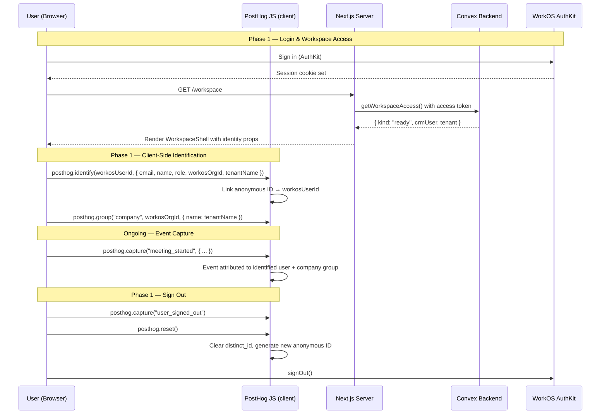
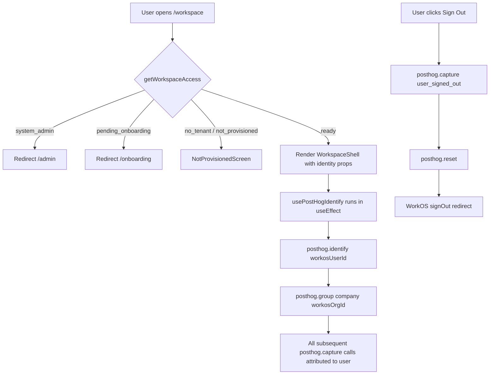

# PostHog User Identification — Design Specification

**Version:** 0.2 (MVP)
**Status:** Draft
**Scope:** Anonymous PostHog sessions → fully identified users. Every logged-in CRM user is identified to PostHog by WorkOS user ID, with person properties for name, email, CRM role, WorkOS org ID, and tenant name. Identity resets on sign-out.
**Prerequisite:** PostHog client-side SDK initialized via `instrumentation-client.ts`. PostHog server-side SDK available at `lib/posthog-server.ts`. WorkOS AuthKit active. Users and tenants tables populated.

---

## Table of Contents

1. [Goals & Non-Goals](#1-goals--non-goals)
2. [Actors & Roles](#2-actors--roles)
3. [End-to-End Flow Overview](#3-end-to-end-flow-overview)
4. [Phase 1: Client-Side Identification & Reset](#4-phase-1-client-side-identification--reset)
5. [Phase 2: Server-Side Identification](#5-phase-2-server-side-identification)
6. [Data Model](#6-data-model)
7. [PostHog Properties & Traits](#7-posthog-properties--traits)
8. [Convex Function Architecture](#8-convex-function-architecture)
9. [Routing & Frontend Integration](#9-routing--frontend-integration)
10. [Security Considerations](#10-security-considerations)
11. [Error Handling & Edge Cases](#11-error-handling--edge-cases)
12. [Open Questions](#12-open-questions)
13. [Dependencies](#13-dependencies)
14. [Applicable Skills](#14-applicable-skills)

---

## 1. Goals & Non-Goals

### Goals

- **Unique user identity**: Every logged-in CRM user is identified to PostHog using their `workosUserId` as the `distinct_id`.
- **Rich person properties**: PostHog person profiles include `email`, `name`, `role`, `workosOrgId`, and `tenantName` — enabling segmentation, cohorts, and filtered dashboards.
- **Session correlation**: All events captured after `posthog.identify()` are attributed to the identified user. Anonymous pre-login events are automatically merged by PostHog when `identify()` links the anonymous ID to the distinct ID.
- **Clean logout**: `posthog.reset()` is called on sign-out so that subsequent sessions on a shared device are not attributed to the previous user.
- **Tenant-scoped analytics**: PostHog group analytics use `workosOrgId` as the group key for the `company` group type, enabling per-tenant dashboards.

### Non-Goals (deferred)

- Server-side event capture with user context propagation via HTTP headers (Phase 2).
- Custom PostHog group properties beyond tenant name (Phase 2).
- Feature flag evaluation gated on PostHog person properties (separate feature).
- Revenue/deal analytics as PostHog event properties (separate feature).

---

## 2. Actors & Roles

| Actor               | Identity                                  | Auth Method                                         | Key Permissions                                            |
| ------------------- | ----------------------------------------- | --------------------------------------------------- | ---------------------------------------------------------- |
| **Closer**          | CRM user with `role: "closer"`            | WorkOS AuthKit, member of tenant org                 | Identified in PostHog; their events tracked                |
| **Tenant Admin**    | CRM user with `role: "tenant_admin"`      | WorkOS AuthKit, member of tenant org                 | Identified in PostHog; their events tracked                |
| **Tenant Master**   | CRM user with `role: "tenant_master"`     | WorkOS AuthKit, owner of tenant org                  | Identified in PostHog; their events tracked                |
| **System Admin**    | User in system admin org                  | WorkOS AuthKit, member of system admin org           | Redirected to `/admin`; not identified via workspace flow  |
| **PostHog Cloud**   | Analytics service (US region)             | Project API key (`NEXT_PUBLIC_POSTHOG_PROJECT_TOKEN`) | Receives identify/capture calls; stores person profiles    |

---

## 3. End-to-End Flow Overview



---

## 4. Phase 1: Client-Side Identification & Reset

### 4.1 Strategy: Pass Identity Props from Server to Client

The workspace layout (`app/workspace/layout.tsx`) already resolves the full `WorkspaceAccess` state on the server. In the `"ready"` case, it has access to:

- `access.crmUser.workosUserId` — the stable distinct ID
- `access.crmUser.email` — user email
- `access.crmUser.fullName` — display name
- `access.crmUser.role` — CRM role
- `access.tenant.workosOrgId` — WorkOS organization ID
- `access.tenant.companyName` — tenant display name

We pass these as additional props to `WorkspaceShell`. No new Convex query is needed.

> **Runtime decision:** We pass identity data as server-rendered props rather than fetching via a separate client-side Convex query. This avoids an extra round-trip, ensures `posthog.identify()` runs before any user interaction, and doesn't add a loading state. The data is already available in `getWorkspaceAccess()`.

> **Why `workosUserId` as distinct_id:** Email can change (e.g., user updates their email in WorkOS). `workosUserId` is immutable for the lifetime of the user. PostHog recommends a stable database ID as distinct_id.

### 4.2 Workspace Layout Changes

```typescript
// Path: app/workspace/layout.tsx
import { type ReactNode } from "react";
import { getWorkspaceAccess } from "@/lib/auth";
import { redirect } from "next/navigation";
import { WorkspaceShell } from "./_components/workspace-shell";
import { NotProvisionedScreen } from "./_components/not-provisioned-screen";

export default async function WorkspaceLayout({
  children,
}: {
  children: ReactNode;
}) {
  const access = await getWorkspaceAccess();

  switch (access.kind) {
    case "system_admin":
      redirect("/admin");

    case "pending_onboarding":
      redirect("/onboarding/connect");

    case "no_tenant":
    case "not_provisioned":
      return <NotProvisionedScreen />;

    case "ready":
      return (
        <WorkspaceShell
          initialRole={access.crmUser.role}
          initialDisplayName={access.crmUser.fullName ?? access.crmUser.email}
          initialEmail={access.crmUser.email}
          // NEW: PostHog identification props
          workosUserId={access.crmUser.workosUserId}
          workosOrgId={access.tenant.workosOrgId}
          tenantName={access.tenant.companyName}
        >
          {children}
        </WorkspaceShell>
      );
  }
}
```

### 4.3 PostHog Identify Hook

A dedicated hook encapsulates the identify/group logic. It calls `posthog.identify()` once per mount. Since `instrumentation-client.ts` initializes PostHog globally, we import `posthog` directly from `posthog-js` — there is no `PostHogProvider` or `usePostHog()` hook.

```typescript
// Path: hooks/use-posthog-identify.ts
"use client";

import { useEffect, useRef } from "react";
import posthog from "posthog-js";

interface PostHogIdentityProps {
  workosUserId: string;
  email: string;
  name: string;
  role: string;
  workosOrgId: string;
  tenantName: string;
}

/**
 * Identify the current user and their company group in PostHog.
 *
 * Runs once per mount. Skips if the user is already identified with the
 * same distinct_id (prevents redundant network calls on re-renders).
 *
 * IMPORTANT: Do NOT call posthog.identify() outside this hook or the
 * sign-out handler. Multiple identify calls with different distinct_ids
 * cause alias chains that are hard to untangle.
 */
export function usePostHogIdentify({
  workosUserId,
  email,
  name,
  role,
  workosOrgId,
  tenantName,
}: PostHogIdentityProps) {
  const identifiedRef = useRef<string | null>(null);

  useEffect(() => {
    // Skip if already identified with this workosUserId
    if (identifiedRef.current === workosUserId) return;

    posthog.identify(workosUserId, {
      email,
      name,
      role,
      workos_user_id: workosUserId,
      workos_org_id: workosOrgId,
      tenant_name: tenantName,
    });

    posthog.group("company", workosOrgId, {
      name: tenantName,
    });

    identifiedRef.current = workosUserId;
  }, [workosUserId, email, name, role, workosOrgId, tenantName]);
}
```

> **Why `posthog.group()`:** Group analytics let us build per-tenant dashboards (e.g., "how many meetings did Acme Corp's closers start this week?"). The `company` group type is PostHog's built-in convention.

### 4.4 WorkspaceShell Integration

```typescript
// Path: app/workspace/_components/workspace-shell.tsx
// MODIFIED: Add PostHog identity props and call usePostHogIdentify

"use client";

import { usePostHogIdentify } from "@/hooks/use-posthog-identify";
// ... existing imports ...

interface WorkspaceShellProps {
  initialRole: CrmRole;
  initialDisplayName: string;
  initialEmail: string;
  // NEW: PostHog identification
  workosUserId: string;
  workosOrgId: string;
  tenantName: string;
  children: ReactNode;
}

export function WorkspaceShell({
  initialRole,
  initialDisplayName,
  initialEmail,
  workosUserId,
  workosOrgId,
  tenantName,
  children,
}: WorkspaceShellProps) {
  return (
    <RoleProvider initialRole={initialRole}>
      <WorkspaceShellInner
        initialDisplayName={initialDisplayName}
        initialEmail={initialEmail}
        workosUserId={workosUserId}
        workosOrgId={workosOrgId}
        tenantName={tenantName}
        initialRole={initialRole}
      >
        {children}
      </WorkspaceShellInner>
    </RoleProvider>
  );
}

function WorkspaceShellInner({
  initialDisplayName,
  initialEmail,
  workosUserId,
  workosOrgId,
  tenantName,
  initialRole,
  children,
}: {
  initialDisplayName: string;
  initialEmail: string;
  workosUserId: string;
  workosOrgId: string;
  tenantName: string;
  initialRole: CrmRole;
  children: ReactNode;
}) {
  const { isAdmin, role } = useRole();
  const { signOut } = useAuth();
  // ... existing hooks ...

  // NEW: Identify user in PostHog
  usePostHogIdentify({
    workosUserId,
    email: initialEmail,
    name: initialDisplayName,
    role: initialRole,
    workosOrgId,
    tenantName,
  });

  // ... rest of existing component ...
}
```

### 4.5 Reset on Sign-Out

When a user clicks "Sign Out", we must call `posthog.reset()` **before** WorkOS `signOut()` clears the session. This ensures the next user on the same device gets a fresh anonymous ID.

```typescript
// Path: app/workspace/_components/workspace-shell.tsx
// MODIFIED: Sign-out handler wraps posthog.reset()

import posthog from "posthog-js";

// Inside WorkspaceShellInner:
const handleSignOut = () => {
  posthog.capture("user_signed_out");
  posthog.reset();
  signOut();
};

// In the JSX:
<SidebarMenuButton
  onClick={handleSignOut}
  tooltip="Sign out"
>
  <LogOutIcon />
  <span>Sign Out</span>
</SidebarMenuButton>
```

> **Why reset before signOut:** `signOut()` from WorkOS AuthKit triggers a redirect to the auth provider's logout endpoint. If we don't call `posthog.reset()` first, the redirect happens before PostHog can flush the reset, leaving the next visitor identified as the previous user.

### 4.6 SignOutButton Standalone Component

The standalone `SignOutButton` component (used outside the workspace shell, e.g., on error pages) also needs reset logic:

```typescript
// Path: app/workspace/_components/sign-out-button.tsx
"use client";

import { useAuth } from "@workos-inc/authkit-nextjs/components";
import { Button } from "@/components/ui/button";
import { LogOutIcon } from "lucide-react";
import posthog from "posthog-js";

export function SignOutButton() {
  const { signOut } = useAuth();

  const handleSignOut = () => {
    posthog.capture("user_signed_out");
    posthog.reset();
    signOut();
  };

  return (
    <Button onClick={handleSignOut} variant="outline">
      <LogOutIcon data-icon="inline-start" aria-hidden="true" />
      Sign Out
    </Button>
  );
}
```

---

## 5. Phase 2: Server-Side Identification

### 5.1 Server-Side Identify on Login

When a user completes login and arrives at the callback route, we can also call `posthog.identify()` server-side using `posthog-node`. This ensures the person profile is created even if the client-side identify call is delayed or fails.

```typescript
// Path: app/callback/route.ts
// MODIFIED: Add server-side PostHog identify after successful auth

import { getPostHogClient } from "@/lib/posthog-server";

// After session is saved and user is authenticated:
const posthog = getPostHogClient();
posthog.identify({
  distinctId: workosUserId,  // from the authenticated session
  properties: {
    email: userEmail,
    name: userName,
    // role and tenant info may not be available here yet
    // (user might be claiming an invite), so we set what we have
  },
});
```

> **Runtime decision:** Server-side identify is supplementary, not primary. The client-side identify in WorkspaceShell is the authoritative call because it has full user + tenant context. The server-side call in the callback route is a best-effort early identification.

### 5.2 Server-Side Event Capture Helper

For server-side event capture in Next.js route handlers and server actions, a thin helper extracts the distinct ID from the PostHog cookie or falls back to a system identifier.

```typescript
// Path: lib/posthog-capture.ts
import "server-only";
import { cookies } from "next/headers";
import { getPostHogClient } from "@/lib/posthog-server";

/**
 * Capture a server-side PostHog event attributed to the current user.
 *
 * Reads the PostHog distinct_id from the cookie set by posthog-js.
 * Falls back to a provided distinctId if the cookie is not available.
 */
export async function captureServerEvent(
  event: string,
  properties?: Record<string, unknown>,
  fallbackDistinctId?: string,
) {
  const cookieStore = await cookies();
  const phCookie = cookieStore.get("ph_project_distinct_id");
  const distinctId = phCookie?.value ?? fallbackDistinctId ?? "system:server";

  const posthog = getPostHogClient();
  posthog.capture({
    distinctId,
    event,
    properties: {
      ...properties,
      $source: "server",
    },
  });
}
```

> **Why not propagate via headers:** The PostHog skill recommends `X-POSTHOG-DISTINCT-ID` headers for frontend→backend correlation. However, our architecture uses Convex for backend mutations (not Next.js API routes), so HTTP header propagation doesn't apply to most server-side events. The cookie-based approach covers Next.js server actions and route handlers. Convex actions don't have access to cookies — for those, we defer server-side capture to Phase 2.

---

## 6. Data Model

### 6.1 No Schema Changes Required

User identification leverages existing fields on the `users` and `tenants` tables:

```typescript
// Path: convex/schema.ts (NO CHANGES — reference only)

users: defineTable({
  // ... existing fields used for PostHog identify ...
  workosUserId: v.string(),      // → PostHog distinct_id
  email: v.string(),             // → PostHog person property
  fullName: v.optional(v.string()), // → PostHog person property "name"
  role: v.union(                 // → PostHog person property "role"
    v.literal("tenant_master"),
    v.literal("tenant_admin"),
    v.literal("closer"),
  ),
  tenantId: v.id("tenants"),     // → Join to tenant for org context
  // ... other existing fields ...
})

tenants: defineTable({
  // ... existing fields used for PostHog group ...
  workosOrgId: v.string(),       // → PostHog group key for "company"
  companyName: v.string(),       // → PostHog group property "name"
  // ... other existing fields ...
})
```

---

## 7. PostHog Properties & Traits

### 7.1 Person Properties (set via `posthog.identify()`)

| Property         | PostHog Type | Source                   | Example                 | Purpose                           |
| ---------------- | ------------ | ------------------------ | ----------------------- | --------------------------------- |
| `email`          | string       | `users.email`            | `jane@acme.com`         | User contact; PostHog profile     |
| `name`           | string       | `users.fullName`         | `Jane Smith`            | Display name in PostHog UI        |
| `role`           | string       | `users.role`             | `tenant_master`         | Segmentation by CRM role          |
| `workos_user_id` | string       | `users.workosUserId`     | `user_01J...`           | Cross-reference with WorkOS       |
| `workos_org_id`  | string       | `tenants.workosOrgId`    | `org_01J...`            | Cross-reference with WorkOS       |
| `tenant_name`    | string       | `tenants.companyName`    | `Acme Corp`             | Readable tenant name for filters  |

### 7.2 Group Properties (set via `posthog.group()`)

| Group Type  | Group Key                | Property | Source                | Example      |
| ----------- | ------------------------ | -------- | --------------------- | ------------ |
| `company`   | `tenants.workosOrgId`    | `name`   | `tenants.companyName` | `Acme Corp`  |

### 7.3 New Events

| Event              | Trigger                              | Properties              |
| ------------------ | ------------------------------------ | ----------------------- |
| `user_signed_out`  | User clicks "Sign Out"               | _(none — user context already set)_ |

### 7.4 Property Naming Convention

All custom person properties use `snake_case` (e.g., `workos_user_id`, not `workosUserId`). This matches PostHog's built-in property convention (`$browser`, `$os`, etc.) and prevents confusion between our properties and PostHog's auto-captured ones.

---

## 8. Convex Function Architecture

```
convex/
├── schema.ts                            # NO CHANGES — existing fields suffice
├── users/
│   └── queries.ts                       # NO CHANGES — getCurrentUser already returns needed data
├── tenants.ts                           # NO CHANGES — getCurrentTenant already returns needed data

app/
├── workspace/
│   ├── layout.tsx                       # MODIFIED: Pass workosUserId, workosOrgId, tenantName to shell — Phase 1
│   └── _components/
│       ├── workspace-shell.tsx          # MODIFIED: Accept new props, call usePostHogIdentify, add handleSignOut — Phase 1
│       └── sign-out-button.tsx          # MODIFIED: Add posthog.reset() before signOut — Phase 1
├── callback/
│   └── route.ts                         # MODIFIED: Add server-side posthog.identify() — Phase 2

hooks/
└── use-posthog-identify.ts              # NEW: PostHog identify hook — Phase 1

lib/
├── posthog-server.ts                    # NO CHANGES — already exists
└── posthog-capture.ts                   # NEW: Server-side capture helper — Phase 2
```

---

## 9. Routing & Frontend Integration

### 9.1 Identification Lifecycle



### 9.2 Where Identification Happens

| Route              | What Happens                                         | Phase |
| ------------------- | ---------------------------------------------------- | ----- |
| `/workspace/*`      | `usePostHogIdentify` fires in `WorkspaceShellInner`  | 1     |
| Sign Out (sidebar)  | `posthog.reset()` before `signOut()`                 | 1     |
| `/callback`         | Server-side `posthog.identify()` (best-effort)       | 2     |

### 9.3 No New Routes

No new pages or API routes are needed. All changes are modifications to existing components and a new hook file.

---

## 10. Security Considerations

### 10.1 Data Sent to PostHog

Only non-sensitive, UI-visible data is sent as person properties:

| Property         | Sensitive? | Rationale                                                  |
| ---------------- | ---------- | ---------------------------------------------------------- |
| `email`          | Low        | Already visible in the workspace sidebar header            |
| `name`           | Low        | Already visible in the workspace sidebar header            |
| `role`           | Low        | Already visible in the workspace sidebar header            |
| `workos_user_id` | Low        | Opaque identifier; no value without WorkOS API key         |
| `workos_org_id`  | Low        | Opaque identifier; no value without WorkOS API key         |
| `tenant_name`    | Low        | Company name; already visible in the UI                    |

**Never sent to PostHog:**

- Passwords, access tokens, refresh tokens, session cookies
- Calendly OAuth tokens or webhook signing keys
- Invite token hashes or any credential material
- Internal Convex document IDs (`_id` fields)

### 10.2 Multi-Tenant Isolation

- PostHog person properties include `workos_org_id` and `tenant_name`, but PostHog does not enforce tenant isolation — it's an analytics tool, not an access-control system.
- The `requireTenantUser()` helper in Convex ensures users can only trigger events for their own tenant's data. PostHog merely records what happened.
- PostHog dashboards should use `workos_org_id` filters to view tenant-specific analytics.

### 10.3 Shared Device Handling

- `posthog.reset()` on sign-out clears the identified user and generates a new anonymous ID.
- Without `reset()`, a second user on the same browser would inherit the first user's PostHog identity, contaminating analytics.
- PostHog recommends calling `reset()` on every logout, even if shared devices are uncommon.

### 10.4 Role-Based Data Access (PostHog)

| Data              | Tenant Master | Tenant Admin | Closer | System Admin |
| ----------------- | ------------- | ------------ | ------ | ------------ |
| Own PostHog events | Captured       | Captured      | Captured | N/A (separate flow) |
| Other users' events | N/A (PostHog dashboard) | N/A | N/A | PostHog dashboard |

> PostHog dashboards are accessed separately (posthog.com) by project owners, not through the CRM. CRM users have no visibility into PostHog data from within the app.

---

## 11. Error Handling & Edge Cases

### 11.1 PostHog JS Not Initialized

**Scenario:** `posthog.identify()` is called before `instrumentation-client.ts` runs.

**Detection:** `posthog.__loaded` is `false` or `posthog.identify` is undefined.

**Recovery:** PostHog JS queues calls made before initialization. Once `init()` completes, queued calls are replayed. No action needed — this is built-in behavior.

**User Experience:** No visible impact.

### 11.2 Missing `workosUserId` (Edge Case)

**Scenario:** `access.crmUser.workosUserId` is a placeholder like `pending:jane@example.com` (invite not yet claimed).

**Detection:** `workosUserId.startsWith("pending:")`.

**Recovery:** The `getWorkspaceAccess()` flow already handles this — `resolveCrmUser()` attempts to claim the invite, and if the user is still `pending`, they land in `"not_provisioned"` and never reach `WorkspaceShell`. No identify call fires.

**User Experience:** User sees `NotProvisionedScreen`.

### 11.3 Network Failure During Identify

**Scenario:** `posthog.identify()` call fails due to network error.

**Detection:** PostHog JS handles retries internally. Failed calls are queued in `localStorage` and retried on next page load.

**Recovery:** Automatic. No application-level retry logic needed.

**User Experience:** No visible error. Events may appear unidentified in PostHog until the retry succeeds and PostHog merges them retroactively.

### 11.4 Multiple Tabs / Duplicate Identify

**Scenario:** User opens the app in multiple tabs. Each tab calls `posthog.identify()` with the same `workosUserId`.

**Detection:** PostHog JS detects same distinct_id across tabs via shared cookies/`localStorage`.

**Recovery:** PostHog deduplicates. Only one person profile is maintained.

**User Experience:** No issue.

### 11.5 Role Change Mid-Session

**Scenario:** A tenant master changes a user's role (e.g., closer → tenant_admin) while the user is logged in.

**Detection:** `RoleProvider` subscription updates `role` in real-time via `useQuery(getCurrentUser)`.

**Recovery:** The `usePostHogIdentify` hook uses the `initialRole` prop from the server render. The role change will be reflected on the user's next workspace load (page refresh or navigation). PostHog's `$set` behavior (used by `identify`) updates person properties on the next call.

**User Experience:** PostHog profile shows the updated role after the next identify call. In-flight events may still carry the old role as a person property until re-identification.

### 11.6 Sign-Out Race Condition

**Scenario:** `posthog.reset()` is called, but `signOut()` redirects before PostHog can flush the reset to the server.

**Detection:** PostHog stores reset state in `localStorage`, not just in-memory. Even if the redirect happens immediately, the local state is cleared.

**Recovery:** On next visit, PostHog reads `localStorage` and starts a fresh anonymous session.

**User Experience:** No issue.

---

## 12. Open Questions

| #    | Question                                                                 | Current Thinking                                                                                                          |
| ---- | ------------------------------------------------------------------------ | ------------------------------------------------------------------------------------------------------------------------- |
| ~~1~~ | ~~Should we use `email` or `workosUserId` as distinct_id?~~            | **Resolved.** `workosUserId`. It's immutable; email can change. PostHog best practices recommend a stable database ID.     |
| ~~2~~ | ~~Do we need a new Convex query to get tenant context?~~               | **Resolved.** No. `getWorkspaceAccess()` already returns `tenant.workosOrgId` and `tenant.companyName` in the `"ready"` case. Pass as props. |
| ~~3~~ | ~~Should we use `usePostHog()` hook from `posthog-js/react`?~~        | **Resolved.** No. The project uses `instrumentation-client.ts` (Next.js 15.3+ pattern). Import `posthog` directly from `posthog-js`. There is no `PostHogProvider`. |
| 4    | Should we set up PostHog group analytics for `company` from day one?     | **Yes.** The `posthog.group("company", ...)` call is trivial and enables per-tenant dashboards immediately. Included in Phase 1. |
| 5    | Should system admins be identified in PostHog via the `/admin` layout?   | **Deferred.** System admin identification follows a different flow (no tenant context). Can be added as a separate enhancement. |
| 6    | Should the `workosUserId` contain the issuer prefix or be the raw ID?    | **Answer:** Use the raw `user_xxx` format. The canonicalized format includes the issuer URL, which is an implementation detail and would clutter PostHog profiles. Extract via a helper if `workosUserId` is stored in canonicalized form. |

---

## 13. Dependencies

### New Packages

| Package | Why | Runtime | Install |
| ------- | --- | ------- | ------- |
| None    | PostHog JS and Node already installed | — | — |

### Already Installed (no action needed)

| Package                         | Used for                                   |
| ------------------------------- | ------------------------------------------ |
| `posthog-js`                    | Client-side `identify()`, `group()`, `reset()`, `capture()` |
| `posthog-node`                  | Server-side `identify()` and `capture()` (Phase 2) |
| `@workos-inc/authkit-nextjs`    | `signOut()` function, session management   |

### Environment Variables

| Variable                           | Where Set    | Used By                              |
| ---------------------------------- | ------------ | ------------------------------------ |
| `NEXT_PUBLIC_POSTHOG_PROJECT_TOKEN` | `.env.local` | `instrumentation-client.ts`, `lib/posthog-server.ts` |
| `NEXT_PUBLIC_POSTHOG_HOST`          | `.env.local` | `lib/posthog-server.ts` (server-side client host)    |

No new environment variables are needed.

---

## 14. Applicable Skills

| Skill                           | When to Invoke                                                         | Phase |
| ------------------------------- | ---------------------------------------------------------------------- | ----- |
| `integration-nextjs-app-router` | Reference for PostHog identify pattern and reset-on-logout             | 1     |
| `workos`                        | Understanding WorkOS user ID format and `signOut()` behavior           | 1     |
| `vercel-react-best-practices`   | Ensuring `useEffect` usage follows React best practices                | 1     |
| `simplify`                      | After implementation — review for unnecessary complexity               | 1, 2  |

---

*This document is a living specification. Sections will be updated as implementation progresses and open questions are resolved.*
