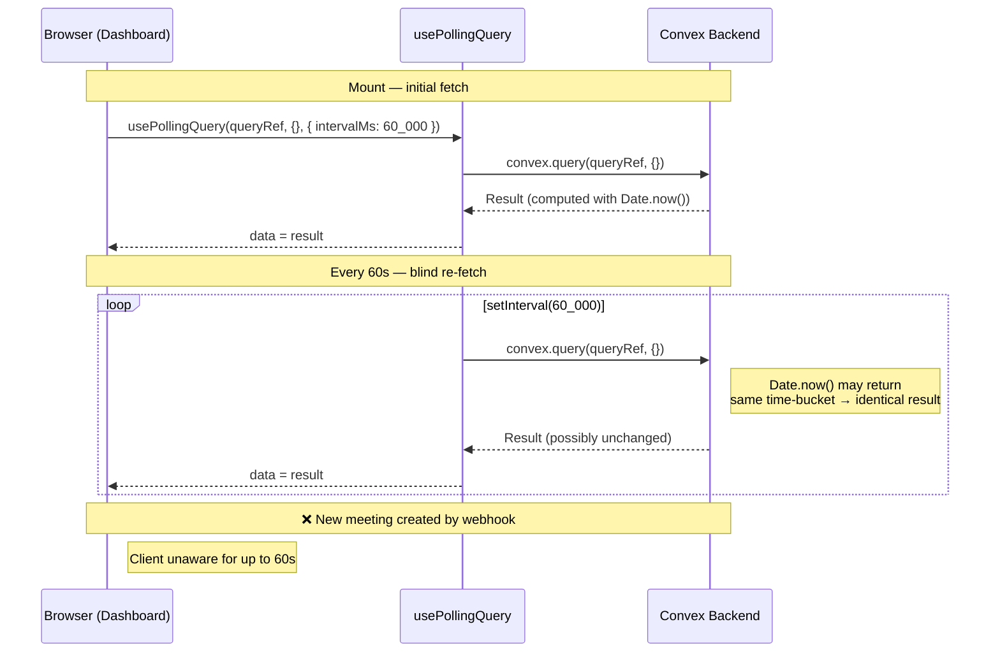
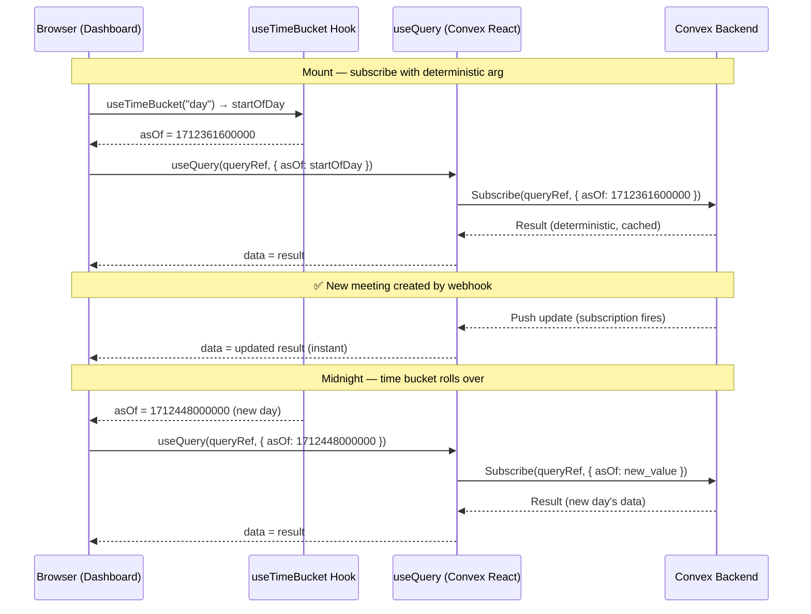

# Reactive Time Queries — Design Specification

**Version:** 1.0 (Approved)
**Status:** Ready for Implementation
**Last Updated:** 2026-04-06

## Executive Summary

Replace `usePollingQuery` (one-shot fetch + `setInterval`) with discretized-time arguments passed to standard Convex `useQuery` subscriptions. This restores real-time reactivity, ensures Convex cache utilization, and eliminates wasted polling requests.

**Core insight:** By passing a deterministic time boundary (`asOf`) from the client, queries become cacheable and subscribable. Time boundaries advance automatically at meaningful transitions (midnight for daily stats, every 5 minutes for "next meeting"), not on every millisecond.

**Scope:** 
- Phase 1: Implement `useTimeBucket` hook (day/5-minute discretization)
- Phase 2: Update admin dashboard query + client component
- Phase 3: Update closer dashboard query + client component
- Phase 4: Remove `usePollingQuery` hook entirely

**Prerequisite:** Authorization Revamp Phase 2 complete (RSC wrappers and preloading already in place for the closer dashboard).

### Key References

Read these before implementing. Paths are relative to the project root.

| Area | Document | Notes |
| --- | --- | --- |
| **Next.js Server & Client Components** | `node_modules/next/dist/docs/01-app/01-getting-started/05-server-and-client-components.md` | When to use `"use client"`, serialization rules for RSC → Client Component props, interleaving patterns. **Critical for §5.4, §6.5 preloading decisions.** |
| **Next.js Data Fetching** | `node_modules/next/dist/docs/01-app/01-getting-started/06-fetching-data.md` | Fetching in Server Components, streaming with `<Suspense>`, `use cache` directive. Relevant for SSR preloading discussion. |
| **Next.js Streaming** | `node_modules/next/dist/docs/01-app/02-guides/streaming.md` | How the App Router delivers pages: HTML stream → component payload → static shell → Suspense boundaries. Explains why Convex `useQuery` must run in Client Components. |
| **Next.js `"use client"` Directive** | `node_modules/next/dist/docs/01-app/03-api-reference/01-directives/use-client.md` | Boundary definition: once a file has `"use client"`, all its imports become part of the client bundle. Dashboard page clients must use this directive for `useQuery` and `useTimeBucket`. |
| **Convex + Next.js (App Router)** | `.docs/convex/nextjs.md` | Convex client hooks in Client Components, server rendering overview, `ConvexProviderWithAuth` setup, JWT token flow for both server and client |
| **Convex `preloadQuery` API** | `.docs/convex/module-nextjs.md` | `preloadQuery(query, args, { token })` → `Preloaded<Query>` (serializable). Passed as prop to `usePreloadedQuery` in Client Component. **Key for §5.4, §6.5.** |
| **Convex AI Guidelines** | `convex/_generated/ai/guidelines.md` | Validators (`v.number()`), function registration, index field ordering, `ctx.auth.getUserIdentity()`, `for await` iteration, `requireTenantUser` patterns |
| **React Best Practices (Vercel)** | `.claude/skills/vercel-react-best-practices/` | 67 rules across 8 categories. Key rules for this design listed in §16. |
| **Composition Patterns (Vercel)** | `.claude/skills/vercel-composition-patterns/` | Compound components, explicit variants, state management. Relevant to hook API design (§4.3). |

---

## Table of Contents

1. [Goals & Non-Goals](#1-goals--non-goals)
2. [Actors & Roles](#2-actors--roles)
3. [End-to-End Flow Overview](#3-end-to-end-flow-overview)
4. [Phase 1: Time-Bucketing Infrastructure](#4-phase-1-time-bucketing-infrastructure)
5. [Phase 2: Admin Dashboard — Reactive Stats](#5-phase-2-admin-dashboard--reactive-stats)
6. [Phase 3: Closer Dashboard — Reactive Next Meeting](#6-phase-3-closer-dashboard--reactive-next-meeting)
7. [Phase 4: Retire usePollingQuery](#7-phase-4-retire-usepollingquery)
8. [Data Model](#8-data-model)
9. [Convex Function Architecture](#9-convex-function-architecture)
10. [Routing & Authorization](#10-routing--authorization)
11. [Security Considerations](#11-security-considerations)
12. [Error Handling & Edge Cases](#12-error-handling--edge-cases)
13. [Open Questions](#13-open-questions)
14. [Dependencies](#14-dependencies)
15. [Applicable Skills](#15-applicable-skills)

---

## 1. Goals & Non-Goals

### Goals

- **Instant data updates when underlying data changes.** When a new meeting is created, a deal is closed, or a meeting is cancelled, every open dashboard reflects the change immediately — not up to 60 seconds later.
- **Correct time-boundary transitions.** The admin "meetings today" count rolls over at midnight. The closer "next meeting" card advances when a meeting's `scheduledAt` passes the current time. Both happen automatically without user interaction.
- **Full Convex cache utilization.** Queries receive deterministic arguments, enabling Convex's server-side caching and deduplication. Multiple admins viewing the same dashboard share a single cached result instead of each triggering independent one-shot fetches.
- **Elimination of wasted network requests.** The current 60-second polling fires regardless of whether data changed. Reactive subscriptions only push when the subscribed data set actually changes.
- **Zero new dependencies.** The solution uses only Convex's built-in `useQuery`, React's `useState`/`useEffect`/`useMemo`, and standard `Date` APIs.
- **Retirement of `usePollingQuery`.** The hook is removed entirely once all consumers are migrated. The codebase has one fewer custom abstraction to maintain and reason about.

### Non-Goals (deferred)

- **Server-side preloading of time-sensitive queries (Phase 3 of auth-revamp scope).** The admin stats query could theoretically be preloaded with an `asOf` arg computed in the RSC, but the value would be stale by the time the client hydrates. This design focuses on the client-side subscription pattern. Preloading can be revisited if SSR instant-paint is a priority.
- **Sub-minute countdown precision.** The `FeaturedMeetingCard` countdown ("Starting in 12 minutes") already has its own `setInterval` for visual updates. This design does not change that — it only affects which meeting is *fetched*, not how the countdown is rendered.
- **Materialized/cron-computed dashboard stats.** Writing pre-aggregated stats to a table via a cron would eliminate the compute-on-read cost but adds write load and a new table. Not warranted for current scale.
- **Calendar view changes.** `CalendarView` already uses standard `useQuery` with a user-controlled date range. No changes needed.
- **Meeting detail page changes.** Already migrated to `usePreloadedQuery` in the auth-revamp. No polling was ever used continuously — only one-shot.

---

## 2. Actors & Roles

| Actor              | Identity                        | Auth Method                                   | Key Permissions                     |
| ------------------ | ------------------------------- | --------------------------------------------- | ----------------------------------- |
| **Tenant Admin**   | `tenant_master` / `tenant_admin` | WorkOS AuthKit, member of tenant org           | Views admin dashboard with all-tenant stats |
| **Closer**         | `closer`                        | WorkOS AuthKit, member of tenant org           | Views closer dashboard with own next meeting  |
| **Convex Backend** | Server                          | Internal (queries run server-side)             | Reads meetings, opportunities, users, payments |

No new actors are introduced. No external services are involved — this is purely a client-side subscription pattern change with a minor query signature update.

---

## 3. End-to-End Flow Overview

### Current Architecture (Polling)



### Target Architecture (Discretized Time + Reactive Subscription)



---

## 4. Phase 1: Time-Bucketing Infrastructure

### 4.1 The Core Idea

Both polling queries use `Date.now()` server-side to compute a time boundary:

| Query                      | `Date.now()` Usage                              | Time Granularity Needed |
| -------------------------- | ----------------------------------------------- | ----------------------- |
| `getAdminDashboardStats`   | `getStartAndEndOfToday(Date.now())` → midnight boundaries | **Day** — only changes at midnight |
| `getNextMeeting`           | `now = Date.now()` → filter meetings `>= now`    | **5 minutes** — needs to advance as meetings pass |

The insight: if the client passes the time boundary as a **deterministic argument**, the query becomes cacheable and subscribable. The client controls when the boundary advances by updating the argument.

> **Why not just pass `Date.now()` from the client?** Because it changes every millisecond, which would create a unique query key on every render — defeating Convex's deduplication and cache entirely. Discretizing into buckets (start-of-day, nearest 5-minute mark) gives stable keys that only change at meaningful boundaries.

### 4.2 `useTimeBucket` Hook

A lightweight React hook that returns a stable timestamp and auto-advances it when the bucket boundary is crossed. Follows Vercel React best practices for stable refs, effect dependencies, and memoization.

```typescript
// Path: hooks/use-time-bucket.ts
"use client";

import { useState, useEffect, useMemo, useRef } from "react";

type BucketStrategy = "day" | "5min";

/**
 * Returns a discretized timestamp that only changes at bucket boundaries.
 *
 * - "day": Returns start-of-today (midnight local time). Advances at midnight.
 * - "5min": Returns the nearest past 5-minute mark. Advances every 5 minutes.
 *
 * The returned value is stable between boundaries, making it safe to pass
 * as a Convex query argument — the query stays deterministic and subscribable
 * until the bucket rolls over.
 *
 * Includes visibilitychange listener to force-recompute when tab becomes visible
 * after being backgrounded, preventing stale dashboards after laptop sleep.
 *
 * **React Performance Rules Applied (vercel-react-best-practices):**
 * - `rerender-lazy-state-init`: useState(() => computeBucket()) — lazy init, runs once
 * - `rerender-dependencies`: deps are [strategy, computeBucket], NOT [bucket] — avoids
 *   re-running effect on every bucket change; timeout self-schedules via scheduleNext()
 * - `rerender-functional-setstate`: visibilitychange handler uses setBucket((prev) => ...)
 *   to avoid stale closures in the event listener
 * - `rerender-split-combined-hooks`: hook returns only bucket value, not query results —
 *   separates timing concern from data-fetching concern
 * - `client-event-listeners`: visibilitychange listener is per-instance (independent state);
 *   acceptable at 2 instances (admin + closer dashboards)
 */
export function useTimeBucket(strategy: BucketStrategy): number {
  // Memoize computation function — only recreate when strategy changes
  const computeBucket = useMemo(() => {
    switch (strategy) {
      case "day":
        return () => {
          const d = new Date();
          d.setHours(0, 0, 0, 0);
          return d.getTime();
        };
      case "5min":
        return () => {
          const now = Date.now();
          const FIVE_MIN = 5 * 60 * 1000;
          return Math.floor(now / FIVE_MIN) * FIVE_MIN;
        };
    }
  }, [strategy]);

  // Initialize bucket with current boundary
  const [bucket, setBucket] = useState(() => computeBucket());
  const timeoutRef = useRef<NodeJS.Timeout | null>(null);

  useEffect(() => {
    // Schedule the next bucket boundary transition
    const scheduleNext = () => {
      const now = Date.now();
      let msUntilNext: number;

      if (strategy === "day") {
        const tomorrow = new Date();
        tomorrow.setDate(tomorrow.getDate() + 1);
        tomorrow.setHours(0, 0, 0, 0);
        msUntilNext = tomorrow.getTime() - now;
      } else {
        // "5min"
        const FIVE_MIN = 5 * 60 * 1000;
        const nextBoundary = (Math.floor(now / FIVE_MIN) + 1) * FIVE_MIN;
        msUntilNext = nextBoundary - now;
      }

      // Add 50ms buffer to ensure we're past the boundary
      timeoutRef.current = setTimeout(() => {
        setBucket(computeBucket());
        scheduleNext(); // Schedule the next transition
      }, msUntilNext + 50);
    };

    // Handle tab becoming visible after being backgrounded
    const handleVisibilityChange = () => {
      if (document.visibilityState === "visible") {
        const fresh = computeBucket();
        setBucket((prev) => (prev !== fresh ? fresh : prev));
      }
    };

    scheduleNext();
    document.addEventListener("visibilitychange", handleVisibilityChange);

    return () => {
      if (timeoutRef.current) clearTimeout(timeoutRef.current);
      document.removeEventListener("visibilitychange", handleVisibilityChange);
    };
    // Dependencies: strategy + computeBucket (not bucket)
    // This prevents effect from re-running when bucket updates
  }, [strategy, computeBucket]);

  return bucket;
}
```

**Design decisions with rationale:**

| Decision | Rationale |
|---|---|
| **`setTimeout` vs `setInterval`** | Single `setTimeout` targeting exact next boundary fires once per day (day strategy) or 5 min (5-min strategy), vs polling every 60s. More efficient and precise. Effect re-runs when `bucket` updates, scheduling the next timeout. |
| **Local time vs UTC** | Admin dashboard shows "meetings today" relative to user's local timezone. A 11 PM meeting should count as today even if it's tomorrow in UTC. We preserve this by computing day bucket in local time client-side, then passing the timestamp to the query. |
| **`useState(() => computeBucket())` initialization** | Lazy initialization avoids computing bucket on every render. The function runs only on mount. Per `rerender-lazy-state-init`: "pass a function to useState for expensive initial values." |
| **`useRef` for timeout** | Stores timeout ID for guaranteed cleanup, preventing race conditions if strategy changes while timeout is pending. Only one timeout is pending at any time (previous one fired before `scheduleNext` creates the next). |
| **`visibilitychange` listener (included by default)** | Prevents stale dashboards after laptop sleep. When tab becomes visible, force-recomputes bucket and updates if stale. Zero cost when tab is focused. Uses functional setState per `rerender-functional-setstate` to avoid stale closures: `setBucket((prev) => (prev !== fresh ? fresh : prev))`. |
| **Effect dependencies: `[strategy, computeBucket]` not `[bucket]`** | Per `rerender-dependencies`: use narrow, primitive dependencies. `computeBucket` is a memoized function ref (stable unless `strategy` changes). Including `bucket` would re-run the effect on every bucket change — not infinite loop (since `scheduleNext` self-schedules), but would wastefully tear down and recreate the timeout chain and visibilitychange listener on every transition. |

### 4.3 Hook Extraction & Composition Patterns

The bucket computation is identical across consumers (admin + closer dashboards) and will be used in at minimum two places. Extracting it as a hook:

- **Avoids duplication:** `setTimeout`-to-boundary scheduling logic lives once, not twice
- **Single test point:** Edge cases (midnight rollover, DST, tab sleep) are tested in one place
- **Separation of concerns:** Consumer components focus on data display, not time math
- **Reusability:** Any future feature needing time-based queries can use `useTimeBucket`

**Composition consideration:** Should we create a compound hook `useTimeBucketQuery(strategy, queryRef, args)`?

**Decision: Keep separate.** Reasons:
1. `useTimeBucket` is a **timing primitive** — it returns a value, not a query result
2. `useQuery` already handles reactivity, caching, and error states
3. Combining them would mix two concerns: discretizing time vs managing async data
4. Clients can easily compose them: `const asOf = useTimeBucket("day"); const data = useQuery(ref, { asOf });`
5. If a query doesn't need time bucketing, we don't impose overhead

The pattern is simple enough that additional abstraction adds friction without benefit (see `patterns-children-over-render-props` in vercel-composition-patterns).

---

## 5. Phase 2: Admin Dashboard — Reactive Stats

### 5.1 What Changes & Why

The admin dashboard's `getAdminDashboardStats` query currently calls `Date.now()` on line 64 to compute today's midnight boundaries. This makes the query non-deterministic — Convex can't cache or subscribe to it, forcing the use of `usePollingQuery`.

**The fix:** Move the time computation to the client. The client passes `asOf` (start-of-today as Unix ms) and the query uses it instead of `Date.now()`.

| Before | After |
| --- | --- |
| Query calls `Date.now()` internally | Query receives `asOf` argument from client |
| Client uses `usePollingQuery` (one-shot + 60s polling) | Client uses `useTimeBucket("day")` + `useQuery` (reactive subscription) |
| New meeting → up to 60s stale | New meeting → instant update |
| 1,440 fetches/day (every 60s) | ~1 re-subscribe/day (at midnight) + push updates only when data changes |

### 5.2 Convex Query Update

```typescript
// Path: convex/dashboard/adminStats.ts
import { query } from "../_generated/server";
import { v } from "convex/values";
import { requireTenantUser } from "../requireTenantUser";

const ACTIVE_OPPORTUNITY_STATUSES = new Set([
  "scheduled",
  "in_progress",
  "follow_up_scheduled",
]);

/**
 * Aggregate stats for tenant owner/admin dashboard cards.
 *
 * @param asOf — Start-of-day timestamp (Unix ms, local midnight).
 *               Used to compute "meetings today" range.
 *               Passed from the client's useTimeBucket("day") hook.
 */
export const getAdminDashboardStats = query({
  args: { asOf: v.number() },
  handler: async (ctx, { asOf }) => {
    const { tenantId } = await requireTenantUser(ctx, [
      "tenant_master",
      "tenant_admin",
    ]);

    // --- Team members ---
    let totalTeamMembers = 0;
    let totalClosers = 0;
    let unmatchedClosers = 0;

    for await (const user of ctx.db
      .query("users")
      .withIndex("by_tenantId", (q) => q.eq("tenantId", tenantId))) {
      totalTeamMembers += 1;
      if (user.role === "closer") {
        totalClosers += 1;
        if (!user.calendlyUserUri) {
          unmatchedClosers += 1;
        }
      }
    }

    // --- Opportunities ---
    let totalOpportunities = 0;
    let activeOpportunities = 0;
    let wonDeals = 0;

    for await (const opportunity of ctx.db
      .query("opportunities")
      .withIndex("by_tenantId", (q) => q.eq("tenantId", tenantId))) {
      totalOpportunities += 1;
      if (ACTIVE_OPPORTUNITY_STATUSES.has(opportunity.status)) {
        activeOpportunities += 1;
      }
      if (opportunity.status === "payment_received") {
        wonDeals += 1;
      }
    }

    // --- Meetings today ---
    // asOf is start-of-day from the client (local midnight).
    // The query is now deterministic for a given asOf value.
    const startOfDay = asOf;
    const endOfDay = asOf + 24 * 60 * 60 * 1000;
    let meetingsToday = 0;
    for await (const _meeting of ctx.db
      .query("meetings")
      .withIndex("by_tenantId_and_scheduledAt", (q) =>
        q
          .eq("tenantId", tenantId)
          .gte("scheduledAt", startOfDay)
          .lt("scheduledAt", endOfDay),
      )) {
      meetingsToday += 1;
    }

    // --- Revenue ---
    let revenueLogged = 0;
    let paymentRecordsLogged = 0;
    for await (const paymentRecord of ctx.db
      .query("paymentRecords")
      .withIndex("by_tenantId", (q) => q.eq("tenantId", tenantId))) {
      if (paymentRecord.status === "disputed") {
        continue;
      }
      revenueLogged += paymentRecord.amount;
      paymentRecordsLogged += 1;
    }

    return {
      totalTeamMembers,
      totalClosers,
      unmatchedClosers,
      totalOpportunities,
      activeOpportunities,
      meetingsToday,
      wonDeals,
      revenueLogged,
      totalRevenue: revenueLogged,
      paymentRecordsLogged,
    };
  },
});
```

**Key change:** `args: {}` → `args: { asOf: v.number() }`. The `getStartAndEndOfToday` helper is inlined and simplified since `asOf` is already start-of-day. The helper function can be removed.

### 5.3 Client Component Update

```typescript
// Path: app/workspace/_components/dashboard-page-client.tsx
"use client";

import { useQuery } from "convex/react";
import { Card, CardContent, CardHeader } from "@/components/ui/card";
import { Skeleton } from "@/components/ui/skeleton";
import { api } from "@/convex/_generated/api";
import { usePageTitle } from "@/hooks/use-page-title";
import { useTimeBucket } from "@/hooks/use-time-bucket";
import { PipelineSummary } from "./pipeline-summary";
import { StatsRow } from "./stats-row";
import { SystemHealth } from "./system-health";

interface DashboardPageClientProps {
  displayName: string;
}

export function DashboardPageClient({
  displayName,
}: DashboardPageClientProps) {
  usePageTitle("Dashboard");

  const asOf = useTimeBucket("day");
  const stats = useQuery(
    api.dashboard.adminStats.getAdminDashboardStats,
    { asOf },
  );

  if (stats === undefined) {
    return <DashboardSkeleton />;
  }

  return (
    <div className="flex flex-col gap-6">
      <div>
        <h1 className="text-3xl font-bold tracking-tight">Dashboard</h1>
        <p className="mt-2 text-muted-foreground">
          Welcome back, {displayName}
        </p>
      </div>

      <StatsRow stats={stats} />
      <PipelineSummary stats={stats} />
      <SystemHealth />
    </div>
  );
}

// DashboardSkeleton unchanged — omitted for brevity
```

**What changed:**
1. `import { usePollingQuery }` → `import { useQuery }` from `convex/react` + `import { useTimeBucket }`
2. `usePollingQuery(api.…, {}, { intervalMs: 60_000 })` → `useTimeBucket("day")` + `useQuery(api.…, { asOf })`
3. The `intervalMs` option is gone. Convex handles reactivity.

### 5.4 SSR Preloading Consideration

The admin dashboard RSC (`app/workspace/page.tsx`) currently does not preload the stats query. It could be updated to:

```typescript
// Path: app/workspace/page.tsx (optional enhancement)
// Per .docs/convex/module-nextjs.md: preloadQuery(query, args, { token }) → Preloaded<Query>
import { preloadQuery } from "convex/nextjs";

const startOfDay = new Date();
startOfDay.setHours(0, 0, 0, 0);

const preloadedStats = await preloadQuery(
  api.dashboard.adminStats.getAdminDashboardStats,
  { asOf: startOfDay.getTime() },
  { token: session.accessToken },
);

// Per node_modules/next/dist/docs/01-app/01-getting-started/05-server-and-client-components.md:
// Props passed from Server → Client Components must be serializable.
// Convex's Preloaded<Query> type is serializable — it becomes part of the RSC Payload.
// The client receives it and hydrates via usePreloadedQuery().
```

However, this is a **non-goal for this design** — the RSC runs at request time on the server, and `startOfDay` computed there may not match the client's timezone. Deferring this avoids timezone mismatch bugs.

**Why timezone mismatch matters here:**
- Per the Next.js Server Components docs, the RSC runs on the server where `new Date().setHours(0, 0, 0, 0)` uses the **server's timezone** (likely UTC).
- The client's `useTimeBucket("day")` computes midnight in the **user's local timezone**.
- If the server is in UTC and the user is in PST, the preloaded `asOf` could be 8 hours ahead — showing tomorrow's meetings briefly until the client-side `useQuery` re-subscribes with the correct bucket.
- Per `.docs/convex/nextjs.md`: "the `ConvexReactClient` will maintain a connection to your deployment and will get updates as data changes and that must happen on the client." The client-side subscription is the source of truth regardless.

**Decision:** Do not preload admin stats. The query is cheap, client-side subscription is immediate, and avoiding timezone bugs is worth the trade-off. Revisit only if SSR instant-paint becomes a measured priority.

---

## 6. Phase 3: Closer Dashboard — Reactive Next Meeting

### 6.1 What Changes & Why

The closer's `getNextMeeting` query calls `Date.now()` on line 18 to filter meetings `>= now`. This is more granular than the admin dashboard — the "next meeting" can change whenever a meeting's `scheduledAt` passes the current time.

A 5-minute bucket is appropriate here:

| Consideration | Analysis |
| --- | --- |
| **Freshness need** | Meetings are typically 30–60 minutes apart. A 5-minute granularity means the "next meeting" card updates within 5 minutes of the previous meeting starting — acceptable because the closer is in the meeting and not looking at the dashboard. |
| **Subscription cost** | Re-subscribes every 5 minutes (288/day). Each re-subscribe is cheap — Convex evaluates the query once and pushes the result. Between re-subscribes, mutations (new meetings, cancellations) are pushed in real-time. |
| **Edge case: meeting starts now** | If a meeting starts at 2:00 PM and the bucket advances at 2:00 PM, the query immediately returns the next meeting after 2:00 PM. The closer sees the card switch in real-time. In the worst case (meeting starts at 2:01, bucket at 2:00), the old meeting is still in results for up to 4 minutes — but it would show "Starting now" via the countdown badge, which is correct UX. |

> **Why 5 minutes instead of 1 minute?** One-minute buckets would re-subscribe 1,440 times/day per closer. For a tenant with 20 closers, that's 28,800 subscription changes per day for marginal UX gain. Five-minute buckets reduce this by 5× while keeping the worst-case staleness well within the "closer is in a meeting and not looking at the dashboard" window.

### 6.2 Convex Query Update

```typescript
// Path: convex/closer/dashboard.ts (getNextMeeting — updated)
import { query } from "../_generated/server";
import { v } from "convex/values";
import { requireTenantUser } from "../requireTenantUser";

export const getNextMeeting = query({
  args: { asOf: v.number() },
  handler: async (ctx, { asOf }) => {
    const { userId, tenantId } = await requireTenantUser(ctx, ["closer"]);

    // Get this closer's scheduled opportunities
    const myOpps = await ctx.db
      .query("opportunities")
      .withIndex("by_tenantId_and_assignedCloserId", (q) =>
        q.eq("tenantId", tenantId).eq("assignedCloserId", userId)
      )
      .collect();
    const scheduledOpps = myOpps.filter(
      (opportunity) => opportunity.status === "scheduled"
    );

    if (scheduledOpps.length === 0) return null;

    const oppIds = new Set(scheduledOpps.map((opportunity) => opportunity._id));
    const opportunityById = new Map(
      scheduledOpps.map((opportunity) => [opportunity._id, opportunity]),
    );

    // Scan upcoming tenant meetings in chronological order.
    // asOf is the nearest-past 5-minute boundary from the client.
    const upcomingMeetings = ctx.db
      .query("meetings")
      .withIndex("by_tenantId_and_scheduledAt", (q) =>
        q.eq("tenantId", tenantId).gte("scheduledAt", asOf)
      );

    let nextMeeting = null;
    for await (const meeting of upcomingMeetings) {
      if (meeting.status !== "scheduled") {
        continue;
      }
      if (!oppIds.has(meeting.opportunityId)) {
        continue;
      }
      nextMeeting = meeting;
      break;
    }

    if (!nextMeeting) return null;

    const opportunity = opportunityById.get(nextMeeting.opportunityId);
    const lead = opportunity ? await ctx.db.get(opportunity.leadId) : null;
    const eventTypeConfig =
      opportunity?.eventTypeConfigId
        ? await ctx.db.get(opportunity.eventTypeConfigId)
        : null;

    return {
      meeting: nextMeeting,
      opportunity,
      lead,
      eventTypeName: eventTypeConfig?.displayName ?? null,
    };
  },
});
```

**Key change:** `args: {}` → `args: { asOf: v.number() }`. The `Date.now()` call is replaced by the `asOf` argument.

### 6.3 Implication: 5-Minute Window May Include a Currently-Running Meeting

With a 5-minute bucket, if a meeting started at 2:01 PM, the bucket boundary at 2:00 PM means the query's `.gte("scheduledAt", asOf)` still includes that meeting. This is **acceptable and actually desirable**:

- The meeting's `status` would still be `"scheduled"` (it only transitions to `"in_progress"` when the closer explicitly starts it or a Calendly webhook fires).
- The `FeaturedMeetingCard` would show "Starting now" via its local countdown timer.
- Once the meeting status transitions (via webhook or closer action), the reactive subscription pushes the next meeting immediately — no waiting for the next bucket.

If a `status` filter is relied upon, the 5-minute overlap is harmless. If strict `scheduledAt > now` semantics are needed, we document this as acceptable staleness.

### 6.4 Client Component Update

```typescript
// Path: app/workspace/closer/_components/closer-dashboard-page-client.tsx (updated)
"use client";

import type { Preloaded } from "convex/react";
import { usePreloadedQuery, useQuery } from "convex/react";
import type { Doc } from "@/convex/_generated/dataModel";
import { api } from "@/convex/_generated/api";
import { usePageTitle } from "@/hooks/use-page-title";
import { useTimeBucket } from "@/hooks/use-time-bucket";
import { Skeleton } from "@/components/ui/skeleton";
import { Separator } from "@/components/ui/separator";
import { UnmatchedBanner } from "./unmatched-banner";
import { FeaturedMeetingCard } from "./featured-meeting-card";
import { PipelineStrip } from "./pipeline-strip";
import { CloserEmptyState } from "./closer-empty-state";
import { CalendarView } from "./calendar-view";

type NextMeetingData =
  | {
      meeting: Doc<"meetings">;
      opportunity: Doc<"opportunities"> | null | undefined;
      lead: Doc<"leads"> | null | undefined;
      eventTypeName: string | null;
    }
  | null;

type CloserDashboardPageClientProps = {
  preloadedProfile: Preloaded<typeof api.closer.dashboard.getCloserProfile>;
  preloadedPipelineSummary: Preloaded<
    typeof api.closer.dashboard.getPipelineSummary
  >;
};

export function CloserDashboardPageClient({
  preloadedProfile,
  preloadedPipelineSummary,
}: CloserDashboardPageClientProps) {
  usePageTitle("My Dashboard");

  const profile = usePreloadedQuery(preloadedProfile);
  const pipelineSummary = usePreloadedQuery(preloadedPipelineSummary);

  const asOf = useTimeBucket("5min");
  const nextMeeting = useQuery(
    api.closer.dashboard.getNextMeeting,
    { asOf },
  ) as NextMeetingData | undefined;

  if (nextMeeting === undefined) {
    return <DashboardSkeleton />;
  }

  return (
    <div className="flex flex-col gap-6">
      <div>
        <h1 className="text-2xl font-bold tracking-tight text-pretty">
          My Dashboard
        </h1>
        <p className="text-sm text-muted-foreground">
          Welcome back, {profile.fullName ?? profile.email}
        </p>
      </div>

      {!profile.isCalendlyLinked && <UnmatchedBanner />}

      {nextMeeting ? (
        <FeaturedMeetingCard
          meeting={nextMeeting.meeting}
          lead={nextMeeting.lead ?? null}
          eventTypeName={nextMeeting.eventTypeName}
        />
      ) : (
        <CloserEmptyState
          title="No upcoming meetings"
          description="You don't have any scheduled meetings. New meetings will appear here automatically when leads book through Calendly."
        />
      )}

      <PipelineStrip
        counts={pipelineSummary.counts}
        total={pipelineSummary.total}
      />

      <Separator />

      <div>
        <h2 className="mb-3 text-lg font-semibold tracking-tight text-pretty">
          My Schedule
        </h2>
        <CalendarView />
      </div>
    </div>
  );
}

// DashboardSkeleton unchanged — omitted for brevity
```

**What changed:**
1. `import { usePollingQuery }` → `import { useQuery }` from `convex/react` + `import { useTimeBucket }`
2. `usePollingQuery(api.…, {}, { intervalMs: 60_000 })` → `useTimeBucket("5min")` + `useQuery(api.…, { asOf })`

### 6.5 SSR Preloading for `getNextMeeting`

The closer dashboard RSC already preloads `getCloserProfile` and `getPipelineSummary`. With the new `asOf` argument, `getNextMeeting` can now also be preloaded:

```typescript
// Path: app/workspace/closer/page.tsx (optional enhancement)
// Per .docs/convex/module-nextjs.md: preloadQuery returns Preloaded<Query>, which is serializable
// Per async-parallel (vercel-react-best-practices): use Promise.all for independent operations
import { preloadQuery } from "convex/nextjs";

const FIVE_MIN = 5 * 60 * 1000;
const asOf = Math.floor(Date.now() / FIVE_MIN) * FIVE_MIN;

const [preloadedProfile, preloadedPipelineSummary, preloadedNextMeeting] =
  await Promise.all([
    preloadQuery(api.closer.dashboard.getCloserProfile, {}, {
      token: session.accessToken,
    }),
    preloadQuery(api.closer.dashboard.getPipelineSummary, {}, {
      token: session.accessToken,
    }),
    preloadQuery(api.closer.dashboard.getNextMeeting, { asOf }, {
      token: session.accessToken,
    }),
  ]);
```

This is **viable** (unlike the admin stats preloading in §5.4) because:
- The 5-minute bucket uses `Math.floor(Date.now() / FIVE_MIN) * FIVE_MIN` — pure UTC math, **not timezone-dependent**. Server and client compute the same bucket regardless of timezone.
- The client's `useTimeBucket("5min")` will produce the same bucket value unless the page load straddles a 5-minute boundary (unlikely; at most a brief re-subscribe).
- If the bucket does mismatch, `useQuery` silently re-subscribes with the client's bucket — no error, just one extra round-trip. Per `.docs/convex/nextjs.md`, the `ConvexReactClient` manages live subscriptions after hydration.
- Per `node_modules/next/dist/docs/01-app/01-getting-started/05-server-and-client-components.md`: the `Preloaded<Query>` value is embedded in the RSC Payload as a serializable prop. The client receives it during hydration and `usePreloadedQuery` immediately returns the data — **no loading state flash**.
- The `Promise.all` pattern follows `async-parallel` from `vercel-react-best-practices`: all three preloads are independent, so they should run concurrently, not sequentially.

> **Whether to actually implement SSR preloading is left as a Phase 3 follow-up in the auth-revamp plan.** This design enables it but does not require it.

---

## 7. Phase 4: Retire usePollingQuery

### 7.1 Removal Checklist

After Phases 2 and 3 are complete, `usePollingQuery` has zero consumers.

| Step | Action |
| --- | --- |
| 1 | Verify no imports remain: `grep -r "usePollingQuery" --include="*.ts" --include="*.tsx" app/ hooks/ components/` |
| 2 | Delete `hooks/use-polling-query.ts` |
| 3 | Remove references in plan documents (informational only; plans are reference docs, not runtime code) |
| 4 | Verify build passes: `pnpm build` |

### 7.2 What About Future Polling Needs?

If a future feature genuinely needs one-shot polling (e.g., querying an external API via a Convex action where subscriptions don't apply), the `useTimeBucket` + `useQuery` pattern is still better for any query that reads from the Convex database. For true action-based polling (external APIs), a new `usePollingAction` hook could be created — but that's a separate concern and out of scope.

---

## 8. Data Model

### 8.1 No Schema Changes

This design does **not** modify any Convex tables or indexes. The `meetings` table's existing `by_tenantId_and_scheduledAt` index already supports the range query with client-provided boundaries.

### 8.2 Query Argument Changes (API Surface)

| Query | Before | After |
| --- | --- | --- |
| `getAdminDashboardStats` | `args: {}` | `args: { asOf: v.number() }` |
| `getNextMeeting` | `args: {}` | `args: { asOf: v.number() }` |

These are **breaking changes** to the query API surface. Since there are no external consumers (only internal dashboard components), this is safe. Both consumers are updated in the same phases as the query changes.

---

## 9. Implementation Architecture

### 9.1 File Structure & Changes

```
convex/
├── dashboard/
│   └── adminStats.ts                # MODIFIED: getAdminDashboardStats adds `asOf` arg, removes Date.now() — Phase 2
├── closer/
│   └── dashboard.ts                 # MODIFIED: getNextMeeting adds `asOf` arg, removes Date.now() — Phase 3
│                                    #           getPipelineSummary, getCloserProfile: UNCHANGED
├── schema.ts                        # UNCHANGED
└── crons.ts                         # UNCHANGED

hooks/
├── use-time-bucket.ts               # NEW: Discretized time-bucket hook — Phase 1
└── use-polling-query.ts             # DELETED — Phase 4

app/
├── workspace/
│   ├── _components/
│   │   └── dashboard-page-client.tsx     # MODIFIED: usePollingQuery → useTimeBucket + useQuery — Phase 2
│   └── closer/
│       └── _components/
│           └── closer-dashboard-page-client.tsx  # MODIFIED: usePollingQuery → useTimeBucket + useQuery — Phase 3
```

### 9.2 Convex Function Guidelines

All changes follow `convex/_generated/ai/guidelines.md`:

| Guideline | Applied How |
|---|---|
| **Always validate arguments** | `args: { asOf: v.number() }` validates timestamp before use |
| **No NEVER pass userId as arg for auth** | Both queries use `requireTenantUser(ctx, roles)` server-side, never accept user ID from client |
| **Use indexes for queries** | Both queries use `withIndex("by_tenantId_and_scheduledAt")` — asOf is only used for range filtering, not index selection |
| **Async iteration in handlers** | `getNextMeeting` uses `for await (const meeting of upcomingMeetings)` pattern, not `.collect()` |
| **No unbounded arrays in documents** | Schemas unchanged; no new arrays introduced |

### 9.3 Next.js / Convex Integration

Implementation follows the documentation listed in the Key References table. Specific patterns:

| Pattern | Usage | Doc Reference |
|---|---|---|
| **`"use client"` directive** | Dashboard page clients must use `"use client"` to enable `useQuery`, `useState`, `useEffect`. Per the directive docs, all imports in a `"use client"` file become part of the client bundle — `useTimeBucket` and Convex hooks are client-only by design. | `node_modules/next/dist/docs/01-app/03-api-reference/01-directives/use-client.md` |
| **`useQuery` for reactivity** | `useQuery(queryRef, { asOf })` maintains a real-time WebSocket subscription. Convex pushes updates when data changes. This is the canonical client-side data fetching pattern for Convex in Next.js. | `.docs/convex/nextjs.md` §"Calling Convex functions from client code" |
| **RSC → Client Component prop passing** | RSC wrappers pass `displayName` (string) and `Preloaded<Query>` (serializable opaque token) as props. Per Next.js docs, all props crossing the server/client boundary must be serializable — functions, classes, and Symbols cannot be passed. | `node_modules/next/dist/docs/01-app/01-getting-started/05-server-and-client-components.md` |
| **RSC preloading** | Admin dashboard: deferred due to timezone mismatch risk (§5.4). Closer dashboard: viable with UTC-based 5-min bucket, deferred to auth-revamp Phase 3 (§6.5). | `.docs/convex/module-nextjs.md` §preloadQuery |
| **App Router file-system routing** | Already in place; no route changes needed. RSC wrappers at `page.tsx` handle authorization. | `node_modules/next/dist/docs/01-app/01-getting-started/03-layouts-and-pages.md` |

---

## 10. Routing & Authorization

### No Routing Changes

The page structure and RSC wrappers remain identical:

```
app/workspace/
├── page.tsx                              # RSC: requireRole(ADMIN_ROLES) → <DashboardPageClient>
└── closer/
    └── page.tsx                          # RSC: requireRole(["closer"]) → preload → <CloserDashboardPageClient>
```

### Authorization Enforcement

Authorization is unchanged. Both queries use `requireTenantUser()` to enforce role-based access. The new `asOf` argument is a timestamp — it does not introduce any new authorization surface.

> **Security note:** A malicious client could pass an arbitrary `asOf` value (e.g., a date far in the past or future). This is harmless — the query would return meetings for that day/window, which the user already has permission to see via their tenant role. There is no privilege escalation vector.

---

## 11. Security Considerations

### 11.1 Credential Security

No credentials are involved. The `asOf` argument is a plain number (Unix milliseconds). No tokens, keys, or secrets are affected.

### 11.2 Multi-Tenant Isolation

Unchanged. Both queries scope all reads by `tenantId` resolved from the authenticated user's identity via `requireTenantUser()`. The `asOf` argument does not affect tenant scoping.

### 11.3 Role-Based Data Access

| Data | `tenant_master` / `tenant_admin` | `closer` |
| --- | --- | --- |
| All-tenant stats (team, opps, meetings, revenue) | Full (via `getAdminDashboardStats`) | None |
| Own next meeting | None | Own only (via `getNextMeeting` + `assignedCloserId` filter) |

Unchanged from current behavior.

### 11.4 Input Validation

The `asOf` argument is validated by Convex's `v.number()` validator. Non-numeric values are rejected at the framework level. There is no injection vector — `asOf` is used only in index range comparisons (`.gte("scheduledAt", asOf)`), not in string concatenation or dynamic query construction.

### 11.5 Rate Limit Awareness

Not applicable. This change reduces request volume (no more polling), which is strictly beneficial for Convex function call quotas.

---

## 12. Error Handling & Edge Cases

### 12.1 Midnight Rollover (Admin Dashboard)

**Scenario:** The admin has the dashboard open at 11:59 PM. At midnight, the "meetings today" count should reset to reflect the new day's meetings.

**Detection:** `useTimeBucket("day")` has a `setTimeout` targeting midnight. At midnight + 50ms, `setBucket` fires with the new day's start-of-day timestamp.

**Recovery:** `useQuery` receives a new `asOf` argument, unsubscribes from the old day, and subscribes to the new day. Convex pushes the new result.

**User sees:** The stats cards update automatically at midnight. No reload needed.

**Edge case within edge case: DST transition.** If the clock springs forward at 2:00 AM → 3:00 AM, the "midnight" calculation for the *next* day still works because we compute `tomorrow.setDate(tomorrow.getDate() + 1); tomorrow.setHours(0,0,0,0)` which correctly handles DST. However, the `setTimeout` duration may be off by ±1 hour. The 50ms buffer doesn't help here. **Mitigation:** After the timeout fires, we always call `computeBucket()` which uses `new Date()` — so even if the timer fires an hour early or late, the bucket value is correct. The worst case is a 1-hour-late refresh on DST nights, which is acceptable for a "meetings today" counter.

### 12.2 Tab Backgrounding / Sleep (Both Dashboards)

**Scenario:** The user closes their laptop, backgrounding the tab. When they reopen it, `setTimeout` may have been throttled or deferred by the browser.

**Two-layer detection (both built into `useTimeBucket`, see §4.2):**

1. **Deferred `setTimeout`:** When the tab regains focus, the browser fires any deferred timeout callbacks. `computeBucket()` runs with the current time, which may have skipped several buckets. `setBucket` updates state, triggering `useQuery` to re-subscribe.

2. **`visibilitychange` listener:** The hook listens for `document.visibilityState === "visible"` and force-recomputes the bucket. This catches cases where the timeout was garbage-collected during long sleep periods rather than merely deferred. Uses functional setState — `setBucket((prev) => (prev !== fresh ? fresh : prev))` — to avoid unnecessary re-renders if the bucket is already current (`rerender-functional-setstate`).

**Recovery:** `useQuery` receives the updated `asOf` argument and re-subscribes. Convex pushes the current data.

**User sees:** A brief loading state (if the Convex WebSocket connection was torn down during sleep), then current data. This is the same behavior as any Convex `useQuery` after a network interruption.

> **Note:** The `visibilitychange` listener is included in the Phase 1 hook implementation by default (not optional). It's 5 lines, zero cost when the tab is focused, and prevents a class of "stale dashboard after waking laptop" bugs. See `client-event-listeners` rule in `vercel-react-best-practices` for the deduplication pattern — in this case, each hook instance manages its own listener since each has independent state.

### 12.3 Client Clock Skew (Both Dashboards)

**Scenario:** The client's system clock is wrong (e.g., set to yesterday). The `asOf` value will be incorrect.

**Detection:** None — we can't reliably detect clock skew without a server round-trip.

**Impact for admin dashboard:** "Meetings today" would show yesterday's meetings. This is a pre-existing problem — the current code passes no time info, but the server's `Date.now()` would also be "wrong" if someone expected client-local semantics.

**Impact for closer dashboard:** "Next meeting" would use an incorrect lower bound. Meetings that already happened might still show as "next."

**Mitigation:** Not addressed. Client clock skew is a platform-level problem; the browser and OS are responsible for clock accuracy. The current polling implementation has the same vulnerability (server's `Date.now()` vs client's expectations).

### 12.4 Five-Minute Staleness Window (Closer Dashboard)

**Scenario:** A meeting is scheduled at 2:03 PM. The current 5-minute bucket is 2:00 PM. The meeting starts and the closer completes it. The next bucket is 2:05 PM.

**What happens:** Between 2:03 and 2:05, the query's lower bound is still 2:00 PM, so the 2:03 meeting is still in the result set. However:

1. If the meeting's `status` transitions from `"scheduled"` to `"in_progress"` or `"completed"` (via Calendly webhook or closer action), the query filters it out (`meeting.status !== "scheduled"`). The reactive subscription pushes the update immediately.
2. The `FeaturedMeetingCard` countdown shows "Starting now" during this window — correct UX.

**Conclusion:** The 5-minute window does not cause incorrect UX because the `status` filter, not the time filter, is the primary mechanism for advancing "next meeting." The time filter only prevents showing meetings far in the past.

### 12.5 Multiple Tabs Open

**Scenario:** Admin has the dashboard open in two tabs. Both have independent `useTimeBucket` instances.

**Impact:** Both tabs independently compute the same bucket value and subscribe to the same query arguments. Convex deduplicates the subscriptions server-side — the query runs once, and both tabs receive the same push updates.

**User sees:** Identical, real-time data in both tabs. This is an improvement over polling, where each tab fired independent `convex.query()` calls every 60 seconds.

---

## 13. Testing Strategy

### 13.1 Unit Tests for `useTimeBucket`

Test file: `hooks/__tests__/use-time-bucket.test.ts` (or `.test.tsx` if using React Testing Library)

**Key test cases:**

1. **Day bucket computation**
   - Verify that `useTimeBucket("day")` returns start-of-today (midnight in local time)
   - Verify stability: calling it twice within same day returns identical value
   - Mock time to verify it advances at midnight boundary

2. **5-minute bucket computation**
   - Verify that `useTimeBucket("5min")` returns nearest past 5-minute mark
   - Examples: 2:03 PM → 2:00 PM, 2:05 PM → 2:05 PM, 2:09 PM → 2:05 PM
   - Verify stability: calling it twice within same 5-min window returns identical value

3. **Bucket transitions**
   - Mock timers (jest.useFakeTimers or vitest equivalent)
   - Verify that setTimeout is scheduled with correct delay (ms until next boundary)
   - Verify that after boundary crosses, `bucket` value updates
   - Verify that effect cleans up timeouts on unmount

4. **Visibility change handling**
   - Simulate tab backgrounding and re-focus
   - Verify bucket re-computes when tab becomes visible
   - Verify no double-updates if bucket is already current

5. **Edge cases**
   - DST transitions (spring forward, fall back)
   - Midnight exactly (2:00 AM for day bucket, :00 for 5min)
   - Very rapid bucket transitions (not practically possible, but verify cleanup)

### 13.2 Integration Tests for Convex Queries

Test file: `convex/dashboard/__tests__/adminStats.test.ts` (using convex-test + vitest)

**Key test cases:**

1. **`getAdminDashboardStats` with asOf argument**
   - Setup test database with meetings on today and tomorrow
   - Call with `asOf = startOfToday` → should count today's meetings
   - Call with `asOf = startOfTomorrow` → should count tomorrow's meetings
   - Verify index utilization (no full-table scans)

2. **`getNextMeeting` with asOf argument**
   - Setup test database with meetings at various times
   - Call with `asOf = now` → should return next scheduled meeting
   - Call with `asOf = 5 min from now` → should skip meetings in next 5 min
   - Verify that `status !== "scheduled"` filter works correctly

3. **Authorization checks**
   - Verify `requireTenantUser()` blocks unauthorized access
   - Verify admin-only vs closer-only role enforcement

### 13.3 Component Integration Tests

Test file: `app/workspace/__tests__/dashboard-page-client.test.tsx`

**Key test cases:**

1. **`DashboardPageClient` with reactive updates**
   - Mock `useTimeBucket` to return fixed value
   - Mock `useQuery` to return stats data
   - Render component, verify data displays
   - Simulate data mutation (new meeting created)
   - Verify component re-renders with updated stats

2. **Bucket boundary transitions**
   - Mock `useTimeBucket` to advance at midnight
   - Verify component re-subscribes to new day
   - Verify loading state is shown during transition

---

## 14. Open Questions & Decisions

| # | Question | Current Thinking | Resolution |
| --- | --- | --- | --- |
| 1 | Include `visibilitychange` listener in v1? | **Yes** — prevent stale-dashboard-after-sleep bugs. Trivial code, zero cost when focused. | Included in Phase 1 implementation. |
| 2 | Preload `getAdminDashboardStats` in RSC? | **Defer.** Timezone mismatch could flash wrong-day data. Stats query is cheap. Revisit if SSR paint time becomes priority. | **Decision:** Do not preload. Keep client-side subscription pattern only. |
| 3 | Preload `getNextMeeting` in RSC? | **Viable but deferred.** 5-min bucket is UTC-agnostic so server/client agree. But auth-revamp Phase 3 already tracks this. | **Decision:** Implement SSR preloading in auth-revamp Phase 3, not here. |
| 4 | Is 5 minutes optimal for closer dashboard? | **Yes for now.** Meetings are 30+ min apart. `status` filter is primary logic. 5 min prevents stale far-past meetings without excess re-subscribes. Could revisit based on user feedback. | **Decision:** Use 5 min in v1. Monitor and adjust if needed. |
| 5 | Remove `getStartAndEndOfToday` helper? | **Yes.** Only used by `getAdminDashboardStats`. Inline the day math (`asOf` and `asOf + 86_400_000`). Keep code simple. | **Decision:** Delete helper during Phase 2. |
| 6 | Apply same pattern to `useCurrentTime` hook? | **No, out of scope.** `useCurrentTime` drives visual indicator, not data queries. Polling is fine for that use case. | **Decision:** Leave `useCurrentTime` as-is. Could improve separately. |
| 7 | Should `useTimeBucket` return both bucket AND next-boundary-time? | **No.** Keep hook focused (single responsibility). Consumers needing boundary time can compute it themselves if needed. | **Decision:** Return only bucket (the timestamp). |
| 8 | Handle client clock skew? | **No special handling.** Same vulnerability as current polling (server's Date.now() vs client expectations). Platform-level problem. | **Decision:** Accept as limitation. Document in 12.3. |

---

## 15. Dependencies

### New Packages

None. Zero new dependencies.

### Already Installed (no action needed)

| Package | Used for |
| --- | --- |
| `convex` | `useQuery`, `v.number()` validator, reactive subscriptions |
| `convex/react` | `useQuery` hook (replaces `useConvex().query()` one-shot) |
| `react` | `useState`, `useEffect`, `useMemo` for `useTimeBucket` hook |

### Environment Variables

None. No new environment variables are needed.

---

## 16. Applicable Skills & Implementation Guidance

### Skills to Invoke During Implementation

| Skill | When to Invoke | Phase | Key Focus |
|---|---|---|---|
| **vercel-react-best-practices** | After implementing `useTimeBucket` hook | Phase 1 | See specific rules below. |
| **vercel-composition-patterns** | When designing hook composition in consumer components | Phase 1–3 | See specific rules below. |
| **convex-performance-audit** | After updating `getAdminDashboardStats` and `getNextMeeting` queries | Phases 2–3 | **Validate:** Index utilization with `.gte("scheduledAt", asOf)` filters. No unbounded scans. `npx convex insights` shows no regression in bytes/documents read. |
| **web-design-guidelines** | When updating dashboard page components | Phases 2–3 | **Audit:** UI remains accessible during loading states. Skeleton state is appropriate. No cumulative layout shift when data updates reactively. |
| **simplify** | Final code review after all phases complete | Phase 4 | **Refactor:** Remove `usePollingQuery` hook entirely. Check for unused imports, helper functions (`getStartAndEndOfToday`), or commented code from migration. |

### Specific Rule References by Phase

#### Phase 1 — `useTimeBucket` Hook (`vercel-react-best-practices`)

| Rule | Why It Applies | How It's Applied |
|---|---|---|
| **`rerender-lazy-state-init`** | `computeBucket()` performs Date arithmetic. Without lazy init, it runs on every render. | `useState(() => computeBucket())` — function form ensures computation runs once at mount. |
| **`rerender-functional-setstate`** | The `visibilitychange` handler updates state from within an event listener. Stale closures are a risk. | `setBucket((prev) => (prev !== fresh ? fresh : prev))` — functional form reads current state, avoids stale capture. |
| **`rerender-dependencies`** | Effect dependencies should be as narrow as possible. Using `bucket` in deps would cause the effect to re-run on every bucket change — incorrect for self-scheduling. | Dependencies are `[strategy, computeBucket]` — both primitives/memoized refs. `bucket` is deliberately excluded; the timeout self-schedules via `scheduleNext()` recursion. |
| **`rerender-derived-state-no-effect`** | Temptation to derive bucket as state-from-effect (compute in effect, store in state). | Bucket IS stored in state (necessary for React re-renders), but computation is done in the timeout callback, not as a derived-state-in-effect anti-pattern. The effect only sets up the timer. |
| **`rerender-split-combined-hooks`** | If the hook combined time computation + query fetching, changes to one concern would re-run the other. | Hook returns ONLY the bucket value. Query fetching is done separately via `useQuery`. Single responsibility. |
| **`client-event-listeners`** | `visibilitychange` is a global browser event. Multiple hook instances each add a listener. | Each `useTimeBucket` instance manages its own listener (independent state per instance). If listener count became a concern, could deduplicate via module-level Map per the rule — but 2 instances (admin + closer) is negligible. |
| **`js-set-map-lookups`** | Not directly in the hook, but in the `getNextMeeting` query (§6.2). | `oppIds = new Set(...)` and `opportunityById = new Map(...)` for O(1) lookups instead of `.find()` in a loop. |

#### Phase 1 — Hook API Design (`vercel-composition-patterns`)

| Rule | Why It Applies | How It's Applied |
|---|---|---|
| **`patterns-children-over-render-props`** | Temptation to create `<TimeBucketProvider strategy="day">{children}</TimeBucketProvider>` wrapper. | Not needed. The hook is lightweight enough to call directly: `const asOf = useTimeBucket("day")`. No context overhead, no provider nesting. See §4.3 for rationale. |
| **`patterns-explicit-variants`** | Two strategies ("day", "5min") could be separate hooks (`useDayBucket`, `useFiveMinBucket`). | Single hook with strategy parameter is appropriate here — the logic is 90% shared (setTimeout scheduling, visibilitychange, cleanup). Two variants would duplicate that logic. If strategies diverged significantly, explicit variants would be warranted. |
| **`architecture-compound-components`** | Dashboard components could be structured as compound components with shared context. | Not applied. `DashboardPageClient` and `CloserDashboardPageClient` are leaf pages, not reusable libraries. Direct prop passing from `useQuery` is simpler and more appropriate. |

#### Phases 2–3 — Client Components (`vercel-react-best-practices`)

| Rule | Why It Applies | How It's Applied |
|---|---|---|
| **`server-serialization`** | Minimize data passed from Server to Client Components. | `displayName` (string) and `Preloaded<Query>` objects are the only RSC → Client props. Both are small and serializable. No large objects or redundant data crossing the boundary. |
| **`async-parallel`** | Closer RSC preloads multiple queries. Sequential `await` would create a waterfall. | `Promise.all([preloadQuery(...), preloadQuery(...)])` runs all preloads concurrently (see §6.5). |
| **`async-suspense-boundaries`** | Dashboard pages could use `<Suspense>` for progressive rendering. | Not added in this design. The dashboard is a single data-dependent view (stats + charts). Adding Suspense boundaries would split the loading state but add complexity. Can revisit if specific sections are significantly slower. |
| **`rendering-conditional-render`** | `nextMeeting` is either data or null. Using `&&` can render `0` or `false` unexpectedly. | Ternary pattern is used: `{nextMeeting ? <FeaturedMeetingCard ... /> : <CloserEmptyState ... />}` — explicit both branches, no accidental falsy rendering. |

#### Phases 2–3 — Convex Queries (`convex/_generated/ai/guidelines.md`)

| Guideline | How It's Applied |
|---|---|
| **Always include argument validators** | `args: { asOf: v.number() }` on both updated queries. Convex rejects non-numeric values at the framework level. |
| **Never accept userId as argument for auth** | Both queries use `requireTenantUser(ctx, roles)` to derive identity server-side via `ctx.auth.getUserIdentity()`. |
| **Index fields queried in order** | `by_tenantId_and_scheduledAt` index queried with `.eq("tenantId", ...).gte("scheduledAt", asOf)` — matches index field order. |
| **Use `for await` for iteration** | `getNextMeeting` uses `for await (const meeting of upcomingMeetings)` — streams results without loading entire table into memory. |
| **Separate high-churn from stable data** | Not applicable — no schema changes. Existing table design already separates meetings (operational) from users (stable). |

### Documentation to Read Before Each Phase

| Phase | Read First | Why |
|---|---|---|
| **1** (hook) | `.claude/skills/vercel-react-best-practices/rules/rerender-lazy-state-init.md`, `rerender-dependencies.md`, `rerender-functional-setstate.md` | Core React patterns used in the hook |
| **2** (admin query + client) | `convex/_generated/ai/guidelines.md` §Validators §Function registration; `node_modules/next/dist/docs/01-app/03-api-reference/01-directives/use-client.md` | Convex arg validation; `"use client"` boundary rules |
| **3** (closer query + client) | `.docs/convex/module-nextjs.md` §preloadQuery; `node_modules/next/dist/docs/01-app/01-getting-started/05-server-and-client-components.md` | Preloading API; serialization of props across RSC → Client boundary |
| **4** (cleanup) | `.docs/convex/nextjs.md` §Client Components | Verify no remaining one-shot `convex.query()` calls; all data flows through `useQuery` subscriptions |

---

## 17. Implementation Checklist

### Phase 1: `useTimeBucket` Hook

**Implementation:**
- [ ] Create `hooks/use-time-bucket.ts` with full implementation including `visibilitychange` listener
- [ ] Use `useRef` for timeout ID cleanup
- [ ] Use lazy init: `useState(() => computeBucket())`
- [ ] Use `useMemo` for computation function (memoized by `strategy`)
- [ ] Effect dependencies: `[strategy, computeBucket]` (not `bucket`)
- [ ] Export type: `type BucketStrategy = "day" | "5min"`

**Testing:**
- [ ] Create `hooks/__tests__/use-time-bucket.test.ts`
- [ ] Test day bucket at various times
- [ ] Test 5-min bucket boundary math
- [ ] Test timeout scheduling and cleanup
- [ ] Test visibilitychange event handling
- [ ] Test DST edge case (mock time to spring-forward)

**Code Review:**
- [ ] Run `vercel-react-best-practices` skill
- [ ] Verify stable refs, correct dependencies, no memory leaks
- [ ] Check for unused variables or dead code

**Verification:**
- [ ] `pnpm build` passes
- [ ] No TypeScript errors
- [ ] Hook can be imported in components

---

### Phase 2: Admin Dashboard — Reactive Stats

**Convex Backend:**
- [ ] Update `convex/dashboard/adminStats.ts`
  - [ ] Add `args: { asOf: v.number() }`
  - [ ] Remove `Date.now()` call
  - [ ] Use `asOf` as `startOfDay`
  - [ ] Compute `endOfDay = asOf + 24 * 60 * 60 * 1000`
  - [ ] Update index usage: `.gte("scheduledAt", asOf).lt("scheduledAt", endOfDay)`
- [ ] Delete `getStartAndEndOfToday` helper function (if exists)
- [ ] Verify via `npx convex dev` that query still works with new argument

**Client Component:**
- [ ] Update `app/workspace/_components/dashboard-page-client.tsx`
  - [ ] Import `useTimeBucket` from `@/hooks/use-time-bucket`
  - [ ] Remove import of `usePollingQuery`
  - [ ] Add: `const asOf = useTimeBucket("day")`
  - [ ] Change: `useQuery(api.dashboard.adminStats.getAdminDashboardStats, { asOf })`
  - [ ] Remove: `intervalMs` option from old `usePollingQuery` call

**Testing:**
- [ ] Test locally with `pnpm dev`
  - [ ] Dashboard loads and displays stats
  - [ ] Stats are correct for today
  - [ ] Create new meeting, verify stats update in real-time
  - [ ] Manually set clock to midnight, verify bucket transitions and stats refresh

**Code Review:**
- [ ] Run `convex-performance-audit` skill
- [ ] Verify index is used correctly with `asOf` range
- [ ] Verify no regressions in Convex insights

**Verification:**
- [ ] `pnpm build` passes
- [ ] Dashboard displays without errors
- [ ] Real-time updates work (test with another tab)

---

### Phase 3: Closer Dashboard — Reactive Next Meeting

**Convex Backend:**
- [ ] Update `convex/closer/dashboard.ts`
  - [ ] Find `getNextMeeting` query
  - [ ] Add `args: { asOf: v.number() }`
  - [ ] Remove `const now = Date.now()` call
  - [ ] Use `asOf` in `.gte("scheduledAt", asOf)` filter
  - [ ] Verify `status !== "scheduled"` filter still works
- [ ] Verify via `npx convex dev` that query works with new argument

**Client Component:**
- [ ] Update `app/workspace/closer/_components/closer-dashboard-page-client.tsx`
  - [ ] Import `useTimeBucket` from `@/hooks/use-time-bucket`
  - [ ] Remove import of `usePollingQuery`
  - [ ] Add: `const asOf = useTimeBucket("5min")`
  - [ ] Change: `useQuery(api.closer.dashboard.getNextMeeting, { asOf })`
  - [ ] Remove: `intervalMs` option

**Testing:**
- [ ] Test locally with `pnpm dev`
  - [ ] Closer dashboard loads and shows next meeting
  - [ ] New meeting scheduled, appears in real-time
  - [ ] Meeting starts (status change), "next meeting" advances
  - [ ] Verify 5-minute bucket transitions work

**Code Review:**
- [ ] Run `convex-performance-audit` skill
- [ ] Verify index utilization with `asOf` filter

**Verification:**
- [ ] `pnpm build` passes
- [ ] Closer dashboard displays correctly
- [ ] Real-time updates work

---

### Phase 4: Retire `usePollingQuery`

**Verification:**
- [ ] Grep: `grep -r "usePollingQuery" --include="*.ts" --include="*.tsx" app/ hooks/ components/`
  - [ ] Zero results (no remaining imports)

**Cleanup:**
- [ ] Delete `hooks/use-polling-query.ts`
- [ ] Search for any references in comments or plan docs → update/remove
- [ ] Verify no imports fail due to deletion

**Final Testing:**
- [ ] `pnpm build` passes
- [ ] `pnpm test` passes (if tests exist)
- [ ] Deploy to staging and verify dashboards work

**Documentation:**
- [ ] Update any internal docs that reference polling pattern
- [ ] Add note to CHANGELOG or PR description: "Polling pattern replaced with reactive subscriptions"

---

## 18. Success Criteria

**Phase 1 Complete When:**
- `useTimeBucket` hook is tested and ready for use
- No regressions in existing tests

**Phase 2 Complete When:**
- Admin dashboard displays real-time stats
- Stats update instantly when underlying data changes
- No polling requests visible in network tab
- Bucket transitions at midnight work correctly

**Phase 3 Complete When:**
- Closer dashboard displays real-time next meeting
- Next meeting updates instantly on status/scheduling changes
- Bucket transitions every 5 minutes work correctly

**Phase 4 Complete When:**
- `usePollingQuery` is fully removed
- Build passes, no broken imports
- All tests pass

**Overall Success:**
- Zero polling-based requests in any dashboard
- Real-time reactivity in both admin and closer dashboards
- Convex function call volume reduced (~1,440 daily polling calls eliminated per user)
- No user-facing bugs or regressions

---

*This document is a living specification. Sections will be updated as implementation progresses and open questions are resolved.*
