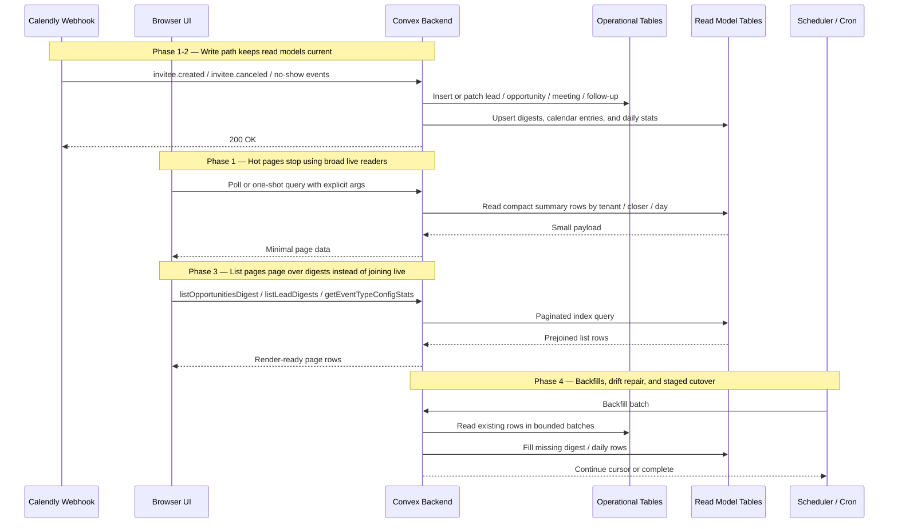

# Read Bandwidth Optimization — Design Specification

**Version:** 0.1 (MVP)
**Status:** Draft
**Scope:** Current Convex readers reconstruct dashboards, lists, calendar views, and reports from full operational documents and broad live subscriptions. This design introduces a migration-safe read-model layer, smaller query payloads, and narrower subscription strategy so the app can scale without database bandwidth exploding.
**Prerequisite:** Existing `tenantStats`, `domainEvents`, `meetingFormResponses`, and reporting aggregate components are already deployed. Implementation must use a widen-migrate-narrow rollout for all new indexed tables and read-path cutovers.

---

## Table of Contents

1. [Goals & Non-Goals](#1-goals--non-goals)
2. [Actors & Roles](#2-actors--roles)
3. [Current State Signals](#3-current-state-signals)
4. [End-to-End Flow Overview](#4-end-to-end-flow-overview)
5. [Phase 1: Query Strategy & Subscription Hardening](#5-phase-1-query-strategy--subscription-hardening)
6. [Phase 2: Dashboard and Calendar Read Models](#6-phase-2-dashboard-and-calendar-read-models)
7. [Phase 3: List and Settings Read Models](#7-phase-3-list-and-settings-read-models)
8. [Phase 4: Reporting and Detail Decomposition](#8-phase-4-reporting-and-detail-decomposition)
9. [Data Model](#9-data-model)
10. [Convex Function Architecture](#10-convex-function-architecture)
11. [Routing & Authorization](#11-routing--authorization)
12. [Security Considerations](#12-security-considerations)
13. [Error Handling & Edge Cases](#13-error-handling--edge-cases)
14. [Open Questions](#14-open-questions)
15. [Dependencies](#15-dependencies)
16. [Applicable Skills](#16-applicable-skills)

---

## 1. Goals & Non-Goals

### Goals

- Reduce uncached Convex read bandwidth on the current highest-cost surfaces: admin dashboard, closer dashboard, closer calendar, pipeline list, leads list, event type settings, team reporting, and meeting detail.
- Replace repeated scans of full `meetings`, `opportunities`, and `paymentRecords` documents with read models that return only the fields the UI actually renders.
- Eliminate time-dependent reactive query behavior on hot surfaces by moving to point-in-time fetches, polling, or explicit time buckets where reactivity is not materially valuable.
- Reuse existing write-side infrastructure (`tenantStats`, `domainEvents`, aggregate components, webhook pipeline hooks) instead of introducing a second source of truth.
- Make the optimization rollout migration-safe so production can move incrementally without breaking current readers or requiring downtime.
- Preserve strong tenant scoping and role enforcement on all new read models.
- Establish a durable scaling posture before the app leaves the free plan, so paid-plan adoption does not coincide with emergency bandwidth work.

### Non-Goals (deferred)

- Re-architecting WorkOS auth, workspace routing, or the core multi-tenant model.
- Eliminating raw webhook storage. `rawWebhookEvents` may still be retained for replay and audit purposes.
- Building a warehouse or OLAP export pipeline. This design keeps Convex efficient for operational analytics, not arbitrary BI workloads.
- Perfectly optimizing every low-traffic detail view. The goal is to remove the top 80-90% of projected read bandwidth, then revisit any residual hotspots with fresh signals.
- Replacing the current domain event model. This design builds on the existing `domainEvents` table rather than introducing another event log.

---

## 2. Actors & Roles

| Actor | Identity | Auth Method | Key Permissions |
|---|---|---|---|
| **Tenant Master** | CRM workspace owner | WorkOS AuthKit, member of tenant org | Full access to admin dashboard, pipeline, reports, settings, team, and tenant-scoped read models |
| **Tenant Admin** | CRM workspace admin | WorkOS AuthKit, member of tenant org | Full access to admin operational views except owner-only actions |
| **Closer** | Sales closer | WorkOS AuthKit, member of tenant org | Own dashboard, own calendar, own pipeline, own meetings, own reminders |
| **System Admin** | Platform operator | WorkOS AuthKit, member of system admin org | No access to tenant CRM read models except through separate `/admin` surfaces |
| **Calendly Webhook** | External event source | HMAC-signed webhook request | Triggers pipeline writes that must also keep read models current |
| **Background Jobs** | Convex scheduler / cron | Internal functions only | Backfills, digest repair, staged cutovers, verification jobs |

### CRM Role <-> External Role Mapping

| CRM `users.role` | External Role | Notes |
|---|---|---|
| `tenant_master` | WorkOS `owner` | Full tenant read access |
| `tenant_admin` | WorkOS `tenant-admin` | Full tenant operational read access |
| `closer` | WorkOS `closer` | Own-only access on closer-facing read models |

> **Access model choice:** New read-model queries do not weaken authorization. They still derive `tenantId`, `userId`, and `role` from `requireTenantUser()` and never trust client-supplied actor identifiers.

---

## 3. Current State Signals

As of **April 21, 2026**, the Convex usage dashboard for **April 1, 2026 through April 21, 2026** shows **530.4 MB reads (93.7%)** versus **35.87 MB writes (6.3%)**. The app is read-amplified.

### Highest-signal current hotspots

| Function | Current Pattern | Why it scales poorly |
|---|---|---|
| `webhooks/calendlyMutations.persistRawEvent` | Large raw payload insert | Hot write path but bounded relative to downstream rereads |
| `pipeline/inviteeCreated.process` | Multi-table mutation + digest-like maintenance by hand | Each write invalidates many subscribed readers |
| `reporting/teamPerformance.getTeamPerformanceMetrics` | Aggregate counts plus full `meetings` and `paymentRecords` scans | Reads many large rows for a report page |
| `closer/meetingOverrun.checkMeetingAttendance` | Multi-table mutation with retries and OCC conflicts | Not the largest write volume, but it creates invalidation fan-out |
| `eventTypeConfigs/queries.getEventTypeConfigsWithStats` | Per-config opportunity scan | N+1 read pattern on a settings page |
| `opportunities/queries.listOpportunitiesForAdmin` | Paginate opportunities, then join leads/users/event types/meetings | Full-row list reader with N+1 enrichment |
| `closer/calendar.getMeetingsForRange` | Scan meetings, then join opportunities/event types | Wide payload on a live calendar surface |
| `dashboard/adminStats.getAdminDashboardStats` | Read `tenantStats`, then scan today’s meetings | Repeated live dashboard query with time-sensitive logic |
| `closer/dashboard.getNextMeeting` | Scan future meetings, then join opportunity/lead/event type | Cheap per call, expensive by frequency and reruns |
| `leads/queries.listLeads` | Paginate leads, then per-lead opportunity scans | N+1 read pattern on a list page |
| `closer/meetingDetail.getMeetingDetail` | Eagerly load header, history, payments, storage metadata | Heavy detail query even before the user asks for all tabs |

### Root causes

| Root Cause | Codebase Evidence | Optimization Direction |
|---|---|---|
| **Time-dependent reactive queries** | `Date.now()` inside `getNextMeeting` and `getAdminDashboardStats` | Use polling, explicit time buckets, or precomputed daily stats |
| **Full operational docs on hot pages** | `meetings`, `opportunities`, `paymentRecords` contain many fields the UI does not need | Introduce digest/read-model tables |
| **N+1 enrichment** | Leads list, opportunities list, settings stats, meeting detail | Prejoin at write time into small list rows |
| **Reports scan operational tables** | Team performance still scans payments and meetings | Use daily rollups keyed by tenant, closer, and day |
| **No-op write invalidation** | `updateTenantStats()` always patches `lastUpdatedAt` even when delta is zero | Suppress no-op patches so readers do not rerun for meaningless writes |
| **Inactive UI still mounts queries** | Settings page mounts field-mapping stats even when tab is closed | Gate queries by active tab or switch to one-shot fetches |

### Optimization target

| Surface | Target Read Reduction | Mechanism |
|---|---|---|
| Admin dashboard | 70-90% | `tenantStats` + `tenantDailyStats` instead of scanning meetings/payments/customers |
| Closer dashboard + calendar | 70-90% | `meetingCalendarEntries` + polling instead of broad meeting joins |
| Pipeline list | 60-85% | `opportunityDigests` with direct pagination |
| Leads list | 80-95% | `leadDigests` with direct pagination |
| Event type settings | 90%+ | `eventTypeConfigStats` instead of per-config scans |
| Team performance report | 85-95% | `closerDailyPerformance` rollups instead of full meeting/payment scans |
| Meeting detail initial load | 50-80% | Split header from history/payments tabs |

---

## 4. End-to-End Flow Overview



> **Core strategy:** Trade a small amount of extra work on writes for a large reduction in repeated reads. In this CRM, writes are infrequent compared to page loads, subscriptions, and polling intervals, so the economics strongly favor write-time denormalization.

---

## 5. Phase 1: Query Strategy & Subscription Hardening

### 5.1 What & Why

Phase 1 reduces bandwidth without waiting for new tables:

1. Stop using live subscriptions where the page does not require realtime consistency.
2. Remove time-based cache churn from hot queries.
3. Suppress no-op writes that invalidate subscribers for no business reason.
4. Stop mounting expensive queries for hidden tabs or inactive sections.

This phase should land before any schema rollout because it immediately lowers pressure on the current deployment and narrows the blast radius for subsequent read-model backfills.

> **Runtime decision:** Reports and settings are point-in-time administrative tools, not collaborative surfaces. They do not need Convex’s always-live subscription behavior. Polling or one-shot reads are the correct consistency/cost tradeoff.

### 5.2 Query policy by surface

| Surface | Current Strategy | New Strategy | Reason |
|---|---|---|---|
| Admin dashboard | `useQuery` | `preloadQuery` for initial render, then `usePollingQuery` every 60s | Avoid standing broad subscription |
| Closer next meeting | `usePollingQuery` already | Keep polling, but query compact read model and pass explicit rounded `notBefore` | Correct for time-based data |
| Team report | `useQuery` | `usePollingQuery(..., { intervalMs: 0 })` or explicit refetch on date change | Reports do not need live invalidation |
| Settings field mappings tab | Always-mounted `useQuery` | Fetch only when active tab is selected | Avoid background cost |
| Meeting detail subpanels | Eager single query | Split into header + tabbed follow-on queries | User only pays for data they open |

### 5.3 No-op invalidation guardrails

`updateTenantStats()` currently patches `lastUpdatedAt` even when every delta field is `0`. That invalidates any query reading `tenantStats` even though the displayed values did not change.

```typescript
// Path: convex/lib/tenantStatsHelper.ts
export async function updateTenantStats(
  ctx: MutationCtx,
  tenantId: Id<"tenants">,
  delta: TenantStatsDelta,
): Promise<void> {
  const stats = await ctx.db
    .query("tenantStats")
    .withIndex("by_tenantId", (q) => q.eq("tenantId", tenantId))
    .unique();

  if (!stats) {
    // Existing create path stays as-is.
    return;
  }

  const patch: Partial<Doc<"tenantStats">> = {};
  for (const field of TENANT_STATS_FIELDS) {
    const value = delta[field];
    if (value === undefined || value === 0) {
      continue;
    }
    patch[field] = (stats[field] ?? 0) + value;
  }

  if (Object.keys(patch).length === 0) {
    return;
  }

  patch.lastUpdatedAt = Date.now();
  await ctx.db.patch(stats._id, patch);
}
```

> **Why not keep `lastUpdatedAt` hot?** Because it turns a logical no-op into a tenant-wide dashboard invalidation. `lastUpdatedAt` should represent a meaningful stats change, not every code path that happened to call the helper.

### 5.4 Frontend gating example

```typescript
// Path: app/workspace/settings/_components/settings-page-client.tsx
"use client";

const [activeTab, setActiveTab] = useState("calendly");

const configsWithStats = usePollingQuery(
  api.eventTypeConfigs.queries.getEventTypeConfigsWithStats,
  isAdmin && activeTab === "field-mappings" ? {} : "skip",
  { intervalMs: 0 },
);

<Tabs value={activeTab} onValueChange={setActiveTab}>
  {/* inactive tabs no longer mount their query */}
</Tabs>
```

### 5.5 Phase 1 deliverables

| Deliverable | Files |
|---|---|
| Add no-op suppression to shared stats/digest helpers | `convex/lib/tenantStatsHelper.ts`, new read-model helpers |
| Move reports/settings from live subscriptions to point-in-time reads | `app/workspace/reports/**`, `app/workspace/settings/**` |
| Add explicit rounded time args where queries depend on “now” | closer dashboard and admin dashboard readers |
| Remove dead or duplicate query mount sites | unused preload helpers and accidental duplicate readers |

---

## 6. Phase 2: Dashboard and Calendar Read Models

### 6.1 What & Why

The admin dashboard, closer dashboard, and closer calendar are the highest-frequency surfaces. They must stop scanning `meetings`, `opportunities`, `customers`, and `paymentRecords` directly.

This phase introduces three read models:

- `tenantDailyStats` for admin dashboard day/range cards
- `closerDailyPerformance` for closer and team rollups
- `meetingCalendarEntries` for the closer calendar, “next meeting,” and filtered pipeline strip

These tables are intentionally small, index-friendly, and tenant-scoped.

> **Read-model choice:** We are not putting every new field back on `meetings` or `opportunities`. Those are hot operational tables. A separate read-model table keeps list/query payloads small and avoids bloating every operational read.

### 6.2 Write-path maintenance

The read models update inside the same write flows that already maintain `tenantStats`, `meetingsByStatus`, and `opportunityByStatus`.

```typescript
// Path: convex/readModels/calendarEntries.ts
export async function syncMeetingCalendarEntry(
  ctx: MutationCtx,
  meetingId: Id<"meetings">,
): Promise<void> {
  const meeting = await ctx.db.get(meetingId);
  if (!meeting) return;

  const opportunity = await ctx.db.get(meeting.opportunityId);
  const eventTypeConfig = opportunity?.eventTypeConfigId
    ? await ctx.db.get(opportunity.eventTypeConfigId)
    : null;

  const existing = await ctx.db
    .query("meetingCalendarEntries")
    .withIndex("by_meetingId", (q) => q.eq("meetingId", meetingId))
    .unique();

  const nextDoc = {
    tenantId: meeting.tenantId,
    closerId: meeting.assignedCloserId,
    meetingId: meeting._id,
    opportunityId: meeting.opportunityId,
    leadId: opportunity?.leadId ?? null,
    scheduledAt: meeting.scheduledAt,
    durationMinutes: meeting.durationMinutes,
    status: meeting.status,
    leadName: meeting.leadName ?? "Unknown",
    opportunityStatus: opportunity?.status ?? "scheduled",
    eventTypeConfigId: opportunity?.eventTypeConfigId,
    eventTypeName: eventTypeConfig?.displayName ?? null,
    meetingJoinUrl: meeting.meetingJoinUrl,
    zoomJoinUrl: meeting.zoomJoinUrl,
    calendlyEventUri: meeting.calendlyEventUri,
    updatedAt: Date.now(),
  };

  if (!existing) {
    await ctx.db.insert("meetingCalendarEntries", nextDoc);
    return;
  }

  if (shallowEqualCalendarEntry(existing, nextDoc)) {
    return;
  }

  await ctx.db.patch(existing._id, nextDoc);
}
```

This helper is invoked from:

- `pipeline/inviteeCreated.process`
- `pipeline/inviteeCanceled.process`
- `pipeline/inviteeNoShow.process` / revert
- closer meeting lifecycle actions
- admin review resolution flows
- meeting reassignment flows

### 6.3 Dashboard query rewrite

```typescript
// Path: convex/dashboard/adminStats.ts
export const getAdminDashboardStats = query({
  args: {
    dayStartUtc: v.number(),
    dayEndUtc: v.number(),
  },
  handler: async (ctx, { dayStartUtc, dayEndUtc }) => {
    const { tenantId } = await requireTenantUser(ctx, [
      "tenant_master",
      "tenant_admin",
    ]);

    const [stats, today] = await Promise.all([
      ctx.db
        .query("tenantStats")
        .withIndex("by_tenantId", (q) => q.eq("tenantId", tenantId))
        .unique(),
      ctx.db
        .query("tenantDailyStats")
        .withIndex("by_tenantId_and_dayStartUtc", (q) =>
          q.eq("tenantId", tenantId).eq("dayStartUtc", dayStartUtc),
        )
        .unique(),
    ]);

    return {
      totalTeamMembers: stats?.totalTeamMembers ?? 0,
      totalClosers: stats?.totalClosers ?? 0,
      totalOpportunities: stats?.totalOpportunities ?? 0,
      activeOpportunities: stats?.activeOpportunities ?? 0,
      wonDeals: stats?.wonDeals ?? 0,
      meetingsToday: today?.meetingsScheduled ?? 0,
      revenueLogged:
        ((stats?.totalCommissionableFinalRevenueMinor ?? 0) +
          (stats?.totalCommissionableDepositRevenueMinor ?? 0)) / 100,
    };
  },
});
```

### 6.4 Calendar and next-meeting query rewrites

| Query | Current Read Shape | New Read Shape |
|---|---|---|
| `getNextMeeting` | Scan future meetings, then join opportunity + lead + event type | Query `meetingCalendarEntries` by closer + status + rounded `notBefore` |
| `getMeetingsForRange` | Scan meetings, then join opportunities/event types | Query `meetingCalendarEntries` range directly |
| `getPipelineSummary` filtered mode | Scan meetings in range, then fetch each parent opportunity | Query `meetingCalendarEntries` range, dedupe `opportunityId`, count by stored `opportunityStatus` |

### 6.5 Daily rollup model

`tenantDailyStats` and `closerDailyPerformance` are updated only when a write changes the underlying facts. They are never recomputed inside hot readers.

```typescript
// Path: convex/readModels/dailyStats.ts
export async function applyTenantDailyDelta(
  ctx: MutationCtx,
  tenantId: Id<"tenants">,
  dayStartUtc: number,
  delta: TenantDailyStatsDelta,
): Promise<void> {
  const existing = await ctx.db
    .query("tenantDailyStats")
    .withIndex("by_tenantId_and_dayStartUtc", (q) =>
      q.eq("tenantId", tenantId).eq("dayStartUtc", dayStartUtc),
    )
    .unique();

  if (!existing) {
    await ctx.db.insert("tenantDailyStats", {
      tenantId,
      dayStartUtc,
      meetingsScheduled: delta.meetingsScheduled ?? 0,
      opportunitiesCreated: delta.opportunitiesCreated ?? 0,
      customersConverted: delta.customersConverted ?? 0,
      paymentCount: delta.paymentCount ?? 0,
      wonDealsCount: delta.wonDealsCount ?? 0,
      commissionableFinalRevenueMinor:
        delta.commissionableFinalRevenueMinor ?? 0,
      commissionableDepositRevenueMinor:
        delta.commissionableDepositRevenueMinor ?? 0,
      nonCommissionableFinalRevenueMinor:
        delta.nonCommissionableFinalRevenueMinor ?? 0,
      nonCommissionableDepositRevenueMinor:
        delta.nonCommissionableDepositRevenueMinor ?? 0,
      updatedAt: Date.now(),
    });
    return;
  }

  // Same no-op rule as tenantStats: do not patch if every delta is zero.
}
```

---

## 7. Phase 3: List and Settings Read Models

### 7.1 What & Why

Phase 3 targets the list pages and settings page that currently pay repeated N+1 costs:

- `listOpportunitiesForAdmin`
- `listLeads`
- `getEventTypeConfigsWithStats`

All three should become direct index lookups against compact prejoined rows.

### 7.2 Opportunity digests

`opportunityDigests` becomes the source of truth for the admin pipeline table. It stores exactly the fields the page renders, including lead/closer/event-type names and latest/next meeting status fields.

```typescript
// Path: convex/opportunities/digestQueries.ts
export const listOpportunityDigests = query({
  args: {
    paginationOpts: paginationOptsValidator,
    statusFilter: v.optional(opportunityStatusValidator),
    assignedCloserId: v.optional(v.id("users")),
    periodStart: v.optional(v.number()),
    periodEnd: v.optional(v.number()),
  },
  handler: async (ctx, args) => {
    const { tenantId } = await requireTenantUser(ctx, [
      "tenant_master",
      "tenant_admin",
    ]);

    return await buildOpportunityDigestQuery(ctx, tenantId, args);
  },
});
```

> **Why not keep enriching `opportunities` in-place?** Because the pipeline table is a classic hot list page. The same joins are paid repeatedly for every load, pagination event, and invalidation. A digest table pays that cost once per write instead of once per read.

### 7.3 Lead digests

`leadDigests` replaces the current per-lead opportunity scan. The digest stores:

- `displayName`
- `email`
- `status`
- `latestMeetingAt`
- `opportunityCount`
- `assignedCloserId`
- `assignedCloserName`
- `updatedAt`

It is refreshed on:

- lead create/update/merge
- opportunity create/assignment/status changes
- meeting create/cancel/reschedule/no-show flows

### 7.4 Event type config stats

`eventTypeConfigStats` stores `bookingCount` and `lastBookingAt` per config so the settings page no longer scans opportunities once per config.

```typescript
// Path: convex/eventTypeConfigs/stats.ts
export async function bumpEventTypeConfigStats(
  ctx: MutationCtx,
  args: {
    tenantId: Id<"tenants">;
    eventTypeConfigId: Id<"eventTypeConfigs">;
    lastBookingAt: number;
    bookingDelta: 1 | -1;
  },
): Promise<void> {
  const stats = await ctx.db
    .query("eventTypeConfigStats")
    .withIndex("by_tenantId_and_eventTypeConfigId", (q) =>
      q
        .eq("tenantId", args.tenantId)
        .eq("eventTypeConfigId", args.eventTypeConfigId),
    )
    .unique();

  if (!stats) {
    await ctx.db.insert("eventTypeConfigStats", {
      tenantId: args.tenantId,
      eventTypeConfigId: args.eventTypeConfigId,
      bookingCount: Math.max(0, args.bookingDelta),
      lastBookingAt: args.lastBookingAt,
      updatedAt: Date.now(),
    });
    return;
  }

  await ctx.db.patch(stats._id, {
    bookingCount: Math.max(0, stats.bookingCount + args.bookingDelta),
    lastBookingAt: Math.max(stats.lastBookingAt ?? 0, args.lastBookingAt),
    updatedAt: Date.now(),
  });
}
```

### 7.5 Phase 3 deliverables

| Deliverable | Files |
|---|---|
| Digest schemas + indexes | `convex/schema.ts` |
| Write helpers | `convex/readModels/digests.ts`, `convex/eventTypeConfigs/stats.ts` |
| Backfill jobs | `convex/readModels/backfill.ts` |
| Query rewrites | opportunities, leads, settings query modules |
| UI cutover | pipeline page, leads page, settings page |

---

## 8. Phase 4: Reporting and Detail Decomposition

### 8.1 What & Why

Reports and detail pages should not rebuild history from operational tables on every render.

Phase 4 does two things:

1. Replace report scans with daily performance rollups.
2. Break heavy detail pages into staged, user-driven fetches.

### 8.2 Team performance rollup

`closerDailyPerformance` is the source for:

- booked / canceled / no-show / review-required counts
- show-up counts
- late-start and overrun timing metrics
- sales count
- commissionable revenue
- admin-logged revenue

The report query becomes a bounded read over daily rows rather than full `meetings` and `paymentRecords` documents.

```typescript
// Path: convex/reporting/teamPerformance.ts
export const getTeamPerformanceMetrics = query({
  args: {
    startDate: v.number(),
    endDate: v.number(),
  },
  handler: async (ctx, { startDate, endDate }) => {
    const { tenantId } = await requireTenantUser(ctx, [
      "tenant_master",
      "tenant_admin",
    ]);

    const dayStarts = enumerateUtcDayStarts(startDate, endDate);
    const rows = await Promise.all(
      dayStarts.map((dayStartUtc) =>
        ctx.db
          .query("closerDailyPerformance")
          .withIndex("by_tenantId_and_dayStartUtc", (q) =>
            q.eq("tenantId", tenantId).eq("dayStartUtc", dayStartUtc),
          )
          .collect(),
      ),
    );

    return buildTeamPerformanceResponse(rows.flat());
  },
});
```

> **Why daily rows instead of a monolithic tenant summary?** Reports need arbitrary date ranges and per-closer breakdowns. Daily rows keep reads bounded by the date span instead of table size while preserving filter flexibility.

### 8.3 Meeting detail decomposition

The initial meeting detail page should only load the header, current meeting, active follow-up, and small payment summary. Historical meeting timeline and full payment list become tabbed or paginated follow-on queries.

| Query | Initial Load? | Strategy |
|---|---|---|
| `getMeetingDetailHeader` | Yes | Small payload, no history scan |
| `getMeetingHistoryPage` | On tab open | Paginated by lead/opportunity history |
| `getMeetingPaymentsPage` | On payments tab open | Paginated payments, lazy storage URL lookup |
| `getMeetingCommentsPage` | On notes tab open | Separate read path |

This keeps a rare but expensive detail page from paying the full history cost when the user only wants the header and current meeting actions.

### 8.4 Drift repair and verification

Backfills and verification scripts compare read-model rows against operational truth in bounded batches. The existing aggregate verification pattern in `convex/reporting/verification.ts` should be mirrored for the new digest tables.

---

## 9. Data Model

### 9.1 `tenantDailyStats` Table

```typescript
// Path: convex/schema.ts
tenantDailyStats: defineTable({
  tenantId: v.id("tenants"),
  dayStartUtc: v.number(), // Start of day in UTC; client converts display timezone
  meetingsScheduled: v.number(),
  opportunitiesCreated: v.number(),
  customersConverted: v.number(),
  paymentCount: v.number(),
  wonDealsCount: v.number(),
  commissionableFinalRevenueMinor: v.number(),
  commissionableDepositRevenueMinor: v.number(),
  nonCommissionableFinalRevenueMinor: v.number(),
  nonCommissionableDepositRevenueMinor: v.number(),
  updatedAt: v.number(),
})
  .index("by_tenantId_and_dayStartUtc", ["tenantId", "dayStartUtc"]),
```

### 9.2 `closerDailyPerformance` Table

```typescript
// Path: convex/schema.ts
closerDailyPerformance: defineTable({
  tenantId: v.id("tenants"),
  closerId: v.id("users"),
  dayStartUtc: v.number(),
  callClassification: v.union(
    v.literal("new"),
    v.literal("follow_up"),
  ),
  bookedCalls: v.number(),
  canceledCalls: v.number(),
  noShows: v.number(),
  reviewRequiredCalls: v.number(),
  callsShowed: v.number(),
  startedMeetingsCount: v.number(),
  onTimeStartCount: v.number(),
  lateStartCount: v.number(),
  totalLateStartMs: v.number(),
  completedWithDurationCount: v.number(),
  overranCount: v.number(),
  totalOverrunMs: v.number(),
  totalActualDurationMs: v.number(),
  scheduleAdherentCount: v.number(),
  manuallyCorrectedCount: v.number(),
  salesCount: v.number(),
  commissionableFinalRevenueMinor: v.number(),
  commissionableDepositRevenueMinor: v.number(),
  adminLoggedRevenueMinor: v.number(),
  updatedAt: v.number(),
})
  .index("by_tenantId_and_dayStartUtc", ["tenantId", "dayStartUtc"])
  .index("by_tenantId_and_closerId_and_dayStartUtc", [
    "tenantId",
    "closerId",
    "dayStartUtc",
  ])
  .index("by_tenantId_and_closerId_and_callClassification_and_dayStartUtc", [
    "tenantId",
    "closerId",
    "callClassification",
    "dayStartUtc",
  ]),
```

### 9.3 `meetingCalendarEntries` Table

```typescript
// Path: convex/schema.ts
meetingCalendarEntries: defineTable({
  tenantId: v.id("tenants"),
  closerId: v.id("users"),
  meetingId: v.id("meetings"),
  opportunityId: v.id("opportunities"),
  leadId: v.union(v.id("leads"), v.null()),
  scheduledAt: v.number(),
  durationMinutes: v.number(),
  status: v.union(
    v.literal("scheduled"),
    v.literal("in_progress"),
    v.literal("completed"),
    v.literal("canceled"),
    v.literal("no_show"),
    v.literal("meeting_overran"),
  ),
  opportunityStatus: v.union(
    v.literal("scheduled"),
    v.literal("in_progress"),
    v.literal("meeting_overran"),
    v.literal("payment_received"),
    v.literal("follow_up_scheduled"),
    v.literal("reschedule_link_sent"),
    v.literal("lost"),
    v.literal("canceled"),
    v.literal("no_show"),
  ),
  leadName: v.string(),
  eventTypeConfigId: v.optional(v.id("eventTypeConfigs")),
  eventTypeName: v.optional(v.string()),
  meetingJoinUrl: v.optional(v.string()),
  zoomJoinUrl: v.optional(v.string()),
  calendlyEventUri: v.string(),
  updatedAt: v.number(),
})
  .index("by_meetingId", ["meetingId"])
  .index("by_tenantId_and_closerId_and_scheduledAt", [
    "tenantId",
    "closerId",
    "scheduledAt",
  ])
  .index("by_tenantId_and_closerId_and_status_and_scheduledAt", [
    "tenantId",
    "closerId",
    "status",
    "scheduledAt",
  ])
  .index("by_tenantId_and_opportunityId_and_scheduledAt", [
    "tenantId",
    "opportunityId",
    "scheduledAt",
  ]),
```

### 9.4 `opportunityDigests` Table

```typescript
// Path: convex/schema.ts
opportunityDigests: defineTable({
  tenantId: v.id("tenants"),
  opportunityId: v.id("opportunities"),
  leadId: v.id("leads"),
  assignedCloserId: v.optional(v.id("users")),
  status: v.union(
    v.literal("scheduled"),
    v.literal("in_progress"),
    v.literal("meeting_overran"),
    v.literal("payment_received"),
    v.literal("follow_up_scheduled"),
    v.literal("reschedule_link_sent"),
    v.literal("lost"),
    v.literal("canceled"),
    v.literal("no_show"),
  ),
  createdAt: v.number(),
  updatedAt: v.number(),
  leadName: v.string(),
  leadEmail: v.string(),
  closerName: v.optional(v.string()),
  closerEmail: v.optional(v.string()),
  eventTypeConfigId: v.optional(v.id("eventTypeConfigs")),
  eventTypeName: v.optional(v.string()),
  hostCalendlyUserUri: v.optional(v.string()),
  hostCalendlyEmail: v.optional(v.string()),
  hostCalendlyName: v.optional(v.string()),
  latestMeetingId: v.optional(v.id("meetings")),
  latestMeetingAt: v.optional(v.number()),
  latestMeetingStatus: v.optional(v.string()),
  nextMeetingId: v.optional(v.id("meetings")),
  nextMeetingAt: v.optional(v.number()),
  nextMeetingStatus: v.optional(v.string()),
})
  .index("by_opportunityId", ["opportunityId"])
  .index("by_tenantId_and_updatedAt", ["tenantId", "updatedAt"])
  .index("by_tenantId_and_status_and_updatedAt", [
    "tenantId",
    "status",
    "updatedAt",
  ])
  .index("by_tenantId_and_assignedCloserId_and_updatedAt", [
    "tenantId",
    "assignedCloserId",
    "updatedAt",
  ])
  .index("by_tenantId_and_assignedCloserId_and_status_and_updatedAt", [
    "tenantId",
    "assignedCloserId",
    "status",
    "updatedAt",
  ])
  .index("by_tenantId_and_createdAt", ["tenantId", "createdAt"])
  .index("by_tenantId_and_status_and_createdAt", [
    "tenantId",
    "status",
    "createdAt",
  ])
  .index("by_tenantId_and_assignedCloserId_and_createdAt", [
    "tenantId",
    "assignedCloserId",
    "createdAt",
  ])
  .index("by_tenantId_and_assignedCloserId_and_status_and_createdAt", [
    "tenantId",
    "assignedCloserId",
    "status",
    "createdAt",
  ]),
```

### 9.5 `leadDigests` Table

```typescript
// Path: convex/schema.ts
leadDigests: defineTable({
  tenantId: v.id("tenants"),
  leadId: v.id("leads"),
  status: v.union(
    v.literal("active"),
    v.literal("converted"),
    v.literal("merged"),
  ),
  firstSeenAt: v.number(),
  updatedAt: v.number(),
  displayName: v.string(),
  email: v.string(),
  latestMeetingAt: v.optional(v.number()),
  opportunityCount: v.number(),
  assignedCloserId: v.optional(v.id("users")),
  assignedCloserName: v.optional(v.string()),
})
  .index("by_leadId", ["leadId"])
  .index("by_tenantId_and_status_and_updatedAt", [
    "tenantId",
    "status",
    "updatedAt",
  ])
  .index("by_tenantId_and_status_and_firstSeenAt", [
    "tenantId",
    "status",
    "firstSeenAt",
  ]),
```

### 9.6 `eventTypeConfigStats` Table

```typescript
// Path: convex/schema.ts
eventTypeConfigStats: defineTable({
  tenantId: v.id("tenants"),
  eventTypeConfigId: v.id("eventTypeConfigs"),
  bookingCount: v.number(),
  lastBookingAt: v.optional(v.number()),
  updatedAt: v.number(),
})
  .index("by_tenantId_and_eventTypeConfigId", [
    "tenantId",
    "eventTypeConfigId",
  ])
  .index("by_tenantId_and_lastBookingAt", ["tenantId", "lastBookingAt"]),
```

### 9.7 Modified: existing tables

No existing table requires destructive field replacement in Phase 1-4. The first pass is additive:

- existing operational tables remain authoritative
- new read-model tables are filled in parallel
- query cutover happens only after backfill verification succeeds

> **Migration rule:** This is intentionally a widen-first design. The app should dual-read or fall back to operational truth until the new tables are fully backfilled and verified.

---

## 10. Convex Function Architecture

```text
convex/
├── dashboard/
│   └── adminStats.ts                  # MODIFIED - Phase 2 query rewrite
├── closer/
│   ├── calendar.ts                    # MODIFIED - Phase 2 query rewrite
│   ├── dashboard.ts                   # MODIFIED - Phase 1/2 query rewrites
│   └── meetingDetail.ts               # MODIFIED - Phase 4 split header/history/payments
├── eventTypeConfigs/
│   ├── queries.ts                     # MODIFIED - Phase 3 read from stats table
│   └── stats.ts                       # NEW - Phase 3 write helpers
├── leads/
│   ├── queries.ts                     # MODIFIED - Phase 3 cutover to leadDigests
│   └── digestQueries.ts               # NEW - Phase 3 paginated digest reader
├── opportunities/
│   ├── queries.ts                     # MODIFIED - legacy fallback during rollout
│   └── digestQueries.ts               # NEW - Phase 3 paginated digest reader
├── readModels/
│   ├── backfill.ts                    # NEW - Phase 2/3/4 staged backfills
│   ├── calendarEntries.ts             # NEW - Phase 2 maintenance helpers
│   ├── dailyStats.ts                  # NEW - Phase 2/4 daily rollup helpers
│   ├── digests.ts                     # NEW - Phase 3 lead/opportunity digest sync
│   ├── verification.ts                # NEW - Phase 2/3/4 read-model verification
│   └── writeHooks.ts                  # NEW - shared internal helpers invoked from mutations
├── reporting/
│   ├── teamPerformance.ts             # MODIFIED - Phase 4 read from daily rollups
│   └── verification.ts                # MODIFIED - extend to cover new read models
├── lib/
│   ├── domainEvents.ts                # MODIFIED - optional helper utilities only
│   └── tenantStatsHelper.ts           # MODIFIED - Phase 1 no-op suppression
├── pipeline/
│   ├── inviteeCreated.ts              # MODIFIED - invoke read-model hooks
│   ├── inviteeCanceled.ts             # MODIFIED - invoke read-model hooks
│   └── inviteeNoShow.ts               # MODIFIED - invoke read-model hooks
└── schema.ts                          # MODIFIED - new read-model tables and indexes
```

---

## 11. Routing & Authorization

### 11.1 App Router file tree

```text
app/
├── workspace/
│   ├── page.tsx                                      # MODIFIED - admin dashboard query strategy
│   ├── pipeline/_components/pipeline-page-client.tsx # MODIFIED - use digest reader
│   ├── leads/_components/leads-page-content.tsx      # MODIFIED - use digest reader
│   ├── settings/_components/settings-page-client.tsx # MODIFIED - tab-gated fetch
│   └── reports/team/_components/team-report-page-client.tsx # MODIFIED - point-in-time fetch
└── workspace/closer/
    ├── page.tsx                                      # MODIFIED - dashboard readers
    ├── _components/calendar-view.tsx                # MODIFIED - calendar entry reader
    └── meetings/[meetingId]/**                      # MODIFIED - split detail loading
```

### 11.2 Authorization strategy

- All new public queries continue to call `requireTenantUser()`.
- Admin digest readers permit `tenant_master` and `tenant_admin`.
- Closer digest readers additionally enforce `closerId === userId` in the query or use closer-scoped indexes so unauthorized rows never enter the result set.
- Internal sync/backfill functions are `internalQuery` / `internalMutation` only.

```typescript
// Path: convex/closer/calendar.ts
export const getMeetingsForRange = query({
  args: { startDate: v.number(), endDate: v.number() },
  handler: async (ctx, { startDate, endDate }) => {
    const { userId, tenantId } = await requireTenantUser(ctx, ["closer"]);

    return await ctx.db
      .query("meetingCalendarEntries")
      .withIndex("by_tenantId_and_closerId_and_scheduledAt", (q) =>
        q
          .eq("tenantId", tenantId)
          .eq("closerId", userId)
          .gte("scheduledAt", startDate)
          .lt("scheduledAt", endDate),
      )
      .collect();
  },
});
```

---

## 12. Security Considerations

### 12.1 Credential security

- No new client-visible credentials are introduced.
- Webhook secrets remain in the current tenant-scoped secure storage.
- Read models never store access tokens or third-party secrets.

### 12.2 Multi-tenant isolation

- Every new table includes `tenantId`.
- Every new public query uses a tenant-prefixed index.
- No read model accepts tenant identifiers from the client as the authority for scoping.
- Backfill jobs operate per tenant in bounded batches and log drift without cross-tenant reads.

### 12.3 Role-based data access

| Resource | Tenant Master | Tenant Admin | Closer | System Admin |
|---|---|---|---|---|
| `tenantDailyStats` | Full | Full | None | None |
| `closerDailyPerformance` | Full | Full | Own only | None |
| `meetingCalendarEntries` | Full if admin query added later | Full if admin query added later | Own only | None |
| `opportunityDigests` | Full | Full | None in admin reader | None |
| `leadDigests` | Full | Full | Same as current leads access rules | None |
| `eventTypeConfigStats` | Full | Full | None | None |

### 12.4 Webhook security

- Existing Calendly signature verification remains unchanged.
- The optimization layer attaches to already-validated write paths only.
- No webhook directly writes to read-model tables without first passing through the current pipeline validation and tenant resolution.

### 12.5 Rate limit awareness

| Concern | Mitigation |
|---|---|
| Convex index backfill cost | Use staged deploys for large new indexes where needed |
| Backfill transaction limits | Paginate or `take(n)` with `ctx.scheduler.runAfter(0, ...)` continuation |
| Read-model drift repair | Run bounded batches off-peak and verify before cutover |
| Excessive invalidation | Skip no-op patches in stats and digest helpers |

---

## 13. Error Handling & Edge Cases

### 13.1 Backfill incomplete during rollout

- **Scenario:** A reader is switched before its digest table is fully populated.
- **Detection:** Verification query reports missing digest rows for existing operational rows.
- **Recovery:** Reader remains dual-read: use digest when present, fallback to operational query when missing.
- **User-facing behavior:** No visible change except possibly slower results during rollout.

### 13.2 Digest drift after unexpected mutation path

- **Scenario:** A write path modifies an operational row without syncing the read model.
- **Detection:** Nightly verification compares digest rows to source rows and logs mismatches.
- **Recovery:** Repair job re-syncs affected rows by ID.
- **User-facing behavior:** Stale list row until repair or next relevant write.

### 13.3 Daily bucket boundary mismatch

- **Scenario:** Admin dashboard expects tenant-local “today” while read model uses UTC day buckets.
- **Detection:** Product review and acceptance tests around day rollover.
- **Recovery:** Either accept UTC consistently or add tenant-local business-day configuration before rollout.
- **User-facing behavior:** Potential off-by-one-day dashboard card near midnight if left unresolved.

### 13.4 No-op helper still invalidates queries

- **Scenario:** A shared helper updates `updatedAt` or `lastUpdatedAt` when business values did not change.
- **Detection:** Unit tests and request logs showing patch-without-delta.
- **Recovery:** Centralize equality checks in helper functions and reject empty patches.
- **User-facing behavior:** None, but bandwidth and reruns increase.

### 13.5 Meeting detail tabs request too much data

- **Scenario:** A user opens a meeting with very deep history or many payments.
- **Detection:** Query timing/bytes warnings and pagination tests.
- **Recovery:** Paginate history and payments; lazy-resolve storage URLs only for visible rows.
- **User-facing behavior:** “Load more” instead of huge first paint.

---

## 14. Open Questions

| # | Question | Current Thinking |
|---|---|---|
| 1 | Should “today” be UTC or tenant-local business day? | Default to UTC for Phase 1-4 because the current dashboard already behaves in UTC-like server time; add tenant-local business day later if product requires it. |
| 2 | Should report pages ever be live subscriptions? | No. Reports are point-in-time tools and should use one-shot fetches or manual refresh. |
| 3 | Should `opportunityDigests` and `leadDigests` be primary sources for exports too? | Yes for standard CSV exports; fallback to operational truth only for audit-grade exports. |
| 4 | Should `meetingCalendarEntries` be extended for admin-wide calendar views later? | Probably yes. The schema already supports tenant + opportunity indexing. |
| 5 | ~~Do we need a second event system for read-model projection?~~ | No. Existing `domainEvents` plus direct write hooks are sufficient. |
| 6 | Should `closerDailyPerformance` include deposit revenue or only final revenue? | Include both; the report layer can decide what to display. |
| 7 | Is a generic projector from `domainEvents` worth building now? | Not for Phase 1-4. Direct write hooks are simpler and lower-latency. Revisit only if write-path sprawl becomes unmanageable. |

---

## 15. Dependencies

### 15.1 New packages

| Package | Why | Runtime | Install command |
|---|---|---|---|
| None | Existing Convex packages are sufficient | N/A | N/A |

### 15.2 Already-installed packages

| Package | Used for |
|---|---|
| `@convex-dev/aggregate` | Existing reporting aggregates; can continue serving all-time counts and verification |
| `@convex-dev/migrations` | Migration-safe widen-migrate-narrow rollouts and backfills |
| `convex` | Query/mutation/action runtime, scheduling, and pagination |

### 15.3 Environment variables

| Variable | Where set | Used by |
|---|---|---|
| None required for MVP | N/A | All rollout behavior can be encoded in functions and staged cutovers |

### 15.4 External service configuration

| Configuration | Action |
|---|---|
| Calendly webhook config | No changes required |
| WorkOS auth config | No changes required |

---

## 16. Applicable Skills

| Skill | When to invoke | Phase(s) |
|---|---|---|
| `convex-performance-audit` | Validate hotspots, confirm byte reductions after each cutover, inspect sibling readers/writers | 1-4 |
| `convex-migration-helper` | Add new tables, staged indexes, backfills, and dual-read cutovers safely | 2-4 |
| `next-best-practices` | Keep App Router data fetching boundaries clean while moving pages from live query to point-in-time fetch patterns | 1, 4 |

---

## Recommended rollout order

1. Ship Phase 1 guardrails first: no-op suppression, tab gating, report/settings fetch strategy.
2. Add Phase 2 tables and backfills, then cut over dashboard and calendar readers.
3. Add Phase 3 digests and cut over pipeline, leads, and settings stats.
4. Add Phase 4 daily reporting rollups and split meeting detail into staged queries.
5. Re-run Convex insights after each phase and only continue if the expected byte reductions actually materialize.

> **Success condition:** By the end of Phase 4, the primary recurring pages should read compact, tenant-scoped summary rows instead of reconstructing views from operational tables. At that point, bandwidth should scale roughly with page count and selected date range, not with total table size.
