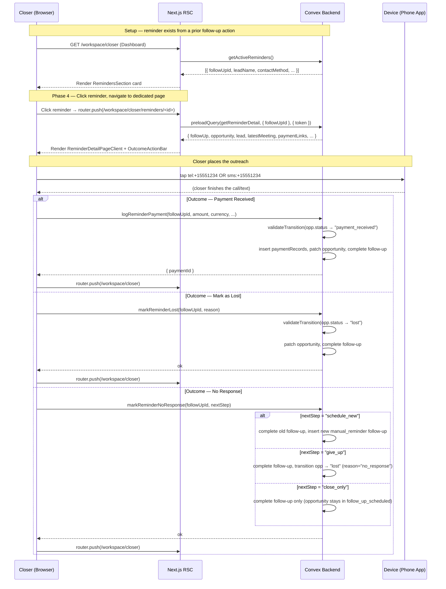
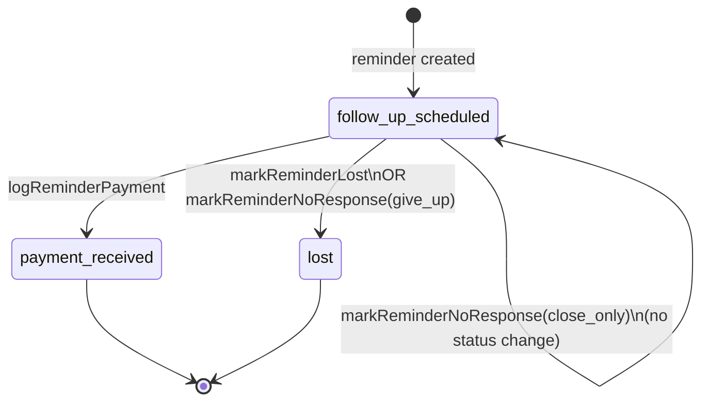
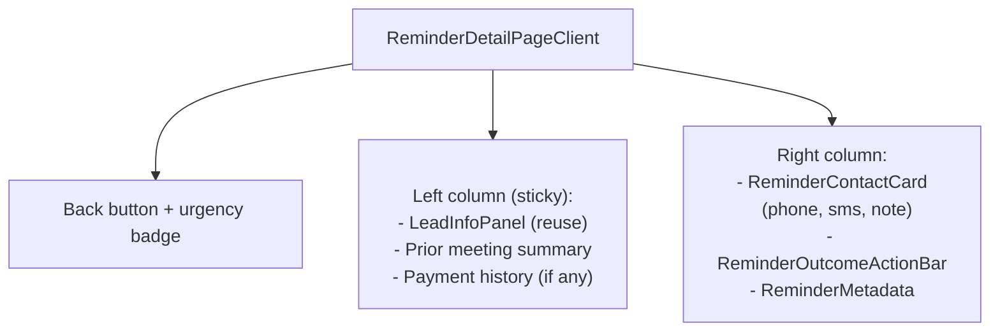
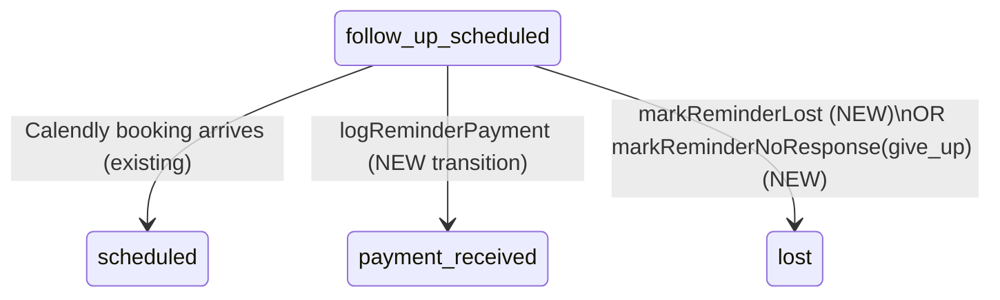

# Reminder Outcomes — Design Specification

**Version:** 0.1 (MVP)
**Status:** Draft
**Scope:** Today, clicking a reminder on the closer dashboard opens a shallow inline dialog whose only action is "Mark Complete" (free-text note). After this feature ships, clicking a reminder navigates the closer to a dedicated page at `/workspace/closer/reminders/[followUpId]` where they can place the call/send the text, record the real outcome — **Payment Received**, **Mark as Lost**, or **No Response** — and the CRM transitions the underlying opportunity and follow-up accordingly.
**Prerequisite:** Existing manual-reminder follow-up system (`followUps` table, `RemindersSection` dashboard card, `markReminderComplete` mutation) and the meeting detail outcome stack (`OutcomeActionBar`, `PaymentFormDialog`, `MarkLostDialog`) must be in place — they are the template we are extending.

---

## Table of Contents

1. [Goals & Non-Goals](#1-goals--non-goals)
2. [Actors & Roles](#2-actors--roles)
3. [End-to-End Flow Overview](#3-end-to-end-flow-overview)
4. [Phase 1: Schema & Status Transition Extensions](#4-phase-1-schema--status-transition-extensions)
5. [Phase 2: Reminder Detail Query](#5-phase-2-reminder-detail-query)
6. [Phase 3: Outcome Mutations](#6-phase-3-outcome-mutations)
7. [Phase 4: Reminder Detail Page (Route + RSC)](#7-phase-4-reminder-detail-page-route--rsc)
8. [Phase 5: Reminder Outcome Action Bar + Dialogs](#8-phase-5-reminder-outcome-action-bar--dialogs)
9. [Phase 6: Dashboard Integration & Cleanup](#9-phase-6-dashboard-integration--cleanup)
10. [Data Model](#10-data-model)
11. [Convex Function Architecture](#11-convex-function-architecture)
12. [Routing & Authorization](#12-routing--authorization)
13. [Security Considerations](#13-security-considerations)
14. [Error Handling & Edge Cases](#14-error-handling--edge-cases)
15. [Open Questions](#15-open-questions)
16. [Dependencies](#16-dependencies)
17. [Applicable Skills](#17-applicable-skills)

---

## 1. Goals & Non-Goals

### Goals

- A closer can click any manual reminder from the dashboard and land on a dedicated page focused entirely on that reminder.
- The reminder page shows the lead's contact information with a click-to-call / click-to-text affordance, the opportunity's history, any prior payment links, and the reminder's own metadata (scheduled time, note, urgency).
- From the reminder page, the closer can record the real outcome of the outreach and transition the underlying opportunity correctly:
    - **Payment Received** → new `paymentRecords` entry, opportunity transitions to `payment_received`, lead auto-converts to customer.
    - **Mark as Lost** → opportunity transitions to `lost` with a reason, follow-up marked complete.
    - **No Response** → follow-up marked complete with a structured "no_response" outcome. The closer chooses whether to schedule a new reminder, give up (opportunity → `lost`), or leave the opportunity in `follow_up_scheduled` for later action.
- Every outcome marks the current follow-up record `completed` with a structured `completionOutcome` tag so future reporting can distinguish "reminder led to a payment" from "reminder led nowhere."
- The existing dashboard inline dialog (`ReminderDetailDialog` inside `reminders-section.tsx`) is removed — the dashboard card now routes to the new page.
- The closer never loses context: phone number is a tappable `tel:` link, text is a tappable `sms:` link, copy buttons are one click, and the page title reflects the lead's name.

### Non-Goals (deferred)

- Admin / tenant_master access to reminders (the current `getActiveReminders` query is closer-only; admins will use the pipeline to drive corrective actions — Phase 2).
- Automatic call/SMS dialing through a telephony provider (Twilio/Aircall/etc.) — Phase 2. For MVP we rely on native device handoff via `tel:` and `sms:` URLs.
- "Attempt tracking" (e.g., "Rang 3 times, no answer") — we'd extend the follow-up with an attempts array. Deferred to Phase 2.
- Bulk reminder workflows (batch complete, bulk reschedule) — Phase 2.
- Notification/toast when a reminder becomes overdue beyond the dashboard urgency badge — Phase 2.
- Recording the outcome through anything other than an explicit button click (AI transcript classification, etc.) — out of scope indefinitely for this feature.

---

## 2. Actors & Roles

| Actor | Identity | Auth Method | Key Permissions |
|---|---|---|---|
| **Closer** | Individual contributor assigned to an opportunity | WorkOS AuthKit, member of tenant org, CRM role `closer` | Read their own active reminders, open reminder detail page for reminders they own, record payment / lost / no-response outcome, schedule a new reminder from the no-response flow |
| **Tenant Admin / Owner** | tenant_admin or tenant_master | WorkOS AuthKit, member of tenant org, CRM role `tenant_admin` or `tenant_master` | **No direct access to reminder detail page in MVP.** They interact with the affected opportunities via the existing pipeline detail view. |
| **System Admin** | System admin operator | WorkOS AuthKit, member of the system admin org | Not involved. |

### CRM Role ↔ WorkOS Role Mapping (unchanged, reference only)

| CRM `users.role` | WorkOS RBAC slug | Notes |
|---|---|---|
| `tenant_master` | `owner` | Owner, highest tenant privilege |
| `tenant_admin` | `tenant-admin` | Admin |
| `closer` | `closer` | Individual contributor; **only this role accesses the reminder detail page** |

---

## 3. End-to-End Flow Overview



---

## 4. Phase 1: Schema & Status Transition Extensions

### 4.1 What & Why

Two existing guardrails block us from recording outcomes directly against a reminder today:

1. `VALID_TRANSITIONS` in `convex/lib/statusTransitions.ts` only allows `follow_up_scheduled → scheduled`. There is no path from `follow_up_scheduled` to `payment_received` or `lost` — which is the exact transition that happens when a reminder-driven call closes a sale or kills the deal.
2. `followUps` has a free-text `completionNote` but no structured outcome — so reporting cannot differentiate "reminder completed because a deal closed" from "reminder completed because we gave up."

Phase 1 widens both, using the widen-migrate-narrow workflow required by the `convex-migration-helper` skill.

> **Runtime decision:** The transition widening is a pure `statusTransitions.ts` code change — no schema migration. The `followUps.completionOutcome` addition is an **optional** schema field (migration-safe by default per the guidelines in `convex/_generated/ai/guidelines.md`). No backfill is required because existing completed follow-ups legitimately have no structured outcome; new writes populate the field going forward.
>
> **Why not a new status?** "No response" is an *action result*, not an opportunity state. Introducing a new opportunity status would cascade into pipeline queries, stats, reporting aggregates, and RBAC matrices. Encoding the information on the follow-up record keeps blast radius tight.

### 4.2 Opportunity status transition changes

```typescript
// Path: convex/lib/statusTransitions.ts

export const VALID_TRANSITIONS: Record<
  OpportunityStatus,
  OpportunityStatus[]
> = {
  scheduled: ["in_progress", "meeting_overran", "canceled", "no_show"],
  in_progress: ["payment_received", "follow_up_scheduled", "no_show", "lost"],
  meeting_overran: [
    "payment_received",
    "follow_up_scheduled",
    "no_show",
    "lost",
  ],
  canceled: ["follow_up_scheduled", "scheduled"],
  no_show: ["follow_up_scheduled", "reschedule_link_sent", "scheduled"],
  // CHANGED: follow_up_scheduled can now terminate via payment_received or lost
  // (reminder-driven outcomes). Previously only allowed → "scheduled" (e.g., the
  // lead booked a new Calendly slot).
  follow_up_scheduled: [
    "scheduled",
    "payment_received", // NEW — reminder resulted in a sale
    "lost",             // NEW — reminder resulted in lead dropping off
  ],
  reschedule_link_sent: ["scheduled"],
  payment_received: [],
  lost: [],
};
```

### 4.3 `followUps.completionOutcome` field

```typescript
// Path: convex/schema.ts

followUps: defineTable({
  // ... existing fields ...
  completedAt: v.optional(v.number()),
  completionNote: v.optional(v.string()),

  // NEW: Structured outcome tag captured when a closer acts on a reminder
  // from the new reminder detail page. Legacy completed follow-ups do not
  // have this value — reporting treats absent as "legacy_unstructured".
  completionOutcome: v.optional(
    v.union(
      v.literal("payment_received"),
      v.literal("lost"),
      v.literal("no_response_rescheduled"),
      v.literal("no_response_given_up"),
      v.literal("no_response_close_only"),
    ),
  ),

  // ... existing fields ...
})
  // ... existing indexes ...
```

> **Runtime decision:** We keep `completionOutcome` optional for two reasons. First, the schema stays backwards-compatible with every historical follow-up row. Second, the old `markReminderComplete` mutation (still wired to the legacy dashboard dialog during Phase 6 transition) keeps working without edits. The new outcome mutations always set it.

### 4.4 Migration strategy

| Step | Action |
|---|---|
| 1 | Add `completionOutcome` as `v.optional(...)` in `schema.ts`. No backfill; legacy rows remain "unstructured". |
| 2 | Ship the updated `statusTransitions.ts` alongside the schema. Both are safe to deploy in the same revision because nothing writes the new transitions yet. |
| 3 | Deploy, verify `npx convex dev` accepts the schema, inspect that no existing writes fail validation. |
| 4 | Proceed to Phase 3 (mutations). |

> **Skill:** Use `convex-migration-helper` to verify no schema validator rejects existing documents. Given the field is optional, the widen-migrate-narrow workflow collapses to a single widen step.

---

## 5. Phase 2: Reminder Detail Query

### 5.1 What & Why

The reminder page needs a single RSC-preloadable query that returns everything needed to render the page in one round trip — lead info, opportunity context, the reminder record itself, the latest meeting (for payment linkage + history link), any prior payment attempts on this opportunity, and the configured payment links the tenant exposes.

This mirrors `api.closer.meetingDetail.getMeetingDetail` in shape and authorization.

> **Runtime decision:** A single query (not one-per-panel) keeps the RSC preload simple (`preloadQuery` returns one `Preloaded<...>`), reduces waterfall network requests on navigation, and matches the meeting detail pattern already used in the codebase.

### 5.2 `getReminderDetail` query

```typescript
// Path: convex/closer/reminderDetail.ts

import { v } from "convex/values";
import { query } from "../_generated/server";
import { requireTenantUser } from "../requireTenantUser";

export const getReminderDetail = query({
  args: { followUpId: v.id("followUps") },
  handler: async (ctx, { followUpId }) => {
    const { tenantId, userId } = await requireTenantUser(ctx, ["closer"]);

    const followUp = await ctx.db.get(followUpId);
    if (!followUp || followUp.tenantId !== tenantId) return null;
    if (followUp.closerId !== userId) return null;
    if (followUp.type !== "manual_reminder") return null;

    // Parallel lookups — every ID is already indexed.
    const [opportunity, lead] = await Promise.all([
      ctx.db.get(followUp.opportunityId),
      ctx.db.get(followUp.leadId),
    ]);
    if (!opportunity || opportunity.tenantId !== tenantId) return null;
    if (!lead || lead.tenantId !== tenantId) return null;

    // Latest meeting from the denormalized ref on opportunities.
    const latestMeeting = opportunity.latestMeetingId
      ? await ctx.db.get(opportunity.latestMeetingId)
      : null;

    // Prior recorded payments on this opportunity (most recent first).
    const payments = await ctx.db
      .query("paymentRecords")
      .withIndex("by_opportunityId", (q) =>
        q.eq("opportunityId", opportunity._id),
      )
      .order("desc")
      .take(10);

    // Tenant-configured payment links (reused from meeting detail).
    const paymentLinks = await ctx.db
      .query("paymentLinks")
      .withIndex("by_tenantId", (q) => q.eq("tenantId", tenantId))
      .take(20);

    console.log("[Closer:Reminder] getReminderDetail", {
      followUpId,
      opportunityStatus: opportunity.status,
      hasLatestMeeting: Boolean(latestMeeting),
      paymentCount: payments.length,
    });

    return {
      followUp,
      opportunity,
      lead,
      latestMeeting,
      payments,
      paymentLinks,
    };
  },
});
```

### 5.3 Return shape

| Field | Type | Notes |
|---|---|---|
| `followUp` | `Doc<"followUps">` | Full reminder record |
| `opportunity` | `Doc<"opportunities">` | Parent opportunity (status drives action bar) |
| `lead` | `Doc<"leads">` | Includes `phone`, `email`, `fullName`, `socialHandles` |
| `latestMeeting` | `Doc<"meetings"> \| null` | Source of `meetingId` for payment linkage |
| `payments` | `Doc<"paymentRecords">[]` | Shown as "Payment history" if non-empty |
| `paymentLinks` | `Doc<"paymentLinks">[]` | Reused panel from meeting view |

### 5.4 Returns `null` when

- Reminder not found
- Reminder belongs to a different tenant
- Reminder belongs to a different closer
- Reminder is not a `manual_reminder` (scheduling_link follow-ups do not get this page)

The RSC page treats `null` as "not found" and renders the existing `Empty` state component.

---

## 6. Phase 3: Outcome Mutations

### 6.1 What & Why

Three new Convex mutations, one per outcome. Each one:

1. Loads the follow-up, opportunity, and (if needed) the latest meeting.
2. Runs the ownership/tenant checks.
3. Validates the opportunity status transition.
4. Performs the state change atomically (same mutation, no scheduled actions needed — these are all small writes).
5. Marks the follow-up `completed` with a structured `completionOutcome`.
6. Emits domain events for the outcome.

They intentionally do **not** reuse `logPayment` / `markAsLost` directly because:

- `logPayment` requires a `meetingId` in its args. Reminder outcomes resolve the meeting from `opportunity.latestMeetingId` server-side (or omit when absent, which `paymentRecords.meetingId: v.optional(...)` already permits).
- `markAsLost` does not complete the follow-up; we need to do both in one transaction.
- Reusing would force the existing mutations to grow conditional argument handling, which violates the "Admin mutations strategy" precedent from `plans/admin-meeting-management/design.md` §AD-5.

The mutations **share helpers** extracted into `convex/closer/reminderOutcomes.ts` so the business rules (aggregate updates, tenant stats, event emission) do not fork.

> **Runtime decision:** Pure Convex `mutation` functions — no `"use node"`, no actions. All work is database writes + aggregate updates that already run inside the Convex V8 runtime (see existing `payments.ts`, `meetingActions.ts`).

### 6.2 `logReminderPayment`

```typescript
// Path: convex/closer/reminderOutcomes.ts

import { v } from "convex/values";
import { mutation } from "../_generated/server";
import { requireTenantUser } from "../requireTenantUser";
import { validateTransition } from "../lib/statusTransitions";
import { executeConversion } from "../customers/conversion";
import { emitDomainEvent } from "../lib/domainEvents";
import { toAmountMinor, validateCurrency } from "../lib/formatMoney";
import { syncCustomerPaymentSummary } from "../lib/paymentHelpers";
import {
  insertPaymentAggregate,
  replaceOpportunityAggregate,
} from "../reporting/writeHooks";
import {
  isActiveOpportunityStatus,
  updateTenantStats,
} from "../lib/tenantStatsHelper";

export const logReminderPayment = mutation({
  args: {
    followUpId: v.id("followUps"),
    amount: v.number(),
    currency: v.string(),
    provider: v.string(),
    referenceCode: v.optional(v.string()),
    proofFileId: v.optional(v.id("_storage")),
  },
  handler: async (ctx, args) => {
    const { userId, tenantId } = await requireTenantUser(ctx, ["closer"]);

    const followUp = await ctx.db.get(args.followUpId);
    if (!followUp) throw new Error("Reminder not found");
    if (followUp.tenantId !== tenantId) throw new Error("Access denied");
    if (followUp.closerId !== userId) throw new Error("Not your reminder");
    if (followUp.type !== "manual_reminder") {
      throw new Error("Only manual reminders can be resolved on this page");
    }
    if (followUp.status !== "pending") {
      throw new Error("Reminder is not pending");
    }

    const opportunity = await ctx.db.get(followUp.opportunityId);
    if (!opportunity || opportunity.tenantId !== tenantId) {
      throw new Error("Opportunity not found");
    }
    if (!validateTransition(opportunity.status, "payment_received")) {
      throw new Error(
        `Cannot log payment from status "${opportunity.status}"`,
      );
    }
    if (args.amount <= 0) throw new Error("Payment amount must be positive");

    const currency = validateCurrency(args.currency);
    const provider = args.provider.trim();
    if (!provider) throw new Error("Provider is required");

    const now = Date.now();
    const amountMinor = toAmountMinor(args.amount);

    // Use the opportunity's most recent meeting as the payment anchor when available.
    // paymentRecords.meetingId is optional — reminder payments can exist
    // without one if the opportunity never had a meeting created (unusual
    // but schema-legal).
    const meetingId = opportunity.latestMeetingId ?? undefined;

    const paymentId = await ctx.db.insert("paymentRecords", {
      tenantId,
      opportunityId: opportunity._id,
      meetingId,
      closerId: userId,
      amountMinor,
      currency,
      provider,
      referenceCode: args.referenceCode?.trim() || undefined,
      proofFileId: args.proofFileId,
      status: "recorded",
      statusChangedAt: now,
      recordedAt: now,
      contextType: "opportunity",
    });
    await insertPaymentAggregate(ctx, paymentId);

    await ctx.db.patch(opportunity._id, {
      status: "payment_received",
      paymentReceivedAt: now,
      updatedAt: now,
    });
    await replaceOpportunityAggregate(ctx, opportunity, opportunity._id);
    await updateTenantStats(ctx, tenantId, {
      activeOpportunities: isActiveOpportunityStatus(opportunity.status) ? -1 : 0,
      wonDeals: 1,
      totalPaymentRecords: 1,
      totalRevenueMinor: amountMinor,
    });

    await ctx.db.patch(args.followUpId, {
      status: "completed",
      completedAt: now,
      completionOutcome: "payment_received",
    });

    await emitDomainEvent(ctx, {
      tenantId,
      entityType: "payment",
      entityId: paymentId,
      eventType: "payment.recorded",
      source: "closer",
      actorUserId: userId,
      toStatus: "recorded",
      metadata: {
        opportunityId: opportunity._id,
        meetingId,
        followUpId: args.followUpId,
        amountMinor,
        currency,
        origin: "reminder",
      },
      occurredAt: now,
    });
    await emitDomainEvent(ctx, {
      tenantId,
      entityType: "opportunity",
      entityId: opportunity._id,
      eventType: "opportunity.status_changed",
      source: "closer",
      actorUserId: userId,
      fromStatus: opportunity.status,
      toStatus: "payment_received",
      occurredAt: now,
    });
    await emitDomainEvent(ctx, {
      tenantId,
      entityType: "followUp",
      entityId: args.followUpId,
      eventType: "followUp.completed",
      source: "closer",
      actorUserId: userId,
      fromStatus: "pending",
      toStatus: "completed",
      metadata: { outcome: "payment_received" },
      occurredAt: now,
    });

    // Feature D auto-conversion — same as logPayment.
    const customerId = await executeConversion(ctx, {
      tenantId,
      leadId: opportunity.leadId,
      convertedByUserId: userId,
      winningOpportunityId: opportunity._id,
      winningMeetingId: meetingId,
    });
    if (customerId) {
      await ctx.db.patch(paymentId, { customerId });
      await syncCustomerPaymentSummary(ctx, customerId);
    }

    console.log("[Closer:Reminder] logReminderPayment done", {
      followUpId: args.followUpId,
      paymentId,
      opportunityId: opportunity._id,
    });

    return paymentId;
  },
});
```

### 6.3 `markReminderLost`

```typescript
// Path: convex/closer/reminderOutcomes.ts

export const markReminderLost = mutation({
  args: {
    followUpId: v.id("followUps"),
    reason: v.optional(v.string()),
  },
  handler: async (ctx, { followUpId, reason }) => {
    const { userId, tenantId } = await requireTenantUser(ctx, ["closer"]);

    const followUp = await ctx.db.get(followUpId);
    if (!followUp) throw new Error("Reminder not found");
    if (followUp.tenantId !== tenantId) throw new Error("Access denied");
    if (followUp.closerId !== userId) throw new Error("Not your reminder");
    if (followUp.type !== "manual_reminder") {
      throw new Error("Only manual reminders can be resolved on this page");
    }
    if (followUp.status !== "pending") {
      throw new Error("Reminder is not pending");
    }

    const opportunity = await ctx.db.get(followUp.opportunityId);
    if (!opportunity || opportunity.tenantId !== tenantId) {
      throw new Error("Opportunity not found");
    }
    if (!validateTransition(opportunity.status, "lost")) {
      throw new Error(`Cannot mark lost from "${opportunity.status}"`);
    }

    const now = Date.now();
    const trimmedReason = reason?.trim();

    await ctx.db.patch(opportunity._id, {
      status: "lost",
      lostAt: now,
      lostByUserId: userId,
      ...(trimmedReason ? { lostReason: trimmedReason } : {}),
      updatedAt: now,
    });
    await replaceOpportunityAggregate(ctx, opportunity, opportunity._id);
    await updateTenantStats(ctx, tenantId, {
      activeOpportunities: isActiveOpportunityStatus(opportunity.status) ? -1 : 0,
      lostDeals: 1,
    });

    await ctx.db.patch(followUpId, {
      status: "completed",
      completedAt: now,
      completionOutcome: "lost",
      ...(trimmedReason ? { completionNote: trimmedReason } : {}),
    });

    await emitDomainEvent(ctx, {
      tenantId,
      entityType: "opportunity",
      entityId: opportunity._id,
      eventType: "opportunity.marked_lost",
      source: "closer",
      actorUserId: userId,
      fromStatus: opportunity.status,
      toStatus: "lost",
      reason: trimmedReason,
      metadata: { origin: "reminder", followUpId },
      occurredAt: now,
    });
    await emitDomainEvent(ctx, {
      tenantId,
      entityType: "followUp",
      entityId: followUpId,
      eventType: "followUp.completed",
      source: "closer",
      actorUserId: userId,
      fromStatus: "pending",
      toStatus: "completed",
      metadata: { outcome: "lost" },
      occurredAt: now,
    });

    console.log("[Closer:Reminder] markReminderLost done", {
      followUpId,
      opportunityId: opportunity._id,
    });
  },
});
```

### 6.4 `markReminderNoResponse`

```typescript
// Path: convex/closer/reminderOutcomes.ts

export const markReminderNoResponse = mutation({
  args: {
    followUpId: v.id("followUps"),
    nextStep: v.union(
      v.literal("schedule_new"),   // Close this reminder, start a new one
      v.literal("give_up"),        // Close this reminder + mark opportunity lost
      v.literal("close_only"),     // Close this reminder only, leave opp as-is
    ),
    note: v.optional(v.string()),

    // Only used when nextStep === "schedule_new"
    newReminder: v.optional(
      v.object({
        contactMethod: v.union(v.literal("call"), v.literal("text")),
        reminderScheduledAt: v.number(),
        reminderNote: v.optional(v.string()),
      }),
    ),
  },
  handler: async (ctx, { followUpId, nextStep, note, newReminder }) => {
    const { userId, tenantId } = await requireTenantUser(ctx, ["closer"]);

    const followUp = await ctx.db.get(followUpId);
    if (!followUp) throw new Error("Reminder not found");
    if (followUp.tenantId !== tenantId) throw new Error("Access denied");
    if (followUp.closerId !== userId) throw new Error("Not your reminder");
    if (followUp.type !== "manual_reminder") {
      throw new Error("Only manual reminders can be resolved on this page");
    }
    if (followUp.status !== "pending") {
      throw new Error("Reminder is not pending");
    }

    const opportunity = await ctx.db.get(followUp.opportunityId);
    if (!opportunity || opportunity.tenantId !== tenantId) {
      throw new Error("Opportunity not found");
    }

    const now = Date.now();
    const trimmedNote = note?.trim();

    // Branch: give_up — validate transition and mutate opportunity.
    if (nextStep === "give_up") {
      if (!validateTransition(opportunity.status, "lost")) {
        throw new Error(`Cannot mark lost from "${opportunity.status}"`);
      }
      await ctx.db.patch(opportunity._id, {
        status: "lost",
        lostAt: now,
        lostByUserId: userId,
        lostReason: trimmedNote ?? "No response to outreach",
        updatedAt: now,
      });
      await replaceOpportunityAggregate(ctx, opportunity, opportunity._id);
      await updateTenantStats(ctx, tenantId, {
        activeOpportunities: isActiveOpportunityStatus(opportunity.status) ? -1 : 0,
        lostDeals: 1,
      });
      await emitDomainEvent(ctx, {
        tenantId,
        entityType: "opportunity",
        entityId: opportunity._id,
        eventType: "opportunity.marked_lost",
        source: "closer",
        actorUserId: userId,
        fromStatus: opportunity.status,
        toStatus: "lost",
        reason: trimmedNote ?? "No response to outreach",
        metadata: { origin: "reminder", followUpId, trigger: "no_response_given_up" },
        occurredAt: now,
      });
    }

    // Complete the current follow-up.
    const outcomeTag =
      nextStep === "schedule_new"
        ? "no_response_rescheduled"
        : nextStep === "give_up"
          ? "no_response_given_up"
          : "no_response_close_only";

    await ctx.db.patch(followUpId, {
      status: "completed",
      completedAt: now,
      completionOutcome: outcomeTag,
      ...(trimmedNote ? { completionNote: trimmedNote } : {}),
    });
    await emitDomainEvent(ctx, {
      tenantId,
      entityType: "followUp",
      entityId: followUpId,
      eventType: "followUp.completed",
      source: "closer",
      actorUserId: userId,
      fromStatus: "pending",
      toStatus: "completed",
      metadata: { outcome: outcomeTag },
      occurredAt: now,
    });

    // Branch: schedule_new — insert a new manual_reminder follow-up.
    let newFollowUpId: string | null = null;
    if (nextStep === "schedule_new") {
      if (!newReminder) {
        throw new Error("newReminder required when nextStep = schedule_new");
      }
      if (newReminder.reminderScheduledAt <= now) {
        throw new Error("Reminder time must be in the future");
      }
      // Opportunity stays in follow_up_scheduled — no transition.
      const id = await ctx.db.insert("followUps", {
        tenantId,
        opportunityId: opportunity._id,
        leadId: opportunity.leadId,
        closerId: userId,
        type: "manual_reminder",
        contactMethod: newReminder.contactMethod,
        reminderScheduledAt: newReminder.reminderScheduledAt,
        reminderNote: newReminder.reminderNote,
        reason: "closer_initiated",
        status: "pending",
        createdAt: now,
      });
      newFollowUpId = id;
      await emitDomainEvent(ctx, {
        tenantId,
        entityType: "followUp",
        entityId: id,
        eventType: "followUp.created",
        source: "closer",
        actorUserId: userId,
        toStatus: "pending",
        metadata: {
          type: "manual_reminder",
          opportunityId: opportunity._id,
          origin: "reminder_chain",
          previousFollowUpId: followUpId,
        },
        occurredAt: now,
      });
    }

    console.log("[Closer:Reminder] markReminderNoResponse done", {
      followUpId,
      nextStep,
      newFollowUpId,
    });

    return { newFollowUpId };
  },
});
```

### 6.5 Payment proof upload URL

We reuse `api.closer.payments.generateUploadUrl` as-is — it already accepts all three tenant roles and returns a short-lived storage URL. The reminder payment dialog calls it in a `useEffect` the same way the meeting payment dialog does today.

### 6.6 Status transitions summary



---

## 7. Phase 4: Reminder Detail Page (Route + RSC)

### 7.1 What & Why

A dedicated page gives the closer a focused workspace for the outreach — the same pattern used for the meeting detail page at `/workspace/closer/meetings/[meetingId]`. Going full-page (rather than keeping the inline dialog) means:

- Large, tappable phone / text affordances on mobile.
- Room for lead history + opportunity context that does not fit in a dialog.
- A stable URL the closer can keep open while dialing.
- Support for future additions (attempt tracking, call notes) without dialog cramming.

### 7.2 Route

```
app/workspace/closer/reminders/[followUpId]/
├── page.tsx                 # Server component — preloads data via preloadQuery
├── loading.tsx              # Skeleton while auth + data resolve
├── error.tsx                # Route-level error boundary
└── _components/
    └── reminder-detail-page-client.tsx
```

### 7.3 `page.tsx`

```tsx
// Path: app/workspace/closer/reminders/[followUpId]/page.tsx

import { preloadQuery } from "convex/nextjs";
import { api } from "@/convex/_generated/api";
import { requireRole } from "@/lib/auth";
import type { Id } from "@/convex/_generated/dataModel";
import { ReminderDetailPageClient } from "./_components/reminder-detail-page-client";

export const unstable_instant = false;

export default async function ReminderDetailPage({
  params,
}: {
  params: Promise<{ followUpId: string }>;
}) {
  const { session } = await requireRole(["closer"]);
  const { followUpId } = await params;

  const typedFollowUpId = followUpId as Id<"followUps">;
  const preloadedDetail = await preloadQuery(
    api.closer.reminderDetail.getReminderDetail,
    { followUpId: typedFollowUpId },
    { token: session.accessToken },
  );

  return <ReminderDetailPageClient preloadedDetail={preloadedDetail} />;
}
```

### 7.4 Client shell layout



### 7.5 `reminder-detail-page-client.tsx` outline

```tsx
// Path: app/workspace/closer/reminders/[followUpId]/_components/reminder-detail-page-client.tsx
"use client";

import { useRouter } from "next/navigation";
import { usePreloadedQuery, type Preloaded } from "convex/react";
import type { api } from "@/convex/_generated/api";
import { usePageTitle } from "@/hooks/use-page-title";
import { ArrowLeftIcon, AlertCircleIcon } from "lucide-react";
import { Button } from "@/components/ui/button";
import {
  Empty,
  EmptyHeader,
  EmptyMedia,
  EmptyTitle,
  EmptyDescription,
} from "@/components/ui/empty";
import { LeadInfoPanel } from "@/app/workspace/closer/meetings/_components/lead-info-panel";
import { ReminderContactCard } from "./reminder-contact-card";
import { ReminderMetadataCard } from "./reminder-metadata-card";
import { ReminderOutcomeActionBar } from "./reminder-outcome-action-bar";
import { ReminderHistoryPanel } from "./reminder-history-panel";

export function ReminderDetailPageClient({
  preloadedDetail,
}: {
  preloadedDetail: Preloaded<typeof api.closer.reminderDetail.getReminderDetail>;
}) {
  const router = useRouter();
  const detail = usePreloadedQuery(preloadedDetail);
  usePageTitle(detail?.lead.fullName ?? "Reminder");

  if (detail === null) {
    return (
      <div className="flex h-full items-center justify-center">
        <Empty>
          <EmptyHeader>
            <EmptyMedia variant="icon"><AlertCircleIcon /></EmptyMedia>
            <EmptyTitle>Reminder Not Found</EmptyTitle>
            <EmptyDescription>
              This reminder may have been completed already or doesn&apos;t
              belong to you.
            </EmptyDescription>
            <Button
              variant="outline"
              className="mt-4"
              onClick={() => router.push("/workspace/closer")}
            >
              <ArrowLeftIcon data-icon="inline-start" />
              Back to Dashboard
            </Button>
          </EmptyHeader>
        </Empty>
      </div>
    );
  }

  const { followUp, opportunity, lead, latestMeeting, payments } = detail;
  const isAlreadyCompleted = followUp.status !== "pending";

  return (
    <div className="flex flex-col gap-6">
      <div className="flex items-center justify-between">
        <Button variant="ghost" size="sm" onClick={() => router.back()}>
          <ArrowLeftIcon data-icon="inline-start" />
          Back
        </Button>
        {/* Urgency badge computed from reminderScheduledAt — same logic as dashboard */}
      </div>

      <div className="grid grid-cols-1 gap-6 md:grid-cols-3 lg:grid-cols-4">
        <div className="md:col-span-1">
          <LeadInfoPanel lead={lead} meetingHistory={[]} />
          <ReminderHistoryPanel
            opportunity={opportunity}
            latestMeeting={latestMeeting}
            payments={payments}
          />
        </div>

        <div className="flex flex-col gap-6 md:col-span-2 lg:col-span-3">
          <ReminderContactCard followUp={followUp} lead={lead} />
          <ReminderMetadataCard followUp={followUp} opportunity={opportunity} />
          <ReminderOutcomeActionBar
            followUp={followUp}
            opportunity={opportunity}
            disabled={isAlreadyCompleted}
            onCompleted={() => router.push("/workspace/closer")}
          />
        </div>
      </div>
    </div>
  );
}
```

### 7.6 Panels

| Component | Responsibility |
|---|---|
| `LeadInfoPanel` | **Reused as-is** from meeting detail — lead name, phones, socials, identity links. Pass `meetingHistory={[]}` since this page is reminder-centric, not meeting-centric. |
| `ReminderContactCard` (NEW) | Prominent `tel:` button, `sms:` button, copy-phone button, reminder note. Full-width on mobile, ~2/3 width on desktop. |
| `ReminderMetadataCard` (NEW) | Scheduled time, urgency badge, reason code (e.g., "closer_initiated"), opportunity ID → "View Meeting" link to `/workspace/closer/meetings/<latestMeetingId>`. |
| `ReminderHistoryPanel` (NEW) | Latest meeting info (status, scheduled time, link to detail), prior payment summary if any. Mini-version of `MeetingInfoPanel`. |
| `ReminderOutcomeActionBar` (NEW) | The three outcome buttons. See §8. |

---

## 8. Phase 5: Reminder Outcome Action Bar + Dialogs

### 8.1 What & Why

The action bar is the center of gravity on this page — it is what the closer clicks after the call/text. Modeled on `OutcomeActionBar` from the meeting detail page (`app/workspace/closer/meetings/_components/outcome-action-bar.tsx`), but with reminder-specific mutation targets and a new "No Response" flow.

### 8.2 `reminder-outcome-action-bar.tsx`

```tsx
// Path: app/workspace/closer/reminders/[followUpId]/_components/reminder-outcome-action-bar.tsx
"use client";

import { useState } from "react";
import dynamic from "next/dynamic";
import {
  Card,
  CardContent,
  CardHeader,
  CardTitle,
} from "@/components/ui/card";
import { Alert, AlertDescription } from "@/components/ui/alert";
import { InfoIcon } from "lucide-react";
import type { Doc } from "@/convex/_generated/dataModel";

const ReminderPaymentDialog = dynamic(() =>
  import("./reminder-payment-dialog").then((m) => ({
    default: m.ReminderPaymentDialog,
  })),
);
const ReminderMarkLostDialog = dynamic(() =>
  import("./reminder-mark-lost-dialog").then((m) => ({
    default: m.ReminderMarkLostDialog,
  })),
);
const ReminderNoResponseDialog = dynamic(() =>
  import("./reminder-no-response-dialog").then((m) => ({
    default: m.ReminderNoResponseDialog,
  })),
);

type Props = {
  followUp: Doc<"followUps">;
  opportunity: Doc<"opportunities">;
  disabled: boolean;
  onCompleted: () => void;
};

export function ReminderOutcomeActionBar({
  followUp,
  opportunity,
  disabled,
  onCompleted,
}: Props) {
  if (disabled) {
    return (
      <Card>
        <CardHeader>
          <CardTitle>Actions</CardTitle>
        </CardHeader>
        <CardContent>
          <Alert>
            <InfoIcon />
            <AlertDescription>
              This reminder has already been completed.
            </AlertDescription>
          </Alert>
        </CardContent>
      </Card>
    );
  }

  // Opportunity-level guardrail: if the parent opportunity is already in a
  // terminal state (e.g., admin marked it lost elsewhere), prevent outcome
  // changes. Backend also enforces via validateTransition.
  const isOppTerminal =
    opportunity.status === "payment_received" ||
    opportunity.status === "lost" ||
    opportunity.status === "no_show";

  if (isOppTerminal) {
    return (
      <Card>
        <CardHeader>
          <CardTitle>Actions</CardTitle>
        </CardHeader>
        <CardContent>
          <Alert>
            <InfoIcon />
            <AlertDescription>
              The underlying opportunity is already <b>{opportunity.status}</b>.
              Close this reminder from the previous page.
            </AlertDescription>
          </Alert>
        </CardContent>
      </Card>
    );
  }

  return (
    <Card>
      <CardHeader>
        <CardTitle>Outcome</CardTitle>
      </CardHeader>
      <CardContent className="flex flex-col gap-2 [&_button]:w-full">
        <ReminderPaymentDialog
          followUpId={followUp._id}
          onSuccess={onCompleted}
        />
        <ReminderMarkLostDialog
          followUpId={followUp._id}
          onSuccess={onCompleted}
        />
        <ReminderNoResponseDialog
          followUpId={followUp._id}
          leadId={followUp.leadId}
          onSuccess={onCompleted}
        />
      </CardContent>
    </Card>
  );
}
```

### 8.3 Outcome dialogs

| Dialog | Source pattern | Calls mutation | Form schema highlights |
|---|---|---|---|
| `ReminderPaymentDialog` | Mirrors `PaymentFormDialog` — same `amount`, `currency`, `provider`, `referenceCode`, `proofFile` fields; drops `meetingId` arg because it is resolved server-side. Reuses the exact Zod schema and file upload flow. | `api.closer.reminderOutcomes.logReminderPayment` | `amount > 0`, `currency` enum, `provider` non-empty, `proofFile` optional (image/PDF, ≤10MB) |
| `ReminderMarkLostDialog` | Mirrors `MarkLostDialog` — AlertDialog with a 500-char optional reason. | `api.closer.reminderOutcomes.markReminderLost` | `reason` optional string max 500 chars |
| `ReminderNoResponseDialog` | **NEW pattern** — radio group choosing next step, conditional fields for each branch. | `api.closer.reminderOutcomes.markReminderNoResponse` | See §8.4 below |

> **Rationale for separate dialog files (rather than reusing):** Each outcome dialog binds to a distinct mutation and a slightly different prop signature (`followUpId` vs `opportunityId`). Passing a discriminator prop to the shared dialogs would leak reminder-awareness into the meeting-detail code path. Two thin copies stay simpler; shared Zod schemas can be lifted to `lib/schemas/` in a future refactor if needed.

### 8.4 `ReminderNoResponseDialog` — No-response flow

The closer dialed/texted and got nothing back. We need to give them three choices without forcing a status commitment.

```tsx
// Path: app/workspace/closer/reminders/[followUpId]/_components/reminder-no-response-dialog.tsx
"use client";

import { useState, useMemo } from "react";
import { useMutation } from "convex/react";
import { useForm } from "react-hook-form";
import { standardSchemaResolver } from "@hookform/resolvers/standard-schema";
import { z } from "zod";
import { api } from "@/convex/_generated/api";
import type { Id } from "@/convex/_generated/dataModel";
import {
  Dialog, DialogContent, DialogHeader, DialogTitle, DialogFooter,
} from "@/components/ui/dialog";
import {
  Form, FormField, FormItem, FormLabel, FormControl, FormMessage,
} from "@/components/ui/form";
import { RadioGroup, RadioGroupItem } from "@/components/ui/radio-group";
import { Button } from "@/components/ui/button";
import { Textarea } from "@/components/ui/textarea";
import { Input } from "@/components/ui/input";
import { PhoneOffIcon } from "lucide-react";
import { toast } from "sonner";

const nextStepLiteral = z.enum(["schedule_new", "give_up", "close_only"]);

const noResponseSchema = z
  .object({
    nextStep: nextStepLiteral,
    note: z.string().max(500).optional(),
    newReminderAt: z.string().optional(),
    newContactMethod: z.enum(["call", "text"]).optional(),
    newReminderNote: z.string().max(500).optional(),
  })
  .superRefine((vals, ctx) => {
    if (vals.nextStep === "schedule_new") {
      if (!vals.newReminderAt) {
        ctx.addIssue({
          code: "custom",
          path: ["newReminderAt"],
          message: "Pick a new reminder time",
        });
      } else if (new Date(vals.newReminderAt).getTime() <= Date.now()) {
        ctx.addIssue({
          code: "custom",
          path: ["newReminderAt"],
          message: "Time must be in the future",
        });
      }
      if (!vals.newContactMethod) {
        ctx.addIssue({
          code: "custom",
          path: ["newContactMethod"],
          message: "Pick call or text",
        });
      }
    }
  });

type Values = z.infer<typeof noResponseSchema>;

export function ReminderNoResponseDialog({
  followUpId,
  onSuccess,
}: {
  followUpId: Id<"followUps">;
  leadId: Id<"leads">;
  onSuccess: () => void;
}) {
  const [open, setOpen] = useState(false);
  const [submitting, setSubmitting] = useState(false);
  const markNoResponse = useMutation(
    api.closer.reminderOutcomes.markReminderNoResponse,
  );

  const form = useForm({
    resolver: standardSchemaResolver(noResponseSchema),
    defaultValues: {
      nextStep: "schedule_new",
      note: "",
      newContactMethod: "call",
    } satisfies Partial<Values>,
  });
  const step = form.watch("nextStep");

  const onSubmit = async (vals: Values) => {
    setSubmitting(true);
    try {
      await markNoResponse({
        followUpId,
        nextStep: vals.nextStep,
        note: vals.note?.trim() || undefined,
        newReminder:
          vals.nextStep === "schedule_new"
            ? {
                contactMethod: vals.newContactMethod!,
                reminderScheduledAt: new Date(vals.newReminderAt!).getTime(),
                reminderNote: vals.newReminderNote?.trim() || undefined,
              }
            : undefined,
      });
      toast.success(
        vals.nextStep === "schedule_new"
          ? "New reminder scheduled"
          : vals.nextStep === "give_up"
            ? "Opportunity marked lost"
            : "Reminder closed",
      );
      setOpen(false);
      onSuccess();
    } catch (err) {
      toast.error(err instanceof Error ? err.message : "Failed to save");
    } finally {
      setSubmitting(false);
    }
  };

  return (
    <>
      <Button variant="outline" onClick={() => setOpen(true)}>
        <PhoneOffIcon data-icon="inline-start" />
        No Response
      </Button>

      <Dialog open={open} onOpenChange={(v) => !submitting && setOpen(v)}>
        <DialogContent className="sm:max-w-lg">
          <DialogHeader>
            <DialogTitle>No response — what next?</DialogTitle>
          </DialogHeader>
          <Form {...form}>
            <form
              onSubmit={form.handleSubmit(onSubmit)}
              className="flex flex-col gap-4"
            >
              <FormField
                control={form.control}
                name="nextStep"
                render={({ field }) => (
                  <FormItem>
                    <FormLabel>Choose a next step</FormLabel>
                    <FormControl>
                      <RadioGroup
                        value={field.value}
                        onValueChange={field.onChange}
                        className="flex flex-col gap-2"
                      >
                        <RadioGroupItem value="schedule_new">
                          Try again — schedule a new reminder
                        </RadioGroupItem>
                        <RadioGroupItem value="give_up">
                          Give up — mark the opportunity as lost
                        </RadioGroupItem>
                        <RadioGroupItem value="close_only">
                          Close this reminder only (decide later)
                        </RadioGroupItem>
                      </RadioGroup>
                    </FormControl>
                    <FormMessage />
                  </FormItem>
                )}
              />

              {step === "schedule_new" && (
                <>
                  <FormField
                    control={form.control}
                    name="newContactMethod"
                    render={({ field }) => (
                      <FormItem>
                        <FormLabel>How?</FormLabel>
                        {/* Call vs Text radio */}
                        <FormMessage />
                      </FormItem>
                    )}
                  />
                  <FormField
                    control={form.control}
                    name="newReminderAt"
                    render={({ field }) => (
                      <FormItem>
                        <FormLabel>New reminder time</FormLabel>
                        <FormControl>
                          <Input type="datetime-local" {...field} />
                        </FormControl>
                        <FormMessage />
                      </FormItem>
                    )}
                  />
                  <FormField
                    control={form.control}
                    name="newReminderNote"
                    render={({ field }) => (
                      <FormItem>
                        <FormLabel>Note for next time (optional)</FormLabel>
                        <FormControl><Textarea rows={3} {...field} /></FormControl>
                        <FormMessage />
                      </FormItem>
                    )}
                  />
                </>
              )}

              <FormField
                control={form.control}
                name="note"
                render={({ field }) => (
                  <FormItem>
                    <FormLabel>
                      {step === "give_up" ? "Reason (optional)" : "Note (optional)"}
                    </FormLabel>
                    <FormControl><Textarea rows={3} {...field} /></FormControl>
                    <FormMessage />
                  </FormItem>
                )}
              />

              <DialogFooter>
                <Button
                  type="button"
                  variant="ghost"
                  disabled={submitting}
                  onClick={() => setOpen(false)}
                >
                  Cancel
                </Button>
                <Button type="submit" disabled={submitting}>
                  {submitting ? "Saving…" : "Save"}
                </Button>
              </DialogFooter>
            </form>
          </Form>
        </DialogContent>
      </Dialog>
    </>
  );
}
```

> **Runtime decision:** One dialog with three radios (not three separate dialogs) keeps the UX aligned with the closer's mental model: "I didn't reach them — now I pick what's next." Separate dialogs force extra clicks and lose context. Cross-field validation via `superRefine` targets errors to the correct field per the form pattern in `AGENTS.md`.

### 8.5 Dialog component files

```
app/workspace/closer/reminders/[followUpId]/_components/
├── reminder-detail-page-client.tsx
├── reminder-contact-card.tsx
├── reminder-metadata-card.tsx
├── reminder-history-panel.tsx
├── reminder-outcome-action-bar.tsx
├── reminder-payment-dialog.tsx
├── reminder-mark-lost-dialog.tsx
└── reminder-no-response-dialog.tsx
```

---

## 9. Phase 6: Dashboard Integration & Cleanup

### 9.1 What & Why

Today `RemindersSection` (`app/workspace/closer/_components/reminders-section.tsx`) owns both the list and the inline completion dialog. After this feature ships, the card becomes a pure navigator.

### 9.2 Dashboard card change

```tsx
// Path: app/workspace/closer/_components/reminders-section.tsx
// BEFORE — opens inline dialog
<ReminderListItem
  reminder={reminder}
  urgency={urgency}
  onClick={() => setSelectedReminder(reminder)}
/>

// AFTER — navigates to the new page
<ReminderListItem
  reminder={reminder}
  urgency={urgency}
  onClick={() =>
    router.push(`/workspace/closer/reminders/${reminder._id}`)
  }
/>
```

### 9.3 Removed / retained code

| Item | Action | Rationale |
|---|---|---|
| `ReminderDetailDialog` (inner component in `reminders-section.tsx`) | **Remove** | Replaced by the full page |
| `selectedReminder` state + effect | **Remove** | No longer needed |
| `markReminderComplete` mutation | **Retain** | Still used by system tooling + future admin flows; the legacy "just mark it done" path is still a valid option the new outcome mutations do not cover |
| `getReminderUrgency` helper | **Retain** | Still used on the dashboard card AND on the new detail page |
| `api.closer.followUpQueries.getActiveReminders` | **Retain** | Dashboard list source of truth |

### 9.4 Tests to update

The existing `RemindersSection` has browser-level verification via the `expect` skill — that pass needs to be rerun to confirm:

- Click on a reminder now routes (no dialog opens).
- Direct-URL navigation to `/workspace/closer/reminders/<bad-id>` renders the "Not Found" empty state without crashing.
- Completing an outcome on the detail page removes the reminder from the dashboard card when the closer returns (Convex reactivity handles this automatically — the query returns only pending follow-ups).

---

## 10. Data Model

### 10.1 Modified: `followUps` Table

```typescript
// Path: convex/schema.ts

followUps: defineTable({
  // ... existing fields (tenantId, opportunityId, leadId, closerId, type,
  // schedulingLinkUrl, calendlyEventUri, contactMethod, reminderScheduledAt,
  // reminderNote, completedAt, completionNote, reason, status, bookedAt, createdAt) ...

  // NEW: structured outcome tag. Set by the new reminder outcome mutations.
  // Null on legacy completed follow-ups and on still-pending follow-ups.
  completionOutcome: v.optional(
    v.union(
      v.literal("payment_received"),
      v.literal("lost"),
      v.literal("no_response_rescheduled"),
      v.literal("no_response_given_up"),
      v.literal("no_response_close_only"),
    ),
  ),
})
  // ... existing indexes (unchanged) ...
```

No new indexes required — all queries on `completionOutcome` in reporting are expected to post-filter after scoping by `tenantId` + date range (volume is small).

### 10.2 Unchanged tables (referenced)

- `opportunities` — no field changes; the status enum values referenced are all pre-existing.
- `paymentRecords` — no field changes; `meetingId: v.optional(...)` is already permissive enough for reminder-originated payments.
- `leads` — no changes.
- `domainEvents` — no changes; new `metadata.origin: "reminder"` entries are string-typed and backward-compatible.

### 10.3 Status transitions (opportunity state machine)



The VALID_TRANSITIONS table is the only change; no schema migration for opportunities.

---

## 11. Convex Function Architecture

```
convex/
├── closer/
│   ├── followUpQueries.ts              # UNCHANGED — getActiveReminders powers dashboard
│   ├── followUpMutations.ts            # UNCHANGED — markReminderComplete retained as legacy path
│   ├── reminderDetail.ts               # NEW: getReminderDetail query — Phase 2
│   ├── reminderOutcomes.ts             # NEW: logReminderPayment, markReminderLost,
│   │                                   #      markReminderNoResponse — Phase 3
│   ├── meetingActions.ts               # UNCHANGED
│   ├── noShowActions.ts                # UNCHANGED
│   ├── payments.ts                     # UNCHANGED (generateUploadUrl reused)
│   └── ... other unchanged files ...
├── lib/
│   ├── statusTransitions.ts            # MODIFIED — follow_up_scheduled gains
│   │                                   #            payment_received + lost targets — Phase 1
│   ├── opportunityMeetingRefs.ts       # UNCHANGED
│   ├── paymentHelpers.ts               # UNCHANGED (syncCustomerPaymentSummary reused)
│   └── ... unchanged ...
├── schema.ts                           # MODIFIED — followUps gains completionOutcome — Phase 1
└── crons.ts                            # UNCHANGED
```

---

## 12. Routing & Authorization

### 12.1 Route structure

```
app/
├── workspace/
│   ├── layout.tsx                      # UNCHANGED — workspace auth + shell
│   └── closer/
│       ├── page.tsx                    # UNCHANGED — dashboard
│       ├── _components/
│       │   └── reminders-section.tsx   # MODIFIED — click routes to new page — Phase 6
│       ├── meetings/[meetingId]/       # UNCHANGED
│       └── reminders/                  # NEW directory — Phase 4
│           └── [followUpId]/
│               ├── page.tsx            # NEW: RSC, preloadQuery
│               ├── loading.tsx         # NEW
│               ├── error.tsx           # NEW
│               └── _components/
│                   ├── reminder-detail-page-client.tsx
│                   ├── reminder-contact-card.tsx
│                   ├── reminder-metadata-card.tsx
│                   ├── reminder-history-panel.tsx
│                   ├── reminder-outcome-action-bar.tsx
│                   ├── reminder-payment-dialog.tsx
│                   ├── reminder-mark-lost-dialog.tsx
│                   └── reminder-no-response-dialog.tsx
```

### 12.2 Auth gating

| Layer | Check | Failure mode |
|---|---|---|
| Next.js RSC | `await requireRole(["closer"])` in `page.tsx` | Redirects to role-appropriate fallback (admin → `/workspace`, unauthenticated → `/sign-in`) |
| Convex query | `requireTenantUser(ctx, ["closer"])` + `followUp.closerId !== userId` returns `null` | Page renders `Reminder Not Found` empty state |
| Convex mutation | `requireTenantUser(ctx, ["closer"])` + ownership + transition validation | Throws, surfaced as toast error |
| UI guard | `disabled` prop + `opportunity.status` terminal check in `ReminderOutcomeActionBar` | Actions not rendered; informational alert shown |

> **Key rule (from AGENTS.md):** Client-side role / state guards are UI polish only — the backend re-validates every call.

---

## 13. Security Considerations

### 13.1 Credential Security

No new credentials or tokens. The reminder page does not make any external API calls. All writes go through existing Convex mutations bound to the WorkOS-issued JWT.

### 13.2 Multi-Tenant Isolation

- Every query and mutation resolves `tenantId` from `requireTenantUser(ctx)` — **never** from args.
- `followUp.tenantId !== tenantId` short-circuits to a 404-ish return (`null` from query, thrown error from mutation).
- The `preloadQuery` call in the RSC passes the WorkOS access token; Convex derives identity from the JWT, so even a crafted URL with another tenant's `followUpId` cannot leak data.

### 13.3 Role-Based Data Access

| Data | Closer | Tenant Admin | Tenant Master | System Admin |
|---|---|---|---|---|
| Own manual-reminder follow-ups | Full read + complete + outcome | None (Phase 2) | None (Phase 2) | None |
| Other closers' reminders | None | None | None | None |
| Reminder detail page route | Own only | No route (Phase 2) | No route (Phase 2) | No route |
| `logReminderPayment` mutation | Own only | None (Phase 2) | None (Phase 2) | None |
| `markReminderLost` mutation | Own only | None (Phase 2) | None (Phase 2) | None |
| `markReminderNoResponse` mutation | Own only | None (Phase 2) | None (Phase 2) | None |

### 13.4 Webhook Security

Not applicable — this feature adds no webhook surface.

### 13.5 Rate Limit Awareness

| Limit | Value | Our usage |
|---|---|---|
| Convex mutation calls / user | Platform default | One mutation per outcome click (bounded by UI state). No throttling needed. |
| File upload URL / user | `generateUploadUrl` is per-call, short-lived | Existing meeting payment flow uses the same endpoint; no new load. |

### 13.6 Client-side data exposure

`ReminderDetailPageClient` receives `lead.phone` and other PII. This data was already accessible via the existing dashboard card — no new surface. All PII stays inside the authenticated session.

---

## 14. Error Handling & Edge Cases

### 14.1 Reminder does not exist / belongs to another user

**Detection:** `getReminderDetail` returns `null`.
**UI behavior:** `ReminderDetailPageClient` renders the `Empty` component with title "Reminder Not Found" and a "Back to Dashboard" button.
**Recovery:** None needed — non-destructive read.

### 14.2 Reminder already completed (stale tab)

**Scenario:** Closer keeps the page open, action bar is disabled after submit. Or they navigate back from a completed reminder via browser history.
**Detection:** `followUp.status !== "pending"` in the client shell.
**UI behavior:** The outcome action bar replaces buttons with an informational alert: "This reminder has already been completed." No mutation calls are wired.
**Recovery:** Back button → dashboard, which reactively no longer shows the reminder.

### 14.3 Opportunity transitioned elsewhere while page open

**Scenario:** Admin marks the opportunity lost via the pipeline view while the closer has the reminder page open. Convex reactivity updates `opportunity.status` to `"lost"` live.
**Detection:** Terminal status check in `ReminderOutcomeActionBar` (§8.2).
**UI behavior:** Buttons disappear, alert explains "The underlying opportunity is already lost. Close this reminder from the previous page."
**Recovery:** Closer dismisses via Back; the dashboard card query (reactive) will have dropped the reminder once it is completed elsewhere.

### 14.4 Invalid transition attempted

**Detection:** `validateTransition(...)` inside the mutation returns `false`.
**Mutation behavior:** Throws a descriptive error (e.g., `Cannot log payment from status "lost"`).
**UI behavior:** Outcome dialog shows `toast.error(err.message)`; dialog remains open with form state preserved so the closer can retry or cancel.

### 14.5 Payment proof upload failure

**Scenario:** User selects a file but the upload HTTP request fails (network issue).
**Detection:** `fetch(uploadUrl, { method: "PUT", body: file })` throws, or `storageId` lookup fails.
**Recovery (matches existing meeting payment dialog):** Dialog shows inline error, retains form values, closer can retry. Absent a `proofFileId`, mutation still succeeds (field is optional).

### 14.6 No `latestMeetingId` on the opportunity

**Scenario:** Unusual but schema-legal — e.g., a reminder created from a pipeline backfill where the meeting was never created.
**Detection:** `opportunity.latestMeetingId === undefined`.
**Mutation behavior:** `logReminderPayment` stores `paymentRecords.meetingId = undefined` (allowed by schema). Payment is still linked by `opportunityId`.
**UI behavior:** `ReminderHistoryPanel` hides its "Latest meeting" row gracefully.

### 14.7 Double-submit (network flake, impatient clicks)

**Detection:** Mutations throw because `followUp.status !== "pending"` on the second call.
**UI behavior:** First call wins; second call surfaces `toast.error("Reminder is not pending")`. `submitting` flag also guards the UI — buttons are disabled while awaiting.
**Idempotency note:** The mutations are NOT idempotent across successful calls (the second call always errors). For the UX this is acceptable; true idempotency would require a client nonce and more plumbing.

### 14.8 Closer navigates mid-submit

**Scenario:** Mutation in flight, closer clicks Back.
**Mutation behavior:** Completes server-side regardless.
**UI behavior:** `onCompleted` callback fires a `router.push("/workspace/closer")`. If the user has already left, the callback is a no-op. Subsequent reactive query invalidates the reminder from the dashboard.

### 14.9 Device does not handle `tel:` / `sms:` URLs

**Detection:** Client-side; we cannot detect cleanly from the browser.
**UI behavior:** Phone number is also rendered as selectable text with a "Copy" button beside the `tel:` / `sms:` buttons. Desktop users who lack a tel handler can copy the number to their phone manually.

---

## 15. Open Questions

| # | Question | Current Thinking |
|---|---|---|
| 1 | Should `no_response_close_only` be renamed to something shorter? | Keep for now — the underscore variants are internal-only. Reporting UI can map to friendly labels. |
| 2 | Should `markReminderLost` also try to log a "last-contact attempt" timestamp on the lead? | **Deferred to Phase 2** (attempt tracking). For MVP the existing `domainEvents` row captures this indirectly. |
| 3 | Should we log PostHog events for reminder outcomes? | Yes — three new events: `reminder_outcome_payment`, `reminder_outcome_lost`, `reminder_outcome_no_response` with the `nextStep` as a property. Add in Phase 5 when the action bar lands. |
| 4 | What happens to the legacy `markReminderComplete` mutation? | **Retain.** It is still the simplest "I completed this, no deal impact" path and may power future admin tooling. The dashboard no longer calls it directly; only the removed inline dialog did. |
| 5 | Should admins see reminders on the pipeline detail view? | **Deferred to Phase 2.** Admin-facing reminder views are a separate design (`admin-meeting-management/design.md` covers admin meeting actions; a similar extension for follow-ups would follow the same AD-5 precedent). |
| 6 | Do we need a dedicated "Reminders" nav item in the closer sidebar? | **Not for MVP.** Dashboard card remains the entry point. Revisit if closers have >10 reminders regularly. |
| 7 | Should the `no_response_close_only` path nudge the closer to pick one of the other two outcomes? | No. The goal is closer trust — forcing them to commit to "schedule new" or "give up" when they legitimately need to think is the kind of friction that breaks adoption. |
| 8 | Should `logReminderPayment` check for duplicate payments (same amount, same opportunity, within N minutes)? | **Deferred.** The existing `logPayment` does not guard against this either; the terminal transition already prevents a second call on the same opportunity. |

---

## 16. Dependencies

### New Packages

*None.* All functionality is built with packages already in `package.json`.

### Already Installed (no action needed)

| Package | Used for |
|---|---|
| `convex` | Query + mutation definitions, preloadQuery / usePreloadedQuery |
| `convex/react`, `convex/nextjs` | Client hooks + RSC preload |
| `react-hook-form` + `@hookform/resolvers` + `zod` | Form state + validation (new dialogs) |
| `sonner` | Toast notifications |
| `lucide-react` | Icons (`PhoneOffIcon`, `XCircleIcon`, etc.) |
| `posthog-js` | Event tracking (Phase 5) |
| `date-fns` | Time formatting on the metadata card |

### Environment Variables

*None.* No new env vars. The reminder detail page relies entirely on the existing WorkOS JWT + Convex deployment.

### External service configuration

*None.* No new third-party services, webhooks, or OAuth registrations.

---

## 17. Applicable Skills

| Skill | When to Invoke | Phase(s) |
|---|---|---|
| `convex-migration-helper` | Verify the optional `completionOutcome` field deploys cleanly against production schema validation | Phase 1 |
| `shadcn` | Source the `RadioGroup`, `Dialog`, `Form`, `Alert` primitives; confirm they are installed | Phase 5 |
| `frontend-design` | Polish the reminder contact card layout (large CTAs, mobile-first tel/sms buttons) | Phase 4, 5 |
| `web-design-guidelines` | WCAG audit (radio group labelling, focus order in the no-response dialog, contrast of urgency badges) | Phase 4, 5 |
| `vercel-react-best-practices` | Ensure the client shell uses suspense boundaries and avoids waterfalls on nested `useQuery` calls | Phase 4 |
| `expect` | Browser-based verification after Phase 6 — click reminder → new page loads, all three outcomes trigger correct mutations, dashboard card re-reacts after completion. Must run accessibility + performance audits before claiming done. | Phase 6 + final QA |
| `next-best-practices` | Confirm RSC / client-component boundaries are correctly drawn (the page file is async RSC, only `_components/*-client.tsx` crosses the `"use client"` boundary) | Phase 4 |
| `simplify` | Post-implementation review for unused props, dead code in the old dashboard dialog path | Phase 6 |

---

*This document is a living specification. Sections will be updated as implementation progresses and open questions are resolved.*
