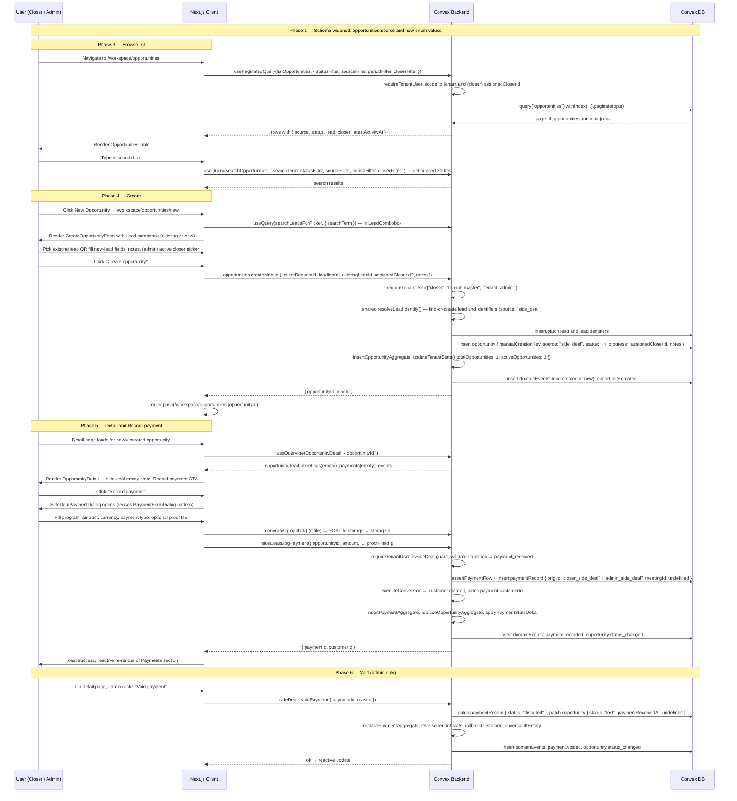
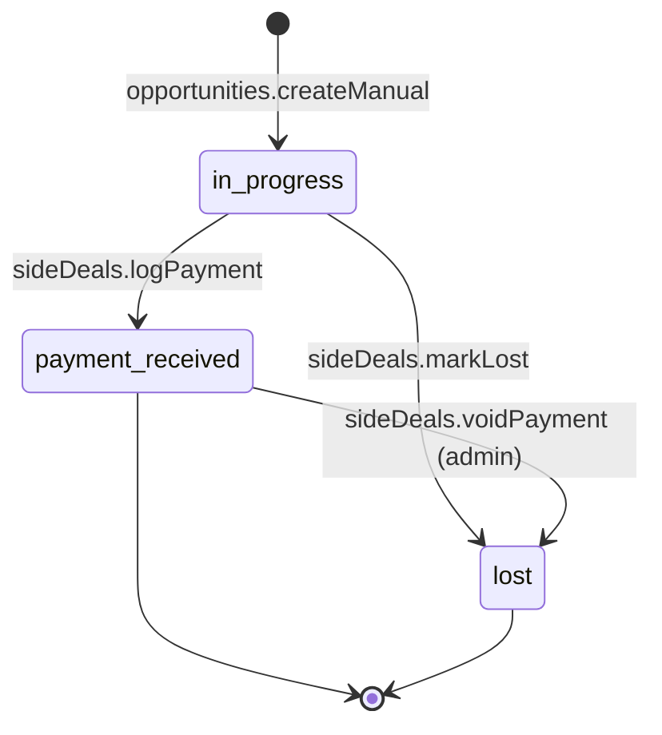
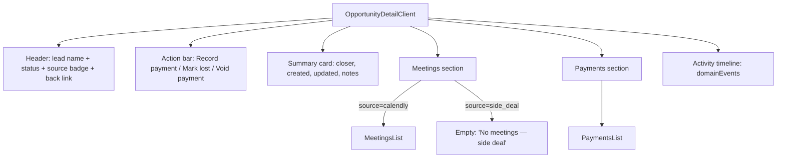
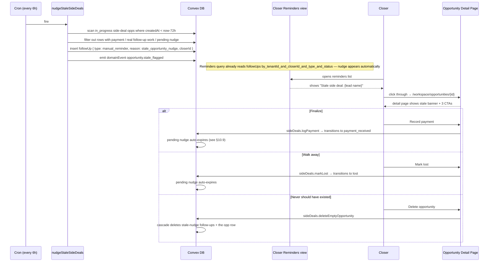
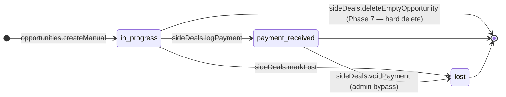

# Opportunities Management & Side Deals — Design Specification

**Version:** 0.1 (MVP)
**Status:** Draft
**Date:** 2026-04-22
**Scope:** Current state — every opportunity in the system is born from a Calendly `invitee.created` webhook; opportunities are visible only through the status-grouped Pipeline view; there is no entity-browse experience for opportunities and no manual creation path. End state — a dedicated **Opportunities** section (parallel to `/workspace/leads` and `/workspace/customers`) provides a paginated, searchable, filterable list of every opportunity, a full detail page per opportunity, and a multi-step creation page where a closer (or admin on behalf of a closer) picks or creates a lead and spawns a fresh opportunity. Once created, the opportunity opens on its detail page with zero meetings attached; the closer records a payment against it, and that payment — by virtue of having `origin: "closer_side_deal" | "admin_side_deal"` and no `meetingId` — is classified as a **side deal** in reporting.
**Prerequisite:** `paymentRecords.meetingId` and `customers.winningMeetingId` are already optional. `leads.email` and `customers.email` are still required in the current schema, so MVP manual lead creation requires an email address; phone/social-only side-deal leads are deferred until a dedicated widen-migrate-narrow changes lead/customer identity shape. The existing `/workspace/pipeline` (status-tabbed view), `/workspace/leads`, `/workspace/customers`, and closer-side equivalents remain available. The work is additive except for the planned `opportunities.source` / `latestActivityAt` backfill and the extracted shared lead-identity helper.

---

## Table of Contents

1. [Goals & Non-Goals](#1-goals--non-goals)
2. [Actors & Roles](#2-actors--roles)
3. [End-to-End Flow Overview](#3-end-to-end-flow-overview)
4. [Phase 1: Schema & Enum Foundations](#4-phase-1-schema--enum-foundations)
5. [Phase 2: Backend — Opportunity Creation & Lifecycle Mutations](#5-phase-2-backend--opportunity-creation--lifecycle-mutations)
6. [Phase 3: Frontend — Opportunities List Page](#6-phase-3-frontend--opportunities-list-page)
7. [Phase 4: Frontend — Opportunity Create Page](#7-phase-4-frontend--opportunity-create-page)
8. [Phase 5: Frontend — Opportunity Detail & Side-Deal Payment Flow](#8-phase-5-frontend--opportunity-detail--side-deal-payment-flow)
9. [Phase 6: Reporting, Void & Audit Trail](#9-phase-6-reporting-void--audit-trail)
10. [Phase 7: Staleness Detection, Nudges & Empty-Opportunity Cleanup](#10-phase-7-staleness-detection-nudges--empty-opportunity-cleanup)
11. [Data Model](#11-data-model)
12. [Convex Function Architecture](#12-convex-function-architecture)
13. [Routing & Authorization](#13-routing--authorization)
14. [Security Considerations](#14-security-considerations)
15. [Error Handling & Edge Cases](#15-error-handling--edge-cases)
16. [Open Questions](#16-open-questions)
17. [Dependencies](#17-dependencies)
18. [Applicable Skills](#18-applicable-skills)

---

## 1. Goals & Non-Goals

### Goals

- **Opportunity as a first-class CRM entity.** Promote opportunities from "something you see inside the Pipeline view" to a fully browseable entity with its own list, detail, and creation surfaces — the same treatment `leads`, `customers`, and (in reports) `meetings` already receive.
- **New list page at `/workspace/opportunities`.** Mirrors `/workspace/leads` in structure: paginated list (25 per page), debounced text search, common status tabs (All / In Progress / Scheduled / Won / Lost / Canceled; rare statuses remain visible in All for MVP), date-range toggle (today / week / month / all), source filter (all / calendly / side deal), closer filter (admin-only). Role-aware server-side filtering — closers only see opportunities they are assigned to.
- **New detail page at `/workspace/opportunities/[opportunityId]`.** Single source of truth for viewing an opportunity: lead info, status, assigned closer, acquisition source, linked meetings (if any), linked payments, follow-ups, activity timeline. The page supports BOTH Calendly-sourced and side-deal opportunities, with the meetings section gracefully empty for side deals.
- **New creation page at `/workspace/opportunities/new`.** A full-screen form (not a dialog) with two sections:
    1. **Lead** — combobox that debounce-searches existing leads by name/email/phone; a "+ Create new lead" branch reveals inline fields (full name and email required for MVP; phone and social handle optional). The form submits either `existingLeadId` OR `newLeadInput`.
    2. **Opportunity** — admin-only closer picker (required for admin callers and limited to active `closer` users; closer callers are assigned to self), optional notes.
  On submit, the backend resolves-or-creates the lead and inserts an opportunity with `source: "side_deal"`, `status: "in_progress"`, no meeting. The user is navigated to the new opportunity's detail page, where the "Record payment" action converts the opportunity to `payment_received` and generates the side-deal payment record.
- **Side deals emerge from "manually-created opportunity + payment with no meeting"** — they are not a separate workflow. Every opportunity in the system carries a `source` discriminator (`"calendly" | "side_deal"`); every payment carries an `origin` discriminator. Reporting queries partition revenue by these two fields.
- **Payment recording on side-deal opportunities.** The opportunity detail page exposes a "Record payment" button that opens a dialog analogous to the existing `PaymentFormDialog` on `/workspace/closer/meetings/[id]` — same form fields (program, amount, currency, payment type, proof file) but a different target mutation that does not require a `meetingId`. On success, the opportunity transitions to `payment_received`, the lead converts to a customer, and reporting aggregates receive the same deltas as Calendly-sourced payments.
- **Reuse, don't rebuild.** Lead identity resolution is extracted from `pipeline/inviteeCreated.ts` into a shared helper, then reused by both Calendly and manual side-deal creation. Customer conversion (`executeConversion`), payment invariants (`assertPaymentRow`), program validation (`resolveProgramForWrite`), tenant stats (`updateTenantStats` / `applyPaymentStatsDelta` as appropriate), reporting write hooks (`insertOpportunityAggregate`, `replaceOpportunityAggregate`, `insertPaymentAggregate`, `replacePaymentAggregate`), and domain events (`emitDomainEvent`) flow through the existing helper contracts. Side deals are a new *entry path* into the same pipeline — not a parallel pipeline.
- **Parity with leads/customers UX.** Row clicks on the opportunities table open the detail page. Debounced search switches from the paginated query to a search query (same pattern as `leads-page-content.tsx`). Skeletons match the `Skeleton` primitive + `role="status"` pattern. Section-level `SectionErrorBoundary` wraps each data-loading region on the detail page.
- **Audit trail parity.** Every opportunity creation emits `lead.created` (if new lead), `opportunity.created`; every side-deal payment emits `payment.recorded`; every lost or voided transition emits its own event — all carrying `source: "closer"` or `"admin"` and `metadata.source: "side_deal"` so downstream consumers can filter.

### Non-Goals (deferred)

- **Replacing `/workspace/pipeline`.** The existing Pipeline view (status-tab kanban-style table) is retained unchanged. Pipeline = funnel/workflow emphasis; Opportunities = entity-browse emphasis. They complement each other. A future unification is out of scope.
- **A "Side Deals" nav entry or filtered view bookmark.** Side deals are surfaced via the source filter on the Opportunities page, not a separate nav item. Adding a dedicated "/workspace/side-deals" route duplicates routing without adding information.
- **Editing an existing opportunity's lead, program, or amount in place.** MVP supports marking lost or voiding a mis-entered payment (Phase 6); it does not support editing. A future v0.2 can add in-place edit.
- **Bulk import of historical side deals** (CSV upload, API import) — v0.2.
- **Fuzzy lead de-duplication** inside the lead combobox — v0.2. MVP does exact-match on email, phone, and social handle; partial name matches are shown to the user as suggestions but do not auto-select.
- **Phone/social-only lead creation** — v0.2. The current schema requires `leads.email` and `customers.email`; making email optional is a separate migration and not bundled into side-deals MVP.
- **Synthetic "side-deal meetings" or placeholder Calendly events** — Explicitly rejected. Side-deal opportunities have zero meetings; `latestMeetingId`, `nextMeetingId`, `calendlyEventUri`, `utmParams`, and any `meetings`-table row are all absent. The detail page renders a "No meetings — recorded as a side deal" empty state.
- **New opportunity statuses specific to side deals** (e.g., `"side_deal_pending"`, `"side_deal_won"`) — Not introduced. Side deals reuse `in_progress` → `payment_received`/`lost` and skip the meeting-centric statuses (`scheduled`, `meeting_overran`, `no_show`, `reschedule_link_sent`, `follow_up_scheduled`).
- **Follow-ups created on a side-deal opportunity that schedule Calendly meetings** — Deferred to v0.2. Side deals stay off-Calendly for MVP.
- **Non-commissionable side-deal origins** (e.g., bookkeeper side-deal entry, self-serve customer-direct side deals) — Deferred. All MVP side-deal payments are commissionable to the attributed closer.
- **Exports** (CSV from the Opportunities page) — The `lead:export` permission pattern exists but is disabled ("Coming soon") on the Leads page; we mirror that state — a disabled `Export CSV` button on Opportunities, no implementation yet.
- **Closer-only `/workspace/closer/opportunities` mirror route.** Not needed. The single `/workspace/opportunities` route adapts server-side to the caller's role and applies `assignedCloserId === self` filtering for closers — same pattern as `/workspace/leads` and `/workspace/customers`.
- **Narrowing `opportunities.source` to required.** Phase 1 widens the field as optional and backfills. Narrowing happens in a follow-up deploy (use `convex-migration-helper`).
- **Removing the `meetingId` requirement from `logPayment`.** The existing `logPayment` mutation stays meeting-required (Calendly-sourced deals only). Side-deal payments use a new mutation, `sideDeals.logPayment` (Phase 2).

---

## 2. Actors & Roles

| Actor | Identity | Auth Method | Key Permissions |
|---|---|---|---|
| **Closer** | CRM user with `closer` role | WorkOS AuthKit, member of tenant org | View/search own opportunities on the list page; create new opportunities assigned to self; view detail pages for own opportunities; record side-deal payments on own opportunities; mark own opportunities lost |
| **Tenant Admin** | CRM user with `tenant_admin` role | WorkOS AuthKit, member of tenant org | Superset of Closer across the whole tenant; create opportunities on behalf of any closer; void side-deal payments |
| **Tenant Master** | CRM user with `tenant_master` role | WorkOS AuthKit, member of tenant org | Same as Tenant Admin; also the authority for program management |

> **No external system actors.** Unlike the Calendly pipeline, this feature has zero webhook ingress, zero third-party SDK calls, and zero OAuth tokens. The entire flow is Browser → Next.js → Convex → Convex DB.

### CRM Role ↔ External Role Mapping

Not applicable. All authorization resolves inside the CRM role system via `requireTenantUser()` — the WorkOS `owner` / `tenant-admin` / `closer` slugs are already translated by `convex/lib/roleMapping.ts` at the auth boundary.

### Permission Matrix

| Action | `tenant_master` | `tenant_admin` | `closer` |
|---|---|---|---|
| View opportunities list (all in tenant) | Yes | Yes | Filtered to `assignedCloserId === self` |
| Open opportunity detail | Any in tenant | Any in tenant | Only own |
| Create opportunity assigned to self | No — admins must pick a closer | No — admins must pick a closer | Yes |
| Create opportunity for a closer | Yes, active closer required | Yes, active closer required | No |
| Record side-deal payment | Any in tenant | Any in tenant | Only own |
| Mark opportunity lost | Any in tenant | Any in tenant | Only own |
| Delete an **empty** side-deal opportunity (Phase 7) | Any in tenant | Any in tenant | Only own, and only while `in_progress` with zero payments / meetings / real follow-ups |
| Dismiss a stale-opportunity nudge (Phase 7) | Any in tenant | Any in tenant | Only nudges for own opportunities |
| Void a recorded side-deal payment | Yes | Yes | No |
| See source-partitioned revenue in dashboard cards | Yes | Yes | No in MVP - closer-scoped source revenue is v0.2 |

> **Permission key alignment:** The existing `payment:record` / `payment:view-all` / `payment:view-own` / `meeting:manage-own` keys in `convex/lib/permissions.ts` already express the right semantics. We reuse them with tighter scoping inside the new mutations. No new permission keys are introduced in MVP.

---

## 3. End-to-End Flow Overview



---

## 4. Phase 1: Schema & Enum Foundations

### 4.1 What & Why

Before any UI or mutations ship, the data model must distinguish Calendly-sourced opportunities from manually-created ones, tag manual payments as a distinct revenue slice, and support correct server-side pagination for the new browse surface. Four additive changes cover it:

1. Add `opportunities.source` (optional) with values `"calendly" | "side_deal"`.
2. Extend `paymentRecords.origin` (and `commissionableOriginValidator`) to include `"closer_side_deal"` and `"admin_side_deal"`.
3. Extend `leadIdentifiers.source` to include `"side_deal"`.
4. Add `opportunities.latestActivityAt` and `opportunities.manualCreationKey` (both optional during rollout), plus the composite indexes needed by list/search/staleness paths.

The union/index changes are additive — existing documents stay valid, existing writers keep working during the widen phase.

> **Runtime decision — widen-migrate-narrow:** The production deploy has real tenant data. A non-optional `source` would fail schema validation on deploy. We widen (optional), backfill all opportunities with `source: "calendly"`, then narrow in a follow-up deploy. This is the project's established pattern (see AGENTS.md → "This app is under heavy development with 1 test tenant on production" and the `convex-migration-helper` skill).

> **Dependency:** No new packages. `@convex-dev/migrations` is already installed per AGENTS.md.

### 4.2 Schema changes

```typescript
// Path: convex/schema.ts

// MODIFIED: opportunities — add optional `source` and a new index for filtered browsing
opportunities: defineTable({
  // ... existing fields ...
  tenantId: v.id("tenants"),
  leadId: v.id("leads"),
  assignedCloserId: v.optional(v.id("users")),
  status: v.union(
    v.literal("scheduled"),
    v.literal("in_progress"),
    v.literal("meeting_overran"),
    v.literal("payment_received"),
    v.literal("follow_up_scheduled"),
    v.literal("reschedule_link_sent"),
    v.literal("lost"),
    v.literal("canceled"),
    v.literal("no_show"),
  ),

  // NEW: acquisition-channel discriminator.
  // `undefined` on legacy rows is treated as "calendly" via normalizeOpportunitySource().
  source: v.optional(
    v.union(
      v.literal("calendly"),
      v.literal("side_deal"),
    ),
  ),

  // NEW: idempotency key for manual creation. Undefined for Calendly rows.
  // Generated client-side once per form submission attempt.
  manualCreationKey: v.optional(v.string()),

  // NEW: denormalized "latest activity" timestamp — falls back through:
  //   paymentReceivedAt → lostAt → latestMeetingAt → updatedAt
  // Written by the mutation helper patchOpportunityLifecycle() (§5.6).
  // Enables a single index for the Opportunities list sort order across
  // both Calendly (has meetings) and side-deal (no meetings) rows.
  latestActivityAt: v.optional(v.number()),

  // ... existing fields (latestMeetingId, nextMeetingId, etc.) ...
  createdAt: v.number(),
  updatedAt: v.number(),
})
  // ... existing indexes ...
  // NEW: idempotent manual creation lookup
  .index("by_tenantId_and_manualCreationKey", [
    "tenantId",
    "manualCreationKey",
  ])
  // NEW: list-page source/date browsing and cron support
  .index("by_tenantId_and_source_and_createdAt", [
    "tenantId",
    "source",
    "createdAt",
  ])
  .index("by_source_and_status_and_createdAt", [
    "source",
    "status",
    "createdAt",
  ])
  // NEW: list-page default sort — "most recent activity" across both sources
  .index("by_tenantId_and_latestActivityAt", [
    "tenantId",
    "latestActivityAt",
  ])
  // NEW: list-page filters. These keep pagination correct by pushing
  // equality filters before the latestActivityAt range/sort field.
  .index("by_tenantId_and_status_and_latestActivityAt", [
    "tenantId",
    "status",
    "latestActivityAt",
  ])
  .index("by_tenantId_and_source_and_latestActivityAt", [
    "tenantId",
    "source",
    "latestActivityAt",
  ])
  .index("by_tenantId_and_source_and_status_and_latestActivityAt", [
    "tenantId",
    "source",
    "status",
    "latestActivityAt",
  ])
  .index("by_tenantId_and_assignedCloserId_and_latestActivityAt", [
    "tenantId",
    "assignedCloserId",
    "latestActivityAt",
  ])
  .index("by_tenantId_and_assignedCloserId_and_status_and_latestActivityAt", [
    "tenantId",
    "assignedCloserId",
    "status",
    "latestActivityAt",
  ])
  .index("by_tenantId_and_assignedCloserId_and_source_and_latestActivityAt", [
    "tenantId",
    "assignedCloserId",
    "source",
    "latestActivityAt",
  ])
  .index("by_tenantId_and_assignedCloserId_and_source_and_status_and_latestActivityAt", [
    "tenantId",
    "assignedCloserId",
    "source",
    "status",
    "latestActivityAt",
  ]),
```

```typescript
// Path: convex/schema.ts

// MODIFIED: leadIdentifiers — extend `source` union
leadIdentifiers: defineTable({
  // ... existing fields ...
  source: v.union(
    v.literal("calendly_booking"),
    v.literal("manual_entry"),
    v.literal("merge"),
    v.literal("side_deal"),  // NEW
  ),
  // ... existing fields (sourceMeetingId, confidence, createdAt) ...
})
  // ... existing indexes unchanged ...
```

```typescript
// Path: convex/lib/paymentTypes.ts

// MODIFIED: extend COMMISSIONABLE_ORIGINS and the two validators
export const COMMISSIONABLE_ORIGINS = [
  "closer_meeting",
  "closer_reminder",
  "admin_meeting",
  "admin_reminder",
  "admin_review_resolution",
  "closer_side_deal",  // NEW
  "admin_side_deal",   // NEW
] as const;

export const commissionableOriginValidator = v.union(
  v.literal("closer_meeting"),
  v.literal("closer_reminder"),
  v.literal("admin_meeting"),
  v.literal("admin_reminder"),
  v.literal("admin_review_resolution"),
  v.literal("closer_side_deal"),
  v.literal("admin_side_deal"),
);

export const paymentOriginValidator = v.union(
  v.literal("closer_meeting"),
  v.literal("closer_reminder"),
  v.literal("admin_meeting"),
  v.literal("admin_reminder"),
  v.literal("admin_review_resolution"),
  v.literal("closer_side_deal"),
  v.literal("admin_side_deal"),
  v.literal("customer_direct"),
  v.literal("bookkeeper_direct"),
);
```

### 4.3 Normalization helpers

```typescript
// Path: convex/lib/sideDeals.ts  — NEW

import type { Doc } from "../_generated/dataModel";
import type { CommissionableOrigin } from "./paymentTypes";

export type OpportunitySource = "calendly" | "side_deal";

/**
 * Pre-backfill rows may have `source === undefined`. Treat them as Calendly.
 * After Phase 1.3 backfill + Phase 1.5 narrow, this function can be inlined.
 */
export function normalizeOpportunitySource(
  opportunity: Pick<Doc<"opportunities">, "source">,
): OpportunitySource {
  return opportunity.source ?? "calendly";
}

export function isSideDeal(
  opportunity: Pick<Doc<"opportunities">, "source">,
): boolean {
  return normalizeOpportunitySource(opportunity) === "side_deal";
}

const SIDE_DEAL_ORIGINS: ReadonlySet<CommissionableOrigin> = new Set([
  "closer_side_deal",
  "admin_side_deal",
]);

export function isSideDealOrigin(origin: string | undefined | null): boolean {
  return (
    origin !== undefined &&
    origin !== null &&
    SIDE_DEAL_ORIGINS.has(origin as CommissionableOrigin)
  );
}
```

### 4.4 Migration strategy

| Step | Deploy | Action | Risk |
|---|---|---|---|
| 1.1 | Schema deploy | Widen: add `source`, `latestActivityAt`, `manualCreationKey` (all optional) + the list/staleness/idempotency indexes to `opportunities`; add `"side_deal"` to `leadIdentifiers.source`; extend payment-origin validators | Zero — additive |
| 1.2 | Code deploy | Update `inviteeCreated.ts` to set `source: "calendly"` AND `latestActivityAt` on every new opportunity insert | Zero — new writers only |
| 1.3 | One-shot migration | Backfill all existing opportunities: `source ?? "calendly"`, `latestActivityAt ?? (paymentReceivedAt ?? lostAt ?? latestMeetingAt ?? updatedAt)`. Use the existing root `convex/migrations.ts` `Migrations` component export batched at 200/batch. Emit log `[Migration:Opportunities] backfilled N docs` | Low — idempotent |
| 1.4 | Verification | `npx convex data opportunities --limit 20` confirms both fields set; count query for `source === undefined` returns 0 on test tenant | Low |
| 1.5 (deferred) | Schema deploy | Narrow: change `source` and `latestActivityAt` to required. Keep `manualCreationKey` optional because Calendly rows never have it. Only after 1.4 passes | Medium — gated |

> **Decision rationale — adding `latestActivityAt` is worth the migration cost:** Without it, the list page cannot sort both Calendly (uses `latestMeetingAt`) and side-deal (uses `paymentReceivedAt`/`createdAt`) rows consistently. Instead of computing the coalesce in every query (expensive, scans the whole page), we denormalize once and index once. Keeps the list query ≤ 1 indexed range scan.

### 4.5 Backfill mutation

```typescript
// Path: convex/migrations.ts  — APPEND

// Reuse the existing exported `migrations` instance and root `run` runner.

export const backfillOpportunities = migrations.define({
  table: "opportunities",
  batchSize: 200,
  migrateOne: async (ctx, o) => {
    const patch: Record<string, unknown> = {};
    if (o.source === undefined) patch.source = "calendly";
    if (o.latestActivityAt === undefined) {
      patch.latestActivityAt =
        o.paymentReceivedAt ??
        o.lostAt ??
        o.latestMeetingAt ??
        o.updatedAt ??
        o.createdAt;
    }
    if (Object.keys(patch).length > 0) {
      await ctx.db.patch(o._id, patch);
    }
  },
});
```

---

## 5. Phase 2: Backend — Opportunity Creation & Lifecycle Mutations

### 5.1 What & Why

This phase ships three server-side mutations, the shared identity extraction needed by manual lead creation, and the list/detail queries used by the new route:

1. `leads/identityResolution.ts` — extracted identity resolver shared by Calendly webhooks and manual side-deal creation.
2. `opportunities.createManual` — idempotently resolve-or-create lead + insert side-deal opportunity (no payment).
3. `sideDeals.logPayment` — record a payment against a side-deal opportunity (transitions to `payment_received`, converts lead to customer).
4. `sideDeals.markLost` — transition a side-deal opportunity to `lost`.
5. `opportunities.queries.listOpportunities` (paginated) and `searchOpportunities` for the list page.

`sideDeals.voidPayment` is intentionally deferred to Phase 6 with the reporting/accounting work. Phase 2 must not introduce the admin reversal path.

Separating opportunity creation from payment is deliberate: it matches the user's mental model (opportunity is a first-class record; payment is an event) and it matches the UX (create page → detail page → payment action). No "won-at-creation" atomic path — that optimization is a v0.2 concern.

> **Runtime decision — mutation, not action:** No external HTTP, no Node builtins, no file reads. Proof-file upload happens client-side via the existing `generateUploadUrl` before the payment mutation fires. Everything stays inside a Convex transaction.

`resolveLeadIdentity` owns normalized identifier writes, `searchText` maintenance, `insertLeadAggregate`, and `updateTenantStats({ totalLeads: 1 })` when it creates a new lead. It does **not** emit domain events; callers emit `lead.created` with the correct actor/source context.

### 5.2 `opportunities.createManual`

```typescript
// Path: convex/opportunities/createManual.ts  — NEW

import { v } from "convex/values";
import { mutation } from "../_generated/server";
import type { Id } from "../_generated/dataModel";
import { requireTenantUser } from "../requireTenantUser";
import { resolveLeadIdentity } from "../leads/identityResolution";
import { updateTenantStats } from "../lib/tenantStatsHelper";
import { emitDomainEvent } from "../lib/domainEvents";
import { insertOpportunityAggregate } from "../reporting/writeHooks";

const socialHandleValidator = v.object({
  platform: v.union(
    v.literal("instagram"),
    v.literal("tiktok"),
    v.literal("twitter"),
    v.literal("facebook"),
    v.literal("linkedin"),
    v.literal("other_social"),
  ),
  handle: v.string(),
});

const newLeadInputValidator = v.object({
  fullName: v.string(),
  // Required in MVP because leads.email and customers.email are required today.
  email: v.string(),
  phone: v.optional(v.string()),
  socialHandle: v.optional(socialHandleValidator),
});

export const createManual = mutation({
  args: {
    // Client-generated UUID. Lets retries/double-clicks return the same row.
    clientRequestId: v.string(),
    // Either existingLeadId OR newLeadInput must be provided — enforced below.
    existingLeadId: v.optional(v.id("leads")),
    newLeadInput: v.optional(newLeadInputValidator),
    // Required for admin callers; ignored for closer callers unless it equals self.
    assignedCloserId: v.optional(v.id("users")),
    notes: v.optional(v.string()),
  },
  returns: v.object({
    opportunityId: v.id("opportunities"),
    leadId: v.id("leads"),
    leadWasCreated: v.boolean(),
  }),
  handler: async (ctx, args) => {
    const { userId, tenantId, role } = await requireTenantUser(ctx, [
      "closer",
      "tenant_master",
      "tenant_admin",
    ]);
    const now = Date.now();
    const isAdmin = role === "tenant_master" || role === "tenant_admin";
    const manualCreationKey = args.clientRequestId.trim();
    if (!manualCreationKey || manualCreationKey.length > 100) {
      throw new Error("Invalid creation request ID.");
    }

    const existingByRequest = await ctx.db
      .query("opportunities")
      .withIndex("by_tenantId_and_manualCreationKey", (q) =>
        q.eq("tenantId", tenantId).eq("manualCreationKey", manualCreationKey),
      )
      .unique();
    if (existingByRequest) {
      return {
        opportunityId: existingByRequest._id,
        leadId: existingByRequest.leadId,
        leadWasCreated: false,
      };
    }

    // --- 1. Validate lead input (XOR) ----------------------------------
    const hasExistingLead = args.existingLeadId !== undefined;
    const hasNewLeadInput = args.newLeadInput !== undefined;
    if (hasExistingLead === hasNewLeadInput) {
      throw new Error(
        "Provide either existingLeadId or newLeadInput, not both or neither.",
      );
    }

    // --- 2. Resolve assigned closer ------------------------------------
    let assignedCloserId: Id<"users">;
    if (isAdmin) {
      if (!args.assignedCloserId) {
        throw new Error("Pick an active closer before creating an opportunity.");
      }
      const target = await ctx.db.get(args.assignedCloserId);
      if (
        !target ||
        target.tenantId !== tenantId ||
        target.role !== "closer" ||
        target.isActive === false
      ) {
        throw new Error("Assigned closer not found or inactive in this tenant.");
      }
      assignedCloserId = target._id;
    } else {
      if (args.assignedCloserId && args.assignedCloserId !== userId) {
        throw new Error(
          "Only admins can create opportunities on behalf of another closer.",
        );
      }
      assignedCloserId = userId;
    }

    // --- 3. Resolve or create the lead --------------------------------
    let leadId: Id<"leads">;
    let leadWasCreated = false;

    if (args.existingLeadId) {
      const lead = await ctx.db.get(args.existingLeadId);
      if (!lead || lead.tenantId !== tenantId) {
        throw new Error("Selected lead not found.");
      }
      if (lead.status === "merged") {
        // Chase the merge pointer — opportunity should attach to the surviving lead
        const target = lead.mergedIntoLeadId
          ? await ctx.db.get(lead.mergedIntoLeadId)
          : null;
        if (!target || target.tenantId !== tenantId || target.status === "merged") {
          throw new Error("Selected lead has been merged but the target lead is unavailable.");
        }
        leadId = target._id;
      } else {
        leadId = lead._id;
      }
    } else {
      const result = await resolveLeadIdentity(ctx, {
        tenantId,
        fullName: args.newLeadInput!.fullName,
        email: args.newLeadInput!.email,
        phone: args.newLeadInput!.phone,
        socialHandle: args.newLeadInput!.socialHandle,
        identifierSource: "side_deal",
        createdAt: now,
      });
      leadId = result.leadId;
      leadWasCreated = result.created;
    }

    // --- 4. Insert the opportunity -------------------------------------
    const opportunityId = await ctx.db.insert("opportunities", {
      tenantId,
      leadId,
      assignedCloserId,
      status: "in_progress",
      source: "side_deal",
      manualCreationKey,
      notes: args.notes?.trim() || undefined,
      createdAt: now,
      updatedAt: now,
      latestActivityAt: now,
    });

    // --- 5. Reporting hooks --------------------------------------------
    await insertOpportunityAggregate(ctx, opportunityId);
    await updateTenantStats(ctx, tenantId, {
      totalOpportunities: 1,
      activeOpportunities: 1,
    });

    // --- 6. Emit domain events -----------------------------------------
    if (leadWasCreated) {
      await emitDomainEvent(ctx, {
        tenantId,
        entityType: "lead",
        entityId: leadId,
        eventType: "lead.created",
        source: isAdmin ? "admin" : "closer",
        actorUserId: userId,
        occurredAt: now,
        metadata: { origin: "side_deal" },
      });
    }
    await emitDomainEvent(ctx, {
      tenantId,
      entityType: "opportunity",
      entityId: opportunityId,
      eventType: "opportunity.created",
      source: isAdmin ? "admin" : "closer",
      actorUserId: userId,
      toStatus: "in_progress",
      occurredAt: now,
      metadata: { source: "side_deal", assignedCloserId },
    });

    console.log(
      "[Opportunities:Manual] created | tenant=%s opp=%s lead=%s existing=%s",
      tenantId,
      opportunityId,
      leadId,
      args.existingLeadId !== undefined,
    );

    return { opportunityId, leadId, leadWasCreated };
  },
});
```

### 5.3 `sideDeals.logPayment`

```typescript
// Path: convex/sideDeals/logPayment.ts  — NEW

import { v } from "convex/values";
import { mutation } from "../_generated/server";
import { requireTenantUser } from "../requireTenantUser";
import { validateTransition } from "../lib/statusTransitions";
import {
  paymentTypeValidator,
  resolvePaymentType,
  type CommissionableOrigin,
} from "../lib/paymentTypes";
import { toAmountMinor, validateCurrency } from "../lib/formatMoney";
import { executeConversion } from "../customers/conversion";
import {
  assertPaymentRow,
  resolveProgramForWrite,
  syncCustomerPaymentSummary,
} from "../lib/paymentHelpers";
import {
  applyPaymentStatsDelta,
  isActiveOpportunityStatus,
} from "../lib/tenantStatsHelper";
import {
  insertPaymentAggregate,
  replacePaymentAggregate,
} from "../reporting/writeHooks";
import { emitDomainEvent } from "../lib/domainEvents";
import { patchOpportunityLifecycle } from "../lib/opportunityActivity";
import { isSideDeal } from "../lib/sideDeals";

export const logPayment = mutation({
  args: {
    opportunityId: v.id("opportunities"),
    amount: v.number(),
    currency: v.string(),
    programId: v.id("tenantPrograms"),
    paymentType: paymentTypeValidator,
    proofFileId: v.optional(v.id("_storage")),
  },
  returns: v.object({
    paymentId: v.id("paymentRecords"),
    customerId: v.optional(v.id("customers")),
  }),
  handler: async (ctx, args) => {
    const { userId, tenantId, role } = await requireTenantUser(ctx, [
      "closer",
      "tenant_master",
      "tenant_admin",
    ]);
    const now = Date.now();
    const isAdmin = role === "tenant_master" || role === "tenant_admin";

    const opportunity = await ctx.db.get(args.opportunityId);
    if (!opportunity || opportunity.tenantId !== tenantId) {
      throw new Error("Opportunity not found.");
    }
    if (!isSideDeal(opportunity)) {
      throw new Error(
        "Use logPayment on a Calendly-sourced opportunity — this mutation only accepts side-deal opportunities.",
      );
    }
    if (!isAdmin && opportunity.assignedCloserId !== userId) {
      throw new Error("You are not the assigned closer for this opportunity.");
    }
    if (!validateTransition(opportunity.status, "payment_received")) {
      throw new Error(
        `Opportunity status '${opportunity.status}' cannot transition to 'payment_received'.`,
      );
    }
    if (args.amount <= 0) {
      throw new Error("Payment amount must be greater than zero.");
    }

    const program = await resolveProgramForWrite(ctx, tenantId, args.programId);
    const amountMinor = toAmountMinor(args.amount);
    const currency = validateCurrency(args.currency);
    const paymentType = resolvePaymentType(args.paymentType);
    const attributedCloserId = opportunity.assignedCloserId;
    if (!attributedCloserId) {
      throw new Error("Opportunity must be assigned to a closer before payment.");
    }
    const origin: CommissionableOrigin = isAdmin
      ? "admin_side_deal"
      : "closer_side_deal";

    const paymentRow = {
      tenantId,
      opportunityId: args.opportunityId,
      meetingId: undefined,            // side deals have no meeting
      attributedCloserId,
      recordedByUserId: userId,
      commissionable: true,
      amountMinor,
      currency,
      programId: program._id,
      programName: program.name,
      paymentType,
      proofFileId: args.proofFileId ?? undefined,
      status: "recorded",
      statusChangedAt: now,
      recordedAt: now,
      contextType: "opportunity",
      customerId: undefined,
      origin,
    } as const;
    assertPaymentRow(paymentRow);

    const paymentId = await ctx.db.insert("paymentRecords", paymentRow);

    await patchOpportunityLifecycle(ctx, args.opportunityId, {
      status: "payment_received",
      paymentReceivedAt: now,
      updatedAt: now,
    });

    const paymentBeforeCustomerLink = await insertPaymentAggregate(ctx, paymentId);
    await applyPaymentStatsDelta(ctx, tenantId, {
      commissionable: true,
      paymentType,
      amountMinorDelta: amountMinor,
      wonDealDelta: 1,
      activeOpportunityDelta: isActiveOpportunityStatus(opportunity.status) ? -1 : 0,
    });

    const customerId =
      (await executeConversion(ctx, {
        tenantId,
        leadId: opportunity.leadId,
        convertedByUserId: userId,
        winningOpportunityId: args.opportunityId,
        winningMeetingId: undefined,
      })) ?? undefined;

    if (customerId) {
      await ctx.db.patch(paymentId, { customerId });
      await replacePaymentAggregate(ctx, paymentBeforeCustomerLink, paymentId);
      await syncCustomerPaymentSummary(ctx, customerId);
    } else {
      const existingCustomer = await ctx.db
        .query("customers")
        .withIndex("by_tenantId_and_leadId", (q) =>
          q.eq("tenantId", tenantId).eq("leadId", opportunity.leadId),
        )
        .first();
      if (existingCustomer) {
        await ctx.db.patch(paymentId, { customerId: existingCustomer._id });
        await replacePaymentAggregate(ctx, paymentBeforeCustomerLink, paymentId);
        await syncCustomerPaymentSummary(ctx, existingCustomer._id);
      }
    }

    await emitDomainEvent(ctx, {
      tenantId,
      entityType: "payment",
      entityId: paymentId,
      eventType: "payment.recorded",
      source: isAdmin ? "admin" : "closer",
      actorUserId: userId,
      occurredAt: now,
      metadata: {
        opportunityId: args.opportunityId,
        amountMinor,
        currency,
        programId: args.programId,
        programName: program.name,
        paymentType,
        commissionable: true,
        attributedCloserId,
        origin,
        sideDeal: true,
      },
    });
    await emitDomainEvent(ctx, {
      tenantId,
      entityType: "opportunity",
      entityId: args.opportunityId,
      eventType: "opportunity.status_changed",
      source: isAdmin ? "admin" : "closer",
      actorUserId: userId,
      fromStatus: opportunity.status,
      toStatus: "payment_received",
      occurredAt: now,
    });

    return { paymentId, customerId };
  },
});
```

### 5.4 `sideDeals.markLost`

```typescript
// Path: convex/sideDeals/markLost.ts  — NEW

import { v } from "convex/values";
import { mutation } from "../_generated/server";
import { requireTenantUser } from "../requireTenantUser";
import { validateTransition } from "../lib/statusTransitions";
import {
  isActiveOpportunityStatus,
  updateTenantStats,
} from "../lib/tenantStatsHelper";
import { emitDomainEvent } from "../lib/domainEvents";
import { patchOpportunityLifecycle } from "../lib/opportunityActivity";
import { isSideDeal } from "../lib/sideDeals";

export const markLost = mutation({
  args: {
    opportunityId: v.id("opportunities"),
    reason: v.optional(v.string()),
  },
  returns: v.null(),
  handler: async (ctx, { opportunityId, reason }) => {
    const { userId, tenantId, role } = await requireTenantUser(ctx, [
      "closer",
      "tenant_master",
      "tenant_admin",
    ]);
    const isAdmin = role === "tenant_master" || role === "tenant_admin";
    const now = Date.now();

    const opportunity = await ctx.db.get(opportunityId);
    if (!opportunity || opportunity.tenantId !== tenantId) {
      throw new Error("Opportunity not found.");
    }
    if (!isSideDeal(opportunity)) {
      throw new Error("This mutation only accepts side-deal opportunities.");
    }
    if (!isAdmin && opportunity.assignedCloserId !== userId) {
      throw new Error("You are not the assigned closer for this opportunity.");
    }
    if (!validateTransition(opportunity.status, "lost")) {
      throw new Error(
        `Opportunity status '${opportunity.status}' cannot transition to 'lost'.`,
      );
    }

    const trimmed = reason?.trim() || undefined;
    await patchOpportunityLifecycle(ctx, opportunityId, {
      status: "lost",
      lostAt: now,
      lostByUserId: userId,
      lostReason: trimmed,
      updatedAt: now,
    });
    await updateTenantStats(ctx, tenantId, {
      activeOpportunities: isActiveOpportunityStatus(opportunity.status) ? -1 : 0,
      lostDeals: 1,
    });
    await emitDomainEvent(ctx, {
      tenantId,
      entityType: "opportunity",
      entityId: opportunityId,
      eventType: "opportunity.marked_lost",
      source: isAdmin ? "admin" : "closer",
      actorUserId: userId,
      fromStatus: opportunity.status,
      toStatus: "lost",
      reason: trimmed,
      occurredAt: now,
    });
    return null;
  },
});
```

### 5.5 List + search queries

```typescript
// Path: convex/opportunities/listQueries.ts  — NEW (or append to existing queries.ts)

import { v } from "convex/values";
import { paginationOptsValidator } from "convex/server";
import { query } from "../_generated/server";
import type { QueryCtx } from "../_generated/server";
import type { Doc, Id } from "../_generated/dataModel";
import { requireTenantUser } from "../requireTenantUser";
import { normalizeOpportunitySource } from "../lib/sideDeals";

const statusFilterValidator = v.optional(
  v.union(
    v.literal("scheduled"),
    v.literal("in_progress"),
    v.literal("meeting_overran"),
    v.literal("payment_received"),
    v.literal("follow_up_scheduled"),
    v.literal("reschedule_link_sent"),
    v.literal("lost"),
    v.literal("canceled"),
    v.literal("no_show"),
  ),
);

const sourceFilterValidator = v.optional(
  v.union(v.literal("calendly"), v.literal("side_deal")),
);

const periodFilterValidator = v.optional(
  v.union(
    v.literal("today"),
    v.literal("this_week"),
    v.literal("this_month"),
  ),
);

export const listOpportunities = query({
  args: {
    paginationOpts: paginationOptsValidator,
    statusFilter: statusFilterValidator,
    sourceFilter: sourceFilterValidator,
    periodFilter: periodFilterValidator,
    closerFilter: v.optional(v.id("users")),  // admin-only; ignored for closers
  },
  handler: async (ctx, args) => {
    const { userId, tenantId, role } = await requireTenantUser(ctx, [
      "closer",
      "tenant_master",
      "tenant_admin",
    ]);
    const isAdmin = role === "tenant_master" || role === "tenant_admin";
    const effectiveCloserId = isAdmin ? args.closerFilter : userId;
    const { periodStart, periodEnd } = resolvePeriod(args.periodFilter);

    // Choose the tightest index for the active equality filters. The period
    // range is applied on latestActivityAt inside the same index. Do not
    // paginate first and filter the page afterward, or pages can come back
    // short/empty while matching rows exist later in the index.
    const base = buildOpportunityListQuery(ctx, {
      tenantId,
      closerId: effectiveCloserId,
      status: args.statusFilter,
      source: args.sourceFilter,
      periodStart,
      periodEnd,
    });
    const page = await base.order("desc").paginate(args.paginationOpts);
    const rows = page.page;

    // Enrich: lead name/email + closer name — batch lookups bounded to 25
    const leadIds = Array.from(new Set(rows.map((r) => r.leadId)));
    const closerIds = Array.from(
      new Set(rows.map((r) => r.assignedCloserId).filter(Boolean) as Id<"users">[]),
    );
    const [leads, closers] = await Promise.all([
      Promise.all(leadIds.map((id) => ctx.db.get(id))),
      Promise.all(closerIds.map((id) => ctx.db.get(id))),
    ]);
    const leadsById = new Map(leads.filter(Boolean).map((l) => [l!._id, l!]));
    const closersById = new Map(closers.filter(Boolean).map((c) => [c!._id, c!]));

    return {
      ...page,
      page: rows.map((o) => ({
        _id: o._id,
        status: o.status,
        source: normalizeOpportunitySource(o),
        leadId: o.leadId,
        leadName: leadsById.get(o.leadId)?.fullName ?? "Unknown",
        leadEmail: leadsById.get(o.leadId)?.email,
        assignedCloserId: o.assignedCloserId,
        closerName: o.assignedCloserId
          ? closersById.get(o.assignedCloserId)?.fullName
          : undefined,
        latestActivityAt: o.latestActivityAt,
        createdAt: o.createdAt,
      })),
    };
  },
});

export const searchOpportunities = query({
  args: {
    searchTerm: v.string(),
    statusFilter: statusFilterValidator,
    sourceFilter: sourceFilterValidator,
    periodFilter: periodFilterValidator,
    closerFilter: v.optional(v.id("users")),  // admin-only; ignored for closers
  },
  handler: async (ctx, args) => {
    const { userId, tenantId, role } = await requireTenantUser(ctx, [
      "closer",
      "tenant_master",
      "tenant_admin",
    ]);
    const isAdmin = role === "tenant_master" || role === "tenant_admin";
    const effectiveCloserId = isAdmin ? args.closerFilter : userId;
    const { periodStart, periodEnd } = resolvePeriod(args.periodFilter);
    const term = args.searchTerm.trim().toLowerCase();
    if (term.length < 2) return [];

    // 1. Find matching leads via the existing leads search index
    const matchingLeads = await ctx.db
      .query("leads")
      .withSearchIndex("search_leads", (q) =>
        q.search("searchText", term).eq("tenantId", tenantId),
      )
      .take(25);

    // 2. For each matching lead, fetch opportunities (bounded)
    const rowsNested = await Promise.all(
      matchingLeads.map((lead) =>
        ctx.db
          .query("opportunities")
          .withIndex("by_tenantId_and_leadId", (q) =>
            q.eq("tenantId", tenantId).eq("leadId", lead._id),
          )
          .take(10),
      ),
    );
    const rows = rowsNested.flat();

    // 3. Filter the bounded search result by the same semantics as list mode.
    // Search is not cursor-paginated in MVP; cap it and keep the filters exact.
    const filtered = rows.filter((o) => {
      if (effectiveCloserId && o.assignedCloserId !== effectiveCloserId) return false;
      if (args.statusFilter && o.status !== args.statusFilter) return false;
      if (args.sourceFilter && normalizeOpportunitySource(o) !== args.sourceFilter) return false;
      if (periodStart && (o.latestActivityAt ?? 0) < periodStart) return false;
      if (periodEnd && (o.latestActivityAt ?? 0) >= periodEnd) return false;
      return true;
    });

    // 4. Enrich to the exact same row shape as listOpportunities.
    return await enrichOpportunityRows(ctx, filtered);
  },
});

async function enrichOpportunityRows(
  ctx: QueryCtx,
  rows: Doc<"opportunities">[],
) {
  const leadIds = Array.from(new Set(rows.map((r) => r.leadId)));
  const closerIds = Array.from(
    new Set(rows.map((r) => r.assignedCloserId).filter(Boolean) as Id<"users">[]),
  );
  const [leads, closers] = await Promise.all([
    Promise.all(leadIds.map((id) => ctx.db.get(id))),
    Promise.all(closerIds.map((id) => ctx.db.get(id))),
  ]);
  const leadsById = new Map(leads.filter(Boolean).map((l) => [l!._id, l!]));
  const closersById = new Map(closers.filter(Boolean).map((c) => [c!._id, c!]));

  return rows.map((o) => ({
    _id: o._id,
    status: o.status,
    source: normalizeOpportunitySource(o),
    leadId: o.leadId,
    leadName: leadsById.get(o.leadId)?.fullName ?? "Unknown",
    leadEmail: leadsById.get(o.leadId)?.email,
    assignedCloserId: o.assignedCloserId,
    closerName: o.assignedCloserId
      ? closersById.get(o.assignedCloserId)?.fullName
      : undefined,
    latestActivityAt: o.latestActivityAt,
    createdAt: o.createdAt,
  }));
}

function buildOpportunityListQuery(
  ctx: QueryCtx,
  args: {
    tenantId: Id<"tenants">;
    closerId?: Id<"users">;
    status?: Doc<"opportunities">["status"];
    source?: "calendly" | "side_deal";
    periodStart?: number;
    periodEnd?: number;
  },
) {
  const withLatestRange = (q: any) => {
    let next = q;
    if (args.periodStart !== undefined) next = next.gte("latestActivityAt", args.periodStart);
    if (args.periodEnd !== undefined) next = next.lt("latestActivityAt", args.periodEnd);
    return next;
  };

  if (args.closerId && args.source && args.status) {
    return ctx.db.query("opportunities").withIndex(
      "by_tenantId_and_assignedCloserId_and_source_and_status_and_latestActivityAt",
      (q) => withLatestRange(q
        .eq("tenantId", args.tenantId)
        .eq("assignedCloserId", args.closerId)
        .eq("source", args.source)
        .eq("status", args.status)),
    );
  }
  if (args.closerId && args.source) {
    return ctx.db.query("opportunities").withIndex(
      "by_tenantId_and_assignedCloserId_and_source_and_latestActivityAt",
      (q) => withLatestRange(q
        .eq("tenantId", args.tenantId)
        .eq("assignedCloserId", args.closerId)
        .eq("source", args.source)),
    );
  }
  if (args.closerId && args.status) {
    return ctx.db.query("opportunities").withIndex(
      "by_tenantId_and_assignedCloserId_and_status_and_latestActivityAt",
      (q) => withLatestRange(q
        .eq("tenantId", args.tenantId)
        .eq("assignedCloserId", args.closerId)
        .eq("status", args.status)),
    );
  }
  if (args.closerId) {
    return ctx.db.query("opportunities").withIndex(
      "by_tenantId_and_assignedCloserId_and_latestActivityAt",
      (q) => withLatestRange(q
        .eq("tenantId", args.tenantId)
        .eq("assignedCloserId", args.closerId)),
    );
  }
  if (args.source && args.status) {
    return ctx.db.query("opportunities").withIndex(
      "by_tenantId_and_source_and_status_and_latestActivityAt",
      (q) => withLatestRange(q
        .eq("tenantId", args.tenantId)
        .eq("source", args.source)
        .eq("status", args.status)),
    );
  }
  if (args.source) {
    return ctx.db.query("opportunities").withIndex(
      "by_tenantId_and_source_and_latestActivityAt",
      (q) => withLatestRange(q
        .eq("tenantId", args.tenantId)
        .eq("source", args.source)),
    );
  }
  if (args.status) {
    return ctx.db.query("opportunities").withIndex(
      "by_tenantId_and_status_and_latestActivityAt",
      (q) => withLatestRange(q
        .eq("tenantId", args.tenantId)
        .eq("status", args.status)),
    );
  }
  return ctx.db.query("opportunities").withIndex(
    "by_tenantId_and_latestActivityAt",
    (q) => withLatestRange(q.eq("tenantId", args.tenantId)),
  );
}

function resolvePeriod(filter: "today" | "this_week" | "this_month" | undefined): {
  periodStart?: number;
  periodEnd?: number;
} {
  if (!filter) return {};
  const now = new Date();
  const start = new Date(now);
  if (filter === "today") start.setHours(0, 0, 0, 0);
  if (filter === "this_week") {
    const day = start.getDay();
    start.setDate(start.getDate() - day);
    start.setHours(0, 0, 0, 0);
  }
  if (filter === "this_month") {
    start.setDate(1);
    start.setHours(0, 0, 0, 0);
  }
  return { periodStart: start.getTime(), periodEnd: now.getTime() };
}
```

### 5.6 Opportunity lifecycle patch helper

Every mutation that changes an opportunity lifecycle field must keep `latestActivityAt` and the opportunity-status aggregate synchronized. The best path is a small wrapper around `ctx.db.patch`, not a standalone "remember to update timestamp" helper:

```typescript
// Path: convex/lib/opportunityActivity.ts  — NEW

import type { Doc } from "../_generated/dataModel";
import type { MutationCtx } from "../_generated/server";
import type { Id } from "../_generated/dataModel";
import { replaceOpportunityAggregate } from "../reporting/writeHooks";

/**
 * Coalesce the latest meaningful timestamp on an opportunity so the
 * Opportunities list page can sort both Calendly and side-deal rows with
 * a single index. Preference order: paymentReceivedAt → lostAt →
 * latestMeetingAt → updatedAt.
 */
export function computeLatestActivityAt(
  opportunity: Pick<
    Doc<"opportunities">,
    "paymentReceivedAt" | "lostAt" | "latestMeetingAt" | "updatedAt" | "createdAt"
  >,
): number {
  return Math.max(
    opportunity.paymentReceivedAt ?? 0,
    opportunity.lostAt ?? 0,
    opportunity.latestMeetingAt ?? 0,
    opportunity.updatedAt,
    opportunity.createdAt,
  );
}

export async function patchOpportunityLifecycle(
  ctx: MutationCtx,
  opportunityId: Id<"opportunities">,
  patch: Partial<Doc<"opportunities">>,
): Promise<Doc<"opportunities">> {
  const before = await ctx.db.get(opportunityId);
  if (!before) throw new Error("Opportunity not found.");

  const updatedAt = patch.updatedAt ?? Date.now();
  const nextShape = { ...before, ...patch, updatedAt };
  await ctx.db.patch(opportunityId, {
    ...patch,
    updatedAt,
    latestActivityAt: computeLatestActivityAt(nextShape),
  });

  if (
    patch.status !== undefined ||
    patch.latestMeetingId !== undefined ||
    patch.nextMeetingId !== undefined ||
    patch.paymentReceivedAt !== undefined ||
    patch.lostAt !== undefined
  ) {
    return await replaceOpportunityAggregate(ctx, before, opportunityId);
  }
  return (await ctx.db.get(opportunityId))!;
}
```

This helper does **not** update tenant stats; status-specific callers still apply the correct `updateTenantStats` or `applyPaymentStatsDelta` delta because create, payment, lost, void, and delete have different counter semantics.

Phase 1 must also touch existing opportunity writers, otherwise Calendly rows will sort stale after the backfill. The implementation inventory is:

| Writer area | Required change |
|---|---|
| `pipeline/inviteeCreated.ts` | Set `source: "calendly"` and `latestActivityAt` on insert |
| `pipeline/inviteeCanceled.ts`, `pipeline/inviteeNoShow.ts` | Use `patchOpportunityLifecycle` for status changes |
| `closer/meetingActions.ts`, `admin/meetingActions.ts` | Use `patchOpportunityLifecycle` when meeting outcome changes opportunity status |
| `closer/payments.ts`, `closer/reminderOutcomes.ts`, `customers/mutations.ts`, `lib/outcomeHelpers.ts` | Use `patchOpportunityLifecycle` when recording payment/conversion-related opportunity updates |
| `closer/followUpMutations.ts`, `closer/noShowActions.ts`, `closer/meetingOverrun.ts`, `closer/reminderOutcomes.ts` | Use `patchOpportunityLifecycle` when follow-up state changes the opportunity |
| `reviews/mutations.ts`, `unavailability/redistribution.ts` | Preserve `latestActivityAt` when patching lifecycle/assignment fields |
| New `opportunities.createManual`, `sideDeals.logPayment`, `sideDeals.markLost` | Use the helper from day one |
| Phase 6 `sideDeals.voidPayment` | Use the helper when introduced |
| `opportunities/maintenance.ts`, `leads/merge.ts` | Review every direct opportunity patch; convert lifecycle/status writes or document assignment/merge-only behavior |

Any direct `ctx.db.patch(opportunityId, { status: ... })` left outside this helper is a review blocker for this feature.

### 5.7 Status state machine (side-deal subset)



> **Note on `payment_received → lost`:** This transition is NOT in the general `VALID_TRANSITIONS` table. The void path bypasses `validateTransition()` explicitly (documented in the mutation body). Adding it to the general map would loosen controls for unrelated callers.

### 5.8 Mutation inventory

| Mutation | File | Caller | Purpose |
|---|---|---|---|
| `opportunities.createManual` | `convex/opportunities/createManual.ts` | Create page submit | Lead resolve + opportunity insert |
| `sideDeals.logPayment` | `convex/sideDeals/logPayment.ts` | Detail page "Record payment" dialog | Insert payment + transition opp + convert customer |
| `sideDeals.markLost` | `convex/sideDeals/markLost.ts` | Detail page "Mark lost" dialog | Transition side-deal opp to `lost` |
| `sideDeals.voidPayment` | `convex/sideDeals/voidPayment.ts` | Admin detail-page action (Phase 6) | Reverse a recorded side-deal payment |
| `sideDeals.deleteEmptyOpportunity` | `convex/sideDeals/deleteEmptyOpportunity.ts` | Detail page "Delete opportunity" dialog (Phase 7) | Hard-delete a truly empty side-deal opp (no payments, no meetings, no real follow-ups) |
| `opportunities.staleness.nudgeStaleSideDeals` (internal) | `convex/opportunities/staleness.ts` | Cron `nudge-stale-side-deals` (Phase 7) | Create `manual_reminder` follow-ups on stale side-deal opps |
| `opportunities.listOpportunities` (query) | `convex/opportunities/listQueries.ts` | Opportunities list page | Paginated list, role-scoped |
| `opportunities.searchOpportunities` (query) | `convex/opportunities/listQueries.ts` | Opportunities list page (search box) | Text search via lead search index |
| `opportunities.getOpportunityDetail` (query) | `convex/opportunities/detailQuery.ts` | Detail page | Full enriched opportunity payload |

---

## 6. Phase 3: Frontend — Opportunities List Page

### 6.1 What & Why

The list page is the user's entry point to everything opportunity-related — both browsing existing records and starting the create flow. It is **structurally identical** to `/workspace/leads` to minimize cognitive load and reuse patterns the team has already validated:

- Pattern: `page.tsx` (thin RSC wrapper, `unstable_instant = false`) → `_components/opportunities-page-client.tsx` (client content).
- Pagination via `usePaginatedQuery` (25-row initial page, `loadMore(25)` button).
- Debounced search (`OpportunitySearchInput`, 300 ms, mirrors `LeadSearchInput`).
- Filter bar: common status tabs, source toggle, period toggle, (admin-only) closer select.
- Row click → opens `/workspace/opportunities/{id}` in a **new tab** (matching leads behavior: `window.open(..., "_blank")`). Users often compare multiple opportunities side-by-side.

> **Decision rationale — paginated query when idle, search query when typing:** The leads page proves the dual-query pattern works. When `searchTerm === ""`, `usePaginatedQuery` drives the list. When the user types, `usePaginatedQuery` passes `"skip"` and `useQuery(searchOpportunities)` takes over. The switch is transparent to the user; the `OpportunitiesTable` receives an equivalent row shape from both queries.

### 6.2 Page wrapper

```typescript
// Path: app/workspace/opportunities/page.tsx  — NEW

import { OpportunitiesPageClient } from "./_components/opportunities-page-client";

export const unstable_instant = false;

export default function OpportunitiesPage() {
  return <OpportunitiesPageClient />;
}
```

```typescript
// Path: app/workspace/opportunities/loading.tsx  — NEW

import { OpportunitiesPageSkeleton } from "./_components/skeletons/opportunities-page-skeleton";

export default function OpportunitiesLoading() {
  return <OpportunitiesPageSkeleton />;
}
```

### 6.3 Client content

```typescript
// Path: app/workspace/opportunities/_components/opportunities-page-client.tsx  — NEW

"use client";

import { useState, useCallback } from "react";
import { usePaginatedQuery, useQuery } from "convex/react";
import { useRouter } from "next/navigation";
import Link from "next/link";
import { PlusIcon, DownloadIcon } from "lucide-react";

import { api } from "@/convex/_generated/api";
import type { Id } from "@/convex/_generated/dataModel";
import { useRole } from "@/components/auth/role-context";
import { Button } from "@/components/ui/button";
import { Card } from "@/components/ui/card";
import { Tabs, TabsList, TabsTrigger } from "@/components/ui/tabs";
import { ToggleGroup, ToggleGroupItem } from "@/components/ui/toggle-group";
import {
  Select,
  SelectContent,
  SelectItem,
  SelectTrigger,
  SelectValue,
} from "@/components/ui/select";
import { OpportunitySearchInput } from "./opportunity-search-input";
import { OpportunitiesTable } from "./opportunities-table";

type StatusFilter = "all" | "in_progress" | "payment_received" | "lost" | "scheduled" | "canceled";
type SourceFilter = "all" | "calendly" | "side_deal";
type PeriodFilter = "all" | "today" | "this_week" | "this_month";

export function OpportunitiesPageClient() {
  const { isAdmin } = useRole();
  const router = useRouter();

  const [statusFilter, setStatusFilter] = useState<StatusFilter>("all");
  const [sourceFilter, setSourceFilter] = useState<SourceFilter>("all");
  const [periodFilter, setPeriodFilter] = useState<PeriodFilter>("all");
  const [closerFilter, setCloserFilter] = useState<Id<"users"> | "all">("all");
  const [searchTerm, setSearchTerm] = useState("");

  const closers = useQuery(api.users.queries.listActiveClosers, isAdmin ? {} : "skip");

  const isSearching = searchTerm.trim().length >= 2;

  const listArgs = isSearching
    ? "skip"
    : {
        statusFilter: statusFilter === "all" ? undefined : statusFilter,
        sourceFilter: sourceFilter === "all" ? undefined : sourceFilter,
        periodFilter: periodFilter === "all" ? undefined : periodFilter,
        closerFilter: closerFilter === "all" ? undefined : closerFilter,
      };

  const { results, status: paginationStatus, loadMore } = usePaginatedQuery(
    api.opportunities.listQueries.listOpportunities,
    listArgs,
    { initialNumItems: 25 },
  );

  const searchResults = useQuery(
    api.opportunities.listQueries.searchOpportunities,
    isSearching
      ? {
          searchTerm: searchTerm.trim(),
          statusFilter: statusFilter === "all" ? undefined : statusFilter,
          sourceFilter: sourceFilter === "all" ? undefined : sourceFilter,
          periodFilter: periodFilter === "all" ? undefined : periodFilter,
          closerFilter: closerFilter === "all" ? undefined : closerFilter,
        }
      : "skip",
  );

  const rows = isSearching ? searchResults ?? [] : results;

  const handleRowClick = useCallback((opportunityId: Id<"opportunities">) => {
    window.open(`/workspace/opportunities/${opportunityId}`, "_blank");
  }, []);

  return (
    <div className="flex flex-col gap-6">
      {/* Header */}
      <div className="flex items-start justify-between">
        <div>
          <h1 className="text-2xl font-semibold tracking-tight">Opportunities</h1>
          <p className="text-sm text-muted-foreground">
            Browse every opportunity in your tenant. Create side deals that close outside of Calendly.
          </p>
        </div>
        <div className="flex items-center gap-2">
          <Button variant="outline" size="sm" disabled title="Coming soon">
            <DownloadIcon className="size-4" data-icon="inline-start" />
            Export CSV
          </Button>
          <Button asChild size="sm">
            <Link href="/workspace/opportunities/new">
              <PlusIcon className="size-4" data-icon="inline-start" />
              New Opportunity
            </Link>
          </Button>
        </div>
      </div>

      {/* Filters */}
      <Card className="flex flex-col gap-4 p-4">
        <div className="flex flex-col gap-3 lg:flex-row lg:items-center lg:justify-between">
          <OpportunitySearchInput value={searchTerm} onChange={setSearchTerm} />

          <div className="flex flex-wrap items-center gap-2">
            <ToggleGroup
              type="single"
              value={periodFilter}
              onValueChange={(v) => v && setPeriodFilter(v as PeriodFilter)}
              size="sm"
              variant="outline"
            >
              <ToggleGroupItem value="all">All time</ToggleGroupItem>
              <ToggleGroupItem value="today">Today</ToggleGroupItem>
              <ToggleGroupItem value="this_week">Week</ToggleGroupItem>
              <ToggleGroupItem value="this_month">Month</ToggleGroupItem>
            </ToggleGroup>

            <ToggleGroup
              type="single"
              value={sourceFilter}
              onValueChange={(v) => v && setSourceFilter(v as SourceFilter)}
              size="sm"
              variant="outline"
            >
              <ToggleGroupItem value="all">All sources</ToggleGroupItem>
              <ToggleGroupItem value="calendly">Calendly</ToggleGroupItem>
              <ToggleGroupItem value="side_deal">Side Deal</ToggleGroupItem>
            </ToggleGroup>

            {isAdmin && (
              <Select
                value={closerFilter as string}
                onValueChange={(v) => setCloserFilter(v as Id<"users"> | "all")}
              >
                <SelectTrigger size="sm" className="w-48">
                  <SelectValue placeholder="All closers" />
                </SelectTrigger>
                <SelectContent>
                  <SelectItem value="all">All closers</SelectItem>
                  {closers?.map((c) => (
                    <SelectItem key={c._id} value={c._id}>
                      {c.fullName}
                    </SelectItem>
                  ))}
                </SelectContent>
              </Select>
            )}
          </div>
        </div>

        <Tabs value={statusFilter} onValueChange={(v) => setStatusFilter(v as StatusFilter)}>
          <TabsList className="grid w-full grid-cols-3 sm:grid-cols-6">
            <TabsTrigger value="all">All</TabsTrigger>
            <TabsTrigger value="in_progress">In Progress</TabsTrigger>
            <TabsTrigger value="scheduled">Scheduled</TabsTrigger>
            <TabsTrigger value="payment_received">Won</TabsTrigger>
            <TabsTrigger value="lost">Lost</TabsTrigger>
            <TabsTrigger value="canceled">Canceled</TabsTrigger>
          </TabsList>
        </Tabs>
      </Card>

      {/* Table */}
      <OpportunitiesTable
        opportunities={rows}
        isSearching={isSearching}
        isLoading={!isSearching && paginationStatus === "LoadingFirstPage"}
        canLoadMore={!isSearching && paginationStatus === "CanLoadMore"}
        onLoadMore={() => loadMore(25)}
        onRowClick={handleRowClick}
        showCloserColumn={isAdmin}
      />
    </div>
  );
}
```

### 6.4 Table columns

| Column | Source | Renders |
|---|---|---|
| Lead | `leadName` + `leadEmail` | Two-line cell — bold name, muted email |
| Status | `status` | Status badge (reuses existing status-badge component) |
| Source | `source` | `<Badge variant={source === "side_deal" ? "secondary" : "outline"}>` with label |
| Closer (admin only) | `closerName` | Single line |
| Latest activity | `latestActivityAt` | `formatDistanceToNow()` — "2 hours ago", "3 days ago" |
| Created | `createdAt` | `formatDate("MMM d, yyyy")` |

### 6.5 Sidebar nav integration

```typescript
// Path: app/workspace/_components/workspace-shell-client.tsx  (addition)

// Admin nav — INSERT between Pipeline and Leads
const adminNavItems: NavItem[] = [
  { href: "/workspace", label: "Overview", icon: LayoutDashboardIcon, exact: true },
  { href: "/workspace/pipeline", label: "Pipeline", icon: KanbanIcon },
  { href: "/workspace/opportunities", label: "Opportunities", icon: TargetIcon },  // NEW
  { href: "/workspace/reviews", label: "Reviews", icon: ClipboardCheckIcon },
  { href: "/workspace/leads", label: "Leads", icon: ContactIcon },
  { href: "/workspace/customers", label: "Customers", icon: UsersRoundIcon },
  { href: "/workspace/team", label: "Team", icon: UsersIcon },
  { href: "/workspace/settings", label: "Settings", icon: SettingsIcon },
];

// Closer nav — INSERT between Pipeline and Leads
const closerNavItems: NavItem[] = [
  { href: "/workspace/closer", label: "Dashboard", icon: LayoutDashboardIcon, exact: true },
  { href: "/workspace/closer/pipeline", label: "My Pipeline", icon: KanbanIcon },
  { href: "/workspace/opportunities", label: "Opportunities", icon: TargetIcon },  // NEW (shared route)
  { href: "/workspace/leads", label: "Leads", icon: ContactIcon },
  { href: "/workspace/customers", label: "Customers", icon: UsersRoundIcon },
];
```

### 6.6 Command palette entry

```typescript
// Path: components/command-palette.tsx (addition in Quick Actions group)

<CommandItem onSelect={() => { setOpen(false); router.push("/workspace/opportunities/new"); }}>
  <PlusIcon className="size-4" data-icon="inline-start" />
  <span>Create opportunity</span>
</CommandItem>
```

---

## 7. Phase 4: Frontend — Opportunity Create Page

### 7.1 What & Why

A full-screen page (not a dialog) dedicated to creating one opportunity. The page is reached from:

- `/workspace/opportunities` → "+ New Opportunity" button
- Command palette → "Create opportunity"
- Deep-link → `/workspace/opportunities/new?leadId={leadId}` (Phase 4.5 — prefills the lead combobox when coming from a lead's detail page)

The design decision to use a full page — over a dialog — comes from the user's explicit framing and from three downstream benefits:

1. **Room for the Lead combobox.** Searching existing leads needs real estate: result rows with name + email + phone + current-opportunity-count. A dialog squeezes that.
2. **Support for deep-links and bookmarks.** Closer is on a lead's detail page, clicks "Create opportunity for this lead" → page opens with the lead prefilled in the combobox.
3. **Discoverable via URL.** A side-deal workflow that lives at its own URL is easier to train, document, and revisit.

### 7.2 Page wrapper

```typescript
// Path: app/workspace/opportunities/new/page.tsx  — NEW

import { Suspense } from "react";
import { CreateOpportunityPageClient } from "./_components/create-opportunity-page-client";
import { CreateOpportunitySkeleton } from "./_components/create-opportunity-skeleton";

export const unstable_instant = false;

export default function CreateOpportunityPage() {
  return (
    <Suspense fallback={<CreateOpportunitySkeleton />}>
      <CreateOpportunityPageClient />
    </Suspense>
  );
}
```

### 7.3 Form schema

```typescript
// Path: app/workspace/opportunities/new/_components/create-opportunity-schema.ts  — NEW

import { z } from "zod";

export function createOpportunitySchema({
  requireAssignedCloser,
}: {
  requireAssignedCloser: boolean;
}) {
  return z
    .object({
      // Lead — one of two modes
      leadMode: z.enum(["existing", "new"]),
      existingLeadId: z.string().optional(),

      // Fields for leadMode === "new"
      newFullName: z.string().optional(),
      newEmail: z.string().email("Invalid email").optional().or(z.literal("")),
      newPhone: z.string().max(50).optional().or(z.literal("")),
      newSocialPlatform: z
        .enum(["instagram", "tiktok", "twitter", "facebook", "linkedin", "other_social"])
        .optional(),
      newSocialHandle: z.string().optional().or(z.literal("")),

      // Opportunity
      assignedCloserId: z.string().optional(),  // required for admins; empty for closers
      notes: z.string().max(2000).optional().or(z.literal("")),
    })
    .superRefine((data, ctx) => {
      if (data.leadMode === "existing") {
        if (!data.existingLeadId) {
          ctx.addIssue({ code: "custom", message: "Select a lead", path: ["existingLeadId"] });
        }
      } else {
        if (!data.newFullName || data.newFullName.trim().length === 0) {
          ctx.addIssue({ code: "custom", message: "Full name is required", path: ["newFullName"] });
        }
        if (!data.newEmail || data.newEmail.trim().length === 0) {
          ctx.addIssue({
            code: "custom",
            message: "Email is required for new leads in MVP",
            path: ["newEmail"],
          });
        }
        if (data.newSocialPlatform && !data.newSocialHandle) {
          ctx.addIssue({ code: "custom", message: "Enter the handle", path: ["newSocialHandle"] });
        }
        if (!data.newSocialPlatform && data.newSocialHandle) {
          ctx.addIssue({ code: "custom", message: "Pick a platform", path: ["newSocialPlatform"] });
        }
      }
      if (requireAssignedCloser && !data.assignedCloserId) {
        ctx.addIssue({
          code: "custom",
          message: "Pick an active closer",
          path: ["assignedCloserId"],
        });
      }
    });
}

export type CreateOpportunityFormValues = z.infer<
  ReturnType<typeof createOpportunitySchema>
>;
```

### 7.4 Page client + Lead combobox

```typescript
// Path: app/workspace/opportunities/new/_components/create-opportunity-page-client.tsx  — NEW

"use client";

import { useMemo, useRef, useState } from "react";
import { useRouter, useSearchParams } from "next/navigation";
import { useForm } from "react-hook-form";
import { standardSchemaResolver } from "@hookform/resolvers/standard-schema";
import { useMutation } from "convex/react";
import posthog from "posthog-js";
import { toast } from "sonner";
import { ChevronLeftIcon } from "lucide-react";
import Link from "next/link";

import { api } from "@/convex/_generated/api";
import type { Id } from "@/convex/_generated/dataModel";
import { Button } from "@/components/ui/button";
import { Card, CardContent, CardDescription, CardHeader, CardTitle } from "@/components/ui/card";
import {
  Form,
  FormControl,
  FormDescription,
  FormField,
  FormItem,
  FormLabel,
  FormMessage,
} from "@/components/ui/form";
import { Input } from "@/components/ui/input";
import { Textarea } from "@/components/ui/textarea";
import { RadioGroup, RadioGroupItem } from "@/components/ui/radio-group";
import { Select, SelectContent, SelectItem, SelectTrigger, SelectValue } from "@/components/ui/select";
import { Alert, AlertDescription } from "@/components/ui/alert";
import { Spinner } from "@/components/ui/spinner";
import { LeadCombobox } from "./lead-combobox";
import { CloserSelect } from "./closer-select";
import { useRole } from "@/components/auth/role-context";
import {
  createOpportunitySchema,
  type CreateOpportunityFormValues,
} from "./create-opportunity-schema";

export function CreateOpportunityPageClient() {
  const { isAdmin } = useRole();
  const router = useRouter();
  const searchParams = useSearchParams();
  const prefilledLeadId = searchParams.get("leadId") as Id<"leads"> | null;

  const [isSubmitting, setIsSubmitting] = useState(false);
  const [submitError, setSubmitError] = useState<string | null>(null);
  const requestIdRef = useRef(crypto.randomUUID());
  const createManual = useMutation(api.opportunities.createManual.createManual);
  const schema = useMemo(
    () => createOpportunitySchema({ requireAssignedCloser: isAdmin }),
    [isAdmin],
  );

  const form = useForm({
    resolver: standardSchemaResolver(schema),
    defaultValues: {
      leadMode: "existing",
      existingLeadId: prefilledLeadId ?? undefined,
      newFullName: "",
      newEmail: "",
      newPhone: "",
      newSocialPlatform: undefined,
      newSocialHandle: "",
      assignedCloserId: undefined,
      notes: "",
    },
  });
  const leadMode = form.watch("leadMode");

  const onSubmit = async (values: CreateOpportunityFormValues) => {
    setIsSubmitting(true);
    setSubmitError(null);
    try {
      const result = await createManual({
        clientRequestId: requestIdRef.current,
        existingLeadId:
          values.leadMode === "existing"
            ? (values.existingLeadId as Id<"leads">)
            : undefined,
        newLeadInput:
          values.leadMode === "new"
            ? {
                fullName: values.newFullName!.trim(),
                email: values.newEmail!.trim().toLowerCase(),
                phone: values.newPhone || undefined,
                socialHandle:
                  values.newSocialPlatform && values.newSocialHandle
                    ? {
                        platform: values.newSocialPlatform,
                        handle: values.newSocialHandle.trim(),
                      }
                    : undefined,
              }
            : undefined,
        assignedCloserId: (values.assignedCloserId as Id<"users"> | undefined) || undefined,
        notes: values.notes || undefined,
      });
      posthog.capture("opportunity_created_manual", {
        opportunity_id: result.opportunityId,
        lead_was_created: result.leadWasCreated,
        created_by_admin: isAdmin,
        assigned_closer_id: values.assignedCloserId ?? null,
      });
      requestIdRef.current = crypto.randomUUID();
      toast.success("Opportunity created");
      router.push(`/workspace/opportunities/${result.opportunityId}`);
    } catch (error) {
      posthog.captureException(error);
      setSubmitError(
        error instanceof Error ? error.message : "Failed to create opportunity",
      );
      setIsSubmitting(false);
    }
  };

  return (
    <div className="mx-auto flex w-full max-w-3xl flex-col gap-6 p-6">
      <div>
        <Button asChild variant="ghost" size="sm" className="-ml-3 mb-2">
          <Link href="/workspace/opportunities">
            <ChevronLeftIcon className="size-4" data-icon="inline-start" />
            Back to opportunities
          </Link>
        </Button>
        <h1 className="text-2xl font-semibold tracking-tight">New opportunity</h1>
        <p className="text-sm text-muted-foreground">
          Capture a deal that originated outside of Calendly. Once created, record a payment from the detail page to complete the side deal.
        </p>
      </div>

      <Form {...form}>
        <form onSubmit={form.handleSubmit(onSubmit)} className="flex flex-col gap-6">
          {/* --- Lead section --- */}
          <Card>
            <CardHeader>
              <CardTitle className="text-base">Lead</CardTitle>
              <CardDescription>Pick an existing lead or create a new one.</CardDescription>
            </CardHeader>
            <CardContent className="flex flex-col gap-4">
              <FormField
                control={form.control}
                name="leadMode"
                render={({ field }) => (
                  <FormItem>
                    <FormControl>
                      <RadioGroup
                        value={field.value}
                        onValueChange={field.onChange}
                        className="grid grid-cols-2 gap-2"
                      >
                        <label className="flex cursor-pointer items-center gap-2 rounded-md border p-3 has-[:checked]:border-primary">
                          <RadioGroupItem value="existing" />
                          <span>Existing lead</span>
                        </label>
                        <label className="flex cursor-pointer items-center gap-2 rounded-md border p-3 has-[:checked]:border-primary">
                          <RadioGroupItem value="new" />
                          <span>New lead</span>
                        </label>
                      </RadioGroup>
                    </FormControl>
                  </FormItem>
                )}
              />

              {leadMode === "existing" ? (
                <FormField
                  control={form.control}
                  name="existingLeadId"
                  render={({ field }) => (
                    <FormItem>
                      <FormLabel>Lead</FormLabel>
                      <FormControl>
                        <LeadCombobox
                          value={field.value as Id<"leads"> | undefined}
                          onChange={(id) => field.onChange(id)}
                          disabled={isSubmitting}
                        />
                      </FormControl>
                      <FormMessage />
                    </FormItem>
                  )}
                />
              ) : (
                <div className="flex flex-col gap-4">
                  <FormField
                    control={form.control}
                    name="newFullName"
                    render={({ field }) => (
                      <FormItem>
                        <FormLabel>
                          Full name <span className="text-destructive">*</span>
                        </FormLabel>
                        <FormControl>
                          <Input {...field} disabled={isSubmitting} />
                        </FormControl>
                        <FormMessage />
                      </FormItem>
                    )}
                  />
                  <div className="grid gap-4 sm:grid-cols-2">
                    <FormField
                      control={form.control}
                      name="newEmail"
                      render={({ field }) => (
                        <FormItem>
                          <FormLabel>Email</FormLabel>
                          <FormControl>
                            <Input type="email" {...field} disabled={isSubmitting} />
                          </FormControl>
                          <FormMessage />
                        </FormItem>
                      )}
                    />
                    <FormField
                      control={form.control}
                      name="newPhone"
                      render={({ field }) => (
                        <FormItem>
                          <FormLabel>Phone</FormLabel>
                          <FormControl>
                            <Input {...field} disabled={isSubmitting} />
                          </FormControl>
                          <FormMessage />
                        </FormItem>
                      )}
                    />
                  </div>
                  <div className="grid gap-4 sm:grid-cols-2">
                    <FormField
                      control={form.control}
                      name="newSocialPlatform"
                      render={({ field }) => (
                        <FormItem>
                          <FormLabel>Social platform</FormLabel>
                          <Select value={field.value} onValueChange={field.onChange} disabled={isSubmitting}>
                            <FormControl>
                              <SelectTrigger>
                                <SelectValue placeholder="Optional" />
                              </SelectTrigger>
                            </FormControl>
                            <SelectContent>
                              <SelectItem value="instagram">Instagram</SelectItem>
                              <SelectItem value="tiktok">TikTok</SelectItem>
                              <SelectItem value="twitter">X / Twitter</SelectItem>
                              <SelectItem value="facebook">Facebook</SelectItem>
                              <SelectItem value="linkedin">LinkedIn</SelectItem>
                              <SelectItem value="other_social">Other</SelectItem>
                            </SelectContent>
                          </Select>
                          <FormMessage />
                        </FormItem>
                      )}
                    />
                    <FormField
                      control={form.control}
                      name="newSocialHandle"
                      render={({ field }) => (
                        <FormItem>
                          <FormLabel>Handle</FormLabel>
                          <FormControl>
                            <Input {...field} disabled={isSubmitting} placeholder="@username" />
                          </FormControl>
                          <FormMessage />
                        </FormItem>
                      )}
                    />
                  </div>
                  <FormDescription>
                    Email is required for new leads in MVP. Phone and social handle are optional matching hints.
                  </FormDescription>
                </div>
              )}
            </CardContent>
          </Card>

          {/* --- Opportunity section --- */}
          <Card>
            <CardHeader>
              <CardTitle className="text-base">Opportunity</CardTitle>
              <CardDescription>
                {isAdmin
                  ? "Assign to a closer and add any context you'll need later."
                  : "Add any context you'll need later."}
              </CardDescription>
            </CardHeader>
            <CardContent className="flex flex-col gap-4">
              {isAdmin && (
                <FormField
                  control={form.control}
                  name="assignedCloserId"
                  render={({ field }) => (
                    <FormItem>
                      <FormLabel>Assign to closer</FormLabel>
                      <FormControl>
                        <CloserSelect
                          value={field.value as Id<"users"> | undefined}
                          onChange={field.onChange}
                          disabled={isSubmitting}
                        />
                      </FormControl>
                      <FormDescription>Required. Admin-created opportunities are assigned to an active closer.</FormDescription>
                      <FormMessage />
                    </FormItem>
                  )}
                />
              )}
              <FormField
                control={form.control}
                name="notes"
                render={({ field }) => (
                  <FormItem>
                    <FormLabel>Notes</FormLabel>
                    <FormControl>
                      <Textarea rows={4} {...field} disabled={isSubmitting} placeholder="How did this deal come about?" />
                    </FormControl>
                    <FormMessage />
                  </FormItem>
                )}
              />
            </CardContent>
          </Card>

          {submitError && (
            <Alert variant="destructive">
              <AlertDescription>{submitError}</AlertDescription>
            </Alert>
          )}

          <div className="flex items-center justify-end gap-2">
            <Button asChild variant="outline" type="button" disabled={isSubmitting}>
              <Link href="/workspace/opportunities">Cancel</Link>
            </Button>
            <Button type="submit" disabled={isSubmitting}>
              {isSubmitting ? <Spinner data-icon="inline-start" /> : null}
              Create opportunity
            </Button>
          </div>
        </form>
      </Form>
    </div>
  );
}
```

### 7.5 `LeadCombobox`

```typescript
// Path: app/workspace/opportunities/new/_components/lead-combobox.tsx  — NEW

"use client";

import { useState, useRef, useEffect } from "react";
import { useQuery } from "convex/react";
import { CheckIcon, ChevronsUpDownIcon, SearchIcon } from "lucide-react";

import { api } from "@/convex/_generated/api";
import type { Id } from "@/convex/_generated/dataModel";
import { Button } from "@/components/ui/button";
import {
  Command,
  CommandEmpty,
  CommandGroup,
  CommandInput,
  CommandItem,
  CommandList,
} from "@/components/ui/command";
import { Popover, PopoverContent, PopoverTrigger } from "@/components/ui/popover";
import { cn } from "@/lib/utils";

interface Props {
  value?: Id<"leads">;
  onChange: (value: Id<"leads"> | undefined) => void;
  disabled?: boolean;
}

export function LeadCombobox({ value, onChange, disabled }: Props) {
  const [open, setOpen] = useState(false);
  const [searchTerm, setSearchTerm] = useState("");
  const debounceRef = useRef<ReturnType<typeof setTimeout> | null>(null);
  const [debouncedTerm, setDebouncedTerm] = useState("");

  useEffect(() => {
    if (debounceRef.current) clearTimeout(debounceRef.current);
    debounceRef.current = setTimeout(() => setDebouncedTerm(searchTerm), 300);
    return () => {
      if (debounceRef.current) clearTimeout(debounceRef.current);
    };
  }, [searchTerm]);

  const results = useQuery(
    api.leads.queries.searchLeadsForPicker,
    debouncedTerm.length >= 2 ? { searchTerm: debouncedTerm } : "skip",
  );
  const selectedLead = useQuery(
    api.leads.queries.getLeadForPicker,
    value ? { leadId: value } : "skip",
  );

  return (
    <Popover open={open} onOpenChange={setOpen}>
      <PopoverTrigger asChild>
        <Button
          variant="outline"
          role="combobox"
          aria-expanded={open}
          className="w-full justify-between"
          disabled={disabled}
        >
          {selectedLead ? (
            <span className="truncate">
              {selectedLead.fullName}
              {selectedLead.email ? (
                <span className="ml-2 text-muted-foreground">· {selectedLead.email}</span>
              ) : null}
            </span>
          ) : (
            <span className="text-muted-foreground">Search leads by name, email, or phone…</span>
          )}
          <ChevronsUpDownIcon className="size-4 opacity-50" />
        </Button>
      </PopoverTrigger>
      <PopoverContent className="w-[--radix-popover-trigger-width] p-0">
        <Command shouldFilter={false}>
          <CommandInput
            placeholder="Search leads…"
            value={searchTerm}
            onValueChange={setSearchTerm}
          />
          <CommandList>
            {debouncedTerm.length < 2 && (
              <CommandEmpty>Type at least 2 characters to search.</CommandEmpty>
            )}
            {debouncedTerm.length >= 2 && results && results.length === 0 && (
              <CommandEmpty>No leads found. Switch to "New lead" above.</CommandEmpty>
            )}
            {results && results.length > 0 && (
              <CommandGroup>
                {results.map((lead) => (
                  <CommandItem
                    key={lead._id}
                    value={lead._id}
                    onSelect={() => {
                      onChange(lead._id);
                      setOpen(false);
                    }}
                  >
                    <CheckIcon
                      className={cn("size-4", value === lead._id ? "opacity-100" : "opacity-0")}
                    />
                    <div className="flex flex-col">
                      <span className="font-medium">{lead.fullName}</span>
                      <span className="text-xs text-muted-foreground">
                        {lead.email ?? lead.phone ?? "—"} · {lead.status}
                      </span>
                    </div>
                  </CommandItem>
                ))}
              </CommandGroup>
            )}
          </CommandList>
        </Command>
      </PopoverContent>
    </Popover>
  );
}
```

`searchLeadsForPicker` and `getLeadForPicker` are new lightweight query wrappers in `convex/leads/queries.ts`. They return only picker-safe fields, include `active` and `converted` leads, exclude/de-resolve `merged` rows, and stay tenant-scoped through `requireTenantUser`. Reusing the current default `searchLeads` would hide converted leads in some flows and make existing-customer side deals harder to attach correctly.

### 7.6 Form flow diagram

```mermaid
flowchart TD
  start[/workspace/opportunities/new] --> mode{Lead mode?}
  mode -->|existing| combo[LeadCombobox: debounced search]
  combo --> pick[Select lead] --> valid
  mode -->|new| fields[Name + required email, optional phone/social fields]
  fields --> email{Email present?}
  email -->|no| err[Zod: email required]
  email -->|yes| valid[Form valid]
  valid --> submit[Submit]
  submit --> mutation[api.opportunities.createManual.createManual]
  mutation --> ok{OK?}
  ok -->|yes| nav[router.push /workspace/opportunities/:id]
  ok -->|no| alert[Inline Alert + re-enable form]
```

### 7.7 Deep-link prefill

If the user arrives via `/workspace/opportunities/new?leadId={leadId}`:

- `leadMode` defaults to `"existing"`
- `existingLeadId` is prefilled
- The LeadCombobox renders the selected lead immediately (`useQuery(getLeadForPicker, { leadId })`)

This wires the Lead detail page's future "Create opportunity" button without any custom route.

---

## 8. Phase 5: Frontend — Opportunity Detail & Side-Deal Payment Flow

### 8.1 What & Why

The detail page is the single surface where:

- A user sees everything about one opportunity (lead, status, closer, source, meetings if any, payments, events).
- A closer or admin records the side-deal payment that converts the opportunity to `payment_received`.
- An admin voids a mis-entered side-deal payment (Phase 6).
- A user marks the opportunity lost.

There is no existing opportunity detail page today (Pipeline only routes to `meetings/[id]` and `reminders/[id]`). The new route is created from scratch and designed to handle BOTH Calendly and side-deal opportunities, with the meetings and payments sections adapting.

### 8.2 Page wrapper

```typescript
// Path: app/workspace/opportunities/[opportunityId]/page.tsx  — NEW

import { Suspense } from "react";
import { fetchQuery } from "convex/nextjs";
import { notFound } from "next/navigation";
import { api } from "@/convex/_generated/api";
import type { Id } from "@/convex/_generated/dataModel";
import { verifySession } from "@/lib/auth";
import { OpportunityDetailClient } from "./_components/opportunity-detail-client";
import { OpportunityDetailSkeleton } from "./_components/opportunity-detail-skeleton";

export const unstable_instant = false;

export default async function OpportunityDetailPage({
  params,
}: {
  params: Promise<{ opportunityId: string }>;
}) {
  const { opportunityId } = await params;
  if (!opportunityId) notFound();
  const { accessToken } = await verifySession();
  const initial = await fetchQuery(
    api.opportunities.detailQuery.getOpportunityDetail,
    { opportunityId: opportunityId as Id<"opportunities"> },
    { token: accessToken },
  );
  if (initial === null) notFound();
  return (
    <Suspense fallback={<OpportunityDetailSkeleton />}>
      <OpportunityDetailClient opportunityId={opportunityId} />
    </Suspense>
  );
}
```

### 8.3 Detail query

```typescript
// Path: convex/opportunities/detailQuery.ts  — NEW

import { v } from "convex/values";
import { query } from "../_generated/server";
import { requireTenantUser } from "../requireTenantUser";
import { normalizeOpportunitySource } from "../lib/sideDeals";

export const getOpportunityDetail = query({
  args: { opportunityId: v.id("opportunities") },
  handler: async (ctx, { opportunityId }) => {
    const { userId, tenantId, role } = await requireTenantUser(ctx, [
      "closer",
      "tenant_master",
      "tenant_admin",
    ]);
    const isAdmin = role === "tenant_master" || role === "tenant_admin";
    const o = await ctx.db.get(opportunityId);
    if (!o || o.tenantId !== tenantId) return null;
    if (!isAdmin && o.assignedCloserId !== userId) return null;

    const lead = await ctx.db.get(o.leadId);
    const closer = o.assignedCloserId ? await ctx.db.get(o.assignedCloserId) : null;

    const [meetings, payments, opportunityEvents, pendingStaleNudge, attachedFollowUps] = await Promise.all([
      ctx.db
        .query("meetings")
        .withIndex("by_opportunityId", (q) => q.eq("opportunityId", opportunityId))
        .take(20),
      ctx.db
        .query("paymentRecords")
        .withIndex("by_opportunityId", (q) => q.eq("opportunityId", opportunityId))
        .order("desc")
        .take(50),
      ctx.db
        .query("domainEvents")
        .withIndex("by_tenantId_and_entityType_and_entityId_and_occurredAt", (q) =>
          q.eq("tenantId", tenantId).eq("entityType", "opportunity").eq("entityId", opportunityId),
        )
        .order("desc")
        .take(50),
      ctx.db
        .query("followUps")
        .withIndex("by_opportunityId_and_status_and_reason", (q) =>
          q
            .eq("opportunityId", opportunityId)
            .eq("status", "pending")
            .eq("reason", "stale_opportunity_nudge"),
        )
        .first(),
      ctx.db
        .query("followUps")
        .withIndex("by_opportunityId", (q) => q.eq("opportunityId", opportunityId))
        .take(50),
    ]);
    const paymentEventsNested = await Promise.all(
      payments.map((payment) =>
        ctx.db
          .query("domainEvents")
          .withIndex("by_tenantId_and_entityType_and_entityId_and_occurredAt", (q) =>
            q.eq("tenantId", tenantId).eq("entityType", "payment").eq("entityId", payment._id),
          )
          .order("desc")
          .take(10),
      ),
    );
    const events = [...opportunityEvents, ...paymentEventsNested.flat()]
      .sort((a, b) => b.occurredAt - a.occurredAt)
      .slice(0, 50);
    const isSideDeal = normalizeOpportunitySource(o) === "side_deal";
    const canRecordPayment = isSideDeal && o.status === "in_progress";
    const canMarkLost = isSideDeal && ["in_progress", "scheduled"].includes(o.status);
    const canVoidPayment =
      isAdmin &&
      isSideDeal &&
      o.status === "payment_received" &&
      payments.some((p) => p.status === "recorded");
    const canDeleteOpportunity =
      isSideDeal &&
      o.status === "in_progress" &&
      payments.length === 0 &&
      meetings.length === 0 &&
      attachedFollowUps.length < 50 &&
      attachedFollowUps.every((f) => f.reason === "stale_opportunity_nudge");

    return {
      opportunity: {
        _id: o._id,
        status: o.status,
        source: normalizeOpportunitySource(o),
        notes: o.notes,
        assignedCloserId: o.assignedCloserId,
        createdAt: o.createdAt,
        updatedAt: o.updatedAt,
        latestActivityAt: o.latestActivityAt,
        paymentReceivedAt: o.paymentReceivedAt,
        lostAt: o.lostAt,
        lostReason: o.lostReason,
      },
      lead: lead && {
        _id: lead._id,
        fullName: lead.fullName,
        email: lead.email,
        phone: lead.phone,
        status: lead.status,
      },
      closer: closer && {
        _id: closer._id,
        fullName: closer.fullName,
        email: closer.email,
      },
      meetings: meetings.map((m) => ({
        _id: m._id,
        status: m.status,
        scheduledAt: m.scheduledAt,
        callClassification: m.callClassification,
      })),
      payments: payments.map((p) => ({
        _id: p._id,
        amountMinor: p.amountMinor,
        currency: p.currency,
        programName: p.programName,
        paymentType: p.paymentType,
        status: p.status,
        recordedAt: p.recordedAt,
        origin: p.origin,
      })),
      events: events.map((e) => ({
        _id: e._id,
        eventType: e.eventType,
        occurredAt: e.occurredAt,
        actorUserId: e.actorUserId,
        fromStatus: e.fromStatus,
        toStatus: e.toStatus,
        reason: e.reason,
      })),
      pendingStaleNudge:
        pendingStaleNudge && pendingStaleNudge.reason === "stale_opportunity_nudge"
          ? {
              _id: pendingStaleNudge._id,
              reminderScheduledAt: pendingStaleNudge.reminderScheduledAt,
            }
          : null,
      permissions: {
        viewerUserId: userId,
        canRecordPayment,
        canMarkLost,
        canVoidPayment,
        canDeleteOpportunity,
      },
    };
  },
});
```

### 8.4 Detail layout



```typescript
// Path: app/workspace/opportunities/[opportunityId]/_components/opportunity-detail-client.tsx  — NEW

"use client";

import { useQuery } from "convex/react";
import { formatDistanceToNow } from "date-fns";
import { ChevronLeftIcon, CalendarXIcon } from "lucide-react";
import Link from "next/link";

import { api } from "@/convex/_generated/api";
import type { Id } from "@/convex/_generated/dataModel";
import { Button } from "@/components/ui/button";
import { Card, CardContent, CardHeader, CardTitle, CardDescription } from "@/components/ui/card";
import { Badge } from "@/components/ui/badge";
import { SectionErrorBoundary } from "@/app/workspace/_components/section-error-boundary";
import { SideDealPaymentDialog } from "./side-deal-payment-dialog";
import { MarkSideDealLostDialog } from "./mark-side-deal-lost-dialog";
import { VoidPaymentDialog } from "./void-payment-dialog";
import { OpportunityPaymentsList } from "./opportunity-payments-list";
import { OpportunityMeetingsList } from "./opportunity-meetings-list";
import { OpportunityActivityTimeline } from "./opportunity-activity-timeline";

export function OpportunityDetailClient({ opportunityId }: { opportunityId: string }) {
  const data = useQuery(api.opportunities.detailQuery.getOpportunityDetail, {
    opportunityId: opportunityId as Id<"opportunities">,
  });
  if (data === undefined) return null;   // still loading
  if (data === null) {
    return (
      <div className="mx-auto w-full max-w-3xl p-6">
        <Card>
          <CardHeader>
            <CardTitle>Opportunity unavailable</CardTitle>
            <CardDescription>
              It may have been deleted, reassigned, or moved outside your access.
            </CardDescription>
          </CardHeader>
        </Card>
      </div>
    );
  }

  const { opportunity, lead, closer, meetings, payments, events, permissions } = data;
  const isSideDeal = opportunity.source === "side_deal";
  const voidablePayment = payments.find((p) => p.status === "recorded");

  return (
    <div className="mx-auto flex w-full max-w-5xl flex-col gap-6 p-6">
      {/* Header */}
      <div>
        <Button asChild variant="ghost" size="sm" className="-ml-3 mb-2">
          <Link href="/workspace/opportunities">
            <ChevronLeftIcon className="size-4" data-icon="inline-start" />
            All opportunities
          </Link>
        </Button>
        <div className="flex flex-wrap items-start justify-between gap-4">
          <div className="flex flex-col">
            <h1 className="text-2xl font-semibold tracking-tight">{lead?.fullName ?? "Unknown lead"}</h1>
            <div className="mt-1 flex flex-wrap items-center gap-2">
              <Badge variant={isSideDeal ? "secondary" : "outline"}>
                {isSideDeal ? "Side deal" : "Calendly"}
              </Badge>
              <Badge>{opportunity.status.replaceAll("_", " ")}</Badge>
              {lead?.email && <span className="text-sm text-muted-foreground">{lead.email}</span>}
            </div>
          </div>
          <div className="flex items-center gap-2">
            {permissions.canRecordPayment && (
              <SideDealPaymentDialog opportunityId={opportunity._id} />
            )}
            {permissions.canMarkLost && (
              <MarkSideDealLostDialog opportunityId={opportunity._id} />
            )}
            {permissions.canVoidPayment && voidablePayment && (
              <VoidPaymentDialog paymentId={voidablePayment._id} />
            )}
          </div>
        </div>
      </div>

      {/* Summary */}
      <Card>
        <CardHeader>
          <CardTitle className="text-base">Summary</CardTitle>
        </CardHeader>
        <CardContent className="grid gap-4 sm:grid-cols-3">
          <div>
            <div className="text-xs text-muted-foreground">Assigned closer</div>
            <div className="text-sm">{closer?.fullName ?? "Unassigned"}</div>
          </div>
          <div>
            <div className="text-xs text-muted-foreground">Created</div>
            <div className="text-sm">{formatDistanceToNow(new Date(opportunity.createdAt), { addSuffix: true })}</div>
          </div>
          <div>
            <div className="text-xs text-muted-foreground">Last activity</div>
            <div className="text-sm">{formatDistanceToNow(new Date(opportunity.latestActivityAt ?? opportunity.updatedAt), { addSuffix: true })}</div>
          </div>
          {opportunity.notes && (
            <div className="sm:col-span-3">
              <div className="text-xs text-muted-foreground">Notes</div>
              <div className="whitespace-pre-wrap text-sm">{opportunity.notes}</div>
            </div>
          )}
        </CardContent>
      </Card>

      {/* Meetings */}
      <SectionErrorBoundary sectionName="Meetings">
        <Card>
          <CardHeader>
            <CardTitle className="text-base">Meetings</CardTitle>
          </CardHeader>
          <CardContent>
            {isSideDeal ? (
              <div className="flex flex-col items-center gap-2 py-8 text-center">
                <CalendarXIcon className="size-6 text-muted-foreground" />
                <div className="text-sm font-medium">No meetings</div>
                <div className="text-xs text-muted-foreground">
                  This opportunity was created manually as a side deal. It has no Calendly meetings.
                </div>
              </div>
            ) : (
              <OpportunityMeetingsList meetings={meetings} />
            )}
          </CardContent>
        </Card>
      </SectionErrorBoundary>

      {/* Payments */}
      <SectionErrorBoundary sectionName="Payments">
        <OpportunityPaymentsList payments={payments} />
      </SectionErrorBoundary>

      {/* Activity timeline */}
      <SectionErrorBoundary sectionName="Activity">
        <OpportunityActivityTimeline events={events} />
      </SectionErrorBoundary>
    </div>
  );
}
```

### 8.5 `SideDealPaymentDialog`

```typescript
// Path: app/workspace/opportunities/[opportunityId]/_components/side-deal-payment-dialog.tsx  — NEW

"use client";

import { useState } from "react";
import { useForm } from "react-hook-form";
import { standardSchemaResolver } from "@hookform/resolvers/standard-schema";
import { useMutation, useQuery } from "convex/react";
import { z } from "zod";
import { toast } from "sonner";
import posthog from "posthog-js";

import { api } from "@/convex/_generated/api";
import type { Id } from "@/convex/_generated/dataModel";
import { Button } from "@/components/ui/button";
import {
  Dialog,
  DialogContent,
  DialogDescription,
  DialogFooter,
  DialogHeader,
  DialogTitle,
  DialogTrigger,
} from "@/components/ui/dialog";
import {
  Form,
  FormControl,
  FormDescription,
  FormField,
  FormItem,
  FormLabel,
  FormMessage,
} from "@/components/ui/form";
import { Input } from "@/components/ui/input";
import { Select, SelectContent, SelectItem, SelectTrigger, SelectValue } from "@/components/ui/select";
import { Spinner } from "@/components/ui/spinner";
import { Alert, AlertDescription } from "@/components/ui/alert";

const CURRENCIES = ["USD", "EUR", "GBP", "CAD", "AUD", "JPY"] as const;
const PAYMENT_TYPES = ["monthly", "split", "pif", "deposit"] as const;
const MAX_FILE = 10 * 1024 * 1024;
const VALID_MIME = ["image/jpeg", "image/png", "image/gif", "application/pdf"];

const schema = z.object({
  amount: z.string().min(1, "Amount is required").refine((v) => Number(v) > 0, "Must be > 0"),
  currency: z.enum(CURRENCIES),
  programId: z.string().min(1, "Program is required"),
  paymentType: z.enum(PAYMENT_TYPES),
  proofFile: z
    .instanceof(File)
    .optional()
    .refine((f) => !f || f.size <= MAX_FILE, "Max 10 MB")
    .refine((f) => !f || VALID_MIME.includes(f.type), "Images or PDF"),
});
type Values = z.infer<typeof schema>;

export function SideDealPaymentDialog({ opportunityId }: { opportunityId: Id<"opportunities"> }) {
  const [open, setOpen] = useState(false);
  const [submitting, setSubmitting] = useState(false);
  const [error, setError] = useState<string | null>(null);
  const programs = useQuery(
    api.tenantPrograms.queries.listPrograms,
    open ? { includeArchived: false } : "skip",
  );
  const generateUrl = useMutation(api.closer.payments.generateUploadUrl);
  const logPayment = useMutation(api.sideDeals.logPayment.logPayment);

  const form = useForm({
    resolver: standardSchemaResolver(schema),
    defaultValues: {
      amount: "",
      currency: "USD" as const,
      programId: "",
      paymentType: undefined,
      proofFile: undefined,
    },
  });

  const onSubmit = async (values: Values) => {
    setSubmitting(true);
    setError(null);
    try {
      let proofFileId: Id<"_storage"> | undefined;
      if (values.proofFile) {
        const uploadUrl = await generateUrl();
        const resp = await fetch(uploadUrl, {
          method: "POST",
          headers: { "Content-Type": values.proofFile.type },
          body: values.proofFile,
        });
        if (!resp.ok) throw new Error("Proof upload failed");
        const { storageId } = (await resp.json()) as { storageId: string };
        proofFileId = storageId as Id<"_storage">;
      }
      const result = await logPayment({
        opportunityId,
        amount: Number(values.amount),
        currency: values.currency,
        programId: values.programId as Id<"tenantPrograms">,
        paymentType: values.paymentType,
        proofFileId,
      });
      posthog.capture("side_deal_payment_logged", {
        opportunity_id: opportunityId,
        payment_id: result.paymentId,
      });
      toast.success("Payment recorded — side deal complete");
      form.reset();
      setOpen(false);
    } catch (err) {
      posthog.captureException(err);
      setError(err instanceof Error ? err.message : "Failed to record payment");
    } finally {
      setSubmitting(false);
    }
  };

  return (
    <Dialog open={open} onOpenChange={(v) => { if (!submitting) setOpen(v); }}>
      <DialogTrigger asChild>
        <Button>Record payment</Button>
      </DialogTrigger>
      <DialogContent className="max-w-lg">
        <DialogHeader>
          <DialogTitle>Record side-deal payment</DialogTitle>
          <DialogDescription>
            Log the payment that closed this side-deal opportunity. This converts the lead to a customer.
          </DialogDescription>
        </DialogHeader>
        <Form {...form}>
          <form onSubmit={form.handleSubmit(onSubmit)} className="flex flex-col gap-4">
            <SideDealPaymentFields
              programs={programs ?? []}
              control={form.control}
              disabled={submitting}
            />
            {error && <Alert variant="destructive"><AlertDescription>{error}</AlertDescription></Alert>}
            <DialogFooter>
              <Button variant="outline" type="button" onClick={() => setOpen(false)} disabled={submitting}>Cancel</Button>
              <Button type="submit" disabled={submitting}>
                {submitting ? <Spinner /> : "Log payment"}
              </Button>
            </DialogFooter>
          </form>
        </Form>
      </DialogContent>
    </Dialog>
  );
}
```

`SideDealPaymentFields` is a local extraction of the existing program, amount, currency, payment type, and proof-file controls from `payment-form-dialog.tsx`, wired to this dialog's RHF `control`. The extraction keeps validation, labels, and file handling identical while changing only the submit target.

### 8.6 `MarkSideDealLostDialog` and `VoidPaymentDialog`

Both mirror `mark-lost-dialog.tsx` — `AlertDialog` wrapper + Zod schema with an optional reason. Target mutations are `api.sideDeals.markLost.markLost` and `api.sideDeals.voidPayment.voidPayment` respectively. `VoidPaymentDialog` renders only for admin callers (`useRole().isAdmin`).

### 8.7 Pipeline table row-click integration

Now that the detail page exists, the existing `OpportunitiesTable` used by `/workspace/pipeline` is updated to navigate to `/workspace/opportunities/{id}` on row click (replacing any previous dead-end or modal behavior).

```typescript
// Path: app/workspace/_components/pipeline/opportunities-table.tsx (modification)

const handleRowClick = (opp: PipelineOpportunity) => {
  // Keep left-click = same tab; cmd/ctrl+click = new tab via <Link>
  window.open(`/workspace/opportunities/${opp._id}`, "_self");
};
```

---

## 9. Phase 6: Reporting, Void & Audit Trail

### 9.1 Reporting impact

Top-line tenant counters and aggregate rows are automatic **only if** the new mutations call the existing helpers exactly as designed:

- `createManual` inserts an opportunity aggregate and calls `updateTenantStats({ totalOpportunities: 1, activeOpportunities: 1 })`.
- `logPayment` inserts the payment aggregate, patches the opportunity through `patchOpportunityLifecycle`, and calls `applyPaymentStatsDelta(...)`.
- `markLost` patches the opportunity through `patchOpportunityLifecycle` and calls `updateTenantStats({ activeOpportunities: -1, lostDeals: 1 })` when the previous status was active.
- `voidPayment` must replace both payment and opportunity aggregates and reverse the payment stats.

Source-partitioned reports are **not** automatic. Any typed UI keyed by payment origin, especially `RevenueByOriginChart`, must add the new side-deal origins explicitly.

### 9.2 Source-partitioned breakdown

One new aggregate field on `getTimePeriodStats` surfaces the side-deal slice:

```typescript
// Path: convex/dashboard/adminStats.ts (addition to getTimePeriodStats)

import { isSideDealOrigin } from "../lib/sideDeals";

const sideDealPayments = paymentSplit.commissionable.allPayments.filter((payment) =>
  isSideDealOrigin(payment.origin),
);
const sideDealFinalOpportunityIds = new Set(
  paymentSplit.commissionable.finalPayments
    .filter((payment) => isSideDealOrigin(payment.origin))
    .map((payment) => payment.opportunityId)
    .filter(
      (opportunityId): opportunityId is NonNullable<typeof opportunityId> =>
        opportunityId !== undefined,
    ),
);
return {
  // ... existing fields ...
  sideDealRevenueInPeriod:
    sideDealPayments.reduce((s, p) => s + p.amountMinor, 0) / 100,
  sideDealCountInPeriod: sideDealFinalOpportunityIds.size,
};
```

The revenue report also needs a typed origin-map update:

```typescript
// Path: app/workspace/reports/revenue/_components/revenue-by-origin-chart.tsx

const ORIGIN_META = {
  // ... existing origins ...
  closer_side_deal: { label: "Closer side deal", color: "var(--chart-6)" },
  admin_side_deal: { label: "Admin side deal", color: "var(--chart-7)" },
} satisfies Record<RevenueOrigin, { label: string; color: string }>;
```

Without this, the `satisfies Record<RevenueOrigin, ...>` check becomes the correct compile-time failure as soon as the backend origin union expands.

New dashboard card:

```typescript
// Path: app/workspace/_components/stats-row.tsx (admin-only addition)

interface PeriodStats {
  // ... existing fields ...
  sideDealRevenueInPeriod?: number;
  sideDealCountInPeriod?: number;
}

{periodStats?.sideDealCountInPeriod !== undefined && (
  <StatsCard
    icon={LinkIcon}
    label="Side-deal revenue"
    value={formatCurrency(periodStats.sideDealRevenueInPeriod, "USD")}
    sublabel={`${periodStats.sideDealCountInPeriod} deals`}
  />
)}
```

### 9.3 Closer dashboard

Closer dashboard uses `getPipelineSummary` which counts by status — already includes side-deal opportunities (they are `in_progress` or `payment_received` like any other). No query change needed. An optional visual enhancement (v0.2) is to show a "Side deals: N" sub-count inside the "Won" tile.

### 9.4 Void mutation

```typescript
// Path: convex/sideDeals/voidPayment.ts  — NEW

import { v } from "convex/values";
import { mutation } from "../_generated/server";
import { requireTenantUser } from "../requireTenantUser";
import {
  applyPaymentStatsDelta,
  updateTenantStats,
} from "../lib/tenantStatsHelper";
import {
  rollbackCustomerConversionIfEmpty,
  syncCustomerPaymentSummary,
} from "../lib/paymentHelpers";
import {
  replacePaymentAggregate,
} from "../reporting/writeHooks";
import { emitDomainEvent } from "../lib/domainEvents";
import { patchOpportunityLifecycle } from "../lib/opportunityActivity";
import { isSideDeal } from "../lib/sideDeals";

export const voidPayment = mutation({
  args: {
    paymentId: v.id("paymentRecords"),
    reason: v.string(),
  },
  returns: v.null(),
  handler: async (ctx, { paymentId, reason }) => {
    const { userId, tenantId } = await requireTenantUser(ctx, [
      "tenant_master",
      "tenant_admin",
    ]);
    const now = Date.now();

    const payment = await ctx.db.get(paymentId);
    if (!payment || payment.tenantId !== tenantId) throw new Error("Payment not found.");
    if (payment.status === "disputed") throw new Error("Already voided.");

    const opportunity = payment.opportunityId ? await ctx.db.get(payment.opportunityId) : null;
    if (!opportunity || !isSideDeal(opportunity)) {
      throw new Error("Only side-deal payments can be voided via this mutation.");
    }

    await ctx.db.patch(paymentId, {
      status: "disputed",
      statusChangedAt: now,
    });
    await patchOpportunityLifecycle(ctx, payment.opportunityId!, {
      status: "lost",
      lostAt: now,
      lostByUserId: userId,
      lostReason: `Payment voided: ${reason.trim()}`,
      paymentReceivedAt: undefined,
      updatedAt: now,
    });
    await replacePaymentAggregate(ctx, payment, paymentId);
    await applyPaymentStatsDelta(ctx, tenantId, {
      commissionable: payment.commissionable,
      paymentType: payment.paymentType,
      amountMinorDelta: -(payment.amountMinor ?? 0),
      wonDealDelta: -1,
      activeOpportunityDelta: 0,
    });
    await updateTenantStats(ctx, tenantId, { lostDeals: 1 });
    if (payment.customerId) {
      const rollback = await rollbackCustomerConversionIfEmpty(ctx, {
        customerId: payment.customerId,
        opportunityId: payment.opportunityId!,
        actorUserId: userId,
      });
      if (!rollback.rolledBack) {
        await syncCustomerPaymentSummary(ctx, payment.customerId);
      }
    }
    await emitDomainEvent(ctx, {
      tenantId,
      entityType: "payment",
      entityId: paymentId,
      eventType: "payment.voided",
      source: "admin",
      actorUserId: userId,
      reason: reason.trim(),
      occurredAt: now,
    });
    await emitDomainEvent(ctx, {
      tenantId,
      entityType: "opportunity",
      entityId: payment.opportunityId!,
      eventType: "opportunity.status_changed",
      source: "admin",
      actorUserId: userId,
      fromStatus: "payment_received",
      toStatus: "lost",
      reason: `Payment voided: ${reason.trim()}`,
      occurredAt: now,
    });
    return null;
  },
});
```

### 9.5 Audit-trail event summary

| Action | Events emitted |
|---|---|
| `createManual` (new lead) | `lead.created` + `opportunity.created` |
| `createManual` (existing lead) | `opportunity.created` |
| `sideDeals.logPayment` | `payment.recorded` + `opportunity.status_changed` |
| `sideDeals.markLost` | `opportunity.marked_lost` |
| `sideDeals.voidPayment` | `payment.voided` + `opportunity.status_changed` |

All events include `metadata.sideDeal: true` (payments) or `metadata.source: "side_deal"` (opportunities) so downstream consumers can filter without joining.

---

## 10. Phase 7: Staleness Detection, Nudges & Empty-Opportunity Cleanup

### 10.1 What & Why

Phases 2–6 give a closer the path to create a side-deal opportunity and (later) finalize it with a payment or mark it lost. In practice a third outcome shows up: the closer creates the opportunity, **never records a payment, never sets up a follow-up, never attaches a meeting** — and simply leaves it sitting. Causes observed in comparable CRMs:

- Accidental creation (bad tap on mobile, wrong lead picked).
- Interrupted workflow — closer started the flow, got pulled away, forgot to come back.
- Deal went cold before the closer had reason to log anything — they just walked away silently instead of marking lost.

Without a dedicated response, those rows become **permanent dust**:

- They inflate active-opportunity tenant stats forever (the `updateTenantStats({ activeOpportunities: +1 })` call in `createManual` is never reversed).
- They skew the Opportunities list, hide real work, and erode trust in the pipeline numbers.
- The closer has no UI affordance to get rid of them — `markLost` is semantically wrong for "I shouldn't have created this in the first place".

Phase 7 introduces two paired mechanisms:

1. **A scheduled task (`nudge-stale-side-deals` cron, 6 h interval)** that detects stale side-deal opportunities and creates a `manual_reminder` follow-up assigned to the owning closer. This surfaces inside the existing Reminders surface — no new notification transport, no new inbox.
2. **A deletion path (`sideDeals.deleteEmptyOpportunity` mutation)** that lets the closer (or admin) hard-delete a side-deal opportunity **only if it has nothing attached** — zero payments, zero meetings, and no follow-ups except system-generated stale nudges. If the opportunity has any real work attached, the closer must finalize via `logPayment` or `markLost` instead.

> **Runtime decision — nudge the closer, don't auto-close.** Auto-marking stale opportunities as `lost` is tempting but dangerous: a closer who forgot about a real deal would lose it from their pipeline silently. The nudge model forces an explicit decision (pay / lost / delete) while keeping the opportunity visible.

> **Runtime decision — scoped to side deals only, MVP.** Calendly-sourced opportunities always have ≥ 1 meeting attached, the meeting-lifecycle cron (`sweep-stale-scheduled-meetings`) already handles their staleness signals, and the `lost` state is the right terminal. Extending this phase to Calendly deals is explicitly deferred (see Open Q 16).

### 10.2 "Stale" definition

A side-deal opportunity is **stale** when **all** of the following are true (AND):

| Predicate | Check | Rationale |
|---|---|---|
| `source === "side_deal"` | `isSideDeal(opp)` | Calendly deals are out-of-scope for this phase |
| `status === "in_progress"` | direct check | `payment_received` / `lost` / `canceled` are terminal — nothing to nudge |
| `createdAt < now - STALE_THRESHOLD_MS` | `STALE_THRESHOLD_MS = 72 h` (constant) | Gives the closer time to finalize same-day / next-day |
| No `paymentRecords` exist for this opp | `by_opportunityId` index `.first()` | A recorded payment ≠ stale (even if admin is still reviewing) |
| No user/action follow-ups exist | `by_opportunityId` bounded query; only `reason === "stale_opportunity_nudge"` may exist | Real follow-ups mean the opportunity is not empty |
| No `followUps` of `type === "manual_reminder"` + `reason === "stale_opportunity_nudge"` + `status === "pending"` already | `by_opportunityId_and_status_and_reason` point query | Don't pile up duplicate nudges every 6 h |

If any predicate fails, the opportunity is skipped this tick. The cron is **idempotent by construction** — re-running it never produces more than one pending nudge per opportunity.

### 10.3 Schema additions (additive, no migration needed)

The only schema change this phase requires is a new literal on `followUps.reason`:

```typescript
// Path: convex/schema.ts (followUps.reason union — additive)
reason: v.union(
  v.literal("closer_initiated"),
  v.literal("cancellation_follow_up"),
  v.literal("no_show_follow_up"),
  v.literal("admin_initiated"),
  v.literal("overran_review_resolution"),
  v.literal("stale_opportunity_nudge"),   // NEW — Phase 7
),
```

Existing `followUps` rows keep validating. No backfill required.
Add one targeted idempotency index for nudge lookups:

```typescript
// Path: convex/schema.ts (followUps indexes — additive)
.index("by_opportunityId_and_status_and_reason", [
  "opportunityId",
  "status",
  "reason",
])
```

The cron still reuses `by_tenantId_and_closerId_and_type_and_status_reminderScheduledAt` to surface nudges in the closer's Reminders view.

`createdSource: "system"` already exists on `followUps` — the cron sets it to distinguish system-generated nudges from closer/admin-created reminders in the Reminders UI.

**Reminder routing constraint:** stale nudges may surface in the existing Reminders list, but their click/action path must route to `/workspace/opportunities/{opportunityId}`. The existing `/workspace/closer/reminders/[followUpId]` outcome actions must not handle `reason === "stale_opportunity_nudge"` rows, because those actions record reminder-origin outcomes. Payment/lost/delete resolution for stale side deals must go through `sideDeals.logPayment`, `sideDeals.markLost`, or `sideDeals.deleteEmptyOpportunity` so payment origins, events, and stats remain side-deal scoped.

### 10.4 Cron configuration

```typescript
// Path: convex/crons.ts (addition)

crons.interval(
  "nudge-stale-side-deals",
  { hours: 6 },
  internal.opportunities.staleness.nudgeStaleSideDeals,
  {},
);
```

6 h is a deliberate compromise: the cron fires four times per day, which is frequent enough to surface nudges the same business day a deal crosses the 72 h threshold, but infrequent enough to keep scheduler load trivial on a single test tenant.

### 10.5 `opportunities.staleness.nudgeStaleSideDeals` (internal mutation)

```typescript
// Path: convex/opportunities/staleness.ts  — NEW

import { v } from "convex/values";
import { internalMutation } from "../_generated/server";
import { internal } from "../_generated/api";
import { isSideDeal } from "../lib/sideDeals";
import { emitDomainEvent } from "../lib/domainEvents";

const STALE_THRESHOLD_MS = 72 * 60 * 60 * 1000;  // 72 hours
const BATCH = 50;

/**
 * Runs every 6h. Scans in_progress side-deal opportunities older than
 * STALE_THRESHOLD_MS with no payment, no real follow-up work,
 * and no pending nudge already. Creates one `manual_reminder` follow-up
 * per qualifying opp and emits `opportunity.stale_flagged`.
 *
 * Idempotent — running twice in a row produces the same end state.
 */
export const nudgeStaleSideDeals = internalMutation({
  args: {
    cursor: v.optional(v.union(v.string(), v.null())),
    cutoff: v.optional(v.number()),
  },
  returns: v.null(),
  handler: async (ctx, args) => {
    const now = Date.now();
    const cutoff = args.cutoff ?? now - STALE_THRESHOLD_MS;

    // Tenant-agnostic scan using equality keys before the createdAt range.
    // Cursor pagination prevents repeating the same skipped batch forever.
    const candidatesPage = await ctx.db
      .query("opportunities")
      .withIndex("by_source_and_status_and_createdAt", (q) =>
        q.eq("source", "side_deal").eq("status", "in_progress").lt("createdAt", cutoff),
      )
      .order("asc")
      .paginate({ numItems: BATCH, cursor: args.cursor ?? null });

    let nudged = 0;
    for (const candidate of candidatesPage.page) {
      const opp = await ctx.db.get(candidate._id);
      if (!opp || !isSideDeal(opp) || opp.status !== "in_progress") continue;
      if (!opp.assignedCloserId) continue;  // can't nudge an unassigned opp

      const [existingPayment, attachedFollowUps, pendingNudge] = await Promise.all([
        ctx.db
          .query("paymentRecords")
          .withIndex("by_opportunityId", (q) => q.eq("opportunityId", opp._id))
          .first(),
        ctx.db
          .query("followUps")
          .withIndex("by_opportunityId", (q) => q.eq("opportunityId", opp._id))
          .take(50),
        ctx.db
          .query("followUps")
          .withIndex("by_opportunityId_and_status_and_reason", (q) =>
            q
              .eq("opportunityId", opp._id)
              .eq("status", "pending")
              .eq("reason", "stale_opportunity_nudge"),
          )
          .first(),
      ]);

      if (existingPayment) continue;
      if (attachedFollowUps.length === 50) continue;
      if (attachedFollowUps.some((f) => f.reason !== "stale_opportunity_nudge")) continue;
      if (pendingNudge) continue;

      const ageHours = Math.floor((now - opp.createdAt) / (60 * 60 * 1000));

      await ctx.db.insert("followUps", {
        tenantId: opp.tenantId,
        opportunityId: opp._id,
        leadId: opp.leadId,
        closerId: opp.assignedCloserId,
        type: "manual_reminder",
        reason: "stale_opportunity_nudge",
        status: "pending",
        reminderScheduledAt: now,
        reminderNote:
          `This side-deal opportunity has been sitting for ${ageHours}h without activity. ` +
          `Record a payment to finalize it, mark it lost, or delete it if it was created by mistake.`,
        createdAt: now,
        createdSource: "system",
      });

      await emitDomainEvent(ctx, {
        tenantId: opp.tenantId,
        entityType: "opportunity",
        entityId: opp._id,
        eventType: "opportunity.stale_flagged",
        source: "system",
        occurredAt: now,
        metadata: {
          source: "side_deal",
          ageMs: now - opp.createdAt,
          thresholdMs: STALE_THRESHOLD_MS,
        },
      });
      nudged += 1;
    }

    console.log(
      "[Opportunities:Staleness] scanned=%d nudged=%d cutoff=%d",
      candidatesPage.page.length,
      nudged,
      cutoff,
    );

    if (!candidatesPage.isDone) {
      await ctx.scheduler.runAfter(
        0,
        internal.opportunities.staleness.nudgeStaleSideDeals,
        { cursor: candidatesPage.continueCursor, cutoff },
      );
    }

    return null;
  },
});
```

### 10.6 `sideDeals.deleteEmptyOpportunity`

```typescript
// Path: convex/sideDeals/deleteEmptyOpportunity.ts  — NEW

import { v } from "convex/values";
import { mutation } from "../_generated/server";
import { requireTenantUser } from "../requireTenantUser";
import { isSideDeal } from "../lib/sideDeals";
import { updateTenantStats } from "../lib/tenantStatsHelper";
import { opportunityByStatus } from "../reporting/aggregates";
import { emitDomainEvent } from "../lib/domainEvents";

export const deleteEmptyOpportunity = mutation({
  args: {
    opportunityId: v.id("opportunities"),
    reason: v.optional(v.string()),
  },
  returns: v.null(),
  handler: async (ctx, { opportunityId, reason }) => {
    const { userId, tenantId, role } = await requireTenantUser(ctx, [
      "closer",
      "tenant_master",
      "tenant_admin",
    ]);
    const isAdmin = role === "tenant_master" || role === "tenant_admin";
    const now = Date.now();

    const opp = await ctx.db.get(opportunityId);
    if (!opp || opp.tenantId !== tenantId) {
      throw new Error("Opportunity not found.");
    }
    if (!isSideDeal(opp)) {
      throw new Error(
        "Only side-deal opportunities can be deleted. Calendly-sourced opportunities must be marked lost.",
      );
    }
    if (opp.status !== "in_progress") {
      throw new Error(
        `Cannot delete an opportunity in '${opp.status}' status — only 'in_progress' side deals are deletable.`,
      );
    }
    if (!isAdmin && opp.assignedCloserId !== userId) {
      throw new Error("You are not the assigned closer for this opportunity.");
    }

    // --- Empty-opportunity invariants ---------------------------------
    // Any of these failing means the closer has real work attached — forbid delete,
    // route them to logPayment or markLost instead.
    const [anyPayment, anyMeeting, bookedFollowUp, completedFollowUp, attachedFollowUps] = await Promise.all([
      ctx.db
        .query("paymentRecords")
        .withIndex("by_opportunityId", (q) => q.eq("opportunityId", opportunityId))
        .first(),
      ctx.db
        .query("meetings")
        .withIndex("by_opportunityId", (q) => q.eq("opportunityId", opportunityId))
        .first(),
      ctx.db
        .query("followUps")
        .withIndex("by_opportunityId_and_status", (q) =>
          q.eq("opportunityId", opportunityId).eq("status", "booked"),
        )
        .first(),
      ctx.db
        .query("followUps")
        .withIndex("by_opportunityId_and_status", (q) =>
          q.eq("opportunityId", opportunityId).eq("status", "completed"),
        )
        .first(),
      ctx.db
        .query("followUps")
        .withIndex("by_opportunityId", (q) => q.eq("opportunityId", opportunityId))
        .take(50),
    ]);
    if (anyPayment) {
      throw new Error(
        "This opportunity has a payment record. Void the payment first, or mark it lost.",
      );
    }
    if (anyMeeting) {
      throw new Error(
        "This opportunity has a meeting attached. It can't be deleted — mark it lost instead.",
      );
    }
    if (bookedFollowUp || completedFollowUp) {
      throw new Error(
        "This opportunity has a booked or completed follow-up. It can't be deleted — mark it lost instead.",
      );
    }
    if (attachedFollowUps.length === 50) {
      throw new Error("Too many follow-ups are attached to delete this opportunity safely.");
    }
    if (attachedFollowUps.some((f) => f.reason !== "stale_opportunity_nudge")) {
      throw new Error(
        "This opportunity has a follow-up attached. Mark it lost instead.",
      );
    }

    // --- Audit first (so deletion never outruns the trail) -----------
    await emitDomainEvent(ctx, {
      tenantId,
      entityType: "opportunity",
      entityId: opportunityId,
      eventType: "opportunity.deleted",
      source: isAdmin ? "admin" : "closer",
      actorUserId: userId,
      reason: reason?.trim() || undefined,
      occurredAt: now,
      metadata: {
        source: "side_deal",
        ageMs: now - opp.createdAt,
        assignedCloserId: opp.assignedCloserId,
      },
    });

    // --- Cascade cleanup: only stale-nudge follow-ups + the aggregate row ---
    // (We've already asserted no real follow-ups, no meetings, no payments.)
    for (const f of attachedFollowUps) {
      // Only stale-opportunity nudges are deletable with the empty opportunity.
      await ctx.db.delete(f._id);
    }

    // Aggregate row
    await opportunityByStatus.delete(ctx, opp);

    // Reverse the opportunity counters set by createManual.
    await updateTenantStats(ctx, tenantId, {
      totalOpportunities: -1,
      activeOpportunities: -1,
    });

    await ctx.db.delete(opportunityId);

    console.log(
      "[SideDeals:Delete] opp=%s tenant=%s actor=%s reason=%s",
      opportunityId,
      tenantId,
      userId,
      reason ?? "(none)",
    );

    return null;
  },
});
```

> **Design choice — hard delete, not soft delete.** Side-deal opportunities deleted this way are exactly the rows that *shouldn't have existed*. Preserving a tombstone for a row with zero children (no payment, no meeting, no real follow-up work) adds no analytical value — the only signal worth keeping is the `opportunity.deleted` domain event, which captures who/when/why. Opportunities with *any* attached work go through `markLost` (soft terminal state) instead. This mirrors the existing `webhooks/cleanup.ts` hard-delete pattern.

### 10.7 State machine update


- Delete is **only** reachable from `in_progress`.
- Delete is **not** a status transition — it removes the document entirely. The `deleted` terminal on the diagram represents row absence, not a new status literal. `VALID_TRANSITIONS` is unchanged.

### 10.8 Nudge → action UX flow



### 10.9 Nudge lifecycle — auto-expiry

When the closer resolves the opportunity (pay / lost / delete), the pending `stale_opportunity_nudge` follow-up must be cleaned up so the Reminders view doesn't keep showing it.

Lightweight approach — the existing lifecycle mutations get a single additional line each:

```typescript
// Inside sideDeals.logPayment, sideDeals.markLost
// (AFTER the status patch, BEFORE emitDomainEvent)

const pendingNudges = await ctx.db
  .query("followUps")
  .withIndex("by_opportunityId_and_status_and_reason", (q) =>
    q
      .eq("opportunityId", args.opportunityId)
      .eq("status", "pending")
      .eq("reason", "stale_opportunity_nudge"),
  )
  .take(50);
for (const f of pendingNudges) {
  await ctx.db.patch(f._id, { status: "expired" });
}
```

`deleteEmptyOpportunity` handles it as part of the cascade cleanup (§10.6 — only stale-nudge follow-ups may exist on a deletable empty opportunity, and they are deleted with it).

### 10.10 Frontend — Detail page integration

Two new affordances on `app/workspace/opportunities/[opportunityId]/_components/opportunity-detail-client.tsx`:

**(a) Stale banner** — rendered above the action bar whenever the opportunity has a pending `stale_opportunity_nudge` follow-up. The detail query already returns `events`; extend it to also return `pendingStaleNudge: FollowUp | null` so the client can show a muted `Alert`:

> *"This opportunity has been sitting for 72+ hours with no activity. Record a payment, mark it lost, or delete it if it was created by mistake."*

**(b) Delete button** — new `DeleteOpportunityDialog` beside `MarkSideDealLostDialog`. Rendered only when `canDeleteOpportunity` is true:

```typescript
// Inside OpportunityDetailClient
const canDeleteOpportunity = data.permissions.canDeleteOpportunity;
```

```typescript
// Path: app/workspace/opportunities/[opportunityId]/_components/delete-opportunity-dialog.tsx  — NEW

"use client";

import { useState } from "react";
import { useForm } from "react-hook-form";
import { standardSchemaResolver } from "@hookform/resolvers/standard-schema";
import { z } from "zod";
import { useMutation } from "convex/react";
import { useRouter } from "next/navigation";
import { toast } from "sonner";
import posthog from "posthog-js";
import { Trash2Icon } from "lucide-react";

import { api } from "@/convex/_generated/api";
import type { Id } from "@/convex/_generated/dataModel";
import { Button } from "@/components/ui/button";
import {
  AlertDialog,
  AlertDialogAction,
  AlertDialogCancel,
  AlertDialogContent,
  AlertDialogDescription,
  AlertDialogFooter,
  AlertDialogHeader,
  AlertDialogTitle,
  AlertDialogTrigger,
} from "@/components/ui/alert-dialog";
import {
  Form, FormControl, FormField, FormItem, FormLabel, FormMessage,
} from "@/components/ui/form";
import { Textarea } from "@/components/ui/textarea";
import { Alert, AlertDescription } from "@/components/ui/alert";

const schema = z.object({
  reason: z.string().max(500).optional().or(z.literal("")),
});
type Values = z.infer<typeof schema>;

export function DeleteOpportunityDialog({
  opportunityId,
}: {
  opportunityId: Id<"opportunities">;
}) {
  const [open, setOpen] = useState(false);
  const [submitting, setSubmitting] = useState(false);
  const [err, setErr] = useState<string | null>(null);
  const router = useRouter();
  const deleteOpp = useMutation(
    api.sideDeals.deleteEmptyOpportunity.deleteEmptyOpportunity,
  );

  const form = useForm({
    resolver: standardSchemaResolver(schema),
    defaultValues: { reason: "" },
  });

  const onSubmit = async (values: Values) => {
    setSubmitting(true);
    setErr(null);
    try {
      await deleteOpp({
        opportunityId,
        reason: values.reason || undefined,
      });
      posthog.capture("opportunity_deleted", {
        opportunity_id: opportunityId,
      });
      toast.success("Opportunity deleted");
      router.push("/workspace/opportunities");
    } catch (e) {
      posthog.captureException(e);
      setErr(e instanceof Error ? e.message : "Failed to delete");
      setSubmitting(false);
    }
  };

  return (
    <AlertDialog open={open} onOpenChange={(v) => !submitting && setOpen(v)}>
      <AlertDialogTrigger asChild>
        <Button variant="outline" size="sm">
          <Trash2Icon className="size-4" data-icon="inline-start" />
          Delete
        </Button>
      </AlertDialogTrigger>
      <AlertDialogContent>
        <AlertDialogHeader>
          <AlertDialogTitle>Delete this opportunity?</AlertDialogTitle>
          <AlertDialogDescription>
            This permanently removes the opportunity. It has no payment, no meeting, and no follow-up work except the stale reminder — if that changes, use "Mark lost" instead. This action can't be undone.
          </AlertDialogDescription>
        </AlertDialogHeader>
        <Form {...form}>
          <form onSubmit={form.handleSubmit(onSubmit)} className="flex flex-col gap-4">
            <FormField
              control={form.control}
              name="reason"
              render={({ field }) => (
                <FormItem>
                  <FormLabel>Reason (optional)</FormLabel>
                  <FormControl>
                    <Textarea rows={3} {...field} placeholder="Created by mistake / duplicate / …" disabled={submitting} />
                  </FormControl>
                  <FormMessage />
                </FormItem>
              )}
            />
            {err && <Alert variant="destructive"><AlertDescription>{err}</AlertDescription></Alert>}
            <AlertDialogFooter>
              <AlertDialogCancel disabled={submitting}>Cancel</AlertDialogCancel>
              <AlertDialogAction type="submit" disabled={submitting}>
                {submitting ? "Deleting…" : "Delete opportunity"}
              </AlertDialogAction>
            </AlertDialogFooter>
          </form>
        </Form>
      </AlertDialogContent>
    </AlertDialog>
  );
}
```

### 10.11 Frontend — List page integration

Rows of stale opportunities get a subtle indicator in `OpportunitiesTable` — a small "Stale" badge derived from the row data (list query returns `hasPendingStaleNudge: boolean` per row). No extra query hit on the client; the data already flows through the existing enrichment pass.

### 10.12 Reporting & audit-trail additions

| Event | When | Metadata |
|---|---|---|
| `opportunity.stale_flagged` | Cron nudges a stale opp | `{ source: "side_deal", ageMs, thresholdMs }` |
| `opportunity.deleted` | Closer/admin deletes an empty opp | `{ source: "side_deal", ageMs, assignedCloserId }` |

`emitDomainEvent`'s existing `source: "system"` value (already in `DomainEventSource`) is used for the cron-driven flag event.

Dashboard impact:

- `updateTenantStats({ totalOpportunities: -1, activeOpportunities: -1 })` in `deleteEmptyOpportunity` keeps tenant counters balanced. Delete reverses create; the net effect on total and active opportunity counts is zero, as expected.
- No new reporting tiles in MVP. A v0.2 tile ("Stale side deals: N flagged this week") is straightforward — count `domainEvents` where `eventType === "opportunity.stale_flagged"` in the period.

### 10.13 Edge cases (unique to Phase 7)

| Case | Behavior |
|---|---|
| Closer deletes an opportunity while the cron is mid-batch | Cron's next `ctx.db.get()` returns `undefined` for the row; loop skips. No error. |
| Cron fires, flags an opp, closer immediately marks lost → nudge status | `markLost` expires pending nudges (§10.9); Reminders view refreshes reactively. |
| Closer flips an opp's status from `in_progress` to `payment_received` between candidate scan and insert | Happens once per 6h cycle; next tick won't re-flag because `existingPayment` guard catches it. No duplicate nudge. |
| Opportunity age is exactly 72h at cron boundary | Predicate is strict `<` — first qualifying tick is just past 72h. Acceptable. |
| Opp has `assignedCloserId === undefined` (shouldn't happen post-createManual) | Cron skips (can't nudge an unassigned opp). Admin-facing "orphan" list is v0.2. |
| Admin attempts to delete another closer's empty side-deal opp | Allowed — `requireTenantUser` with admin role passes; opportunity tenant match gates it. Emitted event records `source: "admin"`. |
| Closer pastes a deleted opp's URL | RSC preflight returns `null` → `notFound()`. If access changes after hydration, the client renders the inline unavailable state. |
| Two closers click Delete on the same opp (rare) | First mutation wins; second hits "Opportunity not found." Caller-friendly error. |
| Nudge follow-up dismissed by closer manually (existing Reminders UX) | Allowed only as a reminder-dismiss action; do not expose generic reminder payment/lost/no-response outcome actions for stale nudges. If dismissed while the opportunity remains empty and `in_progress`, a later cron tick may create a fresh nudge. |

### 10.14 Phase 7 file inventory

| File | Status | Purpose |
|---|---|---|
| `convex/opportunities/staleness.ts` | NEW | `nudgeStaleSideDeals` internal mutation |
| `convex/sideDeals/deleteEmptyOpportunity.ts` | NEW | `deleteEmptyOpportunity` mutation |
| `convex/crons.ts` | MODIFIED | Add `nudge-stale-side-deals` interval |
| `convex/schema.ts` | MODIFIED | Add `"stale_opportunity_nudge"` literal to `followUps.reason` union and `by_opportunityId_and_status_and_reason` index |
| `convex/sideDeals/logPayment.ts` | MODIFIED | Expire pending stale nudges on success (§10.9) |
| `convex/sideDeals/markLost.ts` | MODIFIED | Expire pending stale nudges on success (§10.9) |
| `convex/opportunities/detailQuery.ts` | MODIFIED | Return `pendingStaleNudge` + action permission flags for the detail page |
| `convex/opportunities/listQueries.ts` | MODIFIED | Return `hasPendingStaleNudge: boolean` per list row |
| `app/workspace/closer/_components/reminders-section.tsx` | MODIFIED | Route stale nudge rows to opportunity detail, not reminder detail |
| `app/workspace/closer/reminders/[followUpId]/_components/reminder-outcome-action-bar.tsx` | MODIFIED / GUARDED | Hide generic reminder outcome actions for stale nudges |
| `app/workspace/opportunities/[opportunityId]/_components/opportunity-detail-client.tsx` | MODIFIED | Render stale banner + Delete button when eligible |
| `app/workspace/opportunities/[opportunityId]/_components/delete-opportunity-dialog.tsx` | NEW | AlertDialog + RHF form (§10.10) |
| `app/workspace/opportunities/_components/opportunities-table.tsx` | MODIFIED | Show "Stale" badge when `hasPendingStaleNudge === true` |

---

## 11. Data Model

### 11.1 Modified: `opportunities`

```typescript
// Path: convex/schema.ts
opportunities: defineTable({
  // ... existing fields ...

  // NEW: acquisition source
  source: v.optional(
    v.union(
      v.literal("calendly"),
      v.literal("side_deal"),
    ),
  ),

  // NEW: coalesced latest-activity timestamp for list-page sort
  latestActivityAt: v.optional(v.number()),

  // NEW: idempotency key for manual creation; undefined for Calendly rows
  manualCreationKey: v.optional(v.string()),

  // ... existing fields (latestMeetingId, nextMeetingId, etc.) ...
})
  // ... existing indexes ...
  .index("by_tenantId_and_manualCreationKey", ["tenantId", "manualCreationKey"])
  .index("by_tenantId_and_source_and_createdAt", ["tenantId", "source", "createdAt"])
  .index("by_source_and_status_and_createdAt", ["source", "status", "createdAt"])
  .index("by_tenantId_and_latestActivityAt", ["tenantId", "latestActivityAt"])
  .index("by_tenantId_and_status_and_latestActivityAt", [
    "tenantId",
    "status",
    "latestActivityAt",
  ])
  .index("by_tenantId_and_source_and_latestActivityAt", [
    "tenantId",
    "source",
    "latestActivityAt",
  ])
  .index("by_tenantId_and_source_and_status_and_latestActivityAt", [
    "tenantId",
    "source",
    "status",
    "latestActivityAt",
  ])
  .index("by_tenantId_and_assignedCloserId_and_latestActivityAt", [
    "tenantId",
    "assignedCloserId",
    "latestActivityAt",
  ])
  .index("by_tenantId_and_assignedCloserId_and_status_and_latestActivityAt", [
    "tenantId",
    "assignedCloserId",
    "status",
    "latestActivityAt",
  ])
  .index("by_tenantId_and_assignedCloserId_and_source_and_latestActivityAt", [
    "tenantId",
    "assignedCloserId",
    "source",
    "latestActivityAt",
  ])
  .index("by_tenantId_and_assignedCloserId_and_source_and_status_and_latestActivityAt", [
    "tenantId",
    "assignedCloserId",
    "source",
    "status",
    "latestActivityAt",
  ]),
```

### 11.2 Modified: `leadIdentifiers`

```typescript
leadIdentifiers: defineTable({
  // ... existing fields ...
  source: v.union(
    v.literal("calendly_booking"),
    v.literal("manual_entry"),
    v.literal("merge"),
    v.literal("side_deal"),   // NEW
  ),
  // ... existing fields ...
})
  // ... existing indexes unchanged ...
```

### 11.3 `paymentRecords` — validator-only change

No table shape change. `paymentRecords.meetingId` is already `v.optional(v.id("meetings"))`. The `paymentOriginValidator` and `commissionableOriginValidator` unions in `convex/lib/paymentTypes.ts` extend to include `"closer_side_deal"` and `"admin_side_deal"`.

### 11.4 Modified: `followUps` — additive union extension (Phase 7)

```typescript
// Path: convex/schema.ts — Phase 7
followUps: defineTable({
  // ... existing fields ...
  reason: v.union(
    v.literal("closer_initiated"),
    v.literal("cancellation_follow_up"),
    v.literal("no_show_follow_up"),
    v.literal("admin_initiated"),
    v.literal("overran_review_resolution"),
    v.literal("stale_opportunity_nudge"),   // NEW — Phase 7
  ),
  // ... existing fields ...
})
  // ... existing indexes ...
  .index("by_opportunityId_and_status_and_reason", [
    "opportunityId",
    "status",
    "reason",
  ])
```

Additive — no backfill. Existing rows keep validating.

### 11.5 Side-deal opportunity state machine (Phase 2 + 7)



> **Cron side-effect, not a state transition:** `nudgeStaleSideDeals` creates a `manual_reminder` follow-up tied to an `in_progress` opportunity — the opportunity's `status` does not change. See §10.5.

### 11.6 Field matrix — Calendly vs Side Deal

| Field on opportunity | Calendly-sourced | Side-deal |
|---|---|---|
| `source` | `"calendly"` | `"side_deal"` |
| `status` initial | `"scheduled"` | `"in_progress"` |
| `assignedCloserId` | Derived from Calendly host match | Provided by caller (self or admin-picked) |
| `latestMeetingId` / `nextMeetingId` | Set via `updateOpportunityMeetingRefs` | Always `undefined` |
| `latestActivityAt` | Coalesced; usually `latestMeetingAt` | Coalesced; usually `paymentReceivedAt` / `updatedAt` |
| `calendlyEventUri` | Set on creation | `undefined` |
| `utmParams` | Captured from Calendly payload | `undefined` |
| `notes` | Usually undefined | Often set |
| Related meetings | ≥ 1 | 0 |
| Payments `origin` | `closer_meeting` / `admin_meeting` / etc. | `closer_side_deal` / `admin_side_deal` |

---

## 12. Convex Function Architecture

```
convex/
├── opportunities/                           # NEW / MODIFIED feature root
│   ├── createManual.ts                      # NEW: opportunities.createManual — Phase 2
│   ├── detailQuery.ts                       # NEW/MODIFIED: getOpportunityDetail — Phase 5; returns pendingStaleNudge — Phase 7
│   ├── listQueries.ts                       # NEW/MODIFIED: list + search — Phase 2; hasPendingStaleNudge per row — Phase 7
│   ├── maintenance.ts                       # REVIEW: maintenance patches preserve lifecycle/activity invariants — Phase 1
│   ├── staleness.ts                         # NEW: nudgeStaleSideDeals internal mutation — Phase 7
│   └── queries.ts                           # MODIFIED: existing admin pipeline query remains; adds sourceFilter arg — Phase 3
├── sideDeals/                               # NEW: side-deal lifecycle mutations
│   ├── logPayment.ts                        # NEW/MODIFIED: sideDeals.logPayment — Phase 2; expires pending stale nudge — Phase 7
│   ├── markLost.ts                          # NEW/MODIFIED: sideDeals.markLost — Phase 2; expires pending stale nudge — Phase 7
│   ├── voidPayment.ts                       # NEW: sideDeals.voidPayment — Phase 6
│   └── deleteEmptyOpportunity.ts            # NEW: sideDeals.deleteEmptyOpportunity — Phase 7
├── lib/
│   ├── sideDeals.ts                         # NEW: normalizeOpportunitySource, isSideDeal, isSideDealOrigin — Phase 1
│   ├── opportunityActivity.ts               # NEW: patchOpportunityLifecycle helper — Phase 1
│   ├── paymentTypes.ts                      # MODIFIED: extended origin unions — Phase 1
│   ├── paymentHelpers.ts                    # REUSED: assertPaymentRow, resolveProgramForWrite, rollbackCustomerConversionIfEmpty
│   ├── outcomeHelpers.ts                    # REVIEW: shared outcome status patches do not bypass opportunity lifecycle helper — Phase 1
│   ├── tenantStatsHelper.ts                 # REUSED: updateTenantStats, applyPaymentStatsDelta
│   ├── domainEvents.ts                      # REUSED: emitDomainEvent
│   └── statusTransitions.ts                 # UNCHANGED (voidPayment bypasses validateTransition deliberately) — Phase 6
├── migrations.ts                            # MODIFIED: append backfill `source` + `latestActivityAt` — Phase 1
├── pipeline/
│   ├── inviteeCreated.ts                    # MODIFIED: set source: "calendly" + latestActivityAt on every insert — Phase 1
│   ├── inviteeCanceled.ts                   # MODIFIED: patchOpportunityLifecycle on status changes — Phase 1
│   ├── inviteeNoShow.ts                     # MODIFIED: patchOpportunityLifecycle on status changes — Phase 1
│   └── processor.ts                         # REVIEW: all opportunity lifecycle calls go through helpers — Phase 1
├── closer/
│   ├── dashboard.ts                         # UNCHANGED — pipeline summary already role-scoped and status-based
│   ├── payments.ts                          # MODIFIED: patchOpportunityLifecycle when payment changes opp — Phase 1
│   ├── meetingActions.ts                    # MODIFIED: patchOpportunityLifecycle on lifecycle state writes — Phase 1
│   ├── followUpMutations.ts                 # MODIFIED: patchOpportunityLifecycle on lifecycle state writes — Phase 1
│   ├── noShowActions.ts                     # MODIFIED: patchOpportunityLifecycle on lifecycle state writes — Phase 1
│   ├── meetingOverrun.ts                    # MODIFIED: patchOpportunityLifecycle on lifecycle state writes — Phase 1
│   ├── reminderOutcomes.ts                  # MODIFIED: patchOpportunityLifecycle on lifecycle state writes — Phase 1
│   └── pipeline.ts                          # UNCHANGED — listMyOpportunities remains; Phase 3 adds sourceFilter
├── admin/
│   └── meetingActions.ts                    # MODIFIED: patchOpportunityLifecycle on lifecycle state writes — Phase 1
├── reviews/
│   └── mutations.ts                         # MODIFIED: patchOpportunityLifecycle on lifecycle state writes — Phase 1
├── unavailability/
│   └── redistribution.ts                    # REVIEW: assignment patches preserve latestActivityAt — Phase 1
├── dashboard/
│   └── adminStats.ts                        # MODIFIED: add sideDealRevenueInPeriod / sideDealCountInPeriod — Phase 6
├── users/
│   └── queries.ts                           # MODIFIED: listActiveClosers for admin closer-picker — Phase 4
├── leads/
│   ├── identityResolution.ts                # MODIFIED: accept "side_deal" as identifierSource — Phase 1
│   ├── merge.ts                             # REVIEW: merge rewrites keep opportunity aggregate/activity consistent — Phase 1
│   └── queries.ts                           # MODIFIED: getLeadForPicker + searchLeadsForPicker — Phase 4
├── customers/
│   ├── mutations.ts                         # REVIEW: payment/conversion-adjacent patches do not bypass opportunity lifecycle helper — Phase 1
│   └── conversion.ts                        # UNCHANGED — already accepts optional winningMeetingId
├── tenantPrograms/
│   └── queries.ts                           # REUSED: listPrograms({ includeArchived: false }) for payment dialog
├── reporting/
│   ├── aggregates.ts                        # REUSED: opportunityByStatus.delete in deleteEmptyOpportunity
│   └── writeHooks.ts                        # REUSED: insert/replace opportunity/payment aggregates
├── schema.ts                                # MODIFIED: opportunities.source/latestActivityAt/manualCreationKey + list/staleness indexes; leadIdentifiers.source union; followUps.reason/index
└── crons.ts                                 # MODIFIED: add nudge-stale-side-deals 6h interval — Phase 7
```

---

## 13. Routing & Authorization

### 13.1 Route structure

```
app/
├── workspace/
│   ├── closer/
│   │   ├── _components/
│   │   │   └── reminders-section.tsx        # MODIFIED: stale nudge rows route to opportunity detail — Phase 7
│   │   └── reminders/[followUpId]/_components/
│   │       └── reminder-outcome-action-bar.tsx # MODIFIED: hide generic outcome actions for stale nudges — Phase 7
│   ├── opportunities/                              # NEW feature root
│   │   ├── page.tsx                                # NEW: list page entry (Phase 3)
│   │   ├── loading.tsx                             # NEW: skeleton (Phase 3)
│   │   ├── _components/
│   │   │   ├── opportunities-page-client.tsx       # NEW (Phase 3)
│   │   │   ├── opportunities-table.tsx             # NEW (Phase 3)
│   │   │   ├── opportunity-search-input.tsx        # NEW (Phase 3)
│   │   │   ├── opportunity-source-badge.tsx        # NEW (Phase 3)
│   │   │   └── skeletons/
│   │   │       └── opportunities-page-skeleton.tsx # NEW (Phase 3)
│   │   ├── new/
│   │   │   ├── page.tsx                            # NEW (Phase 4)
│   │   │   └── _components/
│   │   │       ├── create-opportunity-page-client.tsx  # NEW (Phase 4)
│   │   │       ├── create-opportunity-schema.ts        # NEW (Phase 4)
│   │   │       ├── lead-combobox.tsx                   # NEW (Phase 4)
│   │   │       ├── closer-select.tsx                   # NEW (Phase 4)
│   │   │       └── create-opportunity-skeleton.tsx     # NEW (Phase 4)
│   │   └── [opportunityId]/
│   │       ├── page.tsx                            # NEW (Phase 5)
│   │       └── _components/
│   │           ├── opportunity-detail-client.tsx           # NEW (Phase 5)
│   │           ├── opportunity-detail-skeleton.tsx         # NEW (Phase 5)
│   │           ├── opportunity-payments-list.tsx           # NEW (Phase 5)
│   │           ├── opportunity-meetings-list.tsx           # NEW (Phase 5)
│   │           ├── opportunity-activity-timeline.tsx       # NEW (Phase 5)
│   │           ├── side-deal-payment-dialog.tsx            # NEW (Phase 5)
│   │           ├── mark-side-deal-lost-dialog.tsx          # NEW (Phase 5)
│   │           ├── delete-opportunity-dialog.tsx           # NEW (Phase 7)
│   │           └── void-payment-dialog.tsx                 # NEW (Phase 6)
│   ├── pipeline/
│   │   └── _components/
│   │       └── opportunities-table.tsx             # MODIFIED: row click navigates to /workspace/opportunities/{id} — Phase 5
│   └── _components/
│       └── workspace-shell-client.tsx              # MODIFIED: add "Opportunities" nav entry — Phase 3
└── components/
    └── command-palette.tsx                         # MODIFIED: add "Create opportunity" quick action — Phase 3/4
```

### 13.2 Auth gating

All three new routes sit inside `/workspace/*`, which is already gated by the existing `WorkspaceAuth` async server component (auth check + role resolution). No new server-side guard is introduced. Per-page concerns:

| Route | Server-side check | Client-side check | Convex-side check |
|---|---|---|---|
| `/workspace/opportunities` | `WorkspaceAuth` (any authenticated tenant user) | — | `listOpportunities` scopes by role — closers get own-only |
| `/workspace/opportunities/new` | `WorkspaceAuth` | Admin form requires active closer selection | `createManual` verifies `assignedCloserId` belongs to tenant + has role `closer`; admins must provide one; non-admins cannot set `assignedCloserId !== self` |
| `/workspace/opportunities/[id]` | `WorkspaceAuth` + RSC `fetchQuery` preflight; `notFound()` only before streaming | Client renders inline unavailable state if access changes after hydration | `getOpportunityDetail` returns `null` for missing/out-of-scope opportunities and returns action flags for allowed rows |
| `sideDeals.deleteEmptyOpportunity` (mutation) | — | Detail-page `permissions.canDeleteOpportunity` hides the button unless eligible (Phase 7) | `requireTenantUser`; closer only on own opp; `isSideDeal` + `status === "in_progress"` + no payments / meetings / real follow-ups |
| `internal.opportunities.staleness.nudgeStaleSideDeals` (cron) | — | — | Internal function — not callable from client. Accepts optional cursor for tenant-agnostic paginated scan. |

### 13.3 Closer access parity

Both the admin and closer sidebars link to the same `/workspace/opportunities` route. Server-side filtering in `listOpportunities` scopes closer callers to `assignedCloserId === self`. The closer picker in the list-page filter bar is hidden for closer callers. This mirrors `/workspace/leads` and `/workspace/customers`.

---

## 14. Security Considerations

### 14.1 Credential Security

No new secrets. All authentication is the existing WorkOS AuthKit flow. The reused `generateUploadUrl` mutation returns a short-lived Convex-signed URL — unchanged.

### 14.2 Multi-Tenant Isolation

Every mutation and query begins with:

```typescript
const { userId, tenantId, role } = await requireTenantUser(ctx, allowedRoles);
```

The derived `tenantId` is the ONLY source of tenant scoping. Every cross-entity lookup (`ctx.db.get(programId)`, `ctx.db.get(closerId)`, `ctx.db.get(leadId)`) re-asserts `doc.tenantId === tenantId` before use. A client cannot reach another tenant's data by passing a foreign ID — the mutation throws before any writes.

### 14.3 Role-Based Data Access

| Data | `tenant_master` | `tenant_admin` | `closer` |
|---|---|---|---|
| List page rows | All | All | Filtered to `assignedCloserId === self` |
| Detail page | Any in tenant | Any in tenant | Only own |
| Create opportunity for self | No — must assign to active closer | No — must assign to active closer | Yes |
| Create opportunity for another closer | Yes | Yes | Blocked server-side |
| Record side-deal payment | Any in tenant | Any in tenant | Only own |
| Mark side-deal opportunity lost | Any in tenant | Any in tenant | Only own |
| Void a recorded side-deal payment | Yes | Yes | Blocked server-side |
| Dashboard side-deal revenue card | Full tenant | Full tenant | No in MVP - closer-scoped source revenue is v0.2 |

Backend enforcement lives in §5.2 / §5.3 / §5.4 / §9.4. The frontend `useRole()` hides UI affordances but the backend re-validates on every call.

### 14.4 Webhook Security

Not applicable. This feature has no webhook entry points. The existing Calendly HMAC-SHA256 verification remains untouched.

### 14.5 Rate Limit Awareness

No external APIs. Per-mutation op counts:

| Mutation | DB op count |
|---|---|
| `opportunities.createManual` (existing lead) | ≤ 6 |
| `opportunities.createManual` (new lead) | ≤ 10 |
| `sideDeals.logPayment` | ≤ 14 |
| `sideDeals.markLost` | ≤ 6 |
| `sideDeals.voidPayment` | ≤ 8 |

All well below the Convex 8192-op transaction limit.

### 14.6 Input validation

| Field | Validation |
|---|---|
| `newFullName` | Required when leadMode === "new"; 1–200 chars |
| `newEmail` | Required for new leads in MVP; Zod `.email()`; lowercased server-side by `resolveLeadIdentity` |
| `newPhone` | ≤ 50 chars; normalized by existing phone helper |
| Phone / social handle | Optional matching hints for MVP; phone/social-only lead creation deferred until `leads.email` / `customers.email` migration |
| `existingLeadId` | Must exist, belong to tenant; merged leads chase the `mergedIntoLeadId` pointer |
| `assignedCloserId` | Required for admins; must belong to tenant, have `role === "closer"`, and not be inactive. Closers can omit or set only their own ID |
| `amount` | Parsed as float, > 0, converted to minor units server-side |
| `currency` | ISO-4217 whitelist enforced in Zod |
| `programId` | Must belong to tenant and pass `resolveProgramForWrite` (`archivedAt === undefined`) |
| `proofFile` | ≤ 10 MB, whitelist of MIME types |
| `notes` | ≤ 2000 chars, trimmed |
| `reason` (markLost / voidPayment) | ≤ 500 chars, trimmed; required for voidPayment |

---

## 15. Error Handling & Edge Cases

### 15.1 Double-click creates two opportunities

**Scenario:** User hits Enter twice before the mutation completes.

**Detection:** Client `isSubmitting` flag disables submit; server receives a stable `clientRequestId`.

**Recovery:** Server-side idempotency wins. `createManual` stores `manualCreationKey` and returns the existing opportunity if the same request is retried.

**User-facing behavior:** Button disabled until the first call resolves; duplicate network retries navigate to the same detail page.

### 15.2 Lead combobox search returns merged leads

**Scenario:** A lead was merged into another lead; the combobox surfaces the merged row.

**Detection:** `searchLeads` already returns merged rows (they retain `searchText`). In `createManual`, if `existingLeadId` points to a merged lead, we chase `mergedIntoLeadId`.

**Recovery:** Transparent — the opportunity attaches to the surviving lead. The combobox optionally renders a `merged → SurvivingLead` badge for clarity.

### 15.3 Program deactivated between dialog open and submit

**Scenario:** Closer opens the payment dialog; an admin deactivates the program; closer submits.

**Detection:** Server-side `resolveProgramForWrite` rejects archived/missing programs.

**Recovery:** Inline `<Alert>` in the dialog. Closer must reopen the dialog to reload programs.

### 15.4 Closer tries to create opportunity for another closer

**Scenario:** Closer POSTs `assignedCloserId = peer.userId`.

**Detection:** `if (args.assignedCloserId && args.assignedCloserId !== userId && !isAdmin) throw`.

**Recovery:** Throws "Only admins can create opportunities on behalf of another closer."

### 15.5 Proof file upload succeeds, mutation fails

**Scenario:** File uploads; `logPayment` throws (validation or OCC conflict).

**Detection:** Mutation bubbles error; `storageId` is orphaned.

**Recovery:** MVP — orphan file. A weekly cleanup cron (v0.2) deletes unreferenced files > 24 h old.

### 15.6 Lead already exists, becomes customer on side-deal payment

**Scenario:** Closer picks an existing lead that is already `"converted"` (prior Calendly deal).

**Detection:** `executeConversion` finds the existing customer, skips insert, patches `customerId` on the new payment.

**Recovery:** Works as designed — the side-deal payment attaches to the existing customer; `syncCustomerPaymentSummary` re-aggregates totals.

### 15.7 Status-transition guard blocks late logging on lost opp

**Scenario:** Side deal was marked lost; closer reopens it and tries to log a payment.

**Detection:** `validateTransition("lost", "payment_received") === false`.

**Recovery:** Mutation throws; closer sees inline error. Admin intervention (v0.2 re-open) is a future feature.

### 15.8 OCC conflict between void and payment update

**Scenario:** Admin voids while a second mutation writes to the same payment/opportunity.

**Detection:** Convex OCC `ConflictError`; one side retries.

**Recovery:** Transparent retry; whichever landed first wins. If void landed first, the second write sees `status: "lost"` and its own `validateTransition` check fails cleanly.

### 15.9 Backfill migration races with inviteeCreated writes

**Scenario:** The backfill runs while Calendly webhooks insert new opportunities.

**Detection:** Backfill's `migrateOne` is idempotent — it checks `source === undefined` and skips otherwise. Post-Phase-1.2 `inviteeCreated` always sets `source`, so new rows never need backfilling.

**Recovery:** N/A — idempotent.

### 15.10 Closer deactivated after assignment

**Scenario:** A closer creates opportunities; admin later deactivates the closer.

**Detection:** `assignedCloserId` points to `isActive: false` user.

**Recovery:** Queries still succeed (we query by id). The UI shows the (inactive) closer's name. Opportunities get reassigned via the existing team-redistribution flow. Side-deal opportunities flow through the same path.

### 15.11 Detail page accessed by a closer who doesn't own the opportunity

**Scenario:** Closer pastes another closer's opportunity URL.

**Detection:** `getOpportunityDetail` returns `null`.

**Recovery:** RSC preflight triggers `notFound()` before streaming. If access changes after hydration, the client renders the inline unavailable state. No leak.

### 15.12 Error summary table

| Error | Cause | Action |
|---|---|---|
| `"Invalid creation request ID."` | Missing/malformed `clientRequestId` | Client regenerates request ID and retries |
| `"Pick an active closer before creating an opportunity."` | Admin submitted without assignment | Inline field error; pick closer |
| `"Assigned closer not found or inactive in this tenant."` | Stale closer picker or foreign ID | Reload picker; choose active closer |
| `"Only admins can create opportunities on behalf of another closer."` | Non-admin set `assignedCloserId` to peer | Inline alert; button re-enabled |
| `"Provide either existingLeadId or newLeadInput, not both or neither."` | Form XOR violated | Inline alert; user fixes |
| `"Program not found or inactive."` | Stale dialog | Reload dialog |
| `"Payment amount must be greater than zero."` | Zod + server check | Inline field error |
| `"Opportunity status 'X' cannot transition to 'payment_received'."` | Stale detail page | Reload page |
| `"Use logPayment on a Calendly-sourced opportunity …"` | Payment dialog invoked on wrong source | Backend guard; client should never hit this |
| `"You are not the assigned closer for this opportunity."` | Closer acting on someone else's opp | Inline alert |
| `"Only side-deal payments can be voided via this mutation."` | Admin tried to void a Calendly payment via this path | Inline alert; admin uses the existing dispute flow |
| `"Selected lead not found."` | Lead deleted/reassigned between combobox pick and submit | Inline alert; user re-picks |
| `"Only side-deal opportunities can be deleted."` | Caller invoked delete on a Calendly-sourced opp | Backend guard; UI never exposes the button for Calendly opps |
| `"Cannot delete an opportunity in 'X' status — only 'in_progress' side deals are deletable."` | Status transitioned between detail-page load and click | Reload page |
| `"This opportunity has a payment record. Void the payment first, or mark it lost."` | Payment was recorded between load and delete | Reload page; closer uses `markLost` or admin uses `voidPayment` |
| `"This opportunity has a meeting attached. It can't be deleted — mark it lost instead."` | Future v0.2 manual-meeting path attached a meeting | Closer re-evaluates via `markLost` |
| `"This opportunity has a follow-up attached. Mark it lost instead."` | A real follow-up exists, so the opportunity is not empty | Reload page; closer uses `markLost` |
| `"Too many follow-ups are attached to delete this opportunity safely."` | Empty-delete cascade would exceed bounded cleanup | Mark lost instead or add a batched admin cleanup |
| `ConvexError: ConflictError` | OCC retry | Transparent retry |

---

## 16. Open Questions

| # | Question | Current Thinking |
|---|---|---|
| 1 | Should the Opportunities list page replace `/workspace/pipeline` entirely? | **No for MVP.** Pipeline is funnel/kanban-flavored; Opportunities is entity-browse-flavored. Keeping both reduces disruption and matches the Leads + Customers precedent. A future consolidation is a separate design. |
| 2 | Should `payment_received → lost` be added to `VALID_TRANSITIONS` for voiding, or bypass `validateTransition()` explicitly? | **Bypass explicitly inside `voidPayment`.** Adding the transition to the general map would allow any caller to move deals out of terminal state — broader blast radius. Localized exception is safer. |
| 3 | Should side deals ever enter `canceled` status (e.g., lead withdraws before paying)? | **Defer to v0.2.** `lost` covers the current need. |
| 4 | Should the LeadCombobox warn "This lead has N active opportunities" when selected? | **Yes, v0.2.** Small polish — shows opportunity count in the selected-lead chip. MVP skips. |
| 5 | Should pipeline page's row-click also open the new detail page (in a new tab)? | **Yes.** Part of Phase 5 — Pipeline's `opportunities-table` changes its handler to navigate there. Consistent UX across both views. |
| 6 | Proof-file orphan cleanup cron. | **v0.2.** Weekly cron deletes `_storage` files > 24 h old not referenced by any `paymentRecords.proofFileId`. Low priority with one test tenant. |
| 7 | Source channel fields on opportunity (e.g., `sourceChannel: "cold_call" | "referral" | "dm" | "other"`)? | **Defer.** Notes field covers the current need. If reporting demands channel analytics (v0.2), add a structured enum. |
| 8 | Closer scope on listOpportunities — strict `assignedCloserId === self` or include unassigned? | **Strict for MVP.** Closers shouldn't see unassigned opportunities (those are admin triage responsibility). |
| 9 | Does the Opportunities list page need an "Assigned to me" quick filter for admins? | **Nice-to-have, Phase 3.1.** One toggle — no backend change (it just sets `closerFilter = currentUser.id`). |
| 10 | Pagination cursor + sort order — sort by `latestActivityAt DESC` is the only option? | **MVP: yes, latestActivityAt DESC.** Adding a sort selector (createdAt / status / amount) is v0.2. |
| 11 | Do we persist list-page filter state in the URL (`?status=...&source=...`)? | **Recommended, Phase 3.** Sharing filtered views + preserving state across refresh is high-value and ~30 lines. |
| 12 | Identity collision: closer enters an email that matches an existing Calendly-sourced lead — should we warn? | **No warning in MVP.** Silent link via shared identity resolution. The detail page shows the lead's full history anyway. |
| 13 | PostHog events for funnel analysis — are `opportunity_created_manual` and `side_deal_payment_logged` enough? | **Yes for MVP.** Both fire with useful properties (`lead_was_created`, `created_by_admin`, `assigned_closer_id`, `payment_id`). |
| 14 | Feature flag for staged rollout? | **No.** Single test tenant; direct deploy. |
| 15 | Where does the Leads detail page's future "Create opportunity for this lead" button land? | **`/workspace/opportunities/new?leadId={leadId}`** — the create page is already wired to accept that query param. |
| 16 | Should the staleness mechanism (Phase 7) also apply to Calendly-sourced opportunities that haven't progressed past `in_progress`? | **No for MVP.** Calendly opps have ≥ 1 meeting and a meeting-driven lifecycle surface (overrun sweep, review queue). Extending the nudge mechanism cross-source risks duplicating what `sweep-stale-scheduled-meetings` already does. Revisit if Calendly opps routinely go cold in `in_progress`. |
| 17 | What is the right stale threshold — 72 h, 48 h, 7 days? | **72 h for MVP** (3 business-day envelope). Hard-coded constant; move to a per-tenant setting (`tenantSettings.staleSideDealHours`) only if operators actually want to tune it. |
| 18 | Escalation cadence when the closer ignores a nudge — re-nudge every 6 h, every 24 h, every week? | **No re-nudge in MVP.** Once a pending nudge exists, the idempotency guard suppresses new nudges. Admin can see stale opps via a future dashboard tile. A follow-up design can add a "re-nudge at +7 d" rule if abandonment becomes a problem. |
| 19 | Should admins see a "stale side deals" dashboard tile? | **v0.2.** Easy to add — count `opportunity.stale_flagged` events in the period, or count open opps with a pending `stale_opportunity_nudge` follow-up. Not MVP because the 1-tenant test bed will make the metric noisy. |
| 20 | Should `deleteEmptyOpportunity` hard-delete the `lead` row too when the lead was also newly-created solely for this opp? | **No.** Leads survive opportunity lifecycle — a lead that was created and then "abandoned" is still a prospect; the Leads page already handles empty/no-activity leads via the lead-level status machine. Deleting the lead would cascade into identifier dedup assumptions. Out of scope. |
| 21 | Should the system also auto-expire pending stale nudges after some time (e.g. the nudge itself becomes "expired" after 14 days if the closer never clicks)? | **v0.2.** A second cron (`expire-old-stale-nudges`) scans pending follow-ups of `reason === "stale_opportunity_nudge"` older than 14 d and sets status to `expired`. MVP relies on the closer manually completing/dismissing. |

---

## 17. Dependencies

### 17.1 New Packages

_None._ All required packages are already installed.

| Package | Why | Runtime | Install |
|---|---|---|---|
| — | — | — | — |

### 17.2 Already Installed (no action needed)

| Package | Used for |
|---|---|
| `@convex-dev/migrations` | Phase 1 backfill of `opportunities.source` + `latestActivityAt` |
| `@hookform/resolvers` | `standardSchemaResolver` for create + payment forms |
| `react-hook-form` | Form state management |
| `zod` | Schemas for create form and payment dialog |
| `convex/react` | `usePaginatedQuery`, `useQuery`, `useMutation` |
| `sonner` | Success / error toasts |
| `posthog-js` | `opportunity_created_manual`, `side_deal_payment_logged` events |
| `lucide-react` | `PlusIcon`, `ChevronLeftIcon`, `TargetIcon`, `LinkIcon`, `CalendarXIcon` |
| `date-fns` | `formatDistanceToNow` on list + detail timestamps |

### 17.3 Environment Variables

_No new environment variables._

| Variable | Where Set | Used By |
|---|---|---|
| — | — | — |

### 17.4 External Service Configuration

_None._ Entirely internal.

---

## 18. Applicable Skills

| Skill | When to Invoke | Phase |
|---|---|---|
| `convex-migration-helper` | Plan and execute the widen-migrate-narrow for `opportunities.source` + `latestActivityAt`; backfill mutation in §4.5 | Phase 1 |
| `convex-performance-audit` | Verify `listOpportunities` uses `by_tenantId_and_latestActivityAt` (or closer-scoped variant) as expected; verify `searchOpportunities` doesn't blow read bandwidth on large tenants | After Phase 3 |
| `shadcn` | Build list-page filters, `LeadCombobox` (Command + Popover), detail page cards, dialogs — confirm components match the existing `radix-nova` preset | Phases 3, 4, 5 |
| `frontend-design` | Polish visual hierarchy on the create page (two Cards: Lead, Opportunity) and the detail page (summary / meetings / payments / timeline) | Phases 4, 5 |
| `web-design-guidelines` | WCAG audit on the create page (form labels, combobox keyboard nav), detail page (section landmarks), dialogs (focus trap, aria-describedby on errors) | Phases 4, 5 |
| `next-best-practices` | Confirm page-level Suspense boundaries, `unstable_instant = false`, `loading.tsx` skeletons, dynamic imports where appropriate | Phases 3, 4, 5 |
| `vercel-composition-patterns` | Share a `SideDealFormFields` sub-component between the create-page lead section and future edit flows (v0.2) to avoid prop drilling | Phase 4 |
| `vercel-react-best-practices` | Ensure list page isn't over-re-rendering when filters change; memoize table rows if necessary | Phase 3 |
| `vercel-react-view-transitions` | Smooth transition from list row → detail page when the row-click target is same-tab (pipeline row click); new-tab opens skip this | Phase 5 |
| `convex-create-component` | Only if the side-deal / manual-opportunity bundle is later packaged as a reusable Convex component — **skipped** for MVP (scope stays internal) | (Optional) |

---

*This document is a living specification. Sections will be updated as implementation progresses and open questions are resolved. Next step: proceed to `plans/side-deals/phases/phase1-schema-foundations.md` before any code is written.*
