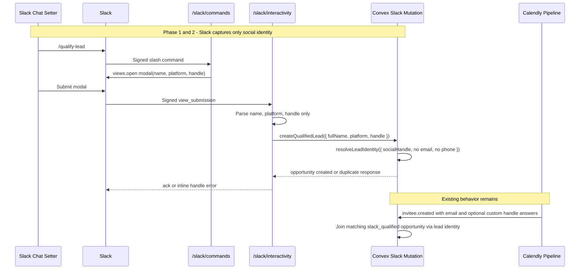

# Slack Form Contact Field Removal - Design Specification

**Version:** 0.1 (MVP)
**Status:** Draft
**Scope:** The `/qualify-lead` Slack modal currently asks chat setters for email and phone even though they do not have that information. End state: the Slack qualification flow captures only full name, social platform, and social handle, and no Slack-specific parser, validator, mutation contract, QA step, or design plan still depends on Slack-supplied email or phone.
**Prerequisite:** Slack Bot v1 write path is live enough that `/qualify-lead` creates `source: "slack_qualified"` opportunities. No schema migration is required for the planned code-only removal.
**Related plan:** `plans/slack-qualification-reporting/slack-qualification-reporting-design.md` should be implemented after this cleanup when doing the work sequentially. This plan preserves the opportunity attribution contract that reporting consumes.

---

## Table of Contents

1. [Goals & Non-Goals](#1-goals--non-goals)
2. [Actors & Roles](#2-actors--roles)
3. [End-to-End Flow Overview](#3-end-to-end-flow-overview)
4. [Phase 1: Remove Contact Fields From the Slack Contract](#4-phase-1-remove-contact-fields-from-the-slack-contract)
5. [Phase 2: Remove Backend Contact-Field Branches](#5-phase-2-remove-backend-contact-field-branches)
6. [Phase 3: Update Plans, QA, and Production Checks](#6-phase-3-update-plans-qa-and-production-checks)
7. [Phase 4: Data Audit and Cleanup Decision](#7-phase-4-data-audit-and-cleanup-decision)
8. [Data Model](#8-data-model)
9. [Convex Function Architecture](#9-convex-function-architecture)
10. [Routing & Authorization](#10-routing--authorization)
11. [Security Considerations](#11-security-considerations)
12. [Error Handling & Edge Cases](#12-error-handling--edge-cases)
13. [Open Questions](#13-open-questions)
14. [Dependencies](#14-dependencies)
15. [Applicable Skills](#15-applicable-skills)

---

## 1. Goals & Non-Goals

### Goals

- Remove `email` and `phone` blocks from the `/qualify-lead` Block Kit modal.
- Remove Slack submission parsing, validation, mutation args, and resolver forwarding for Slack-supplied `email` and `phone`.
- Make the Slack qualification identity contract explicit: `fullName`, `platform`, and `handle` are the only user-entered fields.
- Keep the Calendly join behavior anchored on social handles; Calendly can still backfill `lead.email` when a later booking arrives.
- Update Slackbot plans and QA checklists so no future implementer re-adds email or phone paths by following stale documentation.
- Preserve generic CRM contact-field support for non-Slack flows.
- Preserve reporting attribution: every successful Slack qualification must still write `opportunities.source = "slack_qualified"` and `qualifiedBy.{slackUserId, slackTeamId, submittedAt}`.

### Non-Goals

- Removing `leads.email`, `leads.phone`, `leadIdentifiers.type = "email"`, or `leadIdentifiers.type = "phone"` from the global data model. Those are still used by Calendly, reminders, meeting details, and CRM contact surfaces.
- Removing email backfill from the Calendly webhook path. Slack-created leads may still gain email later from a real booking.
- Adding new Slack modal fields such as notes, lead source, or qualification comments. Mauro feedback only covers removing unhelpful questions.
- Building the "who qualified leads in a 24-hour bucket" report. That is covered by `plans/slack-qualification-reporting/slack-qualification-reporting-design.md`.
- Adding or modifying reporting aggregate components, quota fields, report routes, or aggregate backfill logic. The reporting plan owns those changes after this cleanup is complete.

---

## 2. Actors & Roles

| Actor | Identity | Auth Method | Key Permissions |
|---|---|---|---|
| Slack chat setter | Any human user in the tenant's connected Slack workspace | Slack slash command and signed Slack interactivity payload | Opens `/qualify-lead`, enters name, platform, and handle |
| Tenant admin or owner | CRM user with `tenant_master` or `tenant_admin` role | WorkOS AuthKit, member of tenant org | Installs Slack app, configures channels, reviews Slack-qualified leads |
| Convex Slack backend | Server-side Convex HTTP actions and mutations | Slack HMAC verification plus tenant installation lookup | Verifies Slack payloads, resolves lead identity, writes opportunities |
| Calendly pipeline backend | Existing webhook processor | Calendly signature verification and tenant token/config lookup | Later joins bookings to Slack-qualified opportunities and may backfill email |

---

## 3. End-to-End Flow Overview



> **Product decision:** The Slack form should model what chat setters actually know. Email and phone belong to Calendly/CRM contact collection, not Slack qualification.

---

## 4. Phase 1: Remove Contact Fields From the Slack Contract

### 4.1 Modal Shape

Update `buildQualifyLeadModal` so the modal has exactly three input blocks: `full_name`, `platform`, and `handle`.

```typescript
// Path: convex/lib/slackBlockKit.ts
export function buildQualifyLeadModal(
  meta: QualifyLeadModalMetadata,
): ModalView {
  return {
    type: "modal",
    callback_id: "qualify_lead_submit",
    private_metadata: JSON.stringify(meta),
    title: { type: "plain_text", text: "Qualify a Lead" },
    submit: { type: "plain_text", text: "Create lead" },
    close: { type: "plain_text", text: "Cancel" },
    blocks: [
      fullNameInputBlock,
      socialPlatformSelectBlock,
      socialHandleInputBlock,
    ],
  };
}
```

Remove these Slack-only block IDs from the modal:

| Removed block | Current purpose | Replacement |
|---|---|---|
| `email` | Optional Slack-entered email | None. Calendly booking supplies verified email later. |
| `phone` | Optional Slack-entered phone | None. CRM/closer flows own phone data. |

### 4.2 Parser Contract

Remove `email` and `phone` from `ParsedQualifyLeadSubmission`.

```typescript
// Path: convex/lib/slackBlockKit.ts
export type ParsedQualifyLeadSubmission = QualifyLeadModalMetadata & {
  fullName: string;
  platform: SocialPlatform;
  handle: string;
};

export function parseQualifyLeadSubmission(
  view: unknown,
): ParsedQualifyLeadSubmission | null {
  if (!isSubmittedView(view)) return null;

  const meta = parseMetadata(view.private_metadata);
  if (!meta) return null;

  const values = view.state?.values;
  const fullName = getStringValue(values, "full_name")?.trim() ?? "";
  const platformRaw = values?.platform?.v?.selected_option?.value;
  const handle = getStringValue(values, "handle")?.trim() ?? "";

  if (!isSocialPlatform(platformRaw)) return null;
  return { ...meta, fullName, platform: platformRaw, handle };
}
```

> **Dead-code rule:** After this phase, `rg -n 'getStringValue\\(values, "(email|phone)"|block_id: "(email|phone)"|email_text_input' convex/lib/slackBlockKit.ts` must return no matches.

---

## 5. Phase 2: Remove Backend Contact-Field Branches

### 5.1 Interactivity Handler

Delete the Slack-specific email validator and stop passing contact fields into the create mutation.

```typescript
// Path: convex/slack/interactivity.ts
const fieldErrors: Record<string, string> = {};
if (parsed.fullName.length === 0) {
  fieldErrors.full_name = "Required";
}
if (parsed.handle.length === 0) {
  fieldErrors.handle = "Required";
}

result = await ctx.runMutation(internal.slack.createQualifiedLead.create, {
  tenantId: parsed.tenantId,
  installationId: installation._id,
  fullName: parsed.fullName,
  platform: parsed.platform,
  handle: parsed.handle,
  qualifiedBy: {
    slackUserId: parsed.slackUserId,
    slackTeamId: parsed.teamId,
    submittedAt: Date.now(),
  },
});
```

Delete `looksLikeEmail()` from `convex/slack/interactivity.ts`.

Also remove `resolvedVia` from the `CreateQualifiedLeadResult` type in this file unless a caller uses it for behavior. Today it is only logged, and keeping `"email" | "phone"` in the Slack interactivity result type would be stale after the form removal.

### 5.2 Create Mutation Contract

Remove `email` and `phone` validators from `convex/slack/createQualifiedLead.ts` and call `resolveLeadIdentity` with only the social handle.

```typescript
// Path: convex/slack/createQualifiedLead.ts
export const create = internalMutation({
  args: {
    tenantId: v.id("tenants"),
    installationId: v.id("slackInstallations"),
    fullName: v.string(),
    platform: socialPlatformValidator,
    handle: v.string(),
    qualifiedBy: v.object({
      slackUserId: v.string(),
      slackTeamId: v.string(),
      submittedAt: v.number(),
    }),
  },
  handler: async (ctx, args) => {
    const now = Date.now();
    const resolution = await resolveLeadIdentity(ctx, {
      tenantId: args.tenantId,
      socialHandle: { platform: args.platform, rawValue: args.handle },
      fullName: args.fullName,
      identifierSource: "slack_qualified",
      createIfMissing: true,
      createIdentifiers: true,
      createdAt: now,
    });
    // Existing dedup, opportunity insert, reporting hook, stats, events,
    // and notification scheduling stay.
  },
});
```

> **Boundary decision:** Do not remove `email` or `phone` support from `resolveLeadIdentity`. That function is shared by Calendly and non-Slack paths. The removal is at the Slack caller boundary.

> **Reporting compatibility:** Do not change the successful opportunity write shape while removing contact args. It must keep `source: "slack_qualified"`, `status: "qualified_pending"`, `qualifiedBy`, and the existing `insertOpportunityAggregate(ctx, opportunityId)` call so `plans/slack-qualification-reporting/slack-qualification-reporting-design.md` can attach its aggregate dual-write without reworking the Slack flow.

### 5.3 Raw Slack Event Redaction

`rawEventsAudit` should keep generic PII redaction for keys named `email` and `phone`, because Slack profile/event payloads can still contain PII-like keys in future scopes or unexpected payloads. The form-specific sensitive block list should no longer suggest active email/phone modal blocks.

```typescript
// Path: convex/slack/rawEventsAudit.ts
const SENSITIVE_MODAL_BLOCK_IDS = new Set(["full_name"]);
```

Run a before/after redaction check with a synthetic old payload containing `values.email.v.value` and `values.phone.v.value`. If the form-block IDs are removed from the sensitive set, document that old-shape payloads are outside the new contract. If privacy review wants legacy redaction retained until `rawSlackEvents` 30-day retention expires, keep `email` and `phone` in the set with an explicit `legacy_contact_blocks` comment and schedule a follow-up removal.

---

## 6. Phase 3: Update Plans, QA, and Production Checks

Update the planning artifacts that currently describe or test the five-field modal.

| File | Required update |
|---|---|
| `plans/slackbot-v1/slackbot-design.md` | Change "five-field" modal references to three fields; remove email/phone parser examples and email happy-path QA. |
| `plans/slackbot-v1/phases/phase2.md` | Replace acceptance criteria for five blocks with `full_name`, `platform`, `handle`; remove invalid-email validation step. |
| `plans/slackbot-v1/phases/phase3.md` | Update create mutation examples so Slack calls pass only social handle, not optional email/phone. |
| `plans/slackbot-v1/phases/phase4.md` | Replace Slack-email happy path with social-handle-only Slack qualification followed by Calendly booking that supplies matching custom handle answers. Keep Calendly-only fresh-email regression. |
| `plans/slackbot-v1/slackbot-production-pass.md` | Remove invalid-email QA and "known social handle/email" wording; assert the modal has no email or phone questions. |
| `brainstorming/slackbot.md` | Archive-only update optional. If touched, mark old five-field examples as superseded by this design. |

New QA matrix:

| Scenario | Expected result |
|---|---|
| `/qualify-lead` opens modal | Only Full name, Social platform, Social handle are visible. |
| Missing full name | Inline error on `full_name`. |
| Missing handle | Inline error on `handle`. |
| Valid social handle | Modal closes; one `slack_qualified` / `qualified_pending` opportunity is created. |
| Duplicate same handle | Inline handle error says the lead was already qualified. |
| Calendly join after Slack qualification | Booking joins via social handle and may backfill `lead.email` from Calendly. |
| Fresh Calendly booking without Slack qualification | Existing Calendly path still creates a Calendly-sourced opportunity. |

---

## 7. Phase 4: Data Audit and Cleanup Decision

The code removal does not require a schema or data migration. Existing records remain valid.

Before production deployment, run a read-only audit against the dogfood tenant:

```bash
npx convex data leadIdentifiers
npx convex data leads
```

Look specifically for historical Slack-origin contact identifiers:

| Data shape | Action |
|---|---|
| `leadIdentifiers.source = "slack_qualified"` and `type = "email"` | Leave intact unless product explicitly wants historical Slack-entered contact values purged. |
| `leadIdentifiers.source = "slack_qualified"` and `type = "phone"` | Leave intact unless product explicitly wants historical Slack-entered contact values purged. |
| `leads.phone` populated only by Slack qualification | Do not delete in this implementation without a migration plan. |

If product asks to purge historical Slack-origin contact values, that becomes a separate data migration and must use `convex-migration-helper`. The cleanup would need a dry-run count, tenant scoping, batched deletes/patches, and confirmation that no non-Slack CRM contact data is removed.

---

## 8. Data Model

No schema changes are planned.

```typescript
// Path: convex/schema.ts
leads: defineTable({
  // ... existing fields ...
  email: v.optional(v.string()),  // still needed for Calendly and CRM contact data
  phone: v.optional(v.string()),  // still needed outside Slack qualification
});

leadIdentifiers: defineTable({
  // ... existing fields ...
  type: v.union(
    v.literal("email"),
    v.literal("phone"),
    // social platform literals stay
  ),
  source: v.union(
    // ... existing sources ...
    v.literal("slack_qualified"),
  ),
});
```

> **Migration stance:** This is a caller-contract removal, not a Convex schema narrowing. Narrowing global `leads` or `leadIdentifiers` would break non-Slack product areas and is explicitly out of scope.

---

## 9. Convex Function Architecture

```
convex/
├── lib/
│   └── slackBlockKit.ts            # MODIFIED: modal has 3 fields; parser returns no email/phone
├── slack/
│   ├── interactivity.ts            # MODIFIED: no email validation or contact args
│   ├── createQualifiedLead.ts      # MODIFIED: no email/phone args; social-handle-only resolver call
│   └── rawEventsAudit.ts           # MODIFIED: remove or explicitly legacy-comment form block contact redaction
├── reporting/
│   └── writeHooks.ts               # UNCHANGED: keep existing opportunity aggregate hook call site intact
├── leads/
│   └── identityResolution.ts       # UNCHANGED: shared resolver keeps email/phone for non-Slack callers
└── schema.ts                       # UNCHANGED
```

---

## 10. Routing & Authorization

No Next.js routing changes are required.

Slack request authorization remains:

| Route | Auth check | Change |
|---|---|---|
| `/slack/commands` | Slack HMAC signature and active installation lookup | None |
| `/slack/interactivity` | Slack HMAC signature, callback ID, metadata/installation tenant match | Contact fields removed after verification |
| `/api/slack/start` | Existing WorkOS workspace user role checks | None |

---

## 11. Security Considerations

### 11.1 Credential Security

No token or secret handling changes. Slack signing secret and bot tokens remain server-side only.

### 11.2 Multi-Tenant Isolation

No tenant isolation changes. The interactivity handler must continue to reject payloads where `payloadTeamId`, `payloadAppId`, or private metadata do not match the active installation.

### 11.3 Role-Based Data Access

| Data | Tenant admin/master | Closer | Slack chat setter |
|---|---|---|---|
| Slack installation settings | Full | None | None |
| Slack-qualified opportunity rows | Full | Own/assigned views only through existing CRM permissions | Creates through Slack only, no CRM read access |
| Slack submitter attribution | Full in admin reports | Limited by existing closer UI | Own Slack identity only through Slack |

### 11.4 Webhook and Interactivity Security

Slack HMAC verification is unchanged. Raw request bodies continue to be used only in memory for verification and hashing.

### 11.5 PII Reduction

Removing email and phone from the Slack form reduces unnecessary PII collection. Generic redaction for keys named `email` and `phone` should remain because it protects unexpected Slack payload shapes and future scopes.

---

## 12. Error Handling & Edge Cases

| Scenario | Detection | Recovery action | User-facing behavior |
|---|---|---|---|
| User submits old modal opened before deploy | Parser may see extra values, but ignores email/phone after Phase 1 | Treat as normal if required fields exist | Modal closes or shows existing required-field errors |
| Missing social handle | Existing field validation | Return Slack `response_action: "errors"` keyed to `handle` | Inline "Required" error |
| Invalid social platform | `parseQualifyLeadSubmission` returns `null` | Return parser error keyed to `handle` | Inline retry message |
| Duplicate lead by same normalized handle | Existing `createQualifiedLead` dedup guard | Return duplicate response | Inline "Already qualified by <@U...>" error |
| Calendly booking lacks matching handle answer | Existing join cannot resolve Slack-created lead by email | Calendly creates or reuses according to existing pipeline rules | No Slack-specific UI; metrics show no conversion join |
| Historical Slack-entered contact values exist | Read-only audit finds Slack-origin email/phone identifiers | Separate migration decision only if product wants purge | No user-facing change |

---

## 13. Open Questions

| # | Question | Current Thinking |
|---|---|---|
| 1 | Should we purge historical Slack-origin email/phone identifiers from the dogfood tenant? | Do not include in this code-removal implementation. If requested, use `convex-migration-helper` and run a tenant-scoped migration. |
| 2 | Should raw event redaction keep legacy `email`/`phone` modal block IDs for 30 days? | Prefer keeping generic key redaction permanently. For block-ID-specific redaction, either remove now with a contract note or keep a commented legacy branch until raw event retention expires. |
| 3 | Should Slack join QA still include an email-matching happy path? | No for Slack-origin qualification. Keep only Calendly fresh-email regression and social-handle join. |

---

## 14. Dependencies

### Related Plans

| Plan | Relationship | Sequencing |
|---|---|---|
| `plans/slack-qualification-reporting/slack-qualification-reporting-design.md` | Consumes attributed Slack qualification opportunities after this plan removes Slack-entered contact fields. It must not depend on Slack email/phone. | Implement after this cleanup when doing the work sequentially; then verify the report against the three-field Slack flow. |
| `plans/slackbot-v1/*` | Contains older Slack Bot v1 implementation and QA details that may still mention the five-field modal. | Update the listed Slackbot docs in Phase 3 before using them as implementation or QA references. |

### New Packages

| Package | Why | Runtime | Install |
|---|---|---|---|
| None | No dependency change | N/A | N/A |

### Already Installed

| Package | Used for |
|---|---|
| `@slack/types` | `ModalView` and Block Kit typings |
| `convex` | HTTP actions, internal mutations, validators |

### Environment Variables

| Variable | Where Set | Used By |
|---|---|---|
| `SLACK_SIGNING_SECRET` | Convex env | Slack HMAC verification |
| `SLACK_SIGNING_SECRET_PREVIOUS` | Convex env, optional | Slack signing secret rotation |

---

## 15. Applicable Skills

| Skill | When to Invoke | Phase |
|---|---|---|
| `convex-migration-helper` | Only if product decides to delete historical Slack-origin email/phone identifiers or narrow schema. Not needed for the planned code-only removal. | Phase 4 optional follow-up |

---

## Completion Checklist

- [x] `convex/lib/slackBlockKit.ts` has no email or phone modal blocks, parsed fields, or parser reads.
- [x] `convex/slack/interactivity.ts` has no `looksLikeEmail`, `fieldErrors.email`, or contact args in `createQualifiedLead.create`.
- [x] `convex/slack/createQualifiedLead.ts` has no `email` or `phone` validators and does not forward them to `resolveLeadIdentity`.
- [x] `convex/slack/createQualifiedLead.ts` still writes `source: "slack_qualified"`, `status: "qualified_pending"`, `qualifiedBy`, and still calls `insertOpportunityAggregate(ctx, opportunityId)`.
- [x] Slackbot plans and production QA no longer instruct testing invalid email or Slack email happy paths.
- [x] `plans/slack-qualification-reporting/slack-qualification-reporting-design.md` remains aligned with the three-field Slack flow and does not add Slack email/phone dependencies.
- [x] `pnpm tsc --noEmit` passes.
- [ ] Manual Slack QA confirms the modal asks only three questions.
