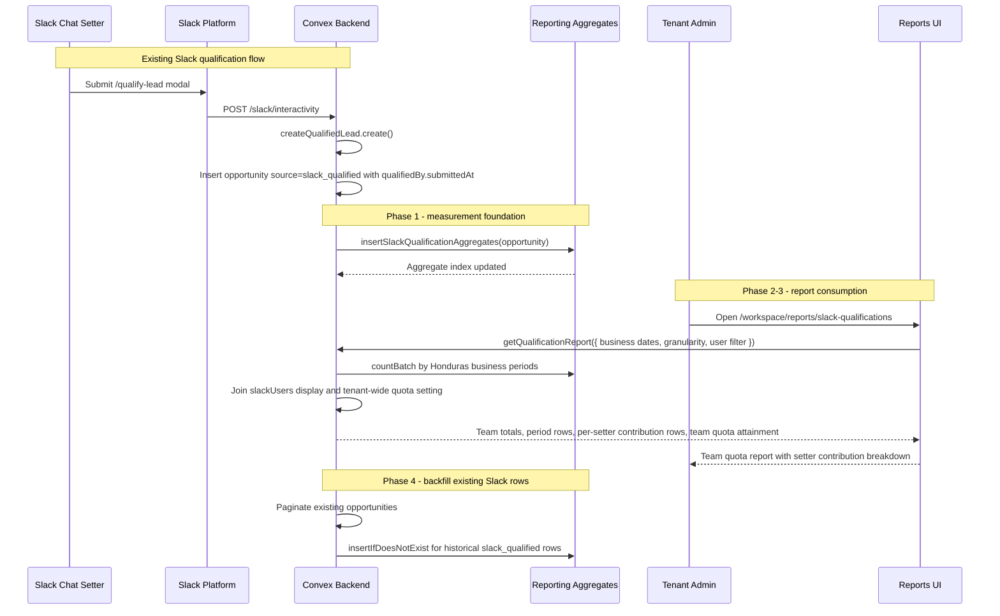

# Slack Qualification Reporting - Design Specification

**Version:** 0.1 (MVP)
**Status:** Draft
**Scope:** Slack lead qualification already creates tenant-scoped `slack_qualified` opportunities with `qualifiedBy` attribution. End state: tenant admins can open a dedicated reporting area that shows team-wide Slack qualification totals against one general daily team quota in Honduras 1am-to-1am business-day buckets, with day/week/month/date-range views and individual setter contribution breakdowns.
**Prerequisite:** Slack Bot v1 Phases 1-4 are live enough that `/qualify-lead` writes `opportunities.source = "slack_qualified"` and `opportunities.qualifiedBy.{slackUserId, slackTeamId, submittedAt}`. Existing Slack-user directory rows live in `slackUsers`.
**Related plan:** `plans/slack-form-contact-field-removal/slack-form-contact-field-removal-design.md` should land first when doing the work sequentially. This report intentionally consumes the final three-field Slack qualification contract and does not rely on Slack-supplied email or phone.

---

## Table of Contents

1. [Goals & Non-Goals](#1-goals--non-goals)
2. [Actors & Roles](#2-actors--roles)
3. [End-to-End Flow Overview](#3-end-to-end-flow-overview)
4. [Phase 1: Measurement Foundation](#4-phase-1-measurement-foundation)
5. [Phase 2: Reporting Queries](#5-phase-2-reporting-queries)
6. [Phase 3: Reporting UI](#6-phase-3-reporting-ui)
7. [Phase 4: Backfill, Verification, and Dashboard Bridge](#7-phase-4-backfill-verification-and-dashboard-bridge)
8. [Data Model](#8-data-model)
9. [Convex Function Architecture](#9-convex-function-architecture)
10. [Routing & Authorization](#10-routing--authorization)
11. [Security Considerations](#11-security-considerations)
12. [Error Handling & Edge Cases](#12-error-handling--edge-cases)
13. [Open Questions](#13-open-questions)
14. [Dependencies](#14-dependencies)
15. [Applicable Skills](#15-applicable-skills)

---

## 1. Goals & Non-Goals

### Goals

- Count Slack-qualified leads by the Slack user who submitted `/qualify-lead`.
- Use the canonical qualification timestamp: `opportunities.qualifiedBy.submittedAt`.
- Define a "day" as Honduras time from 1:00am inclusive to 1:00am the next day exclusive. For current Honduras time (`America/Tegucigalpa`, UTC-6), the UTC window is 07:00 to 07:00.
- Support day, week, month, and arbitrary date range reporting without scanning unbounded opportunity rows.
- Let tenant admins set one tenant-wide daily qualification quota and view team quota attainment for the selected range.
- Let tenant admins review each Slack setter's contribution to the team total, including selected-setter drilldowns, without assigning individual quotas.
- Preserve the current Slack dashboard cards while adding a deeper report under `/workspace/reports`.

### Cross-Plan Compatibility

This plan is compatible with Slack form contact-field removal as long as the Slack write path keeps the reporting attribution contract intact:

- `convex/slack/createQualifiedLead.ts` still inserts `opportunities.source = "slack_qualified"`.
- The inserted opportunity still includes `qualifiedBy.slackUserId`, `qualifiedBy.slackTeamId`, and `qualifiedBy.submittedAt`.
- The existing post-insert reporting hook call, `insertOpportunityAggregate(ctx, opportunityId)`, remains in the Slack qualification mutation so the new aggregate dual-write can attach there.
- No reporting query, aggregate, or UI in this plan should read Slack-entered `email` or `phone`; Calendly-owned contact backfill remains outside this report.

Recommended sequence for solo implementation: complete the contact-field removal plan first, verify the three-field Slack modal still creates attributed `slack_qualified` opportunities, then implement this reporting plan.

### Non-Goals (deferred)

- Slack-to-CRM user identity mapping as an authorization primitive. `slackUsers.crmUserId` remains optional display metadata.
- Slack-side report commands such as `/my-quota` or Slack App Home dashboards. Defer to Slack Bot v1.5.
- Export, scheduled email reports, and PDF summaries. Defer until the report shape is validated.
- Tenant-configurable business timezone. MVP hard-codes the Honduras business-day rule requested here.
- Historical manual edits to qualification attribution. MVP treats `qualifiedBy` as immutable after creation.
- Reintroducing Slack-entered `email` or `phone` as report dimensions, filters, or matching keys. Contact collection remains owned by Calendly and CRM surfaces.
- Individual Slack setter quotas. MVP uses one general tenant-wide quota for the whole Slack qualification team.

---

## 2. Actors & Roles

| Actor | Identity | Auth Method | Key Permissions |
|---|---|---|---|
| **Tenant Master** | CRM `users.role = "tenant_master"` | WorkOS AuthKit, member of tenant org | View all setter qualification reports; set or clear the team-wide daily quota. |
| **Tenant Admin** | CRM `users.role = "tenant_admin"` | WorkOS AuthKit, member of tenant org | View all setter qualification reports; set or clear the team-wide daily quota. |
| **Closer** | CRM `users.role = "closer"` | WorkOS AuthKit, member of tenant org | No access to `/workspace/reports/*` in current app policy. |
| **Slack Chat Setter** | Slack `slackUsers.slackUserId` scoped to a tenant installation | Slack session through `/qualify-lead`; may have no CRM account | Qualifies leads in Slack. Appears in reports by Slack display name and immutable Slack ID. |
| **System** | Convex internal functions | Server-only | Maintains reporting aggregates and backfills aggregate rows. |

### CRM Role <-> Slack Identity Mapping

| CRM `users.role` | Slack-side equivalent | Notes |
|---|---|---|
| `tenant_master` / `tenant_admin` | None required | Admins manage and view reports from CRM. They do not need to be Slack submitters. |
| `closer` | None required | Closers can be unrelated to Slack chat setters. |
| Any Slack user | `slackUsers.slackUserId` | Tenant-scoped directory row used for report display and contribution attribution. |

---

## 3. End-to-End Flow Overview



---

## 4. Phase 1: Measurement Foundation

### 4.1 Canonical Count Source

The source of truth is a Slack-created opportunity row:

- `opportunities.source === "slack_qualified"`
- `opportunities.qualifiedBy.slackUserId` is present
- `opportunities.qualifiedBy.submittedAt` is the qualification timestamp
- Slack modal contact fields are not part of the count source. After contact-field removal, the reporting source remains the same attributed opportunity row.

`createdAt` remains a fallback only for legacy rows that somehow lack `submittedAt`. The current `convex/slack/createQualifiedLead.ts` path writes both at nearly the same time, but reporting should use the domain event time from the Slack submission, not the database insertion time.

> **Runtime decision:** Count qualifications, not leads. A duplicate `/qualify-lead` attempt currently returns an inline error and does not create a new opportunity, so counting successful Slack-sourced opportunity inserts matches "managed to qualify" without needing a second event table.

### 4.2 Honduras Business-Day Helper

Add one shared helper for server queries and client date controls. Honduras currently has no daylight saving shift, so the MVP can use a fixed UTC-6 offset and a 1am local start. Keep the IANA name in constants so a future tenant-timezone feature has a clear upgrade path.

```typescript
// Path: convex/reporting/lib/hondurasBusinessTime.ts
import { v } from "convex/values";

const HOUR_MS = 60 * 60 * 1000;
const DAY_MS = 24 * HOUR_MS;

export const HONDURAS_TIME_ZONE = "America/Tegucigalpa";
export const HONDURAS_UTC_OFFSET_HOURS = -6;
export const BUSINESS_DAY_START_HOUR = 1;

const BUSINESS_DAY_UTC_START_HOUR =
  BUSINESS_DAY_START_HOUR - HONDURAS_UTC_OFFSET_HOURS; // 7

export type ReportGranularity = "day" | "week" | "month";
export const reportGranularityValidator = v.union(
  v.literal("day"),
  v.literal("week"),
  v.literal("month"),
);

export function businessDateToUtcStart(dateKey: string): number {
  const [yearRaw, monthRaw, dayRaw] = dateKey.split("-");
  const year = Number(yearRaw);
  const month = Number(monthRaw);
  const day = Number(dayRaw);

  if (!year || !month || !day) {
    throw new Error("Invalid business date. Expected YYYY-MM-DD.");
  }

  return Date.UTC(year, month - 1, day, BUSINESS_DAY_UTC_START_HOUR);
}

export function timestampToBusinessDateKey(timestamp: number): string {
  const shifted = new Date(
    timestamp - BUSINESS_DAY_UTC_START_HOUR * HOUR_MS,
  );
  return [
    shifted.getUTCFullYear(),
    pad2(shifted.getUTCMonth() + 1),
    pad2(shifted.getUTCDate()),
  ].join("-");
}

export function addBusinessDays(dateKey: string, days: number): string {
  const start = businessDateToUtcStart(dateKey);
  return timestampToBusinessDateKey(start + days * DAY_MS);
}

function pad2(value: number): string {
  return String(value).padStart(2, "0");
}
```

### 4.3 Aggregate Components

The existing `convex/slack/metrics.ts` scans up to 1,000 opportunity rows for a rolling 30-day dashboard. This report needs exact counts across arbitrary ranges, so add two `@convex-dev/aggregate` components:

- `slackQualificationsByUser`: count by `(slackUserId, submittedAt)`
- `slackQualificationsByTime`: count by `submittedAt` for team totals and charts

Only eligible Slack-qualified opportunities are inserted into these aggregates.

```typescript
// Path: convex/convex.config.ts
import aggregate from "@convex-dev/aggregate/convex.config";
import { defineApp } from "convex/server";

const app = defineApp();

// ... existing components ...
app.use(aggregate, { name: "slackQualificationsByUser" });
app.use(aggregate, { name: "slackQualificationsByTime" });

export default app;
```

```typescript
// Path: convex/reporting/aggregates.ts
import { TableAggregate } from "@convex-dev/aggregate";
import { components } from "../_generated/api";
import type { DataModel, Doc, Id } from "../_generated/dataModel";

function slackQualificationSubmittedAt(doc: Doc<"opportunities">): number {
  return doc.qualifiedBy?.submittedAt ?? doc.createdAt;
}

export function isSlackQualificationAggregateEligible(
  doc: Doc<"opportunities">,
): boolean {
  return doc.source === "slack_qualified" && doc.qualifiedBy !== undefined;
}

export const slackQualificationsByUser = new TableAggregate<{
  Namespace: Id<"tenants">;
  Key: [string, number];
  DataModel: DataModel;
  TableName: "opportunities";
}>(components.slackQualificationsByUser, {
  namespace: (doc) => doc.tenantId,
  sortKey: (doc) => [
    doc.qualifiedBy?.slackUserId ?? "",
    slackQualificationSubmittedAt(doc),
  ],
});

export const slackQualificationsByTime = new TableAggregate<{
  Namespace: Id<"tenants">;
  Key: number;
  DataModel: DataModel;
  TableName: "opportunities";
}>(components.slackQualificationsByTime, {
  namespace: (doc) => doc.tenantId,
  sortKey: (doc) => slackQualificationSubmittedAt(doc),
});
```

### 4.4 Write Hooks

Extend the existing reporting write-hook pattern. The Slack qualification aggregate must be updated on insert, replace, and delete. This is more robust than only touching `convex/slack/createQualifiedLead.ts`, because any future repair mutation that patches a Slack-qualified opportunity can stay correct through the shared hook.

> **Contact-removal compatibility:** If `plans/slack-form-contact-field-removal/slack-form-contact-field-removal-design.md` is implemented first, `createQualifiedLead.create` no longer accepts or forwards `email` and `phone`. Do not restore those args for reporting. Preserve only the opportunity insert shape, `qualifiedBy`, and the existing call to `insertOpportunityAggregate(ctx, opportunityId)`.

```typescript
// Path: convex/reporting/writeHooks.ts
import type { Doc, Id } from "../_generated/dataModel";
import type { MutationCtx } from "../_generated/server";
import {
  isSlackQualificationAggregateEligible,
  opportunityByStatus,
  slackQualificationsByTime,
  slackQualificationsByUser,
} from "./aggregates";

export async function insertOpportunityAggregate(
  ctx: MutationCtx,
  opportunityId: Id<"opportunities">,
): Promise<Doc<"opportunities">> {
  const opportunity = await getOpportunityOrThrow(ctx, opportunityId);
  await opportunityByStatus.insert(ctx, opportunity);
  if (isSlackQualificationAggregateEligible(opportunity)) {
    await slackQualificationsByUser.insert(ctx, opportunity);
    await slackQualificationsByTime.insert(ctx, opportunity);
  }
  await upsertOpportunitySearchProjection(ctx, opportunityId);
  return opportunity;
}

export async function replaceOpportunityAggregate(
  ctx: MutationCtx,
  oldOpportunity: Doc<"opportunities">,
  opportunityId: Id<"opportunities">,
): Promise<Doc<"opportunities">> {
  const opportunity = await getOpportunityOrThrow(ctx, opportunityId);
  await opportunityByStatus.replace(ctx, oldOpportunity, opportunity);

  const oldEligible = isSlackQualificationAggregateEligible(oldOpportunity);
  const nextEligible = isSlackQualificationAggregateEligible(opportunity);
  if (oldEligible && nextEligible) {
    await slackQualificationsByUser.replace(ctx, oldOpportunity, opportunity);
    await slackQualificationsByTime.replace(ctx, oldOpportunity, opportunity);
  } else if (oldEligible) {
    await slackQualificationsByUser.deleteIfExists(ctx, oldOpportunity);
    await slackQualificationsByTime.deleteIfExists(ctx, oldOpportunity);
  } else if (nextEligible) {
    await slackQualificationsByUser.insertIfDoesNotExist(ctx, opportunity);
    await slackQualificationsByTime.insertIfDoesNotExist(ctx, opportunity);
  }

  await upsertOpportunitySearchProjection(ctx, opportunityId);
  return opportunity;
}

export async function deleteOpportunityAggregate(
  ctx: MutationCtx,
  oldOpportunity: Doc<"opportunities">,
): Promise<void> {
  await opportunityByStatus.deleteIfExists(ctx, oldOpportunity);
  if (isSlackQualificationAggregateEligible(oldOpportunity)) {
    await slackQualificationsByUser.deleteIfExists(ctx, oldOpportunity);
    await slackQualificationsByTime.deleteIfExists(ctx, oldOpportunity);
  }
  await deleteOpportunitySearchProjection(ctx, oldOpportunity._id);
}
```

> **Migration decision:** This is a widen-and-backfill rollout for the aggregates, but it does not change the validity of existing source documents. Deploy the new aggregate components and dual-write hooks first, then backfill existing `slack_qualified` opportunities into the new aggregate. The team-wide quota field is optional, so it is a safe widen-only schema change. If an earlier per-setter quota field has already been deployed, treat that field as deprecated and ignore it until a separate cleanup migration can remove stored values and narrow the schema.

---

## 5. Phase 2: Reporting Queries

### 5.1 Query Contract

Create a new reporting module rather than expanding `convex/slack/metrics.ts`. The existing Slack metrics file backs dashboard cards; this report is a first-class reporting area and should live under `convex/reporting`.

```typescript
// Path: convex/reporting/slackQualifications.ts
import { v } from "convex/values";
import { query } from "../_generated/server";
import { requireTenantUser } from "../requireTenantUser";
import {
  buildBusinessPeriods,
  businessDateToUtcStart,
  reportGranularityValidator,
} from "./lib/hondurasBusinessTime";
import {
  slackQualificationsByTime,
  slackQualificationsByUser,
} from "./aggregates";

export const getQualificationReport = query({
  args: {
    startBusinessDate: v.string(),
    endBusinessDateExclusive: v.string(),
    granularity: reportGranularityValidator,
    slackUserId: v.optional(v.string()),
  },
  handler: async (ctx, args) => {
    const { tenantId } = await requireTenantUser(ctx, [
      "tenant_master",
      "tenant_admin",
    ]);
    const tenant = await ctx.db.get(tenantId);
    if (!tenant) throw new Error("Tenant not found");

    const periods = buildBusinessPeriods({
      startBusinessDate: args.startBusinessDate,
      endBusinessDateExclusive: args.endBusinessDateExclusive,
      granularity: args.granularity,
    });
    const teamDailyQuota = tenant.slackQualificationDailyTeamQuota ?? null;

    const setters = await listTenantSlackSetters(ctx, tenantId);
    const visibleSetters = args.slackUserId
      ? setters.filter((setter) => setter.slackUserId === args.slackUserId)
      : setters;

    const periodCounts = await countPeriods(ctx, {
      tenantId,
      periods,
      slackUserId: args.slackUserId,
      teamDailyQuota,
    });
    const userCounts = await countUsersForRange(ctx, {
      tenantId,
      setters: visibleSetters,
      start: businessDateToUtcStart(args.startBusinessDate),
      end: businessDateToUtcStart(args.endBusinessDateExclusive),
    });

    return {
      timezone: "America/Tegucigalpa",
      businessDayStartsAtHour: 1,
      startBusinessDate: args.startBusinessDate,
      endBusinessDateExclusive: args.endBusinessDateExclusive,
      granularity: args.granularity,
      teamQuota: {
        dailyTeamQualificationQuota: teamDailyQuota,
      },
      periods: periodCounts,
      users: userCounts,
      totals: summarizeReport({
        periodCounts,
        userCounts,
        teamDailyQuota,
      }),
    };
  },
});
```

### 5.2 Period Counting

Use `slackQualificationsByTime` when no setter is selected and `slackQualificationsByUser` when the admin filters to one setter. This avoids an all-users-by-all-days count explosion for the common team-total chart. Quota math only applies to the team-total rows; selected-setter period rows are contribution drilldowns and must not be compared against the team quota.

```typescript
// Path: convex/reporting/slackQualifications.ts
async function countPeriods(
  ctx: QueryCtx,
  args: {
    tenantId: Id<"tenants">;
    periods: Array<{ key: string; start: number; end: number; quotaDays: number }>;
    slackUserId?: string;
    teamDailyQuota: number | null;
  },
) {
  if (args.slackUserId) {
    const counts = await slackQualificationsByUser.countBatch(
      ctx,
      args.periods.map((period) => ({
        namespace: args.tenantId,
        bounds: {
          lower: {
            key: [args.slackUserId!, period.start],
            inclusive: true,
          },
          upper: {
            key: [args.slackUserId!, period.end],
            inclusive: false,
          },
        },
      })),
    );
    return args.periods.map((period, index) => ({
      ...period,
      qualifiedCount: counts[index] ?? 0,
      expectedTeamCount: null,
      teamQuotaAttainment: null,
    }));
  }

  const counts = await slackQualificationsByTime.countBatch(
    ctx,
    args.periods.map((period) => ({
      namespace: args.tenantId,
      bounds: {
        lower: { key: period.start, inclusive: true },
        upper: { key: period.end, inclusive: false },
      },
    })),
  );

  return args.periods.map((period, index) => {
    const qualifiedCount = counts[index] ?? 0;
    const expectedTeamCount =
      args.teamDailyQuota === null ? null : args.teamDailyQuota * period.quotaDays;
    return {
      ...period,
      qualifiedCount,
      expectedTeamCount,
      teamQuotaAttainment:
        expectedTeamCount !== null && expectedTeamCount > 0
          ? qualifiedCount / expectedTeamCount
          : null,
    };
  });
}
```

`summarizeReport()` should return team-level quota metrics only: `totalQualified`, `businessDayCount`, `averagePerBusinessDay`, `dailyTeamQualificationQuota`, `expectedTeamQualified`, `teamQuotaDelta`, `teamQuotaAttainment`, `underQuotaPeriods`, and `setterCount`. It must not return `configuredSetterCount`, `underQuotaSetters`, or any other metric that implies individual quota ownership.

### 5.3 Team Quota Setting and Slack Setter Directory

Add one optional daily team quota to `tenants`. This is a tenant-level reporting setting, not a Slack-user setting. The `slackUsers` table stays responsible for mutable Slack display metadata and contribution attribution only.

```typescript
// Path: convex/reporting/slackQualifications.ts
import { v } from "convex/values";
import { mutation } from "../_generated/server";

const MAX_DAILY_TEAM_QUOTA = 5000;

export const setTeamDailyQuota = mutation({
  args: {
    dailyTeamQualificationQuota: v.union(v.number(), v.null()),
  },
  handler: async (ctx, args) => {
    const { tenantId } = await requireTenantUser(ctx, [
      "tenant_master",
      "tenant_admin",
    ]);

    if (
      args.dailyTeamQualificationQuota !== null &&
      (!Number.isInteger(args.dailyTeamQualificationQuota) ||
        args.dailyTeamQualificationQuota < 0 ||
        args.dailyTeamQualificationQuota > MAX_DAILY_TEAM_QUOTA)
    ) {
      throw new Error(
        `Daily team quota must be an integer between 0 and ${MAX_DAILY_TEAM_QUOTA}`,
      );
    }

    await ctx.db.patch(tenantId, {
      slackQualificationDailyTeamQuota:
        args.dailyTeamQualificationQuota ?? undefined,
    });

    return {
      dailyTeamQualificationQuota: args.dailyTeamQualificationQuota,
    };
  },
});
```

> **Data decision:** Quotas are optional and tenant-wide. A missing quota means "track team count and setter contribution only", not zero. Individual setter quota fields must not drive report math. If `slackUsers.dailyQualificationQuota` already exists from an earlier draft or deploy, leave it optional, stop reading/writing it, and remove stored values/schema in a later cleanup migration only after the team-wide path is verified.

### 5.4 Setter Contribution Rows

Per-setter rows explain who contributed to the visible total. They do not carry quota fields, expected counts, deltas, or attainment. In the all-setters view, `contributionShare` is the setter's share of the team total for the selected range. In a selected-setter drilldown, the row simply describes that setter's count.

```typescript
// Path: convex/reporting/slackQualifications.ts
import type { Doc, Id } from "../_generated/dataModel";
import type { QueryCtx } from "../_generated/server";

type SetterContributionRow = {
  slackUserId: string;
  slackTeamId: string;
  displayName: string;
  avatarUrl: string | null;
  isDeleted: boolean;
  totalQualified: number;
  contributionShare: number | null;
  lastQualifiedAt: number | null;
};

async function countUsersForRange(
  ctx: QueryCtx,
  args: {
    tenantId: Id<"tenants">;
    setters: Doc<"slackUsers">[];
    start: number;
    end: number;
  },
): Promise<SetterContributionRow[]> {
  const countQueries = args.setters.map((setter) => ({
    namespace: args.tenantId,
    bounds: {
      lower: {
        key: [setter.slackUserId, args.start] as [string, number],
        inclusive: true,
      },
      upper: {
        key: [setter.slackUserId, args.end] as [string, number],
        inclusive: false,
      },
    },
  }));
  const counts = await slackQualificationsByUser.countBatch(ctx, countQueries);
  const visibleTotal = counts.reduce((sum, count) => sum + count, 0);

  return args.setters.map((setter, index) => {
    const totalQualified = counts[index] ?? 0;
    return {
      slackUserId: setter.slackUserId,
      slackTeamId: setter.slackTeamId,
      displayName: getSlackDisplayName(setter),
      avatarUrl: setter.avatarUrl ?? null,
      isDeleted: setter.isDeleted,
      totalQualified,
      contributionShare:
        visibleTotal > 0 ? totalQualified / visibleTotal : null,
      lastQualifiedAt: null, // Fill via aggregate atBatch when count > 0.
    };
  });
}
```

---

## 6. Phase 3: Reporting UI

### 6.1 Route and Page Pattern

Add the report under the existing admin-only reports layout. Keep the repo's established page pattern: thin RSC page with `unstable_instant = false`, client component for hooks and filters, and a `loading.tsx` skeleton.

```tsx
// Path: app/workspace/reports/slack-qualifications/page.tsx
import { SlackQualificationReportPageClient } from "./_components/slack-qualification-report-page-client";

export const unstable_instant = false;

export default function SlackQualificationReportPage() {
  return <SlackQualificationReportPageClient />;
}
```

```tsx
// Path: app/workspace/_components/workspace-shell-client.tsx
import { MessageSquareTextIcon } from "lucide-react";

const reportNavItems: NavItem[] = [
  { href: "/workspace/reports/team", label: "Team Performance", icon: BarChart3Icon },
  // ... existing report routes ...
  {
    href: "/workspace/reports/slack-qualifications",
    label: "Slack Qualifications",
    icon: MessageSquareTextIcon,
  },
];
```

### 6.2 Controls

The existing `ReportDateControls` uses the viewer's local midnight. This report needs business dates in Honduras time, so it should use a specialized wrapper that sends `YYYY-MM-DD` business date keys to Convex.

Controls:

| Control | Type | Notes |
|---|---|---|
| Quick pick | Buttons | Today, Yesterday, This Week, This Month, Last 30 Business Days. |
| Date range | Calendar popover | Displays date labels as Honduras business dates. Sends exclusive end date key. |
| Granularity | Select | Day, Week, Month. |
| Setter | Select | All setters plus each `slackUsers` row. |
| Team quota edit | Dialog or inline action | One daily tenant-wide target. Admin-only, already guaranteed by route and mutation guard. |

```tsx
// Path: app/workspace/reports/slack-qualifications/_components/slack-qualification-report-page-client.tsx
"use client";

import { useState } from "react";
import { useQuery } from "convex/react";
import { api } from "@/convex/_generated/api";
import { usePageTitle } from "@/hooks/use-page-title";
import { SetterQualificationControls } from "./setter-qualification-controls";
import { SetterContributionTable } from "./setter-contribution-table";
import { SetterQualificationTrend } from "./setter-qualification-trend";
import { SetterQualificationSummaryCards } from "./setter-qualification-summary-cards";
import { TeamQuotaDialog } from "./team-quota-dialog";

export function SlackQualificationReportPageClient() {
  usePageTitle("Slack Qualifications - Reports");

  const [filters, setFilters] = useState({
    startBusinessDate: getCurrentHondurasBusinessDate(),
    endBusinessDateExclusive: getNextHondurasBusinessDate(),
    granularity: "day" as const,
    slackUserId: undefined as string | undefined,
  });

  const report = useQuery(
    api.reporting.slackQualifications.getQualificationReport,
    filters,
  );

  if (report === undefined) {
    return <SlackQualificationReportSkeleton />;
  }

  return (
    <div className="flex flex-col gap-6">
      <div>
        <h1 className="text-2xl font-semibold tracking-tight">Slack Qualifications</h1>
        <p className="text-sm text-muted-foreground">
          Team qualification pace and setter contribution by Honduras 1am business day.
        </p>
      </div>
      <SetterQualificationControls value={filters} onChange={setFilters} />
      <SetterQualificationSummaryCards totals={report.totals} />
      <SetterQualificationTrend periods={report.periods} />
      <TeamQuotaDialog
        currentQuota={report.teamQuota.dailyTeamQualificationQuota}
      />
      <SetterContributionTable rows={report.users} />
    </div>
  );
}
```

### 6.3 Layout and States

The UI should be dense and operational, matching the rest of `/workspace/reports`:

- KPI cards: team total qualified, average per business day, configured team daily quota, team quota attainment, and under-quota business days.
- Trend chart: team period buckets with a team quota target line in the all-setters view; selected-setter view shows contribution counts without a quota line.
- Contribution table: setter, total qualified, contribution share of the visible total, and last qualified at.
- Empty state: "No Slack qualifications in this range."
- Partial state: not expected with aggregates, but still surface if user list is capped.

```tsx
// Path: app/workspace/reports/slack-qualifications/_components/setter-contribution-table.tsx
export function SetterContributionTable({
  rows,
}: {
  rows: SetterContributionRow[];
}) {
  return (
    <div className="rounded-md border">
      <Table>
        <TableHeader>
          <TableRow>
            <TableHead>Setter</TableHead>
            <TableHead className="text-right">Qualified</TableHead>
            <TableHead className="text-right">Share</TableHead>
            <TableHead className="text-right">Last qualified</TableHead>
          </TableRow>
        </TableHeader>
        <TableBody>
          {rows.map((row) => (
            <SetterContributionTableRow key={row.slackUserId} row={row} />
          ))}
        </TableBody>
      </Table>
    </div>
  );
}
```

---

## 7. Phase 4: Backfill, Verification, and Dashboard Bridge

### 7.1 Aggregate Backfill

Use the repo's existing batched reporting backfill style in `convex/reporting/backfill.ts`. Because production has one tenant today, this is sufficient and operationally simpler than introducing a new migration runner for this specific aggregate. The design still follows the migration-helper workflow: deploy dual-write first, backfill historical data second, verify counts third.

```typescript
// Path: convex/reporting/backfill.ts
import { v } from "convex/values";
import { internal } from "../_generated/api";
import { internalMutation } from "../_generated/server";
import {
  isSlackQualificationAggregateEligible,
  slackQualificationsByTime,
  slackQualificationsByUser,
} from "./aggregates";

const SLACK_QUALIFICATION_AGGREGATE_PAGE_SIZE = 200;

export const backfillSlackQualificationAggregates = internalMutation({
  args: { cursor: v.optional(v.string()) },
  handler: async (ctx, { cursor }) => {
    const result = await ctx.db.query("opportunities").paginate({
      numItems: SLACK_QUALIFICATION_AGGREGATE_PAGE_SIZE,
      cursor: cursor ?? null,
    });

    let inserted = 0;
    for (const opportunity of result.page) {
      if (!isSlackQualificationAggregateEligible(opportunity)) continue;
      await slackQualificationsByUser.insertIfDoesNotExist(ctx, opportunity);
      await slackQualificationsByTime.insertIfDoesNotExist(ctx, opportunity);
      inserted += 1;
    }

    if (!result.isDone) {
      await ctx.scheduler.runAfter(
        0,
        internal.reporting.backfill.backfillSlackQualificationAggregates,
        { cursor: result.continueCursor },
      );
    }

    return { hasMore: !result.isDone, processed: result.page.length, inserted };
  },
});
```

### 7.2 Verification Query

Add a temporary or internal verification query that compares the aggregate count to the existing indexed opportunity scan for a narrow date range. Remove or keep under `convex/reporting/verification.ts` with other reporting checks.

```typescript
// Path: convex/reporting/verification.ts
export const verifySlackQualificationAggregate = internalQuery({
  args: {
    tenantId: v.id("tenants"),
    startDate: v.number(),
    endDate: v.number(),
  },
  handler: async (ctx, args) => {
    const rows = await ctx.db
      .query("opportunities")
      .withIndex("by_tenantId_and_source_and_createdAt", (q) =>
        q
          .eq("tenantId", args.tenantId)
          .eq("source", "slack_qualified")
          .gte("createdAt", args.startDate)
          .lt("createdAt", args.endDate),
      )
      .take(1000);
    const eligibleRows = rows.filter(
      (row) =>
        row.qualifiedBy !== undefined &&
        (row.qualifiedBy.submittedAt ?? row.createdAt) >= args.startDate &&
        (row.qualifiedBy.submittedAt ?? row.createdAt) < args.endDate,
    );

    const aggregate = await slackQualificationsByTime.count(ctx, {
      namespace: args.tenantId,
      bounds: {
        lower: { key: args.startDate, inclusive: true },
        upper: { key: args.endDate, inclusive: false },
      },
    });

    return {
      scannedCount: eligibleRows.length,
      aggregate,
      matches: rows.length < 1000 && aggregate === eligibleRows.length,
      scanTruncated: rows.length >= 1000,
    };
  },
});
```

### 7.3 Existing Dashboard Bridge

Keep `app/workspace/_components/slack-metrics-section.tsx` as the high-level dashboard. Add a link to the new report and consider migrating `convex/slack/metrics.ts` to the new aggregate after the report proves accurate.

```tsx
// Path: app/workspace/_components/slack-user-leaderboard-card.tsx
import Link from "next/link";
import { Button } from "@/components/ui/button";

<CardAction>
  <Button asChild variant="ghost" size="sm">
    <Link href="/workspace/reports/slack-qualifications">Details</Link>
  </Button>
</CardAction>
```

### 7.4 Acceptance

- `pnpm tsc --noEmit` passes after generated Convex types are refreshed.
- `npx convex dev` accepts the new aggregate components.
- Backfill inserts every existing `source: "slack_qualified"` opportunity with `qualifiedBy`.
- The contact-field removal completion checklist has passed, or equivalent code inspection confirms `/qualify-lead` no longer accepts Slack-entered email/phone.
- A new qualification created through the three-field Slack modal writes `source: "slack_qualified"`, `status: "qualified_pending"`, `qualifiedBy`, and reaches the new Slack qualification aggregates through `insertOpportunityAggregate`.
- A lead qualified at 2026-05-16 00:59 Honduras appears in the 2026-05-15 business day.
- A lead qualified at 2026-05-16 01:00 Honduras appears in the 2026-05-16 business day.
- Tenant admins can filter to one setter and see day/week/month buckets for the selected date range.
- Tenant admins can set or clear one team-wide daily quota; quota attainment is calculated against team totals only.
- Setter contribution rows show individual totals, share of the visible total, and last qualified time; they do not show quota, expected count, delta, or attainment columns.
- Any previously deployed `slackUsers.dailyQualificationQuota` data is ignored by report queries and mutations.
- Closers are redirected away from `/workspace/reports/slack-qualifications`.

---

## 8. Data Model

### 8.1 Modified: `tenants` Table

Add one optional team-wide quota field. This is safe to deploy because existing tenant documents can omit the field.

```typescript
// Path: convex/schema.ts
tenants: defineTable({
  // ... existing fields ...
  companyName: v.string(),
  contactEmail: v.string(),
  workosOrgId: v.string(),
  status: v.union(
    v.literal("pending_signup"),
    v.literal("pending_calendly"),
    v.literal("provisioning_webhooks"),
    v.literal("active"),
    v.literal("calendly_disconnected"),
    v.literal("suspended"),
    v.literal("invite_expired"),
  ),
  tenantOwnerId: v.optional(v.id("users")),

  // NEW: One tenant-wide count target for one Honduras 1am-to-1am business day.
  // Undefined means no team quota configured.
  slackQualificationDailyTeamQuota: v.optional(v.number()),
})
  .index("by_contactEmail", ["contactEmail"])
  .index("by_workosOrgId", ["workosOrgId"])
  .index("by_status", ["status"]),
```

No backfill is required because the field is optional. If an earlier per-setter quota implementation has already reached production, do not remove that field in the same deploy. First ship the team-wide read/write path, verify it, then clean up old per-setter values with a separate migration if needed.

### 8.2 Existing: `slackUsers` Table

`slackUsers` remains the per-tenant Slack-user directory for display and contribution attribution. It must not own quota semantics.

```typescript
// Path: convex/schema.ts
slackUsers: defineTable({
  tenantId: v.id("tenants"),
  installationId: v.id("slackInstallations"),
  slackUserId: v.string(),
  slackTeamId: v.string(),
  username: v.optional(v.string()),
  realName: v.optional(v.string()),
  displayName: v.optional(v.string()),
  avatarUrl: v.optional(v.string()),
  timezone: v.optional(v.string()),
  isBot: v.boolean(),
  isDeleted: v.boolean(),
  crmUserId: v.optional(v.id("users")),

  // Do not add per-setter quota fields. If `dailyQualificationQuota`
  // exists from an earlier draft/deploy, keep it optional and deprecated
  // until a cleanup migration removes stored values and narrows the schema.

  firstSeenAt: v.number(),
  lastSeenAt: v.number(),
  lastSyncedAt: v.number(),
})
  .index("by_tenantId_and_slackUserId", ["tenantId", "slackUserId"])
  .index("by_installationId_and_slackUserId", [
    "installationId",
    "slackUserId",
  ])
  .index("by_slackTeamId_and_slackUserId", [
    "slackTeamId",
    "slackUserId",
  ])
  .index("by_tenantId", ["tenantId"]),
```

No backfill is required for `slackUsers`; contribution counts come from the aggregate keyed by `qualifiedBy.slackUserId`.

### 8.3 Existing: `opportunities` Table

No source-table changes are required for counting. These existing fields are the reporting source:

```typescript
// Path: convex/schema.ts
opportunities: defineTable({
  // ... existing fields ...
  source: v.optional(
    v.union(
      v.literal("calendly"),
      v.literal("side_deal"),
      v.literal("slack_qualified"),
    ),
  ),
  qualifiedBy: v.optional(
    v.object({
      slackUserId: v.string(),
      slackTeamId: v.string(),
      submittedAt: v.number(),
    }),
  ),
  createdAt: v.number(),
  updatedAt: v.number(),
})
  // Existing indexed fallback for verification scans.
  .index("by_tenantId_and_source_and_createdAt", [
    "tenantId",
    "source",
    "createdAt",
  ]),
```

### 8.4 New Aggregate Components

```typescript
// Path: convex/convex.config.ts
app.use(aggregate, { name: "slackQualificationsByUser" });
app.use(aggregate, { name: "slackQualificationsByTime" });
```

| Aggregate | Namespace | Sort key | Used for |
|---|---|---|---|
| `slackQualificationsByUser` | `tenantId` | `[slackUserId, submittedAt]` | Setter-specific totals and range buckets. |
| `slackQualificationsByTime` | `tenantId` | `submittedAt` | Team totals and all-setter trend chart. |

---

## 9. Convex Function Architecture

```text
convex/
|-- convex.config.ts                         # MODIFIED: add 2 aggregate components - Phase 1
|-- schema.ts                                # MODIFIED: optional tenants.slackQualificationDailyTeamQuota - Phase 2
|-- reporting/
|   |-- aggregates.ts                        # MODIFIED: slack qualification aggregates - Phase 1
|   |-- writeHooks.ts                        # MODIFIED: insert/replace/delete aggregate sync - Phase 1
|   |-- backfill.ts                          # MODIFIED: backfillSlackQualificationAggregates - Phase 4
|   |-- verification.ts                      # MODIFIED: aggregate verification query - Phase 4
|   |-- slackQualifications.ts               # NEW: report query + team quota mutation - Phase 2
|   `-- lib/
|       `-- hondurasBusinessTime.ts          # NEW: 1am business-day periods - Phase 1
`-- slack/
    `-- metrics.ts                           # OPTIONAL MODIFIED: migrate dashboard metrics later - Phase 4
```

---

## 10. Routing & Authorization

### Route Structure

```text
app/
`-- workspace/
    |-- _components/
    |   `-- workspace-shell-client.tsx        # MODIFIED: Reports nav item - Phase 3
    `-- reports/
        |-- layout.tsx                       # Existing reports:view gate
        `-- slack-qualifications/
            |-- page.tsx                     # NEW: thin RSC wrapper
            |-- loading.tsx                  # NEW: skeleton
            `-- _components/
                |-- slack-qualification-report-page-client.tsx
                |-- setter-qualification-controls.tsx
                |-- setter-qualification-summary-cards.tsx
                |-- setter-qualification-trend.tsx
                |-- setter-contribution-table.tsx
                `-- team-quota-dialog.tsx
```

### Authorization Strategy

```typescript
// Path: app/workspace/reports/layout.tsx
const access = await requireWorkspaceUser();

if (!hasPermission(access.crmUser.role, "reports:view")) {
  redirect(access.crmUser.role === "closer" ? "/workspace/closer" : "/workspace");
}
```

```typescript
// Path: convex/reporting/slackQualifications.ts
const { tenantId } = await requireTenantUser(ctx, [
  "tenant_master",
  "tenant_admin",
]);
```

The route-level guard protects navigation and initial page access. Every Convex query and mutation repeats the tenant-admin role check and derives `tenantId` from the authenticated identity, never from client arguments.

---

## 11. Security Considerations

### 11.1 Credential Security

This feature does not introduce new credentials. It reads existing CRM and Slack attribution rows. Slack bot tokens remain server-side in `slackInstallations` and are not used by the report query.

### 11.2 Multi-Tenant Isolation

- Report queries call `requireTenantUser()` and use the returned `tenantId`.
- Client args may include `slackUserId`, but that ID is only used after querying `slackUsers` by `(tenantId, slackUserId)`.
- Team quota reads and writes use the authenticated tenant document directly; the client never supplies `tenantId`.
- Aggregate namespaces are `tenantId`, so counts cannot cross tenants.

### 11.3 Role-Based Data Access

| Data Resource | `tenant_master` | `tenant_admin` | `closer` | Slack user without CRM account |
|---|---|---|---|---|
| Qualification counts for all setters | Full | Full | None | None |
| Team-wide quota setting | Full | Full | None | None |
| Slack display names and avatars | Read | Read | None in report | None |
| Slack bot tokens | None in this feature | None in this feature | None | None |

### 11.4 Webhook Security

The report does not add a new webhook. It relies on existing Slack request verification in `convex/slack/interactivity.ts` and the existing qualification write path. No report endpoint accepts unauthenticated Slack payloads.

### 11.5 Rate Limit Awareness

| Limit | Value | Our usage |
|---|---|---|
| Slack Web API | Not used by report reads | Existing async user enrichment remains unchanged. |
| Convex query work | Avoid unbounded scans | Aggregates handle counts; `slackUsers` list should be capped and sorted. |
| Aggregate countBatch size | Keep bounded | Cap date periods to 120 and visible setters to a reasonable tenant-level maximum. |

---

## 12. Error Handling & Edge Cases

### 12.1 Missing `qualifiedBy`

| Scenario | Detection | Recovery | User-facing behavior |
|---|---|---|---|
| Legacy `source: "slack_qualified"` row lacks `qualifiedBy` | `isSlackQualificationAggregateEligible()` returns false | Exclude from setter report; verification can surface count mismatch | Admin sees no setter attribution for that row. |

### 12.2 Boundary Timestamp at 1am Honduras

| Scenario | Detection | Recovery | User-facing behavior |
|---|---|---|---|
| Submission at exactly 1:00am local | Unit test around `businessDateToUtcStart()` | Lower bound inclusive, upper bound exclusive | Count appears in the new business day. |

### 12.3 Deleted or Deactivated Slack User

| Scenario | Detection | Recovery | User-facing behavior |
|---|---|---|---|
| `slackUsers.isDeleted === true` | Report joins the row | Keep historical counts | Display name appends "deactivated"; counts remain. |

### 12.4 Quota Not Configured

| Scenario | Detection | Recovery | User-facing behavior |
|---|---|---|---|
| `slackQualificationDailyTeamQuota` is undefined | Report checks tenant quota field before computing expected team counts | Do not compute team expected count, delta, or attainment; keep contribution rows visible | Show "No team quota set" and count-only reporting. |

### 12.5 Deprecated Per-Setter Quota Data Exists

| Scenario | Detection | Recovery | User-facing behavior |
|---|---|---|---|
| Earlier implementation left `slackUsers.dailyQualificationQuota` values in production | Code inspection or cleanup audit query | Ignore those values in all report math; clean them up in a later migration after team quota is verified | No per-setter quota columns or warnings appear in the report. |

### 12.6 Backfill Interrupted

| Scenario | Detection | Recovery | User-facing behavior |
|---|---|---|---|
| Scheduled backfill chain stops mid-run | `verifySlackQualificationAggregate` mismatch | Re-run backfill; `insertIfDoesNotExist` is idempotent | Admin report may undercount until verification passes; do not announce feature complete before verification. |

### 12.7 Large Date Range

| Scenario | Detection | Recovery | User-facing behavior |
|---|---|---|---|
| Admin requests too many daily buckets | `buildBusinessPeriods()` enforces max period count | Throw clear validation error or clamp UI | UI disables Apply for invalid range or shows an alert. |

---

## 13. Open Questions

| # | Question | Current Thinking |
|---|---|---|
| 1 | Should the team quota apply seven days per week or only scheduled workdays? | MVP treats every Honduras business-day bucket as quota-bearing. Add work schedules later if needed. |
| 2 | ~~Is quota the same for every setter?~~ | Resolved: there are no individual setter quotas. Store one tenant-wide daily team quota and use setter rows only for contribution attribution. |
| 3 | Should admins see setters with zero activity? | Yes, if they exist in `slackUsers`; otherwise they cannot appear before first submission or Slack sync. A future manual "add setter" flow can solve this. |
| 4 | Should this replace the existing dashboard Slack metrics? | Not immediately. Add a link first; migrate dashboard counts to aggregates after verification. |
| 5 | Should report labels say "Chat Setters", "Setter Quotas", or "Slack Qualifications"? | Current UI recommendation: "Slack Qualifications" in nav and page title; use "Team Quota" for the target control and "Setter Contribution" for the breakdown table. |

---

## 14. Dependencies

### Related Plans

| Plan | Relationship | Sequencing |
|---|---|---|
| `plans/slack-form-contact-field-removal/slack-form-contact-field-removal-design.md` | Owns the Slack modal and Slack mutation arg cleanup. This report consumes the resulting attributed opportunity rows and must not reintroduce Slack email/phone fields. | Implement first when doing the work sequentially; then validate this report against the final three-field Slack flow. |
| `plans/slackbot-v1/*` | Source plan for the existing Slack Bot v1 write path, including `source: "slack_qualified"`, `qualifiedBy`, and `slackUsers`. | Keep the plan docs updated by the contact-removal work before using them for report QA. |

### New Packages

| Package | Why | Runtime | Install |
|---|---|---|---|
| None | Existing `@convex-dev/aggregate`, `date-fns`, `recharts`, and shadcn/ui primitives are enough. | N/A | N/A |

### Already Installed (no action needed)

| Package | Used for |
|---|---|
| `@convex-dev/aggregate` | Exact count ranges without unbounded opportunity scans. |
| `@convex-dev/migrations` | Available if the aggregate backfill grows beyond the existing reporting backfill pattern. |
| `date-fns` | Client date-picker display helpers. |
| `recharts` | Trend chart in the report page. |
| `lucide-react` | Reports nav icon and action icons. |

### Environment Variables

| Variable | Where Set | Used By |
|---|---|---|
| None | N/A | No new env vars are required. |

### External Service Configuration

| Service | Configuration |
|---|---|
| Slack | No new scopes or app settings. Existing `/qualify-lead` flow already writes attribution. |

---

## 15. Applicable Skills

| Skill | When to Invoke | Phase(s) |
|---|---|---|
| `convex-migration-helper` | Aggregate component rollout, dual-write/backfill/verify plan, optional team quota field safety, and any cleanup of deprecated per-setter quota data. | Phases 1, 2, 4 |
| `frontend-design` | Build the report UI with dense operational controls, readable team quota states, and a contribution table that does not imply individual targets. | Phase 3 |
| `shadcn` | Compose table, dialog, select, popover, calendar, and skeleton primitives. | Phase 3 |
| `web-design-guidelines` | Review accessibility, responsive behavior, and table/chart readability. | Phase 3 |

---

*This document is the implementation source of truth for the Slack qualification reporting area. Phase plans should be derived from these sections once open questions are resolved.*
