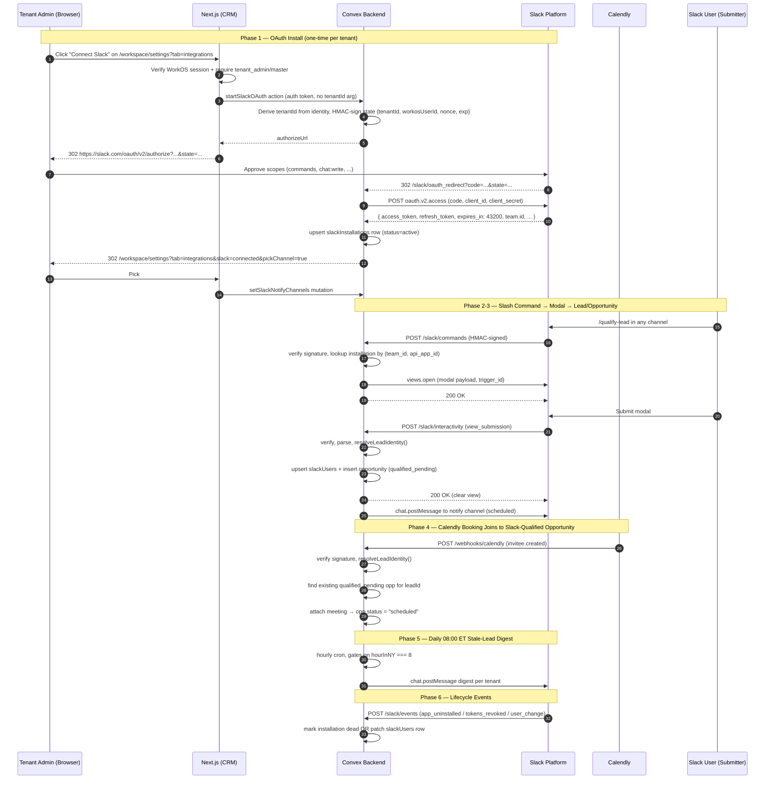
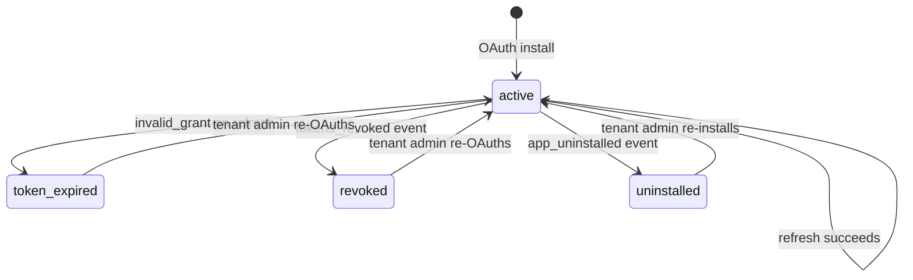
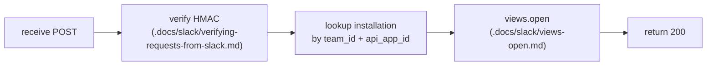
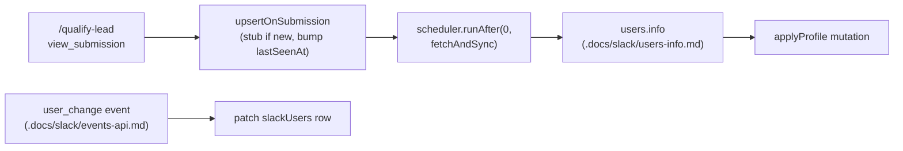
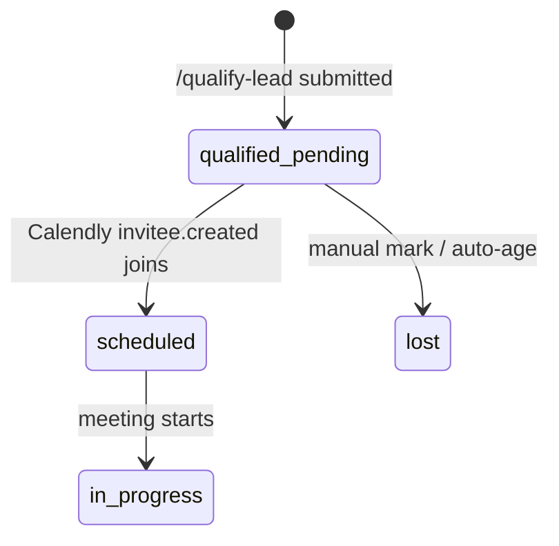

# Slack Bot v1 — Design Specification

**Version:** 0.1 (MVP)
**Status:** Draft
**Scope:** Today, the CRM funnel begins at a Calendly booking — we have no record of a qualified lead until they schedule. End state: a single distributed Slack app, installable into any tenant workspace, exposes one slash command (`/qualify-lead`) that opens a Block Kit modal; submissions create a `lead` + `opportunity` with `source: "slack_qualified"` and `status: "qualified_pending"` (no meeting yet). When a Calendly `invitee.created` webhook later resolves to that lead, the meeting attaches to the pre-existing opportunity, unlocking the "qualified-lead → booked-meeting" conversion metric.
**Prerequisite:** The existing Calendly ingestion pipeline (`convex/pipeline/inviteeCreated.ts`), the lead-identity model (`convex/leads/identityResolution.ts`, `leadIdentifiers` table), and the Calendly token-refresh pattern (`convex/calendly/tokens.ts`). No replatforming required — this design widens lead/opportunity schemas, adds four Slack tables, and adapts existing token-refresh primitives.

---

## Table of Contents

1. [Goals & Non-Goals](#1-goals--non-goals)
2. [Actors & Roles](#2-actors--roles)
3. [End-to-End Flow Overview](#3-end-to-end-flow-overview)
4. [Phase 1: OAuth Install & Token Rotation](#4-phase-1-oauth-install--token-rotation)
5. [Phase 2: Slash Command & Modal](#5-phase-2-slash-command--modal)
6. [Phase 3: Lead, Opportunity & Slack-User Directory](#6-phase-3-lead-opportunity--slack-user-directory)
7. [Phase 4: Calendly ↔ Slack Join](#7-phase-4-calendly--slack-join)
8. [Phase 5: Channel Notifications & Stale-Lead Digest](#8-phase-5-channel-notifications--stale-lead-digest)
9. [Phase 6: Lifecycle & Metrics](#9-phase-6-lifecycle--metrics)
10. [Data Model](#10-data-model)
11. [Convex Function Architecture](#11-convex-function-architecture)
12. [Routing & Authorization](#12-routing--authorization)
13. [Security Considerations](#13-security-considerations)
14. [Error Handling & Edge Cases](#14-error-handling--edge-cases)
15. [Open Questions](#15-open-questions)
16. [Dependencies](#16-dependencies)
17. [Applicable Skills](#17-applicable-skills)

---

## 1. Goals & Non-Goals

### Goals

- **One Slack app, many tenants.** A single distributed Slack app (Public Distribution; see [`.docs/slack/installing-with-oauth.md`](../../.docs/slack/installing-with-oauth.md)) installs into any tenant's workspace via OAuth v2; `(team_id, api_app_id)` on every inbound payload is the trusted join key to the tenant. `team_id` alone is not sufficient because dev/prod Slack apps, reinstall rows, or future multiple-app deployments can share a Slack workspace.
- **Frictionless top-of-funnel capture.** Any Slack user in an installed workspace can run `/qualify-lead`, fill a three-field Block Kit modal (`full_name`, `platform`, `handle`), and submit — creating a `lead` + `opportunity` *before* a Calendly booking exists.
- **Auto-join on booking.** When Calendly's `invitee.created` arrives, the existing `resolveLeadIdentity()` matcher attaches the meeting to the pre-existing `qualified_pending` opportunity (instead of creating a duplicate). State transitions to `scheduled`.
- **Token rotation enabled from day one.** `token_rotation_enabled: true` in the app manifest. Bot tokens expire every 12h; refresh tokens are single-use. (See [`.docs/slack/using-token-rotation.md`](../../.docs/slack/using-token-rotation.md).) The flag is **irreversible at the app level** — paying this cost now is structurally required.
- **Channel confirmation + stale-lead digest.** Each submission posts to a tenant-configured channel; a daily 08:00 ET digest into a (separately configurable) reminder channel surfaces qualified leads aged > 30 days with no booking.
- **Slack-user attribution without role labelling.** A `slackUsers` directory table (per tenant) renders display names ("Steve Hansen") for opportunity attribution. We deliberately do **not** label submitters as setter / closer — the Slack user is just "the Slack user who submitted."
- **No Bolt.** We HMAC-verify inbound requests ourselves (15 LOC), own each `httpAction` route, and call Slack Web API endpoints with the local `convex/slack/webApi.ts` `fetch` helpers. Do not use dynamic named imports from `@slack/web-api` in Convex actions; Phase 3 QA reproduced a Convex/esbuild code-splitting failure where `WebClient` resolves to `undefined` at runtime. (See [`.docs/slack/bolt-js.md`](../../.docs/slack/bolt-js.md), [`.docs/slack/bolt-js-receiver.md`](../../.docs/slack/bolt-js-receiver.md) for the framework we are not using and why.)

### Non-Goals (deferred)

- **Enterprise Grid org-wide installs** — Workspace-scoped only for v1; `enterprise_id` routing deferred to v1.5 (Open Q1).
- **Slack App Directory marketplace listing** — Public Distribution URL is sufficient; marketplace review is a separate go-to-market workstream.
- **Slack ↔ CRM user auto-mapping** — `slackUsers.crmUserId` is reserved but unused in v1. Per-user reporting groups by `slackUserId` only. (Open Q2.)
- **Multiple notification channels per tenant** (e.g. `#leads-instagram`, `#leads-tiktok`) — One channel per kind (notify + stale-reminder) for v1. (Open Q6.)
- **Meeting-notes slash command** (`/note-meeting`) — Same Slack app could host it later; out of scope for v1.
- **Slack Connect / Shared Channels** — Different `team_id` shape; defer.
- **Bulk qualify (CSV upload)** — Friction-free single-lead flow is the value; bulk is out of scope.
- **DM home tab + app-mention stat queries** — Post-v1 if the metric proves valuable.

---

## 2. Actors & Roles

| Actor | Identity | Auth Method | Key Permissions |
|---|---|---|---|
| **Tenant admin** | CRM `tenant_master` or `tenant_admin` | WorkOS AuthKit, member of tenant org | Initiates Slack OAuth from `/workspace/settings?tab=integrations`; picks notify + stale-reminder channels; reconnects on token expiry. |
| **Slack workspace admin** | Person with "Add apps" permission in the Slack workspace | Slack OAuth v2 install flow | Approves bot scopes during OAuth; can uninstall the app at any time (fires `app_uninstalled` + `tokens_revoked`). |
| **Slack user (submitter)** | Any human user in the connected Slack workspace | Slack-side authenticated session (no CRM session required) | Runs `/qualify-lead`; submits the Block Kit modal. Attribution stored as opaque `slackUserId` joined to `slackUsers` for display. |
| **CRM closer / admin** | CRM `closer` / `tenant_admin` / `tenant_master` | WorkOS AuthKit | Views `qualified_pending` opportunities in the existing pipeline UI; sees Slack-qualified attribution on per-lead and per-Slack-user surfaces. |
| **System (Convex)** | Internal | — | OAuth code exchange; HMAC-verified inbound handlers; cron-driven token refresh; Calendly invitee-creation join logic. |

### CRM Role ↔ Slack-side Identity Mapping

There is **deliberately no role mapping** between CRM users and Slack users in v1. `qualifiedBy.slackUserId` is opaque from a role perspective; rendering joins to `slackUsers` for display only. (See §1 Non-Goals; Open Q2.)

| CRM `users.role` | Slack-side equivalent | Notes |
|---|---|---|
| `tenant_master` / `tenant_admin` | None | Admins manage the *installation* (settings page) but not the *bot conversation*. |
| `closer` | None | Closers see Slack-attributed opportunities in their dashboard via `qualifiedBy.slackUserId` → `slackUsers` join. |
| *(any Slack user)* | `slackUsers.slackUserId` | Tenant-scoped directory; lazy-populated on first `/qualify-lead`. |

---

## 3. End-to-End Flow Overview



---

## 4. Phase 1: OAuth Install & Token Rotation

### 4.1 What & Why

A single Slack app, registered under our developer account, ships as **Public Distribution-ready**, with the actual Public Distribution activation held until Phase 6's final go-live gate. Each tenant workspace that installs it gets its own OAuth flow; we persist one `slackInstallations` row per tenant. Token rotation is enabled from the **first publish** of the prod manifest because `token_rotation_enabled` is irreversible at the app level (see [`.docs/slack/using-token-rotation.md`](../../.docs/slack/using-token-rotation.md): *"Token rotation may not be turned off once it's turned on."*).

> **Runtime decision: token rotation on day one.** The retrofit cost (register a new app + force every existing tenant to re-OAuth) scales linearly with adoption; we pay it now while installs are zero. The implementation is ~150 LOC lifted from `convex/calendly/tokens.ts`, adapted for Slack's single-use refresh-token semantics.
>
> **Runtime decision: server-side OAuth only.** All token operations happen in Convex actions / `httpAction`s; `client_secret` and `signing_secret` never reach the browser. Use the default Convex runtime for Slack HTTP calls because `fetch()`, Web Crypto, and `crypto.randomUUID()` are available there; add `"use node"` only if a future dependency truly requires Node built-ins.
>
> **Security boundary: authenticated OAuth start.** `/slack/oauth_redirect` is still a Convex `httpAction`, but the install start is **not** a public `/slack/install?tenantId=...` URL. It begins from an authenticated Next.js route that calls a Convex action with the user's WorkOS access token. The action derives `tenantId` from `ctx.auth.getUserIdentity()` + the CRM user lookup, requires `tenant_master` / `tenant_admin`, and signs state only after that check passes. The browser never supplies a trusted tenant ID.
>
> **New helper:** add `convex/lib/slackOAuthState.ts` rather than reusing `convex/lib/inviteToken.ts` verbatim. `inviteToken` is fixed to invite payloads, has a 7-day expiry constant, and does not currently reject expired payloads during validation. Slack OAuth state needs a 10-minute expiry, `workosUserId` attribution, and one-time nonce consumption.

### 4.2 Authenticated authorize URL & state signing

```typescript
// Path: app/api/slack/start/route.ts
import { withAuth } from "@workos-inc/authkit-nextjs";
import { ConvexHttpClient } from "convex/browser";
import { NextResponse } from "next/server";
import { api } from "@/convex/_generated/api";

export async function GET() {
  const auth = await withAuth({ ensureSignedIn: true });
  if (!auth.user || !auth.accessToken) {
    return NextResponse.redirect(new URL("/sign-in", process.env.NEXT_PUBLIC_APP_URL));
  }

  const convex = new ConvexHttpClient(process.env.NEXT_PUBLIC_CONVEX_URL!);
  convex.setAuth(auth.accessToken);
  const { authorizeUrl } = await convex.action(api.slack.oauth.startInstall, {});
  return NextResponse.redirect(authorizeUrl);
}
```

```typescript
// Path: convex/slack/oauth.ts
import { action, httpAction } from "../_generated/server";
import { createSlackOAuthState } from "../lib/slackOAuthState";

export const startInstall = action({
  args: {},
  handler: async (ctx) => {
    const access = await requireTenantUserFromAction(ctx, [
      "tenant_master",
      "tenant_admin",
    ]);

    const state = await createSlackOAuthState(ctx, {
      tenantId: access.tenantId,
      workosUserId: access.workosUserId,
      ttlSeconds: 600,
    });

    const authorizeUrl = new URL("https://slack.com/oauth/v2/authorize");
    authorizeUrl.searchParams.set("client_id", process.env.SLACK_CLIENT_ID!);
    authorizeUrl.searchParams.set("scope", [
      "commands",
      "chat:write",
      "chat:write.public",
      "channels:read",
      "groups:read",
      "users:read",
    ].join(","));
    authorizeUrl.searchParams.set("redirect_uri", process.env.SLACK_REDIRECT_URI!);
    authorizeUrl.searchParams.set("state", state.token);

    return { authorizeUrl: authorizeUrl.toString() };
  },
});
```

`createSlackOAuthState` signs a compact JSON payload with HMAC-SHA256, stores a hash of the nonce in `slackOAuthStates`, and returns `{ token, expiresAt }`. The redirect handler must validate the signature and expiry, then atomically consume the stored nonce before exchanging the Slack code. A replayed state token fails even if the HMAC is valid.

### 4.3 Code exchange & installation upsert

```typescript
// Path: convex/slack/oauth.ts
export const oauthRedirect = httpAction(async (ctx, req) => {
  const url = new URL(req.url);
  const code = url.searchParams.get("code");
  const stateRaw = url.searchParams.get("state");
  if (!code || !stateRaw) return new Response("Bad request", { status: 400 });

  const state = await validateAndConsumeSlackOAuthState(ctx, {
    token: stateRaw,
    signingSecret: process.env.SLACK_STATE_SIGNING_SECRET!,
  });
  if (!state) return new Response("Invalid state", { status: 401 });

  const installer = await ctx.runQuery(internal.slack.installations.verifyInstallerStillAdmin, {
    tenantId: state.tenantId,
    workosUserId: state.workosUserId,
  });
  if (!installer) return new Response("Installer no longer authorized", { status: 403 });

  // Per .docs/slack/installing-with-oauth.md — POST application/x-www-form-urlencoded
  const r = await fetch("https://slack.com/api/oauth.v2.access", {
    method: "POST",
    headers: { "Content-Type": "application/x-www-form-urlencoded" },
    body: new URLSearchParams({
      code,
      client_id: process.env.SLACK_CLIENT_ID!,
      client_secret: process.env.SLACK_CLIENT_SECRET!,
      redirect_uri: process.env.SLACK_REDIRECT_URI!,
    }),
  });
  const data = await r.json();
  if (!data.ok) throw new Error(`Slack OAuth failed: ${data.error}`);

  await ctx.runMutation(internal.slack.installations.upsertOnInstall, {
    tenantId: state.tenantId,
    teamId: data.team.id,
    teamName: data.team.name,
    enterpriseId: data.enterprise?.id,
    isEnterpriseInstall: Boolean(data.is_enterprise_install),
    appId: data.app_id,
    botUserId: data.bot_user_id,
    botAccessToken: data.access_token,
    refreshToken: data.refresh_token,        // present iff rotation enabled
    tokenExpiresAt: Date.now() + data.expires_in * 1000,
    scopes: (data.scope as string).split(","),
    installedByWorkosUserId: state.workosUserId,
  });

  const dest = new URL(`${process.env.APP_URL}/workspace/settings`);
  dest.searchParams.set("tab", "integrations");
  dest.searchParams.set("slack", "connected");
  dest.searchParams.set("pickChannel", "true");
  return Response.redirect(dest.toString(), 302);
});
```

### 4.4 Token refresh — JIT helper + proactive cron

The hot-path helper is the **only** entry point for any code that needs a bot token. Pattern lifts directly from `convex/calendly/tokens.ts:getValidAccessToken` (line 287). The proactive cron refreshes with a 2h buffer so the slash-command path almost always takes the fast path; if the token still needs refresh during `/qualify-lead`, the handler may spend part of the 3-second trigger window refreshing and should return a concise ephemeral retry message if refresh contention occurs.

```typescript
// Path: convex/slack/tokens.ts
const REFRESH_BUFFER_MS = 60_000;
const STALE_LOCK_MS = 30_000;

export async function getValidSlackBotToken(
  ctx: ActionCtx,
  tenantId: Id<"tenants">,
): Promise<string> {
  const inst = await ctx.runQuery(internal.slack.installations.byTenantId, { tenantId });
  if (!inst) throw new SlackInstallationMissingError();
  if (inst.status !== "active") throw new SlackInstallationNotActiveError(inst.status);

  if (inst.tokenExpiresAt - Date.now() > REFRESH_BUFFER_MS) {
    return inst.botAccessToken; // fast path
  }
  return await refreshBotToken(ctx, inst);
}

async function refreshBotToken(ctx: ActionCtx, inst: Doc<"slackInstallations">) {
  const lockHolder = crypto.randomUUID();
  const acquired = await ctx.runMutation(internal.slack.installations.tryAcquireRefreshLock, {
    installationId: inst._id,
    lockHolder,
    staleAfterMs: STALE_LOCK_MS,
  });

  if (!acquired) {
    // Loser: wait, re-read, accept the freshly-rotated token.
    await new Promise((r) => setTimeout(r, 500 + Math.random() * 500));
    const fresh = await ctx.runQuery(internal.slack.installations.byId, { id: inst._id });
    if (fresh && fresh.tokenExpiresAt - Date.now() > REFRESH_BUFFER_MS) {
      return fresh.botAccessToken;
    }
    throw new SlackTokenRefreshContentionError();
  }

  try {
    const r = await fetch("https://slack.com/api/oauth.v2.access", {
      method: "POST",
      headers: { "Content-Type": "application/x-www-form-urlencoded" },
      body: new URLSearchParams({
        grant_type: "refresh_token",
        refresh_token: inst.refreshToken,
        client_id: process.env.SLACK_CLIENT_ID!,
        client_secret: process.env.SLACK_CLIENT_SECRET!,
      }),
    });
    const d = await r.json();
    if (!d.ok) {
      if (d.error === "invalid_grant" || d.error === "token_revoked") {
        await ctx.runMutation(internal.slack.installations.markTokenExpired, { id: inst._id });
        throw new SlackTokenExpiredError();
      }
      throw new Error(`Slack refresh failed: ${d.error}`);
    }
    // ATOMIC — single mutation swaps both tokens. Critical: the old refresh_token
    // is invalidated server-side the instant Slack issues the new one.
    await ctx.runMutation(internal.slack.installations.completeRefresh, {
      id: inst._id,
      lockHolder,
      botAccessToken: d.access_token,
      refreshToken: d.refresh_token,
      tokenExpiresAt: Date.now() + d.expires_in * 1000,
      lastRefreshedAt: Date.now(),
    });
    return d.access_token;
  } catch (e) {
    await ctx.runMutation(internal.slack.installations.releaseRefreshLock, {
      id: inst._id, lockHolder,
    });
    throw e;
  }
}
```

**Proactive cron** — refreshes anything within 2h of expiry, hourly:

```typescript
// Path: convex/crons.ts (additions)
crons.interval(
  "refresh-slack-tokens",
  { hours: 1 },
  internal.slack.tokens.refreshExpiringTokens,
  {},
);
```

`refreshExpiringTokens` queries `slackInstallations.by_status_and_tokenExpiresAt` for `status = "active" AND tokenExpiresAt < now + 2h`, fans out via `ctx.scheduler.runAfter(0, …)` per row to keep transaction limits bounded.

### 4.5 Slack Web API methods used

| Operation | HTTP API method | Reference |
|---|---|---|
| Code exchange | `oauth.v2.access` (POST form) | [`.docs/slack/installing-with-oauth.md`](../../.docs/slack/installing-with-oauth.md) |
| Token refresh | `oauth.v2.access` (`grant_type=refresh_token`) | [`.docs/slack/using-token-rotation.md`](../../.docs/slack/using-token-rotation.md) |
| Health check | `auth.test` (optional, post-install validation) | [`.docs/slack/auth-test.md`](../../.docs/slack/auth-test.md) |

### 4.6 Token-state lifecycle



### 4.7 Manual steps & operational checkpoints

Phase 1 has the most manual touchpoints in the entire build. Three groupings: pre-development setup, manifest publish (the critical irreversible / order-dependent block), and ongoing rotation hygiene.

> **Severity legend used throughout the design doc:**
> 🚨 **IRREVERSIBLE** — once committed wrong, cannot be undone on the same app
> ⚠️ **ORDER-DEPENDENT** — must occur at a specific point in a sequence
> 🔁 **RECURRING** — fires every time / per tenant / per env change
> 📋 **ONE-TIME** — performed once for the whole project / environment

#### 4.7.1 Pre-development (📋 one-time, before any code lands)

- [ ] **Decide Slack-app ownership.** Register under a shared / company Slack workspace, never a personal account. Ownership transfer is awkward; the app must outlive the registering admin's tenure.
- [ ] **Create two Slack apps** at <https://api.slack.com/apps> → "Create New App" → "From a manifest." One per environment (dev → dev Convex deployment, prod → prod). Browser-only — there is no API for initial app creation.
- [ ] **Generate `SLACK_STATE_SIGNING_SECRET`** for each environment: `openssl rand -hex 32`. Distinct from Slack's own signing secret — this one is **ours**, used by `convex/lib/slackOAuthState.ts` to sign the OAuth state parameter.
- [ ] **Prepare branding assets:** display name `Magnus`, **512×512 PNG icon**, background color, short + long description. Required before Public Distribution can be enabled. **The icon must be uploaded via the Slack App Config UI** — there is no manifest field for it.
- [ ] **Set privacy policy + support URLs** in Slack App Config → Basic Information. Slack requires both for distributed apps even before App Directory listing.

#### 4.7.2 Manifest publish (⚠️ ORDER-DEPENDENT, 🚨 IRREVERSIBLE flag)

> **The single most important operational gotcha in this project.** Slack runs `url_verification` POST + reachability checks against the manifest URLs **the moment you save the manifest**. If your endpoints don't exist yet, the save fails — or worse, saves with broken URLs you don't notice until users try to use the bot. Separately, `token_rotation_enabled: true` is **irreversible at the app level** — saving with `false` once means registering a brand-new app and re-OAuthing every existing tenant.

Per environment, in this exact order:

1. - [ ] **Deploy** the Slack-facing routes plus the authenticated Next.js start route (`/api/slack/start`) to the target deployment. At this gate, `/slack/oauth_redirect` is real, while `/slack/commands`, `/slack/interactivity`, and `/slack/events` may be Phase 1 stubs. The stubs must still verify Slack signatures, respond with valid HTTP, and the `/slack/events` stub must satisfy Slack's `url_verification` challenge, **before** step 3.
2. - [ ] **Substitute** the `<convex-deployment>` placeholder in `slack-manifest.<env>.yaml` with the actual `*.convex.site` host.
3. - [ ] **Paste** the YAML into Slack App Config → "App Manifest" → Save. URL verification + reachability checks run here.
4. - [ ] **🚨 IRREVERSIBLE — manually verify `token_rotation_enabled: true` rendered correctly** in the saved-manifest preview before clicking the final "Save Changes" on **prod**. Once `true` is persisted, you can never set it back to `false` on this app (see §4.1, §14.10).
5. - [ ] **Read off** `client_id`, `client_secret`, `signing_secret` from "Basic Information." These do **not** appear in the manifest YAML — copy-paste only.
6. - [ ] **Set Convex env vars** on the matching deployment:
   ```bash
   # Path: terminal — run per deployment
   npx convex env set SLACK_CLIENT_ID            <client_id>
   npx convex env set SLACK_CLIENT_SECRET        <client_secret>
   npx convex env set SLACK_SIGNING_SECRET       <signing_secret>
   npx convex env set SLACK_STATE_SIGNING_SECRET <openssl-generated>
   npx convex env set SLACK_REDIRECT_URI         https://<host>.convex.site/slack/oauth_redirect
   ```
   `SLACK_REDIRECT_URI` must match `oauth_config.redirect_urls[0]` **character-for-character including trailing slash**.
7. - [ ] **Dev only:** click "Install to Workspace" in dev App Config to install to the developer's testing workspace. Generates the first set of dev tokens.
8. - [ ] **Prod only, after Phase 6 final go-live:** flip Distribution → Public Distribution → **Activate**. Until this toggle is on, no third-party tenant can install. Do not activate it during Phase 1; Phase 1 only prepares and validates the prod app configuration.

#### 4.7.3 CI / runbook prevention (📋 one-time)

- [ ] **Add CI lint rule** that fails the build if `slack-manifest.prod.yaml` has `token_rotation_enabled` set to anything other than `true`. (See §14.10.)
- [ ] **Author runbook entry** for the catastrophic refresh-succeed-but-write-fail scenario (§14.3): reading the `[Slack:Tokens] CATASTROPHIC` log, prompting the affected tenant to reconnect, optional manual replay from the future quarantine table.

#### 4.7.4 Ongoing operations (🔁 RECURRING)

- [ ] **Convex deployment URL change** — every URL in the manifest must be re-pasted: the four URL fields (`oauth_config.redirect_urls`, `slash_commands[].url`, `settings.interactivity.request_url`, `settings.event_subscriptions.request_url`) plus the `SLACK_REDIRECT_URI` env var. **Save the manifest after** the new deploy is fully promoted (Slack re-runs URL verification on save).
- [ ] **Rotate `SLACK_SIGNING_SECRET`** quarterly via Slack App Config → update Convex env → redeploy. Brief overlap where both old and new validate is acceptable.
- [ ] **Rotate `SLACK_STATE_SIGNING_SECRET`** quarterly (independent of Slack's). Old in-flight install URLs invalidate — acceptable; install flow is rare.

---

## 5. Phase 2: Slash Command & Modal

### 5.1 The double 3-second window

Per [`.docs/slack/implementing-slash-commands.md`](../../.docs/slack/implementing-slash-commands.md) and [`.docs/slack/views-open.md`](../../.docs/slack/views-open.md), two deadlines apply on the slash-command path and they overlap:

1. The slash command POST must receive a 200 response within **3 seconds**.
2. The `trigger_id` returned with that POST expires **3 seconds** after issuance — `views.open` must succeed before then.

You **cannot** ack first and open the modal afterward. The handler must verify, look up the installation, and `views.open` *before* returning 200. Convex isolate cold-start is 50–200ms; with discipline this fits.



### 5.2 HMAC verification

```typescript
// Path: convex/lib/slackSignature.ts
import { createHmac, timingSafeEqual } from "node:crypto";

const REPLAY_WINDOW_SECONDS = 60 * 5; // per .docs/slack/verifying-requests-from-slack.md

export function verifySlackSignature(args: {
  rawBody: string;
  timestamp: string;
  signature: string;
  signingSecret: string;
  previousSigningSecret?: string;
}): boolean {
  if (!args.signingSecret) return false;
  const ts = Number(args.timestamp);
  if (!Number.isFinite(ts)) return false;
  if (Math.abs(Date.now() / 1000 - ts) > REPLAY_WINDOW_SECONDS) return false;

  const base = `v0:${args.timestamp}:${args.rawBody}`;
  const b = Buffer.from(args.signature, "utf8");
  const candidateSecrets = [args.signingSecret, args.previousSigningSecret]
    .filter((secret): secret is string => Boolean(secret));

  for (const secret of candidateSecrets) {
    const expected = "v0=" + createHmac("sha256", secret)
      .update(base)
      .digest("hex");
    const a = Buffer.from(expected, "utf8");
    if (a.length === b.length && timingSafeEqual(a, b)) return true;
  }
  return false;
}
```

The shape mirrors `convex/webhooks/calendly.ts` (`createSignature`, `timingSafeEqualHex`, raw-body capture before parsing).

### 5.3 Slash command handler

```typescript
// Path: convex/slack/commands.ts
import { httpAction } from "../_generated/server";
import { verifySlackSignature } from "../lib/slackSignature";
import { buildQualifyLeadModal } from "../lib/slackBlockKit";

export const slashCommand = httpAction(async (ctx, req) => {
  const rawBody = await req.text(); // capture before parsing
  const ok = verifySlackSignature({
    rawBody,
    timestamp: req.headers.get("x-slack-request-timestamp") ?? "",
    signature: req.headers.get("x-slack-signature") ?? "",
    signingSecret: process.env.SLACK_SIGNING_SECRET!,
  });
  if (!ok) return new Response("Bad signature", { status: 401 });

  const params = new URLSearchParams(rawBody);
  const teamId = params.get("team_id")!;
  const apiAppId = params.get("api_app_id")!;
  const triggerId = params.get("trigger_id")!;
  const slackUserId = params.get("user_id")!;
  const channelId = params.get("channel_id")!;

  const inst = await ctx.runQuery(internal.slack.installations.byTeamIdAndAppId, {
    teamId,
    appId: apiAppId,
  });
  if (!inst || inst.status !== "active") {
    return new Response(JSON.stringify({
      response_type: "ephemeral",
      text: "Slack integration disconnected — ask an admin to reconnect in the CRM.",
    }), { headers: { "Content-Type": "application/json" } });
  }

  const token = await getValidSlackBotToken(ctx, inst.tenantId);
  const response = await fetch("https://slack.com/api/views.open", {
    method: "POST",
    headers: {
      Authorization: `Bearer ${token}`,
      "Content-Type": "application/json; charset=utf-8",
    },
    body: JSON.stringify({
      trigger_id: triggerId,
      view: buildQualifyLeadModal({
        tenantId: inst.tenantId,
        slackUserId,
        teamId,
        channelId,
      }),
    }),
  });
  const data = await response.json() as { ok: boolean; error?: string };
  if (!data.ok) throw new Error(`Slack views.open failed: ${data.error ?? "unknown"}`);

  return new Response("", { status: 200 });
});
```

### 5.4 Block Kit modal

Per [`.docs/slack/modals.md`](../../.docs/slack/modals.md) and [`.docs/slack/block-kit.md`](../../.docs/slack/block-kit.md). The platform `static_select` options align 1:1 with the existing `leadIdentifiers.type` enum in `convex/schema.ts:163-172` (`instagram | tiktok | twitter | facebook | linkedin | other_social`) — **no schema additions** for the platform set.

```typescript
// Path: convex/lib/slackBlockKit.ts
export function buildQualifyLeadModal(meta: {
  tenantId: Id<"tenants">;
  slackUserId: string;
  teamId: string;
  channelId: string;
}) {
  return {
    type: "modal" as const,
    callback_id: "qualify_lead_submit",
    private_metadata: JSON.stringify(meta),  // returned verbatim in view_submission
    title:  { type: "plain_text" as const, text: "Qualify a Lead" },
    submit: { type: "plain_text" as const, text: "Create lead" },
    close:  { type: "plain_text" as const, text: "Cancel" },
    blocks: [
      { type: "input", block_id: "full_name",
        label: { type: "plain_text", text: "Full name" },
        element: { type: "plain_text_input", action_id: "v" } },
      { type: "input", block_id: "platform",
        label: { type: "plain_text", text: "Social platform" },
        element: { type: "static_select", action_id: "v", options: [
          { text: { type: "plain_text", text: "Instagram" }, value: "instagram" },
          { text: { type: "plain_text", text: "TikTok"    }, value: "tiktok" },
          { text: { type: "plain_text", text: "Twitter/X" }, value: "twitter" },
          { text: { type: "plain_text", text: "Facebook"  }, value: "facebook" },
          { text: { type: "plain_text", text: "LinkedIn"  }, value: "linkedin" },
          { text: { type: "plain_text", text: "Other"     }, value: "other_social" },
        ] } },
      { type: "input", block_id: "handle",
        label: { type: "plain_text", text: "Social handle" },
        element: { type: "plain_text_input", action_id: "v",
          placeholder: { type: "plain_text", text: "@username" } } },
    ],
  };
}
```

> **Why `private_metadata` and not a session table:** Slack returns `private_metadata` verbatim on `view_submission`. We stuff already-verified context (`tenantId`, `slackUserId`, `channelId`) into it at modal-open time — no second DB write for the modal session. The 3000-char budget is generous. **Never trust the user to send these directly** — only put values we already verified at slash-command time.

### 5.5 `view_submission` & inline errors

Per [`.docs/slack/handling-user-interaction.md`](../../.docs/slack/handling-user-interaction.md) and [`.docs/slack/modals.md`](../../.docs/slack/modals.md):

```typescript
// Path: convex/slack/interactivity.ts (sketch)
const v = payload.view.state.values;
const fullName = v.full_name.v.value as string;
const platform = v.platform.v.selected_option.value as SocialPlatform;
const handle   = v.handle.v.value as string;

if (!handle?.trim()) {
  return Response.json({
    response_action: "errors",
    errors: { handle: "Required" },
  });
}
// ... else call createQualifiedLead, return {} (clears modal)
```

`response_action: "errors"` highlights the offending block inline; the user fixes it without re-opening.

### 5.6 Manual steps & operational checkpoints

Phase 2 introduces no new pre-development manual steps — but it has two ⚠️ ORDER-DEPENDENT gates and one product-decision checkpoint that must be resolved before the modal builder is finalized.

#### 5.6.1 Order-dependent gates

- [ ] **⚠️ ORDER-DEPENDENT:** the `/slack/commands` and `/slack/interactivity` httpActions must be deployed **before** the manifest is saved with their URLs (see §4.7.2). If you publish the manifest before the routes exist, slash commands silently 404 in Slack and there is no error surfaced to anyone — until a user tries `/qualify-lead` and sees `dispatch_failed`.
- [ ] **Phase A exit gate (test):** force-expire a token in the dev DB; verify both the cron and the JIT helper (`getValidSlackBotToken`) refresh cleanly without races, **before** running the end-to-end slash-command test. (Catches lock-primitive bugs before they affect user-driven traffic.)

#### 5.6.2 Pre-merge product decisions

- [ ] **Decision (Open Q9):** include a "notes" field on the modal? `plain_text_input` with `multiline: true` adds ~30s of friction. Decide before `convex/lib/slackBlockKit.ts:buildQualifyLeadModal` is finalized — adding the field later is cheap; removing it after users start submitting context is awkward UX.
- [ ] **Verify** the social-platform `static_select` options in `slackBlockKit.ts` match `leadIdentifiers.type` literals **exactly** (`instagram | tiktok | twitter | facebook | linkedin | other_social`). Drift is silent — Slack accepts any string; the resolver fails late on insert.

---

## 6. Phase 3: Lead, Opportunity & Slack-User Directory

### 6.1 What & Why

The submit handler does three things in one Convex mutation:

1. Calls the widened `resolveLeadIdentity()` — reuses existing lead if matched, creates new lead + identifiers if not. For Slack-qualified leads, email is optional; a normalized social handle is the required v1 identity anchor when email is absent.
2. Inserts a new `opportunities` row with `source: "slack_qualified"`, `status: "qualified_pending"`, `qualifiedBy: { slackUserId, slackTeamId, submittedAt }`.
3. Upserts a `slackUsers` row (stub if new) and schedules an async `users.info` fetch to enrich the profile.

> **Identity-resolution change:** `convex/leads/identityResolution.ts:282` already implements the email → social → phone → fuzzy-name match hierarchy, but its current create path requires `email: string` and throws when a new lead has no email. Slack v1 must widen `leads.email` to optional, change `ResolveLeadIdentityArgs.email` to optional, and allow `createIfMissing` when at least one normalized identifier exists (`email`, `socialHandle`, or `phone`). Existing Calendly callers still pass email and keep their current behavior.
>
> **Schema decision: widen, don't add.** `leads.email` becomes optional; `leadIdentifiers.source` and opportunity source projections each gain one literal (`"slack_qualified"`); `opportunities.status` and derived status projections gain one literal (`"qualified_pending"`); `opportunities` gains an optional `qualifiedBy` object. Use the `convex-migration-helper` skill — widen-migrate-narrow rollout. Existing rows keep their current email/status/source values, so no data backfill is required for existing data, but all readers must tolerate `lead.email === undefined` before Slack-qualified rows can be written.

### 6.2 Submit handler

```typescript
// Path: convex/slack/createQualifiedLead.ts
export const create = internalMutation({
  args: {
    tenantId: v.id("tenants"),
    fullName: v.string(),
    platform: v.union(/* same six as leadIdentifiers.type social literals */),
    handle: v.string(),
    email: v.optional(v.string()),
    phone: v.optional(v.string()),
    qualifiedBy: v.object({
      slackUserId: v.string(),
      slackTeamId: v.string(),
      submittedAt: v.number(),
    }),
  },
  handler: async (ctx, args) => {
    const now = Date.now();
    const resolution = await resolveLeadIdentity(ctx, {
      tenantId: args.tenantId,
      email: args.email,
      socialHandle: { platform: args.platform, rawValue: args.handle },
      phone: args.phone ?? undefined,
      fullName: args.fullName,
      identifierSource: "slack_qualified", // NEW literal — see §10
      createIdentifiers: true,
      createdAt: now,
    });

    // Dedup guard — do not create a second qualified_pending opportunity for the
    // same lead within the lookback window. (See §7.3 edge case table.)
    const recent = await ctx.db
      .query("opportunities")
      .withIndex("by_tenantId_and_leadId_and_source_and_status_and_createdAt", (q) =>
        q
          .eq("tenantId", args.tenantId)
          .eq("leadId", resolution.leadId)
          .eq("source", "slack_qualified")
          .eq("status", "qualified_pending"))
      .order("desc")
      .first();
    if (recent) {
      return { duplicate: true as const, existingOpportunityId: recent._id };
    }

    const opportunityId = await ctx.db.insert("opportunities", {
      tenantId: args.tenantId,
      leadId: resolution.leadId,
      status: "qualified_pending",          // NEW literal
      source: "slack_qualified",            // NEW literal
      createdAt: now,
      updatedAt: now,
      latestActivityAt: now,
      qualifiedBy: args.qualifiedBy,        // NEW field
    });

    await insertOpportunityAggregate(ctx, opportunityId);
    await updateTenantStats(ctx, args.tenantId, {
      totalOpportunities: 1,
      activeOpportunities: 1,
    });
    await emitDomainEvent(ctx, {
      tenantId: args.tenantId,
      entityType: "opportunity",
      entityId: opportunityId,
      eventType: "opportunity.created",
      source: "pipeline",
      toStatus: "qualified_pending",
      occurredAt: now,
      metadata: { source: "slack_qualified" },
    });
    await upsertSlackUserOnSubmission(ctx, args);
    await ctx.scheduler.runAfter(0, internal.slack.notify.postConfirmation, {
      tenantId: args.tenantId,
      opportunityId,
      leadId: resolution.leadId,
    });
    return { duplicate: false as const, opportunityId, leadId: resolution.leadId };
  },
});
```

### 6.3 Status transitions

The state machine in `convex/lib/statusTransitions.ts` (`VALID_TRANSITIONS` table, line 26) gains one entry node:

```
qualified_pending  ──[Calendly invitee.created joins]──>  scheduled
                  ──[manual mark lost]────────────────>  lost
                  ──[stale > N days, opt. auto]───────>  lost
```

| From | To | Trigger |
|---|---|---|
| *(none)* | `qualified_pending` | `view_submission` succeeds in `createQualifiedLead.create` |
| `qualified_pending` | `scheduled` | Calendly `invitee.created` resolves to this lead (Phase 4) |
| `qualified_pending` | `lost` | Manual action in CRM, or auto-aged by future cron (deferred — Open Q4) |

### 6.4 The `slackUsers` directory

> **Why a normalized table, not a denormalized name on the opportunity:** Slack display names change over time. If we wrote the name onto the opportunity at submission time, dashboards would show stale historical names. With a normalized table, opportunities store only the immutable `slackUserId`, the dashboard joins at render time, and a single `user_change` event from Slack updates every historical attribution display in one row update.

Three triggers populate / refresh the table:



1. **Lazy upsert on submission** — stub row inserted with what's free in the payload (`user.id`, `user.name`); `users.info` fetch fires-and-forgets.
2. **`user_change` event** — Slack pushes free real-time updates whenever any user profile changes; handler first resolves `(team_id, api_app_id)` to a `slackInstallations` row, then patches the matching `(installationId, slackUserId)` row.
3. **Stale-row sweep on access** — `lastSyncedAt > 30d` triggers a re-fetch on next access (catches missed events / network drops).

The opportunity creation path **never blocks** on `users.info`. Stub row is enough for `qualifiedBy.slackUserId` to be a valid join key.

### 6.5 Where names render

| Surface | Rendering rule |
|---|---|
| Slack messages (confirmations, digests) | `<@U214>` — Slack expands client-side to the live display name; no local copy needed |
| CRM dashboards (per-user cards, leaderboards) | `displayName ?? realName ?? username ?? slackUserId` |
| Analytics API responses | Joined `slackUsers` row attached to each opportunity |

### 6.6 Manual steps & operational checkpoints

Phase 3 contains the first deployment that changes existing prod table schemas (`leads`, `opportunities`, `opportunitySearch`, `leadIdentifiers`) plus the last unresolved naming decision.

#### 6.6.1 Schema migration (📋 one-time, on prod data — 1 test tenant currently in prod)

> **Per AGENTS.md, this is a non-trivial schema change on a production deployment.** Use the `convex-migration-helper` skill — widen-migrate-narrow rollout. The schema lock-in matters because: once `qualified_pending` opportunities exist in prod, renaming the literal requires a follow-up migration on live data.

- [ ] **Invoke `convex-migration-helper`** for the widen step: Phase 3 adds 2 new tables (`rawSlackEvents`, `slackUsers`) after Phase 1 has already added `slackOAuthStates` and `slackInstallations`; it also makes `leads.email` optional, widens enums (`leadIdentifiers.source`, `opportunities.source`, `opportunities.status`, `opportunitySearch.source`, `opportunitySearch.status`), and adds `qualifiedBy` on `opportunities`.
- [ ] **Push the Convex deploy** containing the widened schema and the code that tolerates `lead.email === undefined`. **No data backfill required** — existing lead rows keep email, and existing opportunity rows stay on existing literals.
- [ ] **Verify schema deployed cleanly** via `npx convex data slackOAuthStates` / `slackInstallations` / `rawSlackEvents` / `slackUsers` (per TESTING.MD's manual-QA workflow). Phase 1 tables should already exist; Phase 3 tables should exist and be empty before the first submission.
- [ ] **Verify the existing test tenant is unaffected** — spot-check existing leads + opportunities + leadIdentifiers via `npx convex data leads` / `opportunities` / `leadIdentifiers`. Existing lead emails should remain present; no row's `source` or `status` should have changed; the allowed sets have only widened.
- [ ] **Create a dev-only email-less lead** through `/qualify-lead` with only full name + social handle. Verify lead search, opportunity search, pipeline cards, and Slack confirmation copy render a social handle fallback instead of assuming `lead.email`.

#### 6.6.2 Pre-merge product decisions (🚨 hard to reverse once data exists)

- [ ] **Decision (Open Q8): confirm `qualified_pending` is the chosen status name** before merging the schema migration. Alternatives considered: `pending_meeting`, `pre_meeting`, `qualified`. Bikeshed in a Slack thread; once tenants accumulate `qualified_pending` opportunities in prod, renaming requires a follow-up data migration touching every Slack-sourced row.

---

## 7. Phase 4: Calendly ↔ Slack Join

### 7.1 What & Why

This is the closed-loop step. The current `convex/pipeline/inviteeCreated.ts:process` (line 699) creates a fresh opportunity for every Calendly booking. We change it to **first** look for an open `qualified_pending` opportunity on the same lead, and attach to that if found.

> **Single branch, large effect.** This branch turns "two disconnected funnels (Slack + Calendly)" into "one funnel with measurable conversion." It must reuse the existing lifecycle/write-hook helpers so closer assignment, opportunity refs, domain events, reporting aggregates, and search projections stay consistent with the normal Calendly path.

### 7.2 The change in `inviteeCreated.process`

```typescript
// Path: convex/pipeline/inviteeCreated.ts (modification near line 1406)
const resolution = await resolveLeadIdentity(ctx, /* ... existing args ... */);

// NEW: look for a slack-qualified opportunity to join.
const SLACK_JOIN_LOOKBACK_MS = 30 * 24 * 60 * 60 * 1000; // 30 days
const existingSlackOpp = await ctx.db
  .query("opportunities")
  .withIndex("by_tenantId_and_leadId_and_source_and_status_and_createdAt", (q) =>
    q
      .eq("tenantId", tenantId)
      .eq("leadId", resolution.leadId)
      .eq("source", "slack_qualified")
      .eq("status", "qualified_pending")
      .gt("createdAt", Date.now() - SLACK_JOIN_LOOKBACK_MS))
  .order("desc")
  .first();

if (existingSlackOpp) {
  // JOIN — attach this meeting to the pre-existing opportunity using the
  // existing lifecycle helper so updatedAt/latestActivityAt/search/reporting
  // aggregates stay in sync.
  // If the Slack-created lead had no email, syncLeadFromBooking should patch
  // lead.email from inviteeEmail before lead search text is refreshed.
  await patchOpportunityLifecycle(ctx, existingSlackOpp._id, {
    status: "scheduled",
    calendlyEventUri,
    assignedCloserId: meetingAssignedCloserId,
    hostCalendlyUserUri: hostUserUri,
    hostCalendlyEmail,
    hostCalendlyName,
    eventTypeConfigId,
    updatedAt: now,
  });
  const meetingId = await ctx.db.insert("meetings", {
    tenantId, opportunityId: existingSlackOpp._id, /* ... */
  });
  await updateOpportunityMeetingRefs(ctx, existingSlackOpp._id);
  await emitDomainEvent(ctx, {
    tenantId,
    entityType: "opportunity",
    entityId: existingSlackOpp._id,
    eventType: "slack_qualified_lead_booked",
    source: "pipeline",
    fromStatus: "qualified_pending",
    toStatus: "scheduled",
    metadata: { leadId: resolution.leadId, meetingId },
    occurredAt: now,
  });
} else {
  // Existing path — create fresh opportunity + meeting (no change).
}
```

### 7.3 Edge cases

| Case | Resolution |
|---|---|
| Booking comes with a Calendly email after Slack qualification | Slack qualification does not collect email. The later booking joins through the social-handle path if Calendly answers include the same normalized handle, and may backfill `lead.email`. |
| Submission has a valid handle | Resolver may create an email-less lead keyed by `leadIdentifiers`. A later booking joins if Calendly answers include the same normalized handle. |
| Submission has no usable identifier | Modal rejects. Slack v1 requires a social handle; Slack does not ask for email or phone. |
| Two Slack users qualify the same lead | Second submission resolves to existing lead and hits the dedup guard in §6.2 — return `{ duplicate: true }`, surface inline error: `"Already qualified by <@U214> 3 days ago."` |
| Lead books a meeting first, then someone qualifies after | Resolver finds existing booked opportunity. Reject with: `"<@jane> already booked a meeting on Tue 4pm."` |
| Same lead qualified, booked, then qualified *again* for a follow-up | Reject in v1 with the same "already booked" inline error. A future `purpose` field can allow "qualified for follow-up" as a distinct accepted submission. |
| Booking arrives 60 days after qualification (past `SLACK_JOIN_LOOKBACK_MS`) | Treat as cold lead — create new opportunity. Old `qualified_pending` stays open until manual close or auto-age. |

### 7.4 Manual steps & operational checkpoints

Phase 4 is the most code-only phase, but the test gate validates the entire **end-to-end product hypothesis** — if this gate fails, the feature has zero value regardless of how well the rest is built.

#### 7.4.1 End-to-end test gates (📋 one-time per environment, 🔁 re-run on regression)

- [ ] **Happy path:** Slack-qualify a lead with only full name, social platform, and handle, then book a Calendly meeting whose custom handle answer matches. Verify exactly **one** opportunity exists for that lead, with `source: "slack_qualified"`, `status: "scheduled"`, and the new meeting attached. Use `testing/calendly:bookTestInvitee` per TESTING.MD.
- [ ] **No-regression check:** book a Calendly meeting from a fresh email that was **never** Slack-qualified. Verify the existing path is unbroken — fresh opportunity created with `source: "calendly"`, exactly as today.
- [ ] **Social-handle join:** Slack-qualify a lead with an Instagram handle, then book a Calendly meeting whose invitee email is unrelated but whose Calendly questions answer with the same IG handle (or whatever field the existing `resolveLeadIdentity()` reads). Verify the join still succeeds via the social path.
- [ ] **Out-of-window check:** synthetically backdate a `qualified_pending` opportunity by 31+ days, then book a Calendly meeting matching it. Verify a **fresh** opportunity is created (past `SLACK_JOIN_LOOKBACK_MS`), not a join.
- [ ] **Dedup edge:** Slack-qualify a lead, then have a different Slack user attempt to qualify the same normalized social handle. Verify the dedup guard in §6.2 fires and the inline error renders.

---

## 8. Phase 5: Channel Notifications & Stale-Lead Digest

### 8.1 Channel selection (onboarding)

After OAuth completes, the redirect lands on `/workspace/settings?tab=integrations&slack=connected&pickChannel=true`. We render two `<Combobox>`es (notify channel + stale-reminder channel). Both are populated by paginated `conversations.list`:

```typescript
// Path: convex/slack/listChannels.ts
import { slackApiGet } from "./webApi";

export const listInstalledChannels = action({
  args: {},
  handler: async (ctx) => {
    const { tenantId } = await requireTenantUserFromAction(ctx, [
      "tenant_master",
      "tenant_admin",
    ]);
    const token = await getValidSlackBotToken(ctx, tenantId);
    const channels: { id: string; name: string; isPrivate: boolean }[] = [];
    let cursor: string | undefined;
    do {
      // Per .docs/slack/conversations-list.md
      const r = await slackApiGet<{
        channels?: Array<{ id?: string; name?: string; is_private?: boolean }>;
        response_metadata?: { next_cursor?: string };
      }>("conversations.list", token, {
        types: "public_channel,private_channel",
        limit: 200,
        cursor,
      });
      if (!r.ok) throw new Error(`Slack conversations.list failed: ${r.error ?? "unknown"}`);
      for (const c of r.channels ?? []) {
        if (c.id && c.name) channels.push({
          id: c.id, name: c.name, isPrivate: Boolean(c.is_private),
        });
      }
      cursor = r.response_metadata?.next_cursor || undefined;
    } while (cursor);
    return channels;
  },
});
```

User picks one of each; CRM calls `setSlackNotifyChannels` mutation, which writes `notifyChannelId` + `staleReminderChannelId` (and their `…Name` companions) onto the `slackInstallations` row.

### 8.2 Confirmation message

Per [`.docs/slack/chat-post-message.md`](../../.docs/slack/chat-post-message.md):

```typescript
// Path: convex/slack/notify.ts (sketch)
const r = await slackApiPostJson("chat.postMessage", token, {
  channel: inst.notifyChannelId!,
  text: `${lead.fullName} was qualified by <@${qualifiedBy.slackUserId}>`,
  blocks: [
    { type: "header", text: { type: "plain_text", text: "🎯 New Qualified Lead" } },
    { type: "section", fields: [
      { type: "mrkdwn", text: `*Name:*\n${lead.fullName}` },
      { type: "mrkdwn", text: `*Platform:*\n${platform}` },
      { type: "mrkdwn", text: `*Handle:*\n${handle}` },
      { type: "mrkdwn", text: `*Qualified by:*\n<@${qualifiedBy.slackUserId}>` },
    ]},
    { type: "actions", elements: [
      { type: "button",
        text: { type: "plain_text", text: "Open in CRM" },
        url: `${process.env.APP_URL}/workspace/pipeline?opportunity=${opportunityId}`,
      },
    ]},
  ],
});
if (!r.ok) throw new Error(`Slack chat.postMessage failed: ${r.error ?? "unknown"}`);
```

> **Best-effort delivery.** Lead/opportunity creation is the source of truth; `chat.postMessage` failures (channel deleted, bot kicked, rate-limited) log to `domainEvents` and surface in the integrations page — they do **not** roll back the mutation.

### 8.3 Stale-lead digest — DST-safe scheduling

Convex `crons.cron()` runs in **UTC** with no native timezone. To fire at exactly 08:00 `America/New_York` regardless of DST:

| Approach | Verdict |
|---|---|
| Hourly UTC + gate inside handler on `hourInNY === 8` | **Recommended** — exact 08:00 ET year-round; cheap no-ops |
| Single UTC cron at `0 13 * * *` | Drifts to 09:00 ET in winter — **rejected** |

```typescript
// Path: convex/crons.ts (additions)
crons.cron(
  "slack-stale-qualified-leads-reminder",
  "0 * * * *",                                     // top of every hour, UTC
  internal.slack.staleReminders.maybeRun,
  {},
);
```

```typescript
// Path: convex/slack/staleReminders.ts
export const maybeRun = internalAction({
  args: {},
  handler: async (ctx) => {
    const hourInNY = Number(new Intl.DateTimeFormat("en-US", {
      timeZone: "America/New_York", hour: "numeric", hour12: false,
    }).format(new Date()));
    if (hourInNY !== 8) return;
    await ctx.runAction(internal.slack.staleReminders.fanOut, {});
  },
});
```

`fanOut` iterates active `slackInstallations`, queries each tenant's `qualified_pending` opportunities older than 30 days (configurable later), and posts **one digest per tenant** (capped at ~25 leads per message to stay under Block Kit size limits and the 1-msg/sec/channel rate limit; surplus links via "View all in CRM"). Tenants with zero stale leads are skipped silently — channel hygiene > completionism.

### 8.4 Rate-limit awareness

| Method | Tier | Limit | Our usage |
|---|---|---|---|
| `views.open` | Tier 4 | ~100/min | One per slash invocation — well under. |
| `chat.postMessage` | "Special" | 1 msg / sec / channel | The cap that matters. Confirmations debounce via `ctx.scheduler.runAfter(0, …)`; under burst, fall back to one batched digest. |
| `conversations.list` | Tier 2 | ~20/min | Onboarding-only; paginate carefully. |
| `oauth.v2.access` | Tier 4 | ~100/min | Hourly refresh cron @ 1 call/tenant/hr. At 1k tenants → ~17/min. Comfortable. |
| `users.info` | Tier 4 | ~100/min | Fired only on stub creation + 30-day stale sweep. |

Reference: [`.docs/slack/rate-limits.md`](../../.docs/slack/rate-limits.md).

### 8.5 Manual steps & operational checkpoints

Phase 5 is the only sustained per-tenant manual workflow (the channel picker), and it carries the last open product-copy decision.

#### 8.5.1 Per-tenant onboarding (🔁 RECURRING per tenant)

These fire for **every** tenant that connects Slack — they are the user-facing flow we are building. Listed here so they're not lost during implementation:

- [ ] **Tenant admin** (CRM `tenant_master` / `tenant_admin`) navigates to `/workspace/settings?tab=integrations`, clicks "Connect Slack."
- [ ] **Slack workspace admin** approves bot scopes during OAuth. **If the tenant admin is not also a Slack workspace admin** (common in larger orgs), the OAuth URL must be sent to whoever has Slack-side "Add apps" permission. The CRM should make this hand-off easy — e.g. a "Copy install link" button on the Integrations card alongside the "Connect Slack" CTA.
- [ ] **Tenant admin** picks `notifyChannelId` from the Combobox.
- [ ] **Tenant admin** picks `staleReminderChannelId` (or accepts default = notify channel).
- [ ] **Private channel only:** anyone in the workspace runs `/invite @Magnus` in the chosen channel. Bots cannot self-add to private channels. The CRM **must surface this instruction clearly** when a private channel is selected — banner + inline help text in the Combobox option, not buried in error toast after the first failed post.
- [ ] **Workspace-policy edge:** some Slack workspaces require workspace-owner approval before any new app install completes. Out of our control — flag in the CRM as "Awaiting Slack workspace owner approval" if the OAuth callback doesn't complete within ~10 min.

#### 8.5.2 Pre-launch product decisions

- [ ] **Decision (Open Q5): finalize confirmation message copy.** Structure is defined in §8.2; exact header text, field labels, and CTA wording need a 30-min copy session **before** Phase 5 ships. Once tenants see a message, changing it later feels churny even if cosmetic.
- [ ] **Decision (Open Q4): stale-window default + cadence.** Currently 30 days, daily 08:00 ET. Confirm:
  - Skip weekends? (Recommend: **yes** for v1 — setters often don't work weekends; digest piles up unread.)
  - Tenant-configurable hour? (Recommend: **no** for v1 — hard-code 08:00 ET.)
  - Tenant-configurable timezone? (**Defer** — would require `tenants.timezone` field and touches multiple future features.)

#### 8.5.3 Recovery (🔁 RECURRING)

- [ ] **Channel deleted / archived:** tenant admin re-picks a channel in the CRM. The CRM banner should appear automatically on the next failed `chat.postMessage` (per §14.4).
- [ ] **Bot kicked from a private channel:** anyone re-runs `/invite @Magnus`. Banner instructs.

---

## 9. Phase 6: Lifecycle & Metrics

### 9.1 `app_uninstalled` & `tokens_revoked`

Per [`.docs/slack/app-uninstalled.md`](../../.docs/slack/app-uninstalled.md) and [`.docs/slack/tokens-revoked.md`](../../.docs/slack/tokens-revoked.md): both events fire when a workspace removes the app, and **delivery order is not guaranteed**. Treat both as idempotent terminal-state triggers. `app_uninstalled` is the more specific terminal state and wins if both events arrive; `tokens_revoked` alone marks the row `revoked`.

```typescript
// Path: convex/slack/events.ts
export const handleEvent = httpAction(async (ctx, req) => {
  const rawBody = await req.text();
  if (!verifySlackSignature({ /* ... */ })) return new Response("Bad sig", { status: 401 });
  const body = JSON.parse(rawBody);

  // URL-verification handshake (one-time per Events API config)
  if (body.type === "url_verification") {
    return new Response(body.challenge, { headers: { "Content-Type": "text/plain" } });
  }

  const teamId = body.team_id as string;
  const appId = body.api_app_id as string;
  const evt = body.event;
  switch (evt.type) {
    case "app_uninstalled":
      await ctx.runMutation(internal.slack.installations.markUninstalled, { teamId, appId });
      break;
    case "tokens_revoked":
      await ctx.runMutation(internal.slack.installations.markRevoked, { teamId, appId });
      break;
    case "user_change":
      const inst = await ctx.runQuery(internal.slack.installations.byTeamIdAndAppId, {
        teamId,
        appId,
      });
      if (!inst) break;
      await ctx.runMutation(internal.slack.users.handleUserChange, {
        installationId: inst._id, userPayload: evt.user,
      });
      break;
  }
  return new Response("", { status: 200 });
});
```

> **Do not delete rows.** `slackInstallations` rows are kept for audit + reinstall (status flips to `uninstalled` / `revoked`). `slackUsers` rows are kept for historical attribution (the dashboard renders deactivated users with a `(deactivated)` annotation, never a stale string).

### 9.2 Reinstall flow

The `oauth_redirect` handler distinguishes three reinstall paths:

```typescript
const existing = await ctx.runQuery(internal.slack.installations.byTeamIdAndAppId, {
  teamId,
  appId,
});
if (existing && ["uninstalled", "revoked", "token_expired"].includes(existing.status)) {
  // Re-activate with the freshly-issued token tuple. Token rotation means
  // we persist BOTH a new access token AND a new refresh token.
  await ctx.runMutation(internal.slack.installations.reactivate, { /* ... */ });
} else if (existing && existing.tenantId !== verifiedTenantId) {
  throw new Error("Slack workspace already linked to another tenant");
} else {
  await ctx.runMutation(internal.slack.installations.upsertOnInstall, { /* ... */ });
}
```

### 9.3 Metrics queries

```typescript
// Path: convex/slack/metrics.ts (sketch)
export const conversionMetrics = query({
  args: { windowStart: v.number(), windowEnd: v.number() },
  handler: async (ctx, args) => {
    const { tenantId } = await requireTenantUser(ctx, [
      "tenant_master",
      "tenant_admin",
    ]);
    const opps = await ctx.db
      .query("opportunities")
      .withIndex("by_tenantId_and_source_and_createdAt", (q) =>
        q
          .eq("tenantId", tenantId)
          .eq("source", "slack_qualified")
          .gte("createdAt", args.windowStart)
          .lt("createdAt", args.windowEnd))
      .take(1000);   // MVP bound; replace with aggregates before larger tenant rollout

    const total = opps.length;
    const truncated = opps.length === 1000;
    const booked = opps.filter((o) => o.latestMeetingId).length;
    return { total, booked, ratio: total === 0 ? null : booked / total, truncated };
  },
});
```

The dashboard should treat `truncated: true` as a signal to show a "window too large" state or use a narrower range. Before broad tenant rollout, replace this with a denormalized aggregate updated by `createQualifiedLead` and the Calendly join branch.

| Metric | Formula | Display surface |
|---|---|---|
| Qualified leads (total) | `count(source = "slack_qualified")` | Admin dashboard card |
| Conversion ratio | `count(latestMeetingId != null) / total` | Admin dashboard card |
| Per-Slack-user breakdown | `group by qualifiedBy.slackUserId`, join `slackUsers` for display | Admin "Slack-qualified leads" card |
| Per-platform conversion | `group by primary leadIdentifiers.type` | `/workspace/analytics` (future) |
| Time-to-book | `avg(firstMeeting.scheduledAt - opp.createdAt)` | Admin card |
| Stale qualified leads | `qualified_pending AND createdAt < now - 30d` | **Daily 08:00 ET Slack digest** (§8.3) |

### 9.4 Manual steps & operational checkpoints

Phase 6 is mostly automated lifecycle handling — but the catastrophic recovery scenario, the metrics surfaces, and the **final go-live gate** all require human follow-up.

#### 9.4.1 Recovery flows (🔁 RECURRING, rare)

- [ ] **`status: "token_expired"`** (refresh failed): tenant admin clicks "Reconnect" on the Integrations page → walks OAuth again. Status flips back to `active` via `installations.reactivate` (§9.2).
- [ ] **`tokens_revoked` / `app_uninstalled`:** same recovery — tenant must re-OAuth from scratch. Slack delivery order between these two events is **not guaranteed** (§9.1); both are idempotent terminal-state triggers, with `uninstalled` winning over `revoked` if both arrive.
- [ ] **🚨 Catastrophic refresh-write-fail (§14.3):** operator follows the runbook authored in §4.7.3 — reads the `[Slack:Tokens] CATASTROPHIC` log, prompts the affected tenant to reconnect, optionally replays from the future quarantine table if implemented.

#### 9.4.2 Operational monitoring (📋 set up once, then automated)

- [ ] **Set up alerting** on the `[Slack:Tokens] CATASTROPHIC` log signature. **Page on first occurrence** — this is the highest-severity scenario in the design (§14.3).
- [ ] **Set up alerting** on installations stuck in `token_expired` status > 7 days. Likely indicates an abandoned tenant; useful for support outreach.
- [ ] **Spot-check `rawSlackEvents`** for unexpected `processed: false` rows after each deploy. In v1, commands/interactivity/events process inline and should normally persist as `processed: true`; `false` is reserved for future async Slack event processing or explicit handler failures.
- [ ] **Heartbeat watch on the 08:00 ET stale-reminder cron** (§14.11): not in v1, but add a heartbeat row + alarm post-launch if missed digests become a noticed problem.

#### 9.4.3 Final go-live gate (📋 ONE-TIME)

- [ ] **All manual steps from §4.7.1 + §4.7.2 completed for the prod deployment.** **Re-verify `token_rotation_enabled: true` rendered correctly on the prod app — this is the only chance** before a tenant install creates a rotated-token `slackInstallations` row that you cannot retroactively migrate.
- [ ] **Distribution → Public Distribution → Activate** flipped on the prod Slack app.
- [ ] **CI lint rule for `token_rotation_enabled`** (§4.7.3) is merged + green.
- [ ] **Runbook entry** for refresh-write-fail (§4.7.3) is published in whatever the team's ops doc home is.
- [ ] **Dogfood with one tenant** (per Recommended Approach in the brainstorm) before opening to all tenants behind the feature flag.

---

## 10. Data Model

### 10.1 New: `slackInstallations` table

```typescript
// Path: convex/schema.ts (additions)
slackInstallations: defineTable({
  tenantId: v.id("tenants"),

  // Slack workspace identity
  teamId: v.string(),                            // "T9TK3CUKW" — the join key on every inbound payload
  teamName: v.string(),
  enterpriseId: v.optional(v.string()),          // null for non-grid workspaces
  isEnterpriseInstall: v.boolean(),
  appId: v.string(),

  // Bot identity
  botUserId: v.string(),                         // "U0KRQLJ9H"
  botAccessToken: v.string(),                    // rotated every 12h
  scopes: v.array(v.string()),

  // Notification targets (set in onboarding step 2)
  notifyChannelId: v.optional(v.string()),
  notifyChannelName: v.optional(v.string()),
  staleReminderChannelId: v.optional(v.string()),    // falls back to notifyChannelId if unset
  staleReminderChannelName: v.optional(v.string()),

  // Audit
  installedByWorkosUserId: v.string(),
  installedAt: v.number(),

  // Token rotation — required from day one (see §4.4)
  tokenExpiresAt: v.number(),                    // epoch ms; access-token expiry
  refreshToken: v.string(),                      // single-use Slack refresh token
  lastRefreshedAt: v.optional(v.number()),       // observability
  refreshLockHolder: v.optional(v.string()),     // distributed lock holder UUID
  refreshLockAcquiredAt: v.optional(v.number()), // for stale-lock detection (>30s = abandoned)

  // Lifecycle
  status: v.union(
    v.literal("active"),
    v.literal("token_expired"),                  // refresh failed; needs re-OAuth
    v.literal("revoked"),                        // tokens_revoked event fired
    v.literal("uninstalled"),                    // app_uninstalled event fired
  ),
  uninstalledAt: v.optional(v.number()),
})
  .index("by_tenantId", ["tenantId"])
  .index("by_teamId", ["teamId"])                                // diagnostics/migration only
  .index("by_teamId_and_appId", ["teamId", "appId"])              // inbound trust boundary
  .index("by_status_and_tokenExpiresAt", ["status", "tokenExpiresAt"]),  // refresh cron
```

### 10.2 New: `slackOAuthStates` table

```typescript
slackOAuthStates: defineTable({
  tenantId: v.id("tenants"),
  workosUserId: v.string(),
  stateHash: v.string(),                         // sha256(state token), never store raw state
  nonceHash: v.string(),                         // sha256(nonce), used for replay detection
  issuedAt: v.number(),
  expiresAt: v.number(),                         // now + 10 minutes
  consumedAt: v.optional(v.number()),
})
  .index("by_stateHash", ["stateHash"])
  .index("by_expiresAt", ["expiresAt"]),
```

`createSlackOAuthState` inserts a row before redirecting to Slack. `validateAndConsumeSlackOAuthState` verifies the HMAC + expiry, reads by `stateHash`, rejects consumed/expired rows, and patches `consumedAt` in the same mutation that validates consumption. A daily cleanup job removes expired rows.

### 10.3 New: `rawSlackEvents` table

```typescript
rawSlackEvents: defineTable({
  tenantId: v.optional(v.id("tenants")),         // optional — may be unresolvable for some events
  teamId: v.string(),
  apiAppId: v.optional(v.string()),              // present on slash commands + Events API; used for diagnostics
  eventType: v.string(),                         // "slash_command" | "view_submission" | "app_uninstalled" | …
  payloadRedacted: v.string(),                   // JSON string with response_url, tokens, emails, phone redacted
  requestHash: v.string(),                       // sha256(rawBody) for diagnostics / duplicate detection
  slackEventId: v.optional(v.string()),          // Events API only; commands/interactivity do not always have one
  receivedAt: v.number(),
  expiresAt: v.number(),                         // retention cutoff; see §14.12
  processed: v.boolean(),
  processingError: v.optional(v.string()),
})
  .index("by_tenantId_and_processed", ["tenantId", "processed"])
  .index("by_teamId", ["teamId"])
  .index("by_teamId_and_apiAppId", ["teamId", "apiAppId"])
  .index("by_requestHash", ["requestHash"])
  .index("by_expiresAt", ["expiresAt"]),
```

Raw Slack payloads can contain PII and temporary Slack `response_url` webhook URLs. Store only the redacted payload plus a request hash. The raw body exists in memory only long enough for HMAC verification and parsing.

### 10.4 New: `slackUsers` table

```typescript
slackUsers: defineTable({
  tenantId: v.id("tenants"),
  installationId: v.id("slackInstallations"),

  // Slack identity (the join key from qualifiedBy.slackUserId)
  slackUserId: v.string(),                       // "U214"
  slackTeamId: v.string(),

  // Profile snapshot — refreshed via users.info + user_change event
  username: v.optional(v.string()),              // .name (deprecated by Slack but populated)
  realName: v.optional(v.string()),              // .real_name
  displayName: v.optional(v.string()),           // .profile.display_name (preferred render)
  avatarUrl: v.optional(v.string()),             // .profile.image_72
  timezone: v.optional(v.string()),              // .tz (future per-user reminders)

  // Lifecycle
  isBot: v.boolean(),
  isDeleted: v.boolean(),                        // Slack-side soft delete

  // Optional cross-system mapping (reserved — see Open Q2)
  crmUserId: v.optional(v.id("users")),

  // Bookkeeping
  firstSeenAt: v.number(),
  lastSeenAt: v.number(),
  lastSyncedAt: v.number(),                      // 0 = stub never enriched
})
  .index("by_tenantId_and_slackUserId", ["tenantId", "slackUserId"])  // upsert key
  .index("by_installationId_and_slackUserId", ["installationId", "slackUserId"])  // user_change trust boundary
  .index("by_slackTeamId_and_slackUserId", ["slackTeamId", "slackUserId"])  // diagnostics only
  .index("by_tenantId", ["tenantId"]),
```

### 10.5 Modified: `leads` table

```typescript
leads: defineTable({
  // ... existing fields ...

  // Widened for Slack-qualified leads. Calendly-created leads still write email.
  // Slack-created leads may begin with only fullName + social handle.
  email: v.optional(v.string()),
})
  // Keep existing indexes, including by_tenantId_and_email. Queries using that
  // index must handle rows where email is undefined and should prefer
  // leadIdentifiers for canonical identity matching.
```

Implementation changes required with this schema widen:

- `ResolveLeadIdentityArgs.email` becomes optional.
- `resolveLeadIdentity()` may create a lead without email when at least one normalized identifier exists, with Slack v1 requiring a normalized social handle.
- `buildLeadSearchText`, lead list/detail queries, opportunity cards, meeting detail fallbacks, and notification copy must render `fullName ?? primaryIdentifier ?? lead._id`, not `lead.email` as an unconditional fallback.
- `syncLeadFromBooking()` should fill `lead.email` from the Calendly invitee email when the matched lead was created without one, then refresh lead search text. The canonical provenance still comes from `leadIdentifiers` with `source: "calendly_booking"`.
- Calendly code paths continue requiring and writing email; this widen is backward-compatible for existing webhook ingestion.

### 10.6 Modified: `leadIdentifiers` table

```typescript
leadIdentifiers: defineTable({
  // ... existing fields ...

  source: v.union(
    v.literal("calendly_booking"),
    v.literal("manual_entry"),
    v.literal("merge"),
    v.literal("side_deal"),
    v.literal("slack_qualified"),                // NEW
  ),
})
  // ... existing indexes ...
```

### 10.7 Modified: `opportunities` table

```typescript
opportunities: defineTable({
  // ... existing fields ...

  // Existing legacy rows may still be undefined until the side-deal source
  // backfill narrows. New Slack rows always write "slack_qualified".
  source: v.optional(
    v.union(
      v.literal("calendly"),
      v.literal("side_deal"),
      v.literal("slack_qualified"),              // NEW
    ),
  ),

  status: v.union(
    v.literal("qualified_pending"),              // NEW — pre-meeting state for slack_qualified opps
    v.literal("scheduled"),
    v.literal("in_progress"),
    v.literal("meeting_overran"),
    v.literal("payment_received"),
    v.literal("follow_up_scheduled"),
    v.literal("reschedule_link_sent"),
    v.literal("lost"),
    v.literal("canceled"),
    v.literal("no_show"),
  ),

  // NEW: Slack attribution. Join key into slackUsers; we deliberately do NOT
  // denormalize the name here — see §6.4.
  qualifiedBy: v.optional(v.object({
    slackUserId: v.string(),
    slackTeamId: v.string(),
    submittedAt: v.number(),
  })),
})
  // ... existing indexes ...
  .index("by_tenantId_and_leadId_and_source_and_status_and_createdAt", [
    "tenantId",
    "leadId",
    "source",
    "status",
    "createdAt",
  ])
  // Used by status-scoped Slack queries such as stale reminders. Phase 6's
  // all-status conversion metrics use the existing
  // by_tenantId_and_source_and_createdAt index.
  .index("by_tenantId_and_source_and_status_and_createdAt", [
    "tenantId",
    "source",
    "status",
    "createdAt",
  ])
```

### 10.8 Modified: opportunity projections, helpers, and stats

The source/status widen is not limited to `opportunities`. The existing projection layer and helper types must be widened in the same deploy:

```typescript
// Path: convex/schema.ts
opportunitySearch: defineTable({
  // ... existing fields ...
  source: v.union(
    v.literal("calendly"),
    v.literal("side_deal"),
    v.literal("slack_qualified"),                // NEW
  ),
  status: v.union(
    v.literal("qualified_pending"),              // NEW
    v.literal("scheduled"),
    // ... existing status literals ...
  ),
})
```

Also update:

- `convex/lib/sideDeals.ts`: `OpportunitySource = "calendly" | "side_deal" | "slack_qualified"`.
- `convex/lib/statusTransitions.ts`: `OPPORTUNITY_STATUSES` and `VALID_TRANSITIONS` include `qualified_pending`.
- `convex/lib/tenantStatsHelper.ts`: `ACTIVE_OPPORTUNITY_STATUSES` includes `qualified_pending`, because these are open opportunities until booked or lost.
- Any UI filters that enumerate source/status literals, including opportunity search and pipeline tabs.

### 10.9 Status state machine (additions)



Update `convex/lib/statusTransitions.ts:VALID_TRANSITIONS` (line 26) to add the `qualified_pending` entry; existing transitions unchanged.

### 10.10 Migration

> **Per AGENTS.md, this is a non-trivial schema change on a production deployment** — use the `convex-migration-helper` skill (widen-migrate-narrow). Specifically:
>
> - **Widen** (additive deploy): add `rawSlackEvents` and `slackUsers` (Phase 1 already added `slackOAuthStates` and `slackInstallations`); make `leads.email` optional; widen `leadIdentifiers.source`, `opportunities.source`, `opportunities.status`, `opportunitySearch.source`, `opportunitySearch.status`; add optional `qualifiedBy`; add the composite indexes in §10.7. Existing rows remain valid.
> - **Migrate**: N/A for existing data — existing leads already have email, and no existing rows transition into Slack states until users start using `/qualify-lead`. The migration work is code migration: every lead reader must handle optional email before the first Slack-qualified write.
> - **Narrow**: N/A — we do not remove any existing literal.
>
> Ship in **one Convex deploy** with code and schema together. Do not deploy Slack writes until the optional-email readers and projections are live.

---

## 11. Convex Function Architecture

```
convex/
├── slack/                                # NEW: Slack bot — all phases
│   ├── oauth.ts                          # startInstall action + /slack/oauth_redirect handler — Phase 1
│   ├── installations.ts                  # CRUD + lock/state primitives — Phase 1; lifecycle markRevoked/markUninstalled/reactivate — Phase 6
│   ├── tokens.ts                         # getValidSlackBotToken JIT helper + refreshBotToken + refreshExpiringTokens cron — Phase 1
│   ├── commands.ts                       # /slack/commands httpAction (slash → views.open) — Phase 2
│   ├── interactivity.ts                  # /slack/interactivity httpAction (view_submission) — Phase 2-3
│   ├── createQualifiedLead.ts            # internal mutation: resolveLeadIdentity + insert opportunity — Phase 3
│   ├── users.ts                          # upsertOnSubmission + fetchAndSync (users.info) + applyProfile + handleUserChange — Phase 3
│   ├── notify.ts                         # postQualifiedLeadConfirmation chat.postMessage action — Phase 5
│   ├── listChannels.ts                   # conversations.list paginated — Phase 5
│   ├── staleReminders.ts                 # 08:00-ET hourly-gated cron + per-tenant fanOut digest — Phase 5
│   ├── events.ts                         # /slack/events httpAction (app_uninstalled, tokens_revoked, user_change, url_verification) — Phase 6
│   └── metrics.ts                        # conversionMetrics + per-Slack-user breakdown queries — Phase 6
├── lib/
│   ├── slackSignature.ts                 # NEW: HMAC verification (shared by all 5 inbound routes) — Phase 1
│   ├── slackOAuthState.ts                # NEW: state HMAC + expiry + nonce hashing — Phase 1
│   └── slackBlockKit.ts                  # NEW: typed builders for modal, confirmation message, digest — Phases 2, 5
├── pipeline/
│   └── inviteeCreated.ts                 # MODIFIED: Calendly-join branch (~30 LOC near line 1406) — Phase 4
├── schema.ts                             # MODIFIED: Phase 1 adds install tables; Phase 3 adds raw events/users + optional lead email + enum/projection widening + qualifiedBy field
├── crons.ts                              # MODIFIED: refresh-slack-tokens (1h) + slack-stale-qualified-leads-reminder (hourly UTC) + slack raw-event/state cleanup — Phases 1, 5
└── http.ts                               # MODIFIED: 4 new Slack inbound routes (/slack/oauth_redirect, /slack/commands, /slack/interactivity, /slack/events) — Phases 1-6
```

---

## 12. Routing & Authorization

### 12.1 Frontend route additions

```
app/
├── api/
│   └── slack/
│       └── start/route.ts                # NEW: authenticated install start; calls api.slack.oauth.startInstall
├── workspace/
│   └── settings/                         # EXISTING — adds an "Integrations" tab
│       ├── page.tsx                      # MODIFIED: add Integrations tab to existing tab list
│       └── _components/
│           ├── settings-page-client.tsx          # MODIFIED: register Integrations tab
│           └── integrations/                     # NEW directory
│               ├── slack-integration-card.tsx    # NEW: Connect button, status pill, channel pickers
│               └── slack-channel-picker.tsx      # NEW: shadcn <Combobox> over listInstalledChannels
└── (Slack OAuth callback remains in convex/http.ts — no Next.js callback route needed)
```

> **Why a Next.js start route but no Next.js callback route:** the start route is where we have the WorkOS browser session and can enforce `tenant_master` / `tenant_admin` before issuing Slack state. The callback does not need cookies; Slack returns to Convex with an HMAC-signed, expiry-bound, one-time state token whose tenant was already admin-attested.

### 12.2 Role gating

| Route / Action | Allowed CRM roles | Enforcement |
|---|---|---|
| GET `/workspace/settings` Integrations tab | `tenant_master`, `tenant_admin` | `await requireRole(["tenant_master", "tenant_admin"])` in the page RSC, or redirect before rendering the tab |
| GET `/api/slack/start` | `tenant_master`, `tenant_admin` | WorkOS `withAuth()` + `api.slack.oauth.startInstall`, which derives tenant and role from Convex auth |
| `setSlackNotifyChannels` mutation | `tenant_master`, `tenant_admin` | `requireTenantUser(ctx, ["tenant_master", "tenant_admin"])`; no `tenantId` arg |
| `disconnectSlack` mutation | `tenant_master` only | `requireTenantUser(ctx, ["tenant_master"])` (matches existing destructive-action gating) |
| `conversionMetrics` query | `tenant_master`, `tenant_admin` | `requireTenantUser` with admin roles; no `tenantId` arg |
| Slack-attributed opportunities (read) | All roles | Existing pipeline-read auth (closer sees own; admins see all) |

Actions cannot call the existing `requireTenantUser(ctx, roles)` directly because it is typed for query/mutation contexts. Add a small sibling helper, `requireTenantUserFromAction(ctx, roles)`, that reads `ctx.auth.getUserIdentity()`, resolves the CRM user through an internal query, verifies the WorkOS org/tenant match, and returns `{ userId, tenantId, role, workosUserId }`. Use it for `startInstall`, `listInstalledChannels`, and any Slack API action exposed to the frontend.

### 12.3 Slack-side authentication

Slack inbound requests do **not** carry a CRM session. The trust boundary is HMAC verification + `(team_id, api_app_id)` lookup. Slack includes `api_app_id` in slash commands and Events API envelopes specifically so apps can disambiguate which Slack app/environment the inbound request targets. `team_id` alone must never be the trusted lookup key.

```typescript
// Path: convex/slack/<any inbound>.ts (pattern)
const rawBody = await req.text();
if (!verifySlackSignature({ rawBody, /* headers, secret */ })) {
  return new Response("Bad sig", { status: 401 });
}
const teamId = parseTeamId(rawBody);
const apiAppId = parseApiAppId(rawBody);
const inst = await ctx.runQuery(internal.slack.installations.byTeamIdAndAppId, {
  teamId,
  appId: apiAppId,
});
if (!inst || inst.status !== "active") return new Response("Not installed", { status: 404 });

// inst.tenantId is now the trusted tenant context — never accept tenantId from the request body.
```

---

## 13. Security Considerations

### 13.1 Credential security

- `SLACK_CLIENT_SECRET`, `SLACK_SIGNING_SECRET`, `SLACK_STATE_SIGNING_SECRET` are **Convex environment variables** — never sent to the browser, never used outside Convex actions / `httpAction`s.
- `slackInstallations.botAccessToken` and `.refreshToken` are stored on the document; reads gated by `requireTenantUser` for any user-facing query, and only `internal*` queries return them. They never appear in client-visible API responses.
- Token-refresh atomicity: `completeRefresh` is the **single mutation** that swaps `botAccessToken` + `refreshToken` + `tokenExpiresAt` together. There is no intermediate state where one is updated and the other isn't. (See §4.4 + §14.3 — the worst-case window.)

### 13.2 Multi-tenant isolation

- Every inbound Slack request resolves the tenant via `slackInstallations.by_teamId_and_appId`; the `tenantId` on the request is **never trusted** — it's always derived from the verified `(team_id, api_app_id)` lookup. Keep `by_teamId` only for diagnostics/migration sweeps, never as the trust boundary.
- Every `slackUsers`, `rawSlackEvents`, opportunity, and lead query scopes by `tenantId` from the resolved installation.
- `private_metadata` on the modal carries `tenantId` purely as a convenience to avoid re-resolving on `view_submission` — but the resolved value is **re-verified** against the `(team_id, api_app_id)` on the submission payload before any write.

### 13.3 Role-based data access

| Data | `tenant_master` | `tenant_admin` | `closer` | Slack-side user |
|---|---|---|---|---|
| `slackInstallations` (read) | Full | Full | None | None |
| `slackInstallations` connect/disconnect | Full | Connect only (disconnect via master) | None | N/A |
| Channel pickers (`conversations.list`) | Full | Full | None | N/A (Slack-side perms govern what bot sees) |
| `slackUsers` (read) | Full | Full | Read (display only) | None |
| Slack-attributed opportunities | Full | Full | Own only | None |
| `conversionMetrics` query | Full | Full | None | None |
| `/qualify-lead` slash command | N/A | N/A | N/A | Any user in connected workspace |

### 13.4 Webhook & inbound-request security

Per [`.docs/slack/verifying-requests-from-slack.md`](../../.docs/slack/verifying-requests-from-slack.md):

- **HMAC-SHA256 verification** on every inbound (`/slack/commands`, `/slack/interactivity`, `/slack/events`, plus `/slack/oauth_redirect` for the state HMAC).
- **Replay protection** — reject if `|now - X-Slack-Request-Timestamp| > 5 min`.
- **Timing-safe compare** — `node:crypto.timingSafeEqual` after length check (matches `convex/webhooks/calendly.ts:timingSafeEqualHex`).
- **State-parameter HMAC** on the OAuth flow uses `convex/lib/slackOAuthState.ts` with a 10-minute TTL and one-time nonce consumption — prevents CSRF/replay and ensures `tenantId` is admin-attested.
- **URL-verification handshake** on `/slack/events`: the first POST after manifest publish has `type: "url_verification"`; we echo `body.challenge`. (See [`.docs/slack/events-api.md`](../../.docs/slack/events-api.md).)

### 13.5 Signing-secret rotation

- Slack signing secret is bound to the app, not per-tenant. Rotate via Slack App Config; update Convex env vars; redeploy. Brief overlap where both old and new secrets validate is acceptable **only if the verifier explicitly supports it** (for example `SLACK_SIGNING_SECRET` plus optional `SLACK_SIGNING_SECRET_PREVIOUS` during rotation).
- `SLACK_STATE_SIGNING_SECRET` is independent — rotate quarterly or on suspected compromise. Old in-flight install URLs invalidate on rotation (acceptable; install flow is rare).

### 13.6 Rate-limit awareness

See §8.4 table. Specifically: at 1k tenants × 1 refresh/hour = ~17 `oauth.v2.access` calls/min — well below the Tier 4 ~100/min cap. Beyond ~5k tenants, chunk the refresh fan-out across multiple cron ticks.

### 13.7 Raw payload minimization

Slack request bodies can include PII (`email`, `phone`) and short-lived `response_url` webhook URLs. HMAC verification must use the exact raw body, but persistence must not store it verbatim. `rawSlackEvents.payloadRedacted` stores a sanitized JSON envelope; `requestHash` stores `sha256(rawBody)` for duplicate diagnostics. Redaction happens before `ctx.runMutation` writes any event record.

---

## 14. Error Handling & Edge Cases

### 14.1 Slash command handler exceeds 3-second window

**Detection:** Slack returns `operation_timeout` to the user; our handler logs a warning. **Action:** none in code (this is structural — we keep the handler hot-path small: HMAC verify + 1 indexed query + `views.open`). **User-facing:** Slack shows a generic "didn't work" message; user retries. Mitigation: keep all writes (lead creation, scheduling, etc.) on the `view_submission` path — never on the slash path.

### 14.2 `expired_trigger_id` from `views.open`

**Detection:** Slack response `error: "expired_trigger_id"`. **Action:** log + return a concise ephemeral message in the slash-command response when still inside the request lifecycle ("Slack timed out opening the form, try `/qualify-lead` again"). We do not persist or use `response_url` in v1. **Recovery:** user retries. Per [`.docs/slack/views-open.md`](../../.docs/slack/views-open.md).

### 14.3 Refresh succeeded, persist write failed

**The highest-severity scenario.** Slack invalidates the old refresh token the instant it issues the new one. If our `completeRefresh` mutation fails after Slack responded, we hold a new tuple in process memory only — the persisted refresh token is dead.

| Detection | Action |
|---|---|
| Mutation throws after `oauth.v2.access` returned `ok: true` | Mark `status: "token_expired"`; emit a loud structured log (`[Slack:Tokens] CATASTROPHIC refresh-write-fail tenantId=… team=…`); surface `Reconnect` CTA in CRM Integrations page. |

**Mitigation requirements:**

- `completeRefresh` is **ultra-thin** — exactly one `db.patch`, zero scheduler calls, zero joined writes. Minimize the window between Slack response and persistence.
- Add a **runbook entry** for this exact failure mode.
- Consider a quarantine table (deferred to v1.1 if it actually occurs in prod): on Slack response, write the new tuple to `slackTokenQuarantine` *before* `completeRefresh`; an operator can manually replay if `completeRefresh` fails.

### 14.4 Channel deleted / archived / bot kicked

| Slack error | Cause | Action |
|---|---|---|
| `channel_not_found` | Channel deleted | Clear `notifyChannelId` (or `staleReminderChannelId`); surface CRM toast: "Reconfigure channel." |
| `is_archived` | Channel archived | Same as deleted. |
| `not_in_channel` (private) | Bot was kicked | Surface CRM banner: "Bot not in #ops-leads — run `/invite @Magnus` in that channel." |
| `not_in_channel` (public) | Bot not invited | Retry with `chat:write.public` (already requested at install — should succeed). If it still fails, treat as private-channel case. |

Lead/opportunity creation never fails because of channel-post failure. CRM record is the source of truth; Slack notification is best-effort.

### 14.5 Rate-limited (`429`)

**Detection:** Slack `Retry-After` header. **Action:** for `chat.postMessage`, schedule a retry via `ctx.scheduler.runAfter(retryAfterMs, …)`. If still failing on second attempt, log + give up (notification is best-effort). For `oauth.v2.access` (refresh path), back off and retry on next cron tick — old token is still valid until `tokenExpiresAt`.

### 14.6 Token revoked mid-flight

**Scenario:** Tenant uninstalls during a `view_submission`. **Detection:** Slack `error: "account_inactive"` or `"token_revoked"` on `chat.postMessage`. **Action:** lead/opportunity already created (mutation completed before notification action ran); mark installation `revoked`; log; do not retry notification.

### 14.7 Identity-resolution false-positive merge

**Scenario:** Submitter enters the wrong social handle; resolver matches against a different lead's identifier. **Detection:** existing `resolveLeadIdentity` returns `potentialDuplicateLeadId`. **Action (deferred — surface in v1.1 if it shows up):** push a second view onto the modal stack via `views.push` ([`.docs/slack/views-push.md`](../../.docs/slack/views-push.md)) showing the conflicting lead and asking the submitter to confirm or "create new anyway." For v1, accept the resolver's best-guess match; flag in `domainEvents` for ops review.

### 14.8 Concurrent `view_submission` for the same lead

**Scenario:** Two Slack users hit submit within seconds for the same normalized social handle. **Detection:** dedup guard in `createQualifiedLead.create` (§6.2) finds an existing `qualified_pending` opportunity after identity resolution maps both submissions to the same lead. **Action:** return `{ duplicate: true, existingOpportunityId }`; the handler responds with `response_action: "errors"` keyed on the handle block: `"Already qualified by <@U214> 3 days ago."`

### 14.9 `user_change` for unknown user

**Scenario:** Slack pushes `user_change` for a user we've never seen. **Detection:** no matching `slackUsers` row. **Action:** ignore — we only track users who've actually engaged with the bot. (Tracking every user in every workspace would scale poorly and serves no purpose.)

### 14.10 Token-rotation manifest drift

**Scenario:** Prod manifest accidentally published with `token_rotation_enabled: false`. **Detection:** human discovers it later. **Action:** **unrecoverable at the app level** — must register a brand-new app and force every existing tenant to re-OAuth. **Mitigation (preventive):** CI lint rule that fails the build if `slack-manifest.prod.yaml` has the flag set to anything other than `true`; manual deploy checklist line-item.

### 14.11 Stale-reminder cron skipped a day

**Scenario:** Convex scheduler outage; the 08:00 ET digest didn't fire. **Detection:** `lastSentAt` on the installation is > 24h old at the next gate. **Action:** for v1, accept the missed day silently — staleness windows are 30 days and one missed digest is non-catastrophic. (Future enhancement: cron writes a heartbeat row, ops alert if heartbeat older than 26h.)

### 14.12 Raw Slack event retention

**Scenario:** `rawSlackEvents` grows indefinitely or retains sensitive Slack payload fragments longer than needed. **Detection:** rows with `expiresAt < now` remain after cleanup. **Action:** verify the Phase 1 OAuth-state cleanup and Phase 3 raw-event cleanup crons are registered and deleting expired rows in bounded batches. Default retention: 30 days for redacted raw events, 24 hours for consumed/expired OAuth states.

---

## 15. Open Questions

| # | Question | Current Thinking |
|---|---|---|
| 1 | **Enterprise Grid org-wide installs** | Defer to v1.5 — workspace-scoped only for v1. Adds `enterprise_id` routing. |
| 2 | **Slack ↔ CRM user auto-mapping** | Defer to v1.5+. Disconnected by default. Possible future via `users:read.email` scope + match against `users.email`, or manual settings-page mapping. The `slackUsers.crmUserId` field is reserved. |
| 3 | **Dedup behavior for re-qualifying same lead** | Hard reject in v1 with inline error citing the prior submitter (§14.8). A future `purpose` field on opportunities could allow "qualified for follow-up" as a distinct, accepted submission. |
| 4 | **Stale-lead window + cadence** | Default 30 days, daily 08:00 ET digest. Open: skip weekends? Tenant-configurable hour? Tenant-configurable timezone (would require `tenants.timezone` field — useful for several future features). |
| 5 | **Channel notification copy** | Structure defined (§8.2); exact copy — header/fields/CTAs — needs a 30-min copy session before Phase 5 ships. |
| 6 | **Multiple notification channels per tenant** (e.g. per platform) | Defer to v1.5 — one notify channel + one stale-reminder channel for v1. |
| 7 | **Slack Connect / Shared Channels** | Defer — different `team_id` shape. Internal-support use case is not pressing. |
| 8 | **Status name `qualified_pending`** | Bikeshed. Alternatives: `pending_meeting`, `qualified`, `pre_meeting`. Worth a Slack thread before merging the schema migration. |
| 9 | **Notes field on the qualify-lead modal** | Not in v1. `plain_text_input` with `multiline: true` adds ~30s of friction; revisit if users ask for context-capture. |
| 10 | **Bulk qualify (CSV)** | Out of scope — friction-free single-lead flow is the value. |

---

## 16. Dependencies

### 16.1 New packages

| Package | Why | Runtime | Install |
|---|---|---|---|
| `@slack/types` | Block Kit payload typing only. Slack Web API calls use local `fetch` helpers because dynamic named imports from `@slack/web-api` are unsafe under Convex's ESM code-splitting bundle. | Block Kit builder helpers | `pnpm add @slack/types` |

### 16.2 Already installed (no action)

| Package | Used for |
|---|---|
| `node:crypto` | HMAC-SHA256 (signature verification, state signing) |
| `convex` | All backend primitives — `httpAction`, `internalMutation`, `query`, `action`, `cronJobs`, `scheduler` |
| `react-hook-form` + `zod` + `@hookform/resolvers` | Channel-picker dialog form (per AGENTS.md form-pattern standard) |
| `shadcn/ui` (`Combobox`, `Card`, `Button`, `Alert`) | Settings-page Integrations card + channel pickers |

### 16.3 Environment variables

| Variable | Where set | Used by |
|---|---|---|
| `SLACK_CLIENT_ID` | Convex env (`npx convex env set`) | `convex/slack/oauth.ts`, `convex/slack/tokens.ts` |
| `SLACK_CLIENT_SECRET` | Convex env | Same — never reaches the client |
| `SLACK_SIGNING_SECRET` | Convex env | `convex/lib/slackSignature.ts` (every inbound route) |
| `SLACK_STATE_SIGNING_SECRET` | Convex env | `convex/slack/oauth.ts` install + redirect (separate from Slack's own signing secret) |
| `SLACK_REDIRECT_URI` | Convex env | OAuth authorize URL builder; must match manifest |
| `NEXT_PUBLIC_APP_URL` | `.env.local` / hosting env | Browser-side redirects and Next.js route helpers |
| `APP_URL` | Convex env (`npx convex env set`) | Convex-side OAuth redirects and Slack message CTA URLs. Do not rely on `.env.local` from Convex actions. |

### 16.4 External service configuration

- **Register Slack app** under our developer account.
- **Publish dev + prod manifests** (kept in source control as `slack-manifest.dev.yaml` + `slack-manifest.prod.yaml`); paste-in via Slack App Config Manifest UI. Per [`.docs/slack/configuring-apps-with-app-manifests.md`](../../.docs/slack/configuring-apps-with-app-manifests.md) and [`.docs/slack/app-manifest.md`](../../.docs/slack/app-manifest.md):

  ```yaml
  # Path: slack-manifest.prod.yaml
  _metadata:
    major_version: 2
    minor_version: 1
  display_information:
    name: "Magnus CRM"
    description: "Qualify leads from Slack into your CRM."
    background_color: "#0b1020"
  features:
    bot_user:
      display_name: "Magnus"
      always_online: true
    slash_commands:
      - command: "/qualify-lead"
        description: "Open a form to qualify a new lead"
        usage_hint: " "
        url: "https://<convex-prod>.convex.site/slack/commands"
        should_escape: false
  oauth_config:
    redirect_urls:
      - "https://<convex-prod>.convex.site/slack/oauth_redirect"
    scopes:
      bot:
        - commands
        - chat:write
        - chat:write.public
        - channels:read
        - groups:read
        - users:read           # users.info + user_change events
  settings:
    interactivity:
      is_enabled: true
      request_url: "https://<convex-prod>.convex.site/slack/interactivity"
    event_subscriptions:
      request_url: "https://<convex-prod>.convex.site/slack/events"
      bot_events:
        - app_uninstalled
        - tokens_revoked
        - user_change
    socket_mode_enabled: false
    token_rotation_enabled: true     # IRREVERSIBLE — see §4.1, §14.10
  ```

- **Public Distribution** toggled on only after Phase 6 dogfood and final go-live QA complete.
- **Scopes catalog** for reference: [`.docs/slack/scopes.md`](../../.docs/slack/scopes.md). Deliberately *not* requested: `users:read.email` (privacy-sensitive, not needed in v1).

---

## 17. Applicable Skills

| Skill | When to invoke | Phase(s) |
|---|---|---|
| `convex-migration-helper` | Schema migration: Phase 3 raw-event/user tables + optional lead email + enum/projection widening + `qualifiedBy` field. Widen-migrate-narrow rollout per AGENTS.md. | Phase 3 |
| `convex-create-component` | (Optional) If we end up extracting `slackInstallations` + token rotation as a reusable Convex component for future Slack-app projects. Not required for v1. | Phase 1 (defer) |
| `convex-performance-audit` | After Phase 6 ships — audit the hot-path slash-command route (sub-3s budget) and the stale-reminder fan-out for read amplification. | Post-Phase 6 |
| `shadcn` | Integrations card + channel-picker `<Combobox>` on `/workspace/settings?tab=integrations`. | Phase 5 |
| `frontend-design` | Polishing the Integrations card and the per-Slack-user dashboard card (avatar, display name, conversion ratio). | Phase 6 |
| `web-design-guidelines` | Accessibility audit on the new Integrations tab + dashboard cards. | Phase 5, 6 |
| `vercel-react-best-practices` | RSC boundaries on the Integrations page (status query is a server component; channel-picker is a client component with `useAction`). | Phase 5 |
| `workos` | Reference only — Slack OAuth is independent of WorkOS. The Integrations page itself is gated by `requireRole`, which is WorkOS-derived. | Phase 5 |

---

*This document is a living specification. Sections will be updated as implementation progresses, open questions are resolved, and copy decisions land. The `.docs/slack/` directory is the canonical source for all platform-side semantics — when in doubt, read the local mirror, not training data.*
