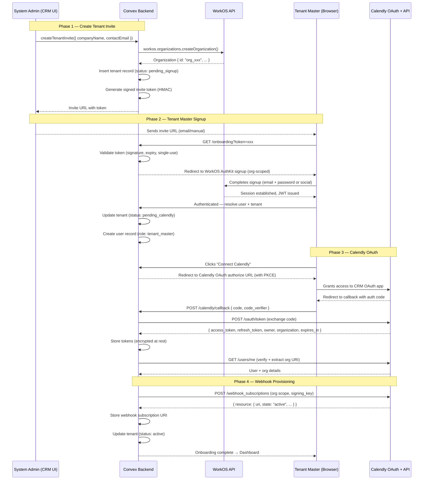

# System Admin & Tenant Onboarding — Design Specification

**Version:** 0.1 (MVP)
**Status:** Draft
**Scope:** System Admin triggers tenant onboarding → WorkOS org creation → tenant signup → Calendly OAuth connection → webhook provisioning → ready for data ingestion.

---

## Table of Contents

1. [Goals & Non-Goals](#1-goals--non-goals)
2. [Actors & Roles](#2-actors--roles)
3. [End-to-End Flow Overview](#3-end-to-end-flow-overview)
4. [Phase 1: System Admin Creates Tenant Invite](#4-phase-1-system-admin-creates-tenant-invite)
5. [Phase 2: WorkOS Organization Provisioning](#5-phase-2-workos-organization-provisioning)
6. [Phase 3: Tenant Master Signup](#6-phase-3-tenant-master-signup)
7. [Phase 4: Calendly OAuth Connection](#7-phase-4-calendly-oauth-connection)
8. [Phase 5: Webhook Provisioning](#8-phase-5-webhook-provisioning)
9. [Phase 6: Organization Member Sync](#9-phase-6-organization-member-sync)
10. [Token Lifecycle & Long-Lived Session Strategy](#10-token-lifecycle--long-lived-session-strategy)
11. [Data Model (Convex Schema)](#11-data-model-convex-schema)
12. [Security Considerations](#12-security-considerations)
13. [Error Handling & Edge Cases](#13-error-handling--edge-cases)
14. [Convex Function Architecture](#14-convex-function-architecture)
15. [Open Questions](#15-open-questions)
16. [Dependencies](#16-dependencies)

---

## 1. Goals & Non-Goals

### Goals

- A system admin (us, the developer) can trigger onboarding for a new customer from a protected admin UI.
- The customer (Tenant Master) receives a link, signs up into a pre-created WorkOS organization, and connects their Calendly account — **once**.
- After onboarding completes, the system holds a long-lived Calendly OAuth session that can refresh indefinitely without the customer ever re-authenticating.
- Webhook subscriptions are automatically provisioned at the Calendly **organization** scope so all events across the tenant's Calendly org flow into our system.
- The system is multi-tenant from day one: every document is tenant-scoped, every query enforces isolation.

### Non-Goals (deferred)

- Tenant Admin or Closer self-service user management (Phase 2).
- Payment logging, pipeline UI, or meeting detail pages (separate design docs).
- Automated email/SMS notifications to the Tenant Master during onboarding.
- SSO / Directory Sync configuration for the tenant's own identity provider.

---

## 2. Actors & Roles

| Actor | Identity | How they authenticate |
|---|---|---|
| **System Admin** | Us (the developers / operators) | WorkOS AuthKit, member of the system admin org (ID set via `SYSTEM_ADMIN_ORG_ID` env var) |
| **Tenant Master** | The customer / business owner | WorkOS AuthKit, member of their own WorkOS organization (created during onboarding) |

The system admin org is hardcoded in `convex/requireSystemAdmin.ts` and `lib/system-admin-org.ts`. All admin mutations validate membership via `ctx.auth.getUserIdentity()` against this org ID.

---

## 3. End-to-End Flow Overview



---

## 4. Phase 1: System Admin Creates Tenant Invite

### 4.1 Admin UI Action

The system admin fills out a minimal form:

| Field | Type | Required | Notes |
|---|---|---|---|
| `companyName` | string | Yes | Display name for the tenant |
| `contactEmail` | string | Yes | Tenant Master's email — used for invite delivery |
| `notes` | string | No | Internal notes for the admin |

### 4.2 WorkOS Organization Creation (via Node SDK)

We use the **`@workos-inc/node` SDK** — not raw API calls — to manage WorkOS resources.

> **Runtime decision:** Org provisioning runs in a **Convex action** (`"use node"`), not a Next.js Server Action. Rationale: the tenant record, invite token, and status transitions all live in Convex. Keeping the WorkOS call in the same runtime avoids a round-trip (Next.js → WorkOS → Next.js → Convex) and keeps the flow atomic. While `@workos-inc/authkit-nextjs` does expose a `getWorkOS()` helper in the Next.js runtime, using it for this flow would split backend logic across two runtimes unnecessarily.
>
> **Dependency:** `@workos-inc/node` must be installed as a direct dependency (`pnpm add @workos-inc/node`). It's already a transitive dep of `@workos-inc/authkit-nextjs` but pnpm does not hoist it.

The Convex action initializes a WorkOS client and calls `createOrganization`:

```typescript
// Inside a Convex action (convex/admin/createTenantInvite.ts)
// This file needs "use node"; since @workos-inc/node uses Node.js built-ins
"use node";

import { WorkOS } from "@workos-inc/node";

const workos = new WorkOS(process.env.WORKOS_API_KEY!, {
  clientId: process.env.WORKOS_CLIENT_ID!,
});

// Inside the action handler:
const org = await workos.organizations.createOrganization({
  name: companyName,
  allowProfilesOutsideOrganization: false,
  // No domainData — MVP tenants are small businesses that may not own a
  // corporate domain. We use invite-only signup (org-scoped AuthKit URL)
  // rather than domain-based auto-join.
  metadata: {
    source: "system_admin_onboarding",
    contactEmail,
  },
});

const workosOrgId = org.id; // e.g. "org_01XXXX..."
```

**Other SDK methods available for admin operations:**

| Operation | SDK Call |
|---|---|
| Get org details | `workos.organizations.getOrganization(orgId)` |
| List all orgs | `workos.organizations.listOrganizations({ search, limit, order })` |
| Update org | `workos.organizations.updateOrganization({ organization: orgId, name, metadata })` |
| Delete org | `workos.organizations.deleteOrganization(orgId)` |
| Get org by external ID | `workos.organizations.getOrganizationByExternalId(externalId)` |

We can also use `externalId` on the org to store our Convex `tenantId`, enabling bidirectional lookup:

```typescript
const org = await workos.organizations.createOrganization({
  name: companyName,
  externalId: tenantId,  // Our Convex tenant doc ID
  // ...
});
```

**Why no domains?** MVP tenants are small businesses that may not own a corporate domain. We use invite-only signup (org-scoped AuthKit URL) rather than domain-based auto-join.

The response gives us `org.id` (e.g., `org_01XXXX...`) which becomes the tenant's `workosOrgId`.

### 4.3 Invite Token Generation

We generate a **signed, time-limited, single-use** invite token:

- **Payload:** `{ tenantId, workosOrgId, contactEmail, createdAt }`
- **Signature:** HMAC-SHA256 using a server-side secret stored in Convex environment variables (`INVITE_SIGNING_SECRET`)
- **Expiry:** 7 days from creation (configurable)
- **Single-use:** The `tenants` record tracks `inviteRedeemedAt` — once set, the token is dead.

The invite URL format:

```
https://{APP_DOMAIN}/onboarding?token={base64url(payload)}.{signature}
```

### 4.4 Tenant Record (Initial State)

```typescript
{
  companyName: "Acme Sales Co",
  contactEmail: "owner@acme.com",
  workosOrgId: "org_01XXXX...",
  status: "pending_signup",       // pending_signup → pending_calendly → active → suspended
  inviteToken: "...",             // hashed for lookup, not stored raw
  inviteExpiresAt: 1712345678,   // Unix ms
  inviteRedeemedAt: undefined,
  calendlyAccessToken: undefined,
  calendlyRefreshToken: undefined,
  calendlyTokenExpiresAt: undefined,
  calendlyOrgUri: undefined,
  calendlyOwnerUri: undefined,
  calendlyWebhookUri: undefined,
  webhookSigningKey: undefined,
  notes: "First pilot customer",
  createdBy: "system_admin_user_id",
}
```

---

## 5. Phase 2: WorkOS Organization Provisioning

### 5.1 Why Pre-Create the Org?

By creating the WorkOS organization **before** the tenant signs up, we gain:

1. **Controlled signup**: The invite link uses an org-scoped AuthKit URL, so the user is automatically placed into the correct organization.
2. **No orphan accounts**: The user cannot sign up without an org context.
3. **Admin visibility**: The system admin can see the pending org in WorkOS dashboard.

### 5.2 Org-Scoped AuthKit Signup URL

WorkOS AuthKit supports org-scoped authentication URLs. When the tenant master clicks the invite link, our onboarding page validates the token, then redirects to:

```
https://auth.{APP_DOMAIN}/sign-up?organization_id={workosOrgId}
```

This ensures:
- The user is created inside the correct WorkOS organization.
- The JWT issued after signup contains the `org_id` claim.
- Our Convex auth layer can map `org_id` → `tenantId`.

### 5.3 Tenant Status Transition

```
pending_signup → pending_calendly
```

Triggered when: the Tenant Master completes WorkOS signup and first authenticates to our app. A Convex mutation:
1. Validates the invite token hasn't expired or been redeemed.
2. Marks `inviteRedeemedAt = Date.now()`.
3. Creates a `users` record with `role: "tenant_master"`.
4. Updates tenant `status` to `pending_calendly`.

---

## 6. Phase 3: Tenant Master Signup

After the Tenant Master completes WorkOS signup, they land on an onboarding wizard within our app. The first (and for MVP, only) step is connecting Calendly.

### 6.1 Onboarding Wizard UI

A single-page wizard with a prominent **"Connect your Calendly account"** button. The page:
- Shows the company name and a welcome message.
- Explains what permissions the CRM needs from Calendly (read events, manage webhooks).
- Has a single CTA button that initiates the Calendly OAuth flow.

---

## 7. Phase 4: Calendly OAuth Connection

This is the most critical phase. The goal is a **permanent, long-lived** connection to the tenant's Calendly organization that never requires re-authentication under normal operation.

### 7.1 OAuth App Configuration (One-Time Developer Setup)

Our CRM is registered as a **single Calendly OAuth App** (production environment) at [developer.calendly.com](https://developer.calendly.com).

| Setting | Value |
|---|---|
| **App type** | Web |
| **Environment** | Production (Sandbox for dev) |
| **Redirect URI** | `https://{APP_DOMAIN}/callback/calendly` (HTTPS required for production) |
| **PKCE** | Required — `code_challenge_method: S256` |
| **Scopes requested** | See below |

**Scopes** (minimum viable set for MVP):

| Scope | Why |
|---|---|
| `scheduled_events:read` | Read scheduled events, invitees; required for webhook event delivery of `invitee.created`, `invitee.canceled`, `invitee_no_show.created/deleted` |
| `event_types:read` | Read event type configurations for pipeline mapping |
| `users:read` | `GET /users/me` to resolve org/user URIs; member sync |
| `organizations:read` | List org memberships for Closer mapping |
| `webhooks:write` | Create and delete webhook subscriptions (implies `webhooks:read`) |
| `routing_forms:read` | Capture routing form submissions for lead qualification |

> **Principle of least privilege:** We do NOT request `:write` on `scheduled_events`, `event_types`, or `organizations` for MVP. If follow-up scheduling via Calendly API is needed later, we add `scheduled_events:write` and `scheduling_links:write` and prompt re-authorization.

### 7.2 OAuth Authorization Flow (PKCE)

**Step 1 — Generate PKCE challenge (server-side in Convex action)**

```
code_verifier = crypto.randomBytes(32).toString('base64url')  // 43-char min
code_challenge = base64url(sha256(code_verifier))
```

The `code_verifier` is stored temporarily in Convex (associated with the tenant's onboarding session) and never exposed to the client.

**Step 2 — Redirect tenant to Calendly authorize**

```
GET https://auth.calendly.com/oauth/authorize
  ?client_id={CALENDLY_CLIENT_ID}
  &response_type=code
  &redirect_uri=https://{APP_DOMAIN}/callback/calendly
  &code_challenge_method=S256
  &code_challenge={code_challenge}
  &scope=scheduled_events:read event_types:read users:read organizations:read webhooks:write routing_forms:read
```

**Step 3 — Handle callback**

Calendly redirects to:
```
https://{APP_DOMAIN}/callback/calendly?code={authorization_code}
```

Our Next.js callback route:
1. Extracts the `code`.
2. Calls a Convex action that performs the token exchange server-side.

**Step 4 — Exchange code for tokens (Convex action, server-side)**

```
POST https://auth.calendly.com/oauth/token
Authorization: Basic base64({client_id}:{client_secret})
Content-Type: application/x-www-form-urlencoded

grant_type=authorization_code
&code={authorization_code}
&redirect_uri=https://{APP_DOMAIN}/callback/calendly
&code_verifier={code_verifier}
```

**Response (200 OK):**

```json
{
  "token_type": "Bearer",
  "access_token": "eyJhbG...",
  "refresh_token": "b77a76ff...",
  "expires_in": 7200,
  "created_at": 1712345678,
  "scope": "scheduled_events:read event_types:read ...",
  "owner": "https://api.calendly.com/users/XXXX",
  "organization": "https://api.calendly.com/organizations/YYYY"
}
```

**Critical extractions:**
- `access_token` — valid for 2 hours.
- `refresh_token` — valid indefinitely until used (single-use under OAuth 2.1 rotation).
- `owner` — the Calendly user URI of the person who authorized (Tenant Master's Calendly user).
- `organization` — the Calendly organization URI (needed for webhook creation and all org-scoped API calls).
- `expires_in` — always 7200 (2 hours).

**Step 5 — Verify and store**

Immediately after token exchange, the Convex action:

1. Calls `GET https://api.calendly.com/users/me` with the new access token to verify the token works and extract the full user/org context.
2. Stores all token data on the tenant record via a Convex mutation (see [Data Model](#11-data-model-convex-schema)).
3. Updates tenant `status` to `provisioning_webhooks`.

### 7.3 Token Storage Security

| Field | Storage | Notes |
|---|---|---|
| `calendlyAccessToken` | Convex document field | Encrypted at rest by Convex. Rotated every 2h. |
| `calendlyRefreshToken` | Convex document field | Encrypted at rest by Convex. Single-use; replaced on every refresh. **This is the crown jewel.** |
| `calendlyTokenExpiresAt` | Convex document field | Unix timestamp (ms). Calculated as `created_at + expires_in * 1000`. |
| `calendlyClientId` | Convex environment variable | Shared across all tenants (one OAuth app). |
| `calendlyClientSecret` | Convex environment variable | **Never** sent to the client. Used only in server-side Convex actions. |

---

## 8. Phase 5: Webhook Provisioning

### 8.1 Create Webhook Subscription

Immediately after storing Calendly tokens, the system provisions a webhook subscription at the **organization** scope:

```
POST https://api.calendly.com/webhook_subscriptions
Authorization: Bearer {access_token}
Content-Type: application/json

{
  "url": "https://{CONVEX_HTTP_URL}/webhooks/calendly/{tenantId}",
  "events": [
    "invitee.created",
    "invitee.canceled",
    "invitee_no_show.created",
    "invitee_no_show.deleted",
    "routing_form_submission.created"
  ],
  "organization": "https://api.calendly.com/organizations/YYYY",
  "scope": "organization",
  "signing_key": "{per_tenant_signing_key}"
}
```

### 8.2 Webhook URL Strategy: Tenant ID in Path

We embed the `tenantId` directly in the webhook callback URL path:

```
/webhooks/calendly/{tenantId}
```

**Why path-based routing:**
- Simplest to implement in Convex HTTP actions (pattern matching on path).
- Immediately identifies the tenant before any crypto verification.
- The `signing_key` per tenant provides the actual security layer.
- Debuggable: you can see which tenant a webhook is for in access logs.

### 8.3 Per-Tenant Webhook Signing Key

Each tenant gets a unique signing key generated at onboarding time:

```typescript
const signingKey = crypto.randomBytes(32).toString('base64url');
```

This key is:
- Passed to Calendly in the `signing_key` field when creating the webhook subscription.
- Stored on the tenant record in Convex.
- Used to verify inbound webhooks via HMAC-SHA256 against the `Calendly-Webhook-Signature` header.

### 8.4 Webhook Signature Verification

Every inbound webhook is verified before processing:

```typescript
// From Calendly-Webhook-Signature header: "t=1492774577,v1=5257a869..."
const [tPart, v1Part] = signature.split(",");
const timestamp = tPart.split("=")[1];
const providedSig = v1Part.split("=")[1];

// Reconstruct expected signature
const signedPayload = timestamp + "." + rawBody;
const expectedSig = hmacSha256(tenant.webhookSigningKey, signedPayload);

// Constant-time comparison
if (!timingSafeEqual(expectedSig, providedSig)) {
  return new Response("Invalid signature", { status: 401 });
}

// Replay protection: reject if timestamp is older than 3 minutes
const THREE_MINUTES = 180;
if (Math.floor(Date.now() / 1000) - parseInt(timestamp) > THREE_MINUTES) {
  return new Response("Stale webhook", { status: 401 });
}
```

### 8.5 Webhook Response Requirements

Per Calendly docs:
- **Connection timeout:** 10 seconds.
- **Read timeout:** 15 seconds.
- **Expected response:** 2xx status code.
- **Retries:** Exponential backoff for up to 24 hours on failure. After 24h with no success, the subscription is **disabled** and must be recreated.

Our Convex HTTP action must respond within 15 seconds. Strategy:
1. **Immediately** persist the raw webhook payload to a `rawWebhookEvents` table.
2. Return `200 OK`.
3. Process the event asynchronously via `ctx.scheduler.runAfter(0, ...)` to a processing mutation/action.

### 8.6 Tenant Status Transition

```
provisioning_webhooks → active
```

After successful webhook subscription creation. The tenant record is updated with:
- `calendlyWebhookUri`: the URI returned by Calendly (e.g., `https://api.calendly.com/webhook_subscriptions/AAAA`)
- `status: "active"`
- `onboardingCompletedAt: Date.now()`

---

## 9. Phase 6: Organization Member Sync

After the tenant is active, we sync the Calendly organization's members to prepare for round-robin Closer assignment:

```
GET https://api.calendly.com/organization_memberships
  ?organization=https://api.calendly.com/organizations/YYYY
Authorization: Bearer {access_token}
```

This returns all Calendly users in the tenant's organization. For each member:
1. Store their `calendly_user_uri` and email.
2. Attempt to match by email against existing CRM users (from WorkOS).
3. Unmatched members are flagged for the Tenant Admin to manually map.

This sync runs:
- Once at onboarding completion.
- Periodically via a Convex cron (e.g., daily) to catch new members.

---

## 10. Token Lifecycle & Long-Lived Session Strategy

This is the cornerstone of the design. The customer should **never** have to re-authenticate with Calendly after the initial onboarding.

### 10.1 Calendly Token Lifetimes

| Token | Lifetime | Notes |
|---|---|---|
| **Access token** | 2 hours (`expires_in: 7200`) | Used for all API calls. Must be refreshed proactively. |
| **Refresh token** | **Indefinite** (until used) | Single-use under OAuth 2.1 rotation. Each refresh yields a new refresh token. Never expires on its own if unused. |

**Key insight:** Calendly refresh tokens do not expire due to inactivity. As long as we correctly rotate (use once, store the new one), the session persists forever.

### 10.2 Proactive Token Refresh Strategy

We do **not** wait for a 401 to refresh. Instead:

**Approach: Refresh-before-use with a safety margin.**

Before any Calendly API call for a tenant:

```typescript
async function getValidAccessToken(ctx: ActionCtx, tenantId: Id<"tenants">): Promise<string> {
  const tenant = await ctx.runQuery(internal.tenants.getCalendlyTokens, { tenantId });

  const now = Date.now();
  const bufferMs = 10 * 60 * 1000; // 10 minutes before expiry

  if (tenant.calendlyTokenExpiresAt > now + bufferMs) {
    // Token is still fresh
    return tenant.calendlyAccessToken;
  }

  // Token is expiring soon or already expired — refresh
  return await refreshCalendlyToken(ctx, tenantId, tenant.calendlyRefreshToken);
}
```

### 10.3 Refresh Token Rotation (OAuth 2.1 — Critical)

Calendly enforces **single-use refresh tokens** (deadline: August 31, 2026, but we implement correctly from day one).

```
POST https://auth.calendly.com/oauth/token
Authorization: Basic base64({client_id}:{client_secret})
Content-Type: application/x-www-form-urlencoded

grant_type=refresh_token
&refresh_token={current_refresh_token}
```

**Response:**
```json
{
  "access_token": "new_access_token...",
  "refresh_token": "new_refresh_token...",
  "expires_in": 7200,
  "created_at": 1712349278,
  "token_type": "Bearer",
  "scope": "...",
  "owner": "https://api.calendly.com/users/XXXX",
  "organization": "https://api.calendly.com/organizations/YYYY"
}
```

**Atomic storage is non-negotiable.** The refresh flow:

1. Read current `refreshToken` from Convex.
2. Call Calendly's token endpoint.
3. **Immediately** write the new `accessToken`, `refreshToken`, and `tokenExpiresAt` back to Convex in a single mutation.
4. If step 3 fails (Convex write error), we have a problem — the old refresh token is already consumed. This is mitigated by Convex's transactional guarantees (mutations are atomic).

### 10.4 Concurrency Guard (Mutex on Refresh)

If two Convex actions try to refresh the same tenant's token simultaneously, the second one will use an already-consumed refresh token and get `invalid_grant`.

**Solution: Optimistic locking with a refresh lock field.**

```typescript
// On the tenant record:
{
  calendlyRefreshLockUntil: number | undefined,  // Unix ms
}
```

Before refreshing:
1. Check if `refreshLockUntil > Date.now()`. If so, wait briefly and retry (or use the current access token if still valid).
2. Set `refreshLockUntil = Date.now() + 30_000` (30s lock).
3. Perform the refresh.
4. Clear the lock and store new tokens atomically.

Since Convex mutations are serialized per-document, this provides a safe mutex.

### 10.5 Scheduled Proactive Refresh (Cron)

In addition to refresh-before-use, a Convex cron job runs every **90 minutes** to proactively refresh tokens for all active tenants:

```typescript
// convex/crons.ts
crons.interval("refresh-calendly-tokens", { minutes: 90 }, internal.calendly.refreshAllTokens, {});
```

This ensures tokens stay fresh even if no user-triggered API calls happen for a while. Since refresh tokens don't expire when idle, this is purely defensive — it keeps the access token hot.

### 10.6 Token Revocation Scenarios

| Scenario | Detection | Recovery |
|---|---|---|
| Refresh returns `invalid_grant` (400/401) | Catch in refresh action | Set tenant `status: "calendly_disconnected"`. Alert system admin. Tenant Master must re-authorize. |
| Tenant removes our app from Calendly settings | Next API call or refresh fails | Same as above. |
| Calendly account deleted | API calls return 401/404 | Same as above. |
| Our app's OAuth credentials rotated | All tenants fail simultaneously | Redeploy with new credentials. All tenants must re-authorize (catastrophic — avoid by never rotating prod OAuth app credentials). |

### 10.7 Token Health Check

A Convex cron (daily) introspects tokens for all active tenants:

```
POST https://auth.calendly.com/oauth/introspect
Content-Type: application/x-www-form-urlencoded

client_id={CALENDLY_CLIENT_ID}
&client_secret={CALENDLY_CLIENT_SECRET}
&token={access_token}
```

If `active: false`, trigger a refresh. If refresh also fails, mark tenant as disconnected.

---

## 11. Data Model (Convex Schema)

### 11.1 `tenants` Table

```typescript
tenants: defineTable({
  // Identity
  companyName: v.string(),
  contactEmail: v.string(),
  workosOrgId: v.string(),               // WorkOS organization ID
  status: v.union(
    v.literal("pending_signup"),
    v.literal("pending_calendly"),
    v.literal("provisioning_webhooks"),
    v.literal("active"),
    v.literal("calendly_disconnected"),
    v.literal("suspended"),
  ),

  // Invite
  inviteTokenHash: v.string(),            // SHA-256 hash of invite token for lookup
  inviteExpiresAt: v.number(),            // Unix ms
  inviteRedeemedAt: v.optional(v.number()),

  // Calendly OAuth
  calendlyAccessToken: v.optional(v.string()),
  calendlyRefreshToken: v.optional(v.string()),
  calendlyTokenExpiresAt: v.optional(v.number()),  // Unix ms
  calendlyOrgUri: v.optional(v.string()),           // e.g. https://api.calendly.com/organizations/XXXX
  calendlyOwnerUri: v.optional(v.string()),         // user URI of whoever authorized
  calendlyRefreshLockUntil: v.optional(v.number()), // Mutex for token refresh

  // Webhooks
  calendlyWebhookUri: v.optional(v.string()),       // Subscription URI for management
  webhookSigningKey: v.optional(v.string()),         // Per-tenant HMAC key

  // Metadata
  notes: v.optional(v.string()),
  createdBy: v.string(),                             // System admin's user identifier
  onboardingCompletedAt: v.optional(v.number()),
})
  .index("by_workosOrgId", ["workosOrgId"])
  .index("by_status", ["status"])
  .index("by_inviteTokenHash", ["inviteTokenHash"]),
```

### 11.2 `users` Table

```typescript
users: defineTable({
  tenantId: v.id("tenants"),
  workosUserId: v.string(),
  email: v.string(),
  fullName: v.optional(v.string()),
  role: v.union(
    v.literal("tenant_master"),
    v.literal("tenant_admin"),
    v.literal("closer"),
  ),
  calendlyUserUri: v.optional(v.string()),  // For round-robin matching
})
  .index("by_tenantId", ["tenantId"])
  .index("by_workosUserId", ["workosUserId"])
  .index("by_tenantId_and_email", ["tenantId", "email"])
  .index("by_tenantId_and_calendlyUserUri", ["tenantId", "calendlyUserUri"]),
```

### 11.3 `rawWebhookEvents` Table

```typescript
rawWebhookEvents: defineTable({
  tenantId: v.id("tenants"),
  calendlyEventUri: v.string(),   // Unique event URI for idempotency
  eventType: v.string(),          // e.g. "invitee.created"
  payload: v.string(),            // Raw JSON string
  processed: v.boolean(),
  receivedAt: v.number(),         // Unix ms
})
  .index("by_tenantId_and_eventType", ["tenantId", "eventType"])
  .index("by_calendlyEventUri", ["calendlyEventUri"])
  .index("by_processed", ["processed"]),
```

### 11.4 `calendlyOrgMembers` Table

```typescript
calendlyOrgMembers: defineTable({
  tenantId: v.id("tenants"),
  calendlyUserUri: v.string(),
  email: v.string(),
  name: v.optional(v.string()),
  role: v.optional(v.string()),     // Calendly org role (owner, admin, user)
  matchedUserId: v.optional(v.id("users")),  // Linked CRM user, if matched
  lastSyncedAt: v.number(),
})
  .index("by_tenantId", ["tenantId"])
  .index("by_tenantId_and_calendlyUserUri", ["tenantId", "calendlyUserUri"]),
```

---

## 12. Security Considerations

### 12.1 Invite Token Security

- Tokens are HMAC-SHA256 signed with a secret known only to the Convex backend.
- Tokens are time-limited (7 days).
- Tokens are single-use (tracked by `inviteRedeemedAt`).
- The raw token is never stored in the database — only a SHA-256 hash for lookup.

### 12.2 Calendly Credential Security

- `CALENDLY_CLIENT_SECRET` is a Convex environment variable, never sent to the browser.
- All token exchange and refresh happens in Convex actions (server-side).
- Tokens are stored in Convex documents (encrypted at rest by Convex infrastructure).
- The PKCE `code_verifier` is generated server-side and never exposed to the client.

### 12.3 Webhook Security

- Each tenant has a unique `webhookSigningKey`.
- All inbound webhooks are verified via HMAC-SHA256 before any processing.
- Replay protection via timestamp validation (3-minute tolerance).
- Unrecognized tenant IDs in the URL path are rejected before any further processing.

### 12.4 Multi-Tenant Isolation

- Every Convex query and mutation that accesses tenant data must scope by `tenantId`.
- System admin functions use `requireSystemAdminSession()` which validates the WorkOS org claim.
- Tenant user functions resolve `tenantId` from the authenticated user's WorkOS org, never from client input.

### 12.5 Rate Limit Awareness

Per Calendly API limits (`.docs/calendly/api-refrerence/api-limits.md`):

| Limit | Value |
|---|---|
| API calls (paid) | 500 requests/user/minute |
| OAuth token requests | 8 per user per minute |
| Webhook delivery timeout | 10s connect, 15s read |

Our proactive refresh cron must respect the 8 tokens/user/minute limit. With per-tenant sequential refresh and a 90-minute interval, we are well within bounds.

---

## 13. Error Handling & Edge Cases

### 13.1 Invite Token Expired

If the tenant clicks the link after 7 days:
- Show a clear error page: "This invite has expired. Please contact your administrator for a new link."
- The system admin can generate a new invite from the admin UI (creates a new token, does NOT create a new WorkOS org — reuses the existing one).

### 13.2 Calendly OAuth Denied

If the tenant declines the Calendly authorization:
- Calendly redirects back without a `code` (or with an `error` param).
- Show a page explaining that the connection is required and offer a "Try again" button.
- Tenant status remains `pending_calendly`.

### 13.3 Webhook Subscription Creation Fails

| Error | Cause | Action |
|---|---|---|
| `403` | Tenant's Calendly plan doesn't support webhooks (free plan) | Alert admin. Tenant needs to upgrade Calendly. |
| `409` | Webhook with same URL already exists | Retrieve existing subscription via `GET /webhook_subscriptions` and store its URI. |
| `401` | Token issue | Refresh and retry once. |

### 13.4 Webhook Disabled by Calendly

If our endpoint is down for 24+ hours, Calendly disables the subscription. Detection:
- The daily health-check cron calls `GET /webhook_subscriptions/{uuid}` and checks `state`.
- If `state: "disabled"`, delete the old subscription and create a new one.
- Alert system admin about potential missed events.

### 13.5 Tenant Re-Authorization Flow

When a tenant's Calendly connection is lost (`status: "calendly_disconnected"`):
1. The Tenant Master sees a banner in the CRM UI: "Your Calendly connection was lost. Please reconnect."
2. Clicking "Reconnect" restarts the OAuth flow (Phase 4).
3. On success, webhook subscriptions are re-provisioned (Phase 5).
4. Tenant status returns to `active`.

---

## 14. Convex Function Architecture

### 14.1 File Organization

```
convex/
├── admin/
│   ├── createTenantInvite.ts      # internalMutation + action (creates WorkOS org + invite)
│   ├── listTenants.ts             # query (system admin: list all tenants)
│   └── getTenant.ts               # query (system admin: single tenant detail)
├── onboarding/
│   ├── validateInvite.ts          # query (validate token, return tenant info)
│   ├── redeemInvite.ts            # mutation (mark invite used, create user)
│   └── completeOnboarding.ts      # mutation (set tenant active)
├── calendly/
│   ├── startOAuth.ts              # action (generate PKCE, return authorize URL)
│   ├── exchangeCode.ts            # action (exchange code for tokens, store, verify)
│   ├── refreshToken.ts            # internalAction (refresh a single tenant's token)
│   ├── refreshAllTokens.ts        # internalAction (cron: refresh all active tenants)
│   ├── provisionWebhooks.ts       # internalAction (create webhook subscription)
│   ├── healthCheck.ts             # internalAction (cron: check webhook + token health)
│   └── syncOrgMembers.ts          # internalAction (sync Calendly org members)
├── webhooks/
│   └── calendly.ts                # HTTP action (receive + verify + persist raw events)
├── tenants.ts                     # internal queries/mutations for tenant CRUD
├── requireSystemAdmin.ts          # existing auth guard
├── auth.ts                        # existing WorkOS AuthKit setup
├── auth.config.ts                 # existing JWT config
├── http.ts                        # HTTP router (add webhook routes)
├── crons.ts                       # Cron jobs
└── schema.ts                      # Schema definitions
```

### 14.2 HTTP Router Updates

```typescript
// convex/http.ts
import { httpRouter } from "convex/server";
import { authKit } from "./auth";
import { handleCalendlyWebhook } from "./webhooks/calendly";

const http = httpRouter();
authKit.registerRoutes(http);

// Calendly webhook ingestion — path includes tenantId
http.route({
  // Convex HTTP routes are exact-match, so we use a catch-all pattern
  // and parse the tenantId from the URL in the handler
  path: "/webhooks/calendly",
  method: "POST",
  handler: handleCalendlyWebhook,
});

export default http;
```

> **Note:** Convex HTTP routes are exact-match. For tenant-scoped webhook URLs, we have two options:
> 1. Use a single route `/webhooks/calendly` and pass `tenantId` as a query parameter in the webhook URL (simpler).
> 2. Register routes dynamically (not supported by Convex).
>
> **Decision:** Use query parameter approach: `https://{CONVEX_HTTP_URL}/webhooks/calendly?tenantId={tenantId}`. This is functionally equivalent to path-based routing for our purposes and compatible with Convex's exact-match routing.

### 14.3 Cron Jobs

```typescript
// convex/crons.ts
import { cronJobs } from "convex/server";
import { internal } from "./_generated/api";

const crons = cronJobs();

// Proactively refresh Calendly tokens every 90 minutes
crons.interval("refresh-calendly-tokens", { minutes: 90 }, internal.calendly.refreshAllTokens, {});

// Daily health check: verify webhook subscriptions + token validity
crons.interval("calendly-health-check", { hours: 24 }, internal.calendly.healthCheck, {});

// Daily org member sync
crons.interval("sync-calendly-org-members", { hours: 24 }, internal.calendly.syncOrgMembers, {});

export default crons;
```

---

## 15. Open Questions

| # | Question | Current Thinking |
|---|---|---|
| 1 | Should we encrypt Calendly tokens at the application layer on top of Convex's at-rest encryption? | Not for MVP. Convex provides at-rest encryption. Application-layer encryption adds complexity (key management) for marginal gain. Revisit if compliance requires it. |
| 2 | How do we handle Calendly's 24-hour webhook disable if our Convex deployment is down? | The health-check cron detects disabled subscriptions and re-creates them. We accept that events during the outage are lost (Calendly does not replay after re-subscription). For critical reliability, consider a dedicated webhook ingestion proxy in front of Convex. |
| 3 | Should the Calendly OAuth callback route be a Next.js API route or a Convex HTTP action? | Next.js API route for the redirect handling (browser-facing), which then calls a Convex action for the server-side token exchange. This keeps the user in the browser flow and avoids CORS issues. |
| 4 | What Calendly plan does the tenant need? | Calendly's free plan has API rate limits of 50 req/min and may not support organization-scoped webhooks. We should document that tenants need a **Standard** plan or higher. The `403` error on webhook creation ("Please upgrade your Calendly account to Standard") is our detection mechanism. |
| 5 | Should we support multiple Calendly organizations per tenant? | No for MVP. One tenant = one Calendly organization. If a business has multiple Calendly orgs, they onboard as separate tenants. |
| 6 | How do we handle the Tenant Master leaving the Calendly org? | The OAuth token is tied to the user who authorized, not the org. If that user is removed from the Calendly org, org-scoped API calls may fail. We should document that the authorizing user must remain an admin of the Calendly org. Alternatively, detect via health check and prompt re-auth by a current admin. |

---

---

## 16. Dependencies

New packages required for this flow (beyond what's already installed):

| Package | Why | Runtime | Install |
|---|---|---|---|
| `@workos-inc/node` | WorkOS SDK for org provisioning, user/membership management | Convex actions (`"use node"`) | `pnpm add @workos-inc/node` |

**Already installed (no action needed):**

| Package | Used for |
|---|---|
| `@workos-inc/authkit-nextjs` | AuthKit UI, `getSignInUrl`/`getSignUpUrl`, session management, `AuthKitProvider` |
| `@convex-dev/workos-authkit` | Convex component for WorkOS webhook sync, user lifecycle events |
| `@convex-dev/workos` | WorkOS Convex integration utilities |

**Environment variables required:**

| Variable | Where set | Used by |
|---|---|---|
| `WORKOS_API_KEY` | Convex env (`npx convex env set`) | WorkOS Node SDK in Convex actions |
| `WORKOS_CLIENT_ID` | Convex env + `.env.local` | WorkOS SDK + AuthKit + Convex auth config |
| `CALENDLY_CLIENT_ID` | Convex env | Calendly OAuth flow |
| `CALENDLY_CLIENT_SECRET` | Convex env | Calendly token exchange (server-side only) |
| `INVITE_SIGNING_SECRET` | Convex env | HMAC signing of invite tokens |

---

*This document will be updated as implementation progresses and decisions from open questions are finalized.*
