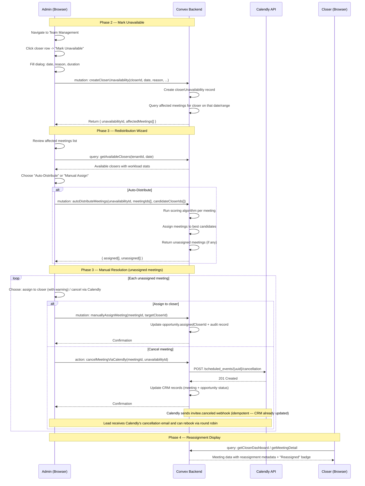
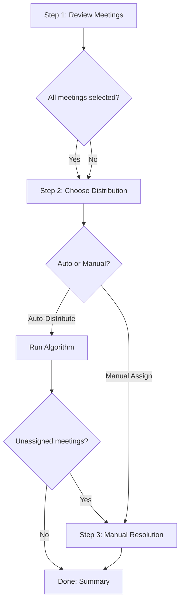
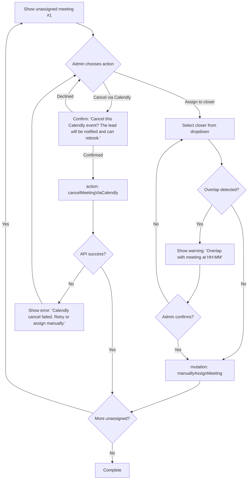

# Closer Unavailability & Workload Redistribution --- Design Specification

**Version:** 0.1 (MVP)
**Status:** Draft
**Scope:** No unavailability tracking or reassignment flow exists today. This feature adds the ability for admins to mark closers as unavailable, automatically identify affected meetings, and redistribute those meetings to available closers --- either via an intelligent auto-distribution algorithm or manual one-by-one assignment. CRM-only reassignment in v0.5; Calendly calendar modifications deferred to v0.6+.
**Prerequisite:** Core team management, closer dashboard, pipeline processing, and meeting detail pages are deployed and operational. Schema tables `users`, `opportunities`, `meetings` exist with current indexes.

---

## Table of Contents

1. [Goals & Non-Goals](#1-goals--non-goals)
2. [Actors & Roles](#2-actors--roles)
3. [End-to-End Flow Overview](#3-end-to-end-flow-overview)
4. [Phase 1: Schema & Backend Foundation](#4-phase-1-schema--backend-foundation)
5. [Phase 2: Mark Unavailable Flow](#5-phase-2-mark-unavailable-flow)
6. [Phase 3: Redistribution Wizard](#6-phase-3-redistribution-wizard)
7. [Phase 4: Reassignment Execution & Audit Trail](#7-phase-4-reassignment-execution--audit-trail)
8. [Data Model](#8-data-model)
9. [Convex Function Architecture](#9-convex-function-architecture)
10. [Routing & Authorization](#10-routing--authorization)
11. [Security Considerations](#11-security-considerations)
12. [Error Handling & Edge Cases](#12-error-handling--edge-cases)
13. [Open Questions](#13-open-questions)
14. [Dependencies](#14-dependencies)
15. [Applicable Skills](#15-applicable-skills)

---

## 1. Goals & Non-Goals

### Goals

- Admins (tenant_master, tenant_admin) can mark any closer as unavailable for a full day or a specific time range, with a categorized reason.
- When a closer is marked unavailable, the system identifies all their meetings within the affected period and presents them for redistribution.
- An intelligent auto-distribution algorithm assigns meetings to available closers based on workload scoring and time-slot availability, with a 15-minute buffer between meetings.
- Meetings that cannot be auto-assigned (no available closer) surface in a manual resolution queue where the admin can force-assign (with overlap warning) or cancel the Calendly event entirely via the Calendly API. Cancellation triggers Calendly's standard notification to the lead, who can rebook through the round-robin event type --- the pipeline's lead resolution handles linking the new booking to the existing lead.
- Reassignment updates the CRM-side `opportunity.assignedCloserId` and creates an auditable `meetingReassignments` record. The original Calendly event and Zoom/meeting link remain unchanged (for reassignments). For cancellations, the Calendly event is canceled via API and the CRM records are updated accordingly.
- Reassigned closers see a "Reassigned" badge on their dashboard for meetings transferred to them, with the original closer's name visible.
- Full audit trail: every reassignment is logged with who did it, when, from whom, and why.

### Non-Goals (deferred)

- **Calendly host reassignment** (reassign host on existing Calendly event) --- deferred to v0.6+. v0.5 reassignment is CRM-only; the Calendly event retains the original host. Cancellation (unassignable meetings) does use the Calendly API.
- **Automated notifications** (email/SMS/push to the new closer or the lead for reassignment) --- deferred to v0.6+. v0.5 relies on the in-app "Reassigned" badge for reassigned meetings. For canceled meetings, Calendly's built-in cancellation notification to the lead serves as the notification mechanism.
- **Custom reschedule link from manual resolution** --- not needed. When a meeting is unassignable and canceled via Calendly API, the lead receives Calendly's cancellation email and can rebook through the round-robin event type. The pipeline's existing lead resolution (email match, and Feature E's identity resolution once deployed) links the new booking to the existing lead. This "cancel and rebook via round robin" approach is simpler and more reliable than generating one-off reschedule links.
- **Recurring/multi-day unavailability** (e.g., "out for a week") --- deferred. v0.5 supports single-date entries; admins create one per day if needed.
- **Self-serve unavailability** (closer marks themselves unavailable) --- deferred. v0.5 is admin-initiated only.
- **Historical unavailability reporting/analytics** --- deferred to v0.7+.

---

## 2. Actors & Roles

| Actor | Identity | Auth Method | Key Permissions |
|---|---|---|---|
| **Admin** | Tenant owner or admin (`tenant_master` / `tenant_admin`) | WorkOS AuthKit, member of tenant org | Mark closers unavailable, trigger redistribution, manually resolve unassigned meetings, view audit trail |
| **Closer** | Individual contributor (`closer`) | WorkOS AuthKit, member of tenant org | View own reassigned meetings with "Reassigned" badge, access existing meeting join link |
| **Convex Backend** | Server-side functions | Internal mutations/queries (no direct auth) | Execute reassignment, update opportunity ownership, write audit records |

### CRM Role <-> External Role Mapping

| CRM `users.role` | WorkOS RBAC Slug | Relevant Permissions |
|---|---|---|
| `tenant_master` | `owner` | `team:manage-availability`, `reassignment:execute`, `reassignment:view-all` |
| `tenant_admin` | `tenant-admin` | `team:manage-availability`, `reassignment:execute`, `reassignment:view-all` |
| `closer` | `closer` | `reassignment:view-own` (implicit via `meeting:view-own`) |

---

## 3. End-to-End Flow Overview



---

## 4. Phase 1: Schema & Backend Foundation

### 4.1 New Tables

This phase adds two new tables (`closerUnavailability`, `meetingReassignments`) and one new optional field on `meetings` to support the reassignment audit trail.

> **Design decision: separate audit table vs. embedded field.** The `meetingReassignments` table is a separate audit log rather than fields on the `meetings` table because: (1) a single meeting could be reassigned multiple times (closer A -> B -> C), and we need the full chain; (2) audit records should be immutable --- separate documents prevent accidental overwrites; (3) querying "all reassignments for a closer" is efficient with a dedicated index.

> **Design decision: `meetings.reassignedFromCloserId` denormalization.** Despite the separate audit table, we add a single denormalized field `reassignedFromCloserId` on `meetings` for display efficiency. The closer dashboard and meeting detail page need to show "Reassigned from X" without joining to the audit table on every render. This field reflects only the most recent reassignment source.

### 4.2 New Permissions

Three new permission entries are added to `convex/lib/permissions.ts`:

```typescript
// Path: convex/lib/permissions.ts
export const PERMISSIONS = {
  // ... existing permissions ...

  // NEW: Feature H --- Closer Unavailability & Redistribution
  "team:manage-availability": ["tenant_master", "tenant_admin"],
  "reassignment:execute": ["tenant_master", "tenant_admin"],
  "reassignment:view-all": ["tenant_master", "tenant_admin"],
} as const;
```

> **Why no `reassignment:view-own` permission?** Closers already have `meeting:view-own` which gates their access to meeting data. The reassignment metadata (badge, original closer name) is included in the existing meeting detail query response --- no new permission required.

### 4.3 Schema Additions

```typescript
// Path: convex/schema.ts

// NEW TABLE: Track when closers are marked unavailable
closerUnavailability: defineTable({
  tenantId: v.id("tenants"),
  closerId: v.id("users"),           // The closer who is unavailable
  date: v.number(),                   // Start-of-day timestamp (midnight UTC of the target date)
  startTime: v.optional(v.number()), // Specific start timestamp (if partial day)
  endTime: v.optional(v.number()),   // Specific end timestamp (if partial day)
  isFullDay: v.boolean(),
  reason: v.union(
    v.literal("sick"),
    v.literal("emergency"),
    v.literal("personal"),
    v.literal("other"),
  ),
  note: v.optional(v.string()),       // Free-text note from admin
  createdByUserId: v.id("users"),     // Admin who created this record
  createdAt: v.number(),              // Unix ms
})
  .index("by_tenantId_and_date", ["tenantId", "date"])
  .index("by_closerId_and_date", ["closerId", "date"]),

// NEW TABLE: Audit log for meeting reassignments
meetingReassignments: defineTable({
  tenantId: v.id("tenants"),
  meetingId: v.id("meetings"),
  opportunityId: v.id("opportunities"),
  fromCloserId: v.id("users"),        // Original closer
  toCloserId: v.id("users"),          // New closer
  reason: v.string(),                  // Human-readable reason (e.g., "Sick - auto-distributed")
  unavailabilityId: v.optional(v.id("closerUnavailability")),  // Link to trigger (if from unavailability flow)
  reassignedByUserId: v.id("users"),  // Admin who executed the reassignment
  reassignedAt: v.number(),           // Unix ms
})
  .index("by_tenantId", ["tenantId"])
  .index("by_meetingId", ["meetingId"])
  .index("by_toCloserId", ["toCloserId"])
  .index("by_fromCloserId", ["fromCloserId"])
  .index("by_unavailabilityId", ["unavailabilityId"]),
```

```typescript
// Path: convex/schema.ts (MODIFIED: meetings table)

meetings: defineTable({
  // ... existing fields ...

  // NEW: Feature H --- Denormalized reassignment source for display efficiency.
  // Set when a meeting is reassigned to a new closer.
  // Points to the closer who originally owned this meeting before the most recent reassignment.
  // Undefined = never reassigned (original assignment from Calendly pipeline).
  reassignedFromCloserId: v.optional(v.id("users")),
})
  // ... existing indexes ...
```

### 4.4 Validation Helpers

```typescript
// Path: convex/lib/unavailabilityValidation.ts

import type { Id } from "../_generated/dataModel";
import type { MutationCtx, QueryCtx } from "../_generated/server";

/**
 * Determine the effective time range for an unavailability record.
 *
 * For full-day records, returns midnight-to-midnight of the target date.
 * For partial-day records, returns the specified startTime-endTime range.
 */
export function getEffectiveRange(unavailability: {
  date: number;
  isFullDay: boolean;
  startTime?: number;
  endTime?: number;
}): { rangeStart: number; rangeEnd: number } {
  if (unavailability.isFullDay) {
    // Full day: from the start-of-day timestamp to +24 hours
    return {
      rangeStart: unavailability.date,
      rangeEnd: unavailability.date + 24 * 60 * 60 * 1000,
    };
  }

  // Partial day: use explicit start/end times
  if (!unavailability.startTime || !unavailability.endTime) {
    throw new Error("Partial-day unavailability must have startTime and endTime");
  }

  return {
    rangeStart: unavailability.startTime,
    rangeEnd: unavailability.endTime,
  };
}

/**
 * Check if a meeting falls within an unavailability time range.
 *
 * A meeting is "affected" if its scheduled time falls within [rangeStart, rangeEnd).
 */
export function isMeetingInRange(
  meetingScheduledAt: number,
  rangeStart: number,
  rangeEnd: number,
): boolean {
  return meetingScheduledAt >= rangeStart && meetingScheduledAt < rangeEnd;
}

/**
 * Validate that a closer exists, belongs to the tenant, and has the "closer" role.
 */
export async function validateCloser(
  ctx: QueryCtx | MutationCtx,
  closerId: Id<"users">,
  tenantId: Id<"tenants">,
): Promise<void> {
  const user = await ctx.db.get(closerId);
  if (!user || user.tenantId !== tenantId) {
    throw new Error("Closer not found in this tenant");
  }
  if (user.role !== "closer") {
    throw new Error("User is not a closer");
  }
}
```

---

## 5. Phase 2: Mark Unavailable Flow

### 5.1 Team Page Integration

The "Mark Unavailable" action is added to the existing team members table dropdown menu. It appears for closer-role users only, alongside the existing "Edit Role", "Remove User", and "Re-link Calendly" actions.

The dialog state discriminated union in `team-page-client.tsx` gains a new variant:

```typescript
// Path: app/workspace/team/_components/team-page-client.tsx (MODIFIED)

type DialogState =
  | { type: null }
  | { type: "remove"; userId: Id<"users">; userName: string }
  | { type: "calendly"; userId: Id<"users">; userName: string }
  | { type: "role"; userId: Id<"users">; userName: string; currentRole: string }
  | { type: "event-type"; userId: Id<"users">; userName: string; currentUri?: string }
  // NEW: Feature H
  | { type: "unavailable"; userId: Id<"users">; userName: string };
```

The dropdown menu in `team-members-table.tsx` adds a new item for closers:

```typescript
// Path: app/workspace/team/_components/team-members-table.tsx (MODIFIED)

// Inside the DropdownMenuContent, after the Re-link Calendly item:
<RequirePermission permission="team:manage-availability">
  {member.role === "closer" && (
    <DropdownMenuItem
      onClick={() => onMarkUnavailable?.(member._id)}
    >
      <UserXIcon data-icon="inline-start" />
      Mark Unavailable
    </DropdownMenuItem>
  )}
</RequirePermission>
```

### 5.2 Unavailability Dialog

A new dialog component handles the unavailability form. It follows the established React Hook Form + Zod pattern.

```typescript
// Path: app/workspace/team/_components/mark-unavailable-dialog.tsx

"use client";

import { useState } from "react";
import { useForm } from "react-hook-form";
import { standardSchemaResolver } from "@hookform/resolvers/standard-schema";
import { z } from "zod";
import { useMutation } from "convex/react";
import { useRouter } from "next/navigation";
import { api } from "@/convex/_generated/api";
import {
  Dialog, DialogContent, DialogHeader, DialogTitle, DialogDescription,
  DialogFooter,
} from "@/components/ui/dialog";
import {
  Form, FormField, FormItem, FormLabel, FormControl, FormMessage,
} from "@/components/ui/form";
import {
  Select, SelectContent, SelectItem, SelectTrigger, SelectValue,
} from "@/components/ui/select";
import { Button } from "@/components/ui/button";
import { Input } from "@/components/ui/input";
import { Textarea } from "@/components/ui/textarea";
import { Switch } from "@/components/ui/switch";
import { Alert, AlertDescription } from "@/components/ui/alert";
import { CalendarIcon, AlertTriangleIcon } from "lucide-react";
import { format } from "date-fns";
import type { Id } from "@/convex/_generated/dataModel";

const unavailabilitySchema = z.object({
  date: z.string().min(1, "Date is required"),
  reason: z.enum(["sick", "emergency", "personal", "other"]),
  note: z.string().optional(),
  isFullDay: z.boolean(),
  startTime: z.string().optional(),
  endTime: z.string().optional(),
}).superRefine((data, ctx) => {
  if (!data.isFullDay) {
    if (!data.startTime) {
      ctx.addIssue({
        code: "custom",
        message: "Start time is required for partial-day unavailability",
        path: ["startTime"],
      });
    }
    if (!data.endTime) {
      ctx.addIssue({
        code: "custom",
        message: "End time is required for partial-day unavailability",
        path: ["endTime"],
      });
    }
    if (data.startTime && data.endTime && data.startTime >= data.endTime) {
      ctx.addIssue({
        code: "custom",
        message: "End time must be after start time",
        path: ["endTime"],
      });
    }
  }
});

interface MarkUnavailableDialogProps {
  open: boolean;
  onOpenChange: (open: boolean) => void;
  closerId: Id<"users">;
  closerName: string;
}

export function MarkUnavailableDialog({
  open, onOpenChange, closerId, closerName,
}: MarkUnavailableDialogProps) {
  const [isSubmitting, setIsSubmitting] = useState(false);
  const [submitError, setSubmitError] = useState<string | null>(null);
  const router = useRouter();

  const createUnavailability = useMutation(
    api.unavailability.mutations.createCloserUnavailability,
  );

  const form = useForm({
    resolver: standardSchemaResolver(unavailabilitySchema),
    defaultValues: {
      date: format(new Date(), "yyyy-MM-dd"),
      reason: undefined as "sick" | "emergency" | "personal" | "other" | undefined,
      note: "",
      isFullDay: true,
      startTime: "",
      endTime: "",
    },
  });

  const isFullDay = form.watch("isFullDay");

  async function onSubmit(values: z.infer<typeof unavailabilitySchema>) {
    setIsSubmitting(true);
    setSubmitError(null);

    try {
      // Convert date string to start-of-day timestamp
      const dateTimestamp = new Date(values.date + "T00:00:00").getTime();

      // Convert time strings to full timestamps if partial day
      let startTime: number | undefined;
      let endTime: number | undefined;
      if (!values.isFullDay && values.startTime && values.endTime) {
        startTime = new Date(values.date + "T" + values.startTime).getTime();
        endTime = new Date(values.date + "T" + values.endTime).getTime();
      }

      const result = await createUnavailability({
        closerId,
        date: dateTimestamp,
        reason: values.reason,
        note: values.note || undefined,
        isFullDay: values.isFullDay,
        startTime,
        endTime,
      });

      // Result contains { unavailabilityId, affectedMeetings }
      // Navigate to redistribution wizard if there are affected meetings
      if (result.affectedMeetings.length > 0) {
        onOpenChange(false);
        // Client-side navigation preserves React state and Convex WebSocket connection
        router.push(
          `/workspace/team/redistribute/${result.unavailabilityId}`,
        );
      } else {
        onOpenChange(false);
      }
    } catch (error) {
      setSubmitError(
        error instanceof Error ? error.message : "Failed to mark unavailable",
      );
    } finally {
      setIsSubmitting(false);
    }
  }

  return (
    <Dialog open={open} onOpenChange={onOpenChange}>
      <DialogContent>
        <DialogHeader>
          <DialogTitle>Mark {closerName} Unavailable</DialogTitle>
          <DialogDescription>
            This will identify meetings that need to be redistributed.
          </DialogDescription>
        </DialogHeader>

        {submitError && (
          <Alert variant="destructive">
            <AlertTriangleIcon className="size-4" />
            <AlertDescription>{submitError}</AlertDescription>
          </Alert>
        )}

        <Form {...form}>
          <form onSubmit={form.handleSubmit(onSubmit)} className="space-y-4">
            {/* Date field */}
            <FormField
              control={form.control}
              name="date"
              render={({ field }) => (
                <FormItem>
                  <FormLabel>
                    Date <span className="text-destructive">*</span>
                  </FormLabel>
                  <FormControl>
                    <Input type="date" {...field} disabled={isSubmitting} />
                  </FormControl>
                  <FormMessage />
                </FormItem>
              )}
            />

            {/* Reason dropdown */}
            <FormField
              control={form.control}
              name="reason"
              render={({ field }) => (
                <FormItem>
                  <FormLabel>
                    Reason <span className="text-destructive">*</span>
                  </FormLabel>
                  <Select
                    onValueChange={field.onChange}
                    defaultValue={field.value}
                    disabled={isSubmitting}
                  >
                    <FormControl>
                      <SelectTrigger>
                        <SelectValue placeholder="Select a reason" />
                      </SelectTrigger>
                    </FormControl>
                    <SelectContent>
                      <SelectItem value="sick">Sick</SelectItem>
                      <SelectItem value="emergency">Emergency</SelectItem>
                      <SelectItem value="personal">Personal</SelectItem>
                      <SelectItem value="other">Other</SelectItem>
                    </SelectContent>
                  </Select>
                  <FormMessage />
                </FormItem>
              )}
            />

            {/* Optional note */}
            <FormField
              control={form.control}
              name="note"
              render={({ field }) => (
                <FormItem>
                  <FormLabel>Note (optional)</FormLabel>
                  <FormControl>
                    <Textarea
                      {...field}
                      placeholder="Additional details..."
                      disabled={isSubmitting}
                      rows={2}
                    />
                  </FormControl>
                  <FormMessage />
                </FormItem>
              )}
            />

            {/* Full day toggle */}
            <FormField
              control={form.control}
              name="isFullDay"
              render={({ field }) => (
                <FormItem className="flex items-center justify-between rounded-lg border p-3">
                  <div>
                    <FormLabel>Full Day</FormLabel>
                    <p className="text-sm text-muted-foreground">
                      Toggle off to specify a time range
                    </p>
                  </div>
                  <FormControl>
                    <Switch
                      checked={field.value}
                      onCheckedChange={field.onChange}
                      disabled={isSubmitting}
                    />
                  </FormControl>
                </FormItem>
              )}
            />

            {/* Conditional time range fields */}
            {!isFullDay && (
              <div className="grid grid-cols-2 gap-4">
                <FormField
                  control={form.control}
                  name="startTime"
                  render={({ field }) => (
                    <FormItem>
                      <FormLabel>
                        Start Time <span className="text-destructive">*</span>
                      </FormLabel>
                      <FormControl>
                        <Input type="time" {...field} disabled={isSubmitting} />
                      </FormControl>
                      <FormMessage />
                    </FormItem>
                  )}
                />
                <FormField
                  control={form.control}
                  name="endTime"
                  render={({ field }) => (
                    <FormItem>
                      <FormLabel>
                        End Time <span className="text-destructive">*</span>
                      </FormLabel>
                      <FormControl>
                        <Input type="time" {...field} disabled={isSubmitting} />
                      </FormControl>
                      <FormMessage />
                    </FormItem>
                  )}
                />
              </div>
            )}

            <DialogFooter>
              <Button
                type="button"
                variant="outline"
                onClick={() => onOpenChange(false)}
                disabled={isSubmitting}
              >
                Cancel
              </Button>
              <Button type="submit" disabled={isSubmitting}>
                {isSubmitting ? "Processing..." : "Mark Unavailable"}
              </Button>
            </DialogFooter>
          </form>
        </Form>
      </DialogContent>
    </Dialog>
  );
}
```

### 5.3 Backend: Create Unavailability & Identify Affected Meetings

```typescript
// Path: convex/unavailability/mutations.ts

import { v } from "convex/values";
import { mutation } from "../_generated/server";
import { requireTenantUser } from "../requireTenantUser";
import {
  getEffectiveRange,
  isMeetingInRange,
  validateCloser,
} from "../lib/unavailabilityValidation";

export const createCloserUnavailability = mutation({
  args: {
    closerId: v.id("users"),
    date: v.number(),
    reason: v.union(
      v.literal("sick"),
      v.literal("emergency"),
      v.literal("personal"),
      v.literal("other"),
    ),
    note: v.optional(v.string()),
    isFullDay: v.boolean(),
    startTime: v.optional(v.number()),
    endTime: v.optional(v.number()),
  },
  handler: async (ctx, args) => {
    console.log("[Unavailability] createCloserUnavailability called", {
      closerId: args.closerId,
      date: args.date,
      reason: args.reason,
      isFullDay: args.isFullDay,
    });

    const { userId, tenantId } = await requireTenantUser(ctx, [
      "tenant_master",
      "tenant_admin",
    ]);

    // Validate the target closer exists and belongs to this tenant
    await validateCloser(ctx, args.closerId, tenantId);

    // Validate partial-day fields
    if (!args.isFullDay) {
      if (!args.startTime || !args.endTime) {
        throw new Error(
          "Partial-day unavailability requires both startTime and endTime",
        );
      }
      if (args.startTime >= args.endTime) {
        throw new Error("startTime must be before endTime");
      }
    }

    // Check for duplicate unavailability on the same date
    const existing = await ctx.db
      .query("closerUnavailability")
      .withIndex("by_closerId_and_date", (q) =>
        q.eq("closerId", args.closerId).eq("date", args.date),
      )
      .first();

    if (existing) {
      throw new Error(
        "An unavailability record already exists for this closer on this date",
      );
    }

    const now = Date.now();
    const unavailabilityId = await ctx.db.insert("closerUnavailability", {
      tenantId,
      closerId: args.closerId,
      date: args.date,
      startTime: args.isFullDay ? undefined : args.startTime,
      endTime: args.isFullDay ? undefined : args.endTime,
      isFullDay: args.isFullDay,
      reason: args.reason,
      note: args.note,
      createdByUserId: userId,
      createdAt: now,
    });

    console.log("[Unavailability] Record created", { unavailabilityId });

    // Identify affected meetings
    const { rangeStart, rangeEnd } = getEffectiveRange({
      date: args.date,
      isFullDay: args.isFullDay,
      startTime: args.startTime,
      endTime: args.endTime,
    });

    // Find the closer's opportunities
    const closerOpps = await ctx.db
      .query("opportunities")
      .withIndex("by_tenantId_and_assignedCloserId", (q) =>
        q.eq("tenantId", tenantId).eq("assignedCloserId", args.closerId),
      )
      .collect();

    const activeOppIds = new Set(
      closerOpps
        .filter((opp) => opp.status === "scheduled" || opp.status === "in_progress")
        .map((opp) => opp._id),
    );

    // Scan meetings in the date range
    const affectedMeetings: Array<{
      meetingId: typeof unavailabilityId extends never ? never : ReturnType<typeof ctx.db.get> extends Promise<infer T> ? NonNullable<T>["_id"] : never;
      scheduledAt: number;
      durationMinutes: number;
      leadName: string | undefined;
      status: string;
    }> = [];

    const meetingsInRange = ctx.db
      .query("meetings")
      .withIndex("by_tenantId_and_scheduledAt", (q) =>
        q.eq("tenantId", tenantId).gte("scheduledAt", rangeStart),
      );

    for await (const meeting of meetingsInRange) {
      // Stop scanning past the range end
      if (meeting.scheduledAt >= rangeEnd) break;

      // Only include meetings for this closer's active opportunities
      if (!activeOppIds.has(meeting.opportunityId)) continue;

      // Only include scheduled meetings (not completed, canceled, etc.)
      if (meeting.status !== "scheduled") continue;

      affectedMeetings.push({
        meetingId: meeting._id,
        scheduledAt: meeting.scheduledAt,
        durationMinutes: meeting.durationMinutes,
        leadName: meeting.leadName,
        status: meeting.status,
      });
    }

    // Sort by scheduled time
    affectedMeetings.sort((a, b) => a.scheduledAt - b.scheduledAt);

    console.log("[Unavailability] Affected meetings identified", {
      unavailabilityId,
      affectedCount: affectedMeetings.length,
      rangeStart: new Date(rangeStart).toISOString(),
      rangeEnd: new Date(rangeEnd).toISOString(),
    });

    return {
      unavailabilityId,
      affectedMeetings,
    };
  },
});
```

### 5.4 Backend: Query Unavailability Details

```typescript
// Path: convex/unavailability/queries.ts

import { v } from "convex/values";
import { query } from "../_generated/server";
import { requireTenantUser } from "../requireTenantUser";
import { getEffectiveRange } from "../lib/unavailabilityValidation";

/**
 * Get full details of an unavailability record with affected meetings.
 * Used by the redistribution wizard page.
 */
export const getUnavailabilityWithMeetings = query({
  args: { unavailabilityId: v.id("closerUnavailability") },
  handler: async (ctx, { unavailabilityId }) => {
    console.log("[Unavailability] getUnavailabilityWithMeetings called", {
      unavailabilityId,
    });

    const { tenantId } = await requireTenantUser(ctx, [
      "tenant_master",
      "tenant_admin",
    ]);

    const unavailability = await ctx.db.get(unavailabilityId);
    if (!unavailability || unavailability.tenantId !== tenantId) {
      throw new Error("Unavailability record not found");
    }

    // Get the closer's name
    const closer = await ctx.db.get(unavailability.closerId);
    const closerName = closer?.fullName ?? closer?.email ?? "Unknown";

    // Get the admin who created this record
    const createdBy = await ctx.db.get(unavailability.createdByUserId);
    const createdByName = createdBy?.fullName ?? createdBy?.email ?? "Unknown";

    // Identify affected meetings (same logic as creation, but re-queried for reactivity)
    const { rangeStart, rangeEnd } = getEffectiveRange(unavailability);

    const closerOpps = await ctx.db
      .query("opportunities")
      .withIndex("by_tenantId_and_assignedCloserId", (q) =>
        q.eq("tenantId", tenantId).eq("assignedCloserId", unavailability.closerId),
      )
      .collect();

    const activeOppIds = new Set(
      closerOpps
        .filter((opp) => opp.status === "scheduled" || opp.status === "in_progress")
        .map((opp) => opp._id),
    );

    const affectedMeetings: Array<{
      meetingId: string;
      opportunityId: string;
      scheduledAt: number;
      durationMinutes: number;
      leadName: string | undefined;
      meetingJoinUrl: string | undefined;
      status: string;
    }> = [];

    const meetingsInRange = ctx.db
      .query("meetings")
      .withIndex("by_tenantId_and_scheduledAt", (q) =>
        q.eq("tenantId", tenantId).gte("scheduledAt", rangeStart),
      );

    for await (const meeting of meetingsInRange) {
      if (meeting.scheduledAt >= rangeEnd) break;
      if (!activeOppIds.has(meeting.opportunityId)) continue;
      if (meeting.status !== "scheduled") continue;

      affectedMeetings.push({
        meetingId: meeting._id,
        opportunityId: meeting.opportunityId,
        scheduledAt: meeting.scheduledAt,
        durationMinutes: meeting.durationMinutes,
        leadName: meeting.leadName,
        meetingJoinUrl: meeting.meetingJoinUrl,
        status: meeting.status,
      });
    }

    affectedMeetings.sort((a, b) => a.scheduledAt - b.scheduledAt);

    // Check existing reassignments for these meetings
    const reassignmentsByMeeting = new Map<string, boolean>();
    for (const meeting of affectedMeetings) {
      const reassignment = await ctx.db
        .query("meetingReassignments")
        .withIndex("by_meetingId", (q) => q.eq("meetingId", meeting.meetingId as any))
        .first();
      reassignmentsByMeeting.set(meeting.meetingId, !!reassignment);
    }

    console.log("[Unavailability] getUnavailabilityWithMeetings completed", {
      unavailabilityId,
      affectedCount: affectedMeetings.length,
      closerName,
    });

    return {
      unavailability: {
        ...unavailability,
        closerName,
        createdByName,
      },
      affectedMeetings: affectedMeetings.map((m) => ({
        ...m,
        alreadyReassigned: reassignmentsByMeeting.get(m.meetingId) ?? false,
      })),
      rangeStart,
      rangeEnd,
    };
  },
});

/**
 * Get available closers for a given date with their workload stats.
 * Used by the redistribution wizard to show candidate closers.
 */
export const getAvailableClosersForDate = query({
  args: {
    date: v.number(),       // Start-of-day timestamp
    excludeCloserId: v.id("users"),  // The unavailable closer to exclude
  },
  handler: async (ctx, { date, excludeCloserId }) => {
    console.log("[Unavailability] getAvailableClosersForDate called", {
      date,
      excludeCloserId,
    });

    const { tenantId } = await requireTenantUser(ctx, [
      "tenant_master",
      "tenant_admin",
    ]);

    // Get all closers in this tenant (excluding the unavailable one)
    const allUsers = await ctx.db
      .query("users")
      .withIndex("by_tenantId", (q) => q.eq("tenantId", tenantId))
      .collect();

    const closers = allUsers.filter(
      (u) => u.role === "closer" && u._id !== excludeCloserId,
    );

    // For each closer, compute their meeting load for the target date
    const dayStart = date;
    const dayEnd = date + 24 * 60 * 60 * 1000;

    const closerStats = await Promise.all(
      closers.map(async (closer) => {
        // Check if this closer is also marked unavailable on this date
        const unavailability = await ctx.db
          .query("closerUnavailability")
          .withIndex("by_closerId_and_date", (q) =>
            q.eq("closerId", closer._id).eq("date", date),
          )
          .first();

        if (unavailability) {
          return {
            closerId: closer._id,
            closerName: closer.fullName ?? closer.email,
            isAvailable: false,
            unavailabilityReason: unavailability.reason,
            meetingsToday: 0,
            meetings: [] as Array<{ scheduledAt: number; durationMinutes: number }>,
          };
        }

        // Get this closer's meetings for the day
        const closerOpps = await ctx.db
          .query("opportunities")
          .withIndex("by_tenantId_and_assignedCloserId", (q) =>
            q.eq("tenantId", tenantId).eq("assignedCloserId", closer._id),
          )
          .collect();

        const activeOppIds = new Set(
          closerOpps
            .filter((opp) => opp.status === "scheduled" || opp.status === "in_progress")
            .map((opp) => opp._id),
        );

        const meetings: Array<{ scheduledAt: number; durationMinutes: number }> = [];

        const dayMeetings = ctx.db
          .query("meetings")
          .withIndex("by_tenantId_and_scheduledAt", (q) =>
            q.eq("tenantId", tenantId).gte("scheduledAt", dayStart),
          );

        for await (const meeting of dayMeetings) {
          if (meeting.scheduledAt >= dayEnd) break;
          if (!activeOppIds.has(meeting.opportunityId)) continue;
          if (meeting.status !== "scheduled") continue;

          meetings.push({
            scheduledAt: meeting.scheduledAt,
            durationMinutes: meeting.durationMinutes,
          });
        }

        return {
          closerId: closer._id,
          closerName: closer.fullName ?? closer.email,
          isAvailable: true,
          unavailabilityReason: null,
          meetingsToday: meetings.length,
          meetings,
        };
      }),
    );

    console.log("[Unavailability] getAvailableClosersForDate completed", {
      totalClosers: closers.length,
      availableCount: closerStats.filter((s) => s.isAvailable).length,
    });

    return closerStats;
  },
});
```

---

## 6. Phase 3: Redistribution Wizard

### 6.1 Wizard Page Structure

The redistribution wizard is a new page under the team route. It receives an `unavailabilityId` parameter and guides the admin through three steps:

1. **Review** --- List of affected meetings with checkboxes
2. **Distribute** --- Available closers with workload stats + auto-distribute or manual assign
3. **Resolve** --- Manual resolution queue for unassigned meetings



### 6.2 Wizard Client Component

```typescript
// Path: app/workspace/team/redistribute/[unavailabilityId]/_components/redistribute-wizard-page-client.tsx

"use client";

import { useState, useMemo } from "react";
import { useQuery, useMutation, useAction } from "convex/react";
import { api } from "@/convex/_generated/api";
import { usePageTitle } from "@/hooks/use-page-title";
import { useRole } from "@/components/auth/role-context";
import { useRouter } from "next/navigation";
import type { Id } from "@/convex/_generated/dataModel";
import {
  Card, CardContent, CardHeader, CardTitle, CardDescription,
} from "@/components/ui/card";
import { Button } from "@/components/ui/button";
import { Badge } from "@/components/ui/badge";
import { Checkbox } from "@/components/ui/checkbox";
import { Alert, AlertDescription } from "@/components/ui/alert";
import { Separator } from "@/components/ui/separator";
import { Skeleton } from "@/components/ui/skeleton";
import {
  ArrowRightIcon, ShuffleIcon, UserIcon, AlertTriangleIcon, CheckCircle2Icon,
} from "lucide-react";
import { format } from "date-fns";

type WizardStep = "review" | "distribute" | "resolve" | "complete";

interface RedistributeWizardProps {
  unavailabilityId: Id<"closerUnavailability">;
}

export function RedistributeWizardPageClient({
  unavailabilityId,
}: RedistributeWizardProps) {
  usePageTitle("Redistribute Meetings");
  const router = useRouter();
  const { isAdmin } = useRole();

  const [step, setStep] = useState<WizardStep>("review");
  const [selectedMeetingIds, setSelectedMeetingIds] = useState<Set<string>>(
    new Set(),
  );
  const [selectedCloserIds, setSelectedCloserIds] = useState<Set<string>>(
    new Set(),
  );
  const [distributionResult, setDistributionResult] = useState<{
    assigned: Array<{ meetingId: string; toCloserId: string; toCloserName: string }>;
    unassigned: Array<{ meetingId: string; reason: string }>;
  } | null>(null);

  // Queries
  const data = useQuery(
    api.unavailability.queries.getUnavailabilityWithMeetings,
    { unavailabilityId },
  );
  const availableClosers = useQuery(
    api.unavailability.queries.getAvailableClosersForDate,
    data
      ? {
          date: data.unavailability.date,
          excludeCloserId: data.unavailability.closerId,
        }
      : "skip",
  );

  // Mutations & Actions
  const autoDistribute = useMutation(
    api.unavailability.redistribution.autoDistributeMeetings,
  );
  const manualAssign = useMutation(
    api.unavailability.redistribution.manuallyAssignMeeting,
  );
  const cancelViaCalendly = useAction(
    api.unavailability.actions.cancelMeetingViaCalendly,
  );

  if (!isAdmin || data === undefined || availableClosers === undefined) {
    return <WizardSkeleton />;
  }

  const { unavailability, affectedMeetings } = data;
  const pendingMeetings = affectedMeetings.filter((m) => !m.alreadyReassigned);

  // Step handlers
  const handleAutoDistribute = async () => {
    const meetingIds = Array.from(selectedMeetingIds) as Id<"meetings">[];
    const candidateCloserIds = Array.from(selectedCloserIds) as Id<"users">[];

    const result = await autoDistribute({
      unavailabilityId,
      meetingIds,
      candidateCloserIds,
    });

    setDistributionResult(result);
    if (result.unassigned.length > 0) {
      setStep("resolve");
    } else {
      setStep("complete");
    }
  };

  return (
    <div className="flex flex-col gap-6">
      <div>
        <h1 className="text-2xl font-bold tracking-tight">
          Redistribute Meetings
        </h1>
        <p className="text-sm text-muted-foreground">
          {unavailability.closerName} is unavailable on{" "}
          {format(new Date(unavailability.date), "EEEE, MMMM d")} ---{" "}
          {unavailability.reason}
        </p>
      </div>

      {/* Step indicator */}
      <div className="flex items-center gap-2 text-sm">
        <StepBadge label="Review" active={step === "review"} done={step !== "review"} />
        <ArrowRightIcon className="size-4 text-muted-foreground" />
        <StepBadge
          label="Distribute"
          active={step === "distribute"}
          done={step === "resolve" || step === "complete"}
        />
        <ArrowRightIcon className="size-4 text-muted-foreground" />
        <StepBadge label="Complete" active={step === "complete" || step === "resolve"} done={step === "complete"} />
      </div>

      <Separator />

      {step === "review" && (
        <ReviewStep
          meetings={pendingMeetings}
          selectedIds={selectedMeetingIds}
          onSelectionChange={setSelectedMeetingIds}
          onNext={() => setStep("distribute")}
        />
      )}

      {step === "distribute" && (
        <DistributeStep
          closers={availableClosers.filter((c) => c.isAvailable)}
          selectedCloserIds={selectedCloserIds}
          onCloserSelectionChange={setSelectedCloserIds}
          selectedMeetingCount={selectedMeetingIds.size}
          onAutoDistribute={handleAutoDistribute}
          onManualAssign={() => setStep("resolve")}
          onBack={() => setStep("review")}
        />
      )}

      {step === "resolve" && (
        <ResolveStep
          unassignedMeetings={
            distributionResult?.unassigned ??
            Array.from(selectedMeetingIds).map((id) => ({
              meetingId: id,
              reason: "Manual assignment selected",
            }))
          }
          allMeetings={affectedMeetings}
          availableClosers={availableClosers.filter((c) => c.isAvailable)}
          unavailabilityId={unavailabilityId}
          onManualAssign={manualAssign}
          onCancelViaCalendly={cancelViaCalendly}
          onComplete={() => setStep("complete")}
        />
      )}

      {step === "complete" && (
        <CompleteStep
          assignedCount={distributionResult?.assigned.length ?? 0}
          onDone={() => router.push("/workspace/team")}
        />
      )}
    </div>
  );
}

// Subcomponents: StepBadge, ReviewStep, DistributeStep, ResolveStep, CompleteStep
// Each is a focused presentational component following the codebase's composition patterns
// (implementations follow the same Card + Table + Button patterns as the existing team page)

function StepBadge({ label, active, done }: { label: string; active: boolean; done: boolean }) {
  return (
    <Badge variant={active ? "default" : done ? "secondary" : "outline"}>
      {done && <CheckCircle2Icon className="mr-1 size-3" />}
      {label}
    </Badge>
  );
}

function WizardSkeleton() {
  return (
    <div className="flex flex-col gap-6">
      <Skeleton className="h-8 w-64" />
      <Skeleton className="h-4 w-96" />
      <Skeleton className="h-[400px] rounded-xl" />
    </div>
  );
}
```

> **Design decision: dedicated page vs. in-dialog wizard.** The redistribution wizard is a full page (`/workspace/team/redistribute/[unavailabilityId]`) rather than a multi-step dialog because: (1) the wizard has three complex steps with tables, each needing significant screen real estate; (2) the URL-based approach allows bookmarking and browser back navigation; (3) it decouples the wizard from the team page, preventing state management complexity in the already-complex team page client.

### 6.3 Auto-Distribution Algorithm

The algorithm scores candidate closers for each meeting and assigns to the highest-scoring candidate.

```typescript
// Path: convex/unavailability/redistribution.ts

import { v } from "convex/values";
import { mutation } from "../_generated/server";
import { requireTenantUser } from "../requireTenantUser";

const BUFFER_MINUTES = 15; // Minimum gap between meetings

interface CloserSchedule {
  closerId: string;
  meetings: Array<{ scheduledAt: number; durationMinutes: number }>;
  meetingsToday: number;
}

/**
 * Check if a meeting time slot is free for a closer, respecting the buffer.
 *
 * A slot is "free" if the meeting does not overlap (including buffer)
 * with any existing meeting on the closer's schedule.
 */
function isSlotFree(
  schedule: CloserSchedule,
  meetingStart: number,
  meetingDuration: number,
): boolean {
  const bufferMs = BUFFER_MINUTES * 60 * 1000;
  const meetingEnd = meetingStart + meetingDuration * 60 * 1000;

  for (const existing of schedule.meetings) {
    const existingEnd =
      existing.scheduledAt + existing.durationMinutes * 60 * 1000;

    // Check for overlap with buffer
    const conflictStart = existing.scheduledAt - bufferMs;
    const conflictEnd = existingEnd + bufferMs;

    if (meetingStart < conflictEnd && meetingEnd > conflictStart) {
      return false; // Overlap detected
    }
  }
  return true;
}

/**
 * Compute a priority score for assigning a meeting to a closer.
 *
 * Higher score = better candidate.
 * Factors:
 *   1. Fewer meetings today -> higher score (base: 100 - meetingsToday * 10)
 *   2. Largest gap around the meeting time -> bonus (up to 20 points)
 */
function computeScore(
  schedule: CloserSchedule,
  meetingStart: number,
  meetingDuration: number,
): number {
  // Base score: inversely proportional to meeting count
  const baseScore = Math.max(0, 100 - schedule.meetingsToday * 10);

  // Gap bonus: find the nearest existing meeting and reward larger gaps
  const meetingEnd = meetingStart + meetingDuration * 60 * 1000;
  let minGap = Number.MAX_SAFE_INTEGER;

  for (const existing of schedule.meetings) {
    const existingEnd =
      existing.scheduledAt + existing.durationMinutes * 60 * 1000;

    // Gap before this existing meeting
    const gapBefore = existing.scheduledAt - meetingEnd;
    // Gap after this existing meeting
    const gapAfter = meetingStart - existingEnd;

    const gap = Math.max(gapBefore, gapAfter);
    if (gap >= 0 && gap < minGap) {
      minGap = gap;
    }
  }

  // No existing meetings = maximum gap bonus
  const gapBonus =
    minGap === Number.MAX_SAFE_INTEGER
      ? 20
      : Math.min(20, Math.floor(minGap / (15 * 60 * 1000)) * 5);

  return baseScore + gapBonus;
}

export const autoDistributeMeetings = mutation({
  args: {
    unavailabilityId: v.id("closerUnavailability"),
    meetingIds: v.array(v.id("meetings")),
    candidateCloserIds: v.array(v.id("users")),
  },
  handler: async (ctx, args) => {
    console.log("[Redistribution] autoDistributeMeetings called", {
      unavailabilityId: args.unavailabilityId,
      meetingCount: args.meetingIds.length,
      candidateCount: args.candidateCloserIds.length,
    });

    const { userId, tenantId } = await requireTenantUser(ctx, [
      "tenant_master",
      "tenant_admin",
    ]);

    // Validate unavailability record
    const unavailability = await ctx.db.get(args.unavailabilityId);
    if (!unavailability || unavailability.tenantId !== tenantId) {
      throw new Error("Unavailability record not found");
    }

    // Build schedules for each candidate closer
    const dayStart = unavailability.date;
    const dayEnd = unavailability.date + 24 * 60 * 60 * 1000;

    const schedules: Map<string, CloserSchedule> = new Map();

    for (const closerId of args.candidateCloserIds) {
      const closer = await ctx.db.get(closerId);
      if (!closer || closer.tenantId !== tenantId || closer.role !== "closer") {
        continue;
      }

      // Get this closer's existing meetings for the day
      const closerOpps = await ctx.db
        .query("opportunities")
        .withIndex("by_tenantId_and_assignedCloserId", (q) =>
          q.eq("tenantId", tenantId).eq("assignedCloserId", closerId),
        )
        .collect();

      const activeOppIds = new Set(
        closerOpps
          .filter((opp) => opp.status === "scheduled" || opp.status === "in_progress")
          .map((opp) => opp._id),
      );

      const meetings: Array<{ scheduledAt: number; durationMinutes: number }> = [];

      const dayMeetings = ctx.db
        .query("meetings")
        .withIndex("by_tenantId_and_scheduledAt", (q) =>
          q.eq("tenantId", tenantId).gte("scheduledAt", dayStart),
        );

      for await (const meeting of dayMeetings) {
        if (meeting.scheduledAt >= dayEnd) break;
        if (!activeOppIds.has(meeting.opportunityId)) continue;
        if (meeting.status !== "scheduled") continue;

        meetings.push({
          scheduledAt: meeting.scheduledAt,
          durationMinutes: meeting.durationMinutes,
        });
      }

      schedules.set(closerId as string, {
        closerId: closerId as string,
        meetings,
        meetingsToday: meetings.length,
      });
    }

    // Load meetings to redistribute, sorted by time
    const meetingsToAssign: Array<{
      meetingId: typeof args.meetingIds[0];
      scheduledAt: number;
      durationMinutes: number;
      opportunityId: string;
    }> = [];

    for (const meetingId of args.meetingIds) {
      const meeting = await ctx.db.get(meetingId);
      if (!meeting || meeting.tenantId !== tenantId) continue;
      if (meeting.status !== "scheduled") continue;

      meetingsToAssign.push({
        meetingId,
        scheduledAt: meeting.scheduledAt,
        durationMinutes: meeting.durationMinutes,
        opportunityId: meeting.opportunityId as string,
      });
    }

    meetingsToAssign.sort((a, b) => a.scheduledAt - b.scheduledAt);

    // Run the assignment algorithm
    const assigned: Array<{
      meetingId: string;
      toCloserId: string;
      toCloserName: string;
    }> = [];
    const unassigned: Array<{
      meetingId: string;
      reason: string;
    }> = [];

    const now = Date.now();
    const reasonLabel = unavailability.reason.charAt(0).toUpperCase() +
      unavailability.reason.slice(1);

    for (const meeting of meetingsToAssign) {
      // Score each candidate
      let bestCandidate: { closerId: string; score: number } | null = null;

      for (const [closerId, schedule] of schedules) {
        if (!isSlotFree(schedule, meeting.scheduledAt, meeting.durationMinutes)) {
          continue;
        }

        const score = computeScore(
          schedule,
          meeting.scheduledAt,
          meeting.durationMinutes,
        );

        if (!bestCandidate || score > bestCandidate.score) {
          bestCandidate = { closerId, score };
        }
      }

      if (bestCandidate) {
        // Assign the meeting
        const opportunity = await ctx.db.get(meeting.meetingId);
        const opp = await ctx.db.get(meeting.opportunityId as any);

        if (opp) {
          const fromCloserId = opp.assignedCloserId;

          // Update opportunity assignment
          await ctx.db.patch(opp._id, {
            assignedCloserId: bestCandidate.closerId as any,
            updatedAt: now,
          });

          // Set denormalized reassignment field on meeting
          await ctx.db.patch(meeting.meetingId, {
            reassignedFromCloserId: fromCloserId,
          });

          // Create audit record
          await ctx.db.insert("meetingReassignments", {
            tenantId,
            meetingId: meeting.meetingId,
            opportunityId: opp._id,
            fromCloserId: fromCloserId!,
            toCloserId: bestCandidate.closerId as any,
            reason: `${reasonLabel} - auto-distributed`,
            unavailabilityId: args.unavailabilityId,
            reassignedByUserId: userId,
            reassignedAt: now,
          });

          // Update the candidate's schedule so subsequent assignments
          // account for this newly assigned meeting
          const schedule = schedules.get(bestCandidate.closerId)!;
          schedule.meetings.push({
            scheduledAt: meeting.scheduledAt,
            durationMinutes: meeting.durationMinutes,
          });
          schedule.meetingsToday++;

          const closer = await ctx.db.get(bestCandidate.closerId as any);
          assigned.push({
            meetingId: meeting.meetingId as string,
            toCloserId: bestCandidate.closerId,
            toCloserName: closer?.fullName ?? closer?.email ?? "Unknown",
          });
        }
      } else {
        unassigned.push({
          meetingId: meeting.meetingId as string,
          reason: "No available closer with a free time slot",
        });
      }
    }

    console.log("[Redistribution] autoDistributeMeetings completed", {
      assignedCount: assigned.length,
      unassignedCount: unassigned.length,
    });

    return { assigned, unassigned };
  },
});

/**
 * Manually assign a single meeting to a specific closer (even with overlap warning).
 * Used during the manual resolution step for meetings that auto-distribution couldn't place.
 */
export const manuallyAssignMeeting = mutation({
  args: {
    meetingId: v.id("meetings"),
    unavailabilityId: v.id("closerUnavailability"),
    targetCloserId: v.id("users"),
  },
  handler: async (ctx, args) => {
    console.log("[Redistribution] manuallyAssignMeeting called", {
      meetingId: args.meetingId,
      targetCloserId: args.targetCloserId,
    });

    const { userId, tenantId } = await requireTenantUser(ctx, [
      "tenant_master",
      "tenant_admin",
    ]);

    const meeting = await ctx.db.get(args.meetingId);
    if (!meeting || meeting.tenantId !== tenantId) {
      throw new Error("Meeting not found");
    }
    if (meeting.status !== "scheduled") {
      throw new Error("Meeting is no longer scheduled");
    }

    const opportunity = await ctx.db.get(meeting.opportunityId);
    if (!opportunity || opportunity.tenantId !== tenantId) {
      throw new Error("Opportunity not found");
    }

    const unavailability = await ctx.db.get(args.unavailabilityId);
    if (!unavailability || unavailability.tenantId !== tenantId) {
      throw new Error("Unavailability record not found");
    }

    const targetCloser = await ctx.db.get(args.targetCloserId);
    if (
      !targetCloser ||
      targetCloser.tenantId !== tenantId ||
      targetCloser.role !== "closer"
    ) {
      throw new Error("Target closer not found or not a closer");
    }

    if (args.targetCloserId === unavailability.closerId) {
      throw new Error("Cannot assign to the unavailable closer");
    }

    const now = Date.now();
    const reasonLabel = unavailability.reason.charAt(0).toUpperCase() +
      unavailability.reason.slice(1);
    const fromCloserId = opportunity.assignedCloserId;

    // Update opportunity assignment
    await ctx.db.patch(opportunity._id, {
      assignedCloserId: args.targetCloserId,
      updatedAt: now,
    });

    // Set denormalized reassignment field
    await ctx.db.patch(args.meetingId, {
      reassignedFromCloserId: fromCloserId,
    });

    // Create audit record
    await ctx.db.insert("meetingReassignments", {
      tenantId,
      meetingId: args.meetingId,
      opportunityId: opportunity._id,
      fromCloserId: fromCloserId!,
      toCloserId: args.targetCloserId,
      reason: `${reasonLabel} - manually assigned`,
      unavailabilityId: args.unavailabilityId,
      reassignedByUserId: userId,
      reassignedAt: now,
    });

    console.log("[Redistribution] Meeting manually assigned", {
      meetingId: args.meetingId,
      fromCloserId,
      toCloserId: args.targetCloserId,
    });

    return {
      action: "assigned" as const,
      targetCloserName: targetCloser.fullName ?? targetCloser.email,
    };
  },
});
```

### 6.3b Cancel Meeting via Calendly API

When a meeting cannot be assigned to any closer, the admin can cancel it via the Calendly API. This triggers Calendly's standard cancellation flow --- the lead receives Calendly's cancellation email and can rebook through the round-robin event type. The pipeline's existing lead resolution (email match, and Feature E's identity resolution once deployed) handles linking the new booking to the existing lead.

> **Design decision: cancel via Calendly API instead of custom reschedule link.** The v0.5 master spec originally included a "Reschedule" option that would generate a one-off scheduling link. We opted for Calendly event cancellation instead because: (1) it's simpler --- no dependency on Feature A's scheduling link infrastructure, which runs in parallel in Window 2; (2) Calendly's built-in cancellation notification is more reliable than a custom email; (3) the lead rebooking through round robin naturally distributes load across all available closers rather than targeting one; (4) the pipeline's lead resolution handles linking the new booking to the existing lead/opportunity automatically.

> **Webhook idempotency note:** After we call the Calendly cancel API, Calendly fires an `invitee.canceled` webhook back to us. The existing `inviteeCanceled` pipeline handler will attempt to process it. Since our action already set the meeting/opportunity status to `"canceled"`, the webhook handler re-applying the same status is a no-op. The `rawWebhookEvent` is still persisted and marked as processed for audit completeness.

```typescript
// Path: convex/unavailability/actions.ts

"use node";

import { v } from "convex/values";
import { action, internalMutation } from "../_generated/server";
import { internal } from "../_generated/api";
import { requireTenantUser } from "../requireTenantUser";
import { getValidAccessToken } from "../calendly/tokens";

/**
 * Cancel a meeting via the Calendly API when no closer is available.
 *
 * Flow:
 * 1. Validate meeting + tenant ownership
 * 2. Get valid Calendly access token for the tenant
 * 3. Extract event UUID from the meeting's calendlyEventUri
 * 4. POST to Calendly's cancellation endpoint
 * 5. Update CRM records (meeting + opportunity status)
 *
 * The lead receives Calendly's standard cancellation notification and can
 * rebook through the round-robin event type. The pipeline's lead resolution
 * handles linking the new booking to the existing lead.
 */
export const cancelMeetingViaCalendly = action({
  args: {
    meetingId: v.id("meetings"),
    unavailabilityId: v.id("closerUnavailability"),
  },
  handler: async (ctx, args) => {
    console.log("[Redistribution] cancelMeetingViaCalendly called", {
      meetingId: args.meetingId,
      unavailabilityId: args.unavailabilityId,
    });

    // Validate auth and load meeting data via internal query
    const data = await ctx.runQuery(
      internal.unavailability.internals.getCancelMeetingData,
      {
        meetingId: args.meetingId,
        unavailabilityId: args.unavailabilityId,
      },
    );

    if (!data) {
      throw new Error("Meeting or unavailability record not found");
    }

    const {
      tenantId,
      calendlyEventUri,
      reasonLabel,
    } = data;

    if (!calendlyEventUri) {
      throw new Error(
        "Meeting has no Calendly event URI --- cannot cancel via Calendly API. " +
        "Use CRM-only cancellation for manually created meetings.",
      );
    }

    // Extract UUID from the full Calendly event URI
    // Format: https://api.calendly.com/scheduled_events/{uuid}
    const eventUuid = calendlyEventUri.split("/").pop();
    if (!eventUuid) {
      throw new Error(`Invalid Calendly event URI: ${calendlyEventUri}`);
    }

    // Get valid Calendly access token for this tenant
    const accessToken = await getValidAccessToken(ctx, tenantId);
    if (!accessToken) {
      throw new Error(
        "Calendly token expired and could not be refreshed. " +
        "Reconnect Calendly in Settings before retrying.",
      );
    }

    // Call Calendly cancel API
    const cancelUrl =
      `https://api.calendly.com/scheduled_events/${eventUuid}/cancellation`;

    console.log("[Redistribution] Calling Calendly cancel API", {
      eventUuid,
      cancelUrl,
    });

    const response = await fetch(cancelUrl, {
      method: "POST",
      headers: {
        Authorization: `Bearer ${accessToken}`,
        "Content-Type": "application/json",
      },
      body: JSON.stringify({
        reason: `Closer unavailable (${reasonLabel}). Please rebook at your convenience.`,
      }),
    });

    if (!response.ok) {
      const errorBody = await response.text();
      console.error("[Redistribution] Calendly cancel API failed", {
        status: response.status,
        body: errorBody,
      });

      // If 404, the event may have already been canceled (lead-initiated or race condition)
      if (response.status === 404) {
        console.log("[Redistribution] Event already canceled or not found on Calendly, proceeding with CRM update");
      } else {
        throw new Error(
          `Calendly cancel API returned ${response.status}: ${errorBody}`,
        );
      }
    } else {
      console.log("[Redistribution] Calendly event canceled successfully", {
        eventUuid,
      });
    }

    // Update CRM records via internal mutation
    await ctx.runMutation(
      internal.unavailability.internals.applyCancellation,
      {
        meetingId: args.meetingId,
        unavailabilityId: args.unavailabilityId,
      },
    );

    console.log("[Redistribution] CRM records updated after cancellation", {
      meetingId: args.meetingId,
    });

    return { action: "canceled" as const };
  },
});
```

```typescript
// Path: convex/unavailability/internals.ts

import { v } from "convex/values";
import { internalQuery, internalMutation } from "../_generated/server";
import { requireTenantUser } from "../requireTenantUser";

/**
 * Internal query to load meeting + unavailability data for the cancel action.
 * Separated from the action to keep the action's handler clean.
 */
export const getCancelMeetingData = internalQuery({
  args: {
    meetingId: v.id("meetings"),
    unavailabilityId: v.id("closerUnavailability"),
  },
  handler: async (ctx, args) => {
    const meeting = await ctx.db.get(args.meetingId);
    if (!meeting) return null;

    const unavailability = await ctx.db.get(args.unavailabilityId);
    if (!unavailability) return null;

    if (meeting.tenantId !== unavailability.tenantId) return null;
    if (meeting.status !== "scheduled") return null;

    const reasonLabel = unavailability.reason.charAt(0).toUpperCase() +
      unavailability.reason.slice(1);

    return {
      tenantId: meeting.tenantId,
      calendlyEventUri: meeting.calendlyEventUri,
      reasonLabel,
    };
  },
});

/**
 * Internal mutation to update CRM records after a successful Calendly cancellation.
 * Called by the cancelMeetingViaCalendly action after the API call succeeds.
 */
export const applyCancellation = internalMutation({
  args: {
    meetingId: v.id("meetings"),
    unavailabilityId: v.id("closerUnavailability"),
  },
  handler: async (ctx, args) => {
    const meeting = await ctx.db.get(args.meetingId);
    if (!meeting) throw new Error("Meeting not found");

    // Idempotency: if already canceled (e.g., webhook arrived first), skip
    if (meeting.status === "canceled") {
      console.log("[Redistribution] Meeting already canceled, skipping CRM update");
      return;
    }

    const opportunity = await ctx.db.get(meeting.opportunityId);
    if (!opportunity) throw new Error("Opportunity not found");

    const unavailability = await ctx.db.get(args.unavailabilityId);
    const reasonLabel = unavailability
      ? unavailability.reason.charAt(0).toUpperCase() + unavailability.reason.slice(1)
      : "Unavailability";

    const now = Date.now();

    await ctx.db.patch(args.meetingId, { status: "canceled" as const });
    await ctx.db.patch(opportunity._id, {
      status: "canceled" as const,
      cancellationReason: `Canceled due to closer unavailability (${reasonLabel}). Lead can rebook via round robin.`,
      updatedAt: now,
    });

    console.log("[Redistribution] CRM records updated for cancellation", {
      meetingId: args.meetingId,
      opportunityId: opportunity._id,
    });
  },
});
```

> **Algorithm design rationale:** The scoring system uses two factors. (1) **Base load score** (100 - meetingsToday * 10): strongly favors closers with fewer meetings, ensuring even distribution. A closer with 0 meetings scores 100 while one with 5 meetings scores 50. (2) **Gap bonus** (up to 20 points): rewards closers who have more breathing room around the proposed time slot, reducing back-to-back meeting fatigue. The 15-minute buffer is a hard constraint (not just a scoring factor) --- if a meeting would land within 15 minutes of an existing meeting, the closer is disqualified for that slot.

### 6.4 Manual Resolution UI

The resolve step presents unassigned meetings one at a time, showing:
- Meeting details (time, lead name, duration, Calendly event link)
- Available closers with overlap warnings
- Action buttons: Assign (with closer picker), Cancel Meeting (via Calendly API)



> **Cancel confirmation UX:** The cancel action is destructive and calls an external API, so it requires explicit confirmation. The confirmation dialog explains: "This will cancel the Calendly event and notify the lead via Calendly's standard cancellation email. The lead can rebook through the round-robin event type." If the API call fails (network error, expired token), the admin sees an error toast with a retry option and the fallback of assigning manually with an overlap warning.

---

## 7. Phase 4: Reassignment Execution & Audit Trail

### 7.1 Opportunity Ownership Transfer

When a meeting is reassigned (either via auto-distribution or manual assignment), the system updates `opportunity.assignedCloserId`. This is the core CRM-side reassignment --- the new closer now "owns" the opportunity and all its meetings.

> **Design decision: reassign at the opportunity level.** The CRM data model ties meetings to opportunities, and opportunities have a single `assignedCloserId`. Reassigning a meeting means transferring the entire opportunity to the new closer. This is correct for v0.5 because each opportunity typically has one active meeting. If multi-meeting-per-opportunity reassignment becomes needed, a `meetings.assignedCloserId` field can be added in a future version.

### 7.2 Meeting Detail Enrichment

The existing `getMeetingDetail` query in `convex/closer/meetingDetail.ts` is extended to include reassignment metadata:

```typescript
// Path: convex/closer/meetingDetail.ts (MODIFIED)

// Inside the getMeetingDetail handler, after loading payment records:

// NEW: Load reassignment metadata (Feature H)
let reassignmentInfo: {
  reassignedFromCloserName: string;
  reassignedAt: number;
  reason: string;
} | null = null;

if (meeting.reassignedFromCloserId) {
  const fromCloser = await ctx.db.get(meeting.reassignedFromCloserId);
  const reassignment = await ctx.db
    .query("meetingReassignments")
    .withIndex("by_meetingId", (q) => q.eq("meetingId", meetingId))
    .order("desc")
    .first();

  reassignmentInfo = {
    reassignedFromCloserName:
      fromCloser?.fullName ?? fromCloser?.email ?? "Unknown",
    reassignedAt: reassignment?.reassignedAt ?? meeting._creationTime,
    reason: reassignment?.reason ?? "Reassigned",
  };
}

// Add to return value:
return {
  // ... existing fields ...
  reassignmentInfo,
};
```

### 7.3 "Reassigned" Badge on Closer Dashboard

The closer dashboard's `FeaturedMeetingCard` and the meeting detail page display a "Reassigned" badge when `meeting.reassignedFromCloserId` is set.

```typescript
// Path: app/workspace/closer/_components/featured-meeting-card.tsx (MODIFIED)

// Inside the card header, after the meeting time display:
{meeting.reassignedFromCloserId && (
  <Badge variant="secondary" className="gap-1">
    <ShuffleIcon className="size-3" />
    Reassigned
  </Badge>
)}
```

The meeting detail page shows the full reassignment context:

```typescript
// Path: app/workspace/closer/meetings/_components/meeting-detail-page-client.tsx (MODIFIED)

// Inside the meeting detail header:
{reassignmentInfo && (
  <Alert>
    <ShuffleIcon className="size-4" />
    <AlertDescription>
      This meeting was reassigned to you from{" "}
      <span className="font-medium">{reassignmentInfo.reassignedFromCloserName}</span>
      {" --- "}
      {reassignmentInfo.reason}
    </AlertDescription>
  </Alert>
)}
```

### 7.4 Closer Dashboard Query Extension

The `getNextMeeting` query in `convex/closer/dashboard.ts` already returns the full meeting document, which will include the new `reassignedFromCloserId` field after the schema migration. No query changes are needed --- the client component reads the field from the existing response.

### 7.5 Admin: Reassignment Audit View

A new section on the admin dashboard or team page shows recent reassignments for the tenant. This is a simple query + table.

```typescript
// Path: convex/unavailability/queries.ts (addition)

/**
 * Get recent reassignments for the tenant.
 * Used by the admin to review the audit trail.
 */
export const getRecentReassignments = query({
  args: {
    limit: v.optional(v.number()),
  },
  handler: async (ctx, { limit }) => {
    const { tenantId } = await requireTenantUser(ctx, [
      "tenant_master",
      "tenant_admin",
    ]);

    const reassignments = await ctx.db
      .query("meetingReassignments")
      .withIndex("by_tenantId", (q) => q.eq("tenantId", tenantId))
      .order("desc")
      .take(limit ?? 20);

    // Enrich with names
    return await Promise.all(
      reassignments.map(async (r) => {
        const fromCloser = await ctx.db.get(r.fromCloserId);
        const toCloser = await ctx.db.get(r.toCloserId);
        const reassignedBy = await ctx.db.get(r.reassignedByUserId);
        const meeting = await ctx.db.get(r.meetingId);

        return {
          ...r,
          fromCloserName: fromCloser?.fullName ?? fromCloser?.email ?? "Unknown",
          toCloserName: toCloser?.fullName ?? toCloser?.email ?? "Unknown",
          reassignedByName: reassignedBy?.fullName ?? reassignedBy?.email ?? "Unknown",
          meetingScheduledAt: meeting?.scheduledAt,
          leadName: meeting?.leadName,
        };
      }),
    );
  },
});
```

---

## 8. Data Model

### 8.1 `closerUnavailability` Table (NEW)

```typescript
// Path: convex/schema.ts

closerUnavailability: defineTable({
  tenantId: v.id("tenants"),
  closerId: v.id("users"),                // The closer who is unavailable
  date: v.number(),                        // Start-of-day timestamp (midnight of target date)
  startTime: v.optional(v.number()),      // Specific start timestamp (partial day only)
  endTime: v.optional(v.number()),        // Specific end timestamp (partial day only)
  isFullDay: v.boolean(),                  // true = entire day, false = use startTime/endTime
  reason: v.union(
    v.literal("sick"),
    v.literal("emergency"),
    v.literal("personal"),
    v.literal("other"),
  ),
  note: v.optional(v.string()),            // Free-text note from admin
  createdByUserId: v.id("users"),          // Admin who created this record
  createdAt: v.number(),                   // Unix ms
})
  .index("by_tenantId_and_date", ["tenantId", "date"])
  .index("by_closerId_and_date", ["closerId", "date"]),
```

### 8.2 `meetingReassignments` Table (NEW)

```typescript
// Path: convex/schema.ts

meetingReassignments: defineTable({
  tenantId: v.id("tenants"),
  meetingId: v.id("meetings"),
  opportunityId: v.id("opportunities"),
  fromCloserId: v.id("users"),             // Original closer
  toCloserId: v.id("users"),               // New closer
  reason: v.string(),                       // Human-readable (e.g., "Sick - auto-distributed")
  unavailabilityId: v.optional(v.id("closerUnavailability")),  // Link to trigger
  reassignedByUserId: v.id("users"),       // Admin who executed reassignment
  reassignedAt: v.number(),                // Unix ms
})
  .index("by_tenantId", ["tenantId"])
  .index("by_meetingId", ["meetingId"])
  .index("by_toCloserId", ["toCloserId"])
  .index("by_fromCloserId", ["fromCloserId"])
  .index("by_unavailabilityId", ["unavailabilityId"]),
```

### 8.3 Modified: `meetings` Table

```typescript
// Path: convex/schema.ts

meetings: defineTable({
  // ... existing fields ...

  // NEW: Feature H --- Denormalized reassignment source.
  // Points to the original closer before the most recent reassignment.
  // Undefined = never reassigned (original Calendly pipeline assignment).
  reassignedFromCloserId: v.optional(v.id("users")),
})
  // ... existing indexes ...
```

### 8.4 Modified: `permissions.ts`

```typescript
// Path: convex/lib/permissions.ts

export const PERMISSIONS = {
  // ... existing permissions ...

  "team:manage-availability": ["tenant_master", "tenant_admin"],
  "reassignment:execute": ["tenant_master", "tenant_admin"],
  "reassignment:view-all": ["tenant_master", "tenant_admin"],
} as const;
```

---

## 9. Convex Function Architecture

```
convex/
├── unavailability/                         # NEW: Feature H directory
│   ├── mutations.ts                        # createCloserUnavailability — Phase 2
│   ├── queries.ts                          # getUnavailabilityWithMeetings, getAvailableClosersForDate, getRecentReassignments — Phases 2, 3, 4
│   ├── redistribution.ts                   # autoDistributeMeetings, manuallyAssignMeeting — Phase 3
│   ├── actions.ts                          # NEW ("use node"): cancelMeetingViaCalendly — Phase 3 (Calendly API cancel)
│   └── internals.ts                        # NEW: getCancelMeetingData (internalQuery), applyCancellation (internalMutation) — Phase 3
├── closer/                                 # MODIFIED
│   ├── dashboard.ts                        # EXISTING (no query changes needed; schema adds field to response)
│   └── meetingDetail.ts                    # MODIFIED: add reassignmentInfo to return — Phase 4
├── calendly/
│   └── tokens.ts                           # EXISTING: getValidAccessToken() — used by cancelMeetingViaCalendly
├── lib/
│   ├── permissions.ts                      # MODIFIED: 3 new permission entries — Phase 1
│   └── unavailabilityValidation.ts         # NEW: getEffectiveRange, isMeetingInRange, validateCloser — Phase 1
├── schema.ts                               # MODIFIED: closerUnavailability, meetingReassignments tables + meetings.reassignedFromCloserId — Phase 1
└── ...
```

---

## 10. Routing & Authorization

### Route Structure

```
app/
├── workspace/
│   ├── team/
│   │   ├── layout.tsx                            # NEW: server-side auth gate — Phase 2 (requireRole for admin routes)
│   │   ├── page.tsx                              # EXISTING: team management
│   │   ├── _components/
│   │   │   ├── team-page-client.tsx               # MODIFIED: new "unavailable" dialog state — Phase 2
│   │   │   ├── team-members-table.tsx             # MODIFIED: "Mark Unavailable" dropdown item — Phase 2
│   │   │   └── mark-unavailable-dialog.tsx        # NEW: unavailability form dialog — Phase 2
│   │   └── redistribute/                          # NEW: Feature H
│   │       └── [unavailabilityId]/
│   │           ├── page.tsx                       # Thin RSC wrapper — Phase 3
│   │           ├── loading.tsx                    # NEW: wizard skeleton — Phase 3
│   │           └── _components/
│   │               └── redistribute-wizard-page-client.tsx  # Wizard UI — Phase 3
│   └── closer/
│       ├── _components/
│       │   ├── closer-dashboard-page-client.tsx   # EXISTING (reads new field from query)
│       │   └── featured-meeting-card.tsx           # MODIFIED: "Reassigned" badge — Phase 4
│       └── meetings/
│           └── [id]/
│               └── _components/
│                   └── meeting-detail-page-client.tsx  # MODIFIED: reassignment alert — Phase 4
```

### Authorization Gating

| Route | Required Roles | Auth Method |
|---|---|---|
| `/workspace/team` (and all sub-routes) | `tenant_master`, `tenant_admin` | **NEW** `requireRole(["tenant_master", "tenant_admin"])` in `team/layout.tsx` (server-side gate — covers team page + redistribute wizard) |
| `/workspace/closer` | `closer` | Existing client-side redirect via `useRole()` |
| `/workspace/closer/meetings/[id]` | `closer`, `tenant_master`, `tenant_admin` | `requireTenantUser(ctx, [...])` in Convex query |

> **Note:** Prior to Feature H, the `/workspace/team` route had no server-side auth gate --- role enforcement was client-side only via `useRole()` in `team-page-client.tsx`. Feature H introduces `team/layout.tsx` with `requireRole()` to properly gate all team sub-routes (including the new redistribute wizard) server-side. This is a security improvement that benefits both the existing team page and the new redistribution flow.

### Team Layout (NEW --- server-side auth gate)

```typescript
// Path: app/workspace/team/layout.tsx

import { requireRole } from "@/lib/auth";

export default async function TeamLayout({
  children,
}: {
  children: React.ReactNode;
}) {
  // Server-side auth gate: only admins can access team routes
  await requireRole(["tenant_master", "tenant_admin"]);

  return <>{children}</>;
}
```

> **Design decision: add `team/layout.tsx` as part of Feature H.** Prior to this feature, the `/workspace/team` route enforced role access client-side only (via `useRole()` in `team-page-client.tsx`). The new redistribute wizard route (`/workspace/team/redistribute/[id]`) requires a server-side auth gate. Rather than adding `requireRole()` to each page RSC individually, we add a layout at the team route segment that gates all sub-routes. This is a security improvement --- it prevents unauthenticated users from reaching the page component at all, and it protects all current and future team sub-routes automatically.

### Redistribute Page RSC

```typescript
// Path: app/workspace/team/redistribute/[unavailabilityId]/page.tsx

import type { Id } from "@/convex/_generated/dataModel";
import { RedistributeWizardPageClient } from "./_components/redistribute-wizard-page-client";

export const unstable_instant = false;

export default async function RedistributePage({
  params,
}: {
  params: Promise<{ unavailabilityId: string }>;
}) {
  const { unavailabilityId } = await params;

  return (
    <RedistributeWizardPageClient
      unavailabilityId={unavailabilityId as Id<"closerUnavailability">}
    />
  );
}
```

The page RSC is intentionally thin --- auth is handled by the parent `team/layout.tsx`, and data access is further protected by `requireTenantUser` in each Convex query/mutation.

---

## 11. Security Considerations

### 11.1 Credential Security

No new credentials or tokens are introduced by this feature. The Calendly cancel action (`cancelMeetingViaCalendly`) uses the existing per-tenant Calendly OAuth access token retrieved via `getValidAccessToken()` in a `"use node"` action --- the token never reaches the client. All other operations use the existing WorkOS AuthKit JWT token flow. No secrets reach the client.

### 11.2 Multi-Tenant Isolation

- Every new table (`closerUnavailability`, `meetingReassignments`) includes a `tenantId` field.
- All queries and mutations resolve `tenantId` from the authenticated identity via `requireTenantUser()` --- never from client input.
- Cross-tenant access is prevented by the tenant mismatch check: `if (!record || record.tenantId !== tenantId) throw`.
- The redistribution algorithm only considers closers and meetings within the same tenant.

### 11.3 Role-Based Data Access

| Data | `tenant_master` | `tenant_admin` | `closer` |
|---|---|---|---|
| Closer unavailability records | Full (create, view) | Full (create, view) | None |
| Meeting reassignment audit log | Full (view all) | Full (view all) | None |
| Reassignment metadata on own meetings | N/A | N/A | Read (badge + from-closer name) |
| Available closers + workload stats | Full (view during redistribution) | Full (view during redistribution) | None |
| Redistribute meetings | Full (execute) | Full (execute) | None |

### 11.4 Input Validation

- `closerId` is validated against the tenant and must have role `"closer"`.
- Date/time inputs are validated for logical consistency (endTime > startTime).
- Duplicate unavailability records on the same date are rejected.
- Meeting IDs are validated against the tenant before reassignment.
- Target closer for manual assignment is validated for role and tenant membership.

### 11.5 Webhook Security

N/A --- this feature introduces no new webhook endpoints. The existing `invitee.canceled` webhook handler (in `convex/pipeline/inviteeCanceled.ts`) processes cancellation events that Calendly fires after our API-initiated cancel. This handler is already secured with HMAC-SHA256 signature verification and replay protection.

### 11.6 Rate Limit Awareness

The Calendly cancel API (`POST /scheduled_events/{uuid}/cancellation`) is called once per manually-canceled meeting during the manual resolution step. This is admin-initiated and bounded by the number of unassigned meetings.

| Concern | Mitigation |
|---|---|
| Calendly API rate limits | Calendly allows ~100 requests/min per OAuth token. Manual resolution is sequential (one meeting at a time), so rate limits are not a concern. Even in the worst case (all meetings unassignable), a closer's daily meeting count is typically < 20. |
| Large-scale redistribution (many meetings) | Bounded by `meetingIds.length` passed from client. Admin selects meetings explicitly. |
| Convex transaction size | A redistribution of N meetings creates N audit records + N opportunity patches. For typical team sizes (< 20 closers, < 50 meetings/day), this fits within Convex's 8 MB transaction limit. |
| Calendly token expiry during cancellation | `getValidAccessToken()` handles token refresh transparently. If refresh fails, the action throws a descriptive error and the admin can retry after reconnecting Calendly in Settings. |

---

## 12. Error Handling & Edge Cases

### 12.1 Closer Already Marked Unavailable for the Same Date

**Scenario:** Admin tries to mark a closer unavailable on a date that already has an unavailability record.
**Detection:** Query `closerUnavailability` by `closerId + date` before insert.
**Action:** Throw error with descriptive message.
**User-facing:** `<Alert variant="destructive">` in the dialog: "An unavailability record already exists for this closer on this date."

### 12.2 No Other Closers Available

**Scenario:** All closers in the tenant are either unavailable or have conflicting schedules for every meeting time slot.
**Detection:** `autoDistributeMeetings` returns all meetings in the `unassigned` array.
**Action:** Transition to manual resolution step.
**User-facing:** Alert in the wizard: "No closers have available time slots. Please resolve meetings manually."

### 12.3 Meeting Already Reassigned

**Scenario:** An admin opens the redistribution wizard, but another admin has already reassigned some meetings (race condition with two admins).
**Detection:** Each meeting in `getUnavailabilityWithMeetings` checks for existing `meetingReassignments` records.
**Action:** Meetings already reassigned are displayed with "Already Reassigned" badge and excluded from the redistribution flow.
**User-facing:** Badge on the meeting row in step 1 of the wizard.

### 12.4 Meeting Canceled Between Unavailability Creation and Redistribution

**Scenario:** A lead cancels their Calendly booking (webhook fires `invitee.canceled`) while the admin is in the redistribution wizard.
**Detection:** Convex's reactive queries automatically update the wizard UI. The meeting's status changes from "scheduled" to "canceled", and the query filters it out.
**Action:** Reactive UI removes the meeting from the list. If the admin has already selected it, the mutation validates `meeting.status === "scheduled"` and skips canceled meetings.
**User-facing:** Meeting disappears from the list in real-time due to Convex reactivity.

### 12.5 Target Closer Becomes Unavailable During Redistribution

**Scenario:** Admin selects closer B as a redistribution target, but another admin marks closer B unavailable before the redistribution mutation executes.
**Detection:** The `autoDistributeMeetings` mutation re-validates each candidate closer at execution time. It checks the `closerUnavailability` table for each candidate.
**Action:** Skip the newly-unavailable closer during scoring. Meeting ends up in the `unassigned` list if no other candidate is available.
**User-facing:** The assigned count is lower than expected; unassigned meetings appear in the manual resolution step.

### 12.6 Opportunity Has Multiple Active Meetings

**Scenario:** An opportunity has two scheduled meetings (e.g., initial consultation + follow-up) and only one falls in the unavailability range.
**Detection:** The query identifies meetings individually by `scheduledAt` range.
**Action:** Only the meeting within the unavailability range is flagged for redistribution. However, reassigning it transfers the entire opportunity to the new closer (since `opportunity.assignedCloserId` is the ownership mechanism). This means the other meeting also moves to the new closer.
**User-facing:** The wizard lists only the affected meeting, but the admin should understand the opportunity-level ownership transfer. A note in the wizard UI explains this: "Reassigning a meeting transfers the entire opportunity to the new closer."

### 12.7 Admin Tries to Assign to the Unavailable Closer

**Scenario:** During manual resolution, admin accidentally selects the originally-unavailable closer as the target.
**Detection:** Validate `targetCloserId !== unavailability.closerId` in `manuallyAssignMeeting`.
**Action:** Throw error.
**User-facing:** The unavailable closer does not appear in the assignment dropdown.

### 12.8 Calendly Cancel API Fails (Network Error / Token Expired)

**Scenario:** Admin clicks "Cancel Meeting" but the Calendly API call fails due to network error, expired token, or Calendly downtime.
**Detection:** `cancelMeetingViaCalendly` action catches the HTTP error (non-2xx/non-404 status).
**Action:** Action throws with a descriptive error. CRM records are NOT updated (the internal mutation only runs after API success).
**User-facing:** Error toast: "Failed to cancel the Calendly event. You can retry or assign the meeting to a closer with an overlap warning." The meeting remains in the unassigned queue for retry.

### 12.9 Calendly Event Already Canceled (404 from API)

**Scenario:** The lead or another admin already canceled the Calendly event before the redistribution admin tries to cancel it.
**Detection:** Calendly API returns 404 for the cancel endpoint.
**Action:** Treat as success --- proceed with the CRM-side cancellation. The event is already gone from Calendly; we just need to update our records to match.
**User-facing:** No error shown. The meeting is marked as canceled in the CRM.

### 12.10 Webhook Arrives Before CRM Update (Race Condition)

**Scenario:** After calling the Calendly cancel API, the `invitee.canceled` webhook arrives and is processed before the `applyCancellation` internal mutation runs.
**Detection:** `applyCancellation` checks `meeting.status === "canceled"` before patching.
**Action:** If the meeting is already canceled (by the webhook handler), the mutation skips the update (idempotent). No duplicate status transitions.
**User-facing:** No impact --- the action still returns `{ action: "canceled" }` regardless of whether the CRM update was applied by the action or the webhook.

### 12.11 Meeting Has No Calendly Event URI

**Scenario:** A meeting record exists without a `calendlyEventUri` (e.g., a manually created record or a data migration artifact).
**Detection:** The `cancelMeetingViaCalendly` action checks for `calendlyEventUri` before attempting the API call.
**Action:** Throw error with a descriptive message suggesting CRM-only cancellation.
**User-facing:** Error toast: "This meeting has no linked Calendly event. Contact support or cancel it manually in the CRM." In practice, this should not occur for webhook-originated meetings.

---

## 13. Open Questions

| # | Question | Current Thinking |
|---|---|---|
| 1 | Should unavailability records be editable/deletable after creation? | Lean toward allowing deletion only if no reassignments have been executed against it. Editing time ranges after reassignment would create audit inconsistencies. Defer edit capability to a future iteration. |
| 2 | How should partial-day unavailability interact with timezone differences between admin and closer? | Store all timestamps in UTC (consistent with existing `scheduledAt` fields). The admin UI converts to local timezone for display. The date picker uses the admin's local date, and time pickers produce UTC-offset timestamps. |
| 3 | Should the "Reassigned" badge be dismissible by the closer? | Lean toward no --- the badge is informational and persists as long as `reassignedFromCloserId` is set. It serves as a permanent record that the meeting was transferred. A closer can acknowledge it but not dismiss it. |
| 4 | What happens to the reassignment if the unavailable closer returns early and wants their meetings back? | Out of scope for v0.5. The admin can manually reassign meetings back by creating a new reassignment. No "undo" flow in v0.5. |
| 5 | Should the auto-distribution algorithm consider closer skill/specialty matching? | Deferred to v0.7+. v0.5 treats all closers as interchangeable. Skill-based routing requires a closer profile/capability model that does not exist yet. |
| 6 | Should `closerUnavailability` have a status field (active/resolved/canceled)? | Lean toward keeping it simple with no status in v0.5 --- the record is immutable once created. A `status` field adds complexity without clear benefit when the primary use case is same-day marking. Revisit if recurring/multi-day unavailability is added. |
| 7 | Should the `inviteeCanceled` pipeline handler be made explicitly idempotent for API-initiated cancellations? | The handler already re-applies `status: "canceled"` which is a no-op patch. However, the opportunity status transition (via `statusTransitions.ts`) may reject a `"canceled" → "canceled"` transition. Verify during Phase 3 implementation and add a guard if needed: `if (meeting.status === "canceled") { markProcessed(); return; }`. |
| 8 | Should we offer a "CRM-only cancel" fallback for meetings without a Calendly event URI? | Lean toward yes --- add a third manual resolution option visible only when `calendlyEventUri` is null. This covers edge cases like manually created records. Low priority since all webhook-originated meetings have the URI. |

---

## 14. Dependencies

### New Packages

None. This feature uses only existing dependencies.

### Already Installed (no action needed)

| Package | Used for |
|---|---|
| `react-hook-form` | Unavailability dialog form state |
| `@hookform/resolvers` | `standardSchemaResolver` for Zod integration |
| `zod` | Schema validation for dialog form |
| `date-fns` | Date formatting in dialog and wizard UI |
| `lucide-react` | Icons: `UserXIcon`, `ShuffleIcon`, `CheckCircle2Icon`, `AlertTriangleIcon` |
| `convex` | Backend functions, reactive queries |
| `next/dynamic` | Lazy loading of the unavailability dialog |

### Environment Variables

None. This feature does not require new environment variables.

---

## 15. Applicable Skills

| Skill | When to Invoke | Phase(s) |
|---|---|---|
| `convex-migration-helper` | Adding `closerUnavailability` and `meetingReassignments` tables to schema; adding `reassignedFromCloserId` to `meetings` (widen step for existing data) | Phase 1 |
| `shadcn` | Building the unavailability dialog, redistribution wizard UI, step indicators, and meeting cards | Phases 2, 3 |
| `frontend-design` | Production-grade wizard interface, responsive layout for redistribution steps | Phase 3 |
| `web-design-guidelines` | WCAG compliance for dialog, wizard, badges; accessible checkbox groups and step indicators | Phases 2, 3, 4 |
| `vercel-react-best-practices` | Optimizing wizard re-renders, memoization of scorer components, lazy loading | Phase 3 |
| `convex-performance-audit` | Reviewing query efficiency for `getAvailableClosersForDate` (N+1 query pattern for closer schedules) | Phase 3 |
| `expect` | Browser-based QA for dialog interactions, wizard flow, badge rendering, responsive layout | All phases |

---

*This document is a living specification. Sections will be updated as implementation progresses and open questions are resolved.*
