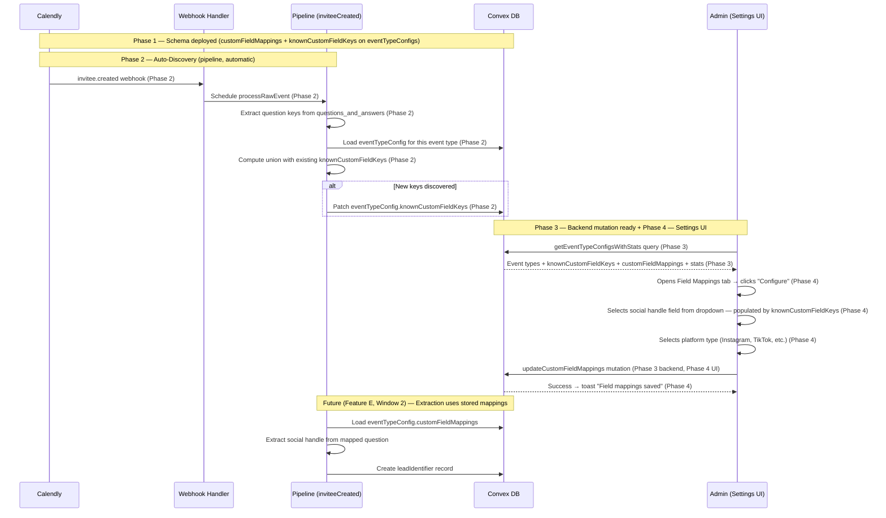
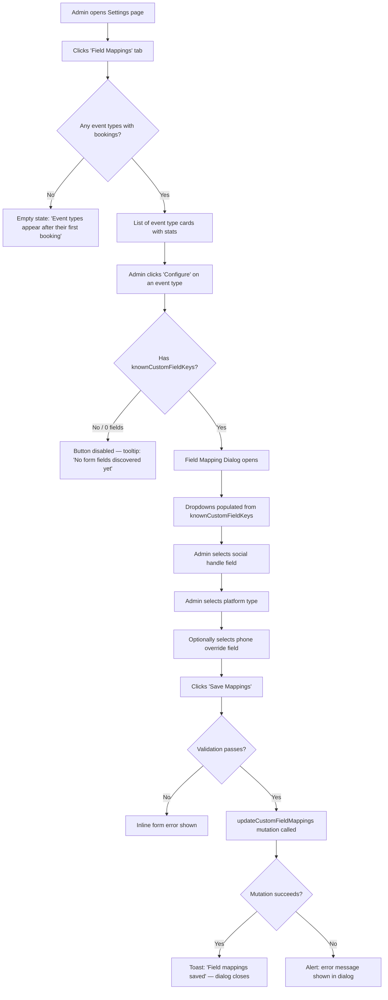
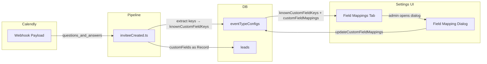

# Event Type Field Mappings — Design Specification

**Version:** 0.1 (MVP)
**Status:** Draft
**Scope:** `eventTypeConfigs` table with payment links and round-robin only → Admins can configure per-event-type field mappings (social handle, phone override) via a new Settings tab, with custom field keys auto-discovered from incoming bookings.
**Prerequisite:** v0.4 deployed. Feature G (UTM Tracking & Attribution) complete — `convex/lib/utmParams.ts` exists, pipeline extracts `utmParams` from webhook payloads. Feature J (Form Handling Modernization) complete — RHF + Zod form infrastructure in place.
**Feature Area:** F (v0.5 Track 2: F → E → C → D — Critical Path)

---

## Table of Contents

1. [Goals & Non-Goals](#1-goals--non-goals)
2. [Actors & Roles](#2-actors--roles)
3. [End-to-End Flow Overview](#3-end-to-end-flow-overview)
4. [Phase 1: Schema — Custom Field Mapping Fields](#4-phase-1-schema--custom-field-mapping-fields)
5. [Phase 2: Auto-Discovery of Custom Field Keys](#5-phase-2-auto-discovery-of-custom-field-keys)
6. [Phase 3: Backend — Field Mapping Mutation](#6-phase-3-backend--field-mapping-mutation)
7. [Phase 4: Settings UI — Field Mappings Tab & Dialog](#7-phase-4-settings-ui--field-mappings-tab--dialog)
8. [Data Model](#8-data-model)
9. [Convex Function Architecture](#9-convex-function-architecture)
10. [Routing & Authorization](#10-routing--authorization)
11. [Security Considerations](#11-security-considerations)
12. [Error Handling & Edge Cases](#12-error-handling--edge-cases)
13. [Open Questions](#13-open-questions)
14. [Dependencies](#14-dependencies)
15. [Applicable Skills](#15-applicable-skills)

---

## 1. Goals & Non-Goals

### Goals

- **Auto-discover custom field keys** from incoming Calendly bookings — the first time a booking arrives for an event type, the system stores the question text strings from the `questions_and_answers` payload, so admins never need to type field names manually.
- **Configurable field mappings per event type** — admins can designate which Calendly form question contains a social handle (and which platform), and which question contains a phone number override, via dropdowns populated from auto-discovered keys.
- **New "Field Mappings" tab in Settings** — shows a read-only list of event types with metadata (last booking date, booking count, discovered form field count) and a "Configure" button that opens the mapping dialog.
- **Backend mutation for saving mappings** — validates and persists `customFieldMappings` on the event type config, scoped to `tenant_master` and `tenant_admin` roles.
- **Prepare the data foundation for Feature E (Lead Identity Resolution)** — Feature E will consume `customFieldMappings` during pipeline processing to extract social handles and create `leadIdentifier` records. Feature F only stores the configuration; extraction logic lives in Feature E.

### Non-Goals (deferred)

- **Social handle extraction from bookings** — Feature E (Lead Identity Resolution, Window 2). Feature F stores the mapping configuration; Feature E reads it during pipeline processing to actually extract and normalize social handle values.
- **Lead identity resolution / deduplication** — Feature E. Multi-identifier lookup, confidence scoring, and `leadIdentifiers` table creation are all E's scope.
- **`programField` mapping** — The v0.5 spec mentions a `programField` in the configuration UI mockup, but no downstream feature area consumes it. Deferred until a feature area needs program-based routing or segmentation. The schema is designed to accommodate adding it later by extending the `customFieldMappings` object.
- **Event type management UI** — Admins manage event types in Calendly. Our Settings page is read-only for event type metadata; only CRM overlay fields (mappings) are editable.
- **Booking count and last booking date aggregation queries** — The Field Mappings tab shows these values. Phase 4 will implement a lightweight aggregation query on the `meetings` table. This is a read-only stat, not a new data model.

---

## 2. Actors & Roles

| Actor | Identity | Auth Method | Key Permissions |
|---|---|---|---|
| **Tenant Master** | Workspace owner | WorkOS AuthKit, member of tenant org, CRM role `tenant_master` | Full settings access. Can view and configure field mappings for all event types. |
| **Tenant Admin** | Workspace admin | WorkOS AuthKit, member of tenant org, CRM role `tenant_admin` | Full settings access. Can view and configure field mappings for all event types. |
| **Closer** | Individual contributor | WorkOS AuthKit, member of tenant org, CRM role `closer` | **No access** to Settings page or Field Mappings tab. Redirected to `/workspace/closer`. |
| **Pipeline (system)** | Webhook processor | Internal mutation (no user auth) | Auto-discovers custom field keys from incoming bookings. Writes `knownCustomFieldKeys` to `eventTypeConfigs`. |

### CRM Role <-> Permission Mapping

| Permission | `tenant_master` | `tenant_admin` | `closer` |
|---|---|---|---|
| `settings:manage` | Yes | Yes | No |
| View Field Mappings tab | Yes | Yes | No |
| Configure field mappings | Yes | Yes | No |

> **No new permissions needed.** The existing `settings:manage` permission already covers this feature. The Settings page already gates on `isAdmin` (which includes both `tenant_master` and `tenant_admin`), and the mutation uses `requireTenantUser(ctx, ["tenant_master", "tenant_admin"])`.

---

## 3. End-to-End Flow Overview



---

## 4. Phase 1: Schema — Custom Field Mapping Fields

### 4.1 What & Why

Add two new optional fields to the `eventTypeConfigs` table:

1. **`customFieldMappings`** — An admin-configured object that maps Calendly form question texts to CRM identity fields. This is a CRM overlay — it does not modify anything in Calendly. It tells the pipeline (in Feature E) which question answer to extract as a social handle or phone number.

2. **`knownCustomFieldKeys`** — A system-managed array of question text strings that the pipeline has seen in actual bookings for this event type. This array populates the dropdowns in the field mapping configuration dialog, so admins pick from real question texts instead of typing them manually.

> **Why optional fields?** Both fields start as `undefined` for existing `eventTypeConfigs` records. No migration is needed — Convex supports adding optional fields without backfill. The pipeline's auto-discovery (Phase 2) will populate `knownCustomFieldKeys` on the next booking for each event type. `customFieldMappings` remains `undefined` until an admin explicitly configures it.

> **Schema coordination with Feature I:** Both Feature F and Feature I (Meeting Detail Enhancements) add fields to `convex/schema.ts` in Window 1. Feature I adds `meetingOutcome` to the `meetings` table. Feature F adds `customFieldMappings` and `knownCustomFieldKeys` to `eventTypeConfigs`. These are **different tables** — no merge conflict. Deploy I's schema first, then F's, per the parallelization strategy. Both additions are optional fields, so functional order doesn't matter; only `npx convex dev` deployments need serialization.

### 4.2 Schema Changes

```typescript
// Path: convex/schema.ts
// MODIFIED: Add customFieldMappings and knownCustomFieldKeys to eventTypeConfigs

eventTypeConfigs: defineTable({
  tenantId: v.id("tenants"),
  calendlyEventTypeUri: v.string(),
  displayName: v.string(),
  paymentLinks: v.optional(
    v.array(
      v.object({
        provider: v.string(),
        label: v.string(),
        url: v.string(),
      }),
    ),
  ),
  roundRobinEnabled: v.boolean(),
  createdAt: v.number(),

  // === Feature F: Event Type Field Mappings ===
  // CRM-only overlays — not from Calendly.
  // Tells the pipeline which Calendly form question maps to which identity field.
  customFieldMappings: v.optional(v.object({
    socialHandleField: v.optional(v.string()),    // The question text that contains the social handle
    socialHandleType: v.optional(v.union(         // Which social platform
      v.literal("instagram"),
      v.literal("tiktok"),
      v.literal("twitter"),
      v.literal("other_social"),
    )),
    phoneField: v.optional(v.string()),           // Override if phone is captured in a custom field
  })),

  // Auto-discovered from incoming bookings (system-managed, read-only from admin perspective).
  // Array of question text strings seen in `questions_and_answers` payloads.
  // Populates the dropdown options in the field mapping configuration dialog.
  knownCustomFieldKeys: v.optional(v.array(v.string())),
})
  .index("by_tenantId", ["tenantId"])
  .index(
    "by_tenantId_and_calendlyEventTypeUri",
    ["tenantId", "calendlyEventTypeUri"],
  ),
```

### 4.3 Deployment

```bash
npx convex dev
pnpm tsc --noEmit
```

Verify:
- `npx convex dev` succeeds (schema additive — no migration needed)
- TypeScript types regenerate (`convex/_generated/dataModel.d.ts` includes new fields)
- Existing event type config queries and mutations still work (new fields are `v.optional`, no existing code breaks)

---

## 5. Phase 2: Auto-Discovery of Custom Field Keys

### 5.1 What & Why

When the pipeline processes an `invitee.created` webhook, it already extracts `questions_and_answers` from the payload and stores the key/value pairs on `lead.customFields` (via the existing `extractQuestionsAndAnswers()` helper at line 28-47 of `inviteeCreated.ts`). 

This phase adds a **side effect at the end of the processing function**: after the main lead/opportunity/meeting creation flow completes, the pipeline checks whether any new question keys were discovered for this event type and, if so, updates the `eventTypeConfig.knownCustomFieldKeys` array.

> **Why at the end of the function?** Auto-discovery is a non-critical enhancement. If it fails, the booking is still processed correctly — leads, opportunities, and meetings are already created. Placing it after `await ctx.db.patch(rawEventId, { processed: true })` means the core processing is complete before the discovery write. However, since this is a mutation (single transaction), both the "mark processed" and the "update known keys" happen atomically. We place the discovery logic **before** marking processed so that a failure in discovery doesn't mark the event as processed — allowing retry.

> **Pipeline file ownership:** Per the parallelization strategy, Feature F's pipeline change goes at the **end** of the `inviteeCreated.ts` handler function, in a clearly delimited `// === Feature F ===` block. Feature A (Follow-Up Overhaul, Window 2) will add UTM routing at the **top** of the function. Feature E (Identity Resolution, Window 2) will modify the **lead lookup/creation section**. Feature B (No-Show, Window 3) will add heuristic detection in the **middle**. Merge order: F → A → E → B.

### 5.2 Discovery Logic

The auto-discovery logic runs inside the existing `process` internalMutation of `inviteeCreated.ts`, appended after the current last line (`await ctx.db.patch(rawEventId, { processed: true })`). It should be placed **just before** the `processed: true` patch so the entire operation remains atomic.

```typescript
// Path: convex/pipeline/inviteeCreated.ts
// Added at end of handler, BEFORE the final `await ctx.db.patch(rawEventId, { processed: true })`

    // === Feature F: Auto-discover custom field keys ===
    // If this booking had questions_and_answers AND we have an eventTypeConfig,
    // ensure the config's knownCustomFieldKeys includes all question texts from this booking.
    if (latestCustomFields && eventTypeConfigId) {
      const incomingKeys = Object.keys(latestCustomFields);
      if (incomingKeys.length > 0) {
        const config = await ctx.db.get(eventTypeConfigId);
        if (config) {
          const existingKeys = config.knownCustomFieldKeys ?? [];
          const existingSet = new Set(existingKeys);
          const newKeys = incomingKeys.filter((k) => !existingSet.has(k));

          if (newKeys.length > 0) {
            const updatedKeys = [...existingKeys, ...newKeys];
            await ctx.db.patch(eventTypeConfigId, {
              knownCustomFieldKeys: updatedKeys,
            });
            console.log(
              `[Pipeline:invitee.created] [Feature F] Auto-discovered ${newKeys.length} new custom field key(s) | configId=${eventTypeConfigId} newKeys=${JSON.stringify(newKeys)} totalKeys=${updatedKeys.length}`,
            );
          }
        }
      }
    }
    // === End Feature F ===

    await ctx.db.patch(rawEventId, { processed: true });
    console.log(`[Pipeline:invitee.created] Marked processed | rawEventId=${rawEventId}`);
```

### 5.3 Key Design Decisions

> **Why not a separate internal mutation?** The discovery logic is a single `ctx.db.get` + conditional `ctx.db.patch` — two DB operations. Extracting it into a separate scheduled mutation would add latency and a second transaction boundary with no benefit. It reads `eventTypeConfigId` and `latestCustomFields`, both of which are already in scope from the main handler.

> **Why union (append-only) instead of replace?** Question texts in Calendly are stable per event type — admins define them in the Calendly form builder. But if an admin changes a question text in Calendly, both the old and new text should appear in `knownCustomFieldKeys`. The old text may still be referenced in `customFieldMappings.socialHandleField`. Append-only preserves backward compatibility. If the array grows stale, a future "prune unused keys" feature can clean up — that's a non-goal for v0.5.

> **Transaction safety:** The entire `process` handler is a single Convex mutation. The discovery write and the "mark processed" write happen atomically. If any DB operation fails, the entire transaction rolls back and the raw event remains unprocessed for retry.

### 5.4 Variables Already in Scope

The discovery logic uses variables that are already computed earlier in the handler:

| Variable | Computed at | Value |
|---|---|---|
| `latestCustomFields` | Line 176 | `Record<string, string> \| undefined` — extracted from `payload.questions_and_answers` |
| `eventTypeConfigId` | Line 215-227 | `Id<"eventTypeConfigs"> \| undefined` — resolved from `eventTypeUri` lookup |

No new arguments, no new imports needed. The `config` fetch (`ctx.db.get(eventTypeConfigId)`) is a point read by ID — O(1), no index needed.

---

## 6. Phase 3: Backend — Field Mapping Mutation

### 6.1 What & Why

Create a dedicated mutation for updating the `customFieldMappings` on an event type config. This is separate from the existing `upsertEventTypeConfig` mutation because:

1. **Different access pattern**: `upsertEventTypeConfig` is called from the Event Types tab (payment links, round robin). The field mapping dialog is a separate UI with different fields.
2. **Simpler validation**: The mapping mutation only validates the mapping fields, not payment links or display names.
3. **Clear responsibility**: One mutation per concern makes it obvious which UI calls which backend.

> **Alternative considered: extend `upsertEventTypeConfig`**. Adding `customFieldMappings` as another optional parameter to the existing mutation would work but would conflate two different admin workflows. The existing mutation's handler already has 6 parameters and complex conditional logic for payment links. Keeping them separate follows the single-responsibility principle and avoids accidentally clearing mappings when saving payment links (or vice versa).

### 6.2 Mutation Implementation

```typescript
// Path: convex/eventTypeConfigs/mutations.ts
// NEW: updateCustomFieldMappings mutation

const socialHandleTypeValidator = v.union(
  v.literal("instagram"),
  v.literal("tiktok"),
  v.literal("twitter"),
  v.literal("other_social"),
);

const customFieldMappingsValidator = v.object({
  socialHandleField: v.optional(v.string()),
  socialHandleType: v.optional(socialHandleTypeValidator),
  phoneField: v.optional(v.string()),
});

/**
 * Update the custom field mappings for an event type config.
 * Admin-only: configures which Calendly form questions map to CRM identity fields.
 */
export const updateCustomFieldMappings = mutation({
  args: {
    eventTypeConfigId: v.id("eventTypeConfigs"),
    customFieldMappings: customFieldMappingsValidator,
  },
  handler: async (ctx, { eventTypeConfigId, customFieldMappings }) => {
    console.log("[EventTypeConfig] updateCustomFieldMappings called", {
      eventTypeConfigId,
      customFieldMappings,
    });
    const { tenantId } = await requireTenantUser(ctx, [
      "tenant_master",
      "tenant_admin",
    ]);

    const config = await ctx.db.get(eventTypeConfigId);
    if (!config) {
      throw new Error("Event type configuration not found.");
    }
    if (config.tenantId !== tenantId) {
      throw new Error("Event type configuration not found.");
    }

    // Validate that mapped fields exist in knownCustomFieldKeys (if keys are available)
    const knownKeys = config.knownCustomFieldKeys ?? [];
    if (knownKeys.length > 0) {
      if (
        customFieldMappings.socialHandleField &&
        !knownKeys.includes(customFieldMappings.socialHandleField)
      ) {
        throw new Error(
          `Social handle field "${customFieldMappings.socialHandleField}" is not a known form field for this event type.`,
        );
      }
      if (
        customFieldMappings.phoneField &&
        !knownKeys.includes(customFieldMappings.phoneField)
      ) {
        throw new Error(
          `Phone field "${customFieldMappings.phoneField}" is not a known form field for this event type.`,
        );
      }
    }

    // Validate that socialHandleType is set if socialHandleField is set
    if (customFieldMappings.socialHandleField && !customFieldMappings.socialHandleType) {
      throw new Error(
        "Social handle platform type is required when a social handle field is selected.",
      );
    }

    // Clear socialHandleType if socialHandleField is cleared
    const normalizedMappings = {
      socialHandleField: customFieldMappings.socialHandleField || undefined,
      socialHandleType: customFieldMappings.socialHandleField
        ? customFieldMappings.socialHandleType
        : undefined,
      phoneField: customFieldMappings.phoneField || undefined,
    };

    await ctx.db.patch(eventTypeConfigId, {
      customFieldMappings: normalizedMappings,
    });

    console.log("[EventTypeConfig] updateCustomFieldMappings saved", {
      configId: eventTypeConfigId,
      mappings: normalizedMappings,
    });
  },
});
```

### 6.3 Aggregation Query for Field Mappings Tab

The Field Mappings tab needs booking counts and last booking dates per event type. Add a query that computes these lightweight aggregates:

```typescript
// Path: convex/eventTypeConfigs/queries.ts
// NEW: getEventTypeConfigsWithStats query

/**
 * List event type configs with booking stats for the Field Mappings tab.
 * Returns configs enriched with:
 * - bookingCount: number of meetings linked to this event type's opportunities
 * - lastBookingAt: timestamp of the most recent meeting
 * - fieldCount: number of discovered custom field keys
 */
export const getEventTypeConfigsWithStats = query({
  args: {},
  handler: async (ctx) => {
    console.log("[EventTypeConfig] getEventTypeConfigsWithStats called");
    const { tenantId } = await requireTenantUser(ctx, [
      "tenant_master",
      "tenant_admin",
    ]);

    const configs = [];
    for await (const config of ctx.db
      .query("eventTypeConfigs")
      .withIndex("by_tenantId", (q) => q.eq("tenantId", tenantId))) {
      configs.push(config);
    }

    // For each config, count opportunities and find the most recent meeting
    const results = await Promise.all(
      configs.map(async (config) => {
        let bookingCount = 0;
        let lastBookingAt: number | undefined;

        // Count opportunities linked to this event type config
        for await (const opp of ctx.db
          .query("opportunities")
          .withIndex("by_tenantId", (q) => q.eq("tenantId", tenantId))) {
          if (opp.eventTypeConfigId === config._id) {
            bookingCount++;
            // Use opportunity's latestMeetingAt as a proxy for last booking date
            if (
              opp.latestMeetingAt &&
              (lastBookingAt === undefined || opp.latestMeetingAt > lastBookingAt)
            ) {
              lastBookingAt = opp.latestMeetingAt;
            }
          }
        }

        return {
          ...config,
          bookingCount,
          lastBookingAt,
          fieldCount: config.knownCustomFieldKeys?.length ?? 0,
        };
      }),
    );

    console.log("[EventTypeConfig] getEventTypeConfigsWithStats result", {
      count: results.length,
    });
    return results;
  },
});
```

> **Performance note:** This query scans all opportunities for the tenant and filters by `eventTypeConfigId` in memory. For small tenants (< 500 opportunities), this is fine. For larger tenants, an index `by_tenantId_and_eventTypeConfigId` on opportunities would be beneficial. This is a **non-goal** for Feature F — if Feature E or C introduces performance concerns, the `convex-performance-audit` skill should be applied then. The denormalized `latestMeetingAt` on opportunities (already computed by `updateOpportunityMeetingRefs`) avoids the need to scan the meetings table.

---

## 7. Phase 4: Settings UI — Field Mappings Tab & Dialog

### 7.1 What & Why

Add a "Field Mappings" tab to the existing Settings page that shows all event types with their auto-discovered field counts and booking stats. Each event type row has a "Configure" button that opens a dialog for mapping fields.

The tab is read-only for event type metadata (name, stats) — only the `customFieldMappings` configuration is editable. This reinforces the principle that event types are managed in Calendly; the CRM only adds overlays.

### 7.2 Settings Page Modifications

The `settings-page-client.tsx` needs two changes:

1. Add a third `TabsTrigger` for "Field Mappings"
2. Add a new `TabsContent` that renders the `FieldMappingsTab` component
3. Add a new query subscription for `getEventTypeConfigsWithStats`

```typescript
// Path: app/workspace/settings/_components/settings-page-client.tsx
// MODIFIED: Add Field Mappings tab

"use client";

import { useEffect } from "react";
import { useQuery } from "convex/react";
import { api } from "@/convex/_generated/api";
import { useRouter } from "next/navigation";
import { useRole } from "@/components/auth/role-context";
import { Tabs, TabsContent, TabsList, TabsTrigger } from "@/components/ui/tabs";
import { usePageTitle } from "@/hooks/use-page-title";
import SettingsLoading from "../loading";
import { CalendlyConnection } from "./calendly-connection";
import { EventTypeConfigList } from "./event-type-config-list";
import { FieldMappingsTab } from "./field-mappings-tab";

export function SettingsPageClient() {
  usePageTitle("Settings");
  const router = useRouter();
  const { isAdmin } = useRole();

  const eventTypeConfigs = useQuery(
    api.eventTypeConfigs.queries.listEventTypeConfigs,
    isAdmin ? {} : "skip",
  );
  const connectionStatus = useQuery(
    api.calendly.oauthQueries.getConnectionStatus,
    isAdmin ? {} : "skip",
  );
  const configsWithStats = useQuery(
    api.eventTypeConfigs.queries.getEventTypeConfigsWithStats,
    isAdmin ? {} : "skip",
  );

  useEffect(() => {
    if (!isAdmin) {
      router.replace("/workspace/closer");
    }
  }, [isAdmin, router]);

  if (
    !isAdmin ||
    eventTypeConfigs === undefined ||
    connectionStatus === undefined ||
    configsWithStats === undefined
  ) {
    return <SettingsLoading />;
  }

  return (
    <div className="flex flex-col gap-6">
      <div>
        <h1 className="text-3xl font-bold tracking-tight">Settings</h1>
        <p className="mt-2 text-muted-foreground">
          Manage your workspace configuration
        </p>
      </div>

      <Tabs defaultValue="calendly" className="w-full">
        <TabsList>
          <TabsTrigger value="calendly">Calendly</TabsTrigger>
          <TabsTrigger value="event-types">Event Types</TabsTrigger>
          <TabsTrigger value="field-mappings">Field Mappings</TabsTrigger>
        </TabsList>

        <TabsContent value="calendly" className="mt-6">
          <CalendlyConnection connectionStatus={connectionStatus} />
        </TabsContent>

        <TabsContent value="event-types" className="mt-6">
          <EventTypeConfigList configs={eventTypeConfigs} />
        </TabsContent>

        <TabsContent value="field-mappings" className="mt-6">
          <FieldMappingsTab configs={configsWithStats} />
        </TabsContent>
      </Tabs>
    </div>
  );
}
```

### 7.3 Field Mappings Tab Component

```typescript
// Path: app/workspace/settings/_components/field-mappings-tab.tsx
// NEW: Field Mappings tab content

"use client";

import { useState } from "react";
import dynamic from "next/dynamic";
import { Card, CardContent, CardHeader, CardTitle } from "@/components/ui/card";
import { Badge } from "@/components/ui/badge";
import { Button } from "@/components/ui/button";
import {
  Empty,
  EmptyHeader,
  EmptyMedia,
  EmptyTitle,
  EmptyDescription,
} from "@/components/ui/empty";
import { InfoIcon, Settings2Icon, CalendarIcon } from "lucide-react";
import { Alert, AlertDescription } from "@/components/ui/alert";
import { formatDistanceToNow } from "date-fns";

// Lazy-load dialog — only shown on user interaction
const FieldMappingDialog = dynamic(() =>
  import("./field-mapping-dialog").then((m) => ({
    default: m.FieldMappingDialog,
  })),
);

interface CustomFieldMappings {
  socialHandleField?: string;
  socialHandleType?: "instagram" | "tiktok" | "twitter" | "other_social";
  phoneField?: string;
}

interface EventTypeConfigWithStats {
  _id: string;
  calendlyEventTypeUri: string;
  displayName: string;
  customFieldMappings?: CustomFieldMappings;
  knownCustomFieldKeys?: string[];
  bookingCount: number;
  lastBookingAt?: number;
  fieldCount: number;
}

interface FieldMappingsTabProps {
  configs: EventTypeConfigWithStats[];
}

const SOCIAL_PLATFORM_LABELS: Record<string, string> = {
  instagram: "Instagram",
  tiktok: "TikTok",
  twitter: "X (Twitter)",
  other_social: "Other",
};

export function FieldMappingsTab({ configs }: FieldMappingsTabProps) {
  const [selectedConfig, setSelectedConfig] =
    useState<EventTypeConfigWithStats | null>(null);
  const [dialogOpen, setDialogOpen] = useState(false);

  const handleConfigure = (config: EventTypeConfigWithStats) => {
    setSelectedConfig(config);
    setDialogOpen(true);
  };

  const handleSuccess = () => {
    setDialogOpen(false);
    setSelectedConfig(null);
  };

  if (configs.length === 0) {
    return (
      <Empty>
        <EmptyHeader>
          <EmptyMedia variant="icon">
            <CalendarIcon />
          </EmptyMedia>
          <EmptyTitle>No event types yet</EmptyTitle>
          <EmptyDescription>
            Event types appear here after their first booking. Connect Calendly
            and wait for incoming bookings to auto-discover form fields.
          </EmptyDescription>
        </EmptyHeader>
      </Empty>
    );
  }

  return (
    <div className="flex flex-col gap-4">
      <Alert>
        <InfoIcon className="size-4" />
        <AlertDescription>
          Configure how your CRM identifies leads from booking form data.
          Event types and their form questions are managed in Calendly —
          field names below are auto-discovered from actual bookings.
        </AlertDescription>
      </Alert>

      <div className="flex flex-col gap-3">
        {configs.map((config) => {
          const hasMappings = !!(
            config.customFieldMappings?.socialHandleField ||
            config.customFieldMappings?.phoneField
          );

          return (
            <Card key={config._id}>
              <CardContent className="flex items-center justify-between py-4">
                <div className="flex flex-col gap-1">
                  <p className="font-medium">{config.displayName}</p>
                  <div className="flex flex-wrap items-center gap-x-3 gap-y-1 text-sm text-muted-foreground">
                    {config.lastBookingAt && (
                      <span>
                        Last booking:{" "}
                        {formatDistanceToNow(config.lastBookingAt, {
                          addSuffix: true,
                        })}
                      </span>
                    )}
                    <span>
                      {config.bookingCount}{" "}
                      {config.bookingCount === 1 ? "booking" : "bookings"}
                    </span>
                    <span>
                      {config.fieldCount}{" "}
                      {config.fieldCount === 1 ? "form field" : "form fields"}
                    </span>
                  </div>
                  {hasMappings && (
                    <div className="mt-1 flex flex-wrap gap-1.5">
                      {config.customFieldMappings?.socialHandleField && (
                        <Badge variant="secondary">
                          {SOCIAL_PLATFORM_LABELS[
                            config.customFieldMappings.socialHandleType ?? "other_social"
                          ] ?? "Social"}{" "}
                          mapped
                        </Badge>
                      )}
                      {config.customFieldMappings?.phoneField && (
                        <Badge variant="secondary">Phone mapped</Badge>
                      )}
                    </div>
                  )}
                </div>
                <Button
                  variant="outline"
                  size="sm"
                  onClick={() => handleConfigure(config)}
                  disabled={config.fieldCount === 0}
                  aria-label={`Configure field mappings for ${config.displayName}`}
                >
                  <Settings2Icon className="mr-2 size-4" />
                  Configure
                </Button>
              </CardContent>
            </Card>
          );
        })}
      </div>

      {selectedConfig && (
        <FieldMappingDialog
          open={dialogOpen}
          onOpenChange={setDialogOpen}
          config={selectedConfig}
          onSuccess={handleSuccess}
        />
      )}
    </div>
  );
}
```

### 7.4 Field Mapping Dialog Component

The dialog follows the established RHF + Zod form pattern from Feature J.

```typescript
// Path: app/workspace/settings/_components/field-mapping-dialog.tsx
// NEW: Field mapping configuration dialog

"use client";

import { useEffect, useState } from "react";
import { useForm } from "react-hook-form";
import { standardSchemaResolver } from "@hookform/resolvers/standard-schema";
import { z } from "zod";
import { useMutation } from "convex/react";
import { api } from "@/convex/_generated/api";
import type { Id } from "@/convex/_generated/dataModel";
import {
  Dialog,
  DialogContent,
  DialogDescription,
  DialogHeader,
  DialogTitle,
} from "@/components/ui/dialog";
import {
  Form,
  FormField,
  FormItem,
  FormLabel,
  FormControl,
  FormMessage,
  FormDescription,
} from "@/components/ui/form";
import {
  Select,
  SelectContent,
  SelectItem,
  SelectTrigger,
  SelectValue,
} from "@/components/ui/select";
import { Button } from "@/components/ui/button";
import { Spinner } from "@/components/ui/spinner";
import { Alert, AlertDescription } from "@/components/ui/alert";
import { toast } from "sonner";
import posthog from "posthog-js";

const NONE_VALUE = "__none__";

const fieldMappingSchema = z
  .object({
    socialHandleField: z.string(),
    socialHandleType: z.string(),
    phoneField: z.string(),
  })
  .superRefine((data, ctx) => {
    // If social handle field is selected (not "none"), require a platform type
    if (
      data.socialHandleField &&
      data.socialHandleField !== NONE_VALUE &&
      (!data.socialHandleType || data.socialHandleType === NONE_VALUE)
    ) {
      ctx.addIssue({
        code: "custom",
        message: "Select a platform when a social handle field is mapped.",
        path: ["socialHandleType"],
      });
    }
  });

type FieldMappingFormValues = z.infer<typeof fieldMappingSchema>;

interface CustomFieldMappings {
  socialHandleField?: string;
  socialHandleType?: "instagram" | "tiktok" | "twitter" | "other_social";
  phoneField?: string;
}

interface EventTypeConfigWithStats {
  _id: string;
  displayName: string;
  customFieldMappings?: CustomFieldMappings;
  knownCustomFieldKeys?: string[];
  fieldCount: number;
}

interface FieldMappingDialogProps {
  open: boolean;
  onOpenChange: (open: boolean) => void;
  config: EventTypeConfigWithStats;
  onSuccess?: () => void;
}

const SOCIAL_PLATFORMS = [
  { value: "instagram", label: "Instagram" },
  { value: "tiktok", label: "TikTok" },
  { value: "twitter", label: "X (Twitter)" },
  { value: "other_social", label: "Other" },
];

export function FieldMappingDialog({
  open,
  onOpenChange,
  config,
  onSuccess,
}: FieldMappingDialogProps) {
  const [submitError, setSubmitError] = useState<string | null>(null);

  const updateMappings = useMutation(
    api.eventTypeConfigs.mutations.updateCustomFieldMappings,
  );

  const form = useForm({
    resolver: standardSchemaResolver(fieldMappingSchema),
    defaultValues: {
      socialHandleField: config.customFieldMappings?.socialHandleField ?? NONE_VALUE,
      socialHandleType: config.customFieldMappings?.socialHandleType ?? NONE_VALUE,
      phoneField: config.customFieldMappings?.phoneField ?? NONE_VALUE,
    },
  });

  // Reset form when dialog opens with different config
  useEffect(() => {
    if (open) {
      form.reset({
        socialHandleField:
          config.customFieldMappings?.socialHandleField ?? NONE_VALUE,
        socialHandleType:
          config.customFieldMappings?.socialHandleType ?? NONE_VALUE,
        phoneField: config.customFieldMappings?.phoneField ?? NONE_VALUE,
      });
      setSubmitError(null);
    }
  }, [open, config, form]);

  const knownKeys = config.knownCustomFieldKeys ?? [];

  const onSubmit = async (values: FieldMappingFormValues) => {
    setSubmitError(null);

    const mappings = {
      socialHandleField:
        values.socialHandleField !== NONE_VALUE
          ? values.socialHandleField
          : undefined,
      socialHandleType:
        values.socialHandleType !== NONE_VALUE
          ? (values.socialHandleType as
              | "instagram"
              | "tiktok"
              | "twitter"
              | "other_social")
          : undefined,
      phoneField:
        values.phoneField !== NONE_VALUE ? values.phoneField : undefined,
    };

    try {
      await updateMappings({
        eventTypeConfigId: config._id as Id<"eventTypeConfigs">,
        customFieldMappings: mappings,
      });

      posthog.capture("field_mapping_saved", {
        event_type_config_id: config._id,
        has_social_handle: !!mappings.socialHandleField,
        social_platform: mappings.socialHandleType ?? null,
        has_phone_override: !!mappings.phoneField,
      });

      toast.success("Field mappings saved");
      onOpenChange(false);
      onSuccess?.();
    } catch (error) {
      const message =
        error instanceof Error ? error.message : "Failed to save field mappings";
      setSubmitError(message);
      posthog.captureException(error);
    }
  };

  const isSubmitting = form.formState.isSubmitting;

  return (
    <Dialog open={open} onOpenChange={onOpenChange}>
      <DialogContent className="max-w-lg">
        <DialogHeader>
          <DialogTitle>Configure Field Mappings</DialogTitle>
          <DialogDescription>
            Map Calendly form questions to CRM identity fields for{" "}
            <strong>{config.displayName}</strong>. Dropdowns show actual form
            field names discovered from bookings.
          </DialogDescription>
        </DialogHeader>

        {submitError && (
          <Alert variant="destructive">
            <AlertDescription>{submitError}</AlertDescription>
          </Alert>
        )}

        <Form {...form}>
          <form
            onSubmit={form.handleSubmit(onSubmit)}
            className="flex flex-col gap-6"
          >
            <FormField
              control={form.control}
              name="socialHandleField"
              render={({ field }) => (
                <FormItem>
                  <FormLabel>Social Handle Field</FormLabel>
                  <Select
                    onValueChange={field.onChange}
                    value={field.value}
                    disabled={isSubmitting}
                  >
                    <FormControl>
                      <SelectTrigger>
                        <SelectValue placeholder="Select a form field..." />
                      </SelectTrigger>
                    </FormControl>
                    <SelectContent>
                      <SelectItem value={NONE_VALUE}>
                        (none)
                      </SelectItem>
                      {knownKeys.map((key) => (
                        <SelectItem key={key} value={key}>
                          {key}
                        </SelectItem>
                      ))}
                    </SelectContent>
                  </Select>
                  <FormDescription>
                    Which form question asks for the lead's social media handle?
                  </FormDescription>
                  <FormMessage />
                </FormItem>
              )}
            />

            <FormField
              control={form.control}
              name="socialHandleType"
              render={({ field }) => (
                <FormItem>
                  <FormLabel>Social Platform</FormLabel>
                  <Select
                    onValueChange={field.onChange}
                    value={field.value}
                    disabled={
                      isSubmitting ||
                      form.watch("socialHandleField") === NONE_VALUE
                    }
                  >
                    <FormControl>
                      <SelectTrigger>
                        <SelectValue placeholder="Select platform..." />
                      </SelectTrigger>
                    </FormControl>
                    <SelectContent>
                      <SelectItem value={NONE_VALUE}>
                        (none)
                      </SelectItem>
                      {SOCIAL_PLATFORMS.map((p) => (
                        <SelectItem key={p.value} value={p.value}>
                          {p.label}
                        </SelectItem>
                      ))}
                    </SelectContent>
                  </Select>
                  <FormDescription>
                    Which social media platform does this handle belong to?
                  </FormDescription>
                  <FormMessage />
                </FormItem>
              )}
            />

            <FormField
              control={form.control}
              name="phoneField"
              render={({ field }) => (
                <FormItem>
                  <FormLabel>Phone Field (Override)</FormLabel>
                  <Select
                    onValueChange={field.onChange}
                    value={field.value}
                    disabled={isSubmitting}
                  >
                    <FormControl>
                      <SelectTrigger>
                        <SelectValue placeholder="Select a form field..." />
                      </SelectTrigger>
                    </FormControl>
                    <SelectContent>
                      <SelectItem value={NONE_VALUE}>
                        (none)
                      </SelectItem>
                      {knownKeys.map((key) => (
                        <SelectItem key={key} value={key}>
                          {key}
                        </SelectItem>
                      ))}
                    </SelectContent>
                  </Select>
                  <FormDescription>
                    Override if the lead's phone number is captured in a custom
                    form field instead of Calendly's built-in phone field.
                  </FormDescription>
                  <FormMessage />
                </FormItem>
              )}
            />

            <div className="flex justify-end gap-2 pt-2">
              <Button
                type="button"
                variant="outline"
                onClick={() => onOpenChange(false)}
                disabled={isSubmitting}
              >
                Cancel
              </Button>
              <Button type="submit" disabled={isSubmitting}>
                {isSubmitting && <Spinner className="mr-2 size-4" />}
                {isSubmitting ? "Saving..." : "Save Mappings"}
              </Button>
            </div>
          </form>
        </Form>
      </DialogContent>
    </Dialog>
  );
}
```

### 7.5 UI Flow



---

## 8. Data Model

### 8.1 Modified: `eventTypeConfigs` Table

```typescript
eventTypeConfigs: defineTable({
  // ... existing fields ...
  tenantId: v.id("tenants"),
  calendlyEventTypeUri: v.string(),
  displayName: v.string(),
  paymentLinks: v.optional(v.array(v.object({
    provider: v.string(),
    label: v.string(),
    url: v.string(),
  }))),
  roundRobinEnabled: v.boolean(),
  createdAt: v.number(),

  // NEW (Feature F): CRM-only overlays for identity field mapping.
  // Admin-configured: tells the pipeline which form question maps to which identity field.
  customFieldMappings: v.optional(v.object({
    socialHandleField: v.optional(v.string()),    // Question text containing the social handle
    socialHandleType: v.optional(v.union(         // Platform for the social handle
      v.literal("instagram"),
      v.literal("tiktok"),
      v.literal("twitter"),
      v.literal("other_social"),
    )),
    phoneField: v.optional(v.string()),           // Question text containing phone override
  })),

  // NEW (Feature F): Auto-discovered from incoming bookings (system-managed).
  // Array of question text strings from `questions_and_answers` payloads.
  // Populated automatically by the pipeline on each booking.
  // Used to populate dropdowns in the field mapping dialog.
  knownCustomFieldKeys: v.optional(v.array(v.string())),
})
  .index("by_tenantId", ["tenantId"])
  .index("by_tenantId_and_calendlyEventTypeUri", ["tenantId", "calendlyEventTypeUri"]),
```

### 8.2 No New Tables

Feature F does not introduce any new tables. It only adds two optional fields to the existing `eventTypeConfigs` table.

### 8.3 Data Flow Diagram



---

## 9. Convex Function Architecture

```
convex/
├── eventTypeConfigs/
│   ├── mutations.ts                     # MODIFIED: add updateCustomFieldMappings — Phase 3
│   └── queries.ts                       # MODIFIED: add getEventTypeConfigsWithStats — Phase 3
├── pipeline/
│   └── inviteeCreated.ts                # MODIFIED: add auto-discovery block at end — Phase 2
├── schema.ts                            # MODIFIED: add customFieldMappings + knownCustomFieldKeys to eventTypeConfigs — Phase 1
└── (all other files unchanged)
```

**No new files in `convex/`.** Feature F only modifies existing files.

---

## 10. Routing & Authorization

### Route Structure (unchanged)

```
app/workspace/settings/
├── page.tsx                             # Existing: thin RSC wrapper
├── loading.tsx                          # Existing: settings skeleton
└── _components/
    ├── settings-page-client.tsx         # MODIFIED: add Field Mappings tab trigger + content
    ├── calendly-connection.tsx           # Existing (unchanged)
    ├── event-type-config-list.tsx        # Existing (unchanged)
    ├── event-type-config-dialog.tsx      # Existing (unchanged)
    ├── payment-link-editor.tsx           # Existing (unchanged)
    ├── field-mappings-tab.tsx            # NEW: Field Mappings tab content — Phase 4
    └── field-mapping-dialog.tsx          # NEW: Field mapping configuration dialog — Phase 4
```

### Authorization Flow

The Settings page is already auth-gated:

1. **Layout** (`app/workspace/layout.tsx`): `WorkspaceAuth` resolves `getWorkspaceAccess()` — non-ready users are redirected.
2. **Page client** (`settings-page-client.tsx`): `useRole().isAdmin` check — closers are redirected to `/workspace/closer`.
3. **Queries**: `getEventTypeConfigsWithStats` calls `requireTenantUser(ctx, ["tenant_master", "tenant_admin"])`.
4. **Mutation**: `updateCustomFieldMappings` calls `requireTenantUser(ctx, ["tenant_master", "tenant_admin"])`.

No new middleware, no new route-level auth logic needed. The existing authorization chain fully covers Feature F.

---

## 11. Security Considerations

### 11.1 Credential Security

No new credentials, secrets, or API keys. Feature F operates entirely within Convex and the Next.js frontend — no external service calls.

### 11.2 Multi-Tenant Isolation

- **Mutation**: `updateCustomFieldMappings` resolves `tenantId` from `ctx.auth.getUserIdentity()` (via `requireTenantUser`), then verifies `config.tenantId === tenantId`. A user cannot modify another tenant's event type config even if they supply a valid `eventTypeConfigId` from a different tenant.
- **Query**: `getEventTypeConfigsWithStats` filters by `tenantId` from the authenticated user. Only returns the tenant's own configs.
- **Pipeline**: `inviteeCreated.ts` receives `tenantId` from the webhook dispatcher (resolved from the webhook subscription's `tenantId`). The `eventTypeConfigId` is looked up by `tenantId + eventTypeUri` — scoped to the tenant that owns the Calendly webhook subscription.

### 11.3 Role-Based Data Access

| Data | `tenant_master` | `tenant_admin` | `closer` |
|---|---|---|---|
| View Field Mappings tab | Full | Full | None (redirected) |
| Edit customFieldMappings | Full | Full | None |
| knownCustomFieldKeys (auto-discovered) | Read (via query) | Read (via query) | None |

### 11.4 Webhook Security

No changes. The existing Calendly webhook handler (`convex/webhooks/calendly.ts`) already performs HMAC-SHA256 signature verification. Feature F's auto-discovery logic runs inside the existing `inviteeCreated.ts` handler, which is only called from the verified webhook processing chain.

### 11.5 Input Validation

- **`updateCustomFieldMappings`**: Convex argument validators enforce the type structure. The handler additionally validates that mapped field names exist in `knownCustomFieldKeys` (if available). This prevents an admin from typing an arbitrary field name that doesn't exist in any booking.
- **`customFieldMappings` object**: The `socialHandleType` is a strict union literal — only `"instagram"`, `"tiktok"`, `"twitter"`, or `"other_social"` are accepted. No arbitrary strings.
- **`knownCustomFieldKeys` array**: Only written by the pipeline (internal mutation), never by user input. The values are question text strings from Calendly's `questions_and_answers` payload — sanitized by the existing `extractQuestionsAndAnswers()` function which filters out empty/non-string values.

---

## 12. Error Handling & Edge Cases

### 12.1 No Event Type Config Exists When Booking Arrives

**Scenario:** A booking arrives for an event type that doesn't have an `eventTypeConfig` record (the admin hasn't configured it in Settings > Event Types yet).

**Detection:** `eventTypeConfigId` is `undefined` after the lookup at line 215-227 of `inviteeCreated.ts`.

**Recovery:** The auto-discovery block is gated by `if (latestCustomFields && eventTypeConfigId)`. If no config exists, discovery is silently skipped. The booking is still processed normally — leads, opportunities, and meetings are created.

**User impact:** None. The event type will appear in Settings once the admin creates a config. When they do, subsequent bookings will populate `knownCustomFieldKeys`.

### 12.2 No `questions_and_answers` in Webhook Payload

**Scenario:** The Calendly event type has no custom questions, or the invitee didn't answer optional questions.

**Detection:** `extractQuestionsAndAnswers()` returns `undefined` → `latestCustomFields` is `undefined`.

**Recovery:** Discovery block skipped. The event type config's `knownCustomFieldKeys` is not modified.

**User impact:** The Field Mappings tab shows "0 form fields" for this event type. The "Configure" button is disabled (no fields to map).

### 12.3 Admin Configures Mapping Before Any Bookings

**Scenario:** Admin opens Field Mappings tab for an event type with `knownCustomFieldKeys === undefined` or `[]`.

**Detection:** `config.fieldCount === 0` in the tab component.

**Recovery:** "Configure" button is disabled. Visual cue: "0 form fields" displayed, implying no data to configure yet.

**User impact:** Admin sees the button is disabled and understands they need to wait for bookings to arrive.

### 12.4 Calendly Question Text Changes After Mapping Is Set

**Scenario:** An admin maps "What's your Instagram?" as the social handle field. Later, they change the question text in Calendly to "Instagram username:". New bookings arrive with the new question text.

**Detection:** The old key ("What's your Instagram?") remains in `knownCustomFieldKeys` AND `customFieldMappings.socialHandleField`. The new key ("Instagram username:") is auto-discovered and appended to `knownCustomFieldKeys`.

**Recovery:** The mapping still points to the old question text. Feature E's extraction will fail to find the mapped question in new bookings' `questions_and_answers` (because the key changed) — it will gracefully skip extraction for that booking. The admin should update the mapping in Settings to point to the new question text.

**User impact:** Social handle extraction stops working for new bookings until the admin reconfigures. This is acceptable for MVP — a future improvement could detect "orphaned" mappings and surface a warning badge.

### 12.5 Mutation Fails During Save

**Scenario:** Network error or Convex transient failure when calling `updateCustomFieldMappings`.

**Detection:** The mutation promise rejects; caught by the `try/catch` in `onSubmit`.

**Recovery:** Error message displayed in an `Alert` inside the dialog. The dialog stays open — the admin can retry.

**User impact:** Error message shown: "Failed to save field mappings" (or the specific Convex error message). No data is lost — the form state is preserved.

### 12.6 Pipeline Auto-Discovery Write Conflict

**Scenario:** Two `invitee.created` webhooks for the same event type arrive nearly simultaneously. Both attempt to update `knownCustomFieldKeys` on the same `eventTypeConfig` document.

**Detection:** Convex's OCC (Optimistic Concurrency Control) detects the write conflict.

**Recovery:** One mutation succeeds; the other is automatically retried by Convex's transaction retry mechanism. On retry, it re-reads the config (which now includes the first mutation's keys), computes the union, and writes the merged result. Both sets of keys end up in the array.

**User impact:** None. The retry is transparent. Both bookings' question keys are correctly discovered.

### 12.7 Client-Side Network Timeout or Convex Connection Loss

**Scenario:** The admin clicks "Save Mappings" but the Convex WebSocket connection is interrupted (e.g., laptop wakes from sleep, Wi-Fi drops).

**Detection:** The `useMutation` call rejects with a Convex `ConvexError` or a generic network error. RHF's `isSubmitting` state remains `true` until the promise resolves/rejects.

**Recovery:** The `try/catch` in `onSubmit` catches the error and displays it in the `submitError` alert inside the dialog. The form stays open with all values preserved — the admin can retry immediately. Convex's client automatically reconnects and re-subscribes to queries, so the `getEventTypeConfigsWithStats` subscription will resume once connectivity is restored.

**User impact:** Error alert shown in the dialog. No data loss — form state is preserved. The admin clicks "Save Mappings" again after connectivity resumes. No manual retry logic or exponential backoff is needed — the mutation is a single atomic write with no idempotency concerns (patching the same values twice is a no-op).

### 12.8 Tenant Isolation Violation Attempt

**Scenario:** A malicious or buggy client sends an `eventTypeConfigId` that belongs to a different tenant.

**Detection:** `config.tenantId !== tenantId` check in `updateCustomFieldMappings`.

**Recovery:** Throws "Event type configuration not found." — deliberately vague to avoid leaking information about other tenants' data.

**User impact:** Error toast. The mutation is rejected.

---

## 13. Open Questions

| # | Question | Current Thinking |
|---|---|---|
| 1 | Should `knownCustomFieldKeys` be sorted alphabetically or by discovery order? | **Discovery order** (append-only). This preserves temporal information — the most recently discovered keys are at the end. The dropdown in the dialog can sort alphabetically for UX, but the stored array preserves insertion order. |
| 2 | Should we cap the size of `knownCustomFieldKeys`? | **Not now.** Calendly limits custom questions per event type (typical: 5-10). Even over time with question text changes, the array is unlikely to exceed 50 entries. Convex arrays support up to 8192 values. If it becomes a concern, prune keys that haven't been seen in the last N bookings. |
| 3 | Should the aggregation query (`getEventTypeConfigsWithStats`) count opportunities or meetings for "booking count"? | **Opportunities.** Each booking creates an opportunity (or reuses a follow-up). Counting opportunities gives the number of unique booking events. The `latestMeetingAt` denormalized field on opportunities provides the "last booking" timestamp without scanning the meetings table. |
| 4 | Should we validate that `socialHandleField !== phoneField` (prevent mapping the same question to both)? | **Yes, add this.** Implementation: add a `.superRefine()` check in the Zod schema or a backend validation. Included in Phase 3 mutation: check for overlap. |
| 5 | Should the Field Mappings tab be merged into the existing Event Types tab instead of being a separate tab? | **Separate tab.** The Event Types tab manages operational config (payment links, round robin). Field Mappings is about identity resolution config — a different concern for a different admin workflow. Separate tabs avoid cluttering the event type dialog with unrelated fields. |

---

## 14. Dependencies

### New Packages

None. All required packages are already installed.

### Already Installed (no action needed)

| Package | Used for |
|---|---|
| `react-hook-form` (^7.x) | Form state management in the Field Mapping Dialog |
| `@hookform/resolvers` (^5.x) | `standardSchemaResolver` for Zod v4 integration |
| `zod` (^4.x) | Schema validation for the dialog form |
| `date-fns` | `formatDistanceToNow` for "Last booking: 2 days ago" display |
| `lucide-react` | `Settings2Icon`, `InfoIcon`, `CalendarIcon` icons |
| `posthog-js` | `posthog.capture("field_mapping_saved", ...)` analytics event |
| `sonner` | `toast.success("Field mappings saved")` notifications |

### Environment Variables

None. Feature F does not require any new environment variables.

---

## 15. Applicable Skills

| Skill | When to Invoke | Phase |
|---|---|---|
| `shadcn` | Building the Field Mappings tab and Field Mapping Dialog using shadcn components (`Select`, `Card`, `Badge`, `Alert`, `Dialog`, `Form`) | Phase 4 |
| `frontend-design` | Production-grade tab layout, card list design, dialog form UX | Phase 4 |
| `expect` | Browser QA: verify Field Mappings tab renders, dialog opens/saves, form validation works, responsive layout across 4 viewports, accessibility audit, console error check | Phase 4 (after all phases complete) |
| `convex-performance-audit` | If the `getEventTypeConfigsWithStats` query scans too many documents — apply after deployment if Convex insights shows high read costs | Phase 3 (post-deploy, if needed) |

---

## Appendix A: Coordination with Parallel Feature Areas

### Feature I (Meeting Detail Enhancements) — Window 1 Parallel

| Concern | Feature F | Feature I | Conflict? |
|---|---|---|---|
| Schema changes | `eventTypeConfigs` table (new optional fields) | `meetings` table (new `meetingOutcome` field) | **No** — different tables |
| Frontend files | `app/workspace/settings/_components/` | `app/workspace/closer/meetings/_components/` | **No** — different routes |
| Backend files | `convex/eventTypeConfigs/`, `convex/pipeline/inviteeCreated.ts` (end of fn) | `convex/closer/` or `convex/meetings/` | **No** — different directories |
| Schema deployment | Deploy I's schema changes first, then F's | — | Serialize `npx convex dev` |

### Feature A (Follow-Up Overhaul) — Window 2

Feature A modifies `convex/pipeline/inviteeCreated.ts` at the **top** of the handler (UTM routing). Feature F's auto-discovery is at the **end**. Per the parallelization strategy, F's pipeline changes merge first (Window 1), then A's changes merge on top (Window 2). No code overlap.

### Feature E (Lead Identity Resolution) — Window 2

Feature E is the primary **consumer** of Feature F's output. E reads `customFieldMappings` during pipeline processing to extract social handles. E modifies `inviteeCreated.ts` in the **lead lookup/creation section** (middle). Feature F's changes are at the **end**. Merge order: F → A → E. Feature E should start after Feature F's schema and pipeline changes are deployed, so the `customFieldMappings` and `knownCustomFieldKeys` fields are available.

### Feature B (No-Show Management) — Window 3

Feature B adds heuristic detection to `inviteeCreated.ts` in the **middle** (between UTM check and identity resolution). Feature F's auto-discovery is at the **end**. No overlap. Merge order: F → A → E → B.

---

## Appendix B: Complete Processing Order in `inviteeCreated.ts` (After All v0.5 Features)

For reference, the final processing order after all four features that modify `inviteeCreated.ts` have merged:

```
1.  [Existing] Parse & validate payload, check for duplicates
2.  [Feature A] utm_source === "ptdom" → deterministic opportunity linking
3.  [Feature B] Heuristic reschedule detection (same email + recent no-show)
4.  [Existing] Extract questions_and_answers → latestCustomFields
5.  [Existing] Extract UTM params (Feature G)
6.  [Feature E] Identity resolution: multi-identifier lookup for lead matching
7.  [Existing] Create/update lead
8.  [Existing] Resolve assigned closer
9.  [Existing] Resolve event type config
10. [Feature E] Extract social handle via customFieldMappings → create leadIdentifier
11. [Existing] Find/create opportunity
12. [Existing] Create meeting
13. [Existing] Update denormalized meeting refs
14. [Feature F] Auto-discover custom field keys → update knownCustomFieldKeys   ◄── THIS FEATURE
15. [Existing] Mark raw event as processed
```

---

*This document is a living specification. It will be updated as implementation progresses and open questions are resolved.*
