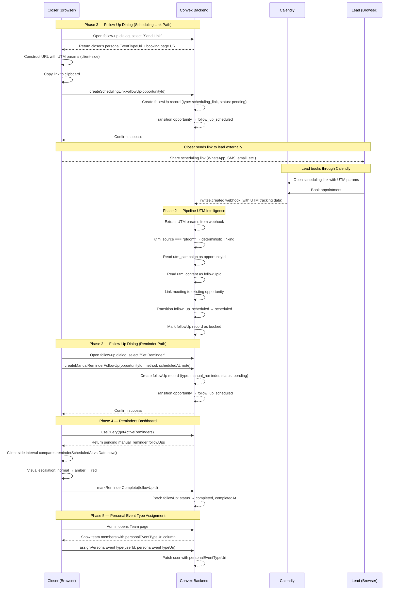
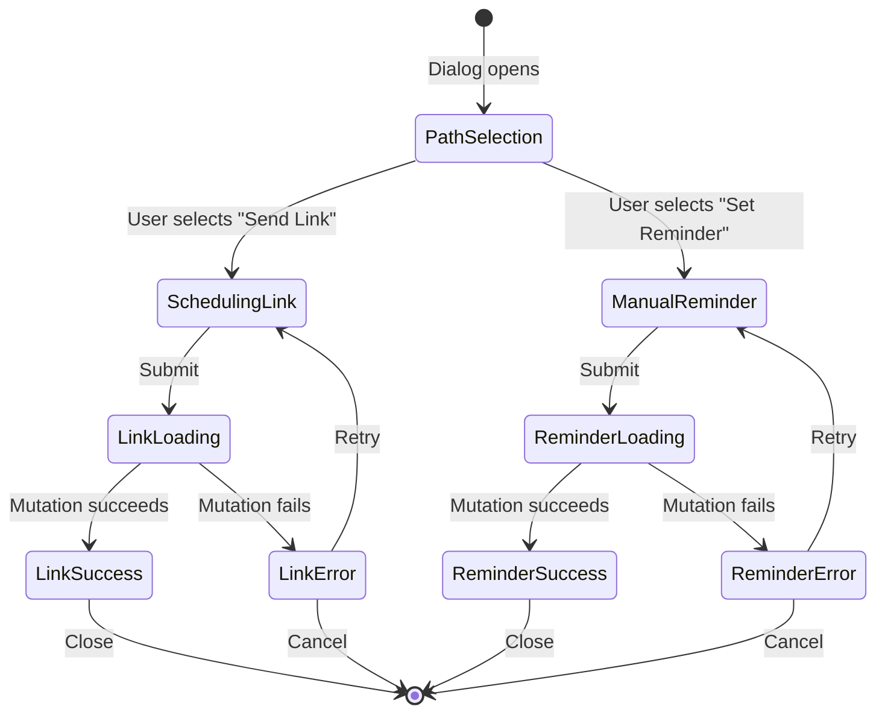
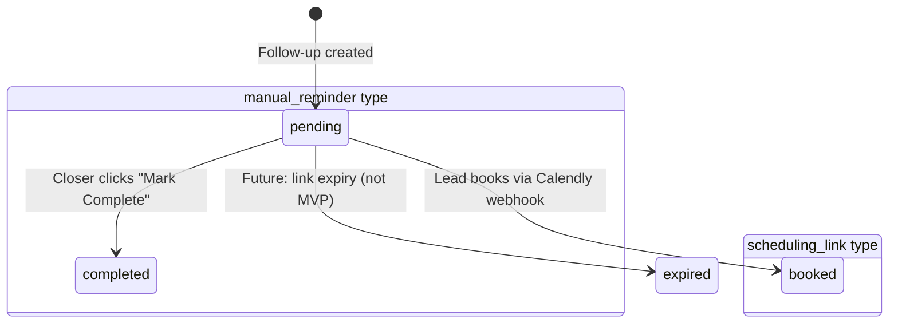

# Follow-Up & Rescheduling Overhaul — Design Specification

**Version:** 0.1 (MVP)
**Status:** Draft
**Scope:** Transform the single-purpose follow-up dialog (currently: generate Calendly single-use scheduling link) into a two-path system. Path 1 ("Send Scheduling Link") generates a URL from the closer's personal Calendly event type with UTM params for deterministic opportunity linking. Path 2 ("Set a Reminder") creates an in-app reminder record that drives visual escalation on the closer dashboard. Adds a Reminders section to the closer dashboard, a Personal Event Type column to the Team page, and a UTM-based deterministic linking branch at the top of `inviteeCreated.ts`.
**Prerequisite:** v0.4 fully deployed. Feature G (UTM Tracking & Attribution) complete — `utmParams` fields on meetings/opportunities, `convex/lib/utmParams.ts` exists. Feature I (Meeting Detail Enhancements) complete — `meetingOutcome` field on meetings, meeting detail page operational.

---

## Table of Contents

1. [Goals & Non-Goals](#1-goals--non-goals)
2. [Actors & Roles](#2-actors--roles)
3. [End-to-End Flow Overview](#3-end-to-end-flow-overview)
4. [Phase 1: Schema Evolution & Backend Foundation](#4-phase-1-schema-evolution--backend-foundation)
5. [Phase 2: Pipeline UTM Intelligence](#5-phase-2-pipeline-utm-intelligence)
6. [Phase 3: Follow-Up Dialog Redesign](#6-phase-3-follow-up-dialog-redesign)
7. [Phase 4: Reminders Dashboard Section](#7-phase-4-reminders-dashboard-section)
8. [Phase 5: Personal Event Type Assignment](#8-phase-5-personal-event-type-assignment)
9. [Data Model](#9-data-model)
10. [Convex Function Architecture](#10-convex-function-architecture)
11. [Routing & Authorization](#11-routing--authorization)
12. [Security Considerations](#12-security-considerations)
13. [Error Handling & Edge Cases](#13-error-handling--edge-cases)
14. [Open Questions](#14-open-questions)
15. [Dependencies](#15-dependencies)
16. [Applicable Skills](#16-applicable-skills)

---

## 1. Goals & Non-Goals

### Goals

- **A1 (Manual Reminder Follow-Up):** Closer selects "Set a Reminder" in the follow-up dialog, picks a contact method (Call or Text), sets a reminder date/time, and optionally writes a note. This creates a `followUp` record with `type: "manual_reminder"`. At the scheduled time the closer's dashboard surfaces the reminder with visual escalation (normal, amber, red). The closer performs outreach themselves and clicks "Mark Complete" to log it. The system never sends SMS, email, or any external message.
- **A2 (Scheduling Link Follow-Up):** Closer selects "Send Scheduling Link" in the follow-up dialog. The system reads the closer's `personalEventTypeUri` from the `users` table and constructs a URL: `{closer's Calendly booking page URL}?utm_source=ptdom&utm_medium=follow_up&utm_campaign={opportunityId}&utm_content={followUpId}&utm_term={closerId}`. The link is displayed in a copy-friendly input with one-click copy. The opportunity transitions to `follow_up_scheduled`. The system never creates a meeting directly or writes to any calendar.
- **A3 (Follow-Up Dialog Redesign):** Replace the current single-action dialog with a two-card selection UI ("Send Link" | "Set Reminder"). After selection, the dialog content changes to the relevant form.
- **A4 (Reminders Dashboard Section):** Add a dedicated "Reminders" section on the closer dashboard showing cards sorted by scheduled time. Each card shows: lead name, phone number (prominent), contact method (call/text), time, and note. Visual escalation based on time: normal when future, amber when time arrives, red when overdue. "Mark Complete" button transitions the follow-up to `completed`.
- **A5 (Personal Event Type Assignment):** New field `personalEventTypeUri` on the `users` table. Admin assigns via Team settings (new column + assignment dialog). Used to generate scheduling links targeting the closer's personal Calendly booking page.
- **A6 (Pipeline UTM Intelligence):** When `inviteeCreated.ts` receives a webhook with `utm_source === "ptdom"`, it reads `utm_campaign` as `opportunityId` and `utm_content` as `followUpId`, links the new meeting to the existing opportunity (no duplicate), transitions `follow_up_scheduled` to `scheduled`, and marks the follow-up record as `booked`. This logic runs at the top of the processing flow, before regular lead lookup.

### Non-Goals (deferred)

- **Automated SMS/email sending** — Closers perform outreach themselves. The system is a tracking tool, not a messaging platform. (Future version.)
- **Cron-based reminder notifications** — The closer dashboard uses `useQuery` subscriptions with client-side time comparison for visual escalation. No server-side scheduling needed. (Revisit if push notifications are added.)
- **Scheduling link expiry tracking** — Links are standard Calendly URLs with UTM params (not single-use scheduling links). Calendly manages availability. (Revisit if abandoned link metrics are needed.)
- **Bulk reminder operations** — Single "Mark Complete" per reminder card. Bulk actions deferred. (v0.6.)
- **Follow-up analytics/reporting** — Track follow-up conversion rates and time-to-book. (v0.6.)

---

## 2. Actors & Roles

| Actor                | Identity                                     | Auth Method                                    | Key Permissions                                                                            |
| -------------------- | -------------------------------------------- | ---------------------------------------------- | ------------------------------------------------------------------------------------------ |
| **Closer**           | CRM user with `role: "closer"`               | WorkOS AuthKit, member of tenant org           | Create follow-ups (both paths), view own reminders, mark reminders complete, copy links    |
| **Tenant Admin**     | CRM user with `role: "tenant_admin"`         | WorkOS AuthKit, member of tenant org           | Assign personal event types to closers, view team page, manage team settings               |
| **Tenant Master**    | CRM user with `role: "tenant_master"`        | WorkOS AuthKit, member of tenant org (owner)   | All admin permissions, assign personal event types                                         |
| **Lead**             | External person booking through Calendly     | None (public Calendly page)                    | Book via scheduling link — triggers webhook                                                |
| **Calendly Webhook** | Automated system via `invitee.created` event | HMAC-SHA256 signature, per-tenant signing key  | Delivers booking data; triggers pipeline processing and UTM-based opportunity linking      |

### CRM Role <-> WorkOS Role Mapping

| CRM `users.role`  | WorkOS RBAC Slug | Relevant Feature A Permissions                      |
| ----------------- | ---------------- | --------------------------------------------------- |
| `tenant_master`   | `owner`          | Assign personal event types, all admin actions       |
| `tenant_admin`    | `tenant-admin`   | Assign personal event types, view team page          |
| `closer`          | `closer`         | Create follow-ups, view/complete own reminders       |

---

## 3. End-to-End Flow Overview



---

## 4. Phase 1: Schema Evolution & Backend Foundation

### 4.1 Overview

Phase 1 lays the data foundation. The `followUps` table is widened to support two follow-up types (scheduling link and manual reminder) alongside the existing records. The `users` table gains a `personalEventTypeUri` field. New permissions are registered. All changes are additive — no existing data is broken.

> **Migration strategy:** All new fields are `v.optional(...)`. Existing `followUps` records (which lack `type`, `contactMethod`, `reminderScheduledAt`, etc.) continue to work because the pipeline's `markFollowUpBooked` mutation already queries by `status === "pending"`. The new `type` field defaults to `undefined` for old records, which the UI treats as the legacy "scheduling_link" type. The `convex-migration-helper` skill should be invoked if a backfill of existing records is desired.

### 4.2 Schema Changes: `followUps` Table

The table gains several new fields to support both follow-up paths:

```typescript
// Path: convex/schema.ts (followUps table — modified)
followUps: defineTable({
  tenantId: v.id("tenants"),
  opportunityId: v.id("opportunities"),
  leadId: v.id("leads"),
  closerId: v.id("users"),

  // NEW: Discriminator for follow-up type
  type: v.optional(
    v.union(
      v.literal("scheduling_link"),
      v.literal("manual_reminder"),
    ),
  ),

  // Existing (used by scheduling_link type)
  schedulingLinkUrl: v.optional(v.string()),
  calendlyEventUri: v.optional(v.string()),

  // NEW: Manual reminder fields
  contactMethod: v.optional(
    v.union(v.literal("call"), v.literal("text")),
  ),
  reminderScheduledAt: v.optional(v.number()),  // Unix ms — when closer should reach out
  reminderNote: v.optional(v.string()),
  completedAt: v.optional(v.number()),           // Unix ms — when closer marked complete

  reason: v.union(
    v.literal("closer_initiated"),
    v.literal("cancellation_follow_up"),
    v.literal("no_show_follow_up"),
  ),
  status: v.union(
    v.literal("pending"),
    v.literal("booked"),
    v.literal("completed"),  // NEW status
    v.literal("expired"),
  ),
  createdAt: v.number(),
})
  .index("by_tenantId", ["tenantId"])
  .index("by_opportunityId", ["opportunityId"])
  .index("by_tenantId_and_closerId", ["tenantId", "closerId"])
  // NEW: Query active reminders for dashboard
  .index("by_tenantId_and_closerId_and_status", ["tenantId", "closerId", "status"]),
```

### 4.3 Schema Changes: `users` Table

```typescript
// Path: convex/schema.ts (users table — modified)
users: defineTable({
  // ... existing fields ...

  // NEW: Personal Calendly event type URI for scheduling link follow-ups.
  // Set by admin via Team settings. Used to construct the booking page URL.
  // Example: "https://api.calendly.com/event_types/abc123"
  personalEventTypeUri: v.optional(v.string()),
})
  // ... existing indexes ...
```

### 4.4 New Permission

```typescript
// Path: convex/lib/permissions.ts (modified)
export const PERMISSIONS = {
  // ... existing permissions ...

  // NEW: Assign personal event types to closers (admin only)
  "team:assign-event-type": ["tenant_master", "tenant_admin"],
  // NEW: Follow-up management
  "follow-up:create": ["closer"],
  "follow-up:complete": ["closer"],
} as const;
```

> **Why separate permissions for follow-up:** Even though closers are the only role that creates follow-ups today, explicit permissions allow future expansion (e.g., admins creating follow-ups on behalf of closers) without schema changes.

### 4.5 Status Transition Addition

The `statusTransitions.ts` file needs no changes. The existing transitions already support what Feature A needs:

```
in_progress    → follow_up_scheduled  ✓ (closer initiates follow-up after meeting)
canceled       → follow_up_scheduled  ✓ (follow-up on cancellation)
no_show        → follow_up_scheduled  ✓ (follow-up on no-show)
follow_up_scheduled → scheduled       ✓ (lead rebooks via scheduling link)
```

### 4.6 New Mutation: `createManualReminderFollowUp`

```typescript
// Path: convex/closer/followUpMutations.ts (new export)
export const createManualReminderFollowUp = internalMutation({
  args: {
    tenantId: v.id("tenants"),
    opportunityId: v.id("opportunities"),
    leadId: v.id("leads"),
    closerId: v.id("users"),
    contactMethod: v.union(v.literal("call"), v.literal("text")),
    reminderScheduledAt: v.number(),
    reminderNote: v.optional(v.string()),
    reason: v.union(
      v.literal("closer_initiated"),
      v.literal("cancellation_follow_up"),
      v.literal("no_show_follow_up"),
    ),
  },
  handler: async (ctx, args) => {
    console.log("[Closer:FollowUp] createManualReminderFollowUp called", {
      opportunityId: args.opportunityId,
      contactMethod: args.contactMethod,
      reminderScheduledAt: args.reminderScheduledAt,
    });

    const id = await ctx.db.insert("followUps", {
      tenantId: args.tenantId,
      opportunityId: args.opportunityId,
      leadId: args.leadId,
      closerId: args.closerId,
      type: "manual_reminder",
      contactMethod: args.contactMethod,
      reminderScheduledAt: args.reminderScheduledAt,
      reminderNote: args.reminderNote,
      reason: args.reason,
      status: "pending",
      createdAt: Date.now(),
    });

    console.log("[Closer:FollowUp] manual reminder created", { followUpId: id });
    return id;
  },
});
```

### 4.7 New Mutation: `createSchedulingLinkFollowUpRecord`

This replaces the existing `createFollowUpRecord` for the scheduling link path. The key difference: it sets `type: "scheduling_link"` and stores the constructed URL (not a Calendly single-use link).

```typescript
// Path: convex/closer/followUpMutations.ts (new export)
export const createSchedulingLinkFollowUpRecord = internalMutation({
  args: {
    tenantId: v.id("tenants"),
    opportunityId: v.id("opportunities"),
    leadId: v.id("leads"),
    closerId: v.id("users"),
    schedulingLinkUrl: v.string(),
    reason: v.union(
      v.literal("closer_initiated"),
      v.literal("cancellation_follow_up"),
      v.literal("no_show_follow_up"),
    ),
  },
  handler: async (ctx, args) => {
    console.log("[Closer:FollowUp] createSchedulingLinkFollowUpRecord called", {
      opportunityId: args.opportunityId,
    });

    const id = await ctx.db.insert("followUps", {
      tenantId: args.tenantId,
      opportunityId: args.opportunityId,
      leadId: args.leadId,
      closerId: args.closerId,
      type: "scheduling_link",
      schedulingLinkUrl: args.schedulingLinkUrl,
      reason: args.reason,
      status: "pending",
      createdAt: Date.now(),
    });

    console.log("[Closer:FollowUp] scheduling link follow-up created", { followUpId: id });
    return id;
  },
});
```

### 4.8 New Mutation: `markReminderComplete`

```typescript
// Path: convex/closer/followUpMutations.ts (new export)
export const markReminderComplete = mutation({
  args: {
    followUpId: v.id("followUps"),
  },
  handler: async (ctx, { followUpId }) => {
    const { userId, tenantId } = await requireTenantUser(ctx, ["closer"]);

    const followUp = await ctx.db.get(followUpId);
    if (!followUp) throw new Error("Follow-up not found");
    if (followUp.tenantId !== tenantId) throw new Error("Access denied");
    if (followUp.closerId !== userId) throw new Error("Not your follow-up");
    if (followUp.type !== "manual_reminder") throw new Error("Not a manual reminder");
    if (followUp.status !== "pending") throw new Error("Follow-up is not pending");

    await ctx.db.patch(followUpId, {
      status: "completed",
      completedAt: Date.now(),
    });

    console.log("[Closer:FollowUp] reminder marked complete", { followUpId });
  },
});
```

### 4.9 New Query: `getActiveReminders`

```typescript
// Path: convex/closer/followUpQueries.ts (new file)
import { query } from "../_generated/server";
import { requireTenantUser } from "../requireTenantUser";

/**
 * Get active manual reminder follow-ups for the current closer.
 * Returns pending reminders sorted by reminderScheduledAt (soonest first).
 * Enriched with lead name and phone for the dashboard cards.
 */
export const getActiveReminders = query({
  args: {},
  handler: async (ctx) => {
    const { userId, tenantId } = await requireTenantUser(ctx, ["closer"]);

    const pendingFollowUps = await ctx.db
      .query("followUps")
      .withIndex("by_tenantId_and_closerId_and_status", (q) =>
        q
          .eq("tenantId", tenantId)
          .eq("closerId", userId)
          .eq("status", "pending"),
      )
      .take(50);

    // Filter to manual_reminder type only
    const reminders = pendingFollowUps.filter(
      (f) => f.type === "manual_reminder",
    );

    // Enrich with lead data
    const enriched = await Promise.all(
      reminders.map(async (reminder) => {
        const lead = await ctx.db.get(reminder.leadId);
        return {
          ...reminder,
          leadName: lead?.fullName ?? lead?.email ?? "Unknown",
          leadPhone: lead?.phone ?? null,
        };
      }),
    );

    // Sort by reminderScheduledAt ascending (soonest first)
    enriched.sort((a, b) => {
      const aTime = a.reminderScheduledAt ?? Infinity;
      const bTime = b.reminderScheduledAt ?? Infinity;
      return aTime - bTime;
    });

    console.log("[Closer:FollowUp] getActiveReminders", {
      userId,
      count: enriched.length,
    });

    return enriched;
  },
});
```

### 4.10 Refactored Action: `createFollowUp` (Scheduling Link Path)

The existing `createFollowUp` action in `convex/closer/followUp.ts` is refactored. Instead of creating a Calendly single-use scheduling link via the API, it reads the closer's `personalEventTypeUri` and constructs a URL client-side. However, because we need the closer's Calendly booking page URL (which requires reading the event type from the Calendly API to get the `scheduling_url`), the action still needs to exist as a mutation/query chain.

> **Runtime decision:** The original action used `"use node"` because it made HTTP calls to the Calendly API to create single-use scheduling links. The new scheduling link path does NOT call the Calendly API at all — the URL is constructed from the closer's `personalEventTypeUri` which maps to a known Calendly booking page URL pattern. This means we can eliminate the action entirely and use a mutation that returns the constructed URL. However, we need the booking page URL from the `personalEventTypeUri`, which is stored on the user record. A simple mutation suffices.

```typescript
// Path: convex/closer/followUpMutations.ts (new export — replaces the action for scheduling link path)
export const createSchedulingLinkFollowUp = mutation({
  args: {
    opportunityId: v.id("opportunities"),
  },
  handler: async (ctx, { opportunityId }) => {
    const { userId, tenantId } = await requireTenantUser(ctx, ["closer"]);

    const user = await ctx.db.get(userId);
    if (!user) throw new Error("User not found");

    if (!user.personalEventTypeUri) {
      throw new Error(
        "No personal calendar configured. Ask your admin to assign one in Team settings.",
      );
    }

    const opportunity = await ctx.db.get(opportunityId);
    if (!opportunity || opportunity.tenantId !== tenantId) {
      throw new Error("Opportunity not found");
    }
    if (opportunity.assignedCloserId !== userId) {
      throw new Error("Not your opportunity");
    }
    if (!validateTransition(opportunity.status, "follow_up_scheduled")) {
      throw new Error(
        `Cannot schedule follow-up from status "${opportunity.status}"`,
      );
    }

    // Create follow-up record first to get the ID for UTM params
    const followUpId = await ctx.db.insert("followUps", {
      tenantId,
      opportunityId,
      leadId: opportunity.leadId,
      closerId: userId,
      type: "scheduling_link",
      reason: "closer_initiated",
      status: "pending",
      createdAt: Date.now(),
    });

    // Construct the scheduling URL with UTM params
    // personalEventTypeUri is the Calendly booking page URL
    // e.g., "https://calendly.com/john-doe/30min"
    const bookingPageUrl = user.personalEventTypeUri;
    const utmParams = new URLSearchParams({
      utm_source: "ptdom",
      utm_medium: "follow_up",
      utm_campaign: opportunityId,
      utm_content: followUpId,
      utm_term: userId,
    });
    const schedulingLinkUrl = `${bookingPageUrl}?${utmParams.toString()}`;

    // Store the URL on the follow-up record
    await ctx.db.patch(followUpId, { schedulingLinkUrl });

    // Transition opportunity
    await ctx.db.patch(opportunityId, {
      status: "follow_up_scheduled",
      updatedAt: Date.now(),
    });

    console.log("[Closer:FollowUp] scheduling link follow-up created", {
      followUpId,
      opportunityId,
      schedulingLinkUrl: schedulingLinkUrl.substring(0, 80) + "...",
    });

    return { schedulingLinkUrl, followUpId };
  },
});
```

> **Why a mutation, not an action:** The old `createFollowUp` action called the Calendly API to create single-use scheduling links, which required Node.js builtins (`fetch` in a `"use node"` context). The new approach constructs a URL from the stored `personalEventTypeUri` — no external API call needed. A mutation is cheaper (single transaction), faster (no action overhead), and avoids race conditions between the read and write steps.

### 4.11 New Mutation: `createManualReminderFollowUpPublic`

This is the public-facing mutation that the dialog calls for the reminder path:

```typescript
// Path: convex/closer/followUpMutations.ts (new export)
export const createManualReminderFollowUpPublic = mutation({
  args: {
    opportunityId: v.id("opportunities"),
    contactMethod: v.union(v.literal("call"), v.literal("text")),
    reminderScheduledAt: v.number(),
    reminderNote: v.optional(v.string()),
  },
  handler: async (ctx, args) => {
    const { userId, tenantId } = await requireTenantUser(ctx, ["closer"]);

    const opportunity = await ctx.db.get(args.opportunityId);
    if (!opportunity || opportunity.tenantId !== tenantId) {
      throw new Error("Opportunity not found");
    }
    if (opportunity.assignedCloserId !== userId) {
      throw new Error("Not your opportunity");
    }
    if (!validateTransition(opportunity.status, "follow_up_scheduled")) {
      throw new Error(
        `Cannot schedule follow-up from status "${opportunity.status}"`,
      );
    }

    // Validate reminderScheduledAt is in the future
    if (args.reminderScheduledAt <= Date.now()) {
      throw new Error("Reminder time must be in the future");
    }

    const followUpId = await ctx.db.insert("followUps", {
      tenantId,
      opportunityId: args.opportunityId,
      leadId: opportunity.leadId,
      closerId: userId,
      type: "manual_reminder",
      contactMethod: args.contactMethod,
      reminderScheduledAt: args.reminderScheduledAt,
      reminderNote: args.reminderNote,
      reason: "closer_initiated",
      status: "pending",
      createdAt: Date.now(),
    });

    // Transition opportunity
    await ctx.db.patch(args.opportunityId, {
      status: "follow_up_scheduled",
      updatedAt: Date.now(),
    });

    console.log("[Closer:FollowUp] manual reminder follow-up created", {
      followUpId,
      opportunityId: args.opportunityId,
      contactMethod: args.contactMethod,
      reminderScheduledAt: args.reminderScheduledAt,
    });

    return { followUpId };
  },
});
```

---

## 5. Phase 2: Pipeline UTM Intelligence

### 5.1 Overview

When a lead books through a scheduling link generated by Feature A, the Calendly webhook includes UTM params in the `tracking` object. Phase 2 adds a deterministic linking branch at the **top** of `inviteeCreated.ts` — before regular lead lookup — that reads `utm_source === "ptdom"` and uses `utm_campaign` (opportunityId) and `utm_content` (followUpId) to link the new meeting to the existing opportunity.

> **Why at the top:** The current flow (step 6 in `inviteeCreated.ts`) looks for `follow_up_scheduled` opportunities by lead email. This is a heuristic — it can fail if the lead uses a different email. UTM-based linking is deterministic: the opportunityId is embedded in the URL. By running it first, we guarantee correct linking when the UTM params are present. The existing email-based heuristic remains as a fallback for non-UTM follow-ups.

### 5.2 UTM Deterministic Linking Branch

The new code is inserted after field extraction and UTM extraction, but **before** the lead lookup:

```typescript
// Path: convex/pipeline/inviteeCreated.ts (modified — insert after UTM extraction, before lead lookup)

    // === Feature A: UTM-based deterministic opportunity linking ===
    // If utm_source === "ptdom", this booking came from a scheduling link
    // generated by the follow-up system. Link deterministically to the
    // opportunity via utm_campaign (opportunityId) and utm_content (followUpId).
    if (utmParams?.utm_source === "ptdom" && utmParams.utm_campaign) {
      console.log(
        `[Pipeline:invitee.created] [Feature A] UTM deterministic linking | opportunityId=${utmParams.utm_campaign} followUpId=${utmParams.utm_content ?? "none"}`,
      );

      const targetOpportunityId = utmParams.utm_campaign as Id<"opportunities">;
      const targetFollowUpId = utmParams.utm_content as Id<"followUps"> | undefined;

      const targetOpportunity = await ctx.db.get(targetOpportunityId);

      if (
        targetOpportunity &&
        targetOpportunity.tenantId === tenantId &&
        targetOpportunity.status === "follow_up_scheduled"
      ) {
        // Validate transition
        if (!validateTransition(targetOpportunity.status, "scheduled")) {
          console.error(
            `[Pipeline:invitee.created] [Feature A] Invalid transition from ${targetOpportunity.status}`,
          );
          // Fall through to normal flow
        } else {
          // --- Lead upsert (still needed for the meeting record) ---
          let lead = await ctx.db
            .query("leads")
            .withIndex("by_tenantId_and_email", (q) =>
              q.eq("tenantId", tenantId).eq("email", inviteeEmail),
            )
            .unique();

          if (!lead) {
            const leadId = await ctx.db.insert("leads", {
              tenantId,
              email: inviteeEmail,
              fullName: inviteeName,
              phone: inviteePhone,
              customFields: latestCustomFields,
              firstSeenAt: now,
              updatedAt: now,
            });
            lead = (await ctx.db.get(leadId))!;
            console.log(
              `[Pipeline:invitee.created] [Feature A] Lead created | leadId=${leadId}`,
            );
          } else {
            await ctx.db.patch(lead._id, {
              fullName: inviteeName || lead.fullName,
              phone: inviteePhone || lead.phone,
              customFields: mergeCustomFields(lead.customFields, latestCustomFields),
              updatedAt: now,
            });
          }

          // --- Resolve host/closer ---
          const eventMemberships = Array.isArray(scheduledEvent.event_memberships)
            ? scheduledEvent.event_memberships
            : [];
          const primaryMembership = eventMemberships.find(isRecord);
          const hostUserUri = primaryMembership
            ? getString(primaryMembership, "user")
            : undefined;
          const hostCalendlyEmail = primaryMembership
            ? getString(primaryMembership, "user_email")
            : undefined;
          const hostCalendlyName = primaryMembership
            ? getString(primaryMembership, "user_name")
            : undefined;
          const assignedCloserId = await resolveAssignedCloserId(
            ctx,
            tenantId,
            hostUserUri,
          );

          // --- Update opportunity ---
          await ctx.db.patch(targetOpportunityId, {
            status: "scheduled",
            calendlyEventUri,
            assignedCloserId:
              assignedCloserId ?? targetOpportunity.assignedCloserId,
            hostCalendlyUserUri: hostUserUri,
            hostCalendlyEmail,
            hostCalendlyName,
            updatedAt: now,
            // NOTE: utmParams intentionally NOT overwritten on the opportunity.
            // Original attribution is preserved. The meeting stores its own UTMs.
          });
          console.log(
            `[Pipeline:invitee.created] [Feature A] Opportunity relinked | opportunityId=${targetOpportunityId} status=follow_up_scheduled->scheduled`,
          );

          // --- Mark follow-up as booked ---
          if (targetFollowUpId) {
            const followUp = await ctx.db.get(targetFollowUpId);
            if (
              followUp &&
              followUp.status === "pending" &&
              followUp.opportunityId === targetOpportunityId
            ) {
              await ctx.db.patch(targetFollowUpId, {
                status: "booked",
                calendlyEventUri,
              });
              console.log(
                `[Pipeline:invitee.created] [Feature A] Follow-up marked booked | followUpId=${targetFollowUpId}`,
              );
            }
          } else {
            // Fallback: find any pending follow-up for this opportunity
            await ctx.runMutation(
              internal.closer.followUpMutations.markFollowUpBooked,
              { opportunityId: targetOpportunityId, calendlyEventUri },
            );
          }

          // --- Create meeting ---
          const meetingLocation = extractMeetingLocation(scheduledEvent.location);
          const meetingNotes = getString(scheduledEvent, "meeting_notes_plain");

          const meetingId = await ctx.db.insert("meetings", {
            tenantId,
            opportunityId: targetOpportunityId,
            calendlyEventUri,
            calendlyInviteeUri,
            zoomJoinUrl: meetingLocation.zoomJoinUrl,
            meetingJoinUrl: meetingLocation.meetingJoinUrl,
            meetingLocationType: meetingLocation.meetingLocationType,
            scheduledAt,
            durationMinutes,
            status: "scheduled",
            notes: meetingNotes,
            leadName: lead.fullName ?? lead.email,
            createdAt: now,
            utmParams,
          });

          await updateOpportunityMeetingRefs(ctx, targetOpportunityId);

          // Feature F: Auto-discover custom field keys
          if (latestCustomFields && targetOpportunity.eventTypeConfigId) {
            const config = await ctx.db.get(targetOpportunity.eventTypeConfigId);
            if (config) {
              const incomingKeys = Object.keys(latestCustomFields);
              const existingKeys = config.knownCustomFieldKeys ?? [];
              const existingSet = new Set(existingKeys);
              const newKeys = incomingKeys.filter((k) => !existingSet.has(k));
              if (newKeys.length > 0) {
                await ctx.db.patch(targetOpportunity.eventTypeConfigId, {
                  knownCustomFieldKeys: [...existingKeys, ...newKeys],
                });
              }
            }
          }

          await ctx.db.patch(rawEventId, { processed: true });
          console.log(
            `[Pipeline:invitee.created] [Feature A] Deterministic linking complete | meetingId=${meetingId} opportunityId=${targetOpportunityId}`,
          );
          return; // Exit early — do not fall through to normal flow
        }
      } else {
        console.warn(
          `[Pipeline:invitee.created] [Feature A] UTM target invalid | ` +
            `opportunityExists=${!!targetOpportunity} ` +
            `tenantMatch=${targetOpportunity?.tenantId === tenantId} ` +
            `status=${targetOpportunity?.status ?? "N/A"} — falling through to normal flow`,
        );
        // Fall through to normal flow — the opportunity may have been
        // already rebooked, deleted, or belong to a different tenant.
      }
    }
    // === End Feature A ===

    // ... existing lead lookup, closer resolution, opportunity creation ...
```

### 5.3 Fallback Behavior

When the UTM-based linking fails (opportunity not found, wrong tenant, wrong status), the code falls through to the existing normal flow. This handles:

- **Stale links:** The opportunity was already rebooked (status is now `scheduled` again). The normal flow creates a new opportunity.
- **Cross-tenant links:** Someone shares a link from one tenant's closer. The tenant ID check catches this.
- **Deleted opportunities:** The `ctx.db.get` returns `null`. Falls through.
- **Non-ptdom UTMs:** Any booking with UTM params from other sources (e.g., ad campaigns) bypasses this branch entirely because `utm_source !== "ptdom"`.

### 5.4 Event Type Config Handling

The UTM-linked path preserves the opportunity's existing `eventTypeConfigId` rather than auto-creating a new one. This is correct because the opportunity already has its config from the original booking. If the closer's personal event type is different from the original, we do not overwrite — the opportunity retains its original event type context.

---

## 6. Phase 3: Follow-Up Dialog Redesign

### 6.1 Overview

The existing `follow-up-dialog.tsx` is replaced with a new two-card selection dialog. The closer first chooses between "Send Scheduling Link" and "Set a Reminder," then the dialog content changes to the relevant form.

### 6.2 Dialog State Machine



### 6.3 Path Selection UI

```tsx
// Path: app/workspace/closer/meetings/_components/follow-up-dialog.tsx (rewritten)
"use client";

import { useState } from "react";
import { useMutation, useQuery } from "convex/react";
import { api } from "@/convex/_generated/api";
import type { Id } from "@/convex/_generated/dataModel";
import {
  Dialog,
  DialogContent,
  DialogHeader,
  DialogTitle,
  DialogTrigger,
} from "@/components/ui/dialog";
import { Button } from "@/components/ui/button";
import { Card, CardContent, CardHeader, CardTitle } from "@/components/ui/card";
import {
  CalendarPlusIcon,
  LinkIcon,
  BellIcon,
  ArrowLeftIcon,
} from "lucide-react";

type FollowUpDialogProps = {
  opportunityId: Id<"opportunities">;
  onSuccess?: () => Promise<void>;
};

type DialogPath = "selection" | "scheduling_link" | "manual_reminder";

export function FollowUpDialog({
  opportunityId,
  onSuccess,
}: FollowUpDialogProps) {
  const [open, setOpen] = useState(false);
  const [path, setPath] = useState<DialogPath>("selection");

  const handleClose = () => {
    setOpen(false);
    setTimeout(() => setPath("selection"), 200);
  };

  return (
    <Dialog open={open} onOpenChange={setOpen}>
      <DialogTrigger asChild>
        <Button variant="outline" size="lg">
          <CalendarPlusIcon data-icon="inline-start" />
          Schedule Follow-up
        </Button>
      </DialogTrigger>
      <DialogContent className="sm:max-w-lg">
        <DialogHeader>
          <DialogTitle>
            {path === "selection" && "Schedule Follow-up"}
            {path === "scheduling_link" && "Send Scheduling Link"}
            {path === "manual_reminder" && "Set a Reminder"}
          </DialogTitle>
        </DialogHeader>

        {path !== "selection" && (
          <Button
            variant="ghost"
            size="sm"
            onClick={() => setPath("selection")}
            className="self-start"
          >
            <ArrowLeftIcon data-icon="inline-start" />
            Back
          </Button>
        )}

        {path === "selection" && (
          <PathSelectionCards onSelect={setPath} />
        )}

        {path === "scheduling_link" && (
          <SchedulingLinkForm
            opportunityId={opportunityId}
            onSuccess={onSuccess}
            onClose={handleClose}
          />
        )}

        {path === "manual_reminder" && (
          <ManualReminderForm
            opportunityId={opportunityId}
            onSuccess={onSuccess}
            onClose={handleClose}
          />
        )}
      </DialogContent>
    </Dialog>
  );
}
```

### 6.4 Path Selection Cards

```tsx
// Path: app/workspace/closer/meetings/_components/follow-up-dialog.tsx (continued)

function PathSelectionCards({
  onSelect,
}: {
  onSelect: (path: DialogPath) => void;
}) {
  return (
    <div className="grid grid-cols-1 gap-3 sm:grid-cols-2">
      <Card
        className="cursor-pointer transition-colors hover:bg-accent"
        onClick={() => onSelect("scheduling_link")}
        role="button"
        tabIndex={0}
        onKeyDown={(e) => {
          if (e.key === "Enter" || e.key === " ") {
            e.preventDefault();
            onSelect("scheduling_link");
          }
        }}
      >
        <CardHeader className="pb-2">
          <LinkIcon className="size-8 text-primary" />
          <CardTitle className="text-base">Send Link</CardTitle>
        </CardHeader>
        <CardContent>
          <p className="text-sm text-muted-foreground">
            Generate a scheduling link for the lead to book their next
            appointment.
          </p>
        </CardContent>
      </Card>

      <Card
        className="cursor-pointer transition-colors hover:bg-accent"
        onClick={() => onSelect("manual_reminder")}
        role="button"
        tabIndex={0}
        onKeyDown={(e) => {
          if (e.key === "Enter" || e.key === " ") {
            e.preventDefault();
            onSelect("manual_reminder");
          }
        }}
      >
        <CardHeader className="pb-2">
          <BellIcon className="size-8 text-primary" />
          <CardTitle className="text-base">Set Reminder</CardTitle>
        </CardHeader>
        <CardContent>
          <p className="text-sm text-muted-foreground">
            Set a reminder to call or text the lead at a specific time.
          </p>
        </CardContent>
      </Card>
    </div>
  );
}
```

### 6.5 Scheduling Link Form

```tsx
// Path: app/workspace/closer/meetings/_components/follow-up-dialog.tsx (continued)

function SchedulingLinkForm({
  opportunityId,
  onSuccess,
  onClose,
}: {
  opportunityId: Id<"opportunities">;
  onSuccess?: () => Promise<void>;
  onClose: () => void;
}) {
  const [state, setState] = useState<"idle" | "loading" | "success" | "error">("idle");
  const [schedulingLinkUrl, setSchedulingLinkUrl] = useState<string | null>(null);
  const [error, setError] = useState<string | null>(null);
  const [copied, setCopied] = useState(false);

  const createFollowUp = useMutation(
    api.closer.followUpMutations.createSchedulingLinkFollowUp,
  );

  const handleGenerate = async () => {
    setState("loading");
    setError(null);
    try {
      const result = await createFollowUp({ opportunityId });
      setSchedulingLinkUrl(result.schedulingLinkUrl);
      await onSuccess?.();
      posthog.capture("follow_up_scheduling_link_created", {
        opportunity_id: opportunityId,
      });
      setState("success");
    } catch (err: unknown) {
      const message =
        err instanceof Error ? err.message : "Failed to create scheduling link.";
      setError(message);
      setState("error");
    }
  };

  const handleCopy = async () => {
    if (schedulingLinkUrl) {
      await navigator.clipboard.writeText(schedulingLinkUrl);
      setCopied(true);
      toast.success("Scheduling link copied to clipboard");
      setTimeout(() => setCopied(false), 2000);
    }
  };

  // ... render idle/loading/success/error states
  // Success state shows the link in an InputGroup with Copy button
  // Error state: "No personal calendar configured. Ask your admin..." message
}
```

### 6.6 Manual Reminder Form

The reminder form uses React Hook Form + Zod:

```tsx
// Path: app/workspace/closer/meetings/_components/follow-up-dialog.tsx (continued)
import { useForm } from "react-hook-form";
import { standardSchemaResolver } from "@hookform/resolvers/standard-schema";
import { z } from "zod";
import {
  Form,
  FormField,
  FormItem,
  FormLabel,
  FormControl,
  FormMessage,
} from "@/components/ui/form";

const reminderSchema = z.object({
  contactMethod: z.enum(["call", "text"]),
  reminderDate: z.string().min(1, "Date is required"),
  reminderTime: z.string().min(1, "Time is required"),
  note: z.string().optional(),
});
type ReminderFormValues = z.infer<typeof reminderSchema>;

function ManualReminderForm({
  opportunityId,
  onSuccess,
  onClose,
}: {
  opportunityId: Id<"opportunities">;
  onSuccess?: () => Promise<void>;
  onClose: () => void;
}) {
  const [isSubmitting, setIsSubmitting] = useState(false);
  const [submitError, setSubmitError] = useState<string | null>(null);

  const createReminder = useMutation(
    api.closer.followUpMutations.createManualReminderFollowUpPublic,
  );

  const form = useForm({
    resolver: standardSchemaResolver(reminderSchema),
    defaultValues: {
      contactMethod: "call" as const,
      reminderDate: "",
      reminderTime: "",
      note: "",
    },
  });

  const onSubmit = async (values: ReminderFormValues) => {
    setIsSubmitting(true);
    setSubmitError(null);
    try {
      // Combine date + time into Unix ms
      const reminderScheduledAt = new Date(
        `${values.reminderDate}T${values.reminderTime}`,
      ).getTime();

      if (isNaN(reminderScheduledAt) || reminderScheduledAt <= Date.now()) {
        setSubmitError("Reminder time must be in the future.");
        setIsSubmitting(false);
        return;
      }

      await createReminder({
        opportunityId,
        contactMethod: values.contactMethod,
        reminderScheduledAt,
        reminderNote: values.note || undefined,
      });

      await onSuccess?.();
      posthog.capture("follow_up_reminder_created", {
        opportunity_id: opportunityId,
        contact_method: values.contactMethod,
      });
      onClose();
    } catch (err: unknown) {
      setSubmitError(
        err instanceof Error ? err.message : "Failed to create reminder.",
      );
    } finally {
      setIsSubmitting(false);
    }
  };

  return (
    <Form {...form}>
      <form onSubmit={form.handleSubmit(onSubmit)} className="flex flex-col gap-4">
        <FormField
          control={form.control}
          name="contactMethod"
          render={({ field }) => (
            <FormItem>
              <FormLabel>Contact Method <span className="text-destructive">*</span></FormLabel>
              <FormControl>
                {/* ToggleGroup or Select with "Call" and "Text" options */}
              </FormControl>
              <FormMessage />
            </FormItem>
          )}
        />

        <div className="grid grid-cols-2 gap-3">
          <FormField
            control={form.control}
            name="reminderDate"
            render={({ field }) => (
              <FormItem>
                <FormLabel>Date <span className="text-destructive">*</span></FormLabel>
                <FormControl>
                  <Input type="date" {...field} min={new Date().toISOString().split("T")[0]} />
                </FormControl>
                <FormMessage />
              </FormItem>
            )}
          />
          <FormField
            control={form.control}
            name="reminderTime"
            render={({ field }) => (
              <FormItem>
                <FormLabel>Time <span className="text-destructive">*</span></FormLabel>
                <FormControl>
                  <Input type="time" {...field} />
                </FormControl>
                <FormMessage />
              </FormItem>
            )}
          />
        </div>

        <FormField
          control={form.control}
          name="note"
          render={({ field }) => (
            <FormItem>
              <FormLabel>Note (optional)</FormLabel>
              <FormControl>
                <Textarea
                  {...field}
                  placeholder="e.g., Ask about scheduling availability..."
                  rows={3}
                />
              </FormControl>
              <FormMessage />
            </FormItem>
          )}
        />

        {submitError && (
          <Alert variant="destructive">
            <AlertCircleIcon />
            <AlertDescription>{submitError}</AlertDescription>
          </Alert>
        )}

        <Button type="submit" disabled={isSubmitting} className="w-full">
          {isSubmitting ? "Creating..." : "Set Reminder"}
        </Button>
      </form>
    </Form>
  );
}
```

> **Form pattern:** Follows the established RHF + Zod + `standardSchemaResolver` pattern from AGENTS.md. The Zod schema is co-located in the dialog file. `standardSchemaResolver` is used (not `zodResolver`). Date and time are separate inputs combined into a Unix timestamp at submission time — this avoids timezone issues from `datetime-local` inputs.

---

## 7. Phase 4: Reminders Dashboard Section

### 7.1 Overview

Add a "Reminders" section to the closer dashboard between the Featured Meeting Card and the Pipeline Strip. The section displays cards for each active manual reminder, sorted by scheduled time (soonest first). Visual escalation is driven by client-side time comparison — no cron jobs.

### 7.2 Visual Escalation Logic (Client-Side)

```typescript
// Path: app/workspace/closer/_components/reminder-urgency.ts (new file)

export type ReminderUrgency = "normal" | "amber" | "red";

/**
 * Determine the visual urgency level of a reminder based on current time.
 *
 * - normal: reminderScheduledAt is more than 0ms in the future
 * - amber:  reminderScheduledAt has been reached (time is now)
 * - red:    reminderScheduledAt is in the past (overdue)
 *
 * The caller runs this on a client-side interval (e.g., every 30 seconds)
 * so the UI escalates in real time without any server-side scheduling.
 */
export function getReminderUrgency(
  reminderScheduledAt: number,
  now: number,
): ReminderUrgency {
  if (now < reminderScheduledAt) return "normal";
  if (now >= reminderScheduledAt && now < reminderScheduledAt + 60_000) return "amber";
  return "red";
}

export function getUrgencyStyles(urgency: ReminderUrgency): string {
  switch (urgency) {
    case "normal":
      return "border-border";
    case "amber":
      return "border-amber-500 bg-amber-50 dark:bg-amber-950/20";
    case "red":
      return "border-red-500 bg-red-50 dark:bg-red-950/20";
  }
}
```

> **Why client-side, not cron:** The closer dashboard subscribes to `getActiveReminders` via `useQuery`, which auto-updates when reminders are created or completed. The urgency calculation is a pure function of `reminderScheduledAt` vs `Date.now()` — running it on a local interval (every 30 seconds) costs zero server resources. A cron job would add complexity (what does it do? send a push notification? update a field?) with no benefit for the MVP. If push notifications are added later, a cron job can be introduced then.

### 7.3 Reminders Section Component

```tsx
// Path: app/workspace/closer/_components/reminders-section.tsx (new file)
"use client";

import { useState, useEffect } from "react";
import { useQuery, useMutation } from "convex/react";
import { api } from "@/convex/_generated/api";
import type { Id } from "@/convex/_generated/dataModel";
import { Card, CardContent, CardHeader, CardTitle } from "@/components/ui/card";
import { Button } from "@/components/ui/button";
import { Badge } from "@/components/ui/badge";
import {
  BellIcon,
  PhoneIcon,
  MessageSquareIcon,
  CheckCircleIcon,
} from "lucide-react";
import { toast } from "sonner";
import { cn } from "@/lib/utils";
import {
  getReminderUrgency,
  getUrgencyStyles,
  type ReminderUrgency,
} from "./reminder-urgency";

const TICK_INTERVAL_MS = 30_000; // Re-evaluate urgency every 30 seconds

export function RemindersSection() {
  const reminders = useQuery(api.closer.followUpQueries.getActiveReminders);
  const markComplete = useMutation(
    api.closer.followUpMutations.markReminderComplete,
  );
  const [now, setNow] = useState(() => Date.now());
  const [completingId, setCompletingId] = useState<Id<"followUps"> | null>(null);

  // Tick interval for urgency recalculation
  useEffect(() => {
    const interval = setInterval(() => setNow(Date.now()), TICK_INTERVAL_MS);
    return () => clearInterval(interval);
  }, []);

  const handleMarkComplete = async (followUpId: Id<"followUps">) => {
    setCompletingId(followUpId);
    try {
      await markComplete({ followUpId });
      toast.success("Reminder marked as complete");
    } catch (err) {
      toast.error(
        err instanceof Error ? err.message : "Failed to mark complete",
      );
    } finally {
      setCompletingId(null);
    }
  };

  if (!reminders || reminders.length === 0) return null;

  return (
    <div className="flex flex-col gap-3">
      <div className="flex items-center gap-2">
        <BellIcon className="size-5 text-muted-foreground" />
        <h2 className="text-lg font-semibold">Reminders</h2>
        <Badge variant="secondary">{reminders.length}</Badge>
      </div>

      <div className="grid grid-cols-1 gap-3 sm:grid-cols-2 lg:grid-cols-3">
        {reminders.map((reminder) => {
          const urgency = getReminderUrgency(
            reminder.reminderScheduledAt ?? 0,
            now,
          );
          return (
            <ReminderCard
              key={reminder._id}
              reminder={reminder}
              urgency={urgency}
              isCompleting={completingId === reminder._id}
              onMarkComplete={() => handleMarkComplete(reminder._id)}
            />
          );
        })}
      </div>
    </div>
  );
}
```

### 7.4 Reminder Card Component

```tsx
// Path: app/workspace/closer/_components/reminders-section.tsx (continued)

function ReminderCard({
  reminder,
  urgency,
  isCompleting,
  onMarkComplete,
}: {
  reminder: {
    _id: Id<"followUps">;
    contactMethod?: "call" | "text";
    reminderScheduledAt?: number;
    reminderNote?: string;
    leadName: string;
    leadPhone: string | null;
  };
  urgency: ReminderUrgency;
  isCompleting: boolean;
  onMarkComplete: () => void;
}) {
  const MethodIcon = reminder.contactMethod === "text" ? MessageSquareIcon : PhoneIcon;

  return (
    <Card className={cn("transition-colors", getUrgencyStyles(urgency))}>
      <CardHeader className="pb-2">
        <div className="flex items-center justify-between">
          <CardTitle className="text-base">{reminder.leadName}</CardTitle>
          <Badge variant={urgency === "red" ? "destructive" : urgency === "amber" ? "outline" : "secondary"}>
            <MethodIcon className="mr-1 size-3" />
            {reminder.contactMethod === "text" ? "Text" : "Call"}
          </Badge>
        </div>
      </CardHeader>
      <CardContent className="flex flex-col gap-2">
        {/* Phone number — prominent */}
        {reminder.leadPhone && (
          <a
            href={`tel:${reminder.leadPhone}`}
            className="text-lg font-semibold text-primary hover:underline"
          >
            {reminder.leadPhone}
          </a>
        )}

        {/* Scheduled time */}
        {reminder.reminderScheduledAt && (
          <p className="text-sm text-muted-foreground">
            {new Date(reminder.reminderScheduledAt).toLocaleString([], {
              dateStyle: "medium",
              timeStyle: "short",
            })}
          </p>
        )}

        {/* Note */}
        {reminder.reminderNote && (
          <p className="text-sm text-muted-foreground line-clamp-2">
            {reminder.reminderNote}
          </p>
        )}

        <Button
          variant="outline"
          size="sm"
          onClick={onMarkComplete}
          disabled={isCompleting}
          className="mt-2 w-full"
        >
          <CheckCircleIcon data-icon="inline-start" />
          {isCompleting ? "Completing..." : "Mark Complete"}
        </Button>
      </CardContent>
    </Card>
  );
}
```

### 7.5 Dashboard Integration

The `RemindersSection` is inserted into `closer-dashboard-page-client.tsx` between the Featured Meeting Card and the Pipeline Strip:

```tsx
// Path: app/workspace/closer/_components/closer-dashboard-page-client.tsx (modified)
import { RemindersSection } from "./reminders-section";

// ... inside the return JSX, after FeaturedMeetingCard / CloserEmptyState ...

      {/* NEW: Reminders section */}
      <RemindersSection />

      <PipelineStrip
        counts={pipelineSummary.counts}
        total={pipelineSummary.total}
      />
```

> **Why no separate loading state for reminders:** `RemindersSection` calls `useQuery` internally and returns `null` when there are no reminders. Convex's reactive queries handle the loading state — the section simply does not render until data arrives. This avoids adding a skeleton for a section that may have zero items.

---

## 8. Phase 5: Personal Event Type Assignment

### 8.1 Overview

Admin assigns a personal Calendly event type URI to each closer via the Team page. This URI is the closer's personal Calendly booking page URL (e.g., `https://calendly.com/john-doe/30min`). The scheduling link follow-up path reads this value to construct the URL with UTM params.

### 8.2 Team Page Changes

The team members table gets a new column "Personal Event Type" and a new action in the dropdown: "Assign Event Type."

```tsx
// Path: app/workspace/team/_components/team-members-table.tsx (modified)

// New column after "Calendly Status":
<SortableHeader
  label="Personal Event Type"
  sortKey="personalEventType"
  sort={sort}
  onToggle={toggle}
/>

// New cell in the row:
<TableCell>
  {member.role === "closer" ? (
    member.personalEventTypeUri ? (
      <span className="text-sm text-muted-foreground truncate max-w-[200px] block">
        {member.personalEventTypeUri}
      </span>
    ) : (
      <span className="text-sm text-amber-600 dark:text-amber-400">
        Not assigned
      </span>
    )
  ) : (
    <span className="text-sm text-muted-foreground">--</span>
  )}
</TableCell>
```

New action in the dropdown:

```tsx
// Path: app/workspace/team/_components/team-members-table.tsx (modified)
// Inside the DropdownMenuContent, after "Re-link Calendly":

<RequirePermission permission="team:assign-event-type">
  {member.role === "closer" && (
    <DropdownMenuItem
      onClick={() => onAssignEventType?.(member._id)}
    >
      <CalendarPlusIcon data-icon="inline-start" />
      {member.personalEventTypeUri ? "Change Event Type" : "Assign Event Type"}
    </DropdownMenuItem>
  )}
</RequirePermission>
```

### 8.3 Assignment Dialog

```tsx
// Path: app/workspace/team/_components/event-type-assignment-dialog.tsx (new file)
"use client";

import { useState } from "react";
import { useMutation } from "convex/react";
import { useForm } from "react-hook-form";
import { standardSchemaResolver } from "@hookform/resolvers/standard-schema";
import { z } from "zod";
import { api } from "@/convex/_generated/api";
import type { Id } from "@/convex/_generated/dataModel";
import {
  Dialog,
  DialogContent,
  DialogHeader,
  DialogTitle,
  DialogDescription,
} from "@/components/ui/dialog";
import {
  Form,
  FormField,
  FormItem,
  FormLabel,
  FormControl,
  FormMessage,
} from "@/components/ui/form";
import { Input } from "@/components/ui/input";
import { Button } from "@/components/ui/button";
import { Alert, AlertDescription } from "@/components/ui/alert";
import { AlertCircleIcon } from "lucide-react";
import { toast } from "sonner";

const eventTypeSchema = z.object({
  personalEventTypeUri: z
    .string()
    .min(1, "Event type URL is required")
    .url("Must be a valid URL")
    .refine(
      (url) => url.includes("calendly.com/"),
      "Must be a Calendly booking page URL (e.g., https://calendly.com/your-name/30min)",
    ),
});
type EventTypeFormValues = z.infer<typeof eventTypeSchema>;

type EventTypeAssignmentDialogProps = {
  open: boolean;
  onOpenChange: (open: boolean) => void;
  userId: Id<"users">;
  userName: string;
  currentUri?: string;
};

export function EventTypeAssignmentDialog({
  open,
  onOpenChange,
  userId,
  userName,
  currentUri,
}: EventTypeAssignmentDialogProps) {
  const [isSubmitting, setIsSubmitting] = useState(false);
  const [submitError, setSubmitError] = useState<string | null>(null);

  const assignEventType = useMutation(
    api.users.mutations.assignPersonalEventType,
  );

  const form = useForm({
    resolver: standardSchemaResolver(eventTypeSchema),
    defaultValues: {
      personalEventTypeUri: currentUri ?? "",
    },
  });

  const onSubmit = async (values: EventTypeFormValues) => {
    setIsSubmitting(true);
    setSubmitError(null);
    try {
      await assignEventType({
        userId,
        personalEventTypeUri: values.personalEventTypeUri,
      });
      toast.success(`Event type assigned to ${userName}`);
      onOpenChange(false);
    } catch (err) {
      setSubmitError(
        err instanceof Error ? err.message : "Failed to assign event type.",
      );
    } finally {
      setIsSubmitting(false);
    }
  };

  return (
    <Dialog open={open} onOpenChange={onOpenChange}>
      <DialogContent className="sm:max-w-md">
        <DialogHeader>
          <DialogTitle>Assign Personal Event Type</DialogTitle>
          <DialogDescription>
            Enter the Calendly booking page URL for {userName}. This URL will be
            used to generate scheduling links for follow-ups.
          </DialogDescription>
        </DialogHeader>

        <Form {...form}>
          <form onSubmit={form.handleSubmit(onSubmit)} className="flex flex-col gap-4">
            <FormField
              control={form.control}
              name="personalEventTypeUri"
              render={({ field }) => (
                <FormItem>
                  <FormLabel>
                    Calendly Booking URL <span className="text-destructive">*</span>
                  </FormLabel>
                  <FormControl>
                    <Input
                      {...field}
                      placeholder="https://calendly.com/john-doe/30min"
                      disabled={isSubmitting}
                    />
                  </FormControl>
                  <FormMessage />
                </FormItem>
              )}
            />

            {submitError && (
              <Alert variant="destructive">
                <AlertCircleIcon />
                <AlertDescription>{submitError}</AlertDescription>
              </Alert>
            )}

            <Button type="submit" disabled={isSubmitting} className="w-full">
              {isSubmitting ? "Assigning..." : "Assign Event Type"}
            </Button>
          </form>
        </Form>
      </DialogContent>
    </Dialog>
  );
}
```

### 8.4 Backend Mutation: `assignPersonalEventType`

```typescript
// Path: convex/users/mutations.ts (new export)
import { v } from "convex/values";
import { mutation } from "../_generated/server";
import { requireTenantUser } from "../requireTenantUser";

export const assignPersonalEventType = mutation({
  args: {
    userId: v.id("users"),
    personalEventTypeUri: v.string(),
  },
  handler: async (ctx, { userId, personalEventTypeUri }) => {
    const { tenantId } = await requireTenantUser(ctx, [
      "tenant_master",
      "tenant_admin",
    ]);

    const targetUser = await ctx.db.get(userId);
    if (!targetUser || targetUser.tenantId !== tenantId) {
      throw new Error("User not found");
    }
    if (targetUser.role !== "closer") {
      throw new Error("Personal event types can only be assigned to closers");
    }

    // Basic URL validation
    try {
      const url = new URL(personalEventTypeUri);
      if (!url.hostname.includes("calendly.com")) {
        throw new Error("URL must be a Calendly booking page");
      }
    } catch {
      throw new Error("Invalid URL format");
    }

    await ctx.db.patch(userId, { personalEventTypeUri });

    console.log("[Users] assignPersonalEventType", {
      userId,
      personalEventTypeUri: personalEventTypeUri.substring(0, 60),
    });
  },
});
```

### 8.5 Team Page Dialog State

The `TeamPageClient` discriminated union gains a new variant:

```typescript
// Path: app/workspace/team/_components/team-page-client.tsx (modified)
type DialogState =
  | { type: null }
  | { type: "remove"; userId: Id<"users">; userName: string }
  | { type: "calendly"; userId: Id<"users">; userName: string }
  | { type: "role"; userId: Id<"users">; userName: string; currentRole: string }
  // NEW
  | {
      type: "event-type";
      userId: Id<"users">;
      userName: string;
      currentUri?: string;
    };
```

New handler:

```typescript
// Path: app/workspace/team/_components/team-page-client.tsx (modified)
const handleAssignEventType = (memberId: Id<"users">) => {
  const member = members?.find((m) => m._id === memberId);
  if (member && member.role === "closer") {
    setDialog({
      type: "event-type",
      userId: memberId,
      userName: member.fullName || member.email,
      currentUri: member.personalEventTypeUri,
    });
  }
};
```

New dialog render:

```tsx
// Path: app/workspace/team/_components/team-page-client.tsx (modified)
{dialog.type === "event-type" && (
  <EventTypeAssignmentDialog
    open
    onOpenChange={(open) => {
      if (!open) closeDialog();
    }}
    userId={dialog.userId}
    userName={dialog.userName}
    currentUri={dialog.currentUri}
  />
)}
```

### 8.6 Query Changes: `listTeamMembers`

The `listTeamMembers` query must include `personalEventTypeUri` in its return type so the table can display it:

```typescript
// Path: convex/users/queries.ts (modified — listTeamMembers return)
// Ensure personalEventTypeUri is included in the returned user fields.
// No additional query needed — it's already on the user document.
```

---

## 9. Data Model

### 9.1 `followUps` Table (Modified)

```typescript
// Path: convex/schema.ts
followUps: defineTable({
  tenantId: v.id("tenants"),
  opportunityId: v.id("opportunities"),
  leadId: v.id("leads"),
  closerId: v.id("users"),

  // Discriminator: which follow-up path was used.
  // "scheduling_link" = closer sent a booking link.
  // "manual_reminder" = closer set a reminder to call/text.
  // Optional for backward compatibility with pre-Feature-A records.
  type: v.optional(
    v.union(
      v.literal("scheduling_link"),
      v.literal("manual_reminder"),
    ),
  ),

  // --- Scheduling link fields ---
  schedulingLinkUrl: v.optional(v.string()),     // The constructed URL with UTM params
  calendlyEventUri: v.optional(v.string()),      // Set when lead books (webhook)

  // --- Manual reminder fields ---
  contactMethod: v.optional(
    v.union(v.literal("call"), v.literal("text")),
  ),
  reminderScheduledAt: v.optional(v.number()),   // Unix ms — when to reach out
  reminderNote: v.optional(v.string()),          // Optional closer note
  completedAt: v.optional(v.number()),           // Unix ms — when marked complete

  reason: v.union(
    v.literal("closer_initiated"),
    v.literal("cancellation_follow_up"),
    v.literal("no_show_follow_up"),
  ),
  status: v.union(
    v.literal("pending"),      // Active — awaiting action
    v.literal("booked"),       // Lead booked via scheduling link
    v.literal("completed"),    // Closer marked reminder as complete
    v.literal("expired"),      // Future: link expired (not used in MVP)
  ),
  createdAt: v.number(),
})
  .index("by_tenantId", ["tenantId"])
  .index("by_opportunityId", ["opportunityId"])
  .index("by_tenantId_and_closerId", ["tenantId", "closerId"])
  // NEW: Efficient query for dashboard reminders
  .index("by_tenantId_and_closerId_and_status", ["tenantId", "closerId", "status"]),
```

### 9.2 `users` Table (Modified)

```typescript
// Path: convex/schema.ts
users: defineTable({
  // ... existing fields ...

  // NEW: Personal Calendly booking page URL for follow-up scheduling links.
  // Set by admin via Team settings page.
  // Example: "https://calendly.com/john-doe/30min"
  personalEventTypeUri: v.optional(v.string()),
})
  // ... existing indexes (no new indexes needed) ...
```

### 9.3 Follow-Up Status State Machine



---

## 10. Convex Function Architecture

```
convex/
├── closer/
│   ├── dashboard.ts                       # EXISTING — no changes
│   ├── followUp.ts                        # MODIFIED: Legacy action (may be deprecated) — Phase 1
│   ├── followUpMutations.ts               # MODIFIED: New mutations — Phase 1
│   │   ├── createFollowUpRecord           # EXISTING (kept for backward compat)
│   │   ├── createSchedulingLinkFollowUp   # NEW: Public mutation for scheduling link path — Phase 1
│   │   ├── createManualReminderFollowUpPublic # NEW: Public mutation for reminder path — Phase 1
│   │   ├── markFollowUpBooked             # EXISTING (used by pipeline)
│   │   ├── markReminderComplete           # NEW: Public mutation to complete a reminder — Phase 1
│   │   └── transitionToFollowUp           # EXISTING (used internally)
│   └── followUpQueries.ts                 # NEW: Queries for follow-up data — Phase 1
│       └── getActiveReminders             # NEW: Active manual reminders for dashboard — Phase 1
├── pipeline/
│   └── inviteeCreated.ts                  # MODIFIED: UTM deterministic linking branch — Phase 2
├── users/
│   ├── queries.ts                         # MODIFIED: Include personalEventTypeUri — Phase 5
│   └── mutations.ts                       # MODIFIED: assignPersonalEventType — Phase 5
├── lib/
│   └── permissions.ts                     # MODIFIED: New permissions — Phase 1
├── schema.ts                              # MODIFIED: followUps + users table changes — Phase 1
└── http.ts                                # NO CHANGES
```

---

## 11. Routing & Authorization

### Route Structure

No new routes are added. Feature A modifies existing pages:

```
app/
├── workspace/
│   ├── closer/
│   │   ├── page.tsx                                # Closer dashboard — MODIFIED (reminders section)
│   │   ├── _components/
│   │   │   ├── closer-dashboard-page-client.tsx    # MODIFIED: Import RemindersSection — Phase 4
│   │   │   ├── reminders-section.tsx               # NEW: Reminders dashboard section — Phase 4
│   │   │   └── reminder-urgency.ts                 # NEW: Urgency calculation utility — Phase 4
│   │   └── meetings/
│   │       └── _components/
│   │           └── follow-up-dialog.tsx             # MODIFIED: Two-path dialog — Phase 3
│   └── team/
│       └── _components/
│           ├── team-page-client.tsx                 # MODIFIED: New dialog state variant — Phase 5
│           ├── team-members-table.tsx               # MODIFIED: New column + action — Phase 5
│           └── event-type-assignment-dialog.tsx     # NEW: Assignment dialog — Phase 5
```

### Role-Based Access

| Route/Component                  | Required Role(s)                     | Auth Check Location             |
| -------------------------------- | ------------------------------------ | ------------------------------- |
| Closer Dashboard (reminders)     | `closer`                             | `requireTenantUser(ctx, ["closer"])` in `getActiveReminders` |
| Follow-Up Dialog (both paths)    | `closer`                             | `requireTenantUser(ctx, ["closer"])` in mutations |
| Team Page (event type column)    | `tenant_master`, `tenant_admin`      | `requireTenantUser(ctx, [...])` in `listTeamMembers` |
| Assign Event Type action         | `tenant_master`, `tenant_admin`      | `requireTenantUser(ctx, [...])` in `assignPersonalEventType` |
| Mark Reminder Complete           | `closer` (own reminders only)        | `requireTenantUser` + `closerId === userId` check |

---

## 12. Security Considerations

### 12.1 Credential Security

- No new credentials or secrets are introduced by Feature A.
- The scheduling link path no longer calls the Calendly API (no access token needed).
- UTM params are public data embedded in URLs — they contain Convex document IDs which are opaque strings, not secrets.

### 12.2 Multi-Tenant Isolation

- Every new query and mutation scopes by `tenantId`, resolved from `requireTenantUser()`.
- The UTM deterministic linking branch in `inviteeCreated.ts` explicitly verifies `targetOpportunity.tenantId === tenantId` before linking.
- `markReminderComplete` verifies both `tenantId` and `closerId` ownership.

### 12.3 Role-Based Data Access

| Data                       | `tenant_master` | `tenant_admin` | `closer`  |
| -------------------------- | --------------- | -------------- | --------- |
| Active reminders           | None            | None           | Own only  |
| Follow-up records          | View all (future) | View all (future) | Own only  |
| Personal event type (read) | All closers     | All closers    | Own only  |
| Personal event type (write)| All closers     | All closers    | None      |
| Scheduling link URL        | None            | None           | Own only  |

### 12.4 UTM Parameter Security

- `utm_campaign` contains an `opportunityId` (Convex document ID). These IDs are opaque 32-character strings — not guessable, but not cryptographically secret either.
- The pipeline validates `tenantId` match before acting on UTM data, preventing cross-tenant exploitation.
- A malicious actor who guesses an opportunityId and crafts a UTM URL would need to also book through the correct tenant's Calendly organization for the webhook to fire with the matching `tenantId`. This is a sufficient security boundary for the MVP.

> **Future hardening:** If UTM-based linking needs to be tamper-proof, add an HMAC signature as an additional UTM param (e.g., `utm_sig=HMAC(opportunityId+followUpId, tenantSecret)`). This is not needed for MVP because the Calendly webhook already validates the booking is real.

### 12.5 Rate Limit Awareness

| Limit                        | Value      | Feature A Impact                               |
| ---------------------------- | ---------- | ---------------------------------------------- |
| Calendly API calls           | N/A        | Feature A does not call the Calendly API        |
| Convex mutation throughput   | No limit   | Single mutation per follow-up creation          |
| Convex query subscriptions   | No limit   | One new subscription per closer dashboard       |

---

## 13. Error Handling & Edge Cases

### 13.1 No Personal Event Type Configured

**Scenario:** Closer selects "Send Scheduling Link" but has no `personalEventTypeUri` set.

**Detection:** `createSchedulingLinkFollowUp` mutation checks `user.personalEventTypeUri`.

**Recovery:** Mutation throws with message: "No personal calendar configured. Ask your admin to assign one in Team settings." The dialog displays this in a destructive `<Alert>`. No state transition occurs.

**User-facing behavior:** Error message in dialog with a "Cancel" button. Closer must ask admin to assign an event type first.

### 13.2 Opportunity Already Rebooked (UTM Linking)

**Scenario:** Lead clicks the scheduling link twice. First booking succeeds and transitions opportunity to `scheduled`. Second booking arrives with the same UTM params.

**Detection:** The UTM branch checks `targetOpportunity.status === "follow_up_scheduled"`. On the second booking, the status is `scheduled` — the condition fails.

**Recovery:** Falls through to normal flow. A new opportunity is created for the second booking.

**User-facing behavior:** Closer sees two bookings — one linked to the original opportunity, one as a new opportunity. This is correct behavior: the lead booked twice.

### 13.3 Stale Follow-Up (Opportunity Deleted or Status Changed)

**Scenario:** Admin or system changes the opportunity's status after the closer creates a follow-up but before the lead books.

**Detection:** UTM branch validates `targetOpportunity.tenantId === tenantId` and `targetOpportunity.status === "follow_up_scheduled"`. If either fails, falls through.

**Recovery:** Normal flow creates a new opportunity. The old follow-up record remains as `pending` — no automatic cleanup in MVP.

**User-facing behavior:** No user-visible error. The booking is processed normally.

### 13.4 Invalid Calendly URL in Event Type Assignment

**Scenario:** Admin enters a non-Calendly URL as the personal event type.

**Detection:** Zod validation in the dialog form (`.refine(url => url.includes("calendly.com/"))`) and server-side `new URL()` + hostname check in the mutation.

**Recovery:** Form shows inline validation error. Mutation throws if somehow bypassed.

**User-facing behavior:** Inline error message below the input field.

### 13.5 Reminder Scheduled in the Past

**Scenario:** Closer somehow submits a reminder with a past date/time.

**Detection:** Client-side: `reminderDate` input has `min` set to today. Server-side: mutation validates `args.reminderScheduledAt > Date.now()`.

**Recovery:** Client-side validation prevents submission. If bypassed, mutation throws "Reminder time must be in the future."

**User-facing behavior:** Form validation error or toast error.

### 13.6 Follow-Up for Wrong Closer

**Scenario:** A closer tries to mark another closer's reminder as complete, or create a follow-up for another closer's opportunity.

**Detection:** `markReminderComplete` checks `followUp.closerId !== userId`. `createSchedulingLinkFollowUp` checks `opportunity.assignedCloserId !== userId`.

**Recovery:** Mutation throws "Not your follow-up" or "Not your opportunity."

**User-facing behavior:** Toast error message.

### 13.7 Concurrent Follow-Up Creation

**Scenario:** Closer clicks "Set Reminder" twice rapidly, creating two follow-up records for the same opportunity.

**Detection:** The second mutation call finds the opportunity already in `follow_up_scheduled` status. The `validateTransition("follow_up_scheduled", "follow_up_scheduled")` check fails — this is not a valid transition.

**Recovery:** Second mutation throws. Only one follow-up is created.

**User-facing behavior:** The dialog closes after the first success. If the closer reopens and tries again, the follow-up dialog button may not appear (opportunity is already in `follow_up_scheduled` status, and the `OutcomeActionBar` hides the button for this status).

---

## 14. Open Questions

| #   | Question                                                                 | Current Thinking                                                                                                                                       |
| --- | ------------------------------------------------------------------------ | ------------------------------------------------------------------------------------------------------------------------------------------------------ |
| 1   | Should we store the `personalEventTypeUri` as a Calendly API URI or as the public booking page URL? | **Booking page URL.** The closer/admin pastes the public URL (e.g., `https://calendly.com/john/30min`). We append UTM params to it. No API resolution needed. |
| 2   | Should the reminder path also transition the opportunity to `follow_up_scheduled`? | **Yes.** Both paths represent "a follow-up is in progress." The opportunity status should reflect this regardless of whether it is a link or a reminder. |
| 3   | What happens to existing `followUps` records that lack the `type` field? | **Treat as legacy `scheduling_link`.** The `type` field is optional. Code that filters by type should treat `undefined` as `scheduling_link` for backward compatibility. |
| 4   | Should the closer be able to create multiple follow-ups for the same opportunity? | **No (MVP).** The status transition validation prevents it — `follow_up_scheduled` cannot transition to `follow_up_scheduled`. Only one active follow-up per opportunity. |
| 5   | Should the personal event type be validated against the Calendly API?    | **No (MVP).** Validating would require a Calendly API call (action overhead). URL format validation is sufficient. If the URL is wrong, the lead sees a Calendly 404 — the closer will notice and ask admin to fix it. |

---

## 15. Dependencies

### New Packages

None. Feature A uses only existing dependencies.

### Already Installed (no action needed)

| Package                          | Used for                                                    |
| -------------------------------- | ----------------------------------------------------------- |
| `convex`                         | Backend functions, schema, queries, mutations                |
| `react-hook-form`                | Reminder form state management                              |
| `zod`                            | Reminder form + event type assignment form validation        |
| `@hookform/resolvers`            | `standardSchemaResolver` for RHF + Zod v4                   |
| `sonner`                         | Toast notifications for success/error feedback               |
| `lucide-react`                   | Icons (BellIcon, PhoneIcon, LinkIcon, etc.)                  |
| `posthog-js`                     | Analytics event tracking for follow-up actions               |
| `date-fns`                       | Date formatting in reminder cards (if needed)                |

### Environment Variables

No new environment variables are required for Feature A.

---

## 16. Applicable Skills

| Skill                            | When to Invoke                                                          | Phase(s)     |
| -------------------------------- | ----------------------------------------------------------------------- | ------------ |
| `convex-migration-helper`        | If backfilling existing `followUps` records with the new `type` field   | Phase 1      |
| `shadcn`                         | Building the two-card selection UI, reminder cards, assignment dialog    | Phases 3-5   |
| `frontend-design`                | Production-grade reminder cards with visual escalation styling           | Phase 4      |
| `web-design-guidelines`          | WCAG compliance for reminder cards, dialog accessibility, focus management | Phases 3-5 |
| `expect`                         | Browser-based verification of dialog flows, dashboard rendering, responsive layout | Phases 3-5 |
| `vercel-react-best-practices`    | React performance for interval-based re-renders in reminders section    | Phase 4      |
| `convex-performance-audit`       | Validate query efficiency of `getActiveReminders` and new indexes       | Phase 1      |

---

*This document is a living specification. Sections will be updated as implementation progresses and open questions are resolved.*
