# Form Handling Modernization — Design Specification

**Version:** 0.1 (MVP)
**Status:** Draft
**Scope:** Migrate all existing form dialogs from manual `useState` + imperative validation to React Hook Form + Zod with inline field-level errors. No functional changes — same features, better UX and developer ergonomics.
**Prerequisite:** None — this is the foundational phase of v0.5 with no dependencies on other phases.

---

## Table of Contents

1. [Goals & Non-Goals](#1-goals--non-goals)
2. [Actors & Roles](#2-actors--roles)
3. [End-to-End Flow Overview](#3-end-to-end-flow-overview)
4. [Phase 1: Infrastructure Setup](#4-phase-1-infrastructure-setup)
5. [Phase 2: Payment Form Dialog Migration](#5-phase-2-payment-form-dialog-migration)
6. [Phase 3: Invite User Dialog Migration](#6-phase-3-invite-user-dialog-migration)
7. [Phase 4: Follow-Up Dialog Wrap](#7-phase-4-follow-up-dialog-wrap)
8. [Phase 5: Mark Lost & Role Edit Dialog Migration](#8-phase-5-mark-lost--role-edit-dialog-migration)
9. [Data Model](#9-data-model)
10. [Convex Function Architecture](#10-convex-function-architecture)
11. [Routing & Authorization](#11-routing--authorization)
12. [Security Considerations](#12-security-considerations)
13. [Error Handling & Edge Cases](#13-error-handling--edge-cases)
14. [Open Questions](#14-open-questions)
15. [Dependencies](#15-dependencies)
16. [Applicable Skills](#16-applicable-skills)

---

## 1. Goals & Non-Goals

### Goals

- Every form dialog in the workspace displays **inline field-level validation errors** below the invalid field, replacing the current toast-only feedback pattern.
- All form state management uses **React Hook Form** with **Zod resolvers** — eliminating per-field `useState` hooks and imperative `if/else` validation scattered through submit handlers.
- Type safety is enforced end-to-end: Zod schemas produce `z.infer<>` types consumed by RHF, which feeds typed values to Convex mutation/action calls.
- The existing **Field, FieldGroup, FieldLabel, FieldDescription, FieldError** compound components in `components/ui/field.tsx` are preserved and integrated alongside the new shadcn `<Form>` primitives — no breaking changes to non-form usages of these components.
- File upload in the Payment Form Dialog continues to work with the existing two-step Convex storage flow (`generateUploadUrl` → upload → `storageId`).
- No user-facing behavioral regressions: disabled/loading states during submission, success toasts, PostHog event capture, and dialog open/close behavior remain identical.

### Non-Goals (deferred)

- **New form dialogs** (Follow-Up Redesign, Lead Merge, Customer Conversion, Redistribution) — these are designed and built in their respective phases (Phases 4, 8, 9, 10).
- **Server-side Zod validation** in Convex functions — Convex uses its own validator system (`v.string()`, etc.). Zod stays client-side only. (Possible future unification.)
- **Form field animation/transition effects** — out of scope for this phase.
- **Admin panel form migration** (Create Tenant, Reset Tenant) — admin forms are internal tooling and lower priority. Can be migrated opportunistically post-v0.5.

---

## 2. Actors & Roles

| Actor | Identity | Auth Method | Key Permissions |
|---|---|---|---|
| **Closer** | Sales team member assigned to meetings | WorkOS AuthKit, member of tenant org, CRM role `closer` | Can log payments (`payment:record`), schedule follow-ups (`meeting:manage-own`), mark opportunities lost |
| **Tenant Admin** | Team manager | WorkOS AuthKit, member of tenant org, CRM role `tenant_admin` | Can invite users (`team:invite`), edit roles (`team:update-role` — owner only), manage settings (`settings:manage`) |
| **Tenant Master** | Organization owner | WorkOS AuthKit, member of tenant org, CRM role `tenant_master` | Full permissions — superset of tenant_admin |

### CRM Role <-> WorkOS Role Mapping

| CRM `users.role` | WorkOS RBAC Slug | Dialog Access |
|---|---|---|
| `tenant_master` | `owner` | Invite User, Role Edit |
| `tenant_admin` | `tenant-admin` | Invite User |
| `closer` | `closer` | Payment Form, Follow-Up, Mark Lost |

---

## 3. End-to-End Flow Overview

```mermaid
sequenceDiagram
    participant DEV as Developer
    participant PKG as Package Manager
    participant SHCN as shadcn CLI
    participant UI as UI Components
    participant FORMS as Form Dialogs

    Note over DEV,FORMS: Phase 1 — Infrastructure Setup
    DEV->>PKG: pnpm add react-hook-form @hookform/resolvers zod
    PKG-->>DEV: Dependencies installed
    DEV->>SHCN: npx shadcn@latest add form
    SHCN-->>UI: Form, FormField, FormItem, FormLabel, FormControl, FormMessage, FormDescription added

    Note over DEV,FORMS: Phase 2 — Payment Form Dialog
    DEV->>FORMS: Define paymentFormSchema (Zod)
    DEV->>FORMS: Replace 8 useState hooks with useForm()
    DEV->>FORMS: Wrap fields in <Form> + <FormField>
    FORMS-->>UI: Inline validation errors rendered via <FormMessage>

    Note over DEV,FORMS: Phase 3 — Invite User Dialog
    DEV->>FORMS: Define inviteUserSchema (Zod, with .refine for conditional Calendly)
    DEV->>FORMS: Replace 7 useState hooks with useForm()
    DEV->>FORMS: Wrap fields in <Form> + <FormField>
    FORMS-->>UI: Conditional field validation works inline

    Note over DEV,FORMS: Phase 4 — Follow-Up Dialog
    DEV->>FORMS: Assess state-machine dialog — minimal RHF wrapping if needed

    Note over DEV,FORMS: Phase 5 — Mark Lost + Role Edit
    DEV->>FORMS: Define markLostSchema + roleEditSchema (simple Zod schemas)
    DEV->>FORMS: Replace useState hooks with useForm()
    FORMS-->>UI: All 5 dialogs modernized
```



---

## 4. Phase 1: Infrastructure Setup

### 4.1 What & Why

Install React Hook Form, Zod, and the Zod resolver. Add the shadcn `<Form>` component which wraps RHF's `FormProvider` and provides styled `FormField`, `FormItem`, `FormLabel`, `FormControl`, `FormMessage`, and `FormDescription` sub-components that integrate with Radix UI primitives.

> **Dependency decision:** We choose React Hook Form over alternatives (Formik, TanStack Form) because:
> 1. It's the form library that shadcn/ui's `<Form>` component is built on — zero integration friction.
> 2. RHF is uncontrolled-first, minimizing re-renders — important in a reactive Convex app where `useQuery` subscriptions already trigger renders.
> 3. The `@hookform/resolvers` package provides first-class Zod integration, giving us type-safe schema validation with `z.infer<>` — matching our existing Convex validator patterns.
>
> **Why Zod specifically:** Zod is the de facto standard for TypeScript-first schema validation. It produces types directly from schemas (`z.infer<typeof schema>`), eliminating type duplication. Convex's own validators serve the server-side role; Zod fills the client-side gap.

### 4.2 Dependency Installation

```bash
# Path: project root
pnpm add react-hook-form @hookform/resolvers zod
```

These packages run exclusively in the browser (client components). They are **not** used in Convex functions or server components.

### 4.3 shadcn Form Component

```bash
# Path: project root
npx shadcn@latest add form
```

This generates `components/ui/form.tsx` which exports:

| Export | Purpose |
|---|---|
| `Form` | Wraps `FormProvider` from RHF — provides form context to children |
| `FormField` | Connects a named field to RHF's `Controller` — manages registration, value, error state |
| `FormItem` | Layout container for a single field (replaces our `<Field>` in form contexts) |
| `FormLabel` | Label that auto-associates with the field via `htmlFor` |
| `FormControl` | Slot that passes `id`, `aria-describedby`, `aria-invalid` to the input |
| `FormDescription` | Help text below the input |
| `FormMessage` | **Inline error display** — reads from RHF's `fieldState.error` and renders the message |

### 4.4 Coexistence with Existing Field Components

The existing `components/ui/field.tsx` compound components (`Field`, `FieldGroup`, `FieldLabel`, `FieldDescription`, `FieldError`) are used throughout the app in non-form contexts (read-only displays, settings panels, filter groups). They must remain untouched.

**Strategy:**

- **Inside forms** (dialogs being migrated): Use `<Form>`, `<FormField>`, `<FormItem>`, `<FormLabel>`, `<FormControl>`, `<FormMessage>` from `components/ui/form.tsx`.
- **Outside forms** (non-form UI, read-only displays): Continue using `<Field>`, `<FieldGroup>`, `<FieldLabel>`, `<FieldDescription>`, `<FieldError>` from `components/ui/field.tsx`.
- **`<FieldGroup>`** can still be used inside forms as a layout wrapper around multiple `<FormField>` blocks — it's a pure layout component with no form logic.

> **Why not unify into one component set?** The shadcn `<Form>` components are tightly coupled to RHF's `useFormContext` and `Controller`. Forcing them onto non-form UI would require a form context where none is needed. Keeping both sets is cleaner — forms get type-safe validation; non-forms stay lightweight.

### 4.5 Verification

After installation, verify:

```bash
# Path: project root
# Ensure no type errors
pnpm tsc --noEmit

# Ensure the new form component exists
ls components/ui/form.tsx
```

---

## 5. Phase 2: Payment Form Dialog Migration

### 5.1 What & Why

The Payment Form Dialog (`payment-form-dialog.tsx`) is the most complex form: 5 user fields + file upload + two-step Convex storage upload. It uses 8 `useState` hooks and manual validation in the submit handler. Migrating this first proves the pattern works for the hardest case.

**Current state:** 371 lines, 8 `useState` hooks, manual `parseFloat` validation, file size/type checks in `handleFileChange`, error displayed via `<Alert>` component + toast.

**Target state:** ~280 lines, 1 `useForm` hook, Zod schema validates amount/currency/provider, file validation moves into a Zod `.refine()`, inline `<FormMessage>` errors per field, `<Alert>` reserved for submission-level errors only.

> **File upload decision:** RHF doesn't natively handle `File` objects well with uncontrolled inputs. We use a **hybrid approach**: the file input remains controlled via a separate `useState` (or RHF's `setValue` with a custom `onChange`), while all other fields use RHF's uncontrolled pattern. The Zod schema validates file constraints (size, type) in a `.superRefine()` block, so file errors appear inline like any other field.

### 5.2 Zod Schema Definition

```typescript
// Path: app/workspace/closer/meetings/_components/payment-form-dialog.tsx

import { z } from "zod";

const MAX_FILE_SIZE = 10 * 1024 * 1024; // 10 MB
const VALID_FILE_TYPES = [
  "image/jpeg",
  "image/png",
  "image/gif",
  "application/pdf",
];

const CURRENCIES = ["USD", "EUR", "GBP", "CAD", "AUD", "JPY"] as const;
const PROVIDERS = [
  "Stripe",
  "PayPal",
  "Square",
  "Cash",
  "Bank Transfer",
  "Other",
] as const;

const paymentFormSchema = z.object({
  amount: z
    .string()
    .min(1, "Amount is required")
    .refine(
      (val) => {
        const num = parseFloat(val);
        return !isNaN(num) && num > 0;
      },
      { message: "Amount must be greater than 0" },
    ),
  currency: z.enum(CURRENCIES, {
    required_error: "Please select a currency",
  }),
  provider: z.enum(PROVIDERS, {
    required_error: "Please select a payment provider",
  }),
  referenceCode: z.string().optional(),
  proofFile: z
    .instanceof(File)
    .optional()
    .refine(
      (file) => !file || file.size <= MAX_FILE_SIZE,
      "File size must be less than 10 MB",
    )
    .refine(
      (file) => !file || VALID_FILE_TYPES.includes(file.type),
      "Only images (JPEG, PNG, GIF) and PDFs are allowed",
    ),
});

type PaymentFormValues = z.infer<typeof paymentFormSchema>;
```

> **Why `amount` is `z.string()` with `.refine()`:** The HTML `<input type="number">` returns a string via `e.target.value`. Using `z.coerce.number()` would work but loses fine-grained error messages. The `.refine()` approach lets us show "Amount must be greater than 0" specifically, not a generic "Expected number" message.

### 5.3 Form Hook Setup

```typescript
// Path: app/workspace/closer/meetings/_components/payment-form-dialog.tsx

import { useForm } from "react-hook-form";
import { zodResolver } from "@hookform/resolvers/zod";

export function PaymentFormDialog({
  opportunityId,
  meetingId,
  onSuccess,
}: PaymentFormDialogProps) {
  const [open, setOpen] = useState(false);
  const [isSubmitting, setIsSubmitting] = useState(false);
  const [submitError, setSubmitError] = useState<string | null>(null);

  const form = useForm<PaymentFormValues>({
    resolver: zodResolver(paymentFormSchema),
    defaultValues: {
      amount: "",
      currency: "USD",
      provider: undefined,
      referenceCode: "",
      proofFile: undefined,
    },
  });

  const generateUploadUrl = useMutation(api.closer.payments.generateUploadUrl);
  const logPayment = useMutation(api.closer.payments.logPayment);

  // ... submission handler and JSX
}
```

**State reduction:** 8 `useState` hooks → 3 (`open`, `isSubmitting`, `submitError`). All field values live inside RHF's internal state.

### 5.4 Submission Handler

```typescript
// Path: app/workspace/closer/meetings/_components/payment-form-dialog.tsx

const onSubmit = async (values: PaymentFormValues) => {
  setIsSubmitting(true);
  setSubmitError(null);

  try {
    // Upload proof file if provided
    let proofFileId: Id<"_storage"> | undefined;
    if (values.proofFile) {
      const uploadUrl = await generateUploadUrl();
      const uploadResponse = await fetch(uploadUrl, {
        method: "POST",
        headers: { "Content-Type": values.proofFile.type },
        body: values.proofFile,
      });

      if (!uploadResponse.ok) {
        throw new Error("Failed to upload proof file");
      }

      const uploadData = (await uploadResponse.json()) as {
        storageId?: string;
      };
      if (!uploadData.storageId) {
        throw new Error("File upload returned invalid storage ID");
      }
      proofFileId = uploadData.storageId as Id<"_storage">;
    }

    // Log the payment
    const parsedAmount = parseFloat(values.amount);
    await logPayment({
      opportunityId,
      meetingId,
      amount: parsedAmount,
      currency: values.currency,
      provider: values.provider,
      referenceCode: values.referenceCode || undefined,
      proofFileId,
    });
    await onSuccess?.();

    posthog.capture("payment_logged", {
      opportunity_id: opportunityId,
      meeting_id: meetingId,
      amount: parsedAmount,
      currency: values.currency,
      provider: values.provider,
      has_reference_code: Boolean(values.referenceCode),
      has_proof_file: Boolean(proofFileId),
    });
    toast.success("Payment logged successfully");
    setOpen(false);
    form.reset();
  } catch (err: unknown) {
    posthog.captureException(err);
    const message =
      err instanceof Error
        ? err.message
        : "Failed to log payment. Please try again.";
    setSubmitError(message);
    toast.error(message);
  } finally {
    setIsSubmitting(false);
  }
};
```

> **Key insight:** Zod validates form values *before* `onSubmit` runs. If any field fails validation, RHF shows `<FormMessage>` errors inline and `onSubmit` is never called. The `try/catch` inside `onSubmit` handles only *runtime* errors (network failures, Convex mutation errors, file upload failures) — not validation errors.

### 5.5 JSX Structure

```tsx
// Path: app/workspace/closer/meetings/_components/payment-form-dialog.tsx

return (
  <Dialog open={open} onOpenChange={setOpen}>
    <DialogTrigger asChild>
      <Button variant="outline" size="lg">
        <BanknoteIcon data-icon="inline-start" />
        Log Payment
      </Button>
    </DialogTrigger>
    <DialogContent className="sm:max-w-md">
      <DialogHeader>
        <DialogTitle>Log Payment</DialogTitle>
        <DialogDescription>
          Record a payment to close this opportunity.
        </DialogDescription>
      </DialogHeader>

      <Form {...form}>
        <form onSubmit={form.handleSubmit(onSubmit)}>
          <FieldGroup>
            {/* Amount */}
            <FormField
              control={form.control}
              name="amount"
              render={({ field }) => (
                <FormItem>
                  <FormLabel>
                    Amount <span className="text-destructive">*</span>
                  </FormLabel>
                  <FormControl>
                    <Input
                      type="number"
                      step="0.01"
                      placeholder="299.99"
                      min="0"
                      disabled={isSubmitting}
                      {...field}
                    />
                  </FormControl>
                  <FormMessage />
                </FormItem>
              )}
            />

            {/* Currency */}
            <FormField
              control={form.control}
              name="currency"
              render={({ field }) => (
                <FormItem>
                  <FormLabel>
                    Currency <span className="text-destructive">*</span>
                  </FormLabel>
                  <Select
                    onValueChange={field.onChange}
                    defaultValue={field.value}
                    disabled={isSubmitting}
                  >
                    <FormControl>
                      <SelectTrigger>
                        <SelectValue />
                      </SelectTrigger>
                    </FormControl>
                    <SelectContent>
                      <SelectGroup>
                        {CURRENCIES.map((curr) => (
                          <SelectItem key={curr} value={curr}>
                            {curr}
                          </SelectItem>
                        ))}
                      </SelectGroup>
                    </SelectContent>
                  </Select>
                  <FormMessage />
                </FormItem>
              )}
            />

            {/* Provider */}
            <FormField
              control={form.control}
              name="provider"
              render={({ field }) => (
                <FormItem>
                  <FormLabel>
                    Provider <span className="text-destructive">*</span>
                  </FormLabel>
                  <Select
                    onValueChange={field.onChange}
                    defaultValue={field.value}
                    disabled={isSubmitting}
                  >
                    <FormControl>
                      <SelectTrigger>
                        <SelectValue placeholder="Select provider" />
                      </SelectTrigger>
                    </FormControl>
                    <SelectContent>
                      <SelectGroup>
                        {PROVIDERS.map((prov) => (
                          <SelectItem key={prov} value={prov}>
                            {prov}
                          </SelectItem>
                        ))}
                      </SelectGroup>
                    </SelectContent>
                  </Select>
                  <FormMessage />
                </FormItem>
              )}
            />

            {/* Reference Code */}
            <FormField
              control={form.control}
              name="referenceCode"
              render={({ field }) => (
                <FormItem>
                  <FormLabel>Reference Code</FormLabel>
                  <FormControl>
                    <Input
                      type="text"
                      placeholder="e.g., pi_3abc123..."
                      disabled={isSubmitting}
                      {...field}
                    />
                  </FormControl>
                  <FormDescription>
                    Transaction ID from your payment provider
                  </FormDescription>
                  <FormMessage />
                </FormItem>
              )}
            />

            {/* Proof File */}
            <FormField
              control={form.control}
              name="proofFile"
              render={({ field: { value, onChange, ...fieldProps } }) => (
                <FormItem>
                  <FormLabel>Proof File</FormLabel>
                  <FormControl>
                    <Input
                      type="file"
                      accept="image/jpeg,image/png,image/gif,application/pdf"
                      disabled={isSubmitting}
                      onChange={(e) => {
                        const file = e.target.files?.[0];
                        onChange(file);
                      }}
                      {...fieldProps}
                    />
                  </FormControl>
                  {value && (
                    <div className="flex items-center gap-1.5 text-xs text-muted-foreground">
                      <UploadIcon className="size-3 shrink-0" />
                      <span className="truncate">
                        {value.name} ({(value.size / 1024).toFixed(1)} KB)
                      </span>
                    </div>
                  )}
                  <FormDescription>
                    Max 10 MB. Allowed: PNG, JPEG, GIF, PDF
                  </FormDescription>
                  <FormMessage />
                </FormItem>
              )}
            />
          </FieldGroup>

          {/* Submission-level error (network, Convex mutation failure) */}
          {submitError && (
            <Alert variant="destructive" className="mt-4">
              <AlertCircleIcon />
              <AlertDescription>{submitError}</AlertDescription>
            </Alert>
          )}

          <DialogFooter className="mt-5">
            <Button
              type="button"
              variant="ghost"
              onClick={() => {
                setOpen(false);
                form.reset();
              }}
              disabled={isSubmitting}
            >
              Cancel
            </Button>
            <Button type="submit" disabled={isSubmitting}>
              {isSubmitting ? (
                <>
                  <Spinner data-icon="inline-start" />
                  Logging...
                </>
              ) : (
                "Log Payment"
              )}
            </Button>
          </DialogFooter>
        </form>
      </Form>
    </DialogContent>
  </Dialog>
);
```

### 5.6 File Upload Pattern with RHF

The file input requires special handling because HTML file inputs are uncontrolled by nature — the browser doesn't allow setting `value` programmatically for security reasons.

**Pattern:**

```typescript
// Path: app/workspace/closer/meetings/_components/payment-form-dialog.tsx

// In the FormField render prop, destructure `value` and `onChange` separately:
render={({ field: { value, onChange, ...fieldProps } }) => (
  <FormControl>
    <Input
      type="file"
      onChange={(e) => {
        const file = e.target.files?.[0];
        onChange(file); // Store File object in RHF state
      }}
      {...fieldProps}
    />
  </FormControl>
)}
```

Zod's `.refine()` on the `proofFile` field validates size and type. If validation fails, `<FormMessage />` shows the error inline below the file input — replacing the current `setError()` + `<Alert>` pattern.

### 5.7 Dialog Reset on Close

```typescript
// Path: app/workspace/closer/meetings/_components/payment-form-dialog.tsx

// On successful submission:
setOpen(false);
form.reset(); // Resets all fields to defaultValues

// On cancel:
<Button
  type="button"
  variant="ghost"
  onClick={() => {
    setOpen(false);
    form.reset();
    setSubmitError(null);
  }}
  disabled={isSubmitting}
>
  Cancel
</Button>
```

`form.reset()` restores all fields to their `defaultValues`, clears all validation errors, and resets the `formState` (isDirty, isValid, etc.). This replaces the manual `resetForm()` function that called 6 individual setters.

---

## 6. Phase 3: Invite User Dialog Migration

### 6.1 What & Why

The Invite User Dialog (`invite-user-dialog.tsx`) has **conditional validation**: when `role === "closer"`, the `calendlyMemberId` field becomes required. This tests Zod's `.superRefine()` pattern for cross-field validation rules.

**Current state:** 234 lines, 7 `useState` hooks (excluding `useQuery`/`useAction`), 2 manual validation checks in `handleSubmit`.

**Target state:** ~200 lines, 1 `useForm` hook + 2 `useState` (`open`, `isSubmitting`), Zod `.superRefine()` for conditional Calendly member requirement.

### 6.2 Zod Schema with Conditional Validation

```typescript
// Path: app/workspace/team/_components/invite-user-dialog.tsx

import { z } from "zod";

const inviteUserSchema = z
  .object({
    email: z
      .string()
      .min(1, "Email is required")
      .email("Please enter a valid email address"),
    firstName: z.string().min(1, "First name is required"),
    lastName: z.string().optional(),
    role: z.enum(["closer", "tenant_admin"], {
      required_error: "Please select a role",
    }),
    calendlyMemberId: z.string().optional(),
  })
  .superRefine((data, ctx) => {
    if (data.role === "closer" && !data.calendlyMemberId) {
      ctx.addIssue({
        code: z.ZodIssueCode.custom,
        message: "Calendly member is required for Closers",
        path: ["calendlyMemberId"],
      });
    }
  });

type InviteUserFormValues = z.infer<typeof inviteUserSchema>;
```

> **Why `.superRefine()` over `.refine()`:** `.refine()` operates on the whole object and produces a single error. `.superRefine()` allows us to target the error to a specific `path` — in this case `["calendlyMemberId"]` — so the inline error appears under the Calendly member dropdown, not as a generic form error.

### 6.3 Form Hook with Watched Fields

```typescript
// Path: app/workspace/team/_components/invite-user-dialog.tsx

const form = useForm<InviteUserFormValues>({
  resolver: zodResolver(inviteUserSchema),
  defaultValues: {
    email: "",
    firstName: "",
    lastName: "",
    role: "closer",
    calendlyMemberId: undefined,
  },
});

// Watch the role to conditionally render Calendly field
const watchedRole = form.watch("role");
```

`form.watch("role")` subscribes to the `role` field's value. When it changes, React re-renders the component, toggling the Calendly member field visibility — same behavior as the current `role` useState, but without a separate state variable.

### 6.4 Conditional Field Rendering

```tsx
// Path: app/workspace/team/_components/invite-user-dialog.tsx

{watchedRole === "closer" && (
  <FormField
    control={form.control}
    name="calendlyMemberId"
    render={({ field }) => (
      <FormItem>
        <FormLabel>Calendly Member *</FormLabel>
        <Select
          onValueChange={field.onChange}
          defaultValue={field.value}
        >
          <FormControl>
            <SelectTrigger disabled={isSubmitting || !unmatchedMembers}>
              <SelectValue placeholder="Select a Calendly member" />
            </SelectTrigger>
          </FormControl>
          <SelectContent>
            {unmatchedMembers?.map((member) => (
              <SelectItem key={member._id} value={member._id}>
                {member.name ?? member.email} ({member.email})
              </SelectItem>
            ))}
          </SelectContent>
        </Select>
        <FormDescription>
          Only unmatched Calendly members are shown
        </FormDescription>
        <FormMessage />
      </FormItem>
    )}
  />
)}
```

### 6.5 Submission Handler

```typescript
// Path: app/workspace/team/_components/invite-user-dialog.tsx

const onSubmit = async (values: InviteUserFormValues) => {
  setIsSubmitting(true);
  try {
    await inviteUser({
      email: values.email,
      firstName: values.firstName,
      lastName: values.lastName || undefined,
      role: values.role,
      calendlyMemberId:
        values.role === "closer"
          ? (values.calendlyMemberId as Id<"calendlyOrgMembers">)
          : undefined,
    });

    posthog.capture("team_member_invited", {
      role: values.role,
      has_calendly_member: values.role === "closer",
    });
    toast.success("User invited successfully");
    setOpen(false);
    form.reset();
    onSuccess?.();
    router.refresh();
  } catch (error) {
    posthog.captureException(error);
    toast.error(
      error instanceof Error ? error.message : "Failed to invite user",
    );
  } finally {
    setIsSubmitting(false);
  }
};
```

### 6.6 Role Change Side Effect

When the user switches from "Closer" to "Admin", the Calendly field should be cleared:

```typescript
// Path: app/workspace/team/_components/invite-user-dialog.tsx

// Inside the role FormField's Select onValueChange:
onValueChange={(value) => {
  field.onChange(value);
  // Clear Calendly member when switching away from closer
  if (value !== "closer") {
    form.setValue("calendlyMemberId", undefined);
  }
}}
```

This prevents stale Calendly member selections from passing validation when the role switches back to "closer" after selecting a member, switching to admin, and back.

---

## 7. Phase 4: Follow-Up Dialog Wrap

### 7.1 What & Why

The Follow-Up Dialog (`follow-up-dialog.tsx`) is a **state-machine dialog**, not a traditional form. It has no user-editable input fields — it's a single "Generate" button that calls a Convex action and displays the result. The dialog cycles through 4 states: `idle` → `loading` → `success` | `error`.

**Assessment:** This dialog does not benefit from RHF/Zod migration. There are no fields to validate, no form to submit, and no inline errors to display. The current implementation is clean and well-structured.

> **Decision:** Leave the Follow-Up Dialog as-is for Phase 1. It will be completely redesigned in Phase 4 (Follow-Up & Rescheduling Overhaul) of v0.5 when it becomes a two-path dialog (Send Link vs. Set Reminder). The new version will use RHF/Zod for the Reminder path, which has date/time pickers and a notes field.

### 7.2 What Changes (if any)

If the dialog's idle state gains any form fields during implementation, wrap them with RHF. Otherwise, no changes. The dialog's state-machine pattern is orthogonal to form handling.

---

## 8. Phase 5: Mark Lost & Role Edit Dialog Migration

### 8.1 Mark Lost Dialog

**Current state:** 129 lines, 3 `useState` hooks. Uses `AlertDialog` (not `Dialog`). Single optional `reason` textarea.

**Complexity:** Low. Simple schema, single optional field.

#### Zod Schema

```typescript
// Path: app/workspace/closer/meetings/_components/mark-lost-dialog.tsx

import { z } from "zod";

const markLostSchema = z.object({
  reason: z
    .string()
    .max(500, "Reason must be under 500 characters")
    .optional()
    .transform((val) => val?.trim() || undefined),
});

type MarkLostFormValues = z.infer<typeof markLostSchema>;
```

#### Form Hook

```typescript
// Path: app/workspace/closer/meetings/_components/mark-lost-dialog.tsx

const form = useForm<MarkLostFormValues>({
  resolver: zodResolver(markLostSchema),
  defaultValues: {
    reason: "",
  },
});
```

#### JSX Pattern

```tsx
// Path: app/workspace/closer/meetings/_components/mark-lost-dialog.tsx

<AlertDialog open={open} onOpenChange={setOpen}>
  <AlertDialogContent className="max-w-md">
    <AlertDialogHeader>
      <div className="flex items-start gap-3">
        <div className="flex size-8 shrink-0 items-center justify-center rounded-lg bg-destructive/10">
          <AlertTriangleIcon className="size-4 text-destructive" />
        </div>
        <div className="flex-1">
          <AlertDialogTitle>Mark as Lost?</AlertDialogTitle>
          <AlertDialogDescription>
            This will mark the opportunity as lost. This action is
            permanent and cannot be undone.
          </AlertDialogDescription>
        </div>
      </div>
    </AlertDialogHeader>

    <Form {...form}>
      <form onSubmit={form.handleSubmit(onSubmit)}>
        <FormField
          control={form.control}
          name="reason"
          render={({ field }) => (
            <FormItem>
              <FormLabel>Reason (optional)</FormLabel>
              <FormControl>
                <Textarea
                  placeholder="Why did this deal fall through?"
                  className="min-h-[100px] resize-none text-sm"
                  disabled={isLoading}
                  {...field}
                />
              </FormControl>
              <FormMessage />
            </FormItem>
          )}
        />

        <AlertDialogFooter className="mt-4">
          <AlertDialogCancel disabled={isLoading}>Cancel</AlertDialogCancel>
          <Button
            type="submit"
            variant="destructive"
            disabled={isLoading}
          >
            {isLoading ? (
              <>
                <Spinner data-icon="inline-start" />
                Marking...
              </>
            ) : (
              "Mark as Lost"
            )}
          </Button>
        </AlertDialogFooter>
      </form>
    </Form>
  </AlertDialogContent>
</AlertDialog>
```

> **AlertDialog compatibility:** The `<Form>` wrapper works inside `<AlertDialogContent>` because `Form` is just a `FormProvider` context — it doesn't render any DOM of its own. The AlertDialog's focus trap and escape-key behavior remain intact.

### 8.2 Role Edit Dialog

**Current state:** 132 lines, 2 `useState` hooks (`selectedRole`, `isSaving`). Externally controlled via `open`/`onOpenChange` props. Single select field.

**Complexity:** Low. Single enum field with no-op validation (any valid enum value is acceptable).

#### Zod Schema

```typescript
// Path: app/workspace/team/_components/role-edit-dialog.tsx

import { z } from "zod";

const roleEditSchema = z.object({
  role: z.enum(["closer", "tenant_admin"], {
    required_error: "Please select a role",
  }),
});

type RoleEditFormValues = z.infer<typeof roleEditSchema>;
```

#### Form Hook

```typescript
// Path: app/workspace/team/_components/role-edit-dialog.tsx

const form = useForm<RoleEditFormValues>({
  resolver: zodResolver(roleEditSchema),
  defaultValues: {
    role: currentRole as "closer" | "tenant_admin",
  },
});

const watchedRole = form.watch("role");
```

#### Save Button Disable Logic

```tsx
// Path: app/workspace/team/_components/role-edit-dialog.tsx

<Button
  type="submit"
  disabled={isSaving || watchedRole === currentRole}
>
  {isSaving && <Spinner data-icon="inline-start" />}
  {isSaving ? "Saving..." : "Save"}
</Button>
```

The save button is disabled when the selected role matches the current role (no change) — identical to the current behavior, but using `form.watch("role")` instead of a separate `useState`.

#### Dialog Reset on Reopen

Since the Role Edit Dialog is externally controlled (`open`/`onOpenChange` props, not internal state), we need to reset the form when the dialog opens with a potentially different user:

```typescript
// Path: app/workspace/team/_components/role-edit-dialog.tsx

import { useEffect } from "react";

// Reset form when dialog opens (currentRole may have changed)
useEffect(() => {
  if (open) {
    form.reset({ role: currentRole as "closer" | "tenant_admin" });
  }
}, [open, currentRole, form]);
```

---

## 9. Data Model

**No schema changes.** This phase is frontend-only — all Convex tables, validators, and indexes remain unchanged. The Convex mutations and actions already validate their arguments server-side via Convex validators (`v.string()`, `v.number()`, etc.), which is orthogonal to the client-side Zod validation being added.

---

## 10. Convex Function Architecture

**No backend changes.** All existing Convex functions remain as-is:

```
convex/
├── closer/
│   ├── payments.ts              # UNCHANGED: generateUploadUrl, logPayment
│   ├── meetingActions.ts        # UNCHANGED: startMeeting, updateMeetingNotes, markAsLost
│   ├── followUp.ts              # UNCHANGED: createFollowUp action
│   └── followUpMutations.ts     # UNCHANGED: createFollowUpRecord, transitionToFollowUp, markFollowUpBooked
├── workos/
│   └── userManagement.ts        # UNCHANGED: inviteUser, updateUserRole actions
└── schema.ts                    # UNCHANGED: no table modifications
```

The Convex validator arguments for each mutation/action serve as the authoritative server-side validation layer. The client-side Zod schemas provide a parallel validation layer for UX purposes (instant inline feedback). Both layers must agree on the validation rules, but they are maintained independently.

---

## 11. Routing & Authorization

**No route changes.** All form dialogs live within existing routes:

| Dialog | Route | Role Gate |
|---|---|---|
| Payment Form | `/workspace/closer/meetings/[meetingId]` | `closer` via `requireRole(["closer"])` in page RSC |
| Invite User | `/workspace/team` | `tenant_master`, `tenant_admin` via `requireRole(["tenant_master", "tenant_admin"])` |
| Follow-Up | `/workspace/closer/meetings/[meetingId]` | `closer` via `requireRole(["closer"])` |
| Mark Lost | `/workspace/closer/meetings/[meetingId]` | `closer` via `requireRole(["closer"])` |
| Role Edit | `/workspace/team` | `tenant_master` only (enforced by parent component + Convex action) |

Authorization is unchanged — `requireRole()` in page RSCs gates route access, and `requireTenantUser()` in Convex functions re-validates on every mutation/action call.

---

## 12. Security Considerations

### 12.1 Client-Side Validation is UX Only

Zod validation runs in the browser. It provides instant user feedback but is **not a security boundary**. All form submissions ultimately call Convex mutations/actions which re-validate arguments server-side using Convex validators. A malicious user bypassing the browser form cannot skip server-side validation.

### 12.2 No New Credential Exposure

- No new environment variables.
- No new API keys or tokens.
- File uploads continue using the existing Convex storage flow — the client never sees or handles storage credentials directly.

### 12.3 Multi-Tenant Isolation

Unchanged. Every Convex function resolves `tenantId` from `ctx.auth.getUserIdentity()` — never from form input. The form dialogs do not accept or submit `tenantId` as a field.

### 12.4 Role-Based Data Access

| Data | tenant_master | tenant_admin | closer |
|---|---|---|---|
| Log payment | None | None | Own meetings only |
| Invite user | Full | Full | None |
| Edit role | Full | None | None |
| Mark as lost | None | None | Own opportunities only |
| Generate follow-up link | None | None | Own opportunities only |

No changes to this matrix.

---

## 13. Error Handling & Edge Cases

### 13.1 Validation Errors (New Behavior)

**Scenario:** User submits a form with invalid data.
**Detection:** Zod schema validation fails. RHF intercepts `form.handleSubmit()` and does not call `onSubmit`.
**Recovery:** `<FormMessage />` components render inline errors below each invalid field. The first invalid field receives focus automatically (RHF default behavior with `shouldFocusError: true`).
**User-facing behavior:** Red text below the invalid field with a specific message (e.g., "Amount must be greater than 0"). No toast fired for validation errors — toasts are reserved for submission-level errors.

### 13.2 Submission Errors (Existing Behavior, Preserved)

**Scenario:** Form data is valid, but the Convex mutation/action fails (e.g., network error, server validation error, state transition conflict).
**Detection:** `try/catch` in `onSubmit` handler catches the thrown error.
**Recovery:** Error message displayed in an `<Alert variant="destructive">` above the submit button. `toast.error()` also fires for visibility. `posthog.captureException()` logs the error.
**User-facing behavior:** Alert banner + toast notification. Form remains open with data preserved — user can fix and retry.

### 13.3 File Upload Failure

**Scenario:** Proof file passes Zod validation (correct type and size) but the Convex storage upload fails.
**Detection:** `fetch(uploadUrl, ...)` returns non-200, or `uploadData.storageId` is missing.
**Recovery:** Error thrown, caught by `onSubmit`'s `try/catch`. Alert + toast shown.
**User-facing behavior:** "Failed to upload proof file" message. Form stays open — user can remove the file or try again.

### 13.4 Stale Calendly Members

**Scenario:** In the Invite User dialog, `unmatchedMembers` query returns `undefined` initially (loading state) or the selected member gets matched by another concurrent invite.
**Detection:** `useQuery` returns `undefined` while loading; Convex action throws if the member ID is invalid or already matched.
**Recovery:** Select trigger is disabled while `!unmatchedMembers`. Server-side error caught and shown as toast.
**User-facing behavior:** Dropdown disabled with loading state → becomes interactive when data loads. If concurrent conflict: toast error, user re-opens dialog to see updated list.

### 13.5 Role Edit No-Op

**Scenario:** User opens Role Edit dialog but the selected role matches the current role.
**Detection:** `watchedRole === currentRole` comparison.
**Recovery:** Submit button disabled — no mutation call possible.
**User-facing behavior:** "Save" button appears disabled. Changing to a different role enables it.

### 13.6 Dialog Close During Submission

**Scenario:** User clicks outside the dialog or presses Escape while a form submission is in progress.
**Detection:** `isSubmitting` flag is true.
**Recovery:** All cancel/close buttons are `disabled={isSubmitting}`. The `Dialog`'s `onOpenChange` can be wrapped to prevent close during submission:

```typescript
// Path: (any dialog)
<Dialog
  open={open}
  onOpenChange={(value) => {
    if (!isSubmitting) {
      setOpen(value);
      if (!value) form.reset();
    }
  }}
>
```

**User-facing behavior:** Dialog stays open until the mutation completes or fails.

### 13.7 Browser Back/Forward During Submission

**Scenario:** User navigates away while a form submission is in progress.
**Detection:** Component unmounts mid-submission.
**Recovery:** The Convex mutation/action continues to completion on the server regardless of client navigation — Convex transactions are server-side and not interrupted by client disconnection. No cleanup needed; if the user returns, the data reflects the mutation result.
**User-facing behavior:** If the mutation succeeded, the data is updated. If it failed, no side effects occurred (Convex mutations are atomic).

---

## 14. Open Questions

| # | Question | Current Thinking |
|---|---|---|
| 1 | Should we create shared Zod schemas in a `lib/schemas/` directory, or keep them co-located with their dialogs? | **Co-locate for now.** Each schema is specific to one dialog. If Phase 4+ introduces schemas shared across multiple components (e.g., a UTM params schema), extract to `lib/schemas/` at that point. |
| 2 | Should the shadcn `<Form>` components replace `<Field>` components globally, even in non-form contexts? | **No.** `<FormField>` requires a `useFormContext` parent — it can't work outside a `<Form>`. Keep both component sets. Revisit if the two sets cause confusion during code review. |
| 3 | Should we add `zod` to the `optimizePackageImports` list in `next.config.ts`? | **Yes.** Zod has many sub-modules. Adding it to `optimizePackageImports` alongside `lucide-react`, `date-fns`, and `recharts` ensures tree-shaking works correctly. |
| 4 | Should the existing `FieldError` component in `field.tsx` be updated to consume RHF error state? | **No.** `FieldError` takes explicit `errors` or `children` props and is used in non-form contexts. The shadcn `FormMessage` component handles RHF error display inside forms. |
| 5 | Should admin dialogs (Create Tenant, Reset Tenant) be migrated in this phase? | **Deferred.** Admin dialogs are internal tooling with a single system admin user. Low impact, low urgency. Migrate opportunistically later. |

---

## 15. Dependencies

### New Packages

| Package | Why | Runtime | Install |
|---|---|---|---|
| `react-hook-form` | Uncontrolled form state management with minimal re-renders | Browser (client components) | `pnpm add react-hook-form` |
| `@hookform/resolvers` | Connects Zod schemas to RHF's validation system | Browser (client components) | `pnpm add @hookform/resolvers` |
| `zod` | TypeScript-first schema validation with type inference | Browser (client components) | `pnpm add zod` |

### Already Installed (no action needed)

| Package | Used for |
|---|---|
| `react` (19.2.4) | Core UI framework — `useState`, `useEffect`, `useForm` all run in React's render cycle |
| `radix-ui` (1.4.3) | Underlying primitives for Dialog, AlertDialog, Select — wrapped by shadcn |
| `shadcn` (4.1.1) | Component generation CLI — used to add the `form` component |
| `sonner` (2.0.7) | Toast notifications — still used for submission-level success/error feedback |
| `lucide-react` (1.7.0) | Icons in dialog headers and buttons |
| `posthog-js` (1.364.7) | Event capture and exception tracking in form handlers |
| `convex` (1.34.1) | `useMutation`, `useAction`, `useQuery` for backend calls |
| `class-variance-authority` | `cva` used in existing `field.tsx` — continues unchanged |
| `tailwind-merge` / `clsx` | `cn()` utility for class merging |

### shadcn Component to Add

| Component | How | What it generates |
|---|---|---|
| `form` | `npx shadcn@latest add form` | `components/ui/form.tsx` — Form, FormField, FormItem, FormLabel, FormControl, FormDescription, FormMessage |

### Environment Variables

No new environment variables required.

### next.config.ts Update

| Change | Why |
|---|---|
| Add `"zod"` to `optimizePackageImports` array | Ensures proper tree-shaking for Zod's sub-modules |

```typescript
// Path: next.config.ts
// In the experimental or top-level config:
optimizePackageImports: ["lucide-react", "date-fns", "recharts", "zod"],
```

---

## 16. Applicable Skills

| Skill | When to Invoke | Phase |
|---|---|---|
| `shadcn` | Adding the `form` component via CLI, ensuring it integrates with `radix-nova` style preset and existing component architecture | Phase 1 (Infrastructure) |
| `vercel-react-best-practices` | Verifying that RHF's uncontrolled pattern doesn't conflict with Convex's reactive `useQuery` subscriptions; ensuring minimal re-renders | Phases 2-5 (All migrations) |
| `vercel-composition-patterns` | Evaluating the coexistence of `<Form>` + `<Field>` component sets; ensuring clean composition without prop drilling | Phase 1, Phase 2 |
| `expect` | Browser-based verification of each migrated dialog: inline errors render, submission works, file upload works, accessibility passes | Phases 2-5 (After each migration) |
| `web-design-guidelines` | Verify WCAG compliance of inline error messages: color contrast, `aria-invalid`, `aria-describedby` associations, focus management | Phase 2 (Payment Form as reference), then spot-check others |
| `frontend-design` | Ensuring inline error styling matches the `radix-nova` / `mist` design system; consistent destructive color usage | Phase 2 |
| `next-best-practices` | Confirming new packages don't break SSR, tree-shaking is configured, and `optimizePackageImports` is set correctly | Phase 1 (Infrastructure) |

---

## Appendix A: Migration Checklist Per Dialog

Use this checklist when migrating each dialog:

- [ ] Define Zod schema co-located in the dialog file
- [ ] Replace `useState` per-field hooks with `useForm<FormValues>()`
- [ ] Wrap the form JSX in `<Form {...form}>`
- [ ] Replace each `<Field>` + `<FieldLabel>` with `<FormField>` + `<FormItem>` + `<FormLabel>` + `<FormControl>` + `<FormMessage>`
- [ ] Keep `<FieldGroup>` as layout wrapper (it's CSS-only, no form logic)
- [ ] Replace manual validation in `handleSubmit` with Zod schema rules
- [ ] Preserve `isSubmitting` state for loading UI (RHF's `formState.isSubmitting` can also be used but explicit state is clearer with async Convex calls)
- [ ] Preserve `submitError` state for submission-level errors (network, Convex) displayed via `<Alert>`
- [ ] Replace `resetForm()` calls with `form.reset()`
- [ ] Preserve PostHog event capture in `onSubmit`
- [ ] Preserve toast notifications for success and submission errors
- [ ] Verify disabled states during submission
- [ ] Test inline validation: submit empty → errors appear below fields
- [ ] Test submission: valid data → same behavior as before
- [ ] Test reset: close dialog → reopen → fields are cleared

---

## Appendix B: Files Changed

| File | Change | Phase |
|---|---|---|
| `package.json` | Add `react-hook-form`, `@hookform/resolvers`, `zod` | 1 |
| `components/ui/form.tsx` | NEW: shadcn Form component (generated by CLI) | 1 |
| `next.config.ts` | Add `"zod"` to `optimizePackageImports` | 1 |
| `app/workspace/closer/meetings/_components/payment-form-dialog.tsx` | MODIFIED: RHF + Zod migration (8 useState → 1 useForm + 2 useState) | 2 |
| `app/workspace/team/_components/invite-user-dialog.tsx` | MODIFIED: RHF + Zod migration with conditional validation (7 useState → 1 useForm + 2 useState) | 3 |
| `app/workspace/closer/meetings/_components/follow-up-dialog.tsx` | UNCHANGED: State-machine dialog, no form fields to migrate | 4 |
| `app/workspace/closer/meetings/_components/mark-lost-dialog.tsx` | MODIFIED: RHF + Zod migration (3 useState → 1 useForm + 2 useState) | 5 |
| `app/workspace/team/_components/role-edit-dialog.tsx` | MODIFIED: RHF + Zod migration (2 useState → 1 useForm + 1 useState) | 5 |

---

## Appendix C: Before & After — useState Count

| Dialog | Before (useState) | After (useState) | After (useForm) | Net reduction |
|---|---|---|---|---|
| Payment Form | 8 | 2 (`open`, `isSubmitting`) + 1 (`submitError`) | 1 | -5 hooks |
| Invite User | 7 | 2 (`open`, `isSubmitting`) | 1 | -4 hooks |
| Follow-Up | 5 | 5 (unchanged) | 0 | 0 |
| Mark Lost | 3 | 2 (`open`, `isLoading`) | 1 | -0 hooks |
| Role Edit | 2 | 1 (`isSaving`) | 1 | -0 hooks |
| **Total** | **25** | **13** | **4** | **-9 hooks** |

> **Note:** The raw hook count reduction understates the benefit. The real win is eliminating the imperative validation logic (if/else chains in submit handlers) and gaining type-safe, declarative schemas with automatic inline error display.

---

*This document is a living specification. Sections will be updated as implementation progresses and open questions are resolved.*
