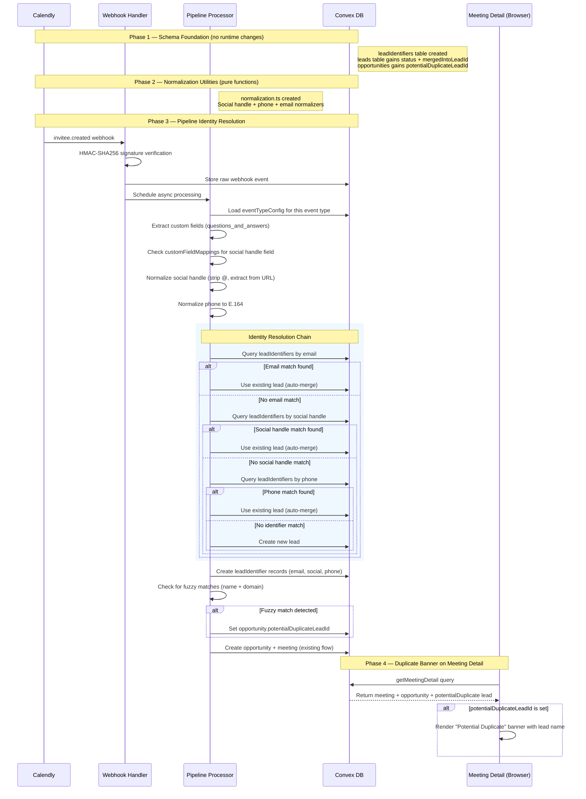
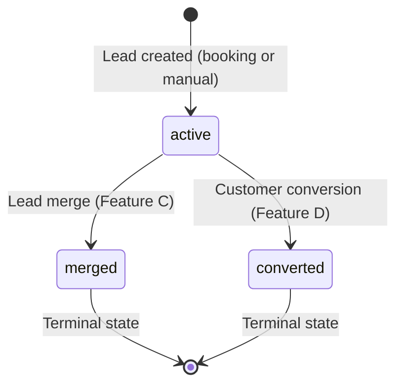

# Lead Identity Resolution — Design Specification

**Version:** 0.1 (MVP)
**Status:** Draft
**Scope:** Email-only lead deduplication (single identifier) --> Multi-identifier lead model with social handle extraction, phone normalization, identity resolution during webhook processing, and potential duplicate surfacing on the meeting detail page.
**Prerequisite:** Feature F (Event Type Field Mappings) complete and deployed -- `customFieldMappings` and `knownCustomFieldKeys` fields exist on `eventTypeConfigs`. Feature G (UTM Tracking) complete. Pipeline auto-discovery of custom field keys deployed in `inviteeCreated.ts`.
**Feature Area:** E (v0.5 Track 2: F --> E --> C --> D -- Critical Path)

---

## Table of Contents

1. [Goals & Non-Goals](#1-goals--non-goals)
2. [Actors & Roles](#2-actors--roles)
3. [End-to-End Flow Overview](#3-end-to-end-flow-overview)
4. [Phase 1: Schema Foundation](#4-phase-1-schema-foundation)
5. [Phase 2: Normalization Utilities](#5-phase-2-normalization-utilities)
6. [Phase 3: Pipeline Identity Resolution](#6-phase-3-pipeline-identity-resolution)
7. [Phase 4: Duplicate Banner on Meeting Detail](#7-phase-4-duplicate-banner-on-meeting-detail)
8. [Data Model](#8-data-model)
9. [Convex Function Architecture](#9-convex-function-architecture)
10. [Routing & Authorization](#10-routing--authorization)
11. [Security Considerations](#11-security-considerations)
12. [Error Handling & Edge Cases](#12-error-handling--edge-cases)
13. [Open Questions](#13-open-questions)
14. [Dependencies](#14-dependencies)
15. [Applicable Skills](#15-applicable-skills)

---

## 1. Goals & Non-Goals

### Goals

- **Multi-identifier lead model** -- a new `leadIdentifiers` table stores every known identifier (email, phone, Instagram, TikTok, Twitter, Facebook, LinkedIn, other_social) linked to a lead, with provenance tracking (source, confidence, originating meeting).
- **Social handle extraction from Calendly form data** -- during webhook processing, the pipeline reads `customFieldMappings` from the event type config (configured by admins in Feature F) to extract social handle answers, normalize them, and create `leadIdentifier` records automatically.
- **Phone number normalization to E.164** -- incoming phone strings (with or without country codes, with various formatting) are normalized to `+{countryCode}{subscriberNumber}` format for consistent dedup.
- **Identity resolution during `invitee.created` processing** -- replace the current email-only lead lookup with a multi-identifier resolution chain: email --> social handle --> phone. Exact matches auto-merge into the existing lead. Partial/fuzzy matches flag the opportunity as a potential duplicate for human review.
- **Potential duplicate surfacing** -- when the pipeline detects a fuzzy match (name + partial identifier), it creates the new lead but flags the opportunity with `potentialDuplicateLeadId`. This surfaces on the meeting detail page as a non-blocking informational banner.
- **Lead status tracking** -- the `leads` table gains a `status` field (`active`, `converted`, `merged`) and `mergedIntoLeadId` to support future merge operations (Feature C) and customer conversion (Feature D).

### Non-Goals (deferred)

- **Manual lead merge UI** -- Feature C (Lead Manager). Feature E only flags potential duplicates; the merge action, merge confirmation dialog, and identifier reassignment are C's scope.
- **Lead Manager list/search/detail** -- Feature C. E creates the data model; C builds the browsing and management interface.
- **Lead-to-customer conversion** -- Feature D. E adds the `status` field that D will transition from `active` to `converted`.
- **AI/ML-based fuzzy matching** -- v1.0+. Identity resolution in v0.5 uses deterministic exact-match for auto-merge and simple heuristic (name similarity + shared domain) for suggestions. No embedding-based or ML scoring.
- **Cross-tenant identity resolution** -- never. Each tenant's lead data is fully isolated. Identifiers are always scoped by `tenantId`.
- **Retroactive backfill of existing leads** -- deferred to a migration script after Feature E ships. Existing leads will not have `leadIdentifier` records until either (a) a new booking triggers the pipeline or (b) a backfill migration runs. The `leads.status` field will be backfilled to `"active"` via a `convex-migration-helper` migration.
- **`programField` extraction** -- the v0.5 spec mentions a `programField` in the `customFieldMappings` mockup, but no downstream consumer exists. Deferred.

---

## 2. Actors & Roles

| Actor | Identity | Auth Method | Key Permissions |
|---|---|---|---|
| **Calendly (Webhook)** | External system | HMAC-SHA256 signed webhook | Sends `invitee.created` events that trigger identity resolution |
| **Pipeline Processor** | Internal Convex mutation | `internalMutation` (no auth context) | Creates/updates leads, creates `leadIdentifier` records, flags potential duplicates |
| **Closer** | CRM user with `closer` role | WorkOS AuthKit, member of tenant org | Views meeting detail page with duplicate banner; sees own meetings only |
| **Tenant Admin** | CRM user with `tenant_admin` role | WorkOS AuthKit, member of tenant org | Views any meeting in the tenant; configures field mappings (Feature F) |
| **Tenant Master** | CRM user with `tenant_master` role | WorkOS AuthKit, member of tenant org | Full access; same as tenant admin plus role management |

> **Note:** Feature E has no new UI for configuration. The field mapping configuration (which Calendly form field is the social handle) is already handled by Feature F. Feature E only reads that configuration during pipeline processing and adds a read-only duplicate banner on the meeting detail page.

---

## 3. End-to-End Flow Overview



---

## 4. Phase 1: Schema Foundation

### 4.1 New Table: `leadIdentifiers`

This table stores every known identifier for a lead across all channels. It replaces the implicit "email is the identifier" assumption with an explicit, extensible multi-identifier model.

> **Design decision:** A separate `leadIdentifiers` table (rather than an array on the `leads` document) follows the Convex schema standard of "no unbounded arrays." Each identifier is independently queryable by index, supports provenance tracking, and avoids growing the leads document unboundedly as identifiers accumulate.

```typescript
// Path: convex/schema.ts (new table)
leadIdentifiers: defineTable({
  tenantId: v.id("tenants"),
  leadId: v.id("leads"),
  type: v.union(
    v.literal("email"),
    v.literal("phone"),
    v.literal("instagram"),
    v.literal("tiktok"),
    v.literal("twitter"),
    v.literal("facebook"),
    v.literal("linkedin"),
    v.literal("other_social"),
  ),
  value: v.string(),           // Normalized: lowercased, trimmed, @ stripped, E.164 for phone
  rawValue: v.string(),        // Original value as received from the source
  source: v.union(
    v.literal("calendly_booking"),  // Extracted from a Calendly webhook payload
    v.literal("manual_entry"),      // Manually entered by a CRM user (Feature C)
    v.literal("merge"),             // Created during a lead merge operation (Feature C)
  ),
  sourceMeetingId: v.optional(v.id("meetings")),  // Which meeting provided this identifier
  confidence: v.union(
    v.literal("verified"),     // Direct input by the lead (email from Calendly, phone from Calendly)
    v.literal("inferred"),     // Extracted from a form field via customFieldMappings
    v.literal("suggested"),    // Heuristic/AI suggestion, unconfirmed
  ),
  createdAt: v.number(),       // Unix ms
})
  .index("by_tenantId_and_type_and_value", ["tenantId", "type", "value"])
  .index("by_leadId", ["leadId"])
  .index("by_tenantId_and_value", ["tenantId", "value"]),
```

**Index rationale:**

| Index | Query pattern | Used by |
|---|---|---|
| `by_tenantId_and_type_and_value` | "Find the lead that owns this exact Instagram handle in this tenant" | Identity resolution chain (Phase 3) -- primary lookup |
| `by_leadId` | "Get all identifiers for this lead" | Meeting detail page (Phase 4), Lead Manager (Feature C) |
| `by_tenantId_and_value` | "Search across all identifier types for this value" | Cross-type duplicate detection, Lead Manager search (Feature C) |

### 4.2 Modified Table: `leads`

```typescript
// Path: convex/schema.ts (modified table -- additions only)
leads: defineTable({
  // ... existing fields (tenantId, email, fullName, phone, customFields, firstSeenAt, updatedAt) ...

  // NEW (Feature E): Lead lifecycle status for merge and conversion tracking.
  // "active" = normal operating state (default for all existing + new leads).
  // "merged" = this lead was merged into another lead; mergedIntoLeadId points to the target.
  // "converted" = lead became a customer (Feature D).
  status: v.optional(v.union(
    v.literal("active"),
    v.literal("converted"),
    v.literal("merged"),
  )),
  // NEW (Feature E): When status === "merged", points to the lead this was merged into.
  // Undefined for active and converted leads.
  mergedIntoLeadId: v.optional(v.id("leads")),
  // NEW (Feature E): Denormalized social handles for display in lead info panels.
  // Updated when leadIdentifier records change. Array of { type, handle } pairs.
  socialHandles: v.optional(v.array(v.object({
    type: v.string(),
    handle: v.string(),
  }))),
})
  // ... existing indexes ...
```

> **Why `status` is `v.optional`:** Existing leads in the database have no `status` field. Making it optional avoids a mandatory backfill before deployment. The pipeline and queries treat `undefined` as equivalent to `"active"`. A post-deployment migration (via `convex-migration-helper`) will backfill all existing leads to `status: "active"`.

### 4.3 Modified Table: `opportunities`

```typescript
// Path: convex/schema.ts (modified table -- additions only)
opportunities: defineTable({
  // ... existing fields ...

  // NEW (Feature E): When the pipeline detects a fuzzy match during identity resolution,
  // it creates a new lead but stores the ID of the suspected duplicate lead here.
  // Surfaces as a banner on the meeting detail page: "This lead might be the same as [Name]."
  // Cleared when a merge is performed (Feature C) or manually dismissed.
  potentialDuplicateLeadId: v.optional(v.id("leads")),
})
  // ... existing indexes ...
```

### 4.4 Migration Strategy

| Change | Migration required? | Approach |
|---|---|---|
| New `leadIdentifiers` table | No | New table, no existing data |
| `leads.status` (optional) | Yes (post-deploy) | `convex-migration-helper`: backfill all leads to `status: "active"`. Non-blocking -- undefined is treated as active in all queries. |
| `leads.mergedIntoLeadId` (optional) | No | Optional field, no existing data has it |
| `leads.socialHandles` (optional) | No | Optional field, no existing data has it |
| `opportunities.potentialDuplicateLeadId` (optional) | No | Optional field, no existing data has it |

> **Deployment order:** Deploy schema changes first (Phase 1). The new fields are all optional, so the deployment is non-breaking. Normalization utilities (Phase 2) and pipeline changes (Phase 3) deploy after.

---

## 5. Phase 2: Normalization Utilities

### 5.1 Purpose

Identity resolution requires consistent normalization so that `@campos.coachpro`, `instagram.com/campos.coachpro`, and `https://www.instagram.com/campos.coachpro/` all resolve to the same normalized value: `campos.coachpro`.

This phase creates a pure utility module with no side effects, no database access, and no external dependencies. All functions are deterministic and unit-testable.

> **File location:** `convex/lib/normalization.ts`. This follows the existing pattern of `convex/lib/utmParams.ts`, `convex/lib/meetingLocation.ts`, and `convex/lib/validation.ts` -- pure utility modules in the `lib/` directory.

### 5.2 Social Handle Normalization

```typescript
// Path: convex/lib/normalization.ts

/**
 * Identifier type union -- matches the leadIdentifiers.type schema.
 */
export type IdentifierType =
  | "email"
  | "phone"
  | "instagram"
  | "tiktok"
  | "twitter"
  | "facebook"
  | "linkedin"
  | "other_social";

/**
 * Social platform type -- subset of IdentifierType for social handles.
 */
export type SocialPlatformType =
  | "instagram"
  | "tiktok"
  | "twitter"
  | "facebook"
  | "linkedin"
  | "other_social";

/**
 * URL patterns per platform for extracting usernames from profile URLs.
 * Each pattern captures the username as group 1.
 */
const PLATFORM_URL_PATTERNS: Record<SocialPlatformType, RegExp[]> = {
  instagram: [
    /^(?:https?:\/\/)?(?:www\.)?instagram\.com\/([a-zA-Z0-9_.]+)\/?$/,
  ],
  tiktok: [
    /^(?:https?:\/\/)?(?:www\.)?tiktok\.com\/@?([a-zA-Z0-9_.]+)\/?$/,
  ],
  twitter: [
    /^(?:https?:\/\/)?(?:www\.)?(?:twitter\.com|x\.com)\/([a-zA-Z0-9_]+)\/?$/,
  ],
  facebook: [
    /^(?:https?:\/\/)?(?:www\.)?facebook\.com\/([a-zA-Z0-9_.]+)\/?$/,
  ],
  linkedin: [
    /^(?:https?:\/\/)?(?:www\.)?linkedin\.com\/in\/([a-zA-Z0-9_-]+)\/?$/,
  ],
  other_social: [],
};

/**
 * Normalize a social handle for a given platform.
 *
 * Handles these input patterns:
 * - Raw handle: "campos.coachpro" or "@campos.coachpro"
 * - Profile URL: "instagram.com/campos.coachpro" or "https://www.instagram.com/campos.coachpro/"
 *
 * Returns the normalized handle (lowercase, no @, no URL components), or undefined
 * if the input is empty or cannot be parsed.
 */
export function normalizeSocialHandle(
  rawValue: string,
  platform: SocialPlatformType,
): string | undefined {
  const trimmed = rawValue.trim();
  if (trimmed.length === 0) return undefined;

  // Try URL patterns first (more specific)
  const patterns = PLATFORM_URL_PATTERNS[platform];
  for (const pattern of patterns) {
    const match = trimmed.match(pattern);
    if (match?.[1]) {
      return match[1].toLowerCase();
    }
  }

  // Fall back to raw handle: strip leading @, lowercase
  let handle = trimmed;
  if (handle.startsWith("@")) {
    handle = handle.slice(1);
  }

  // Reject if it looks like a URL we could not parse
  if (handle.includes("/") || handle.includes("://")) {
    return undefined;
  }

  // Reject empty after stripping
  handle = handle.toLowerCase().trim();
  return handle.length > 0 ? handle : undefined;
}
```

### 5.3 Phone Number Normalization (E.164)

```typescript
// Path: convex/lib/normalization.ts (continued)

/**
 * Strip all non-digit characters except a leading +.
 */
function stripPhoneFormatting(phone: string): string {
  const trimmed = phone.trim();
  if (trimmed.startsWith("+")) {
    return "+" + trimmed.slice(1).replace(/\D/g, "");
  }
  return trimmed.replace(/\D/g, "");
}

/**
 * Default country code applied when the phone number has no country code prefix.
 * US/Canada (+1) is the default for this CRM's primary market.
 */
const DEFAULT_COUNTRY_CODE = "1";

/**
 * Normalize a phone number to E.164 format.
 *
 * Rules:
 * - If the input starts with "+", it already has a country code -- strip formatting only.
 * - If the input is 10 digits, assume US/CA and prepend "+1".
 * - If the input is 11 digits starting with "1", assume US/CA and prepend "+".
 * - Otherwise, prepend "+" and hope for the best (best-effort).
 *
 * Returns the E.164 string, or undefined if the input is empty or too short.
 *
 * Examples:
 *   "+1 778-955-9253"  --> "+17789559253"
 *   "(778) 955-9253"   --> "+17789559253"
 *   "7789559253"       --> "+17789559253"
 *   "17789559253"      --> "+17789559253"
 */
export function normalizePhone(rawValue: string): string | undefined {
  const stripped = stripPhoneFormatting(rawValue);
  if (stripped.length === 0) return undefined;

  // Already has country code prefix
  if (stripped.startsWith("+")) {
    // Minimum viable: + followed by at least 7 digits
    return stripped.length >= 8 ? stripped : undefined;
  }

  // 10 digits: assume US/CA, prepend +1
  if (stripped.length === 10) {
    return `+${DEFAULT_COUNTRY_CODE}${stripped}`;
  }

  // 11 digits starting with 1: assume US/CA with leading 1
  if (stripped.length === 11 && stripped.startsWith("1")) {
    return `+${stripped}`;
  }

  // Fallback: prepend + if we have enough digits for a plausible number
  if (stripped.length >= 7 && stripped.length <= 15) {
    return `+${stripped}`;
  }

  return undefined;
}
```

### 5.4 Email Canonicalization

```typescript
// Path: convex/lib/normalization.ts (continued)

/**
 * Canonicalize an email address for identity resolution.
 *
 * - Lowercase the entire address
 * - Trim whitespace
 *
 * Does NOT strip Gmail-style +tags or dots because those are distinct
 * addresses on most providers. Overly aggressive canonicalization
 * would cause false positive merges.
 */
export function normalizeEmail(rawValue: string): string | undefined {
  const trimmed = rawValue.trim().toLowerCase();
  if (trimmed.length === 0) return undefined;
  // Basic format check: must have @ with content on both sides
  if (!/^[^\s@]+@[^\s@]+\.[^\s@]+$/.test(trimmed)) return undefined;
  return trimmed;
}

/**
 * Extract the domain from an email address.
 * Used for weak duplicate detection (same domain + similar name).
 */
export function extractEmailDomain(email: string): string | undefined {
  const atIndex = email.lastIndexOf("@");
  if (atIndex < 0) return undefined;
  return email.slice(atIndex + 1).toLowerCase();
}
```

### 5.5 Identifier Normalization Dispatcher

```typescript
// Path: convex/lib/normalization.ts (continued)

/**
 * Result of normalizing an identifier value.
 */
export type NormalizationResult = {
  normalized: string;
  type: IdentifierType;
} | undefined;

/**
 * Normalize an identifier value based on its type.
 * Dispatches to the appropriate platform-specific normalizer.
 */
export function normalizeIdentifier(
  rawValue: string,
  type: IdentifierType,
): NormalizationResult {
  switch (type) {
    case "email": {
      const normalized = normalizeEmail(rawValue);
      return normalized ? { normalized, type } : undefined;
    }
    case "phone": {
      const normalized = normalizePhone(rawValue);
      return normalized ? { normalized, type } : undefined;
    }
    case "instagram":
    case "tiktok":
    case "twitter":
    case "facebook":
    case "linkedin":
    case "other_social": {
      const normalized = normalizeSocialHandle(rawValue, type);
      return normalized ? { normalized, type } : undefined;
    }
    default:
      return undefined;
  }
}
```

### 5.6 Name Similarity (Fuzzy Match Helper)

```typescript
// Path: convex/lib/normalization.ts (continued)

/**
 * Simple name similarity check for fuzzy duplicate detection.
 *
 * Compares two names after normalization (lowercase, collapse whitespace).
 * Returns true if:
 * - Names are identical after normalization, OR
 * - One name is a substring of the other (handles "John" vs "John Smith"), OR
 * - First/last name tokens overlap (handles "John Smith" vs "Smith, John")
 *
 * This is intentionally conservative -- it will miss some true duplicates
 * but avoids false positives. Feature E uses this ONLY for "suggested"
 * confidence flags, never for auto-merge.
 */
export function areNamesSimilar(
  name1: string | undefined,
  name2: string | undefined,
): boolean {
  if (!name1 || !name2) return false;

  const normalize = (n: string) =>
    n.trim().toLowerCase().replace(/\s+/g, " ");

  const n1 = normalize(name1);
  const n2 = normalize(name2);

  if (n1 === n2) return true;
  if (n1.includes(n2) || n2.includes(n1)) return true;

  // Token overlap: if both names share at least one non-trivial token
  const tokens1 = new Set(n1.split(" ").filter((t) => t.length > 1));
  const tokens2 = new Set(n2.split(" ").filter((t) => t.length > 1));
  for (const token of tokens1) {
    if (tokens2.has(token)) return true;
  }

  return false;
}
```

---

## 6. Phase 3: Pipeline Identity Resolution

### 6.1 Overview

This phase modifies `convex/pipeline/inviteeCreated.ts` to replace the current email-only lead lookup (step 3-4 in the existing flow) with a multi-identifier resolution chain. It also extracts social handles from custom form data using the field mappings configured in Feature F.

The modification sits in the **middle** of the `inviteeCreated` processing function, after UTM extraction (Feature G, deployed) and after any future Feature A UTM routing (top of function). It replaces the existing lead lookup block.

> **Pipeline merge order:** The parallelization strategy specifies `F --> A --> E --> B` for `inviteeCreated.ts` modifications. Feature E's pipeline integration starts after Feature A's changes have merged. E runs ~90% in parallel with A (schema, normalization, queries), only the final pipeline integration is serialized.

### 6.2 Identity Resolution Chain

The resolution runs in priority order. The first exact match wins and short-circuits.

```typescript
// Path: convex/pipeline/inviteeCreated.ts (replacement for existing lead lookup block)

// --- Feature E: Multi-Identifier Identity Resolution ---
// Priority: email > social handle > phone > new lead
// Each step queries the leadIdentifiers table for an exact normalized match.

import {
  normalizeEmail,
  normalizeSocialHandle,
  normalizePhone,
  normalizeIdentifier,
  areNamesSimilar,
  extractEmailDomain,
} from "../lib/normalization";
import type { SocialPlatformType } from "../lib/normalization";
import type { Doc, Id } from "../_generated/dataModel";

type IdentityResolutionResult = {
  lead: Doc<"leads">;
  isNewLead: boolean;
  resolvedVia: "email" | "social_handle" | "phone" | "new";
  potentialDuplicateLeadId?: Id<"leads">;
};

async function resolveLeadIdentity(
  ctx: MutationCtx,
  tenantId: Id<"tenants">,
  inviteeEmail: string,
  inviteeName: string | undefined,
  inviteePhone: string | undefined,
  socialHandle: { rawValue: string; platform: SocialPlatformType } | undefined,
): Promise<IdentityResolutionResult> {
  const now = Date.now();

  // Step 1: Email match (current behavior, extended with leadIdentifiers)
  const normalizedEmail = normalizeEmail(inviteeEmail);
  if (normalizedEmail) {
    // First check the legacy leads.email index (backward compat with pre-Feature-E leads)
    const legacyLead = await ctx.db
      .query("leads")
      .withIndex("by_tenantId_and_email", (q) =>
        q.eq("tenantId", tenantId).eq("email", normalizedEmail),
      )
      .unique();

    if (legacyLead) {
      console.log(
        `[Pipeline:Identity] Email match via legacy index | leadId=${legacyLead._id} email=${normalizedEmail}`,
      );
      return { lead: legacyLead, isNewLead: false, resolvedVia: "email" };
    }

    // Then check the leadIdentifiers table (for leads whose primary email was changed)
    const emailIdentifier = await ctx.db
      .query("leadIdentifiers")
      .withIndex("by_tenantId_and_type_and_value", (q) =>
        q.eq("tenantId", tenantId).eq("type", "email").eq("value", normalizedEmail),
      )
      .first();

    if (emailIdentifier) {
      const matchedLead = await ctx.db.get(emailIdentifier.leadId);
      if (matchedLead && matchedLead.tenantId === tenantId) {
        // Skip merged leads -- follow the merge chain
        const activeLead = await followMergeChain(ctx, matchedLead);
        if (activeLead) {
          console.log(
            `[Pipeline:Identity] Email match via leadIdentifiers | leadId=${activeLead._id} email=${normalizedEmail}`,
          );
          return { lead: activeLead, isNewLead: false, resolvedVia: "email" };
        }
      }
    }
  }

  // Step 2: Social handle match
  if (socialHandle) {
    const normalizedHandle = normalizeSocialHandle(socialHandle.rawValue, socialHandle.platform);
    if (normalizedHandle) {
      const handleIdentifier = await ctx.db
        .query("leadIdentifiers")
        .withIndex("by_tenantId_and_type_and_value", (q) =>
          q
            .eq("tenantId", tenantId)
            .eq("type", socialHandle.platform)
            .eq("value", normalizedHandle),
        )
        .first();

      if (handleIdentifier) {
        const matchedLead = await ctx.db.get(handleIdentifier.leadId);
        if (matchedLead && matchedLead.tenantId === tenantId) {
          const activeLead = await followMergeChain(ctx, matchedLead);
          if (activeLead) {
            console.log(
              `[Pipeline:Identity] Social handle match | leadId=${activeLead._id} platform=${socialHandle.platform} handle=${normalizedHandle}`,
            );
            return { lead: activeLead, isNewLead: false, resolvedVia: "social_handle" };
          }
        }
      }
    }
  }

  // Step 3: Phone match
  if (inviteePhone) {
    const normalizedPhone = normalizePhone(inviteePhone);
    if (normalizedPhone) {
      const phoneIdentifier = await ctx.db
        .query("leadIdentifiers")
        .withIndex("by_tenantId_and_type_and_value", (q) =>
          q.eq("tenantId", tenantId).eq("type", "phone").eq("value", normalizedPhone),
        )
        .first();

      if (phoneIdentifier) {
        const matchedLead = await ctx.db.get(phoneIdentifier.leadId);
        if (matchedLead && matchedLead.tenantId === tenantId) {
          const activeLead = await followMergeChain(ctx, matchedLead);
          if (activeLead) {
            console.log(
              `[Pipeline:Identity] Phone match | leadId=${activeLead._id} phone=${normalizedPhone}`,
            );
            return { lead: activeLead, isNewLead: false, resolvedVia: "phone" };
          }
        }
      }
    }
  }

  // Step 4: No match -- create a new lead
  const leadId = await ctx.db.insert("leads", {
    tenantId,
    email: inviteeEmail,
    fullName: inviteeName,
    phone: inviteePhone,
    customFields: undefined,
    status: "active",
    firstSeenAt: now,
    updatedAt: now,
  });
  const newLead = (await ctx.db.get(leadId))!;
  console.log(`[Pipeline:Identity] New lead created | leadId=${leadId}`);

  // Step 5: Check for potential duplicates (fuzzy match)
  const potentialDuplicateLeadId = await detectPotentialDuplicate(
    ctx,
    tenantId,
    inviteeName,
    inviteeEmail,
    leadId,
  );

  return {
    lead: newLead,
    isNewLead: true,
    resolvedVia: "new",
    potentialDuplicateLeadId,
  };
}
```

### 6.3 Merge Chain Following

When a lead has been merged into another lead (Feature C, future), the pipeline must follow the merge chain to find the active lead.

```typescript
// Path: convex/pipeline/inviteeCreated.ts (helper function)

/**
 * Follow the merge chain to find the active lead.
 * Returns undefined if the chain leads to a non-existent or non-active lead.
 *
 * Max depth of 5 to prevent infinite loops from data corruption.
 */
async function followMergeChain(
  ctx: MutationCtx,
  lead: Doc<"leads">,
): Promise<Doc<"leads"> | undefined> {
  let current = lead;
  let depth = 0;
  const MAX_DEPTH = 5;

  while (
    current.status === "merged" &&
    current.mergedIntoLeadId &&
    depth < MAX_DEPTH
  ) {
    const next = await ctx.db.get(current.mergedIntoLeadId);
    if (!next) {
      console.error(
        `[Pipeline:Identity] Broken merge chain at depth=${depth} | leadId=${current._id} mergedIntoLeadId=${current.mergedIntoLeadId}`,
      );
      return undefined;
    }
    current = next;
    depth++;
  }

  if (depth >= MAX_DEPTH) {
    console.error(
      `[Pipeline:Identity] Merge chain too deep (>${MAX_DEPTH}) | startLeadId=${lead._id}`,
    );
    return undefined;
  }

  // Skip if the final lead is not active (e.g., converted)
  if (current.status === "merged") {
    return undefined;
  }

  return current;
}
```

### 6.4 Potential Duplicate Detection (Fuzzy Match)

```typescript
// Path: convex/pipeline/inviteeCreated.ts (helper function)

/**
 * Detect potential duplicate leads using fuzzy matching.
 *
 * Checks:
 * 1. Same email domain + similar name --> weak suggestion
 * 2. Name match with partial identifier overlap --> stronger suggestion
 *
 * Returns the lead ID of the suspected duplicate, or undefined.
 * This is a best-effort heuristic -- it will miss some duplicates and
 * that is by design. Only exact identifier matches trigger auto-merge.
 */
async function detectPotentialDuplicate(
  ctx: MutationCtx,
  tenantId: Id<"tenants">,
  newLeadName: string | undefined,
  newLeadEmail: string,
  newLeadId: Id<"leads">,
): Promise<Id<"leads"> | undefined> {
  if (!newLeadName) return undefined;

  const emailDomain = extractEmailDomain(newLeadEmail);
  if (!emailDomain) return undefined;

  // Skip common public email domains -- too many false positives
  const PUBLIC_DOMAINS = new Set([
    "gmail.com", "yahoo.com", "hotmail.com", "outlook.com",
    "icloud.com", "aol.com", "protonmail.com", "mail.com",
    "live.com", "msn.com", "ymail.com", "zoho.com",
  ]);
  if (PUBLIC_DOMAINS.has(emailDomain)) return undefined;

  // Query recent leads in the same tenant for name similarity.
  // Bounded to 50 most recent leads to keep the hot path fast.
  const recentLeads = await ctx.db
    .query("leads")
    .withIndex("by_tenantId", (q) => q.eq("tenantId", tenantId))
    .order("desc")
    .take(50);

  for (const candidate of recentLeads) {
    // Skip self
    if (candidate._id === newLeadId) continue;
    // Skip merged/converted leads
    if (candidate.status === "merged" || candidate.status === "converted") continue;

    const candidateDomain = extractEmailDomain(candidate.email);
    if (candidateDomain !== emailDomain) continue;

    if (areNamesSimilar(newLeadName, candidate.fullName)) {
      console.log(
        `[Pipeline:Identity] Potential duplicate detected | newLeadId=${newLeadId} candidateLeadId=${candidate._id} domain=${emailDomain}`,
      );
      return candidate._id;
    }
  }

  return undefined;
}
```

> **Why scan 50 leads instead of a full table scan:** This is a hot-path mutation triggered by every `invitee.created` webhook. Scanning the entire leads table would be unbounded and could hit Convex function limits for tenants with thousands of leads. 50 recent leads catches the most common duplicate scenario (same person booking again recently) while keeping execution time predictable. Feature C (Lead Manager) can offer a more thorough background duplicate scan.

### 6.5 Social Handle Extraction from Custom Form Data

This is where Feature E consumes Feature F's `customFieldMappings`. When the pipeline processes an `invitee.created` event, it checks whether the event type has a social handle or phone field mapping configured, and if so, extracts and normalizes the value.

```typescript
// Path: convex/pipeline/inviteeCreated.ts (new helper function)

type ExtractedIdentifiers = {
  socialHandle?: {
    rawValue: string;
    platform: SocialPlatformType;
  };
  phoneOverride?: string;
};

/**
 * Extract social handle and phone override from custom form fields
 * using the event type's customFieldMappings configuration.
 *
 * Returns undefined values if no mapping is configured or no matching
 * answer is found in the booking's custom fields.
 */
function extractIdentifiersFromCustomFields(
  customFields: Record<string, string> | undefined,
  config: Doc<"eventTypeConfigs"> | null,
): ExtractedIdentifiers {
  const result: ExtractedIdentifiers = {};

  if (!customFields || !config?.customFieldMappings) {
    return result;
  }

  const mappings = config.customFieldMappings;

  // Social handle extraction
  if (mappings.socialHandleField && mappings.socialHandleType) {
    const rawValue = customFields[mappings.socialHandleField];
    if (rawValue && rawValue.trim().length > 0) {
      result.socialHandle = {
        rawValue: rawValue.trim(),
        platform: mappings.socialHandleType,
      };
      console.log(
        `[Pipeline:Identity] Social handle extracted from custom field | field="${mappings.socialHandleField}" platform=${mappings.socialHandleType} rawValue="${rawValue.trim()}"`,
      );
    }
  }

  // Phone override extraction
  if (mappings.phoneField) {
    const rawValue = customFields[mappings.phoneField];
    if (rawValue && rawValue.trim().length > 0) {
      result.phoneOverride = rawValue.trim();
      console.log(
        `[Pipeline:Identity] Phone override extracted from custom field | field="${mappings.phoneField}" rawValue="${rawValue.trim()}"`,
      );
    }
  }

  return result;
}
```

### 6.6 Creating `leadIdentifier` Records

After identity resolution, the pipeline creates `leadIdentifier` records for every identifier found in the booking. This builds up the identifier corpus incrementally -- each booking adds more identifiers to the lead's profile.

```typescript
// Path: convex/pipeline/inviteeCreated.ts (new helper function)

/**
 * Create leadIdentifier records for all identifiers found in this booking.
 * Skips creation if an identical record already exists (idempotent).
 */
async function createLeadIdentifiers(
  ctx: MutationCtx,
  tenantId: Id<"tenants">,
  leadId: Id<"leads">,
  meetingId: Id<"meetings">,
  email: string,
  phone: string | undefined,
  socialHandle: { rawValue: string; platform: SocialPlatformType } | undefined,
): Promise<void> {
  const now = Date.now();

  // Email identifier (always created, "verified" confidence)
  const normalizedEmail = normalizeEmail(email);
  if (normalizedEmail) {
    await upsertLeadIdentifier(ctx, {
      tenantId,
      leadId,
      type: "email",
      value: normalizedEmail,
      rawValue: email,
      source: "calendly_booking",
      sourceMeetingId: meetingId,
      confidence: "verified",
      createdAt: now,
    });
  }

  // Phone identifier ("verified" from Calendly's text_reminder_number)
  if (phone) {
    const normalizedPhone = normalizePhone(phone);
    if (normalizedPhone) {
      await upsertLeadIdentifier(ctx, {
        tenantId,
        leadId,
        type: "phone",
        value: normalizedPhone,
        rawValue: phone,
        source: "calendly_booking",
        sourceMeetingId: meetingId,
        confidence: "verified",
        createdAt: now,
      });
    }
  }

  // Social handle identifier ("inferred" because it comes from a form field mapping)
  if (socialHandle) {
    const normalizedHandle = normalizeSocialHandle(
      socialHandle.rawValue,
      socialHandle.platform,
    );
    if (normalizedHandle) {
      await upsertLeadIdentifier(ctx, {
        tenantId,
        leadId,
        type: socialHandle.platform,
        value: normalizedHandle,
        rawValue: socialHandle.rawValue,
        source: "calendly_booking",
        sourceMeetingId: meetingId,
        confidence: "inferred",
        createdAt: now,
      });

      // Update denormalized socialHandles on the lead
      await updateLeadSocialHandles(ctx, leadId, socialHandle.platform, normalizedHandle);
    }
  }
}

/**
 * Insert a leadIdentifier record if one with the same (tenantId, type, value, leadId)
 * does not already exist. This makes the operation idempotent for webhook retries.
 */
async function upsertLeadIdentifier(
  ctx: MutationCtx,
  record: {
    tenantId: Id<"tenants">;
    leadId: Id<"leads">;
    type: string;
    value: string;
    rawValue: string;
    source: "calendly_booking" | "manual_entry" | "merge";
    sourceMeetingId?: Id<"meetings">;
    confidence: "verified" | "inferred" | "suggested";
    createdAt: number;
  },
): Promise<void> {
  const existing = await ctx.db
    .query("leadIdentifiers")
    .withIndex("by_tenantId_and_type_and_value", (q) =>
      q
        .eq("tenantId", record.tenantId)
        .eq("type", record.type as any)
        .eq("value", record.value),
    )
    .first();

  if (existing) {
    // Already exists -- skip. If it belongs to the same lead, nothing to do.
    // If it belongs to a different lead, the identity resolution chain already
    // resolved to the correct lead in a prior step.
    console.log(
      `[Pipeline:Identity] Identifier already exists | type=${record.type} value=${record.value} existingLeadId=${existing.leadId} requestedLeadId=${record.leadId}`,
    );
    return;
  }

  await ctx.db.insert("leadIdentifiers", record as any);
  console.log(
    `[Pipeline:Identity] Identifier created | type=${record.type} value=${record.value} leadId=${record.leadId} confidence=${record.confidence}`,
  );
}

/**
 * Update the denormalized socialHandles array on the leads table.
 * Adds the new handle if not already present.
 */
async function updateLeadSocialHandles(
  ctx: MutationCtx,
  leadId: Id<"leads">,
  platform: string,
  normalizedHandle: string,
): Promise<void> {
  const lead = await ctx.db.get(leadId);
  if (!lead) return;

  const existing = lead.socialHandles ?? [];
  const alreadyExists = existing.some(
    (h) => h.type === platform && h.handle === normalizedHandle,
  );

  if (!alreadyExists) {
    await ctx.db.patch(leadId, {
      socialHandles: [...existing, { type: platform, handle: normalizedHandle }],
    });
  }
}
```

### 6.7 Integration Point in `inviteeCreated.ts`

The existing `process` handler changes as follows. Comments mark what is removed and what replaces it.

```typescript
// Path: convex/pipeline/inviteeCreated.ts (modified handler -- showing the lead section)
// Context: this block replaces lines ~169-201 of the current file

    // --- REMOVED (Feature E): Simple email-only lead lookup ---
    // let lead = await ctx.db
    //   .query("leads")
    //   .withIndex("by_tenantId_and_email", ...)
    //   .unique();
    // if (!lead) { insert new lead } else { patch existing lead }
    // --- END REMOVED ---

    const latestCustomFields = extractQuestionsAndAnswers(payload.questions_and_answers);
    const utmParams = extractUtmParams(payload.tracking);

    // === Feature E: Extract identifiers from custom form data ===
    // Must happen BEFORE identity resolution so the social handle is available for lookup.
    // eventTypeConfigId may not be resolved yet at this point in the flow, so we load the
    // config early using the eventTypeUri from the payload.
    let earlyEventTypeConfig: Doc<"eventTypeConfigs"> | null = null;
    if (eventTypeUri) {
      const configCandidates = await ctx.db
        .query("eventTypeConfigs")
        .withIndex("by_tenantId_and_calendlyEventTypeUri", (q) =>
          q.eq("tenantId", tenantId).eq("calendlyEventTypeUri", eventTypeUri),
        )
        .take(8);
      earlyEventTypeConfig =
        configCandidates.length === 0
          ? null
          : configCandidates.reduce((best, row) =>
              row.createdAt < best.createdAt ? row : best,
            );
    }

    const extractedIdentifiers = extractIdentifiersFromCustomFields(
      latestCustomFields,
      earlyEventTypeConfig,
    );

    // Use phone override from custom fields if available, otherwise use Calendly's phone
    const effectivePhone = extractedIdentifiers.phoneOverride ?? inviteePhone;

    // === Feature E: Multi-identifier identity resolution ===
    const resolution = await resolveLeadIdentity(
      ctx,
      tenantId,
      inviteeEmail,
      inviteeName,
      effectivePhone,
      extractedIdentifiers.socialHandle,
    );

    let lead = resolution.lead;
    console.log(
      `[Pipeline:Identity] Resolution complete | leadId=${lead._id} isNew=${resolution.isNewLead} via=${resolution.resolvedVia} potentialDuplicate=${resolution.potentialDuplicateLeadId ?? "none"}`,
    );

    // If existing lead, update fields (existing behavior, preserved)
    if (!resolution.isNewLead) {
      await ctx.db.patch(lead._id, {
        fullName: inviteeName || lead.fullName,
        phone: effectivePhone || lead.phone,
        customFields: mergeCustomFields(lead.customFields, latestCustomFields),
        updatedAt: Date.now(),
      });
    } else if (latestCustomFields) {
      // New lead: set custom fields (they were not set in resolveLeadIdentity)
      await ctx.db.patch(lead._id, {
        customFields: latestCustomFields,
      });
    }
    // === End Feature E: Identity Resolution ===

    // ... (rest of existing flow: resolve closer, event type config, follow-up detection, etc.)

    // When creating the opportunity, include potentialDuplicateLeadId if flagged:
    // (inside the else branch that creates a new opportunity)
    opportunityId = await ctx.db.insert("opportunities", {
      tenantId,
      leadId: lead._id,
      assignedCloserId,
      // ... existing fields ...
      potentialDuplicateLeadId: resolution.potentialDuplicateLeadId,
      createdAt: now,
      updatedAt: now,
      utmParams,
    });

    // ... (after meeting is created, after updateOpportunityMeetingRefs) ...

    // === Feature E: Create leadIdentifier records ===
    // Runs after the meeting is created so we have a meetingId for provenance tracking.
    await createLeadIdentifiers(
      ctx,
      tenantId,
      lead._id,
      meetingId,
      inviteeEmail,
      effectivePhone,
      extractedIdentifiers.socialHandle,
    );
    console.log(`[Pipeline:Identity] Lead identifiers created | leadId=${lead._id} meetingId=${meetingId}`);
    // === End Feature E: Create leadIdentifier records ===

    // ... (Feature F auto-discovery, mark processed -- unchanged) ...
```

### 6.8 Processing Order After All Features

After Feature E is integrated, the full processing order in `inviteeCreated.ts` is:

```
1. Validate event not processed, extract fields
2. UTM extraction (Feature G -- deployed)
3. [Future: Feature A UTM routing at top]
4. [Future: Feature B heuristic reschedule detection]
5. Extract custom fields (existing)
6. Extract identifiers from custom fields via field mappings (Feature E)       <-- NEW
7. Multi-identifier identity resolution (Feature E)                            <-- NEW (replaces step 3-4)
8. Update lead fields (existing, modified)
9. Resolve assigned closer (existing)
10. Event type config lookup/creation (existing)
11. Follow-up opportunity detection (existing)
12. Create/reuse opportunity (existing, modified: includes potentialDuplicateLeadId)
13. Create meeting (existing)
14. Update denormalized meeting refs (existing)
15. Create leadIdentifier records (Feature E)                                   <-- NEW
16. Auto-discover custom field keys (Feature F -- deployed)
17. Mark processed (existing)
```

---

## 7. Phase 4: Duplicate Banner on Meeting Detail

### 7.1 Overview

When an opportunity has `potentialDuplicateLeadId` set, the meeting detail page displays a non-blocking informational banner alerting the user that this lead might be a duplicate of an existing lead. The banner includes the suspected duplicate's name and a link to review the match (pointing to the Lead Manager in Feature C, or simply showing the lead's email if Lead Manager is not yet deployed).

### 7.2 Backend: Extend `getMeetingDetail` Query

The existing `getMeetingDetail` query needs to fetch the potential duplicate lead if the opportunity has one flagged.

```typescript
// Path: convex/closer/meetingDetail.ts (modified query -- addition only)

    // === Feature E: Load potential duplicate lead info ===
    let potentialDuplicate: { _id: Id<"leads">; fullName?: string; email: string } | null = null;
    if (opportunity.potentialDuplicateLeadId) {
      const dupLead = await ctx.db.get(opportunity.potentialDuplicateLeadId);
      if (dupLead && dupLead.tenantId === tenantId) {
        potentialDuplicate = {
          _id: dupLead._id,
          fullName: dupLead.fullName,
          email: dupLead.email,
        };
      }
    }
    // === End Feature E ===

    // Add to return object:
    return {
      meeting,
      opportunity,
      lead,
      assignedCloser: assignedCloserSummary,
      meetingHistory,
      eventTypeName,
      paymentLinks,
      payments,
      potentialDuplicate,  // NEW (Feature E)
    };
```

### 7.3 Frontend: `PotentialDuplicateBanner` Component

```typescript
// Path: app/workspace/closer/meetings/_components/potential-duplicate-banner.tsx
"use client";

import { Alert, AlertTitle, AlertDescription } from "@/components/ui/alert";
import { UsersIcon } from "lucide-react";

type PotentialDuplicateBannerProps = {
  duplicateLead: {
    _id: string;
    fullName?: string;
    email: string;
  };
  currentLeadName?: string;
};

/**
 * Non-blocking informational banner shown on the meeting detail page
 * when the pipeline detected a potential duplicate lead during identity resolution.
 *
 * Displays the suspected duplicate's name and email. In Feature C (Lead Manager),
 * this banner will gain a "Review & Merge" action button.
 */
export function PotentialDuplicateBanner({
  duplicateLead,
  currentLeadName,
}: PotentialDuplicateBannerProps) {
  const displayName = duplicateLead.fullName ?? duplicateLead.email;

  return (
    <Alert variant="default" className="border-amber-500/50 bg-amber-50 dark:bg-amber-950/20">
      <UsersIcon className="size-4 text-amber-600 dark:text-amber-400" />
      <AlertTitle className="text-amber-800 dark:text-amber-200">
        Potential Duplicate Lead
      </AlertTitle>
      <AlertDescription className="text-amber-700 dark:text-amber-300">
        {currentLeadName ? (
          <>
            <span className="font-medium">{currentLeadName}</span> might be the same person as{" "}
            <span className="font-medium">{displayName}</span>.
          </>
        ) : (
          <>
            This lead might be the same as <span className="font-medium">{displayName}</span>.
          </>
        )}{" "}
        Review their profiles to determine if they should be merged.
      </AlertDescription>
    </Alert>
  );
}
```

### 7.4 Integration in Meeting Detail Page

```typescript
// Path: app/workspace/closer/meetings/[meetingId]/_components/meeting-detail-page-client.tsx
// (modified -- showing where the banner is added in the JSX)

import { PotentialDuplicateBanner } from "../../_components/potential-duplicate-banner";

// Inside the MeetingDetailPageClient component, add the banner after the status badge
// and before the main grid layout:

      {/* Feature E: Potential duplicate banner */}
      {detail.potentialDuplicate && (
        <PotentialDuplicateBanner
          duplicateLead={detail.potentialDuplicate}
          currentLeadName={lead.fullName}
        />
      )}

      <div className="grid grid-cols-1 gap-6 md:grid-cols-3 lg:grid-cols-4">
        {/* ... existing layout ... */}
      </div>
```

The banner renders between the back button / status badge row and the main content grid. It spans the full width, uses an amber color scheme to distinguish it from error alerts (red) and success states (green), and is purely informational -- no action required from the closer.

### 7.5 Type Update for `MeetingDetailData`

```typescript
// Path: app/workspace/closer/meetings/[meetingId]/_components/meeting-detail-page-client.tsx
// (modified type -- addition only)

type MeetingDetailData = {
  // ... existing fields ...
  potentialDuplicate: {
    _id: string;
    fullName?: string;
    email: string;
  } | null;  // NEW (Feature E)
} | null;
```

---

## 8. Data Model

### 8.1 `leadIdentifiers` Table (NEW)

```typescript
// Path: convex/schema.ts
leadIdentifiers: defineTable({
  tenantId: v.id("tenants"),                    // Tenant isolation key
  leadId: v.id("leads"),                        // The lead this identifier belongs to
  type: v.union(
    v.literal("email"),                         // Email address
    v.literal("phone"),                         // Phone number (E.164)
    v.literal("instagram"),                     // Instagram username
    v.literal("tiktok"),                        // TikTok username
    v.literal("twitter"),                       // Twitter/X username
    v.literal("facebook"),                      // Facebook profile name
    v.literal("linkedin"),                      // LinkedIn profile slug
    v.literal("other_social"),                  // Other social platform
  ),
  value: v.string(),                            // Normalized value (lowercased, trimmed, @ stripped, E.164 for phone)
  rawValue: v.string(),                         // Original value as received from the source
  source: v.union(
    v.literal("calendly_booking"),              // Extracted from a Calendly webhook payload
    v.literal("manual_entry"),                  // Manually entered by a CRM user (Feature C)
    v.literal("merge"),                         // Created during a lead merge operation (Feature C)
  ),
  sourceMeetingId: v.optional(v.id("meetings")),  // Which meeting provided this identifier
  confidence: v.union(
    v.literal("verified"),                      // Direct input by the lead (email, phone from Calendly)
    v.literal("inferred"),                      // Extracted from a form field via customFieldMappings
    v.literal("suggested"),                     // Heuristic suggestion, unconfirmed
  ),
  createdAt: v.number(),                        // Unix ms
})
  .index("by_tenantId_and_type_and_value", ["tenantId", "type", "value"])   // Primary lookup: find lead by identifier
  .index("by_leadId", ["leadId"])                                            // Reverse lookup: all identifiers for a lead
  .index("by_tenantId_and_value", ["tenantId", "value"]),                   // Cross-type search
```

### 8.2 Modified: `leads` Table

```typescript
// Path: convex/schema.ts
leads: defineTable({
  // ... existing fields (tenantId, email, fullName, phone, customFields, firstSeenAt, updatedAt) ...

  // NEW (Feature E): Lead lifecycle status
  status: v.optional(v.union(
    v.literal("active"),        // Normal operating state (default)
    v.literal("converted"),     // Lead became a customer (Feature D)
    v.literal("merged"),        // Merged into another lead (Feature C)
  )),
  // NEW (Feature E): Points to the target lead when status === "merged"
  mergedIntoLeadId: v.optional(v.id("leads")),
  // NEW (Feature E): Denormalized social handles for display
  socialHandles: v.optional(v.array(v.object({
    type: v.string(),           // Platform name (instagram, tiktok, etc.)
    handle: v.string(),         // Normalized handle
  }))),
})
  // ... existing indexes (by_tenantId, by_tenantId_and_email) ...
```

### 8.3 Modified: `opportunities` Table

```typescript
// Path: convex/schema.ts
opportunities: defineTable({
  // ... existing fields ...

  // NEW (Feature E): Flagged when the pipeline detects a fuzzy match
  potentialDuplicateLeadId: v.optional(v.id("leads")),
})
  // ... existing indexes ...
```

### 8.4 Lead Status State Machine



| Transition | Trigger | Feature |
|---|---|---|
| `[*] --> active` | New lead created from booking or manual entry | Feature E (booking), Feature C (manual) |
| `active --> merged` | Admin merges two leads in Lead Manager | Feature C |
| `active --> converted` | Admin converts lead to customer | Feature D |

> **Note:** `merged` and `converted` are terminal states. Once a lead is merged, it cannot be un-merged (the merge operation moves all identifiers and opportunities to the target lead). Conversion is also irreversible in v0.5 scope.

---

## 9. Convex Function Architecture

```
convex/
├── pipeline/
│   └── inviteeCreated.ts              # MODIFIED: Replace email-only lookup with multi-identifier
│                                      #   identity resolution. Extract social handles via
│                                      #   customFieldMappings. Create leadIdentifier records.
│                                      #   Detect potential duplicates. — Phase 3
├── closer/
│   └── meetingDetail.ts               # MODIFIED: Load potentialDuplicate lead info
│                                      #   for the duplicate banner. — Phase 4
├── lib/
│   └── normalization.ts               # NEW: Social handle, phone (E.164), email normalization.
│                                      #   Name similarity for fuzzy matching.
│                                      #   Pure functions, no DB access. — Phase 2
├── schema.ts                          # MODIFIED: New leadIdentifiers table.
│                                      #   leads gains status, mergedIntoLeadId, socialHandles.
│                                      #   opportunities gains potentialDuplicateLeadId.
│                                      #   — Phase 1
└── (existing files unchanged)
    ├── requireTenantUser.ts
    ├── requireSystemAdmin.ts
    ├── lib/permissions.ts
    ├── lib/statusTransitions.ts
    ├── lib/utmParams.ts
    ├── lib/meetingLocation.ts
    ├── lib/validation.ts
    └── lib/roleMapping.ts
```

---

## 10. Routing & Authorization

### Route Structure (Frontend Changes)

```
app/workspace/closer/meetings/
├── _components/
│   ├── potential-duplicate-banner.tsx   # NEW (Feature E, Phase 4)
│   ├── lead-info-panel.tsx             # UNCHANGED
│   ├── meeting-info-panel.tsx          # UNCHANGED
│   └── ...
├── [meetingId]/
│   ├── _components/
│   │   └── meeting-detail-page-client.tsx   # MODIFIED: Import and render
│   │                                        #   PotentialDuplicateBanner. Phase 4.
│   ├── page.tsx                             # UNCHANGED
│   └── loading.tsx                          # UNCHANGED
```

### Authorization (No Changes)

Feature E does not introduce new routes or new permission-gated actions. All changes are within existing authorized flows:

| Layer | Existing gate | Feature E behavior |
|---|---|---|
| Pipeline (`inviteeCreated`) | `internalMutation` -- no auth context needed | Identity resolution runs as part of existing pipeline processing |
| Meeting detail query | `requireTenantUser(ctx, ["closer", "tenant_master", "tenant_admin"])` | `potentialDuplicate` data included in the existing query response; same auth gate applies |
| Meeting detail page | `requireRole(["closer", "tenant_master", "tenant_admin"])` in RSC layout | Banner renders within the existing authorized page |

> **No new permissions needed.** The `potentialDuplicateLeadId` field is read-only in Feature E -- there is no action to dismiss or merge. Feature C (Lead Manager) will add `lead:merge` and `lead:dismiss-duplicate` permissions when merge functionality ships.

---

## 11. Security Considerations

### 11.1 Credential Security

Feature E does not introduce new credentials, tokens, or secrets. All processing happens within Convex mutations using existing Calendly webhook data. No external API calls are made.

### 11.2 Multi-Tenant Isolation

- Every `leadIdentifiers` query scopes by `tenantId` as the first index key. There is no code path that queries identifiers across tenants.
- The `resolveLeadIdentity` function receives `tenantId` from the pipeline context, which derives it from the webhook's tenant (resolved from the signing key). Tenant ID is never accepted from client input.
- The `detectPotentialDuplicate` function queries only leads within the same tenant.
- The `followMergeChain` function does not check `tenantId` on each hop (for performance), but the chain starts from a tenant-scoped identifier lookup, so all leads in the chain belong to the same tenant. A cross-tenant merge chain is architecturally impossible because merge operations (Feature C) are also tenant-scoped.

### 11.3 Role-Based Data Access

| Data | tenant_master | tenant_admin | closer |
|---|---|---|---|
| `leadIdentifiers` records | Full (via Lead Manager, Feature C) | Full (via Lead Manager, Feature C) | None (not exposed in closer UI) |
| `potentialDuplicateLeadId` on opportunity | Read (via meeting detail) | Read (via meeting detail) | Read (own meetings only, via meeting detail) |
| Lead social handles (denormalized) | Read (via meeting detail, Lead Manager) | Read (via meeting detail, Lead Manager) | Read (own meetings only, via meeting detail) |
| Merge actions | Feature C scope | Feature C scope | None |

### 11.4 Webhook Security

No changes to webhook security. Feature E processes data that has already been signature-verified and stored as a raw event by the existing webhook handler (`convex/webhooks/calendly.ts`). The pipeline processor receives a `rawEventId` and loads the already-verified payload from the database.

### 11.5 Data Privacy

Social handles and phone numbers are PII. Feature E stores these as `leadIdentifier` records with provenance tracking (`source`, `sourceMeetingId`, `confidence`). The `rawValue` field preserves the original input for audit purposes. All data inherits the tenant's data retention policy (not yet implemented -- deferred to v1.0).

> **GDPR note:** When a lead merge occurs (Feature C), the merged lead's identifiers are transferred to the target lead. The original `rawValue` is preserved for audit trail. A future data deletion feature (v1.0) would need to cascade deletes to `leadIdentifiers`.

---

## 12. Error Handling & Edge Cases

### 12.1 Normalization Failure

**Scenario:** A social handle value cannot be parsed (e.g., the user entered a full sentence instead of a handle).

**Detection:** `normalizeSocialHandle` returns `undefined` when the input is empty, contains URL-like patterns that do not match any known platform, or is empty after stripping the `@` prefix.

**Recovery:** The pipeline skips creating a `leadIdentifier` for the social handle but continues processing the booking normally. Identity resolution falls back to email and phone.

**User-facing behavior:** None. The booking processes normally; no banner or error is shown. The lead's profile simply does not include the social handle. A log line is emitted for observability:

```
[Pipeline:Identity] Social handle normalization failed | rawValue="please call me at this number"
```

### 12.2 Phone Normalization with Unknown Country Code

**Scenario:** A phone number has an unexpected format that does not match US/CA patterns (e.g., `04XX XXX XXX` for Australia).

**Detection:** `normalizePhone` returns a best-effort E.164 string by prepending `+` to the digits. For Australian numbers, this produces `+04XXXXXXX` which is not valid E.164 (should be `+614XXXXXXX`). However, since identity resolution uses exact match, this "wrong" normalization is consistent -- the same input always produces the same output, so dedup still works within the same tenant.

**Recovery:** No error. The phone number is stored with the best-effort normalization. The `rawValue` preserves the original input for human review.

**User-facing behavior:** None. The lead is created/matched normally.

> **Open question:** See Open Questions #2 regarding international phone number handling.

### 12.3 Identifier Collision Across Leads

**Scenario:** Two different leads have the same social handle registered (e.g., admin manually entered an incorrect handle in Feature C). A new booking arrives with that handle.

**Detection:** The `upsertLeadIdentifier` function finds an existing record with the same `(tenantId, type, value)` but a different `leadId`.

**Recovery:** The identity resolution chain already resolved the lead (using the first `.first()` match from the index). The `upsertLeadIdentifier` skips creating a duplicate record and logs the collision. This is a "first writer wins" strategy -- the existing identifier is not moved.

**User-facing behavior:** The booking attaches to whichever lead owns the identifier. If this is incorrect, the admin can manually correct it in the Lead Manager (Feature C) by removing the identifier from the wrong lead and adding it to the correct one.

### 12.4 Merge Chain Corruption

**Scenario:** A merged lead points to another merged lead which points to a deleted or non-existent lead (broken chain).

**Detection:** `followMergeChain` checks for `null` returns from `ctx.db.get()` and logs an error with the chain position.

**Recovery:** Returns `undefined`, causing the identity resolution to skip this identifier and continue to the next one. If all identifiers hit broken chains, a new lead is created.

**User-facing behavior:** A new lead is created instead of merging with the existing one. This creates a duplicate that can be manually merged later. The broken chain is logged for admin investigation.

### 12.5 Event Type Config Not Found

**Scenario:** A booking arrives for an event type that has no `eventTypeConfigs` record yet (first booking for this type, config auto-creation happens later in the pipeline).

**Detection:** `earlyEventTypeConfig` is `null`.

**Recovery:** `extractIdentifiersFromCustomFields` returns empty results (no social handle, no phone override). Identity resolution proceeds with email and Calendly's `text_reminder_number` only. The config will be auto-created later in the pipeline, and its `customFieldMappings` will be `undefined` until an admin configures it.

**User-facing behavior:** None. The booking processes normally without social handle extraction. Once the admin configures the field mapping, future bookings for this event type will extract social handles.

### 12.6 Duplicate Webhook Delivery

**Scenario:** Calendly delivers the same `invitee.created` webhook twice (rare but documented).

**Detection:** The existing `existingMeeting` check at the top of the pipeline handler detects the duplicate by `calendlyEventUri` and short-circuits.

**Recovery:** The duplicate event is marked as processed and skipped. No duplicate `leadIdentifier` records are created because the entire handler exits before reaching identity resolution.

**User-facing behavior:** None.

### 12.7 Large Number of Identifiers per Lead

**Scenario:** A lead books dozens of times with slightly different phone numbers or social handles, creating many `leadIdentifier` records.

**Detection:** Not actively monitored in v0.5.

**Recovery:** Each identifier is a separate document in the `leadIdentifiers` table, not an array on the lead. This means there is no document size limit concern. The `by_leadId` index supports efficiently listing all identifiers for a lead.

**User-facing behavior:** The `socialHandles` denormalized array on the lead could grow large, but social handle diversity per person is naturally bounded (most leads have 1-3 social accounts). The array is capped by the practical limit of distinct platforms (8 types defined in the schema).

---

## 13. Open Questions

| # | Question | Current Thinking |
|---|---|---|
| 1 | Should the pipeline also create `leadIdentifier` records for Calendly's `text_reminder_number` phone when no custom field phone mapping exists? | **Yes.** The pipeline always creates a phone identifier from `text_reminder_number` if provided. This is separate from the `phoneField` custom field mapping, which overrides it. Both can coexist as separate identifiers. |
| 2 | How should international phone numbers (outside US/CA) be handled? | **Best-effort normalization.** `normalizePhone` handles any number with a `+` prefix correctly. Numbers without a country code default to US/CA (+1). This is acceptable for v0.5 given the CRM's primary market. A full international phone library (e.g., `libphonenumber-js`) could be added later if needed. |
| 3 | Should the `potentialDuplicateLeadId` be dismissable by the closer (without merging)? | **Deferred to Feature C.** In Feature E, the banner is informational only. Feature C will add a "Dismiss" action that clears the field. Adding a dismiss mutation now would require a new permission and UI flow that belongs in the Lead Manager context. |
| 4 | Should the backfill migration for `leads.status` also create `leadIdentifier` records for existing leads' emails? | **Yes, recommended.** The backfill migration should create an `email` type identifier for every existing lead. This ensures that identity resolution works for leads that existed before Feature E deployed. The migration is a straightforward `convex-migration-helper` batch job. |
| 5 | What happens when the same social handle is used on different platforms (e.g., `@coachpro` on both Instagram and TikTok)? | **No conflict.** The `by_tenantId_and_type_and_value` index includes `type`, so `("instagram", "coachpro")` and `("tiktok", "coachpro")` are distinct records. The resolution chain queries by specific platform type based on the `customFieldMappings.socialHandleType`. |
| 6 | Should there be a rate limit on `leadIdentifier` creation per lead (to prevent abuse via automated bookings)? | **Not in v0.5.** Calendly bookings are inherently rate-limited by the booking form UX and anti-spam measures. If automated booking spam becomes an issue, the rate limit should be at the webhook handler level, not at the identifier creation level. |

---

## 14. Dependencies

### New Packages

None. Feature E uses only built-in JavaScript string methods and regex for normalization. No external phone number library is required for v0.5 scope (see Open Question #2).

### Already Installed (no action needed)

| Package | Used for |
|---|---|
| `convex` | Backend functions, schema definition, database queries |
| `lucide-react` | `UsersIcon` in the duplicate banner |
| `@/components/ui/alert` | `Alert`, `AlertTitle`, `AlertDescription` for the duplicate banner |

### Environment Variables

None. Feature E does not require new environment variables.

---

## 15. Applicable Skills

| Skill | When to Invoke | Phase |
|---|---|---|
| `convex-migration-helper` | Planning and executing the `leads.status` backfill migration and `leadIdentifier` backfill for existing leads | Phase 1 (post-deploy) |
| `convex-performance-audit` | Auditing the identity resolution hot path -- ensuring `leadIdentifiers` index lookups are performant, checking bytes read per webhook | Phase 3 (after implementation) |
| `shadcn` | Building the `PotentialDuplicateBanner` component using `Alert` primitives | Phase 4 |
| `web-design-guidelines` | Reviewing the duplicate banner for accessibility (WCAG), color contrast, screen reader compatibility | Phase 4 |
| `expect` | Browser-based verification of the duplicate banner rendering, responsive layout, and accessibility audit | Phase 4 |
| `frontend-design` | Ensuring the banner integrates cleanly with the meeting detail page layout and color scheme | Phase 4 |

---

*This document is a living specification. Sections will be updated as implementation progresses and open questions are resolved.*
