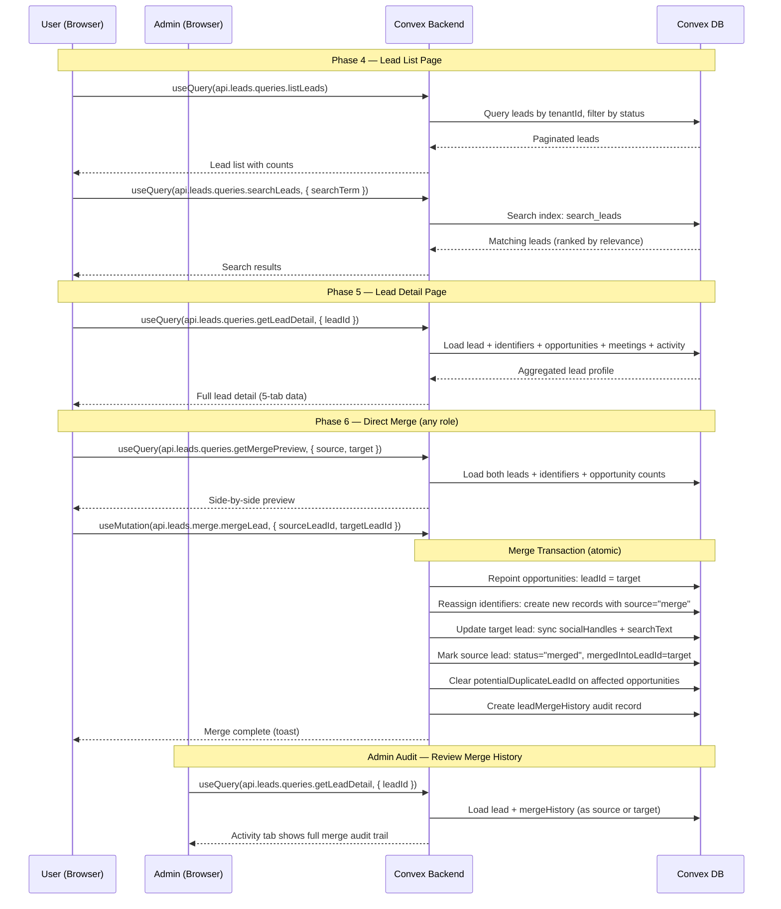
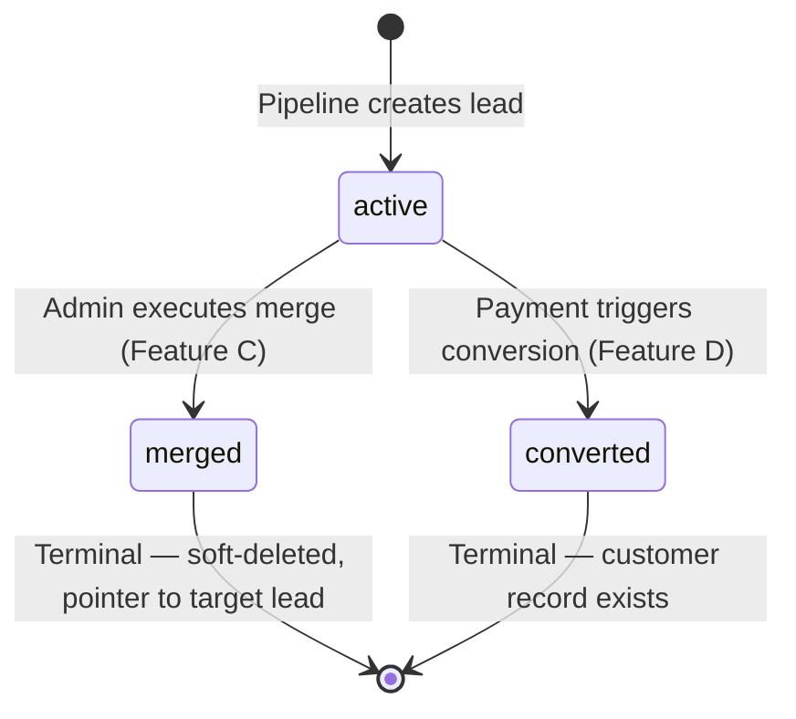
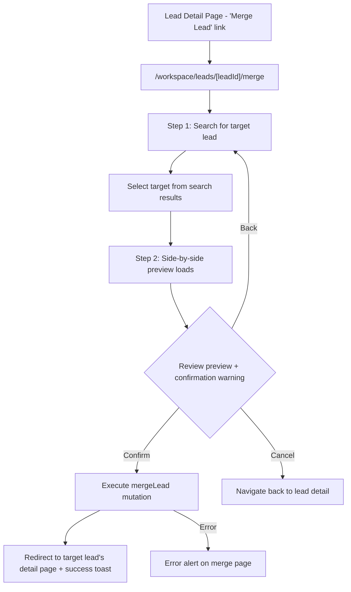
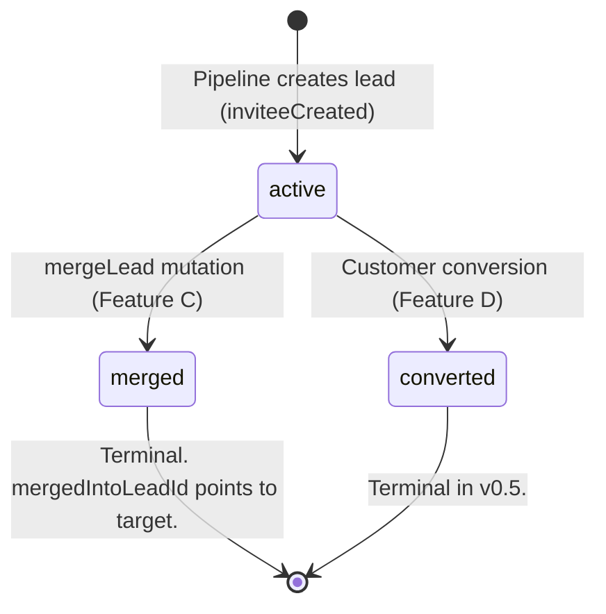

# Lead Manager — Design Specification

**Version:** 0.1 (MVP)
**Status:** Draft
**Scope:** No dedicated lead UI beyond the meeting detail duplicate banner --> Full lead management hub with searchable list at `/workspace/leads`, full-page lead detail at `/workspace/leads/[leadId]` (opens in new tab), 5-tab layout, and a dedicated merge page at `/workspace/leads/[leadId]/merge` for all roles with audit trail. Builds the operational surface that sits between identity resolution (Feature E) and customer conversion (Feature D).
**Prerequisite:** Feature E (Lead Identity Resolution) complete and deployed -- `leadIdentifiers` table exists with multi-identifier resolution chain active in the pipeline; `leads` table has `status`, `mergedIntoLeadId`, `socialHandles` fields; `opportunities` has `potentialDuplicateLeadId`; normalization utilities deployed in `convex/lib/normalization.ts`. Feature F (Event Type Field Mappings) complete -- `customFieldMappings` and `knownCustomFieldKeys` on `eventTypeConfigs`.
**Feature Area:** C (v0.5 Track 2: F --> E --> **C** --> D -- Critical Path)

---

## Table of Contents

1. [Goals & Non-Goals](#1-goals--non-goals)
2. [Actors & Roles](#2-actors--roles)
3. [End-to-End Flow Overview](#3-end-to-end-flow-overview)
4. [Phase 1: Schema & Permissions Foundation](#4-phase-1-schema--permissions-foundation)
5. [Phase 2: Backend — Lead Queries](#5-phase-2-backend--lead-queries)
6. [Phase 3: Backend — Lead Mutations & Merge Logic](#6-phase-3-backend--lead-mutations--merge-logic)
7. [Phase 4: Frontend — Lead List Page](#7-phase-4-frontend--lead-list-page)
8. [Phase 5: Frontend — Lead Detail Page](#8-phase-5-frontend--lead-detail-page)
9. [Phase 6: Frontend — Merge Page](#9-phase-6-frontend--merge-page)
10. [Data Model](#10-data-model)
11. [Convex Function Architecture](#11-convex-function-architecture)
12. [Routing & Authorization](#12-routing--authorization)
13. [Security Considerations](#13-security-considerations)
14. [Error Handling & Edge Cases](#14-error-handling--edge-cases)
15. [Open Questions](#15-open-questions)
16. [Dependencies](#16-dependencies)
17. [Applicable Skills](#17-applicable-skills)

---

## 1. Goals & Non-Goals

### Goals

- **Searchable lead list at `/workspace/leads`** -- paginated table with full-text search across name, email, phone, and social handles. Sortable columns, status filter tabs, and CSV export for admins.
- **Full-page lead detail at `/workspace/leads/[leadId]`** -- opens in a new browser tab when a lead row is clicked, giving the user a focused context while keeping the lead list available. Tabbed layout with Overview, Meetings, Opportunities, Activity, and Custom Fields.
- **Dedicated merge page at `/workspace/leads/[leadId]/merge`** -- any CRM user (closer, admin, or owner) navigates to the merge page from the detail page: search for target lead, review a full-screen side-by-side preview, and confirm. After merge, the user is redirected to the surviving lead's detail page. Closers are the primary merge actors because they interact with leads daily and spot duplicates first. Merge is irreversible in the UI but fully audited.
- **Pipeline duplicate banner enhancement** -- the existing "potential duplicate" banner on the meeting detail page (Feature E) gains a "Review & Merge" action that navigates to the Lead Manager with the merge flow pre-populated.
- **Lead RBAC** -- granular permissions for view, edit, create, delete, merge, convert, and export. All roles can view and merge; only admins can edit lead info.
- **Full audit trail for admins** -- every merge operation is recorded in `leadMergeHistory` with source lead, target lead, who executed it, and what was moved. Admins can review merge history in the lead detail page's Activity tab to understand the provenance of any lead.

### Non-Goals (deferred)

- **Lead-to-customer conversion** -- Feature D. The "Convert to Customer" button will exist in the detail page header but will be disabled with a tooltip ("Coming soon") until Feature D is implemented.
- **Manual lead creation** -- the permission `lead:create` is defined but no "Create Lead" UI is built in v0.5. Leads enter the system exclusively through the Calendly webhook pipeline. Manual creation is deferred to v0.6+.
- **Lead deletion** -- the permission `lead:delete` is defined but no delete UI is built. Leads with opportunities cannot be deleted (data integrity). Leads without opportunities could theoretically be deleted, but there's no business need in v0.5.
- **Lead export** -- the permission `lead:export` is defined and the CSV export button is rendered (admin-only), but the implementation is deferred to a fast-follow. The button shows a "Coming soon" tooltip.
- **Retroactive lead identifier backfill** -- existing leads (created before Feature E) may not have `leadIdentifier` records. A backfill migration should run after Feature E ships. This design document does not cover the migration; use `convex-migration-helper`.
- **AI/ML merge scoring** -- no embedding or similarity scoring beyond Feature E's heuristic name + domain match. Merge decisions rely on human judgment.
- **Cross-tenant lead deduplication** -- never. Each tenant's lead data is fully isolated.

---

## 2. Actors & Roles

| Actor | Identity | Auth Method | Key Permissions |
|---|---|---|---|
| **Tenant Master** | CRM user with `tenant_master` role | WorkOS AuthKit, member of tenant org | Full lead access: view, edit, merge, delete, convert, export |
| **Tenant Admin** | CRM user with `tenant_admin` role | WorkOS AuthKit, member of tenant org | View, edit, merge, convert, export. Cannot delete leads. |
| **Closer** | CRM user with `closer` role | WorkOS AuthKit, member of tenant org | View all leads, merge leads directly. Cannot edit lead info, delete, convert, or export. |
| **Pipeline Processor** | Internal Convex mutation | `internalMutation` (no auth context) | Creates leads and identifiers automatically during webhook processing. Sets `potentialDuplicateLeadId` on opportunities. Feature C reads this data but does not modify the pipeline. |

### CRM Role <-> Permission Mapping

| Permission | `tenant_master` | `tenant_admin` | `closer` |
|---|:---:|:---:|:---:|
| `lead:view-all` | Yes | Yes | Yes |
| `lead:edit` | Yes | Yes | No |
| `lead:create` | Yes | Yes | No |
| `lead:delete` | Yes | No | No |
| `lead:merge` | Yes | Yes | Yes |
| `lead:convert` | Yes | Yes | No |
| `lead:export` | Yes | Yes | No |

> **Design decision: closers merge directly, no approval pipeline.** Closers interact with leads daily -- they're the first to spot when a returning lead books under a different email or social handle. Requiring admin approval would add friction to a time-sensitive operation (the closer needs the lead's full history *now*, before their call). Instead, every merge creates a `leadMergeHistory` audit record. Admins can review all merges in the Activity tab and take corrective action if needed. This trades a proactive gate for a reactive audit trail -- the right tradeoff when merge volumes are low and closers are trusted.

---

## 3. End-to-End Flow Overview



---

## 4. Phase 1: Schema & Permissions Foundation

### 4.1 New Tables

One new table supports the merge audit trail:

**`leadMergeHistory`** — audit record for every executed merge. This is the primary mechanism for admin oversight -- admins review merge history in the lead detail page's Activity tab.

```typescript
// Path: convex/schema.ts (addition)
leadMergeHistory: defineTable({
  tenantId: v.id("tenants"),
  sourceLeadId: v.id("leads"),     // The lead that was merged (now status: "merged")
  targetLeadId: v.id("leads"),     // The lead that absorbed the source
  mergedByUserId: v.id("users"),   // Who executed the merge
  identifiersMoved: v.number(),    // Count of identifier records reassigned
  opportunitiesMoved: v.number(),  // Count of opportunities repointed
  createdAt: v.number(),
})
  .index("by_tenantId", ["tenantId"])
  .index("by_sourceLeadId", ["sourceLeadId"])
  .index("by_targetLeadId", ["targetLeadId"]),
// === End Feature C ===
```

> **Decision: no suggestion/approval pipeline.** Closers merge directly because they interact with leads daily and spot duplicates first. Requiring admin approval would add friction with little safety benefit -- merge volumes are low, and the `leadMergeHistory` audit trail gives admins full visibility after the fact. If a merge was incorrect, an admin can investigate via the audit trail and manually correct the data.

### 4.2 Search Index on `leads`

Full-text search across multiple fields requires a denormalized `searchText` field and a Convex search index.

```typescript
// Path: convex/schema.ts (modification to leads table)
leads: defineTable({
  // ... existing fields ...

  // === Feature C: Lead Search ===
  // Denormalized full-text search field. Concatenation of fullName, email,
  // phone, and social handle values. Updated by the pipeline on lead
  // creation/update and by the merge mutation when identifiers change.
  // Format: "John Smith john@example.com +17789559253 campos.coachpro coach_pro"
  searchText: v.optional(v.string()),
  // === End Feature C ===
})
  .index("by_tenantId", ["tenantId"])
  .index("by_tenantId_and_email", ["tenantId", "email"])
  // === Feature C: Full-text search ===
  .index("by_tenantId_and_status", ["tenantId", "status"])
  .searchIndex("search_leads", {
    searchField: "searchText",
    filterFields: ["tenantId", "status"],
  }),
  // === End Feature C ===
```

> **Decision: denormalized `searchText` vs. multiple queries.** Convex search indexes work on a single text field. The alternatives were: (a) multiple queries per search field merged client-side (expensive, complex), (b) `filter()` on a bounded `.take(5000)` set (doesn't scale), or (c) a single denormalized field. Option (c) is the standard Convex pattern for multi-field search and stays efficient as lead volumes grow. The `searchText` field is updated via a helper function whenever lead fields or identifiers change.

### 4.3 New Permissions

```typescript
// Path: convex/lib/permissions.ts (additions)
export const PERMISSIONS = {
  // ... existing permissions ...

  // === Feature C: Lead Manager ===
  "lead:view-all": ["tenant_master", "tenant_admin", "closer"],
  "lead:edit": ["tenant_master", "tenant_admin"],
  "lead:create": ["tenant_master", "tenant_admin"],
  "lead:delete": ["tenant_master"],
  "lead:merge": ["tenant_master", "tenant_admin", "closer"],
  "lead:convert": ["tenant_master", "tenant_admin"],
  "lead:export": ["tenant_master", "tenant_admin"],
  // === End Feature C ===
} as const;
```

### 4.4 Lead Status State Machine



No additions to `convex/lib/statusTransitions.ts` are needed. Lead status transitions are simpler than opportunity transitions and are validated inline in the merge/conversion mutations:

- `active` (or `undefined`) → `merged`: only during `mergeLead` mutation
- `active` (or `undefined`) → `converted`: only during customer conversion (Feature D)
- `merged` → anything: **blocked** — merged leads are terminal
- `converted` → anything: **blocked** in v0.5 (Feature D may add `churned` later)

### 4.5 `searchText` Builder Utility

A pure helper function that builds the `searchText` field from lead data and identifiers.

```typescript
// Path: convex/leads/searchTextBuilder.ts
import type { Doc } from "../_generated/dataModel";

/**
 * Build the denormalized searchText field for a lead.
 *
 * Concatenates all searchable fields into a single space-separated string.
 * Used by:
 * - Pipeline (inviteeCreated) when creating/updating leads
 * - Merge mutation when consolidating identifiers
 * - updateLead mutation when admin edits lead fields
 *
 * @param lead The lead document (must have fullName, email, phone, socialHandles)
 * @param identifierValues Optional array of normalized identifier values to include
 * @returns The searchText string, or undefined if no searchable content.
 */
export function buildLeadSearchText(
  lead: Pick<Doc<"leads">, "fullName" | "email" | "phone" | "socialHandles">,
  identifierValues?: string[],
): string | undefined {
  const parts: string[] = [];

  if (lead.fullName) parts.push(lead.fullName);
  if (lead.email) parts.push(lead.email);
  if (lead.phone) parts.push(lead.phone);

  // Include denormalized social handles
  if (lead.socialHandles) {
    for (const { handle } of lead.socialHandles) {
      parts.push(handle);
    }
  }

  // Include any additional identifier values (e.g., after merge)
  if (identifierValues) {
    for (const val of identifierValues) {
      if (!parts.includes(val)) {
        parts.push(val);
      }
    }
  }

  return parts.length > 0 ? parts.join(" ") : undefined;
}
```

### 4.6 Pipeline Integration — Populate `searchText` on Lead Creation/Update

The pipeline's `inviteeCreated.ts` must set `searchText` whenever it creates or updates a lead. This is an additive change at the end of the existing lead creation/update blocks:

```typescript
// Path: convex/pipeline/inviteeCreated.ts (additive change after lead creation/sync)
// After the lead is created or synced, rebuild searchText:
import { buildLeadSearchText } from "../leads/searchTextBuilder";

// ... inside the handler, after lead fields are synced ...
const updatedLead = await ctx.db.get(lead._id);
if (updatedLead) {
  const identifiers = await ctx.db
    .query("leadIdentifiers")
    .withIndex("by_leadId", (q) => q.eq("leadId", lead._id))
    .take(50);
  const identifierValues = identifiers.map((i) => i.value);
  const searchText = buildLeadSearchText(updatedLead, identifierValues);
  await ctx.db.patch(lead._id, { searchText });
}
```

> **Decision: pipeline sets `searchText` vs. cron backfill.** Since every lead creation/update goes through the pipeline, setting `searchText` inline ensures it's always up to date. A cron backfill is only needed for the initial migration of existing leads (see Non-Goals). The additive pipeline change is minimal — one read + one patch after the existing lead sync block.

### 4.7 Schema Deployment

Deploy schema additions in this order:
1. Add `leadMergeHistory` table
2. Add `searchText` field to `leads` (optional field — existing docs unaffected)
3. Add `by_tenantId_and_status` index and `search_leads` search index to `leads`
4. Add new permissions to `convex/lib/permissions.ts`
5. Run `npx convex dev` to deploy

All changes are additive (new tables, new optional fields, new indexes). No migration needed.

---

## 5. Phase 2: Backend — Lead Queries

All queries live in a new `convex/leads/` directory. Every query enforces tenant isolation via `requireTenantUser`.

### 5.1 `listLeads` — Paginated Lead List

```typescript
// Path: convex/leads/queries.ts
import { v } from "convex/values";
import { query } from "../_generated/server";
import { paginationOptsValidator } from "convex/server";
import { requireTenantUser } from "../requireTenantUser";

/**
 * List leads for the current tenant with pagination and optional status filter.
 *
 * All roles can view leads (lead:view-all includes closer).
 * Returns leads ordered by most recently updated first.
 */
export const listLeads = query({
  args: {
    paginationOpts: paginationOptsValidator,
    statusFilter: v.optional(
      v.union(v.literal("active"), v.literal("converted"), v.literal("merged")),
    ),
  },
  handler: async (ctx, { paginationOpts, statusFilter }) => {
    const { tenantId } = await requireTenantUser(ctx, [
      "tenant_master",
      "tenant_admin",
      "closer",
    ]);

    let leadsQuery;
    if (statusFilter) {
      leadsQuery = ctx.db
        .query("leads")
        .withIndex("by_tenantId_and_status", (q) =>
          q.eq("tenantId", tenantId).eq("status", statusFilter),
        )
        .order("desc");
    } else {
      // Default: all non-merged leads (active + converted + undefined status)
      leadsQuery = ctx.db
        .query("leads")
        .withIndex("by_tenantId", (q) => q.eq("tenantId", tenantId))
        .order("desc");
    }

    const results = await leadsQuery.paginate(paginationOpts);

    // Enrich each lead with meeting count and latest meeting date
    const enrichedPage = await Promise.all(
      results.page.map(async (lead) => {
        const opportunities = await ctx.db
          .query("opportunities")
          .withIndex("by_tenantId_and_leadId", (q) =>
            q.eq("tenantId", tenantId).eq("leadId", lead._id),
          )
          .take(50);

        let meetingCount = 0;
        let latestMeetingAt: number | null = null;
        let assignedCloserName: string | null = null;

        for (const opp of opportunities) {
          // Use denormalized latestMeetingAt for efficiency
          if (opp.latestMeetingAt) {
            meetingCount++; // Approximation: 1 "latest" meeting per opportunity
            if (!latestMeetingAt || opp.latestMeetingAt > latestMeetingAt) {
              latestMeetingAt = opp.latestMeetingAt;
            }
          }
          // Get the most recent closer assignment
          if (opp.assignedCloserId && !assignedCloserName) {
            const closer = await ctx.db.get(opp.assignedCloserId);
            if (closer && closer.tenantId === tenantId) {
              assignedCloserName = closer.fullName ?? closer.email;
            }
          }
        }

        return {
          ...lead,
          opportunityCount: opportunities.length,
          latestMeetingAt,
          assignedCloserName,
        };
      }),
    );

    return {
      ...results,
      page: enrichedPage,
    };
  },
});
```

> **Decision: enrichment in the query vs. denormalized fields.** Meeting count and latest meeting date could be denormalized onto the lead document, but that would require updating leads on every meeting creation — increasing write contention on the pipeline hot path. Since `listLeads` is paginated (25 items per page) and each enrichment is bounded (`.take(50)` opportunities), the read cost is acceptable. If performance becomes an issue, denormalize as a fast-follow.

### 5.2 `searchLeads` — Full-Text Search

```typescript
// Path: convex/leads/queries.ts (continued)

/**
 * Search leads by name, email, phone, or social handle.
 *
 * Uses the search_leads search index on the denormalized searchText field.
 * Returns up to 20 results ranked by relevance.
 */
export const searchLeads = query({
  args: {
    searchTerm: v.string(),
    statusFilter: v.optional(
      v.union(v.literal("active"), v.literal("converted"), v.literal("merged")),
    ),
  },
  handler: async (ctx, { searchTerm, statusFilter }) => {
    const { tenantId } = await requireTenantUser(ctx, [
      "tenant_master",
      "tenant_admin",
      "closer",
    ]);

    if (searchTerm.trim().length === 0) {
      return [];
    }

    let searchQuery = ctx.db
      .query("leads")
      .withSearchIndex("search_leads", (q) => {
        const base = q.search("searchText", searchTerm).eq("tenantId", tenantId);
        if (statusFilter) {
          return base.eq("status", statusFilter);
        }
        return base;
      });

    const results = await searchQuery.take(20);

    // Filter out merged leads from default search (unless explicitly searching for merged)
    const filtered = statusFilter
      ? results
      : results.filter((lead) => lead.status !== "merged");

    return filtered;
  },
});
```

### 5.3 `getLeadDetail` — Full Lead Profile

Returns all data needed for the 5-tab detail page in a single reactive query.

```typescript
// Path: convex/leads/queries.ts (continued)

/**
 * Get complete lead detail for the detail page.
 *
 * Returns:
 * - lead: Core lead document
 * - identifiers: All leadIdentifier records for this lead
 * - opportunities: All opportunities with enrichment (closer name, status, meeting count)
 * - meetings: All meetings across all opportunities (chronological)
 * - followUps: All follow-ups for this lead
 * - mergeHistory: All merge events involving this lead (as source or target)
 */
export const getLeadDetail = query({
  args: { leadId: v.id("leads") },
  handler: async (ctx, { leadId }) => {
    const { tenantId, role } = await requireTenantUser(ctx, [
      "tenant_master",
      "tenant_admin",
      "closer",
    ]);

    const lead = await ctx.db.get(leadId);
    if (!lead || lead.tenantId !== tenantId) {
      throw new Error("Lead not found");
    }

    // If this lead was merged, follow the chain to the active lead
    if (lead.status === "merged" && lead.mergedIntoLeadId) {
      const activeLead = await ctx.db.get(lead.mergedIntoLeadId);
      if (activeLead && activeLead.tenantId === tenantId) {
        return {
          redirectToLeadId: activeLead._id,
          lead: null,
          identifiers: [],
          opportunities: [],
          meetings: [],
          followUps: [],
          mergeHistory: [],
        };
      }
    }

    // Load identifiers
    const identifiers = await ctx.db
      .query("leadIdentifiers")
      .withIndex("by_leadId", (q) => q.eq("leadId", leadId))
      .take(100);

    // Load opportunities with enrichment
    const rawOpportunities = await ctx.db
      .query("opportunities")
      .withIndex("by_tenantId_and_leadId", (q) =>
        q.eq("tenantId", tenantId).eq("leadId", leadId),
      )
      .take(50);

    const opportunities = await Promise.all(
      rawOpportunities.map(async (opp) => {
        let closerName: string | null = null;
        if (opp.assignedCloserId) {
          const closer = await ctx.db.get(opp.assignedCloserId);
          if (closer && closer.tenantId === tenantId) {
            closerName = closer.fullName ?? closer.email;
          }
        }

        let eventTypeName: string | null = null;
        if (opp.eventTypeConfigId) {
          const etc = await ctx.db.get(opp.eventTypeConfigId);
          eventTypeName = etc?.displayName ?? null;
        }

        return {
          ...opp,
          closerName,
          eventTypeName,
        };
      }),
    );

    // Load all meetings across all opportunities
    const meetings: (typeof import("../_generated/dataModel").Doc<"meetings"> & {
      opportunityStatus: string;
      closerName: string | null;
    })[] = [];

    for (const opp of rawOpportunities) {
      const oppMeetings = await ctx.db
        .query("meetings")
        .withIndex("by_opportunityId", (q) => q.eq("opportunityId", opp._id))
        .take(50);

      let closerName: string | null = null;
      if (opp.assignedCloserId) {
        const closer = await ctx.db.get(opp.assignedCloserId);
        if (closer && closer.tenantId === tenantId) {
          closerName = closer.fullName ?? closer.email;
        }
      }

      for (const mtg of oppMeetings) {
        meetings.push({
          ...mtg,
          opportunityStatus: opp.status,
          closerName,
        });
      }
    }

    // Sort meetings by scheduledAt descending
    meetings.sort((a, b) => b.scheduledAt - a.scheduledAt);

    // Load follow-ups for this lead
    const followUps = await ctx.db
      .query("followUps")
      .withIndex("by_tenantId", (q) => q.eq("tenantId", tenantId))
      .take(200);
    const leadFollowUps = followUps.filter((fu) => fu.leadId === leadId);

    // Load merge history (as source or target)
    const mergeHistoryAsSource = await ctx.db
      .query("leadMergeHistory")
      .withIndex("by_sourceLeadId", (q) => q.eq("sourceLeadId", leadId))
      .take(20);

    const mergeHistoryAsTarget = await ctx.db
      .query("leadMergeHistory")
      .withIndex("by_targetLeadId", (q) => q.eq("targetLeadId", leadId))
      .take(20);

    const mergeHistory = [...mergeHistoryAsSource, ...mergeHistoryAsTarget].sort(
      (a, b) => b.createdAt - a.createdAt,
    );

    console.log("[Leads:Detail] getLeadDetail completed", {
      leadId,
      identifierCount: identifiers.length,
      opportunityCount: opportunities.length,
      meetingCount: meetings.length,
      followUpCount: leadFollowUps.length,
      mergeHistoryCount: mergeHistory.length,
    });

    return {
      redirectToLeadId: null,
      lead,
      identifiers,
      opportunities,
      meetings,
      followUps: leadFollowUps,
      mergeHistory,
    };
  },
});
```

### 5.4 `getMergePreview` — Preview Merge Outcome

```typescript
// Path: convex/leads/queries.ts (continued)

/**
 * Preview what a merge would do before executing.
 * Shows side-by-side comparison and what would be moved.
 *
 * Convention: "source" = the lead being absorbed (will become status: merged).
 * "target" = the surviving lead that receives all data.
 */
export const getMergePreview = query({
  args: {
    sourceLeadId: v.id("leads"),
    targetLeadId: v.id("leads"),
  },
  handler: async (ctx, { sourceLeadId, targetLeadId }) => {
    const { tenantId } = await requireTenantUser(ctx, [
      "tenant_master",
      "tenant_admin",
    ]);

    const source = await ctx.db.get(sourceLeadId);
    const target = await ctx.db.get(targetLeadId);

    if (!source || source.tenantId !== tenantId) throw new Error("Source lead not found");
    if (!target || target.tenantId !== tenantId) throw new Error("Target lead not found");
    if (source.status === "merged") throw new Error("Source lead is already merged");
    if (target.status === "merged") throw new Error("Target lead is already merged");

    // Source identifiers
    const sourceIdentifiers = await ctx.db
      .query("leadIdentifiers")
      .withIndex("by_leadId", (q) => q.eq("leadId", sourceLeadId))
      .take(100);

    // Target identifiers
    const targetIdentifiers = await ctx.db
      .query("leadIdentifiers")
      .withIndex("by_leadId", (q) => q.eq("leadId", targetLeadId))
      .take(100);

    // Source opportunities
    const sourceOpportunities = await ctx.db
      .query("opportunities")
      .withIndex("by_tenantId_and_leadId", (q) =>
        q.eq("tenantId", tenantId).eq("leadId", sourceLeadId),
      )
      .take(50);

    // Target opportunities
    const targetOpportunities = await ctx.db
      .query("opportunities")
      .withIndex("by_tenantId_and_leadId", (q) =>
        q.eq("tenantId", tenantId).eq("leadId", targetLeadId),
      )
      .take(50);

    // Determine which source identifiers would be new to the target
    const targetIdSet = new Set(
      targetIdentifiers.map((i) => `${i.type}:${i.value}`),
    );
    const newIdentifiers = sourceIdentifiers.filter(
      (i) => !targetIdSet.has(`${i.type}:${i.value}`),
    );
    const duplicateIdentifiers = sourceIdentifiers.filter((i) =>
      targetIdSet.has(`${i.type}:${i.value}`),
    );

    return {
      source: {
        lead: source,
        identifiers: sourceIdentifiers,
        opportunityCount: sourceOpportunities.length,
      },
      target: {
        lead: target,
        identifiers: targetIdentifiers,
        opportunityCount: targetOpportunities.length,
      },
      preview: {
        identifiersToMove: newIdentifiers.length,
        duplicateIdentifiers: duplicateIdentifiers.length,
        opportunitiesToMove: sourceOpportunities.length,
        totalOpportunitiesAfterMerge:
          sourceOpportunities.length + targetOpportunities.length,
      },
    };
  },
});
```

---

## 6. Phase 3: Backend — Lead Mutations & Merge Logic

### 6.1 `updateLead` — Edit Lead Info

```typescript
// Path: convex/leads/mutations.ts
import { v } from "convex/values";
import { mutation } from "../_generated/server";
import { requireTenantUser } from "../requireTenantUser";
import { buildLeadSearchText } from "./searchTextBuilder";

/**
 * Update editable lead fields. Admin-only.
 *
 * Only fullName, phone, and email can be edited directly.
 * Social handles are managed through leadIdentifiers (not directly editable here).
 */
export const updateLead = mutation({
  args: {
    leadId: v.id("leads"),
    fullName: v.optional(v.string()),
    phone: v.optional(v.string()),
    email: v.optional(v.string()),
  },
  handler: async (ctx, { leadId, ...updates }) => {
    const { tenantId, userId } = await requireTenantUser(ctx, [
      "tenant_master",
      "tenant_admin",
    ]);

    const lead = await ctx.db.get(leadId);
    if (!lead || lead.tenantId !== tenantId) {
      throw new Error("Lead not found");
    }
    if (lead.status === "merged") {
      throw new Error("Cannot edit a merged lead");
    }

    // Build patch object with only provided fields
    const patch: Record<string, unknown> = { updatedAt: Date.now() };
    if (updates.fullName !== undefined) patch.fullName = updates.fullName;
    if (updates.phone !== undefined) patch.phone = updates.phone;
    if (updates.email !== undefined) patch.email = updates.email;

    await ctx.db.patch(leadId, patch);

    // Rebuild searchText
    const updatedLead = await ctx.db.get(leadId);
    if (updatedLead) {
      const identifiers = await ctx.db
        .query("leadIdentifiers")
        .withIndex("by_leadId", (q) => q.eq("leadId", leadId))
        .take(50);
      const searchText = buildLeadSearchText(
        updatedLead,
        identifiers.map((i) => i.value),
      );
      await ctx.db.patch(leadId, { searchText });
    }

    console.log("[Leads:Mutation] updateLead", { leadId, updatedFields: Object.keys(updates) });
  },
});
```

### 6.2 `mergeLead` — Execute the Merge (All Roles)

The core merge logic. This is a single Convex mutation (transaction) that atomically:
1. Validates both leads are active and in the same tenant
2. Repoints all source opportunities to the target lead
3. Creates new identifier records on the target (with `source: "merge"`)
4. Updates the target lead's denormalized `socialHandles`
5. Marks the source lead as `merged` with `mergedIntoLeadId`
6. Creates a `leadMergeHistory` audit record
7. Clears `potentialDuplicateLeadId` on any opportunities that referenced the source

```typescript
// Path: convex/leads/merge.ts (continued)

/**
 * Execute a lead merge. All roles with lead:merge permission.
 *
 * source = the lead being absorbed (becomes status: "merged").
 * target = the surviving lead that receives all data.
 *
 * This mutation is atomic — all changes happen in a single transaction.
 * If any step fails, the entire merge is rolled back.
 * Every merge creates a leadMergeHistory audit record for admin review.
 */
export const mergeLead = mutation({
  args: {
    sourceLeadId: v.id("leads"),
    targetLeadId: v.id("leads"),
  },
  handler: async (ctx, { sourceLeadId, targetLeadId }) => {
    const { tenantId, userId } = await requireTenantUser(ctx, [
      "tenant_master",
      "tenant_admin",
      "closer",
    ]);

    await executeMerge(ctx, tenantId, userId, sourceLeadId, targetLeadId);
  },
});

/**
 * Core merge logic. Creates a full audit trail in leadMergeHistory.
 */
async function executeMerge(
  ctx: MutationCtx,
  tenantId: Id<"tenants">,
  userId: Id<"users">,
  sourceLeadId: Id<"leads">,
  targetLeadId: Id<"leads">,
): Promise<void> {
  const now = Date.now();

  if (sourceLeadId === targetLeadId) {
    throw new Error("Cannot merge a lead with itself");
  }

  const source = await ctx.db.get(sourceLeadId);
  const target = await ctx.db.get(targetLeadId);

  if (!source || source.tenantId !== tenantId) throw new Error("Source lead not found");
  if (!target || target.tenantId !== tenantId) throw new Error("Target lead not found");
  if (source.status === "merged") throw new Error("Source lead is already merged");
  if (target.status === "merged") throw new Error("Cannot merge into a merged lead");

  // --- Step 1: Repoint source opportunities to target ---
  const sourceOpportunities = await ctx.db
    .query("opportunities")
    .withIndex("by_tenantId_and_leadId", (q) =>
      q.eq("tenantId", tenantId).eq("leadId", sourceLeadId),
    )
    .take(100);

  for (const opp of sourceOpportunities) {
    await ctx.db.patch(opp._id, { leadId: targetLeadId, updatedAt: now });
  }

  // --- Step 2: Consolidate identifiers ---
  const sourceIdentifiers = await ctx.db
    .query("leadIdentifiers")
    .withIndex("by_leadId", (q) => q.eq("leadId", sourceLeadId))
    .take(100);

  const targetIdentifiers = await ctx.db
    .query("leadIdentifiers")
    .withIndex("by_leadId", (q) => q.eq("leadId", targetLeadId))
    .take(100);

  const targetIdSet = new Set(
    targetIdentifiers.map((i) => `${i.type}:${i.value}`),
  );

  let identifiersMoved = 0;
  for (const identifier of sourceIdentifiers) {
    const key = `${identifier.type}:${identifier.value}`;
    if (!targetIdSet.has(key)) {
      // Create a new identifier record on the target with source="merge"
      await ctx.db.insert("leadIdentifiers", {
        tenantId,
        leadId: targetLeadId,
        type: identifier.type,
        value: identifier.value,
        rawValue: identifier.rawValue,
        source: "merge",
        sourceMeetingId: identifier.sourceMeetingId,
        confidence: identifier.confidence,
        createdAt: now,
      });
      identifiersMoved++;
    }
    // Delete the source identifier record (it's now on the target or a duplicate)
    await ctx.db.delete(identifier._id);
  }

  // --- Step 3: Rebuild target's socialHandles denormalization ---
  const allTargetIdentifiers = await ctx.db
    .query("leadIdentifiers")
    .withIndex("by_leadId", (q) => q.eq("leadId", targetLeadId))
    .take(100);

  const socialTypes = new Set([
    "instagram", "tiktok", "twitter", "facebook", "linkedin", "other_social",
  ]);
  const socialHandles = allTargetIdentifiers
    .filter((i) => socialTypes.has(i.type))
    .map((i) => ({ type: i.type, handle: i.value }));

  // --- Step 4: Update target lead with merged social handles and searchText ---
  const updatedTarget = await ctx.db.get(targetLeadId);
  if (!updatedTarget) throw new Error("Target lead disappeared during merge");

  const searchText = buildLeadSearchText(
    { ...updatedTarget, socialHandles },
    allTargetIdentifiers.map((i) => i.value),
  );

  await ctx.db.patch(targetLeadId, {
    socialHandles: socialHandles.length > 0 ? socialHandles : undefined,
    searchText,
    updatedAt: now,
  });

  // --- Step 5: Mark source as merged ---
  await ctx.db.patch(sourceLeadId, {
    status: "merged",
    mergedIntoLeadId: targetLeadId,
    updatedAt: now,
  });

  // --- Step 6: Clear potentialDuplicateLeadId on any opportunities referencing source ---
  const allTenantOpportunities = await ctx.db
    .query("opportunities")
    .withIndex("by_tenantId", (q) => q.eq("tenantId", tenantId))
    .take(500);

  for (const opp of allTenantOpportunities) {
    if (opp.potentialDuplicateLeadId === sourceLeadId) {
      await ctx.db.patch(opp._id, {
        potentialDuplicateLeadId: undefined,
        updatedAt: now,
      });
    }
  }

  // --- Step 7: Create audit record ---
  await ctx.db.insert("leadMergeHistory", {
    tenantId,
    sourceLeadId,
    targetLeadId,
    mergedByUserId: userId,
    identifiersMoved,
    opportunitiesMoved: sourceOpportunities.length,
    createdAt: now,
  });

  console.log("[Leads:Merge] executeMerge completed", {
    sourceLeadId,
    targetLeadId,
    identifiersMoved,
    opportunitiesMoved: sourceOpportunities.length,
    mergedBy: userId,
  });
}
```

> **Decision: delete source identifiers vs. keep with `leadId` pointing to target.** Deleting source identifiers and creating new ones on the target (with `source: "merge"`) gives a clean audit trail: each identifier record shows where it came from. The alternative — patching `leadId` on existing records — would lose the provenance chain. The cost is more writes during the merge, but merges are rare operations (not hot-path).

### 6.3 `dismissDuplicateFlag` — Clear Pipeline-Detected Duplicate

```typescript
// Path: convex/leads/merge.ts (continued)

/**
 * Dismiss the pipeline's potential-duplicate flag on an opportunity.
 * Clears potentialDuplicateLeadId so the banner no longer shows.
 */
export const dismissDuplicateFlag = mutation({
  args: {
    opportunityId: v.id("opportunities"),
  },
  handler: async (ctx, { opportunityId }) => {
    const { tenantId } = await requireTenantUser(ctx, [
      "tenant_master",
      "tenant_admin",
    ]);

    const opportunity = await ctx.db.get(opportunityId);
    if (!opportunity || opportunity.tenantId !== tenantId) {
      throw new Error("Opportunity not found");
    }

    await ctx.db.patch(opportunityId, {
      potentialDuplicateLeadId: undefined,
      updatedAt: Date.now(),
    });

    console.log("[Leads:Merge] duplicate flag dismissed", { opportunityId });
  },
});
```

---

## 7. Phase 4: Frontend — Lead List Page

### 7.1 Route Structure

```
app/workspace/leads/
├── page.tsx                              # Lead list — thin RSC wrapper
├── loading.tsx                           # Route-level skeleton (list)
├── _components/
│   ├── leads-page-client.tsx             # Client entry: Suspense boundary
│   ├── leads-page-content.tsx            # Main content: search, filters, table
│   ├── leads-table.tsx                   # Table with sortable columns
│   ├── lead-search-input.tsx             # Debounced search bar (reused in merge)
│   ├── lead-status-badge.tsx             # Status badge component
│   └── skeletons/
│       ├── leads-skeleton.tsx            # List skeleton
│       └── lead-detail-skeleton.tsx      # Detail page skeleton
├── [leadId]/
│   ├── page.tsx                          # Lead detail — full page (Phase 5)
│   ├── loading.tsx                       # Detail skeleton
│   └── _components/
│       ├── lead-detail-page-client.tsx   # Client entry for detail page
│       ├── lead-header.tsx               # Lead name, status, contact info, actions
│       └── tabs/
│           ├── lead-overview-tab.tsx
│           ├── lead-meetings-tab.tsx
│           ├── lead-opportunities-tab.tsx
│           ├── lead-activity-tab.tsx
│           └── lead-custom-fields-tab.tsx
└── [leadId]/merge/
    ├── page.tsx                          # Merge flow — full page (Phase 6)
    ├── loading.tsx                       # Merge page skeleton
    └── _components/
        ├── merge-page-client.tsx         # Client entry for merge flow
        ├── merge-target-search.tsx       # Step 1: search for target lead
        ├── merge-preview.tsx             # Step 2: side-by-side preview
        └── merge-confirm.tsx             # Step 3: confirmation + execute
```

> **Decision: full-page routes instead of sheet/dialog overlays.** Lead detail and merge are complex workflows that benefit from a dedicated, focused context. Opening the detail page in a new browser tab lets the user keep the lead list open for cross-referencing while working with a specific lead. The merge flow gets its own route because it's a multi-step process (search → preview → confirm) that deserves full-page real estate and a clean URL for bookmarking/sharing.

### 7.2 Page Entry Point

```tsx
// Path: app/workspace/leads/page.tsx
import { LeadsPageClient } from "./_components/leads-page-client";

export const unstable_instant = false;

export default function LeadsPage() {
  return <LeadsPageClient />;
}
```

```tsx
// Path: app/workspace/leads/loading.tsx
import { LeadsSkeleton } from "./_components/skeletons/leads-skeleton";

export default function LeadsLoading() {
  return <LeadsSkeleton />;
}
```

### 7.3 Client Component — Page Shell

```tsx
// Path: app/workspace/leads/_components/leads-page-client.tsx
"use client";

import { Suspense } from "react";
import { LeadsPageContent } from "./leads-page-content";
import { LeadsSkeleton } from "./skeletons/leads-skeleton";
import { usePageTitle } from "@/hooks/use-page-title";

export function LeadsPageClient() {
  usePageTitle("Leads");

  return (
    <Suspense fallback={<LeadsSkeleton />}>
      <LeadsPageContent />
    </Suspense>
  );
}
```

### 7.4 Page Content — Search, Filters, Table

```tsx
// Path: app/workspace/leads/_components/leads-page-content.tsx
"use client";

import { useState, useCallback, useMemo } from "react";
import { usePaginatedQuery, useQuery } from "convex/react";
import { api } from "@/convex/_generated/api";
import { useRole } from "@/components/auth/role-context";
import { Tabs, TabsList, TabsTrigger } from "@/components/ui/tabs";
import { Button } from "@/components/ui/button";
import { Card } from "@/components/ui/card";
import { DownloadIcon } from "lucide-react";
import { LeadSearchInput } from "./lead-search-input";
import { LeadsTable } from "./leads-table";
import type { Id } from "@/convex/_generated/dataModel";

type StatusFilter = "all" | "active" | "converted" | "merged";

export function LeadsPageContent() {
  const { isAdmin, hasPermission } = useRole();
  const [statusFilter, setStatusFilter] = useState<StatusFilter>("all");
  const [searchTerm, setSearchTerm] = useState("");

  // Paginated list (when not searching)
  const {
    results: paginatedLeads,
    status: paginationStatus,
    loadMore,
  } = usePaginatedQuery(
    api.leads.queries.listLeads,
    searchTerm.trim().length > 0
      ? "skip"
      : {
          statusFilter: statusFilter === "all" ? undefined : statusFilter,
        },
    { initialNumItems: 25 },
  );

  // Search results (when searching)
  const searchResults = useQuery(
    api.leads.queries.searchLeads,
    searchTerm.trim().length > 0
      ? {
          searchTerm: searchTerm.trim(),
          statusFilter: statusFilter === "all" ? undefined : statusFilter,
        }
      : "skip",
  );

  const leads = searchTerm.trim().length > 0 ? searchResults ?? [] : paginatedLeads;
  const isSearching = searchTerm.trim().length > 0;

  const handleSearchChange = useCallback((term: string) => {
    setSearchTerm(term);
  }, []);

  // Open lead detail in a new browser tab and focus it
  const handleLeadClick = useCallback((leadId: Id<"leads">) => {
    window.open(`/workspace/leads/${leadId}`, "_blank");
  }, []);

  return (
    <div className="flex flex-col gap-6">
      {/* Header */}
      <div className="flex items-start justify-between">
        <div>
          <h1 className="text-2xl font-semibold tracking-tight">Leads</h1>
          <p className="text-sm text-muted-foreground">
            Manage leads, merge duplicates, and track identities.
          </p>
        </div>
        <div className="flex items-center gap-2">
          {hasPermission("lead:export") && (
            <Button variant="outline" size="sm" disabled title="Coming soon">
              <DownloadIcon className="mr-2 h-4 w-4" />
              Export CSV
            </Button>
          )}
        </div>
      </div>

      {/* Search + Filters */}
      <Card className="p-4">
        <div className="flex flex-col gap-4 sm:flex-row sm:items-center sm:justify-between">
          <LeadSearchInput
            value={searchTerm}
            onChange={handleSearchChange}
          />
          <Tabs
            value={statusFilter}
            onValueChange={(val) => setStatusFilter(val as StatusFilter)}
          >
            <TabsList>
              <TabsTrigger value="all">All</TabsTrigger>
              <TabsTrigger value="active">Active</TabsTrigger>
              <TabsTrigger value="converted">Converted</TabsTrigger>
              <TabsTrigger value="merged">Merged</TabsTrigger>
            </TabsList>
          </Tabs>
        </div>
      </Card>

      {/* Lead Table — row clicks open a new tab */}
      <LeadsTable
        leads={leads}
        isSearching={isSearching}
        isLoading={paginationStatus === "LoadingFirstPage"}
        canLoadMore={!isSearching && paginationStatus === "CanLoadMore"}
        onLoadMore={() => loadMore(25)}
        onLeadClick={handleLeadClick}
      />
    </div>
  );
}
```

### 7.5 Navigation Update

Add "Leads" to both admin and closer navigation:

```tsx
// Path: app/workspace/_components/workspace-shell-client.tsx (modification)
import {
  // ... existing imports ...
  ContactIcon,        // NEW: for Leads nav item
} from "lucide-react";

const adminNavItems: NavItem[] = [
  { href: "/workspace", label: "Overview", icon: LayoutDashboardIcon, exact: true },
  { href: "/workspace/pipeline", label: "Pipeline", icon: KanbanIcon },
  { href: "/workspace/leads", label: "Leads", icon: ContactIcon },       // NEW
  { href: "/workspace/team", label: "Team", icon: UsersIcon },
  { href: "/workspace/settings", label: "Settings", icon: SettingsIcon },
];

const closerNavItems: NavItem[] = [
  { href: "/workspace/closer", label: "Dashboard", icon: LayoutDashboardIcon, exact: true },
  { href: "/workspace/closer/pipeline", label: "My Pipeline", icon: KanbanIcon },
  { href: "/workspace/leads", label: "Leads", icon: ContactIcon },       // NEW
];
```

> **Decision: shared route `/workspace/leads` for all roles.** Both admins and closers navigate to the same route. The backend enforces role-based access — closers see a read-only view (no edit/merge buttons). This avoids duplicating the route under `/workspace/closer/leads`.

### 7.6 Leads Table Component

```tsx
// Path: app/workspace/leads/_components/leads-table.tsx
"use client";

import { useMemo } from "react";
import {
  Table,
  TableBody,
  TableCell,
  TableHead,
  TableHeader,
  TableRow,
} from "@/components/ui/table";
import { Button } from "@/components/ui/button";
import { SortableHeader } from "@/components/sortable-header";
import { useTableSort } from "@/hooks/use-table-sort";
import { Empty, EmptyHeader, EmptyTitle, EmptyDescription } from "@/components/ui/empty";
import { LeadStatusBadge } from "./lead-status-badge";
import { SearchIcon } from "lucide-react";
import { format } from "date-fns";
import type { Id } from "@/convex/_generated/dataModel";

type LeadRow = {
  _id: Id<"leads">;
  fullName?: string;
  email: string;
  phone?: string;
  status?: "active" | "converted" | "merged";
  socialHandles?: Array<{ type: string; handle: string }>;
  opportunityCount: number;
  latestMeetingAt: number | null;
  assignedCloserName: string | null;
};

interface LeadsTableProps {
  leads: LeadRow[];
  isSearching: boolean;
  isLoading: boolean;
  canLoadMore: boolean;
  onLoadMore: () => void;
  onLeadClick: (leadId: Id<"leads">) => void;
}

export function LeadsTable({
  leads,
  isSearching,
  isLoading,
  canLoadMore,
  onLoadMore,
  onLeadClick,
}: LeadsTableProps) {
  const comparators = useMemo(
    () => ({
      name: (a: LeadRow, b: LeadRow) =>
        (a.fullName ?? a.email).localeCompare(b.fullName ?? b.email),
      email: (a: LeadRow, b: LeadRow) => a.email.localeCompare(b.email),
      status: (a: LeadRow, b: LeadRow) =>
        (a.status ?? "active").localeCompare(b.status ?? "active"),
      meetings: (a: LeadRow, b: LeadRow) =>
        (b.latestMeetingAt ?? 0) - (a.latestMeetingAt ?? 0),
      opportunities: (a: LeadRow, b: LeadRow) =>
        b.opportunityCount - a.opportunityCount,
    }),
    [],
  );

  const { sorted, sort, toggle } = useTableSort(leads, comparators);

  if (!isLoading && leads.length === 0) {
    return (
      <Empty>
        <EmptyHeader>
          <SearchIcon className="h-10 w-10 text-muted-foreground/50" />
          <EmptyTitle>
            {isSearching ? "No leads found" : "No leads yet"}
          </EmptyTitle>
          <EmptyDescription>
            {isSearching
              ? "Try adjusting your search term or filters."
              : "Leads will appear here as new bookings come in through Calendly."}
          </EmptyDescription>
        </EmptyHeader>
      </Empty>
    );
  }

  return (
    <div>
      <Table>
        <TableHeader>
          <TableRow>
            <TableHead>
              <SortableHeader label="Name" sortKey="name" sort={sort} onToggle={toggle} />
            </TableHead>
            <TableHead>
              <SortableHeader label="Email" sortKey="email" sort={sort} onToggle={toggle} />
            </TableHead>
            <TableHead className="hidden md:table-cell">Social</TableHead>
            <TableHead>
              <SortableHeader label="Status" sortKey="status" sort={sort} onToggle={toggle} />
            </TableHead>
            <TableHead className="text-right">
              <SortableHeader label="Opportunities" sortKey="opportunities" sort={sort} onToggle={toggle} />
            </TableHead>
            <TableHead className="hidden lg:table-cell">
              <SortableHeader label="Last Meeting" sortKey="meetings" sort={sort} onToggle={toggle} />
            </TableHead>
            <TableHead className="hidden lg:table-cell">Closer</TableHead>
          </TableRow>
        </TableHeader>
        <TableBody>
          {sorted.map((lead) => (
            <TableRow
              key={lead._id}
              className="cursor-pointer hover:bg-muted/50"
              onClick={() => onLeadClick(lead._id)}
            >
              <TableCell className="font-medium">
                {lead.fullName ?? "—"}
              </TableCell>
              <TableCell className="text-muted-foreground">
                {lead.email}
              </TableCell>
              <TableCell className="hidden md:table-cell">
                {lead.socialHandles && lead.socialHandles.length > 0 ? (
                  <span className="text-xs text-muted-foreground">
                    {lead.socialHandles.map((s) => `@${s.handle}`).join(", ")}
                  </span>
                ) : (
                  <span className="text-muted-foreground">—</span>
                )}
              </TableCell>
              <TableCell>
                <LeadStatusBadge status={lead.status ?? "active"} />
              </TableCell>
              <TableCell className="text-right tabular-nums">
                {lead.opportunityCount}
              </TableCell>
              <TableCell className="hidden lg:table-cell text-muted-foreground">
                {lead.latestMeetingAt
                  ? format(new Date(lead.latestMeetingAt), "MMM d, yyyy")
                  : "—"}
              </TableCell>
              <TableCell className="hidden lg:table-cell text-muted-foreground">
                {lead.assignedCloserName ?? "—"}
              </TableCell>
            </TableRow>
          ))}
        </TableBody>
      </Table>

      {canLoadMore && (
        <div className="flex justify-center py-4">
          <Button variant="outline" size="sm" onClick={onLoadMore}>
            Load more
          </Button>
        </div>
      )}
    </div>
  );
}
```

### 7.7 Debounced Search Input

```tsx
// Path: app/workspace/leads/_components/lead-search-input.tsx
"use client";

import { useRef, useCallback, useState, useEffect } from "react";
import { Input } from "@/components/ui/input";
import { SearchIcon, XIcon } from "lucide-react";

interface LeadSearchInputProps {
  value: string;
  onChange: (term: string) => void;
}

export function LeadSearchInput({ value, onChange }: LeadSearchInputProps) {
  const [localValue, setLocalValue] = useState(value);
  const debounceRef = useRef<ReturnType<typeof setTimeout> | null>(null);

  // Debounce search input by 300ms
  const handleChange = useCallback(
    (newValue: string) => {
      setLocalValue(newValue);
      if (debounceRef.current) clearTimeout(debounceRef.current);
      debounceRef.current = setTimeout(() => {
        onChange(newValue);
      }, 300);
    },
    [onChange],
  );

  // Sync external value changes
  useEffect(() => {
    setLocalValue(value);
  }, [value]);

  // Cleanup on unmount
  useEffect(() => {
    return () => {
      if (debounceRef.current) clearTimeout(debounceRef.current);
    };
  }, []);

  return (
    <div className="relative w-full sm:max-w-xs">
      <SearchIcon className="absolute left-3 top-1/2 h-4 w-4 -translate-y-1/2 text-muted-foreground" />
      <Input
        value={localValue}
        onChange={(e) => handleChange(e.target.value)}
        placeholder="Search by name, email, phone, or social..."
        className="pl-9 pr-8"
      />
      {localValue.length > 0 && (
        <button
          type="button"
          onClick={() => handleChange("")}
          className="absolute right-3 top-1/2 -translate-y-1/2 text-muted-foreground hover:text-foreground"
          aria-label="Clear search"
        >
          <XIcon className="h-4 w-4" />
        </button>
      )}
    </div>
  );
}
```

---

## 8. Phase 5: Frontend — Lead Detail Page

### 8.1 Page Structure

The lead detail page is a **full-page route** at `/workspace/leads/[leadId]`. Clicking a row in the lead list opens this page in a **new browser tab** (via `window.open`), allowing the user to keep the lead list open for cross-referencing while working with a specific lead.

The page follows the same layout pattern as the existing meeting detail page (`app/workspace/closer/meetings/[meetingId]`): a back button, header section with actions, and tabbed content area below.

```tsx
// Path: app/workspace/leads/[leadId]/page.tsx
import { LeadDetailPageClient } from "./_components/lead-detail-page-client";

export const unstable_instant = false;

export default function LeadDetailPage() {
  return <LeadDetailPageClient />;
}
```

```tsx
// Path: app/workspace/leads/[leadId]/loading.tsx
import { LeadDetailSkeleton } from "../_components/skeletons/lead-detail-skeleton";

export default function LeadDetailLoading() {
  return <LeadDetailSkeleton />;
}
```

### 8.2 Detail Page Client Component

```tsx
// Path: app/workspace/leads/[leadId]/_components/lead-detail-page-client.tsx
"use client";

import { useEffect, useState } from "react";
import { useParams, useRouter } from "next/navigation";
import { useQuery } from "convex/react";
import { api } from "@/convex/_generated/api";
import { useRole } from "@/components/auth/role-context";
import { usePageTitle } from "@/hooks/use-page-title";
import { Tabs, TabsContent, TabsList, TabsTrigger } from "@/components/ui/tabs";
import { Button } from "@/components/ui/button";
import { Badge } from "@/components/ui/badge";
import { Skeleton } from "@/components/ui/skeleton";
import {
  ArrowLeftIcon,
  EditIcon,
  MergeIcon,
  UserCheckIcon,
} from "lucide-react";
import Link from "next/link";
import { LeadStatusBadge } from "../../_components/lead-status-badge";
import { LeadOverviewTab } from "./tabs/lead-overview-tab";
import { LeadMeetingsTab } from "./tabs/lead-meetings-tab";
import { LeadOpportunitiesTab } from "./tabs/lead-opportunities-tab";
import { LeadActivityTab } from "./tabs/lead-activity-tab";
import { LeadCustomFieldsTab } from "./tabs/lead-custom-fields-tab";
import type { Id } from "@/convex/_generated/dataModel";

export function LeadDetailPageClient() {
  const params = useParams<{ leadId: string }>();
  const router = useRouter();
  const { hasPermission } = useRole();
  const [activeTab, setActiveTab] = useState("overview");

  const leadId = params.leadId as Id<"leads">;

  const detail = useQuery(api.leads.queries.getLeadDetail, { leadId });

  usePageTitle(
    detail?.lead?.fullName ?? detail?.lead?.email ?? "Lead Detail",
  );

  // If the lead was merged, redirect to the active lead's page
  useEffect(() => {
    if (detail?.redirectToLeadId) {
      router.replace(`/workspace/leads/${detail.redirectToLeadId}`);
    }
  }, [detail?.redirectToLeadId, router]);

  const lead = detail?.lead;

  if (!detail) {
    return (
      <div className="flex flex-col gap-6">
        <Skeleton className="h-8 w-48" />
        <Skeleton className="h-4 w-64" />
        <Skeleton className="h-[400px] w-full" />
      </div>
    );
  }

  if (!lead) {
    return (
      <div className="flex flex-col items-center justify-center gap-4 py-20">
        <p className="text-muted-foreground">Lead not found.</p>
        <Button variant="outline" asChild>
          <Link href="/workspace/leads">Back to Leads</Link>
        </Button>
      </div>
    );
  }

  return (
    <div className="flex flex-col gap-6">
      {/* Back button + status */}
      <div className="flex items-center justify-between">
        <Button variant="ghost" size="sm" asChild>
          <Link href="/workspace/leads">
            <ArrowLeftIcon className="mr-1.5 h-4 w-4" />
            Leads
          </Link>
        </Button>
        <LeadStatusBadge status={lead.status ?? "active"} />
      </div>

      {/* Lead header */}
      <div className="flex flex-col gap-3">
        <div>
          <h1 className="text-2xl font-semibold tracking-tight">
            {lead.fullName ?? lead.email}
          </h1>
          <div className="flex flex-col gap-0.5 text-sm text-muted-foreground">
            <span>{lead.email}</span>
            {lead.phone && <span>{lead.phone}</span>}
          </div>
        </div>

        {/* Social handles */}
        {lead.socialHandles && lead.socialHandles.length > 0 && (
          <div className="flex flex-wrap gap-1.5">
            {lead.socialHandles.map((s, i) => (
              <Badge key={i} variant="secondary" className="text-xs">
                {s.type}: @{s.handle}
              </Badge>
            ))}
          </div>
        )}

        {/* Action buttons */}
        <div className="flex flex-wrap gap-2">
          {hasPermission("lead:edit") && (
            <Button variant="outline" size="sm">
              <EditIcon className="mr-1.5 h-3.5 w-3.5" />
              Edit
            </Button>
          )}
          {hasPermission("lead:merge") && (
            <Button variant="outline" size="sm" asChild>
              <Link href={`/workspace/leads/${leadId}/merge`}>
                <MergeIcon className="mr-1.5 h-3.5 w-3.5" />
                Merge Lead
              </Link>
            </Button>
          )}
          {hasPermission("lead:convert") && (
            <Button variant="outline" size="sm" disabled title="Coming soon (Feature D)">
              <UserCheckIcon className="mr-1.5 h-3.5 w-3.5" />
              Convert to Customer
            </Button>
          )}
        </div>
      </div>

      {/* Tabbed content */}
      <Tabs value={activeTab} onValueChange={setActiveTab}>
        <TabsList>
          <TabsTrigger value="overview">Overview</TabsTrigger>
          <TabsTrigger value="meetings">
            Meetings ({detail.meetings.length})
          </TabsTrigger>
          <TabsTrigger value="opportunities">
            Opps ({detail.opportunities.length})
          </TabsTrigger>
          <TabsTrigger value="activity">Activity</TabsTrigger>
          <TabsTrigger value="fields">Fields</TabsTrigger>
        </TabsList>

        <TabsContent value="overview">
          <LeadOverviewTab
            lead={lead}
            identifiers={detail.identifiers}
            opportunities={detail.opportunities}
            meetings={detail.meetings}
          />
        </TabsContent>

        <TabsContent value="meetings">
          <LeadMeetingsTab meetings={detail.meetings} />
        </TabsContent>

        <TabsContent value="opportunities">
          <LeadOpportunitiesTab opportunities={detail.opportunities} />
        </TabsContent>

        <TabsContent value="activity">
          <LeadActivityTab
            meetings={detail.meetings}
            followUps={detail.followUps}
            mergeHistory={detail.mergeHistory}
          />
        </TabsContent>

        <TabsContent value="fields">
          <LeadCustomFieldsTab
            lead={lead}
            meetings={detail.meetings}
          />
        </TabsContent>
      </Tabs>
    </div>
  );
}
```

> **Key UX pattern:** The "Merge Lead" button is a `<Link>` that navigates to `/workspace/leads/[leadId]/merge` within the same tab. Since the user is already focused on this lead in a dedicated tab, they stay in that context throughout the merge flow. After the merge completes, they're redirected to the surviving lead's detail page.

### 8.3 Tab Components (Summary)

Each tab is a separate component file under `app/workspace/leads/[leadId]/_components/tabs/`:

| Tab | Component | Content |
|---|---|---|
| **Overview** | `lead-overview-tab.tsx` | Summary card: first seen date, total meetings, total opportunities, identifiers list with type badges and confidence indicators. |
| **Meetings** | `lead-meetings-tab.tsx` | Chronological list of all meetings. Each row: date, closer name, event type, status badge, outcome tag. Clicking navigates to meeting detail page (`router.push`). |
| **Opportunities** | `lead-opportunities-tab.tsx` | Table of opportunities: status badge, assigned closer, event type, created date. Clicking navigates to pipeline view with the opportunity highlighted. |
| **Activity** | `lead-activity-tab.tsx` | Unified timeline: meetings (scheduled/completed/canceled/no-show), payments, follow-ups (created/completed/expired), merge events. Each entry has an icon, timestamp, and description. Merge history entries show who merged what and when — the primary admin audit surface. |
| **Custom Fields** | `lead-custom-fields-tab.tsx` | All custom form data collected across all bookings. Grouped by meeting, showing which meeting provided which data. Uses `lead.customFields` (merged object from all bookings). |

> **Decision: single `getLeadDetail` query vs. per-tab queries.** A single query fetches all data for all tabs. This avoids tab-switch latency and keeps the subscription count low. The total data volume is bounded: ~100 identifiers, ~50 opportunities, ~100 meetings per lead max. If a lead has more, we're already in an exceptional case (and should merge leads). The Convex reactive subscription means all tabs stay up-to-date when data changes.

---

## 9. Phase 6: Frontend — Merge Page

### 9.1 Merge Flow as Full-Page Route

The merge flow lives at `/workspace/leads/[leadId]/merge` — a dedicated page that gives the user full focus and screen real estate for the multi-step process.



**Page flow:**
1. User clicks "Merge Lead" on the lead detail page → navigates to `/workspace/leads/[leadId]/merge` (same tab)
2. **Step 1 — Search:** Full-width search input at the top. Results appear as cards below with name, email, social handles, opportunity count. Source lead from the URL param is excluded from results.
3. **Step 2 — Preview:** After selecting a target, the `getMergePreview` query loads. Side-by-side comparison fills the page with:
   - Source lead card (left) — will be absorbed
   - Target lead card (right) — will survive
   - Summary: identifiers being moved (highlighted), duplicate identifiers (dimmed), opportunity count transfer
4. **Step 3 — Confirm:** Irreversibility warning + "Confirm Merge" button (destructive variant).
5. **After merge:** `router.replace(`/workspace/leads/${targetLeadId}`)` → redirects to the surviving lead's detail page. Success toast displayed.
6. **Cancel:** "Back to Lead" link at top returns to the source lead's detail page.

```tsx
// Path: app/workspace/leads/[leadId]/merge/page.tsx
import { MergePageClient } from "./_components/merge-page-client";

export const unstable_instant = false;

export default function MergePage() {
  return <MergePageClient />;
}
```

```tsx
// Path: app/workspace/leads/[leadId]/merge/_components/merge-page-client.tsx
"use client";

import { useState, useCallback } from "react";
import { useParams, useRouter } from "next/navigation";
import { useMutation, useQuery } from "convex/react";
import { api } from "@/convex/_generated/api";
import { usePageTitle } from "@/hooks/use-page-title";
import { Button } from "@/components/ui/button";
import { Alert, AlertDescription } from "@/components/ui/alert";
import { Card, CardContent, CardHeader, CardTitle } from "@/components/ui/card";
import { LeadSearchInput } from "../../../_components/lead-search-input";
import { MergePreview } from "./merge-preview";
import { toast } from "sonner";
import Link from "next/link";
import {
  ArrowLeftIcon,
  AlertTriangleIcon,
  Loader2Icon,
} from "lucide-react";
import type { Id } from "@/convex/_generated/dataModel";

type MergeStep = "search" | "preview" | "confirming";

export function MergePageClient() {
  const params = useParams<{ leadId: string }>();
  const router = useRouter();
  const sourceLeadId = params.leadId as Id<"leads">;

  const [step, setStep] = useState<MergeStep>("search");
  const [searchTerm, setSearchTerm] = useState("");
  const [targetLeadId, setTargetLeadId] = useState<Id<"leads"> | null>(null);
  const [error, setError] = useState<string | null>(null);

  usePageTitle("Merge Lead");

  // Load source lead info for display
  const sourceLead = useQuery(api.leads.queries.getLeadDetail, {
    leadId: sourceLeadId,
  });

  const mergeLead = useMutation(api.leads.merge.mergeLead);

  // Search for target leads (exclude source)
  const searchResults = useQuery(
    api.leads.queries.searchLeads,
    searchTerm.trim().length > 0
      ? { searchTerm: searchTerm.trim(), statusFilter: "active" }
      : "skip",
  );
  const filteredResults = (searchResults ?? []).filter(
    (lead) => lead._id !== sourceLeadId,
  );

  // Preview (when target selected)
  const preview = useQuery(
    api.leads.queries.getMergePreview,
    targetLeadId ? { sourceLeadId, targetLeadId } : "skip",
  );

  const handleSelectTarget = useCallback((leadId: Id<"leads">) => {
    setTargetLeadId(leadId);
    setStep("preview");
    setError(null);
  }, []);

  const handleConfirmMerge = useCallback(async () => {
    if (!targetLeadId) return;
    setStep("confirming");
    setError(null);

    try {
      await mergeLead({ sourceLeadId, targetLeadId });
      toast.success("Leads merged successfully");
      // Redirect to the surviving (target) lead's detail page
      router.replace(`/workspace/leads/${targetLeadId}`);
    } catch (err) {
      setError(err instanceof Error ? err.message : "Merge failed");
      setStep("preview");
    }
  }, [sourceLeadId, targetLeadId, mergeLead, router]);

  const sourceLeadName =
    sourceLead?.lead?.fullName ?? sourceLead?.lead?.email ?? "Lead";

  return (
    <div className="flex flex-col gap-6">
      {/* Back navigation */}
      <div className="flex items-center gap-4">
        <Button variant="ghost" size="sm" asChild>
          <Link href={`/workspace/leads/${sourceLeadId}`}>
            <ArrowLeftIcon className="mr-1.5 h-4 w-4" />
            Back to {sourceLeadName}
          </Link>
        </Button>
      </div>

      {/* Page header */}
      <div>
        <h1 className="text-2xl font-semibold tracking-tight">Merge Lead</h1>
        <p className="text-sm text-muted-foreground">
          Merge &ldquo;{sourceLeadName}&rdquo; into another lead. All
          opportunities and identifiers will be transferred to the target.
        </p>
      </div>

      {error && (
        <Alert variant="destructive">
          <AlertTriangleIcon className="h-4 w-4" />
          <AlertDescription>{error}</AlertDescription>
        </Alert>
      )}

      {/* Step 1: Search for target */}
      {step === "search" && (
        <Card>
          <CardHeader>
            <CardTitle className="text-base">
              Search for the lead to merge into
            </CardTitle>
          </CardHeader>
          <CardContent className="flex flex-col gap-4">
            <LeadSearchInput value={searchTerm} onChange={setSearchTerm} />
            {filteredResults.length > 0 && (
              <div className="grid gap-2 sm:grid-cols-2">
                {filteredResults.map((lead) => (
                  <button
                    key={lead._id}
                    type="button"
                    className="flex flex-col gap-1 rounded-lg border p-4 text-left transition-colors hover:bg-muted/50"
                    onClick={() => handleSelectTarget(lead._id)}
                  >
                    <p className="text-sm font-medium">
                      {lead.fullName ?? lead.email}
                    </p>
                    <p className="text-xs text-muted-foreground">
                      {lead.email}
                    </p>
                    {lead.socialHandles && lead.socialHandles.length > 0 && (
                      <p className="text-xs text-muted-foreground">
                        {lead.socialHandles
                          .map((s) => `@${s.handle}`)
                          .join(", ")}
                      </p>
                    )}
                  </button>
                ))}
              </div>
            )}
          </CardContent>
        </Card>
      )}

      {/* Step 2 + 3: Preview and confirm */}
      {(step === "preview" || step === "confirming") && preview && (
        <>
          <MergePreview data={preview} />

          <Alert>
            <AlertTriangleIcon className="h-4 w-4" />
            <AlertDescription>
              <strong>This action is irreversible.</strong>{" "}
              &ldquo;{preview.source.lead.fullName ?? preview.source.lead.email}
              &rdquo; will be permanently merged into &ldquo;
              {preview.target.lead.fullName ?? preview.target.lead.email}&rdquo;.
            </AlertDescription>
          </Alert>

          <div className="flex items-center justify-between">
            <Button variant="outline" onClick={() => {
              setStep("search");
              setTargetLeadId(null);
            }}>
              Choose a different lead
            </Button>
            <Button
              variant="destructive"
              onClick={handleConfirmMerge}
              disabled={step === "confirming"}
            >
              {step === "confirming" ? (
                <>
                  <Loader2Icon className="mr-2 h-4 w-4 animate-spin" />
                  Merging...
                </>
              ) : (
                "Confirm Merge"
              )}
            </Button>
          </div>
        </>
      )}
    </div>
  );
}
```

### 9.2 Pipeline Duplicate Banner Enhancement

The existing `PotentialDuplicateBanner` (from Feature E) on the meeting detail page gets two new actions:

```tsx
// Path: app/workspace/closer/meetings/_components/potential-duplicate-banner.tsx (modification)
// Add after the existing banner text:

<div className="flex items-center gap-2">
  {/* Existing dismiss action stays */}
  <Button
    variant="outline"
    size="sm"
    onClick={() => dismissDuplicateFlag({ opportunityId })}
  >
    Dismiss
  </Button>
  {/* NEW: Navigate to the flagged lead's merge page in a new tab */}
  <Button
    variant="secondary"
    size="sm"
    onClick={() => window.open(
      `/workspace/leads/${currentLeadId}/merge`,
      "_blank",
    )}
  >
    Review & Merge
  </Button>
</div>
```

The "Review & Merge" button opens the source lead's merge page in a new tab, giving the user a focused context to search for the suspected duplicate and execute the merge.

---

## 10. Data Model

### 10.1 New Table: `leadMergeHistory`

```typescript
// Path: convex/schema.ts
leadMergeHistory: defineTable({
  tenantId: v.id("tenants"),
  sourceLeadId: v.id("leads"),
  targetLeadId: v.id("leads"),
  mergedByUserId: v.id("users"),
  identifiersMoved: v.number(),
  opportunitiesMoved: v.number(),
  createdAt: v.number(),  // Unix ms
})
  .index("by_tenantId", ["tenantId"])
  .index("by_sourceLeadId", ["sourceLeadId"])
  .index("by_targetLeadId", ["targetLeadId"]),
```

### 10.2 Modified: `leads` Table

```typescript
// Path: convex/schema.ts (additions to existing leads table)
leads: defineTable({
  // ... existing fields (tenantId, email, fullName, phone, customFields, firstSeenAt, updatedAt) ...
  // ... Feature E fields (status, mergedIntoLeadId, socialHandles) ...

  // === Feature C: Lead Search ===
  searchText: v.optional(v.string()),
  // === End Feature C ===
})
  // ... existing indexes ...
  // === Feature C ===
  .index("by_tenantId_and_status", ["tenantId", "status"])
  .searchIndex("search_leads", {
    searchField: "searchText",
    filterFields: ["tenantId", "status"],
  }),
  // === End Feature C ===
```

### 10.3 Lead Merge State Machine



### 10.4 Entity Relationship Diagram

```
Lead (1) ──→ (N) LeadIdentifier { type, value, source, confidence }
  │
  ├──→ (N) Opportunity ──→ (N) Meeting
  │         │                    │
  │         │                    ├── PaymentRecord
  │         │                    └── FollowUp
  │         │
  │         └── potentialDuplicateLeadId? ──→ Lead (suspected duplicate)
  │
  ├──→ (N) LeadMergeHistory { source, target, mergedBy, identifiersMoved, oppsMoved }
  │
  └── mergedIntoLeadId? ──→ Lead (merge target, if status=merged)
```

---

## 11. Convex Function Architecture

```
convex/
├── leads/                               # NEW: Lead Manager feature
│   ├── queries.ts                       # listLeads, searchLeads, getLeadDetail,
│   │                                    #   getMergePreview
│   │                                    #   — Phase 2
│   ├── mutations.ts                     # updateLead — Phase 3
│   ├── merge.ts                         # mergeLead, dismissDuplicateFlag
│   │                                    #   — Phase 3
│   └── searchTextBuilder.ts             # buildLeadSearchText helper — Phase 1
├── pipeline/
│   └── inviteeCreated.ts                # MODIFIED: populate searchText on lead
│                                        #   create/update — Phase 1 (additive)
├── lib/
│   ├── permissions.ts                   # MODIFIED: 8 new lead permissions — Phase 1
│   └── normalization.ts                 # (unchanged, consumed by merge validation)
└── schema.ts                            # MODIFIED: leadMergeHistory table;
                                         #   searchText + search index on leads
                                         #   — Phase 1
```

---

## 12. Routing & Authorization

### Route Structure

```
app/workspace/
├── leads/                               # NEW: Lead Manager routes
│   ├── page.tsx                         # Lead list — RSC wrapper — Phase 4
│   ├── loading.tsx                      # List skeleton — Phase 4
│   ├── _components/
│   │   ├── leads-page-client.tsx         # List client boundary — Phase 4
│   │   ├── leads-page-content.tsx        # List: search + filter + table — Phase 4
│   │   ├── leads-table.tsx               # Sortable lead table — Phase 4
│   │   ├── lead-search-input.tsx         # Debounced search (shared) — Phase 4
│   │   ├── lead-status-badge.tsx         # Status badge (shared) — Phase 4
│   │   └── skeletons/
│   │       ├── leads-skeleton.tsx        # List skeleton — Phase 4
│   │       └── lead-detail-skeleton.tsx  # Detail skeleton — Phase 5
│   └── [leadId]/
│       ├── page.tsx                     # Lead detail — full page — Phase 5
│       ├── loading.tsx                  # Detail skeleton — Phase 5
│       ├── _components/
│       │   ├── lead-detail-page-client.tsx  # Detail client boundary — Phase 5
│       │   ├── lead-header.tsx              # Header + actions — Phase 5
│       │   └── tabs/
│       │       ├── lead-overview-tab.tsx
│       │       ├── lead-meetings-tab.tsx
│       │       ├── lead-opportunities-tab.tsx
│       │       ├── lead-activity-tab.tsx
│       │       └── lead-custom-fields-tab.tsx
│       └── merge/
│           ├── page.tsx                 # Merge flow — full page — Phase 6
│           ├── loading.tsx              # Merge page skeleton — Phase 6
│           └── _components/
│               ├── merge-page-client.tsx # Merge flow client — Phase 6
│               ├── merge-preview.tsx     # Side-by-side comparison — Phase 6
│               └── merge-confirm.tsx     # Confirmation section — Phase 6
├── _components/
│   └── workspace-shell-client.tsx       # MODIFIED: add "Leads" nav item — Phase 4
└── closer/meetings/[meetingId]/_components/
    └── potential-duplicate-banner.tsx    # MODIFIED: add "Review & Merge" link — Phase 6
```

### Role-Based Routing Logic

The `/workspace/leads` route is accessible to all three CRM roles. The backend enforces granular permissions; the frontend uses `useRole().hasPermission()` to show/hide action buttons:

```typescript
// Path: app/workspace/leads/[leadId]/_components/lead-detail-page-client.tsx
const { hasPermission } = useRole();

// Action visibility on the detail page:
// "Edit" button:          hasPermission("lead:edit")          → admin only
// "Merge Lead" link:      hasPermission("lead:merge")         → all roles (navigates to /merge)
// "Convert" button:       hasPermission("lead:convert")       → admin only (disabled in v0.5)
//
// On the list page:
// "Export CSV" button:    hasPermission("lead:export")        → admin only (disabled in v0.5)
// Row click:              window.open(new tab)                → all roles
```

No server-side route gating is needed (all roles can access `/workspace/leads`). The `listLeads` and `searchLeads` queries accept all three roles.

---

## 13. Security Considerations

### 13.1 Multi-Tenant Isolation

- Every query scopes by `tenantId`, resolved from the authenticated user's org via `requireTenantUser` — never from client input.
- The `searchLeads` query uses the search index's `filterFields` to scope by `tenantId` — a search cannot leak leads from other tenants.
- The merge mutation validates that both source and target leads belong to the same tenant before proceeding.

### 13.2 Role-Based Data Access

| Data | `tenant_master` | `tenant_admin` | `closer` |
|---|---|---|---|
| Lead list (all tenant leads) | Full | Full | Read-only |
| Lead detail (all fields) | Full | Full | Read-only |
| Lead identifiers | Full | Full | Read-only |
| Edit lead info | Yes | Yes | No |
| Merge leads (direct) | Yes | Yes | Yes |
| Delete lead | Yes | No | No |
| Convert to customer | Yes | Yes | No |
| View merge audit trail | Yes | Yes | Yes (read-only) |

### 13.3 Merge Operation Safety

- **Merge is irreversible in the UI.** Source lead is soft-deleted (`status: "merged"`), not hard-deleted. Data is always recoverable by a system admin at the database level.
- **Merge is atomic.** All steps execute in a single Convex mutation (transaction). If any step fails, the entire merge rolls back.
- **Self-merge prevention.** The mutation throws if `sourceLeadId === targetLeadId`.
- **Merged-lead protection.** Cannot merge a lead that's already merged. Cannot merge into a merged lead. The mutation validates both leads have `status !== "merged"` before proceeding.
- **Audit trail.** `leadMergeHistory` records who merged what, when, and how many identifiers/opportunities were moved.

### 13.4 Search Input Sanitization

- Search terms are passed directly to Convex's search index, which handles tokenization and matching. No SQL injection risk (Convex is not SQL-based).
- Empty search terms short-circuit to an empty array (no database query).
- Search results are bounded (`.take(20)`) to prevent memory abuse.

---

## 14. Error Handling & Edge Cases

### 14.1 Merged Lead Navigation

**Scenario:** User navigates to a lead's detail page (or has a bookmarked tab) for a lead that has been merged since they last viewed it.
**Detection:** `getLeadDetail` checks `lead.status === "merged"`.
**Recovery:** Returns `redirectToLeadId` — the client calls `router.replace(`/workspace/leads/${redirectToLeadId}`)` to navigate to the active target lead's page.
**User sees:** The page briefly shows the skeleton, then redirects to the correct (target) lead's detail page. No error state.

### 14.2 Concurrent Merge Attempts

**Scenario:** Two admins try to merge the same source lead simultaneously.
**Detection:** The second `mergeLead` call finds `source.status === "merged"` because the first call already completed.
**Recovery:** Mutation throws `"Source lead is already merged"`.
**User sees:** Error toast: "This lead has already been merged."

### 14.3 Empty Search Results

**Scenario:** User searches for a term that matches no leads.
**Detection:** `searchLeads` returns an empty array.
**Recovery:** N/A — expected behavior.
**User sees:** Empty state component: "No leads found matching '{searchTerm}'. Try adjusting your search."

### 14.4 Lead Without `searchText` (Pre-Migration)

**Scenario:** Existing leads created before Feature C don't have the `searchText` field populated.
**Detection:** Search index returns no results for those leads.
**Recovery:** (a) A one-time backfill migration populates `searchText` for existing leads. (b) Any pipeline activity (new booking) on an existing lead triggers `searchText` population.
**User sees:** Until backfill runs, old leads only appear in the paginated list (not search results). Backfill should be run immediately after Feature C deploys.

### 14.5 Large Merge Operation Hitting Transaction Limits

**Scenario:** A lead with 100+ opportunities and 100+ identifiers is merged — the mutation might exceed Convex's transaction document limit.
**Detection:** Convex throws a transaction limit error.
**Recovery:** The `.take(100)` bounds on identifier and opportunity queries limit the scope. In practice, a lead with 100+ opportunities would be an extreme outlier. If hit, the merge should be split into batched operations via `ctx.scheduler.runAfter` (not implemented in v0.5 — see Open Questions).
**User sees:** Error toast: "Merge failed — too many records. Contact support."

---

## 15. Open Questions

| # | Question | Current Thinking |
|---|---|---|
| 1 | Should the "Activity" tab include a full event log, or just aggregated data from meetings/payments/follow-ups? | **Start with aggregated data** from existing tables. A dedicated `leadActivity` event log table is deferred to v0.6 — it would require emitting events from every mutation, which is a cross-cutting concern. |
| 2 | Should the merge preview allow the user to pick which lead is the "target" (surviving lead) or is it always the one already being viewed? | **Source is always the lead from the URL** (`/workspace/leads/[leadId]/merge`). The lead you search for becomes the target (survivor). This matches the mental model of "merge this into that." If the user wants the reverse, they can navigate to the other lead's detail page and initiate the merge from there. |
| 3 | Should we support batched merge operations for leads with 100+ opportunities? | **Deferred.** No tenant in the current user base has leads with that many opportunities. The `.take(100)` bound handles the 99% case. If we hit the limit, we'll add `ctx.scheduler.runAfter` batching. |
| 4 | Should the `searchText` backfill be a scheduled migration or an inline migration? | **Scheduled migration** using `convex-migration-helper`. Run once after Feature C deploys. See `convex-migration-helper` skill for the widen-migrate-narrow pattern. |
| ~~5~~ | ~~Should the Lead Manager use client-side or server-side pagination?~~ | **Resolved.** Server-side pagination via Convex's `paginationOptsValidator`. Client-side filtering would require loading all leads upfront — scales poorly. |
| ~~6~~ | ~~Should merges require admin approval?~~ | **Resolved.** No. Closers merge directly. Audit trail via `leadMergeHistory` gives admins full after-the-fact visibility. See decision rationale in Section 2. |

---

## 16. Dependencies

### New Packages

None. Feature C uses only already-installed packages.

### Already Installed (no action needed)

| Package | Used for |
|---|---|
| `convex` | Backend queries/mutations, pagination, search index |
| `react-hook-form` | Suggest merge dialog form |
| `zod` | Schema validation for form fields |
| `@hookform/resolvers` | `standardSchemaResolver` for RHF + Zod integration |
| `date-fns` | Date formatting in the leads table and detail page |
| `sonner` | Toast notifications for merge actions |
| `lucide-react` | Icons (`ContactIcon`, `MergeIcon`, `GitMergeIcon`, `SearchIcon`, etc.) |

### Environment Variables

None. Feature C uses no new environment variables.

---

## 17. Applicable Skills

| Skill | When to Invoke | Phase |
|---|---|---|
| `shadcn` | Adding any new shadcn components needed (Tabs, Badge, Card are already installed — verify). Building the leads table, detail page, merge page. | Phases 4, 5, 6 |
| `frontend-design` | Production-grade leads table, detail page with 5 tabs, merge page with side-by-side preview layout. Ensuring visual quality and consistency with existing workspace pages. | Phases 4, 5, 6 |
| `vercel-react-best-practices` | Memoization strategy for lead list enrichment, avoiding unnecessary re-renders in the detail page tabs. | Phases 4, 5, 6 |
| `vercel-composition-patterns` | Tabbed detail page composition (5 tabs sharing data from a single query). Merge page multi-step pattern. | Phase 5, 6 |
| `web-design-guidelines` | WCAG compliance for merge confirmation dialog (destructive action pattern), keyboard navigation in search results, accessible empty states. | Phases 4, 5, 6 |
| `expect` | Browser verification: lead list loads with data and opens detail in new tab, search filters correctly, detail page tabs switch, merge page flows end-to-end (search → preview → confirm → redirect). Responsive testing at 4 viewports. Accessibility audit on the merge confirmation flow. | All frontend phases (4, 5, 6) |
| `convex-performance-audit` | Audit `getLeadDetail` query for read cost — it loads identifiers + opportunities + meetings in a single query. Verify search index performance with realistic data volume. | Phase 2 (after implementation) |
| `convex-migration-helper` | Run `searchText` backfill migration for existing leads after deploy. | Post-Phase 1 |

---

*This document is a living specification. Sections will be updated as implementation progresses and open questions are resolved.*
