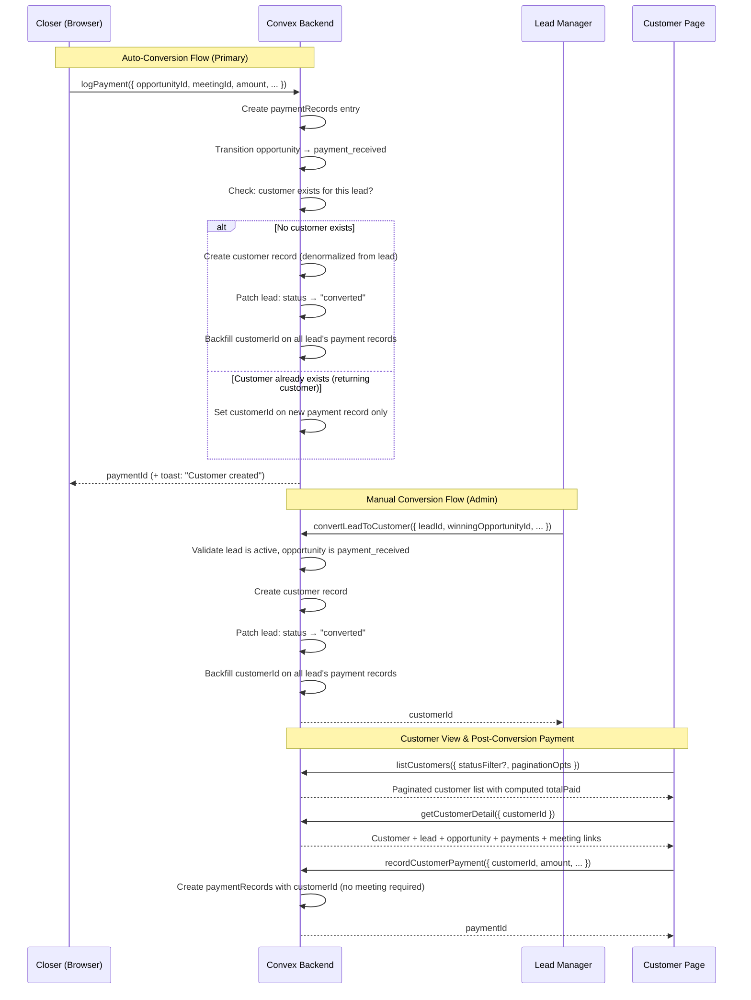
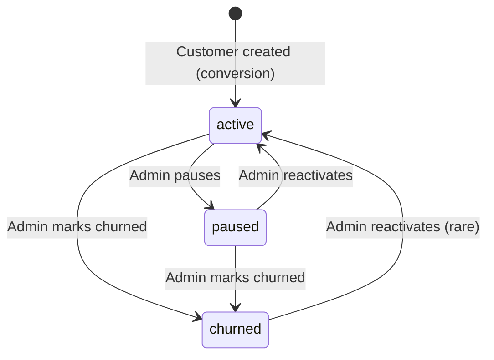
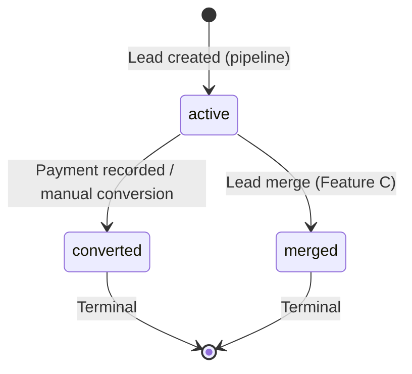

# Lead-to-Customer Conversion — Design Specification

**Version:** 0.1 (MVP)
**Status:** Draft
**Scope:** When a closer records a payment (opportunity reaches `payment_received`), the lead auto-converts to a customer entity. A minimal `/workspace/customers` list + `/workspace/customers/[customerId]` detail page proves the data model. Every relationship (Customer -> Lead -> Opportunity -> Meeting -> Payment) is navigable. Manual conversion from the Lead Manager is also supported.
**Prerequisite:** Feature C (Lead Manager) complete — `leads` table with `status` field, `leadIdentifiers`, `leadMergeHistory`, full CRUD queries/mutations, Lead Manager UI at `/workspace/leads`. Feature E (Lead Identity Resolution) complete — multi-identifier model, normalization utilities, pipeline identity resolution. Existing `paymentRecords` table and `logPayment` mutation in `convex/closer/payments.ts`.

---

## Table of Contents

1. [Goals & Non-Goals](#1-goals--non-goals)
2. [Actors & Roles](#2-actors--roles)
3. [End-to-End Flow Overview](#3-end-to-end-flow-overview)
4. [Phase 1: Schema, Permissions & Lead Status Transitions](#4-phase-1-schema-permissions--lead-status-transitions)
5. [Phase 2: Backend — Conversion Logic, Queries & Mutations](#5-phase-2-backend--conversion-logic-queries--mutations)
6. [Phase 3: Frontend — Customer List, Detail Page & Manual Conversion](#6-phase-3-frontend--customer-list-detail-page--manual-conversion)
7. [Data Model](#7-data-model)
8. [Convex Function Architecture](#8-convex-function-architecture)
9. [Routing & Authorization](#9-routing--authorization)
10. [Security Considerations](#10-security-considerations)
11. [Error Handling & Edge Cases](#11-error-handling--edge-cases)
12. [Open Questions](#12-open-questions)
13. [Dependencies](#13-dependencies)
14. [Applicable Skills](#14-applicable-skills)

---

## 1. Goals & Non-Goals

### Goals

- **Auto-conversion on payment:** When a closer records a payment and the opportunity transitions to `payment_received`, a `customers` record is automatically created from the lead's data, the lead's status transitions to `converted`, and `customerId` is backfilled on all existing payment records for that lead.
- **Manual conversion from Lead Manager:** Admins can convert a lead to a customer via a confirmation dialog from the lead detail page, selecting the winning opportunity and optionally recording a payment.
- **Customer list page:** `/workspace/customers` shows all customers with name, email, converted date, computed total paid (aggregated from `paymentRecords`), program type, and status.
- **Customer detail page:** Clicking a customer navigates to `/workspace/customers/[customerId]` — a dedicated page showing customer info, linked lead (clickable), winning opportunity (clickable), payment history, and a "Record Payment" action for post-conversion payments.
- **Post-conversion payments:** Payments can be recorded directly against a customer (payment plan installments, upsells) without requiring a meeting context.
- **Navigable relationship graph:** Every entity ID is a clickable link: Customer -> Lead (Lead Manager), Customer -> Opportunity (Pipeline), Customer -> Meeting (Meeting detail). No dead ends.
- **Lead status lifecycle:** `active` -> `converted` is a one-way terminal transition triggered by customer creation. The Lead Manager shows converted leads with a distinct badge and the conversion is visible in the lead's activity tab.
- **Sidebar navigation:** "Customers" link added for all roles with appropriate permission gating.

### Non-Goals (deferred)

- Full customer management CRUD (edit customer fields beyond status) — v0.6.
- Customer segmentation, tagging, or advanced filtering — v0.6.
- Customer analytics dashboard (LTV, churn rate, cohort analysis) — v0.6.
- CSV export of customer data — v0.6 (same timeline as `lead:export`).
- Returning customer detection (same customer, new lead cycle) — v0.6.
- Undo/revert customer conversion — v0.6 (audit trail supports future implementation).
- Customer merge (multiple leads converted separately for the same person) — v0.6.
- Email/notification to the lead on conversion — out of scope.

---

## 2. Actors & Roles

| Actor                 | Identity                                  | Auth Method                          | Key Permissions                                                                                                                                                                              |
| --------------------- | ----------------------------------------- | ------------------------------------ | -------------------------------------------------------------------------------------------------------------------------------------------------------------------------------------------- |
| **Closer**            | Sales closer assigned to opportunities    | WorkOS AuthKit, member of tenant org | Can view own customers (`customer:view-own`). Cannot convert leads manually. Auto-conversion happens on their `logPayment` call. Can record post-conversion payments on their own customers. |
| **Admin**             | Tenant master or tenant admin             | WorkOS AuthKit, member of tenant org | Can view all customers (`customer:view-all`). Can manually convert leads (`lead:convert`). Can change customer status. Can record payments on any customer.                                  |
| **Pipeline (system)** | Convex mutation triggered by `logPayment` | Internal (no external auth)          | Executes auto-conversion logic after payment recording.                                                                                                                                      |

### CRM Role <-> Permission Mapping

| Permission                  | `tenant_master` | `tenant_admin` | `closer` |
| --------------------------- | :-------------: | :------------: | :------: |
| `customer:view-all`         |       Yes       |      Yes       |    No    |
| `customer:view-own`         |       Yes       |      Yes       |   Yes    |
| `customer:edit`             |       Yes       |      Yes       |    No    |
| `lead:convert` (existing)   |       Yes       |      Yes       |    No    |
| `payment:record` (existing) |       No        |       No       |   Yes    |

> **Design decision:** Closers get `customer:view-own` so they can see the customers they converted (their pipeline wins). Admins get `customer:view-all` for the full customer list. `customer:edit` is admin-only and limited to status changes in v0.5 — full edit is deferred.

---

## 3. End-to-End Flow Overview



---

## 4. Phase 1: Schema, Permissions & Lead Status Transitions

### 4.1 New `customers` Table

The customer entity is the outcome of a successful sales cycle. It denormalizes key fields from the lead for display efficiency and stores the conversion context (who converted, which opportunity won, when).

```typescript
// Path: convex/schema.ts
// === Feature D: Lead-to-Customer Conversion ===
customers: defineTable({
  tenantId: v.id("tenants"),
  leadId: v.id("leads"),                      // The lead that converted
  fullName: v.string(),                        // Denormalized from lead
  email: v.string(),                           // Primary email from lead
  phone: v.optional(v.string()),               // From lead
  socialHandles: v.optional(                   // Denormalized from lead
    v.array(
      v.object({
        type: v.string(),
        handle: v.string(),
      }),
    ),
  ),
  convertedAt: v.number(),                     // Unix ms — when conversion happened
  convertedByUserId: v.id("users"),            // Which closer/admin triggered it
  winningOpportunityId: v.id("opportunities"), // The opportunity that closed
  winningMeetingId: v.optional(v.id("meetings")), // The meeting where the deal closed
  programType: v.optional(v.string()),         // From event type config name
  notes: v.optional(v.string()),               // Admin notes
  status: v.union(
    v.literal("active"),
    v.literal("churned"),
    v.literal("paused"),
  ),
  createdAt: v.number(),                       // Unix ms
})
  .index("by_tenantId", ["tenantId"])
  .index("by_tenantId_and_leadId", ["tenantId", "leadId"])
  .index("by_tenantId_and_status", ["tenantId", "status"])
  .index("by_tenantId_and_convertedAt", ["tenantId", "convertedAt"]),
// === End Feature D ===
```

> **No `totalPaid` field.** Total paid is computed on-demand by summing `paymentRecords` linked to this customer. Storing a running total is an antipattern — it drifts from the source of truth and becomes a maintenance burden. The query aggregates from actual records every time.

> **Why denormalize `fullName`, `email`, `phone`, `socialHandles` from the lead?** The customer list page needs to display this data without joining to the `leads` table on every row. Denormalization is acceptable here because: (1) leads rarely change after conversion, (2) the customer record is created once and the fields are not updated independently, (3) the lead record remains the source of truth and is linked via `leadId`.

### 4.2 Modified `paymentRecords` Table

Currently, every payment record requires an `opportunityId` and `meetingId`. Post-conversion payments (payment plan installments, upsells) don't have a meeting context. We add `customerId` and make `opportunityId`/`meetingId` optional.

```typescript
// Path: convex/schema.ts
// Modified: paymentRecords
paymentRecords: defineTable({
  tenantId: v.id("tenants"),
  opportunityId: v.optional(v.id("opportunities")),  // CHANGED: was required, now optional for post-conversion payments
  meetingId: v.optional(v.id("meetings")),            // CHANGED: was required, now optional for post-conversion payments
  closerId: v.id("users"),
  amount: v.number(),
  currency: v.string(),
  provider: v.string(),
  referenceCode: v.optional(v.string()),
  proofFileId: v.optional(v.id("_storage")),
  status: v.union(
    v.literal("recorded"),
    v.literal("verified"),
    v.literal("disputed"),
  ),
  recordedAt: v.number(),

  // === Feature D: Customer Linkage ===
  customerId: v.optional(v.id("customers")),  // NEW: Set on conversion (backfilled) or for post-conversion payments
  // === End Feature D ===
})
  .index("by_opportunityId", ["opportunityId"])
  .index("by_tenantId", ["tenantId"])
  .index("by_tenantId_and_closerId", ["tenantId", "closerId"])
  .index("by_customerId", ["customerId"]),  // NEW: For querying all payments belonging to a customer
```

> **Schema migration note:** Making `opportunityId` and `meetingId` optional is a **widen** operation — all existing documents already have these fields set, and new documents can choose to omit them. No data migration needed. The new `customerId` field is additive (optional). The `by_customerId` index is new and will backfill automatically. Use the `convex-migration-helper` skill if deployment validation fails.

### 4.3 Permissions

Three new permissions for customer access control:

```typescript
// Path: convex/lib/permissions.ts
// Additions to the PERMISSIONS object:

// === Feature D: Customer Permissions ===
"customer:view-all": ["tenant_master", "tenant_admin"],
"customer:view-own": ["tenant_master", "tenant_admin", "closer"],
"customer:edit": ["tenant_master", "tenant_admin"],
// === End Feature D ===
```

The `lead:convert` permission already exists in the permissions table and is correctly scoped to `tenant_master` and `tenant_admin`.

### 4.4 Lead Status Transitions

Add a `LEAD_STATUSES` array and `VALID_LEAD_TRANSITIONS` map to the status transitions module. This formalizes the lead lifecycle that Feature E introduced:

```typescript
// Path: convex/lib/statusTransitions.ts

export const LEAD_STATUSES = ["active", "converted", "merged"] as const;

export type LeadStatus = (typeof LEAD_STATUSES)[number];

export const VALID_LEAD_TRANSITIONS: Record<LeadStatus, LeadStatus[]> = {
	active: ["converted", "merged"], // Can be converted or merged
	converted: [], // Terminal — no further transitions
	merged: [], // Terminal — no further transitions
};

export function validateLeadTransition(
	from: LeadStatus,
	to: LeadStatus,
): boolean {
	const valid = VALID_LEAD_TRANSITIONS[from].includes(to);
	if (!valid) {
		console.warn("[StatusTransition] Invalid lead transition rejected", {
			from,
			to,
			allowedTargets: VALID_LEAD_TRANSITIONS[from],
		});
	} else {
		console.log("[StatusTransition] Lead transition validated", {
			from,
			to,
		});
	}
	return valid;
}
```

> **Why both `converted` and `merged` are terminal:** A converted lead represents a completed sales cycle — the customer entity now holds the active relationship. A merged lead has been absorbed into another lead. Neither should transition further. If a converted customer returns as a new lead (new email, new booking), the pipeline creates a fresh lead — the identity resolution in Feature E will flag it as a potential duplicate for human review.

---

## 5. Phase 2: Backend — Conversion Logic, Queries & Mutations

### 5.1 Core Conversion Logic

The conversion logic is shared between auto-conversion (after payment) and manual conversion (admin action). Extract it into a reusable helper:

```typescript
// Path: convex/customers/conversion.ts

import { MutationCtx } from "../_generated/server";
import { Id } from "../_generated/dataModel";
import { validateLeadTransition } from "../lib/statusTransitions";

/**
 * Core conversion logic — creates a customer record from a lead.
 *
 * Called by:
 * 1. Auto-conversion in logPayment (after opportunity → payment_received)
 * 2. Manual conversion from Lead Manager (admin action)
 *
 * Returns the new customer ID, or null if a customer already exists for this lead.
 */
export async function executeConversion(
	ctx: MutationCtx,
	args: {
		tenantId: Id<"tenants">;
		leadId: Id<"leads">;
		convertedByUserId: Id<"users">;
		winningOpportunityId: Id<"opportunities">;
		winningMeetingId?: Id<"meetings">;
		programType?: string;
		notes?: string;
	},
): Promise<Id<"customers"> | null> {
	const {
		tenantId,
		leadId,
		convertedByUserId,
		winningOpportunityId,
		winningMeetingId,
		programType,
		notes,
	} = args;

	// 1. Load and validate the lead
	const lead = await ctx.db.get(leadId);
	if (!lead || lead.tenantId !== tenantId) {
		throw new Error("Lead not found");
	}

	// 2. Check if customer already exists for this lead
	const existingCustomer = await ctx.db
		.query("customers")
		.withIndex("by_tenantId_and_leadId", (q) =>
			q.eq("tenantId", tenantId).eq("leadId", leadId),
		)
		.first();

	if (existingCustomer) {
		console.log("[Customer] Customer already exists for lead", {
			leadId,
			customerId: existingCustomer._id,
		});
		return null; // Caller handles returning-customer case
	}

	// 3. Validate lead status transition
	const currentStatus = lead.status ?? "active";
	if (!validateLeadTransition(currentStatus, "converted")) {
		throw new Error(
			`Cannot convert lead with status "${currentStatus}". Only active leads can be converted.`,
		);
	}

	// 4. Validate the winning opportunity
	const opportunity = await ctx.db.get(winningOpportunityId);
	if (!opportunity || opportunity.tenantId !== tenantId) {
		throw new Error("Winning opportunity not found");
	}
	if (opportunity.leadId !== leadId) {
		throw new Error("Winning opportunity does not belong to this lead");
	}

	// 5. Resolve program type from event type config if not provided
	let resolvedProgramType = programType;
	if (!resolvedProgramType && opportunity.eventTypeConfigId) {
		const config = await ctx.db.get(opportunity.eventTypeConfigId);
		if (config) {
			resolvedProgramType = config.eventTypeName ?? undefined;
		}
	}

	const now = Date.now();

	// 6. Create customer record with denormalized lead data
	const customerId = await ctx.db.insert("customers", {
		tenantId,
		leadId,
		fullName: lead.fullName ?? lead.email, // Fallback to email if no name
		email: lead.email,
		phone: lead.phone,
		socialHandles: lead.socialHandles,
		convertedAt: now,
		convertedByUserId,
		winningOpportunityId,
		winningMeetingId,
		programType: resolvedProgramType,
		notes,
		status: "active",
		createdAt: now,
	});

	console.log("[Customer] Customer created", {
		customerId,
		leadId,
		winningOpportunityId,
	});

	// 7. Transition lead to "converted"
	await ctx.db.patch(leadId, {
		status: "converted",
		updatedAt: now,
	});

	console.log("[Customer] Lead status → converted", { leadId });

	// 8. Backfill customerId on all existing payment records for this lead's opportunities
	const leadOpportunities = await ctx.db
		.query("opportunities")
		.withIndex("by_tenantId_and_leadId", (q) =>
			q.eq("tenantId", tenantId).eq("leadId", leadId),
		)
		.take(100);

	let backfilledCount = 0;
	for (const opp of leadOpportunities) {
		const payments = await ctx.db
			.query("paymentRecords")
			.withIndex("by_opportunityId", (q) =>
				q.eq("opportunityId", opp._id),
			)
			.take(50);

		for (const payment of payments) {
			if (!payment.customerId) {
				await ctx.db.patch(payment._id, { customerId });
				backfilledCount++;
			}
		}
	}

	console.log("[Customer] Backfilled customerId on payment records", {
		customerId,
		backfilledCount,
	});

	return customerId;
}
```

> **Transaction size:** The backfill loop iterates over all opportunities for a lead (bounded at 100) and their payment records (bounded at 50 per opp). In practice, a lead rarely has more than 3-5 opportunities, each with 1-2 payments. Total writes: 1 (customer) + 1 (lead patch) + N (payment backfills, typically 1-3). Well within Convex's transaction limits.

### 5.2 Auto-Conversion Hook in `logPayment`

Extend the existing `logPayment` mutation to trigger auto-conversion after creating the payment record and transitioning the opportunity:

```typescript
// Path: convex/closer/payments.ts
// MODIFIED: Add auto-conversion after opportunity transition

import { executeConversion } from "../customers/conversion";

export const logPayment = mutation({
	args: {
		opportunityId: v.id("opportunities"),
		meetingId: v.id("meetings"),
		amount: v.number(),
		currency: v.string(),
		provider: v.string(),
		referenceCode: v.optional(v.string()),
		proofFileId: v.optional(v.id("_storage")),
	},
	handler: async (ctx, args) => {
		// ... existing validation and payment record creation (unchanged) ...

		// Create payment record
		const paymentId = await ctx.db.insert("paymentRecords", {
			tenantId,
			opportunityId: args.opportunityId,
			meetingId: args.meetingId,
			closerId: userId,
			amount: args.amount,
			currency,
			provider,
			referenceCode: referenceCode || undefined,
			proofFileId: args.proofFileId ?? undefined,
			status: "recorded",
			recordedAt: Date.now(),
		});

		// Transition opportunity to payment_received (terminal state)
		await ctx.db.patch(args.opportunityId, {
			status: "payment_received",
			updatedAt: Date.now(),
		});

		// === Feature D: Auto-conversion ===
		// After payment_received, auto-convert the lead to a customer.
		const customerId = await executeConversion(ctx, {
			tenantId,
			leadId: opportunity.leadId,
			convertedByUserId: userId,
			winningOpportunityId: args.opportunityId,
			winningMeetingId: args.meetingId,
		});

		if (customerId) {
			// Set customerId on the payment record we just created
			await ctx.db.patch(paymentId, { customerId });
			console.log("[Closer:Payment] Auto-conversion complete", {
				paymentId,
				customerId,
			});
		} else {
			// Customer already exists — this is a returning customer / additional sale
			// Find the existing customer and link this payment
			const existingCustomer = await ctx.db
				.query("customers")
				.withIndex("by_tenantId_and_leadId", (q) =>
					q.eq("tenantId", tenantId).eq("leadId", opportunity.leadId),
				)
				.first();
			if (existingCustomer) {
				await ctx.db.patch(paymentId, {
					customerId: existingCustomer._id,
				});
				console.log(
					"[Closer:Payment] Payment linked to existing customer",
					{
						paymentId,
						customerId: existingCustomer._id,
					},
				);
			}
		}
		// === End Feature D ===

		return paymentId;
	},
});
```

> **Why inline in the mutation instead of a scheduled action?** Auto-conversion must be atomic with the payment recording. If we schedule it, there's a window where the payment exists but the customer doesn't — and a concurrent query might show the wrong state. Convex mutations are transactions, so the entire operation (payment + opportunity transition + customer creation + lead status update + backfill) either completes or rolls back together.

### 5.3 Manual Conversion Mutation

Admins can convert a lead from the Lead Manager without a payment trigger:

```typescript
// Path: convex/customers/mutations.ts

import { v } from "convex/values";
import { mutation } from "../_generated/server";
import { requireTenantUser } from "../requireTenantUser";
import { executeConversion } from "./conversion";

/**
 * Manually convert a lead to a customer.
 *
 * Admin-only action from the Lead Manager detail page.
 * Requires selecting a winning opportunity (must be payment_received).
 */
export const convertLeadToCustomer = mutation({
	args: {
		leadId: v.id("leads"),
		winningOpportunityId: v.id("opportunities"),
		winningMeetingId: v.optional(v.id("meetings")),
		programType: v.optional(v.string()),
		notes: v.optional(v.string()),
	},
	handler: async (ctx, args) => {
		console.log("[Customer] convertLeadToCustomer called", {
			leadId: args.leadId,
			winningOpportunityId: args.winningOpportunityId,
		});
		const { userId, tenantId } = await requireTenantUser(ctx, [
			"tenant_master",
			"tenant_admin",
		]);

		// Validate winning opportunity has payment_received status
		const opportunity = await ctx.db.get(args.winningOpportunityId);
		if (!opportunity || opportunity.tenantId !== tenantId) {
			throw new Error("Opportunity not found");
		}
		if (opportunity.status !== "payment_received") {
			throw new Error(
				`Cannot convert: winning opportunity must have status "payment_received", ` +
					`but has "${opportunity.status}". Record a payment first.`,
			);
		}

		const customerId = await executeConversion(ctx, {
			tenantId,
			leadId: args.leadId,
			convertedByUserId: userId,
			winningOpportunityId: args.winningOpportunityId,
			winningMeetingId: args.winningMeetingId,
			programType: args.programType,
			notes: args.notes,
		});

		if (!customerId) {
			throw new Error(
				"A customer record already exists for this lead. Check the Customers page.",
			);
		}

		return customerId;
	},
});

/**
 * Update a customer's status (active, paused, churned).
 *
 * Admin-only. Status changes are the only edit allowed in v0.5.
 */
export const updateCustomerStatus = mutation({
	args: {
		customerId: v.id("customers"),
		status: v.union(
			v.literal("active"),
			v.literal("churned"),
			v.literal("paused"),
		),
	},
	handler: async (ctx, args) => {
		console.log("[Customer] updateCustomerStatus called", {
			customerId: args.customerId,
			newStatus: args.status,
		});
		const { tenantId } = await requireTenantUser(ctx, [
			"tenant_master",
			"tenant_admin",
		]);

		const customer = await ctx.db.get(args.customerId);
		if (!customer || customer.tenantId !== tenantId) {
			throw new Error("Customer not found");
		}

		await ctx.db.patch(args.customerId, { status: args.status });
		console.log("[Customer] Status updated", {
			customerId: args.customerId,
			from: customer.status,
			to: args.status,
		});
	},
});

/**
 * Record a payment directly against a customer (post-conversion).
 *
 * Use case: payment plan installments, upsells, renewals.
 * No meeting or opportunity context required.
 */
export const recordCustomerPayment = mutation({
	args: {
		customerId: v.id("customers"),
		amount: v.number(),
		currency: v.string(),
		provider: v.string(),
		referenceCode: v.optional(v.string()),
		proofFileId: v.optional(v.id("_storage")),
	},
	handler: async (ctx, args) => {
		console.log("[Customer] recordCustomerPayment called", {
			customerId: args.customerId,
			amount: args.amount,
		});
		const { userId, tenantId, role } = await requireTenantUser(ctx, [
			"closer",
			"tenant_master",
			"tenant_admin",
		]);

		const customer = await ctx.db.get(args.customerId);
		if (!customer || customer.tenantId !== tenantId) {
			throw new Error("Customer not found");
		}

		// Closer authorization: can only record payments on their own customers
		// "Own" = the closer is the convertedByUserId (they closed the deal)
		if (role === "closer" && customer.convertedByUserId !== userId) {
			throw new Error("Not your customer");
		}

		// Validate amount
		if (args.amount <= 0) {
			throw new Error("Payment amount must be positive");
		}

		const currency = args.currency.trim().toUpperCase();
		if (!currency) {
			throw new Error("Currency is required");
		}

		const provider = args.provider.trim();
		if (!provider) {
			throw new Error("Provider is required");
		}

		const paymentId = await ctx.db.insert("paymentRecords", {
			tenantId,
			closerId: userId,
			customerId: args.customerId,
			amount: args.amount,
			currency,
			provider,
			referenceCode: args.referenceCode?.trim() || undefined,
			proofFileId: args.proofFileId ?? undefined,
			status: "recorded",
			recordedAt: Date.now(),
		});

		console.log("[Customer] Post-conversion payment recorded", {
			paymentId,
			customerId: args.customerId,
		});

		return paymentId;
	},
});
```

### 5.4 Customer Queries

```typescript
// Path: convex/customers/queries.ts

import { v } from "convex/values";
import { query } from "../_generated/server";
import { requireTenantUser } from "../requireTenantUser";
import { paginationOptsValidator } from "convex/server";

/**
 * List customers with pagination and optional status filter.
 *
 * Admins see all customers. Closers see only their own (convertedByUserId).
 * Enriches each customer with computed totalPaid from payment records.
 */
export const listCustomers = query({
	args: {
		paginationOpts: paginationOptsValidator,
		statusFilter: v.optional(
			v.union(
				v.literal("active"),
				v.literal("churned"),
				v.literal("paused"),
			),
		),
	},
	handler: async (ctx, args) => {
		const { tenantId, userId, role } = await requireTenantUser(ctx, [
			"tenant_master",
			"tenant_admin",
			"closer",
		]);

		// Build base query
		let customersQuery;
		if (args.statusFilter) {
			customersQuery = ctx.db
				.query("customers")
				.withIndex("by_tenantId_and_status", (q) =>
					q.eq("tenantId", tenantId).eq("status", args.statusFilter!),
				);
		} else {
			customersQuery = ctx.db
				.query("customers")
				.withIndex("by_tenantId", (q) => q.eq("tenantId", tenantId));
		}

		const paginatedResult = await customersQuery
			.order("desc")
			.paginate(args.paginationOpts);

		// Enrich with computed totalPaid and closer name
		const enrichedPage = await Promise.all(
			paginatedResult.page.map(async (customer) => {
				// Closer filter: only show own customers
				if (
					role === "closer" &&
					customer.convertedByUserId !== userId
				) {
					return null; // Filtered out client-side; paginate doesn't support compound conditions
				}

				// Compute total paid from payment records
				const payments = await ctx.db
					.query("paymentRecords")
					.withIndex("by_customerId", (q) =>
						q.eq("customerId", customer._id),
					)
					.collect();
				const totalPaid = payments.reduce(
					(sum, p) => sum + p.amount,
					0,
				);
				const currency = payments[0]?.currency ?? "USD"; // Use first payment's currency

				// Get converter's name
				const converter = await ctx.db.get(customer.convertedByUserId);

				return {
					...customer,
					totalPaid,
					currency,
					paymentCount: payments.length,
					convertedByName:
						converter?.fullName ?? converter?.email ?? "Unknown",
				};
			}),
		);

		return {
			...paginatedResult,
			page: enrichedPage.filter(Boolean),
		};
	},
});

/**
 * Get full customer detail with linked entities.
 *
 * Returns the customer, linked lead, winning opportunity, all meetings
 * across the lead's opportunities, and complete payment history.
 */
export const getCustomerDetail = query({
	args: { customerId: v.id("customers") },
	handler: async (ctx, args) => {
		const { tenantId, userId, role } = await requireTenantUser(ctx, [
			"tenant_master",
			"tenant_admin",
			"closer",
		]);

		const customer = await ctx.db.get(args.customerId);
		if (!customer || customer.tenantId !== tenantId) {
			return null;
		}

		// Closer authorization: own customers only
		if (role === "closer" && customer.convertedByUserId !== userId) {
			return null;
		}

		// Load linked lead
		const lead = await ctx.db.get(customer.leadId);

		// Load winning opportunity
		const winningOpportunity = await ctx.db.get(
			customer.winningOpportunityId,
		);

		// Load winning meeting (if set)
		const winningMeeting = customer.winningMeetingId
			? await ctx.db.get(customer.winningMeetingId)
			: null;

		// Load all opportunities for this lead (for relationship graph)
		const opportunities = await ctx.db
			.query("opportunities")
			.withIndex("by_tenantId_and_leadId", (q) =>
				q.eq("tenantId", tenantId).eq("leadId", customer.leadId),
			)
			.take(50);

		// Load all meetings across all opportunities
		const meetings = [];
		for (const opp of opportunities) {
			const oppMeetings = await ctx.db
				.query("meetings")
				.withIndex("by_opportunityId", (q) =>
					q.eq("opportunityId", opp._id),
				)
				.take(20);
			meetings.push(
				...oppMeetings.map((m) => ({
					...m,
					opportunityStatus: opp.status,
				})),
			);
		}
		meetings.sort((a, b) => b.scheduledAt - a.scheduledAt);

		// Load all payment records for this customer
		const payments = await ctx.db
			.query("paymentRecords")
			.withIndex("by_customerId", (q) => q.eq("customerId", customer._id))
			.collect();
		payments.sort((a, b) => b.recordedAt - a.recordedAt);

		const totalPaid = payments.reduce((sum, p) => sum + p.amount, 0);
		const currency = payments[0]?.currency ?? "USD";

		// Get converter name
		const converter = await ctx.db.get(customer.convertedByUserId);

		// Get closer name (from winning opportunity)
		let closerName: string | undefined;
		if (winningOpportunity?.assignedCloserId) {
			const closer = await ctx.db.get(
				winningOpportunity.assignedCloserId,
			);
			closerName = closer?.fullName ?? closer?.email;
		}

		return {
			customer,
			lead,
			winningOpportunity,
			winningMeeting,
			closerName,
			convertedByName:
				converter?.fullName ?? converter?.email ?? "Unknown",
			opportunities: opportunities.map((o) => ({
				_id: o._id,
				status: o.status,
				createdAt: o.createdAt,
				latestMeetingAt: o.latestMeetingAt,
			})),
			meetings: meetings.slice(0, 20), // Cap at 20 most recent
			payments,
			totalPaid,
			currency,
		};
	},
});

/**
 * Get computed total paid for a customer.
 *
 * Lightweight query for when only the total is needed (e.g., list enrichment).
 */
export const getCustomerTotalPaid = query({
	args: { customerId: v.id("customers") },
	handler: async (ctx, { customerId }) => {
		const { tenantId } = await requireTenantUser(ctx, [
			"tenant_master",
			"tenant_admin",
			"closer",
		]);

		const customer = await ctx.db.get(customerId);
		if (!customer || customer.tenantId !== tenantId) {
			return null;
		}

		const payments = await ctx.db
			.query("paymentRecords")
			.withIndex("by_customerId", (q) => q.eq("customerId", customerId))
			.collect();

		return {
			totalPaid: payments.reduce((sum, p) => sum + p.amount, 0),
			currency: payments[0]?.currency ?? "USD",
			paymentCount: payments.length,
		};
	},
});
```

> **Closer filtering approach:** The `listCustomers` query filters closers' results in the map step rather than using a separate index. This is because Convex pagination doesn't support compound filter conditions (tenantId + closerId), and adding a `by_tenantId_and_convertedByUserId` index would only serve closers. At v0.5 scale (< 100 customers per tenant), the post-filter approach is acceptable. If this becomes a performance bottleneck, add the index in v0.6.

### 5.5 Upload URL for Post-Conversion Payment Proofs

The existing `generateUploadUrl` in `convex/closer/payments.ts` already works for proof file uploads. No new upload URL generator is needed — the customer payment form will reuse it.

---

## 6. Phase 3: Frontend — Customer List, Detail Page & Manual Conversion

### 6.1 Customer List Page

**Route:** `/workspace/customers`

A minimal paginated list showing all customers for the tenant. Follows the same page architecture as the Lead Manager.

```typescript
// Path: app/workspace/customers/page.tsx
export const unstable_instant = false;

export default function CustomersPage() {
  return <CustomersPageClient />;
}
```

```typescript
// Path: app/workspace/customers/_components/customers-page-client.tsx
"use client";

import { usePaginatedQuery } from "convex/react";
import { api } from "@/convex/_generated/api";
import { useRole } from "@/components/auth/role-context";
import { usePageTitle } from "@/hooks/use-page-title";

export function CustomersPageClient() {
  usePageTitle("Customers");
  const { hasPermission } = useRole();

  const [statusFilter, setStatusFilter] = useState<
    "active" | "churned" | "paused" | undefined
  >(undefined);

  const { results, loadMore, status } = usePaginatedQuery(
    api.customers.queries.listCustomers,
    { statusFilter },
    { initialNumItems: 25 },
  );

  return (
    <div className="space-y-6">
      <div className="flex items-center justify-between">
        <h1 className="text-2xl font-semibold tracking-tight">Customers</h1>
      </div>

      {/* Status filter tabs */}
      <StatusFilterTabs value={statusFilter} onChange={setStatusFilter} />

      {/* Customer table */}
      <CustomersTable customers={results} />

      {/* Load more */}
      {status === "CanLoadMore" && (
        <Button variant="outline" onClick={() => loadMore(25)}>
          Load more
        </Button>
      )}
    </div>
  );
}
```

**Table columns:**

| Column        | Source                         | Sortable | Notes                                                 |
| ------------- | ------------------------------ | -------- | ----------------------------------------------------- |
| Customer Name | `customer.fullName`            | Yes      | Clickable link to detail page                         |
| Email         | `customer.email`               | No       | Also clickable link to detail page                    |
| Converted     | `customer.convertedAt`         | Yes      | Relative date (e.g., "3 days ago")                    |
| Total Paid    | Computed from `paymentRecords` | Yes      | Formatted as currency                                 |
| Program       | `customer.programType`         | No       | From event type config                                |
| Status        | `customer.status`              | No       | Badge: active (green), paused (yellow), churned (red) |
| Converted By  | `customer.convertedByName`     | No       | Closer/admin who triggered conversion                 |

### 6.2 Customer Detail Page

Clicking a customer row navigates to a dedicated customer detail page (`/workspace/customers/[customerId]`) with full customer info and relationship navigation.

**Route structure:**

```
app/workspace/customers/
├── page.tsx                      # Customer list page
├── [customerId]/
│   ├── page.tsx                  # Server component (thin RSC wrapper)
│   └── _components/
│       └── customer-detail-page-client.tsx  # Client component with all interactive content
```

**Server component** (`[customerId]/page.tsx`):

```typescript
// Path: app/workspace/customers/[customerId]/page.tsx
import { fetchQuery } from "convex/nextjs";
import { api } from "@/convex/_generated/api";
import { requireWorkspaceUser } from "@/lib/auth";
import { Id } from "@/convex/_generated/dataModel";
import { CustomerDetailPageClient } from "./_components/customer-detail-page-client";
import { notFound } from "next/navigation";

interface CustomerDetailPageProps {
  params: { customerId: string };
}

export const unstable_instant = false;

export default async function CustomerDetailPage({
  params,
}: CustomerDetailPageProps) {
  const { token, tenantId } = await requireWorkspaceUser();

  try {
    const detail = await fetchQuery(
      api.customers.queries.getCustomerDetail,
      { customerId: params.customerId as Id<"customers"> },
      { token },
    );

    if (!detail) {
      return notFound();
    }

    return <CustomerDetailPageClient initialDetail={detail} />;
  } catch (error) {
    console.error("[Customer] Failed to load detail:", error);
    return notFound();
  }
}
```

**Client component** (`_components/customer-detail-page-client.tsx`):

```typescript
// Path: app/workspace/customers/[customerId]/_components/customer-detail-page-client.tsx
"use client";

import { useQuery } from "convex/react";
import { api } from "@/convex/_generated/api";
import { useParams, useRouter } from "next/navigation";
import Link from "next/link";
import { Button } from "@/components/ui/button";
import { ArrowLeftIcon } from "lucide-react";
import { Id } from "@/convex/_generated/dataModel";

export function CustomerDetailPageClient({ initialDetail }: { initialDetail: any }) {
  const params = useParams();
  const router = useRouter();
  const customerId = params.customerId as Id<"customers">;

  // Re-fetch with real-time updates
  const detail = useQuery(
    api.customers.queries.getCustomerDetail,
    customerId ? { customerId } : "skip",
  ) ?? initialDetail;

  if (!detail) return null;

  return (
    <div className="flex-1 overflow-y-auto">
      {/* Header with back button */}
      <div className="sticky top-0 bg-background/95 border-b p-4">
        <div className="flex items-center gap-4">
          <Button
            variant="ghost"
            size="sm"
            onClick={() => router.back()}
          >
            <ArrowLeftIcon className="h-4 w-4" />
          </Button>
          <div>
            <h1 className="text-2xl font-bold">{detail.customer.fullName}</h1>
            <CustomerStatusBadge status={detail.customer.status} />
          </div>
        </div>
      </div>

      <div className="max-w-3xl mx-auto space-y-8 p-6">
        {/* Customer Info */}
        <section>
          <h2 className="text-lg font-semibold mb-4">Contact</h2>
          <div className="space-y-2">
            <p className="text-sm text-muted-foreground">Email</p>
            <p>{detail.customer.email}</p>
            {detail.customer.phone && (
              <>
                <p className="text-sm text-muted-foreground">Phone</p>
                <p>{detail.customer.phone}</p>
              </>
            )}
            {detail.customer.socialHandles?.map((sh) => (
              <div key={sh.type}>
                <p className="text-sm text-muted-foreground">{sh.type}</p>
                <p>@{sh.handle}</p>
              </div>
            ))}
          </div>
        </section>

        {/* Relationship Links */}
        <section>
          <h2 className="text-lg font-semibold mb-4">Relationships</h2>
          <div className="space-y-3">
            {/* Linked Lead → navigates to Lead Manager */}
            <Link
              href={`/workspace/leads/${detail.customer.leadId}`}
              className="block p-3 border rounded hover:bg-accent transition-colors"
            >
              <p className="text-sm text-muted-foreground">Converted Lead</p>
              <p className="font-medium">{detail.lead?.fullName ?? detail.lead?.email}</p>
            </Link>

            {/* Winning Opportunity → navigates to Pipeline */}
            <Link
              href={`/workspace/pipeline?opp=${detail.customer.winningOpportunityId}`}
              className="block p-3 border rounded hover:bg-accent transition-colors"
            >
              <p className="text-sm text-muted-foreground">Winning Opportunity</p>
              <p className="font-medium">{detail.winningOpportunity?.status}</p>
            </Link>

            {/* Winning Meeting → navigates to Meeting Detail */}
            {detail.winningMeeting && (
              <Link
                href={`/workspace/closer/meetings/${detail.winningMeeting._id}`}
                className="block p-3 border rounded hover:bg-accent transition-colors"
              >
                <p className="text-sm text-muted-foreground">Winning Meeting</p>
                <p className="font-medium">{formatDate(detail.winningMeeting.scheduledAt)}</p>
              </Link>
            )}
          </div>
        </section>

        {/* Conversion Details */}
        <section>
          <h2 className="text-lg font-semibold mb-4">Conversion</h2>
          <div className="grid grid-cols-2 gap-4">
            <div>
              <p className="text-sm text-muted-foreground">Converted At</p>
              <p className="font-medium">{formatDate(detail.customer.convertedAt)}</p>
            </div>
            <div>
              <p className="text-sm text-muted-foreground">Converted By</p>
              <p className="font-medium">{detail.convertedByName}</p>
            </div>
            <div>
              <p className="text-sm text-muted-foreground">Assigned Closer</p>
              <p className="font-medium">{detail.closerName}</p>
            </div>
            {detail.customer.programType && (
              <div>
                <p className="text-sm text-muted-foreground">Program</p>
                <p className="font-medium">{detail.customer.programType}</p>
              </div>
            )}
          </div>
        </section>

        {/* Payment History */}
        <section>
          <h2 className="text-lg font-semibold mb-4">Payment History</h2>
          <div className="mb-6">
            <p className="text-3xl font-bold">
              {formatCurrency(detail.totalPaid, detail.currency)}
            </p>
            <p className="text-sm text-muted-foreground">
              {detail.payments.length} payment(s)
            </p>
          </div>
          <PaymentHistoryTable payments={detail.payments} />

          {/* Record Payment button */}
          <div className="mt-4">
            <RecordCustomerPaymentButton customerId={detail.customer._id} />
          </div>
        </section>

        {/* Status Change (admin only) */}
        <section>
          <CustomerStatusControl
            customerId={detail.customer._id}
            currentStatus={detail.customer.status}
          />
        </section>
      </div>
    </div>
  );
}
```

### 6.3 Relationship Navigation Links

Every entity reference on the customer detail page is a clickable link:

| Link              | Target Route                              | Entity                                 |
| ----------------- | ----------------------------------------- | -------------------------------------- |
| Lead name         | `/workspace/leads/{leadId}`               | Lead Manager detail page               |
| Opportunity badge | `/workspace/pipeline?opp={opportunityId}` | Pipeline view (scrolls to opportunity) |
| Meeting date      | `/workspace/closer/meetings/{meetingId}`  | Meeting detail page                    |
| Converter name    | No link (display only)                    | —                                      |

> **Navigation strategy:** Use Next.js `<Link>` for client-side transitions. For pipeline deep-linking, append `?opp=` query param — the pipeline page can highlight the relevant opportunity (implementation of highlight is deferred, but the link is correct).

### 6.4 Manual Conversion Dialog

Activate the existing disabled "Convert to Customer" button on the lead detail page. Replace the tooltip stub with a functional dialog:

```typescript
// Path: app/workspace/leads/[leadId]/_components/convert-to-customer-dialog.tsx
"use client";

import { useForm } from "react-hook-form";
import { standardSchemaResolver } from "@hookform/resolvers/standard-schema";
import { z } from "zod";
import { useMutation } from "convex/react";
import { api } from "@/convex/_generated/api";
import {
  Dialog, DialogContent, DialogDescription, DialogFooter,
  DialogHeader, DialogTitle, DialogTrigger,
} from "@/components/ui/dialog";
import {
  Form, FormField, FormItem, FormLabel, FormControl, FormMessage,
} from "@/components/ui/form";
import {
  Select, SelectContent, SelectItem, SelectTrigger, SelectValue,
} from "@/components/ui/select";
import { Button } from "@/components/ui/button";
import { Textarea } from "@/components/ui/textarea";
import { UserCheckIcon } from "lucide-react";
import { toast } from "sonner";
import { Id } from "@/convex/_generated/dataModel";

const convertSchema = z.object({
  winningOpportunityId: z.string().min(1, "Select a winning opportunity"),
  notes: z.string().optional(),
});

interface ConvertToCustomerDialogProps {
  leadId: Id<"leads">;
  leadName: string;
  opportunities: Array<{
    _id: Id<"opportunities">;
    status: string;
    latestMeetingAt?: number;
    latestMeetingId?: Id<"meetings">;
  }>;
}

export function ConvertToCustomerDialog({
  leadId,
  leadName,
  opportunities,
}: ConvertToCustomerDialogProps) {
  const [open, setOpen] = useState(false);
  const [isSubmitting, setIsSubmitting] = useState(false);
  const convertMutation = useMutation(api.customers.mutations.convertLeadToCustomer);

  // Only show opportunities with payment_received status
  const eligibleOpportunities = opportunities.filter(
    (o) => o.status === "payment_received",
  );

  const form = useForm({
    resolver: standardSchemaResolver(convertSchema),
    defaultValues: {
      winningOpportunityId: eligibleOpportunities[0]?._id ?? "",
      notes: "",
    },
  });

  async function onSubmit(values: z.infer<typeof convertSchema>) {
    setIsSubmitting(true);
    try {
      const opp = eligibleOpportunities.find(
        (o) => o._id === values.winningOpportunityId,
      );
      await convertMutation({
        leadId,
        winningOpportunityId: values.winningOpportunityId as Id<"opportunities">,
        winningMeetingId: opp?.latestMeetingId,
        notes: values.notes || undefined,
      });
      toast.success(`${leadName} converted to customer`);
      setOpen(false);
    } catch (error) {
      toast.error(
        error instanceof Error ? error.message : "Conversion failed",
      );
    } finally {
      setIsSubmitting(false);
    }
  }

  return (
    <Dialog open={open} onOpenChange={setOpen}>
      <DialogTrigger asChild>
        <Button
          variant="outline"
          size="sm"
          disabled={eligibleOpportunities.length === 0}
        >
          <UserCheckIcon className="mr-1.5 h-3.5 w-3.5" />
          Convert to Customer
        </Button>
      </DialogTrigger>
      <DialogContent>
        <DialogHeader>
          <DialogTitle>Convert {leadName} to Customer</DialogTitle>
          <DialogDescription>
            This will create a customer record and mark the lead as converted.
            Select the winning opportunity (must have a recorded payment).
          </DialogDescription>
        </DialogHeader>
        <Form {...form}>
          <form onSubmit={form.handleSubmit(onSubmit)} className="space-y-4">
            <FormField
              control={form.control}
              name="winningOpportunityId"
              render={({ field }) => (
                <FormItem>
                  <FormLabel>
                    Winning Opportunity <span className="text-destructive">*</span>
                  </FormLabel>
                  <Select
                    onValueChange={field.onChange}
                    defaultValue={field.value}
                    disabled={isSubmitting}
                  >
                    <FormControl>
                      <SelectTrigger>
                        <SelectValue placeholder="Select opportunity" />
                      </SelectTrigger>
                    </FormControl>
                    <SelectContent>
                      {eligibleOpportunities.map((opp) => (
                        <SelectItem key={opp._id} value={opp._id}>
                          Opportunity — {opp.latestMeetingAt
                            ? formatDate(opp.latestMeetingAt)
                            : "No meeting date"}
                        </SelectItem>
                      ))}
                    </SelectContent>
                  </Select>
                  <FormMessage />
                </FormItem>
              )}
            />
            <FormField
              control={form.control}
              name="notes"
              render={({ field }) => (
                <FormItem>
                  <FormLabel>Notes (optional)</FormLabel>
                  <FormControl>
                    <Textarea
                      {...field}
                      placeholder="Conversion notes..."
                      disabled={isSubmitting}
                    />
                  </FormControl>
                </FormItem>
              )}
            />
            <DialogFooter>
              <Button
                type="button"
                variant="outline"
                onClick={() => setOpen(false)}
                disabled={isSubmitting}
              >
                Cancel
              </Button>
              <Button type="submit" disabled={isSubmitting}>
                {isSubmitting ? "Converting..." : "Convert to Customer"}
              </Button>
            </DialogFooter>
          </form>
        </Form>
      </DialogContent>
    </Dialog>
  );
}
```

### 6.5 Sidebar Navigation Update

Add "Customers" to both admin and closer navigation items in the workspace shell:

```typescript
// Path: app/workspace/_components/workspace-shell-client.tsx

import { UsersRoundIcon } from "lucide-react"; // Customer icon

// Admin nav items — add after "Leads"
const adminNavItems: NavItem[] = [
	{ href: "/workspace", label: "Overview", icon: LayoutDashboardIcon },
	{ href: "/workspace/pipeline", label: "Pipeline", icon: KanbanIcon },
	{ href: "/workspace/leads", label: "Leads", icon: ContactIcon },
	{ href: "/workspace/customers", label: "Customers", icon: UsersRoundIcon }, // NEW
	{ href: "/workspace/team", label: "Team", icon: UsersIcon },
	{ href: "/workspace/settings", label: "Settings", icon: SettingsIcon },
];

// Closer nav items — add after "Leads"
const closerNavItems: NavItem[] = [
	{
		href: "/workspace/closer",
		label: "Dashboard",
		icon: LayoutDashboardIcon,
	},
	{
		href: "/workspace/closer/pipeline",
		label: "My Pipeline",
		icon: KanbanIcon,
	},
	{ href: "/workspace/leads", label: "Leads", icon: ContactIcon },
	{ href: "/workspace/customers", label: "Customers", icon: UsersRoundIcon }, // NEW
];
```

> **Icon choice:** `UsersRoundIcon` from lucide-react distinguishes "Customers" (people with a relationship) from "Team" (`UsersIcon`, people in the org) and "Leads" (`ContactIcon`, contact cards). All three use distinct icons for quick visual scanning in the sidebar.

### 6.6 Customer Status Badge

Reusable badge component for customer status:

```typescript
// Path: app/workspace/customers/_components/customer-status-badge.tsx
"use client";

import { Badge } from "@/components/ui/badge";

const STATUS_CONFIG = {
  active: { label: "Active", variant: "default" as const, className: "bg-green-500/15 text-green-700 dark:text-green-400" },
  paused: { label: "Paused", variant: "secondary" as const, className: "bg-yellow-500/15 text-yellow-700 dark:text-yellow-400" },
  churned: { label: "Churned", variant: "destructive" as const, className: "bg-red-500/15 text-red-700 dark:text-red-400" },
};

export function CustomerStatusBadge({ status }: { status: "active" | "churned" | "paused" }) {
  const config = STATUS_CONFIG[status];
  return (
    <Badge variant={config.variant} className={config.className}>
      {config.label}
    </Badge>
  );
}
```

### 6.7 Post-Conversion Payment Dialog

A simplified payment form accessible from the customer detail page. Reuses the upload URL generator from `convex/closer/payments.ts`:

```typescript
// Path: app/workspace/customers/_components/record-customer-payment-dialog.tsx
"use client";

// Uses the same RHF + Zod pattern as the existing payment-form-dialog.tsx
// but calls api.customers.mutations.recordCustomerPayment instead of
// api.closer.payments.logPayment.
//
// Fields: amount, currency, provider, referenceCode, proofFile
// No meetingId or opportunityId required.
```

---

## 7. Data Model

### 7.1 `customers` Table (NEW)

```typescript
// Path: convex/schema.ts
customers: defineTable({
  tenantId: v.id("tenants"),
  leadId: v.id("leads"),                       // The lead that converted
  fullName: v.string(),                         // Denormalized from lead
  email: v.string(),                            // Primary email
  phone: v.optional(v.string()),
  socialHandles: v.optional(                    // Denormalized from lead
    v.array(
      v.object({
        type: v.string(),
        handle: v.string(),
      }),
    ),
  ),
  convertedAt: v.number(),                      // Unix ms
  convertedByUserId: v.id("users"),             // Who triggered conversion
  winningOpportunityId: v.id("opportunities"),  // The deal that closed
  winningMeetingId: v.optional(v.id("meetings")), // Meeting where the deal closed
  programType: v.optional(v.string()),          // From event type config
  notes: v.optional(v.string()),
  status: v.union(
    v.literal("active"),
    v.literal("churned"),
    v.literal("paused"),
  ),
  createdAt: v.number(),                        // Unix ms
})
  .index("by_tenantId", ["tenantId"])
  .index("by_tenantId_and_leadId", ["tenantId", "leadId"])
  .index("by_tenantId_and_status", ["tenantId", "status"])
  .index("by_tenantId_and_convertedAt", ["tenantId", "convertedAt"]),
```

### 7.2 Modified: `paymentRecords` Table

```typescript
// Path: convex/schema.ts
paymentRecords: defineTable({
  // ... existing fields ...
  tenantId: v.id("tenants"),
  opportunityId: v.optional(v.id("opportunities")),   // CHANGED: was required
  meetingId: v.optional(v.id("meetings")),             // CHANGED: was required
  closerId: v.id("users"),
  amount: v.number(),
  currency: v.string(),
  provider: v.string(),
  referenceCode: v.optional(v.string()),
  proofFileId: v.optional(v.id("_storage")),
  status: v.union(
    v.literal("recorded"),
    v.literal("verified"),
    v.literal("disputed"),
  ),
  recordedAt: v.number(),

  // NEW: Customer linkage
  customerId: v.optional(v.id("customers")),
})
  .index("by_opportunityId", ["opportunityId"])
  .index("by_tenantId", ["tenantId"])
  .index("by_tenantId_and_closerId", ["tenantId", "closerId"])
  .index("by_customerId", ["customerId"]),  // NEW
```

### 7.3 Modified: `leads` Table (no schema change)

The `leads` table already has `status: v.optional(v.union("active", "converted", "merged"))` from Feature E. No schema modification needed — Feature D uses the existing `"converted"` status literal.

### 7.4 Customer Status State Machine



### 7.5 Lead Status Transitions (Feature D Addition)



---

## 8. Convex Function Architecture

```
convex/
├── customers/                          # NEW: Customer management
│   ├── conversion.ts                   # NEW: executeConversion() shared helper — Phase 2
│   ├── mutations.ts                    # NEW: convertLeadToCustomer, updateCustomerStatus, recordCustomerPayment — Phase 2
│   └── queries.ts                      # NEW: listCustomers, getCustomerDetail, getCustomerTotalPaid — Phase 2
├── closer/
│   └── payments.ts                     # MODIFIED: Auto-conversion hook in logPayment — Phase 2
├── lib/
│   ├── permissions.ts                  # MODIFIED: Add customer:view-all, customer:view-own, customer:edit — Phase 1
│   └── statusTransitions.ts           # MODIFIED: Add LEAD_STATUSES, VALID_LEAD_TRANSITIONS, validateLeadTransition — Phase 1
├── schema.ts                          # MODIFIED: Add customers table, modify paymentRecords — Phase 1
```

---

## 9. Routing & Authorization

### Route Structure

```
app/workspace/
├── customers/                          # NEW: Customer routes
│   ├── page.tsx                        # Customer list page (RSC wrapper)
│   ├── loading.tsx                     # List page skeleton
│   ├── [customerId]/                   # NEW: Customer detail route
│   │   ├── page.tsx                    # Detail page (RSC wrapper) — Phase 3
│   │   ├── loading.tsx                 # Detail page skeleton
│   │   └── _components/
│   │       └── customer-detail-page-client.tsx  # Client content wrapper — Phase 3
│   └── _components/
│       ├── customers-page-client.tsx   # List client content wrapper — Phase 3
│       ├── customers-table.tsx         # Table component — Phase 3
│       ├── customer-status-badge.tsx   # Status badge — Phase 3
│       ├── customer-status-control.tsx # Status change dropdown (admin) — Phase 3
│       ├── record-customer-payment-dialog.tsx  # Post-conversion payment form — Phase 3
│       ├── payment-history-table.tsx   # Payment list in detail page — Phase 3
│       └── skeletons/
│           ├── customers-skeleton.tsx        # List loading skeleton — Phase 3
│           └── customer-detail-skeleton.tsx  # Detail loading skeleton — Phase 3
├── leads/
│   └── [leadId]/
│       └── _components/
│           ├── lead-detail-page-client.tsx  # MODIFIED: Activate convert button — Phase 3
│           └── convert-to-customer-dialog.tsx  # NEW: Manual conversion dialog — Phase 3
└── _components/
    └── workspace-shell-client.tsx      # MODIFIED: Add Customers nav item — Phase 3
```

### Role-Based Route Access

```typescript
// Path: app/workspace/customers/page.tsx
// All roles can access the page — the query handles filtering:
// - Admins see all customers (customer:view-all)
// - Closers see only their own customers (customer:view-own)
// No server-side role gate needed — just require workspace auth.
```

| Route                                        |     Admin     |       Closer       | Gate                                            |
| -------------------------------------------- | :-----------: | :----------------: | ----------------------------------------------- |
| `/workspace/customers` (list)                | All customers | Own customers only | Query-level filter (no redirect)                |
| `/workspace/customers/[customerId]` (detail) | All customers | Own customers only | Query returns null → `notFound()`               |
| Convert to Customer dialog                   |      Yes      |         No         | `hasPermission("lead:convert")` hides button    |
| Status change controls                       |      Yes      |         No         | `hasPermission("customer:edit")` hides controls |

---

## 10. Security Considerations

### 10.1 Credential Security

No new credentials or secrets. Feature D operates entirely within the existing Convex backend — no external APIs, no new tokens.

### 10.2 Multi-Tenant Isolation

- Every `customers` query scopes by `tenantId`, resolved from `requireTenantUser()` — never from client input.
- Customer creation inherits `tenantId` from the authenticated user's context.
- The `by_tenantId` and `by_tenantId_and_leadId` indexes enforce tenant scoping in all queries.

### 10.3 Role-Based Data Access

| Data                           | `tenant_master` | `tenant_admin` | `closer`                               |
| ------------------------------ | --------------- | -------------- | -------------------------------------- |
| All customers                  | Full            | Full           | **Own only** (convertedByUserId match) |
| Customer detail                | Full            | Full           | **Own only**                           |
| Convert lead (manual)          | Yes             | Yes            | No                                     |
| Change customer status         | Yes             | Yes            | No                                     |
| Record post-conversion payment | Yes             | Yes            | **Own only**                           |
| View payment history           | Full            | Full           | **Own only**                           |

### 10.4 Conversion Integrity

- Auto-conversion is atomic within the `logPayment` mutation transaction — no partial state.
- Manual conversion validates that the winning opportunity has `payment_received` status — cannot convert without proof of payment.
- `executeConversion` checks for existing customers (idempotent — won't create duplicates).
- Lead status transition validated by `validateLeadTransition()` — only `active` leads can convert.

---

## 11. Error Handling & Edge Cases

### 11.1 Double Conversion (Same Lead)

**Scenario:** `logPayment` is called for two different opportunities on the same lead in quick succession.

**Detection:** `executeConversion` queries `customers.by_tenantId_and_leadId` before creating. The second call finds an existing customer.

**Recovery:** The second call returns `null` from `executeConversion`. The `logPayment` handler links the new payment to the existing customer instead. No duplicate customer created.

**User-facing:** Both payments appear in the customer's payment history. The toast says "Payment recorded" (not "Customer created") for the second one.

### 11.2 Conversion When Lead is Already Merged

**Scenario:** Admin tries to convert a lead that was merged into another lead (status = "merged").

**Detection:** `validateLeadTransition("merged", "converted")` returns false.

**Recovery:** `executeConversion` throws `"Cannot convert lead with status 'merged'. Only active leads can be converted."`.

**User-facing:** Error toast with the message. The convert button on a merged lead's detail page should be hidden (lead detail already redirects to the target lead).

### 11.3 Manual Conversion Without Payment

**Scenario:** Admin tries to convert a lead but no opportunity has `payment_received` status.

**Detection:** `convertLeadToCustomer` checks `opportunity.status !== "payment_received"`.

**Recovery:** Throws `"Cannot convert: winning opportunity must have status 'payment_received'... Record a payment first."`.

**User-facing:** The convert dialog only shows opportunities with `payment_received` status in the dropdown. If none exist, the dropdown is empty and the submit button is disabled with helper text: "No eligible opportunities. Record a payment first."

### 11.4 Customer Exists But Lead Status Not Updated

**Scenario:** Unlikely race condition where customer is created but lead patch fails mid-transaction.

**Detection:** Cannot happen — Convex mutations are fully transactional. If any step fails, the entire mutation rolls back.

**Recovery:** Not needed — Convex guarantees atomicity.

### 11.5 Payment Record Missing opportunityId After Schema Widen

**Scenario:** After making `opportunityId` optional on `paymentRecords`, the `by_opportunityId` index still works but might return unexpected results for post-conversion payments (which have no `opportunityId`).

**Detection:** Post-conversion payments have `customerId` set but `opportunityId` undefined.

**Recovery:** All queries that use `by_opportunityId` continue to work — they only return records where `opportunityId` matches. Post-conversion payments are queried via `by_customerId` instead. No behavioral change for existing code.

### 11.6 Closer Tries to View Another Closer's Customer

**Scenario:** Closer navigates to `/workspace/customers` and sees only their own customers. They manually construct a URL or use the API to request a different customer's detail.

**Detection:** `getCustomerDetail` checks `customer.convertedByUserId !== userId` for closers.

**Recovery:** Returns `null`. The UI shows "Customer not found" or renders nothing.

**User-facing:** Graceful empty state — no error thrown, no sensitive data leaked.

### 11.7 Backfill Exceeds Transaction Limits

**Scenario:** A lead has an unusually large number of opportunities (>100) or payment records, and the backfill loop in `executeConversion` hits Convex's transaction size limit.

**Detection:** Convex will throw a transaction size error.

**Recovery:** The backfill loop is bounded at `take(100)` for opportunities and `take(50)` for payments per opportunity. In practice, leads rarely have more than 5 opportunities. If a tenant somehow has a lead with 100+ opportunities and hundreds of payments, the conversion will fail. Mitigation: batch the backfill into a scheduled action if this ever occurs. Not expected at v0.5 scale.

**User-facing:** Error toast: "Conversion failed — too many records. Contact support."

---

## 12. Open Questions

| #     | Question                                                             | Current Thinking                                                                                                                                                                                                                                |
| ----- | -------------------------------------------------------------------- | ----------------------------------------------------------------------------------------------------------------------------------------------------------------------------------------------------------------------------------------------- |
| 1     | Should auto-conversion be opt-in per tenant (a setting)?             | **No for v0.5.** All tenants get auto-conversion. Add a tenant setting in v0.6 if requested. Simpler to ship one behavior and iterate.                                                                                                          |
| 2     | Should the customer detail be a separate page or a sheet?            | **Dedicated page in v0.5.** A separate route (`/workspace/customers/[customerId]`) with full detail layout. This allows better back-navigation and deeper customer management.                                                                  |
| 3     | How should returning customers work (same lead, new sales cycle)?    | **v0.5: Link new payments to existing customer.** No new lead or new customer created. The customer's total paid increases. V0.6 can add a "customer journeys" concept for tracking multiple sales cycles.                                      |
| 4     | Should closers be able to record post-conversion payments?           | **Yes, on their own customers only.** Closers often handle payment plan follow-ups. Admin oversight via `customer:view-all`.                                                                                                                    |
| 5     | Should the Customers nav item be permission-gated or always visible? | **Always visible for all roles.** The query handles filtering (closers see own, admins see all). Keeping the nav visible signals the feature exists. An empty state is better than a hidden feature.                                            |
| ~~6~~ | ~~Should customer creation send a toast notification?~~              | **Resolved.** Yes — `toast.success("Customer created")` on auto-conversion. The existing `logPayment` call returns before the toast, so we add a reactive query check on the meeting detail page to detect the new customer and show the toast. |

---

## 13. Dependencies

### New Packages

None. Feature D uses only existing packages.

### Already Installed (no action needed)

| Package               | Used for                                                             |
| --------------------- | -------------------------------------------------------------------- |
| `react-hook-form`     | Manual conversion dialog form state                                  |
| `zod`                 | Schema validation for conversion dialog                              |
| `@hookform/resolvers` | `standardSchemaResolver` for RHF + Zod bridge                        |
| `lucide-react`        | `UsersRoundIcon` for sidebar nav, `UserCheckIcon` for convert button |
| `sonner`              | Toast notifications for conversion success/error                     |
| `date-fns`            | Date formatting in customer list and detail                          |

### Environment Variables

None. Feature D operates entirely within the existing Convex backend — no new environment variables.

---

## 14. Applicable Skills

| Skill                         | When to Invoke                                                                                                                                                                 | Phase   |
| ----------------------------- | ------------------------------------------------------------------------------------------------------------------------------------------------------------------------------ | ------- |
| `convex-migration-helper`     | If deployment fails when making `opportunityId`/`meetingId` optional on `paymentRecords`. Widen-only change — likely no migration needed, but skill handles validation errors. | Phase 1 |
| `shadcn`                      | Table primitives for customer list, Select for conversion dialog.                                                                                                              | Phase 3 |
| `frontend-design`             | Customer list page layout, detail page composition, status badges, payment history display.                                                                                    | Phase 3 |
| `vercel-react-best-practices` | Ensure customer list pagination doesn't cause unnecessary re-renders. Optimize `usePaginatedQuery` usage. Detail page RSC/client boundary.                                     | Phase 3 |
| `web-design-guidelines`       | Accessibility audit on customer list (table semantics, screen reader), detail page (heading hierarchy, navigation), conversion dialog (form labels, error announcements).      | Phase 3 |

---

_This document is a living specification. Sections will be updated as implementation progresses and open questions are resolved._
