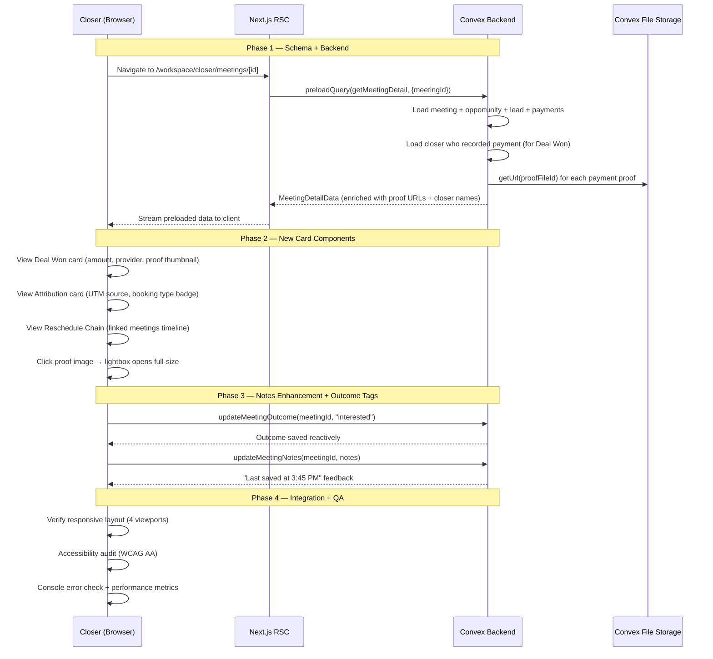

# Meeting Detail Enhancements — Design Specification

**Version:** 0.2 (Full Scope)
**Status:** Draft
**Scope:** Enhance the existing meeting detail page (`/workspace/closer/meetings/[meetingId]`) from a basic info+actions view to a rich, informative detail surface. Adds a Deal Won card (payment details + proof display), UTM Attribution card (with booking type), meeting outcome tags (structured dropdown), richer notes (save timestamps), and meeting reschedule chain display. Covers sub-features I1–I6 from the v0.5 product specification.
**Prerequisite:** v0.4 fully deployed. Feature G (UTM Tracking & Attribution) complete — `utmParams` fields present on `meetings` and `opportunities` tables, `convex/lib/utmParams.ts` utility exists. Feature J (Form Handling — RHF + Zod) complete — all workspace dialogs use React Hook Form + Zod.

---

## Table of Contents

1. [Goals & Non-Goals](#1-goals--non-goals)
2. [Actors & Roles](#2-actors--roles)
3. [End-to-End Flow Overview](#3-end-to-end-flow-overview)
4. [Phase 1: Schema & Backend](#4-phase-1-schema--backend)
5. [Phase 2: Frontend Card Components](#5-phase-2-frontend-card-components)
6. [Phase 3: Notes Enhancement & Meeting Outcome Tags](#6-phase-3-notes-enhancement--meeting-outcome-tags)
7. [Phase 4: Page Integration & Testing](#7-phase-4-page-integration--testing)
8. [Data Model](#8-data-model)
9. [Convex Function Architecture](#9-convex-function-architecture)
10. [Routing & Authorization](#10-routing--authorization)
11. [Security Considerations](#11-security-considerations)
12. [Error Handling & Edge Cases](#12-error-handling--edge-cases)
13. [Open Questions](#13-open-questions)
14. [Dependencies](#14-dependencies)
15. [Applicable Skills](#15-applicable-skills)

---

## 1. Goals & Non-Goals

### Goals

- **I1 — Won Deal Display:** When an opportunity is `payment_received`, show a prominent "Deal Won" card displaying the actual payment amount, provider, reference code, who recorded it, when, payment status badge, and the proof file inline.
- **I2 — Proof File Display:** Payment proof files are currently uploaded but never shown. Display them: image files as inline thumbnails with a lightbox on click; PDF files as a download link with a PDF icon. Show file metadata (size, upload date).
- **I3 — Meeting Reschedule Chain:** If a meeting is part of a reschedule sequence (follow-up from no-show or cancellation), display the chain of related meetings with dates, statuses, and navigation links.
- **I4 — UTM Attribution Card:** Show how the lead arrived — UTM source, medium, campaign, term, content — from the opportunity's first booking. Include a booking type indicator (Organic / Follow-Up / Reschedule) with a visual badge.
- **I5 — Enhanced Meeting Info:** Surface additional data in the meeting info panel — reassignment notice (deferred: depends on Feature H), lead identifiers from this booking (deferred: depends on Feature E field mappings).
- **I6 — Richer Notes:** Add a structured meeting outcome dropdown above the freeform notes — "Interested", "Needs more info", "Price objection", "Not qualified", "Ready to buy". Show "Last saved at" timestamp on auto-saves.

### Non-Goals (deferred)

- **Duplicate lead detection banner** — deferred to Feature E (Lead Identity Resolution).
- **Lead identifiers from booking** (social handle, phone extracted via field mapping) — deferred to Feature E.
- **Reassignment notice** ("This meeting was redistributed from closer X") — deferred to Feature H (Closer Unavailability & Redistribution).
- **Customer profile link** on Deal Won card — deferred to Feature D (Lead-to-Customer Conversion). The card includes a placeholder slot for this link.
- **Advanced analytics or reporting** on UTM attribution — deferred to admin dashboard work.
- **Bulk outcome changes** across multiple meetings — single-meeting scope only.
- **Meeting outcome history timeline** — future enhancement after Feature A.

---

## 2. Actors & Roles

| Actor | Identity | Auth Method | Key Permissions |
|---|---|---|---|
| **Closer** | Individual team member, assigned to meetings | WorkOS AuthKit, `closer` role | View own meeting details. Set meeting outcome tag. View UTM attribution. View proof files. Edit notes. |
| **Admin / Tenant Master** | Owner or admin of the tenant org | WorkOS AuthKit, `tenant_master` or `tenant_admin` role | Same as closer, plus view any team member's meetings. |

### CRM Role <-> External Role Mapping

| CRM `users.role` | WorkOS RBAC Slug | Feature I Permissions |
|---|---|---|
| `tenant_master` | `owner` | Full access to all meeting details |
| `tenant_admin` | `tenant-admin` | Full access to all meeting details |
| `closer` | `closer` | Own assigned meetings only |

---

## 3. End-to-End Flow Overview



---

## 4. Phase 1: Schema & Backend

### 4.1 Schema Addition — `meetingOutcome` Field

The `meetings` table receives a new optional field to store the structured outcome classification set by the closer after a meeting. This complements the existing `status` field (which tracks the meeting lifecycle: scheduled → in_progress → completed) with a richer outcome semantic describing the lead's intent.

> **Runtime decision:** Store `meetingOutcome` as an optional `v.union` of string literals on the `meetings` table rather than a separate `meetingOutcomes` table. Justification: a meeting has exactly one outcome (if set); the outcome is always read alongside the meeting and never queried independently; denormalization avoids a join and keeps the single `getMeetingDetail` query efficient.
>
> **Why these specific values:** The five outcomes — "interested", "needs_more_info", "price_objection", "not_qualified", "ready_to_buy" — match the common sales qualification categories from the v0.5 spec (Section I6). They're actionable for the closer and map to follow-up strategies. The opportunity-level status (`payment_received`, `lost`, etc.) already captures deal-level outcomes, so `meetingOutcome` captures per-meeting signal.

```typescript
// Path: convex/schema.ts (MODIFIED — meetings table addition)

meetings: defineTable({
  // ... existing fields ...

  // NEW — Feature I (Phase 1): Meeting outcome classification
  // Set by the closer after a meeting via a dropdown on the meeting detail page.
  // Undefined = outcome not yet classified (meeting pending or closer hasn't tagged it).
  meetingOutcome: v.optional(
    v.union(
      v.literal("interested"),
      v.literal("needs_more_info"),
      v.literal("price_objection"),
      v.literal("not_qualified"),
      v.literal("ready_to_buy"),
    ),
  ),
})
  // ... existing indexes unchanged ...
```

**Migration:** This is an additive optional field. No data migration required — existing meetings will have `meetingOutcome = undefined`. No backfill needed.

**Schema coordination with Feature F:** Both Feature I and Feature F modify `convex/schema.ts` in Window 1. Per the parallelization strategy:
- Feature I adds `meetingOutcome` to the `meetings` table.
- Feature F adds `customFieldMappings` and `knownCustomFieldKeys` to the `eventTypeConfigs` table.
- Both are new optional fields on **different tables** — no conflict.
- **Deploy order:** Feature I's schema deploys first, then Feature F's. Serialize `npx convex dev` deployments.

### 4.2 Backend Query Enhancement — `getMeetingDetail`

The existing `getMeetingDetail` query already returns the full `meeting` and `opportunity` documents (which include `utmParams`), plus `payments` and `meetingHistory`. It needs two enhancements:

1. **Proof file URLs:** For each payment with a `proofFileId`, resolve the signed URL via `ctx.storage.getUrl()` and include file metadata from the `_storage` system table.
2. **Closer who recorded the payment:** For the Deal Won card's "Recorded By" field, look up the closer's name from each payment's `closerId`.

```typescript
// Path: convex/closer/meetingDetail.ts (MODIFIED)

import { v } from "convex/values";
import type { Doc } from "../_generated/dataModel";
import { query } from "../_generated/server";
import { requireTenantUser } from "../requireTenantUser";

type MeetingHistoryEntry = Doc<"meetings"> & {
  opportunityStatus: Doc<"opportunities">["status"];
  isCurrentMeeting: boolean;
};

// NEW: Enriched payment type with proof URL and closer name
type EnrichedPayment = Doc<"paymentRecords"> & {
  proofFileUrl: string | null;
  proofFileContentType: string | null;
  proofFileSize: number | null;
  closerName: string | null;
};

export const getMeetingDetail = query({
  args: { meetingId: v.id("meetings") },
  handler: async (ctx, { meetingId }) => {
    console.log("[Closer:MeetingDetail] getMeetingDetail called", { meetingId });
    const { userId, tenantId, role } = await requireTenantUser(ctx, [
      "closer",
      "tenant_master",
      "tenant_admin",
    ]);

    // Load the meeting
    const meeting = await ctx.db.get(meetingId);
    console.log("[Closer:MeetingDetail] meeting lookup", { found: !!meeting });
    if (!meeting || meeting.tenantId !== tenantId) {
      throw new Error("Meeting not found");
    }

    // Load the parent opportunity
    const opportunity = await ctx.db.get(meeting.opportunityId);
    console.log("[Closer:MeetingDetail] opportunity lookup", {
      found: !!opportunity,
      opportunityId: meeting.opportunityId,
    });
    if (!opportunity || opportunity.tenantId !== tenantId) {
      throw new Error("Opportunity not found");
    }

    // Authorization: Closers can only see their own meetings
    if (role === "closer" && opportunity.assignedCloserId !== userId) {
      throw new Error("Not your meeting");
    }

    // Load the lead
    const lead = await ctx.db.get(opportunity.leadId);
    console.log("[Closer:MeetingDetail] lead lookup", {
      found: !!lead,
      leadId: opportunity.leadId,
    });
    if (!lead || lead.tenantId !== tenantId) {
      throw new Error("Lead not found");
    }

    // Load lead's full meeting history (all meetings across all opportunities)
    const meetingHistory: MeetingHistoryEntry[] = [];
    const leadOpportunities = ctx.db
      .query("opportunities")
      .withIndex("by_tenantId_and_leadId", (q) =>
        q.eq("tenantId", tenantId).eq("leadId", opportunity.leadId),
      );

    for await (const leadOpportunity of leadOpportunities) {
      const meetings = ctx.db
        .query("meetings")
        .withIndex("by_opportunityId", (q) =>
          q.eq("opportunityId", leadOpportunity._id),
        );

      for await (const historicalMeeting of meetings) {
        meetingHistory.push({
          ...historicalMeeting,
          opportunityStatus: leadOpportunity.status,
          isCurrentMeeting: historicalMeeting._id === meetingId,
        });
      }
    }

    // Sort meeting history by scheduledAt descending (most recent first)
    meetingHistory.sort((a, b) => b.scheduledAt - a.scheduledAt);

    const eventTypeConfig = opportunity.eventTypeConfigId
      ? await ctx.db.get(opportunity.eventTypeConfigId)
      : null;
    const eventTypeName = eventTypeConfig?.displayName ?? null;
    const paymentLinks = eventTypeConfig?.paymentLinks ?? null;

    // Load payment records + enrich with proof file URLs and closer names
    const payments: EnrichedPayment[] = [];
    const paymentRecords = ctx.db
      .query("paymentRecords")
      .withIndex("by_opportunityId", (q) =>
        q.eq("opportunityId", opportunity._id),
      );

    for await (const payment of paymentRecords) {
      if (payment.tenantId !== tenantId) continue;

      // Resolve proof file URL and metadata
      let proofFileUrl: string | null = null;
      let proofFileContentType: string | null = null;
      let proofFileSize: number | null = null;

      if (payment.proofFileId) {
        proofFileUrl = await ctx.storage.getUrl(payment.proofFileId);
        // Query _storage system table for file metadata
        const fileMeta = await ctx.db.system.get(payment.proofFileId);
        if (fileMeta) {
          proofFileContentType = fileMeta.contentType ?? null;
          proofFileSize = fileMeta.size ?? null;
        }
      }

      // Resolve closer name for "Recorded By" display
      let closerName: string | null = null;
      const closer = await ctx.db.get(payment.closerId);
      if (closer && closer.tenantId === tenantId) {
        closerName = closer.fullName ?? closer.email;
      }

      payments.push({
        ...payment,
        proofFileUrl,
        proofFileContentType,
        proofFileSize,
        closerName,
      });
    }
    payments.sort((a, b) => b.recordedAt - a.recordedAt);

    // Load assigned closer info (for admin view)
    const assignedCloser = opportunity.assignedCloserId
      ? await ctx.db.get(opportunity.assignedCloserId)
      : null;
    const assignedCloserSummary =
      assignedCloser && assignedCloser.tenantId === tenantId
        ? assignedCloser.fullName
          ? { fullName: assignedCloser.fullName, email: assignedCloser.email }
          : { email: assignedCloser.email }
        : null;

    console.log("[Closer:MeetingDetail] getMeetingDetail completed", {
      meetingId,
      meetingHistoryCount: meetingHistory.length,
      paymentCount: payments.length,
      hasEventType: !!eventTypeName,
      hasPaymentLinks: !!paymentLinks,
      hasUtmParams: !!(meeting.utmParams || opportunity.utmParams),
    });

    return {
      meeting,
      opportunity,
      lead,
      assignedCloser: assignedCloserSummary,
      meetingHistory,
      eventTypeName,
      paymentLinks,
      payments,
    };
  },
});
```

> **Design note:** The existing `getPaymentProofUrl` query in `convex/closer/payments.ts` is a single-record lookup. Rather than making N additional client-side queries (one per payment), we resolve proof file URLs inline during `getMeetingDetail`. This is a single query with N lookups — acceptable for the expected cardinality (1-2 payments per opportunity, rarely more). For the closerName lookup, the same logic applies — 1-2 payments max.
>
> **Alternative considered:** Keeping `getPaymentProofUrl` as a separate reactive query per payment. Rejected because: (1) it creates N subscriptions per page load, (2) proof URLs change infrequently (only when a new payment is recorded), (3) the meeting detail query already loads the payment records.

### 4.3 New Mutation — `updateMeetingOutcome`

A new mutation allows closers to set/change the meeting outcome tag. This is a simple field patch — no status transition validation needed (the outcome tag is independent of the meeting/opportunity status machine).

```typescript
// Path: convex/closer/meetingActions.ts (MODIFIED — add new mutation)

/**
 * Set or update the meeting outcome classification.
 *
 * The outcome is a structured tag that captures the closer's assessment
 * of the lead's intent after a meeting. It's separate from the
 * opportunity status (which tracks the deal lifecycle).
 *
 * Only the assigned closer or an admin can update the outcome.
 */
export const updateMeetingOutcome = mutation({
  args: {
    meetingId: v.id("meetings"),
    meetingOutcome: v.optional(
      v.union(
        v.literal("interested"),
        v.literal("needs_more_info"),
        v.literal("price_objection"),
        v.literal("not_qualified"),
        v.literal("ready_to_buy"),
      ),
    ),
  },
  handler: async (ctx, { meetingId, meetingOutcome }) => {
    console.log("[Closer:MeetingActions] updateMeetingOutcome called", {
      meetingId,
      meetingOutcome,
    });
    const { userId, tenantId, role } = await requireTenantUser(ctx, [
      "closer",
      "tenant_master",
      "tenant_admin",
    ]);

    const meeting = await ctx.db.get(meetingId);
    if (!meeting || meeting.tenantId !== tenantId) {
      throw new Error("Meeting not found");
    }

    // Verify closer authorization (only own meetings)
    const opportunity = await ctx.db.get(meeting.opportunityId);
    if (!opportunity || opportunity.tenantId !== tenantId) {
      throw new Error("Opportunity not found");
    }
    if (role === "closer" && opportunity.assignedCloserId !== userId) {
      throw new Error("Not your meeting");
    }

    await ctx.db.patch(meetingId, { meetingOutcome });
    console.log("[Closer:MeetingActions] meetingOutcome updated", {
      meetingId,
      meetingOutcome,
    });
  },
});
```

---

## 5. Phase 2: Frontend Card Components

### 5.1 Deal Won Card (`deal-won-card.tsx`)

Displays prominently when the opportunity status is `payment_received`. Shows the payment details, proof file, and the closer who recorded the payment. This is the most visually rich new card.

> **When shown:** Only when `opportunity.status === "payment_received"` AND at least one payment record exists. If the opportunity is in any other status, this card is not rendered.
>
> **Design decision:** The card renders the *most recent* payment (first in the sorted array, since payments are sorted by `recordedAt` descending). If multiple payments exist (unusual but possible), all are shown in a stacked layout.

```typescript
// Path: app/workspace/closer/meetings/_components/deal-won-card.tsx

"use client";

import { useState } from "react";
import {
  Card,
  CardContent,
  CardHeader,
  CardTitle,
} from "@/components/ui/card";
import { Badge } from "@/components/ui/badge";
import { Button } from "@/components/ui/button";
import { Separator } from "@/components/ui/separator";
import {
  Dialog,
  DialogContent,
  DialogTitle,
} from "@/components/ui/dialog";
import {
  TrophyIcon,
  CreditCardIcon,
  UserIcon,
  CalendarIcon,
  FileIcon,
  ImageIcon,
  DownloadIcon,
  ZoomInIcon,
  ExternalLinkIcon,
} from "lucide-react";
import { format } from "date-fns";
import { cn } from "@/lib/utils";

type EnrichedPayment = {
  _id: string;
  amount: number;
  currency: string;
  provider: string;
  referenceCode?: string;
  status: "recorded" | "verified" | "disputed";
  recordedAt: number;
  proofFileUrl: string | null;
  proofFileContentType: string | null;
  proofFileSize: number | null;
  closerName: string | null;
};

const PAYMENT_STATUS_CONFIG = {
  recorded: {
    label: "Recorded",
    badgeClass: "bg-blue-500/10 text-blue-700 border-blue-200 dark:text-blue-400",
  },
  verified: {
    label: "Verified",
    badgeClass: "bg-emerald-500/10 text-emerald-700 border-emerald-200 dark:text-emerald-400",
  },
  disputed: {
    label: "Disputed",
    badgeClass: "bg-red-500/10 text-red-700 border-red-200 dark:text-red-400",
  },
};

type DealWonCardProps = {
  payments: EnrichedPayment[];
};

export function DealWonCard({ payments }: DealWonCardProps) {
  const [lightboxUrl, setLightboxUrl] = useState<string | null>(null);

  if (payments.length === 0) return null;

  return (
    <Card className="border-emerald-200 bg-emerald-50/50 dark:border-emerald-900 dark:bg-emerald-950/30">
      <CardHeader className="pb-3">
        <div className="flex items-center gap-2">
          <TrophyIcon className="size-5 text-emerald-600 dark:text-emerald-400" />
          <CardTitle className="text-base">Deal Won</CardTitle>
        </div>
      </CardHeader>
      <CardContent className="flex flex-col gap-4">
        {payments.map((payment, idx) => {
          const statusCfg = PAYMENT_STATUS_CONFIG[payment.status];
          const isImage = isImageContentType(payment.proofFileContentType);

          return (
            <div key={payment._id}>
              {idx > 0 && <Separator className="mb-4" />}

              {/* Payment details grid */}
              <dl className="grid grid-cols-2 gap-x-4 gap-y-3">
                {/* Amount */}
                <div>
                  <dt className="text-xs font-medium uppercase tracking-wide text-muted-foreground">
                    Amount Paid
                  </dt>
                  <dd className="text-lg font-semibold">
                    {formatCurrency(payment.amount, payment.currency)}
                  </dd>
                </div>

                {/* Provider */}
                <div>
                  <dt className="text-xs font-medium uppercase tracking-wide text-muted-foreground">
                    Provider
                  </dt>
                  <dd className="flex items-center gap-1.5 text-sm font-medium">
                    <CreditCardIcon className="size-3.5 text-muted-foreground" />
                    {payment.provider}
                  </dd>
                </div>

                {/* Reference Code */}
                {payment.referenceCode && (
                  <div>
                    <dt className="text-xs font-medium uppercase tracking-wide text-muted-foreground">
                      Reference
                    </dt>
                    <dd className="truncate font-mono text-sm">
                      {payment.referenceCode}
                    </dd>
                  </div>
                )}

                {/* Recorded At */}
                <div>
                  <dt className="text-xs font-medium uppercase tracking-wide text-muted-foreground">
                    Recorded
                  </dt>
                  <dd className="flex items-center gap-1.5 text-sm">
                    <CalendarIcon className="size-3.5 text-muted-foreground" />
                    {format(payment.recordedAt, "MMM d, yyyy 'at' h:mm a")}
                  </dd>
                </div>

                {/* Recorded By */}
                {payment.closerName && (
                  <div>
                    <dt className="text-xs font-medium uppercase tracking-wide text-muted-foreground">
                      Recorded By
                    </dt>
                    <dd className="flex items-center gap-1.5 text-sm font-medium">
                      <UserIcon className="size-3.5 text-muted-foreground" />
                      {payment.closerName}
                    </dd>
                  </div>
                )}

                {/* Status */}
                <div>
                  <dt className="text-xs font-medium uppercase tracking-wide text-muted-foreground">
                    Status
                  </dt>
                  <dd>
                    <Badge
                      variant="secondary"
                      className={cn("text-xs", statusCfg.badgeClass)}
                    >
                      {statusCfg.label}
                    </Badge>
                  </dd>
                </div>
              </dl>

              {/* Proof File Display (I2) */}
              {payment.proofFileUrl && (
                <div className="mt-4">
                  <p className="mb-2 text-xs font-medium uppercase tracking-wide text-muted-foreground">
                    Proof of Payment
                  </p>
                  <div className="flex items-center gap-3 rounded-lg border bg-background p-3">
                    {isImage ? (
                      <>
                        {/* Image thumbnail + lightbox trigger */}
                        <button
                          type="button"
                          onClick={() => setLightboxUrl(payment.proofFileUrl)}
                          className="group relative shrink-0 overflow-hidden rounded-md border"
                          aria-label="View proof image full size"
                        >
                          
                          <div className="absolute inset-0 flex items-center justify-center bg-black/0 transition-colors group-hover:bg-black/20">
                            <ZoomInIcon className="size-4 text-white opacity-0 transition-opacity group-hover:opacity-100" />
                          </div>
                        </button>
                        <div className="min-w-0 flex-1">
                          <p className="flex items-center gap-1.5 text-sm font-medium">
                            <ImageIcon className="size-3.5 text-blue-600 dark:text-blue-400" />
                            Image proof
                          </p>
                          {payment.proofFileSize && (
                            <p className="text-xs text-muted-foreground">
                              {formatFileSize(payment.proofFileSize)}
                            </p>
                          )}
                        </div>
                      </>
                    ) : (
                      <>
                        {/* PDF / other file — icon + download link */}
                        <div className="flex size-16 shrink-0 items-center justify-center rounded-md border bg-muted">
                          <FileIcon className="size-6 text-muted-foreground" />
                        </div>
                        <div className="min-w-0 flex-1">
                          <p className="flex items-center gap-1.5 text-sm font-medium">
                            <FileIcon className="size-3.5 text-muted-foreground" />
                            {payment.proofFileContentType === "application/pdf"
                              ? "PDF proof"
                              : "File proof"}
                          </p>
                          {payment.proofFileSize && (
                            <p className="text-xs text-muted-foreground">
                              {formatFileSize(payment.proofFileSize)}
                            </p>
                          )}
                        </div>
                      </>
                    )}

                    {/* Download / View button */}
                    <Button variant="outline" size="sm" asChild>
                      <a
                        href={payment.proofFileUrl}
                        target="_blank"
                        rel="noopener noreferrer"
                      >
                        {isImage ? (
                          <ExternalLinkIcon data-icon="inline-start" />
                        ) : (
                          <DownloadIcon data-icon="inline-start" />
                        )}
                        {isImage ? "Open" : "Download"}
                      </a>
                    </Button>
                  </div>
                </div>
              )}

              {/* Customer Profile link placeholder (Feature D) */}
              {/* TODO: Add customer link when Feature D ships */}
            </div>
          );
        })}

        {/* Image Lightbox Dialog */}
        <Dialog
          open={lightboxUrl !== null}
          onOpenChange={(open) => {
            if (!open) setLightboxUrl(null);
          }}
        >
          <DialogContent className="max-w-3xl p-2">
            <DialogTitle className="sr-only">
              Payment proof image
            </DialogTitle>
            {lightboxUrl && (
              
            )}
          </DialogContent>
        </Dialog>
      </CardContent>
    </Card>
  );
}

// ─── Helpers ────────────────────────────────────────────────────────────────

function isImageContentType(contentType: string | null): boolean {
  if (!contentType) return false;
  return contentType.startsWith("image/");
}

function formatCurrency(amount: number, currency: string): string {
  try {
    return new Intl.NumberFormat("en-US", {
      style: "currency",
      currency: currency.toUpperCase(),
    }).format(amount);
  } catch {
    return `${currency.toUpperCase()} ${amount.toFixed(2)}`;
  }
}

function formatFileSize(bytes: number): string {
  if (bytes < 1024) return `${bytes} B`;
  if (bytes < 1024 * 1024) return `${(bytes / 1024).toFixed(1)} KB`;
  return `${(bytes / (1024 * 1024)).toFixed(1)} MB`;
}
```

### 5.2 Attribution Card (`attribution-card.tsx`)

Shows UTM parameters and booking type. The booking type is inferred from the meeting's relationship to its opportunity:

- **Organic** — the meeting is the first on its opportunity (no prior meetings in the chain).
- **Follow-Up** — the opportunity had a `follow_up_scheduled` status before this meeting was booked (a scheduling link was generated via the Follow-Up Dialog).
- **Reschedule** — the opportunity had a prior meeting with status `canceled` or `no_show` before this meeting.

> **Design decision:** Booking type is **inferred client-side** from the `meetingHistory` array, not stored as a field. This avoids denormalization and stays correct even if the history changes (e.g., a prior meeting's status is corrected). The inference uses the opportunity's meeting history sorted by `scheduledAt`.

```typescript
// Path: app/workspace/closer/meetings/_components/attribution-card.tsx

"use client";

import Link from "next/link";
import {
  Card,
  CardContent,
  CardHeader,
  CardTitle,
} from "@/components/ui/card";
import { Badge } from "@/components/ui/badge";
import { Separator } from "@/components/ui/separator";
import {
  TrendingUpIcon,
  GlobeIcon,
  MegaphoneIcon,
  TargetIcon,
  SearchIcon,
  FileTextIcon,
  ArrowRightIcon,
} from "lucide-react";
import { format } from "date-fns";
import type { Doc } from "@/convex/_generated/dataModel";

type AttributionCardProps = {
  opportunity: Doc<"opportunities">;
  meeting: Doc<"meetings">;
  meetingHistory: Array<
    Doc<"meetings"> & {
      opportunityStatus: Doc<"opportunities">["status"];
      isCurrentMeeting: boolean;
    }
  >;
};

const BOOKING_TYPE_CONFIG = {
  organic: {
    label: "Organic",
    badgeClass:
      "bg-blue-500/10 text-blue-700 border-blue-200 dark:text-blue-400 dark:border-blue-900",
  },
  follow_up: {
    label: "Follow-Up",
    badgeClass:
      "bg-violet-500/10 text-violet-700 border-violet-200 dark:text-violet-400 dark:border-violet-900",
  },
  reschedule: {
    label: "Reschedule",
    badgeClass:
      "bg-orange-500/10 text-orange-700 border-orange-200 dark:text-orange-400 dark:border-orange-900",
  },
} as const;

type BookingType = keyof typeof BOOKING_TYPE_CONFIG;

/**
 * Infer the booking type from the meeting's position in the meeting history.
 *
 * Logic:
 * - Meetings are sorted by scheduledAt descending (most recent first).
 * - Find the current meeting in the history.
 * - Look at meetings that came BEFORE this one (earlier scheduledAt).
 * - If no prior meetings exist → organic.
 * - If any prior meeting has status "canceled" or "no_show" → reschedule.
 * - Otherwise (prior meeting exists and completed/in_progress) → follow_up.
 */
function inferBookingType(
  meetingId: string,
  meetingHistory: AttributionCardProps["meetingHistory"],
): { type: BookingType; originalMeetingId?: string } {
  // Sort ascending for chronological order
  const sorted = [...meetingHistory].sort(
    (a, b) => a.scheduledAt - b.scheduledAt,
  );
  const currentIdx = sorted.findIndex((m) => m._id === meetingId);

  if (currentIdx <= 0) {
    return { type: "organic" };
  }

  // Look at the immediately preceding meeting
  const prevMeeting = sorted[currentIdx - 1];
  if (
    prevMeeting.status === "canceled" ||
    prevMeeting.status === "no_show"
  ) {
    return { type: "reschedule", originalMeetingId: prevMeeting._id };
  }

  return { type: "follow_up", originalMeetingId: prevMeeting._id };
}

export function AttributionCard({
  opportunity,
  meeting,
  meetingHistory,
}: AttributionCardProps) {
  // Use opportunity-level UTM (first booking) as canonical attribution source.
  // Fall back to meeting-level UTM if opportunity has none (pre-G migration).
  const utm = opportunity.utmParams ?? meeting.utmParams;

  const { type: bookingType, originalMeetingId } = inferBookingType(
    meeting._id,
    meetingHistory,
  );
  const bookingCfg = BOOKING_TYPE_CONFIG[bookingType];

  const hasUtm = utm && Object.values(utm).some((v) => v !== undefined);

  return (
    <Card>
      <CardHeader className="pb-3">
        <CardTitle className="flex items-center gap-2 text-base">
          <TrendingUpIcon className="size-4" />
          Attribution
        </CardTitle>
      </CardHeader>
      <CardContent className="flex flex-col gap-4">
        {/* UTM Parameters */}
        {hasUtm ? (
          <dl className="grid grid-cols-2 gap-x-4 gap-y-3">
            {utm.utm_source && (
              <UtmField
                icon={<GlobeIcon />}
                label="Source"
                value={utm.utm_source}
              />
            )}
            {utm.utm_medium && (
              <UtmField
                icon={<MegaphoneIcon />}
                label="Medium"
                value={utm.utm_medium}
              />
            )}
            {utm.utm_campaign && (
              <UtmField
                icon={<TargetIcon />}
                label="Campaign"
                value={utm.utm_campaign}
              />
            )}
            {utm.utm_term && (
              <UtmField
                icon={<SearchIcon />}
                label="Term"
                value={utm.utm_term}
              />
            )}
            {utm.utm_content && (
              <UtmField
                icon={<FileTextIcon />}
                label="Content"
                value={utm.utm_content}
              />
            )}
          </dl>
        ) : (
          <p className="text-sm text-muted-foreground">
            No UTM attribution data available for this opportunity.
          </p>
        )}

        <Separator />

        {/* Booking Type */}
        <div className="flex items-center justify-between">
          <div>
            <p className="text-xs font-medium uppercase tracking-wide text-muted-foreground">
              Booking Type
            </p>
            <Badge
              variant="secondary"
              className={bookingCfg.badgeClass}
            >
              {bookingCfg.label}
            </Badge>
          </div>
          {originalMeetingId && (
            <Link
              href={`/workspace/closer/meetings/${originalMeetingId}`}
              className="flex items-center gap-1 text-xs text-primary hover:underline"
            >
              View original
              <ArrowRightIcon className="size-3" />
            </Link>
          )}
        </div>
      </CardContent>
    </Card>
  );
}

// ─── Internal ────────────────────────────────────────────────────────────────

function UtmField({
  icon,
  label,
  value,
}: {
  icon: React.ReactNode;
  label: string;
  value: string;
}) {
  return (
    <div className="flex flex-col gap-1">
      <dt className="flex items-center gap-1.5 text-xs font-medium uppercase tracking-wide text-muted-foreground">
        <span className="[&>svg]:size-3">{icon}</span>
        {label}
      </dt>
      <dd className="text-sm font-medium">{value}</dd>
    </div>
  );
}
```

### 5.3 Reschedule Chain Display

The existing `MeetingHistoryTimeline` in the `LeadInfoPanel` already shows all meetings across all opportunities for the lead. However, the spec calls for a dedicated inline "reschedule chain" display when the current meeting is a follow-up or reschedule.

> **Design decision:** Rather than creating a separate card, extend the existing `MeetingHistoryTimeline` with a visual distinction for same-opportunity meetings. The chain of meetings within the same opportunity IS the reschedule chain. The timeline already links to other meetings and shows status badges.
>
> The key enhancement: add a small "Rescheduled from" or "Follow-up from" label on the current meeting's timeline entry when it has a predecessor in the same opportunity.

```typescript
// Path: app/workspace/closer/meetings/_components/meeting-history-timeline.tsx
// (MODIFIED — add reschedule chain annotation)

// In the timeline rendering, add a contextual annotation when a meeting
// is part of a chain (same opportunityId, with predecessors):

// After the date + time line for the current meeting, add:
// <p className="text-xs text-muted-foreground">
//   Rescheduled from {format(prevMeeting.scheduledAt, "MMM d")} ({prevMeeting.status})
// </p>

// Implementation deferred to the actual component edit — the design document
// specifies the data flow (meetingHistory already contains all information needed).
```

> **No new backend changes needed** for this feature — the `meetingHistory` array already contains all meetings for the lead across all opportunities, with their statuses and a flag for the current meeting. The frontend can compute the reschedule chain by filtering for meetings on the same `opportunityId`.

### 5.4 Meeting Outcome Tags — Component

A dropdown/select component embedded within the notes section that lets the closer classify the meeting outcome. Uses the existing RHF + Zod form pattern for the select, but since this is a single-field interaction (not a dialog), it uses a simpler controlled select pattern.

```typescript
// Path: app/workspace/closer/meetings/_components/meeting-outcome-select.tsx

"use client";

import { useState, useCallback } from "react";
import { useMutation } from "convex/react";
import { api } from "@/convex/_generated/api";
import type { Id, Doc } from "@/convex/_generated/dataModel";
import {
  Select,
  SelectContent,
  SelectGroup,
  SelectItem,
  SelectTrigger,
  SelectValue,
} from "@/components/ui/select";
import { Badge } from "@/components/ui/badge";
import { Spinner } from "@/components/ui/spinner";
import { toast } from "sonner";
import { cn } from "@/lib/utils";
import posthog from "posthog-js";

const OUTCOME_OPTIONS = [
  {
    value: "interested",
    label: "Interested",
    badgeClass: "bg-emerald-500/10 text-emerald-700 dark:text-emerald-400",
  },
  {
    value: "needs_more_info",
    label: "Needs more info",
    badgeClass: "bg-blue-500/10 text-blue-700 dark:text-blue-400",
  },
  {
    value: "price_objection",
    label: "Price objection",
    badgeClass: "bg-amber-500/10 text-amber-700 dark:text-amber-400",
  },
  {
    value: "not_qualified",
    label: "Not qualified",
    badgeClass: "bg-red-500/10 text-red-700 dark:text-red-400",
  },
  {
    value: "ready_to_buy",
    label: "Ready to buy",
    badgeClass: "bg-emerald-500/10 text-emerald-700 dark:text-emerald-400",
  },
] as const;

type MeetingOutcome = (typeof OUTCOME_OPTIONS)[number]["value"];

type MeetingOutcomeSelectProps = {
  meetingId: Id<"meetings">;
  currentOutcome: MeetingOutcome | undefined;
};

export function MeetingOutcomeSelect({
  meetingId,
  currentOutcome,
}: MeetingOutcomeSelectProps) {
  const [isSaving, setIsSaving] = useState(false);
  const updateOutcome = useMutation(
    api.closer.meetingActions.updateMeetingOutcome,
  );

  const handleChange = useCallback(
    async (value: string) => {
      setIsSaving(true);
      try {
        await updateOutcome({
          meetingId,
          meetingOutcome: value as MeetingOutcome,
        });
        posthog.capture("meeting_outcome_set", {
          meeting_id: meetingId,
          outcome: value,
        });
        toast.success("Meeting outcome updated");
      } catch (error) {
        posthog.captureException(error);
        toast.error(
          error instanceof Error
            ? error.message
            : "Failed to update outcome",
        );
      } finally {
        setIsSaving(false);
      }
    },
    [meetingId, updateOutcome],
  );

  const selectedOption = OUTCOME_OPTIONS.find(
    (o) => o.value === currentOutcome,
  );

  return (
    <div className="flex items-center gap-3">
      <p className="text-xs font-medium uppercase tracking-wide text-muted-foreground">
        Outcome
      </p>
      <Select
        value={currentOutcome ?? ""}
        onValueChange={handleChange}
        disabled={isSaving}
      >
        <SelectTrigger className="w-[180px]">
          {isSaving ? (
            <div className="flex items-center gap-2">
              <Spinner className="size-3" />
              <span className="text-xs">Saving...</span>
            </div>
          ) : (
            <SelectValue placeholder="Select outcome" />
          )}
        </SelectTrigger>
        <SelectContent>
          <SelectGroup>
            {OUTCOME_OPTIONS.map((option) => (
              <SelectItem key={option.value} value={option.value}>
                <Badge
                  variant="secondary"
                  className={cn("text-xs", option.badgeClass)}
                >
                  {option.label}
                </Badge>
              </SelectItem>
            ))}
          </SelectGroup>
        </SelectContent>
      </Select>
    </div>
  );
}
```

---

## 6. Phase 3: Notes Enhancement & Meeting Outcome Tags

### 6.1 Enhanced Meeting Notes (`meeting-notes.tsx` modifications)

The existing `MeetingNotes` component is enhanced with:

1. **"Last saved at" timestamp** — when the save completes, show the time instead of just "Saved".
2. **Meeting outcome select** — embed the `MeetingOutcomeSelect` component above the textarea.

> **Design decision:** The outcome select is co-located with the notes section (not a separate card) because it's a quick-capture interaction that happens while the closer is already writing notes. It doesn't warrant its own card — it would add visual noise.

```typescript
// Path: app/workspace/closer/meetings/_components/meeting-notes.tsx (MODIFIED)
// Key changes:
// 1. Add `meetingOutcome` to props
// 2. Import and render MeetingOutcomeSelect above Textarea
// 3. Replace "✓ Saved" with "✓ Saved at {time}"

// The SaveIndicator change:
// status === "saved" renders:
// <span className="text-xs font-medium text-emerald-600 dark:text-emerald-400">
//   ✓ Saved at {format(lastSavedAt, "h:mm a")}
// </span>

// New props:
type MeetingNotesProps = {
  meetingId: Id<"meetings">;
  initialNotes: string;
  meetingOutcome: string | undefined; // NEW
};

// Add state for lastSavedAt:
// const [lastSavedAt, setLastSavedAt] = useState<number | null>(null);
// In the save success callback: setLastSavedAt(Date.now());

// Add MeetingOutcomeSelect above the Textarea:
// <MeetingOutcomeSelect
//   meetingId={meetingId}
//   currentOutcome={meetingOutcome as MeetingOutcome | undefined}
// />
```

### 6.2 Component Integration in Meeting Detail Page Client

The `meeting-detail-page-client.tsx` is updated to import and render the new components:

```typescript
// Path: app/workspace/closer/meetings/[meetingId]/_components/meeting-detail-page-client.tsx
// (Modified integration section)

// NEW IMPORTS:
import { DealWonCard } from "../../_components/deal-won-card";
import { AttributionCard } from "../../_components/attribution-card";

// Inside the render, after BookingAnswersCard:

// Right column layout:
<div className="flex flex-col gap-6 md:col-span-2 lg:col-span-3">
  <MeetingInfoPanel
    meeting={meeting}
    eventTypeName={eventTypeName}
    assignedCloser={assignedCloser}
  />
  <BookingAnswersCard customFields={lead.customFields} />

  {/* NEW: Deal Won Card — only for won opportunities */}
  {opportunity.status === "payment_received" && payments.length > 0 && (
    <DealWonCard payments={payments} />
  )}

  {/* NEW: Attribution Card — always shown */}
  <AttributionCard
    opportunity={opportunity}
    meeting={meeting}
    meetingHistory={meetingHistory}
  />

  {/* MODIFIED: MeetingNotes now includes outcome select */}
  <MeetingNotes
    meetingId={meeting._id}
    initialNotes={meeting.notes ?? ""}
    meetingOutcome={meeting.meetingOutcome}
  />

  {paymentLinks && paymentLinks.length > 0 && (
    <PaymentLinksPanel paymentLinks={paymentLinks} />
  )}
</div>
```

**Card rendering order (top to bottom):**

1. **MeetingInfoPanel** — date, time, duration, event type, closer, meeting link
2. **BookingAnswersCard** — Calendly booking form responses
3. **DealWonCard** — (conditional: only when `payment_received`)
4. **AttributionCard** — UTM source, booking type
5. **MeetingNotes** — outcome select + auto-saving textarea
6. **PaymentLinksPanel** — (conditional: only when payment links configured)

> **Why this order:** The most important context cards (meeting details, booking answers) come first. The Deal Won card is celebratory and high-signal — it appears right after context when it's relevant. Attribution provides background context. Notes are an interactive element that the closer engages with during or after the meeting.

---

## 7. Phase 4: Page Integration & Testing

### 7.1 Skeleton Updates

Update `MeetingDetailSkeleton` to include placeholder cards for the new sections:

```typescript
// Path: app/workspace/closer/meetings/[meetingId]/_components/meeting-detail-page-client.tsx
// (MeetingDetailSkeleton function)

function MeetingDetailSkeleton() {
  return (
    <div className="flex flex-col gap-6">
      <div className="flex items-center justify-between">
        <Skeleton className="h-9 w-20" />
        <Skeleton className="h-5 w-24 rounded-full" />
      </div>

      <div className="grid grid-cols-1 gap-6 md:grid-cols-3 lg:grid-cols-4">
        <div className="flex flex-col gap-4">
          <Skeleton className="h-48 rounded-xl" />
          <Skeleton className="h-40 rounded-xl" />
        </div>

        <div className="flex flex-col gap-4 md:col-span-2 lg:col-span-3">
          <Skeleton className="h-56 rounded-xl" />  {/* Meeting Info */}
          <Skeleton className="h-32 rounded-xl" />  {/* Booking Answers */}
          <Skeleton className="h-40 rounded-xl" />  {/* Attribution */}
          <Skeleton className="h-48 rounded-xl" />  {/* Notes + Outcome */}
        </div>
      </div>

      <div className="flex gap-3 border-t pt-4">
        {Array.from({ length: 3 }).map((_, i) => (
          <Skeleton key={i} className="h-10 w-32 rounded-md" />
        ))}
      </div>
    </div>
  );
}
```

### 7.2 Responsive Design Testing

All new cards must render correctly at 4 viewports:

| Viewport | Width | Grid Behavior |
|---|---|---|
| Mobile | 375px | Single column, stacked cards |
| Tablet | 768px | 3-column grid (1 + 2 split) |
| Desktop | 1280px | 4-column grid (1 + 3 split) |
| Wide | 1440px+ | 4-column grid, max-width contained |

Use the `expect` skill to verify each viewport.

### 7.3 Image Lightbox Testing

- Click proof image thumbnail → Dialog opens with full-resolution image.
- Close via: click outside, Esc key, or X button.
- Dialog has `role="dialog"`, `DialogTitle` (sr-only), keyboard focus trapped.
- Non-image files (PDF) do NOT open lightbox — they open in a new tab.

### 7.4 Accessibility & WCAG Compliance

Run `expect` accessibility audit:

- All badges and icons have proper color contrast (WCAG AA minimum).
- Cards use semantic HTML (`<dl>` for definition lists, proper heading hierarchy).
- Image lightbox dialog is keyboard navigable (Tab, Enter, Esc).
- File download links have descriptive text (not just "Download" — includes context).
- Select component has an accessible label.
- Save timestamp uses `aria-live="polite"` for screen reader updates.

### 7.5 Console Error & Performance Check

- No React errors or warnings in console.
- No failed network requests.
- `getMeetingDetail` query returns within acceptable bounds (the additional `ctx.storage.getUrl()` and `ctx.db.system.get()` calls should be negligible).
- LCP, CLS, INP within acceptable ranges.

---

## 8. Data Model

### 8.1 `meetings` Table (Modified)

```typescript
meetings: defineTable({
  tenantId: v.id("tenants"),
  opportunityId: v.id("opportunities"),
  calendlyEventUri: v.string(),
  calendlyInviteeUri: v.string(),
  zoomJoinUrl: v.optional(v.string()),
  meetingJoinUrl: v.optional(v.string()),
  meetingLocationType: v.optional(v.string()),
  scheduledAt: v.number(),
  durationMinutes: v.number(),
  status: v.union(
    v.literal("scheduled"),
    v.literal("in_progress"),
    v.literal("completed"),
    v.literal("canceled"),
    v.literal("no_show"),
  ),
  notes: v.optional(v.string()),
  leadName: v.optional(v.string()),
  createdAt: v.number(),
  utmParams: v.optional(utmParamsValidator),

  // NEW — Feature I: Meeting outcome classification tag
  // Set by the closer after a meeting. Captures lead intent signal.
  // Independent of opportunity status (scheduled/in_progress/payment_received/etc.).
  // Undefined = not yet classified.
  meetingOutcome: v.optional(
    v.union(
      v.literal("interested"),
      v.literal("needs_more_info"),
      v.literal("price_objection"),
      v.literal("not_qualified"),
      v.literal("ready_to_buy"),
    ),
  ),
})
  .index("by_opportunityId", ["opportunityId"])
  .index("by_tenantId_and_scheduledAt", ["tenantId", "scheduledAt"])
  .index("by_tenantId_and_calendlyEventUri", ["tenantId", "calendlyEventUri"]),
```

### 8.2 No Changes to Other Tables

- **`opportunities`**: Already has `utmParams` from Feature G. Already has `status` with `payment_received` for won deals.
- **`paymentRecords`**: Already has `proofFileId`, `amount`, `currency`, `provider`, `referenceCode`, `status`, `recordedAt`, `closerId`. All data needed for Deal Won card is present.
- **`followUps`**: Not modified by Feature I.
- **`leads`**: Not modified by Feature I.

---

## 9. Convex Function Architecture

```
convex/
├── closer/
│   ├── meetingDetail.ts          # MODIFIED: getMeetingDetail query enriched
│   │                              #   - Add proofFileUrl, proofFileContentType,
│   │                              #     proofFileSize to payment records
│   │                              #   - Add closerName to payment records
│   │                              #   — Phase 1
│   ├── meetingActions.ts         # MODIFIED: add updateMeetingOutcome mutation
│   │                              #   — Phase 1
│   └── payments.ts               # UNCHANGED: getPaymentProofUrl stays for
│                                  #   backward compat, but getMeetingDetail
│                                  #   now resolves URLs inline
├── lib/
│   └── utmParams.ts              # UNCHANGED: existing validator + extractor
├── schema.ts                      # MODIFIED: add meetingOutcome field to
│                                  #   meetings table — Phase 1
└── (all other files unchanged)
```

**Summary of changes:**

| File | Change | Phase |
|---|---|---|
| `convex/schema.ts` | Add `meetingOutcome` optional union field to `meetings` table | Phase 1 |
| `convex/closer/meetingDetail.ts` | Enrich payment records with `proofFileUrl`, `proofFileContentType`, `proofFileSize`, `closerName` | Phase 1 |
| `convex/closer/meetingActions.ts` | Add `updateMeetingOutcome` mutation | Phase 1 |

**Frontend new files:**

| File | Purpose | Phase |
|---|---|---|
| `app/workspace/closer/meetings/_components/deal-won-card.tsx` | Deal Won card with proof file display and lightbox | Phase 2 |
| `app/workspace/closer/meetings/_components/attribution-card.tsx` | UTM Attribution card with booking type badge | Phase 2 |
| `app/workspace/closer/meetings/_components/meeting-outcome-select.tsx` | Structured outcome dropdown | Phase 3 |

**Frontend modified files:**

| File | Change | Phase |
|---|---|---|
| `app/workspace/closer/meetings/[meetingId]/_components/meeting-detail-page-client.tsx` | Import + render new cards; update skeleton; update `MeetingDetailData` type | Phase 4 |
| `app/workspace/closer/meetings/_components/meeting-notes.tsx` | Add `meetingOutcome` prop + MeetingOutcomeSelect; add "Last saved at" timestamp | Phase 3 |

---

## 10. Routing & Authorization

### Route Structure (no changes)

```
app/workspace/
└── closer/
    └── meetings/
        ├── [meetingId]/
        │   ├── page.tsx                     # RSC wrapper (preloads getMeetingDetail)
        │   └── _components/
        │       └── meeting-detail-page-client.tsx  # Client boundary (MODIFIED)
        └── _components/
            ├── deal-won-card.tsx             # NEW — Phase 2
            ├── attribution-card.tsx          # NEW — Phase 2
            ├── meeting-outcome-select.tsx    # NEW — Phase 3
            ├── meeting-notes.tsx             # MODIFIED — Phase 3
            ├── lead-info-panel.tsx           # UNCHANGED
            ├── meeting-info-panel.tsx        # UNCHANGED
            ├── meeting-history-timeline.tsx  # UNCHANGED (chain context is
            │                                #   inferred by AttributionCard)
            ├── outcome-action-bar.tsx        # UNCHANGED
            ├── payment-form-dialog.tsx       # UNCHANGED
            ├── follow-up-dialog.tsx          # UNCHANGED
            ├── mark-lost-dialog.tsx          # UNCHANGED
            └── booking-answers-card.tsx      # UNCHANGED
```

### Authorization

| Layer | Mechanism | Feature I Impact |
|---|---|---|
| **Query (Convex)** | `requireTenantUser(ctx, ["closer", "tenant_master", "tenant_admin"])` | Unchanged. Meeting detail query already checks tenant + closer assignment. |
| **Mutation (Convex)** | `updateMeetingOutcome` — same auth pattern as `updateMeetingNotes` | **New.** Closer can only update outcome on their own meetings. Admins can update any. |
| **Route (RSC)** | Workspace layout auth gate → `page.tsx` verifies session | Unchanged. |
| **UI (Client)** | No role-conditional rendering in Feature I cards | All cards visible to any authorized user. |

---

## 11. Security Considerations

### 11.1 Credential Security

No new credentials introduced. All existing Calendly/WorkOS auth patterns unchanged.

### 11.2 Multi-Tenant Isolation

- Meeting queries scope by `tenantId` derived from the authenticated user's org membership — never from client input.
- UTM parameters are stored per-meeting and per-opportunity — no cross-tenant leakage possible.
- File storage URLs are generated via `ctx.storage.getUrl()` which produces short-lived signed URLs. The signing key is internal to Convex — it never reaches the client.

### 11.3 Role-Based Data Access

| Data | Closer | Admin | System Admin |
|---|---|---|---|
| View own meeting details | Full | Full | N/A |
| View any meeting details | Own only | Full | N/A |
| View UTM attribution | Own meetings | All meetings | N/A |
| View proof file (signed URL) | Own meetings | All meetings | N/A |
| Set meeting outcome | Own meetings | All meetings | N/A |
| Edit meeting notes | Own meetings | All meetings | N/A |

### 11.4 File Storage Security

- Proof files are stored in Convex `_storage` and linked via `proofFileId` in `paymentRecords`.
- File URLs returned by `ctx.storage.getUrl()` are short-lived signed URLs — they expire and cannot be shared externally for long-term access.
- Image lightbox renders the signed URL directly — no additional auth needed because the URL is self-authenticating.
- File type is determined from the `_storage` system table's `contentType` field — this is set by the browser's `Content-Type` header during upload and is trustworthy for display purposes (not security-critical since we're only using it to decide thumbnail vs. download link rendering).

### 11.5 Rate Limit Awareness

No new API calls introduced. The `getMeetingDetail` query is the only query per page load. The `updateMeetingOutcome` mutation is called at most once per user interaction (select change). No rate limit concerns.

---

## 12. Error Handling & Edge Cases

### 12.1 Missing UTM Parameters

**Scenario:** Opportunity was created before Feature G deployed, or lead booked organically without UTM tracking.

| Condition | Detection | User-Facing Behavior |
|---|---|---|
| `opportunity.utmParams === undefined && meeting.utmParams === undefined` | Checked in `AttributionCard` component | Card shows "No UTM attribution data available for this opportunity." Booking type badge still rendered. |

### 12.2 No Payment Records (Deal Won Card)

**Scenario:** Opportunity is `payment_received` but payment records are somehow missing (data integrity issue) or payment was recorded without a proof file.

| Condition | Detection | User-Facing Behavior |
|---|---|---|
| `payments.length === 0` while `opportunity.status === "payment_received"` | Conditional rendering in page client | Deal Won card is not rendered (guard: `payments.length > 0`). Opportunity badge still shows "Won". |
| `payment.proofFileId === undefined` | `proofFileUrl` is `null` in enriched payment | Proof section within Deal Won card is hidden for that payment. Other payment details still shown. |

### 12.3 Proof File URL Generation Failure

**Scenario:** `ctx.storage.getUrl(proofFileId)` returns `null` because the file was deleted from storage.

| Condition | Detection | User-Facing Behavior |
|---|---|---|
| `proofFileUrl === null` despite `proofFileId` being set | `ctx.storage.getUrl()` returns `null` | Proof section hidden. No error shown — silent degradation. The payment details (amount, provider, etc.) remain visible. |

### 12.4 Meeting Outcome Not Set

**Scenario:** Closer hasn't yet classified the meeting (most common state).

| Condition | Detection | User-Facing Behavior |
|---|---|---|
| `meeting.meetingOutcome === undefined` | Checked in MeetingOutcomeSelect | Select shows "Select outcome" placeholder. No visual error. |

### 12.5 Meeting Outcome Save Failure

**Scenario:** `updateMeetingOutcome` mutation fails (network error, auth expired).

| Condition | Detection | User-Facing Behavior |
|---|---|---|
| Mutation throws | `catch` block in handleChange | Toast error: "Failed to update outcome". Select reverts to previous value (Convex reactive update). |

### 12.6 Missing Opportunity or Lead (Data Integrity)

**Scenario:** Orphaned meeting record — opportunity or lead deleted.

| Condition | Detection | User-Facing Behavior |
|---|---|---|
| `opportunity === null` or `lead === null` | `getMeetingDetail` throws | "Meeting Not Found" error page via existing `MeetingNotFound` component. |

### 12.7 File Metadata Missing in _storage

**Scenario:** The `_storage` system table entry exists but has no `contentType` or `size`.

| Condition | Detection | User-Facing Behavior |
|---|---|---|
| `fileMeta.contentType === undefined` | `isImageContentType` returns `false` | File rendered as generic "File proof" with download link (safe fallback). |
| `fileMeta.size === undefined` | `proofFileSize === null` | File size not shown (hidden via conditional rendering). |

---

## 13. Open Questions

| # | Question | Current Thinking |
|---|---|---|
| 1 | Should admins see a different (more detailed) Attribution card with aggregate reporting? | **Deferred.** MVP shows the same card to all roles. Admin-specific attribution analytics is future admin dashboard work. |
| 2 | Should the lightbox support keyboard arrow navigation to cycle through multiple proof images? | **Deferred.** MVP supports a single lightbox per image. Multi-image cycling is a future enhancement — current UX is a per-image "View" → lightbox → close flow. |
| 3 | Should the meeting outcome select be available on all meeting statuses, or only `completed`/`in_progress`? | **Available on all statuses.** A closer might want to tag a no-show meeting as "not_qualified" or a canceled meeting's context. No status restriction on the outcome tag. |
| 4 | Should we store `closerFullName` as a denormalized field on `paymentRecords` to avoid the extra `ctx.db.get(closerId)` in the query? | **Not for now.** The cardinality is 1-2 payments per opportunity. The `ctx.db.get()` call is a single document lookup by ID — negligible cost. If performance becomes a concern (Feature D adding many payments), denormalize then via `convex-migration-helper`. |
| ~~5~~ | ~~Should booking type ("Organic"/"Follow-Up"/"Reschedule") be stored as a field on the meeting, or inferred client-side?~~ | **Resolved.** Inferred client-side from `meetingHistory`. No denormalization needed — the data is already available in the query result. |
| 6 | Should the `getPaymentProofUrl` query in `convex/closer/payments.ts` be deprecated now that `getMeetingDetail` returns proof URLs inline? | **Keep for backward compatibility.** It's a public query that other surfaces might use. Mark with a comment: `// Consider deprecating — getMeetingDetail now returns proof URLs inline.` |

---

## 14. Dependencies

### New Packages

| Package | Why | Runtime | Install |
|---|---|---|---|
| None | All components use existing shadcn/ui + Convex + lucide-react | — | — |

### Already Installed (no action needed)

| Package | Used for |
|---|---|
| `shadcn/ui` (Card, Badge, Button, Dialog, Select, Separator, Skeleton, Spinner) | All new card components |
| `lucide-react` | Icons (TrophyIcon, TrendingUpIcon, CreditCardIcon, ZoomInIcon, etc.) |
| `date-fns` | Date formatting (`format()` in Deal Won card and Attribution card) |
| `convex/react` | `usePreloadedQuery`, `useMutation` |
| `next/navigation` | Router (existing), `next/link` (for reschedule chain links) |
| `react-hook-form` + `zod` + `@hookform/resolvers` | Not needed for Feature I — outcome select uses controlled `useMutation` pattern, not a form |
| `sonner` | Toast notifications |
| `posthog-js` | Event tracking |

### Environment Variables

| Variable | Where Set | Used By |
|---|---|---|
| None | — | No new env vars required |

---

## 15. Applicable Skills

| Skill | When to Invoke | Phase |
|---|---|---|
| `shadcn` | Building Deal Won, Attribution, and Meeting Outcome card components with shadcn primitives | Phase 2, 3 |
| `frontend-design` | Production-grade card layouts — responsive grids, typography, spacing, color palette consistency | Phase 2, 3 |
| `expect` | Browser QA: responsive testing (4 viewports), image lightbox, accessibility audit (WCAG), console errors, performance metrics | Phase 4 |
| `vercel-react-best-practices` | Component rendering optimization — ensure new cards don't cause unnecessary re-renders (memoization, stable props) | Phase 2, 3 |

---

## Feature F Coordination Notes

Feature I and Feature F run in parallel during Window 1. Key coordination points:

1. **`convex/schema.ts`**: Both features add optional fields to different tables (I: `meetingOutcome` on `meetings`, F: `customFieldMappings` + `knownCustomFieldKeys` on `eventTypeConfigs`). No merge conflict — but serialize `npx convex dev` deployments. **Deploy I's schema first, then F's.**

2. **No shared frontend files**: Feature I works in `app/workspace/closer/meetings/_components/`. Feature F works in `app/workspace/settings/_components/` and `convex/eventTypeConfigs/`. Zero overlap.

3. **No shared backend files** (beyond schema): Feature I modifies `convex/closer/meetingDetail.ts` and `convex/closer/meetingActions.ts`. Feature F modifies `convex/eventTypeConfigs/` and adds to the end of `convex/pipeline/inviteeCreated.ts`. No conflict.

4. **Quality Gate 1** (after both I and F complete): Meeting detail shows Deal Won card with proof file display. UTM Attribution card renders with booking type. Meeting outcome tags persist. Settings > Field Mappings tab shows event types with auto-discovered field keys.

---

## Summary

**Feature I — Meeting Detail Enhancements** transforms the meeting detail page from a basic info+actions view to a rich intelligence surface:

| Sub-Feature | Component | Deliverable |
|---|---|---|
| **I1** — Won Deal Display | `DealWonCard` | Payment amount, provider, reference, recorded by, status badge, proof file inline |
| **I2** — Proof File Display | Inside `DealWonCard` | Image thumbnail + lightbox, PDF download link, file metadata |
| **I3** — Reschedule Chain | Via `AttributionCard` booking type | Booking type badge (Organic/Follow-Up/Reschedule) + "View original" link |
| **I4** — UTM Attribution | `AttributionCard` | Source, Medium, Campaign, Term, Content from opportunity UTM |
| **I5** — Enhanced Meeting Info | Deferred stubs | Reassignment notice (Feature H), lead identifiers (Feature E) |
| **I6** — Richer Notes | `MeetingOutcomeSelect` + `MeetingNotes` updates | Structured outcome dropdown + "Last saved at" timestamp |

**Backend changes:** 1 schema field addition (`meetingOutcome`), 1 query enhancement (`getMeetingDetail`), 1 new mutation (`updateMeetingOutcome`).

**Frontend changes:** 3 new components, 2 modified components.

| Phase | Duration | Deliverable |
|---|---|---|
| **Phase 1** | ~30min | Schema + backend (meetingOutcome field, query enrichment, new mutation) |
| **Phase 2** | ~1h | DealWonCard + AttributionCard components |
| **Phase 3** | ~30min | MeetingOutcomeSelect + MeetingNotes enhancement |
| **Phase 4** | ~30min | Page integration, skeleton updates, QA (responsive + a11y + performance) |

**Total estimated time:** ~2.5 hours (fits within Window 1 parallelization window alongside Feature F).

---

*This design specification is a living document. Open questions will be resolved during implementation. The components are designed to be easily extended by downstream features: Feature A adds follow-up dialog redesign (uses the outcome tags), Feature E adds duplicate lead banner, Feature H adds reassignment notice.*
