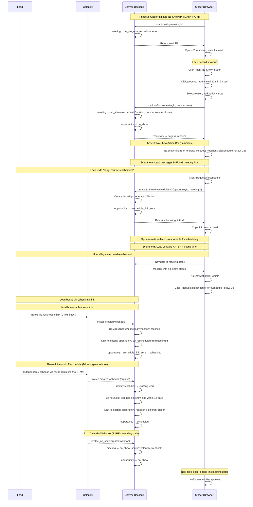
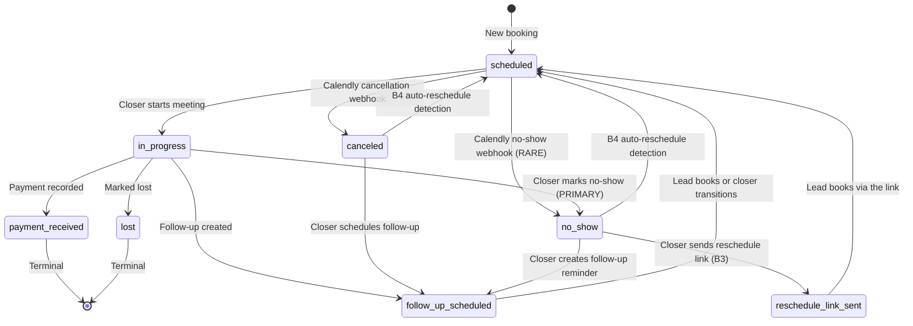

# No-Show Management — Design Specification

**Version:** 0.3 (Closer-Initiated Primary Path)
**Status:** Draft
**Scope:** Enable closers to mark meetings as no-show directly from the CRM when a lead fails to show up, capture wait time and reason, then offer actionable next steps (reschedule link or follow-up reminder). Support automatic reschedule detection in the pipeline for organic rebookings. Display reschedule chains on the meeting detail page.
**Prerequisite:** Feature A (Follow-Up & Rescheduling Overhaul) complete — `followUps` table, follow-up dialog, pipeline UTM intelligence, reminders dashboard, personal event type assignment. Feature E (Identity Resolution) complete — multi-identifier lead model. Feature G (UTM Tracking) deployed. Feature I (Meeting Detail Enhancements) deployed.

---

## Table of Contents

1. [Goals & Non-Goals](#1-goals--non-goals)
2. [Actors & Roles](#2-actors--roles)
3. [End-to-End Flow Overview](#3-end-to-end-flow-overview)
4. [Phase 1: Schema & Status Transitions](#4-phase-1-schema--status-transitions)
5. [Phase 2: Mark No-Show Dialog](#5-phase-2-mark-no-show-dialog)
6. [Phase 3: No-Show Action Bar & Reschedule](#6-phase-3-no-show-action-bar--reschedule)
7. [Phase 4: Heuristic Reschedule Detection](#7-phase-4-heuristic-reschedule-detection)
8. [Phase 5: Reschedule Chain Display & Attribution](#8-phase-5-reschedule-chain-display--attribution)
9. [Data Model](#9-data-model)
10. [Convex Function Architecture](#10-convex-function-architecture)
11. [Routing & Authorization](#11-routing--authorization)
12. [Security Considerations](#12-security-considerations)
13. [Error Handling & Edge Cases](#13-error-handling--edge-cases)
14. [Open Questions](#14-open-questions)
15. [Dependencies](#15-dependencies)
16. [Applicable Skills](#16-applicable-skills)

---

## 1. Goals & Non-Goals

### Goals

- **B1 (Closer-Initiated No-Show Marking):** The closer starts a meeting (`scheduled → in_progress`), waits for the lead, and when they decide the lead won't show, clicks **"Mark No-Show"** on the meeting detail page. A dialog opens showing:
  - A precomputed wait time (from when the meeting was started to when the button was clicked)
  - A structured reason dropdown (`no_response`, `late_cancel`, `technical_issues`, `other`)
  - An optional free-text note
  
  On confirmation, the meeting transitions `in_progress → no_show` and the opportunity transitions `in_progress → no_show`. This is the **primary** no-show path — the system does not depend on Calendly's `invitee_no_show.created` webhook.

- **B1b (Calendly Webhook Secondary Path):** The existing `invitee_no_show.created` webhook handler (`convex/pipeline/inviteeNoShow.ts`) continues to work as a **rare secondary path** — if someone marks a no-show directly in Calendly, the webhook fires and the system records it with `noShowSource: "calendly_webhook"`. The same post-no-show UI (action bar) appears for both paths.

- **B2 (No-Show Action Bar):** After a meeting is marked no-show (by either path), the meeting detail page shows a **No-Show Action Bar** with two options: "Request Reschedule" (generate a scheduling link with no-show UTMs) and "Schedule Follow-Up" (open the existing follow-up dialog from Feature A). This bar appears immediately after the closer marks a no-show (Convex reactivity), handling both during-meeting and after-meeting scenarios seamlessly.

- **B3 (Reschedule on Request):** When a closer clicks "Request Reschedule", the system generates a scheduling link using the closer's `personalEventTypeUri` with no-show-specific UTMs (`utm_medium=noshow_resched`, `utm_content={noShowMeetingId}`). The opportunity immediately transitions to a new `reschedule_link_sent` status — reflecting that the ball is now in the lead's court. The lead is responsible for scheduling in their own time. When the lead books through the link, the pipeline's UTM routing (Feature A) links the new meeting to the existing opportunity, sets `rescheduledFromMeetingId`, and transitions `reschedule_link_sent → scheduled`.

- **B4 (Automatic Reschedule Detection):** When the pipeline receives an `invitee.created` webhook with no CRM UTMs, check if the lead (resolved via email/identity) has a `no_show` or `canceled` opportunity updated within the last 14 days. If so, link the new meeting to that existing opportunity instead of creating a new one. If the new meeting's closer differs from the original (round-robin), reassign the opportunity. Set `rescheduledFromMeetingId`.

- **B5 (Reschedule Chain Display):** On the meeting detail page, if `rescheduledFromMeetingId` is set, show a banner: "This is a reschedule of [meeting date] → [View]". Show "Booking Origin: No-Show Reschedule" on the Attribution card.

### Non-Goals (deferred)

- **Admin no-show analytics dashboard** — No dedicated analytics page in v0.5. Admins see no-show status in existing pipeline views. (v0.6)
- **Snooze / dismiss functionality** — No snooze for the action bar. The closer either reschedules, follows up, or marks the opportunity as lost. (v0.6 if needed)
- **Automatic SMS/email to leads** — No outbound messaging. Closers perform outreach manually.
- **Predictive no-show scoring** — No ML-based likelihood estimation. Detection is closer-initiated.
- **Configurable recency window** — The 14-day B4 heuristic window is hardcoded. (v0.6)

---

## 2. Actors & Roles

| Actor                | Identity                                      | Auth Method                                    | Key Permissions                                                |
| -------------------- | --------------------------------------------- | ---------------------------------------------- | -------------------------------------------------------------- |
| **Closer**           | CRM user with `role: "closer"`                | WorkOS AuthKit, member of tenant org           | Start meetings, mark no-show, request reschedule, schedule follow-up |
| **Tenant Admin**     | CRM user with `role: "tenant_admin"`          | WorkOS AuthKit, member of tenant org           | View all meetings (including no-shows) in pipeline views       |
| **Tenant Master**    | CRM user with `role: "tenant_master"`         | WorkOS AuthKit, member of tenant org (owner)   | All admin permissions                                          |
| **Lead**             | External person who didn't show up            | None (public Calendly page)                    | (Passive) Rebooks via scheduling link or original Calendly link |
| **Calendly Webhook** | `invitee_no_show.created` event               | HMAC-SHA256 per-tenant signing key             | Secondary path: marks no-show when someone uses Calendly UI directly |

### CRM Role <-> External Role Mapping

| CRM `users.role` | WorkOS RBAC Slug | Feature B Permissions                                     |
| ---------------- | ---------------- | --------------------------------------------------------- |
| `tenant_master`  | `owner`          | View all no-shows, all pipeline views                     |
| `tenant_admin`   | `tenant-admin`   | View all no-shows, all pipeline views                     |
| `closer`         | `closer`         | Mark no-show, request reschedule, schedule follow-up      |

---

## 3. End-to-End Flow Overview



---

## 4. Phase 1: Schema & Status Transitions

### 4.1 Overview

Phase 1 adds the foundational schema changes required by all subsequent phases. This includes: `startedAt` on meetings (to compute wait time), no-show tracking fields (reason, note, source, timestamps), `rescheduledFromMeetingId` (linking reschedule chains), and new status transitions.

> **Schema strategy:** All changes are additive optional fields — no migration needed. Existing meetings have `undefined` for all new fields. The `startedAt` field is backfill-safe (only set going forward by the updated `startMeeting` mutation).

### 4.2 Schema Change: `meetings` Table

```typescript
// Path: convex/schema.ts (meetings table — MODIFIED)
meetings: defineTable({
  // ... existing fields ...

  // === Feature B: Meeting Start Time ===
  // When the closer clicked "Start Meeting". Used to compute no-show wait duration.
  // Set by the startMeeting mutation (Phase 2 modification).
  // Undefined for meetings started before Feature B or webhook-driven no-shows.
  startedAt: v.optional(v.number()),

  // === Feature B: No-Show Tracking ===
  // When the no-show was recorded (by closer or webhook handler).
  noShowMarkedAt: v.optional(v.number()),

  // How long the closer waited before marking no-show (ms).
  // Computed server-side as noShowMarkedAt - startedAt.
  // Undefined for webhook-driven no-shows or if startedAt is missing.
  noShowWaitDurationMs: v.optional(v.number()),

  // Structured reason for the no-show.
  noShowReason: v.optional(
    v.union(
      v.literal("no_response"),       // Lead didn't show, no communication
      v.literal("late_cancel"),       // Lead communicated they can't make it
      v.literal("technical_issues"),  // Technical problems prevented meeting
      v.literal("other"),             // Other reason (see noShowNote)
    ),
  ),

  // Free-text note from the closer explaining the no-show.
  noShowNote: v.optional(v.string()),

  // Who created the no-show record.
  noShowSource: v.optional(
    v.union(
      v.literal("closer"),            // Closer marked in-app (primary path)
      v.literal("calendly_webhook"),  // Calendly invitee_no_show.created webhook (rare)
    ),
  ),

  // === Feature B: Reschedule Chain ===
  // Links this meeting back to the no-show meeting it reschedules.
  // Set by:
  //   (B3) Pipeline UTM routing when utm_medium === "noshow_resched"
  //   (B4) Pipeline heuristic when auto-detecting an organic reschedule
  // Undefined for first-contact meetings and non-reschedule follow-ups.
  rescheduledFromMeetingId: v.optional(v.id("meetings")),
  // === End Feature B ===
})
  // ... existing indexes (unchanged) ...
```

### 4.3 Status Transition Updates

Two sets of changes are needed:

**Opportunity transitions — add `in_progress → no_show` and direct reschedule paths:**

```typescript
// Path: convex/lib/statusTransitions.ts (MODIFIED)
export const OPPORTUNITY_STATUSES = [
  "scheduled",
  "in_progress",
  "payment_received",
  "follow_up_scheduled",
  "reschedule_link_sent",   // NEW: Reschedule link sent to lead, awaiting their booking
  "lost",
  "canceled",
  "no_show",
] as const;

export const VALID_TRANSITIONS: Record<
  OpportunityStatus,
  OpportunityStatus[]
> = {
  scheduled: ["in_progress", "canceled", "no_show"],
  in_progress: ["payment_received", "follow_up_scheduled", "lost", "no_show"],  // NEW: + "no_show"
  canceled: ["follow_up_scheduled", "scheduled"],     // NEW: + "scheduled" for B4 heuristic
  no_show: ["follow_up_scheduled", "reschedule_link_sent", "scheduled"],  // NEW: + "reschedule_link_sent" (B3) + "scheduled" (B4)
  reschedule_link_sent: ["scheduled"],                // NEW: Lead books via the link → scheduled
  follow_up_scheduled: ["scheduled"],
  payment_received: [],
  lost: [],
};
```

The `convex/schema.ts` opportunity status union must also be extended:

```typescript
// Path: convex/schema.ts (opportunities table — MODIFIED)
status: v.union(
  v.literal("scheduled"),
  v.literal("in_progress"),
  v.literal("payment_received"),
  v.literal("follow_up_scheduled"),
  v.literal("reschedule_link_sent"),  // NEW: Feature B — reschedule link sent, awaiting lead's booking
  v.literal("lost"),
  v.literal("canceled"),
  v.literal("no_show"),
),
```

> **Transition rationale:**
> - `in_progress → no_show`: The PRIMARY no-show path. Closer starts the meeting, waits, then marks no-show.
> - `no_show → reschedule_link_sent`: Closer sends a reschedule scheduling link (B3). The **lead** is now responsible for booking — the system waits.
> - `no_show → follow_up_scheduled`: Closer creates a follow-up reminder (existing Feature A dialog). The **closer** is responsible for following up.
> - `reschedule_link_sent → scheduled`: Lead books via the scheduling link — pipeline UTM routing handles the transition.
> - `no_show → scheduled`: Pipeline auto-detects an organic rebooking (B4 heuristic).
> - `canceled → scheduled`: Pipeline auto-detects a rebooking after a cancellation (B4 heuristic).
> - `scheduled → no_show` remains valid for the rare Calendly webhook path.
>
> **`reschedule_link_sent` vs `follow_up_scheduled`:** These are deliberately distinct statuses that encode responsibility. `reschedule_link_sent` means the closer has done their part (sent the link) and the lead must act. `follow_up_scheduled` means the closer has a pending action (reminder to call/text). This distinction is valuable for admin reporting and pipeline views — "waiting on lead" vs "waiting on closer".

### 4.4 `startMeeting` Mutation Update

The existing `startMeeting` mutation in `convex/closer/meetingActions.ts` must be updated to record `startedAt` when transitioning to `in_progress`.

```typescript
// Path: convex/closer/meetingActions.ts (MODIFIED — inside startMeeting handler)
// After the meeting status patch:

await ctx.db.patch(meetingId, {
  status: "in_progress",
  startedAt: Date.now(),  // NEW: Record when the closer actually started the meeting
});
```

> **Why `startedAt` instead of using `scheduledAt`?** The closer may start the meeting early (5-min window) or late. The wait duration should measure from when the closer actually joined and started waiting, not from the scheduled time. `scheduledAt` is Calendly's scheduled time; `startedAt` is the closer's actual start time.

### 4.5 `inviteeNoShow` Webhook Handler Update

The existing webhook handler should populate the new no-show tracking fields when Calendly fires the rare `invitee_no_show.created` event.

```typescript
// Path: convex/pipeline/inviteeNoShow.ts (MODIFIED — inside process handler)
// Replace the existing status patch:

if (meeting.status !== "no_show") {
  await ctx.db.patch(meeting._id, {
    status: "no_show",
    noShowSource: "calendly_webhook",
    noShowMarkedAt: Date.now(),
    // noShowWaitDurationMs, noShowReason, noShowNote: undefined (unknown from webhook)
  });
  // ... rest of existing handler unchanged ...
}
```

---

## 5. Phase 2: Mark No-Show Dialog

### 5.1 Overview

Phase 2 adds the "Mark No-Show" button to the `OutcomeActionBar` for `in_progress` meetings. When clicked, a dialog opens showing the precomputed wait time, a reason dropdown, and an optional note field. On confirmation, the meeting and opportunity transition to `no_show`. Convex reactivity then re-renders the page, causing the NoShowActionBar (Phase 3) to appear immediately — handling both "during meeting time" and "after meeting time" scenarios seamlessly.

### 5.2 Backend: `markNoShow` Mutation

```typescript
// Path: convex/closer/noShowActions.ts (NEW)
import { v } from "convex/values";
import { mutation } from "../_generated/server";
import { requireTenantUser } from "../requireTenantUser";
import { validateTransition } from "../lib/statusTransitions";
import { updateOpportunityMeetingRefs } from "../lib/opportunityMeetingRefs";

/**
 * Mark a meeting as no-show. Primary no-show creation path.
 *
 * Called when the closer decides the lead won't show up.
 * The meeting must be in "in_progress" status (closer has already started it).
 *
 * Records wait duration, structured reason, optional note, and source.
 * Transitions both meeting and opportunity to "no_show".
 */
export const markNoShow = mutation({
  args: {
    meetingId: v.id("meetings"),
    reason: v.union(
      v.literal("no_response"),
      v.literal("late_cancel"),
      v.literal("technical_issues"),
      v.literal("other"),
    ),
    note: v.optional(v.string()),
  },
  handler: async (ctx, { meetingId, reason, note }) => {
    const { userId, tenantId } = await requireTenantUser(ctx, ["closer"]);

    const meeting = await ctx.db.get(meetingId);
    if (!meeting || meeting.tenantId !== tenantId) {
      throw new Error("Meeting not found");
    }
    if (meeting.status !== "in_progress") {
      throw new Error(
        `Can only mark no-show on in-progress meetings (current: "${meeting.status}")`,
      );
    }

    const opportunity = await ctx.db.get(meeting.opportunityId);
    if (!opportunity || opportunity.assignedCloserId !== userId) {
      throw new Error("Not your meeting");
    }
    if (!validateTransition(opportunity.status, "no_show")) {
      throw new Error(
        `Cannot transition opportunity from "${opportunity.status}" to no_show`,
      );
    }

    const now = Date.now();

    // Compute wait duration from when the closer started the meeting
    const waitDurationMs = meeting.startedAt
      ? now - meeting.startedAt
      : undefined;

    // Patch the meeting
    await ctx.db.patch(meetingId, {
      status: "no_show",
      noShowMarkedAt: now,
      noShowWaitDurationMs: waitDurationMs,
      noShowReason: reason,
      noShowNote: note,
      noShowSource: "closer",
    });

    // Transition the opportunity
    await ctx.db.patch(opportunity._id, {
      status: "no_show",
      updatedAt: now,
    });

    // Update denormalized meeting refs on the opportunity
    await updateOpportunityMeetingRefs(ctx, opportunity._id);

    console.log("[Closer:NoShow] No-show marked", {
      meetingId,
      opportunityId: opportunity._id,
      closerId: userId,
      reason,
      waitDurationMs,
      source: "closer",
    });
  },
});
```

### 5.3 Frontend: `MarkNoShowDialog` Component

```typescript
// Path: app/workspace/closer/meetings/_components/mark-no-show-dialog.tsx (NEW)
"use client";

import { useState, useEffect } from "react";
import { useForm } from "react-hook-form";
import { standardSchemaResolver } from "@hookform/resolvers/standard-schema";
import { z } from "zod";
import { useMutation } from "convex/react";
import { api } from "@/convex/_generated/api";
import type { Id } from "@/convex/_generated/dataModel";
import {
  AlertDialog,
  AlertDialogContent,
  AlertDialogHeader,
  AlertDialogTitle,
  AlertDialogDescription,
  AlertDialogFooter,
  AlertDialogCancel,
} from "@/components/ui/alert-dialog";
import {
  Form,
  FormField,
  FormItem,
  FormLabel,
  FormControl,
  FormMessage,
} from "@/components/ui/form";
import {
  Select,
  SelectContent,
  SelectItem,
  SelectTrigger,
  SelectValue,
} from "@/components/ui/select";
import { Textarea } from "@/components/ui/textarea";
import { Button } from "@/components/ui/button";
import { Spinner } from "@/components/ui/spinner";
import { ClockIcon, UserXIcon } from "lucide-react";
import { toast } from "sonner";
import posthog from "posthog-js";

const NO_SHOW_REASONS = [
  { value: "no_response", label: "Lead didn't show up (no communication)" },
  { value: "late_cancel", label: "Lead messaged — can't make it" },
  { value: "technical_issues", label: "Technical issues prevented meeting" },
  { value: "other", label: "Other reason" },
] as const;

const markNoShowSchema = z.object({
  reason: z.enum(["no_response", "late_cancel", "technical_issues", "other"]),
  note: z.string().max(500).optional(),
});
type MarkNoShowValues = z.infer<typeof markNoShowSchema>;

type MarkNoShowDialogProps = {
  open: boolean;
  onOpenChange: (open: boolean) => void;
  meetingId: Id<"meetings">;
  startedAt: number | undefined;
  onSuccess?: () => Promise<void>;
};

/** Format milliseconds as "X min Y sec" */
function formatWaitTime(ms: number): string {
  const totalSeconds = Math.floor(ms / 1000);
  const minutes = Math.floor(totalSeconds / 60);
  const seconds = totalSeconds % 60;
  if (minutes === 0) return `${seconds} sec`;
  return `${minutes} min ${seconds} sec`;
}

export function MarkNoShowDialog({
  open,
  onOpenChange,
  meetingId,
  startedAt,
  onSuccess,
}: MarkNoShowDialogProps) {
  const markNoShow = useMutation(api.closer.noShowActions.markNoShow);
  const [isSubmitting, setIsSubmitting] = useState(false);

  // Live-ticking wait time
  const [now, setNow] = useState(() => Date.now());
  useEffect(() => {
    if (!open || !startedAt) return;
    const interval = setInterval(() => setNow(Date.now()), 1000);
    return () => clearInterval(interval);
  }, [open, startedAt]);

  const waitMs = startedAt ? now - startedAt : undefined;

  const form = useForm({
    resolver: standardSchemaResolver(markNoShowSchema),
    defaultValues: {
      reason: undefined as MarkNoShowValues["reason"] | undefined,
      note: "",
    },
  });

  const handleSubmit = async (values: MarkNoShowValues) => {
    setIsSubmitting(true);
    try {
      await markNoShow({
        meetingId,
        reason: values.reason,
        note: values.note || undefined,
      });

      posthog.capture("meeting_marked_no_show", {
        meeting_id: meetingId,
        reason: values.reason,
        wait_duration_ms: waitMs,
      });

      toast.success("Meeting marked as no-show");
      await onSuccess?.();
      onOpenChange(false);
    } catch (error) {
      toast.error(
        error instanceof Error ? error.message : "Failed to mark no-show",
      );
    } finally {
      setIsSubmitting(false);
    }
  };

  return (
    <AlertDialog open={open} onOpenChange={onOpenChange}>
      <AlertDialogContent>
        <AlertDialogHeader>
          <AlertDialogTitle className="flex items-center gap-2">
            <UserXIcon className="size-5" />
            Mark as No-Show
          </AlertDialogTitle>
          <AlertDialogDescription>
            Record that the lead didn&rsquo;t show up for this meeting.
          </AlertDialogDescription>
        </AlertDialogHeader>

        {/* Wait time display */}
        {waitMs !== undefined && (
          <div className="flex items-center gap-2 rounded-md border bg-muted/50 px-3 py-2">
            <ClockIcon className="size-4 text-muted-foreground" />
            <span className="text-sm text-muted-foreground">
              You waited{" "}
              <span className="font-semibold text-foreground">
                {formatWaitTime(waitMs)}
              </span>
            </span>
          </div>
        )}

        <Form {...form}>
          <form
            onSubmit={form.handleSubmit(handleSubmit)}
            className="space-y-4"
          >
            <FormField
              control={form.control}
              name="reason"
              render={({ field }) => (
                <FormItem>
                  <FormLabel>
                    Reason <span className="text-destructive">*</span>
                  </FormLabel>
                  <FormControl>
                    <Select
                      onValueChange={field.onChange}
                      value={field.value}
                      disabled={isSubmitting}
                    >
                      <SelectTrigger>
                        <SelectValue placeholder="Select a reason…" />
                      </SelectTrigger>
                      <SelectContent>
                        {NO_SHOW_REASONS.map((r) => (
                          <SelectItem key={r.value} value={r.value}>
                            {r.label}
                          </SelectItem>
                        ))}
                      </SelectContent>
                    </Select>
                  </FormControl>
                  <FormMessage />
                </FormItem>
              )}
            />

            <FormField
              control={form.control}
              name="note"
              render={({ field }) => (
                <FormItem>
                  <FormLabel>Note (optional)</FormLabel>
                  <FormControl>
                    <Textarea
                      {...field}
                      placeholder="Any additional context…"
                      disabled={isSubmitting}
                      rows={3}
                    />
                  </FormControl>
                  <FormMessage />
                </FormItem>
              )}
            />

            <AlertDialogFooter>
              <AlertDialogCancel disabled={isSubmitting}>
                Cancel
              </AlertDialogCancel>
              <Button
                type="submit"
                variant="destructive"
                disabled={isSubmitting}
              >
                {isSubmitting ? (
                  <>
                    <Spinner data-icon="inline-start" />
                    Marking…
                  </>
                ) : (
                  "Confirm No-Show"
                )}
              </Button>
            </AlertDialogFooter>
          </form>
        </Form>
      </AlertDialogContent>
    </AlertDialog>
  );
}
```

### 5.4 `OutcomeActionBar` Integration

The "Mark No-Show" button is added to the `in_progress` action set alongside "Log Payment", "Schedule Follow-up", and "Mark as Lost".

```typescript
// Path: app/workspace/closer/meetings/_components/outcome-action-bar.tsx (MODIFIED)

// Add dynamic import:
const MarkNoShowDialog = dynamic(() =>
  import("./mark-no-show-dialog").then((m) => ({ default: m.MarkNoShowDialog })),
);

// Inside the component:
const [showNoShowDialog, setShowNoShowDialog] = useState(false);

// Split the no_show case out of isCanceledOrNoShow:
const isCanceled = opportunity.status === "canceled";
const isNoShow = opportunity.status === "no_show";

// Updated return-null guard:
if (!isScheduled && !isInProgress && !isCanceled && !isNoShow) return null;

// In the JSX — add "Mark No-Show" button for in_progress meetings:
{isInProgress && (
  <>
    <PaymentFormDialog ... />
    <FollowUpDialog ... />

    {/* NEW: Mark No-Show */}
    <Button
      variant="outline"
      size="lg"
      onClick={() => setShowNoShowDialog(true)}
    >
      <UserXIcon data-icon="inline-start" />
      Mark No-Show
    </Button>
    <MarkNoShowDialog
      open={showNoShowDialog}
      onOpenChange={setShowNoShowDialog}
      meetingId={meeting._id}
      startedAt={meeting.startedAt}
      onSuccess={onStatusChanged}
    />

    <MarkLostDialog ... />
  </>
)}

{/* Canceled: show follow-up only (no-show handled by NoShowActionBar) */}
{isCanceled && (
  <FollowUpDialog ... />
)}

{/* No-show: NoShowActionBar handles it. */}
{/* reschedule_link_sent: Waiting for lead — show status badge only. */}
```

> **UX flow after marking no-show:** The closer clicks "Confirm No-Show" in the dialog → mutation succeeds → Convex reactivity pushes `meeting.status = "no_show"` and `opportunity.status = "no_show"` → the meeting detail page re-renders → `OutcomeActionBar` returns `null` for the `no_show` status → `NoShowActionBar` (Phase 3) renders. This transition is seamless, no page navigation required. The closer immediately sees the "Request Reschedule" and "Schedule Follow-Up" options — handling both the "during meeting time" and "after meeting time" scenarios.

---

## 6. Phase 3: No-Show Action Bar & Reschedule

### 6.1 Overview

The No-Show Action Bar appears when `meeting.status === "no_show"` (set by either the closer-initiated dialog or the Calendly webhook). It provides two next-step actions: "Request Reschedule" (generates a scheduling link with no-show UTMs) and "Schedule Follow-Up" (opens the existing follow-up dialog from Feature A).

The reschedule flow uses a **single-step mutation**: `createNoShowRescheduleLink` generates the link, creates a followUp record, AND transitions the opportunity to `reschedule_link_sent` — all atomically. The link URL is returned to the client and displayed in a persistent `RescheduleLinkDisplay` component whose state is lifted to the page level (surviving the Convex reactivity re-render that unmounts the NoShowActionBar when the opportunity status changes). The system then waits for the lead to book via the link — the lead is responsible for scheduling.

### 6.2 `NoShowActionBar` Component

```typescript
// Path: app/workspace/closer/meetings/_components/no-show-action-bar.tsx (NEW)
"use client";

import { useState } from "react";
import dynamic from "next/dynamic";
import type { Doc } from "@/convex/_generated/dataModel";
import { Alert, AlertDescription } from "@/components/ui/alert";
import { Button } from "@/components/ui/button";
import { AlertTriangleIcon, RefreshCwIcon } from "lucide-react";
import { format } from "date-fns";

const FollowUpDialog = dynamic(() =>
  import("./follow-up-dialog").then((m) => ({ default: m.FollowUpDialog })),
);

type NoShowActionBarProps = {
  meeting: Doc<"meetings">;
  opportunity: Doc<"opportunities">;
  lead: Doc<"leads">;
  onStatusChanged?: () => Promise<void>;
};

const REASON_LABELS: Record<string, string> = {
  no_response: "Lead didn't show up",
  late_cancel: "Lead messaged — couldn't make it",
  technical_issues: "Technical issues",
  other: "Other reason",
};

export function NoShowActionBar({
  meeting,
  opportunity,
  lead,
  onStatusChanged,
}: NoShowActionBarProps) {
  const [showReschedule, setShowReschedule] = useState(false);

  const reasonLabel = meeting.noShowReason
    ? REASON_LABELS[meeting.noShowReason] ?? meeting.noShowReason
    : "No-show";

  const sourceLabel =
    meeting.noShowSource === "calendly_webhook"
      ? "Marked by Calendly"
      : meeting.noShowWaitDurationMs
        ? `Waited ${Math.round(meeting.noShowWaitDurationMs / 60000)} min`
        : undefined;

  return (
    <div className="flex flex-col gap-3 rounded-lg border border-amber-200 bg-amber-50 p-4 dark:border-amber-800/40 dark:bg-amber-950/20">
      <div className="flex items-start gap-3">
        <AlertTriangleIcon className="mt-0.5 size-5 shrink-0 text-amber-600 dark:text-amber-400" />
        <div className="flex-1">
          <p className="font-medium text-amber-900 dark:text-amber-100">
            {lead.fullName ?? lead.email} — {reasonLabel}
          </p>
          <p className="mt-0.5 text-sm text-amber-700 dark:text-amber-300">
            {format(new Date(meeting.scheduledAt), "MMM d, h:mm a")}
            {sourceLabel && ` · ${sourceLabel}`}
            {meeting.noShowNote && ` · "${meeting.noShowNote}"`}
          </p>
        </div>
      </div>

      <div className="flex flex-wrap items-center gap-2">
        <Button
          variant="outline"
          size="sm"
          onClick={() => setShowReschedule(true)}
        >
          <RefreshCwIcon data-icon="inline-start" />
          Request Reschedule
        </Button>

        <FollowUpDialog
          opportunityId={opportunity._id}
          onSuccess={onStatusChanged}
        />
      </div>

      {showReschedule && (
        <NoShowReschedulePanel
          opportunityId={opportunity._id}
          meetingId={meeting._id}
          onClose={() => setShowReschedule(false)}
          onSuccess={onStatusChanged}
        />
      )}
    </div>
  );
}
```

### 6.3 Backend: `createNoShowRescheduleLink` Mutation

```typescript
// Path: convex/closer/noShowActions.ts (same file as markNoShow)

/**
 * Generate a reschedule link for a no-show meeting.
 *
 * Single-step mutation that:
 * 1. Validates the closer has access and the opportunity is in no_show
 * 2. Creates a followUp record (reason: "no_show_follow_up")
 * 3. Generates a scheduling link from the closer's personalEventTypeUri with no-show UTMs
 * 4. Transitions the opportunity to "reschedule_link_sent"
 *
 * After this mutation, the lead is responsible for booking. The system waits.
 * When the lead books, the pipeline's UTM routing handles reschedule_link_sent → scheduled.
 */
export const createNoShowRescheduleLink = mutation({
  args: {
    opportunityId: v.id("opportunities"),
    meetingId: v.id("meetings"),
  },
  handler: async (ctx, { opportunityId, meetingId }) => {
    const { userId, tenantId } = await requireTenantUser(ctx, ["closer"]);

    const now = Date.now();
    const user = await ctx.db.get(userId);
    if (!user) {
      throw new Error("User not found");
    }
    if (!user.personalEventTypeUri) {
      throw new Error(
        "No personal calendar configured. Ask your admin to assign one in Team settings.",
      );
    }

    const opportunity = await ctx.db.get(opportunityId);
    if (!opportunity || opportunity.tenantId !== tenantId) {
      throw new Error("Opportunity not found");
    }
    if (opportunity.assignedCloserId !== userId) {
      throw new Error("Not your opportunity");
    }
    if (opportunity.status !== "no_show") {
      throw new Error(
        `Reschedule is only available for no-show opportunities (current: "${opportunity.status}")`,
      );
    }
    if (!validateTransition(opportunity.status, "reschedule_link_sent")) {
      throw new Error("Cannot transition to reschedule_link_sent from current status");
    }

    // Verify the meeting exists and belongs to this opportunity
    const meeting = await ctx.db.get(meetingId);
    if (!meeting || meeting.opportunityId !== opportunityId) {
      throw new Error("Meeting not found or does not belong to this opportunity");
    }

    // Create follow-up record
    const followUpId = await ctx.db.insert("followUps", {
      tenantId,
      opportunityId,
      leadId: opportunity.leadId,
      closerId: userId,
      type: "scheduling_link",
      reason: "no_show_follow_up",
      status: "pending",
      createdAt: now,
    });

    // Generate scheduling link with no-show UTMs (closer's personal link)
    let schedulingLinkUrl: string;
    try {
      const bookingUrl = new URL(user.personalEventTypeUri);
      bookingUrl.searchParams.set("utm_source", "ptdom");
      bookingUrl.searchParams.set("utm_medium", "noshow_resched");
      bookingUrl.searchParams.set("utm_campaign", opportunityId);
      bookingUrl.searchParams.set("utm_content", meetingId);
      bookingUrl.searchParams.set("utm_term", userId);
      schedulingLinkUrl = bookingUrl.toString();
    } catch {
      throw new Error("Personal calendar URL is invalid");
    }

    await ctx.db.patch(followUpId, { schedulingLinkUrl });

    // Transition opportunity — the lead is now responsible for scheduling
    await ctx.db.patch(opportunityId, {
      status: "reschedule_link_sent",
      updatedAt: now,
    });

    console.log("[Closer:NoShow] Reschedule link created + opportunity transitioned", {
      followUpId,
      opportunityId,
      originalMeetingId: meetingId,
      newStatus: "reschedule_link_sent",
    });

    return { schedulingLinkUrl, followUpId };
  },
});
```

### 6.4 Frontend: Reschedule Link Flow (Lifted State Pattern)

The reschedule link flow uses a **lifted state** pattern to survive the Convex reactivity re-render. When the mutation succeeds, the opportunity transitions to `reschedule_link_sent` — which causes the NoShowActionBar to unmount. But the link URL is stored in page-level `useState`, so a separate `RescheduleLinkDisplay` component renders the link independently of the opportunity status.

```typescript
// Path: app/workspace/closer/meetings/[meetingId]/_components/meeting-detail-page-client.tsx (MODIFIED)
// Lift reschedule link state to page level:

const [rescheduleLinkUrl, setRescheduleLinkUrl] = useState<string | null>(null);

// Pass callback to NoShowActionBar:
{opportunity.status === "no_show" && (
  <NoShowActionBar
    meeting={meeting}
    opportunity={opportunity}
    lead={lead}
    onStatusChanged={refreshDetail}
    onRescheduleLinkCreated={(url) => setRescheduleLinkUrl(url)}
  />
)}

// Separate component for the link display (survives the NoShowActionBar unmount):
{rescheduleLinkUrl && (
  <RescheduleLinkDisplay
    url={rescheduleLinkUrl}
    onDismiss={() => setRescheduleLinkUrl(null)}
  />
)}

// Also show when opportunity is in reschedule_link_sent and we don't have the link in state
// (e.g., closer navigated away and came back):
{opportunity.status === "reschedule_link_sent" && !rescheduleLinkUrl && (
  <RescheduleLinkSentBanner opportunityId={opportunity._id} />
)}
```

The `NoShowActionBar` calls `onRescheduleLinkCreated` after the mutation succeeds:

```typescript
// Path: app/workspace/closer/meetings/_components/no-show-action-bar.tsx (MODIFIED)
// Inside the "Request Reschedule" click handler:

const handleRequestReschedule = async () => {
  setIsCreating(true);
  try {
    const result = await createRescheduleLink({ opportunityId: opportunity._id, meetingId: meeting._id });

    posthog.capture("no_show_reschedule_link_sent", {
      meeting_id: meeting._id,
      opportunity_id: opportunity._id,
    });

    // Lift the URL to page level — the NoShowActionBar will unmount due to
    // reactivity (opportunity status is now reschedule_link_sent), but
    // RescheduleLinkDisplay will render the link at the page level.
    onRescheduleLinkCreated?.(result.schedulingLinkUrl);

    toast.success("Reschedule link generated — copy and send to the lead");
  } catch (err) {
    toast.error(err instanceof Error ? err.message : "Failed to create link");
  } finally {
    setIsCreating(false);
  }
};
```

The `RescheduleLinkDisplay` component shows the link for copying:

```typescript
// Path: app/workspace/closer/meetings/_components/reschedule-link-display.tsx (NEW)
"use client";

import { useState } from "react";
import { Card, CardContent, CardHeader, CardTitle } from "@/components/ui/card";
import { Button } from "@/components/ui/button";
import {
  InputGroup,
  InputGroupAddon,
  InputGroupInput,
} from "@/components/ui/input-group";
import { Input } from "@/components/ui/input";
import { CopyIcon, CheckIcon, XIcon, SendIcon } from "lucide-react";
import { toast } from "sonner";

type RescheduleLinkDisplayProps = {
  url: string;
  onDismiss: () => void;
};

export function RescheduleLinkDisplay({ url, onDismiss }: RescheduleLinkDisplayProps) {
  const [copied, setCopied] = useState(false);

  const handleCopy = async () => {
    await navigator.clipboard.writeText(url);
    setCopied(true);
    toast.success("Link copied to clipboard");
    setTimeout(() => setCopied(false), 2000);
  };

  return (
    <Card className="border-blue-200 bg-blue-50 dark:border-blue-800/40 dark:bg-blue-950/20">
      <CardHeader className="flex flex-row items-center justify-between pb-2">
        <CardTitle className="flex items-center gap-2 text-base">
          <SendIcon className="size-4" />
          Reschedule Link Ready
        </CardTitle>
        <Button variant="ghost" size="icon-sm" onClick={onDismiss}>
          <XIcon className="size-4" />
        </Button>
      </CardHeader>
      <CardContent className="space-y-2">
        <p className="text-sm text-muted-foreground">
          Copy this link and send it to the lead. They&rsquo;ll book directly on your
          calendar — the new meeting will be linked automatically.
        </p>
        <InputGroup>
          <InputGroupInput>
            <Input value={url} readOnly />
          </InputGroupInput>
          <InputGroupAddon>
            <Button variant="ghost" size="icon" onClick={handleCopy}>
              {copied ? (
                <CheckIcon className="size-4 text-green-600" />
              ) : (
                <CopyIcon className="size-4" />
              )}
            </Button>
          </InputGroupAddon>
        </InputGroup>
      </CardContent>
    </Card>
  );
}
```

> **Why lifted state instead of the two-step pattern?** Feature A's follow-up dialog uses a two-step pattern (create link → user clicks "Done" → status transitions) to prevent Convex reactivity from unmounting the dialog. For no-show reschedules, we want the status to transition immediately to `reschedule_link_sent` — the closer shouldn't have to perform a separate "confirm" step. Lifting the link URL to page-level state solves the reactivity issue while keeping the flow single-step: one click → status transitions → link displayed.
```

### 6.5 Pipeline Enhancement: Handle `noshow_resched` UTM Medium + `reschedule_link_sent` Status

The existing UTM routing in `inviteeCreated.ts` (Feature A) handles `utm_source === "ptdom"` and checks for `follow_up_scheduled` status. Two changes are needed:

1. **Status check:** Accept `reschedule_link_sent` in addition to `follow_up_scheduled`
2. **`rescheduledFromMeetingId`:** Set on the new meeting when `utm_medium === "noshow_resched"`

```typescript
// Path: convex/pipeline/inviteeCreated.ts (MODIFIED — UTM routing block status check)

// BEFORE (Feature A):
// targetOpportunity.status === "follow_up_scheduled"

// AFTER (Feature B):
(targetOpportunity.status === "follow_up_scheduled" ||
 targetOpportunity.status === "reschedule_link_sent") &&
validateTransition(targetOpportunity.status, "scheduled")
```

```typescript
// Path: convex/pipeline/inviteeCreated.ts (MODIFIED — after the opportunity patch, before meeting creation)

const isNoShowReschedule = utmParams.utm_medium === "noshow_resched";
const rescheduledFromMeetingId = isNoShowReschedule && utmParams.utm_content
  ? (utmParams.utm_content as Id<"meetings">)
  : undefined;

// Validate the referenced meeting exists (defensive)
if (rescheduledFromMeetingId) {
  const originalMeeting = await ctx.db.get(rescheduledFromMeetingId);
  if (!originalMeeting || originalMeeting.tenantId !== tenantId) {
    console.warn(
      `[Pipeline:invitee.created] [Feature B] rescheduledFromMeetingId invalid | id=${rescheduledFromMeetingId}`,
    );
  }
}

// When creating the meeting, include the chain link:
const meetingId = await ctx.db.insert("meetings", {
  // ... existing fields ...
  utmParams,
  rescheduledFromMeetingId,  // NEW: links to the original no-show meeting
});

if (rescheduledFromMeetingId) {
  console.log(
    `[Pipeline:invitee.created] [Feature B] Reschedule chain linked | newMeetingId=${meetingId} rescheduledFrom=${rescheduledFromMeetingId}`,
  );
}
```

> **Pipeline flow for `reschedule_link_sent`:** When the lead books via the reschedule link, the pipeline sees `utm_source=ptdom` → looks up the opportunity via `utm_campaign` → finds it in `reschedule_link_sent` status → validates `reschedule_link_sent → scheduled` transition → patches the opportunity to `scheduled` → creates the meeting with `rescheduledFromMeetingId` → marks the pending followUp as `booked`. This is the same pattern as Feature A's `follow_up_scheduled → scheduled`, just with the new status.

### 6.6 Integration: `MeetingDetailPageClient`

```typescript
// Path: app/workspace/closer/meetings/[meetingId]/_components/meeting-detail-page-client.tsx (MODIFIED)
import { NoShowActionBar } from "../../_components/no-show-action-bar";

// Inside the JSX, ABOVE the OutcomeActionBar:

{/* Feature B: No-Show Action Bar */}
{opportunity.status === "no_show" && (
  <NoShowActionBar
    meeting={meeting}
    opportunity={opportunity}
    lead={lead}
    onStatusChanged={refreshDetail}
  />
)}

<OutcomeActionBar
  meeting={meeting}
  opportunity={opportunity}
  payments={payments}
  onStatusChanged={refreshDetail}
  allowOutOfWindowMeetingStart={allowOutOfWindowMeetingStart}
/>
```

---

## 7. Phase 4: Heuristic Reschedule Detection

### 7.1 Overview

B4 adds a pipeline heuristic to `inviteeCreated.ts` that detects organic rebookings from leads who previously no-showed. It runs AFTER identity resolution (Feature E) and BEFORE the existing follow-up detection — higher priority than follow-up matching because the no-show/canceled status is a stronger signal.

> **Pipeline processing order after Feature B:**
> 1. UTM extraction (G)
> 2. `utm_source === "ptdom"` → deterministic linking (A) — **exits early if match**
> 3. Identity resolution (E) — resolves lead
> 4. **Heuristic reschedule detection (B4) ← NEW**
> 5. Follow-up detection: `follow_up_scheduled` opportunity (existing)
> 6. New opportunity creation (default)
> 7. Auto-discover custom field keys (F)

### 7.2 Heuristic Logic

```typescript
// Path: convex/pipeline/inviteeCreated.ts (MODIFIED — after identity resolution, before follow-up detection)

// === Feature B4: Heuristic reschedule detection ===
const RESCHEDULE_WINDOW_MS = 14 * 24 * 60 * 60 * 1000; // 14 days

let autoRescheduleTarget: Doc<"opportunities"> | null = null;

const reschedCandidates = ctx.db
  .query("opportunities")
  .withIndex("by_tenantId_and_leadId", (q) =>
    q.eq("tenantId", tenantId).eq("leadId", lead._id),
  )
  .order("desc");

for await (const opportunity of reschedCandidates) {
  if (
    (opportunity.status === "no_show" || opportunity.status === "canceled") &&
    opportunity.updatedAt > now - RESCHEDULE_WINDOW_MS
  ) {
    autoRescheduleTarget = opportunity;
    break;
  }
}

if (autoRescheduleTarget) {
  console.log(
    `[Pipeline:invitee.created] [Feature B4] Heuristic reschedule detected | opportunityId=${autoRescheduleTarget._id} status=${autoRescheduleTarget.status}`,
  );

  if (!validateTransition(autoRescheduleTarget.status, "scheduled")) {
    console.warn(
      `[Pipeline:invitee.created] [Feature B4] Invalid transition ${autoRescheduleTarget.status} → scheduled`,
    );
    autoRescheduleTarget = null; // Fall through to normal flow
  }
}
// === End Feature B4 ===
```

### 7.3 Opportunity Linking & Closer Reassignment

When a heuristic match is found, the pipeline reuses the existing opportunity and creates the meeting under it. If the new booking's closer differs from the original (round-robin), the opportunity is reassigned.

```typescript
// Path: convex/pipeline/inviteeCreated.ts (MODIFIED — extending opportunity selection)

if (autoRescheduleTarget) {
  const reschedOpportunityId = autoRescheduleTarget._id;

  // Find the most recent meeting on this opportunity (for rescheduledFromMeetingId)
  const previousMeetings = await ctx.db
    .query("meetings")
    .withIndex("by_opportunityId", (q) =>
      q.eq("opportunityId", reschedOpportunityId),
    )
    .order("desc")
    .take(1);
  const rescheduledFromMeetingId = previousMeetings[0]?._id;

  // Check for closer change (round-robin reassignment)
  const oldCloserId = autoRescheduleTarget.assignedCloserId;
  const closerChanged = assignedCloserId && oldCloserId && assignedCloserId !== oldCloserId;

  await ctx.db.patch(reschedOpportunityId, {
    status: "scheduled",
    calendlyEventUri,
    assignedCloserId: assignedCloserId ?? autoRescheduleTarget.assignedCloserId,
    hostCalendlyUserUri: hostUserUri,
    hostCalendlyEmail,
    hostCalendlyName,
    eventTypeConfigId:
      eventTypeConfigId ?? autoRescheduleTarget.eventTypeConfigId ?? undefined,
    updatedAt: now,
  });

  if (closerChanged) {
    console.log(
      `[Pipeline:invitee.created] [Feature B4] Opportunity reassigned | from=${oldCloserId} to=${assignedCloserId}`,
    );
  }

  // Mark pending follow-ups as booked
  await ctx.runMutation(
    internal.closer.followUpMutations.markFollowUpBooked,
    { opportunityId: reschedOpportunityId, calendlyEventUri },
  );

  // Create the meeting
  const meetingLocation = extractMeetingLocation(scheduledEvent.location);
  const meetingNotes = getString(scheduledEvent, "meeting_notes_plain");

  const meetingId = await ctx.db.insert("meetings", {
    tenantId,
    opportunityId: reschedOpportunityId,
    calendlyEventUri,
    calendlyInviteeUri,
    zoomJoinUrl: meetingLocation.zoomJoinUrl,
    meetingJoinUrl: meetingLocation.meetingJoinUrl,
    meetingLocationType: meetingLocation.meetingLocationType,
    scheduledAt,
    durationMinutes,
    status: "scheduled",
    notes: meetingNotes,
    leadName: lead.fullName ?? lead.email,
    createdAt: now,
    utmParams,
    rescheduledFromMeetingId,
  });

  await updateOpportunityMeetingRefs(ctx, reschedOpportunityId);
  await createLeadIdentifiers(
    ctx, tenantId, lead._id, meetingId,
    inviteeEmail, rawInviteeEmail, effectivePhone,
    extractedIdentifiers.socialHandle, now,
  );
  await syncKnownCustomFieldKeys(ctx, eventTypeConfigId, latestCustomFields);

  await ctx.db.patch(rawEventId, { processed: true });
  console.log(
    `[Pipeline:invitee.created] [Feature B4] Heuristic reschedule complete | meetingId=${meetingId} opportunityId=${reschedOpportunityId}`,
  );
  return;
}

// ... existing follow-up detection and new opportunity creation continues below ...
```

### 7.4 Pipeline Priority Summary

| Priority | Check | Source | Action |
|---|---|---|---|
| 1 | `utm_source === "ptdom"` | Feature A | Link via `utm_campaign` |
| 2 | Lead has `no_show`/`canceled` opp within 14 days | **Feature B4** | **Link + optionally reassign closer** |
| 3 | Lead has `follow_up_scheduled` opp | Existing | Link to existing opp |
| 4 | (default) | Existing | Create new opportunity |

---

## 8. Phase 5: Reschedule Chain Display & Attribution

### 8.1 Overview

Add visual indicators on the meeting detail page when a meeting is a reschedule. A banner links back to the original no-show meeting, and the Attribution card shows "No-Show Reschedule" as the booking origin.

### 8.2 Reschedule Banner Component

```typescript
// Path: app/workspace/closer/meetings/_components/reschedule-chain-banner.tsx (NEW)
"use client";

import { useRouter } from "next/navigation";
import { Alert, AlertDescription } from "@/components/ui/alert";
import { Button } from "@/components/ui/button";
import { RefreshCwIcon, ArrowRightIcon } from "lucide-react";
import { format } from "date-fns";

type RescheduleChainBannerProps = {
  rescheduledFromMeeting: {
    _id: string;
    scheduledAt: number;
    status: string;
  };
};

export function RescheduleChainBanner({
  rescheduledFromMeeting,
}: RescheduleChainBannerProps) {
  const router = useRouter();

  return (
    <Alert className="mb-0">
      <RefreshCwIcon className="size-4" />
      <AlertDescription className="flex items-center justify-between">
        <span>
          This is a reschedule of the{" "}
          {format(new Date(rescheduledFromMeeting.scheduledAt), "MMM d, h:mm a")}{" "}
          meeting ({rescheduledFromMeeting.status})
        </span>
        <Button
          variant="link"
          size="sm"
          className="gap-1 px-0"
          onClick={() =>
            router.push(
              `/workspace/closer/meetings/${rescheduledFromMeeting._id}`,
            )
          }
        >
          View original
          <ArrowRightIcon className="size-3" />
        </Button>
      </AlertDescription>
    </Alert>
  );
}
```

### 8.3 Meeting Detail Query Enhancement

```typescript
// Path: convex/closer/meetingDetail.ts (MODIFIED)
// Inside getMeetingDetail handler, after fetching the meeting:

// === Feature B: Resolve reschedule chain ===
let rescheduledFromMeeting: { _id: string; scheduledAt: number; status: string } | null = null;
if (meeting.rescheduledFromMeetingId) {
  const originalMeeting = await ctx.db.get(meeting.rescheduledFromMeetingId);
  if (originalMeeting && originalMeeting.tenantId === tenantId) {
    rescheduledFromMeeting = {
      _id: originalMeeting._id,
      scheduledAt: originalMeeting.scheduledAt,
      status: originalMeeting.status,
    };
  }
}
// === End Feature B ===

// Add to return object:
return { /* ...existing... */ rescheduledFromMeeting };
```

### 8.4 Attribution Card: Booking Origin

```typescript
// Path: app/workspace/closer/meetings/_components/attribution-card.tsx (MODIFIED)

function getBookingOrigin(meeting: Doc<"meetings">): string {
  const utm = meeting.utmParams;
  if (!utm?.utm_source) {
    if (meeting.rescheduledFromMeetingId) return "No-Show Reschedule";
    return "Organic";
  }
  if (utm.utm_source === "ptdom") {
    if (utm.utm_medium === "noshow_resched") return "No-Show Reschedule";
    if (utm.utm_medium === "follow_up") return "Follow-Up";
    return "CRM Generated";
  }
  return "Organic";
}
```

### 8.5 Integration in `MeetingDetailPageClient`

```typescript
// Path: app/workspace/closer/meetings/[meetingId]/_components/meeting-detail-page-client.tsx (MODIFIED)
import { RescheduleChainBanner } from "../../_components/reschedule-chain-banner";

// After reassignment info alert, before the grid:

{/* Feature B: Reschedule chain banner */}
{detail.rescheduledFromMeeting && (
  <RescheduleChainBanner rescheduledFromMeeting={detail.rescheduledFromMeeting} />
)}
```

---

## 9. Data Model

### 9.1 Modified: `meetings` Table

```typescript
// Path: convex/schema.ts
meetings: defineTable({
  tenantId: v.id("tenants"),
  opportunityId: v.id("opportunities"),
  calendlyEventUri: v.string(),
  calendlyInviteeUri: v.string(),
  zoomJoinUrl: v.optional(v.string()),
  meetingJoinUrl: v.optional(v.string()),
  meetingLocationType: v.optional(v.string()),
  scheduledAt: v.number(),
  durationMinutes: v.number(),
  status: v.union(
    v.literal("scheduled"),
    v.literal("in_progress"),
    v.literal("completed"),
    v.literal("canceled"),
    v.literal("no_show"),
  ),
  notes: v.optional(v.string()),
  leadName: v.optional(v.string()),
  createdAt: v.number(),
  utmParams: v.optional(utmParamsValidator),
  meetingOutcome: v.optional(/* ... existing ... */),
  reassignedFromCloserId: v.optional(v.id("users")),

  // === Feature B: Meeting Start Time ===
  startedAt: v.optional(v.number()),                     // When closer clicked "Start Meeting"

  // === Feature B: No-Show Tracking ===
  noShowMarkedAt: v.optional(v.number()),                // When no-show was recorded
  noShowWaitDurationMs: v.optional(v.number()),           // startedAt → noShowMarkedAt delta (ms)
  noShowReason: v.optional(
    v.union(
      v.literal("no_response"),
      v.literal("late_cancel"),
      v.literal("technical_issues"),
      v.literal("other"),
    ),
  ),
  noShowNote: v.optional(v.string()),                    // Free-text explanation
  noShowSource: v.optional(
    v.union(
      v.literal("closer"),                               // Primary: closer marked in-app
      v.literal("calendly_webhook"),                     // Rare: Calendly webhook
    ),
  ),

  // === Feature B: Reschedule Chain ===
  rescheduledFromMeetingId: v.optional(v.id("meetings")), // Links to the no-show meeting this reschedules
  // === End Feature B ===
})
  .index("by_opportunityId", ["opportunityId"])
  .index("by_tenantId_and_scheduledAt", ["tenantId", "scheduledAt"])
  .index("by_tenantId_and_calendlyEventUri", ["tenantId", "calendlyEventUri"]),
```

### 9.2 Unchanged: `followUps` Table

No changes. The `"no_show_follow_up"` reason variant already exists from Feature A's schema.

### 9.3 Modified: `opportunities` Table

The opportunity status union gains the new `reschedule_link_sent` literal:

```typescript
// Path: convex/schema.ts (opportunities table — MODIFIED)
opportunities: defineTable({
  // ... existing fields ...
  status: v.union(
    v.literal("scheduled"),
    v.literal("in_progress"),
    v.literal("payment_received"),
    v.literal("follow_up_scheduled"),
    v.literal("reschedule_link_sent"),  // NEW: Feature B — reschedule link sent, awaiting lead booking
    v.literal("lost"),
    v.literal("canceled"),
    v.literal("no_show"),
  ),
  // ... existing fields continue ...
})
```

> **Schema widening:** Adding a new literal to a union is a safe additive change in Convex — no migration needed.

**Frontend status config** (`lib/status-config.ts`) must include a display entry:

```typescript
// Path: lib/status-config.ts (MODIFIED)
reschedule_link_sent: {
  label: "Reschedule Link Sent",
  badgeClass: "bg-blue-100 text-blue-800 dark:bg-blue-900/30 dark:text-blue-300",
  description: "Waiting for lead to book via reschedule link",
},
```

### 9.4 Status State Machines

**Opportunity transitions (after Feature B):**



> **Key additions:**
> - `in_progress → no_show`: The PRIMARY no-show path. Closer starts meeting, waits, marks no-show.
> - `no_show → reschedule_link_sent`: Closer sends a reschedule link. **Lead is now responsible.**
> - `reschedule_link_sent → scheduled`: Lead books via the link — pipeline handles it.
> - `no_show → follow_up_scheduled` is preserved for the "Schedule Follow-Up" path (closer sets a reminder).

---

## 10. Convex Function Architecture

```
convex/
├── closer/
│   ├── noShowActions.ts                # NEW: markNoShow, createNoShowRescheduleLink — Phases 2, 3
│   ├── meetingActions.ts               # MODIFIED: startMeeting sets startedAt — Phase 1
│   ├── followUpMutations.ts            # UNCHANGED: confirmFollowUpScheduled still used by "Schedule Follow-Up" path
│   ├── meetingDetail.ts                # MODIFIED: Resolve rescheduledFromMeetingId — Phase 5
│   └── followUp.ts                     # UNCHANGED
├── pipeline/
│   ├── inviteeCreated.ts              # MODIFIED: B4 heuristic + rescheduledFromMeetingId — Phases 3, 4
│   ├── inviteeNoShow.ts               # MODIFIED: Set noShowSource, noShowMarkedAt — Phase 1
│   └── processor.ts                   # UNCHANGED
├── lib/
│   ├── statusTransitions.ts           # MODIFIED: in_progress→no_show, no_show→scheduled, canceled→scheduled — Phase 1
│   └── permissions.ts                 # UNCHANGED
├── schema.ts                          # MODIFIED: startedAt, no-show fields, rescheduledFromMeetingId — Phase 1
```

### Function Summary

| Function | Type | New/Modified | Phase | Purpose |
|---|---|---|---|---|
| `closer.noShowActions.markNoShow` | `mutation` | NEW | 2 | Mark meeting as no-show with reason and wait time |
| `closer.noShowActions.createNoShowRescheduleLink` | `mutation` | NEW | 3 | Generate UTM reschedule link, create followUp, transition to `reschedule_link_sent` |
| `closer.meetingActions.startMeeting` | `mutation` | MODIFIED | 1 | Add `startedAt: Date.now()` to the meeting patch |
| `closer.meetingDetail.getMeetingDetail` | `query` | MODIFIED | 5 | Resolve `rescheduledFromMeetingId` |
| `pipeline.inviteeCreated.process` | `internalMutation` | MODIFIED | 3, 4 | UTM handling for `noshow_resched`, B4 heuristic |
| `pipeline.inviteeNoShow.process` | `internalMutation` | MODIFIED | 1 | Set `noShowSource`, `noShowMarkedAt` |

---

## 11. Routing & Authorization

### Route Structure

```
app/workspace/
├── closer/
│   └── meetings/
│       ├── _components/
│       │   ├── mark-no-show-dialog.tsx          # NEW: No-show dialog with wait time + reason — Phase 2
│       │   ├── no-show-action-bar.tsx           # NEW: Post-no-show action bar — Phase 3
│       │   ├── reschedule-link-display.tsx       # NEW: Persistent link display (lifted state) — Phase 3
│       │   ├── reschedule-chain-banner.tsx       # NEW: "Reschedule of..." banner — Phase 5
│       │   ├── outcome-action-bar.tsx           # MODIFIED: Add "Mark No-Show" button, split no_show — Phase 2
│       │   ├── attribution-card.tsx             # MODIFIED: "No-Show Reschedule" origin — Phase 5
│       │   └── follow-up-dialog.tsx             # UNCHANGED: Reused by action bar
│       └── [meetingId]/
│           └── _components/
│               └── meeting-detail-page-client.tsx  # MODIFIED: Render NoShowActionBar + banner — Phases 2, 3, 5
```

### Role-Based Authorization

| Action | `closer` | `tenant_admin` | `tenant_master` |
|---|---|---|---|
| Mark own meeting as no-show | ✓ | - | - |
| Request reschedule (own) | ✓ | - | - |
| Schedule follow-up (own) | ✓ | - | - |
| View no-show details | ✓ (own) | ✓ (all) | ✓ (all) |
| Pipeline auto-reschedule | N/A (system) | N/A (system) | N/A (system) |

---

## 12. Security Considerations

### 12.1 Credential Security

- No new credentials. Feature B uses the closer's `personalEventTypeUri` (stored from Feature A). Scheduling link URLs are generated client-side — no Calendly API call needed.

### 12.2 Multi-Tenant Isolation

- All mutations validate `meeting.tenantId === tenantId` and `opportunity.tenantId === tenantId`.
- B4 heuristic queries use `by_tenantId_and_leadId` index — always scoped to the tenant.

### 12.3 Role-Based Data Access

| Data | Closer | Tenant Admin | Tenant Master |
|---|---|---|---|
| Own no-show meetings | Full | Full | Full |
| Other closers' meetings | None | Read | Read |
| No-show reason/note | Own only | All | All |

### 12.4 Pipeline Security

- B4 heuristic only activates for leads resolved via identity resolution (Feature E). A spoofed email fails signature verification before reaching the pipeline.
- The 14-day window bounds the heuristic's scope.

### 12.5 Rate Limit Awareness

| Concern | Limit | Feature B Impact |
|---|---|---|
| Calendly API calls | 240/min per org | **Zero** — links generated from `personalEventTypeUri`, no API call |
| Convex mutation size | 1MB per transaction | No-show dialog adds ~6 small fields to meeting. Well within limits. |

---

## 13. Error Handling & Edge Cases

### 13.1 No `startedAt` Available (Legacy Meetings)

**Scenario:** A meeting was started before Feature B deployed (no `startedAt` field). The closer clicks "Mark No-Show".

| Error | Cause | Action | User Experience |
|---|---|---|---|
| `startedAt` undefined | Meeting started before Feature B | `noShowWaitDurationMs` is computed as `undefined`. Dialog shows no wait time. | Dialog omits the "You waited..." line. Everything else works normally. |

### 13.2 Meeting Not in `in_progress` Status

**Scenario:** The closer tries to mark no-show on a `scheduled` meeting (hasn't started yet).

| Error | Cause | Action | User Experience |
|---|---|---|---|
| `"Can only mark no-show on in-progress meetings"` | Closer didn't click "Start Meeting" first | Mutation rejects | Toast: "Start the meeting first, then mark no-show if the lead doesn't show." |

> **Design decision:** No-show requires `in_progress` because the concept is "the closer showed up but the lead didn't." If the meeting is still `scheduled`, the closer hasn't started it yet. The rare Calendly webhook path handles `scheduled → no_show` transitions separately.

### 13.3 No Personal Event Type for Reschedule

**Scenario:** Closer clicks "Request Reschedule" but has no `personalEventTypeUri`.

| Error | Cause | Action | User Experience |
|---|---|---|---|
| `"No personal calendar configured"` | Admin hasn't assigned one | Mutation throws | Toast error. "Schedule Follow-Up" (reminder path) still works. |

### 13.4 Opportunity Already Transitioned

**Scenario:** Race between the closer clicking "Mark No-Show" and another event (e.g., payment recorded by admin).

| Error | Cause | Action | User Experience |
|---|---|---|---|
| `"Cannot transition opportunity from ... to no_show"` | Concurrent mutation | Convex reactivity updates page | Toast error. Page shows the updated status. |

### 13.5 B4 Heuristic: Multiple No-Show Opportunities

**Scenario:** A lead has two no-show opportunities within 14 days.

| Error | Cause | Action | User Experience |
|---|---|---|---|
| Ambiguous match | Multiple no_show/canceled opps | Heuristic picks the most recent (`desc` order) | Closest-in-time opportunity linked. Edge case — unlikely with single-tenant leads. |

### 13.6 B4: Round-Robin Closer Reassignment

**Scenario:** Lead no-showed on Closer A, rebooks organically, gets Closer B.

| Error | Cause | Action | User Experience |
|---|---|---|---|
| Opportunity reassigned | Round-robin scheduling | Pipeline updates `assignedCloserId` | Closer B sees it on their dashboard. Pipeline log captures reassignment. |

### 13.7 Calendly Webhook During Active No-Show Flow

**Scenario:** Closer is filling out the no-show dialog. Meanwhile, Calendly fires `invitee_no_show.created` and the webhook handler sets meeting to `no_show`.

| Error | Cause | Action | User Experience |
|---|---|---|---|
| Concurrent no-show | Webhook races with closer action | If webhook wins: meeting is already `no_show`, closer's `markNoShow` mutation fails with status check. Page re-renders to show NoShowActionBar. If closer wins: webhook handler sees `status === "no_show"`, skips (idempotent). | Either way, the meeting ends up as `no_show` with the appropriate metadata. |

### 13.8 Transactional Boundaries

All pipeline modifications run inside `internalMutation` — single Convex transaction. If any operation fails, the entire transaction rolls back. No partial state. The raw event stays unprocessed for retry.

### 13.9 Duplicate Webhook Processing

The existing `processed` flag on raw webhook events provides idempotency. B4 heuristic runs inside `inviteeCreated.process` which checks `rawEvent.processed` first.

---

## 14. Open Questions

| # | Question | Current Thinking |
|---|---|---|
| 1 | Should B4 heuristic check `leadIdentifiers` for non-email matches (social handle, phone)? | **Deferred.** v0.5 uses email-only matching. Social/phone matches produce `potentialDuplicateLeadId` (Feature E) for manual resolution. |
| 2 | Should `no_show → lost` be a valid transition? | **Deferred.** Currently a closer would need to follow-up first, then mark lost. This might be cumbersome. Adding `no_show → lost` is simple if needed. |
| 3 | Should the no-show dialog offer a combined "Mark No-Show & Reschedule" in one step? | **No for v0.5.** Keep steps separate (mark → action bar → reschedule). Convex reactivity makes the transition seamless. Evaluate UX feedback. |
| 4 | Should the Mark No-Show dialog also be available for `scheduled` meetings? | **No.** A `scheduled` meeting that hasn't started isn't a "no-show" — the closer hasn't opened the meeting yet. The rare Calendly webhook handles `scheduled → no_show`. If the closer wants to mark a scheduled meeting without starting it, they should start it first. |
| 5 | Should the `startMeeting` mutation change be part of Feature B or a shared infrastructure update? | **Feature B.** The `startedAt` field is primarily needed for wait time computation. It's a small additive change that ships with B. |
| ~~6~~ | ~~Should the reschedule link use the Calendly scheduling_links API?~~ | **Resolved. No.** URL generated from `personalEventTypeUri`. Zero API calls. |

---

## 15. Dependencies

### New Packages

| Package | Why | Runtime | Install |
|---|---|---|---|
| (None) | Feature B uses only existing packages | N/A | N/A |

### Already Installed (no action needed)

| Package | Used for |
|---|---|
| `convex` | Backend queries, mutations |
| `react-hook-form` + `zod` | No-show dialog form validation |
| `@hookform/resolvers` | `standardSchemaResolver` for Zod v4 |
| `shadcn/ui` | UI: AlertDialog, Select, Card, Button, Alert, InputGroup |
| `lucide-react` | Icons: UserX, Clock, AlertTriangle, RefreshCw, Copy, Check, X |
| `date-fns` | Date formatting in banner and action bar |
| `posthog-js` | Event capture: `meeting_marked_no_show`, `no_show_reschedule_*` |
| `sonner` | Toast notifications |

### Environment Variables

| Variable | Where Set | Used By |
|---|---|---|
| (None new) | N/A | Feature B uses existing Convex environment |

---

## 16. Applicable Skills

| Skill | When to Invoke | Phase |
|---|---|---|
| `frontend-design` | No-show dialog layout, action bar styling, reschedule panel, banner | Phases 2, 3, 5 |
| `shadcn` | AlertDialog (no-show), Select (reason), Card (reschedule panel), Alert (banner) | Phases 2, 3, 5 |
| `expect` | Browser QA — test mark-no-show flow, action bar rendering, reschedule link, banner | All UI phases |
| `web-design-guidelines` | WCAG audit: amber warning contrast, keyboard accessibility for dialog | Phases 2, 3 |
| `vercel-react-best-practices` | Ensure live-ticking wait time doesn't cause unnecessary re-renders | Phase 2 |
| `convex-performance-audit` | Audit B4 heuristic query cost on webhook hot path | Phase 4 |

---

## Summary

Feature B fundamentally shifts no-show handling from a webhook-driven passive model to a **closer-initiated active model**:

1. **Closer is the source of truth.** The closer starts the meeting, waits, and decides when the lead won't show. The "Mark No-Show" dialog captures wait time, reason, and context — data Calendly can't provide.

2. **Seamless transition to next steps.** After marking a no-show, Convex reactivity instantly renders the NoShowActionBar with "Request Reschedule" and "Schedule Follow-Up". This handles both the "lead messages during the meeting" and "lead contacts later" scenarios without page navigation.

3. **Calendly webhooks are a backup.** The `invitee_no_show.created` handler remains functional but is the rare secondary path. Both paths converge on the same `no_show` status and the same action bar.

4. **Responsibility-encoding statuses.** The new `reschedule_link_sent` status distinctly captures "waiting on the lead" (vs `follow_up_scheduled` = "waiting on the closer"). This improves admin reporting and pipeline visibility.

5. **Minimal schema impact.** Seven optional fields on `meetings` (all `undefined` for existing records), one new status literal on `opportunities`, three new transition entries, and one mutation update to `startMeeting`. No new tables.

6. **Pipeline integration is additive.** B4 heuristic slots cleanly between identity resolution and follow-up detection. UTM handling for `noshow_resched` extends the existing Feature A routing block to accept `reschedule_link_sent` status.

---

*This document is a living specification. Sections will be updated as implementation progresses and open questions are resolved.*
