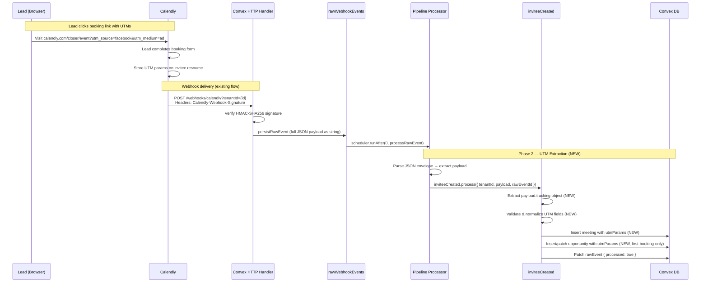

# UTM Tracking & Attribution — Design Specification

**Version:** 0.1 (MVP)
**Status:** Draft
**Scope:** Pipeline currently ignores the `tracking` object in Calendly webhook payloads → Pipeline extracts, validates, and stores UTM parameters on every meeting and opportunity, enabling deterministic CRM-generated booking attribution in future phases.
**Prerequisite:** None — this is a standalone, backend-only phase with no dependency on other v0.5 phases. The existing pipeline processor (`convex/pipeline/inviteeCreated.ts`) and webhook ingestion flow (`convex/webhooks/calendly.ts`) are stable and unchanged since the closer-tenant-admin design.

---

## Table of Contents

1. [Goals & Non-Goals](#1-goals--non-goals)
2. [Actors & Roles](#2-actors--roles)
3. [End-to-End Flow Overview](#3-end-to-end-flow-overview)
4. [Phase 1: Schema Widen — Add `utmParams` Fields](#4-phase-1-schema-widen--add-utmparams-fields)
5. [Phase 2: Pipeline Extraction — `inviteeCreated`](#5-phase-2-pipeline-extraction--inviteecreated)
6. [Phase 3: Pipeline Extraction — `inviteeCanceled` & `inviteeNoShow`](#6-phase-3-pipeline-extraction--inviteecanceled--inviteenoshow)
7. [Phase 4: Validation & Edge Case Hardening](#7-phase-4-validation--edge-case-hardening)
8. [Data Model](#8-data-model)
9. [Convex Function Architecture](#9-convex-function-architecture)
10. [Security Considerations](#10-security-considerations)
11. [Error Handling & Edge Cases](#11-error-handling--edge-cases)
12. [Open Questions](#12-open-questions)
13. [Dependencies](#13-dependencies)
14. [Applicable Skills](#14-applicable-skills)

---

## 1. Goals & Non-Goals

### Goals

- **Every new meeting stores the UTM parameters that Calendly captured from the booking link.** When a lead visits `calendly.com/closer/event?utm_source=facebook&utm_medium=ad`, the resulting meeting document includes the full `utmParams` object.
- **The first booking's UTMs become the opportunity's attribution.** Subsequent meetings on the same opportunity (follow-up rebookings) do not overwrite the opportunity-level UTMs — the original attribution is preserved.
- **UTM extraction is resilient to missing, partial, or malformed tracking data.** A `null` tracking object, missing individual fields, or unexpected types never crash the pipeline — they result in `undefined` on the meeting/opportunity.
- **Existing meetings and opportunities are unaffected.** The schema change is widen-only (new optional fields). No data migration or backfill is required.
- **The pipeline logs UTM extraction outcomes** at the same structured log level as existing field extraction, enabling debugging via Convex dashboard logs.

### Non-Goals (deferred)

- **UTM attribution display on the meeting detail page** (Phase 3 — Meeting Detail Enhancements). This phase is backend-only; no UI changes.
- **CRM-generated UTM parameters on follow-up/reschedule links** (Phase 4 — Follow-Up & Rescheduling Overhaul). The `utm_source=ptdom` encoding and pipeline intelligence that reads it back are Phase 4 scope.
- **Pipeline UTM intelligence / deterministic opportunity linking** (Phase 4). The priority-based routing (`utm_source=ptdom` → use `utm_campaign` as opportunityId) depends on follow-up link generation, which is Phase 4.
- **Heuristic auto-reschedule detection using UTM absence** (Phase 5 — No-Show Management). The fallback heuristic path (email match + recency + same closer) is Phase 5.
- **Retroactive UTM backfill for existing meetings via Calendly API** (not in v0.5 scope). Old meetings simply show "No attribution data."
- **`salesforce_uuid` extraction** (not in v0.5 scope). Calendly's tracking object includes a `salesforce_uuid` field that we do not use.

---

## 2. Actors & Roles

| Actor | Identity | Auth Method | Key Permissions |
|---|---|---|---|
| **Calendly Platform** | External system | Webhook HMAC-SHA256 signature (per-tenant signing key) | Sends `invitee.created`, `invitee.canceled`, `invitee_no_show.created/deleted` webhooks containing the `tracking` object |
| **Pipeline Processor** | Internal Convex action + mutations | Internal function references (`internalAction`, `internalMutation`) | Reads raw webhook events, extracts payload fields, creates/updates meetings and opportunities |
| **Lead (Browser)** | Unauthenticated visitor | None — interaction is with Calendly, not our system | Clicks a booking link with UTM params (e.g., from a Facebook ad or CRM-generated follow-up link) |
| **System Admin** | WorkOS AuthKit, member of system admin org | `requireSystemAdmin()` | Can inspect raw webhook events and meeting/opportunity documents via Convex dashboard for debugging |
| **Tenant Admin / Owner** | WorkOS AuthKit, member of tenant org | `requireTenantUser(ctx, ["tenant_master", "tenant_admin"])` | No direct interaction in this phase — UTM data becomes visible in Phase 3 (Meeting Detail Enhancements) |

> **Note:** This phase has no user-facing UI. The actors listed reflect who produces and consumes the data. The pipeline processor is the primary "actor" — it runs autonomously in response to webhook events.

---

## 3. End-to-End Flow Overview



---

## 4. Phase 1: Schema Widen — Add `utmParams` Fields

### 4.1 What & Why

Add optional `utmParams` fields to the `meetings` and `opportunities` tables. This is a **widen-only** migration — no existing documents are affected, no backfill is needed, and no data is removed or renamed. Existing records will have `utmParams` as `undefined`, which the future UI (Phase 3) interprets as "No attribution data."

> **Migration strategy:** Convex schemas are additive for optional fields. Adding `v.optional(...)` fields to an existing table definition does not require a migration step — existing documents simply don't have the field. The `convex-migration-helper` skill is **not needed** for this change. Deploy the schema update, and existing queries continue to work unchanged.
>
> **Why store on both meetings AND opportunities?** A meeting's UTMs capture "how the lead arrived at *this specific* booking." An opportunity's UTMs capture "how the lead originally entered the pipeline." These serve different analytics purposes. A lead might book organically (no UTMs), get a follow-up link (CRM UTMs), and rebook — the opportunity preserves the original organic attribution while the new meeting records the CRM attribution.

### 4.2 Schema Definition

The UTM params validator is shared between both tables to ensure consistency:

```typescript
// Path: convex/lib/utmParams.ts
import { v } from "convex/values";

/**
 * Convex validator for the Calendly tracking/UTM object.
 *
 * Mirrors Calendly's `tracking` object structure (minus `salesforce_uuid`).
 * All fields are optional — a booking with no UTMs produces `undefined`
 * at the parent level, not an empty object.
 */
export const utmParamsValidator = v.object({
  utm_source: v.optional(v.string()),
  utm_medium: v.optional(v.string()),
  utm_campaign: v.optional(v.string()),
  utm_term: v.optional(v.string()),
  utm_content: v.optional(v.string()),
});

/**
 * TypeScript type derived from the validator.
 * Use this for function signatures and helper return types.
 */
export type UtmParams = {
  utm_source?: string;
  utm_medium?: string;
  utm_campaign?: string;
  utm_term?: string;
  utm_content?: string;
};
```

> **Decision: `v.optional(v.object(...))` at the field level, not `v.object(...)` with all-optional inner fields.**
> We store `utmParams: undefined` (field absent) when there are no UTMs at all, rather than storing an empty `{}` object. This makes the "no attribution" check a simple truthiness test: `if (meeting.utmParams)`. It also avoids storing empty objects that consume document space for pre-UTM meetings.

> **Decision: Exclude `salesforce_uuid` from the validator.**
> Calendly's tracking object includes a `salesforce_uuid` field for Salesforce CRM integration. We intentionally omit it because (a) our tenants don't use Salesforce, (b) it would be perpetually `null`, and (c) adding it later is a non-breaking widen if a tenant ever needs it.

### 4.3 Schema Changes

```typescript
// Path: convex/schema.ts
// MODIFIED: Add utmParams to meetings and opportunities

import { utmParamsValidator } from "./lib/utmParams";

// In the meetings table definition:
meetings: defineTable({
  // ... existing fields ...

  // NEW: UTM attribution data extracted from Calendly's tracking object.
  // Populated from the invitee.created webhook payload.
  // undefined for meetings created before UTM tracking was enabled.
  utmParams: v.optional(utmParamsValidator),
})
  // ... existing indexes ...

// In the opportunities table definition:
opportunities: defineTable({
  // ... existing fields ...

  // NEW: UTM attribution from the first booking that created this opportunity.
  // Subsequent follow-up bookings on the same opportunity do NOT overwrite this.
  // undefined for opportunities created before UTM tracking was enabled.
  utmParams: v.optional(utmParamsValidator),
})
  // ... existing indexes ...
```

### 4.4 Deployment Steps

1. Add `convex/lib/utmParams.ts` with the shared validator and type.
2. Update `convex/schema.ts` — add `utmParams: v.optional(utmParamsValidator)` to both `meetings` and `opportunities` table definitions.
3. Run `npx convex dev` (or `npx convex deploy` for production) — the schema push succeeds with zero data migration because the fields are optional.
4. Verify in the Convex dashboard: existing meeting and opportunity documents are unchanged.

**No `convex-migration-helper` invocation needed. No widen-migrate-narrow cycle. Pure additive change.**

---

## 5. Phase 2: Pipeline Extraction — `inviteeCreated`

### 5.1 What & Why

This is the core change: modify the `inviteeCreated.process` mutation to extract the `tracking` object from the Calendly invitee payload and store it as `utmParams` on the meeting and opportunity.

The `tracking` object sits at `payload.tracking` in the invitee payload — the same level as `payload.email`, `payload.questions_and_answers`, etc. The pipeline already has access to the full `payload` object.

> **Runtime decision: Mutation, not action.**
> UTM extraction is a pure data transformation (read tracking object → validate → store). No external API calls, no Node.js builtins, no side effects beyond database writes. This belongs in the existing `internalMutation` handler, not a separate action. Splitting it out would introduce a race condition window between the mutation creating the meeting and the action updating its UTMs.

> **Why not store tracking data on `rawWebhookEvents` separately?**
> The raw event already stores the complete JSON payload as a string. Adding structured UTM fields to the raw event table would duplicate data. The meeting and opportunity records are the query targets for UTM data, so we extract directly into them.

### 5.2 UTM Extraction Helper

```typescript
// Path: convex/lib/utmParams.ts (extend the file from Phase 1)
import { v } from "convex/values";

// ... existing validator and type ...

/**
 * Extract and validate UTM parameters from a Calendly tracking object.
 *
 * Handles all edge cases from the Calendly API:
 * - tracking is missing (undefined/null) → returns undefined
 * - tracking is not an object → returns undefined
 * - individual fields are null (Calendly sends null, not undefined) → omitted
 * - individual fields are non-string → omitted
 * - all fields are null/missing → returns undefined (no empty objects)
 *
 * @param tracking - The raw `payload.tracking` value from the webhook
 * @returns UtmParams object if any UTM field has a value, undefined otherwise
 */
export function extractUtmParams(tracking: unknown): UtmParams | undefined {
  if (typeof tracking !== "object" || tracking === null || Array.isArray(tracking)) {
    return undefined;
  }

  const record = tracking as Record<string, unknown>;
  const result: UtmParams = {};
  let hasAnyValue = false;

  const fields = [
    "utm_source",
    "utm_medium",
    "utm_campaign",
    "utm_term",
    "utm_content",
  ] as const;

  for (const field of fields) {
    const value = record[field];
    // Calendly sends null for empty UTM fields — treat as absent
    if (typeof value === "string" && value.length > 0) {
      result[field] = value;
      hasAnyValue = true;
    }
  }

  // Return undefined instead of empty object when no UTMs are present
  return hasAnyValue ? result : undefined;
}
```

> **Decision: Return `undefined` for empty objects, not `{}`.**
> If a lead books without any UTMs, Calendly still sends `"tracking": { "utm_campaign": null, "utm_source": null, ... }`. Our extractor returns `undefined` in this case, meaning the `utmParams` field is simply absent on the document. This avoids storing semantically empty objects and keeps the "has attribution?" check simple: `if (meeting.utmParams)`.

### 5.3 Pipeline Modification — `inviteeCreated.ts`

The change is surgical — add UTM extraction after the existing field extraction block, then pass `utmParams` into the meeting insert and opportunity insert/patch.

```typescript
// Path: convex/pipeline/inviteeCreated.ts
// MODIFIED: Add UTM extraction and storage

import { extractUtmParams } from "../lib/utmParams";

// Inside the process handler, after line 174 (after extractQuestionsAndAnswers):

    // ── NEW: Extract UTM tracking parameters ──
    const utmParams = extractUtmParams(payload.tracking);
    console.log(
      `[Pipeline:invitee.created] UTM extraction | ` +
      `hasUtm=${!!utmParams} ` +
      `source=${utmParams?.utm_source ?? "none"} ` +
      `medium=${utmParams?.utm_medium ?? "none"} ` +
      `campaign=${utmParams?.utm_campaign ?? "none"}`
    );
```

**Meeting creation** — add `utmParams` to the insert call:

```typescript
// Path: convex/pipeline/inviteeCreated.ts
// Inside the process handler, at the meeting insert (~line 299):

    const meetingId = await ctx.db.insert("meetings", {
      tenantId,
      opportunityId,
      calendlyEventUri,
      calendlyInviteeUri,
      zoomJoinUrl,
      scheduledAt,
      durationMinutes,
      status: "scheduled",
      notes: meetingNotes,
      leadName: lead.fullName ?? lead.email,
      createdAt: now,
      utmParams,  // NEW: UTM attribution from Calendly tracking object
    });
```

**New opportunity creation** — add `utmParams` to the insert:

```typescript
// Path: convex/pipeline/inviteeCreated.ts
// Inside the process handler, at the new opportunity insert (~line 275):

      opportunityId = await ctx.db.insert("opportunities", {
        tenantId,
        leadId: lead._id,
        assignedCloserId,
        hostCalendlyUserUri: hostUserUri,
        hostCalendlyEmail,
        hostCalendlyName,
        eventTypeConfigId,
        status: "scheduled",
        calendlyEventUri,
        createdAt: now,
        updatedAt: now,
        utmParams,  // NEW: First booking's attribution
      });
```

**Follow-up opportunity reuse** — do NOT overwrite existing UTMs:

```typescript
// Path: convex/pipeline/inviteeCreated.ts
// Inside the process handler, at the follow-up opportunity patch (~line 252):

      // When reusing a follow-up opportunity, preserve the original UTMs.
      // The new meeting gets its own UTMs, but the opportunity keeps its
      // original attribution (the first booking that created it).
      await ctx.db.patch(opportunityId, {
        status: "scheduled",
        calendlyEventUri,
        assignedCloserId,
        hostCalendlyUserUri: hostUserUri,
        hostCalendlyEmail,
        hostCalendlyName,
        eventTypeConfigId:
          eventTypeConfigId ?? existingFollowUp.eventTypeConfigId ?? undefined,
        updatedAt: now,
        // NOTE: utmParams intentionally NOT included here.
        // The opportunity preserves attribution from its original creation.
        // The new meeting stores its own UTMs independently.
      });
```

> **Decision: Do not overwrite opportunity UTMs on follow-up rebooking.**
> When a lead books a follow-up (opportunity transitions `follow_up_scheduled` → `scheduled`), the *new meeting* gets its own `utmParams` (which will likely be CRM-generated UTMs from Phase 4). The *opportunity* keeps whatever UTMs it was created with — this preserves the original acquisition attribution. If the opportunity was created from an organic Facebook ad click, that attribution remains even after 3 follow-up rebookings.

### 5.4 Full Modified `inviteeCreated.ts` — Diff Summary

| Line Range (approx.) | Change | Description |
|---|---|---|
| Imports | ADD | `import { extractUtmParams } from "../lib/utmParams";` |
| After line 174 | ADD | UTM extraction + structured log (3 lines) |
| Line ~275 (new opp insert) | ADD | `utmParams,` field in insert object |
| Line ~252 (follow-up patch) | NO CHANGE | Comment documenting intentional omission |
| Line ~299 (meeting insert) | ADD | `utmParams,` field in insert object |

**Total lines changed: ~8 lines of production code + 1 import + 1 log statement.**

---

## 6. Phase 3: Pipeline Extraction — `inviteeCanceled` & `inviteeNoShow`

### 6.1 What & Why

The `tracking` object is present on all invitee-level webhook payloads, not just `invitee.created`. The `invitee.canceled` and `invitee_no_show.created` events also carry tracking data. However, the semantics differ:

- **`invitee.canceled`**: The tracking data is the same as the original booking (Calendly preserves it). We do NOT need to re-extract or update the meeting's UTMs — they were already stored when the meeting was created via `invitee.created`.
- **`invitee_no_show.created`**: Same — the meeting was already created and has its UTMs.

> **Decision: No UTM extraction changes in `inviteeCanceled.ts` or `inviteeNoShow.ts`.**
> These handlers update meeting/opportunity *status* — they don't create new records. The UTMs were captured at creation time. Re-extracting and overwriting would be a no-op at best and a potential data corruption vector at worst (if Calendly ever strips tracking on cancellation events).

### 6.2 Future-Proofing: UTM Logging on Cancel/No-Show

While we don't store UTMs again, we add a debug log in each handler so that developers can verify the tracking data is consistent:

```typescript
// Path: convex/pipeline/inviteeCanceled.ts
// Inside the process handler, after payload validation:

    // Log tracking presence for debugging (UTMs already stored at creation time)
    const hasTracking = isRecord(payload.tracking);
    console.log(
      `[Pipeline:invitee.canceled] UTM check | hasTracking=${hasTracking}`
    );
```

```typescript
// Path: convex/pipeline/inviteeNoShow.ts
// Inside the process handler, after payload validation:

    // Log tracking presence for debugging (UTMs already stored at creation time)
    const hasTracking = isRecord(payload.tracking);
    console.log(
      `[Pipeline:invitee_no_show] UTM check | hasTracking=${hasTracking}`
    );
```

---

## 7. Phase 4: Validation & Edge Case Hardening

### 7.1 What & Why

Ensure the UTM extraction is robust against every payload variant Calendly might send. This isn't a separate deployment — it's built into the `extractUtmParams` helper from Phase 2. This section documents the test scenarios.

### 7.2 Input Validation Matrix

| Payload State | `payload.tracking` Value | Expected `utmParams` | Behavior |
|---|---|---|---|
| Standard booking with UTMs | `{ "utm_source": "facebook", "utm_medium": "ad", "utm_campaign": "spring", "utm_term": null, "utm_content": null }` | `{ utm_source: "facebook", utm_medium: "ad", utm_campaign: "spring" }` | Store non-null fields only |
| Full UTMs | `{ "utm_source": "ptdom", "utm_medium": "follow_up", "utm_campaign": "k57abc", "utm_content": "k57xyz", "utm_term": "k57closer" }` | All 5 fields populated | Store all fields |
| No UTMs (all null) | `{ "utm_campaign": null, "utm_source": null, "utm_medium": null, "utm_content": null, "utm_term": null }` | `undefined` | No field stored on document |
| Missing tracking object | `undefined` (field absent) | `undefined` | No field stored on document |
| Tracking is `null` | `null` | `undefined` | Defensive — shouldn't happen per Calendly docs |
| Tracking is non-object | `"invalid"` or `42` | `undefined` | Defensive — shouldn't happen per Calendly docs |
| Tracking is array | `[...]` | `undefined` | Defensive check via `Array.isArray()` |
| Empty string UTM field | `{ "utm_source": "" }` | `undefined` | Empty strings treated as absent |
| Extra fields (salesforce_uuid) | `{ "utm_source": "fb", "salesforce_uuid": "abc" }` | `{ utm_source: "fb" }` | Extra fields silently ignored |
| Non-string UTM values | `{ "utm_source": 42 }` | `undefined` | Type-checked — only strings pass |

### 7.3 Testing Strategy

Since this is a backend-only change, testing is done via:

1. **Convex Dashboard inspection**: Trigger real Calendly bookings (or use Calendly's test event feature) with UTM-tagged URLs and inspect the resulting documents.
2. **Convex function logs**: Verify structured logs show correct UTM extraction.
3. **Manual verification script** (optional): A one-off `internalQuery` that scans recent meetings and reports UTM presence.

```typescript
// Path: convex/pipeline/debugUtm.ts (development-only, do not deploy to production)
import { internalQuery } from "../_generated/server";
import { v } from "convex/values";

/**
 * Debug query: list recent meetings and their UTM status.
 * Use from Convex dashboard to verify UTM extraction is working.
 */
export const recentMeetingUtms = internalQuery({
  args: { tenantId: v.id("tenants"), limit: v.optional(v.number()) },
  handler: async (ctx, { tenantId, limit }) => {
    const meetings = await ctx.db
      .query("meetings")
      .withIndex("by_tenantId_and_scheduledAt", (q) =>
        q.eq("tenantId", tenantId),
      )
      .order("desc")
      .take(limit ?? 10);

    return meetings.map((m) => ({
      _id: m._id,
      scheduledAt: new Date(m.scheduledAt).toISOString(),
      leadName: m.leadName,
      hasUtm: !!m.utmParams,
      utmParams: m.utmParams ?? null,
    }));
  },
});
```

---

## 8. Data Model

### 8.1 Shared Validator — `utmParams` (NEW)

```typescript
// Path: convex/lib/utmParams.ts

import { v } from "convex/values";

export const utmParamsValidator = v.object({
  utm_source: v.optional(v.string()),   // e.g., "facebook", "twitter", "ptdom" (CRM-generated)
  utm_medium: v.optional(v.string()),   // e.g., "ad", "social", "follow_up", "noshow_resched"
  utm_campaign: v.optional(v.string()), // e.g., "spring_sale" or Convex opportunityId (CRM-generated)
  utm_term: v.optional(v.string()),     // e.g., "productivity" or Convex closerId (CRM-generated)
  utm_content: v.optional(v.string()),  // e.g., "video_ad" or Convex followUpId (CRM-generated)
});

export type UtmParams = {
  utm_source?: string;
  utm_medium?: string;
  utm_campaign?: string;
  utm_term?: string;
  utm_content?: string;
};

export function extractUtmParams(tracking: unknown): UtmParams | undefined {
  if (typeof tracking !== "object" || tracking === null || Array.isArray(tracking)) {
    return undefined;
  }

  const record = tracking as Record<string, unknown>;
  const result: UtmParams = {};
  let hasAnyValue = false;

  const fields = [
    "utm_source",
    "utm_medium",
    "utm_campaign",
    "utm_term",
    "utm_content",
  ] as const;

  for (const field of fields) {
    const value = record[field];
    if (typeof value === "string" && value.length > 0) {
      result[field] = value;
      hasAnyValue = true;
    }
  }

  return hasAnyValue ? result : undefined;
}
```

### 8.2 Modified: `meetings` Table

```typescript
// Path: convex/schema.ts

meetings: defineTable({
  // ... existing fields ...
  tenantId: v.id("tenants"),
  opportunityId: v.id("opportunities"),
  calendlyEventUri: v.string(),
  calendlyInviteeUri: v.string(),
  zoomJoinUrl: v.optional(v.string()),
  scheduledAt: v.number(),
  durationMinutes: v.number(),
  status: v.union(
    v.literal("scheduled"),
    v.literal("in_progress"),
    v.literal("completed"),
    v.literal("canceled"),
    v.literal("no_show"),
  ),
  notes: v.optional(v.string()),
  leadName: v.optional(v.string()),
  createdAt: v.number(),

  // NEW: UTM attribution data from Calendly's tracking object.
  // Populated from invitee.created webhook. undefined for pre-UTM meetings.
  utmParams: v.optional(utmParamsValidator),
})
  .index("by_opportunityId", ["opportunityId"])
  .index("by_tenantId_and_scheduledAt", ["tenantId", "scheduledAt"])
  .index("by_tenantId_and_calendlyEventUri", ["tenantId", "calendlyEventUri"]),
```

### 8.3 Modified: `opportunities` Table

```typescript
// Path: convex/schema.ts

opportunities: defineTable({
  // ... existing fields ...
  tenantId: v.id("tenants"),
  leadId: v.id("leads"),
  assignedCloserId: v.optional(v.id("users")),
  hostCalendlyUserUri: v.optional(v.string()),
  hostCalendlyEmail: v.optional(v.string()),
  hostCalendlyName: v.optional(v.string()),
  eventTypeConfigId: v.optional(v.id("eventTypeConfigs")),
  status: v.union(
    v.literal("scheduled"),
    v.literal("in_progress"),
    v.literal("payment_received"),
    v.literal("follow_up_scheduled"),
    v.literal("lost"),
    v.literal("canceled"),
    v.literal("no_show"),
  ),
  calendlyEventUri: v.optional(v.string()),
  latestMeetingId: v.optional(v.id("meetings")),
  latestMeetingAt: v.optional(v.number()),
  nextMeetingId: v.optional(v.id("meetings")),
  nextMeetingAt: v.optional(v.number()),
  cancellationReason: v.optional(v.string()),
  canceledBy: v.optional(v.string()),
  lostReason: v.optional(v.string()),
  createdAt: v.number(),
  updatedAt: v.number(),

  // NEW: UTM attribution from the FIRST booking that created this opportunity.
  // Subsequent follow-up bookings do NOT overwrite this field.
  // undefined for pre-UTM opportunities.
  utmParams: v.optional(utmParamsValidator),
})
  .index("by_tenantId", ["tenantId"])
  .index("by_tenantId_and_leadId", ["tenantId", "leadId"])
  .index("by_tenantId_and_assignedCloserId", ["tenantId", "assignedCloserId"])
  .index("by_tenantId_and_status", ["tenantId", "status"]),
```

### 8.4 No New Indexes Required

UTM data is read as part of existing document fetches (meeting detail, opportunity detail). There is no query pattern that filters or sorts by UTM fields — attribution is always displayed alongside a specific meeting or opportunity. Therefore, no UTM-based indexes are needed.

> **Future consideration (Phase 3+):** If an "attribution report" page is added that filters opportunities by `utm_source` or `utm_campaign`, a `by_tenantId_and_utmSource` index would be needed. But for v0.5, UTMs are display-only on detail views.

---

## 9. Convex Function Architecture

```
convex/
├── lib/
│   └── utmParams.ts                    # NEW: UTM validator, type, and extraction helper — Phase 2
├── pipeline/
│   ├── processor.ts                    # UNCHANGED: Dispatches events to handlers
│   ├── inviteeCreated.ts              # MODIFIED: Extract tracking → utmParams on meeting + opportunity — Phase 2
│   ├── inviteeCanceled.ts             # MODIFIED: Add UTM debug log (no data change) — Phase 2
│   ├── inviteeNoShow.ts              # MODIFIED: Add UTM debug log (no data change) — Phase 2
│   ├── debugUtm.ts                    # NEW: Development-only debug query for UTM verification — Phase 2
│   ├── queries.ts                     # UNCHANGED
│   └── mutations.ts                   # UNCHANGED
├── webhooks/
│   ├── calendly.ts                    # UNCHANGED: Raw payload already preserved in full
│   ├── calendlyMutations.ts          # UNCHANGED
│   └── calendlyQueries.ts            # UNCHANGED
├── schema.ts                          # MODIFIED: Add utmParams to meetings + opportunities — Phase 2
└── ... (all other files unchanged)
```

---

## 10. Security Considerations

### 10.1 Credential Security

- **No new credentials or secrets are introduced.** UTM extraction operates on data already inside the Convex database (stored by the existing webhook handler).
- **No external API calls.** The extraction is a pure in-process transformation within a Convex mutation. No tokens, no network requests.

### 10.2 Multi-Tenant Isolation

- UTM params are stored on meeting and opportunity documents that already carry `tenantId`. The existing `requireTenantUser()` guard on all query endpoints ensures UTM data is tenant-scoped.
- The extraction runs inside `internalMutation` handlers that receive `tenantId` from the pipeline dispatcher — never from client input.
- **No cross-tenant data leakage vector.** A meeting's UTM params are part of its document; they inherit the document's access controls.

### 10.3 Role-Based Data Access

| Data | tenant_master | tenant_admin | closer | System Admin |
|---|---|---|---|---|
| Meeting `utmParams` | Full (via meeting detail) | Full (via meeting detail) | Own only (via assigned meetings) | Full (via Convex dashboard) |
| Opportunity `utmParams` | Full (via pipeline view) | Full (via pipeline view) | Own only (via assigned opps) | Full (via Convex dashboard) |

> **No new permissions required.** UTM data rides on existing meeting and opportunity documents. The same `meeting:view-own`, `meeting:view-all`, `pipeline:view-all`, `pipeline:view-own` permissions that gate access to meetings and opportunities also gate UTM visibility. Phase 3 (UI) will read `utmParams` from the same `getMeetingDetail` query that already enforces role checks.

### 10.4 Webhook Security

- **No changes to webhook security.** The existing HMAC-SHA256 signature verification with per-tenant signing keys, 180-second replay protection, and `Content-Type` validation remain unchanged.
- UTM extraction happens *after* the payload has been verified, stored, and dispatched through the secure pipeline.

### 10.5 UTM Data Trust & Injection

- **UTM values are user-controlled input.** A malicious actor could set `?utm_source=<script>alert(1)</script>` on a booking URL. Calendly stores and returns this verbatim.
- **Mitigation for this phase:** We store UTM values as plain strings in the database. No interpretation, no HTML rendering, no eval. The values are inert data.
- **Mitigation for Phase 3 (UI):** When the attribution card displays UTM values, React's default JSX escaping prevents XSS. Values must be rendered as `{meeting.utmParams.utm_source}` (text node), never as `dangerouslySetInnerHTML`. This is standard React behavior — no special handling needed.
- **Length limits:** Calendly truncates UTM values at 255 characters. Our `v.string()` validator accepts any length, but Calendly's upstream limit provides a natural bound. We do not add our own length validation to avoid rejecting legitimate Calendly data.

### 10.6 Rate Limit Awareness

| Limit | Value | Our Usage |
|---|---|---|
| Calendly webhook delivery | 10,000 events/day per subscription | UTM extraction adds ~0ms to an existing pipeline step — no impact on rate limits |
| Convex transaction size | 8 MB document, 16,384 documents per transaction | UTM object adds ~100-300 bytes per meeting/opportunity — negligible |
| Convex mutation duration | 60 seconds | UTM extraction adds <1ms of CPU time — negligible |

---

## 11. Error Handling & Edge Cases

### 11.1 Missing `tracking` Object

**Scenario:** Calendly sends an `invitee.created` event without a `tracking` property on the payload.

**Detection:** `extractUtmParams(payload.tracking)` receives `undefined` → returns `undefined`.

**Recovery:** Meeting and opportunity are created normally without `utmParams`. No error, no retry, no alert.

**User-facing behavior:** In Phase 3, the attribution card shows "Direct booking (no attribution data)."

### 11.2 Malformed `tracking` Object

**Scenario:** Calendly sends a `tracking` value that is not an object (e.g., `null`, a string, a number).

**Detection:** `extractUtmParams` checks `typeof tracking !== "object"`, `tracking === null`, `Array.isArray(tracking)` — all return `undefined`.

**Recovery:** Same as 11.1 — meeting created without UTMs.

**User-facing behavior:** Same as 11.1.

### 11.3 Partially Populated UTMs

**Scenario:** A booking link has `?utm_source=facebook` but no other UTM params. Calendly sends `{ "utm_source": "facebook", "utm_medium": null, "utm_campaign": null, "utm_term": null, "utm_content": null }`.

**Detection:** `extractUtmParams` iterates all 5 fields. Only `utm_source` passes the `typeof value === "string" && value.length > 0` check.

**Recovery:** `utmParams` is stored as `{ utm_source: "facebook" }` — only the populated field is present.

**User-facing behavior:** Attribution card shows "Source: Facebook" with other fields blank or hidden.

### 11.4 Extremely Long UTM Values

**Scenario:** A UTM parameter contains an unusually long string (e.g., 255 characters, which is Calendly's max).

**Detection:** No specific detection — `v.string()` accepts any length.

**Recovery:** Stored as-is. Calendly's upstream 255-char limit provides the practical bound.

**User-facing behavior:** The Phase 3 UI should truncate display with `text-ellipsis` for long values.

### 11.5 Duplicate Meeting (Idempotency)

**Scenario:** The same `invitee.created` webhook fires twice (Calendly retry or duplicate delivery). The first processing stores UTMs. The second processing hits the existing meeting check.

**Detection:** Existing idempotency guard in `inviteeCreated.ts` (lines 149-161) checks for a meeting with the same `calendlyEventUri`. If found, the event is marked processed and returns early.

**Recovery:** No action — UTMs from the first processing are already stored. The duplicate is silently skipped.

**User-facing behavior:** None — transparent to all users.

### 11.6 Schema Push Failure

**Scenario:** The `convex/schema.ts` update fails to deploy because of a validation error.

**Detection:** `npx convex deploy` or `npx convex dev` reports an error.

**Recovery:** The schema change is purely additive (new optional fields). This cannot fail unless the validator import path is wrong. Fix the import and redeploy.

**User-facing behavior:** None — the change isn't live yet.

### 11.7 Pipeline Processing Failure After UTM Extraction

**Scenario:** The `inviteeCreated.process` mutation succeeds in extracting UTMs but fails on a later step (e.g., closer resolution throws, opportunity insert fails).

**Detection:** The mutation throws an error. Because Convex mutations are transactions, the entire mutation rolls back — including the meeting insert with UTMs.

**Recovery:** The raw event remains `processed: false`. The pipeline dispatcher (`processRawEvent`) re-throws the error, and the event will be retried. On retry, UTMs are re-extracted from the same payload — producing the same result.

**User-facing behavior:** Temporary delay in meeting appearing. Pipeline logs show the error. Existing retry behavior handles recovery.

---

## 12. Open Questions

| # | Question | Current Thinking |
|---|---|---|
| 1 | Should we index `utmParams.utm_source` for future attribution reporting? | **No — defer to Phase 3+.** No query currently filters by UTM fields. If an attribution report is added, we'll add `by_tenantId_and_utmSource` index then. Adding unused indexes wastes write throughput. |
| 2 | Should the `debugUtm.ts` query be deployed to production? | **No — development only.** Use it during verification, then either delete or gate behind a feature flag. Internal queries are callable from the dashboard but shouldn't pollute the production function list permanently. |
| 3 | Should we capture the `salesforce_uuid` from Calendly's tracking object? | **No — defer indefinitely.** No tenant uses Salesforce. The field is always `null`. If needed later, adding it is a non-breaking widen. |
| 4 | What happens if Calendly changes the tracking object schema? | **Graceful degradation.** `extractUtmParams` only reads known fields and ignores extras. New Calendly fields are silently dropped. Removed Calendly fields result in `undefined`. No breakage. |
| ~~5~~ | ~~Should UTMs be stored as a top-level field or nested under a `tracking` object?~~ | **Resolved.** Top-level `utmParams` field. Matches the v0.5 spec naming. Clean separation from any future `tracking` metadata (e.g., referrer URL, landing page). |
| ~~6~~ | ~~Should follow-up opportunity patches overwrite UTMs?~~ | **Resolved.** No — preserve original attribution. The new meeting gets its own UTMs. Documented in section 5.3. |

---

## 13. Dependencies

### New Packages

*None.* This phase requires no new npm packages. UTM extraction uses only built-in JavaScript string/object operations.

### Already Installed (no action needed)

| Package | Used for |
|---|---|
| `convex` | Backend framework — schema definition, validators, mutations, queries |

### Environment Variables

*None.* This phase introduces no new environment variables. The existing Convex deployment environment and Calendly webhook signing keys are sufficient.

### External Service Configuration

*None.* No changes to Calendly webhook subscriptions, OAuth scopes, or API keys. The `tracking` object is already included in the existing `invitee.created` webhook payload — we just need to read it.

---

## 14. Applicable Skills

| Skill | When to Invoke | Phase |
|---|---|---|
| `convex-migration-helper` | **Not needed** for this phase (widen-only, optional fields). Reference for future phases that require backfill or narrowing. | N/A |
| `convex-performance-audit` | If UTM extraction adds measurable latency to pipeline processing (unlikely — pure in-memory transform). Run `npx convex insights` after deployment to verify function durations haven't regressed. | Post-deployment |
| `expect` | **Not needed** for this phase (no UI changes). Will be needed in Phase 3 when the attribution card is built. | N/A |
| `simplify` | After implementation — review the modified `inviteeCreated.ts` for code quality, DRY with the new helper, and consistency with existing extraction patterns. | Post-implementation |
| `next-best-practices` | **Not needed** for this phase (no frontend changes). | N/A |

---

## Appendix A: Calendly `tracking` Object Reference

The Calendly webhook payload for invitee events includes a `tracking` object at `payload.tracking`:

```json
{
  "event": "invitee.created",
  "created_at": "2026-04-08T10:00:00.000000Z",
  "created_by": "https://api.calendly.com/users/AAAA",
  "payload": {
    "uri": "https://api.calendly.com/scheduled_events/BBBB/invitees/CCCC",
    "email": "lead@example.com",
    "name": "Jane Doe",
    "text_reminder_number": "+17789559253",
    "questions_and_answers": [...],
    "tracking": {
      "utm_campaign": "spring_sale",
      "utm_source": "facebook",
      "utm_medium": "ad",
      "utm_content": "video_ads",
      "utm_term": "productivity_tools",
      "salesforce_uuid": null
    },
    "scheduled_event": {
      "uri": "https://api.calendly.com/scheduled_events/BBBB",
      "event_type": "https://api.calendly.com/event_types/DDDD",
      "start_time": "2026-04-10T14:00:00.000000Z",
      "end_time": "2026-04-10T14:30:00.000000Z",
      "event_memberships": [...],
      "location": { "join_url": "https://zoom.us/j/123" }
    }
  }
}
```

**Source:** `.docs/calendly/api-refrerence/webhooks/webhook-events-samples/webhook-payload.md`

**Key facts:**
- The `tracking` object is a property of the invitee `payload`, **not** the `scheduled_event`.
- All UTM fields can be `null` (not `undefined` — Calendly uses JSON null).
- `salesforce_uuid` is always present but irrelevant to our CRM.
- The same structure appears on `invitee.canceled` and `invitee_no_show.created` payloads.

## Appendix B: Implementation Checklist

- [ ] Create `convex/lib/utmParams.ts` with validator, type, and `extractUtmParams()` helper
- [ ] Update `convex/schema.ts` — add `utmParams: v.optional(utmParamsValidator)` to `meetings` table
- [ ] Update `convex/schema.ts` — add `utmParams: v.optional(utmParamsValidator)` to `opportunities` table
- [ ] Modify `convex/pipeline/inviteeCreated.ts` — import `extractUtmParams`, extract tracking, pass to meeting insert and new-opportunity insert
- [ ] Verify follow-up opportunity patch does NOT include `utmParams` (preserve original attribution)
- [ ] Add UTM debug log to `convex/pipeline/inviteeCanceled.ts`
- [ ] Add UTM debug log to `convex/pipeline/inviteeNoShow.ts`
- [ ] (Optional) Create `convex/pipeline/debugUtm.ts` for development verification
- [ ] Deploy schema changes (`npx convex deploy` or `npx convex dev`)
- [ ] Verify existing meetings/opportunities are unaffected in Convex dashboard
- [ ] Trigger a test booking with UTM params → verify `utmParams` appears on meeting and opportunity documents
- [ ] Trigger a test booking without UTM params → verify `utmParams` is absent (not empty object)
- [ ] Trigger a follow-up rebooking → verify opportunity's `utmParams` is unchanged while new meeting has its own UTMs
- [ ] Check pipeline logs for structured UTM extraction messages

---

*This document is a living specification. Sections will be updated as implementation progresses and open questions are resolved.*
