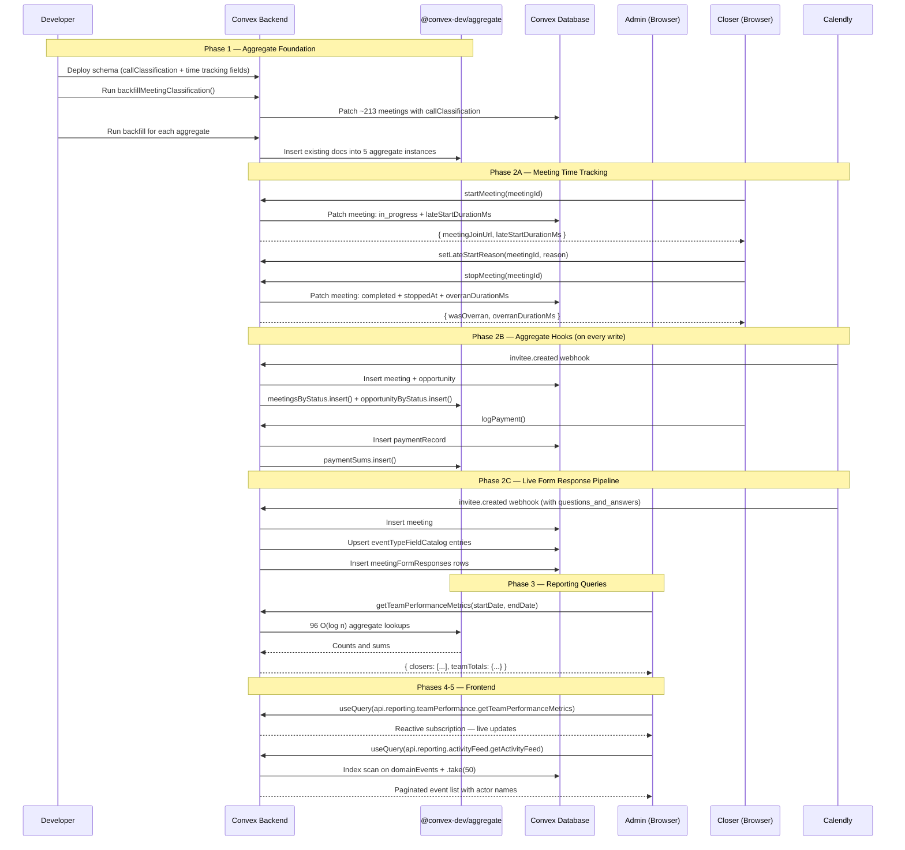

# Admin Reporting & Analytics — Design Specification

**Version:** 0.6 (MVP)
**Status:** Draft
**Date:** 2026-04-12
**Scope:** No reporting capability (manual Excel workflow) → Real-time, reactive admin dashboards with 42 KPIs across 5 report pages, powered by write-time denormalized aggregation via `@convex-dev/aggregate`, the v0.5b `domainEvents` audit trail, and `meetingFormResponses` booking form data.
**Prerequisite:** v0.5b database audit fully deployed — all schema changes, domain event emission sites (25), `meetingFormResponses` backfill, and `eventTypeFieldCatalog` population are assumed complete. The live pipeline does NOT yet insert into `meetingFormResponses` during new bookings — this is fixed in Phase 2C.

---

## Table of Contents

1. [Goals & Non-Goals](#1-goals--non-goals)
2. [Actors & Roles](#2-actors--roles)
3. [End-to-End Flow Overview](#3-end-to-end-flow-overview)
4. [Phase 1: Aggregate Foundation](#4-phase-1-aggregate-foundation)
5. [Phase 2: Meeting Time Tracking + Mutation Integration + Form Response Pipeline](#5-phase-2-meeting-time-tracking--mutation-integration--form-response-pipeline)
6. [Phase 3: Core Reporting Queries](#6-phase-3-core-reporting-queries)
7. [Phase 4: Frontend — Report Shell & Navigation](#7-phase-4-frontend--report-shell--navigation)
8. [Phase 5: Frontend — Report Pages](#8-phase-5-frontend--report-pages)
9. [Phase 6: QA & Polish](#9-phase-6-qa--polish)
10. [Data Model](#10-data-model)
11. [Convex Function Architecture](#11-convex-function-architecture)
12. [Routing & Authorization](#12-routing--authorization)
13. [Security Considerations](#13-security-considerations)
14. [Error Handling & Edge Cases](#14-error-handling--edge-cases)
15. [Open Questions](#15-open-questions)
16. [Dependencies](#16-dependencies)
17. [Applicable Skills](#17-applicable-skills)

---

## 1. Goals & Non-Goals

### Goals

1. **Replace the manual Excel report** — every KPI in the PT DOM workbook (`SALESTEAMREPORT2026-PTDOM.xlsx`) must be computable from CRM data. The workbook has 14 sheets, ~2,360 rows, and per-closer KPI tables split by "New Calls" vs "Follow Up Calls."
2. **Per-closer performance** — booked calls, cancellations, no-shows, show-up rate, sales, cash collected, close rate, average deal size — all filterable by date range.
3. **New vs Follow-Up split** — separate metrics for first-time meetings vs return bookings, matching the Excel's two-table layout. Classification is stored at meeting creation time.
4. **Flexible time filtering** — day, week, month, custom date range. Quick-pick presets for common ranges (This Month, Last Month, Last 90 Days).
5. **Team totals** — aggregated row across all closers on every report.
6. **Real-time reactive dashboards** — reports update live as data flows in via `useQuery` subscriptions to O(log n) aggregate lookups. No "click to generate" UX.
7. **42 KPIs across 5 tiers** — direct Excel replacements (Tier 1), enhanced analytics (Tier 2), meeting time tracking (Tier 3), lead & conversion + form insights (Tier 4). See KPI Catalog in the feature plan (Section 9).
8. **Admin-only access** — `tenant_master` and `tenant_admin` roles only, enforced server-side via `requireTenantUser()` and client-side via `requireRole()` in RSC layout.
9. **Activity visibility** — admin-facing audit trail powered by `domainEvents` (v0.5b). Shows who did what and when — the CRM's "git log."
10. **Booking form insights** — answer distribution analytics from Calendly form responses, powered by `meetingFormResponses` + `eventTypeFieldCatalog` (v0.5b).
11. **Meeting time tracking** — new "End Meeting" action (`stopMeeting`) records actual meeting duration, overrun detection, and late start tracking.

### Non-Goals (deferred)

- Closer-facing reporting — separate dashboards for individual closers (v0.7)
- Export to CSV/PDF — downloadable report artifacts (v0.7+)
- Scheduled email reports — automated report delivery (v0.8+)
- Comparison views — month-over-month overlays, period comparisons (v0.7)
- Historical data import from the Excel workbook (out of scope)
- Tenant timezone support — all timestamps are UTC epoch ms (v0.7)
- Revenue split by call classification — requires a second payment aggregate or supplementary query (Tier 5)
- Answer-to-conversion correlation — requires joining form responses through to customers; small sample size at current scale (Tier 5)

---

## 2. Actors & Roles

| Actor                | Identity                       | Auth Method                                     | Key Permissions (this feature)                                                           |
| -------------------- | ------------------------------ | ----------------------------------------------- | ---------------------------------------------------------------------------------------- |
| **Tenant Master**    | CRM owner of the tenant org    | WorkOS AuthKit, member of tenant org, role=owner | View all 5 report pages; view all closers' data; access activity feed                    |
| **Tenant Admin**     | CRM admin of the tenant org    | WorkOS AuthKit, member of tenant org, role=admin | View all 5 report pages; view all closers' data; access activity feed                    |
| **Closer**           | Sales rep assigned to meetings | WorkOS AuthKit, member of tenant org, role=closer | No access to report pages. Uses "End Meeting" + "Late Start Reason" (new mutations only) |
| **System (Pipeline)** | Calendly webhook processor     | Internal (no user auth)                         | Inserts meetings + sets `callClassification`; inserts `meetingFormResponses`              |

### CRM Role <-> WorkOS RBAC Mapping

| CRM `users.role`  | WorkOS RBAC Slug | Report Access |
| ------------------ | ---------------- | ------------- |
| `tenant_master`   | `owner`          | Full          |
| `tenant_admin`    | `tenant-admin`   | Full          |
| `closer`          | `closer`         | None          |

### Permission Mapping

Report access maps to the existing `pipeline:view-all` permission, which is granted to `tenant_master` and `tenant_admin` only. No new permissions are required.

---

## 3. End-to-End Flow Overview



---

## 4. Phase 1: Aggregate Foundation

**Duration:** 2-3 days
**Goal:** Install `@convex-dev/aggregate`, define 5 aggregate instances, update schema, backfill existing data.
**Risk:** Low — additive changes only; backfill is small dataset (~700 total records).

### 4.1 Install and Register Aggregate Component

Install the package and register 5 named instances in the Convex app configuration. Each instance maintains an independent O(log n) data structure.

> **Dependency:** `@convex-dev/aggregate` v0.2.1. This is a Convex component — it creates internal tables managed by the component runtime. No custom delta/sync logic needed.

```bash
pnpm add @convex-dev/aggregate
```

```typescript
// Path: convex/convex.config.ts
import workOSAuthKit from "@convex-dev/workos-authkit/convex.config";
import aggregate from "@convex-dev/aggregate/convex.config.js";
import { defineApp } from "convex/server";

const app = defineApp();
app.use(workOSAuthKit);

// Reporting aggregates — 5 instances for O(log n) counts and sums
app.use(aggregate, { name: "meetingsByStatus" });
app.use(aggregate, { name: "paymentSums" });
app.use(aggregate, { name: "opportunityByStatus" });
app.use(aggregate, { name: "leadTimeline" });
app.use(aggregate, { name: "customerConversions" });

export default app;
```

> **Why 5 separate instances instead of 1:** Each aggregate's sort key is tailored to its query pattern. `meetingsByStatus` uses `[closerId, classification, status, scheduledAt]` — optimal for "count meetings by closer + classification + status in date range." Combining all data into a single aggregate would require a generic sort key that can't be prefix-queried efficiently for each report's specific access pattern.

### 4.2 Schema Additions — `meetings` Table

Add `callClassification` (new/follow-up split) and time-tracking fields. All are `v.optional` because existing meetings won't have them until backfilled.

```typescript
// Path: convex/schema.ts — inside meetings defineTable
// ... existing fields ...

// === v0.6: Call Classification ===
// Set at meeting creation time by the pipeline. "new" = first meeting on this opportunity.
// "follow_up" = subsequent booking on an existing opportunity.
callClassification: v.optional(
  v.union(
    v.literal("new"),
    v.literal("follow_up"),
  ),
),

// === v0.6: Meeting Time Tracking ===
// When the closer clicked "End Meeting". Distinct from completedAt (which may be
// set by other flows). Used to compute actual meeting duration and overrun.
stoppedAt: v.optional(v.number()),

// Late start tracking — computed and stored by startMeeting mutation.
// If startedAt > scheduledAt, the meeting was started late.
lateStartDurationMs: v.optional(v.number()),   // ms late (0 if on time or early)
lateStartReason: v.optional(v.string()),       // Free-text reason from closer (optional)

// Overrun tracking — computed and stored by stopMeeting mutation.
// If stoppedAt > scheduledAt + durationMinutes * 60000, the meeting overran.
overranDurationMs: v.optional(v.number()),     // ms over (0 if within scheduled time)
```

No new indexes are required for these fields — they are consumed by the aggregate's sort key (for `callClassification`) and by supplementary queries that scan completed meetings by existing indexes.

### 4.3 Aggregate Instance Definitions

Each instance is a `TableAggregate` parameterized with namespace, sort key, data model, and table name. The `namespace` function provides multi-tenant isolation. The `sortKey` function defines the queryable dimensions.

```typescript
// Path: convex/reporting/aggregates.ts
import { TableAggregate } from "@convex-dev/aggregate";
import { components } from "../_generated/api";
import { DataModel, Id } from "../_generated/dataModel";

/**
 * Instance 1: meetingsByStatus
 * Powers: Team Performance report (Tier 1 KPIs)
 * Sort key: [closerId, callClassification, status, scheduledAt]
 * Enables: count meetings by closer + classification + status + date range
 */
export const meetingsByStatus = new TableAggregate<{
  Namespace: Id<"tenants">;
  Key: [Id<"users">, string, string, number];
  DataModel: DataModel;
  TableName: "meetings";
}>(components.meetingsByStatus, {
  namespace: (doc) => doc.tenantId,
  sortKey: (doc) => [
    doc.assignedCloserId,
    doc.callClassification ?? "new",
    doc.status,
    doc.scheduledAt,
  ],
});

/**
 * Instance 2: paymentSums
 * Powers: Revenue report, Team Performance "Sales" + "Cash Collected"
 * Sort key: [closerId, recordedAt]
 * Sum value: amountMinor (excluding disputed payments)
 */
export const paymentSums = new TableAggregate<{
  Namespace: Id<"tenants">;
  Key: [Id<"users">, number];
  DataModel: DataModel;
  TableName: "paymentRecords";
}>(components.paymentSums, {
  namespace: (doc) => doc.tenantId,
  sortKey: (doc) => [doc.closerId, doc.recordedAt],
  sumValue: (doc) => (doc.status !== "disputed" ? doc.amountMinor : 0),
});

/**
 * Instance 3: opportunityByStatus
 * Powers: Pipeline Health report
 * Sort key: [status, assignedCloserId, createdAt]
 */
export const opportunityByStatus = new TableAggregate<{
  Namespace: Id<"tenants">;
  Key: [string, string, number];
  DataModel: DataModel;
  TableName: "opportunities";
}>(components.opportunityByStatus, {
  namespace: (doc) => doc.tenantId,
  sortKey: (doc) => [
    doc.status,
    doc.assignedCloserId ?? "",
    doc.createdAt,
  ],
});

/**
 * Instance 4: leadTimeline
 * Powers: Lead & Conversion report — "New Leads" count
 * Sort key: _creationTime (immutable — inserts only)
 */
export const leadTimeline = new TableAggregate<{
  Namespace: Id<"tenants">;
  Key: number;
  DataModel: DataModel;
  TableName: "leads";
}>(components.leadTimeline, {
  namespace: (doc) => doc.tenantId,
  sortKey: (doc) => doc._creationTime,
});

/**
 * Instance 5: customerConversions
 * Powers: Lead & Conversion report — conversion count by closer
 * Sort key: [convertedByUserId, convertedAt] (both immutable — inserts only)
 */
export const customerConversions = new TableAggregate<{
  Namespace: Id<"tenants">;
  Key: [Id<"users">, number];
  DataModel: DataModel;
  TableName: "customers";
}>(components.customerConversions, {
  namespace: (doc) => doc.tenantId,
  sortKey: (doc) => [doc.convertedByUserId, doc.convertedAt],
});
```

> **Runtime decision:** All instances use `namespace: (doc) => doc.tenantId`. This provides complete multi-tenant isolation, independent internal data structures per tenant (no cross-tenant interference), and higher write throughput (writes to one tenant don't contend with another).

### 4.4 Backfill Mutations

Two backfill stages: (A) classify existing meetings, then (B) populate all 5 aggregates from existing data.

**A. Backfill `callClassification`:**

```typescript
// Path: convex/reporting/backfill.ts
import { internalMutation } from "../_generated/server";
import { internal } from "../_generated/api";

export const backfillMeetingClassification = internalMutation({
  args: {},
  handler: async (ctx) => {
    const meetings = await ctx.db.query("meetings").take(500);
    let updated = 0;
    for (const meeting of meetings) {
      if (meeting.callClassification !== undefined) continue;

      // First meeting on the opportunity → "new"; subsequent → "follow_up"
      const firstMeeting = await ctx.db
        .query("meetings")
        .withIndex("by_opportunityId_and_scheduledAt", (q) =>
          q.eq("opportunityId", meeting.opportunityId),
        )
        .first();

      const classification =
        firstMeeting && firstMeeting._id === meeting._id ? "new" : "follow_up";
      await ctx.db.patch(meeting._id, { callClassification: classification });
      updated++;
    }

    // Continue in batches to avoid transaction limits
    if (meetings.length === 500) {
      await ctx.scheduler.runAfter(
        0,
        internal.reporting.backfill.backfillMeetingClassification,
        {},
      );
    }

    return { updated };
  },
});
```

**B. Backfill aggregates (one per table):**

```typescript
// Path: convex/reporting/backfill.ts
import { meetingsByStatus, paymentSums, opportunityByStatus, leadTimeline, customerConversions } from "./aggregates";
import { v } from "convex/values";

export const backfillMeetingsAggregate = internalMutation({
  args: { cursor: v.optional(v.string()) },
  handler: async (ctx, { cursor }) => {
    const result = await ctx.db.query("meetings").paginate({
      numItems: 200,
      cursor: cursor ?? null,
    });
    for (const doc of result.page) {
      await meetingsByStatus.insertIfDoesNotExist(ctx, doc);
    }
    if (!result.isDone) {
      await ctx.scheduler.runAfter(
        0,
        internal.reporting.backfill.backfillMeetingsAggregate,
        { cursor: result.continueCursor },
      );
    }
  },
});

// Identical pattern for:
// backfillPaymentsAggregate → paymentSums, table "paymentRecords"
// backfillOpportunitiesAggregate → opportunityByStatus, table "opportunities"
// backfillLeadsAggregate → leadTimeline, table "leads"
// backfillCustomersAggregate → customerConversions, table "customers"
```

> **At ~213 meetings, ~50 payments, ~213 opportunities, ~200 leads, ~30 customers — all backfills complete in a single batch.** No pagination needed at current scale, but the pagination pattern is included for safety.

### 4.5 Period Bucketing Helpers

Shared utility for generating time period boundaries used by trend queries.

```typescript
// Path: convex/reporting/lib/periodBucketing.ts

export type Granularity = "day" | "week" | "month";

export interface Period {
  key: string;   // e.g., "2026-01-15", "2026-W03", "2026-01"
  start: number; // epoch ms (inclusive)
  end: number;   // epoch ms (exclusive)
}

/**
 * Generate period boundaries for a date range at the specified granularity.
 * All boundaries are UTC-based (no timezone conversion).
 */
export function getPeriodsInRange(
  startDate: number,
  endDate: number,
  granularity: Granularity,
): Period[] {
  // Implementation: iterate from startDate to endDate, generating period
  // boundaries based on granularity. Cap at 90 periods max.
  const periods: Period[] = [];
  let current = startDate;

  while (current < endDate && periods.length < 90) {
    const periodEnd = getNextPeriodStart(current, granularity);
    const clampedEnd = Math.min(periodEnd, endDate);
    periods.push({
      key: getPeriodKey(current, granularity),
      start: current,
      end: clampedEnd,
    });
    current = periodEnd;
  }

  return periods;
}

export function getPeriodKey(timestamp: number, granularity: Granularity): string {
  const d = new Date(timestamp);
  switch (granularity) {
    case "day":
      return d.toISOString().slice(0, 10); // "2026-01-15"
    case "week":
      return `${d.getUTCFullYear()}-W${String(getISOWeek(d)).padStart(2, "0")}`;
    case "month":
      return d.toISOString().slice(0, 7); // "2026-01"
  }
}

function getNextPeriodStart(timestamp: number, granularity: Granularity): number {
  const d = new Date(timestamp);
  switch (granularity) {
    case "day":
      return Date.UTC(d.getUTCFullYear(), d.getUTCMonth(), d.getUTCDate() + 1);
    case "week":
      return Date.UTC(d.getUTCFullYear(), d.getUTCMonth(), d.getUTCDate() + (7 - d.getUTCDay()));
    case "month":
      return Date.UTC(d.getUTCFullYear(), d.getUTCMonth() + 1, 1);
  }
}

function getISOWeek(d: Date): number {
  const temp = new Date(Date.UTC(d.getUTCFullYear(), d.getUTCMonth(), d.getUTCDate()));
  temp.setUTCDate(temp.getUTCDate() + 4 - (temp.getUTCDay() || 7));
  const yearStart = new Date(Date.UTC(temp.getUTCFullYear(), 0, 1));
  return Math.ceil(((temp.getTime() - yearStart.getTime()) / 86400000 + 1) / 7);
}
```

### 4.6 Deployment Sequence

The order matters — schema must be deployed before backfill runs, and classification backfill must complete before aggregate backfill.

```
1. pnpm add @convex-dev/aggregate
2. Update convex/convex.config.ts (5 aggregate registrations)
3. Update convex/schema.ts (callClassification + time tracking fields)
4. Create convex/reporting/aggregates.ts (5 instances)
5. Create convex/reporting/backfill.ts (all backfill mutations)
6. Create convex/reporting/lib/periodBucketing.ts
7. npx convex deploy  ← schema + component registration
8. Run backfillMeetingClassification via Convex dashboard
9. Verify: all meetings have callClassification set
10. Run backfillMeetingsAggregate, backfillPaymentsAggregate, etc.
11. Verify: aggregate counts match direct table scans
```

---

## 5. Phase 2: Meeting Time Tracking + Mutation Integration + Form Response Pipeline

**Duration:** 3.5-4.5 days
**Goal:** Three sub-goals: (A) Build `stopMeeting` mutation and enhance `startMeeting` with late-start detection. (B) Hook aggregate calls into every relevant mutation across the codebase. (C) Wire live `meetingFormResponses` insertion into the pipeline.
**Risk:** Medium — high touch point count (34 aggregate hooks across ~10 files). Systematic but tedious. The integration map from the feature plan (Section 7) is exhaustive.

### 5.1 Part A — Meeting Time Tracking (1-1.5 days)

#### 5.1.1 Enhance `startMeeting` — Late Start Detection

The existing `startMeeting` mutation patches the meeting to `in_progress` and returns the join URL. We enhance it to compute `lateStartDurationMs` — the number of milliseconds the meeting started after its scheduled time.

```typescript
// Path: convex/closer/meetingActions.ts — inside startMeeting handler
// EXISTING: validates meeting is "scheduled", transitions opportunity to "in_progress"

const now = Date.now();
const lateStartDurationMs = Math.max(0, now - meeting.scheduledAt);

await ctx.db.patch(meetingId, {
  status: "in_progress",
  startedAt: now,
  lateStartDurationMs,
  // lateStartReason is set separately via setLateStartReason
});

// ... existing domain event emission, ref updates ...

return {
  meetingJoinUrl: meeting.meetingJoinUrl ?? null,
  lateStartDurationMs, // NEW: frontend uses this to show late-start prompt
};
```

> **Why a separate mutation for the reason:** `startMeeting` must return the join URL immediately so the closer can enter the call. The late-start prompt appears _after_ the meeting starts — it should not block the start action. The frontend calls `startMeeting` → opens join URL → shows a non-blocking modal → calls `setLateStartReason` if the closer provides one.

#### 5.1.2 New Mutation — `setLateStartReason`

```typescript
// Path: convex/closer/meetingActions.ts
export const setLateStartReason = mutation({
  args: {
    meetingId: v.id("meetings"),
    reason: v.string(),
  },
  handler: async (ctx, { meetingId, reason }) => {
    const { userId, tenantId } = await requireTenantUser(ctx, ["closer"]);
    const { meeting, opportunity } = await loadMeetingContext(ctx, meetingId, tenantId);

    if (opportunity.assignedCloserId !== userId) {
      throw new Error("Not your meeting");
    }
    if (meeting.status !== "in_progress") {
      throw new Error("Meeting must be in progress to set late start reason");
    }
    if (!meeting.lateStartDurationMs || meeting.lateStartDurationMs === 0) {
      throw new Error("Meeting was not started late");
    }

    await ctx.db.patch(meetingId, { lateStartReason: reason.trim() });
  },
});
```

#### 5.1.3 New Mutation — `stopMeeting`

Transitions a meeting from `in_progress` to `completed`, records `stoppedAt`, and computes `overranDurationMs`. Does NOT touch opportunity status — the closer independently decides the outcome.

```typescript
// Path: convex/closer/meetingActions.ts
export const stopMeeting = mutation({
  args: { meetingId: v.id("meetings") },
  handler: async (ctx, { meetingId }) => {
    const { userId, tenantId, role } = await requireTenantUser(ctx, [
      "closer",
      "tenant_master",
      "tenant_admin",
    ]);
    const { meeting, opportunity } = await loadMeetingContext(ctx, meetingId, tenantId);

    // Authorization: closers can only stop their own meetings
    if (role === "closer" && opportunity.assignedCloserId !== userId) {
      throw new Error("Not your meeting");
    }

    // Validate status
    if (meeting.status !== "in_progress") {
      throw new Error(`Cannot stop a meeting with status "${meeting.status}"`);
    }

    const now = Date.now();
    const scheduledEndMs = meeting.scheduledAt + meeting.durationMinutes * 60 * 1000;
    const overranDurationMs = Math.max(0, now - scheduledEndMs);

    // Aggregate: capture old doc before patch
    const oldDoc = await ctx.db.get(meetingId);

    // Transition meeting to completed
    await ctx.db.patch(meetingId, {
      status: "completed",
      stoppedAt: now,
      completedAt: now,   // Also set completedAt for backward compat
      overranDurationMs,
    });

    // Aggregate: update after patch
    const newDoc = await ctx.db.get(meetingId);
    await meetingsByStatus.replace(ctx, oldDoc!, newDoc!);

    // Update denormalized refs
    await updateOpportunityMeetingRefs(ctx, opportunity._id);

    // Domain event
    await emitDomainEvent(ctx, {
      tenantId,
      entityType: "meeting",
      entityId: meetingId,
      eventType: "meeting.stopped",
      source: role === "closer" ? "closer" : "admin",
      actorUserId: userId,
      fromStatus: "in_progress",
      toStatus: "completed",
      occurredAt: now,
      metadata: {
        overranDurationMs,
        actualDurationMs: meeting.startedAt ? now - meeting.startedAt : undefined,
      },
    });

    return {
      overranDurationMs,
      wasOverran: overranDurationMs > 0,
    };
  },
});
```

> **Key decisions:**
> - `stopMeeting` transitions the meeting to `completed` but does NOT touch the opportunity status. The opportunity stays `in_progress` until the closer explicitly decides the outcome (payment, follow-up, lost).
> - Both `stoppedAt` and `completedAt` are set for backward compatibility — existing code checks `completedAt`.
> - Returns `wasOverran` and `overranDurationMs` so the frontend can show an immediate notification.
> - Admins can stop any meeting in their tenant (for supervisor override). Closers can only stop their own.

#### 5.1.4 Frontend — "End Meeting" Button

Added to the meeting detail page (`app/workspace/closer/meetings/[id]/_components/`), alongside the existing "Start Meeting" button. Appears when `meeting.status === "in_progress"`.

```tsx
// Path: app/workspace/closer/meetings/[id]/_components/meeting-action-buttons.tsx
"use client";

import { useMutation } from "convex/react";
import { api } from "@/convex/_generated/api";
import { Button } from "@/components/ui/button";
import { toast } from "sonner";

function EndMeetingButton({ meetingId }: { meetingId: Id<"meetings"> }) {
  const stopMeeting = useMutation(api.closer.meetingActions.stopMeeting);
  const [isPending, setIsPending] = useState(false);

  const handleEndMeeting = async () => {
    setIsPending(true);
    try {
      const result = await stopMeeting({ meetingId });
      if (result.wasOverran) {
        const mins = Math.round(result.overranDurationMs / 60000);
        toast.warning(`Meeting ran ${mins} min over scheduled time`);
      } else {
        toast.success("Meeting completed");
      }
    } catch (err) {
      toast.error("Failed to end meeting");
    } finally {
      setIsPending(false);
    }
  };

  return (
    <Button
      variant="outline"
      onClick={handleEndMeeting}
      disabled={isPending}
    >
      End Meeting
    </Button>
  );
}
```

#### 5.1.5 Frontend — Late Start Prompt

After `startMeeting` returns, if `lateStartDurationMs > 0`, a non-blocking dialog appears asking for an optional reason.

```tsx
// Path: app/workspace/closer/meetings/[id]/_components/late-start-dialog.tsx
"use client";

import { useForm } from "react-hook-form";
import { standardSchemaResolver } from "@hookform/resolvers/standard-schema";
import { z } from "zod";

const lateStartSchema = z.object({
  reason: z.string().min(1, "Please provide a reason").max(500),
});

function LateStartDialog({
  open,
  onOpenChange,
  meetingId,
  lateMinutes,
}: {
  open: boolean;
  onOpenChange: (open: boolean) => void;
  meetingId: Id<"meetings">;
  lateMinutes: number;
}) {
  const setReason = useMutation(api.closer.meetingActions.setLateStartReason);
  const form = useForm({
    resolver: standardSchemaResolver(lateStartSchema),
    defaultValues: { reason: "" },
  });

  const onSubmit = async (values: z.infer<typeof lateStartSchema>) => {
    await setReason({ meetingId, reason: values.reason });
    onOpenChange(false);
    toast.success("Late start reason recorded");
  };

  return (
    <Dialog open={open} onOpenChange={onOpenChange}>
      <DialogContent>
        <DialogHeader>
          <DialogTitle>Meeting started {lateMinutes} min late</DialogTitle>
          <DialogDescription>
            Would you like to add a reason? This helps with schedule tracking.
          </DialogDescription>
        </DialogHeader>
        <Form {...form}>
          <form onSubmit={form.handleSubmit(onSubmit)}>
            <FormField
              control={form.control}
              name="reason"
              render={({ field }) => (
                <FormItem>
                  <FormLabel>Reason (optional)</FormLabel>
                  <FormControl>
                    <Textarea
                      {...field}
                      placeholder="e.g., Previous meeting ran over"
                    />
                  </FormControl>
                  <FormMessage />
                </FormItem>
              )}
            />
            <DialogFooter>
              <Button variant="ghost" onClick={() => onOpenChange(false)}>
                Skip
              </Button>
              <Button type="submit">Save Reason</Button>
            </DialogFooter>
          </form>
        </Form>
      </DialogContent>
    </Dialog>
  );
}
```

### 5.2 Part B — Aggregate Hooks (2-2.5 days)

This is the most critical sub-phase. Every mutation that writes to `meetings`, `paymentRecords`, `opportunities`, `leads`, or `customers` must also call the corresponding aggregate method. The complete inventory is 34 touch points across ~10 files.

#### 5.2.1 Hook Pattern

There are two patterns: **insert** (new document) and **replace** (document field changed that's in the sort key).

**Insert pattern:**

```typescript
// After ctx.db.insert():
const meetingId = await ctx.db.insert("meetings", { ...fields });
const doc = await ctx.db.get(meetingId);
await meetingsByStatus.insert(ctx, doc!);
```

**Replace pattern:**

```typescript
// Before and after ctx.db.patch():
const oldDoc = await ctx.db.get(meetingId);
await ctx.db.patch(meetingId, { status: "no_show", ... });
const newDoc = await ctx.db.get(meetingId);
await meetingsByStatus.replace(ctx, oldDoc!, newDoc!);
```

> **Optimization note:** In many cases, the document is already loaded earlier in the function (e.g., `const meeting = await ctx.db.get(meetingId)` for validation). Reuse that reference as `oldDoc` instead of a second `.get()` call.

#### 5.2.2 Complete Touch Point Inventory

**`meetingsByStatus` — 15 touch points:**

| File | Function | Operation | What Triggers It |
| --- | --- | --- | --- |
| `pipeline/inviteeCreated.ts` ~1169 | `process` | `insert` | UTM-linked reactivation meeting |
| `pipeline/inviteeCreated.ts` ~1421 | `process` | `insert` | Heuristic reschedule meeting |
| `pipeline/inviteeCreated.ts` ~1623 | `process` | `insert` | New opportunity meeting |
| `closer/meetingActions.ts` ~106 | `startMeeting` | `replace` | scheduled → in_progress |
| `closer/meetingActions.ts` (new) | `stopMeeting` | `replace` | in_progress → completed |
| `pipeline/inviteeNoShow.ts` ~85 | `process` | `replace` | * → no_show (webhook) |
| `pipeline/inviteeNoShow.ts` ~201 | `process` | `replace` | * → no_show (rescheduled canceled) |
| `pipeline/inviteeNoShow.ts` ~201 | `revert` | `replace` | no_show → scheduled |
| `closer/noShowActions.ts` ~71 | `markNoShow` | `replace` | * → no_show (closer) |
| `pipeline/inviteeCanceled.ts` ~91 | `process` | `replace` | * → canceled (webhook) |
| `unavailability/redistribution.ts` ~405 | `manuallyResolveMeeting` | `replace` | * → canceled |
| `unavailability/redistribution.ts` ~241 | `autoDistributeMeetings` | `replace` | closerId reassignment |
| `unavailability/redistribution.ts` ~370 | `manuallyResolveMeeting` | `replace` | closerId reassignment |
| `lib/syncOpportunityMeetingsAssignedCloser.ts` ~18 | `sync...` | `replace` | bulk closerId sync |

**`paymentSums` — 2 touch points:**

| File | Function | Operation |
| --- | --- | --- |
| `closer/payments.ts` ~146 | `logPayment` | `insert` |
| `customers/mutations.ts` ~169 | `recordCustomerPayment` | `insert` |

**`opportunityByStatus` — 15 touch points:**

| File | Function | Operation |
| --- | --- | --- |
| `pipeline/inviteeCreated.ts` ~1554 | `process` | `insert` (new opportunity) |
| `pipeline/inviteeCreated.ts` ~1059 | `process` (Flow 1) | `replace` (status change) |
| `pipeline/inviteeCreated.ts` ~1509 | `process` (Flow 3) | `replace` (status change) |
| `pipeline/inviteeCanceled.ts` ~143 | `process` | `replace` |
| `pipeline/inviteeNoShow.ts` ~116 | `process` | `replace` |
| `pipeline/inviteeNoShow.ts` ~229 | `revert` | `replace` |
| `closer/meetingActions.ts` ~101 | `startMeeting` | `replace` |
| `closer/meetingActions.ts` ~188 | `markAsLost` | `replace` |
| `closer/noShowActions.ts` ~81 | `markNoShow` | `replace` |
| `closer/noShowActions.ts` ~217 | `createNoShowRescheduleLink` | `replace` |
| `closer/followUpMutations.ts` ~84 | `transitionToFollowUp` | `replace` |
| `closer/followUpMutations.ts` ~268 | `scheduleFollowUpPublic` | `replace` |
| `closer/followUpMutations.ts` ~336 | `createManualReminderFollowUpPublic` | `replace` |
| `closer/payments.ts` ~165 | `logPayment` | `replace` (in_progress → payment_received) |
| `unavailability/redistribution.ts` ~232, ~361 | redistribute | `replace` (closerId reassignment) |

**`leadTimeline` — 1 touch point:**

| File | Function | Operation |
| --- | --- | --- |
| `pipeline/inviteeCreated.ts` ~523 | `resolveLeadIdentity` | `insert` (new lead) |

**`customerConversions` — 1 touch point:**

| File | Function | Operation |
| --- | --- | --- |
| `customers/conversion.ts` ~89 | `executeConversion` | `insert` (new customer) |

#### 5.2.3 Non-Relevant Patches (NO aggregate call needed)

These mutations patch fields that are NOT in any aggregate's sort key:

| File | Function | What Changes | Why Irrelevant |
| --- | --- | --- | --- |
| `closer/meetingActions.ts` | `updateMeetingNotes` | `notes` | Not in sort key |
| `closer/meetingActions.ts` | `updateMeetingOutcome` | `meetingOutcome` | Not in sort key |
| `lib/syncLeadMeetingNames.ts` | `syncLeadMeetingNames` | `leadName` | Not in sort key |
| `meetings/maintenance.ts` | `backfillMeetingLinks` | `meetingJoinUrl` | Not in sort key |
| `leads/merge.ts:133` | merge | `leadId` on opportunity | Not in sort key |
| `lib/opportunityMeetingRefs.ts:65` | updateRefs | meeting ref fields | Not in sort key |

### 5.3 Part C — Live `meetingFormResponses` Pipeline Integration (0.5 days)

**Problem:** The v0.5b backfill populated `meetingFormResponses` from historical raw webhooks, but the live pipeline does NOT insert during new bookings. Without this fix, form response analytics reflect only historical data.

#### 5.3.1 Extract Shared Helper

```typescript
// Path: convex/lib/meetingFormResponseWriter.ts
import { MutationCtx } from "../_generated/server";
import { Id } from "../_generated/dataModel";

interface FormResponseWriterParams {
  ctx: MutationCtx;
  tenantId: Id<"tenants">;
  meetingId: Id<"meetings">;
  opportunityId: Id<"opportunities">;
  leadId: Id<"leads">;
  eventTypeConfigId: Id<"eventTypeConfigs">;
  questionsAndAnswers: Array<{ question: string; answer: string }>;
  capturedAt: number;
}

/**
 * For each Q&A pair:
 * 1. Derive a stable fieldKey from the question text
 * 2. Upsert into eventTypeFieldCatalog (create if new, update lastSeenAt if exists)
 * 3. Insert into meetingFormResponses with all FK references
 */
export async function syncMeetingFormResponses(
  params: FormResponseWriterParams,
): Promise<void> {
  const {
    ctx, tenantId, meetingId, opportunityId, leadId,
    eventTypeConfigId, questionsAndAnswers, capturedAt,
  } = params;

  for (const qa of questionsAndAnswers) {
    const fieldKey = deriveFieldKey(qa.question);

    // Upsert eventTypeFieldCatalog
    const existing = await ctx.db
      .query("eventTypeFieldCatalog")
      .withIndex("by_tenantId_and_fieldKey", (q) =>
        q.eq("tenantId", tenantId).eq("fieldKey", fieldKey),
      )
      .first();

    let fieldCatalogId: Id<"eventTypeFieldCatalog">;
    if (existing) {
      await ctx.db.patch(existing._id, { lastSeenAt: capturedAt });
      fieldCatalogId = existing._id;
    } else {
      fieldCatalogId = await ctx.db.insert("eventTypeFieldCatalog", {
        tenantId,
        eventTypeConfigId,
        fieldKey,
        currentLabel: qa.question,
        firstSeenAt: capturedAt,
        lastSeenAt: capturedAt,
      });
    }

    // Insert meetingFormResponse
    await ctx.db.insert("meetingFormResponses", {
      tenantId,
      meetingId,
      opportunityId,
      leadId,
      eventTypeConfigId,
      fieldCatalogId,
      fieldKey,
      questionLabelSnapshot: qa.question,
      answerText: qa.answer,
      capturedAt,
    });
  }
}

function deriveFieldKey(question: string): string {
  return question
    .toLowerCase()
    .replace(/[^a-z0-9]+/g, "_")
    .replace(/^_|_$/g, "");
}
```

#### 5.3.2 Wire Into Pipeline

At each of the 3 meeting-insert code paths in `inviteeCreated.ts`, after inserting the meeting, call `syncMeetingFormResponses()`:

```typescript
// Path: convex/pipeline/inviteeCreated.ts — at each meeting insert point (~1169, ~1421, ~1623)
// After: const meetingId = await ctx.db.insert("meetings", { ... });

const questionsAndAnswers = extractQuestionsAndAnswers(rawEvent);
if (questionsAndAnswers.length > 0) {
  await syncMeetingFormResponses({
    ctx,
    tenantId,
    meetingId,
    opportunityId,
    leadId,
    eventTypeConfigId: effectiveConfigId,
    questionsAndAnswers,
    capturedAt: now,
  });
}
```

> **Verification:** After deploying Phase 2C, trigger a test booking via Calendly and confirm: (1) `meetingFormResponses` rows appear for the new meeting, (2) `eventTypeFieldCatalog` entries have updated `lastSeenAt`.

---

## 6. Phase 3: Core Reporting Queries

**Duration:** 3-4 days
**Goal:** Implement all reporting query endpoints. 7 new query files + 3 shared utility files.
**Risk:** Medium — aggregation logic complexity. Cross-reference with Excel data for validation.

### 6.1 Shared Helpers

```typescript
// Path: convex/reporting/lib/helpers.ts
import { QueryCtx } from "../../_generated/server";
import { Id } from "../../_generated/dataModel";

export async function getActiveClosers(ctx: QueryCtx, tenantId: Id<"tenants">) {
  const closers = [];
  for await (const user of ctx.db
    .query("users")
    .withIndex("by_tenantId_and_isActive", (q) =>
      q.eq("tenantId", tenantId).eq("isActive", true),
    )) {
    if (user.role === "closer") {
      closers.push(user);
    }
  }
  return closers;
}

export function makeDateBounds(startDate: number, endDate: number) {
  return {
    lower: { key: startDate, inclusive: true as const },
    upper: { key: endDate, inclusive: false as const },
  };
}
```

### 6.2 Team Performance Report

The core report — replaces the monthly Excel sheet. Per-closer KPIs split by new/follow-up calls. Cost: ~96 O(log n) aggregate lookups for 8 closers.

```typescript
// Path: convex/reporting/teamPerformance.ts
import { query } from "../_generated/server";
import { v } from "convex/values";
import { requireTenantUser } from "../requireTenantUser";
import { meetingsByStatus, paymentSums } from "./aggregates";
import { getActiveClosers, makeDateBounds } from "./lib/helpers";

const MEETING_STATUSES = ["scheduled", "in_progress", "completed", "canceled", "no_show"] as const;

export const getTeamPerformanceMetrics = query({
  args: {
    startDate: v.number(),
    endDate: v.number(),
  },
  handler: async (ctx, { startDate, endDate }) => {
    const { tenantId } = await requireTenantUser(ctx, [
      "tenant_master",
      "tenant_admin",
    ]);

    const closers = await getActiveClosers(ctx, tenantId);
    const dateBounds = makeDateBounds(startDate, endDate);

    const closerResults = await Promise.all(
      closers.map(async (closer) => {
        const kpis: Record<string, any> = {};

        for (const classification of ["new", "follow_up"] as const) {
          const statusCounts: Record<string, number> = {};
          let booked = 0;

          // One O(log n) call per status
          await Promise.all(
            MEETING_STATUSES.map(async (status) => {
              const count = await meetingsByStatus.count(ctx, {
                namespace: tenantId,
                prefix: [closer._id, classification, status],
                bounds: dateBounds,
              });
              statusCounts[status] = count;
              booked += count;
            }),
          );

          const showed = (statusCounts["completed"] ?? 0) + (statusCounts["in_progress"] ?? 0);
          const canceled = statusCounts["canceled"] ?? 0;
          const noShows = statusCounts["no_show"] ?? 0;
          const denominator = booked - canceled;

          kpis[classification] = {
            bookedCalls: booked,
            canceledCalls: canceled,
            noShows,
            callsShowed: showed,
            showUpRate: denominator > 0 ? showed / denominator : 0,
          };
        }

        // Payment metrics per closer (not split by classification)
        const [revenue, dealCount] = await Promise.all([
          paymentSums.sum(ctx, {
            namespace: tenantId,
            prefix: [closer._id],
            bounds: dateBounds,
          }),
          paymentSums.count(ctx, {
            namespace: tenantId,
            prefix: [closer._id],
            bounds: dateBounds,
          }),
        ]);

        const totalShowed = kpis["new"].callsShowed + kpis["follow_up"].callsShowed;

        return {
          closerId: closer._id,
          closerName: closer.fullName ?? closer.email,
          newCalls: kpis["new"],
          followUpCalls: kpis["follow_up"],
          sales: dealCount,
          cashCollectedMinor: revenue,
          closeRate: totalShowed > 0 ? dealCount / totalShowed : 0,
          avgCashCollectedMinor: dealCount > 0 ? revenue / dealCount : 0,
        };
      }),
    );

    // Team totals
    const teamTotals = closerResults.reduce(
      (acc, r) => ({
        newBookedCalls: acc.newBookedCalls + r.newCalls.bookedCalls,
        newShowed: acc.newShowed + r.newCalls.callsShowed,
        newCanceled: acc.newCanceled + r.newCalls.canceledCalls,
        newNoShows: acc.newNoShows + r.newCalls.noShows,
        followUpBookedCalls: acc.followUpBookedCalls + r.followUpCalls.bookedCalls,
        followUpShowed: acc.followUpShowed + r.followUpCalls.callsShowed,
        followUpCanceled: acc.followUpCanceled + r.followUpCalls.canceledCalls,
        followUpNoShows: acc.followUpNoShows + r.followUpCalls.noShows,
        totalSales: acc.totalSales + r.sales,
        totalRevenue: acc.totalRevenue + r.cashCollectedMinor,
      }),
      {
        newBookedCalls: 0, newShowed: 0, newCanceled: 0, newNoShows: 0,
        followUpBookedCalls: 0, followUpShowed: 0, followUpCanceled: 0, followUpNoShows: 0,
        totalSales: 0, totalRevenue: 0,
      },
    );

    return { closers: closerResults, teamTotals };
  },
});
```

### 6.3 Revenue Report

Revenue-focused view: total revenue, per-closer breakdown, top deals, deal size distribution.

```typescript
// Path: convex/reporting/revenue.ts
import { query } from "../_generated/server";
import { v } from "convex/values";
import { requireTenantUser } from "../requireTenantUser";
import { paymentSums } from "./aggregates";
import { getActiveClosers, makeDateBounds } from "./lib/helpers";

export const getRevenueMetrics = query({
  args: { startDate: v.number(), endDate: v.number() },
  handler: async (ctx, { startDate, endDate }) => {
    const { tenantId } = await requireTenantUser(ctx, ["tenant_master", "tenant_admin"]);
    const closers = await getActiveClosers(ctx, tenantId);
    const dateBounds = makeDateBounds(startDate, endDate);

    const byCloser = await Promise.all(
      closers.map(async (closer) => {
        const [revenue, deals] = await Promise.all([
          paymentSums.sum(ctx, { namespace: tenantId, prefix: [closer._id], bounds: dateBounds }),
          paymentSums.count(ctx, { namespace: tenantId, prefix: [closer._id], bounds: dateBounds }),
        ]);
        return {
          closerId: closer._id,
          closerName: closer.fullName ?? closer.email,
          revenueMinor: revenue,
          dealCount: deals,
          avgDealMinor: deals > 0 ? revenue / deals : 0,
        };
      }),
    );

    const totalRevenue = byCloser.reduce((sum, c) => sum + c.revenueMinor, 0);
    const totalDeals = byCloser.reduce((sum, c) => sum + c.dealCount, 0);

    return {
      totalRevenueMinor: totalRevenue,
      totalDeals,
      avgDealMinor: totalDeals > 0 ? totalRevenue / totalDeals : 0,
      byCloser: byCloser.map((c) => ({
        ...c,
        revenuePercent: totalRevenue > 0 ? (c.revenueMinor / totalRevenue) * 100 : 0,
      })),
    };
  },
});

export const getRevenueDetails = query({
  args: { startDate: v.number(), endDate: v.number() },
  handler: async (ctx, { startDate, endDate }) => {
    const { tenantId } = await requireTenantUser(ctx, ["tenant_master", "tenant_admin"]);

    // Bounded scan of payment records in range (~50-150 records)
    const payments = [];
    for await (const payment of ctx.db
      .query("paymentRecords")
      .withIndex("by_tenantId_and_recordedAt", (q) =>
        q.eq("tenantId", tenantId).gte("recordedAt", startDate).lt("recordedAt", endDate),
      )) {
      if (payment.status !== "disputed") payments.push(payment);
    }

    // Top 10 deals
    const topDeals = payments
      .sort((a, b) => b.amountMinor - a.amountMinor)
      .slice(0, 10);

    const closerIds = [...new Set(topDeals.map((p) => p.closerId))];
    const closerMap = new Map(
      await Promise.all(
        closerIds.map(async (id) => [id, await ctx.db.get(id)] as const),
      ),
    );

    // Deal size distribution (5 buckets)
    const buckets = { under500: 0, to2k: 0, to5k: 0, to10k: 0, over10k: 0 };
    for (const p of payments) {
      const dollars = p.amountMinor / 100;
      if (dollars < 500) buckets.under500++;
      else if (dollars < 2000) buckets.to2k++;
      else if (dollars < 5000) buckets.to5k++;
      else if (dollars < 10000) buckets.to10k++;
      else buckets.over10k++;
    }

    return {
      topDeals: topDeals.map((p) => ({
        amountMinor: p.amountMinor,
        closerName: closerMap.get(p.closerId)?.fullName ?? "Unknown",
        recordedAt: p.recordedAt,
      })),
      dealSizeDistribution: buckets,
    };
  },
});
```

### 6.4 Revenue Trend

Period-bucketed revenue trend for the line chart.

```typescript
// Path: convex/reporting/revenueTrend.ts
import { query } from "../_generated/server";
import { v } from "convex/values";
import { requireTenantUser } from "../requireTenantUser";
import { paymentSums } from "./aggregates";
import { getPeriodsInRange } from "./lib/periodBucketing";

export const getRevenueTrend = query({
  args: {
    startDate: v.number(),
    endDate: v.number(),
    granularity: v.union(v.literal("day"), v.literal("week"), v.literal("month")),
  },
  handler: async (ctx, { startDate, endDate, granularity }) => {
    const { tenantId } = await requireTenantUser(ctx, ["tenant_master", "tenant_admin"]);

    const periods = getPeriodsInRange(startDate, endDate, granularity);

    const trend = await Promise.all(
      periods.map(async (period) => {
        const bounds = {
          lower: { key: period.start, inclusive: true as const },
          upper: { key: period.end, inclusive: false as const },
        };
        const [revenue, deals] = await Promise.all([
          paymentSums.sum(ctx, { namespace: tenantId, bounds }),
          paymentSums.count(ctx, { namespace: tenantId, bounds }),
        ]);
        return { periodKey: period.key, revenueMinor: revenue, dealCount: deals };
      }),
    );

    return { trend };
  },
});
```

### 6.5 Pipeline Health Report

Pipeline status distribution via aggregate + aging/velocity via supplementary scans.

```typescript
// Path: convex/reporting/pipelineHealth.ts
import { query } from "../_generated/server";
import { requireTenantUser } from "../requireTenantUser";
import { opportunityByStatus } from "./aggregates";

const OPP_STATUSES = [
  "scheduled", "in_progress", "follow_up_scheduled",
  "reschedule_link_sent", "payment_received", "lost", "canceled", "no_show",
] as const;

export const getPipelineDistribution = query({
  args: {},
  handler: async (ctx) => {
    const { tenantId } = await requireTenantUser(ctx, ["tenant_master", "tenant_admin"]);

    const distribution = await Promise.all(
      OPP_STATUSES.map(async (status) => ({
        status,
        count: await opportunityByStatus.count(ctx, {
          namespace: tenantId,
          prefix: [status],
        }),
      })),
    );

    return { distribution };
  },
});

export const getPipelineAging = query({
  args: {},
  handler: async (ctx) => {
    const { tenantId } = await requireTenantUser(ctx, ["tenant_master", "tenant_admin"]);
    const now = Date.now();

    const activeStatuses = ["scheduled", "in_progress", "follow_up_scheduled", "reschedule_link_sent"];
    const agingByStatus: Record<string, { totalDays: number; count: number }> = {};
    const staleOpps: Array<{ id: string; status: string; ageDays: number }> = [];

    for (const status of activeStatuses) {
      let totalAge = 0;
      let count = 0;
      for await (const opp of ctx.db
        .query("opportunities")
        .withIndex("by_tenantId_and_status", (q) =>
          q.eq("tenantId", tenantId).eq("status", status),
        )
        .take(200)) {
        const ageDays = (now - opp.createdAt) / (24 * 60 * 60 * 1000);
        totalAge += ageDays;
        count++;
        if (opp.nextMeetingAt === undefined ||
            opp.nextMeetingAt < now - 14 * 24 * 60 * 60 * 1000) {
          staleOpps.push({ id: opp._id, status, ageDays: Math.round(ageDays) });
        }
      }
      agingByStatus[status] = { totalDays: totalAge, count };
    }

    // Pipeline velocity: avg days to close for recently won opps (90 days)
    const ninetyDaysAgo = now - 90 * 24 * 60 * 60 * 1000;
    let velocityTotal = 0;
    let velocityCount = 0;
    for await (const opp of ctx.db
      .query("opportunities")
      .withIndex("by_tenantId_and_status_and_createdAt", (q) =>
        q.eq("tenantId", tenantId).eq("status", "payment_received").gte("createdAt", ninetyDaysAgo),
      )
      .take(200)) {
      if (opp.paymentReceivedAt) {
        velocityTotal += (opp.paymentReceivedAt - opp.createdAt) / (24 * 60 * 60 * 1000);
        velocityCount++;
      }
    }

    return {
      agingByStatus,
      velocityDays: velocityCount > 0 ? velocityTotal / velocityCount : null,
      staleOpps: staleOpps.slice(0, 20),
    };
  },
});
```

### 6.6 Lead & Conversion Report

```typescript
// Path: convex/reporting/leadConversion.ts
import { query } from "../_generated/server";
import { v } from "convex/values";
import { requireTenantUser } from "../requireTenantUser";
import { leadTimeline, customerConversions } from "./aggregates";
import { getActiveClosers, makeDateBounds } from "./lib/helpers";

export const getLeadConversionMetrics = query({
  args: { startDate: v.number(), endDate: v.number() },
  handler: async (ctx, { startDate, endDate }) => {
    const { tenantId } = await requireTenantUser(ctx, ["tenant_master", "tenant_admin"]);
    const closers = await getActiveClosers(ctx, tenantId);
    const dateBounds = makeDateBounds(startDate, endDate);

    const newLeads = await leadTimeline.count(ctx, {
      namespace: tenantId,
      bounds: dateBounds,
    });

    const byCloser = await Promise.all(
      closers.map(async (closer) => {
        const conversions = await customerConversions.count(ctx, {
          namespace: tenantId,
          prefix: [closer._id],
          bounds: dateBounds,
        });
        return {
          closerId: closer._id,
          closerName: closer.fullName ?? closer.email,
          conversions,
        };
      }),
    );

    const totalConversions = byCloser.reduce((sum, c) => sum + c.conversions, 0);

    return {
      newLeads,
      totalConversions,
      conversionRate: newLeads > 0 ? totalConversions / newLeads : 0,
      byCloser,
    };
  },
});
```

### 6.7 Activity Feed

Admin-facing audit trail powered by `domainEvents`. Two endpoints: paginated feed and summary counts.

```typescript
// Path: convex/reporting/activityFeed.ts
import { query } from "../_generated/server";
import { v } from "convex/values";
import { requireTenantUser } from "../requireTenantUser";
import { Id } from "../_generated/dataModel";

export const getActivityFeed = query({
  args: {
    startDate: v.number(),
    endDate: v.number(),
    entityType: v.optional(v.string()),
    eventType: v.optional(v.string()),
    actorUserId: v.optional(v.id("users")),
    limit: v.optional(v.number()),
  },
  handler: async (ctx, args) => {
    const { tenantId } = await requireTenantUser(ctx, ["tenant_master", "tenant_admin"]);
    const limit = Math.min(args.limit ?? 50, 100);

    // Use the most selective index available
    let q;
    if (args.actorUserId) {
      q = ctx.db
        .query("domainEvents")
        .withIndex("by_tenantId_and_actorUserId_and_occurredAt", (q) =>
          q
            .eq("tenantId", tenantId)
            .eq("actorUserId", args.actorUserId!)
            .gte("occurredAt", args.startDate)
            .lt("occurredAt", args.endDate),
        )
        .order("desc");
    } else if (args.eventType) {
      q = ctx.db
        .query("domainEvents")
        .withIndex("by_tenantId_and_eventType_and_occurredAt", (q) =>
          q
            .eq("tenantId", tenantId)
            .eq("eventType", args.eventType!)
            .gte("occurredAt", args.startDate)
            .lt("occurredAt", args.endDate),
        )
        .order("desc");
    } else {
      q = ctx.db
        .query("domainEvents")
        .withIndex("by_tenantId_and_occurredAt", (q) =>
          q
            .eq("tenantId", tenantId)
            .gte("occurredAt", args.startDate)
            .lt("occurredAt", args.endDate),
        )
        .order("desc");
    }

    const events = await q.take(limit);

    // Batch-enrich with actor names (deduplicated)
    const actorIds = [
      ...new Set(events.map((e) => e.actorUserId).filter(Boolean)),
    ] as Id<"users">[];
    const actors = new Map(
      await Promise.all(
        actorIds.map(async (id) => [id, await ctx.db.get(id)] as const),
      ),
    );

    return events.map((e) => ({
      ...e,
      actorName: e.actorUserId
        ? (actors.get(e.actorUserId)?.fullName ?? actors.get(e.actorUserId)?.email)
        : null,
      metadata: e.metadata ? JSON.parse(e.metadata as string) : null,
    }));
  },
});

export const getActivitySummary = query({
  args: { startDate: v.number(), endDate: v.number() },
  handler: async (ctx, { startDate, endDate }) => {
    const { tenantId } = await requireTenantUser(ctx, ["tenant_master", "tenant_admin"]);

    const bySource: Record<string, number> = { closer: 0, admin: 0, pipeline: 0, system: 0 };
    const byEntity: Record<string, number> = {};
    const byActor: Record<string, number> = {};
    let total = 0;

    for await (const event of ctx.db
      .query("domainEvents")
      .withIndex("by_tenantId_and_occurredAt", (q) =>
        q.eq("tenantId", tenantId).gte("occurredAt", startDate).lt("occurredAt", endDate),
      )) {
      total++;
      bySource[event.source] = (bySource[event.source] ?? 0) + 1;
      byEntity[event.entityType] = (byEntity[event.entityType] ?? 0) + 1;
      if (event.actorUserId) {
        byActor[event.actorUserId as string] = (byActor[event.actorUserId as string] ?? 0) + 1;
      }
    }

    return { totalEvents: total, bySource, byEntity, byActor };
  },
});
```

> **Scalability note:** At current volume (~1,000 events/month), the summary scan is well within limits. At 10x scale (~10,000/month), add a `domainEventCounts` aggregate instance for summary queries only — the paginated feed (`take(50)`) is safe at any scale.

### 6.8 Form Response Analytics

Booking form insights powered by `meetingFormResponses` + `eventTypeFieldCatalog`.

```typescript
// Path: convex/reporting/formResponseAnalytics.ts
import { query } from "../_generated/server";
import { v } from "convex/values";
import { requireTenantUser } from "../requireTenantUser";

export const getFieldCatalog = query({
  args: {},
  handler: async (ctx) => {
    const { tenantId } = await requireTenantUser(ctx, ["tenant_master", "tenant_admin"]);

    const fields = await ctx.db
      .query("eventTypeFieldCatalog")
      .withIndex("by_tenantId_and_fieldKey", (q) => q.eq("tenantId", tenantId))
      .collect();

    return fields.map((f) => ({
      id: f._id,
      fieldKey: f.fieldKey,
      currentLabel: f.currentLabel,
      firstSeenAt: f.firstSeenAt,
      lastSeenAt: f.lastSeenAt,
    }));
  },
});

export const getAnswerDistribution = query({
  args: {
    fieldKey: v.string(),
    startDate: v.optional(v.number()),
    endDate: v.optional(v.number()),
  },
  handler: async (ctx, { fieldKey, startDate, endDate }) => {
    const { tenantId } = await requireTenantUser(ctx, ["tenant_master", "tenant_admin"]);

    const responses: string[] = [];
    for await (const r of ctx.db
      .query("meetingFormResponses")
      .withIndex("by_tenantId_and_fieldKey", (q) =>
        q.eq("tenantId", tenantId).eq("fieldKey", fieldKey),
      )) {
      if (startDate && r.capturedAt < startDate) continue;
      if (endDate && r.capturedAt >= endDate) continue;
      responses.push(r.answerText);
    }

    // Group and count
    const freq: Record<string, number> = {};
    for (const answer of responses) {
      const normalized = answer.trim();
      freq[normalized] = (freq[normalized] ?? 0) + 1;
    }

    const distribution = Object.entries(freq)
      .map(([answer, count]) => ({
        answer,
        count,
        percent: responses.length > 0 ? (count / responses.length) * 100 : 0,
      }))
      .sort((a, b) => b.count - a.count);

    return {
      fieldKey,
      totalResponses: responses.length,
      distinctAnswers: distribution.length,
      distribution,
    };
  },
});
```

### 6.9 Event Labels Map

Human-readable labels for all domain event types, used by the Activity Feed frontend.

```typescript
// Path: convex/reporting/lib/eventLabels.ts

/**
 * Map of eventType → { verb, icon hint } for human-readable rendering.
 * The frontend uses these to render: [icon] [actor] [verb] [timestamp]
 */
export const EVENT_LABELS: Record<string, { verb: string; iconHint: string }> = {
  // Opportunity events
  "opportunity.created": { verb: "created opportunity", iconHint: "plus-circle" },
  "opportunity.status_changed": { verb: "changed opportunity status", iconHint: "arrow-right" },
  "opportunity.assigned": { verb: "assigned opportunity", iconHint: "user-plus" },

  // Meeting events
  "meeting.created": { verb: "booked meeting", iconHint: "calendar-plus" },
  "meeting.started": { verb: "started meeting", iconHint: "play" },
  "meeting.stopped": { verb: "ended meeting", iconHint: "square" },
  "meeting.canceled": { verb: "canceled meeting", iconHint: "calendar-x" },
  "meeting.no_show": { verb: "marked no-show", iconHint: "user-x" },
  "meeting.outcome_set": { verb: "set meeting outcome", iconHint: "check-circle" },

  // Payment events
  "payment.recorded": { verb: "recorded payment", iconHint: "dollar-sign" },
  "payment.verified": { verb: "verified payment", iconHint: "check" },

  // Lead events
  "lead.created": { verb: "created lead", iconHint: "user-plus" },
  "lead.merged": { verb: "merged lead", iconHint: "merge" },

  // Customer events
  "customer.converted": { verb: "converted to customer", iconHint: "star" },

  // Follow-up events
  "followUp.scheduled": { verb: "scheduled follow-up", iconHint: "calendar-clock" },
  "followUp.reschedule_link_sent": { verb: "sent reschedule link", iconHint: "link" },

  // User events
  "user.invited": { verb: "invited team member", iconHint: "mail" },
  "user.role_changed": { verb: "changed role", iconHint: "shield" },
  "user.deactivated": { verb: "deactivated user", iconHint: "user-minus" },
};

export function getEventLabel(eventType: string): { verb: string; iconHint: string } {
  return EVENT_LABELS[eventType] ?? { verb: eventType, iconHint: "activity" };
}
```

### 6.10 Outcome Derivation Helper

For supplementary queries that need to derive detailed call outcomes.

```typescript
// Path: convex/reporting/lib/outcomeDerivation.ts
import { Doc, Id } from "../../_generated/dataModel";

export type CallOutcome =
  | "sold"
  | "lost"
  | "no_show"
  | "canceled"
  | "rescheduled"
  | "follow_up"
  | "dq"
  | "scheduled"
  | "in_progress";

/**
 * Derive the call outcome for a meeting.
 * Priority order: Sold > Lost > No show > Canceled > Rescheduled > DQ > Follow up > In progress > Scheduled
 */
export function deriveCallOutcome(
  meeting: Doc<"meetings">,
  opportunity: Doc<"opportunities">,
  hasPayment: boolean,
  isRescheduled: boolean,
): CallOutcome {
  if (hasPayment) return "sold";
  if (opportunity.status === "lost" && opportunity.latestMeetingId === meeting._id) return "lost";
  if (meeting.status === "no_show") return "no_show";
  if (meeting.status === "canceled") return "canceled";
  if (isRescheduled) return "rescheduled";
  if (meeting.meetingOutcome === "not_qualified") return "dq";
  if (opportunity.status === "follow_up_scheduled" && meeting.status === "completed") return "follow_up";
  if (meeting.status === "in_progress") return "in_progress";
  return "scheduled";
}
```

---

## 7. Phase 4: Frontend — Report Shell & Navigation

**Duration:** 1-2 days
**Goal:** Create report route structure, auth-gated layout, shared controls, skeleton components, and sidebar navigation.
**Risk:** Low — standard page scaffolding.

### 7.1 Report Layout with Auth Gate

```typescript
// Path: app/workspace/reports/layout.tsx
import { requireRole } from "@/lib/auth";

export default async function ReportsLayout({
  children,
}: {
  children: React.ReactNode;
}) {
  // Server-side auth gate — redirects if not tenant_master or tenant_admin
  await requireRole(["tenant_master", "tenant_admin"]);

  return <>{children}</>;
}
```

### 7.2 Report Landing Page (Redirect)

```typescript
// Path: app/workspace/reports/page.tsx
import { redirect } from "next/navigation";

export const unstable_instant = false;

export default function ReportsPage() {
  redirect("/workspace/reports/team");
}
```

### 7.3 Sidebar Navigation Update

Add a "Reports" section to the admin sidebar in `workspace-shell-client.tsx`. Visible only when `useRole().hasPermission("pipeline:view-all")`.

```tsx
// Path: app/workspace/_components/workspace-shell-client.tsx
// Inside the admin navigation items array, add after "Settings":

// Reports section (admin only — guarded by pipeline:view-all permission)
...(isAdmin
  ? [
      { type: "separator" as const },
      {
        label: "Reports",
        items: [
          { href: "/workspace/reports/team", label: "Team Performance", icon: BarChart3Icon },
          { href: "/workspace/reports/revenue", label: "Revenue", icon: DollarSignIcon },
          { href: "/workspace/reports/pipeline", label: "Pipeline Health", icon: ActivityIcon },
          { href: "/workspace/reports/leads", label: "Leads & Conversions", icon: TrendingUpIcon },
          { href: "/workspace/reports/activity", label: "Activity Feed", icon: ClockIcon },
        ],
      },
    ]
  : []),
```

### 7.4 Shared Date Controls Component

```tsx
// Path: app/workspace/reports/_components/report-date-controls.tsx
"use client";

import { useState } from "react";
import { Button } from "@/components/ui/button";
import { Calendar } from "@/components/ui/calendar";
import { Popover, PopoverContent, PopoverTrigger } from "@/components/ui/popover";
import {
  Select,
  SelectContent,
  SelectItem,
  SelectTrigger,
  SelectValue,
} from "@/components/ui/select";
import { CalendarIcon } from "lucide-react";
import { format, startOfMonth, endOfMonth, startOfWeek, endOfWeek, subMonths, subDays } from "date-fns";

type Granularity = "day" | "week" | "month";

interface DateRange {
  startDate: number;
  endDate: number;
}

interface ReportDateControlsProps {
  value: DateRange;
  onChange: (range: DateRange) => void;
  granularity?: Granularity;
  onGranularityChange?: (g: Granularity) => void;
  showGranularity?: boolean;
}

const QUICK_PICKS = [
  { label: "Today", getRange: () => ({ startDate: startOfDay(new Date()).getTime(), endDate: endOfDay(new Date()).getTime() }) },
  { label: "This Week", getRange: () => ({ startDate: startOfWeek(new Date()).getTime(), endDate: endOfWeek(new Date()).getTime() }) },
  { label: "This Month", getRange: () => ({ startDate: startOfMonth(new Date()).getTime(), endDate: endOfMonth(new Date()).getTime() }) },
  { label: "Last Month", getRange: () => {
    const last = subMonths(new Date(), 1);
    return { startDate: startOfMonth(last).getTime(), endDate: endOfMonth(last).getTime() };
  }},
  { label: "Last 90 Days", getRange: () => ({ startDate: subDays(new Date(), 90).getTime(), endDate: new Date().getTime() }) },
] as const;

export function ReportDateControls({
  value,
  onChange,
  granularity,
  onGranularityChange,
  showGranularity = false,
}: ReportDateControlsProps) {
  return (
    <div className="flex flex-wrap items-center gap-2">
      {/* Quick pick buttons */}
      {QUICK_PICKS.map((pick) => (
        <Button
          key={pick.label}
          variant="outline"
          size="sm"
          onClick={() => onChange(pick.getRange())}
        >
          {pick.label}
        </Button>
      ))}

      {/* Custom date range pickers */}
      <Popover>
        <PopoverTrigger asChild>
          <Button variant="outline" size="sm">
            <CalendarIcon className="mr-2 h-4 w-4" />
            {format(value.startDate, "MMM d")} - {format(value.endDate, "MMM d, yyyy")}
          </Button>
        </PopoverTrigger>
        <PopoverContent className="w-auto p-0" align="start">
          <Calendar
            mode="range"
            selected={{
              from: new Date(value.startDate),
              to: new Date(value.endDate),
            }}
            onSelect={(range) => {
              if (range?.from && range?.to) {
                onChange({
                  startDate: range.from.getTime(),
                  endDate: range.to.getTime(),
                });
              }
            }}
          />
        </PopoverContent>
      </Popover>

      {/* Granularity toggle (for trend charts) */}
      {showGranularity && onGranularityChange && (
        <Select value={granularity} onValueChange={(v) => onGranularityChange(v as Granularity)}>
          <SelectTrigger className="w-[100px]">
            <SelectValue />
          </SelectTrigger>
          <SelectContent>
            <SelectItem value="day">Day</SelectItem>
            <SelectItem value="week">Week</SelectItem>
            <SelectItem value="month">Month</SelectItem>
          </SelectContent>
        </Select>
      )}
    </div>
  );
}
```

### 7.5 Skeleton Components

Each report page gets a dedicated skeleton matching its layout.

```tsx
// Path: app/workspace/reports/team/_components/team-report-skeleton.tsx
import { Skeleton } from "@/components/ui/skeleton";

export function TeamReportSkeleton() {
  return (
    <div className="space-y-6" role="status" aria-label="Loading team report">
      {/* Date controls placeholder */}
      <div className="flex gap-2">
        {Array.from({ length: 5 }).map((_, i) => (
          <Skeleton key={i} className="h-9 w-24" />
        ))}
      </div>

      {/* KPI summary cards */}
      <div className="grid grid-cols-2 gap-4 md:grid-cols-4">
        {Array.from({ length: 4 }).map((_, i) => (
          <Skeleton key={i} className="h-28 rounded-lg" />
        ))}
      </div>

      {/* Performance table */}
      <Skeleton className="h-64 rounded-lg" />
      <Skeleton className="h-64 rounded-lg" />
    </div>
  );
}
```

Similar skeletons for: `revenue-report-skeleton.tsx`, `pipeline-report-skeleton.tsx`, `leads-report-skeleton.tsx`, `activity-feed-skeleton.tsx`.

---

## 8. Phase 5: Frontend — Report Pages

**Duration:** 5.5-6.5 days
**Goal:** Build all 5 report pages with charts, tables, and interactive controls.
**Risk:** Medium — chart configuration and number formatting. Activity Feed requires comprehensive event label map.

### 8.1 Team Performance Page (2 days)

```tsx
// Path: app/workspace/reports/team/page.tsx
export const unstable_instant = false;

export default function TeamPerformancePage() {
  return <TeamReportPageClient />;
}
```

```tsx
// Path: app/workspace/reports/team/_components/team-report-page-client.tsx
"use client";

import { useState } from "react";
import { useQuery } from "convex/react";
import { api } from "@/convex/_generated/api";
import { startOfMonth, endOfMonth } from "date-fns";
import { usePageTitle } from "@/hooks/use-page-title";
import { ReportDateControls } from "../../_components/report-date-controls";
import { TeamKpiSummaryCards } from "./team-kpi-summary-cards";
import { CloserPerformanceTable } from "./closer-performance-table";
import { TeamReportSkeleton } from "./team-report-skeleton";

export function TeamReportPageClient() {
  usePageTitle("Team Performance — Reports");

  const now = new Date();
  const [dateRange, setDateRange] = useState({
    startDate: startOfMonth(now).getTime(),
    endDate: endOfMonth(now).getTime(),
  });

  const metrics = useQuery(
    api.reporting.teamPerformance.getTeamPerformanceMetrics,
    dateRange,
  );

  if (metrics === undefined) return <TeamReportSkeleton />;

  return (
    <div className="space-y-6">
      <div>
        <h1 className="text-2xl font-semibold tracking-tight">Team Performance</h1>
        <p className="text-sm text-muted-foreground">
          Per-closer KPIs split by new and follow-up calls
        </p>
      </div>

      <ReportDateControls value={dateRange} onChange={setDateRange} />

      <TeamKpiSummaryCards totals={metrics.teamTotals} />

      <div className="space-y-8">
        <section>
          <h2 className="mb-4 text-lg font-medium">New Calls</h2>
          <CloserPerformanceTable
            closers={metrics.closers}
            callType="new"
            teamTotals={metrics.teamTotals}
          />
        </section>

        <section>
          <h2 className="mb-4 text-lg font-medium">Follow-Up Calls</h2>
          <CloserPerformanceTable
            closers={metrics.closers}
            callType="follow_up"
            teamTotals={metrics.teamTotals}
          />
        </section>
      </div>
    </div>
  );
}
```

**KPI Summary Cards** — 4-6 cards showing top-line team totals:

```tsx
// Path: app/workspace/reports/team/_components/team-kpi-summary-cards.tsx
"use client";

import { Card, CardContent, CardHeader, CardTitle } from "@/components/ui/card";
import { PhoneIcon, DollarSignIcon, PercentIcon, TrendingUpIcon } from "lucide-react";

export function TeamKpiSummaryCards({ totals }: { totals: TeamTotals }) {
  const totalBooked = totals.newBookedCalls + totals.followUpBookedCalls;
  const totalShowed = totals.newShowed + totals.followUpShowed;
  const overallShowRate = (totalBooked - totals.newCanceled - totals.followUpCanceled) > 0
    ? totalShowed / (totalBooked - totals.newCanceled - totals.followUpCanceled)
    : 0;
  const overallCloseRate = totalShowed > 0
    ? totals.totalSales / totalShowed
    : 0;

  const cards = [
    {
      title: "Total Booked",
      value: totalBooked.toLocaleString(),
      icon: PhoneIcon,
      subtitle: `${totals.newBookedCalls} new, ${totals.followUpBookedCalls} follow-up`,
    },
    {
      title: "Show-Up Rate",
      value: `${(overallShowRate * 100).toFixed(1)}%`,
      icon: PercentIcon,
      subtitle: `${totalShowed} showed of ${totalBooked} booked`,
    },
    {
      title: "Cash Collected",
      value: `$${(totals.totalRevenue / 100).toLocaleString()}`,
      icon: DollarSignIcon,
      subtitle: `${totals.totalSales} deals`,
    },
    {
      title: "Close Rate",
      value: `${(overallCloseRate * 100).toFixed(1)}%`,
      icon: TrendingUpIcon,
      subtitle: `${totals.totalSales} sales / ${totalShowed} showed`,
    },
  ];

  return (
    <div className="grid grid-cols-2 gap-4 md:grid-cols-4">
      {cards.map((card) => (
        <Card key={card.title}>
          <CardHeader className="flex flex-row items-center justify-between pb-2">
            <CardTitle className="text-sm font-medium text-muted-foreground">
              {card.title}
            </CardTitle>
            <card.icon className="h-4 w-4 text-muted-foreground" />
          </CardHeader>
          <CardContent>
            <div className="text-2xl font-bold">{card.value}</div>
            <p className="text-xs text-muted-foreground">{card.subtitle}</p>
          </CardContent>
        </Card>
      ))}
    </div>
  );
}
```

**Closer Performance Table** — per-closer rows with a team total row at the bottom:

```tsx
// Path: app/workspace/reports/team/_components/closer-performance-table.tsx
"use client";

import {
  Table, TableBody, TableCell, TableHead, TableHeader, TableRow, TableFooter,
} from "@/components/ui/table";

interface Props {
  closers: CloserResult[];
  callType: "new" | "follow_up";
  teamTotals: TeamTotals;
}

export function CloserPerformanceTable({ closers, callType, teamTotals }: Props) {
  return (
    <Table>
      <TableHeader>
        <TableRow>
          <TableHead>Closer</TableHead>
          <TableHead className="text-right">Booked</TableHead>
          <TableHead className="text-right">Canceled</TableHead>
          <TableHead className="text-right">No Shows</TableHead>
          <TableHead className="text-right">Showed</TableHead>
          <TableHead className="text-right">Show-Up Rate</TableHead>
        </TableRow>
      </TableHeader>
      <TableBody>
        {closers.map((closer) => {
          const data = callType === "new" ? closer.newCalls : closer.followUpCalls;
          return (
            <TableRow key={closer.closerId}>
              <TableCell className="font-medium">{closer.closerName}</TableCell>
              <TableCell className="text-right">{data.bookedCalls}</TableCell>
              <TableCell className="text-right">{data.canceledCalls}</TableCell>
              <TableCell className="text-right">{data.noShows}</TableCell>
              <TableCell className="text-right">{data.callsShowed}</TableCell>
              <TableCell className="text-right">
                {(data.showUpRate * 100).toFixed(1)}%
              </TableCell>
            </TableRow>
          );
        })}
      </TableBody>
      <TableFooter>
        <TableRow>
          <TableCell className="font-bold">Team Total</TableCell>
          <TableCell className="text-right font-bold">
            {callType === "new" ? teamTotals.newBookedCalls : teamTotals.followUpBookedCalls}
          </TableCell>
          <TableCell className="text-right font-bold">
            {callType === "new" ? teamTotals.newCanceled : teamTotals.followUpCanceled}
          </TableCell>
          <TableCell className="text-right font-bold">
            {callType === "new" ? teamTotals.newNoShows : teamTotals.followUpNoShows}
          </TableCell>
          <TableCell className="text-right font-bold">
            {callType === "new" ? teamTotals.newShowed : teamTotals.followUpShowed}
          </TableCell>
          <TableCell className="text-right font-bold">
            {/* Computed show-up rate for team total */}
          </TableCell>
        </TableRow>
      </TableFooter>
    </Table>
  );
}
```

### 8.2 Revenue Page (1-2 days)

Revenue trend line chart + per-closer breakdown + deal size distribution + top 10 deals.

```tsx
// Path: app/workspace/reports/revenue/_components/revenue-trend-chart.tsx
"use client";

import { Line, LineChart, CartesianGrid, XAxis, YAxis } from "recharts";
import {
  type ChartConfig,
  ChartContainer,
  ChartTooltip,
  ChartTooltipContent,
} from "@/components/ui/chart";

const chartConfig = {
  revenue: {
    label: "Revenue",
    color: "var(--chart-1)",
  },
  deals: {
    label: "Deals",
    color: "var(--chart-2)",
  },
} satisfies ChartConfig;

interface TrendDataPoint {
  periodKey: string;
  revenueMinor: number;
  dealCount: number;
}

export function RevenueTrendChart({ data }: { data: TrendDataPoint[] }) {
  const chartData = data.map((d) => ({
    ...d,
    revenueDollars: d.revenueMinor / 100,
  }));

  return (
    <ChartContainer config={chartConfig} className="min-h-[300px] w-full">
      <LineChart accessibilityLayer data={chartData}>
        <CartesianGrid vertical={false} />
        <XAxis dataKey="periodKey" tickLine={false} axisLine={false} />
        <YAxis
          tickFormatter={(v) => `$${(v / 1000).toFixed(0)}k`}
          tickLine={false}
          axisLine={false}
        />
        <ChartTooltip
          content={
            <ChartTooltipContent
              formatter={(value, name) => {
                if (name === "revenueDollars") return `$${Number(value).toLocaleString()}`;
                return value;
              }}
            />
          }
        />
        <Line
          type="monotone"
          dataKey="revenueDollars"
          stroke="var(--color-revenue)"
          strokeWidth={2}
          dot={false}
        />
      </LineChart>
    </ChartContainer>
  );
}
```

### 8.3 Pipeline Health Page (1 day)

Status distribution donut chart + aging table + velocity metric + stale pipeline list.

```tsx
// Path: app/workspace/reports/pipeline/_components/status-distribution-chart.tsx
"use client";

import { Pie, PieChart, Cell } from "recharts";
import {
  type ChartConfig,
  ChartContainer,
  ChartTooltip,
  ChartTooltipContent,
  ChartLegend,
  ChartLegendContent,
} from "@/components/ui/chart";

const STATUS_COLORS: Record<string, string> = {
  scheduled: "var(--chart-1)",
  in_progress: "var(--chart-2)",
  follow_up_scheduled: "var(--chart-3)",
  payment_received: "var(--chart-4)",
  lost: "var(--chart-5)",
  canceled: "var(--muted)",
  no_show: "var(--destructive)",
  reschedule_link_sent: "var(--chart-3)",
};

export function StatusDistributionChart({
  distribution,
}: {
  distribution: Array<{ status: string; count: number }>;
}) {
  const data = distribution.filter((d) => d.count > 0);

  const chartConfig = Object.fromEntries(
    data.map((d) => [
      d.status,
      { label: formatStatus(d.status), color: STATUS_COLORS[d.status] ?? "var(--muted)" },
    ]),
  ) satisfies ChartConfig;

  return (
    <ChartContainer config={chartConfig} className="min-h-[300px] w-full">
      <PieChart accessibilityLayer>
        <Pie
          data={data}
          dataKey="count"
          nameKey="status"
          innerRadius={60}
          outerRadius={100}
        >
          {data.map((entry) => (
            <Cell
              key={entry.status}
              fill={STATUS_COLORS[entry.status] ?? "var(--muted)"}
            />
          ))}
        </Pie>
        <ChartTooltip content={<ChartTooltipContent />} />
        <ChartLegend content={<ChartLegendContent />} />
      </PieChart>
    </ChartContainer>
  );
}

function formatStatus(status: string): string {
  return status.replace(/_/g, " ").replace(/\b\w/g, (c) => c.toUpperCase());
}
```

### 8.4 Leads & Conversions Page (1 day)

Conversion funnel, per-closer conversion table, and Form Insights section with field selector + answer distribution chart.

```tsx
// Path: app/workspace/reports/leads/_components/form-response-analytics-section.tsx
"use client";

import { useState } from "react";
import { useQuery } from "convex/react";
import { api } from "@/convex/_generated/api";
import {
  Select,
  SelectContent,
  SelectItem,
  SelectTrigger,
  SelectValue,
} from "@/components/ui/select";
import { FieldAnswerDistribution } from "./field-answer-distribution";
import { Card, CardContent, CardHeader, CardTitle } from "@/components/ui/card";

export function FormResponseAnalyticsSection() {
  const catalog = useQuery(api.reporting.formResponseAnalytics.getFieldCatalog);
  const [selectedFieldKey, setSelectedFieldKey] = useState<string | null>(null);

  const distribution = useQuery(
    api.reporting.formResponseAnalytics.getAnswerDistribution,
    selectedFieldKey ? { fieldKey: selectedFieldKey } : "skip",
  );

  if (catalog === undefined) return null;
  if (catalog.length === 0) {
    return (
      <Card>
        <CardHeader>
          <CardTitle className="text-lg">Booking Form Insights</CardTitle>
        </CardHeader>
        <CardContent>
          <p className="text-sm text-muted-foreground">
            No Calendly form fields have been captured yet. Form response data will
            appear here after bookings with custom questions are processed.
          </p>
        </CardContent>
      </Card>
    );
  }

  return (
    <Card>
      <CardHeader>
        <CardTitle className="text-lg">Booking Form Insights</CardTitle>
      </CardHeader>
      <CardContent className="space-y-4">
        <Select
          value={selectedFieldKey ?? undefined}
          onValueChange={setSelectedFieldKey}
        >
          <SelectTrigger className="w-[300px]">
            <SelectValue placeholder="Select a form field..." />
          </SelectTrigger>
          <SelectContent>
            {catalog.map((field) => (
              <SelectItem key={field.fieldKey} value={field.fieldKey}>
                {field.currentLabel}
              </SelectItem>
            ))}
          </SelectContent>
        </Select>

        {distribution && (
          <FieldAnswerDistribution distribution={distribution} />
        )}
      </CardContent>
    </Card>
  );
}
```

### 8.5 Activity Feed Page (1 day)

Paginated event list with filters, summary cards, and human-readable event rendering.

```tsx
// Path: app/workspace/reports/activity/_components/activity-feed-page-client.tsx
"use client";

import { useState } from "react";
import { useQuery } from "convex/react";
import { api } from "@/convex/_generated/api";
import { startOfMonth, endOfMonth } from "date-fns";
import { usePageTitle } from "@/hooks/use-page-title";
import { ReportDateControls } from "../../_components/report-date-controls";
import { ActivitySummaryCards } from "./activity-summary-cards";
import { ActivityFeedList } from "./activity-feed-list";
import { ActivityFeedFilters } from "./activity-feed-filters";
import { ActivityFeedSkeleton } from "./activity-feed-skeleton";

export function ActivityFeedPageClient() {
  usePageTitle("Activity Feed — Reports");

  const now = new Date();
  const [dateRange, setDateRange] = useState({
    startDate: startOfMonth(now).getTime(),
    endDate: endOfMonth(now).getTime(),
  });
  const [filters, setFilters] = useState<{
    entityType?: string;
    eventType?: string;
    actorUserId?: string;
  }>({});
  const [limit, setLimit] = useState(50);

  const summary = useQuery(
    api.reporting.activityFeed.getActivitySummary,
    dateRange,
  );

  const feed = useQuery(api.reporting.activityFeed.getActivityFeed, {
    ...dateRange,
    ...filters,
    limit,
  });

  if (feed === undefined || summary === undefined) return <ActivityFeedSkeleton />;

  return (
    <div className="space-y-6">
      <div>
        <h1 className="text-2xl font-semibold tracking-tight">Activity Feed</h1>
        <p className="text-sm text-muted-foreground">
          Audit trail of all CRM actions — who did what and when
        </p>
      </div>

      <ReportDateControls value={dateRange} onChange={setDateRange} />
      <ActivitySummaryCards summary={summary} />
      <ActivityFeedFilters value={filters} onChange={setFilters} />
      <ActivityFeedList
        events={feed}
        onLoadMore={() => setLimit((prev) => Math.min(prev + 50, 100))}
        hasMore={feed.length === limit && limit < 100}
      />
    </div>
  );
}
```

**Event Row Rendering:**

```tsx
// Path: app/workspace/reports/activity/_components/activity-event-row.tsx
"use client";

import { formatDistanceToNow } from "date-fns";
import { getEventLabel } from "@/convex/reporting/lib/eventLabels";

interface ActivityEvent {
  eventType: string;
  actorName: string | null;
  occurredAt: number;
  entityType: string;
  fromStatus?: string;
  toStatus?: string;
  metadata: Record<string, unknown> | null;
}

export function ActivityEventRow({ event }: { event: ActivityEvent }) {
  const { verb, iconHint } = getEventLabel(event.eventType);
  const Icon = getIconForHint(iconHint);

  return (
    <div className="flex items-start gap-3 rounded-lg border p-3">
      <div className="mt-0.5 flex h-8 w-8 items-center justify-center rounded-full bg-muted">
        <Icon className="h-4 w-4 text-muted-foreground" />
      </div>
      <div className="flex-1 space-y-1">
        <p className="text-sm">
          <span className="font-medium">
            {event.actorName ?? "System"}
          </span>{" "}
          {verb}
          {event.fromStatus && event.toStatus && (
            <span className="text-muted-foreground">
              {" "}({event.fromStatus} → {event.toStatus})
            </span>
          )}
        </p>
        <p className="text-xs text-muted-foreground">
          {formatDistanceToNow(event.occurredAt, { addSuffix: true })}
        </p>
      </div>
    </div>
  );
}
```

---

## 9. Phase 6: QA & Polish

**Duration:** 1-2 days
**Goal:** Cross-reference KPIs with Excel, verify aggregate integrity, run Expect for accessibility/performance/responsive testing.
**Risk:** Low — verification phase.

### 9.1 Data Validation Checklist

1. Cross-reference Team Performance report against Excel data for January + February 2026
2. Verify all 9 Tier 1 KPIs match expected values (within 5% tolerance for edge-case timing)
3. Verify aggregate counts stay in sync after live mutations (create a test meeting, verify count increments)
4. Verify "End Meeting" button: records `stoppedAt`, computes `overranDurationMs`, transitions to `completed`
5. Verify late start detection: `lateStartDurationMs` computed at start, reason prompt shown when > 0
6. Verify Activity Feed displays domain events with correct actor attribution and human-readable labels
7. Verify Form Insights shows answer distribution for at least one Calendly form field
8. Verify live bookings (post-Phase 2C) create `meetingFormResponses` rows and appear in Form Insights

### 9.2 Expect Testing Protocol

1. **Accessibility audit** — run axe-core on all 5 report pages; fix any violations
2. **Performance metrics** — LCP < 2.5s, CLS < 0.1, INP < 200ms on all report pages
3. **Responsive testing** — 4 viewports: mobile (375px), tablet (768px), desktop (1280px), wide (1920px)
4. **Console error check** — no errors or warnings in production build
5. **Data seeding** — ensure minimum 3 records per entity type before testing

### 9.3 Edge Cases to Verify

- Empty date ranges (no data) — show meaningful empty state
- Single-day ranges — correct boundary handling (inclusive start, exclusive end)
- Closers with zero meetings — show 0 values, not errors
- New tenant with no data — all reports show empty states gracefully
- Auth expiry during report viewing — session toast appears

---

## 10. Data Model

### 10.1 Modified: `meetings` Table

```typescript
// Path: convex/schema.ts
meetings: defineTable({
  // ... existing fields (tenantId, opportunityId, assignedCloserId, calendlyEventUri,
  //   calendlyInviteeUri, zoomJoinUrl, meetingJoinUrl, meetingLocationType,
  //   scheduledAt, durationMinutes, createdAt, completedAt, canceledAt, startedAt,
  //   status, meetingOutcome, notes, leadName, utmParams,
  //   noShowMarkedAt, noShowWaitDurationMs, noShowReason, noShowNote,
  //   noShowMarkedByUserId, noShowSource, reassignedFromCloserId,
  //   rescheduledFromMeetingId) ...

  // NEW — v0.6: Call Classification
  callClassification: v.optional(
    v.union(v.literal("new"), v.literal("follow_up")),
  ),

  // NEW — v0.6: Meeting Time Tracking
  stoppedAt: v.optional(v.number()),             // when closer clicked "End Meeting"
  lateStartDurationMs: v.optional(v.number()),   // ms late (0 if on time)
  lateStartReason: v.optional(v.string()),       // free-text reason
  overranDurationMs: v.optional(v.number()),     // ms over scheduled duration
})
  // ... existing indexes ...
```

### 10.2 Existing Tables (consumed, not modified)

The following tables are read by reporting queries but require no schema changes:

| Table | Report Consumer | Access Pattern |
| --- | --- | --- |
| `paymentRecords` | Revenue report, Team Performance | `paymentSums` aggregate + index scan for details |
| `opportunities` | Pipeline Health | `opportunityByStatus` aggregate + index scan for aging |
| `leads` | Lead & Conversion | `leadTimeline` aggregate |
| `customers` | Lead & Conversion | `customerConversions` aggregate |
| `domainEvents` | Activity Feed | Index scans via existing indexes |
| `meetingFormResponses` | Form Insights (Leads page) | Index scan via `by_tenantId_and_fieldKey` |
| `eventTypeFieldCatalog` | Form Insights field selector | Index scan via `by_tenantId_and_fieldKey` |
| `users` | All reports (closer name resolution) | Index scan via `by_tenantId_and_isActive` |

### 10.3 Aggregate Internal Tables (managed by component)

The `@convex-dev/aggregate` component creates internal tables for each registered instance. These are not defined in `schema.ts` — they are managed entirely by the component runtime.

| Component Instance | Source Table | Namespace | Sort Key |
| --- | --- | --- | --- |
| `meetingsByStatus` | `meetings` | `tenantId` | `[assignedCloserId, callClassification, status, scheduledAt]` |
| `paymentSums` | `paymentRecords` | `tenantId` | `[closerId, recordedAt]` + sum: `amountMinor` |
| `opportunityByStatus` | `opportunities` | `tenantId` | `[status, assignedCloserId, createdAt]` |
| `leadTimeline` | `leads` | `tenantId` | `_creationTime` |
| `customerConversions` | `customers` | `tenantId` | `[convertedByUserId, convertedAt]` |

---

## 11. Convex Function Architecture

```
convex/
├── reporting/                                  # NEW: Reporting feature — Phase 1-3
│   ├── aggregates.ts                           # 5 TableAggregate instance definitions — Phase 1
│   ├── backfill.ts                             # Backfill mutations (classification + aggregates) — Phase 1
│   ├── teamPerformance.ts                      # Team Performance query — Phase 3
│   ├── revenue.ts                              # Revenue metrics + details queries — Phase 3
│   ├── revenueTrend.ts                         # Period-bucketed revenue trend — Phase 3
│   ├── pipelineHealth.ts                       # Pipeline distribution + aging queries — Phase 3
│   ├── leadConversion.ts                       # Lead & conversion metrics — Phase 3
│   ├── activityFeed.ts                         # Activity feed + summary (domainEvents) — Phase 3
│   ├── formResponseAnalytics.ts                # Field catalog + answer distribution — Phase 3
│   └── lib/
│       ├── periodBucketing.ts                  # getPeriodKey, getPeriodsInRange — Phase 1
│       ├── outcomeDerivation.ts                # deriveCallOutcome helper — Phase 3
│       ├── eventLabels.ts                      # eventType → label map (~20 entries) — Phase 3
│       └── helpers.ts                          # getActiveClosers, makeDateBounds — Phase 3
├── lib/
│   └── meetingFormResponseWriter.ts            # NEW: Shared helper for form response insertion — Phase 2C
├── convex.config.ts                            # MODIFIED: +5 aggregate registrations — Phase 1
├── schema.ts                                   # MODIFIED: +callClassification +time tracking — Phase 1
├── closer/
│   └── meetingActions.ts                       # MODIFIED: +stopMeeting +setLateStartReason
│                                               #   +startMeeting late-start + aggregate hooks — Phase 2
├── pipeline/
│   ├── inviteeCreated.ts                       # MODIFIED: +callClassification +aggregate hooks
│   │                                           #   +meetingFormResponses insertion — Phase 2
│   ├── inviteeCanceled.ts                      # MODIFIED: +aggregate hooks — Phase 2
│   └── inviteeNoShow.ts                        # MODIFIED: +aggregate hooks — Phase 2
├── closer/
│   ├── noShowActions.ts                        # MODIFIED: +aggregate hooks — Phase 2
│   ├── followUpMutations.ts                    # MODIFIED: +aggregate hooks — Phase 2
│   └── payments.ts                             # MODIFIED: +aggregate hooks — Phase 2
├── customers/
│   ├── mutations.ts                            # MODIFIED: +aggregate hook (payment) — Phase 2
│   └── conversion.ts                           # MODIFIED: +aggregate hook (customer) — Phase 2
├── lib/
│   └── syncOpportunityMeetingsAssignedCloser.ts # MODIFIED: +aggregate replace in loop — Phase 2
└── unavailability/
    └── redistribution.ts                       # MODIFIED: +aggregate hooks (5 points) — Phase 2
```

---

## 12. Routing & Authorization

### Route Structure

```
app/workspace/reports/
├── layout.tsx                        # Auth gate: requireRole(["tenant_master", "tenant_admin"])
├── loading.tsx                       # Reports-level skeleton
├── page.tsx                          # Redirect to /reports/team
├── _components/
│   └── report-date-controls.tsx      # Shared date picker + quick picks + granularity
├── team/
│   ├── page.tsx                      # Team Performance (unstable_instant = false)
│   └── _components/
│       ├── team-report-page-client.tsx
│       ├── team-report-controls.tsx
│       ├── team-kpi-summary-cards.tsx
│       ├── closer-performance-table.tsx
│       ├── outcome-distribution-chart.tsx
│       └── team-report-skeleton.tsx
├── revenue/
│   ├── page.tsx                      # Revenue (unstable_instant = false)
│   └── _components/
│       ├── revenue-report-page-client.tsx
│       ├── revenue-trend-chart.tsx
│       ├── closer-revenue-table.tsx
│       ├── deal-size-distribution.tsx
│       ├── top-deals-table.tsx
│       └── revenue-report-skeleton.tsx
├── pipeline/
│   ├── page.tsx                      # Pipeline Health (unstable_instant = false)
│   └── _components/
│       ├── pipeline-report-page-client.tsx
│       ├── status-distribution-chart.tsx
│       ├── pipeline-aging-table.tsx
│       ├── velocity-metric-card.tsx
│       ├── stale-pipeline-list.tsx
│       └── pipeline-report-skeleton.tsx
├── leads/
│   ├── page.tsx                      # Leads & Conversions (unstable_instant = false)
│   └── _components/
│       ├── leads-report-page-client.tsx
│       ├── conversion-funnel-chart.tsx
│       ├── conversion-by-closer-table.tsx
│       ├── form-response-analytics-section.tsx
│       ├── field-answer-distribution.tsx
│       ├── form-field-selector.tsx
│       ├── form-response-table.tsx
│       └── leads-report-skeleton.tsx
└── activity/
    ├── page.tsx                      # Activity Feed (unstable_instant = false)
    └── _components/
        ├── activity-feed-page-client.tsx
        ├── activity-feed-list.tsx
        ├── activity-feed-filters.tsx
        ├── activity-event-row.tsx
        ├── activity-summary-cards.tsx
        └── activity-feed-skeleton.tsx
```

### Role-Based Access

| Route | Allowed Roles | Enforcement Layer | Redirect if Denied |
| --- | --- | --- | --- |
| `/workspace/reports/*` | `tenant_master`, `tenant_admin` | `requireRole()` in `reports/layout.tsx` (RSC) | `/workspace` (admin dashboard) or `/workspace/closer` (closer dashboard) |
| Report sidebar nav items | `tenant_master`, `tenant_admin` | `useRole().hasPermission("pipeline:view-all")` | N/A (items hidden) |
| All reporting Convex queries | `tenant_master`, `tenant_admin` | `requireTenantUser(ctx, ["tenant_master", "tenant_admin"])` | Throws error (caught by error boundary) |
| `stopMeeting` | `closer`, `tenant_master`, `tenant_admin` | `requireTenantUser(ctx, [...])` + ownership check for closers | Throws error |
| `setLateStartReason` | `closer` | `requireTenantUser(ctx, ["closer"])` + ownership check | Throws error |

### Page Pattern (standard three-layer)

```
Layer 1 — page.tsx (RSC):
  export const unstable_instant = false;
  export default function XPage() { return <XPageClient />; }

Layer 2 — _components/x-page-client.tsx (Client):
  "use client";
  useQuery() subscriptions + useState for date range + conditional rendering

Layer 3 — layout.tsx (RSC auth gate):
  await requireRole(["tenant_master", "tenant_admin"]);
  return <>{children}</>;
```

---

## 13. Security Considerations

### 13.1 Credential Security

- No new secrets or API keys are introduced. All data comes from existing Convex tables.
- Aggregate instances are server-side only — no component internals are exposed to the client.
- Report queries run in Convex's server runtime — no client-side data aggregation.

### 13.2 Multi-Tenant Isolation

- **Every aggregate instance** uses `namespace: (doc) => doc.tenantId`. This creates completely independent data structures per tenant. A query with `namespace: tenantA` can never access data from `tenantB`.
- **Every reporting query** calls `requireTenantUser(ctx, [...])` which resolves `tenantId` from the authenticated user's JWT claims — never from a client-supplied argument.
- **Activity feed** queries scope by `tenantId` via index prefix. The `domainEvents` table has `tenantId` on every row.
- **Form response** queries scope by `tenantId` via `by_tenantId_and_fieldKey` index.

### 13.3 Role-Based Data Access

| Data Resource | `tenant_master` | `tenant_admin` | `closer` |
| --- | --- | --- | --- |
| Team Performance report (all closers) | Full | Full | None |
| Revenue report (all closers) | Full | Full | None |
| Pipeline Health (all opportunities) | Full | Full | None |
| Lead & Conversion (all leads) | Full | Full | None |
| Activity Feed (all events) | Full | Full | None |
| Form Insights (all responses) | Full | Full | None |
| Own meeting time tracking | Full | Full | Own only |
| `stopMeeting` | All meetings | All meetings | Own meetings |
| `setLateStartReason` | N/A | N/A | Own meetings |

### 13.4 No Webhook Security Changes

This feature does not introduce new webhooks or external API integrations. All data flows from existing Calendly webhook processing (already secured with HMAC-SHA256 signature verification).

### 13.5 Rate Limit Awareness

| Resource | Limit | Our Usage | Risk |
| --- | --- | --- | --- |
| Convex query document reads | 16,384 per query | Team Performance: ~96 aggregate lookups (~192 reads). Activity Summary: unbounded scan (see note) | Low for aggregates. Activity summary at 10x scale could approach limits |
| Convex mutation document writes | 8,192 per mutation | Aggregate hooks add ~2-4 writes per mutation (read old, patch, read new, replace) | Low — well within limits |
| Convex reactive query subscriptions | No hard limit; cost scales with subscription count | 5-10 active subscriptions per report page | Low |

---

## 14. Error Handling & Edge Cases

### 14.1 Aggregate Drift (missed hook)

**Scenario:** A mutation writes to a source table but the aggregate hook is missing or fails.
**Detection:** Reconciliation script that compares aggregate counts against direct table scans. Run periodically (weekly) or on-demand.
**Recovery:** Re-run the backfill for the affected aggregate. The `insertIfDoesNotExist` method is idempotent.
**User-facing behavior:** Report shows slightly stale counts until reconciliation runs. No error shown.

### 14.2 Auth Expiry During Report Viewing

**Scenario:** User's WorkOS session expires while viewing a report page.
**Detection:** Convex client detects auth failure on next query re-fire.
**Recovery:** Session expiry toast appears (existing `ConvexClientProvider` behavior) with "Sign In" action.
**User-facing behavior:** Report data freezes at last known good state; toast prompts re-authentication.

### 14.3 Empty Date Range (No Data)

**Scenario:** User selects a date range with no meetings, payments, or events.
**Detection:** All aggregate counts return 0; all query results are empty arrays.
**Recovery:** No recovery needed — this is a valid state.
**User-facing behavior:** Reports show 0 values in KPI cards and "No data for this period" in tables/charts. Empty state is styled, not a blank page.

### 14.4 Closer with Zero Meetings

**Scenario:** An active closer has no meetings in the selected date range.
**Detection:** All status counts for that closer are 0.
**Recovery:** N/A.
**User-facing behavior:** Closer appears in the performance table with all zeros. Show-up rate and close rate show "—" (not "0%" or "NaN").

### 14.5 Aggregate Backfill Failure (Partial)

**Scenario:** Backfill mutation times out mid-batch (should not happen at current scale, but could at 10x).
**Detection:** Backfill function logs the batch cursor before scheduling the next batch.
**Recovery:** Re-run with the cursor parameter to resume from where it left off. `insertIfDoesNotExist` prevents duplicates.
**User-facing behavior:** No user impact — backfill runs before reports are deployed.

### 14.6 Meeting Without `callClassification` (Pre-Backfill)

**Scenario:** Existing meeting accessed before the Phase 1 backfill runs.
**Detection:** `callClassification === undefined`.
**Recovery:** Aggregate's sort key function defaults: `doc.callClassification ?? "new"`.
**User-facing behavior:** Unclassified meetings are counted as "new" — conservative but not misleading.

### 14.7 `stopMeeting` Called Twice

**Scenario:** Closer double-clicks "End Meeting" or frontend retries.
**Detection:** `meeting.status !== "in_progress"` check at the start of `stopMeeting`.
**Recovery:** Mutation throws with `Cannot stop a meeting with status "completed"`.
**User-facing behavior:** Toast shows "Meeting already completed" error. Idempotent from data perspective — first call wins.

### 14.8 Large Time Range Scan (Activity Summary)

**Scenario:** User selects a 1-year date range for the Activity Feed summary.
**Detection:** `getActivitySummary` scans all events in the range. At 12,000+ events, this approaches Convex query limits.
**Recovery:** Cap the scan at 10,000 events and return a `isTruncated: true` flag. Show a warning in the UI.
**User-facing behavior:** "Showing summary for the first 10,000 events. Select a shorter date range for complete data."

### 14.9 Form Field Catalog Has No Entries

**Scenario:** Tenant has no Calendly form fields (no custom questions configured).
**Detection:** `getFieldCatalog` returns empty array.
**Recovery:** N/A — valid state.
**User-facing behavior:** Form Insights section shows a contextual empty state: "No Calendly form fields have been captured yet."

---

## 15. Open Questions

| # | Question | Current Thinking |
| --- | --- | --- |
| 1 | Should the `paymentSums` aggregate exclude disputed payments via `sumValue` filter, or should the filter be at query time? | **Current: filter in `sumValue`.** The aggregate's sum only includes non-disputed payments. If a payment is later disputed, a `replace()` call with the updated doc will zero out its contribution. This keeps the aggregate accurate without a separate query filter. |
| 2 | Should we add a 6th aggregate for `domainEventCounts` now, or defer until 10x scale? | **Defer.** At ~1,000 events/month, the summary scan works fine. Adding an aggregate requires touching all 25 emission sites. Document the scaling path but don't pay the cost now. |
| 3 | How should the revenue trend handle gaps (periods with no deals)? | **Show zero.** The chart should include all periods in the range, even if revenue = 0. This makes the trend line visually continuous. |
| 4 | Should Team Performance report include inactive/deactivated closers? | **No — only active closers.** Inactive closers' historical data is still in the aggregates, but querying by their `closerId` prefix means we'd need to know their IDs. We can add an "Include inactive" toggle in a future iteration. |
| 5 | Should `callClassification` be stored on `paymentRecords` too (for per-classification revenue)? | **Deferred to Tier 5.** Would require either a second payment aggregate or a supplementary join query. Not worth the complexity for v0.6 MVP. |
| 6 | How should the late-start threshold be configured? (e.g., ignore < 2 min late) | **No threshold for v0.6.** Store raw `lateStartDurationMs` (0 = on time). The frontend can filter display if needed. Configurable thresholds can be added in v0.7 settings. |
| 7 | Should the `@convex-dev/aggregate` component API be verified against the installed v0.2.1 before coding? | **Yes — Phase 1, step 1.** Read the installed package's types to confirm `TableAggregate`, `insert`, `replace`, `count`, `sum`, `insertIfDoesNotExist` are available with the expected signatures. |

---

## 16. Dependencies

### New Packages

| Package | Why | Runtime | Install |
| --- | --- | --- | --- |
| `@convex-dev/aggregate` v0.2.1 | Write-time denormalized aggregation (O(log n) counts and sums) | Convex component (server-side) | `pnpm add @convex-dev/aggregate` |

### Already Installed (no action needed)

| Package | Used for |
| --- | --- |
| `convex` | Backend framework — queries, mutations, schema |
| `react-hook-form` | Late start reason dialog form |
| `zod` v4 | Late start reason schema validation |
| `@hookform/resolvers` | `standardSchemaResolver` for RHF + Zod v4 |
| `recharts` v3 | Charts (via shadcn `chart` component) |
| `date-fns` | Date formatting, period calculations |
| `lucide-react` | Icons for report pages, event rows, navigation |
| `sonner` | Toast notifications (overrun alert, late start) |
| `@radix-ui/react-*` | UI primitives (dialog, select, popover, etc.) |
| `next-themes` | Dark mode chart theming |

### Environment Variables

No new environment variables are required. All reporting data comes from existing Convex tables. The `@convex-dev/aggregate` component uses Convex's internal storage — no external service configuration needed.

---

## 17. Applicable Skills

| Skill | When to Invoke | Phase(s) |
| --- | --- | --- |
| `convex-migration-helper` | If schema changes fail or require widen-migrate-narrow strategy for `callClassification` backfill | Phase 1 |
| `convex-performance-audit` | After aggregate hooks are deployed — verify query costs, function limits, subscription overhead | Phase 2, 6 |
| `shadcn` | Adding chart components, table variants, card compositions for report pages | Phase 4, 5 |
| `frontend-design` | Production-grade report page layouts, responsive design, data visualization | Phase 5 |
| `vercel-react-best-practices` | Optimizing report page rendering — React.memo for chart components, avoiding unnecessary re-renders on date change | Phase 5 |
| `vercel-composition-patterns` | Composing report page sections (shared date controls, reusable KPI cards, chart wrappers) | Phase 4, 5 |
| `web-design-guidelines` | WCAG compliance on charts (color contrast, screen reader labels), table accessibility | Phase 5, 6 |
| `expect` | Browser-based QA — accessibility audit, performance metrics, responsive testing, console error check | Phase 6 |
| `next-best-practices` | RSC page pattern, `unstable_instant`, layout auth gates, Suspense boundaries | Phase 4 |

---

*This document is a living specification. Sections will be updated as implementation progresses and open questions are resolved.*
