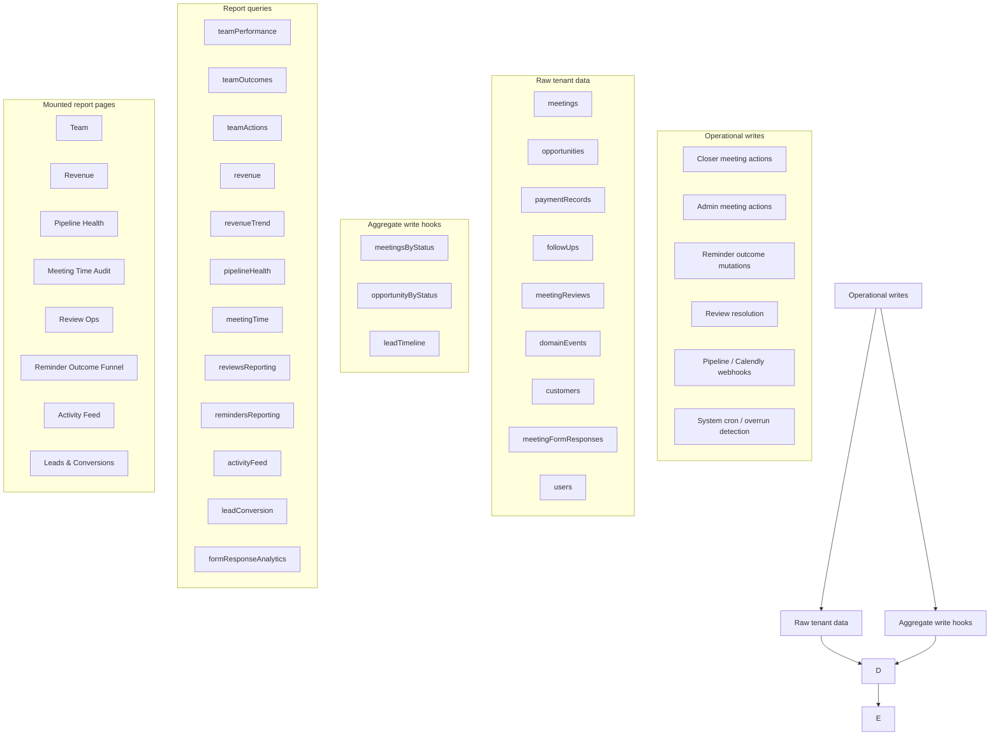
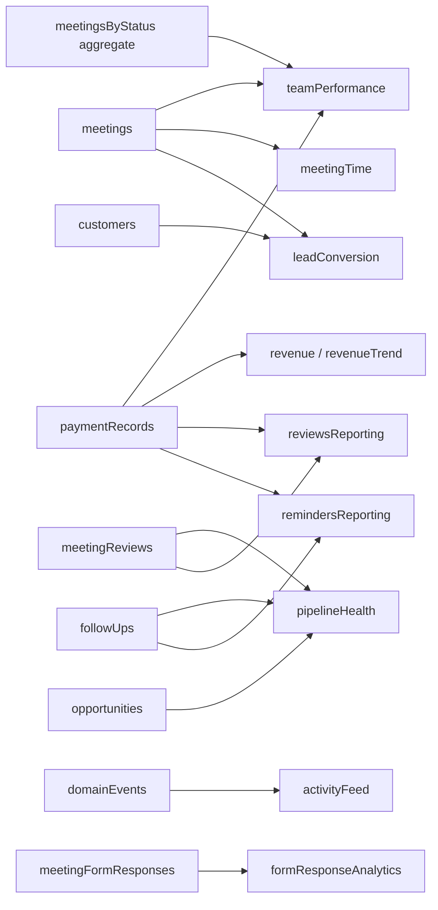
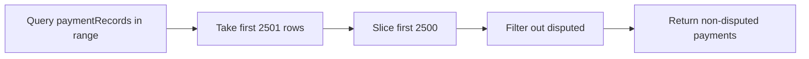
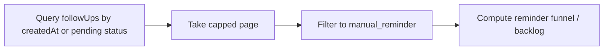
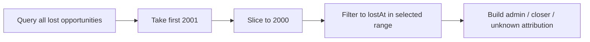
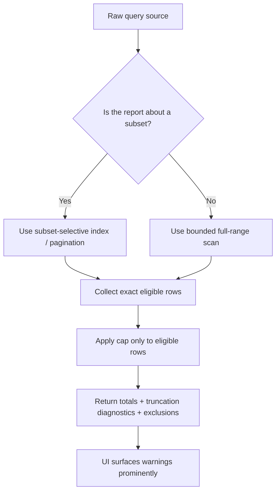

# Magnus CRM — Tenant Reporting Audit (`main`)

**Repo:** `MagnusVA/magnus-crm`  
**Branch audited:** `main`  
**Audit date:** 2026-04-19  
**Scope:** Internal tenant reporting only — domain events, branches of reporting logic, pipelines, closer/team performance, revenue, reviews, reminders, meeting-time audit, leads/conversion, activity feed.  
**Excluded:** PostHog / external analytics.

---

## Executive Summary

### Bottom line

`main` is **much closer to correct reporting than the older planning docs suggest**. A lot of the previously documented gaps are already closed:

- reports are permission-gated via `reports:view`
- custom date-range end handling is fixed
- dedicated report pages now exist for **meeting-time**, **reviews**, and **reminders**
- activity feed label parity and summary slices are live
- team attendance math now treats `meeting_overran` separately instead of forcing it into `no_show`

That said, there are still a few **real correctness risks** that can skew KPIs under higher-volume or edge-case data shapes.

### Severity snapshot

| Severity | Count | Summary |
|---|---:|---|
| High | 4 | Row caps are sometimes applied **before** filtering to the exact analytical subset, and one team-outcome path still mixes incompatible semantics. |
| Medium | 2 | Some read models are logically correct most of the time but can drift on boundary cases; some diagnostic flags are returned but not shown in UI. |
| Low | 1 | A few good backend diagnostics are not surfaced prominently enough to protect admin interpretation. |

### Highest-value findings

1. **Payment-backed reports can undercount** because disputed rows consume the cap **before** non-disputed filtering happens.
2. **Reminder reports can undercount manual reminders** because all follow-ups are capped first, then filtered to `manual_reminder`.
3. **Pipeline loss attribution can miss in-range losses** because it caps all lost opportunities before applying the selected date range.
4. **Team outcome distribution is not fully semantically stable** across date windows.
5. **`meeting_overran` is fixed in attendance reporting, but still treated as `no_show` in outcome derivation.**

---

## What is already good on `main`

These are no longer open problems:

- **Reports-area permissioning is in place** via `reports:view`.
- **Date-range end handling is fixed** with exclusive upper bounds for custom ranges.
- **Mounted reports exist** for:
  - `/workspace/reports/meeting-time`
  - `/workspace/reports/reviews`
  - `/workspace/reports/reminders`
- **Activity feed parity is materially improved**:
  - missing event labels were added
  - top event type + outcome slices are rendered
- **Team attendance math is materially improved**:
  - `meeting_overran` is now surfaced as `reviewRequiredCalls`
  - it is removed from the show-up denominator
- **Pipeline stale count is now a real count**, not just the displayed sample size.
- **Revenue by origin is now durable**, backed by `paymentRecords.origin`.

---

## Reporting flow on `main`

### Practical flow by report

---

## Findings

## 1) High — Payment-backed reports cap rows before filtering disputed payments

### Why this matters

Several important reports want **non-disputed payments**, but the shared helper grabs a capped range of payment rows first and only filters disputed payments afterward.

That means disputed rows still consume scarce scan budget.

### Affected analytics

- Revenue totals
- Revenue trend
- Team commercial KPIs
- Team close rate inputs
- Any other report that relies on the shared payment helper

### Current logic shape

### Why this is risky

If a tenant has many disputed payments in-range, valid non-disputed rows later in the range may never be seen.  
That produces **undercounted revenue and deal totals** even though the rows exist.

### Impact level

**High** because this affects money-facing KPIs.

### Recommendation

Use one of these patterns:

1. paginate until you collect **2500 usable non-disputed rows**
2. or query by status more selectively where possible
3. or split helpers so “exact money” reports do not inherit this cap behavior

---

## 2) High — Reminder reporting caps all follow-ups before filtering to `manual_reminder`

### Why this matters

Reminder analytics are intended to measure **manual reminder** behavior, but the query first caps all follow-ups in the date range and only then filters to `type === "manual_reminder"`.

The same pattern appears in pipeline unresolved-reminder backlog logic.

### Current logic shape

### Why this is risky

If the tenant has lots of scheduling-link follow-ups, those rows can crowd out manual reminders inside the cap window.

Result:

- reminder funnel can undercount `totalCreated`
- completion rate can be skewed
- unresolved manual reminder backlog can be understated

### Additional buglet

The reminder funnel truncation flag uses `rows.length >= MAX_FOLLOWUP_SCAN_ROWS` instead of a `cap + 1` pattern.  
That means **exactly 2000 rows** can still be reported as truncated.

### Impact level

**High** because reminder-specific analytics can be wrong while looking normal.

### Recommendation

Add or use a more selective index for manual reminders and use a true `cap + 1` truncation check.

---

## 3) High — Pipeline loss attribution caps all lost opportunities before applying the selected date range

### Why this matters

The pipeline loss attribution query fetches lost opportunities by status, caps that set, and only then filters by `lostAt` inside the selected reporting window.

### Current logic shape

### Why this is risky

If a tenant has more than the cap of historical lost opportunities, older rows may fill the capped set first, causing **recent in-range losses to be omitted**.

That directly skews:

- admin-vs-closer loss attribution
- by-actor loss drill-down
- loss totals for the chosen period

### Impact level

**High** because it breaks date-window truth.

### Recommendation

Add a `by_tenantId_and_status_and_lostAt`-style path or paginate until the date-bounded sample is satisfied.

---

## 4) High — Team outcome derivation mixes different time semantics

### Why this matters

The team outcome distribution query combines several data sources with different temporal rules:

- meetings are selected by `scheduledAt in range`
- payments are selected by `recordedAt in range`
- reschedule chains are inferred only from meetings included in the same capped range
- opportunity status is read as a **current snapshot**

Those semantics do not fully align.

### What can go wrong

A meeting scheduled in-range can be:

- marked **sold** only if payment was also recorded in-range
- marked **rescheduled** only if the rescheduling meeting is also inside the scanned meeting set
- marked **lost** based on the current opportunity snapshot even if loss resolution happened later

So one outcome family is “resolved in-range,” another is “visible in current snapshot,” and another is “only detectable if both linked rows fit this window.”

### Impact level

**High** because the report can look internally coherent while answering different questions for different outcome types.

### Recommendation

Choose one explicit semantic model and stick to it:

- **Outcome resolved in selected range**, or
- **Final eventual outcome of meetings scheduled in selected range**

Then align sold / lost / rescheduled / follow-up rules to that same model.

---

## 5) Medium-High — `meeting_overran` is still treated as `no_show` in team outcome derivation

### Why this matters

Attendance reporting has already been corrected: `meeting_overran` is now treated as **review required**, not as a true no-show.

But the shared outcome derivation still maps `meeting.status === "meeting_overran"` to `no_show`.

### Why this is inconsistent

That means the product now has two competing truths:

- **Team attendance report:** “review required”
- **Outcome distribution / rebook denominator:** “no-show”

### Risk

This can inflate:

- `no_show` outcome mix
- rebook denominator
- downstream interpretations of closer attendance quality

### Impact level

**Medium-High** because it is not a total failure, but it is a direct semantic mismatch.

### Recommendation

Add a distinct outcome such as `review_required`, or classify unresolved overran meetings as pending/in-progress until review resolution determines the real outcome.

---

## 6) Medium — Good backend diagnostics exist, but some UIs do not surface them clearly

### Good backend behavior

The backend already returns several useful diagnostics, such as:

- excluded revenue
- excluded deal count
- excluded conversions
- truncation flags

This is strong design.

### Current problem

Some report pages do not prominently surface those diagnostics, so admins can read approximate totals as if they were exact.

### Examples

- Revenue page does not prominently warn on exclusion/truncation conditions.
- Leads page returns exclusion/truncation-aware data but does not foreground it.
- Pipeline page surfaces some caps, but range diagnostics are still easier to misread than they should be.

### Impact level

**Medium** because the data model is aware of risk, but the UX does not always protect interpretation.

### Recommendation

Surface warnings whenever:

- excluded values are non-zero
- truncation flags are true
- a report uses a capped sample rather than a full count

---

## 7) Low — Activity reporting is in good shape on `main`

This area looked risky in older gap docs, but current `main` is substantially better:

- event label coverage is broad
- top event types are shown
- structured outcome rollups are shown
- “most active closer” and “actions / closer / day” are present

### Verdict

No major correctness defect found here in the current mounted implementation.  
This is one of the healthier report surfaces right now.

---

## What is strongest right now

### Most trustworthy report surfaces on `main`

1. **Meeting Time Audit**
   - clear purpose
   - explicit cap warning
   - direct use of meeting timing/source fields

2. **Review Ops**
   - clear separation of live backlog vs resolved-in-range analytics
   - good operational semantics
   - explicit truncation messaging

3. **Activity Feed**
   - broad event label parity
   - useful summary slices
   - good tenant-wide visibility

### Strongest modeling decisions

- separating `reviewRequiredCalls` from `noShows`
- durable `paymentRecords.origin`
- durable `followUps.createdSource`
- explicit `lostByUserId`
- returning exclusion diagnostics from backend queries

---

## Recommended fix order

| Priority | Fix | Why first |
|---|---|---|
| P1 | Fix non-disputed payment helper cap/filter order | Affects money and team KPIs broadly |
| P1 | Fix manual-reminder cap/filter order | Affects reminder funnel and reminder backlog truth |
| P1 | Fix loss attribution query to apply date semantics before cap | Restores date-window correctness |
| P2 | Align team outcome semantics | Removes internal contradictions in outcome reporting |
| P2 | Stop mapping unresolved `meeting_overran` to `no_show` | Keeps attendance and outcome models consistent |
| P3 | Surface all exclusion/truncation diagnostics in UI | Prevents misreading approximate data as exact |

---

## Suggested target-state flow

---

## Final verdict

### Is tenant reporting on `main` broadly viable?

**Yes.**  
This is not a broken reporting system. The major feature-level gaps previously documented in planning files are mostly no longer true on `main`.

### Is it already “100% correct”?

**Not yet.**  
The remaining risk is concentrated in a few **selection / cap / attribution edge cases** that can skew results under certain tenant volumes or date-window shapes.

### Core conclusion

The system is now at the stage where the important work is **precision hardening**, not broad feature completion.

That is good news:
- the reporting architecture is already in place
- the UI surfaces largely exist
- the remaining issues are concrete and fixable

---

## Files that mattered most in this audit

### Core report backends
- `convex/reporting/teamPerformance.ts`
- `convex/reporting/teamOutcomes.ts`
- `convex/reporting/teamActions.ts`
- `convex/reporting/revenue.ts`
- `convex/reporting/revenueTrend.ts`
- `convex/reporting/pipelineHealth.ts`
- `convex/reporting/remindersReporting.ts`
- `convex/reporting/reviewsReporting.ts`
- `convex/reporting/lib/helpers.ts`
- `convex/reporting/lib/outcomeDerivation.ts`

### Mounted report pages
- `app/workspace/reports/layout.tsx`
- `app/workspace/reports/_components/report-date-controls.tsx`
- `app/workspace/reports/team/_components/team-report-page-client.tsx`
- `app/workspace/reports/revenue/_components/revenue-report-page-client.tsx`
- `app/workspace/reports/pipeline/_components/pipeline-report-page-client.tsx`
- `app/workspace/reports/activity/_components/activity-feed-page-client.tsx`
- `app/workspace/reports/activity/_components/activity-summary-cards.tsx`
- `app/workspace/reports/meeting-time/_components/meeting-time-report-page-client.tsx`
- `app/workspace/reports/reviews/_components/reviews-report-page-client.tsx`
- `app/workspace/reports/reminders/_components/reminders-report-page-client.tsx`
- `app/workspace/reports/leads/_components/leads-report-page-client.tsx`
