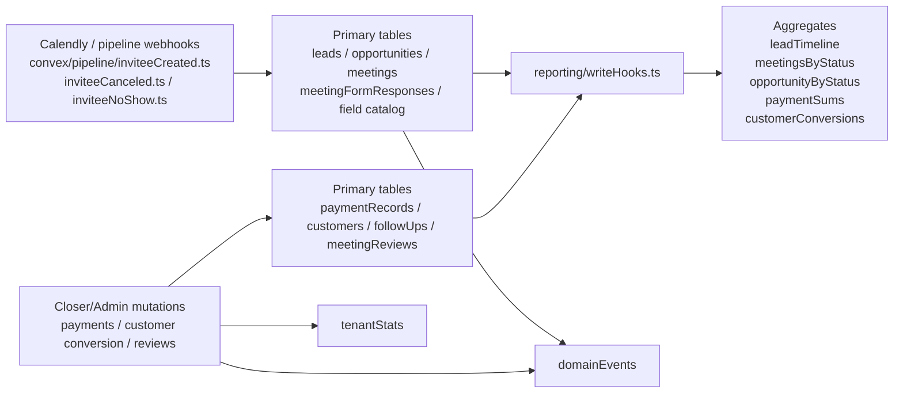
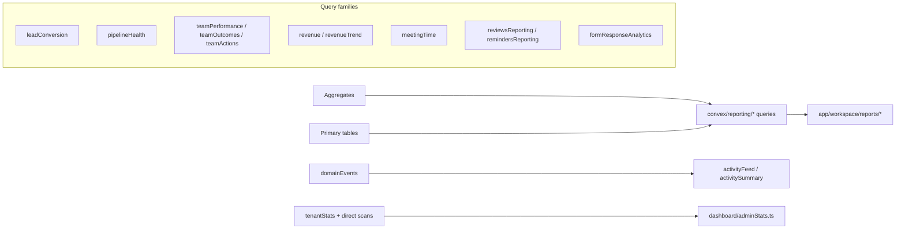

# Magnus CRM – Tenant Reporting Audit

**Repo:** `MagnusVA/magnus-crm`  
**Scope:** tenant internal reporting only (`convex/reporting/*`, `convex/dashboard/adminStats.ts`, report pages under `app/workspace/reports/*`)  
**Excluded:** PostHog / external analytics

## Bottom line

The reporting architecture is good, but it is **not yet 100% semantically correct**. The main risks are:

- historical data disappearing from reports when closers become inactive,
- mixed timestamp semantics,
- silent truncation on several pages,
- a few metric definitions that do not match their labels.

I found multiple high-confidence issues that can make KPIs, charts, and closer analytics wrong on real tenants.

## Reporting flow

## What is solid

| Area | Assessment |
|---|---|
| Write architecture | Good separation between transactional writes, aggregate sync, query layer, and UI. |
| Aggregate sync | Meetings, opportunities, payments, and customers have explicit insert/replace hooks, which is the right pattern for low-latency reporting. |
| Auditability | `domainEvents` gives a real internal event stream for activity reporting and operational diagnostics. |
| Review correction path | Review resolution rewrites aggregates when statuses/payments are corrected, which reduces stale-report risk. |
| Query shape | Most report queries already return truncation flags; the bigger problem is that some pages never show them. |

## Confirmed correctness bugs

| Severity | Finding | Why it matters | Evidence |
|---|---|---|---|
| P0 | **Historical reports drop inactive closers.** Core report queries start from `getActiveClosers()` and then build totals from that active-only list. | Deactivating a closer can retroactively remove their historical conversions, revenue, and team totals from reports. Revenue/team queries even compute `excluded*` values, but the pages do not surface them. | `convex/reporting/lib/helpers.ts:19-40`, `convex/reporting/leadConversion.ts:28-33, 96-105, 124-141`, `convex/reporting/revenue.ts:43-54, 87-110`, `convex/reporting/teamPerformance.ts:209-219, 295-349, 401-449`, `app/workspace/reports/revenue/_components/revenue-report-page-client.tsx:53-92`, `app/workspace/reports/leads/_components/leads-report-page-client.tsx:68-99` |
| P0 | **Lead conversion denominator uses storage time, not business first-seen time.** `leadTimeline` is keyed by `lead._creationTime`, while time-to-conversion uses `lead.firstSeenAt`. | `newLeads`, `conversionRate`, and `avgTimeToConversion` are not based on the same business timestamp. Imports/backfills/late-created rows can distort the conversion funnel. | `convex/reporting/aggregates.ts:48-56`, `convex/reporting/leadConversion.ts:30-33, 87-90, 124-128`, `convex/schema.ts:107-152` |
| P0 | **Team close rate / “sales” numerator includes all non-disputed payments in range, including `customer_flow`.** | Existing-customer payments can inflate `sales`, `closeRate`, and `avg deal` even when they are unrelated to the calls in the denominator. This is a semantic mismatch, not just labeling. | `convex/reporting/teamPerformance.ts:209-219, 332-349, 434-449`, `convex/customers/mutations.ts:150-154, 171-184`, `app/workspace/reports/team/_components/team-kpi-summary-cards.tsx:100-115`, `app/workspace/reports/team/_components/closer-performance-table.tsx:97-103, 135-150` |
| P0 | **`meeting_overran` is classified as `no_show` in team outcomes.** | Pending/ambiguous review cases pollute no-show, rebook, and loss-adjacent analytics before an admin resolves them. The review system itself clearly treats `meeting_overran` as an unresolved state, not a final no-show. | `convex/reporting/lib/outcomeDerivation.ts:25-38`, `convex/reporting/teamOutcomes.ts:89-116`, `convex/reviews/mutations.ts:158-237, 265-451` |
| P1 | **Pipeline loss attribution filters by date only after a capped `status=lost` scan.** | The date-scoped loss chart can miss in-range losses once the tenant has enough lost opportunities. This becomes incorrect silently. | `convex/reporting/pipelineHealth.ts:296-324, 374-383`, `convex/schema.ts:256-278` |
| P1 | **Unresolved manual reminders are filtered by `type` only after a capped pending-follow-up scan.** | If a tenant has many pending follow-ups, unresolved `manual_reminder` counts can be understated because non-manual rows consume the cap first. | `convex/reporting/pipelineHealth.ts:278-305, 374-379`, `convex/schema.ts:792-803` |
| P1 | **Trend buckets use UTC, but date controls use local dates.** | Day/week/month charts can shift rows across boundaries near midnight, and “This Week” quick-pick does not align cleanly with ISO-week bucketing. | `convex/reporting/lib/periodBucketing.ts:13-103`, `convex/reporting/revenueTrend.ts:31-67`, `app/workspace/reports/_components/report-date-controls.tsx:31-65` |
| P1 | **Pipeline velocity is mislabeled and partially sampled.** UI says “Average days from first meeting to payment”, but the query uses `paymentReceivedAt - opportunity.createdAt` on only the first 500 `payment_received` opportunities created in the last 90 days. | The metric is neither “first meeting -> payment” nor fully exact at scale. It is a different measure than the UI promises. | `convex/reporting/pipelineHealth.ts:188-207, 252-253`, `app/workspace/reports/pipeline/_components/velocity-metric-card.tsx` |
| P1 | **Admin dashboard counts disputed-payment opportunities as won deals.** | `wonDealsInPeriod` can stay high even when the only payment in-period is disputed, causing revenue/payment KPIs to disagree with won-deal count. | `convex/dashboard/adminStats.ts:126-165` |
| P2 | **Form answer distribution filters date range after a capped field scan.** | Popular form fields can produce incorrect date-scoped answer distributions once total responses exceed the cap. | `convex/reporting/formResponseAnalytics.ts:71-124`, `convex/schema.ts:877-895` |

## Silent approximation / UX gaps

| Severity | Finding | Impact | Evidence |
|---|---|---|---|
| P0 | **Revenue APIs expose `isPaymentDataTruncated`; the revenue page never shows it.** | Revenue totals, closer table, deal distribution, top deals, and trend can all be partial above the payment cap with no user warning. | `convex/reporting/lib/helpers.ts:143-162`, `convex/reporting/revenue.ts:43-49, 93-110, 127-197`, `convex/reporting/revenueTrend.ts:47-67`, `app/workspace/reports/revenue/_components/revenue-report-page-client.tsx:30-92` |
| P1 | **Pipeline page ignores truncation on no-show source, loss attribution, and velocity.** Only backlog cards receive truncation props. | Date-scoped diagnostic charts can silently show partial data. | `convex/reporting/pipelineHealth.ts:374-383, 252-253`, `app/workspace/reports/pipeline/_components/pipeline-report-page-client.tsx:63-132` |
| P1 | **Leads page ignores conversion/form truncation flags.** | `isConversionDataTruncated`, `isMeetingsTruncated`, and `isFormResponsesTruncated` exist but are not surfaced, so lead/form KPIs can undercount silently. | `convex/reporting/leadConversion.ts:139-141`, `convex/reporting/formResponseAnalytics.ts:215-223`, `app/workspace/reports/leads/_components/leads-report-page-client.tsx:34-99` |
| P2 | **Dead `dq` outcome bucket still exists in the outcome chart.** | UI taxonomy exposes a status that the derivation layer intentionally does not produce. | `convex/reporting/lib/outcomeDerivation.ts:40-57`, `app/workspace/reports/team/_components/meeting-outcome-distribution-chart.tsx:29-38` |
| P2 | **Verification is too shallow to certify report correctness.** It only checks aggregate-vs-table row counts and unclassified meetings. | It will not catch timestamp misuse, attribution drift, cap bias, disputed-payment semantics, or mislabeled metrics. | `convex/reporting/verification.ts:1-101` |

## Design / semantic risks to resolve explicitly

| Risk | Why it matters | Evidence |
|---|---|---|
| `convertedByUserId` vs assigned closer vs payment closer | Attribution semantics are split across multiple fields. Reporting currently compensates in some places by preferring opportunity/customer ownership, but the model is easy to misread and easy to regress later. | `convex/customers/conversion.ts:89-99`, `convex/closer/payments.ts:140-153, 215-223`, `convex/customers/mutations.ts:150-154`, `convex/reporting/leadConversion.ts:96-105`, `convex/reporting/lib/helpers.ts:76-133` |
| `paymentSums` aggregate is keyed by raw `payment.closerId` | Current reports usually re-attribute payments in query code, but any future aggregate-based closer revenue report can easily become wrong if it trusts `paymentSums` directly. | `convex/reporting/aggregates.ts:23-32`, `convex/reporting/lib/helpers.ts:76-133` |
| “Deal” currently behaves like “payment record” in several places | That is okay only if the product intentionally defines each payment record as a deal. Otherwise totals, close rates, and average deal metrics need deduping rules. | `convex/reporting/revenue.ts:87-109, 127-197`, `convex/reporting/teamPerformance.ts:332-349` |

## Recommended fix order

1. **Stop dropping inactive closers from historical reports.**  
   Build report closer sets from the data in-range (or include inactive/removed users), and surface an “Unassigned / inactive” bucket when needed.

2. **Fix lead funnel time semantics.**  
   Re-key `leadTimeline` on `firstSeenAt` (or stop using it for lead-funnel counts) and rebuild the aggregate.

3. **Separate meeting conversion metrics from general cash collection.**  
   For team close rate, use only the payments/deals that truly correspond to attended meetings in-range. Keep upsell / customer-flow revenue as a separate commercial KPI.

4. **Treat `meeting_overran` as review-required, not no-show.**  
   Add a dedicated outcome bucket such as `review_required` or exclude unresolved reviews from outcome distributions until resolution.

5. **Fix the cap-before-filter queries with proper indexes.**  
   Recommended additions:
   - `opportunities(tenantId, status, lostAt)` or `opportunities(tenantId, lostAt)`
   - `followUps(tenantId, type, status, createdAt)` for unresolved manual reminders
   - `meetingFormResponses(tenantId, fieldKey, capturedAt)`

6. **Standardize time semantics.**  
   Choose one of:
   - fully local/tenant timezone end-to-end, or
   - fully UTC end-to-end with explicit labels.
   Today it is mixed.

7. **Surface every truncation flag in the UI or remove the cap from user-facing “headline” KPIs.**  
   Revenue, leads, pipeline diagnostics, and velocity are the biggest gaps.

8. **Make verification semantic, not just structural.**  
   Add assertions/tests for:
   - conversion denominator timestamp,
   - inactive closer inclusion,
   - disputed-payment handling,
   - `meeting_overran` outcome behavior,
   - date-range correctness under large data volumes.

## Practical “definition of done”

I would not call this reporting layer “100% correct” until all of the following are true:

- historical reports still reconcile after a closer is deactivated,
- lead funnel uses one consistent business clock,
- close rate only uses true call-origin closes,
- `meeting_overran` is no longer counted as `no_show`,
- every capped report explicitly warns the user or uses an exact path,
- date bucketing is timezone-consistent,
- dashboard won deals exclude disputed-only payments.

## Key files reviewed

- `convex/reporting/aggregates.ts`
- `convex/reporting/writeHooks.ts`
- `convex/reporting/leadConversion.ts`
- `convex/reporting/pipelineHealth.ts`
- `convex/reporting/revenue.ts`
- `convex/reporting/revenueTrend.ts`
- `convex/reporting/teamPerformance.ts`
- `convex/reporting/teamOutcomes.ts`
- `convex/reporting/teamActions.ts`
- `convex/reporting/formResponseAnalytics.ts`
- `convex/reporting/verification.ts`
- `convex/reporting/activityFeed.ts`
- `convex/reviews/mutations.ts`
- `convex/closer/payments.ts`
- `convex/customers/conversion.ts`
- `convex/customers/mutations.ts`
- `convex/dashboard/adminStats.ts`
- `convex/schema.ts`
- `app/workspace/reports/leads/_components/leads-report-page-client.tsx`
- `app/workspace/reports/pipeline/_components/pipeline-report-page-client.tsx`
- `app/workspace/reports/revenue/_components/revenue-report-page-client.tsx`
- `app/workspace/reports/team/_components/team-report-page-client.tsx`
- `app/workspace/reports/team/_components/team-kpi-summary-cards.tsx`
- `app/workspace/reports/team/_components/closer-performance-table.tsx`
- `app/workspace/reports/team/_components/meeting-outcome-distribution-chart.tsx`
