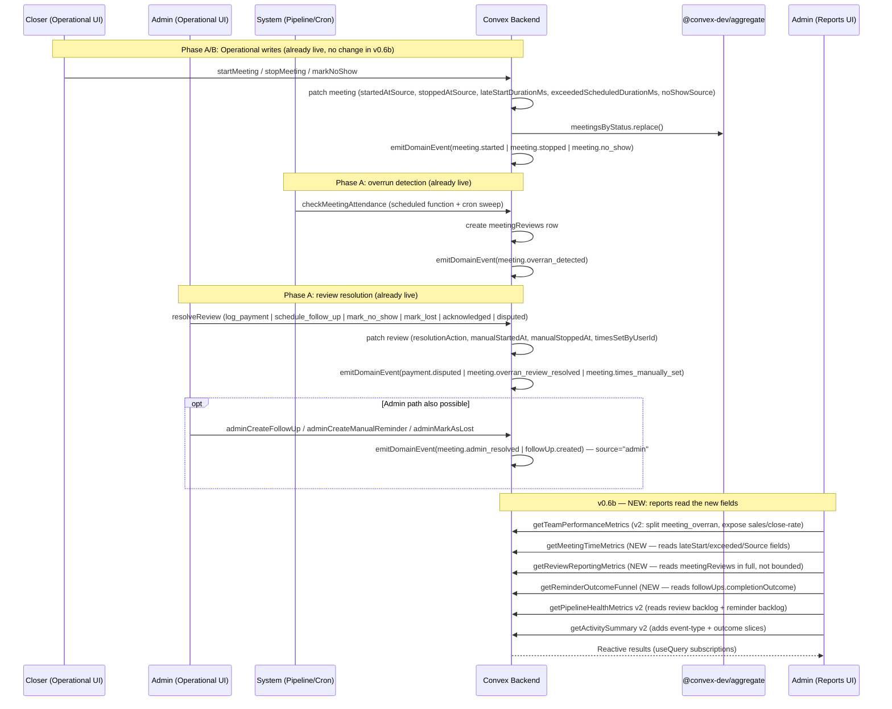

# v0.6b Reporting Completion — Design Specification

**Version:** 0.1 (MVP)
**Status:** Draft
**Date:** 2026-04-18
**Scope:** Starting state — the v0.6 reporting area ships `team`, `revenue`, `pipeline`, `leads`, `activity` routes, 5 aggregates are live, `meetingReviews` + reminder-outcomes + admin-meeting-management + meeting-time-tracking are operationally active but not reported on. Ending state — every Tier 1–4 KPI promised in the v0.6 design is surfaced, every active domain event is labelled, every new v0.6b operational data source (reviews, reminders, admin origin, meeting-time fields, Fathom) has a reporting consumer, and attribution integrity is preserved at the row level for admin vs. closer actions.
**Prerequisite:** v0.6 aggregates + `meetingReviews` table + `followUps.completionOutcome` + meeting-time-tracking schema + Fathom link fields + `meetingOverrunSweep` cron are all live in production (`main`, 2026-04-18).

> This design is the single source of truth for closing the two reporting gaps simultaneously:
>
> 1. **v0.6 delivery gap** — KPIs and UI that were promised but never shipped (see `plans/v0.6/reporting-gaps.md`).
> 2. **v0.6b feature gap** — reporting consumers for data the product now writes but never reads (see `plans/v0.6b/v0-6b-reporting-gaps-current-features.md`).
>
> Everything in this document was cross-checked against the code in `main` on 2026-04-18. Every field name, file path, line range, and emitted event type is taken from the live tree — not from prior designs.

---

## Table of Contents

1. [Goals & Non-Goals](#1-goals--non-goals)
2. [Actors & Roles](#2-actors--roles)
3. [End-to-End Flow Overview](#3-end-to-end-flow-overview)
4. [Phase A: Activity Feed Parity & Fixes](#4-phase-a-activity-feed-parity--fixes)
5. [Phase B: Team Report Completion](#5-phase-b-team-report-completion)
6. [Phase C: Meeting-Time Audit Report](#6-phase-c-meeting-time-audit-report)
7. [Phase D: Review Operations Report](#7-phase-d-review-operations-report)
8. [Phase E: Reminder Outcome Funnel](#8-phase-e-reminder-outcome-funnel)
9. [Phase F: Pipeline Health & Leads Completeness](#9-phase-f-pipeline-health--leads-completeness)
10. [Phase G: Origin & Attribution Schema](#10-phase-g-origin--attribution-schema)
11. [Phase H: Cross-Cutting Fixes](#11-phase-h-cross-cutting-fixes)
12. [Data Model](#12-data-model)
13. [Convex Function Architecture](#13-convex-function-architecture)
14. [Routing & Authorization](#14-routing--authorization)
15. [Security Considerations](#15-security-considerations)
16. [Error Handling & Edge Cases](#16-error-handling--edge-cases)
17. [Open Questions](#17-open-questions)
18. [Dependencies](#18-dependencies)
19. [Applicable Skills](#19-applicable-skills)

---

## 1. Goals & Non-Goals

### Goals

1. **Close the v0.6 delivery gap.** Every KPI in Tier 1, Tier 2, Tier 3, Tier 4 of `plans/v0.6/version-06-reporting-feature.md §9` either ships in this release or is explicitly deferred with a written reason.
2. **Give every active v0.6b data source a reporting consumer.** Writes into `meetingReviews`, `followUps.completionOutcome`, meeting-time fields (`lateStartDurationMs`, `exceededScheduledDurationMs`, `startedAtSource`, `stoppedAtSource`, `noShowSource`), admin origin metadata, `fathomLink`, and the overran detection event chain are surfaced to admins in at least one report page.
3. **Stop misreporting review-flagged meetings as attendance failures.** `meetingsByStatus` already indexes `meeting_overran` separately; the Team Performance report currently merges it into `noShows` at `convex/reporting/teamPerformance.ts:160-163` and leaves it in the show-up-rate denominator. Both are removed.
4. **Make admin-vs-closer attribution measurable.** Admin-logged payments and admin-created reminders become analytically distinguishable from closer-owned work without relying on free-form `domainEvents` metadata.
5. **Activity Feed parity.** Every event type the system actually emits has a label; status transitions render from the correct top-level fields; summary analytics add event-type and outcome slices alongside the existing source slice.
6. **Three new report pages.** `/workspace/reports/meeting-time`, `/workspace/reports/reviews`, and `/workspace/reports/reminders`. `meetingReviews`, reminder outcomes, and meeting-time audit data are reported there (separate from the operational inbox at `/workspace/reviews`, which remains a 50/100-row operational list).
7. **Fix the date-range off-by-one bug.** `ReportDateControls` currently sends midnight-start-of-day as the exclusive upper bound — every report silently drops the last day of a custom range.

### Non-Goals (deferred)

- **Closer-facing reporting** (deferred to v0.7). v0.6b is admin-only.
- **CSV/PDF export, scheduled email reports, month-over-month overlays** (deferred).
- **Historical Excel data import** (deferred).
- **Tenant timezone support** — reports continue to use UTC (deferred to v0.7).
- **`DQ Rate`** (deferred to v0.7). The live model no longer has a reliable structured disqualification signal after `meetings.meetingOutcome` deprecation; v0.6b ships the rest of Tier 2 and leaves DQ explicitly out of scope.
- **Sweep-rescued-meeting KPI.** The overrun sweep (`convex/closer/meetingOverrunSweep.ts`) does not currently emit a distinct signal. We do **not** add one in v0.6b. See Open Question #2.
- **Origin-split revenue aggregates** (a second `paymentSums`-style aggregate keyed by origin) — v0.6b uses a row-level `origin` field and read-side grouping instead. A dedicated aggregate is deferred until volume requires it.
- **Per-entity timeline views** (v0.7 entity detail UX).

---

## 2. Actors & Roles

| Actor | Identity | Auth Method | Key Permissions |
|---|---|---|---|
| **Tenant Master** | CRM `users.role = "tenant_master"` | WorkOS AuthKit, member of tenant org | Full access to all reports; manages team and settings |
| **Tenant Admin** | CRM `users.role = "tenant_admin"` | WorkOS AuthKit, member of tenant org | Full access to all reports; resolves reviews; logs admin-origin payments |
| **Closer** | CRM `users.role = "closer"` | WorkOS AuthKit, member of tenant org | **No access** to `/workspace/reports/*` in v0.6b. Uses `/workspace/closer/*` operational surfaces which write the data that reports consume. |
| **System** | Convex internal functions | Server-only (no identity) | `meetingOverrunSweep` cron, pipeline webhook handlers — emit events consumed by reports |

### CRM Role ↔ Permission Mapping (reporting-specific)

| CRM `users.role` | `pipeline:view-all` | `reports:view` (new) | Notes |
|---|---|---|---|
| `tenant_master` | Yes | Yes | Owner — sees every report |
| `tenant_admin` | Yes | Yes | Admin — sees every report, can resolve reviews, can log admin-origin payments |
| `closer` | No | No | Closers do not see `/workspace/reports/*` in v0.6b |

> **Why add `reports:view`?** The reports area currently gates on `pipeline:view-all`, which is also used outside reporting. Having a dedicated permission makes it easy to expand later (e.g., restrict some subreports to `tenant_master` only, or enable closer-facing reporting in v0.7 without widening `pipeline:view-all`). The permission is added alongside the existing table in `convex/lib/permissions.ts`; no code currently depends on the old gating behaviour changing.

---

## 3. End-to-End Flow Overview



No write paths change during v0.6b except the schema-widening in Phase G (origin/attribution fields) and the Phase H date-control fix. All other phases are **read-side** work — the data is already being written.

---

## 4. Phase A: Activity Feed Parity & Fixes

### 4.1 What & Why

The Activity Feed is the broadest reporting surface in the app: it is the only place admins see who did what across the whole tenant. Today it silently drops 9 live event types onto a raw-string fallback, cannot filter by those event types (because the filter dropdown is generated from `EVENT_LABELS`), and renders status transitions from the wrong object path.

> **Runtime decision:** This phase is label + UI-only. No schema, no aggregate, no new query. Safe to ship independently before anything else in v0.6b. We do this first to unblock confidence that the domain-event stream is legible.

### 4.2 Missing Event Labels

`convex/reporting/lib/eventLabels.ts:6-103` currently ships 24 labels. Grep of `eventType: "..."` across `convex/` on 2026-04-18 returns these extra event types that are emitted but not labelled:

| Event Type | Emitter | Proposed `verb` | Proposed `iconHint` |
|---|---|---|---|
| `meeting.admin_resolved` | `convex/admin/meetingActions.ts:528` | "resolved a meeting as admin" | `shield-check` |
| `meeting.overran_detected` | `convex/closer/meetingOverrun.ts:120` | "flagged a meeting as overran" | `alert-triangle` |
| `meeting.overran_closer_responded` | `convex/closer/meetingOverrun.ts:227` | "responded to an overran meeting" | `message-square` |
| `meeting.overran_review_resolved` | `convex/reviews/mutations.ts:245,437,592` | "resolved an overran review" | `gavel` |
| `meeting.status_changed` | `convex/reviews/mutations.ts:423` | "changed a meeting status" | `arrow-right-left` |
| `meeting.webhook_ignored_overran` | `convex/pipeline/inviteeCanceled.ts:115`, `convex/pipeline/inviteeNoShow.ts:106` | "ignored a late webhook for a flagged meeting" | `filter` |
| `payment.disputed` | `convex/reviews/mutations.ts:307` | "disputed a payment" | `circle-alert` |
| `followUp.expired` | `convex/lib/paymentHelpers.ts:52` | "expired a follow-up" | `calendar-x-2` |
| `customer.conversion_rolled_back` | `convex/lib/paymentHelpers.ts:134` | "rolled back a customer conversion" | `undo-2` |

```typescript
// Path: convex/reporting/lib/eventLabels.ts
export const EVENT_LABELS: Record<string, EventLabel> = {
  // ... existing 24 entries ...
  "meeting.admin_resolved": { verb: "resolved a meeting as admin", iconHint: "shield-check" },
  "meeting.overran_detected": { verb: "flagged a meeting as overran", iconHint: "alert-triangle" },
  "meeting.overran_closer_responded": { verb: "responded to an overran meeting", iconHint: "message-square" },
  "meeting.overran_review_resolved": { verb: "resolved an overran review", iconHint: "gavel" },
  "meeting.status_changed": { verb: "changed a meeting status", iconHint: "arrow-right-left" },
  "meeting.webhook_ignored_overran": { verb: "ignored a late webhook for a flagged meeting", iconHint: "filter" },
  "payment.disputed": { verb: "disputed a payment", iconHint: "circle-alert" },
  "followUp.expired": { verb: "expired a follow-up", iconHint: "calendar-x-2" },
  "customer.conversion_rolled_back": { verb: "rolled back a customer conversion", iconHint: "undo-2" },
};
```

### 4.3 Status Transition Rendering Bug

`convex/lib/domainEvents.ts:12-32` writes `fromStatus` and `toStatus` as **top-level** fields on `domainEvents`. `convex/reporting/activityFeed.ts:151-157` correctly includes those top-level fields in the query result. But `app/workspace/reports/activity/_components/activity-event-row.tsx:73-95` reads them from `metadata.fromStatus` / `metadata.toStatus` — which is always undefined.

Fix: read top-level fields first, fall back to metadata only for legacy events.

```tsx
// Path: app/workspace/reports/activity/_components/activity-event-row.tsx

// BEFORE (line 73-95):
const fromStatus = metadata.fromStatus;
const toStatus = metadata.toStatus;

// AFTER:
const fromStatus = event.fromStatus ?? metadata.fromStatus;
const toStatus = event.toStatus ?? metadata.toStatus;
```

### 4.4 Activity Summary — Event-Type and Outcome Slices

Today `convex/reporting/activityFeed.ts:161-227` returns `{ bySource, byEntity, byActor, actorBreakdown }` but the UI (`activity-summary-cards.tsx:19-63`) only renders `bySource`. Admin review work, reminder completions, disputed payments, and overran detections all flatten into generic "admin" / "closer" source counts — too coarse.

We extend the summary query to add two more slices:

```typescript
// Path: convex/reporting/activityFeed.ts (inside getActivitySummary)
return {
  totalEvents,
  isTruncated,
  bySource,        // existing — "closer" | "admin" | "pipeline" | "system"
  byEntity,        // existing — "meeting" | "opportunity" | ...
  byActor,         // existing — { [userId]: count }
  actorBreakdown,  // existing shape extended to [{ actorUserId, actorName, actorRole, count }]

  // NEW — v0.6b
  byEventType,     // { [eventType]: count } — top-N rendered in UI
  byOutcome,       // { "reminder_payment_received": N, "review_resolved_sale": N, ... }
                   //   rolled up from followUp.completed metadata.outcome and review resolutionAction events
};
```

`byOutcome` is built by inspecting `metadata` for events of type `followUp.completed` (reads `metadata.outcome`) and `meeting.overran_review_resolved` (reads `metadata.resolutionAction`). `actorBreakdown` is widened in the same pass to include `actorRole`. No new write sites.

### 4.5 Acceptance

- [ ] All 9 missing event types have labels
- [ ] Activity filter dropdown contains every emitted event type (it is populated from `EVENT_LABELS`)
- [ ] `fromStatus` / `toStatus` appear in the rendered rows for all `*.status_changed` and `meeting.canceled` / `meeting.started` / `meeting.stopped` events
- [ ] Summary UI adds two new cards: "Top event types" (top 5) and "Outcome mix" (reminder + review outcome rollups)

---

## 5. Phase B: Team Report Completion

### 5.1 What & Why

The Team Performance report is the Excel replacement — it is the single most visible report and is the one currently most out of sync with both the v0.6 KPI catalog and the v0.6b data model. We complete it by:

- (B1) Splitting `meeting_overran` out of the no-show count so review-flagged meetings are no longer misreported as attendance failures.
- (B1a) Removing review-flagged meetings from the show-up-rate denominator so attendance ambiguity is not silently converted into attendance failure.
- (B2) Surfacing the commercial KPIs (`sales`, `cashCollectedMinor`, `closeRate`, `avgCashCollectedMinor`) that the backend already returns but the UI drops on the floor.
- (B3) Adding the Tier 2 derived-outcome KPIs promised in v0.6 (`Lost Deals`, `Rebook Rate`, `Meeting Outcome Distribution`, `Actions per Closer`). Note — **`DQ Rate` is explicitly deferred to v0.7** because the live model does not yet have a reliable structured disqualification signal.
- (B4) Adding the Tier 3 meeting-time KPIs on top of the same query response: on-time start rate, avg late start, overran rate, avg overrun, avg actual duration, schedule adherence. The data has been written since v0.6 Phase 2 but has never been read.

### 5.2 Splitting `meeting_overran` from `no_show`

`convex/reporting/teamPerformance.ts:160-163` is the root cause:

```typescript
// BEFORE (convex/reporting/teamPerformance.ts:146-166)
return {
  bookedCalls,
  canceledCalls,
  noShows:
    countsForClassification.no_show +
    countsForClassification.meeting_overran,   // <- misreports review-required meetings
  callsShowed,
  showUpRate: toRate(callsShowed, showRateDenominator),
};
```

`meetingsByStatus` already keys by status and already indexes `"meeting_overran"` as a first-class value (`teamPerformance.ts:16-23`), so the fix is purely read-side:

```typescript
// AFTER
return {
  bookedCalls,
  canceledCalls,
  noShows: countsForClassification.no_show,
  reviewRequiredCalls: countsForClassification.meeting_overran,   // NEW — surface separately
  callsShowed,
  // Attendance-ambiguous meetings should not count as either "showed" or
  // "did not show" until review resolution.
  confirmedAttendanceDenominator:
    bookedCalls - canceledCalls - countsForClassification.meeting_overran,
  showUpRate: toRate(
    callsShowed,
    bookedCalls - canceledCalls - countsForClassification.meeting_overran,
  ),
};
```

> **Decision rationale:** `meeting_overran` is an exception queue, not a call outcome. A meeting enters `meeting_overran` because the system could not confirm attendance, and resolution can go any direction — sale, follow-up, no-show, or disputed. Counting them as no-shows conflates "review required" with "closer attendance failure"; leaving them in the show-up-rate denominator has the same flaw in percentage form. v0.6b treats them as **attendance pending review** until resolution.

### 5.3 Surfacing Existing Commercial KPIs

The backend already computes per-closer `sales`, `cashCollectedMinor`, `closeRate`, and `avgCashCollectedMinor` at `convex/reporting/teamPerformance.ts:172-184`. The closer performance table (`closer-performance-table.tsx:105-157`) renders Booked / Canceled / No Shows / Showed / Show-Up Rate only; the summary cards (`team-kpi-summary-cards.tsx:50-135`) render Total Booked / Show-Up Rate / Cash Collected / Close Rate. Four fields are computed and never rendered.

Fix — extend the per-closer table to a ninth column set:

```tsx
// Path: app/workspace/reports/team/_components/closer-performance-table.tsx
// (pseudo — full rendering uses the existing shadcn Table primitives)
<TableHead>Booked</TableHead>
<TableHead>Canceled</TableHead>
<TableHead>No Shows</TableHead>
<TableHead>Review Required</TableHead>  {/* NEW — from B1 */}
<TableHead>Showed</TableHead>
<TableHead>Show-Up Rate</TableHead>
<TableHead>Sales</TableHead>            {/* NEW — already in response */}
<TableHead>Cash Collected</TableHead>   {/* NEW — already in response */}
<TableHead>Close Rate</TableHead>       {/* NEW — already in response */}
<TableHead>Avg Deal</TableHead>         {/* NEW — already in response */}
```

### 5.4 Tier 2 Team KPIs — Derived Outcomes

`convex/reporting/lib/outcomeDerivation.ts:18-80` already exists and returns `"sold" | "lost" | "no_show" | "canceled" | "rescheduled" | "dq" | "follow_up" | "in_progress" | "scheduled"`. Nothing currently consumes it. We build a supplementary query that scans completed + meeting_overran meetings in the date range, resolves opportunity and payment state, and rolls outcomes up per closer:

```typescript
// Path: convex/reporting/teamOutcomes.ts  (NEW)
import { v } from "convex/values";
import { query } from "../_generated/server";
import { requireTenantUser } from "../requireTenantUser";
import { deriveCallOutcome } from "./lib/outcomeDerivation";
import { getActiveClosers } from "./lib/helpers";
import type { CallOutcome } from "./lib/outcomeDerivation";

export const getTeamOutcomeMix = query({
  args: { startDate: v.number(), endDate: v.number() },
  handler: async (ctx, { startDate, endDate }) => {
    const { tenantId } = await requireTenantUser(ctx, [
      "tenant_master",
      "tenant_admin",
    ]);

    // Scan meetings that had a chance to have an outcome:
    // "completed" | "meeting_overran" | "canceled" | "no_show"  within range.
    // Bounded by scheduledAt range. Returns ~30–40% of total meetings.
    const meetings = await ctx.db
      .query("meetings")
      .withIndex("by_tenantId_and_scheduledAt", (q) =>
        q.eq("tenantId", tenantId).gte("scheduledAt", startDate).lt("scheduledAt", endDate),
      )
      .take(2000); // Bound for safety; see Open Question #1.

    const perCloser = new Map<string, Record<CallOutcome, number>>();
    // ... resolve opportunity + payment lookups per meeting ...
    //     call deriveCallOutcome() and increment perCloser map
    return { outcomeMix: Array.from(perCloser.entries()) /* ... */ };
  },
});
```

**KPIs derived from this query:**

| KPI | Formula |
|---|---|
| **Lost Deals** | `sum(outcome === "lost")` |
| **Rebook Rate** | `sum(outcome === "rescheduled") / sum(status === "canceled" OR status === "no_show")` |
| **Meeting Outcome Distribution** | `outcomeMix` directly (rendered as a pie/bar chart) |
| **Actions per Closer (daily avg)** | Separate query on `domainEvents` — `total closer-authored events in range / max(1, distinct closer actors in range) / daySpanDays` |

> **Why not encode outcome in an aggregate?** Outcomes depend on join state (opportunity status, payment existence, reschedule chain). Adding an aggregate would require cascading `replace()` across meeting + opportunity + payment mutations — a 10+ new write hook surface. At the current ~200 meetings/month volume, scanning the subset that can have an outcome is cheap enough. Revisit if monthly volume hits 2,000+.

### 5.5 Tier 3 Meeting-Time KPIs

All fields are already written. The schema (`convex/schema.ts:330-397`) has:

| Field | Written by | Read by (today) |
|---|---|---|
| `startedAt` | `convex/closer/meetingActions.ts:99` | Detail UI only |
| `startedAtSource` | `convex/closer/meetingActions.ts:100`, `convex/admin/meetingActions.ts:516` | Detail UI only |
| `stoppedAt` | `convex/closer/meetingActions.ts:164` | Detail UI only |
| `stoppedAtSource` | `convex/closer/meetingActions.ts:165`, `convex/closer/noShowActions.ts:81`, `convex/admin/meetingActions.ts:519` | Detail UI only |
| `lateStartDurationMs` | `convex/closer/meetingActions.ts:103` | None |
| `exceededScheduledDurationMs` | `convex/closer/meetingActions.ts:168` | None |

> **Note on naming drift from v0.6 design:** the v0.6 design used the name `overranDurationMs`. The field was renamed to `exceededScheduledDurationMs` during implementation. This design uses the current name throughout — **no rename is proposed** because multiple live call sites already use it.

We extend `getTeamPerformanceMetrics` to return an additional `meetingTime` block per closer without changing the existing response shape:

```typescript
// Path: convex/reporting/teamPerformance.ts — EXTEND (not replace)
// After the existing per-closer loop, a second pass scans completed + meeting_overran meetings
// with a non-undefined startedAt/stoppedAt in the range and computes:

type CloserMeetingTimeMetrics = {
  startedMeetingsCount: number;          // count with startedAt in range
  onTimeStartCount: number;              // lateStartDurationMs == 0 OR undefined
  lateStartCount: number;                // lateStartDurationMs > 0
  totalLateStartMs: number;              // sum, for avg
  completedWithDurationCount: number;    // stoppedAt AND startedAt set
  overranCount: number;                  // exceededScheduledDurationMs > 0
  totalOverrunMs: number;                // sum, for avg
  totalActualDurationMs: number;         // sum(stoppedAt - startedAt), for avg
  scheduleAdherentCount: number;         // started on time AND did not overrun
  manuallyCorrectedCount: number;        // startedAtSource == "admin_manual" OR stoppedAtSource == "admin_manual"
};

// KPIs computed at query time (not stored):
onTimeStartRate      = onTimeStartCount / startedMeetingsCount
avgLateStartMs       = totalLateStartMs / lateStartCount
overranRate          = overranCount / completedWithDurationCount
avgOverrunMs         = totalOverrunMs / overranCount
avgActualDurationMs  = totalActualDurationMs / completedWithDurationCount
scheduleAdherence    = scheduleAdherentCount / completedWithDurationCount
```

`manuallyCorrectedCount` feeds a separate "manual-time correction rate" KPI visible on the Meeting-Time Audit page (Phase C). It is returned in the Team response but rendered only as a secondary column.

> **Why extend `getTeamPerformanceMetrics` rather than adding a sibling query?** Admins open the Team page for a specific date range; requesting two separate queries at that range doubles the useQuery subscription cost and visually produces two skeletons. Keeping it as one reactive response keeps the date picker → data change flow tight. The additional scan is bounded by the same range used for outcomes, and at current volume adds ~200 document reads per render.

### 5.6 `meeting.overran` vs `opportunity.meeting_overran`

`opportunityByStatus` keys include `"meeting_overran"` (added to the `opportunities.status` enum per `convex/schema.ts:207-288`). We do not double-report:

- The Team table's `reviewRequiredCalls` column reads from `meetingsByStatus` (per-meeting attendance ambiguity).
- Pipeline Health's **Pending Overran Reviews** card reads from `meetingReviews.status === "pending"` (current operational backlog).

They are related but not identical metrics. A pending-review backlog is best modeled from `meetingReviews`; a per-meeting team metric is best modeled from `meetingsByStatus`.

### 5.7 Acceptance

- [ ] `meeting_overran` renders as its own `Review Required` column in the Team table; no longer added to `noShows`
- [ ] `meeting_overran` is removed from the show-up-rate denominator until review resolution
- [ ] `Sales`, `Cash Collected`, `Close Rate`, `Avg Deal` columns render per closer and as team totals
- [ ] New summary cards: Lost Deals, Rebook Rate, Actions per Closer
- [ ] New chart: Meeting Outcome Distribution (pie, shadcn Chart + Recharts, consistent with v0.6 chart convention)
- [ ] New Team Performance subsection: Meeting Time (On-Time Start Rate, Avg Late Start, Overran Rate, Avg Overrun, Avg Actual Duration, Schedule Adherence, Manually Corrected Count)
- [ ] Numbers cross-check against a hand-computed January+February 2026 sample within 5% tolerance

---

## 6. Phase C: Meeting-Time Audit Report

### 6.1 What & Why

Meeting-time data has rich structure (two source enums, two signed durations, a Fathom link, a manual-correction flag) that does not fit the Team Performance page without crowding it out. A dedicated report is the right home for audit-style time metrics, especially when the primary consumer is the admin reviewing attendance and evidence compliance.

### 6.2 Route and Query

```
app/workspace/reports/meeting-time/
├── page.tsx                  # thin RSC, unstable_instant = false
├── loading.tsx               # skeleton
└── _components/
    ├── meeting-time-report-page-client.tsx
    ├── meeting-time-summary-cards.tsx    # aggregate KPIs
    ├── source-split-chart.tsx            # startedAtSource, stoppedAtSource breakdown
    ├── late-start-histogram.tsx          # lateStartDurationMs buckets
    ├── overrun-histogram.tsx             # exceededScheduledDurationMs buckets
    ├── fathom-compliance-panel.tsx       # % with fathomLink for completed + review-flagged
    └── meeting-time-report-skeleton.tsx
```

```typescript
// Path: convex/reporting/meetingTime.ts (NEW)
export const getMeetingTimeMetrics = query({
  args: { startDate: v.number(), endDate: v.number() },
  handler: async (ctx, { startDate, endDate }) => {
    const { tenantId } = await requireTenantUser(ctx, [
      "tenant_master",
      "tenant_admin",
    ]);

    // Scan meetings with startedAt in range. Bounded.
    const meetings = await ctx.db
      .query("meetings")
      .withIndex("by_tenantId_and_scheduledAt", (q) =>
        q.eq("tenantId", tenantId).gte("scheduledAt", startDate).lt("scheduledAt", endDate),
      )
      .take(2000);

    // Buckets for late-start / overrun histograms
    const buckets = { "0": 0, "1-5": 0, "6-15": 0, "16-30": 0, "30+": 0 };
    // Source counts
    const startedAtSource = { closer: 0, admin_manual: 0, none: 0 };
    const stoppedAtSource = { closer: 0, closer_no_show: 0, admin_manual: 0, system: 0, none: 0 };
    const noShowSource = { closer: 0, calendly_webhook: 0, none: 0 };

    // Fathom compliance — % of "completed" + "meeting_overran" meetings that have fathomLink
    let evidenceRequired = 0;
    let evidenceProvided = 0;
    for (const m of meetings) {
      if (m.status === "completed" || m.status === "meeting_overran") {
        evidenceRequired++;
        if (m.fathomLink) evidenceProvided++;
      }
      // ... fill histograms and source counts ...
    }

    return {
      totals: {
        startedMeetings: meetings.filter((m) => m.startedAt).length,
        onTimeRate: /* computed */ 0,
        avgLateStartMs: 0,
        overrunRate: 0,
        avgOverrunMs: 0,
        avgActualDurationMs: 0,
        manuallyCorrectedCount: 0,
      },
      startedAtSource,
      stoppedAtSource,
      noShowSource,
      lateStartHistogram: buckets,
      overrunHistogram: buckets,
      fathomCompliance: {
        required: evidenceRequired,
        provided: evidenceProvided,
        rate: evidenceRequired > 0 ? evidenceProvided / evidenceRequired : null,
      },
      isTruncated: meetings.length >= 2000,
    };
  },
});
```

### 6.3 KPIs Displayed

| KPI | Source |
|---|---|
| On-Time Start Rate | `onTimeStartCount / startedMeetings` |
| Avg Late Start (min) | `totalLateStartMs / lateStartCount` |
| Overran Rate | `overranCount / completedWithDurationCount` |
| Avg Overrun (min) | `totalOverrunMs / overranCount` |
| Avg Actual Duration (min) | `totalActualDurationMs / completedWithDurationCount` |
| Schedule Adherence | `(onTime AND not overran) / completedWithDurationCount` |
| Manually Corrected Count | `startedAtSource == "admin_manual" OR stoppedAtSource == "admin_manual"` |
| Start Source Split | `{closer, admin_manual, none}` |
| Stop Source Split | `{closer, closer_no_show, admin_manual, system, none}` |
| No-Show Source Split | `{closer, calendly_webhook, none}` |
| Fathom Compliance Rate | `% of completed + meeting_overran meetings with fathomLink` |

> **Non-Goal:** Per-closer late-start reasons. The v0.6 design proposed a `lateStartReason` prompt, but no reason field was ever added to `meetings` and no late-start dialog was ever mounted (`plans/v0.6/reporting-gaps.md §2`). We do not bring it back in v0.6b. If operations wants late-start reasons later, that becomes a separate v0.7 feature — schema, UI, backfill, and reporting — rather than a hidden prerequisite here.

### 6.4 Acceptance

- [ ] `/workspace/reports/meeting-time` route mounted, gated by `reports:view`
- [ ] All 8 KPIs and 3 source-split visualisations render
- [ ] Fathom compliance rate computed and rendered with a two-line explanation ("evidence required = completed or flagged meetings")
- [ ] Truncation banner shown when `isTruncated === true`
- [ ] Accessibility audit passes (axe-core)

---

## 7. Phase D: Review Operations Report

### 7.1 What & Why

The `/workspace/reviews` route is today an **operational inbox**. `convex/reviews/queries.ts:15-21,176-192` bounds `listPendingReviews` to 50 rows and `getPendingReviewCount` to 100 rows (returns `pending.length`). That is correct for an inbox UI — but wrong for reporting. Once backlog crosses 50 pending reviews, the visible count becomes meaningless. We add dedicated review **analytics** queries that are not bounded by those helpers.

> **Scope split:** Review reporting needs two distinct concepts that the operational inbox collapses together:
>
> 1. **Current backlog** — "How many pending reviews exist right now?" This is an as-of-now queue metric and is **not date-range filtered**.
> 2. **Resolution analytics** — "What happened to reviews resolved during the selected date range?" These metrics are filtered by `resolvedAt`, not by `createdAt`.

### 7.2 Route

```
app/workspace/reports/reviews/
├── page.tsx
├── loading.tsx
└── _components/
    ├── reviews-report-page-client.tsx
    ├── review-backlog-card.tsx           # current pending count, capped + truncation-aware
    ├── resolution-mix-chart.tsx           # log_payment, schedule_follow_up, mark_no_show, mark_lost, acknowledged, disputed
    ├── reviewer-workload-table.tsx        # per resolvedByUserId: #resolved, avg time-to-resolve
    ├── manual-time-correction-rate-card.tsx  # % resolutions with timesSetByUserId set
    ├── dispute-rate-card.tsx              # resolutionAction == "disputed" / all resolved
    ├── disputed-revenue-card.tsx          # sum of paymentRecords.amountMinor where status == "disputed" in range
    ├── closer-response-mix-chart.tsx      # closerResponse: "forgot_to_press" vs "did_not_attend" for reviews with closerResponse set
    └── reviews-report-skeleton.tsx
```

### 7.3 Query

```typescript
// Path: convex/reporting/reviewsReporting.ts (NEW)
// Small schema-only prerequisite for this phase:
// meetingReviews.index("by_tenantId_and_resolvedAt", ["tenantId", "resolvedAt"])
export const getReviewReportingMetrics = query({
  args: { startDate: v.number(), endDate: v.number() },
  handler: async (ctx, { startDate, endDate }) => {
    const { tenantId } = await requireTenantUser(ctx, [
      "tenant_master",
      "tenant_admin",
    ]);

    // 1. Current backlog (as-of-now queue metric; NOT date-range filtered)
    const pendingReviews = await ctx.db
      .query("meetingReviews")
      .withIndex("by_tenantId_and_status_and_createdAt", (q) =>
        q.eq("tenantId", tenantId).eq("status", "pending"),
      )
      .take(2001);

    // 2. Resolution analytics cohort (resolved within selected range)
    const resolvedReviews = await ctx.db
      .query("meetingReviews")
      .withIndex("by_tenantId_and_resolvedAt", (q) =>
        q.eq("tenantId", tenantId).gte("resolvedAt", startDate).lt("resolvedAt", endDate),
      )
      .take(2001);

    const resolutionMix: Record<string, number> = {
      log_payment: 0, schedule_follow_up: 0, mark_no_show: 0,
      mark_lost: 0, acknowledged: 0, disputed: 0,
    };
    const closerResponseMix = { forgot_to_press: 0, did_not_attend: 0, no_response: 0 };
    const pendingCount = Math.min(pendingReviews.length, 2000);
    const resolvedCount = Math.min(resolvedReviews.length, 2000);
    let manualTimeCorrectionCount = 0;
    let totalResolveLatencyMs = 0;
    const reviewerMap = new Map<string, { resolved: number; totalLatencyMs: number }>();

    for (const r of resolvedReviews.slice(0, 2000)) {
      if (r.resolutionAction) resolutionMix[r.resolutionAction]++;
      if (r.timesSetByUserId) manualTimeCorrectionCount++;
      if (r.resolvedAt) {
        const latency = r.resolvedAt - r.createdAt;
        totalResolveLatencyMs += latency;
        const key = r.resolvedByUserId ?? "unknown";
        const prev = reviewerMap.get(key) ?? { resolved: 0, totalLatencyMs: 0 };
        reviewerMap.set(key, {
          resolved: prev.resolved + 1,
          totalLatencyMs: prev.totalLatencyMs + latency,
        });
      }
      if (r.closerResponse) closerResponseMix[r.closerResponse]++;
      else closerResponseMix.no_response++;
    }

    // Disputed-revenue scan: sum disputed payments in range
    const disputedPayments = await ctx.db
      .query("paymentRecords")
      .withIndex("by_tenantId_and_recordedAt", (q) =>
        q.eq("tenantId", tenantId).gte("recordedAt", startDate).lt("recordedAt", endDate),
      )
      .take(2000);
    const disputedRevenueMinor = disputedPayments
      .filter((p) => p.status === "disputed")
      .reduce((sum, p) => sum + p.amountMinor, 0);

    return {
      backlog: {
        pendingCount,
        isTruncated: pendingReviews.length > 2000,
        measuredAt: Date.now(),
      },
      resolvedCount,
      resolutionMix,
      manualTimeCorrectionCount,
      manualTimeCorrectionRate: resolvedCount > 0 ? manualTimeCorrectionCount / resolvedCount : null,
      avgResolveLatencyMs: resolvedCount > 0 ? totalResolveLatencyMs / resolvedCount : null,
      closerResponseMix,
      disputeRate: resolvedCount > 0 ? resolutionMix.disputed / resolvedCount : null,
      disputedRevenueMinor,
      isResolvedRangeTruncated: resolvedReviews.length > 2000,
      reviewerWorkload: Array.from(reviewerMap.entries()).map(([userId, v]) => ({
        userId, resolved: v.resolved, avgLatencyMs: v.totalLatencyMs / v.resolved,
      })),
    };
  },
});
```

### 7.4 Operational Inbox Stays

`convex/reviews/queries.ts:15-21,176-192` is **not** changed. The inbox continues to use `.take(50)` / `.take(100)` — those limits are appropriate for the operational surface. The analytics query is a sibling, not a replacement.

### 7.5 Acceptance

- [ ] `/workspace/reports/reviews` route mounted
- [ ] Pending count is explicitly defined as the **current backlog as of now**, accurate up to the 2,000-row cap with a truncation banner when exceeded
- [ ] Resolution analytics are explicitly defined over reviews with `resolvedAt` inside the selected date range
- [ ] Resolution mix chart shows all 6 `resolutionAction` values
- [ ] Reviewer workload table renders per `resolvedByUserId` with resolved count + avg latency
- [ ] Manual-time correction rate, dispute rate, disputed revenue, avg resolve latency all render
- [ ] Closer response mix (forgot_to_press vs did_not_attend vs no_response) renders

---

## 8. Phase E: Reminder Outcome Funnel

### 8.1 What & Why

`followUps.completionOutcome` takes one of `"payment_received" | "lost" | "no_response_rescheduled" | "no_response_given_up" | "no_response_close_only"` and is written at three places (`convex/closer/reminderOutcomes.ts:132-181,251-288,387-441`). No report reads it. We build a direct funnel off `followUps`.

### 8.2 Route

```
app/workspace/reports/reminders/
├── page.tsx
├── loading.tsx
└── _components/
    ├── reminders-report-page-client.tsx
    ├── reminder-funnel-chart.tsx            # created → completed → outcome breakdown
    ├── reminder-outcome-card-grid.tsx       # payment_received, lost, no_response_*, etc.
    ├── reminder-driven-revenue-card.tsx     # join reminderOutcomes.ts payments via origin dimension (Phase G)
    ├── per-closer-reminder-conversion-table.tsx
    ├── reminder-chain-length-histogram.tsx  # see §8.4
    └── reminders-report-skeleton.tsx
```

### 8.3 Query

```typescript
// Path: convex/reporting/remindersReporting.ts (NEW)
// Small schema-only prerequisite for this phase:
// followUps.index("by_tenantId_and_createdAt", ["tenantId", "createdAt"])
// This index is independent of the Phase G origin-field migration and can
// ship earlier in the same deploy as Phase E.
export const getReminderOutcomeFunnel = query({
  args: { startDate: v.number(), endDate: v.number() },
  handler: async (ctx, { startDate, endDate }) => {
    const { tenantId } = await requireTenantUser(ctx, [
      "tenant_master",
      "tenant_admin",
    ]);

    // followUps.reminderScheduledAt is set on manual_reminder rows.
    const reminders = await ctx.db
      .query("followUps")
      .withIndex("by_tenantId_and_createdAt", (q) =>
        q.eq("tenantId", tenantId).gte("createdAt", startDate).lt("createdAt", endDate),
      )
      .take(2000);

    const manualReminders = reminders.filter((r) => r.type === "manual_reminder");
    const totalCreated = manualReminders.length;
    let totalCompleted = 0;
    const outcomeMix = {
      payment_received: 0, lost: 0,
      no_response_rescheduled: 0, no_response_given_up: 0, no_response_close_only: 0,
    };
    const perCloser = new Map<string, typeof outcomeMix & { created: number; completed: number }>();

    for (const r of manualReminders) {
      const key = r.closerId;
      const prev = perCloser.get(key) ?? {
        created: 0, completed: 0,
        payment_received: 0, lost: 0,
        no_response_rescheduled: 0, no_response_given_up: 0, no_response_close_only: 0,
      };
      prev.created++;
      if (r.status === "completed") {
        totalCompleted++;
        prev.completed++;
        if (r.completionOutcome) {
          outcomeMix[r.completionOutcome]++;
          prev[r.completionOutcome]++;
        }
      }
      perCloser.set(key, prev);
    }

    return {
      totalCreated,
      totalCompleted,
      completionRate: totalCreated > 0 ? totalCompleted / totalCreated : null,
      outcomeMix,
      perCloser: Array.from(perCloser.entries()),
      isTruncated: reminders.length >= 2000,
    };
  },
});
```

### 8.4 Reminder Chain Length

Reminders often chain (`no_response_rescheduled` → new reminder → new outcome). The chain is implicit: when one reminder completes with `no_response_rescheduled`, a new reminder is created on the same opportunity. We compute the distribution by grouping manual reminders per opportunity within the range:

```typescript
// derived in the same query, or a sibling query
const byOpp = new Map<string, number>();
for (const r of manualReminders) byOpp.set(r.opportunityId, (byOpp.get(r.opportunityId) ?? 0) + 1);
const chainLengthHistogram = Array.from(byOpp.values()).reduce((acc, n) => {
  const bucket = n >= 5 ? "5+" : String(n);
  acc[bucket] = (acc[bucket] ?? 0) + 1;
  return acc;
}, {} as Record<string, number>);
```

### 8.5 Reminder-Driven Revenue

Today, reminder-driven payment origin lives only in `domainEvents.metadata` at `convex/closer/reminderOutcomes.ts:138-155`. That is not reportable from `paymentRecords` directly. Two options:

1. **Read-side join through `domainEvents`** — scan `payment.recorded` events in range, filter by `metadata.origin === "reminder"`, link back to `paymentRecords`. Expensive at scale.
2. **Add a durable `origin` field to `paymentRecords`** — Phase G. Preferred because the same dimension unlocks "admin-logged revenue" reporting.

We defer the "Reminder-Driven Revenue" card to the end of Phase G. Until then, the card renders "Data source pending — see Phase G" rather than computing from events.

### 8.6 Acceptance

- [ ] `/workspace/reports/reminders` route mounted
- [ ] Funnel renders: created → completed → outcome mix
- [ ] Per-closer table renders: created, completed, and outcome split
- [ ] Chain-length histogram renders
- [ ] "Reminder-Driven Revenue" card shows "Pending Phase G" banner until Phase G ships

---

## 9. Phase F: Pipeline Health & Leads Completeness

### 9.1 Pipeline — Stale Pipeline Count

`convex/reporting/pipelineHealth.ts:25-28,138-180` returns a top-20 list of stale opportunities. The UI (`stale-pipeline-list.tsx:42-98`) uses `staleOpps.length` as the count — meaning the displayed "stale pipeline" caps at 20 regardless of actual backlog.

Fix — return a true count separately from the list:

```typescript
// Path: convex/reporting/pipelineHealth.ts — EXTEND
// Build candidate set (same index scan you use today), but also maintain a running count.
let staleCount = 0;
const staleList: StaleOpp[] = [];
for await (const opp of ctx.db.query("opportunities")...) {
  if (isStale(opp)) {
    staleCount++;
    if (staleList.length < 20) staleList.push(opp);
  }
}
return { /* existing */, staleOpps: staleList, staleCount };
```

### 9.2 Pipeline — Review & Reminder Backlog

Pipeline Health today only reports opportunity status distribution + aging + velocity + stale. The new active flows contribute two exception queues not represented:

| New KPI | Source |
|---|---|
| Pending overran reviews | `meetingReviews.status === "pending"` — shares the current-backlog query shape from Phase D |
| Unresolved manual reminders | `followUps.type === "manual_reminder" AND followUps.status === "pending"` |
| No-show source split | `meetings.noShowSource` counts across range |
| Admin-vs-closer loss attribution | `opportunities.lostByUserId` join with `users.role` — read-side grouping |

`opportunities.lostByUserId` is already being written (`convex/schema.ts:237-239`, `convex/admin/meetingActions.ts:60-90`, `convex/closer/meetingActions.ts:260-300`, `convex/reviews/mutations.ts` lost path). No schema change needed.

### 9.3 Leads — Missing Tier 4 KPIs

`convex/reporting/leadConversion.ts:14-94` today returns `{ newLeads, totalConversions, conversionRate, byCloser, excludedConversions, isConversionDataTruncated }`. The v0.6 KPI catalog also promised four more Tier 4 items:

| # | KPI | Source |
|---|---|---|
| 37 | **Avg Meetings per Sale** | For each customer in range, count meetings on the winning opportunity; avg. Requires `customerConversions` aggregate + a meeting index scan per winning opp. |
| 38 | **Avg Time to Conversion** | `customers.convertedAt - leads.firstSeenAt` averaged across conversions in range. |
| 40 | **Form Response Rate** | `COUNT(DISTINCT meetingId in meetingFormResponses) / COUNT(meetings)` over range. |
| 41 | **Top Answer per Field** | `MODE(answerText)` from `meetingFormResponses` grouped by `fieldKey` (already computable via existing index — just not exposed). |

All four are implemented as additions to `getLeadConversionMetrics` or as sibling queries in `convex/reporting/leadConversion.ts` — no schema changes required.

### 9.4 Activity — Missing Analytics

`convex/reporting/activityFeed.ts:161-227` already returns `actorBreakdown`. The UI uses it to populate the filter dropdown, not to display "Most Active Closer." One card change:

```tsx
// Path: app/workspace/reports/activity/_components/activity-summary-cards.tsx
// NEW card: "Most Active Closer" — first closer actor in actorBreakdown
// NEW card: "Actions per Closer (daily avg)" — computed client-side from
// total closer-authored events / distinct closer actors / date range span
```

`Actions per Closer (daily avg)` formula:

```typescript
const daySpanDays = Math.max(1, Math.ceil((endDate - startDate) / 86_400_000));
const closerActors = actorBreakdown.filter((actor) => actor.actorRole === "closer");
const totalCloserActions = closerActors.reduce((sum, actor) => sum + actor.count, 0);
const actionsPerCloserPerDay =
  totalCloserActions / Math.max(1, closerActors.length) / daySpanDays;
```

### 9.5 Acceptance

- [ ] Stale Pipeline Count displays the true count, not `staleOpps.length`
- [ ] Pipeline Health shows Pending Overran Reviews and Unresolved Reminders cards
- [ ] Pipeline Health shows No-Show Source Split chart (closer vs calendly_webhook)
- [ ] Pipeline Health shows Admin-vs-Closer Loss Attribution (stacked bar from `opportunities.lostByUserId`)
- [ ] Leads page adds four KPIs: Avg Meetings per Sale, Avg Time to Conversion, Form Response Rate, Top Answer per Field
- [ ] Activity summary adds Most Active Closer and Actions per Closer (daily avg) cards

---

## 10. Phase G: Origin & Attribution Schema

### 10.1 What & Why

Three real write flows produce rows that are **analytically indistinguishable** from unrelated rows once they land:

1. **Admin-logged payments** (`convex/lib/outcomeHelpers.ts:29-93`, `convex/admin/meetingActions.ts:116-149,258-303`) store `paymentRecords.closerId = attributedCloserId ?? actorUserId`. Admin origin lives only in `domainEvents` metadata. Revenue reports that scan `paymentRecords` cannot isolate admin-logged revenue.
2. **Admin-created reminders** (`convex/admin/meetingActions.ts:258-269`, `convex/lib/outcomeHelpers.ts:142-170`) store `followUps.reason = "closer_initiated"` even when the admin created them. Reports cannot distinguish admin-initiated reminder work.
3. **Reminder-origin payments** (`convex/closer/reminderOutcomes.ts:132-181`) store `paymentRecords.closerId = closer` with origin in `domainEvents` metadata. Revenue reports cannot isolate reminder-driven revenue.

v0.6b adds durable row-level origin columns. This is the only phase with a widen/backfill migration — use the `convex-migration-helper` skill. Small schema-only index additions in earlier phases do **not** use the full migration workflow.

### 10.2 `paymentRecords` — Add `origin` and `loggedByAdminUserId`

```typescript
// Path: convex/schema.ts — paymentRecords table (modified)
paymentRecords: defineTable({
  // ... existing fields (lines 667-709) ...

  // NEW (v0.6b)
  // Where did this payment originate?
  //   "closer_meeting"    — logged by a closer from the post-meeting flow
  //   "closer_reminder"   — logged by a closer via the reminder outcome flow
  //   "admin_meeting"     — logged by an admin during review resolution or ad-hoc
  //   "customer_flow"     — logged via the customer-payment flow
  origin: v.optional(
    v.union(
      v.literal("closer_meeting"),
      v.literal("closer_reminder"),
      v.literal("admin_meeting"),
      v.literal("customer_flow"),
    ),
  ),
  // Non-null when the payment was recorded by an admin, regardless of origin.
  // This separates "who recorded it" from "which flow produced it".
  loggedByAdminUserId: v.optional(v.id("users")),
}),
```

Index additions:

```typescript
.index("by_tenantId_and_origin_and_recordedAt", ["tenantId", "origin", "recordedAt"])
```

### 10.3 `followUps` — Add `createdByUserId`, `createdSource`, expand `reason`

```typescript
// Path: convex/schema.ts — followUps table (modified)
followUps: defineTable({
  // ... existing fields (lines 711-778) ...

  // Expand the reason enum
  reason: v.union(
    v.literal("closer_initiated"),
    v.literal("cancellation_follow_up"),
    v.literal("no_show_follow_up"),
    // NEW (v0.6b)
    v.literal("admin_initiated"),          // admin created the reminder directly
    v.literal("overran_review_resolution"), // admin created it as part of resolveReview
  ),

  // NEW (v0.6b)
  createdByUserId: v.optional(v.id("users")),   // who pressed the button
  createdSource: v.optional(
    v.union(
      v.literal("closer"),
      v.literal("admin"),
      v.literal("system"),                 // reserved; not currently used
    ),
  ),
}),
```

### 10.4 Migration Plan (widen-migrate-narrow)

Following the `convex-migration-helper` pattern:

1. **Widen.** Deploy the schema with all new fields as `v.optional`. All write sites continue to work unchanged.
2. **Backfill.**
   - `backfillPaymentOrigin` — walk `paymentRecords` in batches. Derive `origin` from the row first, then use `domainEvents` as a refinement step:
     - If `payment.contextType === "customer"`, set `origin = "customer_flow"`.
     - Else if the matching `payment.recorded` event metadata says `origin === "reminder"`, set `origin = "closer_reminder"`.
     - Else if the matching `payment.recorded` event has `source === "admin"` or `metadata.loggedByAdminUserId`, set `origin = "admin_meeting"`.
     - Else default `origin = "closer_meeting"`.
     - Separately, if the matching `payment.recorded` event has `source === "admin"`, set `loggedByAdminUserId = event.actorUserId` even for `customer_flow`.
   - `backfillFollowUpOrigin` — walk `followUps`. For each row, inspect the earliest `followUp.created` event's `source`. Default `createdSource = source` and `createdByUserId = actorUserId`.
3. **Update write sites.**
   - `convex/lib/outcomeHelpers.ts:createPaymentRecord` — accept explicit `origin` and `loggedByAdminUserId` args for admin meeting-resolution writes.
   - `convex/lib/outcomeHelpers.ts:createManualReminder` — accept `reason`, `createdByUserId`, `createdSource`.
   - `convex/admin/meetingActions.ts` — pass `reason`, `createdByUserId`, `createdSource` on every `followUps` insert; pass `origin: "admin_meeting"` + admin ID on admin meeting-derived payment writes.
   - `convex/closer/payments.ts` — set `origin` dynamically: `role === "closer" ? "closer_meeting" : "admin_meeting"` and populate `loggedByAdminUserId` when role is admin.
   - `convex/closer/reminderOutcomes.ts` — pass `origin: "closer_reminder"`.
   - `convex/customers/mutations.ts` — pass `origin: "customer_flow"` and populate `loggedByAdminUserId` when role is admin.
   - `convex/closer/followUpMutations.ts`, `convex/closer/noShowActions.ts`, `convex/closer/meetingOverrun.ts`, and direct admin follow-up creation paths — populate `createdByUserId` / `createdSource` on every `followUps` insert.
   - Optional cleanup, not a prerequisite: consolidate these insert sites behind shared internal helpers after the field rollout.
4. **Narrow (optional, deferred).** Once backfill is confirmed complete for the entire tenant, tighten `origin` / `createdSource` to required. This is deferred — there is no immediate reason to narrow and narrowing blocks any future new origin values.

### 10.5 Reporting Consumers

| Report | Now can read |
|---|---|
| Revenue | `origin` breakdown: `{closer_meeting, closer_reminder, admin_meeting, customer_flow}` plus admin-vs-closer split via `loggedByAdminUserId` |
| Reminders | Reminder-driven revenue = `sum(amountMinor WHERE origin = "closer_reminder")` |
| Team | Admin-logged revenue surfaced separately from closer-owned revenue (always-on secondary attribution column) |
| Pipeline | Admin-initiated reminders visible as a distinct queue |

### 10.6 Acceptance

- [ ] Schema deployed with new fields (`v.optional`) — no existing code breaks
- [ ] Backfill runs clean on full tenant data
- [ ] All write sites updated; new rows have `origin` / `createdByUserId` / `createdSource` populated
- [ ] Revenue page adds "Revenue by Origin" chart
- [ ] Reminders page "Reminder-Driven Revenue" card computes correctly
- [ ] Pipeline Health distinguishes admin-initiated vs closer-initiated reminder backlog

---

## 11. Phase H: Cross-Cutting Fixes

### 11.1 Date-Range End Boundary Bug

**File:** `app/workspace/reports/_components/report-date-controls.tsx:123-129`.

The control stores `range.to.getTime()` (midnight at the start of the end date) as the custom range end. Every report query treats `endDate` as an **exclusive** upper bound, so picking "April 1 → April 30" effectively excludes all of April 30.

Evidence of exclusive-end treatment:

- `convex/reporting/leadConversion.ts:32-37`
- `convex/reporting/activityFeed.ts:99-125,183-187`
- `convex/reporting/formResponseAnalytics.ts:91-99`

Fix — convert the end date to end-of-day (midnight of the next day) at the control level:

```tsx
// Path: app/workspace/reports/_components/report-date-controls.tsx
const endTs = (() => {
  if (!range?.to) return undefined;
  const d = new Date(range.to);
  d.setHours(0, 0, 0, 0);
  d.setDate(d.getDate() + 1); // midnight of day AFTER, so exclusive-upper is correct
  return d.getTime();
})();
```

> **Decision:** fix at the control, not at each query, because every query consistently expects exclusive-upper semantics. Changing the queries would be more invasive and would leak date-boundary policy into backend logic.

### 11.2 `reports:view` Permission

```typescript
// Path: convex/lib/permissions.ts — EXTEND
"reports:view": ["tenant_master", "tenant_admin"],
```

Reports area layout `app/workspace/reports/layout.tsx` (and every `page.tsx` below) switches from `requireRole(["tenant_master", "tenant_admin"])` to `requireWorkspaceUser()` + `hasPermission(access.crmUser.role, "reports:view")`. Behaviour is identical today; the indirection lets us restrict/expand later without touching every page.

### 11.3 Navigation

`app/workspace/_components/workspace-shell-client.tsx` sidebar already lists Team / Revenue / Pipeline / Leads / Activity under Reports. Add:

- Meeting Time (Phase C)
- Review Ops (Phase D)
- Reminders (Phase E)

---

## 12. Data Model

### 12.1 Modified: `meetings` (no new fields)

`meetings` is **not modified in v0.6b**. All fields the new reports read (`startedAtSource`, `stoppedAtSource`, `lateStartDurationMs`, `exceededScheduledDurationMs`, `noShowSource`, `fathomLink`, `fathomLinkSavedAt`) already exist in `convex/schema.ts:330-397`.

### 12.2 Modified: `meetingReviews` (index only)

```typescript
// Path: convex/schema.ts
meetingReviews: defineTable({
  // ... existing fields ...
})
  // ... existing indexes ...
  .index("by_tenantId_and_resolvedAt", ["tenantId", "resolvedAt"]),
```

This is a Phase D schema-only prerequisite so resolution analytics can be filtered by `resolvedAt` instead of scanning all historical resolved rows.

### 12.3 Modified: `paymentRecords`

```typescript
// Path: convex/schema.ts
paymentRecords: defineTable({
  // ... existing fields ...

  // NEW (v0.6b — Phase G)
  origin: v.optional(
    v.union(
      v.literal("closer_meeting"),
      v.literal("closer_reminder"),
      v.literal("admin_meeting"),
      v.literal("customer_flow"),
    ),
  ),
  loggedByAdminUserId: v.optional(v.id("users")),
})
  // ... existing indexes ...
  .index("by_tenantId_and_origin_and_recordedAt", ["tenantId", "origin", "recordedAt"]),
```

### 12.4 Modified: `followUps`

```typescript
// Path: convex/schema.ts
followUps: defineTable({
  // ... existing fields ...

  reason: v.union(
    v.literal("closer_initiated"),
    v.literal("cancellation_follow_up"),
    v.literal("no_show_follow_up"),
    // NEW (v0.6b — Phase G)
    v.literal("admin_initiated"),
    v.literal("overran_review_resolution"),
  ),

  // NEW (v0.6b — Phase G)
  createdByUserId: v.optional(v.id("users")),
  createdSource: v.optional(
    v.union(
      v.literal("closer"),
      v.literal("admin"),
      v.literal("system"),
    ),
  ),
})
  // ... existing indexes ...
  .index("by_tenantId_and_createdSource_and_createdAt", ["tenantId", "createdSource", "createdAt"])
  .index("by_tenantId_and_createdAt", ["tenantId", "createdAt"]), // Phase E prerequisite; can ship before Phase G field rollout
```

### 12.5 Aggregates — No Changes

All 5 aggregates (`meetingsByStatus`, `paymentSums`, `opportunityByStatus`, `leadTimeline`, `customerConversions`) remain as-is. New KPIs are implemented as read-side supplementary queries, not new aggregate instances. See Open Question #3.

---

## 13. Convex Function Architecture

```
convex/
├── reporting/                                # MODIFIED + NEW
│   ├── aggregates.ts                         # UNCHANGED
│   ├── teamPerformance.ts                    # MODIFIED — split meeting_overran, add meetingTime block — Phase B
│   ├── teamOutcomes.ts                       # NEW — derived-outcome mix per closer — Phase B
│   ├── meetingTime.ts                        # NEW — meeting-time audit query — Phase C
│   ├── reviewsReporting.ts                   # NEW — review analytics (backlog + mix + workload) — Phase D
│   ├── remindersReporting.ts                 # NEW — reminder funnel + chain length — Phase E
│   ├── revenue.ts                            # MODIFIED — origin-aware breakdown — Phase G
│   ├── revenueTrend.ts                       # UNCHANGED
│   ├── pipelineHealth.ts                     # MODIFIED — staleCount, review/reminder backlog, no-show source split, loss attribution — Phase F
│   ├── leadConversion.ts                     # MODIFIED — add 4 Tier 4 KPIs — Phase F
│   ├── activityFeed.ts                       # MODIFIED — byEventType, byOutcome slices — Phase A
│   ├── formResponseAnalytics.ts              # UNCHANGED
│   ├── backfill.ts                           # MODIFIED — add paymentOrigin + followUpOrigin backfill — Phase G
│   ├── writeHooks.ts                         # UNCHANGED (aggregates don't change)
│   ├── verification.ts                       # UNCHANGED
│   └── lib/
│       ├── eventLabels.ts                    # MODIFIED — +9 labels — Phase A
│       ├── outcomeDerivation.ts              # UNCHANGED (consumer added in Phase B)
│       ├── helpers.ts                        # UNCHANGED
│       └── periodBucketing.ts                # UNCHANGED
├── lib/
│   ├── outcomeHelpers.ts                     # MODIFIED — accept origin, loggedByAdminUserId, createdByUserId, createdSource — Phase G
│   └── permissions.ts                        # MODIFIED — add reports:view — Phase H
├── admin/
│   └── meetingActions.ts                     # MODIFIED — pass origin/creator metadata on direct payment + follow-up inserts — Phase G
├── closer/
│   ├── reminderOutcomes.ts                   # MODIFIED — pass origin="closer_reminder" — Phase G
│   ├── payments.ts                           # MODIFIED — pass origin dynamically from actor role — Phase G
│   ├── followUpMutations.ts                  # MODIFIED — pass createdBy/createdSource — Phase G
│   ├── noShowActions.ts                      # MODIFIED — pass createdBy/createdSource on reminder inserts — Phase G
│   └── meetingOverrun.ts                     # MODIFIED — pass createdBy/createdSource on reminder inserts — Phase G
├── customers/
│   └── mutations.ts                          # MODIFIED — pass origin="customer_flow" and admin recorder when applicable — Phase G
└── schema.ts                                 # MODIFIED — review/resolvedAt index, origin fields, reason enum expansion, indexes — Phases D/E/G
```

**Most of v0.6b is read-side work.** The operational mutation exceptions are:

- Phase G, which must touch every direct `paymentRecords` / `followUps` insert site to persist durable origin/creator fields.
- Small schema-only index additions in Phases D and E.

`convex/closer/meetingOverrunSweep.ts` remains unchanged in v0.6b.

---

## 14. Routing & Authorization

### 14.1 Route Tree

```
app/workspace/reports/
├── layout.tsx                    # requireRole(["tenant_master","tenant_admin"]) — switches to requireWorkspaceUser() + hasPermission(access.crmUser.role, "reports:view") in Phase H
├── loading.tsx
├── page.tsx                      # redirect to /reports/team
├── team/page.tsx                 # existing
├── revenue/page.tsx              # existing
├── pipeline/page.tsx             # existing
├── leads/page.tsx                # existing
├── activity/page.tsx             # existing
├── meeting-time/page.tsx         # NEW — Phase C
│   └── _components/ (7 files)
├── reviews/page.tsx              # NEW — Phase D (NOTE: distinct from /workspace/reviews operational inbox)
│   └── _components/ (8 files)
└── reminders/page.tsx            # NEW — Phase E
    └── _components/ (6 files)
```

### 14.2 Navigation

```typescript
// Path: app/workspace/_components/workspace-shell-client.tsx
// Existing admin nav: Overview, Pipeline, Reviews, Leads, Customers, Team, Settings
// Existing reports nav (subsection): Team Performance, Revenue, Pipeline Health, Leads & Conversions, Activity Feed
// NEW reports nav items:
//   - Meeting Time
//   - Review Ops  <-- different from "Reviews" under admin nav (operational inbox)
//   - Reminders
```

> **Naming collision:** "Reviews" appears twice in the admin nav — once under the top-level nav as the operational inbox (`/workspace/reviews`), and once under Reports as review analytics (`/workspace/reports/reviews`). The reports item is labelled **"Review Ops"** or **"Review Analytics"** to disambiguate.

### 14.3 Auth Gating

```typescript
// Path: app/workspace/reports/layout.tsx
const access = await requireRole(["tenant_master", "tenant_admin"]);
// Phase H: replace with await requireWorkspaceUser() + hasPermission(access.crmUser.role, "reports:view")
```

No Convex function signature changes. Every report query continues to call `requireTenantUser(ctx, ["tenant_master", "tenant_admin"])`.

---

## 15. Security Considerations

### 15.1 Multi-Tenant Isolation

Every new query (`getMeetingTimeMetrics`, `getReviewReportingMetrics`, `getReminderOutcomeFunnel`, `getTeamOutcomeMix`) resolves `tenantId` via `requireTenantUser` — never from args. Every database query uses `withIndex("by_tenantId_..._")`.

### 15.2 Role-Based Data Access

| Data | `tenant_master` | `tenant_admin` | `closer` |
|---|---|---|---|
| Team Performance (v2) | Full | Full | None |
| Meeting-Time Audit | Full | Full | None |
| Review Analytics | Full | Full | None |
| Reminder Funnel | Full | Full | None |
| Revenue by Origin | Full | Full | None |
| Pipeline Health v2 | Full | Full | None |
| Leads v2 | Full | Full | None |
| Activity Feed v2 | Full | Full | None |
| `/workspace/reviews` (operational inbox) | Full | Full | None |
| Closer operational UI | Read (own meetings only) | Read (own meetings only) | Full (own meetings) |

### 15.3 Origin-Integrity Attack Surface

Once `paymentRecords.origin` and `followUps.createdByUserId` exist, any mutation that writes to those tables must pass the correct value. The current tree does **not** centralize all such writes behind `createPaymentRecord` / `createManualReminder`; direct inserts exist in closer, admin, reminder, customer, and follow-up mutation files. Phase G therefore uses an **exhaustive call-site rollout**, not a helper-only assumption:

- Audit every insert site with `rg 'insert\\("paymentRecords"|insert\\("followUps"' convex`
- Update or wrap each direct insert before relying on the new fields in reports
- Add regression tests around admin payment logging, reminder-created payments, and customer-flow payments

Longer term, shared internal wrappers are preferred, but wrapper consolidation is optional follow-up work, not a hidden prerequisite for v0.6b.

### 15.4 Aggregate Drift

No aggregates change in v0.6b. `convex/reporting/verification.ts:54-123` (`verifyBackfillCounts`) continues to be the drift detector. The Phase G migration adds no new aggregate, so no new verification is needed.

### 15.5 Rate-Limit Awareness

| Surface | Bound | Why safe |
|---|---|---|
| `getMeetingTimeMetrics` | `.take(2000)` meetings | ~10x current annual meetings; returns `isTruncated` to UI |
| `getReviewReportingMetrics` | `.take(2001)` pending reviews, `.take(2001)` resolved reviews, `.take(2000)` payments | Separates current backlog from range-filtered resolution analytics while keeping both caps explicit |
| `getReminderOutcomeFunnel` | `.take(2000)` follow-ups | Same bound policy |
| `getTeamOutcomeMix` | `.take(2000)` meetings | Shared policy |
| Activity Feed | `.take(limit ?? 50)` with `limit` capped at 200 server-side | Already bounded |

Every truncated response exposes either `isTruncated: true` or a surface-specific truncation flag (`backlog.isTruncated`, `isResolvedRangeTruncated`). The UI renders an "Only showing first N" banner with a link to a future export path (out of scope — Non-Goal).

---

## 16. Error Handling & Edge Cases

### 16.1 Closer removed mid-range

A closer can be deactivated during a reporting range. `getActiveClosers` returns only active closers. Meetings belonging to a deactivated closer are still counted in `meetingsByStatus` but do not appear in `closerResults`. Fix — extend `getActiveClosers` to accept `{ includeRecentlyDeactivated: true }` and fall back to `users` lookup by `closerId` for meetings whose `assignedCloserId` is not active. Not a blocker; documented as known limitation.

### 16.2 Meeting with `startedAt` but no `stoppedAt`

The meeting is in progress or was never ended. Phase C's "Avg Actual Duration" query excludes such meetings (`completedWithDurationCount` denominator). Phase B Team Performance shows them under `callsShowed` because `status === "in_progress"`.

### 16.3 Meeting flagged as overran with no closer response

`meetingReviews.closerResponse` is optional. Phase D's `closerResponseMix` counts these as `"no_response"`.

### 16.4 Review resolved without `resolutionAction`

Not currently possible in the live `resolveReview` mutation — all paths set `resolutionAction`. Defensive check in `reviewsReporting.ts` skips rows with missing `resolutionAction` from the mix but still counts them in `resolvedCount` (returns `resolvedCount - sum(resolutionMix)` as "unclassified" metric).

### 16.5 `paymentRecords.origin` missing post-migration

Old rows created before Phase G but not yet backfilled. Revenue by Origin chart aggregates those into `{ origin: "unknown" }` with a data-quality banner linking to the backfill status.

### 16.6 Reminder chain with deleted opportunity

If the opportunity is deleted, the reminder row still exists but its `opportunityId` becomes stale. Phase E's chain-length histogram groups by `opportunityId` — stale rows form singleton groups, which is correct.

### 16.7 Time-zone edge at date boundaries

Every date range in v0.6b is interpreted in UTC. The Phase H date-control fix uses local midnight → next-day-midnight, which is then converted to the user's local offset before being sent as Unix ms. For tenants in the same timezone as the browser this is identical; for cross-timezone admins this may show a 1-hour shift on date boundaries. Documented limitation; proper timezone support deferred to v0.7.

### 16.8 Activity Feed status rendering regression

After the Phase A fix, any legacy event that only wrote status via metadata still renders correctly (fall-through to metadata). New events benefit from top-level. Acceptance criterion 4.5 includes a regression check on a pre-migration event.

### 16.9 Admin-recorded customer payment

`customers/mutations.ts` allows both closers and admins to record customer payments. Under Phase G, these rows always get `origin = "customer_flow"`, while `loggedByAdminUserId` captures whether an admin performed the action. This avoids conflating the **flow** dimension with the **actor** dimension.

---

## 17. Open Questions

| # | Question | Current Thinking |
|---|---|---|
| 1 | Should the `.take(2000)` bounds in new reporting queries be configurable? | **Recommendation:** Hard-code 2000 for v0.6b; surface `isTruncated` in every response so the UI can warn. Revisit if any tenant hits the bound consistently. |
| 2 | Should the sweep path emit a distinct `meeting.overran_detected_by_sweep` event so reporting can distinguish sweep rescues from per-meeting detection? | **Recommendation:** Not in v0.6b. Explicitly a Non-Goal. Revisit if operations asks for a "sweep rescue" KPI. |
| 3 | Should origin be encoded in a new aggregate (`paymentSumsByOrigin`) to avoid read-time scans for revenue-by-origin? | **Recommendation:** No — at current volume (~50 payments/month) read-time grouping by origin is cheap. Adding a 6th aggregate means retrofitting every payment write hook. Revisit at 10× volume. |
| 4 | For historical `paymentRecords`, do we trust row-first heuristics (`contextType`, role/source) before event metadata? | **Recommendation:** Yes. Use the row as the primary signal (`customer_flow` first), then refine with the matching `payment.recorded` event for reminder/admin distinctions. Log rows that still fall back to `"closer_meeting"`. |
| 5 | Where does "Review Analytics" live in the sidebar? Under `Reports > Review Ops` or a new top-level `Review` section? | **Recommendation:** Under Reports with the label **"Review Ops"**. Top-level "Reviews" stays the operational inbox. |
| 6 | Should the Team Performance "Admin-vs-Closer Attribution" be opt-in (toggle) or always on? | **Recommendation:** Always on, as a small secondary column ("Admin-logged: 3") next to Sales. Avoids hiding the dimension from admins who aren't looking for it. |

---

## 18. Dependencies

### New Packages

| Package | Why | Runtime | Install |
|---|---|---|---|
| — | None. All work uses existing packages. | — | — |

### Already Installed (no action needed)

| Package | Used for |
|---|---|
| `@convex-dev/aggregate` | Existing 5 aggregates — no new registrations |
| `@convex-dev/migrations` | Phase G backfill (via `convex-migration-helper` skill) |
| `recharts` | New charts in Meeting-Time, Reviews, Reminders pages |
| `date-fns` | Date bucket arithmetic |
| `lucide-react` | Icons for new event labels |
| `react-hook-form`, `zod` | Filter dialogs if any (likely none beyond date controls) |

### Environment Variables

| Variable | Where Set | Used By |
|---|---|---|
| — | None. No new env vars. | — |

### External Service Config

| Service | Action |
|---|---|
| Calendly | None |
| WorkOS | None |
| Convex | Schema deploys for Phase D (review index), Phase E (follow-up createdAt index), and Phase G (origin/creator fields) |

---

## 19. Applicable Skills

| Skill | When to Invoke | Phase(s) |
|---|---|---|
| `convex-migration-helper` | Phase G schema widen → backfill → (deferred narrow) for `paymentRecords.origin` and `followUps.createdByUserId`/`createdSource` | G |
| `convex-performance-audit` | After Phases B + C + D + E ship — audit reporting hot-path reads, confirm no query hits transaction limits at current volume | B, C, D, E |
| `shadcn` | New report pages (Meeting Time, Review Ops, Reminders) use `Card`, `Table`, `Chart`, `Tabs`, `Skeleton` primitives | C, D, E |
| `web-design-guidelines` | Every new report page — accessibility + contrast + keyboard audit | C, D, E, F |
| `frontend-design` | Layout + visual polish for new report pages | C, D, E |
| `vercel-react-best-practices` | Avoid re-render storms in report pages where charts rerender on every `useQuery` update | All phases with UI |
| `next-best-practices` | Three new pages follow the three-layer (page.tsx → page-client.tsx → layout auth) pattern from AGENTS.md | C, D, E |

---

## Appendix A — Files Referenced (verified 2026-04-18)

| File | Line ranges confirmed | Purpose in this design |
|---|---|---|
| `convex/reporting/aggregates.ts` | 1-67 | Confirms 5 aggregates registered |
| `convex/reporting/teamPerformance.ts` | 54-252, esp. 160-163 | Phase B split + extend |
| `convex/reporting/revenue.ts` | 21-178 | Phase G origin-aware groupings |
| `convex/reporting/pipelineHealth.ts` | 25-28, 138-180 | Phase F staleCount fix |
| `convex/reporting/activityFeed.ts` | 99-125, 151-157, 161-227 | Phase A summary + Phase H date bounds |
| `convex/reporting/leadConversion.ts` | 14-94, 32-37 | Phase F Tier 4 additions |
| `convex/reporting/lib/eventLabels.ts` | 6-103 | Phase A +9 labels |
| `convex/reporting/lib/outcomeDerivation.ts` | 18-80, 48-62 TODO | Phase B consumer |
| `convex/reporting/lib/helpers.ts` | 11-224 | Reused by all new queries |
| `convex/schema.ts` | 207-288, 290-432, 514-573, 667-709, 711-778, 781-825 | Phase G modifications |
| `convex/reviews/queries.ts` | 15-21, 24-193, 176-192 | Phase D sibling (not replacement) |
| `convex/reviews/mutations.ts` | 48-613, esp. 222, 245, 307, 423, 437, 574, 592 | Confirms emitted events for Phase A labels |
| `convex/closer/reminderOutcomes.ts` | 65-453, esp. 132-181, 251-288, 387-441 | Phase E consumers, Phase G origin source |
| `convex/closer/meetingActions.ts` | 47-323, esp. 99-104, 111, 122, 164-170, 177, 275 | Phase B time-tracking data + Phase G origin source |
| `convex/closer/meetingOverrun.ts` | 50-347, esp. 120, 137, 227, 313, 328 | Phase A labels, Phase D data source |
| `convex/closer/meetingOverrunSweep.ts` | 22-76 | Non-Goal acknowledgement |
| `convex/closer/noShowActions.ts` | 39-153, esp. 81 | Phase C noShowSource source |
| `convex/admin/meetingActions.ts` | 21-561, esp. 65, 116-149, 258-303, 405, 516, 519, 528, 546 | Phase G admin origin, Phase A labels |
| `convex/lib/outcomeHelpers.ts` | 29-173, esp. 76-93, 142-170 | Phase G enforcement boundary |
| `convex/lib/domainEvents.ts` | 12-32 | Confirms `fromStatus`/`toStatus` are top-level |
| `app/workspace/reports/_components/report-date-controls.tsx` | 123-129 | Phase H date bug |
| `app/workspace/reports/team/_components/closer-performance-table.tsx` | 105-157 | Phase B UI expansion |
| `app/workspace/reports/team/_components/team-kpi-summary-cards.tsx` | 50-135 | Phase B UI expansion |
| `app/workspace/reports/team/_components/team-report-page-client.tsx` | 45-72 | Phase B integration point |
| `app/workspace/reports/activity/_components/activity-event-row.tsx` | 73-95 | Phase A fromStatus/toStatus fix |
| `app/workspace/reports/activity/_components/activity-feed-filters.tsx` | 23-29 | Phase A filter dropdown (auto-populates from new labels) |
| `app/workspace/reports/activity/_components/activity-summary-cards.tsx` | 19-63 | Phase A slice additions |
| `app/workspace/reports/pipeline/_components/stale-pipeline-list.tsx` | 42-98 | Phase F count fix |
| `app/workspace/reviews/_components/reviews-page-client.tsx` | 13-50 | Phase D — unchanged; sibling report |
| `app/workspace/_components/workspace-shell-client.tsx` | 73-96 | Phase H nav additions |

## Appendix B — Data Sources Explicitly Excluded

| Path | Reason |
|---|---|
| `convex/closer/meetingOverrun.ts:159-347` (`respondToOverranReview`, `scheduleFollowUpFromOverran`) | No mounted UI call site (per v0.6b gaps §12). Not reported on. |
| `app/workspace/closer/meetings/_components/meeting-overran-context-dialog.tsx` | Component exists but not mounted. |
| Calendly webhook verification internals | Out of scope for reporting. |
| WorkOS role sync | Out of scope for reporting. |

---

*This document is a living specification. Sections will be updated as implementation progresses and open questions are resolved. Cross-referenced against `main` on 2026-04-18; re-verify before implementing any phase if more than 7 days have passed since this date.*
