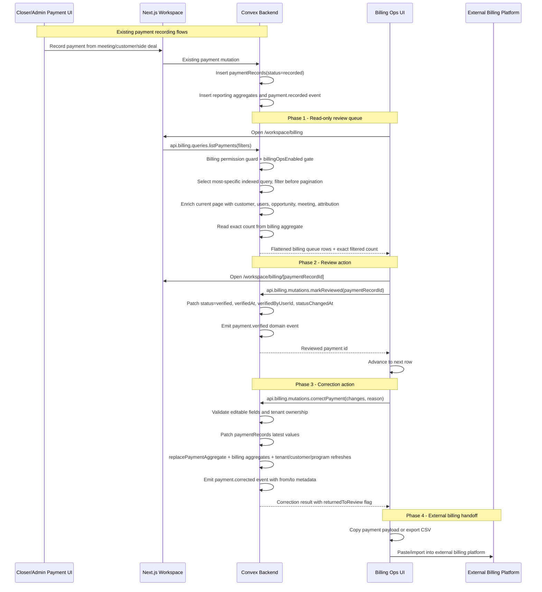

# Billing Ops — Design Specification

**Version:** 0.1 (MVP)  
**Status:** Draft  
**Scope:** The CRM already records payments across closer, admin, side-deal, reminder, and customer contexts. This feature adds a tenant-admin Billing Ops workspace that turns those `paymentRecords` into a review queue, reconstructs customer/payment/attribution context, supports deliberate corrections, and provides copy/export output for an external billing platform.  
**Prerequisite:** Existing WorkOS AuthKit tenant auth, Convex schema, payment recording flows, customer conversion flow, attribution helpers, reporting write hooks, aggregate component, and domain events. MVP assumes `paymentRecords.status = "verified"` means "billing reviewed / ready for external billing"; if product rejects that meaning, switch to the migration path in [10.8 Dedicated Billing Review Fields](#108-dedicated-billing-review-fields).
**Release model:** The phases in this document are build-order sections, not independently shippable increments. Billing Ops must stay disabled per tenant until the route, permissions, indexes, exact count aggregates, backfill verification, queue, focused review page, correction flow, audit history, export audit, export flow, and navigation are all in place.

---

## Table of Contents

1. [Goals & Non-Goals](#1-goals--non-goals)
2. [Actors & Roles](#2-actors--roles)
3. [End-to-End Flow Overview](#3-end-to-end-flow-overview)
4. [Phase 0: Data Audit and Product Lock](#4-phase-0-data-audit-and-product-lock)
5. [Phase 1: Read-Only Billing Queue](#5-phase-1-read-only-billing-queue)
6. [Phase 2: Review Actions](#6-phase-2-review-actions)
7. [Phase 3: Payment Corrections](#7-phase-3-payment-corrections)
8. [Phase 4: Copy and Export Workflow](#8-phase-4-copy-and-export-workflow)
9. [Phase 5: Optional Least-Privilege Billing Role](#9-phase-5-optional-least-privilege-billing-role)
10. [Data Model](#10-data-model)
11. [Convex Function Architecture](#11-convex-function-architecture)
12. [Routing & Authorization](#12-routing--authorization)
13. [Security Considerations](#13-security-considerations)
14. [Error Handling & Edge Cases](#14-error-handling--edge-cases)
15. [Resolved Product Decisions](#15-resolved-product-decisions)
16. [Dependencies](#16-dependencies)
17. [Applicable Skills](#17-applicable-skills)

---

## 1. Goals & Non-Goals

### Goals

- Add `/workspace/billing` as a tenant-scoped operational queue and `/workspace/billing/[paymentRecordId]` as the focused payment review page.
- Reuse `paymentRecords` as the source of truth and query it through indexed, pre-pagination filters.
- Let tenant owners/admins see newly recorded payments with customer, payment registrant, credited phone closer, DM attribution, Slack contributor history, meeting, opportunity, proof, note, and reference context.
- Support a one-payment-at-a-time review workflow that stamps reviewer and review time.
- Provide a deliberate correction flow for payment fields billing operators commonly find wrong: amount, payment type, program, reference code, and note.
- Keep financial edits auditable through `domainEvents` and aggregate refresh hooks.
- Provide exact operational counts for supported Billing filters through Billing-specific aggregate components.
- Keep Billing count aggregates current through explicit write hooks on every payment insert, review, correction, dispute, and void path.
- Gate Billing Ops per tenant through a manual system-admin enablement flag after aggregate backfill verification passes.
- Keep the CRM out of the external billing system's responsibilities: the CRM prepares clean data, copies/exports it, and optionally stores a future external reference.
- Audit CSV export handoffs with actor, filters, counts, and truncation metadata.
- Preserve multi-tenant isolation by resolving `tenantId` from authenticated Convex identity, never from client args.
- Provide a migration branch if "verified" and "billing reviewed" are distinct product states.

### Non-Goals (deferred)

- Becoming the external billing or subscription platform (MVP and future default).
- Payment gateway reconciliation, automated billing API writes, chargebacks, refunds, invoices, tax handling, dunning, or subscription lifecycle management (separate design).
- Editing payment customer/opportunity/meeting links from the Billing Ops MVP; that changes attribution and conversion semantics and needs a repair workflow.
- Editing phone closer attribution from Billing Ops MVP; that affects commissions and should remain an owner/admin attribution correction flow.
- Full immutable payment correction ledger tables in MVP; `domainEvents` is the initial audit trail.
- Adding a dedicated `billing_admin` role in MVP unless tenant-admin access is too broad.
- Text search over customer/name/email/reference. Add a search projection in a later phase if this becomes necessary.
- Shipping a partial Billing Ops slice. The route remains unavailable until the full MVP is verified and enabled for the tenant.
- Changing existing closer payment recording UX or business semantics. Server-side payment write hooks must still be updated so Billing aggregates stay correct for newly recorded payments.
- Changing Calendly, Slack, or webhook ingestion behavior.

---

## 2. Actors & Roles

| Actor | Identity | Auth Method | Key Permissions |
|---|---|---|---|
| Tenant owner | CRM `tenant_master` user | WorkOS AuthKit, member of tenant org | Full Billing Ops access, review, correction, export, and future billing config. |
| Tenant admin | CRM `tenant_admin` user | WorkOS AuthKit, member of tenant org | Billing queue access, review, correction, export, and payment diagnostics. |
| Closer | CRM `closer` user | WorkOS AuthKit, member of tenant org | No Billing Ops route access in MVP. Can continue recording own payments through existing flows. |
| Lead generator | CRM `lead_generator` user | WorkOS AuthKit, member of tenant org | No Billing Ops access. Existing Lead Gen Ops access remains unchanged. |
| Billing operator | Business user acting as owner/admin in MVP | WorkOS AuthKit, tenant-admin CRM role | Reviews payments and transfers normalized data into the external billing platform. |
| External billing platform | Third-party system outside CRM | Manual copy/CSV import in MVP | Receives normalized data from operator; no API integration in MVP. |
| System | Convex queries/mutations | Internal server-side execution | Enriches queue rows, stamps review state, refreshes reporting aggregates, and writes audit events. |

### CRM Role <-> WorkOS Role Mapping

| CRM `users.role` | WorkOS role slug | Billing Ops Access | Notes |
|---|---|---:|---|
| `tenant_master` | `owner` | Full | Existing owner role. |
| `tenant_admin` | `tenant-admin` | Full | MVP billing operator role. |
| `closer` | `closer` | None | Can still record payments in closer flows. |
| `lead_generator` | `lead-generator` | None | Existing Lead Gen Ops worker role. |
| `billing_admin` | `billing-admin` | Optional future | Only add if least-privilege access is required. Requires schema/auth migration. |

### Permission Additions

| Permission | Roles in MVP | Purpose |
|---|---|---|
| `billing:view` | `tenant_master`, `tenant_admin` | Read queue, focused payment page, proof metadata, and review history. |
| `billing:review` | `tenant_master`, `tenant_admin` | Mark payments reviewed from the focused payment page. |
| `billing:correct` | `tenant_master`, `tenant_admin` | Correct safe payment fields with audit reason. |
| `billing:export` | `tenant_master`, `tenant_admin` | Copy/export queue rows for external billing. |

> **Role decision:** Do not add `billing_admin` in MVP. The existing app already treats `tenant_master` and `tenant_admin` as the operational admin roles for payments, customers, reviews, settings, and reports. Adding a narrower role touches WorkOS role config, `users.role`, invite/edit-role UI, route guards, and permission tables, so it belongs in Phase 5 after the workflow is proven.

---

## 3. End-to-End Flow Overview



> **Boundary decision:** Billing Ops is an operational review workflow, not a revenue dashboard. Revenue reporting can consume the same `paymentRecords`, but this feature optimizes for reconstructing one payment, validating it, correcting obvious data entry issues, and moving it out of the review queue.

---

## 4. Phase 0: Data Audit and Product Lock

### 4.1 Audit Current Payment Quality

Before UI work, run bounded Convex admin queries against the production test tenant and recent rows. The goal is to measure whether existing data can reliably reconstruct billing context.

| Check | Source | Pass Condition |
|---|---|---|
| Missing `customerId` | `paymentRecords` | Rare or explainable through incomplete conversion/legacy rows. |
| Missing `meetingId` | `paymentRecords` | Acceptable for side deals/post-conversion payments if opportunity/customer fallback works. |
| Missing `attributedCloserId` on commissionable rows | `paymentRecords` | Zero after legacy compatibility helpers. |
| Missing `recordedByUserId` users | `users` lookup | Zero live rows with unresolved registrants. |
| Missing DM attribution | `meetings`/`opportunities` | Operators still get raw UTM fallback or "none". |
| Missing Slack contributors | `slackQualificationEvents` and `opportunity.qualifiedBy` | Slack-qualified opportunities resolve a bounded contributor timeline with display names or raw Slack IDs. |
| Existing `verified` rows | `paymentRecords.status` | Understand whether any rows already mean payment verification. |

```typescript
// Path: convex/billing/audit.ts
import { v } from "convex/values";
import { query } from "../_generated/server";
import { requireTenantUser } from "../requireTenantUser";

export const getPaymentAuditSnapshot = query({
  args: { limit: v.optional(v.number()) },
  handler: async (ctx, { limit = 200 }) => {
    const { tenantId } = await requireTenantUser(ctx, [
      "tenant_master",
      "tenant_admin",
    ]);

    const payments = await ctx.db
      .query("paymentRecords")
      .withIndex("by_tenantId_and_recordedAt", (q) => q.eq("tenantId", tenantId))
      .order("desc")
      .take(Math.min(limit, 500));

    return {
      totalSampled: payments.length,
      missingCustomerId: payments.filter((p) => !p.customerId).length,
      missingMeetingId: payments.filter((p) => !p.meetingId).length,
      missingAttributedCloserOnCommissionable: payments.filter(
        (p) => p.commissionable && !p.attributedCloserId,
      ).length,
      byStatus: {
        recorded: payments.filter((p) => p.status === "recorded").length,
        verified: payments.filter((p) => p.status === "verified").length,
        disputed: payments.filter((p) => p.status === "disputed").length,
      },
    };
  },
});
```

> **Runtime decision:** Use a public admin-only query for this audit if it is surfaced in the app, or an internal/admin query if it only runs from CLI during rollout. The query must stay bounded and indexed; do not `collect()` all payment records.

The sample query above is only a smoke check. The enablement audit must also verify the linked records and operational counters that Billing Ops depends on:

| Verification | Required Check |
|---|---|
| Linked records | Every exported/reviewable row resolves tenant-owned `recordedByUserId`, active or archived program display data, customer/opportunity/meeting fallback context, and proof metadata without cross-tenant reads. |
| Existing `verified` semantics | Product signs off on whether historical `verified` rows are already billing-reviewed. If not, use [10.8 Dedicated Billing Review Fields](#108-dedicated-billing-review-fields). |
| Billing aggregate backfill | Dry-run and real backfill complete for the target tenant. |
| Count verification | For each supported status/program/type/date filter shape, aggregate counts match indexed batched table checks. |
| Enablement record | Store the verification timestamp, actor, checked filter matrix, and result before the system-admin enable mutation can set `billingOpsEnabled = true`. |

### 4.2 Lock the Review Semantics

MVP assumes:

```text
Needs review = paymentRecords.status === "recorded"
Reviewed = paymentRecords.status === "verified"
Disputed / voided = paymentRecords.status === "disputed"
Reviewer = paymentRecords.verifiedByUserId
Reviewed at = paymentRecords.verifiedAt
```

This works because the current schema already has `verifiedAt`, `verifiedByUserId`, `statusChangedAt`, and an efficient `by_tenantId_and_status_and_recordedAt` index. Code search shows `disputed` is already used by review/void rollback paths; `verified` appears in schema/UI labels but has no existing active verification workflow.

> **Product decision:** Reusing `verified` is the smallest useful version. If finance needs "money verified" and "billing entered/reviewed" as separate states, do not overload `verified`; use [10.8 Dedicated Billing Review Fields](#108-dedicated-billing-review-fields) before implementation.

Implementation must treat both `recorded` and `verified` as active valid payments. Any existing `payment.status === "recorded"` checks that actually mean "not disputed" must be audited and updated, including side-deal void eligibility and opportunity detail payment affordances.

### 4.3 Phase 0 Exit Criteria

| Gate | Required Outcome |
|---|---|
| Product semantics | "Verified equals billing reviewed" accepted, or migration branch selected. |
| Data audit | Smoke sample and linked-record readiness checks prove operators can identify customer/payment/attribution for most rows. |
| Status policy | Corrected reviewed financial payments return to `recorded`; metadata-only corrections remain reviewed. |
| External reference policy | Decide whether external billing IDs are required in MVP. Default: no storage. |
| Enablement policy | `tenants.billingOpsEnabled` defaults disabled; only system admin enables after aggregate backfill and persisted verification pass. |
| Filter policy | Supported queue filters have matching indexes and exact count aggregate keys before pagination. |

---

## 5. Phase 1: Read-Only Billing Queue

### 5.1 Queue Shape

The first usable surface is read-only. It gives billing operators a trustworthy queue without introducing write risk.

Default filters:

| Filter | Default | Notes |
|---|---|---|
| Status | `recorded` | Required single status: `recorded`, `verified`, or `disputed`. No `all` status in MVP. |
| Date range | Unset | Never hide old unreviewed payments by default. Date bounds are explicit filters only. |
| Payment type | All | Server-side filter over `pif`, `split`, `monthly`, `deposit`. |
| Program | All | Server-side filter from `payment.programId`. |
| Search | Deferred | Do not include text search in MVP; add a projection/search index later. |

Filtering must happen before pagination. Do not fetch a page and then client-filter by program/type/date because that can produce empty or incomplete pages while matching records exist later in the index.

Row shape:

```typescript
// Path: convex/billing/types.ts
import type { Id } from "../_generated/dataModel";

export type BillingPaymentStatus = "recorded" | "verified" | "disputed";

export type BillingPaymentRow = {
  payment: {
    id: Id<"paymentRecords">;
    amountMinor: number;
    currency: string;
    recordedAt: number;
    status: BillingPaymentStatus;
    paymentType: "monthly" | "split" | "pif" | "deposit";
    programId: Id<"tenantPrograms">;
    programName: string;
    origin: string;
    contextType: "opportunity" | "customer";
    referenceCode: string | null;
    note: string | null;
    hasProofFile: boolean;
    commissionable: boolean;
  };
  customer: {
    id: Id<"customers"> | null;
    fullName: string | null;
    email: string | null;
    phone: string | null;
  };
  opportunity: {
    id: Id<"opportunities"> | null;
    status: string | null;
    source: string | null;
  };
  meeting: {
    id: Id<"meetings"> | null;
    scheduledAt: number | null;
  };
  enteredBy: { id: Id<"users">; name: string };
  phoneCloser: { id: Id<"users"> | null; name: string | null };
  dmAttribution: {
    status: "mapped" | "unmapped" | "internal" | "none";
    teamName: string | null;
    dmCloserName: string | null;
    rawSource: string | null;
    rawMedium: string | null;
  };
  slackContributorSummary: {
    firstLabel: string | null;
    latestLabel: string | null;
    count: number;
  };
  review: {
    reviewedAt: number | null;
    reviewerName: string | null;
  };
};
```

### 5.2 Paginated Query

The main query must choose the most specific supported index, apply filters before pagination, then enrich only the current page. This keeps reads bounded while preserving correct pages and exact counts.

```typescript
// Path: convex/billing/queries.ts
import { paginationOptsValidator } from "convex/server";
import { v } from "convex/values";
import { query } from "../_generated/server";
import { requireBillingOpsEnabled, requireBillingPermission } from "./guards";

const billingStatusValidator = v.union(
  v.literal("recorded"),
  v.literal("verified"),
  v.literal("disputed"),
);

export const listPayments = query({
  args: {
    status: billingStatusValidator,
    programId: v.optional(v.id("tenantPrograms")),
    paymentType: v.optional(
      v.union(
        v.literal("monthly"),
        v.literal("split"),
        v.literal("pif"),
        v.literal("deposit"),
      ),
    ),
    startAt: v.optional(v.number()),
    endAt: v.optional(v.number()),
    paginationOpts: paginationOptsValidator,
  },
  handler: async (ctx, args) => {
    const { tenantId } = await requireBillingPermission(ctx, "billing:view");
    await requireBillingOpsEnabled(ctx, tenantId);

    const page = await selectBillingPaymentQuery(ctx, tenantId, args)
      .order("desc")
      .paginate(args.paginationOpts);

    return {
      ...page,
      page: await enrichBillingPaymentRows(ctx, tenantId, page.page),
      exactCount: await countBillingPayments(ctx, tenantId, args),
    };
  },
});
```

`selectBillingPaymentQuery` branches by filter shape:

| Filters Present | Required Index |
|---|---|
| Status only, optional date | `by_tenantId_and_status_and_recordedAt` |
| Status + program, optional date | `by_tenantId_and_status_and_programId_and_recordedAt` |
| Status + payment type, optional date | `by_tenantId_and_status_and_paymentType_and_recordedAt` |
| Status + program + payment type, optional date | `by_tenantId_and_status_and_programId_and_paymentType_and_recordedAt` |

> **Data decision:** Do not create a separate `billingPaymentQueue` table for MVP. `paymentRecords` remains the source of truth, but the schema must add the status/program/type compound indexes above. A projection table only becomes justified if text search or additional derived filters become mandatory.

### 5.3 Enrichment Rules

| Billing Need | Preferred Source | Fallback |
|---|---|---|
| Customer | `payment.customerId` | `payment.opportunityId -> opportunity.leadId -> customers.by_tenantId_and_leadId` |
| Opportunity | `payment.opportunityId` | `payment.originatingOpportunityId`, then customer winning opportunity |
| Meeting | `payment.meetingId` | `customer.winningMeetingId`, `opportunity.firstMeetingId`, `opportunity.latestMeetingId` |
| Entered by | `payment.recordedByUserId` | Error label if missing |
| Phone closer | `payment.attributedCloserId` | `meeting.assignedCloserId`, `opportunity.assignedCloserId` for display only |
| DM attribution | `meeting.attributionTeamId/dmCloserId` | `opportunity.attributionTeamId/dmCloserId`, raw UTM |
| Slack contributor summary | `slackQualificationEvents.by_tenantId_and_opportunityId_and_submittedAt` | `opportunity.qualifiedBy` as legacy/original fallback |
| Reviewed by | `payment.verifiedByUserId` | `null` |

The query should reuse or extract the DM/phone/program parts of `buildOpportunityAttributionPayload(ctx, opportunity, { meeting })`, but Billing Ops must not directly inherit that helper's current "latest Slack qualification event" behavior for the contributor summary. Use a billing-specific contributor resolver that lists bounded qualification events from first to latest and renders Slack display labels. The contributor timeline is reviewer context only; it does not alter payment attribution or commission logic.

```typescript
// Path: convex/billing/enrichment.ts
import type { Doc, Id } from "../_generated/dataModel";
import type { QueryCtx } from "../_generated/server";
import { buildOpportunityAttributionPayload } from "../lib/attribution/detailPayload";

export async function resolveBillingAttribution(
  ctx: QueryCtx,
  opportunity: Doc<"opportunities"> | null,
  meeting: Doc<"meetings"> | null,
) {
  if (!opportunity) {
    return {
      slackContributorSummary: {
        firstLabel: null,
        latestLabel: null,
        count: 0,
      },
      dmAttribution: {
        status: "none" as const,
        teamName: null,
        dmCloserName: null,
        rawSource: null,
        rawMedium: null,
      },
      phoneCloser: null,
    };
  }

  const payload = await buildOpportunityAttributionPayload(ctx, opportunity, {
    meeting,
  });

  return {
    slackContributorSummary: await resolveSlackContributorSummary(
      ctx,
      opportunity,
    ),
    dmAttribution: payload.dmAttribution,
    phoneCloser: payload.phoneCloser,
  };
}
```

> **Performance decision:** Enrich the paginated page, not the whole queue. For MVP page sizes, direct `ctx.db.get()` calls and bounded `Promise.all` are acceptable. If query fan-out becomes visible in Convex insights, batch the user/customer/opportunity/meeting lookups by unique IDs inside the enrichment helper.

### 5.4 Focused Review Page

The queue and review surfaces are separate routes:

| Route | Responsibility |
|---|---|
| `/workspace/billing` | Queue, filters, exact counts, export, and open actions. No review or correction mutation buttons. |
| `/workspace/billing/[paymentRecordId]` | Focused payment review, proof viewing, correction form, copy payload, contributor timeline, and payment event history. |

| Area | Contents |
|---|---|
| Queue list | Paid at, customer, amount, program, type, entered by, phone closer, attribution chips, status. |
| Payment summary | Amount, currency, type, program, origin, commissionable flag, recorded at. |
| Customer identifiers | Name, email, phone, customer link. |
| Proof/reference | Proof file open/download affordance, reference code, note. |
| Attribution chain | Entered by, phone closer, DM team/closer, raw UTM, Slack contributor summary. |
| Slack contributor timeline | Bounded first-to-latest list of linked `slackQualificationEvents`; informational only. |
| Source links | Opportunity, meeting, customer. |
| Payment event history | Bounded newest-first `domainEvents` for `entityType = "payment"` and this payment id. |
| External payload | Copy-ready normalized field list. |

Do not block the queue on proof image previews. Proof viewing belongs on the focused review page and should use the existing authenticated Convex storage URL pattern after tenant authorization. Do not add an unauthenticated download route in MVP.

The focused page query should load one payment by id, verify tenant ownership, enrich full context, and include:

| Detail Data | Source/Limit |
|---|---|
| Proof metadata and URL | `proofFileId` through authenticated `ctx.storage.getUrl()` after tenant check. |
| Slack contributor timeline | `slackQualificationEvents.by_tenantId_and_opportunityId_and_submittedAt`, first-to-latest, bounded to 25. |
| Payment event history | `domainEvents.by_tenantId_and_entityType_and_entityId_and_occurredAt`, newest-first, bounded to 50. |
| Correction/review actions | Only mounted on this focused route. |

---

## 6. Phase 2: Review Actions

### 6.1 Mark Reviewed

`markReviewed` is a Convex mutation exposed only from `/workspace/billing/[paymentRecordId]`. It patches the existing payment row and writes a domain event after the operator has reviewed the full payment context.

```typescript
// Path: convex/billing/mutations.ts
import { v } from "convex/values";
import { mutation } from "../_generated/server";
import { emitDomainEvent } from "../lib/domainEvents";
import { replaceBillingPaymentAggregates } from "./aggregates";
import { requireBillingOpsEnabled, requireBillingPermission } from "./guards";

export const markReviewed = mutation({
  args: { paymentRecordId: v.id("paymentRecords") },
  returns: v.null(),
  handler: async (ctx, { paymentRecordId }) => {
    const { tenantId, userId } = await requireBillingPermission(
      ctx,
      "billing:review",
    );
    await requireBillingOpsEnabled(ctx, tenantId);
    const payment = await ctx.db.get(paymentRecordId);
    if (!payment || payment.tenantId !== tenantId) {
      throw new Error("Payment not found.");
    }
    if (payment.status === "disputed") {
      throw new Error("Disputed payments cannot be marked reviewed.");
    }
    if (payment.status === "verified") {
      return null;
    }

    const now = Date.now();
    const reviewPatch = {
      status: "verified",
      verifiedAt: now,
      verifiedByUserId: userId,
      statusChangedAt: now,
    } as const;
    await ctx.db.patch(paymentRecordId, reviewPatch);
    await replaceBillingPaymentAggregates(ctx, payment, {
      ...payment,
      ...reviewPatch,
    });

    await emitDomainEvent(ctx, {
      tenantId,
      entityType: "payment",
      entityId: paymentRecordId,
      eventType: "payment.verified",
      source: "admin",
      actorUserId: userId,
      fromStatus: payment.status,
      toStatus: "verified",
      occurredAt: now,
      metadata: {
        amountMinor: payment.amountMinor,
        currency: payment.currency,
        paymentType: payment.paymentType,
        programId: payment.programId,
      },
    });

    return null;
  },
});
```

> **Mutation decision:** A mutation is correct because review is a transactional database update with no external network calls. It must derive tenant and actor from the Billing guard, not from client-supplied IDs. The queue may link to the focused page, but it must not expose a row-level review shortcut. Because review changes the status key used by Billing count aggregates, `markReviewed` must replace Billing aggregate entries in the same transaction.

### 6.2 Needs Info / Disputed

MVP should not overload `disputed` for ordinary "needs info" unless product accepts that "needs info" removes the payment from active revenue. Current code treats `disputed` like a void/dispute state in review rollback and side-deal void flows, and customer payment summaries exclude disputed rows.

Recommended MVP:

| UI Action | Data Change | Meaning |
|---|---|---|
| Mark reviewed | `status = "verified"` | Billing checked/entered payment. |
| Leave unreviewed | no change | Billing needs more information but does not alter revenue. |
| Dispute/void | existing specialist flows only | Payment is invalid and should be removed from revenue/summary logic. |

If Billing Ops needs a separate "needs info" queue, add dedicated billing review fields instead of using `status = "disputed"`.

### 6.3 Exact Review Counts

Billing Ops requires exact counts for every supported filter combination before the route is enabled. These counts are operational metadata, not revenue totals.

| Metric | Source |
|---|---|
| Exact filtered count | Billing-specific aggregate components keyed by status/program/type/date. |
| Exact all-time count for a filter | Same aggregate with prefix bounds and no date bounds. |
| Exact period count for a filter | Same aggregate with `recordedAt` lower/upper bounds. |
| Oldest unreviewed | Indexed first row from `by_tenantId_and_status_and_recordedAt` for `status = "recorded"`. |

Defer average review latency and reviewed-by-operator breakdown until dedicated aggregate keys exist. Do not compute them with unbounded scans.

---

## 7. Phase 3: Payment Corrections

### 7.1 Editable Fields

| Field | MVP Editable | Reason |
|---|---:|---|
| Display amount | Yes | Primary billing mismatch. UI asks for normal currency amount; server converts to `amountMinor`. |
| `paymentType` | Yes | Affects final/deposit revenue bucket. |
| `programId`, `programName` | Yes | Affects sold-program/reporting dimensions. Select active programs only. |
| `referenceCode` | Yes | Low-risk billing metadata. |
| `note` | Yes | Low-risk audit context. |
| `currency` | No by default | Enable only if multi-currency mistakes are real. |
| `proofFileId` | Deferred | Storage replacement UX needs separate handling. |
| `customerId` | Deferred | Changes conversion/customer linkage. |
| `opportunityId` / `meetingId` | Deferred | Changes attribution chain. |
| `attributedCloserId` | Deferred | Changes commission attribution. |

### 7.2 Correction Mutation

Every correction requires a non-empty reason. The mutation snapshots old values in the `payment.corrected` domain event, patches only changed editable fields, refreshes aggregates, and decides whether the row should return to the review queue. If normalized submitted values do not change anything, return a no-op result and do not emit a domain event.

If a reviewed payment receives a financial correction, the UI must show a blocking confirmation before submit warning that the payment will return to review. After a successful correction, route the operator to `/workspace/billing/[paymentRecordId]` for that same payment so it can be re-reviewed immediately.

```typescript
// Path: convex/billing/mutations.ts
import { v } from "convex/values";
import type { Doc } from "../_generated/dataModel";
import { mutation } from "../_generated/server";
import { emitDomainEvent } from "../lib/domainEvents";
import { toAmountMinor } from "../lib/formatMoney";
import { syncCustomerPaymentSummary } from "../lib/paymentHelpers";
import { refreshSoldProgramCachesForPaymentContext } from "../lib/soldProgramCache";
import { replaceTenantPaymentStatsForCorrection } from "../lib/tenantStatsHelper";
import { replacePaymentAggregate } from "../reporting/writeHooks";
import { replaceBillingPaymentAggregates } from "./aggregates";
import { requireBillingOpsEnabled, requireBillingPermission } from "./guards";
import { billingStatusValidator } from "./validators";

export const correctPayment = mutation({
  args: {
    paymentRecordId: v.id("paymentRecords"),
    amount: v.optional(v.number()),
    paymentType: v.optional(
      v.union(
        v.literal("monthly"),
        v.literal("split"),
        v.literal("pif"),
        v.literal("deposit"),
      ),
    ),
    programId: v.optional(v.id("tenantPrograms")),
    referenceCode: v.optional(v.string()),
    note: v.optional(v.string()),
    reason: v.string(),
  },
  returns: v.object({
    paymentRecordId: v.id("paymentRecords"),
    status: billingStatusValidator,
    returnedToReview: v.boolean(),
    changed: v.boolean(),
  }),
  handler: async (ctx, args) => {
    const { tenantId, userId } = await requireBillingPermission(
      ctx,
      "billing:correct",
    );
    await requireBillingOpsEnabled(ctx, tenantId);
    const payment = await ctx.db.get(args.paymentRecordId);
    if (!payment || payment.tenantId !== tenantId) {
      throw new Error("Payment not found.");
    }
    if (payment.status === "disputed") {
      throw new Error("Disputed payments must be repaired through a dispute flow.");
    }

    const reason = args.reason.trim();
    if (!reason) {
      throw new Error("A correction reason is required.");
    }

    const patch: Partial<Doc<"paymentRecords">> = {};
    const changedKeys: Array<keyof Doc<"paymentRecords">> = [];

    if (args.amount !== undefined) {
      const amountMinor = toAmountMinor(args.amount);
      if (amountMinor !== payment.amountMinor) {
        patch.amountMinor = amountMinor;
        changedKeys.push("amountMinor");
      }
    }
    if (args.paymentType !== undefined && args.paymentType !== payment.paymentType) {
      patch.paymentType = args.paymentType;
      changedKeys.push("paymentType");
    }
    if (args.programId !== undefined && args.programId !== payment.programId) {
      const program = await ctx.db.get(args.programId);
      if (!program || program.tenantId !== tenantId || program.archivedAt !== undefined) {
        throw new Error("Program not found.");
      }
      patch.programId = program._id;
      patch.programName = program.name;
      changedKeys.push("programId", "programName");
    }
    if (args.referenceCode !== undefined) {
      const nextReferenceCode = args.referenceCode.trim() || undefined;
      if (nextReferenceCode !== payment.referenceCode) {
        patch.referenceCode = nextReferenceCode;
        changedKeys.push("referenceCode");
      }
    }
    if (args.note !== undefined) {
      const nextNote = args.note.trim() || undefined;
      if (nextNote !== payment.note) {
        patch.note = nextNote;
        changedKeys.push("note");
      }
    }

    if (changedKeys.length === 0) {
      return {
        paymentRecordId: args.paymentRecordId,
        status: payment.status,
        returnedToReview: false,
        changed: false,
      };
    }

    const financialChange = changedKeys.some((key) =>
      ["amountMinor", "paymentType", "programId", "programName"].includes(key),
    );
    const now = Date.now();
    const returnToReview = financialChange && payment.status === "verified";
    if (returnToReview) {
      patch.status = "recorded";
      patch.verifiedAt = undefined;
      patch.verifiedByUserId = undefined;
      patch.statusChangedAt = now;
    }

    await ctx.db.patch(args.paymentRecordId, patch);
    const nextPayment = await replacePaymentAggregate(ctx, payment, args.paymentRecordId);
    await replaceBillingPaymentAggregates(ctx, payment, nextPayment);

    if (financialChange) {
      await replaceTenantPaymentStatsForCorrection(ctx, tenantId, {
        before: payment,
        after: nextPayment,
      });
    }

    if (payment.customerId) {
      await syncCustomerPaymentSummary(ctx, payment.customerId);
    }
    if (patch.programId !== undefined) {
      await refreshSoldProgramCachesForPaymentContext(ctx, {
        tenantId,
        payment: nextPayment,
      });
    }

    await emitDomainEvent(ctx, {
      tenantId,
      entityType: "payment",
      entityId: args.paymentRecordId,
      eventType: "payment.corrected",
      source: "admin",
      actorUserId: userId,
      fromStatus: payment.status,
      toStatus: returnToReview ? "recorded" : payment.status,
      reason,
      occurredAt: now,
      metadata: buildCorrectionMetadata(payment, nextPayment, changedKeys, {
        returnedToReview: returnToReview,
      }),
    });

    return {
      paymentRecordId: args.paymentRecordId,
      status: nextPayment.status,
      returnedToReview: returnToReview,
      changed: true,
    };
  },
});

function buildCorrectionMetadata(
  before: Doc<"paymentRecords">,
  after: Doc<"paymentRecords">,
  changedKeys: Array<keyof Doc<"paymentRecords">>,
  options: { returnedToReview: boolean },
) {
  const changed: Record<string, unknown> = {};
  for (const key of changedKeys) {
    changed[key] = { from: before[key] ?? null, to: after[key] ?? null };
  }
  changed.returnedToReview = options.returnedToReview;
  return changed;
}
```

> **Financial integrity decision:** If a reviewed payment receives a financial correction, move it back to `recorded` and clear the reviewer stamp. A low-risk metadata correction like reference code or note can remain reviewed because the billing substance did not change. Every actual correction still needs a reason; no-op submissions do not write domain events.

### 7.3 Correction Metadata

`domainEvents.metadata` stores JSON. Correction events should include only changed fields and enough old/new values to reconstruct the audit trail.

```json
{
  "amountMinor": { "from": 300000, "to": 350000 },
  "paymentType": { "from": "deposit", "to": "pif" },
  "programName": { "from": "Legacy Program", "to": "Premium Program" },
  "returnedToReview": true
}
```

### 7.4 Aggregate Refresh Requirements

| Change | Required Refresh |
|---|---|
| Amount | `replacePaymentAggregate`, `replaceBillingPaymentAggregates`, replacement-style tenant stats delta, `syncCustomerPaymentSummary`. |
| Payment type | `replacePaymentAggregate`, `replaceBillingPaymentAggregates`, replacement-style tenant stats bucket move, `syncCustomerPaymentSummary`. |
| Program | Patch payment program fields, `replaceBillingPaymentAggregates`, refresh sold-program caches for `payment.opportunityId ?? payment.originatingOpportunityId` and relevant customer conversion context. |
| Reference/note | Domain event only. |
| Status reset after correction | `statusChangedAt`, review fields cleared, domain event from/to status. |

Do not implement amount/type corrections by calling `applyPaymentStatsDelta` once for the old value and once for the new value. That helper changes `totalPaymentRecords` based on amount sign and is meant for insert/delete style deltas. Corrections need a replacement helper that changes `totalRevenueMinor` and type buckets without changing `totalPaymentRecords`, `wonDeals`, or active opportunity counters.

For program corrections, always patch the payment's `programId/programName`. Refresh sold-program caches using both opportunity-linked payments and customer-direct payments tied by `originatingOpportunityId`, choosing the latest non-disputed relevant payment. Patch `customers.programId/programName` only when the corrected payment is the customer's winning/conversion payment.

---

## 8. Phase 4: Copy and Export Workflow

### 8.1 Copy Payload

The focused review page should expose a copy-ready payload. This is client-side formatting from the already-loaded detail row, not a new mutation.

| Label | Source |
|---|---|
| Payment ID | `payment.id` |
| Paid at | `payment.recordedAt` |
| Reviewed at | `review.reviewedAt` |
| Reviewer | `review.reviewerName` |
| Customer name | `customer.fullName` |
| Customer email | `customer.email` |
| Customer phone | `customer.phone` |
| Amount | `amountMinor / 100` |
| Currency | `currency` |
| Payment program | `programName` |
| Payment type | `paymentType` |
| Reference code | `referenceCode` |
| Internal note | `note` |
| Entered by | `enteredBy.name` |
| Phone closer | `phoneCloser.name` |
| DM team | `dmAttribution.teamName` |
| DM closer | `dmAttribution.dmCloserName` |
| Slack contributor summary | Primary contributor label and contributor count; full timeline stays in CRM. |
| Opportunity ID | `opportunity.id` |
| Meeting ID | `meeting.id` |

### 8.2 CSV Export

MVP export should use the same server-side filters as the visible queue and cap the export. Export filtering happens before the bounded read, using the same index branch as `listPayments`. If billing needs all historical rows, implement a server-side paginated export job later rather than a single unbounded query.

```typescript
// Path: convex/billing/queries.ts
import { v } from "convex/values";
import { query } from "../_generated/server";
import { requireTenantUser } from "../requireTenantUser";

export const exportPayments = query({
  args: {
    status: billingStatusValidator,
    programId: v.optional(v.id("tenantPrograms")),
    paymentType: v.optional(paymentTypeValidator),
    startAt: v.optional(v.number()),
    endAt: v.optional(v.number()),
    limit: v.optional(v.number()),
  },
  handler: async (ctx, args) => {
    const { tenantId } = await requireBillingPermission(ctx, "billing:export");
    await requireBillingOpsEnabled(ctx, tenantId);

    const limit = Math.min(args.limit ?? 500, 1000);
    const exactCount = await countBillingPayments(ctx, tenantId, args);
    const rows = await selectBillingPaymentQuery(ctx, tenantId, args)
      .order("desc")
      .take(limit);

    return {
      rows: await enrichBillingPaymentRows(ctx, tenantId, rows),
      exactCount,
      truncated: exactCount > limit,
    };
  },
});
```

The frontend should serialize with the formula-safe CSV utility from `lib/csv.ts`, not the older basic escaping helper. Export proof availability as a boolean; do not expose signed proof-file URLs in CSV by default. Storage URLs are time-limited and can leak sensitive payment evidence outside CRM. Keep proof viewing inside authenticated CRM UI.

Because export moves customer and payment data out of CRM, it needs a lightweight audit trail. Queries cannot write audit events, so the export UI should call a small `recordExportAudit` mutation immediately before generating the CSV. The log row must include actor, tenant, normalized filters, exact count, exported row count, `truncated`, and timestamp. Copying the single-payment payload from the focused review page is intentionally not logged in MVP because the operator is already viewing that payment; revisit this if compliance requires tracking every clipboard action.

### 8.3 External Billing Reference

Do not store external billing IDs in MVP unless operators need reconciliation back inside CRM. If required, prefer dedicated billing fields rather than overloading `referenceCode`, because `referenceCode` is payment proof/reference metadata captured at payment time.

---

## 9. Phase 5: Optional Least-Privilege Billing Role

Only add `billing_admin` after MVP if tenant-admin access is too broad.

Required changes:

| Area | Change |
|---|---|
| WorkOS | Create `billing-admin` role slug in dev and production. |
| Convex schema | Widen `users.role` union to include `billing_admin`. |
| Role mapping | Add CRM/WorkOS mapping. |
| Permissions | Add billing permissions to `billing_admin`; decide whether reports/customers access is needed. |
| Team UI | Invite/edit-role dialogs must support the role. |
| Workspace shell | Add billing-only nav and home route. |
| Route guards | Allow `/workspace/billing`; deny broader admin pages unless explicitly permitted. |
| Migration | Manual assignment or explicit migration for existing billing users. |

> **Migration decision:** This is a schema/auth change, so use the `convex-migration-helper` skill before implementation. Start with a widen-only deployment, assign users after route guards exist, then narrow only if any temporary compatibility fields were introduced.

---

## 10. Data Model

### 10.1 MVP Modified: `tenants` Table

Add a tenant-scoped enable flag. This is a widen-only optional schema change; `undefined` is treated as disabled.

```typescript
// Path: convex/schema.ts
tenants: defineTable({
  // ... existing fields ...
  billingOpsEnabled: v.optional(v.boolean()),
})
```

Only system-admin mutations can set this flag. Enable it manually after Billing aggregate backfill and verification pass for the tenant.

### 10.2 MVP Modified: `paymentRecords` Table

The MVP reuses existing payment review fields and adds compound indexes that match every supported Billing filter combination.

```typescript
// Path: convex/schema.ts
paymentRecords: defineTable({
  tenantId: v.id("tenants"),
  opportunityId: v.optional(v.id("opportunities")),
  meetingId: v.optional(v.id("meetings")),
  attributedCloserId: v.optional(v.id("users")),
  amountMinor: v.number(),
  currency: v.string(),
  recordedByUserId: v.id("users"),
  commissionable: v.boolean(),
  programId: v.id("tenantPrograms"),
  programName: v.string(),
  paymentType: paymentTypeValidator,
  referenceCode: v.optional(v.string()),
  proofFileId: v.optional(v.id("_storage")),
  note: v.optional(v.string()),
  status: v.union(
    v.literal("recorded"),
    v.literal("verified"),
    v.literal("disputed"),
  ),
  verifiedAt: v.optional(v.number()),
  verifiedByUserId: v.optional(v.id("users")),
  statusChangedAt: v.optional(v.number()),
  recordedAt: v.number(),
  customerId: v.optional(v.id("customers")),
  originatingOpportunityId: v.optional(v.id("opportunities")),
  contextType: v.union(v.literal("opportunity"), v.literal("customer")),
  origin: paymentOriginValidator,
  })
  .index("by_tenantId_and_status_and_recordedAt", [
    "tenantId",
    "status",
    "recordedAt",
  ])
  .index("by_tenantId_and_status_and_programId_and_recordedAt", [
    "tenantId",
    "status",
    "programId",
    "recordedAt",
  ])
  .index("by_tenantId_and_status_and_paymentType_and_recordedAt", [
    "tenantId",
    "status",
    "paymentType",
    "recordedAt",
  ])
  .index("by_tenantId_and_status_and_programId_and_paymentType_and_recordedAt", [
    "tenantId",
    "status",
    "programId",
    "paymentType",
    "recordedAt",
  ])
  .index("by_tenantId_and_recordedAt", ["tenantId", "recordedAt"])
  .index("by_customerId_and_recordedAt", ["customerId", "recordedAt"])
  .index("by_opportunityId", ["opportunityId"]),
```

### 10.3 MVP Modified: `slackQualificationEvents`

Add a date-sorted opportunity index so Billing can display contributor history first-to-latest without relying on unsorted duplicate-event reads.

```typescript
// Path: convex/schema.ts
slackQualificationEvents: defineTable({
  // ... existing fields ...
})
  .index("by_tenantId_and_opportunityId_and_submittedAt", [
    "tenantId",
    "opportunityId",
    "submittedAt",
  ])
```

### 10.4 MVP Modified: `domainEvents`

No schema change is required. Add event type usage and UI labels:

| Event Type | When |
|---|---|
| `payment.verified` | Billing operator marks a payment reviewed. |
| `payment.corrected` | Billing operator changes an editable field. |
| `payment.disputed` | Existing review dispute flow marks an invalid payment. |
| `payment.voided` | Existing side-deal void flow invalidates a side-deal payment. Keep this existing event type. |

Do not rename existing payment event types during the Billing Ops rollout. Add UI labels for `payment.corrected` and `payment.voided` alongside the existing `payment.recorded`, `payment.verified`, and `payment.disputed` labels.

```typescript
// Path: convex/schema.ts
domainEvents: defineTable({
  tenantId: v.id("tenants"),
  entityType: v.union(
    v.literal("opportunity"),
    v.literal("meeting"),
    v.literal("lead"),
    v.literal("customer"),
    v.literal("followUp"),
    v.literal("user"),
    v.literal("payment"),
    v.literal("slackInstallation"),
  ),
  entityId: v.string(),
  eventType: v.string(),
  occurredAt: v.number(),
  actorUserId: v.optional(v.id("users")),
  source: v.union(
    v.literal("closer"),
    v.literal("admin"),
    v.literal("pipeline"),
    v.literal("system"),
  ),
  fromStatus: v.optional(v.string()),
  toStatus: v.optional(v.string()),
  reason: v.optional(v.string()),
  metadata: v.optional(v.string()),
})
  .index("by_tenantId_and_eventType_and_occurredAt", [
    "tenantId",
    "eventType",
    "occurredAt",
  ])
  .index("by_tenantId_and_entityType_and_entityId_and_occurredAt", [
    "tenantId",
    "entityType",
    "entityId",
    "occurredAt",
  ]),
```

### 10.5 MVP Modified: Billing Count Aggregates

Add Billing-specific aggregate components. These count all tenant payment records by operational status/filter, including `disputed`; they are not revenue aggregates and must not replace `paymentSums`.

```typescript
// Path: convex/convex.config.ts
app.use(aggregate, { name: "billingPaymentsByStatus" });
app.use(aggregate, { name: "billingPaymentsByStatusProgram" });
app.use(aggregate, { name: "billingPaymentsByStatusType" });
app.use(aggregate, { name: "billingPaymentsByStatusProgramType" });

// Path: convex/reporting/aggregates.ts or convex/billing/aggregates.ts
export const billingPaymentsByStatus = new TableAggregate<{
  Namespace: Id<"tenants">;
  Key: [Doc<"paymentRecords">["status"], number];
  DataModel: DataModel;
  TableName: "paymentRecords";
}>(components.billingPaymentsByStatus, {
  namespace: (doc) => doc.tenantId,
  sortKey: (doc) => [doc.status, doc.recordedAt],
});

export const billingPaymentsByStatusProgram = new TableAggregate<{
  Namespace: Id<"tenants">;
  Key: [Doc<"paymentRecords">["status"], Id<"tenantPrograms">, number];
  DataModel: DataModel;
  TableName: "paymentRecords";
}>(components.billingPaymentsByStatusProgram, {
  namespace: (doc) => doc.tenantId,
  sortKey: (doc) => [doc.status, doc.programId, doc.recordedAt],
});

export const billingPaymentsByStatusType = new TableAggregate<{
  Namespace: Id<"tenants">;
  Key: [Doc<"paymentRecords">["status"], Doc<"paymentRecords">["paymentType"], number];
  DataModel: DataModel;
  TableName: "paymentRecords";
}>(components.billingPaymentsByStatusType, {
  namespace: (doc) => doc.tenantId,
  sortKey: (doc) => [doc.status, doc.paymentType, doc.recordedAt],
});

export const billingPaymentsByStatusProgramType = new TableAggregate<{
  Namespace: Id<"tenants">;
  Key: [
    Doc<"paymentRecords">["status"],
    Id<"tenantPrograms">,
    Doc<"paymentRecords">["paymentType"],
    number,
  ];
  DataModel: DataModel;
  TableName: "paymentRecords";
}>(components.billingPaymentsByStatusProgramType, {
  namespace: (doc) => doc.tenantId,
  sortKey: (doc) => [
    doc.status,
    doc.programId,
    doc.paymentType,
    doc.recordedAt,
  ],
});
```

Billing aggregate helpers must be called from every path that inserts or changes a payment row:

| Payment Path | Required Billing Aggregate Hook |
|---|---|
| Closer meeting payment, reminder payment, side-deal payment, admin/customer-direct payment, and shared outcome helper inserts | `insertBillingPaymentAggregates(ctx, payment)` after the `paymentRecords` insert. |
| Billing review (`recorded -> verified`) | `replaceBillingPaymentAggregates(ctx, oldPayment, nextPayment)` in the same mutation. |
| Billing correction | `replaceBillingPaymentAggregates(ctx, oldPayment, nextPayment)` whenever any aggregate key can change: status, program, payment type, or recorded date if later added. |
| Existing dispute/void flows | `replaceBillingPaymentAggregates(ctx, oldPayment, nextPayment)` when a payment moves to `disputed` or a void flow marks it invalid. |
| Tenant reset/replay/delete tooling | Clear or rebuild Billing aggregate namespaces alongside `paymentSums`. |

The helper contract should mirror `reporting/writeHooks.ts`: insert on new rows, replace on old/new row changes, and delete/clear only for tenant-reset tooling. Do not rely on the one-time backfill to keep counts correct after enablement.

Backfill these aggregates before enabling Billing Ops for any tenant. Verification must compare aggregate counts against indexed, batched table checks for the test tenant and record the result before `billingOpsEnabled` is set.

### 10.6 MVP Added: `billingExportEvents`

Add a small audit table for filtered CSV exports. This avoids overloading `domainEvents`, whose `entityType` union is entity-oriented and does not currently have a Billing/export entity.

```typescript
// Path: convex/schema.ts
billingExportEvents: defineTable({
  tenantId: v.id("tenants"),
  actorUserId: v.id("users"),
  filtersJson: v.string(),
  exactCount: v.number(),
  exportedCount: v.number(),
  truncated: v.boolean(),
  createdAt: v.number(),
})
  .index("by_tenantId_and_createdAt", ["tenantId", "createdAt"])
  .index("by_tenantId_and_actorUserId_and_createdAt", [
    "tenantId",
    "actorUserId",
    "createdAt",
  ])
```

`recordExportAudit` writes one row per CSV export attempt after the export query returns counts and before the browser downloads the file. Keep `filtersJson` normalized and compact; it should contain status, program id/name when present, payment type, date bounds, export cap, and whether the result was truncated.

### 10.7 MVP Modified: `permissions`

```typescript
// Path: convex/lib/permissions.ts
export const PERMISSIONS = {
  // ... existing permissions ...
  "billing:view": ["tenant_master", "tenant_admin"],
  "billing:review": ["tenant_master", "tenant_admin"],
  "billing:correct": ["tenant_master", "tenant_admin"],
  "billing:export": ["tenant_master", "tenant_admin"],
} as const;
```

### 10.8 Dedicated Billing Review Fields

Use this branch only if product rejects reuse of `verified`.

```typescript
// Path: convex/schema.ts
paymentRecords: defineTable({
  // ... existing fields ...
  billingReviewStatus: v.optional(
    v.union(
      v.literal("unreviewed"),
      v.literal("reviewed"),
      v.literal("needs_info"),
    ),
  ),
  billingReviewedAt: v.optional(v.number()),
  billingReviewedByUserId: v.optional(v.id("users")),
  billingExternalReference: v.optional(v.string()),
  billingReviewNote: v.optional(v.string()),
})
  .index("by_tenantId_and_billingReviewStatus_and_recordedAt", [
    "tenantId",
    "billingReviewStatus",
    "recordedAt",
  ])
  .index("by_tenantId_and_billingReviewedByUserId_and_billingReviewedAt", [
    "tenantId",
    "billingReviewedByUserId",
    "billingReviewedAt",
  ]),
```

Do not implement the default queue as a runtime union of `billingReviewStatus === undefined` and `billingReviewStatus === "unreviewed"`. Convex cannot paginate that as one correctly ordered indexed query. Before enabling this branch, either:

1. Backfill every existing payment row to an explicit `billingReviewStatus` and make new writes set it immediately, or
2. Add a separate coalesced projection/index key that stores `"unreviewed"` for legacy rows and use that key for both queue pagination and count aggregates.

Migration strategy:

1. Widen schema with optional fields and new indexes.
2. Deploy code that writes explicit `billingReviewStatus` for all new payments and treats `undefined` as disabled/unready for Billing route enablement.
3. Backfill existing reviewed semantics only if product wants old `verified` rows considered billing-reviewed.
4. Switch query default from `status = recorded` to a single indexed `billingReviewStatus = unreviewed` path only after backfill verification passes.
5. Narrow only if every row is backfilled and product wants required fields. Optional fields are acceptable long term.

---

## 11. Convex Function Architecture

```text
convex/
├── billing/                         # NEW
│   ├── aggregates.ts                 # Phase 1 - Billing count aggregates and helpers
│   ├── audit.ts                     # Phase 0 - bounded readiness/audit query
│   ├── guards.ts                    # Phase 1 - permission + billingOpsEnabled guards
│   ├── enrichment.ts                # Phase 1 - payment/customer/attribution row builder
│   ├── queries.ts                   # Phase 1/4 - list, detail, metrics, export
│   ├── mutations.ts                 # Phase 2/3/4 - markReviewed, correctPayment, recordExportAudit
│   └── types.ts                     # Shared row/result types
├── admin/
│   └── billingOps.ts                # NEW - system-admin readiness/enable mutation
├── lib/
│   ├── permissions.ts               # MODIFIED - billing permissions if UI uses hasPermission
│   ├── attribution/detailPayload.ts # REUSED, maybe extracted for batch enrichment
│   ├── paymentHelpers.ts            # REUSED - syncCustomerPaymentSummary
│   ├── soldProgramCache.ts          # MODIFIED - refresh opportunity + customer-direct payment context
│   ├── tenantStatsHelper.ts         # MODIFIED - replacement helper for payment corrections
│   └── domainEvents.ts              # REUSED - emit payment events
├── reporting/
│   └── writeHooks.ts                # REUSED - replacePaymentAggregate
├── convex.config.ts                 # MODIFIED - Billing aggregate components
└── schema.ts                        # MODIFIED - tenant flag, Billing export audit table, and Billing indexes
```

Implementation rules:

- Every public query/mutation uses validators and a Billing guard built on `requireTenantUser` plus `hasPermission`.
- Every Billing public query/mutation checks `billingOpsEnabled` after tenant resolution.
- No Billing Ops function accepts `tenantId`, `userId`, role, or reviewer IDs from the client.
- Queries are indexed and bounded through pagination or `take(n)`.
- Queue/export filters are applied before pagination/`take(n)` through the matching compound index.
- Exact counts come from Billing-specific aggregate components, not scans.
- Payment insert/status-change paths outside Billing Ops still call Billing aggregate write hooks; otherwise exact counts are only correct immediately after backfill.
- Mutations patch only fields they own and emit domain events for review/correction.
- `recordExportAudit` is a Billing mutation guarded by `billing:export` and `billingOpsEnabled`; it records export metadata but never accepts client-supplied tenant or actor IDs.
- Financial correction mutation refreshes all reporting/customer/program caches affected by the patch.

### 11.1 Backfill and Enablement Workflow

Because this MVP adds tenant config, indexes, and aggregate components, use the `convex-migration-helper` workflow for rollout planning.

1. Deploy widen-only schema changes: `tenants.billingOpsEnabled`, `billingExportEvents`, new payment indexes, Slack contributor index, and Billing aggregate components.
2. Keep `billingOpsEnabled` false/undefined for every tenant.
3. Backfill Billing aggregate components for the target tenant.
4. Run a system-admin verification query that compares aggregate counts against indexed, batched table checks for supported status/program/type/date combinations.
5. Persist a verification record with actor, timestamp, checked filters, aggregate counts, indexed counts, and pass/fail result.
6. Fix any mismatches and rerun verification until clean.
7. Manually enable the tenant through a system-admin mutation that refuses to patch `tenants.billingOpsEnabled = true` unless the latest verification passed after the most recent Billing aggregate backfill.
8. Only then should navigation show Billing and workspace routes/API calls succeed.

Do not auto-enable Billing Ops solely because verification passes.

---

## 12. Routing & Authorization

### 12.1 Next.js Route Tree

```text
app/workspace/
├── billing/                         # NEW
│   ├── page.tsx                     # Queue RSC wrapper, unstable_instant=false
│   ├── loading.tsx                  # Route-level skeleton
│   ├── [paymentRecordId]/
│   │   ├── page.tsx                 # Focused review RSC wrapper
│   │   └── loading.tsx
│   └── _components/
│       ├── billing-page-client.tsx  # Queue client; filters/pagination/export/open
│       ├── billing-review-page-client.tsx
│       ├── billing-queue-table.tsx
│       ├── billing-payment-summary.tsx
│       ├── billing-event-history.tsx
│       ├── slack-contributor-timeline.tsx
│       ├── correction-dialog.tsx
│       ├── export-menu.tsx
│       └── billing-page-skeleton.tsx
└── _components/
    ├── workspace-shell-client.tsx   # MODIFIED - add Billing nav item for admins when enabled
    └── workspace-shell.tsx          # MODIFIED too unless proven dead
```

### 12.2 Page Wrapper

```typescript
// Path: app/workspace/billing/page.tsx
import { api } from "@/convex/_generated/api";
import { requirePermission } from "@/lib/auth";
import { fetchQuery } from "convex/nextjs";
import { BillingPageClient } from "./_components/billing-page-client";
import { BillingUnavailable } from "./_components/billing-unavailable";

export const unstable_instant = false;

export default async function BillingPage() {
  const access = await requirePermission("billing:view");
  const availability = await fetchQuery(
    api.billing.queries.getAvailability,
    {},
    { token: access.session.accessToken },
  );
  if (!availability.enabled) {
    return <BillingUnavailable reason={availability.reason} />;
  }
  return <BillingPageClient />;
}
```

`/workspace/billing/[paymentRecordId]/page.tsx` uses the same `requirePermission("billing:view")` and availability gate, then renders a focused review client for that id.

> **RSC decision:** Keep pages as thin Server Components and put interactive queue/review state in `"use client"` components. The workspace layout already handles the streaming auth shell; page-level `requirePermission` is the explicit route gate. When Billing Ops is disabled, render a controlled unavailable state rather than redirecting.

### 12.3 Client Boundary

```typescript
// Path: app/workspace/billing/_components/billing-page-client.tsx
"use client";

import { usePaginatedQuery } from "convex/react";
import { api } from "@/convex/_generated/api";

export function BillingPageClient() {
  const queue = usePaginatedQuery(
    api.billing.queries.listPayments,
    { status: "recorded", programId, paymentType, startAt, endAt },
    { initialNumItems: 25 },
  );

  // Render queue, filters, exact count, export, and Open actions.
  // No markReviewed/correctPayment mutation is mounted on the queue page.
  return null;
}
```

### 12.4 Navigation

Add Billing to admin nav only when the user has `billing:view` and the tenant has `billingOpsEnabled === true`. `WorkspaceAuth` already has the tenant document, so pass `billingOpsEnabled={access.tenant.billingOpsEnabled === true}` into `WorkspaceShellClient` and keep the item hidden by default. Update both `workspace-shell-client.tsx` and `workspace-shell.tsx` unless one is proven unused.

```typescript
// Path: app/workspace/_components/workspace-shell-client.tsx
const adminBaseNavItems: NavItem[] = [
  { href: "/workspace", label: "Overview", icon: LayoutDashboardIcon, exact: true },
  { href: "/workspace/operations", label: "Operations", icon: KanbanIcon },
  { href: "/workspace/reviews", label: "Reviews", icon: ClipboardCheckIcon },
  { href: "/workspace/lead-gen", label: "Lead Gen", icon: ClipboardListIcon },
  // ...
];

const billingNavItem: NavItem = {
  href: "/workspace/billing",
  label: "Billing",
  icon: DollarSignIcon,
};

function navForRole(role: CrmRole, isAdmin: boolean, billingOpsEnabled: boolean) {
  if (isAdmin) {
    return billingOpsEnabled
      ? [...adminBaseNavItems.slice(0, 3), billingNavItem, ...adminBaseNavItems.slice(3)]
      : adminBaseNavItems;
  }
  if (role === "lead_generator") return leadGeneratorNavItems;
  return closerNavItems;
}
```

---

## 13. Security Considerations

### 13.1 Credential Security

| Secret/Data | Handling |
|---|---|
| WorkOS access token | Existing AuthKit/Convex auth flow; never stored by Billing Ops. |
| Convex identity | Resolved server-side through `ctx.auth.getUserIdentity()` via `requireTenantUser`. |
| Payment proof files | Only opened through authenticated app flows; do not export signed URLs by default. |
| External billing credentials | None in MVP. If API integration is added later, use Convex env vars and server actions/actions only. |

### 13.2 Multi-Tenant Isolation

Every Billing Ops query/mutation must:

1. Call `requireTenantUser(ctx, allowedRoles)`.
2. Use returned `tenantId` in the primary indexed query.
3. Check the requested Billing permission with `hasPermission`.
4. Verify `tenant.billingOpsEnabled === true`.
5. Verify every loaded row's `tenantId` before including it in enrichment output.
6. Reject direct ID access when the row is missing or belongs to another tenant.

System-admin users do not bypass the workspace Billing Ops gate. Diagnostics and enablement live under `/admin` using explicit system-admin functions.

### 13.3 Role-Based Data Access

| Resource | `tenant_master` | `tenant_admin` | `closer` | `lead_generator` |
|---|---|---|---|---|
| Billing queue rows | Full | Full | None | None |
| Payment detail/proof metadata | Full | Full | Own through existing non-billing routes only | None |
| Mark reviewed | Full | Full | None | None |
| Correct amount/type/program | Full | Full | None | None |
| Copy/export billing rows | Full | Full | None | None |
| Void/dispute payment | Existing specialist admin flows | Existing specialist admin flows | None | None |

### 13.4 Tenant Enablement Gate

`tenants.billingOpsEnabled` is the tenant-scoped release gate. It defaults disabled (`undefined`/`false`) and can only be set by a manual system-admin action after aggregate backfill verification passes. Navigation hides Billing while disabled; direct route access renders `BillingUnavailable`; public Billing Convex functions reject calls while disabled.

### 13.5 Dedicated Billing Review Fields

If the optional review fields are used, migration must follow widen-migrate-narrow:

| Step | Safety Property |
|---|---|
| Widen | Optional fields/indexes deploy without invalidating existing rows. |
| Dual-write | New payment writes set explicit billing review state while old rows remain disabled/unready for Billing enablement. |
| Backfill | Migration sets explicit state only after product mapping is known. |
| Narrow | Only if all rows are backfilled and future code requires fields. |

### 13.6 Webhook Security

Billing Ops introduces no new webhooks. Existing Calendly and Slack signature verification remains unchanged.

### 13.7 Rate Limit Awareness

MVP uses no external APIs from Convex. CSV/copy export reads only Convex data. If future API push to billing platform is added, design a queued action with retries and external rate-limit handling.

### 13.8 Export Audit

CSV export contains customer identifiers and payment metadata. The export flow must write a `billingExportEvents` row before download with server-derived tenant/actor IDs, normalized filters, exact count, exported count, truncation state, and timestamp. The log must not include proof-file URLs or full row payloads.

---

## 14. Error Handling & Edge Cases

### 14.1 Payment Has No Customer

Scenario: incomplete conversion, legacy row, or edge side deal.  
Detection: `payment.customerId` missing and fallback lookup by opportunity lead returns no customer.  
Recovery: Show opportunity/lead context where available; allow review only if billing accepts lead-level identity.  
User behavior: Row remains visible with a "Customer missing" diagnostic and source links.

### 14.2 Payment Has No Meeting

Scenario: side deal, post-conversion payment, reminder payment, or legacy row.  
Detection: no `payment.meetingId`; fallback order also fails.  
Recovery: Use opportunity/customer attribution fallback.  
User behavior: Focused review page shows "No meeting linked" and still displays payment/customer context.

### 14.3 No DM Attribution

Scenario: internal booking, unmapped UTM, or old booking before attribution fields.  
Detection: `attributionResolution` is missing or `none`.  
Recovery: Show raw `utm_source`/`utm_medium` when present.  
User behavior: Billing can proceed with "No DM attribution" or raw UTM diagnostics.

### 14.4 Multiple Slack Qualification Events

Scenario: duplicate `/qualify-lead` events linked to the same opportunity.  
Detection: multiple `slackQualificationEvents.by_tenantId_and_opportunityId_and_submittedAt`.  
Recovery: Show a bounded first-to-latest contributor timeline with result kind and Slack labels; use `opportunity.qualifiedBy` only as a legacy/original fallback if ledger rows are missing.  
User behavior: Focused review page shows who contributed over time. This is informational only and does not alter billing attribution.

### 14.5 Admin-Logged Payment

Scenario: admin records payment on behalf of a closer.  
Detection: `recordedByUserId !== attributedCloserId` and origin is `admin_*`.  
Recovery: Display both people distinctly.  
User behavior: Row labels "Entered by" and "Phone closer" separately.

### 14.6 Non-Commissionable Post-Conversion Payment

Scenario: customer-direct payment after conversion.  
Detection: `contextType = "customer"`, `commissionable = false`, no `attributedCloserId`.  
Recovery: Show winning opportunity/meeting attribution where possible but do not invent a credited closer.  
User behavior: Phone closer may be empty; original conversion context remains visible.

### 14.7 Reviewed Payment Corrected

Scenario: billing changes amount/type/program after review.  
Detection: financial fields differ and old status is `verified`.  
Recovery: Patch new values, clear review fields, set status back to `recorded`, emit correction event.  
User behavior: UI warns before submit, then routes to `/workspace/billing/[paymentRecordId]` so the same payment can be re-reviewed immediately.

### 14.8 Metadata-Only Correction

Scenario: billing fixes reference code or note after review.  
Detection: only metadata fields changed.  
Recovery: Keep reviewed status and emit correction event.  
User behavior: Row remains reviewed.

### 14.9 Export Too Large

Scenario: operator requests more rows than the bounded export cap.  
Detection: exact Billing aggregate count exceeds export cap.  
Recovery: Return `truncated: true` with exact filtered count; instruct UI to narrow filters or export later via job.  
User behavior: Export menu shows exact count and cap before download.

### 14.10 Billing Ops Disabled

Scenario: direct route/API access before tenant enablement.  
Detection: `tenants.billingOpsEnabled !== true`.  
Recovery: Route renders a controlled unavailable state; Convex functions reject with a stable disabled error.  
User behavior: Navigation does not show Billing until enabled.

---

## 15. Resolved Product Decisions

| # | Decision | Outcome |
|---:|---|---|
| 1 | Billing reviewed semantics | Reuse `paymentRecords.status = "verified"` for MVP. `recorded` and `verified` are active valid revenue states; `disputed` excludes revenue. |
| 2 | Self-review | Allowed in MVP. Show entered-by and reviewer distinctly and rely on domain-event audit. |
| 3 | Needs-info state | No separate state in MVP. Leave unclear payments as `recorded`; do not use `disputed` unless revenue should be excluded. |
| 4 | External billing IDs | Do not store in MVP and do not overload `referenceCode`. Add dedicated fields later if reconciliation is required. |
| 5 | Non-commissionable payments | Include all valid money records by default, including customer-direct/post-conversion payments. Show `commissionable` clearly. |
| 6 | Slack attribution context | Show bounded contributor history from first to latest on the focused review page. Informational only; it does not change billing attribution or commissions. |
| 7 | Proof files in export | Export proof-present flag only. Keep proof URLs inside authenticated CRM detail views. |
| 8 | Editable correction fields | Amount, payment type, active program, reference code, and note. Do not edit customer/opportunity/meeting/closer/commissionable in Billing Ops MVP. |
| 9 | Financial corrections after review | Financial corrections return payment to `recorded`, clear reviewer fields, warn before submit, and route to the focused review page. Metadata-only corrections remain reviewed. |
| 10 | Correction history | Use bounded `domainEvents` history in MVP; no dedicated correction ledger table. |
| 11 | Queue filters | Status is required and single-select. Program/payment-type/date filters are server-side before pagination with matching indexes. No text search in MVP. |
| 12 | Exact counts | Required in MVP through Billing-specific aggregate components for all supported filters, including `disputed`. |
| 13 | Release gating | `tenants.billingOpsEnabled` gates nav, routes, and public Billing Convex functions. Manual system-admin enablement only after backfill verification. |
| 14 | Shipping model | Phases are build-order only. Do not expose Billing Ops until all MVP pieces are implemented and verified. |

---

## 16. Dependencies

### Required Local Documentation

Read the relevant local docs before implementing Billing Ops routes or UI. Next.js 16 behavior in this repository may differ from older App Router assumptions.

| Area | Required Docs | Applies To |
|---|---|---|
| Next.js App Router overview | `node_modules/next/dist/docs/01-app/index.md` | Route/layout conventions and App Router behavior. |
| Project structure | `node_modules/next/dist/docs/01-app/01-getting-started/02-project-structure.md` | `app/workspace/billing` route tree and `_components` placement. |
| Layouts and pages | `node_modules/next/dist/docs/01-app/01-getting-started/03-layouts-and-pages.md` | Thin RSC page wrappers and route-level loading/error files. |
| Server and Client Components | `node_modules/next/dist/docs/01-app/01-getting-started/05-server-and-client-components.md` | Billing RSC gates, client query boundaries, and Suspense placement. |
| Fetching and mutating data | `node_modules/next/dist/docs/01-app/01-getting-started/06-fetching-data.md`, `node_modules/next/dist/docs/01-app/01-getting-started/07-mutating-data.md` | `fetchQuery`, client Convex queries/mutations, and export/correction flows. |
| Error handling | `node_modules/next/dist/docs/01-app/01-getting-started/10-error-handling.md` | Billing route errors, unavailable state, and focused-page failure states. |
| Convex + Next.js | `.docs/convex/nextjs.md`, `.docs/convex/module-nextjs.md` | `convex/nextjs` helpers, preloading, SSR, and App Router integration. |

### New Packages

| Package | Why | Runtime | Install Command |
|---|---|---|---|
| None | Existing Convex, Next.js, shadcn/ui, lucide, and form stack are enough. | n/a | n/a |

### Already-Installed Packages

| Package | Used For |
|---|---|
| `convex` | Queries, mutations, pagination, typed generated API. |
| `next` | App Router route files, RSC wrappers, streaming shell. |
| `react-hook-form` | Correction dialog form state. |
| `zod` | Correction form validation if frontend form schemas are used. |
| `@hookform/resolvers` | `standardSchemaResolver` for Zod v4 forms. |
| `lucide-react` | Billing nav and action icons. |
| shadcn/ui components | Table, sheet/panel, dialog, form, buttons, badges, skeletons. |

### Environment Variables

| Variable | Where Set | Used By |
|---|---|---|
| `NEXT_PUBLIC_CONVEX_URL` | `.env.local` / hosting env | Existing Convex client and `convex/nextjs` helpers. |
| WorkOS/AuthKit env vars | Existing app env | Existing workspace auth. |
| External billing API keys | Not in MVP | Future API integration only. |

### External Service Configuration

| Service | Configuration |
|---|---|
| WorkOS | No MVP change. Add `billing-admin` role only in Phase 5. |
| External billing platform | Manual copy/CSV import workflow in MVP. |
| Calendly | No change. |
| Slack | No change. |

---

## 17. Applicable Skills

| Skill | When to Invoke | Phase(s) |
|---|---|---|
| `convex-migration-helper` | Required for the MVP tenant flag, new indexes, aggregate backfill/verification, and any future dedicated billing fields or `billing_admin` role. | 0-5 |
| `convex-performance-audit` | If queue enrichment fan-out shows slow reads or Convex insights flags read amplification. | 1, 4 |
| `next-best-practices` | During route/client-boundary implementation and review. | 1-4 |
| `frontend-design` | When designing or implementing the Billing queue, focused review page, correction dialog, export menu, empty states, skeletons, and responsive interaction details. Use it for frontend-applicable situations before coding UI. | 1-4 |
| `shadcn` | When composing table, dialog, sheet, form, and skeleton components. | 1-4 |
| `web-design-guidelines` | Before shipping the queue and focused review UX. | 1-4 |
| `design-doc-review` | After major product decisions change or before implementation starts. | All |
