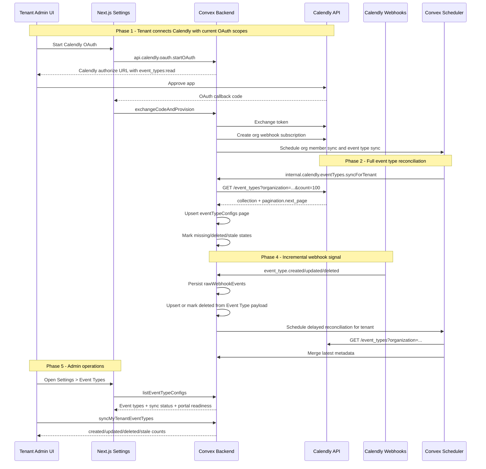

# Calendly Event Type Sync — Design Specification

**Version:** 0.1 (MVP)  
**Status:** Draft  
**Scope:** The current system discovers `eventTypeConfigs` lazily from `invitee.created` scheduling webhooks. This feature makes Calendly event types a first-class synced directory: all organization event types are imported from Calendly, kept current by reconciliation and webhooks, and merged without overwriting CRM-owned configuration.  
**Prerequisite:** Existing Calendly OAuth connection, `event_types:read`, `webhooks:read`, and `webhooks:write` are already requested by `convex/calendly/oauth.ts`; existing `eventTypeConfigs` table is deployed.

---

## Table of Contents

1. [Goals & Non-Goals](#1-goals--non-goals)
2. [Actors & Roles](#2-actors--roles)
3. [End-to-End Flow Overview](#3-end-to-end-flow-overview)
4. [Phase 1: Metadata Ownership Model](#4-phase-1-metadata-ownership-model)
5. [Phase 2: Full Calendly Event Type Sync](#5-phase-2-full-calendly-event-type-sync)
6. [Phase 3: Sync Triggers and Operational State](#6-phase-3-sync-triggers-and-operational-state)
7. [Phase 4: Event Type Webhook Reconciliation](#7-phase-4-event-type-webhook-reconciliation)
8. [Phase 5: Settings UI and Admin Operations](#8-phase-5-settings-ui-and-admin-operations)
9. [Phase 6: Verification and Rollout](#9-phase-6-verification-and-rollout)
10. [Data Model](#10-data-model)
11. [Convex Function Architecture](#11-convex-function-architecture)
12. [Routing & Authorization](#12-routing--authorization)
13. [Security Considerations](#13-security-considerations)
14. [Error Handling & Edge Cases](#14-error-handling--edge-cases)
15. [Blast Radius & Migration Strategy](#15-blast-radius--migration-strategy)
16. [Open Questions](#16-open-questions)
17. [Dependencies](#17-dependencies)
18. [Applicable Skills](#18-applicable-skills)

---

## 1. Goals & Non-Goals

### Goals

- Sync every Calendly event type returned by `GET /event_types?organization=<organizationUri>` for the connected tenant, not only event types that have received bookings.
- Preserve existing CRM configuration on `eventTypeConfigs`: payment links, booked-program mapping, field mappings, portal visibility, and any admin-edited display name.
- Populate Calendly-owned metadata for each event type: Calendly name, scheduling URL, active/deleted state, duration, kind, slug, owner/profile details, custom questions, and sync timestamps.
- Import Calendly `custom_questions` into the existing field mapping experience so admins can configure identity fields before the first booking.
- Keep the existing `invitee.created` auto-create path as a fallback for race conditions and webhook-only recovery.
- Add an admin-triggered sync button and a recurring reconciliation job.
- Subscribe to Calendly `event_type.created`, `event_type.updated`, and `event_type.deleted` webhooks, apply their documented Event Type payload immediately, and use full API sync as reconciliation/backstop.
- Make stale/deleted/inactive event type states visible enough that admins do not publish broken portal links.

### Non-Goals (deferred)

- Creating, editing, or deleting Calendly event types from the CRM. This feature is read-only against Event Types.
- Replacing Calendly as the booking host.
- Removing `invitee.created` event-type fallback creation. The fallback remains necessary because booking webhooks can arrive before or during a sync.
- Backfilling historical scheduled events beyond their existing opportunity and meeting links.
- Making `calendlyName`, `calendlySchedulingUrl`, or sync status required fields. This would require a later narrow migration and is not needed for MVP.
- Building a large event type analytics surface. This design only adds sync health, list visibility, and configuration support.

---

## 2. Actors & Roles

| Actor | Identity | Auth Method | Key Permissions |
|---|---|---|---|
| **Tenant owner** | CRM user with `users.role = "tenant_master"` | WorkOS AuthKit, tenant org JWT bridged into Convex | Reconnect Calendly, manually sync event types, edit event type configuration, publish portal-visible links. |
| **Tenant admin** | CRM user with `users.role = "tenant_admin"` | WorkOS AuthKit, tenant org JWT bridged into Convex | Same as tenant owner except owner-only functionality outside this feature. |
| **Closer** | CRM user with `users.role = "closer"` | WorkOS AuthKit, tenant org JWT bridged into Convex | Reads meeting and opportunity data that may reference synced event types. Cannot trigger sync or edit configuration. |
| **Calendly OAuth owner** | Calendly owner/admin user who connected the tenant's organization | Calendly OAuth bearer token stored in Convex | Grants API access to organization event types and webhook management. |
| **Calendly platform** | External API and webhook sender | OAuth bearer token for API calls; webhook HMAC signing key for inbound events | Returns event type pages and delivers event type/scheduling webhooks. |
| **Convex scheduled jobs** | Backend scheduler | Internal Convex function references | Runs reconciliation, token refresh, health checks, and webhook repair. |

### CRM Role <-> External Role Mapping

| CRM `users.role` | WorkOS role slug | Calendly role | Notes |
|---|---|---|---|
| `tenant_master` | `owner` | Not assumed | CRM owner/admin permissions are independent of Calendly role once OAuth is connected. |
| `tenant_admin` | `tenant-admin` | Not assumed | Can trigger CRM sync because Convex uses stored tenant OAuth tokens. |
| `closer` | `closer` | Calendly org member may be linked through `calendlyOrgMembers` | No event type sync permissions. |

> **Calendly permission prerequisite:** The connected Calendly account must be able to read organization-scoped event types and manage organization webhooks. In practice this should be a Calendly owner/admin connection. If an OAuth user can complete connection but receives `403` from `GET /event_types?organization=...`, preserve existing rows, mark event type sync failed, and ask the tenant to reconnect with a Calendly owner/admin account.

---

## 3. End-to-End Flow Overview



---

## 4. Phase 1: Metadata Ownership Model

### 4.1 Current State

The current `eventTypeConfigs` table is a hybrid table:

- It is the durable Calendly join key through `calendlyEventTypeUri`.
- It stores CRM configuration such as `paymentLinks`, `bookingProgramId`, `customFieldMappings`, `bookingBaseUrl`, and `linkPortalEnabled`.
- It is created lazily by `convex/pipeline/inviteeCreated.ts` when a booking webhook includes `scheduled_event.event_type`.
- It does not store Calendly active/deleted state, Calendly scheduling URL separately from admin booking URL, or event type custom questions before a booking.

That lazy discovery path is why the Settings UI currently says event types appear after their first booking. This feature changes that assumption: the Settings UI should treat Calendly as the source of truth for event type existence, while preserving CRM as the source of truth for sales configuration.

### 4.2 Field Ownership Boundary

| Field / Concept | Owner | Sync Behavior |
|---|---|---|
| `calendlyEventTypeUri` | Calendly | Stable join key. Never edited after insert. |
| `calendlyName` | Calendly | Updated on each sync from Calendly `name`. |
| `displayName` | CRM | For new synced rows, initialize from Calendly. For existing/admin-edited rows, do not overwrite. |
| `displayNameSource` | CRM/system | Set to `calendly_synced` for new sync rows, `webhook_discovered` for fallback rows, `admin_entered` when admin edits. |
| `calendlySchedulingUrl` | Calendly | Raw `scheduling_url` from Calendly. Updated each sync. |
| `bookingBaseUrl` | CRM with Calendly fallback | If empty, initialize from `scheduling_url` and set `bookingUrlSource = "calendly_synced"`. Do not overwrite `admin_entered` or `imported_sheet`. |
| `paymentLinks` | CRM | Never overwritten by sync. |
| `bookingProgram*` | CRM | Never overwritten by sync. |
| `customFieldMappings` | CRM | Never overwritten by sync. |
| `knownCustomFieldKeys` | CRM/system | Merge Calendly `custom_questions` and booking-observed questions. Never remove keys automatically. |
| `linkPortalEnabled` | CRM | Never enabled by sync. Can be disabled if Calendly reports the event type deleted. |
| `calendlyActive`, `calendlyDeletedAt`, `calendlySyncStatus` | Calendly/system | Updated by sync and event type deletion signals. |

> **Decision rationale:** Sync must be additive and conservative. Existing event type rows may already have production-critical program mappings and payment links. A full sync should make missing Calendly event types visible, not reconfigure sales workflows.

### 4.3 Display Name Policy

The existing `displayName` is shown throughout meeting detail, calendar, opportunity, reports, and Settings surfaces. Overwriting it with Calendly names would have broad UI blast radius and could erase intentionally clearer CRM labels.

Rules:

1. New API-synced row: `displayName = calendly.name ?? "Calendly Event Type"` and `displayNameSource = "calendly_synced"`.
2. New webhook fallback row: `displayName = scheduled_event.name ?? "Calendly Meeting"` and `displayNameSource = "webhook_discovered"`.
3. Admin save through `upsertEventTypeConfig`: set `displayNameSource = "admin_entered"`.
4. Existing row with `displayNameSource = "calendly_synced"` or `"webhook_discovered"`: sync may update `displayName` to the latest Calendly name.
5. Existing row with `displayNameSource = "admin_entered"` or no source: sync only updates `calendlyName`.

> **Migration decision:** Treat source-less existing rows as protected. We cannot know whether a production admin edited them, so the safe default is not to overwrite.

### 4.4 Booking URL Policy

`bookingBaseUrl` is used by the DM link portal and readiness checks. Calendly also returns `scheduling_url`.

Rules:

1. Always store Calendly's value in `calendlySchedulingUrl`.
2. If `bookingBaseUrl` is empty, set it to `scheduling_url` and set `bookingUrlSource = "calendly_synced"`.
3. If `bookingUrlSource` is `"calendly_synced"`, future sync may update `bookingBaseUrl` when Calendly changes `scheduling_url`.
4. If `bookingUrlSource` is `"admin_entered"` or `"imported_sheet"`, never overwrite `bookingBaseUrl`.
5. Sync never sets `linkPortalEnabled = true`; admins must still publish event types intentionally.

> **Why not only use `calendlySchedulingUrl`?** Existing portal readiness and link-building code already reads `bookingBaseUrl`. Initializing `bookingBaseUrl` when empty removes manual work while preserving admin override semantics through `bookingUrlSource`.

### 4.5 Custom Questions and Field Mappings

Calendly's list endpoint returns `custom_questions`. The current CRM only discovers form field labels from `questions_and_answers` on bookings. Sync should merge both sources:

- Read the custom question label from `custom_questions[].name`; do not invent labels from other fields.
- Only enabled Calendly questions should be offered as current mapping candidates. Disabled questions can remain in historical field data if previously observed from bookings, but sync should not newly add disabled questions as active options.
- Add enabled Calendly custom question labels to `knownCustomFieldKeys`.
- Upsert `eventTypeFieldCatalog` rows using the same normalized field-key strategy used by `writeMeetingFormResponses`; set `valueType` from Calendly `custom_questions[].type` when present.
- Never delete a known field key automatically, because historical bookings and existing field mappings may reference old labels.
- If Calendly's custom question shape is missing `name`, skip the malformed question and log a structured warning.

```typescript
// Path: convex/lib/eventTypeFields.ts
export function normalizeFieldKey(question: string): string {
  return question
    .trim()
    .toLowerCase()
    .replace(/[^a-z0-9]+/g, "_")
    .replace(/^_+|_+$/g, "")
    .replace(/_+/g, "_") || "unknown";
}
```

---

## 5. Phase 2: Full Calendly Event Type Sync

### 5.1 Calendly API Contract

Use the existing tenant connection context:

- `tenantCalendlyConnections.calendlyAccessToken`
- `tenantCalendlyConnections.calendlyRefreshToken`
- `tenantCalendlyConnections.calendlyOrganizationUri`

Call:

```http
GET https://api.calendly.com/event_types?organization=<encoded-org-uri>&count=100
Authorization: Bearer <access_token>
```

Do not pass `active`, `admin_managed`, or `user` filters. Omitting these filters gives the broadest organization event type view Calendly exposes for the connected OAuth user.

The connected OAuth account still needs Calendly permission to read organization event types. Calendly's org-wide event type guidance assumes an owner/admin token for organization-wide access. If Calendly returns `403`, treat it as a connection permission problem, not as proof that the tenant has no event types.

| Query Parameter | Value | Reason |
|---|---|---|
| `organization` | Stored Calendly org URI | The requirement is all organization event types, not one user's event types. |
| `count` | `100` | Calendly's documented maximum page size. |
| `page_token` | From `pagination.next_page_token` or use `pagination.next_page` | Supports keyset pagination. |
| `active` | Omitted | Include both active and inactive event types. |
| `admin_managed` | Omitted | Include admin-managed and non-admin-managed event types. |

### 5.2 Action Runtime

The sync must be a Node action because it performs external `fetch` calls and may call token refresh logic. It should batch database writes by page through internal mutations.

```typescript
// Path: convex/calendly/eventTypes.ts
"use node";

import { v } from "convex/values";
import { action, internalAction } from "../_generated/server";
import { internal } from "../_generated/api";
import type { Id } from "../_generated/dataModel";
import { getValidAccessToken, refreshTenantTokenCore } from "./tokens";

export const syncForTenant = internalAction({
  args: {
    tenantId: v.id("tenants"),
    reason: v.optional(v.string()),
  },
  handler: async (ctx, { tenantId, reason }) => {
    const startedAt = Date.now();
    const lock = await ctx.runMutation(
      internal.calendly.eventTypeMutations.acquireEventTypeSyncLock,
      { tenantId, lockUntil: startedAt + 2 * 60 * 1000, reason },
    );
    if (!lock.acquired) {
      return { status: "skipped" as const, reason: "lock_held" as const };
    }

    try {
      let accessToken = await getValidAccessToken(ctx, tenantId);
      const tenant = await ctx.runQuery(
        internal.calendly.connectionQueries.getTenantConnectionContext,
        { tenantId },
      );
      if (!accessToken || !tenant?.organizationUri) {
        throw new Error("Missing Calendly access token or organization URI");
      }

      let nextPage: string | null =
        `https://api.calendly.com/event_types?organization=${encodeURIComponent(
          tenant.organizationUri,
        )}&count=100`;
      let totals = { created: 0, updated: 0, unchanged: 0, questionsMerged: 0 };

      while (nextPage) {
        let response = await fetch(nextPage, {
          headers: { Authorization: `Bearer ${accessToken}` },
        });

        if (response.status === 401) {
          const refreshed = await refreshTenantTokenCore(ctx, tenantId);
          if (refreshed.refreshed) {
            accessToken = refreshed.accessToken;
            response = await fetch(nextPage, {
              headers: { Authorization: `Bearer ${accessToken}` },
            });
          }
        }

        if (response.status === 429) {
          const retryAfterMs = getCalendlyRetryDelayMs(response);
          await ctx.runMutation(
            internal.calendly.eventTypeMutations.completeEventTypeSync,
            {
              tenantId,
              status: "skipped",
              error: "Calendly rate limited event type sync; retry scheduled",
            },
          );
          await ctx.scheduler.runAfter(
            retryAfterMs,
            internal.calendly.eventTypes.syncForTenant,
            { tenantId, reason: "rate_limited_retry" },
          );
          return {
            status: "skipped" as const,
            reason: "rate_limited_retry_scheduled" as const,
          };
        }
        if (!response.ok) {
          throw new Error(
            `Calendly event type sync failed: ${response.status} ${await response.text()}`,
          );
        }

        const page = await response.json();
        const result = await ctx.runMutation(
          internal.calendly.eventTypeMutations.upsertEventTypesPage,
          { tenantId, syncStartedAt: startedAt, collection: page.collection ?? [] },
        );
        totals = {
          created: totals.created + result.created,
          updated: totals.updated + result.updated,
          unchanged: totals.unchanged + result.unchanged,
          questionsMerged: totals.questionsMerged + result.questionsMerged,
        };
        nextPage = page.pagination?.next_page ?? null;
      }

      const stale = await ctx.runMutation(
        internal.calendly.eventTypeMutations.markMissingEventTypes,
        { tenantId, syncStartedAt: startedAt },
      );
      await ctx.runMutation(
        internal.calendly.eventTypeMutations.completeEventTypeSync,
        { tenantId, status: "success", totals: { ...totals, ...stale } },
      );
      return { status: "success" as const, ...totals, ...stale };
    } catch (error) {
      await ctx.runMutation(
        internal.calendly.eventTypeMutations.completeEventTypeSync,
        {
          tenantId,
          status: "failed",
          error: error instanceof Error ? error.message : "Unknown error",
        },
      );
      throw error;
    }
  },
});
```

> **Runtime decision:** The action owns API pagination and token refresh. Mutations own upsert transactions. This follows Convex's transaction model and avoids keeping an external API call inside a mutation.
>
> `completeEventTypeSync` must clear `eventTypeSyncLockUntil` for success, failure, and skipped retry states. The `401` path intentionally retries the current page at most once after `refreshTenantTokenCore`; do not loop on repeated `401`s. `getCalendlyRetryDelayMs` should prefer `X-RateLimit-Reset` seconds and fall back to bounded exponential backoff. If a tenant ever has enough event type pages that a sync can exceed the initial lock window, extend the lock per page or use a longer bounded lock duration so manual/cron/webhook syncs cannot overlap mid-run.

### 5.3 Upsert Algorithm

For each event type resource:

1. Validate `uri` is a non-empty string. Skip malformed records.
2. Query `eventTypeConfigs` by `by_tenantId_and_calendlyEventTypeUri`.
3. If no row exists, insert a new config with CRM-safe defaults.
4. If a row exists, patch only changed Calendly-owned fields and safe empty fallbacks.
5. Merge enabled custom question labels into `knownCustomFieldKeys`.
6. Upsert field catalog rows for synced enabled custom questions, including value type when Calendly provides it.
7. Set `lastCalendlySeenAt` and `lastCalendlySyncedAt` to the sync start/current timestamp.

```typescript
// Path: convex/calendly/eventTypeMutations.ts
export const upsertEventTypesPage = internalMutation({
  args: {
    tenantId: v.id("tenants"),
    syncStartedAt: v.number(),
    collection: v.array(v.any()),
  },
  handler: async (ctx, { tenantId, syncStartedAt, collection }) => {
    let created = 0;
    let updated = 0;
    let unchanged = 0;
    let questionsMerged = 0;

    for (const resource of collection) {
      const normalized = normalizeCalendlyEventTypeResource(resource);
      if (!normalized) {
        continue;
      }

      const existing = await ctx.db
        .query("eventTypeConfigs")
        .withIndex("by_tenantId_and_calendlyEventTypeUri", (q) =>
          q.eq("tenantId", tenantId).eq("calendlyEventTypeUri", normalized.uri),
        )
        .unique();

      let eventTypeConfigId: Id<"eventTypeConfigs">;
      if (!existing) {
        eventTypeConfigId = await ctx.db.insert("eventTypeConfigs", {
          tenantId,
          calendlyEventTypeUri: normalized.uri,
          displayName: normalized.name ?? "Calendly Event Type",
          displayNameSource: "calendly_synced",
          bookingProgramMappingStatus: "unmapped",
          bookingBaseUrl: normalized.schedulingUrl,
          bookingUrlSource: normalized.schedulingUrl
            ? "calendly_synced"
            : undefined,
          ...normalized.calendlyPatch,
          knownCustomFieldKeys: normalized.enabledCustomQuestions.map(
            (question) => question.label,
          ),
          createdAt: Date.now(),
          updatedAt: Date.now(),
        });
        created += 1;
      } else {
        eventTypeConfigId = existing._id;
        const patch = buildEventTypeConfigSyncPatch(existing, normalized, syncStartedAt);
        if (Object.keys(patch).length > 0) {
          await ctx.db.patch(existing._id, patch);
          updated += 1;
        } else {
          unchanged += 1;
        }
      }

      questionsMerged += await mergeQuestionCatalog(ctx, {
        tenantId,
        eventTypeConfigId,
        questions: normalized.enabledCustomQuestions,
        seenAt: syncStartedAt,
      });
    }

    return { created, updated, unchanged, questionsMerged };
  },
});
```

### 5.4 Missing and Deleted Event Types

Calendly may return `deleted_at` for deleted types, but we should not assume every deleted type remains in the list response forever.

After a full sync:

- Rows returned with `deleted_at` are marked `calendlySyncStatus = "deleted"`.
- Rows returned with `active = false` and no `deleted_at` are marked `calendlySyncStatus = "inactive"`.
- Rows returned with `active = true` and no `deleted_at` are marked `calendlySyncStatus = "active"`.
- Previously synced rows not seen in the current full sync are marked `calendlySyncStatus = "not_returned"` rather than deleted.
- Do not delete `eventTypeConfigs`; meetings, opportunities, payment links, and portal audit rows may reference them.

If an event type is marked `deleted`, disable portal publishing:

```typescript
// Path: convex/calendly/eventTypeMutations.ts
const deletedPatch = {
  calendlyActive: false,
  calendlySyncStatus: "deleted" as const,
  calendlyDeletedAt: deletedAtIso ?? new Date(now).toISOString(),
  linkPortalEnabled: false,
  updatedAt: now,
};
```

> **Safety decision:** Automatically disabling a deleted event type has user-visible impact, but it prevents public portal links from pointing at a removed Calendly booking page. Sync never enables links, so the automatic behavior is one-way toward safety.

---

## 6. Phase 3: Sync Triggers and Operational State

### 6.1 OAuth Completion Trigger

After `exchangeCodeAndProvision` stores tokens and activates the tenant, schedule event type sync in parallel with org member sync.

```typescript
// Path: convex/calendly/oauth.ts
await ctx.scheduler.runAfter(0, internal.calendly.orgMembers.syncForTenant, {
  tenantId,
});

await ctx.scheduler.runAfter(0, internal.calendly.eventTypes.syncForTenant, {
  tenantId,
  reason: "oauth_connected",
});
```

This ensures newly onboarded tenants see event types before any scheduling webhook arrives.

### 6.2 Manual Admin Trigger

Expose a public Convex action guarded by current tenant admin role:

```typescript
// Path: convex/calendly/eventTypes.ts
export const syncMyTenantEventTypes = action({
  args: {},
  handler: async (ctx) => {
    const identity = await ctx.auth.getUserIdentity();
    if (!identity) {
      throw new Error("Not authenticated");
    }

    const currentUser = await resolveCurrentAdminUser(ctx, identity);
    return await syncTenantEventTypesCore(ctx, currentUser.tenantId, {
      reason: "manual_admin",
    });
  },
});
```

The implementation should follow the same authorization style as `syncMyTenantMembers` and `refreshMyTenantToken`.

### 6.3 Recurring Reconciliation

Add a daily cron that fans out active tenants, mirroring `sync-calendly-org-members`.

```typescript
// Path: convex/crons.ts
crons.interval(
  "sync-calendly-event-types",
  { hours: 24 },
  internal.calendly.eventTypes.syncAllTenants,
  {},
);
```

`syncAllTenants` should use `internal.calendly.tokenMutations.listActiveTenantIds` and schedule each tenant independently. If this app grows beyond one tenant, add staggered delays to avoid burst API traffic.

### 6.4 Sync Lock and Latest Status

Store lightweight sync state on `tenantCalendlyConnections`:

- `eventTypeSyncLockUntil`
- `lastEventTypeSyncStartedAt`
- `lastEventTypeSyncCompletedAt`
- `lastEventTypeSyncStatus`
- `lastEventTypeSyncError`
- `lastEventTypeSyncCount`

This is enough for the Settings UI and avoids an unbounded sync-run history table.

> **Why not a sync runs table?** The MVP needs latest operational state, not audit history. A table can be added later if support workflows need historical sync attempts. Avoiding it reduces cleanup and index surface.

---

## 7. Phase 4: Event Type Webhook Reconciliation

### 7.1 Subscribe to Event Type Events

Add Calendly event type events to `SUBSCRIBED_EVENTS`:

```typescript
// Path: convex/calendly/webhookSetup.ts
const SUBSCRIBED_EVENTS = [
  "invitee.created",
  "invitee.canceled",
  "invitee_no_show.created",
  "invitee_no_show.deleted",
  "routing_form_submission.created",
  "event_type.created",
  "event_type.updated",
  "event_type.deleted",
] as const;
```

Calendly docs list these as valid for organization-scoped subscriptions with `event_types:read`.

### 7.2 Repair Existing Webhook Subscriptions

Existing tenants already have an active webhook that lacks `event_type.*`. The health check must inspect the subscription's event list, not just its `state`.

```typescript
// Path: convex/calendly/healthCheck.ts
type WebhookInspection =
  | { state: "active"; eventsMatch: true }
  | { state: "missing" | "disabled" | "events_mismatch"; eventsMatch: false };

async function getWebhookSubscriptionState(accessToken: string, webhookUri: string) {
  const webhookUuid = new URL(webhookUri).pathname
    .split("/")
    .filter(Boolean)
    .pop();
  if (!webhookUuid) {
    throw new Error(`Invalid Calendly webhook URI: ${webhookUri}`);
  }

  const response = await fetch(`https://api.calendly.com/webhook_subscriptions/${webhookUuid}`, {
    headers: { Authorization: `Bearer ${accessToken}` },
  });
  if (response.status === 404) {
    return "missing";
  }
  if (!response.ok) {
    throw new Error(
      `Unable to inspect Calendly webhook subscription ${webhookUuid}: ${response.status} ${await response.text()}`,
    );
  }
  const data = await response.json();
  if (data.resource?.state === "disabled") {
    return "disabled";
  }
  const events = new Set(data.resource?.events ?? []);
  const eventsMatch = REQUIRED_WEBHOOK_EVENTS.every((event) => events.has(event));
  return eventsMatch ? "active" : "events_mismatch";
}
```

If events mismatch, replace the subscription without a delete-first gap:

1. Create a replacement webhook first, using the same signing key and a versioned callback URL such as `/webhooks/calendly?tenantId=...&webhookVersion=<timestamp>`.
2. Store the replacement `webhookUri` only after creation succeeds.
3. Delete the old subscription after the new subscription is stored.
4. If Calendly rejects replacement creation, leave the old subscription active and surface `events_mismatch` in health status.

The HTTP handler should continue to trust only `tenantId` and signature verification; `webhookVersion` is only a callback URL differentiator so Calendly permits overlapping old/new subscriptions during repair.

> **Blast radius:** Delete-first recreation can miss events that occur between delete and recreate, because Calendly cannot retry events that were never delivered to any active subscription. Creating the replacement before deleting the old subscription avoids that gap. A delete-first repair should be reserved for explicit maintenance when Calendly refuses overlapping callbacks and the operator accepts the delivery window.

### 7.3 Process Event Type Webhooks

The local Calendly docs now document the Event Type Webhook Payload for `event_type.created`, `event_type.updated`, and `event_type.deleted`. The payload shape materially matches the Event Type resource returned by `GET /event_types`, including:

- `uri`
- `name`
- `active`
- `scheduling_url`
- `duration`
- `duration_options`
- `kind`
- `type`
- `pooling_type`
- `profile`
- `secret`
- `booking_method`
- `custom_questions`
- `deleted_at`
- `admin_managed`
- `locations`
- `position`
- `locale`

Process this payload immediately through the same normalization/upsert helper used by full sync. Then schedule a delayed tenant reconciliation as a backstop for burst edits, missed events, or any future Calendly payload drift.

```typescript
// Path: convex/pipeline/processor.ts
case "event_type.created":
case "event_type.updated":
  await ctx.runMutation(
    internal.calendly.eventTypeMutations.upsertEventTypeFromWebhook,
    {
      tenantId: rawEvent.tenantId,
      payload,
      receivedAt: rawEvent.receivedAt,
    },
  );
  // Small delay coalesces bursts when an admin edits several Calendly event types.
  await ctx.scheduler.runAfter(
    5_000,
    internal.calendly.eventTypes.syncForTenant,
    {
      tenantId: rawEvent.tenantId,
      reason: rawEvent.eventType,
    },
  );
  await ctx.runMutation(internal.pipeline.mutations.markProcessed, { rawEventId });
  break;

case "event_type.deleted":
  await ctx.runMutation(
    internal.calendly.eventTypeMutations.upsertEventTypeFromWebhook,
    {
      tenantId: rawEvent.tenantId,
      payload,
      receivedAt: rawEvent.receivedAt,
    },
  );
  await ctx.scheduler.runAfter(
    5_000,
    internal.calendly.eventTypes.syncForTenant,
    {
      tenantId: rawEvent.tenantId,
      reason: "event_type.deleted",
    },
  );
  await ctx.runMutation(internal.pipeline.mutations.markProcessed, { rawEventId });
  break;
```

```typescript
// Path: convex/calendly/eventTypeMutations.ts
export const upsertEventTypeFromWebhook = internalMutation({
  args: {
    tenantId: v.id("tenants"),
    payload: v.any(),
    receivedAt: v.number(),
  },
  handler: async (ctx, { tenantId, payload, receivedAt }) => {
    const normalized = normalizeCalendlyEventTypeResource(payload);
    if (!normalized) {
      throw new Error("Malformed Calendly event type webhook payload");
    }

    return await upsertSingleEventTypeResource(ctx, {
      tenantId,
      normalized,
      syncStartedAt: receivedAt,
      source: "webhook",
    });
  },
});
```

> **Decision rationale:** Webhook payloads give us low-latency updates without spending an API request per change. The delayed full sync remains valuable because it repairs any missed webhooks, handles subscription downtime, and reconciles rows that disappeared from Calendly responses.

### 7.4 Raw Webhook Idempotency

`convex/webhooks/calendly.ts` currently extracts an event URI from common payload fields and `persistRawEvent` dedupes by `(tenantId, eventType, calendlyEventUri)`. For event type webhooks, `payload.uri` is the event type resource URI, not a unique webhook delivery/event URI. Using it directly would drop every later `event_type.updated` for the same event type.

Separate the webhook event key from the Calendly resource URI:

```typescript
// Path: convex/webhooks/calendly.ts
function getCalendlyResourceUri(payload: unknown) {
  const payloadBody = getPayloadBody(payload);
  return payloadBody ? getNonEmptyString(payloadBody, "uri") : undefined;
}

function getWebhookEventKey(envelope: Record<string, unknown>) {
  const eventType = getNonEmptyString(envelope, "event") ?? "unknown";
  const createdAt = getNonEmptyString(envelope, "created_at") ?? Date.now().toString();
  const resourceUri = getCalendlyResourceUri(envelope) ?? "unknown-resource";

  return `${eventType}:${resourceUri}:${createdAt}`;
}
```

For scheduling webhooks, the existing invitee/scheduled-event URI remains a stable dedupe key. For `event_type.*`, persist `webhookEventKey` for idempotency and `calendlyResourceUri = payload.uri` for debugging/support. `persistRawEvent` should dedupe on `by_tenantId_and_eventType_and_webhookEventKey` when `webhookEventKey` is present, falling back to the legacy `by_tenantId_and_eventType_and_calendlyEventUri` index for old callers. During rollout, keep writing the legacy `calendlyEventUri` field as the dedupe key if needed for existing indexes, but do not treat it as the resource URI for event type events.

---

## 8. Phase 5: Settings UI and Admin Operations

### 8.1 Connection Card

Add event type sync status to `CalendlyConnection`:

- Last event type sync time.
- Last event type sync status.
- Last sync count.
- "Sync Event Types" button.

```tsx
// Path: app/workspace/settings/_components/calendly-connection.tsx
const syncEventTypes = useAction(api.calendly.eventTypes.syncMyTenantEventTypes);

<Button
  variant="outline"
  size="sm"
  onClick={handleSyncEventTypes}
  disabled={isSyncingEventTypes || !isConnected}
>
  {isSyncingEventTypes ? (
    <Spinner data-icon="inline-start" />
  ) : (
    <CalendarSyncIcon data-icon="inline-start" />
  )}
  {isSyncingEventTypes ? "Syncing Event Types..." : "Sync Event Types"}
</Button>
```

### 8.2 Event Types Tab

Update `EventTypeConfigList` to show:

- CRM display name and Calendly name if different.
- Active/inactive/deleted/not returned status.
- Booking URL source.
- Last synced time.
- Existing portal readiness.

Deleted and not-returned event types should remain visible in Settings, but the public link portal must not show them.

Portal-facing code should keep legacy undefined sync status working during rollout, but hide unsafe states once sync metadata exists. Put this behind one shared helper so bootstrap queries, publish mutations, copy tracking, and readiness UI do not drift:

```typescript
// Path: convex/lib/eventTypeBookability.ts
export function isCalendlyBookable(config: {
  calendlySyncStatus?: "active" | "inactive" | "deleted" | "not_returned";
}) {
  return (
    config.calendlySyncStatus === undefined ||
    config.calendlySyncStatus === "active"
  );
}

export function isPortalBookable(config: {
  bookingBaseUrl?: string;
  bookingProgramId?: unknown;
  bookingProgramMappingStatus?: "mapped" | "unmapped";
  calendlySyncStatus?: "active" | "inactive" | "deleted" | "not_returned";
  linkPortalEnabled?: boolean;
}) {
  return (
    config.linkPortalEnabled === true &&
    isCalendlyBookable(config) &&
    Boolean(config.bookingBaseUrl) &&
    config.bookingProgramId !== undefined &&
    config.bookingProgramMappingStatus === "mapped"
  );
}
```

Use this helper in:

- `convex/linkPortal/portalQueries.ts` when building public portal rows.
- `convex/linkPortal/copyMutations.ts` when recording a copied booking link.
- `convex/eventTypeConfigs/mutations.ts#setLinkPortalEnabled` when publishing a row.
- `convex/eventTypeConfigs/queries.ts` and Settings readiness components when showing portal readiness.

### 8.3 Field Mappings Tab

Update copy:

- From "Event types appear here after their first booking."
- To "Event types and form questions sync from Calendly; booking responses can add additional observed fields."

`fieldCount` should count merged `knownCustomFieldKeys`, not only booking-observed fields.

### 8.4 Query Shape

Current Settings queries use `.take(100)`. For "all event types", use pagination or raise the bounded limit deliberately.

Preferred:

```typescript
// Path: convex/eventTypeConfigs/queries.ts
export const listEventTypeConfigs = query({
  args: { paginationOpts: paginationOptsValidator },
  handler: async (ctx, args) => {
    const { tenantId } = await requireTenantUser(ctx, [
      "tenant_master",
      "tenant_admin",
    ]);
    return await ctx.db
      .query("eventTypeConfigs")
      .withIndex("by_tenantId", (q) => q.eq("tenantId", tenantId))
      .paginate(args.paginationOpts);
  },
});
```

Acceptable MVP shortcut for the single production tenant:

- Use `.take(500)` and log/health-warn if `syncedCount >= 500`.
- Add pagination before supporting many tenants or very large Calendly organizations.

> **Recommendation:** Implement pagination for Settings if practical. If not, `.take(500)` is a scoped MVP compromise because Calendly event type counts are usually small, but it should be called out in implementation notes.

---

## 9. Phase 6: Verification and Rollout

### 9.1 Backend Verification

| Scenario | Expected Result |
|---|---|
| Tenant connects Calendly | Event type sync is scheduled after webhook provisioning. |
| Manual sync with valid token | Creates missing `eventTypeConfigs`, updates metadata, preserves CRM fields. |
| Manual sync with expired access token | `getValidAccessToken` refreshes token and sync continues. |
| Calendly returns multiple pages | All pages are upserted; sync count equals total collection size. |
| Existing admin display name | `displayName` is preserved; `calendlyName` updates. |
| Existing admin booking URL | `bookingBaseUrl` is preserved; `calendlySchedulingUrl` updates. |
| Empty booking URL | `bookingBaseUrl` initializes from `scheduling_url` with `bookingUrlSource = "calendly_synced"`. |
| New zero-booking event type with custom questions | Creates `eventTypeConfigs`, merges `knownCustomFieldKeys`, and creates `eventTypeFieldCatalog` rows. |
| Deleted event type webhook | Row is marked deleted and `linkPortalEnabled` is set false. |
| Multiple `event_type.updated` webhooks for the same URI | Each delivery is persisted and processed because dedupe uses `webhookEventKey`, not only `payload.uri`. |
| Existing webhook lacks event type events | Health check detects mismatch, creates a replacement subscription, stores it, then deletes the old subscription. |
| Webhook repair fails while creating replacement | Existing subscription remains active and health status reports `events_mismatch`. |

### 9.2 UI Verification

| Surface | Expected Result |
|---|---|
| Settings > Calendly | Shows last event type sync status and manual sync button. |
| Settings > Event Types | Shows all synced event types, including ones with zero bookings. |
| Settings > Field Mappings | Shows synced custom questions before first booking when Calendly provides them. |
| DM link portal | Does not show unpublished, deleted, inactive, or unmapped event types. |
| DM link copy tracking | Rejects copied links for deleted, inactive, or not-returned event types even if the client has stale bootstrap data. |
| Meeting detail | Existing display of event type name remains stable. |

### 9.3 Rollout Steps

1. Deploy schema widening and code that can read/write optional sync metadata.
2. Deploy event type sync functions and manual admin action.
3. Trigger manual sync for the current production tenant.
4. Verify event type counts against Calendly UI.
5. Deploy webhook event subscription replacement repair and event type webhook processing.
6. Run health check or reconnect flow to create a replacement tenant webhook with `event_type.*` events, verify it is stored, then delete the old subscription.
7. Enable daily cron reconciliation.

---

## 10. Data Model

### 10.1 Modified: `eventTypeConfigs`

```typescript
// Path: convex/schema.ts
eventTypeConfigs: defineTable({
  tenantId: v.id("tenants"),
  calendlyEventTypeUri: v.string(),
  displayName: v.string(),
  paymentLinks: v.optional(
    v.array(
      v.object({
        provider: v.string(),
        label: v.string(),
        url: v.string(),
      }),
    ),
  ),
  createdAt: v.number(),

  // ... existing CRM-owned fields ...
  customFieldMappings: v.optional(/* existing validator */),
  knownCustomFieldKeys: v.optional(v.array(v.string())),
  bookingProgramId: v.optional(v.id("tenantPrograms")),
  bookingProgramName: v.optional(v.string()),
  bookingProgramMappingStatus: v.optional(bookingProgramMappingStatusValidator),
  bookingBaseUrl: v.optional(v.string()),
  bookingUrlSource: v.optional(
    v.union(
      v.literal("admin_entered"),
      v.literal("imported_sheet"),
      v.literal("calendly_synced"),
    ),
  ),
  linkPortalEnabled: v.optional(v.boolean()),

  // NEW - Calendly-owned metadata from GET /event_types.
  calendlyName: v.optional(v.string()),
  displayNameSource: v.optional(
    v.union(
      v.literal("admin_entered"),
      v.literal("calendly_synced"),
      v.literal("webhook_discovered"),
    ),
  ),
  calendlySchedulingUrl: v.optional(v.string()),
  calendlySlug: v.optional(v.string()),
  calendlyActive: v.optional(v.boolean()),
  calendlyDeletedAt: v.optional(v.string()), // Calendly ISO timestamp.
  calendlyCreatedAt: v.optional(v.string()),
  calendlyUpdatedAt: v.optional(v.string()),
  calendlyDurationMinutes: v.optional(v.number()),
  calendlyKind: v.optional(v.string()),
  calendlyType: v.optional(v.string()),
  calendlyBookingMethod: v.optional(v.string()),
  calendlyPoolingType: v.optional(v.string()),
  calendlySecret: v.optional(v.boolean()),
  calendlyAdminManaged: v.optional(v.boolean()),
  calendlyColor: v.optional(v.string()),
  calendlyLocale: v.optional(v.string()),
  calendlyOwnerUri: v.optional(v.string()),
  calendlyProfileName: v.optional(v.string()),
  calendlySyncStatus: v.optional(
    v.union(
      v.literal("active"),
      v.literal("inactive"),
      v.literal("deleted"),
      v.literal("not_returned"),
    ),
  ),
  lastCalendlySeenAt: v.optional(v.number()),
  lastCalendlySyncedAt: v.optional(v.number()),
  updatedAt: v.optional(v.number()),
})
  .index("by_tenantId", ["tenantId"])
  .index("by_tenantId_and_calendlyEventTypeUri", [
    "tenantId",
    "calendlyEventTypeUri",
  ])
  .index("by_tenantId_and_bookingProgramId", [
    "tenantId",
    "bookingProgramId",
  ]),
```

No new index is required for MVP because Settings and portal queries are tenant-scoped. If future queries filter by `calendlySyncStatus`, add `by_tenantId_and_calendlySyncStatus`.

### 10.2 Modified: `tenantCalendlyConnections`

```typescript
// Path: convex/schema.ts
tenantCalendlyConnections: defineTable({
  tenantId: v.id("tenants"),
  calendlyAccessToken: v.optional(v.string()),
  calendlyRefreshToken: v.optional(v.string()),
  calendlyTokenExpiresAt: v.optional(v.number()),
  calendlyRefreshLockUntil: v.optional(v.number()),
  lastTokenRefreshAt: v.optional(v.number()),
  codeVerifier: v.optional(v.string()),
  calendlyOrganizationUri: v.optional(v.string()),
  calendlyUserUri: v.optional(v.string()),
  calendlyWebhookUri: v.optional(v.string()),
  calendlyWebhookSigningKey: v.optional(v.string()),
  connectionStatus: v.optional(
    v.union(
      v.literal("connected"),
      v.literal("disconnected"),
      v.literal("token_expired"),
    ),
  ),
  lastHealthCheckAt: v.optional(v.number()),
  webhookProvisioningStartedAt: v.optional(v.number()),

  // NEW - latest event type sync state.
  eventTypeSyncLockUntil: v.optional(v.number()),
  lastEventTypeSyncStartedAt: v.optional(v.number()),
  lastEventTypeSyncCompletedAt: v.optional(v.number()),
  lastEventTypeSyncStatus: v.optional(
    v.union(
      v.literal("success"),
      v.literal("failed"),
      v.literal("skipped"),
    ),
  ),
  lastEventTypeSyncError: v.optional(v.string()),
  lastEventTypeSyncCount: v.optional(v.number()),
}).index("by_tenantId", ["tenantId"]),
```

### 10.3 Modified: `eventTypeFieldCatalog`

No schema change is required. Event type sync will write to the existing table:

```typescript
// Path: convex/schema.ts
eventTypeFieldCatalog: defineTable({
  tenantId: v.id("tenants"),
  eventTypeConfigId: v.id("eventTypeConfigs"),
  fieldKey: v.string(),
  currentLabel: v.string(),
  firstSeenAt: v.number(),
  lastSeenAt: v.number(),
  valueType: v.optional(v.string()),
})
  .index("by_tenantId_and_eventTypeConfigId", [
    "tenantId",
    "eventTypeConfigId",
  ])
  .index("by_tenantId_and_fieldKey", ["tenantId", "fieldKey"]),
```

When rows are created from Calendly `custom_questions`, set `currentLabel` from `name`, `valueType` from `type`, and `lastSeenAt` from the sync/webhook timestamp. Booking-observed answers can continue to update labels using the existing `writeMeetingFormResponses` behavior.

### 10.4 Modified: `rawWebhookEvents`

Add optional fields to avoid conflating webhook delivery idempotency with Calendly resource identity:

```typescript
// Path: convex/schema.ts
rawWebhookEvents: defineTable({
  tenantId: v.id("tenants"),
  calendlyEventUri: v.string(), // legacy dedupe key; keep for existing code during rollout.
  webhookEventKey: v.optional(v.string()),
  calendlyResourceUri: v.optional(v.string()),
  eventType: v.string(),
  payload: v.string(),
  processed: v.boolean(),
  receivedAt: v.number(),
})
  .index("by_tenantId_and_eventType", ["tenantId", "eventType"])
  .index("by_tenantId_and_receivedAt", ["tenantId", "receivedAt"])
  .index("by_calendlyEventUri", ["calendlyEventUri"])
  .index("by_processed", ["processed"])
  .index("by_processed_and_receivedAt", ["processed", "receivedAt"])
  .index("by_tenantId_and_eventType_and_calendlyEventUri", [
    "tenantId",
    "eventType",
    "calendlyEventUri",
  ])
  .index("by_tenantId_and_eventType_and_webhookEventKey", [
    "tenantId",
    "eventType",
    "webhookEventKey",
  ]),
```

For existing scheduling webhooks, `webhookEventKey` can equal the existing event/invitee URI. For `event_type.*`, `webhookEventKey` must include the root event type, resource URI, and root `created_at`; `calendlyResourceUri` stores `payload.uri`.

---

## 11. Convex Function Architecture

```text
convex/
|-- calendly/
|   |-- eventTypes.ts                 # NEW - public/internal actions for full sync and fan-out
|   |-- eventTypeMutations.ts         # NEW - locks, upserts, status updates, deletion handling
|   |-- connectionQueries.ts          # MODIFIED - expose latest event type sync state internally
|   |-- oauthQueries.ts               # MODIFIED - expose latest event type sync state to Settings
|   |-- oauth.ts                      # MODIFIED - schedule event type sync after OAuth completion
|   |-- webhookSetup.ts               # MODIFIED - subscribe to event_type.* and expose required event list
|   |-- healthCheck.ts                # MODIFIED - detect webhook event mismatch, repair subscription
|   |-- tokens.ts                     # UNCHANGED - reused by event type sync
|   `-- orgMembers.ts                 # REFERENCE - pattern for tenant sync fan-out and manual action
|-- eventTypeConfigs/
|   |-- queries.ts                    # MODIFIED - return Calendly metadata and possibly paginate
|   `-- mutations.ts                  # MODIFIED - mark displayNameSource/bookingUrlSource on admin edits
|-- lib/
|   |-- tenantCalendlyConnection.ts   # MODIFIED - map new connection sync fields
|   `-- eventTypeFields.ts            # NEW - shared question label normalization/catalog helpers
|-- pipeline/
|   |-- processor.ts                  # MODIFIED - handle event_type.* webhook events
|   `-- inviteeCreated.ts             # MODIFIED - set displayNameSource on fallback inserts
|-- webhooks/
|   |-- calendly.ts                   # MODIFIED - separate webhook event key from Calendly resource URI
|   `-- calendlyMutations.ts          # MODIFIED - dedupe by webhookEventKey when present
|-- crons.ts                          # MODIFIED - daily sync-calendly-event-types
`-- schema.ts                         # MODIFIED - optional metadata and webhook idempotency fields
```

---

## 12. Routing & Authorization

### 12.1 Next.js Routes

No new Next.js route is required.

Existing route:

```text
app/workspace/settings/page.tsx
app/workspace/settings/_components/settings-page-client.tsx
app/workspace/settings/_components/calendly-connection.tsx
app/workspace/settings/_components/event-type-config-list.tsx
app/workspace/settings/_components/field-mappings-tab.tsx
```

The Settings page already uses workspace auth and `useRole().isAdmin` to redirect non-admins. Backend Convex actions still must enforce authorization.

### 12.2 Convex Authorization

| Function | Type | Authorization |
|---|---|---|
| `api.calendly.eventTypes.syncMyTenantEventTypes` | public action | Current authenticated user must be `tenant_master` or `tenant_admin` in their tenant. |
| `internal.calendly.eventTypes.syncForTenant` | internal action | Internal only; receives tenant ID from OAuth, cron, health check, or webhook processor. |
| `api.eventTypeConfigs.queries.listEventTypeConfigs` | query | Existing `requireTenantUser(ctx, ["tenant_master", "tenant_admin"])`. |
| `api.eventTypeConfigs.mutations.upsertEventTypeConfig` | mutation | Existing `requireTenantUser(ctx, ["tenant_master", "tenant_admin"])`. |

Never accept `tenantId` from the client for the public sync action. Derive it from the authenticated CRM user, matching existing `syncMyTenantMembers`.

---

## 13. Security Considerations

### 13.1 Credential Security

| Credential | Storage | Client Exposure | Notes |
|---|---|---|---|
| Calendly access token | `tenantCalendlyConnections.calendlyAccessToken` | Never | Used only in Node actions. |
| Calendly refresh token | `tenantCalendlyConnections.calendlyRefreshToken` | Never | Rotated by existing token refresh logic. |
| Calendly client secret | Convex environment variable `CALENDLY_CLIENT_SECRET` | Never | Required for OAuth token exchange/refresh/introspection. |
| Webhook signing key | `tenantCalendlyConnections.calendlyWebhookSigningKey` | Never | Used by webhook HTTP action to verify HMAC. |

### 13.2 Multi-Tenant Isolation

- API sync always receives a Convex `tenantId` and loads the stored connection for that tenant.
- Event type upserts always include `tenantId`.
- Queries use `by_tenantId` or `by_tenantId_and_calendlyEventTypeUri`.
- Public admin action derives tenant from authenticated CRM user.
- Webhook path includes tenant ID and verifies the tenant-specific signing key before persisting raw events.

### 13.3 Role-Based Data Access

| Data Resource | `tenant_master` | `tenant_admin` | `closer` | Public portal |
|---|---:|---:|---:|---:|
| Event type config list | Full | Full | None | Filtered published rows only |
| Manual event type sync | Full | Full | None | None |
| Payment links | Full | Full | Read only through assigned meeting context | None |
| Booked program mapping | Full | Full | Read through opportunity/meeting context | Read label for enabled links only |
| Calendly sync metadata | Full | Full | None unless included in meeting context | None |
| Field mappings | Full | Full | None | None |

### 13.4 Webhook Security

Existing webhook security remains unchanged:

- Verify `Calendly-Webhook-Signature`.
- HMAC-SHA256 over `timestamp.rawBody`.
- Timing-safe comparison.
- Reject stale timestamps outside the replay window.
- Persist raw event only after signature passes.

Event type webhooks go through the same path as scheduling webhooks.

### 13.5 Rate Limit Awareness

Calendly documented limits:

- Paid plans: 500 requests per user per minute.
- Free plans: 50 requests per user per minute.
- OAuth token requests: 8 per user per minute.

This feature uses one request per event type page, usually one request per sync. It should:

- Use `count=100`.
- Follow `pagination.next_page`.
- On `429`, read `X-RateLimit-Reset` or default to a delayed retry.
- Avoid forcing a token refresh unless `getValidAccessToken` says the token is expiring soon.
- Fan out tenants with a small stagger once there are multiple production tenants.

---

## 14. Error Handling & Edge Cases

### 14.1 Existing Token Missing `event_types:read`

**Scenario:** Calendly returns `403` for `GET /event_types`.  
**Detection:** Sync action receives HTTP 403.  
**Recovery:** Mark latest event type sync as failed with a clear message. Do not mark tenant disconnected unless token introspection/refresh also fails.  
**User-facing behavior:** Settings toast says event type sync failed and recommends reconnecting Calendly.

### 14.2 Calendly User Lacks Org Event Type Permission

**Scenario:** OAuth user can connect webhooks but cannot list organization event types.  
**Detection:** HTTP 403 with Calendly permission message.  
**Recovery:** Same as missing scope: fail sync, preserve existing rows.  
**User-facing behavior:** Admin sees failed sync status. Reconnect with an org admin account.

### 14.3 Token Expired During Sync

**Scenario:** Access token expires before or during API pagination.  
**Detection:** `getValidAccessToken` refreshes before first request; API may still return 401 mid-sync.  
**Recovery:** Refresh once and retry current page. If refresh fails, mark connection as disconnected through existing token logic.  
**User-facing behavior:** Sync fails or succeeds after retry; no partial rows are deleted.

### 14.4 Calendly Rate Limit

**Scenario:** Calendly returns 429.  
**Detection:** HTTP 429 response.  
**Recovery:** Schedule `syncForTenant` after `X-RateLimit-Reset` seconds or exponential backoff. Release sync lock before retry.  
**User-facing behavior:** Manual sync toast says Calendly rate limited the request and retry is scheduled.

### 14.5 Partial Sync Failure

**Scenario:** Some pages upsert, then a later page fails.  
**Detection:** Action throws after page writes.  
**Recovery:** Mark latest status `failed`. Do not run stale/missing marking because not all pages were seen.  
**User-facing behavior:** Existing and newly upserted rows remain visible; stale states are not incorrectly applied.

### 14.6 Concurrent Manual/Cron/Webhook Syncs

**Scenario:** Admin clicks sync while cron or webhook-triggered sync is running.  
**Detection:** `eventTypeSyncLockUntil` is active.  
**Recovery:** Return `{ status: "skipped", reason: "lock_held" }` for the second caller.  
**User-facing behavior:** Toast says a sync is already running.

### 14.7 Event Type Deleted in Calendly

**Scenario:** Calendly sends `event_type.deleted` or full sync returns `deleted_at`.  
**Detection:** Webhook event type or `deleted_at`.  
**Recovery:** Mark row deleted, disable `linkPortalEnabled`, preserve historical CRM config and references.  
**User-facing behavior:** Settings row shows deleted; public portal hides it.

### 14.8 Event Type Inactive but Not Deleted

**Scenario:** Calendly event type is inactive.  
**Detection:** `active = false` and `deleted_at = null`.  
**Recovery:** Mark `calendlySyncStatus = "inactive"`. Do not delete or clear mappings.  
**User-facing behavior:** Settings row shows inactive. Public portal should hide inactive rows even if `linkPortalEnabled` was previously true, or readiness should block publishing.

### 14.9 Sync Would Overwrite Admin Configuration

**Scenario:** Calendly name or scheduling URL differs from CRM fields.  
**Detection:** Existing row has admin-owned fields or protected source.  
**Recovery:** Update `calendlyName`/`calendlySchedulingUrl`; preserve `displayName` and admin `bookingBaseUrl`.  
**User-facing behavior:** Admin can see Calendly metadata divergence but existing CRM behavior does not change.

### 14.10 Custom Question Removed in Calendly

**Scenario:** A Calendly form question used by CRM mapping is removed.  
**Detection:** Sync no longer sees that question.  
**Recovery:** Do not remove it from `knownCustomFieldKeys`; mappings and historical bookings remain valid. Future validation can warn that a mapped field was not seen in latest Calendly metadata.  
**User-facing behavior:** Mapping remains but can show "not currently in Calendly" later if desired.

### 14.11 More Than 100 Event Types

**Scenario:** Calendly org has more than one page.  
**Detection:** `pagination.next_page` is not null.  
**Recovery:** Continue fetching pages until `next_page = null`.  
**User-facing behavior:** All rows appear if UI query is paginated; otherwise a bounded-list warning must exist.

### 14.12 Webhook Event Subscription Mismatch

**Scenario:** Existing webhook subscription lacks new `event_type.*` events.  
**Detection:** Health check compares Calendly subscription events against required event list.  
**Recovery:** Create a replacement subscription with the existing signing key and versioned callback URL, store it, then delete the old subscription. If replacement creation fails, keep the old subscription active and report `events_mismatch`.  
**User-facing behavior:** No direct UI unless health card exposes repaired status.

---

## 15. Blast Radius & Migration Strategy

### 15.1 Schema Migration

This is a schema widen only:

- Add optional fields to `eventTypeConfigs`.
- Add optional fields to `tenantCalendlyConnections`.
- Add optional `webhookEventKey` and `calendlyResourceUri` fields to `rawWebhookEvents`, plus an index for `(tenantId, eventType, webhookEventKey)`.
- Add one literal value, `"calendly_synced"`, to the optional `bookingUrlSource` union.

No existing document becomes invalid. No required field is added. No field type changes. No data deletion.

Per `convex-migration-helper`, no `@convex-dev/migrations` backfill is required for deployment. The first event type sync acts as an online backfill for Calendly metadata. Existing `rawWebhookEvents` do not need a backfill because `event_type.*` subscriptions are introduced by this feature and new webhook rows will write the separated keys.

### 15.2 Application Blast Radius

| Area | Risk | Mitigation |
|---|---|---|
| Settings Event Types | More rows appear, including zero-booking and inactive types. | Add status badges and filters/copy so admins understand why rows exist. |
| Link Portal | Auto-filled `bookingBaseUrl` could make a mapped event type ready sooner. | Keep `linkPortalEnabled` false unless admin explicitly publishes. Hide inactive/deleted rows. |
| Field Mappings | Questions appear before first booking. | This is desired; keep booking-observed questions merged, not replaced. |
| Meeting Detail / Calendar | `displayName` changes could confuse users. | Preserve source-less/admin-entered display names; use `calendlyName` separately. |
| Webhook Delivery | Delete-first repair can miss events during the replacement window. | Create a replacement subscription with a versioned callback URL before deleting the old subscription; keep the same signing key and idempotent processing. |
| Event Type Webhook Idempotency | Deduping `event_type.updated` by `payload.uri` drops future updates for the same event type. | Use `webhookEventKey` for delivery idempotency and keep `calendlyResourceUri` for the event type resource. |
| API Rate Limits | Cron plus manual sync can overlap. | Lock per tenant and fan out with stagger. |
| Existing Fallback Creation | Race can create row while sync is running. | Both paths upsert by `(tenantId, calendlyEventTypeUri)` and preserve metadata. |

### 15.3 Rollback

If sync causes issues:

1. Disable the new cron.
2. Hide/remove the manual sync UI button.
3. Leave optional metadata fields in schema; they do not affect existing behavior.
4. Keep `invitee.created` fallback path running.
5. If webhook event types cause noise, replace the subscription with one using the old event list.

No rollback requires deleting data.

---

## 16. Open Questions

| # | Question | Current Thinking |
|---:|---|---|
| 1 | Should inactive event types be hidden by default in Settings? | Show them by default with an `Inactive` badge for transparency. Add filters later if noisy. |
| 2 | Should deleted event types be shown forever? | Yes while referenced by meetings/opportunities/config. They are historical records and should not be deleted automatically. |
| 3 | Should `bookingBaseUrl` auto-fill from Calendly `scheduling_url`? | Yes, only when empty or previously `calendly_synced`; never overwrite admin/imported values. |
| 4 | ~~Should event type webhook payloads update rows directly?~~ | Resolved: yes. The local docs now document the full Event Type Webhook Payload. Still schedule delayed full sync as a reconciliation backstop. |
| 5 | Should sync use `organization` or per-user `user` queries? | Use `organization`; user queries would miss team/org event types and require more member fan-out. |
| 6 | Should we add a sync-run history table? | Not in MVP. Latest status on the connection document is enough. |
| 7 | Should `eventTypeConfigs` UI be fully paginated now? | Recommended if implementation time allows. A bounded 500-row MVP is acceptable for the current single tenant but should not be the long-term pattern. |

---

## 17. Dependencies

### New Packages

| Package | Why | Runtime | Install command |
|---|---|---|---|
| None | Existing Convex, Next.js, and UI packages are enough. | N/A | N/A |

### Already-Installed Packages

| Package | Used For |
|---|---|
| `convex` | Actions, internal actions, queries, mutations, scheduler, crons. |
| `@convex-dev/migrations` | Not required for MVP; available if a future narrowing/backfill phase is added. |
| `lucide-react` | Settings buttons and status icons. |
| `sonner` | Admin sync result toasts. |
| `posthog-js` | Optional event capture for manual event type sync. |

### Environment Variables

| Variable | Where Set | Used By |
|---|---|---|
| `CALENDLY_CLIENT_ID` | Convex env / deployment env | OAuth, token refresh, introspection. |
| `NEXT_PUBLIC_CALENDLY_CLIENT_ID` | `.env.local` / deployment env | Fallback client ID source in existing code. |
| `CALENDLY_CLIENT_SECRET` | Convex env / deployment env | OAuth token exchange, refresh, revoke/introspection. |
| `NEXT_PUBLIC_APP_URL` | `.env.local` / deployment env | Calendly callback URL construction. |
| `NEXT_PUBLIC_CONVEX_SITE_URL` | `.env.local` / deployment env | Webhook callback URL for Convex HTTP action. |
| `NEXT_PUBLIC_CONVEX_URL` | `.env.local` / deployment env | Convex client and site URL fallback. |

### External Service Configuration

| Service | Configuration |
|---|---|
| Calendly OAuth app | Current OAuth flow requests `event_types:read`, `webhooks:read`, and `webhooks:write`. No new app scope is required if the Calendly app is configured with those scopes. |
| Calendly webhook subscription | Existing tenant subscription must be replaced or repaired to include `event_type.created`, `event_type.updated`, and `event_type.deleted`. |

---

## 18. Applicable Skills

| Skill | When to Invoke | Phase(s) |
|---|---|---|
| `convex` | Any implementation of Convex actions, internal mutations, queries, crons, or webhook processors. | 2, 3, 4, 6 |
| `convex-migration-helper` | If implementation changes from optional fields to required fields, type changes, or deletes/renames fields. | 1, 10, 15 |
| `next-best-practices` | If Settings UI query contracts or server/client boundaries change significantly. | 5 |
| `shadcn` | If adding or adjusting Settings UI controls, badges, buttons, or tabs. | 5 |
| `frontend-design` | If the Event Types tab gets new filter controls, status states, or a redesigned list. | 5 |
