# Tenant Owner, Admin & Closer Dashboards — Design Specification

**Version:** 0.1 (MVP)
**Status:** Draft
**Scope:** Tenant owner identification & role provisioning → Programmatic user management via custom form + WorkOS Node SDK → Calendly member matching at invite time (dropdown selection) → Tenant owner/admin dashboard → Closer pipeline dashboard → Webhook event routing & processing → Lead/Opportunity/Meeting lifecycle.
**Prerequisite:** Phases 1–6 of the System Admin & Tenant Onboarding flow are complete.

---

## Table of Contents

1. [Goals & Non-Goals](#1-goals--non-goals)
2. [Actors & Roles](#2-actors--roles)
3. [End-to-End Flow Overview](#3-end-to-end-flow-overview)
4. [Phase 1: Tenant Owner Identification & WorkOS Role Setup](#4-phase-1-tenant-owner-identification--workos-role-setup)
5. [Phase 2: Programmatic User Management — WorkOS Node SDK](#5-phase-2-programmatic-user-management--workos-node-sdk)
6. [Phase 3: User Invite Form & Calendly Member Linking](#6-phase-3-user-invite-form--calendly-member-linking)
7. [Phase 4: Tenant Owner / Admin Dashboard](#7-phase-4-tenant-owner--admin-dashboard)
8. [Phase 5: Webhook Event Processing Pipeline (Calendly)](#8-phase-5-webhook-event-processing-pipeline-calendly)
9. [Phase 6: Closer Dashboard — Pipeline & Calendar](#9-phase-6-closer-dashboard--pipeline--calendar)
10. [Phase 7: Meeting Detail Page & Outcome Actions](#10-phase-7-meeting-detail-page--outcome-actions)
11. [Phase 8: Payment Logging](#11-phase-8-payment-logging)
12. [Phase 9: Follow-Up Scheduling](#12-phase-9-follow-up-scheduling)
13. [Data Model — New & Modified Tables](#13-data-model--new--modified-tables)
14. [Convex Function Architecture](#14-convex-function-architecture)
15. [Routing & Authorization — Next.js App Router](#15-routing--authorization--nextjs-app-router)
16. [Security Considerations](#16-security-considerations)
17. [Error Handling & Edge Cases](#17-error-handling--edge-cases)
18. [Open Questions](#18-open-questions)
19. [Dependencies](#19-dependencies)
20. [Applicable Skills](#20-applicable-skills)

---

## 1. Goals & Non-Goals

### Goals

- The user who completed Calendly OAuth during onboarding is clearly identified as the **Tenant Owner** in both Convex and WorkOS.
- WorkOS RBAC roles (`owner`, `tenant-admin`, `closer`) **already exist** at the environment level with the correct permissions. No environment setup needed.
- **User invites are fully programmatic and synchronous** — no WorkOS Widgets or widget tokens:
  - Admin fills a **custom CRM form** with email, name, role, and (for Closers) a Calendly member dropdown
  - A single Convex action executes all steps: create WorkOS user, create membership with role, send invite, **and** create the fully-provisioned CRM `users` record
  - **The CRM record exists before the user signs up or logs in** — no post-signup provisioning needed
- Calendly member **matching happens at invite time** (not post-hoc):
  - For Closer roles: admin selects from a dropdown of unmatched Calendly org members
  - The selected member is linked in the CRM record and marked as matched
  - When the Closer logs in, their Calendly linkage is already configured
- Tenant Admins have near-identical user management capabilities to the Tenant Owner, including Calendly token refresh.
- The Tenant Owner and Tenant Admin share an **identical dashboard** (to be separated in a future phase).
- The Closer receives a **comprehensive operational dashboard**: calendar view, pipeline summary, featured next meeting, meeting detail page, payment logging, follow-up scheduling, and outcome actions.
- Raw webhook events (`invitee.created`, `invitee.canceled`, `invitee_no_show`) are processed through a pipeline that creates/updates Leads, Opportunities, and Meetings — with correct Closer assignment via Calendly `event_memberships`.
- All data remains fully tenant-scoped; all queries enforce `tenantId` isolation.

### Non-Goals (deferred)

- Separating Tenant Owner and Tenant Admin dashboards with distinct permissions (Phase 2).
- Advanced analytics and reporting for Tenant Admins (Phase 2).
- Automated email/SMS notifications to leads or closers (Phase 2).
- Mobile-first Closer app (Phase 3).
- SSO / Directory Sync configuration per tenant (Phase 2).
- Outbound lead communication (Phase 2).
- Stripe/PayPal payment link integration — MVP uses manual payment logging with proof upload.

---

## 2. Actors & Roles

| Actor | Identity | WorkOS Role Slug | Key Permissions | How they authenticate |
|---|---|---|---|---|
| **System Admin** | Us (developers / operators) | N/A (system admin org) | Full system access | WorkOS AuthKit, member of system admin org `org_01KN2GSWBZAQWJ2CBRAZ6CSVBP` |
| **Tenant Owner** | The customer who onboarded (completed Calendly OAuth) | `owner` | Full tenant access, programmatic user management via CRM, Calendly re-auth | WorkOS AuthKit, member of their tenant's WorkOS org |
| **Tenant Admin** | Operational administrator added by the Owner | `tenant-admin` | Near-full tenant access, Calendly token refresh, programmatic user management via CRM | WorkOS AuthKit, same tenant org |
| **Closer** | Frontline sales operator added by Owner/Admin | `closer` | Own pipeline view, calendar, meeting execution, outcome logging, payment capture | WorkOS AuthKit, same tenant org |

### CRM Role ↔ WorkOS Role Slug Mapping

| CRM `users.role` value | WorkOS Role Slug | Notes |
|---|---|---|
| `tenant_master` | `owner` | Full tenant access, can invite users, manage Calendly tokens |
| `tenant_admin` | `tenant-admin` | Near-full tenant access, can invite users, manage Calendly tokens |
| `closer` | `closer` | Limited to own pipeline, calendar, and meeting operations |

> **Important:** In our code, we check the CRM `users.role` field for authorization decisions (e.g., `if (user.role !== "tenant_master" && user.role !== "tenant_admin")`). WorkOS roles ensure consistency at the auth boundary, but CRM roles drive application logic.

---

## 3. End-to-End Flow Overview

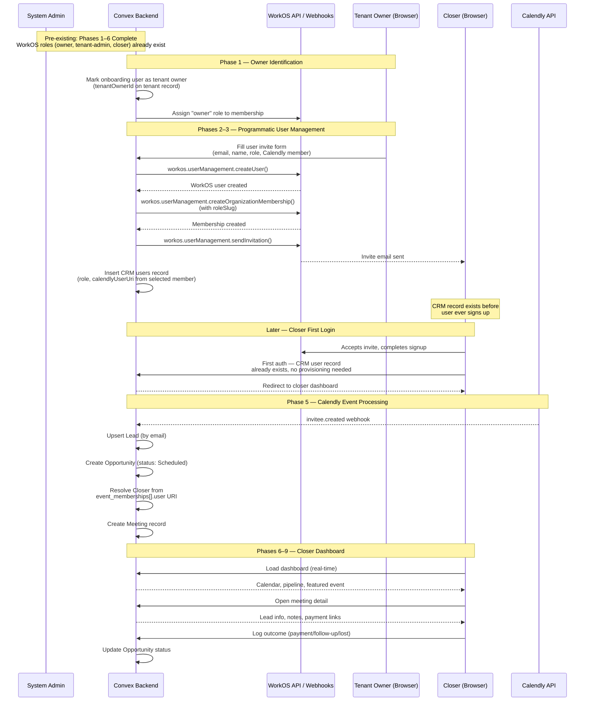

---

## 4. Phase 1: Tenant Owner Identification & WorkOS Role Setup (Programmatic, No Widgets)

### 4.1 Identifying the Tenant Owner

The tenant owner is the user who completed the Calendly OAuth flow during onboarding. We need to reliably identify this user.

**Strategy: `tenantOwnerId` field on the `tenants` table.**

We add a `tenantOwnerId` field to the `tenants` table pointing to the `users` document of the owner. This is set during the existing `redeemInviteAndCreateUser` mutation (Phase 3 of the system admin flow).

> **Why `tenantOwnerId` on `tenants` rather than an `isOwner` flag on `users`?**
> - A tenant has exactly one owner — this is a 1:1 relationship best modeled on the tenant.
> - Avoids the need to scan all users to find the owner.
> - The `users.role` field already carries `"tenant_master"` which semantically represents the owner, but a direct reference is more efficient for lookups.
> - Both are maintained: `tenantOwnerId` for fast lookup, `role: "tenant_master"` for authorization checks.

### 4.2 Schema Change: `tenants` Table

```typescript
// Add to tenants table definition:
tenantOwnerId: v.optional(v.id("users")),  // Set during onboarding
```

`v.optional` because the field doesn't exist when the tenant record is first created (status: `pending_signup`). It's set when the first user redeems the invite.

### 4.3 Modification to `redeemInviteAndCreateUser`

The existing mutation in `convex/onboarding/complete.ts` creates the first user with `role: "tenant_master"`. We modify it to also:

1. Store the new user's `_id` as `tenantOwnerId` on the tenant record.
2. Trigger a Convex action to assign the `owner` WorkOS role to the user's organization membership.

```typescript
// In redeemInviteAndCreateUser handler, after inserting the user:
const userId = await ctx.db.insert("users", {
  tenantId: tenant._id,
  workosUserId,
  email: identity.email ?? tenant.contactEmail,
  fullName: identity.name ?? undefined,
  role: "tenant_master",
});

// Set tenant owner reference
await ctx.db.patch(tenant._id, {
  tenantOwnerId: userId,
  inviteRedeemedAt: Date.now(),
  status: "pending_calendly",
});
```

### 4.4 WorkOS Role Assignment for the Owner

After the user record is created, we need to assign the `owner` role in WorkOS. This requires:

1. Finding the user's **membership ID** in the WorkOS organization (not the user ID — per WorkOS RBAC gotchas).
2. Calling `workos.userManagement.updateOrganizationMembership()` with `roleSlug: "owner"`.

This runs as a **Convex action** (requires `@workos-inc/node` SDK, which needs Node.js runtime):

```typescript
// convex/workos/roles.ts
"use node";

import { WorkOS } from "@workos-inc/node";
import { internalAction } from "../_generated/server";
import { v } from "convex/values";

const workos = new WorkOS(process.env.WORKOS_API_KEY!, {
  clientId: process.env.WORKOS_CLIENT_ID!,
});

export const assignRoleToMembership = internalAction({
  args: {
    workosUserId: v.string(),
    workosOrgId: v.string(),
    roleSlug: v.string(),
  },
  handler: async (_ctx, { workosUserId, workosOrgId, roleSlug }) => {
    // Step 1: Find the membership
    const memberships = await workos.userManagement.listOrganizationMemberships({
      userId: workosUserId,
      organizationId: workosOrgId,
    });

    const membership = memberships.data[0];
    if (!membership) {
      throw new Error(`No membership found for user ${workosUserId} in org ${workosOrgId}`);
    }

    // Step 2: Assign the role
    await workos.userManagement.updateOrganizationMembership(membership.id, {
      roleSlug,
    });
  },
});
```

> **Timing:** Role assignment happens asynchronously after `redeemInviteAndCreateUser` completes. The role takes effect on the user's **next session** — which is typically a page refresh or re-login. This is acceptable because the tenant owner's first login is usually shortly after onboarding completion.

### 4.5 No Migration Needed

> **This app is not in production.** There are no existing tenants/users that need retroactive fixes. Any test data can be wiped and reprovisioned. Schema changes take effect immediately — no widen-migrate-narrow workflow required.

---

### WorkOS RBAC — Pre-Existing Configuration

> **The following WorkOS roles already exist** at the environment level. No setup step is needed during implementation. This section documents the configuration for reference only.
>
> | Role Name | Slug | Permissions | Purpose |
> |---|---|---|---|
> | Owner | `owner` | `users:manage` | Full tenant access, can invite/manage users programmatically |
> | Tenant Admin | `tenant-admin` | `users:manage` | Near-full tenant access, can invite/manage users programmatically |
> | Closer | `closer` | _(none)_ | Limited to own pipeline, calendar, and meeting operations |
>
> **Note:** The `users:manage` permission is used as a server-side authorization check to verify the caller has user-management privileges. It does **not** grant access to any WorkOS Widget — all user management is handled programmatically via the WorkOS Node SDK and our custom CRM form.
>
> **Important reminder from WorkOS RBAC gotchas:**
> - We check **permissions** (e.g., `role.permissions.includes('users:manage')`) or CRM `users.role` for authorization decisions — never role slugs directly.
> - Role assignment requires the **membership ID** — fetch via `listOrganizationMemberships()` first, then call `updateOrganizationMembership(membershipId, { roleSlug })`.
> - Org-level roles must **never** be created — the first one permanently isolates that org from inheriting environment-level role changes.
> - Role changes take effect on the user's **next session** — stale sessions won't reflect the new role.

---

## 5. Phase 2: Programmatic User Management — WorkOS Node SDK

### 5.1 Overview: Programmatic User Invite with Calendly Linking

We manage users **programmatically** via the **WorkOS Node SDK** (`@workos-inc/node`), using a custom CRM form (no WorkOS User Management Widget).

The Tenant Owner (and Tenant Admin) fills a form with:
- Email, first name, last name
- Role (Closer, Admin, Owner)
- **Calendly member link** (required for Closers; optional/hidden for Admins/Owner)

A single Convex action handles the entire synchronous flow:

1. Validates email uniqueness and Calendly member eligibility
2. Creates the user in WorkOS via SDK
3. Creates the organization membership with the correct role slug
4. Creates the CRM `users` record with **all tenant and Calendly data pre-populated**
5. Marks the selected Calendly member as matched (if applicable)
6. Sends the WorkOS invite email

**Critical:** The CRM `users` record exists **before the user ever signs up or logs in**. When they accept the invite and authenticate, their data, role, org assignment, and Calendly linkage are already there. No post-hoc provisioning.

Everything is synchronous, single-request, no webhooks or widget tokens.

### 5.2 Why Programmatic Form Instead of WorkOS User Management Widget?

| Aspect | Widget Approach | Programmatic Form (chosen) |
|---|---|---|
| **Widget tokens** | Requires token generation + refresh logic | Not needed |
| **User provisioning** | Webhook-driven; race condition if user signs up before webhook fires | Synchronous; CRM record guaranteed to exist before invite sent |
| **Calendly linking** | Post-hoc manual matching; admin must re-configure after user signs up | **At creation time** via form dropdown; admin selects member during invite |
| **Data completeness** | User record created only after signup completion | **CRM record fully populated at invite time** (role, org, Calendly URI) |
| **Setup completeness** | Setup continues after user signs up (role assignment, Calendly match) | **All setup complete at invite time**; no further action needed |
| **First login UX** | User signs in → system provisions record → redirect to dashboard | User signs in → system finds pre-provisioned record → immediate redirect to dashboard |
| **Complexity** | Widget lifecycle, token auth layer, webhook handlers | One form, one Convex action, one Calendly dropdown |
| **Control** | WorkOS controls UI and behavior | We control UI, validation, Calendly member selection, and all branding |

### 5.3 WorkOS Node SDK — User Management Methods

| Operation | SDK Call |
|---|---|
| Create user | `workos.userManagement.createUser({ email, firstName, lastName })` |
| Create org membership | `workos.userManagement.createOrganizationMembership({ userId, organizationId, roleSlug })` |
| Send invitation | `workos.userManagement.sendInvitation({ email, organizationId })` |
| List org memberships | `workos.userManagement.listOrganizationMemberships({ organizationId })` |
| Update membership role | `workos.userManagement.updateOrganizationMembership(membershipId, { roleSlug })` |
| Delete membership | `workos.userManagement.deleteOrganizationMembership(membershipId)` |
| Delete user | `workos.userManagement.deleteUser(userId)` |

### 5.4 Role Slug Mapping

```typescript
// WorkOS role slug → CRM role
function mapWorkosRoleToCrmRole(roleSlug: string): "tenant_master" | "tenant_admin" | "closer" {
  switch (roleSlug) {
    case "owner": return "tenant_master";
    case "tenant-admin": return "tenant_admin";
    case "closer": return "closer";
    default: return "closer"; // Default to least privilege
  }
}

// CRM role → WorkOS role slug
function mapCrmRoleToWorkosSlug(role: string): string {
  switch (role) {
    case "tenant_master": return "owner";
    case "tenant_admin": return "tenant-admin";
    case "closer": return "closer";
    default: return "closer";
  }
}
```

---

## 6. Phase 3: User Invite Form & Calendly Member Linking

### 6.1 Invite User Flow — Synchronous Pre-Provisioning

Admin submits the invite form → a single Convex action executes these steps **synchronously** in order:

1. **Validate** the caller (must be tenant_master or tenant_admin) and resolve tenant
2. **Validate** Calendly member selection (if provided) — confirm it exists, is unmatched, and belongs to this tenant
3. **Create WorkOS user** via SDK
4. **Create organization membership** with the selected role slug
5. **Send WorkOS invitation** email
6. **Create CRM `users` record** in the database with all fields:
   - `tenantId`, `workosUserId`, `email`, `fullName`, `role`, `calendlyUserUri`
7. **Mark Calendly member as matched** (if applicable)
8. **Return success** to the UI

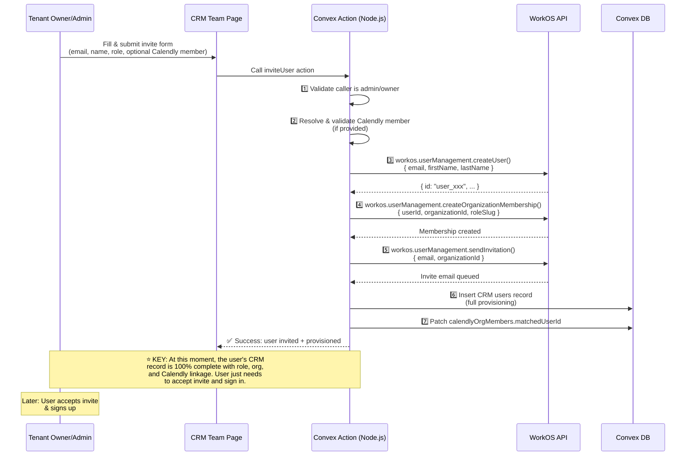

**Critical:** The CRM `users` record is created **before the user even signs up**. No post-signup provisioning needed.

### 6.2 The `inviteUser` Convex Action (Node.js)

**Purpose:** Single synchronous operation that:
1. Validates admin authorization and tenant context
2. Validates and resolves Calendly member (if applicable)
3. Creates WorkOS user + membership + invitation
4. Creates fully-provisioned CRM `users` record
5. Links Calendly member to CRM user

All steps execute sequentially in one request. **The CRM record exists before the function returns.**

```typescript
// convex/workos/userManagement.ts
"use node";

import { WorkOS } from "@workos-inc/node";
import { action } from "../_generated/server";
import { internal } from "../_generated/api";
import { v } from "convex/values";

const workos = new WorkOS(process.env.WORKOS_API_KEY!, {
  clientId: process.env.WORKOS_CLIENT_ID!,
});

export const inviteUser = action({
  args: {
    email: v.string(),
    firstName: v.string(),
    lastName: v.optional(v.string()),
    role: v.union(
      v.literal("tenant_master"),
      v.literal("tenant_admin"),
      v.literal("closer"),
    ),
    calendlyMemberId: v.optional(v.id("calendlyOrgMembers")),
  },
  handler: async (ctx, { email, firstName, lastName, role, calendlyMemberId }) => {
    // ==== Step 1: Authorization ====
    const identity = await ctx.auth.getUserIdentity();
    if (!identity) throw new Error("Not authenticated");

    const caller = await ctx.runQuery(internal.users.queries.getCurrentUserInternal, {
      workosUserId: identity.subject ?? identity.tokenIdentifier,
    });
    if (!caller || (caller.role !== "tenant_master" && caller.role !== "tenant_admin")) {
      throw new Error("Insufficient permissions: only owners and admins can invite users");
    }

    const tenant = await ctx.runQuery(internal.tenants.getCalendlyTenant, {
      tenantId: caller.tenantId,
    });
    if (!tenant) throw new Error("Tenant not found");

    // ==== Step 2: Validate & Resolve Calendly Member ====
    let calendlyUserUri: string | undefined;
    if (calendlyMemberId) {
      const member = await ctx.runQuery(internal.calendly.orgMembersQueries.getMember, {
        memberId: calendlyMemberId,
      });
      if (!member || member.tenantId !== caller.tenantId) {
        throw new Error("Invalid Calendly member");
      }
      if (member.matchedUserId) {
        throw new Error("This Calendly member is already linked to another user");
      }
      calendlyUserUri = member.calendlyUserUri;
    }

    // ==== Step 3: Create WorkOS User ====
    const workosUser = await workos.userManagement.createUser({
      email,
      firstName,
      lastName: lastName ?? undefined,
    });

    // ==== Step 4: Create Organization Membership with Role ====
    const roleSlug = mapCrmRoleToWorkosSlug(role);
    await workos.userManagement.createOrganizationMembership({
      userId: workosUser.id,
      organizationId: tenant.workosOrgId,
      roleSlug,
    });

    // ==== Step 5: Send WorkOS Invitation Email ====
    await workos.userManagement.sendInvitation({
      email,
      organizationId: tenant.workosOrgId,
    });

    // ==== Step 6: Create CRM User Record with Full Provisioning ====
    // This is where the magic happens: the CRM record is created with:
    // - tenantId, workosUserId, email, fullName, role
    // - calendlyUserUri (if a Calendly member was selected)
    // - AND the Calendly member is marked as matched
    //
    // When the user signs up and logs in later, their record already exists
    // with role, org, and Calendly linkage. No post-signup provisioning needed.
    const userId = await ctx.runMutation(internal.workos.userMutations.createUserWithCalendlyLink, {
      tenantId: caller.tenantId,
      workosUserId: workosUser.id,
      email,
      fullName: [firstName, lastName].filter(Boolean).join(" "),
      role,
      calendlyUserUri,
      calendlyMemberId,
    });

    return { userId, workosUserId: workosUser.id };
  },
});
```

### 6.3 The CRM User Creation Mutation (Internal)

**Purpose:** Creates the fully-provisioned CRM `users` record and links the Calendly member.

This is an **internal** mutation (called only from the `inviteUser` action) to ensure atomicity and prevent accidental direct calls.

The mutation:
1. Checks idempotency (if user already exists, return the existing ID)
2. Inserts the `users` record with all fields: `tenantId`, `workosUserId`, `email`, `fullName`, `role`, `calendlyUserUri`
3. Patches the Calendly org member to mark it as matched (if provided)

```typescript
// convex/workos/userMutations.ts

export const createUserWithCalendlyLink = internalMutation({
  args: {
    tenantId: v.id("tenants"),
    workosUserId: v.string(),
    email: v.string(),
    fullName: v.optional(v.string()),
    role: v.union(
      v.literal("tenant_master"),
      v.literal("tenant_admin"),
      v.literal("closer"),
    ),
    calendlyUserUri: v.optional(v.string()),
    calendlyMemberId: v.optional(v.id("calendlyOrgMembers")),
  },
  handler: async (ctx, args) => {
    const { tenantId, workosUserId, email, fullName, role, calendlyUserUri, calendlyMemberId } = args;

    // Idempotency: if the user was already created, don't create again
    const existing = await ctx.db
      .query("users")
      .withIndex("by_workosUserId", (q) => q.eq("workosUserId", workosUserId))
      .unique();
    if (existing) return existing._id;

    // Insert CRM user
    const userId = await ctx.db.insert("users", {
      tenantId,
      workosUserId,
      email,
      fullName,
      role,
      calendlyUserUri,
    });

    // Link the Calendly org member (if selected)
    if (calendlyMemberId) {
      await ctx.db.patch(calendlyMemberId, {
        matchedUserId: userId,
      });
    }

    return userId;
  },
});
```

### 6.4 The Custom Invite Form UI

**Route:** `app/workspace/team/page.tsx`

The Team page displays:
1. A **members table** listing all CRM users for this tenant (queried from Convex, not WorkOS).
2. An **"Invite User" button** that opens a modal form.
3. Per-user actions: edit role, remove user, re-link Calendly member.

#### Invite Form Fields & Submission

| Field | Type | Required | Notes |
|---|---|---|---|
| Email | text | Yes | Must be unique within the tenant |
| First Name | text | Yes | Used for WorkOS user creation |
| Last Name | text | No | Optional; used for full name display |
| Role | select | Yes | Options: `closer`, `tenant_admin`, `tenant_master` |
| Calendly Member | select | **Conditional** | **Required for Closers only.** Shows dropdown of unmatched `calendlyOrgMembers` records. Hidden for Admin/Owner roles. |

**Form Submission:**
- When submitted, calls the `inviteUser` Convex action with all fields
- The action validates inputs, creates the WorkOS user, membership, CRM record, and sends invite in one synchronous operation
- User receives a WorkOS invite email; CRM record is already fully provisioned (role, org, Calendly link)

#### Invite Form Flow

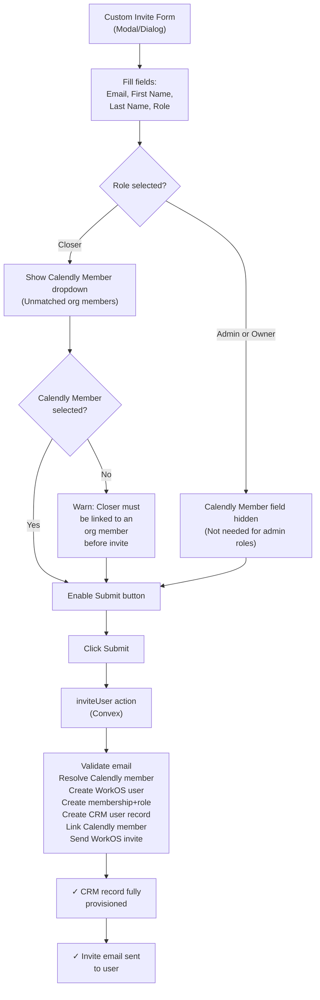

**Key point:** At the moment of form submission, all system setup is complete. The user's CRM record exists with role, org, and Calendly linkage. They just need to accept the invite and sign in.

### 6.5 Listing Team Members (Convex Query, Not Widget)

```typescript
// convex/users/queries.ts
export const listTeamMembers = query({
  args: {},
  handler: async (ctx) => {
    const { tenantId } = await requireTenantUser(ctx, ["tenant_master", "tenant_admin"]);

    const users = await ctx.db
      .query("users")
      .withIndex("by_tenantId", (q) => q.eq("tenantId", tenantId))
      .collect();

    // Enrich with Calendly member info
    const enriched = await Promise.all(
      users.map(async (user) => {
        let calendlyMemberName: string | undefined;
        if (user.calendlyUserUri) {
          const member = await ctx.db
            .query("calendlyOrgMembers")
            .withIndex("by_tenantId_and_calendlyUserUri", (q) =>
              q.eq("tenantId", tenantId).eq("calendlyUserUri", user.calendlyUserUri!)
            )
            .unique();
          calendlyMemberName = member?.name;
        }
        return { ...user, calendlyMemberName };
      })
    );

    return enriched;
  },
});

// List unmatched Calendly org members (for the invite form dropdown)
export const listUnmatchedCalendlyMembers = query({
  args: {},
  handler: async (ctx) => {
    const { tenantId } = await requireTenantUser(ctx, ["tenant_master", "tenant_admin"]);

    const members = await ctx.db
      .query("calendlyOrgMembers")
      .withIndex("by_tenantId", (q) => q.eq("tenantId", tenantId))
      .filter((q) => q.eq(q.field("matchedUserId"), undefined))
      .collect();

    return members;
  },
});
```

### 6.6 Updating a User's Role

```typescript
// convex/workos/userManagement.ts (continued)

export const updateUserRole = action({
  args: {
    userId: v.id("users"),
    newRole: v.union(
      v.literal("tenant_master"),
      v.literal("tenant_admin"),
      v.literal("closer"),
    ),
  },
  handler: async (ctx, { userId, newRole }) => {
    const caller = await requireCallerIsAdmin(ctx);
    const user = await ctx.runQuery(internal.users.queries.getById, { userId });
    if (!user || user.tenantId !== caller.tenantId) throw new Error("User not found");

    const tenant = await ctx.runQuery(internal.tenants.getCalendlyTenant, { tenantId: caller.tenantId });
    if (!tenant) throw new Error("Tenant not found");

    // Update WorkOS membership role
    const memberships = await workos.userManagement.listOrganizationMemberships({
      userId: user.workosUserId,
      organizationId: tenant.workosOrgId,
    });
    const membership = memberships.data[0];
    if (membership) {
      await workos.userManagement.updateOrganizationMembership(membership.id, {
        roleSlug: mapCrmRoleToWorkosSlug(newRole),
      });
    }

    // Update CRM user
    await ctx.runMutation(internal.users.mutations.updateRole, { userId, role: newRole });
  },
});
```

### 6.7 Removing a User

```typescript
export const removeUser = action({
  args: { userId: v.id("users") },
  handler: async (ctx, { userId }) => {
    const caller = await requireCallerIsAdmin(ctx);
    const user = await ctx.runQuery(internal.users.queries.getById, { userId });
    if (!user || user.tenantId !== caller.tenantId) throw new Error("User not found");
    if (user._id === caller.userId) throw new Error("Cannot remove yourself");

    const tenant = await ctx.runQuery(internal.tenants.getCalendlyTenant, { tenantId: caller.tenantId });
    if (!tenant) throw new Error("Tenant not found");

    // Remove from WorkOS org
    const memberships = await workos.userManagement.listOrganizationMemberships({
      userId: user.workosUserId,
      organizationId: tenant.workosOrgId,
    });
    const membership = memberships.data[0];
    if (membership) {
      await workos.userManagement.deleteOrganizationMembership(membership.id);
    }

    // Clean up CRM: unlink Calendly member, delete user record
    await ctx.runMutation(internal.users.mutations.removeUser, { userId });
  },
});
```

### 6.8 Re-linking Calendly Member (Admin Action)

If a Closer's Calendly link needs to change (wrong member selected, or not selected at creation time), the admin can re-link:

```typescript
// convex/users/linkCalendlyMember.ts
export const linkCloserToCalendlyMember = mutation({
  args: {
    userId: v.id("users"),
    calendlyMemberId: v.id("calendlyOrgMembers"),
  },
  handler: async (ctx, { userId, calendlyMemberId }) => {
    const { tenantId } = await requireTenantUser(ctx, ["tenant_master", "tenant_admin"]);

    const user = await ctx.db.get(userId);
    const member = await ctx.db.get(calendlyMemberId);

    if (!user || !member || user.tenantId !== tenantId || member.tenantId !== tenantId) {
      throw new Error("Invalid user or member");
    }

    if (member.matchedUserId && member.matchedUserId !== userId) {
      throw new Error("This Calendly member is already linked to another user");
    }

    // Unlink previous Calendly member (if any)
    if (user.calendlyUserUri) {
      const prevMember = await ctx.db
        .query("calendlyOrgMembers")
        .withIndex("by_tenantId_and_calendlyUserUri", (q) =>
          q.eq("tenantId", tenantId).eq("calendlyUserUri", user.calendlyUserUri!)
        )
        .unique();
      if (prevMember) {
        await ctx.db.patch(prevMember._id, { matchedUserId: undefined });
      }
    }

    // Link new member
    await ctx.db.patch(userId, { calendlyUserUri: member.calendlyUserUri });
    await ctx.db.patch(calendlyMemberId, { matchedUserId: userId });
  },
});
```

### 6.9 Unmatched Closer Behavior

An unmatched Closer can still log in, but their dashboard will show:

- A prominent banner: "Your account is not linked to a Calendly member. Please contact your admin."
- No meetings, no pipeline data.
- The admin's team page shows a warning badge next to unmatched Closers.

### 6.10 What Happens When the User Eventually Signs Up

When the invited user accepts the invite and signs up via WorkOS AuthKit:

1. They authenticate and receive a JWT with their `org_id` and `subject` (WorkOS user ID).
2. The frontend calls `getCurrentUser()` which looks up the user by `workosUserId`.
3. **The CRM user record already exists** — created by the `inviteUser` action at invite time.
4. The user is immediately routed to their role-appropriate dashboard. No provisioning delay, no race conditions.

```typescript
// This query will find the pre-provisioned user:
export const getCurrentUser = query({
  args: {},
  handler: async (ctx) => {
    const identity = await ctx.auth.getUserIdentity();
    if (!identity) return null;

    const workosUserId = identity.subject ?? identity.tokenIdentifier;
    return await ctx.db
      .query("users")
      .withIndex("by_workosUserId", (q) => q.eq("workosUserId", workosUserId))
      .unique();
  },
});
```

---

## 7. Phase 4: Tenant Owner / Admin Dashboard

### 7.1 Dashboard Layout

The Tenant Owner and Tenant Admin share an **identical dashboard** for MVP. It serves as the operational command center.

```
app/workspace/page.tsx  (enhanced — replaces current subsystem status page)
```

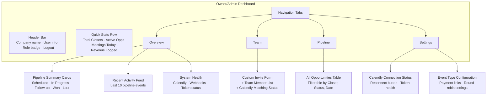

### 7.2 Navigation Structure

| Route | Tab | Content |
|---|---|---|
| `/workspace` | Overview | Quick stats, pipeline summary, activity feed, system health |
| `/workspace/team` | Team | Custom invite form + Calendly member selection |
| `/workspace/pipeline` | Pipeline | All opportunities across all closers, filterable |
| `/workspace/settings` | Settings | Calendly connection, event type config |

### 7.3 Quick Stats Queries

```typescript
// convex/dashboard/adminStats.ts
export const getAdminDashboardStats = query({
  args: {},
  handler: async (ctx) => {
    // Resolve tenant from auth
    const { tenantId } = await requireTenantUser(ctx, ["tenant_master", "tenant_admin"]);

    const closers = await ctx.db
      .query("users")
      .withIndex("by_tenantId", (q) => q.eq("tenantId", tenantId))
      .filter((q) => q.eq(q.field("role"), "closer"))
      .collect();

    const opportunities = await ctx.db
      .query("opportunities")
      .withIndex("by_tenantId", (q) => q.eq("tenantId", tenantId))
      .collect();

    const today = startOfDay(Date.now());
    const tomorrow = today + 86400000;
    const meetingsToday = await ctx.db
      .query("meetings")
      .withIndex("by_tenantId_and_scheduledAt", (q) =>
        q.eq("tenantId", tenantId).gte("scheduledAt", today).lt("scheduledAt", tomorrow)
      )
      .collect();

    return {
      totalClosers: closers.length,
      unmatchedClosers: closers.filter(c => !c.calendlyUserUri).length,
      activeOpportunities: opportunities.filter(o =>
        ["scheduled", "in_progress", "follow_up_scheduled"].includes(o.status)
      ).length,
      meetingsToday: meetingsToday.length,
      totalRevenue: opportunities
        .filter(o => o.status === "payment_received")
        .length, // Full revenue calc requires paymentRecords join
    };
  },
});
```

### 7.4 Calendly Re-Authentication (Tenant Admin Capability)

Tenant Admins can trigger a Calendly token refresh from the Settings page. If the Calendly connection is lost (`status: "calendly_disconnected"`), both Owners and Admins can initiate re-authentication:

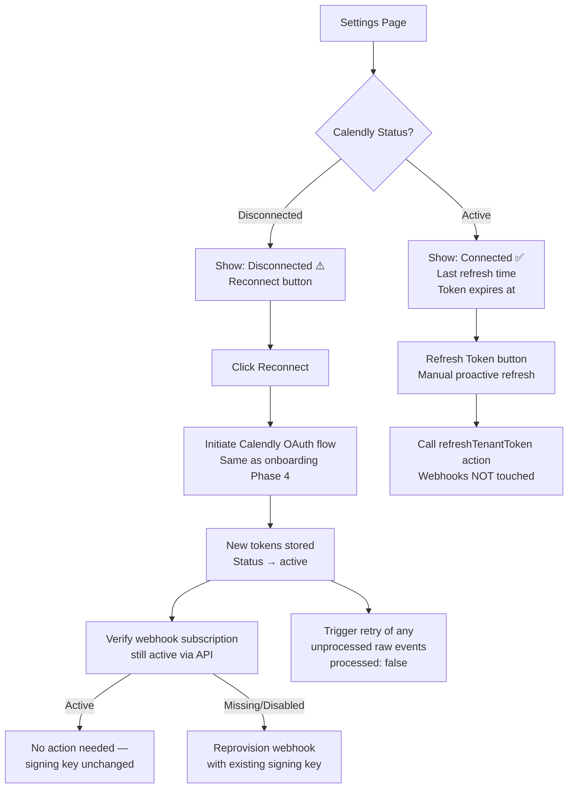

> **Webhook subscriptions are independent of OAuth tokens.** They are scoped to the Calendly organization and verified using the per-tenant signing key stored in Convex. Token refresh (`refreshTenantTokenCore`) does **not** touch webhooks — only the tokens are updated.
>
> **On full reconnect (OAuth re-auth):** Webhooks should be *verified* but not blindly reprovisioned. The existing subscription is almost certainly still active — reprovisioning would cause a brief gap where in-flight events could arrive against a deleted subscription. Only reprovision if the subscription is confirmed missing or disabled. The existing `provisionWebhookSubscription` implementation already preserves the signing key (passing `tenant.webhookSigningKey`) so verification is safe.
>
> **Events received during token invalidity:** Webhooks continue to arrive and are persisted as `processed: false` regardless of token state — signature verification uses the signing key, not the access token. The pipeline processes from the raw payload and Convex DB (no Calendly API calls needed for the core Lead/Opportunity/Meeting creation flow). After reconnect, any accumulated `processed: false` events should be retried. If a pipeline step *does* require a live API call to enrich missing data and the token is invalid at that moment, the event stays unprocessed and will be retried automatically once the token is restored.

### 7.5 Event Type Configuration

The Settings tab includes an **Event Type Configuration** panel where Owners/Admins can:

1. View all Calendly event types synced from the org.
2. Associate **payment links** (external URLs) with each event type.
3. Enable/disable **round robin** tracking per event type.
4. Set a **display name** override for the CRM.

This data is stored in the `eventTypeConfigs` table (see [Data Model](#14-data-model--new--modified-tables)).

---

## 8. Phase 5: Webhook Event Processing Pipeline (Calendly)

### 8.1 Overview

Currently, raw webhook events are persisted to `rawWebhookEvents` with `processed: false`. This phase implements the **processing pipeline** that transforms raw events into domain entities (Leads, Opportunities, Meetings).

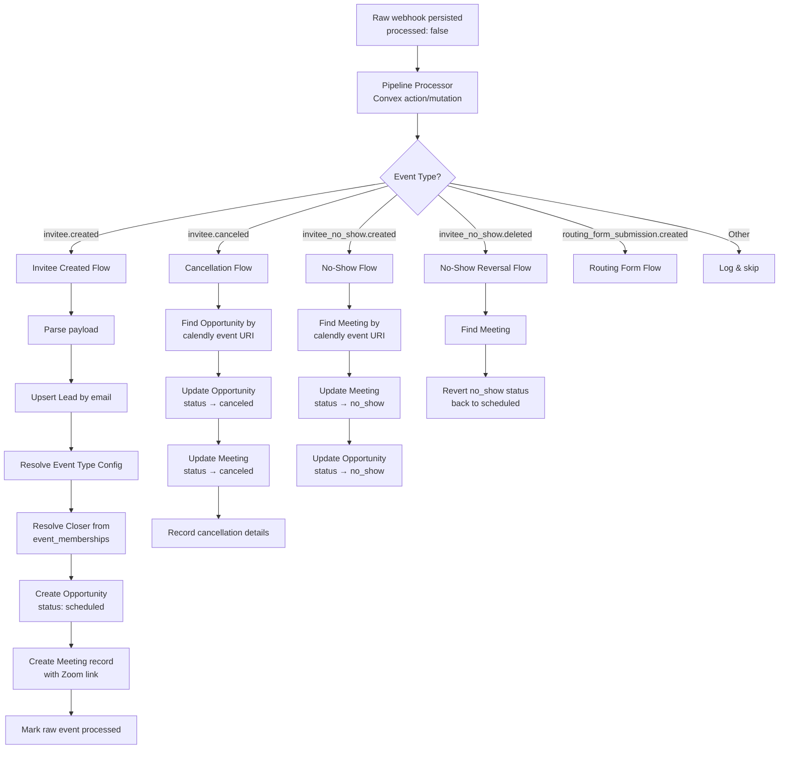

### 8.2 Pipeline Trigger

The pipeline processor is triggered via `ctx.scheduler.runAfter(0, ...)` immediately after persisting the raw event (already implemented in the webhook handler). The processor:

1. Reads the raw event.
2. Parses the JSON payload.
3. Dispatches to the appropriate flow based on `eventType`.
4. Marks the raw event as `processed: true` on success.

```typescript
// convex/pipeline/processor.ts
export const processRawEvent = internalAction({
  args: { rawEventId: v.id("rawWebhookEvents") },
  handler: async (ctx, { rawEventId }) => {
    const rawEvent = await ctx.runQuery(internal.pipeline.queries.getRawEvent, { rawEventId });
    if (!rawEvent || rawEvent.processed) return;

    const payload = JSON.parse(rawEvent.payload);

    switch (rawEvent.eventType) {
      case "invitee.created":
        await ctx.runMutation(internal.pipeline.inviteeCreated.process, {
          tenantId: rawEvent.tenantId,
          payload,
          rawEventId,
        });
        break;
      case "invitee.canceled":
        await ctx.runMutation(internal.pipeline.inviteeCanceled.process, {
          tenantId: rawEvent.tenantId,
          payload,
          rawEventId,
        });
        break;
      case "invitee_no_show.created":
        await ctx.runMutation(internal.pipeline.inviteeNoShow.process, {
          tenantId: rawEvent.tenantId,
          payload,
          rawEventId,
        });
        break;
      // ... other event types
    }
  },
});
```

### 8.3 `invitee.created` Flow — Core Pipeline

This is the primary pipeline entry point. It creates the full chain: Lead → Opportunity → Meeting.

```typescript
// convex/pipeline/inviteeCreated.ts

// Step 1: Extract key fields from payload
const inviteeEmail = payload.email;
const inviteeName = payload.name;
const inviteePhone = payload.text_reminder_number ?? null;
const scheduledEvent = payload.scheduled_event;
const eventTypeUri = scheduledEvent.event_type;
const eventMemberships = scheduledEvent.event_memberships; // [{ user, user_email, user_name }]
const scheduledAt = new Date(scheduledEvent.start_time).getTime();
const endTime = new Date(scheduledEvent.end_time).getTime();
const durationMinutes = Math.round((endTime - scheduledAt) / 60000);
const calendlyEventUri = scheduledEvent.uri;
const calendlyInviteeUri = payload.uri;

// Extract Zoom link from location if available
const zoomJoinUrl = scheduledEvent.location?.join_url ?? null;

// Step 2: Upsert Lead
let lead = await ctx.db
  .query("leads")
  .withIndex("by_tenantId_and_email", (q) =>
    q.eq("tenantId", tenantId).eq("email", inviteeEmail)
  )
  .unique();

if (!lead) {
  const leadId = await ctx.db.insert("leads", {
    tenantId,
    email: inviteeEmail,
    fullName: inviteeName,
    phone: inviteePhone,
    customFields: extractQuestionsAndAnswers(payload.questions_and_answers),
    firstSeenAt: Date.now(),
    updatedAt: Date.now(),
  });
  lead = await ctx.db.get(leadId);
} else {
  // Update existing lead with latest info
  await ctx.db.patch(lead._id, {
    fullName: inviteeName || lead.fullName,
    phone: inviteePhone || lead.phone,
    updatedAt: Date.now(),
  });
}

// Step 3: Resolve Closer from event_memberships
const assignedHost = eventMemberships[0]; // Primary assigned host
let closerId = null;

if (assignedHost) {
  const closerUser = await ctx.db
    .query("users")
    .withIndex("by_tenantId_and_calendlyUserUri", (q) =>
      q.eq("tenantId", tenantId).eq("calendlyUserUri", assignedHost.user)
    )
    .unique();

  if (closerUser) {
    closerId = closerUser._id;
  }
}

// Fallback: assign to tenant owner if no closer matched
if (!closerId) {
  const tenant = await ctx.db.get(tenantId);
  closerId = tenant?.tenantOwnerId ?? null;
}

// Step 4: Resolve or create Event Type Config
let eventTypeConfigId = null;
if (eventTypeUri) {
  const config = await ctx.db
    .query("eventTypeConfigs")
    .withIndex("by_tenantId_and_calendlyEventTypeUri", (q) =>
      q.eq("tenantId", tenantId).eq("calendlyEventTypeUri", eventTypeUri)
    )
    .unique();

  if (config) {
    eventTypeConfigId = config._id;
  }
  // If no config exists, we create a placeholder to be configured later
}

// Step 5: Check for existing Opportunity (follow-up scenario)
// If a lead already has an active opportunity, this might be a follow-up
let existingOpp = await ctx.db
  .query("opportunities")
  .withIndex("by_tenantId_and_leadId", (q) =>
    q.eq("tenantId", tenantId).eq("leadId", lead!._id)
  )
  .filter((q) => q.eq(q.field("status"), "follow_up_scheduled"))
  .first();

let opportunityId;
if (existingOpp) {
  // This is a follow-up meeting — update existing opportunity
  opportunityId = existingOpp._id;
  await ctx.db.patch(opportunityId, {
    status: "scheduled",
    updatedAt: Date.now(),
  });
} else {
  // New opportunity
  opportunityId = await ctx.db.insert("opportunities", {
    tenantId,
    leadId: lead!._id,
    assignedCloserId: closerId,
    eventTypeConfigId,
    status: "scheduled",
    calendlyEventUri,
    createdAt: Date.now(),
    updatedAt: Date.now(),
  });
}

// Step 6: Create Meeting record
await ctx.db.insert("meetings", {
  tenantId,
  opportunityId,
  calendlyEventUri,
  calendlyInviteeUri,
  zoomJoinUrl,
  scheduledAt,
  durationMinutes,
  status: "scheduled",
  notes: "",
  createdAt: Date.now(),
});

// Step 7: Mark raw event as processed
await ctx.db.patch(rawEventId, { processed: true });
```

### 8.4 `invitee.canceled` Flow

```typescript
// Find the meeting by calendlyEventUri (from payload.scheduled_event.uri)
const calendlyEventUri = payload.scheduled_event.uri;

const meeting = await ctx.db
  .query("meetings")
  .withIndex("by_tenantId_and_calendlyEventUri", (q) =>
    q.eq("tenantId", tenantId).eq("calendlyEventUri", calendlyEventUri)
  )
  .first();

if (meeting) {
  await ctx.db.patch(meeting._id, {
    status: "canceled",
  });

  // Update opportunity
  const opportunity = await ctx.db.get(meeting.opportunityId);
  if (opportunity && opportunity.status === "scheduled") {
    await ctx.db.patch(opportunity._id, {
      status: "canceled",
      cancellationReason: payload.cancellation?.reason ?? null,
      canceledBy: payload.cancellation?.canceler_type ?? null, // "invitee" or "host"
      updatedAt: Date.now(),
    });
  }
}

await ctx.db.patch(rawEventId, { processed: true });
```

### 8.5 `invitee_no_show.created` Flow

```typescript
const calendlyEventUri = payload.scheduled_event?.uri ?? payload.event;

const meeting = await ctx.db
  .query("meetings")
  .withIndex("by_tenantId_and_calendlyEventUri", (q) =>
    q.eq("tenantId", tenantId).eq("calendlyEventUri", calendlyEventUri)
  )
  .first();

if (meeting) {
  await ctx.db.patch(meeting._id, { status: "no_show" });

  const opportunity = await ctx.db.get(meeting.opportunityId);
  if (opportunity) {
    await ctx.db.patch(opportunity._id, {
      status: "no_show",
      updatedAt: Date.now(),
    });
  }
}

await ctx.db.patch(rawEventId, { processed: true });
```

### 8.6 Closer Assignment — Round Robin Resolution

When an `invitee.created` event arrives for a round-robin event type, the Calendly payload includes only the **assigned** host in `event_memberships`. The CRM resolves this host to a CRM user:

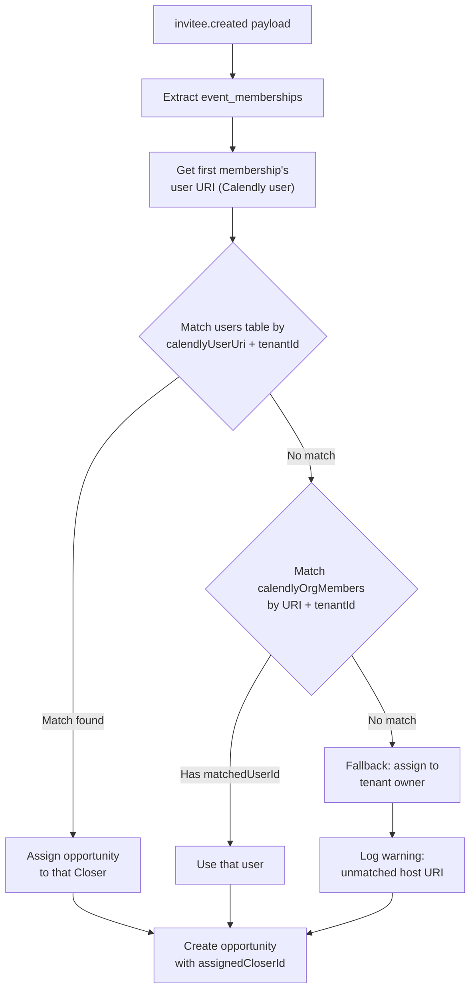

---

## 9. Phase 6: Closer Dashboard — Pipeline & Calendar

### 9.1 Overview

The Closer Dashboard is the primary operational interface. It is scoped to show **only the Closer's own data** — their assigned meetings, opportunities, and pipeline.

```
app/workspace/closer/page.tsx
```

### 9.2 Dashboard Layout

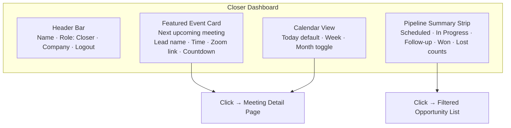

### 9.3 Featured Event Card

Displays the **next upcoming meeting** (soonest `scheduledAt` in the future with `status: "scheduled"`):

```typescript
// convex/closer/dashboard.ts
export const getNextMeeting = query({
  args: {},
  handler: async (ctx) => {
    const { userId, tenantId } = await requireTenantUser(ctx, ["closer"]);
    const now = Date.now();

    // Get the closer's next scheduled meeting
    const opportunities = await ctx.db
      .query("opportunities")
      .withIndex("by_tenantId_and_assignedCloserId", (q) =>
        q.eq("tenantId", tenantId).eq("assignedCloserId", userId)
      )
      .filter((q) => q.eq(q.field("status"), "scheduled"))
      .collect();

    const oppIds = new Set(opportunities.map(o => o._id));

    const meetings = await ctx.db
      .query("meetings")
      .withIndex("by_tenantId_and_scheduledAt", (q) =>
        q.eq("tenantId", tenantId).gte("scheduledAt", now)
      )
      .filter((q) =>
        q.and(
          q.eq(q.field("status"), "scheduled"),
        )
      )
      .take(50); // Get upcoming meetings

    // Filter to only this closer's meetings
    const myMeetings = meetings.filter(m => oppIds.has(m.opportunityId));

    if (myMeetings.length === 0) return null;

    const nextMeeting = myMeetings[0]; // Already sorted by scheduledAt (index)
    const opportunity = opportunities.find(o => o._id === nextMeeting.opportunityId);

    // Get lead info
    const lead = opportunity ? await ctx.db.get(opportunity.leadId) : null;

    return {
      meeting: nextMeeting,
      opportunity,
      lead,
    };
  },
});
```

**Featured Event Card contents:**
- Lead name and email
- Meeting time with countdown ("in 2 hours", "in 15 minutes", "NOW")
- Duration
- Zoom join link (prominent button)
- Event type name
- Quick-access: "View Details" button → Meeting Detail Page

### 9.4 Calendar View

A calendar component showing the Closer's meetings across Today / Week / Month views.

**Data source:** All meetings linked to opportunities assigned to this Closer.

```typescript
// convex/closer/calendar.ts
export const getMeetingsForRange = query({
  args: {
    startDate: v.number(), // Unix ms
    endDate: v.number(),
  },
  handler: async (ctx, { startDate, endDate }) => {
    const { userId, tenantId } = await requireTenantUser(ctx, ["closer"]);

    // Get this closer's opportunities
    const myOpps = await ctx.db
      .query("opportunities")
      .withIndex("by_tenantId_and_assignedCloserId", (q) =>
        q.eq("tenantId", tenantId).eq("assignedCloserId", userId)
      )
      .collect();

    const oppIds = new Set(myOpps.map(o => o._id));

    // Get meetings in the date range
    const meetings = await ctx.db
      .query("meetings")
      .withIndex("by_tenantId_and_scheduledAt", (q) =>
        q.eq("tenantId", tenantId)
          .gte("scheduledAt", startDate)
          .lt("scheduledAt", endDate)
      )
      .collect();

    // Filter to this closer's meetings and enrich with lead data
    const myMeetings = meetings.filter(m => oppIds.has(m.opportunityId));

    const enriched = await Promise.all(
      myMeetings.map(async (meeting) => {
        const opp = myOpps.find(o => o._id === meeting.opportunityId);
        const lead = opp ? await ctx.db.get(opp.leadId) : null;
        return { meeting, opportunity: opp, lead };
      })
    );

    return enriched;
  },
});
```

**Calendar UI:**
- Uses a calendar grid component (build with shadcn/ui primitives or a lightweight library).
- Color-coded by meeting status:
  - 🟦 Scheduled (upcoming)
  - 🟨 In Progress
  - 🟩 Payment Received (won)
  - 🟥 Canceled / No Show
  - 🟪 Follow-up Scheduled
- Clicking a meeting slot navigates to the Meeting Detail Page.

### 9.5 Pipeline Summary Strip

A horizontal strip of pipeline stage cards showing counts:

```typescript
// convex/closer/pipeline.ts
export const getPipelineSummary = query({
  args: {},
  handler: async (ctx) => {
    const { userId, tenantId } = await requireTenantUser(ctx, ["closer"]);

    const myOpps = await ctx.db
      .query("opportunities")
      .withIndex("by_tenantId_and_assignedCloserId", (q) =>
        q.eq("tenantId", tenantId).eq("assignedCloserId", userId)
      )
      .collect();

    const counts = {
      scheduled: 0,
      in_progress: 0,
      follow_up_scheduled: 0,
      payment_received: 0,
      lost: 0,
      canceled: 0,
      no_show: 0,
    };

    for (const opp of myOpps) {
      if (opp.status in counts) {
        counts[opp.status as keyof typeof counts]++;
      }
    }

    return counts;
  },
});
```

### 9.6 Opportunity List (Pipeline View)

Clicking a pipeline stage card opens a filtered list of opportunities in that stage:

```
app/workspace/closer/pipeline/page.tsx?status=scheduled
```

This page shows a paginated table of opportunities with:
- Lead name and email
- Meeting date/time
- Status badge
- Time since created
- Quick actions (view details, mark outcome)

---

## 10. Phase 7: Meeting Detail Page & Outcome Actions

### 10.1 Route

```
app/workspace/closer/meetings/[meetingId]/page.tsx
```

### 10.2 Layout

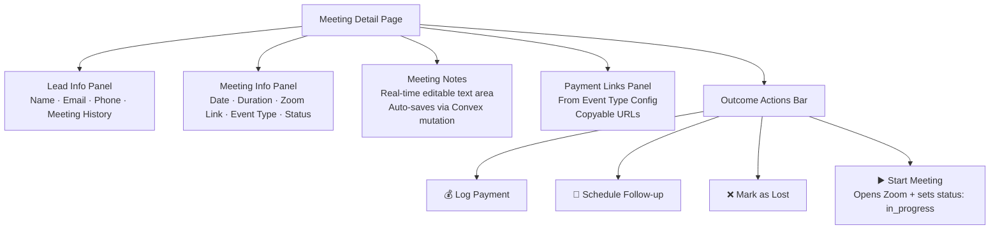

### 10.3 Lead Info Panel

Shows the lead's profile and history with this tenant:

```typescript
// convex/closer/meetingDetail.ts
export const getMeetingDetail = query({
  args: { meetingId: v.id("meetings") },
  handler: async (ctx, { meetingId }) => {
    const { userId, tenantId } = await requireTenantUser(ctx, ["closer", "tenant_master", "tenant_admin"]);

    const meeting = await ctx.db.get(meetingId);
    if (!meeting || meeting.tenantId !== tenantId) {
      throw new Error("Meeting not found");
    }

    const opportunity = await ctx.db.get(meeting.opportunityId);
    if (!opportunity) throw new Error("Opportunity not found");

    // For closers, verify they own this opportunity
    if (/* caller is closer */ true) {
      if (opportunity.assignedCloserId !== userId) {
        throw new Error("Not your meeting");
      }
    }

    const lead = await ctx.db.get(opportunity.leadId);

    // Get lead's full meeting history
    const leadOpps = await ctx.db
      .query("opportunities")
      .withIndex("by_tenantId_and_leadId", (q) =>
        q.eq("tenantId", tenantId).eq("leadId", opportunity.leadId)
      )
      .collect();

    const allMeetings = [];
    for (const opp of leadOpps) {
      const meetings = await ctx.db
        .query("meetings")
        .withIndex("by_opportunityId", (q) => q.eq("opportunityId", opp._id))
        .collect();
      allMeetings.push(...meetings.map(m => ({ ...m, opportunityStatus: opp.status })));
    }

    // Get payment links from event type config
    let paymentLinks = null;
    if (opportunity.eventTypeConfigId) {
      const config = await ctx.db.get(opportunity.eventTypeConfigId);
      paymentLinks = config?.paymentLinks ?? null;
    }

    // Get payment records for this opportunity
    const payments = await ctx.db
      .query("paymentRecords")
      .withIndex("by_opportunityId", (q) => q.eq("opportunityId", opportunity._id))
      .collect();

    return {
      meeting,
      opportunity,
      lead,
      meetingHistory: allMeetings,
      paymentLinks,
      payments,
    };
  },
});
```

### 10.4 Meeting Notes (Real-Time)

The notes field is a text area that auto-saves via debounced Convex mutations. Since Convex provides real-time subscriptions, changes are immediately reflected if the same meeting is viewed from another device.

```typescript
// convex/closer/meetingActions.ts
export const updateMeetingNotes = mutation({
  args: {
    meetingId: v.id("meetings"),
    notes: v.string(),
  },
  handler: async (ctx, { meetingId, notes }) => {
    const { userId, tenantId } = await requireTenantUser(ctx, ["closer", "tenant_master", "tenant_admin"]);

    const meeting = await ctx.db.get(meetingId);
    if (!meeting || meeting.tenantId !== tenantId) {
      throw new Error("Meeting not found");
    }

    await ctx.db.patch(meetingId, { notes });
  },
});
```

### 10.5 "Start Meeting" Action

When the Closer clicks "Start Meeting" (or "Join Zoom"):

1. Opens the Zoom link in a new tab.
2. Updates the opportunity status to `in_progress`.
3. Updates the meeting status to `in_progress`.

```typescript
export const startMeeting = mutation({
  args: { meetingId: v.id("meetings") },
  handler: async (ctx, { meetingId }) => {
    const { userId, tenantId } = await requireTenantUser(ctx, ["closer"]);

    const meeting = await ctx.db.get(meetingId);
    if (!meeting || meeting.tenantId !== tenantId) {
      throw new Error("Meeting not found");
    }

    await ctx.db.patch(meetingId, { status: "in_progress" });

    const opportunity = await ctx.db.get(meeting.opportunityId);
    if (opportunity && opportunity.status === "scheduled") {
      await ctx.db.patch(opportunity._id, {
        status: "in_progress",
        updatedAt: Date.now(),
      });
    }

    return { zoomJoinUrl: meeting.zoomJoinUrl };
  },
});
```

### 10.6 "Mark as Lost" Action

```typescript
export const markAsLost = mutation({
  args: {
    opportunityId: v.id("opportunities"),
    notes: v.optional(v.string()),
  },
  handler: async (ctx, { opportunityId, notes }) => {
    const { userId, tenantId } = await requireTenantUser(ctx, ["closer"]);

    const opportunity = await ctx.db.get(opportunityId);
    if (!opportunity || opportunity.tenantId !== tenantId) {
      throw new Error("Opportunity not found");
    }

    await ctx.db.patch(opportunityId, {
      status: "lost",
      lostReason: notes ?? null,
      updatedAt: Date.now(),
    });
  },
});
```

---

## 11. Phase 8: Payment Logging

### 11.1 Payment Flow

When a sale closes during a meeting, the Closer:

1. Shares a payment link from the Event Type Config's `paymentLinks` array.
2. The lead completes payment externally (Stripe, PayPal, etc.).
3. The Closer logs the payment in the CRM with proof.

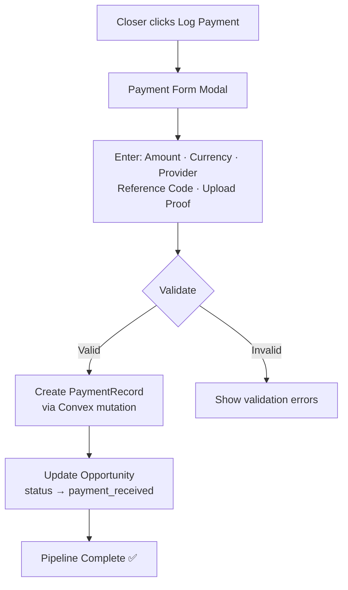

### 11.2 Payment Form Fields

| Field | Type | Required | Notes |
|---|---|---|---|
| `amount` | decimal (number) | Yes | Payment amount |
| `currency` | string | Yes | ISO 4217 code (default: "USD") |
| `provider` | string | Yes | "stripe", "paypal", "cash", "other" |
| `referenceCode` | string | No | Transaction ID from payment provider |
| `proofFileId` | Convex file ID | No | Uploaded screenshot/receipt |

### 11.3 Proof File Upload

Payment proof files are uploaded to **Convex file storage**:

```typescript
// convex/closer/payments.ts
export const generateUploadUrl = mutation({
  args: {},
  handler: async (ctx) => {
    await requireTenantUser(ctx, ["closer", "tenant_master", "tenant_admin"]);
    return await ctx.storage.generateUploadUrl();
  },
});

export const logPayment = mutation({
  args: {
    opportunityId: v.id("opportunities"),
    meetingId: v.id("meetings"),
    amount: v.number(),
    currency: v.string(),
    provider: v.string(),
    referenceCode: v.optional(v.string()),
    proofFileId: v.optional(v.id("_storage")),
  },
  handler: async (ctx, args) => {
    const { userId, tenantId } = await requireTenantUser(ctx, ["closer"]);

    const opportunity = await ctx.db.get(args.opportunityId);
    if (!opportunity || opportunity.tenantId !== tenantId) {
      throw new Error("Opportunity not found");
    }

    // Create payment record
    await ctx.db.insert("paymentRecords", {
      tenantId,
      opportunityId: args.opportunityId,
      meetingId: args.meetingId,
      closerId: userId,
      amount: args.amount,
      currency: args.currency,
      provider: args.provider,
      referenceCode: args.referenceCode ?? null,
      proofFileId: args.proofFileId ?? null,
      status: "recorded",
      recordedAt: Date.now(),
    });

    // Update opportunity status
    await ctx.db.patch(args.opportunityId, {
      status: "payment_received",
      updatedAt: Date.now(),
    });
  },
});
```

### 11.4 Proof File Access (Tenant-Scoped)

Payment proof files must be accessible only within the tenant. The serving URL is generated on-demand:

```typescript
export const getPaymentProofUrl = query({
  args: { paymentRecordId: v.id("paymentRecords") },
  handler: async (ctx, { paymentRecordId }) => {
    const { tenantId } = await requireTenantUser(ctx, ["closer", "tenant_master", "tenant_admin"]);

    const record = await ctx.db.get(paymentRecordId);
    if (!record || record.tenantId !== tenantId || !record.proofFileId) {
      return null;
    }

    return await ctx.storage.getUrl(record.proofFileId);
  },
});
```

---

## 12. Phase 9: Follow-Up Scheduling

### 12.1 Follow-Up Flow

When a meeting outcome is "follow-up needed," the Closer schedules a new meeting:

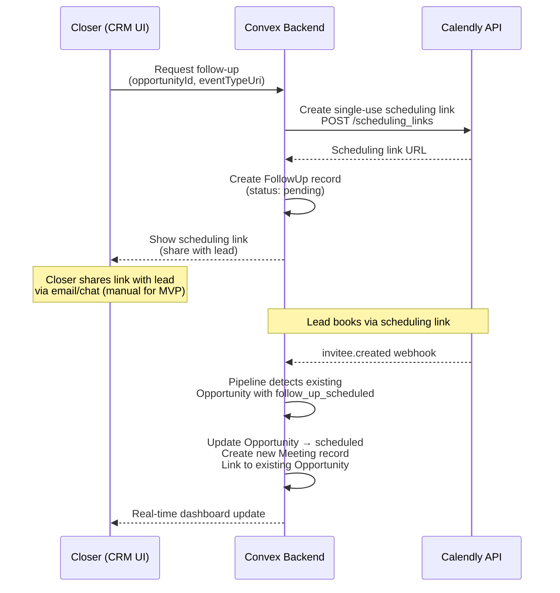

### 12.2 Scheduling Link Creation

Calendly supports **single-use scheduling links** via the API. This requires `scheduling_links:write` scope (which we may need to add — see [Open Questions](#19-open-questions)).

```typescript
// convex/closer/followUp.ts
export const createFollowUp = action({
  args: {
    opportunityId: v.id("opportunities"),
    eventTypeUri: v.optional(v.string()), // Which Calendly event type to use
  },
  handler: async (ctx, { opportunityId, eventTypeUri }) => {
    const { userId, tenantId } = await requireTenantUserAction(ctx, ["closer"]);

    const opportunity = await ctx.runQuery(internal.opportunities.get, { opportunityId });
    if (!opportunity || opportunity.tenantId !== tenantId) {
      throw new Error("Opportunity not found");
    }

    const tenant = await ctx.runQuery(internal.tenants.getCalendlyTokens, { tenantId });
    const accessToken = await getValidAccessToken(ctx, tenantId);

    // Use the same event type as the original opportunity, or a specified one
    const targetEventType = eventTypeUri ?? opportunity.calendlyEventUri;

    // Create single-use scheduling link
    const response = await fetch("https://api.calendly.com/scheduling_links", {
      method: "POST",
      headers: {
        Authorization: `Bearer ${accessToken}`,
        "Content-Type": "application/json",
      },
      body: JSON.stringify({
        max_event_count: 1,
        owner: targetEventType,
        owner_type: "EventType",
      }),
    });

    if (!response.ok) {
      throw new Error(`Failed to create scheduling link: ${response.status}`);
    }

    const data = await response.json();
    const bookingUrl = data.resource.booking_url;

    // Update opportunity status
    await ctx.runMutation(internal.opportunities.updateStatus, {
      opportunityId,
      status: "follow_up_scheduled",
    });

    // Create follow-up record
    await ctx.runMutation(internal.followUps.create, {
      tenantId,
      opportunityId,
      leadId: opportunity.leadId,
      closerId: userId,
      schedulingLinkUrl: bookingUrl,
      reason: "closer_initiated",
      createdAt: Date.now(),
    });

    return { bookingUrl };
  },
});
```

### 12.3 Follow-Up Detection in Pipeline

When an `invitee.created` webhook arrives and the lead already has an opportunity with `status: "follow_up_scheduled"`, the pipeline processor:

1. Does **not** create a new opportunity.
2. Links the new meeting to the **existing** opportunity.
3. Transitions the opportunity back to `status: "scheduled"`.

This is handled in the `invitee.created` flow (see [Phase 6, Section 9.3](#93-inviteecreated-flow--core-pipeline)).

---

## 13. Data Model — New & Modified Tables

### 13.1 Modified: `tenants` Table

```typescript
tenants: defineTable({
  // ... existing fields ...

  // NEW: Owner reference
  tenantOwnerId: v.optional(v.id("users")),
})
  // ... existing indexes ...
```

### 13.2 New: `leads` Table

```typescript
leads: defineTable({
  tenantId: v.id("tenants"),
  email: v.string(),
  fullName: v.optional(v.string()),
  phone: v.optional(v.string()),
  customFields: v.optional(v.any()), // JSON from Calendly questions_and_answers
  firstSeenAt: v.number(),
  updatedAt: v.number(),
})
  .index("by_tenantId", ["tenantId"])
  .index("by_tenantId_and_email", ["tenantId", "email"]),
```

### 13.3 New: `opportunities` Table

```typescript
opportunities: defineTable({
  tenantId: v.id("tenants"),
  leadId: v.id("leads"),
  assignedCloserId: v.optional(v.id("users")),  // null if unmatched
  eventTypeConfigId: v.optional(v.id("eventTypeConfigs")),
  status: v.union(
    v.literal("scheduled"),
    v.literal("in_progress"),
    v.literal("payment_received"),
    v.literal("follow_up_scheduled"),
    v.literal("lost"),
    v.literal("canceled"),
    v.literal("no_show"),
  ),
  calendlyEventUri: v.optional(v.string()),  // URI of the originating Calendly event
  cancellationReason: v.optional(v.string()),
  canceledBy: v.optional(v.string()),         // "invitee" or "host"
  lostReason: v.optional(v.string()),
  createdAt: v.number(),
  updatedAt: v.number(),
})
  .index("by_tenantId", ["tenantId"])
  .index("by_tenantId_and_leadId", ["tenantId", "leadId"])
  .index("by_tenantId_and_assignedCloserId", ["tenantId", "assignedCloserId"])
  .index("by_tenantId_and_status", ["tenantId", "status"]),
```

### 13.4 New: `meetings` Table

```typescript
meetings: defineTable({
  tenantId: v.id("tenants"),
  opportunityId: v.id("opportunities"),
  calendlyEventUri: v.string(),       // Calendly scheduled_event URI
  calendlyInviteeUri: v.string(),     // Calendly invitee URI
  zoomJoinUrl: v.optional(v.string()),
  scheduledAt: v.number(),            // Unix ms
  durationMinutes: v.number(),
  status: v.union(
    v.literal("scheduled"),
    v.literal("in_progress"),
    v.literal("completed"),
    v.literal("canceled"),
    v.literal("no_show"),
  ),
  notes: v.optional(v.string()),
  createdAt: v.number(),
})
  .index("by_opportunityId", ["opportunityId"])
  .index("by_tenantId_and_scheduledAt", ["tenantId", "scheduledAt"])
  .index("by_tenantId_and_calendlyEventUri", ["tenantId", "calendlyEventUri"]),
```

### 13.5 New: `eventTypeConfigs` Table

```typescript
eventTypeConfigs: defineTable({
  tenantId: v.id("tenants"),
  calendlyEventTypeUri: v.string(),   // e.g. https://api.calendly.com/event_types/XXXX
  displayName: v.string(),
  paymentLinks: v.optional(v.array(v.object({
    provider: v.string(),             // "stripe", "paypal", etc.
    label: v.string(),                // Display label
    url: v.string(),                  // External payment URL
  }))),
  roundRobinEnabled: v.boolean(),
  createdAt: v.number(),
})
  .index("by_tenantId", ["tenantId"])
  .index("by_tenantId_and_calendlyEventTypeUri", ["tenantId", "calendlyEventTypeUri"]),
```

### 13.6 New: `paymentRecords` Table

```typescript
paymentRecords: defineTable({
  tenantId: v.id("tenants"),
  opportunityId: v.id("opportunities"),
  meetingId: v.id("meetings"),
  closerId: v.id("users"),
  amount: v.number(),
  currency: v.string(),
  provider: v.string(),
  referenceCode: v.optional(v.string()),
  proofFileId: v.optional(v.id("_storage")),  // Convex file storage
  status: v.union(
    v.literal("recorded"),
    v.literal("verified"),       // Future: admin verification
    v.literal("disputed"),       // Future: dispute handling
  ),
  recordedAt: v.number(),
})
  .index("by_opportunityId", ["opportunityId"])
  .index("by_tenantId", ["tenantId"])
  .index("by_tenantId_and_closerId", ["tenantId", "closerId"]),
```

### 13.7 New: `followUps` Table

```typescript
followUps: defineTable({
  tenantId: v.id("tenants"),
  opportunityId: v.id("opportunities"),
  leadId: v.id("leads"),
  closerId: v.id("users"),
  schedulingLinkUrl: v.optional(v.string()),  // Calendly single-use link
  calendlyEventUri: v.optional(v.string()),   // Set when follow-up meeting is booked
  reason: v.union(
    v.literal("closer_initiated"),
    v.literal("cancellation_follow_up"),
    v.literal("no_show_follow_up"),
  ),
  status: v.union(
    v.literal("pending"),        // Link shared, waiting for booking
    v.literal("booked"),         // Lead booked the follow-up
    v.literal("expired"),        // Link expired without booking
  ),
  createdAt: v.number(),
})
  .index("by_tenantId", ["tenantId"])
  .index("by_opportunityId", ["opportunityId"])
  .index("by_tenantId_and_closerId", ["tenantId", "closerId"]),
```

### 13.8 Opportunity Status State Machine

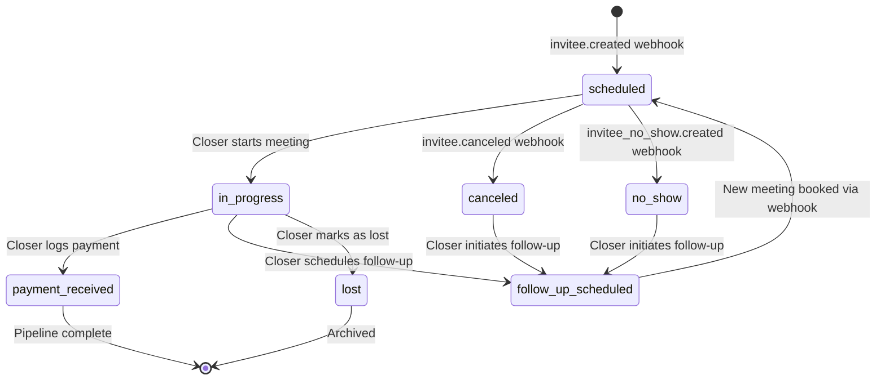

---

## 14. Convex Function Architecture

### 14.1 File Organization

```
convex/
├── admin/                          # System admin functions (existing)
│   ├── tenants.ts
│   ├── tenantsQueries.ts
│   └── tenantsMutations.ts
├── onboarding/                     # Tenant onboarding (existing, modified)
│   ├── invite.ts
│   └── complete.ts                 # MODIFIED: set tenantOwnerId + trigger role assignment
├── calendly/                       # Calendly integration (existing)
│   ├── oauth.ts
│   ├── oauthQueries.ts
│   ├── oauthMutations.ts
│   ├── tokens.ts
│   ├── tokenMutations.ts
│   ├── webhookSetup.ts
│   ├── webhookSetupMutations.ts
│   ├── orgMembers.ts              # ENHANCED: re-attempt user matching after sync
│   ├── orgMembersMutations.ts
│   └── healthCheck.ts
├── webhooks/                       # Webhook ingestion (existing)
│   ├── calendly.ts                # MODIFIED: schedule pipeline processing
│   └── calendlyMutations.ts
├── workos/                         # NEW: WorkOS integration (programmatic, Node SDK)
│   ├── roles.ts                   # Role assignment actions (assignRoleToMembership)
│   ├── userManagement.ts          # inviteUser, updateUserRole, removeUser (actions)
│   └── userMutations.ts           # createUserWithCalendlyLink (internal mutation)
├── pipeline/                       # NEW: Event processing pipeline
│   ├── processor.ts               # Main pipeline dispatcher
│   ├── inviteeCreated.ts          # invitee.created handler
│   ├── inviteeCanceled.ts         # invitee.canceled handler
│   ├── inviteeNoShow.ts           # invitee_no_show handler
│   └── queries.ts                 # Pipeline helper queries
├── closer/                         # NEW: Closer dashboard functions
│   ├── dashboard.ts               # Featured event, stats
│   ├── calendar.ts                # Calendar date range queries
│   ├── pipeline.ts                # Pipeline summary
│   ├── meetingDetail.ts           # Meeting detail page query
│   ├── meetingActions.ts          # Notes, start meeting, mark lost
│   ├── payments.ts                # Payment logging + file upload
│   └── followUp.ts                # Follow-up scheduling
├── dashboard/                      # NEW: Admin dashboard functions
│   └── adminStats.ts             # Admin quick stats
├── users/                          # NEW: User management
│   ├── queries.ts                 # User lookups
│   ├── mutations.ts               # User provisioning, updates
│   └── linkCalendlyMember.ts      # Manual Calendly matching
├── leads/                          # NEW: Lead management
│   └── queries.ts
├── opportunities/                  # NEW: Opportunity management
│   ├── queries.ts
│   └── mutations.ts
├── tenants.ts                      # Existing tenant queries/mutations
├── requireSystemAdmin.ts           # Existing auth guard
├── requireTenantUser.ts            # NEW: Tenant user auth guard
├── auth.ts                         # Existing WorkOS AuthKit
├── auth.config.ts                  # Existing JWT config
├── http.ts                         # Existing HTTP router
├── crons.ts                        # Existing cron jobs
└── schema.ts                       # MODIFIED: new tables added
```

### 14.2 New Auth Guard: `requireTenantUser`

A shared helper that validates the caller is an authenticated tenant user with one of the specified roles:

```typescript
// convex/requireTenantUser.ts
import type { QueryCtx, MutationCtx, ActionCtx } from "./_generated/server";

type TenantUserResult = {
  userId: Id<"users">;
  tenantId: Id<"tenants">;
  role: "tenant_master" | "tenant_admin" | "closer";
  workosUserId: string;
};

export async function requireTenantUser(
  ctx: QueryCtx | MutationCtx,
  allowedRoles: Array<"tenant_master" | "tenant_admin" | "closer">,
): Promise<TenantUserResult> {
  const identity = await ctx.auth.getUserIdentity();
  if (!identity) {
    throw new Error("Not authenticated");
  }

  const orgId = getIdentityOrgId(identity);
  if (!orgId) {
    throw new Error("No organization context");
  }

  const workosUserId = identity.subject ?? identity.tokenIdentifier;

  // Find user record
  const user = await ctx.db
    .query("users")
    .withIndex("by_workosUserId", (q) => q.eq("workosUserId", workosUserId))
    .unique();

  if (!user) {
    throw new Error("User not found — please complete setup");
  }

  // Verify org matches tenant
  const tenant = await ctx.db.get(user.tenantId);
  if (!tenant || tenant.workosOrgId !== orgId) {
    throw new Error("Organization mismatch");
  }

  // Check role
  if (!allowedRoles.includes(user.role)) {
    throw new Error("Insufficient permissions");
  }

  return {
    userId: user._id,
    tenantId: user.tenantId,
    role: user.role,
    workosUserId,
  };
}
```

---

## 15. Routing & Authorization — Next.js App Router

### 15.1 Route Structure

```
app/
├── admin/                          # System admin (existing)
│   └── page.tsx
├── workspace/                      # Tenant workspace (role-based routing)
│   ├── layout.tsx                 # Shared layout: sidebar nav, role detection
│   ├── page.tsx                   # MODIFIED: role-based redirect
│   ├── team/                      # Owner/Admin only
│   │   └── page.tsx               # Custom invite form + team member list
│   ├── pipeline/                  # Owner/Admin: all opportunities
│   │   └── page.tsx
│   ├── settings/                  # Owner/Admin only
│   │   └── page.tsx               # Calendly config, event types
│   └── closer/                    # Closer-specific routes
│       ├── page.tsx               # Closer dashboard
│       ├── pipeline/
│       │   └── page.tsx           # Closer's opportunity list
│       └── meetings/
│           └── [meetingId]/
│               └── page.tsx       # Meeting detail page
├── onboarding/                    # Existing
│   ├── page.tsx
│   └── connect/
│       └── page.tsx
├── callback/                      # Existing
│   └── calendly/
│       └── page.tsx
├── sign-in/                       # WorkOS AuthKit
│   └── page.tsx
└── sign-up/                       # WorkOS AuthKit
    └── page.tsx
```

### 15.2 Role-Based Routing Logic

The workspace layout detects the user's role and controls navigation:

```typescript
// app/workspace/layout.tsx
export default function WorkspaceLayout({ children }) {
  const user = useQuery(api.users.queries.getCurrentUser);

  if (!user) return <LoadingScreen />;

  // Closer should not see admin tabs
  const isAdmin = user.role === "tenant_master" || user.role === "tenant_admin";
  const isCloser = user.role === "closer";

  return (
    <div>
      <Sidebar>
        {isAdmin && <NavLink href="/workspace">Overview</NavLink>}
        {isAdmin && <NavLink href="/workspace/team">Team</NavLink>}
        {isAdmin && <NavLink href="/workspace/pipeline">Pipeline</NavLink>}
        {isAdmin && <NavLink href="/workspace/settings">Settings</NavLink>}
        {isCloser && <NavLink href="/workspace/closer">Dashboard</NavLink>}
        {isCloser && <NavLink href="/workspace/closer/pipeline">My Pipeline</NavLink>}
      </Sidebar>
      <main>{children}</main>
    </div>
  );
}
```

### 15.3 Workspace Root Redirect

```typescript
// app/workspace/page.tsx — redirects based on role
"use client";

export default function WorkspaceRoot() {
  const user = useQuery(api.users.queries.getCurrentUser);

  if (!user) return <LoadingScreen />;

  if (user.role === "closer") {
    redirect("/workspace/closer");
  }

  // Owner/Admin see the overview dashboard
  return <AdminDashboard />;
}
```

### 15.4 No Client-Side Provisioning Needed

**The CRM user record already exists** when the user first authenticates — it was created synchronously by the `inviteUser` Convex action when the admin submitted the invite form (see [Phase 3](#6-phase-3-user-invite-form--calendly-member-linking)).

The workspace layout simply queries for the current user. If the record is found, the user is routed to their dashboard.

```typescript
// In workspace layout:
const user = useQuery(api.users.queries.getCurrentUser);

if (user === undefined) return <LoadingScreen />; // Query still loading
if (user === null) return <NotProvisionedScreen />; // User signed up outside normal flow
// user exists → proceed to role-based routing
```

> **Why no client-side provisioning?** The user record is created by the admin's `inviteUser` action before the user ever accepts the invite. By the time they sign up and authenticate, their CRM record is already in Convex. No webhooks, no race conditions, no async delay.

---

## 16. Security Considerations

### 16.1 Role-Based Data Access

| Data | Owner | Admin | Closer |
|---|---|---|---|
| All tenant opportunities | ✅ Read/Write | ✅ Read/Write | ❌ Own only |
| All meetings | ✅ Read | ✅ Read | ❌ Own only |
| User management | ✅ Full | ✅ Full | ❌ |
| Calendly settings | ✅ Full | ✅ Full (except re-auth) | ❌ |
| Calendly re-auth OAuth | ✅ | ❌ (refresh only) | ❌ |
| Payment records | ✅ All | ✅ All | ✅ Own only |
| Meeting notes | ✅ All | ✅ All | ✅ Own only |

### 16.2 Tenant Isolation in New Tables

Every new table (`leads`, `opportunities`, `meetings`, `eventTypeConfigs`, `paymentRecords`, `followUps`) carries a `tenantId` field. Every query uses a `tenantId`-scoped index. The `requireTenantUser` helper resolves `tenantId` from the authenticated user's WorkOS org — never from client input.

### 16.3 Closer Isolation

Closers can only access opportunities assigned to them. The `requireTenantUser` helper returns the caller's `userId`, and all Closer queries filter by `assignedCloserId = userId`.

### 16.4 Payment Proof Files

Convex file storage URLs are short-lived and unguessable. However, we still validate tenant ownership before generating URLs via `getPaymentProofUrl`.

### 16.5 WorkOS API Key Security

The `WORKOS_API_KEY` is a Convex environment variable used only in server-side Convex actions (`"use node"`). It is:
- Never exposed to the client or frontend.
- Used only in the `convex/workos/` directory actions for user management.
- All user management actions validate the caller's CRM role (`tenant_master` or `tenant_admin`) before making any WorkOS API call.

---

## 17. Error Handling & Edge Cases

### 17.1 Unmatched Closer Receives a Meeting

If a webhook arrives with an `event_memberships` host URI that doesn't match any CRM user:

1. The opportunity is assigned to the **tenant owner** as a fallback.
2. A warning is logged (future: alert the admin).
3. The admin can reassign the opportunity manually from the pipeline view.

### 17.2 Lead Books Multiple Overlapping Meetings

If the same lead books multiple meetings (different event types or with different closers):

- Each booking creates a **separate opportunity** (they may be independent sales processes).
- The follow-up detection only links to an opportunity with `status: "follow_up_scheduled"` — not any arbitrary existing opportunity.

### 17.3 Closer Removed from Calendly Org

During the daily Calendly org member sync:
1. If a previously synced member is no longer in the Calendly org, their `calendlyOrgMembers` record is flagged.
2. The CRM user's `calendlyUserUri` is **not** automatically cleared (they may still have in-flight meetings).
3. An admin notification is generated (future: in-app alert).

### 17.4 WorkOS User Creation Fails

If the `inviteUser` action fails at any step (WorkOS API error, duplicate email, etc.):
- The action is atomic from the CRM's perspective — if the WorkOS call fails, no CRM record is created.
- If the WorkOS user is created but the CRM mutation fails, the action should attempt cleanup (delete the WorkOS user). This is a best-effort rollback; the admin can retry.
- Show a clear error with the failure reason (e.g., "A user with this email already exists in the organization").
- The form retains the entered values so the admin can correct and retry.

### 17.5 Calendly Webhook Arrives for Unmatched Host

If a Calendly webhook (e.g., `invitee.created`) arrives for a Calendly host whose `calendlyUserUri` is not linked to any CRM user:
- The pipeline first checks the `users` table by `calendlyUserUri`.
- If no match, it checks `calendlyOrgMembers.matchedUserId` as a secondary lookup.
- If still no match, the fallback to the tenant owner applies.
- Existing opportunities are **not** retroactively reassigned when a user is later linked. The admin can manually reassign from the pipeline view.

> **Note:** Since the admin selects the Calendly member at user creation time (see Phase 3), this situation only occurs if the admin hasn't yet invited the Closer, or if a new Calendly host is added to the org without a corresponding CRM user.

### 17.6 Opportunity Status Transition Validation

The pipeline enforces valid state transitions. Invalid transitions (e.g., `lost` → `in_progress`) are rejected:

```typescript
const VALID_TRANSITIONS: Record<string, string[]> = {
  scheduled: ["in_progress", "canceled", "no_show"],
  in_progress: ["payment_received", "follow_up_scheduled", "lost"],
  canceled: ["follow_up_scheduled"],
  no_show: ["follow_up_scheduled"],
  follow_up_scheduled: ["scheduled"],
  payment_received: [], // Terminal
  lost: [],             // Terminal
};

function validateTransition(from: string, to: string): boolean {
  return VALID_TRANSITIONS[from]?.includes(to) ?? false;
}
```

### 17.7 Duplicate Webhook Processing

The existing idempotency check on `calendlyEventUri` in `rawWebhookEvents` prevents duplicate raw event storage. The pipeline processor additionally checks `processed: true` before operating, ensuring exactly-once processing even if the scheduler retries.

---

## 18. Open Questions

| # | Question | Current Thinking |
|---|---|---|
| 1 | ~~Should WorkOS roles be created via a setup script or the WorkOS Dashboard?~~ | **Resolved.** Roles already exist in WorkOS. No setup needed. |
| 2 | ~~How do we sync WorkOS role changes back to CRM `users.role`?~~ | **Resolved.** Role changes are made programmatically via `updateUserRole` action, which updates both WorkOS and CRM in one operation. No webhook sync needed. |
| 3 | Does Calendly API support creating scheduling links for follow-ups? | Yes, via `POST /scheduling_links` with `max_event_count: 1`. This requires `scheduling_links:write` scope, which is **not** in our current MVP scope set. We need to add it or defer follow-up scheduling. |
| 4 | Should the admin be able to reassign opportunities between closers? | Yes, but defer to a later phase. For MVP, assignments are automatic via round-robin or manual by creating a new opportunity. |
| 5 | How should we handle the case where a Closer has meetings from before they were added to the CRM? | Don't backfill. Only new webhook events create opportunities. Past meetings are not imported. |
| 6 | Should the Tenant Owner be able to transfer ownership to another user? | Defer. For MVP, the onboarding user remains the owner. A future mutation can update `tenantOwnerId` and swap WorkOS roles. |
| 7 | How should we handle event type syncing from Calendly? | Sync event types when processing webhooks (lazy creation of `eventTypeConfigs`). A manual sync action can also be triggered from the Settings page. Full sync via cron is a Phase 2 enhancement. |
| 8 | What calendar component should we use for the Closer dashboard? | Build a custom calendar grid with shadcn/ui primitives (Table, Card). Avoid heavy third-party calendar libraries for MVP. A week view with time slots is the minimum. |
| 9 | Should the pipeline processor run as a mutation or action? | **Mutation** for the core processing (Lead upsert, Opportunity create, Meeting create) — these are all database writes and benefit from Convex's transactional guarantees. An **action** wrapper is used only if supplemental Calendly API calls are needed. |
| 10 | Should we add a "resend invite" action for pending users? | Yes — wrap `workos.userManagement.sendInvitation()` in a Convex action. The CRM user record already exists, so no other changes needed. |

---

## 19. Dependencies

### New Packages Required

| Package | Why | Runtime | Install |
|---|---|---|---|
| _(none)_ | All new dependencies are already available | | |

> **`@workos-inc/node`** is already installed (direct dependency, used in `convex/admin/tenants.ts`). No new packages are required for this phase.

### Environment Variables Required

All environment variables from the system admin flow remain in use. No new environment variables are needed — WorkOS API key and client ID are already configured.

| Variable | Already Set? | Used By |
|---|---|---|
| `WORKOS_API_KEY` | ✅ Convex env | Programmatic user management, role assignment |
| `WORKOS_CLIENT_ID` | ✅ Convex env + `.env.local` | WorkOS SDK initialization, AuthKit |
| `CALENDLY_CLIENT_ID` | ✅ Convex env | Follow-up scheduling (Calendly API calls) |
| `CALENDLY_CLIENT_SECRET` | ✅ Convex env | Token refresh |
| `INVITE_SIGNING_SECRET` | ✅ Convex env | Invite tokens (existing) |

### WorkOS Dashboard Configuration

> **Already complete.** The following WorkOS roles and permissions are already provisioned at the environment level:
> - Role `owner` with `users:manage` permission — full tenant access, programmatic user management
> - Role `tenant-admin` with `users:manage` permission — near-full tenant access, programmatic user management
> - Role `closer` with no permissions — limited to own pipeline/calendar/meeting operations
>
> **No WorkOS Widgets are used.** All user management is handled via the WorkOS Node SDK (`@workos-inc/node`) through our custom CRM invite form and Convex actions. No widget tokens, widget endpoints, or widget UI components are needed.

No additional environment variables are needed. The existing `WORKOS_API_KEY` and `WORKOS_CLIENT_ID` are used by the `convex/workos/userManagement.ts` action for programmatic user creation, membership management, and invitation sending.

### Calendly Scope Addition (If Follow-Up Scheduling Included)

If Phase 9 (follow-up scheduling) is included in MVP:

| Scope | Why |
|---|---|
| `scheduling_links:write` | Create single-use scheduling links for follow-ups |

This requires updating the OAuth authorize URL in `convex/calendly/oauth.ts`. Since the app is not in production, there are no existing tenants to re-authorize — any test tenants can simply be reprovisioned with the new scopes.

---

## 20. Applicable Skills

The following skills from the project's skills index should be invoked during implementation:

| Skill | When to Invoke | Phase |
|---|---|---|
| **`workos`** | Role assignment via membership API, programmatic user management via Node SDK | Phase 1, 2, 3 |
| ~~`convex-migration-helper`~~ | _Not needed — app is not in production, no data to migrate_ | — |
| **`shadcn`** | Building dashboard UI components (cards, tables, calendar, badges) | Phases 4, 6, 7, 8 |
| **`frontend-design`** | Creating production-grade dashboard interfaces | Phases 4, 6, 7 |
| **`convex-setup-auth`** | If auth configuration needs updates for role-based access | Phase 1 |
| **`vercel-react-best-practices`** | Optimizing React/Next.js performance in dashboard views | Phases 4, 6 |
| **`vercel-composition-patterns`** | Designing reusable dashboard component patterns | Phases 4, 6 |
| **`convex-performance-audit`** | If dashboard queries become expensive (many opportunities, meetings) | Phase 6 |
| **`web-design-guidelines`** | Reviewing UI accessibility and design best practices | All UI phases |

---

*This document is a living specification. As implementation progresses and decisions from open questions are finalized, sections will be updated to reflect confirmed architectural choices, API contracts, and UX designs.*
