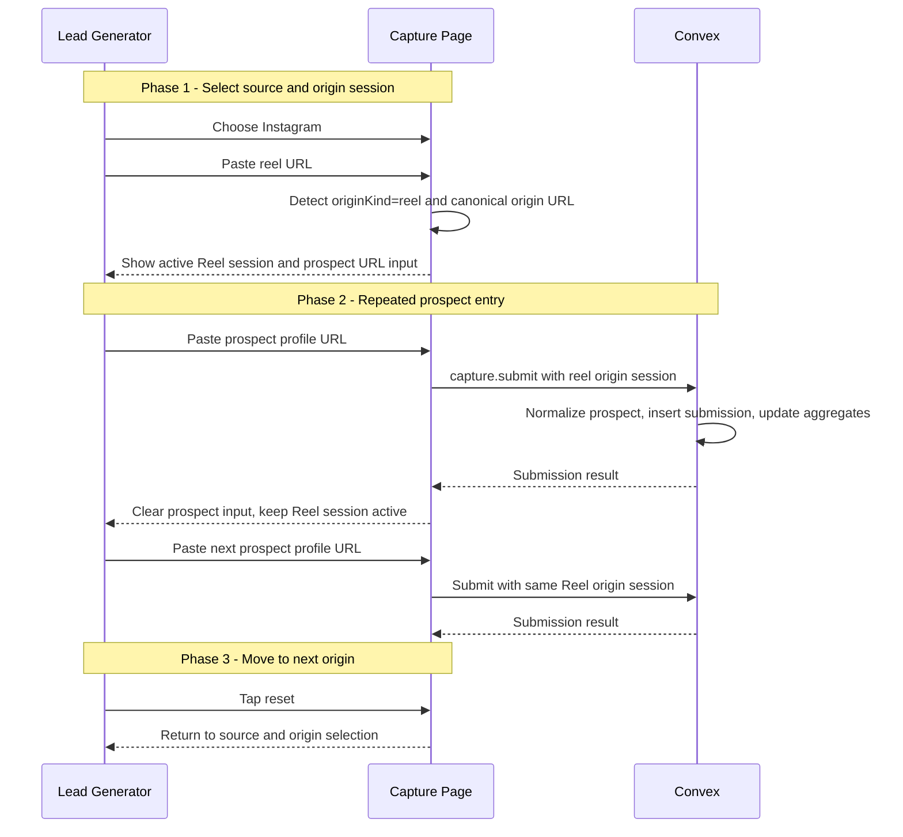
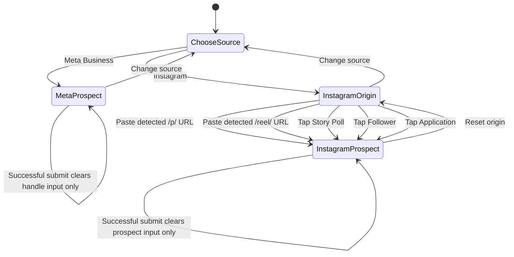

# Lead Gen Capture Origin Session UX - Design Specification

**Version:** 0.1 (MVP)
**Status:** Draft
**Scope:** `/workspace/lead-gen/capture` currently asks workers to choose `post` or `reel` and paste the same origin URL on every prospect submission. This UX improvement changes the capture page into a session-based flow where the worker selects or pastes the Instagram origin once, submits many prospect profile URLs against that origin, and resets only when moving to the next post/reel/origin.
**Prerequisite:** Existing Lead Gen Ops module, including `leadGenSubmissions.originKind`, `leadGenSubmissions.originValue`, `leadGenOriginStats`, `leadGenTeamOriginStats`, and the current `api.leadGen.capture.submit` mutation.

---

## Table of Contents

1. [Goals & Non-Goals](#1-goals--non-goals)
2. [Actors & Roles](#2-actors--roles)
3. [End-to-End Flow Overview](#3-end-to-end-flow-overview)
4. [Phase 1: Origin Detection Contract](#4-phase-1-origin-detection-contract)
5. [Phase 2: Capture Session State Machine](#5-phase-2-capture-session-state-machine)
6. [Phase 3: Mobile Capture UI](#6-phase-3-mobile-capture-ui)
7. [Phase 4: Verification and Release](#7-phase-4-verification-and-release)
8. [Data Model](#8-data-model)
9. [Convex Function Architecture](#9-convex-function-architecture)
10. [Routing & Authorization](#10-routing--authorization)
11. [Security Considerations](#11-security-considerations)
12. [Error Handling & Edge Cases](#12-error-handling--edge-cases)
13. [Open Questions](#13-open-questions)
14. [Dependencies](#14-dependencies)
15. [Applicable Skills](#15-applicable-skills)

---

## 1. Goals & Non-Goals

### Goals

- Let lead generators paste an Instagram post/reel URL once, then submit many prospect profile URLs for that same origin without re-entering the post/reel URL.
- Automatically detect whether an Instagram URL is a `post` or `reel` from `/p/<shortcode>/` and `/reel/<shortcode>/`.
- Keep Meta Business capture simple: source selection followed by a handle input that submits `originKind: "source_only"`.
- Keep non-rankable Instagram origins simple: Story Poll, Follower, and Application are quick buttons that advance directly to prospect entry.
- Preserve the existing Convex capture contract, reporting aggregates, tenant scoping, and lead-gen dedupe behavior.
- Reset only the currently visible prospect input after successful submission; keep source and origin session state until the worker taps reset.
- Add a clear reset affordance for moving to the next post, reel, story poll, follower batch, application batch, or source.

### Non-Goals

- No Convex schema changes.
- No migration or backfill.
- No change to `leadGenSubmissions`, `leadGenOriginStats`, `leadGenTeamOriginStats`, or admin reporting.
- No social scraping, platform API calls, browser extension, or mobile share-sheet integration.
- No persistence of the active capture session across browser refreshes in MVP.
- No conversion reporting from lead-gen origins to qualified/booked/won CRM opportunities.

---

## 2. Actors & Roles

| Actor | Identity | Auth Method | Key Permissions |
|---|---|---|---|
| Lead-gen worker | CRM `lead_generator` | WorkOS AuthKit, member of tenant org | Capture own lead-gen submissions on `/workspace/lead-gen/capture`. |
| Tenant owner | CRM `tenant_master` | WorkOS AuthKit, member of tenant org | May use capture page and view all Lead Gen Ops reporting. |
| Tenant admin | CRM `tenant_admin` | WorkOS AuthKit, member of tenant org | May use capture page and view all Lead Gen Ops reporting. |
| System | Convex mutation | Authenticated Convex request | Normalizes prospect handle/profile URL, stores submission, and updates aggregates. |

### CRM Role Mapping

| CRM `users.role` | WorkOS role slug | Capture Access |
|---|---|---|
| `tenant_master` | `owner` | Full |
| `tenant_admin` | `tenant-admin` | Full |
| `lead_generator` | `lead-generator` | Full |
| `closer` | `closer` | None unless separately granted by server-side role changes. |

---

## 3. End-to-End Flow Overview



---

## 4. Phase 1: Origin Detection Contract

### 4.1 Rankable Instagram URL Detection

The client should infer rankable Instagram origins from the URL path:

| Input Pattern | Detected `originKind` | Rankable | Canonical form |
|---|---:|---:|---|
| `instagram.com/reel/DYIX_IASYOJ/` | `reel` | Yes | `https://instagram.com/reel/DYIX_IASYOJ/` |
| `instagram.com/reel/DYuyIBGKcFQ/` | `reel` | Yes | `https://instagram.com/reel/DYuyIBGKcFQ/` |
| `instagram.com/p/DYn1rlTFCpF/` | `post` | Yes | `https://instagram.com/p/DYn1rlTFCpF/` |
| `instagram.com/p/DYOFrBGmm8m/` | `post` | Yes | `https://instagram.com/p/DYOFrBGmm8m/` |
| `instagram.com/stories/...` | None | No | Worker should use Story Poll. |
| `instagram.com/some_profile` | None | No | This belongs in the prospect profile URL input. |

```typescript
// Path: app/workspace/lead-gen/_components/instagram-origin-detection.ts
type DetectedInstagramOrigin = {
  originKind: "post" | "reel";
  originUrl: string;
  shortcode: string;
};

const IG_HOSTS = new Set(["instagram.com", "www.instagram.com", "m.instagram.com"]);
const URL_PROTOCOL_PATTERN = /^[a-z][a-z\d+\-.]*:\/\//i;
const SHORTCODE_PATTERN = /^[A-Za-z0-9_-]+$/;

export function detectInstagramOriginUrl(
  rawValue: string,
): DetectedInstagramOrigin | null {
  const value = rawValue.trim();
  if (!value) return null;

  try {
    const url = new URL(
      URL_PROTOCOL_PATTERN.test(value) ? value : `https://${value}`,
    );
    const hostname = url.hostname.toLowerCase();
    if (!IG_HOSTS.has(hostname)) return null;

    const [kind, shortcode] = url.pathname
      .split("/")
      .filter(Boolean);

    if ((kind !== "p" && kind !== "reel") || !SHORTCODE_PATTERN.test(shortcode)) {
      return null;
    }

    return {
      originKind: kind === "p" ? "post" : "reel",
      originUrl: `https://instagram.com/${kind}/${shortcode}/`,
      shortcode,
    };
  } catch {
    return null;
  }
}
```

> **UX decision:** Detection is client-side because this is a workflow improvement, not a new data contract. Convex still normalizes and validates submitted post/reel URLs through `normalizeLeadGenOrigin`, so malformed values do not reach reporting aggregates.

### 4.2 Non-Rankable Instagram Origin Selection

Story Poll, Follower, and Application should be explicit buttons in the Instagram origin step. They do not require an origin URL and should submit with `originUrlOrLabel: undefined`.

```typescript
// Path: app/workspace/lead-gen/_components/lead-gen-capture-page-client.tsx
const nonRankableInstagramOrigins = [
  { value: "story_poll", label: "Story Poll" },
  { value: "follower", label: "Follower" },
  { value: "application", label: "Application" },
] as const;
```

> **Reporting decision:** Non-rankable origins continue to count in worker/team/source totals but do not contribute to top post/reel reports because `originRankable` remains false.

---

## 5. Phase 2: Capture Session State Machine

### 5.1 State Shape

The capture page should move the repeated-entry workflow out of one flat form and into an explicit reducer-backed session. React Hook Form remains responsible for validation of the currently visible input.

```typescript
// Path: app/workspace/lead-gen/_components/lead-gen-capture-page-client.tsx
type CaptureSource = "instagram" | "meta_business";

type InstagramOriginSession =
  | {
      kind: "post" | "reel";
      originUrl: string;
      shortcode: string;
      detectedFromUrl: true;
    }
  | {
      kind: "story_poll" | "follower" | "application";
      detectedFromUrl: false;
    };

type CaptureSessionState =
  | {
      source: "meta_business";
      step: "enter_prospect";
    }
  | {
      source: "instagram";
      step: "choose_origin";
      postReelDraft: string;
    }
  | {
      source: "instagram";
      step: "enter_prospect";
      origin: InstagramOriginSession;
    };
```

### 5.2 Transitions



```typescript
// Path: app/workspace/lead-gen/_components/lead-gen-capture-page-client.tsx
type CaptureAction =
  | { type: "sourceChanged"; source: CaptureSource }
  | { type: "postReelDraftChanged"; value: string }
  | { type: "rankableOriginDetected"; origin: Extract<InstagramOriginSession, { detectedFromUrl: true }> }
  | { type: "nonRankableOriginSelected"; kind: "story_poll" | "follower" | "application" }
  | { type: "resetOrigin" };

function captureSessionReducer(
  state: CaptureSessionState,
  action: CaptureAction,
): CaptureSessionState {
  switch (action.type) {
    case "sourceChanged":
      return action.source === "meta_business"
        ? { source: "meta_business", step: "enter_prospect" }
        : { source: "instagram", step: "choose_origin", postReelDraft: "" };
    case "postReelDraftChanged":
      if (state.source !== "instagram" || state.step !== "choose_origin") return state;
      return { ...state, postReelDraft: action.value };
    case "rankableOriginDetected":
      return { source: "instagram", step: "enter_prospect", origin: action.origin };
    case "nonRankableOriginSelected":
      return {
        source: "instagram",
        step: "enter_prospect",
        origin: { kind: action.kind, detectedFromUrl: false },
      };
    case "resetOrigin":
      return { source: "instagram", step: "choose_origin", postReelDraft: "" };
  }
}
```

> **State decision:** Use a reducer instead of independent `useState` calls. The valid states are mutually exclusive, and the reducer prevents impossible UI combinations such as Meta Business with a Reel origin or an Instagram prospect entry step without an origin session.

### 5.3 Submit Contract

Submission should always derive `source`, `originKind`, and `originUrlOrLabel` from the active session state. The only RHF-controlled field on the repeated-entry step is the prospect URL/handle.

```typescript
// Path: app/workspace/lead-gen/_components/lead-gen-capture-page-client.tsx
const prospectSchema = z.object({
  rawHandleOrProfileUrl: z.string().trim().min(1, "Profile URL is required"),
});

async function onSubmit(values: ProspectValues) {
  const args =
    state.source === "meta_business"
      ? {
          source: "meta_business" as const,
          rawHandleOrProfileUrl: values.rawHandleOrProfileUrl,
          originKind: "source_only" as const,
          originUrlOrLabel: undefined,
        }
      : {
          source: "instagram" as const,
          rawHandleOrProfileUrl: values.rawHandleOrProfileUrl,
          originKind: state.origin.kind,
          originUrlOrLabel:
            state.origin.kind === "post" || state.origin.kind === "reel"
              ? state.origin.originUrl
              : undefined,
        };

  const result = await submit({
    ...args,
    clientSubmissionKey: makeClientSubmissionKey(),
  });

  setLastResult({
    duplicateProspect: result.duplicateProspect,
    duplicateRetry: result.duplicateRetry,
    submittedAt: Date.now(),
    prospectId: result.prospectId,
  });

  form.reset({ rawHandleOrProfileUrl: "" });
  form.setFocus("rawHandleOrProfileUrl");
}
```

---

## 6. Phase 3: Mobile Capture UI

### 6.1 Source Step

The page should keep the existing source segmented control. Changing source resets only the origin session, not the day metrics or last result.

| Source | Next UI |
|---|---|
| Instagram | Show post/reel URL input and quick buttons for Story Poll, Follower, Application. |
| Meta Business | Show handle input immediately. Submit `originKind: "source_only"`. |

### 6.2 Instagram Origin Step

For Instagram, the first working step should be optimized for the lead generator's real workflow:

- Primary input: `Post or Reel URL`.
- On every input change or paste, call `detectInstagramOriginUrl`.
- If detection succeeds, advance to prospect entry and show an active-session summary.
- If detection fails after blur, show a field error only if the worker typed text and did not choose a quick button.
- Quick buttons: Story Poll, Follower, Application.

```typescript
// Path: app/workspace/lead-gen/_components/lead-gen-capture-page-client.tsx
function handlePostReelInputChange(value: string) {
  dispatch({ type: "postReelDraftChanged", value });

  const detected = detectInstagramOriginUrl(value);
  if (!detected) return;

  dispatch({
    type: "rankableOriginDetected",
    origin: {
      kind: detected.originKind,
      originUrl: detected.originUrl,
      shortcode: detected.shortcode,
      detectedFromUrl: true,
    },
  });
}
```

### 6.3 Prospect Entry Step

After a source/origin session is active, the repeated-entry step should contain:

| Element | Behavior |
|---|---|
| Active session summary | Shows `Reel`, `Post`, `Story Poll`, `Follower`, `Application`, or `Meta Business`. For post/reel, include the shortcode or a compact URL. |
| Reset button | Icon button or compact outline button with `RotateCcwIcon`; returns to origin selection for Instagram or source selection for Meta Business. |
| Prospect input | Label `Profile URL`; accepts raw handles as a hidden convenience because Convex normalization already supports handles. |
| Submit button | Submits current prospect against the active session. |
| Last capture result | Existing duplicate/new prospect feedback can remain below metrics or near the submit button. |

> **Microcopy decision:** Label the repeated-entry input `Profile URL` for simplicity, while continuing to accept raw handles. The implementation should not reject handles client-side because the backend already supports them and workers may paste handles from Meta/Instagram surfaces.

### 6.4 Successful Submit Reset Behavior

| Field or State | After Submit |
|---|---|
| Source | Preserve. |
| Instagram active origin | Preserve. |
| Meta Business source-only session | Preserve. |
| Prospect profile input | Clear. |
| Post/reel URL | Preserve in session summary, not as an editable repeated field. |
| Last result | Update. |
| Day metrics | Continue to refresh through `api.leadGen.activity.getMyDaySummary`. |

### 6.5 Skeleton

Update `LeadGenCaptureSkeleton` to match the new two-step layout so streaming does not cause major layout shift.

```typescript
// Path: app/workspace/lead-gen/_components/lead-gen-capture-skeleton.tsx
export function LeadGenCaptureSkeleton() {
  return (
    <div
      className="mx-auto flex w-full max-w-xl flex-col gap-5"
      role="status"
      aria-label="Loading Lead Gen capture"
    >
      {/* Metrics, source control, active step panel, prospect input, submit */}
    </div>
  );
}
```

---

## 7. Phase 4: Verification and Release

### 7.1 Unit-Level Checks

Add focused tests for `detectInstagramOriginUrl` if the existing test setup supports colocated utility tests. At minimum, manually verify all examples in this document.

| Input | Expected |
|---|---|
| `instagram.com/reel/DYIX_IASYOJ/` | `{ originKind: "reel", shortcode: "DYIX_IASYOJ" }` |
| `https://www.instagram.com/reel/DYuyIBGKcFQ/?igsh=abc` | Canonical URL drops query params. |
| `instagram.com/p/DYn1rlTFCpF/` | `{ originKind: "post", shortcode: "DYn1rlTFCpF" }` |
| `instagram.com/stories/acct/123` | `null` |
| `not a url` | `null` |

### 7.2 Browser Verification

Use the in-app browser or Playwright against the local dev server:

1. Open `/workspace/lead-gen/capture` as a user with `lead-gen:capture`.
2. Select Instagram.
3. Paste a reel URL.
4. Verify the page advances to profile entry with a Reel session summary.
5. Submit one prospect.
6. Verify only the prospect input clears.
7. Submit a second prospect without re-entering the reel URL.
8. Tap reset and verify the origin step returns.
9. Select Story Poll and verify no post/reel URL is required.
10. Select Meta Business and verify only the handle input is shown.

### 7.3 Release Gate

- Typecheck passes.
- Lint passes.
- Capture mutation still receives the same accepted args as before.
- No schema diff is introduced.
- Mobile viewport does not overlap controls or truncate critical labels.

---

## 8. Data Model

No Convex tables are added or modified for this UX-only change.

Existing relevant table fields remain unchanged:

```typescript
// Path: convex/schema.ts
leadGenSubmissions: defineTable({
  tenantId: v.id("tenants"),
  prospectId: v.id("leadGenProspects"),
  workerId: v.id("leadGenWorkers"),
  userId: v.id("users"),
  teamId: v.optional(v.id("attributionTeams")),
  source: leadGenSourceValidator,
  originKind: leadGenOriginKindValidator,
  originValue: v.optional(v.string()),
  originRankable: v.boolean(),
  clientSubmissionKey: v.optional(v.string()),
  submittedAt: v.number(),
  createdAt: v.number(),
  voidedAt: v.optional(v.number()),
  voidedByUserId: v.optional(v.id("users")),
  voidReason: v.optional(v.string()),
})
  .index("by_tenantId_and_submittedAt", ["tenantId", "submittedAt"])
  .index("by_tenantId_and_workerId_and_submittedAt", [
    "tenantId",
    "workerId",
    "submittedAt",
  ])
  .index("by_tenantId_and_workerId_and_clientSubmissionKey", [
    "tenantId",
    "workerId",
    "clientSubmissionKey",
  ]);
```

Existing validator contract remains unchanged:

```typescript
// Path: convex/leadGen/validators.ts
export const leadGenSubmitArgsValidator = {
  source: leadGenSourceValidator,
  rawHandleOrProfileUrl: v.string(),
  originKind: leadGenOriginKindValidator,
  originUrlOrLabel: v.optional(v.string()),
  clientSubmissionKey: v.optional(v.string()),
};
```

> **Migration decision:** Because this document changes only client-side state and field ordering, `convex-migration-helper` is not required. If implementation expands the backend contract later, revisit migration requirements before deploying.

---

## 9. Convex Function Architecture

No Convex function architecture changes are required for MVP.

```text
convex/
└── leadGen/
    ├── capture.ts        # EXISTING: submit mutation continues to receive source/origin/prospect args
    ├── normalization.ts  # EXISTING: validates and canonicalizes prospect and origin values
    ├── validators.ts     # EXISTING: submit args unchanged
    └── aggregates.ts     # EXISTING: report writes unchanged
```

The frontend implementation touches only the capture page and optionally a small helper:

```text
app/workspace/lead-gen/
├── capture/
│   └── page.tsx                                      # EXISTING: route gate unchanged
└── _components/
    ├── lead-gen-capture-page-client.tsx              # MODIFIED: reducer-backed session UX
    ├── lead-gen-capture-skeleton.tsx                 # MODIFIED: skeleton matches new layout
    └── instagram-origin-detection.ts                 # NEW OPTIONAL: testable URL detection helper
```

---

## 10. Routing & Authorization

The route remains unchanged and server-gated by `lead-gen:capture`.

```typescript
// Path: app/workspace/lead-gen/capture/page.tsx
export const unstable_instant = false;

export default async function LeadGenCapturePage() {
  await requirePermission("lead-gen:capture");

  return (
    <Suspense fallback={<LeadGenCaptureSkeleton />}>
      <LeadGenCapturePageClient />
    </Suspense>
  );
}
```

Client-side source/origin state is not authorization. Convex still enforces:

- Authenticated tenant user.
- Allowed role: `lead_generator`, `tenant_master`, or `tenant_admin`.
- Active operational lead-gen worker.
- Tenant-scoped writes.

---

## 11. Security Considerations

### Credential Security

No credentials, tokens, API keys, or external service secrets are introduced.

### Multi-Tenant Isolation

The client never sends `tenantId`, `workerId`, `userId`, or role. `api.leadGen.capture.submit` continues to derive access through `requireTenantUser`.

### Role-Based Data Access

| Data Resource | `tenant_master` | `tenant_admin` | `lead_generator` | `closer` |
|---|---:|---:|---:|---:|
| Capture submission mutation | Full | Full | Own capture | None |
| Own day summary | Full for own worker context | Full for own worker context | Own only | None |
| Admin reports | Full | Full | None | None |
| Origin session client state | Local UI only | Local UI only | Local UI only | None |

### Input Trust Boundary

Client detection is convenience only. Backend normalization remains the trust boundary for:

- Valid Instagram prospect handles/profile URLs.
- Valid post/reel origin URLs.
- Canonical URL storage for aggregate keys.
- Tenant and worker authorization.

### Rate Limit Awareness

No external APIs are called, so this change introduces no third-party rate-limit concerns.

---

## 12. Error Handling & Edge Cases

| Scenario | Detection | Recovery Action | User-Facing Behavior |
|---|---|---|---|
| Worker pastes a reel URL | `detectInstagramOriginUrl` returns `reel` | Advance to prospect step | Show active Reel session. |
| Worker pastes a post URL | `detectInstagramOriginUrl` returns `post` | Advance to prospect step | Show active Post session. |
| Worker pastes a profile URL into post/reel field | Detection returns `null` | Do not advance automatically | Keep origin step; worker can paste in profile field after selecting origin. |
| Worker chooses Story Poll/Follower/Application | Button click | Create non-rankable origin session | Advance to prospect step without requiring origin URL. |
| Worker submits invalid prospect URL/handle | Convex normalization throws | Keep active origin session | Show toast error; do not clear prospect input. |
| Worker submits duplicate prospect | Existing mutation returns duplicate flag | Preserve session | Show duplicate feedback and clear prospect input. |
| Worker wants a new reel/post | Reset button | Clear origin session | Return to Instagram origin step. |
| Worker switches source to Meta Business | Source change action | Clear Instagram origin state | Show handle input only. |
| Worker refreshes browser | In-memory state lost | Start from default source/origin step | No data loss for submitted records. |

---

## 13. Open Questions

| # | Question | Current Thinking |
|---:|---|---|
| 1 | Should active origin sessions survive a page refresh? | No for MVP. Use in-memory state only to avoid stale origin submissions across work sessions. |
| 2 | Should the post/reel URL remain editable after detection? | No for MVP. Show a compact summary and require reset to change origin. This prevents accidentally changing the origin mid-batch. |
| 3 | Should the profile input label mention handles? | No. Label it `Profile URL` for simplicity, but continue accepting handles. |
| 4 | Should backend infer post/reel kind defensively from `originUrlOrLabel`? | Defer. This request is UX-only; client detection sends the correct `originKind`, and existing backend URL validation still runs. |

---

## 14. Dependencies

### New Packages

| Package | Why | Runtime | Install Command |
|---|---|---|---|
| None | Not needed. | N/A | N/A |

### Already-Installed Packages

| Package | Used for |
|---|---|
| `react-hook-form` | Prospect input form state and validation. |
| `zod` | Client-side schema for the visible prospect input. |
| `@hookform/resolvers/standard-schema` | Existing Zod v4-compatible RHF resolver. |
| `convex/react` | Existing `useMutation` and `useQuery` calls. |
| `lucide-react` | Source, reset, link, and status icons. |
| `sonner` | Existing success/error toasts. |

### Environment Variables

| Variable | Where Set | Used By |
|---|---|---|
| None | N/A | N/A |

### External Service Configuration

| Service | Configuration |
|---|---|
| None | No Instagram or Meta API integration is introduced. |

---

## 15. Applicable Skills

| Skill | When to Invoke | Phase(s) |
|---|---|---|
| `frontend-design` | When implementing the mobile capture UI and checking responsive layout quality. | Phase 3 |
| `next-best-practices` | If route/page structure changes beyond the existing client component. | Phase 3 |
| `convex` | Only if implementation decides to harden backend origin-kind inference. | Phase 1, Phase 2 |
| `playwright` or `browser:browser` | For local browser verification of repeated capture flows on mobile and desktop widths. | Phase 4 |
