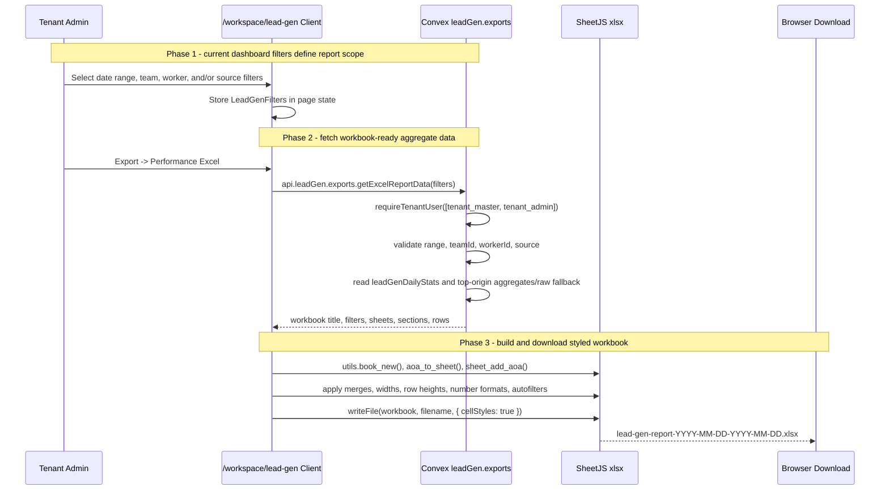

# Lead Gen Excel Reporting — Design Specification

**Version:** 0.1 (MVP)  
**Status:** Draft  
**Scope:** `/workspace/lead-gen` currently supports CSV downloads for summary rows and raw submissions. This feature adds a styled Excel workbook export that uses the same date, worker, team, and source filters as the current page and reports management-ready lead-gen performance, not raw submission rows.  
**Prerequisite:** Existing Lead Gen Ops admin dashboard, `leadGenDailyStats`, `leadGenTeamOriginStats`, current reporting/export queries, and the already-installed SheetJS `xlsx` package (`0.20.3` from the SheetJS CDN tarball).

---

## Table of Contents

1. [Goals & Non-Goals](#1-goals--non-goals)
2. [Actors & Roles](#2-actors--roles)
3. [End-to-End Flow Overview](#3-end-to-end-flow-overview)
4. [Phase 1: Report Scope and Data Contract](#4-phase-1-report-scope-and-data-contract)
5. [Phase 2: Convex Export Data Query](#5-phase-2-convex-export-data-query)
6. [Phase 3: SheetJS Workbook Builder](#6-phase-3-sheetjs-workbook-builder)
7. [Phase 4: UI Integration and Verification](#7-phase-4-ui-integration-and-verification)
8. [Data Model](#8-data-model)
9. [Convex Function Architecture](#9-convex-function-architecture)
10. [Routing & Authorization](#10-routing--authorization)
11. [Security Considerations](#11-security-considerations)
12. [Error Handling & Edge Cases](#12-error-handling--edge-cases)
13. [Open Questions](#13-open-questions)
14. [Dependencies](#14-dependencies)
15. [Applicable Skills](#15-applicable-skills)

---

## 1. Goals & Non-Goals

### Goals

- Add an Excel export option to the existing Lead Gen Ops export menu.
- Use the current page filters exactly: `startDayKey`, `endDayKey`, optional `teamId`, optional `workerId`, and optional `source`.
- Generate one `.xlsx` workbook with separated, non-overlapping tables and clear titles.
- In default all-teams mode, generate one worksheet per team using historical submission team snapshots.
- In scoped modes, generate the smallest useful worksheet set:
  - selected team: one worksheet for that team.
  - selected worker: one worksheet for that worker, still respecting selected source and date range.
  - selected source only: one worksheet per team, filtered to that source.
- Include, per worksheet, a summary for the period, average leads/hour, worker performance, top lead generators, and top posts/reels.
- Keep raw submission CSV behavior unchanged. The new Excel report is a curated reporting workbook, not a raw-row dump.
- Use SheetJS `xlsx` in the browser for workbook creation and download.

### Non-Goals

- Replacing the existing Summary CSV or Raw Submissions CSV exports.
- Exporting all raw submissions into the Excel workbook.
- Adding new database tables or schema fields.
- Adding charts, pivot tables, macros, images, or formulas in MVP.
- Changing the dashboard layout beyond adding the export menu item and loading state.
- Building an async server-side file generation pipeline.

---

## 2. Actors & Roles

| Actor | Identity | Auth Method | Key Permissions |
|---|---|---|---|
| Tenant owner | CRM `tenant_master` user | WorkOS AuthKit, member of tenant org | Can view `/workspace/lead-gen` and download Excel reports for all tenant lead-gen data. |
| Tenant admin | CRM `tenant_admin` user | WorkOS AuthKit, member of tenant org | Can view `/workspace/lead-gen` and download Excel reports for all tenant lead-gen data. |
| Lead-gen worker | CRM `lead_generator` user | WorkOS AuthKit, member of tenant org | No access to this admin workbook export. Own capture/activity routes only. |
| Closer | CRM `closer` user | WorkOS AuthKit, member of tenant org | No access to this admin workbook export. |
| Browser client | Authenticated admin session | Convex authenticated client | Requests bounded report data and writes the workbook locally with SheetJS. |
| Convex backend | Tenant-scoped queries | `requireTenantUser(["tenant_master", "tenant_admin"])` | Reads aggregate rows and returns hydrated workbook data. |

### CRM Role Mapping

| CRM `users.role` | WorkOS role slug | Excel Report Access |
|---|---|---|
| `tenant_master` | `owner` | Full |
| `tenant_admin` | `tenant-admin` | Full |
| `lead_generator` | `lead-generator` | None |
| `closer` | `closer` | None |

---

## 3. End-to-End Flow Overview



---

## 4. Phase 1: Report Scope and Data Contract

### 4.1 Filter Semantics

The Excel export uses the same `LeadGenFilters` type from the page client.

```typescript
// Path: app/workspace/lead-gen/_components/lead-gen-admin-page-client.tsx
export type LeadGenFilters = {
  startDayKey: string;
  endDayKey: string;
  teamId?: Id<"attributionTeams">;
  workerId?: Id<"leadGenWorkers">;
  source?: "instagram" | "meta_business";
};
```

| Filter State | Workbook Shape |
|---|---|
| Date range only | One worksheet per team, including `Unassigned` if data exists. |
| Date range + source | One worksheet per team, source-filtered. |
| Date range + team | One worksheet for the selected team. |
| Date range + worker | One worksheet for the selected worker. |
| Date range + team + worker | One worksheet for the selected worker within that team-filtered result. |

> **Scope decision:** Date range is always present because the page initializes it. "No filters" means no team, worker, or source filter beyond the default date range. In that mode, every worksheet represents one team.

### 4.2 Required Worksheet Sections

Every generated worksheet follows the same vertical layout. Sections are separated by at least two blank rows so tables never overlap.

| Order | Section | Purpose | Rows |
|---|---|---|---|
| 1 | Title block | Report name, sheet scope, date range, filters, generated timestamp | 4-6 |
| 2 | Summary | Submissions, unique prospects, duplicates, scheduled hours, average leads/hour | 1 header + 1 data row |
| 3 | Top 3 Lead Generators | Fast view of highest performers for the sheet scope | 1 header + up to 3 rows |
| 4 | Top 3 Posts/Reels | Fast view of best rankable origins for the sheet scope | 1 header + up to 3 rows |
| 5 | Worker Performance | Full worker table for the sheet scope | 1 header + N rows |
| 6 | Source Split | Instagram vs Meta Business performance | 1 header + up to 2 rows |
| 7 | Posts/Reels Detail | Top rankable origins for the sheet scope | 1 header + N rows |

### 4.3 Metric Definitions

| Metric | Definition | Source |
|---|---|---|
| Submissions | Sum of `leadGenDailyStats.submissions` for active, non-voided aggregate rows in scope | `leadGenDailyStats` |
| Unique Prospects | Sum of `leadGenDailyStats.uniqueProspectsSubmitted` | `leadGenDailyStats` |
| Duplicates | Sum of `leadGenDailyStats.duplicateProspectSubmissions` | `leadGenDailyStats` |
| Scheduled Hours | Sum scheduled hours once per worker/day using `scheduledHoursForDailyStat()` | `leadGenDailyStats` + current `leadGenWorkerSchedules` |
| Leads/Hr | `submissions / scheduledHours`, or `null` when scheduled hours is `0` | Derived |
| Top Lead Generators | Top 3 workers by submissions, tie-broken by unique prospects then name | Derived from worker performance |
| Top Posts/Reels | Top 3 rankable origins by unique prospects, tie-broken by submissions then URL | `leadGenTeamOriginStats` or bounded raw fallback |

> **Metric decision:** Match the current dashboard's leads/hour calculation by using submissions divided by scheduled hours. This keeps the workbook consistent with `LeadGenSummaryCards`, `WorkerPerformanceTable`, and `TeamPerformanceTable`.

---

## 5. Phase 2: Convex Export Data Query

### 5.1 Public Query

Add one public query to `convex/leadGen/exports.ts` so the workbook gets one stable payload. This prevents the client from manually stitching current worker/team assignment into historical team reporting.

```typescript
// Path: convex/leadGen/exports.ts
export const getExcelReportData = query({
  args: exportFiltersValidator,
  handler: async (ctx, args) => {
    const { tenantId } = await requireTenantUser(ctx, [
      "tenant_master",
      "tenant_admin",
    ]);

    validateDayRange(args);
    await validateFilterIds(ctx, { tenantId, ...args });

    const rows = await readDailyStatsRows(ctx, { tenantId, ...args });
    const currentScheduledHoursByWorkerDay =
      await loadCurrentScheduledHoursByWorkerDay(ctx, { tenantId, rows });

    return await buildExcelReportData(ctx, {
      tenantId,
      filters: args,
      dailyRows: rows,
      currentScheduledHoursByWorkerDay,
      topOriginLimit: 10,
    });
  },
});
```

> **Runtime decision:** This is a `query`, not an `action`, because all inputs come from Convex tables and no external service or Node-only API is required. The browser performs the `.xlsx` serialization after receiving bounded aggregate data.

### 5.2 Return Shape

```typescript
// Path: convex/leadGen/exports.ts
type LeadGenExcelReportData = {
  generatedAt: number;
  reportTitle: string;
  filters: {
    startDayKey: string;
    endDayKey: string;
    source: "instagram" | "meta_business" | null;
    teamName: string | null;
    workerName: string | null;
  };
  sheets: Array<{
    sheetKey: string;
    sheetName: string;
    scopeKind: "team" | "worker";
    scopeLabel: string;
    summary: {
      submissions: number;
      uniqueProspects: number;
      duplicates: number;
      scheduledHours: number;
      leadsPerHour: number | null;
    };
    topLeadGenerators: ExcelWorkerPerformanceRow[];
    topPosts: ExcelOriginRow[];
    workerPerformance: ExcelWorkerPerformanceRow[];
    sourcePerformance: ExcelSourcePerformanceRow[];
    postDetail: ExcelOriginRow[];
  }>;
};
```

### 5.3 Sheet Grouping Rules

```typescript
// Path: convex/leadGen/exports.ts
function getExcelSheetGroups(args: {
  filters: {
    teamId?: LeadGenTeamId;
    workerId?: Id<"leadGenWorkers">;
  };
  dailyRows: Doc<"leadGenDailyStats">[];
}) {
  if (args.filters.workerId) {
    return [
      {
        scopeKind: "worker" as const,
        key: `worker:${args.filters.workerId}`,
        workerId: args.filters.workerId,
      },
    ];
  }

  if (args.filters.teamId) {
    return [
      {
        scopeKind: "team" as const,
        key: `team:${args.filters.teamId}`,
        teamId: args.filters.teamId,
      },
    ];
  }

  const teamIds = new Set(
    args.dailyRows.map((row) => row.teamId ?? "unassigned"),
  );

  return [...teamIds].map((teamId) => ({
    scopeKind: "team" as const,
    key: `team:${teamId}`,
    teamId: teamId === "unassigned" ? null : teamId,
  }));
}
```

> **Historical accuracy decision:** Default all-team workbooks group sheets by `leadGenDailyStats.teamId`, which is the team snapshot stored at submission time. Do not group by `leadGenWorkers.teamId`, because a worker may move teams after the reporting period.

### 5.4 Top Posts/Reels Data

The query should reuse the existing `leadGenTeamOriginStats` path whenever possible and use the same bounded raw-submission fallback currently used for worker-scoped reports.

```typescript
// Path: convex/leadGen/exports.ts
async function loadExcelTopOriginsForScope(
  ctx: QueryCtx,
  args: {
    tenantId: Id<"tenants">;
    startDayKey: string;
    endDayKey: string;
    teamId?: LeadGenTeamId;
    workerId?: Id<"leadGenWorkers">;
    source?: LeadGenSource;
    limit: number;
  },
) {
  if (args.workerId) {
    return await listTopOriginsFromBoundedSubmissions(ctx, args);
  }

  return await listTopOriginsFromTeamOriginStats(ctx, args);
}
```

> **Code organization decision:** Move the duplicated top-origin grouping helpers from `convex/leadGen/reporting.ts` into a small shared helper module, for example `convex/leadGen/reportBuilders.ts`. Both dashboard queries and export queries should call that helper to avoid metric drift.

---

## 6. Phase 3: SheetJS Workbook Builder

### 6.1 Client Utility Module

Create a browser-only utility for workbook construction. Keep it outside Convex and import it only from the client component.

```typescript
// Path: app/workspace/lead-gen/_components/lead-gen-excel-report.ts
import * as XLSX from "xlsx";

export function downloadLeadGenExcelReport(data: LeadGenExcelReportData) {
  const workbook = XLSX.utils.book_new();

  for (const sheet of data.sheets) {
    const worksheet = buildReportWorksheet(data, sheet);
    XLSX.utils.book_append_sheet(
      workbook,
      worksheet,
      sanitizeSheetName(sheet.sheetName),
    );
  }

  XLSX.writeFile(workbook, buildFilename(data), {
    bookType: "xlsx",
    cellStyles: true,
    compression: true,
  });
}
```

### 6.2 Non-Overlapping Table Writer

Use a row cursor helper so every section writes below the previous one.

```typescript
// Path: app/workspace/lead-gen/_components/lead-gen-excel-report.ts
function addSection(
  worksheet: XLSX.WorkSheet,
  cursor: { row: number },
  title: string,
  rows: unknown[][],
) {
  XLSX.utils.sheet_add_aoa(worksheet, [[title]], {
    origin: { r: cursor.row, c: 0 },
  });
  styleSectionTitle(worksheet, cursor.row, rows[0]?.length ?? 1);
  cursor.row += 1;

  XLSX.utils.sheet_add_aoa(worksheet, rows, {
    origin: { r: cursor.row, c: 0 },
  });
  styleTable(worksheet, {
    headerRow: cursor.row,
    firstDataRow: cursor.row + 1,
    lastRow: cursor.row + rows.length - 1,
    columnCount: rows[0]?.length ?? 1,
  });

  cursor.row += rows.length + 2;
}
```

### 6.3 Workbook Styling

| Element | SheetJS Implementation |
|---|---|
| Title row | Merged range `A1:H1`, larger bold font, dark fill, white text |
| Filter metadata | Small muted rows under title |
| Section titles | Merged row across the table width, filled accent background |
| Header rows | Bold font, filled background, bottom border |
| Number columns | `z` number formats like `#,##0`, `#,##0.00` |
| URL cells | `cell.l = { Target: url }` hyperlink |
| Column sizing | `worksheet["!cols"] = [{ wch: 24 }, ...]` |
| Freeze panes | If unsupported by SheetJS CE, skip; otherwise freeze title/header rows |
| Auto filters | Set `worksheet["!autofilter"]` per full table range where one main detail table exists |

```typescript
// Path: app/workspace/lead-gen/_components/lead-gen-excel-report.ts
const STYLES = {
  title: {
    font: { bold: true, sz: 16, color: { rgb: "FFFFFF" } },
    fill: { fgColor: { rgb: "1F2937" } },
    alignment: { horizontal: "left", vertical: "center" },
  },
  section: {
    font: { bold: true, color: { rgb: "111827" } },
    fill: { fgColor: { rgb: "E5E7EB" } },
  },
  header: {
    font: { bold: true, color: { rgb: "FFFFFF" } },
    fill: { fgColor: { rgb: "2563EB" } },
    alignment: { horizontal: "center" },
  },
};
```

> **Styling decision:** Use SheetJS' built-in worksheet metadata first: merges, column widths, hyperlinks, number formats, row heights, and `cellStyles: true`. Verify actual fill/font preservation after implementation because style support can vary by SheetJS distribution and Excel viewer. If full cell styling does not persist with the installed package, the fallback MVP still must preserve structure, widths, titles, formats, and table separation; upgrading styling support becomes a follow-up decision.

### 6.4 Worksheet Example Layout

```text
A1:H1   Lead Gen Ops Report - Team Alpha
A2:H2   Period: 2026-05-19 to 2026-05-25
A3:H3   Filters: Source = All, Team = Team Alpha, Worker = All
A4:H4   Generated: 2026-05-26T...

A6:E6   Summary
A7:E7   Submissions | Unique Prospects | Duplicates | Scheduled Hours | Leads/Hr
A8:E8   124         | 88               | 36         | 42.00           | 2.95

A10:E10 Top 3 Lead Generators
A11:E11 Rank | Worker | Team | Submissions | Leads/Hr
A12:E14 ...

A16:F16 Top 3 Posts/Reels
A17:F17 Rank | Origin | Kind | Source | Unique Prospects | Submissions
A18:F20 ...

A22:F22 Worker Performance
A23:F23 Worker | Email | Team | Submissions | Unique | Leads/Hr
A24:F...
```

### 6.5 Sheet Naming

Excel sheet names must be unique, 31 characters or fewer, and cannot contain `[]:*?/\\`.

```typescript
// Path: app/workspace/lead-gen/_components/lead-gen-excel-report.ts
function sanitizeSheetName(name: string, used = new Set<string>()) {
  const base = name.replace(/[\[\]:*?/\\]/g, " ").trim().slice(0, 31) || "Sheet";
  let candidate = base;
  let suffix = 2;

  while (used.has(candidate)) {
    const suffixText = ` ${suffix}`;
    candidate = `${base.slice(0, 31 - suffixText.length)}${suffixText}`;
    suffix += 1;
  }

  used.add(candidate);
  return candidate;
}
```

---

## 7. Phase 4: UI Integration and Verification

### 7.1 Export Menu Changes

Extend the existing export request union and add one dropdown item.

```typescript
// Path: app/workspace/lead-gen/_components/lead-gen-export-menu.tsx
type ExportRequest =
  | { kind: "summary"; nonce: number }
  | { kind: "raw"; nonce: number }
  | { kind: "excel"; nonce: number };
```

```tsx
// Path: app/workspace/lead-gen/_components/lead-gen-export-menu.tsx
<DropdownMenuItem
  onSelect={() => setRequest({ kind: "excel", nonce: Date.now() })}
>
  Performance Excel
</DropdownMenuItem>
```

### 7.2 Query and Download Flow

```typescript
// Path: app/workspace/lead-gen/_components/lead-gen-export-menu.tsx
const excelReport = useQuery(
  api.leadGen.exports.getExcelReportData,
  request?.kind === "excel"
    ? {
        startDayKey,
        endDayKey,
        ...(teamId ? { teamId } : {}),
        ...(workerId ? { workerId } : {}),
        ...(source ? { source } : {}),
      }
    : "skip",
);

useEffect(() => {
  if (request?.kind !== "excel" || excelReport === undefined) return;
  if (completedRequestRef.current === request.nonce) return;
  completedRequestRef.current = request.nonce;

  downloadLeadGenExcelReport(excelReport);
  toast.success("Excel report ready");
}, [excelReport, request]);
```

### 7.3 Verification Checklist

| Check | Expected Result |
|---|---|
| Date-only export | Workbook has one worksheet per team with no global non-team worksheet. |
| Team filter export | Workbook has one worksheet for the selected team. |
| Worker filter export | Workbook has one worksheet for the selected worker. |
| Source filter export | All sections only include that source. |
| Invalid date range | Convex query throws the existing range error and the UI shows a destructive toast. |
| Empty result | Workbook still downloads with one sheet named `No Activity` and empty-state text. |
| Top 3 lead generators | Rows match the first three worker performance rows sorted by submissions. |
| Top 3 posts/reels | Rows match dashboard top-origin ordering for the same filters. |
| Table layout | Sections have blank spacing and no overwritten cells. |
| Style preservation | Title/header colors, widths, number formats, and hyperlinks render in Excel/Numbers/LibreOffice. |

---

## 8. Data Model

No schema changes are required for MVP.

### Existing Tables Read

```typescript
// Path: convex/schema.ts
leadGenDailyStats: defineTable({
  tenantId: v.id("tenants"),
  statKey: v.string(),
  dayKey: v.string(),
  workerId: v.id("leadGenWorkers"),
  userId: v.id("users"),
  teamId: v.optional(v.id("attributionTeams")),
  source: leadGenSourceValidator,
  submissions: v.number(),
  uniqueProspectsSubmitted: v.number(),
  duplicateProspectSubmissions: v.number(),
  scheduledHours: v.number(),
  updatedAt: v.number(),
})
  .index("by_tenantId_and_dayKey", ["tenantId", "dayKey"])
  .index("by_tenantId_and_workerId_and_dayKey", [
    "tenantId",
    "workerId",
    "dayKey",
  ])
  .index("by_tenantId_and_teamId_and_dayKey", [
    "tenantId",
    "teamId",
    "dayKey",
  ])
  .index("by_tenantId_and_source_and_dayKey", [
    "tenantId",
    "source",
    "dayKey",
  ]);
```

```typescript
// Path: convex/schema.ts
leadGenTeamOriginStats: defineTable({
  tenantId: v.id("tenants"),
  statKey: v.string(),
  dayKey: v.string(),
  teamId: v.optional(v.id("attributionTeams")),
  source: leadGenSourceValidator,
  originKind: leadGenOriginKindValidator,
  originKey: v.string(),
  originValue: v.string(),
  submissions: v.number(),
  uniqueProspectsSubmitted: v.number(),
  updatedAt: v.number(),
})
  .index("by_tenantId_and_dayKey", ["tenantId", "dayKey"])
  .index("by_tenantId_and_teamId_and_dayKey", [
    "tenantId",
    "teamId",
    "dayKey",
  ])
  .index("by_tenantId_and_source_and_dayKey", [
    "tenantId",
    "source",
    "dayKey",
  ])
  .index("by_tenantId_and_teamId_and_source_and_dayKey", [
    "tenantId",
    "teamId",
    "source",
    "dayKey",
  ]);
```

---

## 9. Convex Function Architecture

```text
convex/
  leadGen/
    exports.ts                 # MODIFIED - Add getExcelReportData query.
    reporting.ts               # MODIFIED - Move shared top-origin builders out if needed.
    reportBuilders.ts          # NEW - Shared aggregation helpers for dashboard and export payloads.
    schedules.ts               # REUSE - scheduledHoursForDailyStat and schedule lookup.
    sharedTeams.ts             # REUSE - team hydration and validation.
    validators.ts              # REUSE - lead-gen source validators.
```

### Helper Ownership

| Helper | File | Used By |
|---|---|---|
| `buildExcelReportData()` | `convex/leadGen/reportBuilders.ts` | `exports.getExcelReportData` |
| `summarizeDailyRows()` | `convex/leadGen/reportBuilders.ts` | Dashboard and Excel export |
| `buildWorkerPerformanceRows()` | `convex/leadGen/reportBuilders.ts` | Dashboard and Excel export |
| `buildSourcePerformanceRows()` | `convex/leadGen/reportBuilders.ts` | Dashboard and Excel export |
| `listTopOriginsForScope()` | `convex/leadGen/reportBuilders.ts` | `reporting.listTopOrigins*`, Excel export |

> **Duplication decision:** The current reporting and exports files already duplicate some daily-stat hydration patterns. This feature should extract shared builders only where needed to keep the Excel workbook consistent. Avoid a broad reporting refactor outside Lead Gen Ops.

---

## 10. Routing & Authorization

### App Router Files

```text
app/workspace/lead-gen/
  page.tsx                                      # REUSE - already requires lead-gen:view-all.
  _components/
    lead-gen-admin-page-client.tsx             # REUSE - owns current LeadGenFilters state.
    lead-gen-export-menu.tsx                   # MODIFIED - add Performance Excel option.
    lead-gen-excel-report.ts                   # NEW - SheetJS workbook builder.
```

### Route Gate

```typescript
// Path: app/workspace/lead-gen/page.tsx
export default async function LeadGenAdminPage() {
  await requirePermission("lead-gen:view-all");

  return (
    <Suspense fallback={<LeadGenAdminSkeleton />}>
      <LeadGenAdminPageClient />
    </Suspense>
  );
}
```

The new query also enforces admin access server-side:

```typescript
// Path: convex/leadGen/exports.ts
const { tenantId } = await requireTenantUser(ctx, [
  "tenant_master",
  "tenant_admin",
]);
```

> **Authorization decision:** The route gate is useful for UX, but the Convex query is the security boundary. Never rely on export menu visibility alone.

---

## 11. Security Considerations

### Credential Security

No new secrets, access tokens, or external API credentials are introduced. The workbook is generated locally after Convex returns already-authorized reporting data.

### Multi-Tenant Isolation

| Resource | Tenant Enforcement |
|---|---|
| Daily stats | Query uses `tenantId` from `requireTenantUser`, never from args. |
| Worker filter | `validateFilterIds()` confirms worker belongs to current tenant. |
| Team filter | `getSharedDmTeam()` confirms team belongs to current tenant. |
| Top origins | Reads are scoped by `tenantId` and bounded date indexes. |

### Role-Based Data Access

| Data Resource | `tenant_master` | `tenant_admin` | `lead_generator` | `closer` |
|---|---|---|---|---|
| Excel workbook export | Full | Full | None | None |
| Worker performance | Full | Full | None | None |
| Team performance | Full | Full | None | None |
| Top posts/reels | Full | Full | None | None |
| Raw submissions CSV | Full | Full | None | None |

### Rate Limit Awareness

No external service rate limits apply. Convex read bounds still apply:

| Read Path | Existing Limit |
|---|---|
| Summary/daily stats export | `SUMMARY_EXPORT_LIMIT = 1000` |
| Raw submission export | unchanged, `RAW_EXPORT_HARD_LIMIT = 5000` |
| Reporting range | `MAX_EXPORT_DAYS = 120` |
| Top origin reads | use existing bounded origin stat/raw submission limits |

---

## 12. Error Handling & Edge Cases

### 12.1 Invalid Date Range

| Item | Behavior |
|---|---|
| Scenario | `startDayKey` is after `endDayKey`, malformed, or exceeds 120 days. |
| Detection | Existing `validateDayRange()` in Convex. |
| Recovery | Abort query. |
| User-facing behavior | Export button re-enables and toast displays the error. |

### 12.2 No Matching Activity

| Item | Behavior |
|---|---|
| Scenario | Filters are valid but no daily stat rows match. |
| Detection | `dailyRows.length === 0`. |
| Recovery | Return one sheet with title/filter metadata and empty section messages. |
| User-facing behavior | `.xlsx` downloads; sheet name is `No Activity`. |

### 12.3 Too Many Teams For Sheet Names

| Item | Behavior |
|---|---|
| Scenario | Many teams share long or similar names. |
| Detection | Sheet-name sanitizer detects duplicate 31-character names. |
| Recovery | Append numeric suffixes within Excel's 31-character limit. |
| User-facing behavior | Workbook downloads with unique sheet tabs. |

### 12.4 SheetJS Style Limitations

| Item | Behavior |
|---|---|
| Scenario | Installed `xlsx` package does not preserve all `cell.s` font/fill declarations in a target viewer. |
| Detection | Manual verification in Excel/Numbers/LibreOffice after implementation. |
| Recovery | Preserve structural styling: merges, widths, number formats, hyperlinks, row spacing. |
| User-facing behavior | Report remains readable and table-separated even if some colors are downgraded. |

### 12.5 Worker Moved Teams

| Item | Behavior |
|---|---|
| Scenario | A worker belonged to Team A during the report period but now belongs to Team B. |
| Detection | Default team worksheets group by `leadGenDailyStats.teamId`. |
| Recovery | Use historical daily stat row team snapshots for team sheets. |
| User-facing behavior | Historical report does not change because of current worker reassignment. |

---

## 13. Open Questions

| # | Question | Current Thinking |
|---|---|---|
| 1 | Should date-only exports include a separate all-teams overview sheet? | No for MVP, because the requirement says each sheet must be for a team when no filters are present. |
| 2 | Should top posts rank by submissions or unique prospects? | Use unique prospects first, submissions second. This better represents lead generation quality. |
| 3 | Should the workbook include raw submissions as a hidden sheet? | No. Keep raw submissions as the existing CSV export to avoid very large workbooks. |
| 4 | Should source-only filters create one sheet per team or one source summary sheet? | One sheet per team, filtered to the selected source, to honor the no-team-selected workbook rule. |
| 5 | Should formulas be used for summary totals? | No for MVP. Export concrete values from Convex to avoid formula drift and localization issues. |

---

## 14. Dependencies

### New Packages

| Package | Why | Runtime | Install Command |
|---|---|---|---|
| None | `xlsx` is already installed. | N/A | N/A |

### Already-Installed Packages

| Package | Used For |
|---|---|
| `xlsx` `0.20.3` | Browser-side workbook creation and `.xlsx` download. |
| `convex` | Authenticated report data query. |
| `sonner` | Success/error toast feedback. |
| `lucide-react` | Existing export menu icon. |

### Environment Variables

| Variable | Where Set | Used By |
|---|---|---|
| None | N/A | No new environment variables are required. |

### External Service Configuration

| Service | Configuration |
|---|---|
| None | No WorkOS, Calendly, Slack, or PostHog configuration changes are required. |

---

## 15. Applicable Skills

| Skill | When to Invoke | Phase(s) |
|---|---|---|
| `convex` | When implementing the new Convex query and shared report builders. | 2 |
| `convex-performance-audit` | If report ranges approach read limits or query cost becomes unclear. | 2, 4 |
| `next-best-practices` | When editing the App Router client boundary/export menu. | 4 |
| `frontend-design` | If the export menu or report states need UI polish beyond the dropdown item. | 4 |
| `spreadsheets` | If implementation needs deeper workbook rendering/verification guidance. | 3, 4 |

