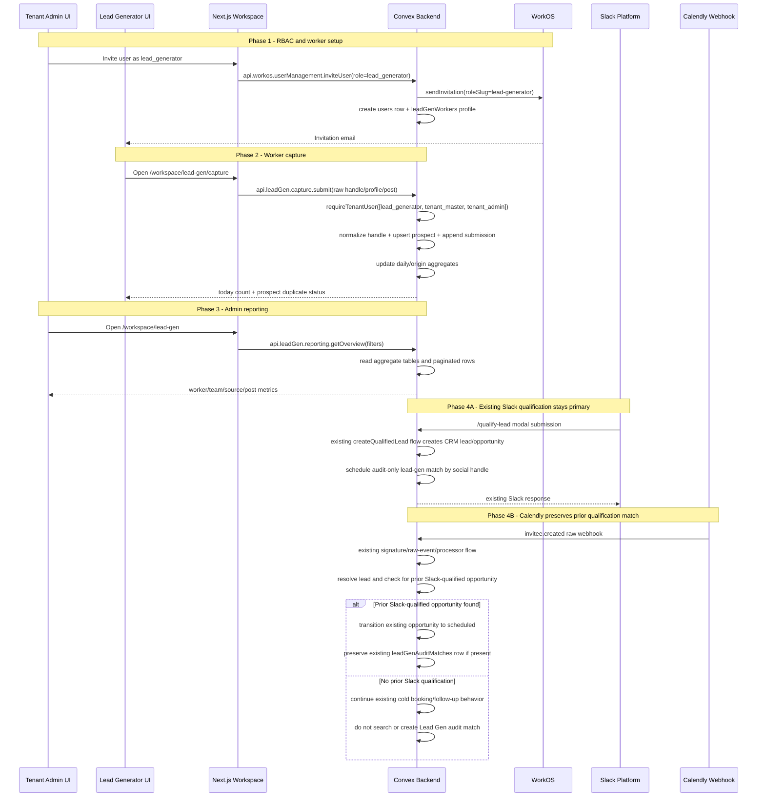

# Lead Gen Ops - Design Specification

**Version:** 0.1 (MVP)  
**Status:** Draft  
**Scope:** The CRM currently starts at qualified Slack submissions or Calendly bookings. This feature adds a separate tenant-scoped Lead Gen Ops module for high-volume social prospect capture, worker accountability, admin reporting, audit-only matching when a later Slack qualification uses the same social handle, and preservation of that prior match when the qualified lead schedules through Calendly. Lead-gen rows are never inserted into the existing `leads` or `opportunities` funnel.  
**Prerequisite:** Existing WorkOS AuthKit tenant auth, Convex schema, Slack `/qualify-lead` flow, Calendly `invitee.created` pipeline, and lead identity model. WorkOS must be configured with a new `lead-generator` role before inviting lead-gen workers.

---

## Table of Contents

1. [Goals & Non-Goals](#1-goals--non-goals)
2. [Actors & Roles](#2-actors--roles)
3. [End-to-End Flow Overview](#3-end-to-end-flow-overview)
4. [Phase 0: Scope, Blast Radius, and Migration Guardrails](#4-phase-0-scope-blast-radius-and-migration-guardrails)
5. [Phase 1: RBAC and Worker Configuration](#5-phase-1-rbac-and-worker-configuration)
6. [Phase 2: Mobile Capture and Prospect Dedupe](#6-phase-2-mobile-capture-and-prospect-dedupe)
7. [Phase 3: Admin Reporting, Exports, and Aggregates](#7-phase-3-admin-reporting-exports-and-aggregates)
8. [Phase 4: Audit Matching to Qualified CRM Records](#8-phase-4-audit-matching-to-qualified-crm-records)
9. [Phase 5: Corrections, QA, and Release Gates](#9-phase-5-corrections-qa-and-release-gates)
10. [Data Model](#10-data-model)
11. [Convex Function Architecture](#11-convex-function-architecture)
12. [Routing & Authorization](#12-routing--authorization)
13. [Security Considerations](#13-security-considerations)
14. [Error Handling & Edge Cases](#14-error-handling--edge-cases)
15. [Open Questions](#15-open-questions)
16. [Dependencies](#16-dependencies)
17. [Applicable Skills](#17-applicable-skills)

---

## 1. Goals & Non-Goals

### Goals

- Add a production Lead Gen Ops module that is tenant-scoped, WorkOS-authenticated, and separate from CRM qualified leads.
- Let `lead_generator` users submit Instagram and Meta Business prospects from a mobile-first capture route without choosing their own identity.
- Aggregate repeated attempts against the same tenant/platform/handle prospect instead of creating duplicate prospect rows; keep source on each submission for reporting.
- Give tenant owners/admins a desktop-first Lead Gen Ops area for teams, worker profiles, schedules, reporting, correction review, and exports.
- Preserve the existing CRM funnel definition: qualified Slack submission or Calendly booking creates CRM `leads` and `opportunities`; lead-gen submissions do not.
- Add audit-only matching from lead-gen prospects to later Slack-qualified CRM records by normalized social handle.
- Preserve an existing Slack-created audit match when the qualified lead later schedules through Calendly.
- Keep integration blast radius small: no Slack modal redesign, no new Slack command, no change to Calendly webhook HTTP ingestion, and no Lead Gen prospect lookup from Calendly cold bookings.
- Enforce all tenant and role access server-side in Convex and RSC route gates.
- Include an explicit migration strategy for the role/schema changes even when no data backfill is required.

### Non-Goals (deferred)

- Creating CRM `leads` or `opportunities` from Lead Gen Ops capture submissions (MVP and future default).
- Treating Lead Gen Ops as a funnel stage or reporting prospect-to-qualified/booked/won conversion (MVP and future default).
- Worker compensation automation or payout approvals (deferred to a separate compensation design).
- Social scraping, automated DM sending, browser extensions, mobile share-sheet integrations, or platform API enrichment (deferred).
- Replacing the existing Slack `/qualify-lead` modal or slash command flow (out of scope).
- Changing Calendly OAuth, webhook registration, signature verification, token refresh, or raw event processing (out of scope).
- Multilingual production UI (MVP is English-only).
- Offline-first capture with background sync (deferred until server-backed MVP usage proves the need).
- Complex lead-gen handoff state machines such as requested/accepted/rejected (explicitly excluded).

---

## 2. Actors & Roles

| Actor | Identity | Auth Method | Key Permissions |
|---|---|---|---|
| Tenant owner | CRM `tenant_master` user | WorkOS AuthKit, member of tenant org | Full Lead Gen Ops configuration, worker/team/schedule management, reporting, correction, export, and optional capture. |
| Tenant admin | CRM `tenant_admin` user | WorkOS AuthKit, member of tenant org | Same Lead Gen Ops permissions as owner except owner-only tenant controls that already exist outside this feature. |
| Lead-gen worker | CRM `lead_generator` user | WorkOS AuthKit, member of tenant org | Create own lead-gen submissions and view own activity. No CRM pipeline access by default. |
| Closer | CRM `closer` user | WorkOS AuthKit, member of tenant org | No Lead Gen Ops access in MVP unless separately promoted to admin. Existing closer CRM surfaces remain unchanged. |
| Slack submitter | Slack-side user invoking `/qualify-lead` | Slack request signature and installed Slack workspace | Existing Slack qualification flow only. Lead Gen Ops receives an audit-matching side effect after the Slack qualification creates or finds the CRM lead/opportunity. |
| Calendly invitee | External scheduled prospect | Calendly webhook payload | No direct app access. Calendly can schedule an already Slack-qualified CRM lead and preserve any existing Lead Gen audit match; cold bookings do not create Lead Gen matches. |
| System | Convex internal functions | Internal Convex scheduler/functions | Normalization, dedupe, aggregate updates, audit matching, reconciliation, and report generation. |

### CRM Role <-> WorkOS Role Mapping

| CRM `users.role` | WorkOS role slug | Notes |
|---|---|---|
| `tenant_master` | `owner` | Existing owner role. Not assignable through team invite UI. |
| `tenant_admin` | `tenant-admin` | Existing admin role. Gains Lead Gen Ops admin permissions. |
| `closer` | `closer` | Existing closer role. Does not gain Lead Gen Ops permissions. |
| `lead_generator` | `lead-generator` | New role. Has Lead Gen Ops capture and own-activity permissions only. |

### Permission Additions

| Permission | Roles |
|---|---|
| `lead-gen:capture` | `lead_generator`, `tenant_master`, `tenant_admin` |
| `lead-gen:view-own` | `lead_generator`, `tenant_master`, `tenant_admin` |
| `lead-gen:view-all` | `tenant_master`, `tenant_admin` |
| `lead-gen:manage-workers` | `tenant_master`, `tenant_admin` |
| `lead-gen:manage-config` | `tenant_master`, `tenant_admin` |
| `lead-gen:correct` | `tenant_master`, `tenant_admin` |
| `lead-gen:export` | `tenant_master`, `tenant_admin` |

---

## 3. End-to-End Flow Overview



> **Boundary decision:** Lead Gen Ops is operational activity, not CRM qualification. The only automatic bridge to CRM is an audit-only match created by the Slack qualification path after Slack has produced the qualified CRM record. Calendly only preserves that existing match when the qualified lead schedules; it does not discover or create Lead Gen matches for cold bookings. This keeps conversion reporting and opportunity state transitions untouched.

---

## 4. Phase 0: Scope, Blast Radius, and Migration Guardrails

### 4.1 Scope Guardrails

Phase 0 is a planning and scaffold phase. It exists to keep the implementation narrow before any data model or pipeline code lands.

The design must explicitly preserve these boundaries:

| Area | Allowed Change | Forbidden Change |
|---|---|---|
| Lead Gen capture | Insert into new `leadGen*` tables | Insert into `leads` or `opportunities` |
| Slack `/qualify-lead` | Optional one-line internal scheduler call after accepted qualification | New slash command, modal redesign, response timing changes |
| Calendly `invitee.created` | Optional preservation/update of an existing Slack-created audit match when a qualified opportunity is scheduled | Cold-booking Lead Gen prospect lookup, webhook signature changes, raw event storage changes, broad branch reordering |
| CRM reporting | Optional audit badge/link | Lead-gen volume in CRM conversion metrics |
| RBAC | Add `lead_generator` role and permissions | Grant `lead_generator` closer/admin CRM access |
| Workspace routing | Redirect `lead_generator` users to Lead Gen capture/activity routes | Fall through to `/workspace`, closer routes, command palette CRM actions, or unguarded admin pages |

### 4.2 Migration Strategy

This feature introduces new tables and widens the `users.role` union. Existing production has one test tenant, but schema changes still need a safe deployment order.

**Deployment order:**

1. Create the WorkOS role slug `lead-generator` in dev and production WorkOS environments.
2. Deploy a schema/code widen:
   - Add `lead_generator` to `users.role` validator and `CrmRole`.
   - Add `lead-generator` to WorkOS role mapping.
   - Add new `leadGen*` tables.
   - Add permission literals.
3. Deploy role-aware workspace routing and navigation changes before any worker can sign in as `lead_generator`.
4. Deploy admin invite UI updates that can assign `lead_generator`.
5. Invite or role-change real lead-gen workers through the existing WorkOS user-management action.
6. Defer any conversion of existing `closer` accounts to `lead_generator` to explicit admin actions; do not run an automatic data migration.

> **Migration decision:** No `@convex-dev/migrations` job is required for MVP if this only adds new tables and widens a role enum. Existing `users` documents remain valid. If implementation later converts existing users, splits existing team data, or makes any new field required on existing tables, use the `convex-migration-helper` widen-migrate-narrow workflow before touching production.

### 4.3 Schema Widen Example

```typescript
// Path: convex/schema.ts
users: defineTable({
  tenantId: v.id("tenants"),
  workosUserId: v.string(),
  email: v.string(),
  fullName: v.optional(v.string()),
  role: v.union(
    v.literal("tenant_master"),
    v.literal("tenant_admin"),
    v.literal("closer"),
    v.literal("lead_generator"), // NEW: Lead Gen Ops worker role
  ),
  calendlyUserUri: v.optional(v.string()),
  calendlyMemberName: v.optional(v.string()),
  invitationStatus: v.optional(
    v.union(v.literal("pending"), v.literal("accepted")),
  ),
  workosInvitationId: v.optional(v.string()),
  personalEventTypeUri: v.optional(v.string()),
  deletedAt: v.optional(v.number()),
  isActive: v.boolean(),
})
  .index("by_tenantId", ["tenantId"])
  .index("by_workosUserId", ["workosUserId"])
  .index("by_tenantId_and_email", ["tenantId", "email"])
  .index("by_tenantId_and_calendlyUserUri", ["tenantId", "calendlyUserUri"])
  .index("by_tenantId_and_isActive", ["tenantId", "isActive"]),
```

### 4.4 Blast Radius Review Gates

Before implementation PRs merge:

| Gate | Expected Result |
|---|---|
| Search for writes to `leads`/`opportunities` inside `convex/leadGen` | None except audit matching reads and `leadGenAuditMatches` writes. |
| Search modified Slack files | Only `convex/slack/createQualifiedLead.ts` should change for optional audit scheduling. |
| Search modified Calendly pipeline files | Only `convex/pipeline/inviteeCreated.ts` and one new `leadGen` helper should change, and only to preserve an existing Slack-created audit match. |
| Run qualification QA | Existing Slack duplicate, already-booked, and created-opportunity paths stay unchanged. |
| Run Calendly QA | Existing lead, Slack join, follow-up reuse, auto-reschedule, and fresh booking paths still pass. |

---

## 5. Phase 1: RBAC and Worker Configuration

### 5.1 Role and Permission Expansion

Add `lead_generator` as a first-class CRM role. This is intentionally not a flavor of `closer`; lead-gen workers should not inherit pipeline, meeting, payment, or customer access.

```typescript
// Path: convex/lib/roleMapping.ts
export type CrmRole =
  | "tenant_master"
  | "tenant_admin"
  | "closer"
  | "lead_generator";

export type WorkosSlug =
  | "owner"
  | "tenant-admin"
  | "closer"
  | "lead-generator";

const CRM_TO_WORKOS_ROLE: Record<CrmRole, WorkosSlug> = {
  tenant_master: "owner",
  tenant_admin: "tenant-admin",
  closer: "closer",
  lead_generator: "lead-generator",
};

const WORKOS_TO_CRM_ROLE: Record<string, CrmRole> = {
  owner: "tenant_master",
  "tenant-admin": "tenant_admin",
  closer: "closer",
  "lead-generator": "lead_generator",
};
```

```typescript
// Path: convex/lib/permissions.ts
export const PERMISSIONS = {
  // ... existing permissions ...
  "lead-gen:capture": ["lead_generator", "tenant_master", "tenant_admin"],
  "lead-gen:view-own": ["lead_generator", "tenant_master", "tenant_admin"],
  "lead-gen:view-all": ["tenant_master", "tenant_admin"],
  "lead-gen:manage-workers": ["tenant_master", "tenant_admin"],
  "lead-gen:manage-config": ["tenant_master", "tenant_admin"],
  "lead-gen:correct": ["tenant_master", "tenant_admin"],
  "lead-gen:export": ["tenant_master", "tenant_admin"],
} as const;
```

> **Authorization decision:** Keep `lead_generator` out of admin and closer role groups. UI visibility can use `useRole().hasPermission(...)`, but every query/mutation still calls `requireTenantUser()` with explicit allowed roles.

### 5.2 Team Invite and Role Editing

The existing invite and role-edit actions already centralize WorkOS membership changes. Extend their validators to include `lead_generator`, but keep `tenant_master` protected as it is today.

Lead generators do not require Calendly member assignment.

Role lifecycle must be handled in every WorkOS user-management path, not only the initial invite path. The `leadGenWorkers` row is the Lead Gen Ops operational profile for a CRM `users` row; it must follow the CRM role and active state.

| Flow | Required Lead Gen Ops Behavior |
|---|---|
| Invite with `role=lead_generator` | Create the `users` row and immediately create a `leadGenWorkers` profile tied to that pending user; pending users cannot capture until the invitation is accepted and the profile is active. |
| Invite claim / first sign-in | Patch the `leadGenWorkers.workosUserId` from the pending placeholder to the canonical WorkOS user ID in the same flow that patches `users.workosUserId`. |
| Role change to `lead_generator` | Ensure a worker profile exists, update email/display/workos fields from `users`, and set `leadGenWorkers.isActive = users.isActive`. |
| Role change away from `lead_generator` | Deactivate the worker profile, preserve historical submissions, and prevent future capture. Do not delete the worker row. |
| User removal/deactivation | Deactivate the worker profile and preserve historical reporting references. |
| User reactivation as `lead_generator` | Reactivate or recreate the worker profile after WorkOS membership and CRM role are consistent. |

> **Implementation note:** Existing code paths to update include `convex/workos/userManagement.ts` (`inviteUser`, `updateUserRole`, `removeUser`) and `convex/workos/userMutations.ts` (`createInvitedUser`, `claimInvitedAccountByEmail`, `updateRole`, `updateRoleAndInvitation`, `removeUser`). Add a small internal Lead Gen worker sync helper rather than duplicating profile patch logic in each action/mutation.

```typescript
// Path: convex/workos/userManagement.ts
export const inviteUser = action({
  args: {
    email: v.string(),
    firstName: v.string(),
    lastName: v.optional(v.string()),
    role: v.union(
      v.literal("tenant_master"),
      v.literal("tenant_admin"),
      v.literal("closer"),
      v.literal("lead_generator"),
    ),
    calendlyMemberId: v.optional(v.id("calendlyOrgMembers")),
  },
  handler: async (ctx, args) => {
    const { caller, tenant, callerWorkosUserId } =
      await requireAdminContext(ctx);

    if (args.role === "tenant_master") {
      throw new Error("The owner role cannot be granted to other users");
    }
    if (args.calendlyMemberId && args.role !== "closer") {
      throw new Error("Only closers can be linked to Calendly members");
    }

    const desiredRoleSlug = mapCrmRoleToWorkosSlug(args.role);
    const invitationId = await sendOrResendInvitation(
      args.email.trim().toLowerCase(),
      tenant.workosOrgId,
      callerWorkosUserId,
      desiredRoleSlug,
    );

    const userId: Id<"users"> = await ctx.runMutation(
      internal.workos.userMutations.createInvitedUser,
      {
        tenantId: caller.tenantId,
        workosUserId: `pending:${args.email.trim().toLowerCase()}`,
        email: args.email.trim().toLowerCase(),
        fullName: [args.firstName, args.lastName].filter(Boolean).join(" "),
        role: args.role,
        invitationStatus: "pending",
        workosInvitationId: invitationId,
      },
    );

    if (args.role === "lead_generator") {
      await ctx.runMutation(internal.leadGen.workers.ensureWorkerProfile, {
        tenantId: caller.tenantId,
        userId,
      });
    }

    return { userId, invitationId };
  },
});
```

### 5.3 Worker, Team, and Schedule Configuration

Admins manage Lead Gen Ops team membership separately from CRM closer assignment:

- `leadGenWorkers` links a CRM `users` row to Lead Gen Ops configuration.
- `attributionTeams` is the shared tenant DM team registry used by both DM attribution links and Lead Gen Ops reporting.
- `leadGenWorkerSchedules` stores expected hours by weekday for productivity metrics.

```typescript
// Path: convex/leadGen/workers.ts
export const updateWorkerProfile = mutation({
  args: {
    workerId: v.id("leadGenWorkers"),
    teamId: v.optional(v.id("attributionTeams")),
    isActive: v.boolean(),
  },
  handler: async (ctx, args) => {
    const { tenantId } = await requireTenantUser(ctx, [
      "tenant_master",
      "tenant_admin",
    ]);

    const worker = await ctx.db.get(args.workerId);
    if (!worker || worker.tenantId !== tenantId) {
      throw new Error("Worker not found");
    }

    if (args.teamId) {
      const team = await ctx.db.get(args.teamId);
      if (!team || team.tenantId !== tenantId || !team.isActive) {
        throw new Error("Invalid DM team");
      }
    }

    await ctx.db.patch(args.workerId, {
      teamId: args.teamId,
      isActive: args.isActive,
      updatedAt: Date.now(),
    });
  },
});
```

### 5.4 Configuration UX

Admin configuration lives under `/workspace/lead-gen/settings` or tabs inside `/workspace/lead-gen`:

| View | Content | Primary Roles |
|---|---|---|
| Workers | Active/pending lead-gen users, team assignment, active toggle | `tenant_master`, `tenant_admin` |
| Teams | Team create/rename/archive | `tenant_master`, `tenant_admin` |
| Schedules | Weekday scheduled hours per worker | `tenant_master`, `tenant_admin` |
| Rules | Correction window, duplicate display rules, export defaults | `tenant_master`, `tenant_admin` |

> **UX decision:** Worker setup is admin desktop-first. Capture is worker mobile-first. Mixing dense configuration into the mobile capture flow would increase accidental edits and slow the repeated-entry workflow.

---

## 6. Phase 2: Mobile Capture and Prospect Dedupe

### 6.1 Capture Form Behavior

The worker route `/workspace/lead-gen/capture` is a client component inside the existing workspace shell. It should optimize for repeated mobile entry:

| Field | Behavior |
|---|---|
| Source | Segmented control: Instagram or Meta Business. |
| Profile/handle | Instagram accepts profile URL or raw handle. Meta Business accepts username/handle and stores a generated Instagram profile URL when possible. |
| Origin | Optional post/reel URL or keyword source. `Follower`, `Application`, and `Story Poll` count in totals but are excluded from top post/reel rankings. |
| Worker identity | Derived from `ctx.auth.getUserIdentity()` -> `users` -> `leadGenWorkers`. No self-selection. |
| Timestamp | Server timestamp from mutation. Client timestamp is only used for an optional idempotency key. |
| Feedback | Return today's submission count, duplicate flag, and last submitted prospect display. |

Instagram and Meta Business are capture sources, not separate prospect identities. If two submissions normalize to the same Instagram handle, they should aggregate onto the same `leadGenProspects` row while preserving each submission's `source` for reporting.

### 6.2 Validators and Normalization

```typescript
// Path: convex/leadGen/validators.ts
import { v } from "convex/values";

export const leadGenSourceValidator = v.union(
  v.literal("instagram"),
  v.literal("meta_business"),
);

export const leadGenOriginKindValidator = v.union(
  v.literal("post"),
  v.literal("reel"),
  v.literal("story_poll"),
  v.literal("follower"),
  v.literal("application"),
  v.literal("meta_business"),
  v.literal("other"),
);

export const leadGenSubmitArgsValidator = {
  source: leadGenSourceValidator,
  rawHandleOrProfileUrl: v.string(),
  originKind: leadGenOriginKindValidator,
  originUrlOrLabel: v.optional(v.string()),
  clientSubmissionKey: v.optional(v.string()),
};
```

```typescript
// Path: convex/leadGen/normalization.ts
import { normalizeSocialHandle } from "../lib/normalization";

export function normalizeLeadGenProspectInput(args: {
  rawHandleOrProfileUrl: string;
}) {
  const normalizedHandle = normalizeSocialHandle(
    args.rawHandleOrProfileUrl,
    "instagram",
  );
  if (!normalizedHandle) {
    throw new Error("Enter a valid Instagram handle or profile URL");
  }

  return {
    normalizedHandle,
    profileUrl: `https://instagram.com/${normalizedHandle}`,
    dedupeKey: `instagram:${normalizedHandle}`,
  };
}
```

### 6.3 Submission Mutation

```typescript
// Path: convex/leadGen/capture.ts
import { v } from "convex/values";
import { mutation } from "../_generated/server";
import { requireTenantUser } from "../requireTenantUser";
import {
  businessDateToUtcStart,
  timestampToBusinessDateKey,
} from "../reporting/lib/hondurasBusinessTime";
import { normalizeLeadGenProspectInput } from "./normalization";
import {
  leadGenOriginKindValidator,
  leadGenSourceValidator,
} from "./validators";

export const submit = mutation({
  args: {
    source: leadGenSourceValidator,
    rawHandleOrProfileUrl: v.string(),
    originKind: leadGenOriginKindValidator,
    originUrlOrLabel: v.optional(v.string()),
    clientSubmissionKey: v.optional(v.string()),
  },
  handler: async (ctx, args) => {
    const { tenantId, userId } = await requireTenantUser(ctx, [
      "lead_generator",
      "tenant_master",
      "tenant_admin",
    ]);
    const now = Date.now();

    const worker = await ctx.db
      .query("leadGenWorkers")
      .withIndex("by_tenantId_and_userId", (q) =>
        q.eq("tenantId", tenantId).eq("userId", userId),
      )
      .unique();
    if (!worker || !worker.isActive) {
      throw new Error("Lead Gen Ops access is not active for this user");
    }

    if (args.clientSubmissionKey) {
      const existingSubmission = await ctx.db
        .query("leadGenSubmissions")
        .withIndex("by_tenantId_and_workerId_and_clientSubmissionKey", (q) =>
          q
            .eq("tenantId", tenantId)
            .eq("workerId", worker._id)
            .eq("clientSubmissionKey", args.clientSubmissionKey),
        )
        .unique();
      if (existingSubmission) {
        return { submissionId: existingSubmission._id, duplicateRetry: true };
      }
    }

    const normalized = normalizeLeadGenProspectInput(args);
    let prospect = await ctx.db
      .query("leadGenProspects")
      .withIndex("by_tenantId_and_dedupeKey", (q) =>
        q.eq("tenantId", tenantId).eq("dedupeKey", normalized.dedupeKey),
      )
      .unique();

    if (!prospect) {
      const prospectId = await ctx.db.insert("leadGenProspects", {
        tenantId,
        firstSource: args.source,
        latestSource: args.source,
        dedupeKey: normalized.dedupeKey,
        normalizedHandle: normalized.normalizedHandle,
        rawHandle: args.rawHandleOrProfileUrl.trim(),
        profileUrl: normalized.profileUrl,
        firstCapturedByWorkerId: worker._id,
        firstCapturedAt: now,
        lastSubmittedByWorkerId: worker._id,
        lastSubmittedAt: now,
        latestOriginKind: args.originKind,
        latestOriginValue: args.originUrlOrLabel?.trim(),
        contactAttemptCount: 0,
        distinctWorkerCount: 0,
        createdAt: now,
        updatedAt: now,
      });
      prospect = await ctx.db.get(prospectId);
      if (!prospect) throw new Error("Prospect insert failed");
    }

    const priorWorkerSubmission = await ctx.db
      .query("leadGenSubmissions")
      .withIndex("by_tenantId_and_prospectId_and_workerId", (q) =>
        q
          .eq("tenantId", tenantId)
          .eq("prospectId", prospect._id)
          .eq("workerId", worker._id),
      )
      .take(1);
    const isDistinctWorker = priorWorkerSubmission.length === 0;

    const dayKey = timestampToBusinessDateKey(now);
    const dayStart = businessDateToUtcStart(dayKey);
    const priorProspectToday = await ctx.db
      .query("leadGenSubmissions")
      .withIndex("by_tenantId_and_prospectId_and_submittedAt", (q) =>
        q
          .eq("tenantId", tenantId)
          .eq("prospectId", prospect._id)
          .gte("submittedAt", dayStart),
      )
      .take(1);
    const isFirstProspectForDay = priorProspectToday.length === 0;

    const submissionId = await ctx.db.insert("leadGenSubmissions", {
      tenantId,
      prospectId: prospect._id,
      workerId: worker._id,
      userId,
      teamId: worker.teamId,
      source: args.source,
      originKind: args.originKind,
      originValue: args.originUrlOrLabel?.trim(),
      originRankable: args.originKind === "post" || args.originKind === "reel",
      clientSubmissionKey: args.clientSubmissionKey,
      submittedAt: now,
      createdAt: now,
    });

    await ctx.db.patch(prospect._id, {
      lastSubmittedByWorkerId: worker._id,
      lastSubmittedAt: now,
      latestOriginKind: args.originKind,
      latestOriginValue: args.originUrlOrLabel?.trim(),
      latestSource: args.source,
      contactAttemptCount: prospect.contactAttemptCount + 1,
      distinctWorkerCount:
        prospect.distinctWorkerCount + (isDistinctWorker ? 1 : 0),
      updatedAt: now,
    });

    await updateLeadGenDailyStats(ctx, {
      tenantId,
      worker,
      source: args.source,
      submittedAt: now,
      duplicateProspectSubmission: prospect.contactAttemptCount > 0,
      isFirstProspectForDay,
    });

    return {
      submissionId,
      prospectId: prospect._id,
      duplicateProspect: prospect.contactAttemptCount > 0,
    };
  },
});
```

> **Runtime decision:** Capture is a mutation, not an action. It only reads/writes Convex data, must be transactional for dedupe counters, and does not need Node.js APIs. Keeping it out of actions also avoids `ctx.runMutation` splits and race windows.

### 6.4 Worker Activity Query

```typescript
// Path: convex/leadGen/activity.ts
import { paginationOptsValidator } from "convex/server";
import { query } from "../_generated/server";
import { requireTenantUser } from "../requireTenantUser";

export const listMyRecentSubmissions = query({
  args: { paginationOpts: paginationOptsValidator },
  handler: async (ctx, args) => {
    const { tenantId, userId } = await requireTenantUser(ctx, [
      "lead_generator",
      "tenant_master",
      "tenant_admin",
    ]);

    const worker = await ctx.db
      .query("leadGenWorkers")
      .withIndex("by_tenantId_and_userId", (q) =>
        q.eq("tenantId", tenantId).eq("userId", userId),
      )
      .unique();
    if (!worker) {
      return {
        page: [],
        isDone: true,
        continueCursor: "",
      };
    }

    return await ctx.db
      .query("leadGenSubmissions")
      .withIndex("by_tenantId_and_workerId_and_submittedAt", (q) =>
        q.eq("tenantId", tenantId).eq("workerId", worker._id),
      )
      .order("desc")
      .paginate(args.paginationOpts);
  },
});
```

---

## 7. Phase 3: Admin Reporting, Exports, and Aggregates

### 7.1 Reporting Metrics

Lead Gen Ops reports should stop at operational activity.

| Metric | Source | Notes |
|---|---|---|
| Submissions | `leadGenDailyStats.submissions` | Count every accepted worker submission. |
| Unique prospects | `leadGenDailyStats.uniqueProspectsSubmitted` | Count first submission against a prospect in the selected bucket. |
| Duplicate submissions | `leadGenDailyStats.duplicateProspectSubmissions` | Repeated attempts against already-known prospects. |
| Leads/hour | `submissions / scheduledHours` | Scheduled hours come from `leadGenWorkerSchedules` snapshots or current schedule. |
| Top posts/reels | `leadGenOriginStats` | Excludes `follower`, `application`, `story_poll`, `meta_business`, and `other`. |
| Worker totals | `leadGenDailyStats` grouped by worker | Admin-only. |
| Team totals | `leadGenDailyStats` grouped by team | Admin-only. |
| Audit matches | `leadGenAuditMatches` | Traceability only; not conversion reporting. |

Daily buckets should reuse the existing Honduras 1am-to-1am business-day helpers from `convex/reporting/lib/hondurasBusinessTime.ts` so Lead Gen Ops reports align with Slack qualification reports.

Aggregate rows are part of the write contract, not a best-effort cache:

- Accepted capture writes the raw `leadGenSubmissions` row, updates `leadGenProspects`, updates `leadGenDailyStats`, and updates `leadGenOriginStats` when `originRankable` is true.
- Voids and admin edits must apply reverse deltas to the same aggregate families in the same mutation that records the correction event.
- Scheduled hours must be snapshotted by worker/day before leads/hour is displayed. When aggregating across multiple `source` buckets, do not blindly sum `scheduledHours` from source-specific rows; dedupe by `(workerId, dayKey)` or keep schedule hours in a separate worker/day aggregate.
- Reconciliation jobs must be able to recompute a bounded date range from raw, non-voided submissions and schedule snapshots.

### 7.2 Aggregate Write Hook

```typescript
// Path: convex/leadGen/aggregates.ts
import type { MutationCtx } from "../_generated/server";
import type { Doc } from "../_generated/dataModel";
import { timestampToBusinessDateKey } from "../reporting/lib/hondurasBusinessTime";

export async function updateLeadGenDailyStats(
  ctx: MutationCtx,
  args: {
    tenantId: Doc<"tenants">["_id"];
    worker: Doc<"leadGenWorkers">;
    source: Doc<"leadGenSubmissions">["source"];
    submittedAt: number;
    duplicateProspectSubmission: boolean;
    isFirstProspectForDay: boolean;
  },
) {
  const dayKey = timestampToBusinessDateKey(args.submittedAt);
  const statKey = [
    dayKey,
    args.worker._id,
    args.worker.teamId ?? "none",
    args.source,
  ].join(":");

  const existing = await ctx.db
    .query("leadGenDailyStats")
    .withIndex("by_tenantId_and_statKey", (q) =>
      q.eq("tenantId", args.tenantId).eq("statKey", statKey),
    )
    .unique();

  if (existing) {
    await ctx.db.patch(existing._id, {
      submissions: existing.submissions + 1,
      uniqueProspectsSubmitted:
        existing.uniqueProspectsSubmitted +
        (args.isFirstProspectForDay ? 1 : 0),
      duplicateProspectSubmissions:
        existing.duplicateProspectSubmissions +
        (args.duplicateProspectSubmission ? 1 : 0),
      updatedAt: Date.now(),
    });
    return;
  }

  await ctx.db.insert("leadGenDailyStats", {
    tenantId: args.tenantId,
    statKey,
    dayKey,
    workerId: args.worker._id,
    userId: args.worker.userId,
    teamId: args.worker.teamId,
    source: args.source,
    submissions: 1,
    uniqueProspectsSubmitted: args.isFirstProspectForDay ? 1 : 0,
    duplicateProspectSubmissions: args.duplicateProspectSubmission ? 1 : 0,
    scheduledHours: 0,
    updatedAt: Date.now(),
  });
}
```

Add companion helpers before implementing corrections:

| Helper | Purpose |
|---|---|
| `updateLeadGenOriginStats` | Increment rankable post/reel origin counters using the same business-day key. |
| `applyLeadGenAggregateDelta` | Apply `+1` or `-1` deltas for submissions, unique prospects, duplicates, and origin counters. |
| `snapshotLeadGenScheduledHours` | Materialize worker/day scheduled hours so historical leads/hour does not change when an admin edits future schedules. |
| `reconcileLeadGenAggregatesForRange` | Admin/internal repair path that rebuilds aggregate rows for a bounded date range from raw non-voided submissions. |

### 7.3 Admin Overview Query

```typescript
// Path: convex/leadGen/reporting.ts
import { v } from "convex/values";
import { query } from "../_generated/server";
import { requireTenantUser } from "../requireTenantUser";
import { leadGenSourceValidator } from "./validators";

export const getOverview = query({
  args: {
    startDayKey: v.string(),
    endDayKey: v.string(),
    teamId: v.optional(v.id("attributionTeams")),
    workerId: v.optional(v.id("leadGenWorkers")),
    source: v.optional(leadGenSourceValidator),
  },
  handler: async (ctx, args) => {
    const { tenantId } = await requireTenantUser(ctx, [
      "tenant_master",
      "tenant_admin",
    ]);

    const rows = await ctx.db
      .query("leadGenDailyStats")
      .withIndex("by_tenantId_and_dayKey", (q) =>
        q
          .eq("tenantId", tenantId)
          .gte("dayKey", args.startDayKey)
          .lte("dayKey", args.endDayKey),
      )
      .take(500);

    const filtered = rows.filter((row) => {
      if (args.teamId && row.teamId !== args.teamId) return false;
      if (args.workerId && row.workerId !== args.workerId) return false;
      if (args.source && row.source !== args.source) return false;
      return true;
    });

    const scheduledHoursByWorkerDay = new Map<string, number>();
    for (const row of filtered) {
      scheduledHoursByWorkerDay.set(
        `${row.workerId}:${row.dayKey}`,
        row.scheduledHours,
      );
    }

    const totals = filtered.reduce(
      (acc, row) => ({
        submissions: acc.submissions + row.submissions,
        uniqueProspects: acc.uniqueProspects + row.uniqueProspectsSubmitted,
        duplicates:
          acc.duplicates + row.duplicateProspectSubmissions,
      }),
      {
        submissions: 0,
        uniqueProspects: 0,
        duplicates: 0,
      },
    );

    return {
      ...totals,
      scheduledHours: [...scheduledHoursByWorkerDay.values()].reduce(
        (sum, hours) => sum + hours,
        0,
      ),
    };
  },
});
```

> **Performance decision:** Use aggregate tables for the default dashboard. Raw submissions are paginated for audit/detail views only. Avoid `.collect()` and avoid deriving counts from raw row scans.
>
> **Caveat:** The example above filters a bounded aggregate window in memory after indexed date retrieval. If real data exceeds 500 aggregate rows per selected range, add specific indexes and query branches for `(tenantId, teamId, dayKey)`, `(tenantId, workerId, dayKey)`, and `(tenantId, source, dayKey)` rather than raising the bound.

### 7.4 Export Flow

MVP export should produce CSV/HTML reports from aggregate and paginated detail queries:

| Export | Data Source | Limit |
|---|---|---|
| Summary CSV | `leadGenDailyStats` | Date-bounded, aggregate rows only. |
| Worker CSV | `leadGenDailyStats` + `leadGenWorkers` | Date-bounded. |
| Raw submissions CSV | `leadGenSubmissions` | Date-bounded and paginated; admin confirms if result exceeds safe row threshold. |
| HTML report preview | Client-rendered from aggregate DTOs | No server file generation in MVP. |

No new package is needed for MVP CSV generation.

CSV exports must escape values with a shared helper:

- Quote fields containing commas, quotes, CR, or LF, and escape quotes by doubling them.
- Prefix formula-like cells with a single quote when the first non-whitespace character is `=`, `+`, `-`, `@`, tab, or carriage return.
- Preserve raw values in Convex; apply CSV hardening only at export serialization.
- Enforce date-range and row-count limits before generating raw-submission CSVs.

---

## 8. Phase 4: Audit Matching to Qualified CRM Records

### 8.1 Audit Matching Rules

Audit matching is intentionally one-way and non-authoritative:

| Rule | Behavior |
|---|---|
| Match source | Normalized social handle, primarily Instagram. |
| Match target | CRM `leads` and qualified-pending `opportunities` that already exist because Slack qualified the person. |
| Match timing | After Slack qualification succeeds. Calendly only preserves the existing Slack-created match when that qualified opportunity is scheduled. |
| Reporting effect | None for CRM conversion reporting and none for Lead Gen Ops compensation. |
| Ambiguity | Store no accepted match; optionally store an admin-review candidate. |
| Corrections | Admin-only correction event, never destructive overwrite without audit. |

### 8.2 Slack Qualification Integration

Slack slash command handling remains the owner of qualification. The Lead Gen Ops change is a post-success audit hook inside `createQualifiedLead.create`, not in the slash command HTTP handler or modal.

The hook must be scheduled before every eligible return path in `createQualifiedLead.create`, because the current flow can return early for duplicate or already-booked leads.

| Slack qualification result | Existing CRM result | Lead Gen audit behavior |
|---|---|---|
| `created_opportunity` | New `qualified_pending` opportunity inserted | Schedule accepted audit match with `leadId` and `opportunityId`. |
| `duplicate_pending` | Existing open Slack-qualified opportunity reused | Schedule accepted audit match with the existing `opportunityId`; this preserves traceability for repeated Slack qualifications. |
| `already_booked` | Existing non-lost/non-canceled opportunity found | Schedule a `candidate` match only if product wants review visibility; default MVP behavior is no accepted match because the person is no longer in qualified-pending state. |
| `unlinked` or failed qualification | No trusted CRM qualification target | Do not create an audit match. |

```typescript
// Path: convex/slack/createQualifiedLead.ts
async function scheduleLeadGenAuditMatch(params: {
  resultKind: "created_opportunity" | "duplicate_pending" | "already_booked";
  leadId: Id<"leads">;
  opportunityId?: Id<"opportunities">;
}) {
  if (args.platform !== "instagram") return;
  if (params.resultKind === "already_booked") return;

  await ctx.scheduler.runAfter(
    0,
    internal.leadGen.auditMatching.matchQualifiedLead,
    {
      tenantId: args.tenantId,
      leadId: params.leadId,
      opportunityId: params.opportunityId,
      platform: "instagram",
      rawHandle: args.handle,
      matchSource: "slack_qualification",
    },
  );
}

// Call before each eligible `return` branch:
await scheduleLeadGenAuditMatch({
  resultKind: "created_opportunity",
  leadId: resolution.leadId,
  opportunityId,
});
```

```typescript
// Path: convex/leadGen/auditMatching.ts
export const matchQualifiedLead = internalMutation({
  args: {
    tenantId: v.id("tenants"),
    leadId: v.id("leads"),
    opportunityId: v.optional(v.id("opportunities")),
    platform: v.union(v.literal("instagram")),
    rawHandle: v.string(),
    matchSource: v.union(
      v.literal("slack_qualification"),
      v.literal("admin_correction"),
    ),
  },
  handler: async (ctx, args) => {
    const normalizedHandle = normalizeSocialHandle(
      args.rawHandle,
      args.platform,
    );
    if (!normalizedHandle) return null;

    const prospects = await ctx.db
      .query("leadGenProspects")
      .withIndex("by_tenantId_and_dedupeKey", (q) =>
        q
          .eq("tenantId", args.tenantId)
          .eq("dedupeKey", `instagram:${normalizedHandle}`),
      )
      .take(2);
    if (prospects.length !== 1) {
      // Zero matches means no lead-gen history. Multiple matches means
      // ambiguous data that needs admin review, not an accepted match.
      return null;
    }
    const prospect = prospects[0];

    const existingMatches = await ctx.db
      .query("leadGenAuditMatches")
      .withIndex("by_tenantId_and_prospectId_and_leadId", (q) =>
        q
          .eq("tenantId", args.tenantId)
          .eq("prospectId", prospect._id)
          .eq("leadId", args.leadId),
      )
      .take(2);
    const accepted = existingMatches.find(
      (match) => match.matchStatus === "accepted",
    );
    if (accepted) return accepted._id;
    if (existingMatches.length > 1) return null;

    const now = Date.now();
    const matchId = await ctx.db.insert("leadGenAuditMatches", {
      tenantId: args.tenantId,
      prospectId: prospect._id,
      leadId: args.leadId,
      opportunityId: args.opportunityId,
      matchSource: args.matchSource,
      matchStatus: "accepted",
      matchedVia: "social_handle",
      normalizedHandle,
      createdByUserId: undefined,
      createdAt: now,
      updatedAt: now,
    });
    await ctx.db.patch(prospect._id, {
      currentAuditMatchId: matchId,
      updatedAt: now,
    });
    return matchId;
  },
});
```

> **Slack blast-radius decision:** The Slack modal and HTTP ACK path are untouched. The audit hook runs after the qualification decision and can fail without blocking Slack response semantics.
>
> **Ambiguity decision:** Exact one-prospect lookup is required for an accepted match. Zero matches, multiple prospect rows, or multiple conflicting existing matches return no accepted match. Candidate rows are optional admin-review data and must not affect reporting.

### 8.3 Calendly Scheduled Qualification Preservation

The Calendly scheduled lead pipeline must not search Lead Gen Ops prospects for cold bookings. Calendly is downstream of qualification for this feature: it only checks whether the booking joined an already Slack-qualified opportunity, then preserves the audit match that Slack qualification already created.

The recommended control flow is:

1. Extract identifiers from the Calendly payload as the pipeline does today.
2. Resolve or create the CRM lead using the existing identity flow.
3. Run the existing Slack join lookup for an open Slack-qualified opportunity.
4. If a Slack-qualified opportunity is found, transition that opportunity to `scheduled` as today.
5. Check for an existing accepted `leadGenAuditMatches` row for the `tenantId` and `leadId`.
6. If a match exists, preserve it and ensure it points at the scheduled `opportunityId` if it was not already populated.
7. If no accepted audit match exists, do nothing.
8. If no Slack-qualified opportunity was found, continue the existing follow-up or cold-booking flow without any Lead Gen prospect lookup or audit match insert.

```typescript
// Path: convex/pipeline/inviteeCreated.ts
if (slackQualifiedOpportunity) {
  // Existing pipeline behavior: transition the Slack-qualified opportunity
  // to scheduled and preserve its attribution.
  opportunityId = slackQualifiedOpportunity._id;
  await patchOpportunityLifecycle(ctx, opportunityId, {
    status: "scheduled",
    calendlyEventUri,
    assignedCloserId: nextAssignedCloserId,
    hostCalendlyUserUri: hostUserUri,
    hostCalendlyEmail,
    hostCalendlyName,
    eventTypeConfigId: meetingEventTypeConfigId,
    updatedAt: now,
  });

  await preserveQualificationAuditMatchForScheduledMeeting(ctx, {
    tenantId,
    leadId: lead._id,
    opportunityId,
    now,
  });
}
```

```typescript
// Path: convex/leadGen/auditMatching.ts
export async function preserveQualificationAuditMatchForScheduledMeeting(
  ctx: MutationCtx,
  args: {
    tenantId: Id<"tenants">;
    leadId: Id<"leads">;
    opportunityId: Id<"opportunities">;
    now: number;
  },
) {
  const matches = await ctx.db
    .query("leadGenAuditMatches")
    .withIndex("by_tenantId_and_leadId", (q) =>
      q.eq("tenantId", args.tenantId).eq("leadId", args.leadId),
    )
    .take(5);
  const match = matches.find((row) => row.matchStatus === "accepted");
  if (!match) return null;
  if (match.opportunityId === args.opportunityId) return match._id;
  if (match.opportunityId !== undefined) return match._id;

  await ctx.db.patch(match._id, {
    opportunityId: args.opportunityId,
    updatedAt: args.now,
  });
  return match._id;
}
```

> **Calendly blast-radius decision:** Calendly never searches `leadGenProspects` and never creates an audit match from a cold booking. The only allowed Lead Gen side effect in `invitee.created` is a bounded lookup of existing `leadGenAuditMatches` after the current pipeline has identified a Slack-qualified opportunity being scheduled.

### 8.4 CRM Display Surface

Audit match display is optional in MVP but should be designed as read-only traceability:

| Surface | Display |
|---|---|
| Lead detail | "Prior Lead Gen activity" panel showing first/last submitted, attempts, workers count, source, and top origin. |
| Opportunity detail | Same panel through `opportunity.leadId`. |
| Lead Gen prospect detail | Linked CRM lead/opportunity if an accepted audit match exists. |
| Reports | Separate audit count only. No conversion rate. |

---

## 9. Phase 5: Corrections, QA, and Release Gates

### 9.1 Correction Model

Workers may need a limited correction window for typos. Admins need durable correction audit for compensation-sensitive fields.

MVP rule:

- Workers can edit only their own most recent submission within a short window, if product approves this in Open Questions.
- Admin corrections insert a `leadGenCorrectionEvents` row and patch the target prospect/submission.
- Destructive delete is not part of MVP; use `voidedAt`/`voidedByUserId` if a submission must be excluded from reporting.
- Any correction that changes reportable fields (`source`, `originKind`, `originValue`, `workerId`, `teamId`, `submittedAt`, or void state) must update daily and origin aggregates in the same transaction.
- If a correction cannot safely compute reverse deltas, mark the affected date range as needing reconciliation and hide corrected aggregate exports until the repair mutation completes.

```typescript
// Path: convex/leadGen/corrections.ts
export const voidSubmission = mutation({
  args: {
    submissionId: v.id("leadGenSubmissions"),
    reason: v.string(),
  },
  handler: async (ctx, args) => {
    const { tenantId, userId } = await requireTenantUser(ctx, [
      "tenant_master",
      "tenant_admin",
    ]);

    const submission = await ctx.db.get(args.submissionId);
    if (!submission || submission.tenantId !== tenantId) {
      throw new Error("Submission not found");
    }
    if (submission.voidedAt) return { submissionId: submission._id };

    const now = Date.now();
    await ctx.db.patch(submission._id, {
      voidedAt: now,
      voidedByUserId: userId,
      voidReason: args.reason.trim(),
    });
    await applyLeadGenAggregateDelta(ctx, {
      submission,
      delta: -1,
      reason: "voided",
    });

    await ctx.db.insert("leadGenCorrectionEvents", {
      tenantId,
      targetType: "submission",
      targetId: submission._id,
      correctionKind: "voided",
      reason: args.reason.trim(),
      beforeSnapshot: JSON.stringify(submission),
      afterSnapshot: JSON.stringify({ ...submission, voidedAt: now }),
      correctedByUserId: userId,
      correctedAt: now,
    });

    return { submissionId: submission._id };
  },
});
```

### 9.2 QA Scenarios

| Scenario | Expected Result |
|---|---|
| Lead generator submits a new Instagram profile | New prospect, new submission, daily stat increments, no CRM lead/opportunity. |
| Same worker submits same profile again | Same prospect, new submission, duplicate count increments, distinct worker count unchanged. |
| Different worker submits same profile | Same prospect, new submission, distinct worker count increments. |
| Admin views dashboard | Aggregate totals match submitted rows for selected range. |
| Worker tries admin reporting query | Convex throws insufficient permissions. |
| Closer opens capture route | Server route redirects; Convex functions reject if called directly. |
| Lead generator opens `/workspace`, admin pages, closer pages, or command palette | User lands on Lead Gen capture/activity only; CRM pipeline/admin actions are not visible or reachable. |
| Admin changes a closer to `lead_generator` | WorkOS role changes, CRM role changes, worker profile is created/activated, Calendly member assignment is removed or ignored for Lead Gen capture. |
| Admin changes a `lead_generator` away from the role or removes them | Worker profile is deactivated and historical submissions remain reportable. |
| Slack qualifies handle with prior lead-gen prospect | Slack behavior unchanged; audit match row appears after success. |
| Slack duplicate-pending qualification has prior lead-gen prospect | Existing duplicate response behavior remains; audit match is created or reused for the existing qualified opportunity. |
| Slack already-booked qualification has prior lead-gen prospect | Existing already-booked response behavior remains; no accepted Lead Gen audit match is created by default. |
| Calendly booking joins Slack-qualified opportunity with prior audit match | Existing opportunity is scheduled; audit match remains linked to the lead/opportunity. |
| Calendly booking joins Slack-qualified opportunity without prior audit match | Existing opportunity is scheduled; no Lead Gen audit match is created. |
| Calendly cold booking has matching lead-gen prospect | Existing fresh-create behavior unchanged; no Lead Gen prospect lookup or audit match occurs. |
| Calendly cold booking has no matching prospect | Existing fresh-create behavior unchanged. |
| Admin voids a submission | Submission is marked void, correction event is stored, prospect/daily/origin aggregates are reversed or flagged for reconciliation. |
| Admin exports raw submissions containing spreadsheet formula-like text | CSV escapes and hardens the cell so spreadsheet apps do not execute formulas. |
| Lead-gen capture volume spike | Dashboard reads aggregate rows, not raw unbounded submissions. |

### 9.3 Release Gates

1. Run `npm run lint`.
2. Run `npx convex codegen` and TypeScript checks through the normal build.
3. Run targeted Convex tests for `leadGen.capture.submit`, dedupe, aggregate updates, and audit matching.
4. Manually QA mobile capture on narrow viewport and admin dashboard on desktop viewport.
5. Re-run existing Slack qualification QA.
6. Re-run existing Calendly `invitee.created` QA for existing lead, cold lead, Slack join, follow-up, and non-closer host paths.
7. QA role-aware workspace routing for `/`, `/workspace`, direct admin URLs, direct closer URLs, command palette, and keyboard shortcuts with a `lead_generator` account.
8. Verify CSV export escaping with formula-like user input.
9. Verify Convex query analyzer for new dashboard queries after seed data.

---

## 10. Data Model

### 10.1 New Validators

```typescript
// Path: convex/leadGen/validators.ts
import { v } from "convex/values";

export const leadGenSourceValidator = v.union(
  v.literal("instagram"),
  v.literal("meta_business"),
);

export const leadGenOriginKindValidator = v.union(
  v.literal("post"),
  v.literal("reel"),
  v.literal("story_poll"),
  v.literal("follower"),
  v.literal("application"),
  v.literal("meta_business"),
  v.literal("other"),
);

export const leadGenAuditMatchSourceValidator = v.union(
  v.literal("slack_qualification"),
  v.literal("admin_correction"),
);

export const leadGenAuditMatchStatusValidator = v.union(
  v.literal("candidate"),
  v.literal("accepted"),
  v.literal("rejected"),
);
```

### 10.2 Modified: `users` Table

```typescript
// Path: convex/schema.ts
users: defineTable({
  // ... existing fields ...
  role: v.union(
    v.literal("tenant_master"),
    v.literal("tenant_admin"),
    v.literal("closer"),
    v.literal("lead_generator"),
  ),
  // ... existing fields ...
})
  // ... existing indexes ...
```

### 10.3 `leadGenSettings` Table

```typescript
// Path: convex/schema.ts
leadGenSettings: defineTable({
  tenantId: v.id("tenants"),
  correctionWindowMinutes: v.optional(v.number()),
  rawExportMaxRows: v.number(),
  duplicateDisplayMode: v.union(
    v.literal("show_all"),
    v.literal("group_by_prospect"),
  ),
  createdAt: v.number(),
  updatedAt: v.number(),
})
  .index("by_tenantId", ["tenantId"]),
```

### 10.4 Shared `attributionTeams` Table

```typescript
// Path: convex/schema.ts
// Shared tenant DM team registry used by DM attribution links and Lead Gen Ops.
attributionTeams: defineTable({
  tenantId: v.id("tenants"),
  slug: v.string(),
  displayName: v.string(),
  utmSource: v.string(),
  normalizedUtmSource: v.string(),
  isActive: v.boolean(),
  createdAt: v.number(),
  updatedAt: v.number(),
})
  .index("by_tenantId", ["tenantId"])
  .index("by_tenantId_and_slug", ["tenantId", "slug"])
  .index("by_tenantId_and_normalizedUtmSource", [
    "tenantId",
    "normalizedUtmSource",
  ]),
```

Lead Gen Ops can create teams from its settings UI, but those writes insert into
`attributionTeams`. This keeps the team dimension identical across lead-gen
reporting and DM attribution reporting without coupling Lead Gen Ops to the CRM
pipeline.

### 10.5 `leadGenWorkers` Table

```typescript
// Path: convex/schema.ts
leadGenWorkers: defineTable({
  tenantId: v.id("tenants"),
  userId: v.id("users"),
  workosUserId: v.string(),
  displayName: v.optional(v.string()),
  email: v.string(),
  teamId: v.optional(v.id("attributionTeams")),
  isActive: v.boolean(),
  createdAt: v.number(),
  updatedAt: v.number(),
})
  .index("by_tenantId", ["tenantId"])
  .index("by_tenantId_and_userId", ["tenantId", "userId"])
  .index("by_tenantId_and_workosUserId", ["tenantId", "workosUserId"])
  .index("by_tenantId_and_isActive", ["tenantId", "isActive"])
  .index("by_tenantId_and_teamId", ["tenantId", "teamId"]),
```

### 10.6 `leadGenWorkerSchedules` Table

```typescript
// Path: convex/schema.ts
leadGenWorkerSchedules: defineTable({
  tenantId: v.id("tenants"),
  workerId: v.id("leadGenWorkers"),
  userId: v.id("users"),
  weekday: v.union(
    v.literal("monday"),
    v.literal("tuesday"),
    v.literal("wednesday"),
    v.literal("thursday"),
    v.literal("friday"),
    v.literal("saturday"),
    v.literal("sunday"),
  ),
  scheduledHours: v.number(),
  updatedByUserId: v.id("users"),
  updatedAt: v.number(),
})
  .index("by_tenantId_and_workerId", ["tenantId", "workerId"])
  .index("by_tenantId_and_workerId_and_weekday", [
    "tenantId",
    "workerId",
    "weekday",
  ]),
```

### 10.7 `leadGenProspects` Table

```typescript
// Path: convex/schema.ts
leadGenProspects: defineTable({
  tenantId: v.id("tenants"),
  firstSource: leadGenSourceValidator,
  latestSource: leadGenSourceValidator,
  dedupeKey: v.string(), // `instagram:${normalizedHandle}`
  normalizedHandle: v.string(),
  rawHandle: v.string(),
  profileUrl: v.string(),
  firstCapturedByWorkerId: v.id("leadGenWorkers"),
  firstCapturedAt: v.number(),
  lastSubmittedByWorkerId: v.id("leadGenWorkers"),
  lastSubmittedAt: v.number(),
  latestOriginKind: leadGenOriginKindValidator,
  latestOriginValue: v.optional(v.string()),
  contactAttemptCount: v.number(),
  distinctWorkerCount: v.number(),
  currentAuditMatchId: v.optional(v.id("leadGenAuditMatches")),
  createdAt: v.number(),
  updatedAt: v.number(),
})
  .index("by_tenantId", ["tenantId"])
  .index("by_tenantId_and_dedupeKey", ["tenantId", "dedupeKey"])
  .index("by_tenantId_and_normalizedHandle", [
    "tenantId",
    "normalizedHandle",
  ])
  .index("by_tenantId_and_latestSource", ["tenantId", "latestSource"])
  .index("by_tenantId_and_lastSubmittedAt", ["tenantId", "lastSubmittedAt"])
  .index("by_tenantId_and_firstCapturedByWorkerId", [
    "tenantId",
    "firstCapturedByWorkerId",
  ])
  .index("by_tenantId_and_currentAuditMatchId", [
    "tenantId",
    "currentAuditMatchId",
  ]),
```

### 10.8 `leadGenSubmissions` Table

```typescript
// Path: convex/schema.ts
leadGenSubmissions: defineTable({
  tenantId: v.id("tenants"),
  prospectId: v.id("leadGenProspects"),
  workerId: v.id("leadGenWorkers"),
  userId: v.id("users"),
  teamId: v.optional(v.id("attributionTeams")),
  source: leadGenSourceValidator,
  originKind: leadGenOriginKindValidator,
  originValue: v.optional(v.string()),
  originRankable: v.boolean(),
  clientSubmissionKey: v.optional(v.string()),
  submittedAt: v.number(),
  createdAt: v.number(),
  voidedAt: v.optional(v.number()),
  voidedByUserId: v.optional(v.id("users")),
  voidReason: v.optional(v.string()),
})
  .index("by_tenantId_and_submittedAt", ["tenantId", "submittedAt"])
  .index("by_tenantId_and_workerId_and_submittedAt", [
    "tenantId",
    "workerId",
    "submittedAt",
  ])
  .index("by_tenantId_and_teamId_and_submittedAt", [
    "tenantId",
    "teamId",
    "submittedAt",
  ])
  .index("by_tenantId_and_source_and_submittedAt", [
    "tenantId",
    "source",
    "submittedAt",
  ])
  .index("by_tenantId_and_prospectId", ["tenantId", "prospectId"])
  .index("by_tenantId_and_prospectId_and_submittedAt", [
    "tenantId",
    "prospectId",
    "submittedAt",
  ])
  .index("by_tenantId_and_prospectId_and_workerId", [
    "tenantId",
    "prospectId",
    "workerId",
  ])
  .index("by_tenantId_and_workerId_and_clientSubmissionKey", [
    "tenantId",
    "workerId",
    "clientSubmissionKey",
  ]),
```

### 10.9 `leadGenDailyStats` Table

```typescript
// Path: convex/schema.ts
leadGenDailyStats: defineTable({
  tenantId: v.id("tenants"),
  statKey: v.string(), // `${dayKey}:${workerId}:${teamId ?? "none"}:${source}`
  dayKey: v.string(), // Honduras 1am-to-1am business date, YYYY-MM-DD
  workerId: v.id("leadGenWorkers"),
  userId: v.id("users"),
  teamId: v.optional(v.id("attributionTeams")),
  source: leadGenSourceValidator,
  submissions: v.number(),
  uniqueProspectsSubmitted: v.number(),
  duplicateProspectSubmissions: v.number(),
  // Snapshot for the worker/day. Reporting must dedupe this value across
  // source-specific rows when no source filter is applied.
  scheduledHours: v.number(),
  updatedAt: v.number(),
})
  .index("by_tenantId_and_statKey", ["tenantId", "statKey"])
  .index("by_tenantId_and_dayKey", ["tenantId", "dayKey"])
  .index("by_tenantId_and_workerId_and_dayKey", [
    "tenantId",
    "workerId",
    "dayKey",
  ])
  .index("by_tenantId_and_teamId_and_dayKey", [
    "tenantId",
    "teamId",
    "dayKey",
  ])
  .index("by_tenantId_and_source_and_dayKey", [
    "tenantId",
    "source",
    "dayKey",
  ]),
```

### 10.10 `leadGenOriginStats` Table

```typescript
// Path: convex/schema.ts
leadGenOriginStats: defineTable({
  tenantId: v.id("tenants"),
  originKey: v.string(), // normalized URL/label key
  dayKey: v.string(), // Honduras 1am-to-1am business date, YYYY-MM-DD
  source: leadGenSourceValidator,
  originKind: leadGenOriginKindValidator,
  originValue: v.string(),
  submissions: v.number(),
  uniqueProspectsSubmitted: v.number(),
  updatedAt: v.number(),
})
  .index("by_tenantId_and_dayKey", ["tenantId", "dayKey"])
  .index("by_tenantId_and_originKey_and_dayKey", [
    "tenantId",
    "originKey",
    "dayKey",
  ])
  .index("by_tenantId_and_source_and_dayKey", [
    "tenantId",
    "source",
    "dayKey",
  ]),
```

### 10.11 `leadGenAuditMatches` Table

```typescript
// Path: convex/schema.ts
leadGenAuditMatches: defineTable({
  tenantId: v.id("tenants"),
  prospectId: v.id("leadGenProspects"),
  leadId: v.id("leads"),
  opportunityId: v.optional(v.id("opportunities")),
  matchSource: leadGenAuditMatchSourceValidator,
  matchStatus: leadGenAuditMatchStatusValidator,
  matchedVia: v.literal("social_handle"),
  normalizedHandle: v.string(),
  createdByUserId: v.optional(v.id("users")), // Undefined for system matches.
  rejectedByUserId: v.optional(v.id("users")),
  rejectedAt: v.optional(v.number()),
  rejectionReason: v.optional(v.string()),
  createdAt: v.number(),
  updatedAt: v.number(),
})
  .index("by_tenantId_and_prospectId", ["tenantId", "prospectId"])
  .index("by_tenantId_and_leadId", ["tenantId", "leadId"])
  .index("by_tenantId_and_opportunityId", ["tenantId", "opportunityId"])
  .index("by_tenantId_and_matchStatus", ["tenantId", "matchStatus"])
  .index("by_tenantId_and_prospectId_and_leadId", [
    "tenantId",
    "prospectId",
    "leadId",
  ]),
```

### 10.12 `leadGenCorrectionEvents` Table

```typescript
// Path: convex/schema.ts
leadGenCorrectionEvents: defineTable({
  tenantId: v.id("tenants"),
  targetType: v.union(
    v.literal("prospect"),
    v.literal("submission"),
    v.literal("audit_match"),
  ),
  targetId: v.string(),
  correctionKind: v.union(
    v.literal("edited"),
    v.literal("voided"),
    v.literal("match_rejected"),
    v.literal("match_accepted"),
  ),
  reason: v.string(),
  beforeSnapshot: v.string(),
  afterSnapshot: v.string(),
  correctedByUserId: v.id("users"),
  correctedAt: v.number(),
})
  .index("by_tenantId_and_correctedAt", ["tenantId", "correctedAt"])
  .index("by_tenantId_and_targetType_and_targetId", [
    "tenantId",
    "targetType",
    "targetId",
  ]),
```

---

## 11. Convex Function Architecture

```text
convex/
+-- leadGen/                              # NEW: Lead Gen Ops feature module
|   +-- validators.ts                     # Shared validators - Phase 1
|   +-- normalization.ts                  # Handle/profile/origin normalization - Phase 2
|   +-- settings.ts                       # Tenant-level Lead Gen Ops settings - Phase 1
|   +-- workers.ts                        # Worker/team/schedule admin mutations/queries - Phase 1
|   +-- capture.ts                        # Mobile capture mutation - Phase 2
|   +-- activity.ts                       # Worker own-activity queries - Phase 2
|   +-- aggregates.ts                     # Counter write helpers and reconciliation - Phase 3
|   +-- reporting.ts                      # Admin dashboard/report queries - Phase 3
|   +-- exports.ts                        # Admin CSV DTO queries - Phase 3
|   +-- auditMatching.ts                  # Audit-only CRM matching helpers - Phase 4
|   +-- corrections.ts                    # Admin correction mutations - Phase 5
+-- workos/
|   +-- userManagement.ts                 # MODIFIED: accept lead_generator role - Phase 1
|   +-- userMutations.ts                  # MODIFIED: role validators and stats handling - Phase 1
+-- users/
|   +-- queries.ts                        # MODIFIED: role-aware team lists if needed - Phase 1
+-- slack/
|   +-- createQualifiedLead.ts            # MODIFIED: post-success audit hook only - Phase 4
+-- pipeline/
|   +-- inviteeCreated.ts                 # MODIFIED: preserve existing qualification audit match only - Phase 4
+-- lib/
|   +-- permissions.ts                    # MODIFIED: lead-gen permissions - Phase 1
|   +-- roleMapping.ts                    # MODIFIED: lead_generator mapping - Phase 1
+-- schema.ts                             # MODIFIED: new tables and role union - Phase 1
```

### Function Access Matrix

| Function Group | Public/Internal | Allowed Roles | Notes |
|---|---|---|---|
| `leadGen.capture` | Public mutations | `lead_generator`, `tenant_master`, `tenant_admin` | Derives worker from auth, never from args. |
| `leadGen.activity` | Public queries | `lead_generator`, `tenant_master`, `tenant_admin` | Workers see own rows only. |
| `leadGen.settings` | Public admin queries/mutations | `tenant_master`, `tenant_admin` | Tenant-level correction/export display settings. |
| `leadGen.workers` | Public admin queries/mutations | `tenant_master`, `tenant_admin` | Team/schedule setup. |
| `leadGen.reporting` | Public admin queries | `tenant_master`, `tenant_admin` | Aggregate reads only by default. |
| `leadGen.exports` | Public admin queries/actions | `tenant_master`, `tenant_admin` | Date-bounded. |
| `leadGen.auditMatching` | Internal mutations/helpers | Internal only; admin correction public wrapper | Creates matches after Slack qualification and preserves them during Calendly scheduling. |
| `leadGen.corrections` | Public admin mutations | `tenant_master`, `tenant_admin` | Inserts correction audit event. |

---

## 12. Routing & Authorization

### 12.1 Route Structure

```text
app/
+-- workspace/
|   +-- lead-gen/
|   |   +-- page.tsx                         # Admin Lead Gen Ops dashboard
|   |   +-- loading.tsx                      # Route skeleton
|   |   +-- capture/
|   |   |   +-- page.tsx                     # Worker/admin mobile capture
|   |   |   +-- loading.tsx
|   |   +-- my-activity/
|   |   |   +-- page.tsx                     # Worker/admin own activity
|   |   |   +-- loading.tsx
|   |   +-- prospects/
|   |   |   +-- page.tsx                     # Admin prospect audit table
|   |   |   +-- [prospectId]/page.tsx        # Admin prospect detail
|   |   +-- _components/
|   |       +-- lead-gen-admin-page-client.tsx
|   |       +-- lead-gen-capture-page-client.tsx
|   |       +-- lead-gen-activity-page-client.tsx
|   |       +-- lead-gen-filter-bar.tsx
|   |       +-- worker-performance-table.tsx
|   |       +-- lead-gen-prospects-table.tsx
|   |       +-- skeletons/
|   +-- _components/
|       +-- workspace-shell-client.tsx        # MODIFIED: nav for Lead Gen Ops
```

### 12.2 Workspace Landing and Existing Route Gates

The new role must be integrated into the existing workspace shell, not only the new `/workspace/lead-gen/*` pages. The current workspace has role assumptions in the root landing path, sidebar, command palette, keyboard shortcuts, breadcrumbs, and several page wrappers. Treat those as part of Phase 1 RBAC, before inviting workers.

Required route behavior:

| Entry Point | Required Behavior |
|---|---|
| `/` for an active tenant user | May continue routing to `/workspace`, but `/workspace` must immediately resolve the role-specific destination. |
| `/workspace` | Admins see the admin dashboard; closers redirect to `/workspace/closer`; `lead_generator` redirects to `/workspace/lead-gen/capture`. |
| Admin-only workspace pages | Use `requireRole(["tenant_master", "tenant_admin"])` or `requirePermission(...)`; never rely on sidebar visibility. |
| Closer-only pages | Keep `requireRole(["closer"])`; `lead_generator` must redirect to capture if they probe direct URLs. |
| Command palette and keyboard shortcuts | Use the same `navForRole()` decision as the sidebar, with a Lead Gen page/action set for `lead_generator`. |
| Breadcrumbs and page titles | Add labels for `lead-gen`, `capture`, `my-activity`, and `prospects`; do not map workers into closer labels. |

```typescript
// Path: app/workspace/page.tsx
import { redirect } from "next/navigation";
import { requireWorkspaceUser } from "@/lib/auth";
import { DashboardPageClient } from "./_components/dashboard-page-client";

export const unstable_instant = false;

export default async function WorkspaceIndexPage() {
  const access = await requireWorkspaceUser();
  if (access.crmUser.role === "lead_generator") {
    redirect("/workspace/lead-gen/capture");
  }
  if (access.crmUser.role === "closer") {
    redirect("/workspace/closer");
  }
  return <DashboardPageClient />;
}
```

### 12.3 Permission Gate Helper

```typescript
// Path: lib/auth.ts
import type { Permission } from "@/convex/lib/permissions";
import { hasPermission } from "@/convex/lib/permissions";

function fallbackForRole(role: CrmRole) {
  if (role === "closer") return "/workspace/closer";
  if (role === "lead_generator") return "/workspace/lead-gen/capture";
  return "/workspace";
}

export async function requirePermission(permission: Permission) {
  const access = await requireWorkspaceUser();
  if (!hasPermission(access.crmUser.role, permission)) {
    redirect(fallbackForRole(access.crmUser.role));
  }
  return access;
}
```

### 12.4 Page Wrappers

```typescript
// Path: app/workspace/lead-gen/page.tsx
import { requirePermission } from "@/lib/auth";
import { LeadGenAdminPageClient } from "./_components/lead-gen-admin-page-client";

export const unstable_instant = false;

export default async function LeadGenPage() {
  await requirePermission("lead-gen:view-all");
  return <LeadGenAdminPageClient />;
}
```

```typescript
// Path: app/workspace/lead-gen/capture/page.tsx
import { requirePermission } from "@/lib/auth";
import { LeadGenCapturePageClient } from "../_components/lead-gen-capture-page-client";

export const unstable_instant = false;

export default async function LeadGenCapturePage() {
  await requirePermission("lead-gen:capture");
  return <LeadGenCapturePageClient />;
}
```

### 12.5 Sidebar, Command Palette, and Shortcuts

```typescript
// Path: app/workspace/_components/workspace-shell-client.tsx
const leadGeneratorNavItems: NavItem[] = [
  {
    href: "/workspace/lead-gen/capture",
    label: "Capture",
    icon: TargetIcon,
    exact: true,
  },
  {
    href: "/workspace/lead-gen/my-activity",
    label: "My Activity",
    icon: ActivityIcon,
  },
];

function navForRole(role: CrmRole, isAdmin: boolean) {
  if (isAdmin) return adminNavItems;
  if (role === "lead_generator") return leadGeneratorNavItems;
  return closerNavItems;
}
```

Apply the same branching in `components/command-palette.tsx` and any global navigation shortcut code. A `lead_generator` user should never receive the closer command set as the default non-admin fallback.

> **Next.js decision:** Keep pages as thin Server Components and put interactive behavior in `*-page-client.tsx` files, matching the existing workspace pattern. Route authorization happens in RSC before rendering client code; Convex still re-validates on every function call.

---

## 13. Security Considerations

### 13.1 Credential Security

- No new external API credentials are required for MVP.
- WorkOS keys remain in existing server/Convex environment variables.
- Slack signing secrets and bot tokens remain in existing Slack integration code.
- Calendly OAuth tokens and webhook signing keys remain in existing Calendly integration code.
- Lead Gen Ops capture accepts user-entered URLs/handles only; never stores social platform credentials.

### 13.2 Multi-Tenant Isolation

- Every new table includes `tenantId`.
- Every public query/mutation derives `tenantId` from `requireTenantUser()`.
- No public Lead Gen Ops function accepts `tenantId` as an argument.
- Worker identity is resolved by authenticated `userId` -> `leadGenWorkers`, not by client-supplied worker name.
- Admin queries use tenant-scoped indexes and bounded results.

### 13.3 Role-Based Data Access

| Resource | `tenant_master` | `tenant_admin` | `lead_generator` | `closer` |
|---|---|---|---|---|
| Lead-gen capture | Full as self | Full as self | Own only | None |
| Own activity | Full | Full | Own only | None |
| All submissions | Full | Full | None | None |
| Worker/team/schedule config | Full | Full | None | None |
| Aggregate reports | Full | Full | None | None |
| Raw exports | Full | Full | None | None |
| Corrections/voids | Full | Full | None | None |
| Audit matches | Full | Full | Own rows only if surfaced, read-only | None |
| CRM pipeline | Existing access | Existing access | None by default | Existing closer access |

### 13.4 Webhook Security

- No new webhook endpoints are added.
- Existing Slack HMAC verification remains responsible for Slack ingress.
- Existing Calendly HMAC verification, raw event storage, and scheduled processing remain responsible for Calendly ingress.
- Lead Gen Ops audit hooks run after the existing trusted Slack handler has accepted the qualification. Calendly only preserves an already-created match when scheduling a Slack-qualified opportunity.

### 13.5 Rate Limit Awareness

| System | Limit/Risk | MVP Usage |
|---|---|---|
| Slack | Slash command ACK must happen quickly; Web API rate limits apply. | Lead Gen audit hook is scheduled after qualification and does not block the ACK/modal response. |
| Calendly | Webhook delivery retries and timeout behavior remain existing concern. | No Lead Gen prospect lookup runs from Calendly. The only Lead Gen read is a bounded audit-match lookup when an existing Slack-qualified opportunity is scheduled. |
| Convex | High write volume, transaction document limits, read amplification. | Capture mutation updates one prospect, one submission, and a few aggregate rows. Dashboards read aggregate tables. |
| Browser/mobile | Repeated submissions on poor connections. | Optional `clientSubmissionKey` makes retries idempotent per worker. |

### 13.6 Data Retention and Auditability

- Raw submissions are append-only by default.
- Corrections and voids preserve `leadGenCorrectionEvents`.
- Future retention policies should delete or archive raw submissions only after aggregate reconciliation and compensation rules are established.
- Audit matches should be reversible by admin correction, not deleted silently.

### 13.7 Input and Export Safety

- Limit user-entered handles, URLs, labels, correction reasons, team names, and display names before writing to Convex. Reject empty-after-trim values where the field is required.
- Accept only `http` and `https` URLs for profile and origin URL fields; store non-URL origin labels separately from URLs.
- Normalize profile URLs and handles with shared helpers before dedupe, but preserve raw submitted values for audit display.
- Render raw user-entered strings as text in React. Do not inject profile/origin values as HTML.
- CSV exports must use the shared CSV escaping/formula-hardening helper described in the export section.
- Do not expose raw export queries to `lead_generator`; own activity remains paginated UI data only.

---

## 14. Error Handling & Edge Cases

### 14.1 User Has Role But No Worker Profile

| Detection | Recovery | User-Facing Behavior |
|---|---|---|
| Capture mutation cannot find active `leadGenWorkers` row for authenticated user. | Admin can run ensure-worker-profile or open worker config to repair. | Capture shows "Lead Gen Ops access is not active for this user." |

### 14.2 WorkOS Role Slug Missing

| Detection | Recovery | User-Facing Behavior |
|---|---|---|
| WorkOS invitation or membership update fails for `lead-generator`. | Create role slug in WorkOS and retry invite. | Admin sees invite failure toast from existing WorkOS action. |

### 14.3 Duplicate Mobile Retry

| Detection | Recovery | User-Facing Behavior |
|---|---|---|
| Existing `leadGenSubmissions` row with same `(tenantId, workerId, clientSubmissionKey)`. | Return existing submission ID without writing counters again. | UI treats as successful save and clears form. |

### 14.4 Concurrent Same-Prospect Submit

| Detection | Recovery | User-Facing Behavior |
|---|---|---|
| Two mutations race to insert same `dedupeKey`. | Convex transaction conflict should retry client-side; admin repair query can detect duplicate prospect rows if any slip through. | User sees normal success or retry prompt. |

### 14.5 Invalid Profile URL or Handle

| Detection | Recovery | User-Facing Behavior |
|---|---|---|
| `normalizeSocialHandle()` returns undefined. | Reject mutation before writes. | Inline validation: "Enter a valid Instagram handle or profile URL." |

### 14.6 Existing CRM Lead During Calendly Booking

| Detection | Recovery | User-Facing Behavior |
|---|---|---|
| `resolveExistingLeadIdentity()` returns a lead. | Skip Lead Gen prospect search and continue existing pipeline. | No visible change. |

### 14.7 Cold Calendly Booking Without Social Handle

| Detection | Recovery | User-Facing Behavior |
|---|---|---|
| No extracted Instagram/social identifier. | Do not query Lead Gen prospects; continue existing fresh-create behavior. | No visible change. |

### 14.8 Ambiguous Audit Match

| Detection | Recovery | User-Facing Behavior |
|---|---|---|
| Multiple prospects or CRM identifiers conflict for a handle. | Store no accepted match; optionally insert `candidate` rows for admin review. | Admin sees candidate review queue if implemented. |

### 14.9 Aggregate Drift

| Detection | Recovery | User-Facing Behavior |
|---|---|---|
| Reconciliation query finds mismatch between raw submissions and stats. | Internal admin-only repair mutation recalculates bounded date ranges in batches. | Admin may see "Report recalculating" banner. |

### 14.10 Export Too Large

| Detection | Recovery | User-Facing Behavior |
|---|---|---|
| Requested raw export exceeds safe row threshold. | Require narrower date filter or schedule chunked export in later version. | Admin sees a clear range limit message. |

---

## 15. Open Questions

| # | Question | Current Thinking |
|---|---|---|
| ~~1~~ | ~~Should Lead Gen Ops create CRM leads?~~ | **Resolved:** No. Lead-gen submissions never create `leads` or `opportunities`. |
| ~~2~~ | ~~Should audit matches count as conversions?~~ | **Resolved:** No. Audit only, no compensation or conversion reporting impact. |
| ~~3~~ | ~~Should workers self-select from a list?~~ | **Resolved:** No. Worker identity is WorkOS-authenticated. |
| 4 | What exact compensation metric is authoritative? | Track submissions, unique prospects, duplicates, and leads/hour; defer payout logic to a compensation design. |
| 5 | Do workers get an edit window? | Recommend no edit window for MVP beyond immediate client-side correction before submit; admin correction only after save. |
| 6 | How long should raw submissions be retained? | Keep indefinitely for MVP/test tenant; revisit after compensation rules and storage growth are known. |
| 7 | Should Meta Business have a separate platform identity? | MVP stores it as a source but normalizes to Instagram handle/profile URL when possible. |
| 8 | Should admins capture on behalf of a worker? | Recommend no. Admin capture is allowed only as themselves to avoid impersonation. |
| 9 | Should audit matching search beyond Instagram? | MVP exact Instagram handle only; later add other social platforms after real data proves need. |
| ~~10~~ | ~~Should Lead Gen Ops use existing `attributionTeams` instead of new `leadGenTeams`?~~ | **Resolved:** Yes. Lead Gen Ops and DM attribution share `attributionTeams`; Lead Gen Ops remains separate from pipeline data. |

---

## 16. Dependencies

### New Packages

| Package | Why | Runtime | Install |
|---|---|---|---|
| None | MVP can use existing Convex, Next.js, React Hook Form, Zod, shadcn/ui, lucide, and date-fns packages. | N/A | N/A |

### Already Installed (no action needed)

| Package | Used for |
|---|---|
| `convex` | Tables, queries, mutations, scheduling, Next.js integration. |
| `@convex-dev/migrations` | Available if later implementation requires data migration beyond safe schema widening. |
| `@workos-inc/node` | Existing WorkOS invitation and membership role management. |
| `@workos-inc/authkit-nextjs` | Existing AuthKit session and WorkOS identity. |
| `react-hook-form` | Capture/configuration forms. |
| `@hookform/resolvers` | `standardSchemaResolver` for Zod v4 forms. |
| `zod` | Client form validation. |
| `lucide-react` | Navigation and action icons. |
| `date-fns` | Date range and report period utilities. |
| `sonner` | Toast feedback. |
| `posthog-js` | Optional analytics events for capture/report interactions. |

### Environment Variables

| Variable | Where Set | Used By |
|---|---|---|
| `WORKOS_API_KEY` | Existing Convex/Next server env | WorkOS user management actions. |
| `WORKOS_CLIENT_ID` | Existing Convex/Next server env | WorkOS SDK initialization. |
| `NEXT_PUBLIC_CONVEX_URL` | Existing `.env.local` / Convex dev | Convex Next.js helpers and client. |
| `SYSTEM_ADMIN_ORG_ID` | Existing server env | Existing system admin routing. |
| None new for Lead Gen Ops | N/A | The new WorkOS `lead-generator` role is external configuration, not an env var. |

### External Service Configuration

| Service | Configuration |
|---|---|
| WorkOS | Add role slug `lead-generator` in dev and production before enabling invites. |
| Slack | No new scopes, slash commands, or modal callback IDs. |
| Calendly | No new scopes, webhooks, or OAuth changes. |

---

## 17. Applicable Skills

| Skill | When to Invoke | Phase(s) |
|---|---|---|
| `convex-migration-helper` | Any implementation that converts existing users, changes required fields, or reshapes existing tables. | Phase 0, Phase 1 if scope expands |
| `convex-performance-audit` | Validate capture mutation write contention and dashboard aggregate query indexes after seed data. | Phases 2, 3, 4 |
| `convex-dev-workos-authkit` | Verify WorkOS role mapping, AuthKit identity, and Convex auth integration. | Phase 1 |
| `workos` | Confirm WorkOS role slug behavior and membership/invitation edge cases. | Phase 1 |
| `next-best-practices` | Check route/RSC/client boundary structure for Next.js 16 App Router. | Phases 2, 3 |
| `shadcn` | Build form, table, dialog, select, tabs, and skeleton primitives consistently. | Phases 1, 2, 3, 5 |
| `frontend-design` | Produce mobile-first capture and desktop-first admin/reporting UI. | Phases 2, 3 |
| `web-design-guidelines` | Audit accessibility, responsive layout, form labels, keyboard behavior, and table usability. | Phases 2, 3, 5 |
| `design-doc-review` | Review this design before implementation phase plans are generated. | Before Phase 1 planning |
| `playwright` or `browser:browser` | Verify local capture/admin UI at mobile and desktop sizes after implementation. | Phases 2, 3, 5 |

---

*This document is a living specification. Phase plans should be derived from this file, and any implementation that broadens Slack, Calendly, CRM lead/opportunity, or reporting behavior should update the blast-radius section before code changes land.*
