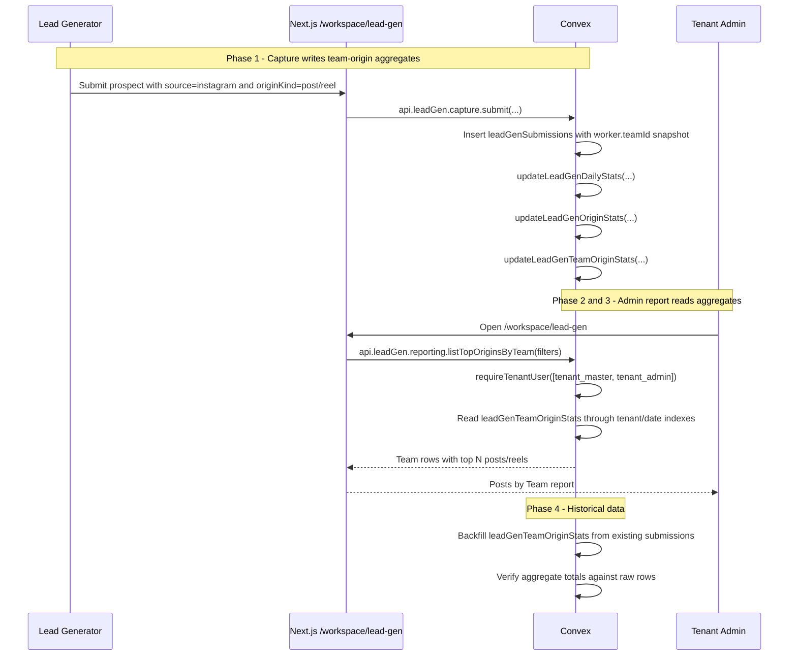

# Lead Gen Top Posts By Team - Design Specification

**Version:** 0.1 (MVP)
**Status:** Draft
**Scope:** `/workspace/lead-gen` currently shows admin-only worker, team, source, and global top-origin reporting. This feature adds an admin-only report that ranks the posts/reels that generated the most lead-gen prospects per team over the selected report range.
**Prerequisite:** Existing Lead Gen Ops module, including `leadGenSubmissions`, `leadGenDailyStats`, `leadGenOriginStats`, worker/team settings, and `/workspace/lead-gen` admin dashboard.

---

## Table of Contents

1. [Goals & Non-Goals](#1-goals--non-goals)
2. [Actors & Roles](#2-actors--roles)
3. [End-to-End Flow Overview](#3-end-to-end-flow-overview)
4. [Phase 1: Team-Origin Aggregate Contract](#4-phase-1-team-origin-aggregate-contract)
5. [Phase 2: Admin Reporting Query](#5-phase-2-admin-reporting-query)
6. [Phase 3: Dashboard UI](#6-phase-3-dashboard-ui)
7. [Phase 4: Backfill, Verification, and Release](#7-phase-4-backfill-verification-and-release)
8. [Data Model](#8-data-model)
9. [Convex Function Architecture](#9-convex-function-architecture)
10. [Routing & Authorization](#10-routing--authorization)
11. [Security Considerations](#11-security-considerations)
12. [Error Handling & Edge Cases](#12-error-handling--edge-cases)
13. [Open Questions](#13-open-questions)
14. [Dependencies](#14-dependencies)
15. [Applicable Skills](#15-applicable-skills)

---

## 1. Goals & Non-Goals

### Goals

- Show tenant owners/admins which rankable Instagram posts/reels generated the most lead-gen prospects for each team.
- Use team assignment captured at submission time, not the worker's current team, so historical reports do not change when workers move teams.
- Rank by unique prospects by default, with raw submissions shown as a secondary volume metric.
- Preserve the existing report filters: business date range, team, worker, and source.
- Keep the route and Convex query admin-only through `lead-gen:view-all` / `tenant_master` / `tenant_admin`.
- Avoid scanning raw submissions for normal dashboard reads by adding a team-origin aggregate table.
- Backfill historical team-origin aggregate rows from existing `leadGenSubmissions` before relying on the report in production.

### Non-Goals

- CRM conversion reporting from lead-gen posts to qualified, booked, or won opportunities. Lead Gen Ops remains operational capture, not CRM funnel attribution.
- Ranking `follower`, `story_poll`, `application`, `source_only`, or Meta Business rows as posts. Only `post` and `reel` are rankable.
- Changing Slack, Calendly, or CRM opportunity attribution.
- Reassigning historical submissions when a worker's current team changes.
- Adding new packages.

---

## 2. Actors & Roles

| Actor | Identity | Auth Method | Key Permissions |
|---|---|---|---|
| Tenant owner | CRM `tenant_master` | WorkOS AuthKit, member of tenant org | View all lead-gen team-origin reports and exports. |
| Tenant admin | CRM `tenant_admin` | WorkOS AuthKit, member of tenant org | View all lead-gen team-origin reports and exports. |
| Lead-gen worker | CRM `lead_generator` | WorkOS AuthKit, member of tenant org | No access to this report. Own capture/activity only. |
| Closer | CRM `closer` | WorkOS AuthKit, member of tenant org | No Lead Gen Ops admin report access. |
| System | Convex mutations/migrations | Internal Convex function execution | Maintains team-origin aggregate rows and backfills historical data. |

### CRM Role Mapping

| CRM `users.role` | WorkOS role slug | Report Access |
|---|---|---|
| `tenant_master` | `owner` | Full |
| `tenant_admin` | `tenant-admin` | Full |
| `lead_generator` | `lead-generator` | None |
| `closer` | `closer` | None |

---

## 3. End-to-End Flow Overview



---

## 4. Phase 1: Team-Origin Aggregate Contract

### 4.1 What Already Exists

The data needed for this report is already captured on every lead-gen submission:

| Field | Table | Meaning |
|---|---|---|
| `teamId` | `leadGenSubmissions` | Snapshot of the worker's team at submission time. |
| `originKind` | `leadGenSubmissions` | `post`, `reel`, `story_poll`, `follower`, `application`, or `source_only`. |
| `originValue` | `leadGenSubmissions` | Normalized post/reel URL or non-rankable label. |
| `originRankable` | `leadGenSubmissions` | True only for reportable post/reel origins. |
| `prospectId` | `leadGenSubmissions` | Dedupe anchor for unique lead-gen prospects. |
| `submittedAt` | `leadGenSubmissions` | Timestamp used to derive Honduras business-day report ranges. |

The current `leadGenOriginStats` table ranks posts/reels globally by tenant/day, but it does not store `teamId`. The existing `listTopOrigins` query can compute a single selected team's top origins by scanning bounded raw submissions when `teamId` is selected. That is useful, but it does not answer "top posts per team" for all teams in one report.

> **Decision:** Add a dedicated `leadGenTeamOriginStats` aggregate instead of relying on raw scans for the default admin dashboard. Raw scans can remain a verification/debug fallback, but the dashboard should read aggregate rows.

### 4.2 Write Contract

Every accepted rankable submission should update three reporting surfaces in the same mutation:

1. `leadGenDailyStats` for worker/team/source totals.
2. `leadGenOriginStats` for global top posts/reels.
3. `leadGenTeamOriginStats` for top posts/reels by team.

```typescript
// Path: convex/leadGen/capture.ts
if (originRankable && origin.originKey && origin.originValue) {
  await updateLeadGenOriginStats(ctx, {
    tenantId: access.tenantId,
    source: args.source,
    originKind: submittedOrigin.originKind,
    originKey: origin.originKey,
    originValue: origin.originValue,
    prospectId: prospect._id,
    submittedAt: now,
  });

  await updateLeadGenTeamOriginStats(ctx, {
    tenantId: access.tenantId,
    teamId: worker.teamId,
    source: args.source,
    originKind: submittedOrigin.originKind,
    originKey: origin.originKey,
    originValue: origin.originValue,
    prospectId: prospect._id,
    submittedAt: now,
  });
}
```

### 4.3 Aggregate Helper

```typescript
// Path: convex/leadGen/aggregates.ts
function teamOriginStatKey(args: {
  dayKey: string;
  teamId?: Id<"attributionTeams">;
  source: LeadGenSource;
  originKey: string;
}) {
  return [
    args.dayKey,
    args.teamId ?? "none",
    args.source,
    args.originKey,
  ].join(":");
}

export async function updateLeadGenTeamOriginStats(
  ctx: MutationCtx,
  args: {
    tenantId: Id<"tenants">;
    teamId?: Id<"attributionTeams">;
    source: LeadGenSource;
    originKind: LeadGenOriginKind;
    originKey: string;
    originValue: string;
    prospectId: Id<"leadGenProspects">;
    submittedAt: number;
  },
) {
  const dayKey = timestampToBusinessDateKey(args.submittedAt);
  const statKey = teamOriginStatKey({
    dayKey,
    teamId: args.teamId,
    source: args.source,
    originKey: args.originKey,
  });

  const existing = await ctx.db
    .query("leadGenTeamOriginStats")
    .withIndex("by_tenantId_and_statKey", (q) =>
      q.eq("tenantId", args.tenantId).eq("statKey", statKey),
    )
    .unique();

  const isUniqueForTeamOriginDay =
    await isFirstActiveProspectSubmissionForTeamOriginDay(ctx, args);

  if (existing) {
    await ctx.db.patch(existing._id, {
      submissions: existing.submissions + 1,
      uniqueProspectsSubmitted:
        existing.uniqueProspectsSubmitted +
        (isUniqueForTeamOriginDay ? 1 : 0),
      updatedAt: Date.now(),
    });
    return existing._id;
  }

  return await ctx.db.insert("leadGenTeamOriginStats", {
    tenantId: args.tenantId,
    statKey,
    dayKey,
    teamId: args.teamId,
    source: args.source,
    originKind: args.originKind,
    originKey: args.originKey,
    originValue: args.originValue,
    submissions: 1,
    uniqueProspectsSubmitted: isUniqueForTeamOriginDay ? 1 : 0,
    updatedAt: Date.now(),
  });
}
```

> **Metric decision:** Rank by `uniqueProspectsSubmitted` first because "generated the most leads" should not reward repeated duplicate submissions against the same prospect. Show `submissions` beside it so admins can still see raw activity volume.

### 4.4 Correction Contract

Voiding a submission currently reverses daily/global-origin counters. It must also reverse the matching team-origin counter.

```typescript
// Path: convex/leadGen/aggregates.ts
await patchTeamOriginStatCounters(ctx, {
  submission: args.submission,
  originKey,
  submissionsDelta: -1,
  uniqueProspectsDelta: currentOwnsUniqueOriginCredit ? -1 : 0,
});
```

If the voided row owned the unique credit and there is another active same-day row for the same prospect/team/origin, transfer the unique credit to the next active row's team-origin bucket. This mirrors the existing daily/global-origin correction pattern.

---

## 5. Phase 2: Admin Reporting Query

### 5.1 Query Shape

Add a query that returns team groups with each team's top N rankable origins.

```typescript
// Path: convex/leadGen/reporting.ts
export const listTopOriginsByTeam = query({
  args: {
    startDayKey: v.string(),
    endDayKey: v.string(),
    teamId: v.optional(v.id("attributionTeams")),
    workerId: v.optional(v.id("leadGenWorkers")),
    source: v.optional(leadGenSourceValidator),
    limitPerTeam: v.optional(v.number()),
  },
  handler: async (ctx, args) => {
    const { tenantId } = await requireTenantUser(ctx, [
      "tenant_master",
      "tenant_admin",
    ]);

    validateDayRange(args);
    await validateFilterIds(ctx, { tenantId, ...args });

    const limitPerTeam = normalizeLimit(args.limitPerTeam, 10);

    if (args.workerId) {
      return await listTopOriginsByTeamFromBoundedSubmissions(ctx, {
        tenantId,
        ...args,
        limitPerTeam,
      });
    }

    const rows = await readTeamOriginStatRows(ctx, {
      tenantId,
      ...args,
      limit: TEAM_ORIGIN_STATS_READ_LIMIT,
    });

    return await groupTeamOriginRows(ctx, {
      tenantId,
      rows,
      limitPerTeam,
    });
  },
});
```

### 5.2 Return DTO

```typescript
// Path: convex/leadGen/reporting.ts
type TopOriginsByTeamRow = {
  teamId: Id<"attributionTeams"> | null;
  teamName: string;
  isActive: boolean | null;
  totalUniqueProspects: number;
  totalSubmissions: number;
  origins: Array<{
    originKey: string;
    source: LeadGenSource;
    originKind: "post" | "reel";
    originValue: string;
    uniqueProspects: number;
    submissions: number;
    dayCount: number;
  }>;
};
```

### 5.3 Worker Filter Fallback

`leadGenTeamOriginStats` is grouped by team, not worker. If the admin filters by `workerId`, compute the report from bounded raw `leadGenSubmissions` for that worker. The existing code already uses this pattern in `listTopOrigins`.

> **Runtime decision:** Do not add worker dimension to the aggregate for MVP. The user asked for posts per team. Worker filtering is less common, and the existing bounded raw-submission path is sufficient for a narrowed worker report.

---

## 6. Phase 3: Dashboard UI

### 6.1 Placement

Add a new admin-only report card to `/workspace/lead-gen`, preferably below the existing team/source/worker tabs:

- Existing `TopOriginsTable`: "Top Posts & Reels" for the current global or selected filter.
- New `TopOriginsByTeamTable`: "Top Posts by Team" showing each team and its top posts/reels.

If the page gets crowded, add a fourth tab named `Posts by Team` beside `Workers`, `Teams`, and `Sources`.

```tsx
// Path: app/workspace/lead-gen/_components/lead-gen-admin-page-client.tsx
const topOriginsByTeam = useQuery(
  api.leadGen.reporting.listTopOriginsByTeam,
  {
    ...filters,
    limitPerTeam: 3,
  },
);

<TopOriginsByTeamTable rows={topOriginsByTeam} />;
```

### 6.2 Component Contract

```tsx
// Path: app/workspace/lead-gen/_components/top-origins-by-team-table.tsx
type TopOriginsByTeamRow = {
  teamId: string | null;
  teamName: string;
  totalUniqueProspects: number;
  totalSubmissions: number;
  origins: Array<{
    originKey: string;
    originKind: "post" | "reel";
    originValue: string;
    uniqueProspects: number;
    submissions: number;
  }>;
};
```

Recommended columns:

| Column | Purpose |
|---|---|
| Team | Team name, with "Unassigned" for submissions without `teamId`. |
| #1 Post/Reel | Best-performing origin link for that team. |
| Leads | Unique prospects from that origin. |
| Subs | Raw submissions from that origin. |
| Other top posts | Compact list of the next 2 ranked origins. |

### 6.3 Empty and Loading States

- Loading: fixed-height skeleton matching the table height.
- Empty: "No rankable posts or reels match these filters."
- Range too large: Convex query throws "Posts by team report is too large. Narrow the filters." The UI should render the existing error boundary or table-level empty/error state.

---

## 7. Phase 4: Backfill, Verification, and Release

### 7.1 Migration Strategy

This is a safe schema expansion plus a historical aggregate backfill:

1. Deploy schema with new `leadGenTeamOriginStats` table.
2. Deploy write path so new rankable submissions dual-write global and team-origin aggregates.
3. Run a dry-run verification over existing submissions.
4. Backfill historical `leadGenTeamOriginStats` from non-voided rankable `leadGenSubmissions`.
5. Verify aggregate totals against raw grouped submissions for the same date range.
6. Enable the UI card.

> **Migration decision:** Adding a new table does not require widen-migrate-narrow for Convex schema validation. Historical report correctness does require a data backfill. Because this app currently has one test tenant on production, a bounded day-range rebuild internal mutation is acceptable if the existing submission volume is under the configured guard. If volume exceeds the guard, use the installed `@convex-dev/migrations` component and batch by `leadGenSubmissions`.

### 7.2 Backfill Helper

Use an idempotent rebuild by day range: delete existing team-origin stat rows for the range, rebuild from raw submissions, then write aggregate rows. This avoids double-counting if the backfill is rerun.

```typescript
// Path: convex/leadGen/backfills.ts
export const rebuildTeamOriginStatsRange = mutation({
  args: {
    startDayKey: v.string(),
    endDayKey: v.string(),
    dryRun: v.boolean(),
  },
  handler: async (ctx, args) => {
    const { tenantId } = await requireTenantUser(ctx, [
      "tenant_master",
      "tenant_admin",
    ]);

    validateDayRange(args);

    const existing = await ctx.db
      .query("leadGenTeamOriginStats")
      .withIndex("by_tenantId_and_dayKey", (q) =>
        q
          .eq("tenantId", tenantId)
          .gte("dayKey", args.startDayKey)
          .lte("dayKey", args.endDayKey),
      )
      .take(TEAM_ORIGIN_REBUILD_LIMIT + 1);

    if (existing.length > TEAM_ORIGIN_REBUILD_LIMIT) {
      throw new Error("Team-origin rebuild range is too large");
    }

    const submissions = await readRankableSubmissionsForRange(ctx, {
      tenantId,
      startDayKey: args.startDayKey,
      endDayKey: args.endDayKey,
    });

    const rebuiltRows = groupSubmissionsIntoTeamOriginStats(submissions);

    if (!args.dryRun) {
      for (const row of existing) await ctx.db.delete(row._id);
      for (const row of rebuiltRows) {
        await ctx.db.insert("leadGenTeamOriginStats", row);
      }
    }

    return {
      dryRun: args.dryRun,
      deletedRows: existing.length,
      insertedRows: rebuiltRows.length,
      sourceSubmissions: submissions.length,
    };
  },
});
```

### 7.3 Verification

Add a query that compares raw grouped rows to aggregate grouped rows for a bounded range.

```typescript
// Path: convex/leadGen/reconciliation.ts
export const auditTeamOriginStatsRange = query({
  args: {
    startDayKey: v.string(),
    endDayKey: v.string(),
  },
  handler: async (ctx, args) => {
    const { tenantId } = await requireTenantUser(ctx, [
      "tenant_master",
      "tenant_admin",
    ]);

    const raw = await groupRawTeamOriginSubmissions(ctx, {
      tenantId,
      ...args,
    });
    const aggregate = await groupTeamOriginStats(ctx, {
      tenantId,
      ...args,
    });

    return diffTeamOriginGroups(raw, aggregate);
  },
});
```

Release gate: diff count must be zero for the default 7-day range and for the full production historical range that will be shown in the dashboard.

---

## 8. Data Model

### 8.1 New: `leadGenTeamOriginStats`

```typescript
// Path: convex/schema.ts
leadGenTeamOriginStats: defineTable({
  tenantId: v.id("tenants"),
  statKey: v.string(), // `${dayKey}:${teamId ?? "none"}:${source}:${originKey}`
  dayKey: v.string(),
  teamId: v.optional(v.id("attributionTeams")),
  source: leadGenSourceValidator,
  originKind: leadGenOriginKindValidator,
  originKey: v.string(),
  originValue: v.string(),
  submissions: v.number(),
  uniqueProspectsSubmitted: v.number(),
  updatedAt: v.number(),
})
  .index("by_tenantId_and_statKey", ["tenantId", "statKey"])
  .index("by_tenantId_and_dayKey", ["tenantId", "dayKey"])
  .index("by_tenantId_and_teamId_and_dayKey", [
    "tenantId",
    "teamId",
    "dayKey",
  ])
  .index("by_tenantId_and_source_and_dayKey", [
    "tenantId",
    "source",
    "dayKey",
  ])
  .index("by_tenantId_and_teamId_and_source_and_dayKey", [
    "tenantId",
    "teamId",
    "source",
    "dayKey",
  ]),
```

### 8.2 Existing Tables Used

| Table | Usage |
|---|---|
| `leadGenSubmissions` | Historical backfill, worker-filter fallback, verification. |
| `leadGenWorkers` | Worker display and current worker metadata, not historical team attribution. |
| `attributionTeams` | Shared DM team registry and team display names. |
| `leadGenOriginStats` | Existing global top posts/reels report. |

---

## 9. Convex Function Architecture

```
convex/
├── leadGen/
│   ├── aggregates.ts       # MODIFIED: add team-origin aggregate helper and correction deltas
│   ├── capture.ts          # MODIFIED: dual-write team-origin stats for rankable submissions
│   ├── reporting.ts        # MODIFIED: add listTopOriginsByTeam query
│   ├── backfills.ts        # MODIFIED: add bounded team-origin rebuild helper
│   ├── reconciliation.ts   # MODIFIED: add team-origin aggregate audit query
│   └── normalization.ts    # EXISTING: source of truth for originKey/originValue
└── schema.ts               # MODIFIED: add leadGenTeamOriginStats table
```

---

## 10. Routing & Authorization

### Route Structure

```
app/workspace/lead-gen/
├── page.tsx
└── _components/
    ├── lead-gen-admin-page-client.tsx
    ├── top-origins-table.tsx
    └── top-origins-by-team-table.tsx      # NEW
```

### Server Gate

`/workspace/lead-gen/page.tsx` already enforces admin-only access:

```typescript
// Path: app/workspace/lead-gen/page.tsx
export default async function LeadGenAdminPage() {
  await requirePermission("lead-gen:view-all");

  return (
    <Suspense fallback={<LeadGenAdminSkeleton />}>
      <LeadGenAdminPageClient />
    </Suspense>
  );
}
```

### Convex Gate

The new query must also enforce admin-only access:

```typescript
// Path: convex/leadGen/reporting.ts
const { tenantId } = await requireTenantUser(ctx, [
  "tenant_master",
  "tenant_admin",
]);
```

---

## 11. Security Considerations

### 11.1 Credential Security

No new credentials or external services are required.

### 11.2 Multi-Tenant Isolation

Every read and write uses `tenantId` derived from `requireTenantUser()`. The client never supplies `tenantId`.

### 11.3 Role-Based Data Access

| Data Resource | `tenant_master` | `tenant_admin` | `lead_generator` | `closer` |
|---|---:|---:|---:|---:|
| Team-origin report | Full | Full | None | None |
| Team-origin aggregate writes | System | System | System via capture only | None |
| Backfill/reconciliation helpers | Full | Full | None | None |
| Raw submissions used for fallback | Full | Full | Own only through existing activity route | None |

### 11.4 Webhook Security

Not applicable. This feature does not add or change webhooks.

### 11.5 Rate Limit Awareness

No external APIs are called. Convex read limits are enforced with bounded date ranges and explicit row caps.

---

## 12. Error Handling & Edge Cases

### 12.1 No Team Assigned

| Scenario | Detection | Recovery | User Behavior |
|---|---|---|---|
| Submission has no `teamId` | `teamId === undefined` | Group under `Unassigned` | Admin can see unassigned volume and fix worker config. |

### 12.2 Worker Moved Teams

| Scenario | Detection | Recovery | User Behavior |
|---|---|---|---|
| Worker is assigned to a new team after old submissions | Submission has historical `teamId` snapshot | Keep historical bucket unchanged | Report remains historically stable. |

### 12.3 Report Range Too Large

| Scenario | Detection | Recovery | User Behavior |
|---|---|---|---|
| Aggregate rows exceed read cap | Read `limit + 1` rows | Throw narrow-filter error | Admin narrows date/source/team filter. |

### 12.4 Existing Historical Data Missing Aggregates

| Scenario | Detection | Recovery | User Behavior |
|---|---|---|---|
| New table is empty for old submissions | Reconciliation diff shows missing aggregate rows | Run backfill/rebuild | UI should not be enabled for historical ranges until verified. |

### 12.5 Voided Submission

| Scenario | Detection | Recovery | User Behavior |
|---|---|---|---|
| Admin voids a rankable submission | `applyLeadGenAggregateDelta` path | Reverse team-origin counters and transfer unique credit if needed | Report updates reactively. |

---

## 13. Open Questions

| # | Question | Current Thinking |
|---|---|---|
| 1 | Should ranking sort by unique prospects or submissions? | Recommend unique prospects first, submissions second, because the user asked which posts generated the most leads. |
| 2 | Should this be a new tab or a standalone card? | Recommend a new `Posts by Team` tab if the dashboard feels crowded; otherwise a card below team performance is faster. |
| 3 | Should exports include posts by team? | Defer until the UI report is validated. Existing raw export already contains source/origin/team fields. |
| 4 | Should worker-filtered team-origin reports get their own aggregate? | No for MVP. Use bounded raw submissions when `workerId` is selected. |

---

## 14. Dependencies

### New Packages

| Package | Why | Runtime | Install |
|---|---|---|---|
| None | Existing Convex/Next/shadcn stack is sufficient. | N/A | N/A |

### Already Installed

| Package | Used For |
|---|---|
| `convex` | Queries, mutations, schema, indexes. |
| `@convex-dev/migrations` | Available if the historical backfill exceeds bounded rebuild assumptions. |
| `lucide-react` | Optional UI icons in report actions. |
| `shadcn` primitives | Cards, tables, badges, skeletons, empty states. |

### Environment Variables

| Variable | Where Set | Used By |
|---|---|---|
| None | N/A | N/A |

---

## 15. Applicable Skills

| Skill | When to Invoke | Phase(s) |
|---|---|---|
| `convex` | Aggregate table, query, mutation, schema, and auth guard implementation. | 1, 2, 4 |
| `convex-migration-helper` | Backfill/rebuild strategy and production rollout checks. | 4 |
| `next-best-practices` | Next.js App Router client boundary and dashboard route integration. | 3 |
| `vercel-react-best-practices` | Avoid dashboard waterfalls and excessive re-rendering. | 3 |
| `shadcn` | Table/card/empty/skeleton UI composition. | 3 |
| `frontend-design` | Dense admin reporting UI layout. | 3 |
| `web-design-guidelines` | Accessible table labels, link affordances, and responsive overflow checks. | 3 |

